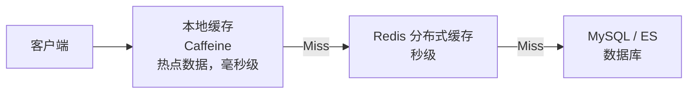

<!-- nav-start -->

---

[⬅️ 上一篇：权限与安全设计](06-权限与安全设计.md) | [🏠 返回目录](../README.md) | 下一篇：无 ➡️

<!-- nav-end -->

# 性能优化与踩坑

---

## 1. 缓存策略设计

### 1.1 缓存分层



| 缓存层 | 技术 | 适用场景 | TTL |
|--------|------|---------|-----|
| 本地缓存 | Caffeine | 热门问题详情、标签列表等极热数据 | 30 秒 |
| 分布式缓存 | Redis | 问题列表、用户信息、计数器 | 5 分钟 ~ 1 小时 |
| 数据库 | MySQL | 持久化存储，缓存穿透兜底 | — |

### 1.2 缓存 Key 设计规范

```
格式：{业务模块}:{数据类型}:{唯一标识}[:{维度}]

示例：
  question:detail:1001          → 问题详情
  question:list:circle:5:page:1 → 圈子5的第1页问题列表
  user:info:2001                → 用户信息
  hot:questions:global          → 全站热门问题排行
  notification:unread:2001      → 用户2001的未读通知数
```

### 1.3 缓存更新策略

| 场景 | 策略 | 原因 |
|------|------|------|
| 问题详情 | Cache-Aside（旁路缓存） | 读多写少，写时删除缓存，下次读时重建 |
| 计数器（点赞/浏览量） | Write-Through（直写缓存） | 实时性要求高，Redis 作为主存储 |
| 热门排行榜 | 定时刷新 | 允许秒级延迟，定时任务全量重算 |
| 用户信息 | Cache-Aside + 短 TTL | 变更不频繁，TTL 兜底保证最终一致 |

---

## 2. 数据库优化

### 2.1 关键索引设计

```sql
-- 问题表：按圈子/标签查询 + 时间排序
ALTER TABLE question ADD INDEX idx_circle_status_time (circle_id, status, created_at DESC);
ALTER TABLE question ADD INDEX idx_user_status (user_id, status);

-- 评论表：按目标内容查询（最常用的查询路径）
ALTER TABLE comment ADD INDEX idx_target_root (target_id, target_type, root_id);

-- 用户行为表：查询用户是否已点赞
-- UNIQUE KEY uk_user_target_action 已覆盖此查询

-- 通知表：查询用户未读通知
ALTER TABLE notification ADD INDEX idx_user_read_time (user_id, is_read, create_time DESC);
```

### 2.2 分页优化（深翻页问题）

问题列表深翻页时，`LIMIT 10000, 20` 会扫描大量数据：

```sql
-- ❌ 慢查询：深翻页
SELECT * FROM question WHERE circle_id = 1 AND status = 1
ORDER BY created_at DESC LIMIT 10000, 20;

-- ✅ 优化：游标分页（基于上一页最后一条记录的 created_at）
SELECT * FROM question
WHERE circle_id = 1 AND status = 1
  AND created_at < '2024-01-01 10:00:00'  -- 上一页最后一条的时间
ORDER BY created_at DESC LIMIT 20;
```

### 2.3 大字段分离

问题内容（`content`）是 TEXT 类型，查询列表时不需要加载内容字段，避免大字段拖慢查询：

```sql
-- 列表查询：只查元数据，不查 content
SELECT id, title, user_id, view_count, like_count, answer_count, created_at
FROM question WHERE circle_id = ? AND status = 1 ORDER BY created_at DESC LIMIT 20;

-- 详情查询：才加载完整内容
SELECT * FROM question WHERE id = ?;
```

---

## 3. 踩坑记录

### 坑 1：浏览量统计丢失（Redis 数据未持久化）

**现象**：服务重启后，部分问题的浏览量回退到几小时前的数值。

**原因**：浏览量增量存在 Redis 中，定时任务每 5 分钟持久化到 MySQL。服务重启时，Redis 中尚未持久化的增量数据丢失。

**解决方案**：
1. Redis 开启 AOF 持久化，减少数据丢失窗口
2. 监听 Spring 关闭事件，服务停止前主动刷盘

```java
@EventListener(ContextClosedEvent.class)
public void onShutdown() {
    log.info("服务关闭，开始持久化浏览量数据...");
    viewCountService.flushAllToDatabase();
}
```

---

### 坑 2：点赞数出现负数

**现象**：数据库中某些问题的 `like_count` 出现了负数。

**原因**：取消点赞时直接执行 `like_count - 1`，没有校验当前值是否大于 0。在数据不一致的极端情况下会产生负数。

**解决方案**：

```sql
-- ✅ 加 > 0 的条件保护
UPDATE question SET like_count = like_count - 1
WHERE id = ? AND like_count > 0;
```

Redis 层同样加保护：
```java
Long result = redisTemplate.opsForValue().decrement("question:like:count:" + questionId);
if (result != null && result < 0) {
    redisTemplate.opsForValue().set("question:like:count:" + questionId, 0L);
}
```

---

### 坑 3：ES 搜索结果包含已删除的问题

**现象**：问题被删除后，搜索结果中仍然能搜到。

**原因**：删除问题时，Kafka 消息发送失败（网络抖动），搜索服务未收到删除事件，ES 文档未被删除。

**解决方案**：
1. Kafka 生产者开启重试（`retries: 3`）
2. 本地消息表兜底，保证消息最终发出
3. 定期对账任务，每天凌晨扫描差异并补偿

```java
@Scheduled(cron = "0 0 2 * * ?")
public void reconcile() {
    List<Long> deletedIds = questionMapper.selectRecentDeletedIds(7);
    for (Long id : deletedIds) {
        if (esClient.exists("questions", id.toString())) {
            esClient.delete("questions", id.toString());
            log.warn("对账：删除 ES 孤立文档，questionId={}", id);
        }
    }
}
```

---

### 坑 4：圈子热门问题 Redis Key 过多，内存膨胀

**现象**：随着圈子数量增加，Redis 中 `hot:questions:circle:*` 的 Key 越来越多，内存持续增长。

**原因**：每个圈子都有独立的 ZSet，且没有设置过期时间。

**解决方案**：
1. 设置 7 天过期时间，定时任务每天刷新
2. 限制 ZSet 大小，每个圈子只保留 Top 100

```java
redisTemplate.opsForZSet().add("hot:questions:circle:" + circleId, questionId, score);
redisTemplate.opsForZSet().removeRange("hot:questions:circle:" + circleId, 0, -101);
redisTemplate.expire("hot:questions:circle:" + circleId, Duration.ofDays(7));
```

---

### 坑 5：@用户通知重复发送

**现象**：用户编辑问题时，如果内容中有 @某人，该用户会收到重复通知。

**原因**：每次编辑保存都重新解析 @ 列表并发送通知，没有区分"新增的 @"和"已有的 @"。

**解决方案**：编辑时对比新旧内容的 @ 用户列表，只对**新增的 @** 发送通知：

```java
public void updateQuestion(Long questionId, String newContent) {
    Question old = questionMapper.selectById(questionId);
    Set<Long> oldMentions = parseMentions(old.getContent());
    Set<Long> newMentions = parseMentions(newContent);

    Set<Long> addedMentions = new HashSet<>(newMentions);
    addedMentions.removeAll(oldMentions);  // 只取新增的 @

    if (!addedMentions.isEmpty()) {
        kafkaTemplate.send("mention-events", new MentionEvent(questionId, addedMentions));
    }
}
```

---

### 坑 6：微服务间调用超时导致雪崩

**现象**：ES 服务响应变慢时，搜索服务的线程池被打满，进而导致网关也无法响应，整个系统不可用。

**原因**：没有配置服务间调用的超时和熔断，一个服务慢导致调用方线程全部阻塞。

**解决方案**：
1. 配置 Feign 超时（连接 1s，读取 3s）
2. 引入 Sentinel 熔断降级，ES 不可用时返回降级结果
3. 线程池隔离，搜索服务使用独立线程池

```yaml
feign:
  client:
    config:
      search-service:
        connect-timeout: 1000
        read-timeout: 3000
```

```java
@FeignClient(name = "search-service", fallback = SearchServiceFallback.class)
public interface SearchServiceClient {
    @GetMapping("/search")
    Result<Page<QuestionVO>> search(@RequestParam String keyword);
}

@Component
public class SearchServiceFallback implements SearchServiceClient {
    @Override
    public Result<Page<QuestionVO>> search(String keyword) {
        return Result.fail("搜索服务暂时不可用，请稍后重试");
    }
}
```

---

## 4. 踩坑总结

| 坑 | 根本原因 | 核心解法 |
|----|---------|---------|
| 浏览量丢失 | Redis 数据未持久化 | 优雅关闭主动刷盘 + AOF 持久化 |
| 点赞数负数 | 缺少边界校验 | SQL 加 `> 0` 条件 + Redis 层修正 |
| ES 数据不一致 | 消息丢失 | 本地消息表 + 定期对账 |
| Redis 内存膨胀 | Key 无过期 + 无大小限制 | 设置 TTL + ZSet 裁剪 |
| 通知重复发送 | 未做差量计算 | 新旧内容 diff，只通知新增 @ |
| 服务雪崩 | 无超时无熔断 | Feign 超时 + Sentinel 熔断 |

<!-- nav-start -->

---

[⬅️ 上一篇：权限与安全设计](06-权限与安全设计.md) | [🏠 返回目录](../README.md) | 下一篇：无 ➡️

<!-- nav-end -->
