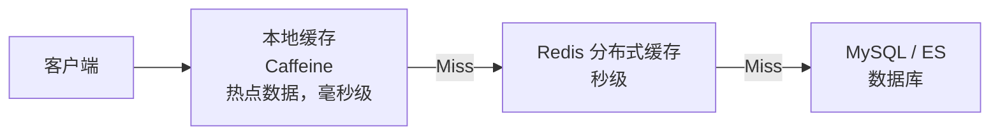
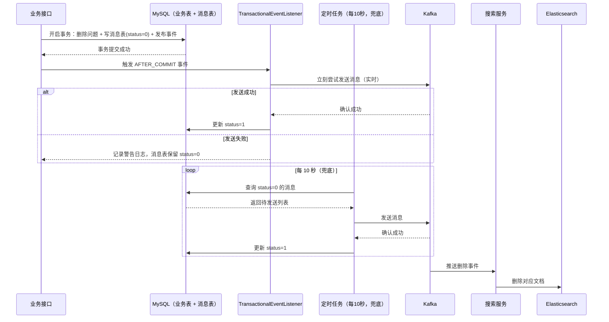

<!-- nav-start -->

---

[⬅️ 上一篇：权限与安全设计](06-权限与安全设计.md) | [🏠 返回目录](../README.md) | 下一篇：无 ➡️

<!-- nav-end -->

# 性能优化与踩坑

---

## 1. 缓存策略设计

### 1.1 缓存分层



| 缓存层 | 技术 | 适用场景 | TTL |
|--------|------|---------|-----|
| 本地缓存 | Caffeine | 热门问题详情、标签列表等极热数据 | 30 秒 |
| 分布式缓存 | Redis | 问题列表、用户信息、计数器 | 5 分钟 ~ 1 小时 |
| 数据库 | MySQL | 持久化存储，缓存穿透兜底 | — |

### 1.2 缓存 Key 设计规范

```
格式：{业务模块}:{数据类型}:{唯一标识}[:{维度}]

示例：
  question:detail:1001          → 问题详情
  question:list:circle:5:page:1 → 圈子5的第1页问题列表
  user:info:2001                → 用户信息
  hot:questions:global          → 全站热门问题排行
  notification:unread:2001      → 用户2001的未读通知数
```

### 1.3 缓存更新策略

| 场景 | 策略 | 原因 |
|------|------|------|
| 问题详情 | Cache-Aside（旁路缓存） | 读多写少，写时删除缓存，下次读时重建 |
| 计数器（点赞/浏览量） | Write-Through（直写缓存） | 实时性要求高，Redis 作为主存储 |
| 热门排行榜 | 定时刷新 | 允许秒级延迟，定时任务全量重算 |
| 用户信息 | Cache-Aside + 短 TTL | 变更不频繁，TTL 兜底保证最终一致 |

---

## 2. 数据库优化

### 2.1 关键索引设计

```sql
-- 问题表：按圈子/标签查询 + 时间排序
ALTER TABLE question ADD INDEX idx_circle_status_time (circle_id, status, created_at DESC);
ALTER TABLE question ADD INDEX idx_user_status (user_id, status);

-- 评论表：按目标内容查询（最常用的查询路径）
ALTER TABLE comment ADD INDEX idx_target_root (target_id, target_type, root_id);

-- 用户行为表：查询用户是否已点赞
-- UNIQUE KEY uk_user_target_action 已覆盖此查询

-- 通知表：查询用户未读通知
ALTER TABLE notification ADD INDEX idx_user_read_time (user_id, is_read, create_time DESC);
```

### 2.2 分页优化（深翻页问题）

问题列表深翻页时，`LIMIT 10000, 20` 会扫描大量数据：

```sql
-- ❌ 慢查询：深翻页
SELECT * FROM question WHERE circle_id = 1 AND status = 1
ORDER BY created_at DESC LIMIT 10000, 20;

-- ✅ 优化：游标分页（基于上一页最后一条记录的 created_at）
SELECT * FROM question
WHERE circle_id = 1 AND status = 1
  AND created_at < '2024-01-01 10:00:00'  -- 上一页最后一条的时间
ORDER BY created_at DESC LIMIT 20;
```

### 2.3 大字段分离

问题内容（`content`）是 TEXT 类型，查询列表时不需要加载内容字段，避免大字段拖慢查询：

```sql
-- 列表查询：只查元数据，不查 content
SELECT id, title, user_id, view_count, like_count, answer_count, created_at
FROM question WHERE circle_id = ? AND status = 1 ORDER BY created_at DESC LIMIT 20;

-- 详情查询：才加载完整内容
SELECT * FROM question WHERE id = ?;
```

---

## 3. 踩坑记录

### 坑 1：浏览量统计丢失（Redis 数据未持久化）

**现象**：服务重启后，部分问题的浏览量回退到几小时前的数值。

**原因**：浏览量增量存在 Redis 中，定时任务每 5 分钟持久化到 MySQL。服务重启时，Redis 中尚未持久化的增量数据丢失。

**解决方案**：
1. Redis 开启 AOF 持久化，减少数据丢失窗口
2. 监听 Spring 关闭事件，服务停止前主动刷盘

```java
@EventListener(ContextClosedEvent.class)
public void onShutdown() {
    log.info("服务关闭，开始持久化浏览量数据...");
    viewCountService.flushAllToDatabase();
}
```

**Redis 持久化配置（redis.conf）**：

```properties
# ===== AOF 配置（推荐开启，数据更完整）=====
appendonly yes
appendfilename "appendonly.aof"
# everysec：每秒刷盘一次，最多丢失 1 秒数据（推荐）
# always：每次写命令都刷盘，最安全但性能差
# no：由 OS 决定，性能最好但可能丢失较多数据
appendfsync everysec
# AOF 重写期间不刷盘，避免 IO 阻塞
no-appendfsync-on-rewrite yes
# AOF 文件超过 64MB 且比上次重写增长 100% 时，触发自动重写压缩
auto-aof-rewrite-min-size 64mb
auto-aof-rewrite-percentage 100

# ===== RDB 配置（同时开启，作为快速恢复的兜底备份）=====
# 900秒内有1次写 / 300秒内有10次写 / 60秒内有10000次写，触发快照
save 900 1
save 300 10
save 60 10000
dbfilename dump.rdb
dir /var/lib/redis
stop-writes-on-bgsave-error yes
rdbcompression yes
```

**重启后是否需要手动加载？不需要，Redis 重启时自动加载，无需任何手动操作。** 加载优先级如下：

```
AOF 开启（appendonly=yes）→ 优先加载 AOF 文件（数据更完整）
AOF 未开启              → 加载 RDB 文件（dump.rdb）
两者都不存在            → 空数据启动
```

> **本项目建议**：AOF `everysec` + RDB 双开。AOF 保证数据完整性（最多丢 1 秒），RDB 作为快速恢复的备份，配合优雅关闭主动刷盘，基本可以做到浏览量**零丢失**。

---

### 坑 2：点赞数出现负数

**现象**：数据库中某些问题的 `like_count` 出现了负数。

**原因**：根本原因是 `user_action`（用户行为表）和 `like_count` 计数字段存在数据不一致，取消点赞时没有先校验用户是否真的点过赞，直接执行 `like_count - 1`，在极端情况下导致负数。

**错误的修复思路（治标不治本）**：

```sql
-- ❌ 只是截断负数，没有解决根本问题
UPDATE question SET like_count = like_count - 1
WHERE id = ? AND like_count > 0;
```

```java
// ❌ Redis 层减完再修正：decrement 和 set 之间不是原子操作
// 高并发下可能把其他线程正常 increment 的结果覆盖掉
Long result = redisTemplate.opsForValue().decrement("question:like:count:" + questionId);
if (result != null && result < 0) {
    redisTemplate.opsForValue().set("question:like:count:" + questionId, 0L);
}
```

**正确解决方案**：

**① 数据模型层：`user_action` 表加唯一约束，从根源防止重复操作**

```sql
-- 唯一约束：同一用户对同一目标的同一行为只能有一条记录
ALTER TABLE user_action ADD UNIQUE KEY uk_user_target_action
    (user_id, target_id, target_type, action_type);
```

**② 业务层：前置校验，先确认用户真的点过赞再减计数**

```java
public void cancelLike(Long userId, Long questionId) {
    // 先查用户行为表，确认用户真的点过赞
    int deleted = userActionMapper.deleteByUserAndTarget(
        userId, questionId, ActionType.LIKE
    );
    if (deleted == 0) {
        // 没有删除任何记录，说明用户根本没点过赞，直接返回
        return;
    }
    // 真的删除了行为记录，才减计数
    questionMapper.decrementLikeCount(questionId);
    // Redis 同步
    safeDecrement("question:like:count:" + questionId);
}
```

**③ Redis 层：用 Lua 脚本保证原子性**

```java
// Lua 脚本：原子性地"只有大于 0 才减，否则返回 0"
private static final String DECR_IF_POSITIVE_SCRIPT =
    "local val = tonumber(redis.call('GET', KEYS[1])) " +
    "if val and val > 0 then return redis.call('DECR', KEYS[1]) " +
    "else return 0 end";

public void safeDecrement(String key) {
    redisTemplate.execute(
        new DefaultRedisScript<>(DECR_IF_POSITIVE_SCRIPT, Long.class),
        Collections.singletonList(key)
    );
}
```

**④ SQL 层：`> 0` 条件作为最后兜底**

```sql
-- 兜底保护，防止极端情况下出现负数
UPDATE question SET like_count = like_count - 1
WHERE id = ? AND like_count > 0;
```

**方案对比**：

| 方案 | 解决根本问题 | 并发安全 | 说明 |
|------|------------|---------|------|
| SQL `> 0` 截断 | ❌ 治标 | ✅ | 只是截断，数据仍不一致 |
| Redis 减完再 set | ❌ 治标 | ❌ 有竞态 | 两步操作非原子，高并发有问题 |
| 唯一约束 + 行数判断 | ✅ 治本 | ✅ | 从数据模型层面杜绝重复操作 |
| Lua 原子脚本 | ✅（Redis 层） | ✅ 原子 | 保证 Redis 操作原子性 |

> **推荐组合**：唯一约束（防重复）+ 业务层前置校验（治本）+ Lua 脚本（Redis 原子性）+ SQL `> 0`（最终兜底）。

---

### 坑 3：ES 搜索结果包含已删除的问题

**现象**：问题被删除后，搜索结果中仍然能搜到。

**原因**：删除问题时，Kafka 消息发送失败（网络抖动），搜索服务未收到删除事件，ES 文档未被删除。

**解决方案**：三层保障——Kafka 重试 + 本地消息表兜底 + 定期对账。

---

#### ① Kafka 生产者重试配置

配置在 `application.yml` 的 Kafka 生产者部分：

```yaml
spring:
  kafka:
    producer:
      # 发送失败最多重试 3 次
      retries: 3
      # 重试间隔（需配合 retry.backoff.ms，单位毫秒）
      properties:
        retry.backoff.ms: 300
      # 所有副本确认才算成功，防止 leader 切换时消息丢失
      acks: all
      # 开启幂等性，防止重试导致重复消息
      enable-idempotence: true
```

> **注意**：`retries: 3` 只能解决短暂网络抖动，如果 Kafka Broker 宕机时间较长，重试耗尽后消息仍会丢失，所以还需要本地消息表兜底。

---

#### ② 本地消息表设计

在**业务服务的数据库**中新建一张消息表，与业务操作在**同一个本地事务**中写入，彻底避免"业务成功但消息没发出去"的问题：

```sql
CREATE TABLE outbox_message (
    id          BIGINT PRIMARY KEY AUTO_INCREMENT,
    topic       VARCHAR(128)  NOT NULL COMMENT 'Kafka Topic',
    message_key VARCHAR(128)  COMMENT '消息 Key（用于分区路由）',
    payload     TEXT          NOT NULL COMMENT '消息体 JSON',
    status      TINYINT       NOT NULL DEFAULT 0
                              COMMENT '0=待发送 1=已发送 2=发送失败',
    retry_count INT           NOT NULL DEFAULT 0 COMMENT '已重试次数',
    create_time DATETIME      NOT NULL DEFAULT CURRENT_TIMESTAMP,
    send_time   DATETIME      COMMENT '实际发送成功时间',
    INDEX idx_status_create (status, create_time)
) COMMENT='本地消息表（Outbox 模式）';
```

**业务代码：删除问题时，在同一事务内写消息表**

```java
@Transactional
public void deleteQuestion(Long questionId) {
    // 1. 业务操作：逻辑删除问题
    questionMapper.softDelete(questionId);

    // 2. 同一事务内写本地消息表（不直接发 Kafka）
    OutboxMessage msg = new OutboxMessage();
    msg.setTopic("question-events");
    msg.setMessageKey(questionId.toString());
    msg.setPayload(JSON.toJSONString(new QuestionDeletedEvent(questionId)));
    msg.setStatus(0); // 待发送
    outboxMessageMapper.insert(msg);

    // 事务提交后，消息表和业务数据保持一致
    // 不在这里直接调用 kafkaTemplate.send()，避免事务提交前消息就发出去

    // 发布领域事件，事务提交后触发实时发送
    applicationEventPublisher.publishEvent(new QuestionDeletedEvent(questionId, msg.getId()));
}
```

> **为什么不直接在事务里发 Kafka？**  
> 因为 Kafka 不支持与 MySQL 的分布式事务。如果先发 Kafka 再提交事务，事务回滚后消息已经发出去了；如果先提交事务再发 Kafka，发送失败则消息丢失。写本地消息表可以把"消息投递"转换为"本地数据库写入"，借助数据库事务保证原子性。

---

#### ③ 事务提交后立刻发一次（实时投递）

写完消息表后，利用 Spring 的 `@TransactionalEventListener` 监听事务提交事件，**在事务成功提交后立刻尝试发一次 Kafka 消息**。这样绝大多数情况下消息都能毫秒级实时发出，不需要等定时任务。

**`ApplicationEventPublisher` 是什么？**

`ApplicationEventPublisher` 是 Spring 框架提供的事件发布接口，`ApplicationContext` 本身就实现了它，可以直接注入使用：

```java
@Service
@RequiredArgsConstructor
public class QuestionService {
    // Spring 自动注入 ApplicationContext 实例
    private final ApplicationEventPublisher applicationEventPublisher;
}
```

**`@TransactionalEventListener` 如何绑定到当前事务？**

整个机制分两步：

1. **事务内发布事件**：`publishEvent()` 在事务**内部**调用时，Spring 检测到当前线程有活跃事务，不会立刻执行监听器，而是把事件**注册到当前事务的同步回调列表**（`TransactionSynchronizationManager`）中。

2. **事务提交后自动触发**：事务成功提交后，Spring 自动触发所有 `AFTER_COMMIT` 回调，监听器才真正执行。

```
事务开始
  ├── softDelete()
  ├── insert(outboxMessage)
  └── publishEvent()  ← 只是"登记"，不执行监听器
事务提交
  └── 触发所有 AFTER_COMMIT 回调
        └── onQuestionDeleted() ← 现在才真正执行
```

**关键保障：事务回滚时不会触发**

这正是 `@TransactionalEventListener` 比普通 `@EventListener` 强的地方：

```java
@Transactional
public void deleteQuestion(Long questionId) {
    questionMapper.softDelete(questionId);
    outboxMessageMapper.insert(msg);
    publishEvent(...);

    throw new RuntimeException("模拟异常"); // 事务回滚
    // → onQuestionDeleted() 不会被调用 ✓
    // → 消息表里也没有记录（事务回滚了）✓
    // → 不会发出错误的 Kafka 消息 ✓
}
```

如果用普通 `@EventListener`，事件在 `publishEvent()` 调用时**立刻执行**，即使后续事务回滚，Kafka 消息已经发出去了，就会出现"业务回滚了但消息已发出"的数据不一致问题。

**如果多个监听器监听同一个事件怎么办？**

Spring 采用**广播模式**，所有入参类型匹配的监听方法都会被调用（方法名无关，类型匹配才是关键）。可以用 `@Order` 控制执行顺序：

```java
@Order(1)
@TransactionalEventListener(phase = TransactionPhase.AFTER_COMMIT)
public void sendKafkaMessage(QuestionDeletedEvent event) { ... } // 先执行

@Order(2)
@TransactionalEventListener(phase = TransactionPhase.AFTER_COMMIT)
public void updateCache(QuestionDeletedEvent event) { ... }      // 后执行
```

| phase | 触发时机 |
|---|---|
| `BEFORE_COMMIT` | 事务提交前 |
| `AFTER_COMMIT` | 事务**成功提交后**（最常用） |
| `AFTER_ROLLBACK` | 事务回滚后 |
| `AFTER_COMPLETION` | 事务完成后（无论提交还是回滚都触发） |

```java
@Component
@RequiredArgsConstructor
public class QuestionEventListener {

    private final OutboxMessageMapper outboxMessageMapper;
    private final KafkaTemplate<String, String> kafkaTemplate;

    /**
     * AFTER_COMMIT：只有事务成功提交后才触发，事务回滚则不触发
     * 此时消息表里已经有记录了，发失败也没关系，定时任务会兜底
     */
    @TransactionalEventListener(phase = TransactionPhase.AFTER_COMMIT)
    public void onQuestionDeleted(QuestionDeletedEvent event) {
        try {
            kafkaTemplate.send("question-events",
                    event.getQuestionId().toString(),
                    JSON.toJSONString(event))
                .get(3, TimeUnit.SECONDS); // 同步等待确认

            // 发送成功，立刻标记消息表为已发送
            outboxMessageMapper.markSent(event.getMsgId());
            log.info("实时发送成功，questionId={}", event.getQuestionId());

        } catch (Exception e) {
            // 发失败了也没关系，消息表里有记录，定时任务 10 秒后会兜底重试
            log.warn("实时发送失败，等待定时任务重试，questionId={}", event.getQuestionId(), e);
        }
    }
}
```

> **关键点**：`@TransactionalEventListener` 默认 phase 是 `AFTER_COMMIT`，即事务提交成功后才触发。如果事务回滚，监听器不会执行，不会发出错误消息。

---

#### ④ 定时任务扫表，兜底重试

当实时发送失败时（`@TransactionalEventListener` 抛出异常），消息表里仍有 `status=0` 的记录。定时任务每 10 秒扫一次，作为兜底重试：

```java
@Component
@RequiredArgsConstructor
public class OutboxMessageScheduler {

    private final OutboxMessageMapper outboxMessageMapper;
    private final KafkaTemplate<String, String> kafkaTemplate;

    // 每 10 秒扫一次待发送消息
    @Scheduled(fixedDelay = 10_000)
    public void processPendingMessages() {
        // 每次最多处理 100 条，避免一次性捞太多
        List<OutboxMessage> pending = outboxMessageMapper
            .selectPending(0, 3, 100); // status=0, retry_count < 3, limit 100

        for (OutboxMessage msg : pending) {
            try {
                // 同步发送，等待 Broker 确认
                kafkaTemplate.send(msg.getTopic(), msg.getMessageKey(), msg.getPayload())
                    .get(3, TimeUnit.SECONDS);

                // 发送成功，更新状态为已发送
                outboxMessageMapper.markSent(msg.getId());

            } catch (Exception e) {
                log.warn("消息发送失败，id={}, 重试次数={}", msg.getId(), msg.getRetryCount(), e);
                // 重试次数 +1，超过 3 次标记为失败，人工介入
                outboxMessageMapper.incrementRetry(msg.getId(), 3);
            }
        }
    }

    // 每天凌晨 2 点：对账任务，扫描 ES 中的孤立文档
    @Scheduled(cron = "0 0 2 * * ?")
    public void reconcile() {
        List<Long> deletedIds = questionMapper.selectRecentDeletedIds(7);
        for (Long id : deletedIds) {
            if (esClient.exists("questions", id.toString())) {
                esClient.delete("questions", id.toString());
                log.warn("对账：删除 ES 孤立文档，questionId={}", id);
            }
        }
    }
}
```

**Mapper 中对应的 SQL**：

```java
// 查询待发送消息：status=0 且重试次数未超限
@Select("SELECT * FROM outbox_message WHERE status = 0 AND retry_count < #{maxRetry} " +
        "ORDER BY create_time ASC LIMIT #{limit}")
List<OutboxMessage> selectPending(@Param("status") int status,
                                   @Param("maxRetry") int maxRetry,
                                   @Param("limit") int limit);

// 标记为已发送
@Update("UPDATE outbox_message SET status = 1, send_time = NOW() WHERE id = #{id}")
void markSent(@Param("id") Long id);

// 重试次数 +1，超过上限则标记为失败
@Update("UPDATE outbox_message SET retry_count = retry_count + 1, " +
        "status = IF(retry_count + 1 >= #{maxRetry}, 2, 0) WHERE id = #{id}")
void incrementRetry(@Param("id") Long id, @Param("maxRetry") int maxRetry);
```

---

#### 整体流程



> **这套方案的核心思路**：
> - **实时性**：事务提交后立刻通过 `@TransactionalEventListener` 发一次，绝大多数情况下毫秒级完成。
> - **可靠性**：写本地消息表保证原子性，定时任务兜底重试，最终实现**至少一次投递（at-least-once）**。
> - **幂等性**：消费端需要做幂等处理（ES 删除一个不存在的文档不会报错，天然幂等）。

---

### 坑 4：圈子热门问题 Redis Key 过多，内存膨胀

**现象**：随着圈子数量增加，Redis 中 `hot:questions:circle:*` 的 Key 越来越多，内存持续增长。

**原因**：每个圈子都有独立的 ZSet，且没有设置过期时间。

**解决方案**：
1. 设置 7 天过期时间，定时任务每天刷新
2. 限制 ZSet 大小，每个圈子只保留 Top 100

```java
redisTemplate.opsForZSet().add("hot:questions:circle:" + circleId, questionId, score);
redisTemplate.opsForZSet().removeRange("hot:questions:circle:" + circleId, 0, -101);
redisTemplate.expire("hot:questions:circle:" + circleId, Duration.ofDays(7));
```

---

### 坑 5：@用户通知重复发送

**现象**：用户编辑问题时，如果内容中有 @某人，该用户会收到重复通知。

**原因**：每次编辑保存都重新解析 @ 列表并发送通知，没有区分"新增的 @"和"已有的 @"。

**解决方案**：编辑时对比新旧内容的 @ 用户列表，只对**新增的 @** 发送通知：

```java
public void updateQuestion(Long questionId, String newContent) {
    Question old = questionMapper.selectById(questionId);
    Set<Long> oldMentions = parseMentions(old.getContent());
    Set<Long> newMentions = parseMentions(newContent);

    Set<Long> addedMentions = new HashSet<>(newMentions);
    addedMentions.removeAll(oldMentions);  // 只取新增的 @

    if (!addedMentions.isEmpty()) {
        kafkaTemplate.send("mention-events", new MentionEvent(questionId, addedMentions));
    }
}
```

---

### 坑 6：微服务间调用超时导致雪崩

**现象**：ES 服务响应变慢时，搜索服务的线程池被打满，进而导致网关也无法响应，整个系统不可用。

**原因**：没有配置服务间调用的超时和熔断，一个服务慢导致调用方线程全部阻塞。

**解决方案**：
1. 配置 Feign 超时（连接 1s，读取 3s）
2. 引入 Sentinel 熔断降级，ES 不可用时返回降级结果
3. 线程池隔离，搜索服务使用独立线程池

```yaml
feign:
  client:
    config:
      search-service:
        connect-timeout: 1000
        read-timeout: 3000
```

```java
@FeignClient(name = "search-service", fallback = SearchServiceFallback.class)
public interface SearchServiceClient {
    @GetMapping("/search")
    Result<Page<QuestionVO>> search(@RequestParam String keyword);
}

@Component
public class SearchServiceFallback implements SearchServiceClient {
    @Override
    public Result<Page<QuestionVO>> search(String keyword) {
        return Result.fail("搜索服务暂时不可用，请稍后重试");
    }
}
```

---

## 4. 踩坑总结

| 坑 | 根本原因 | 核心解法 |
|----|---------|---------|
| 浏览量丢失 | Redis 数据未持久化 | 优雅关闭主动刷盘 + AOF 持久化 |
| 点赞数负数 | 行为表与计数字段不一致，缺少前置校验 | 唯一约束 + 业务层前置校验 + Lua 原子脚本 + SQL `> 0` 兜底 |
| ES 数据不一致 | 消息丢失 | 本地消息表 + 定期对账 |
| Redis 内存膨胀 | Key 无过期 + 无大小限制 | 设置 TTL + ZSet 裁剪 |
| 通知重复发送 | 未做差量计算 | 新旧内容 diff，只通知新增 @ |
| 服务雪崩 | 无超时无熔断 | Feign 超时 + Sentinel 熔断 |

<!-- nav-start -->

---

[⬅️ 上一篇：权限与安全设计](06-权限与安全设计.md) | [🏠 返回目录](../README.md) | 下一篇：无 ➡️

<!-- nav-end -->
