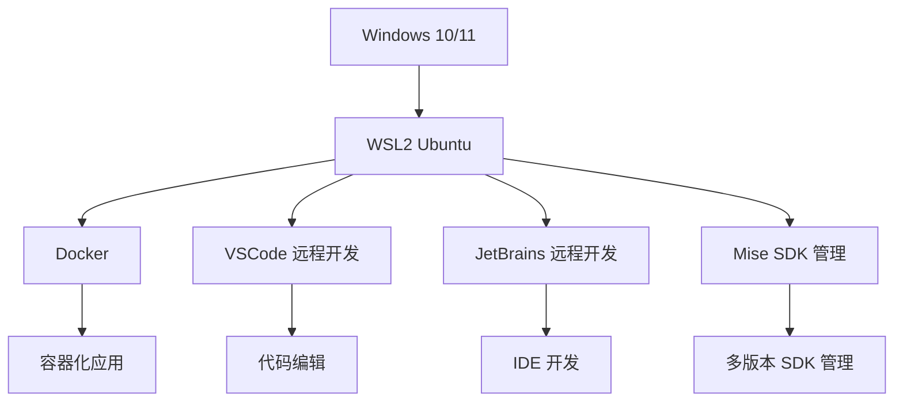

# 个人 Windows 开发环境搭建

## 1. 整体架构

作为一个长期在 Windows 上做开发的程序员，我尝试过各种环境配置方案，最终这套基于 WSL2 的方案是我用过最舒服的。简单来说，就是在 Windows 系统上运行一个轻量级的 Linux 虚拟机（WSL2），然后把所有开发工具都放在这个 Linux 环境里，通过 VSCode 或者 JetBrains 远程连接过去开发。



这套架构的好处在于，你既能享受 Windows 系统的易用性（比如玩游戏、用 Office），又能获得 Linux 环境的开发优势（比如更好的命令行工具、更稳定的 Docker 支持）。而且通过远程开发，你在 VSCode 或者 JetBrains 里看到的就是 Linux 环境的文件，操作起来和在原生 Linux 上几乎没区别。

## 2. WSL2 安装与配置

### 2.1 启用 WSL 功能

以管理员身份运行 PowerShell 并执行：

```powershell
wsl --install
```

### 2.2 安装 Ubuntu 发行版

```powershell
wsl --install -d Ubuntu
```

## 3. WSL2 深度调优

!!! tip "性能贴士"
    我自己踩过的坑：在 WSL2 中访问 /mnt/c/（Windows 分区）的速度真的慢到怀疑人生！特别是跑 Java 项目的时候，编译一次要等半天。后来把代码移到 Linux 根目录的 ~/projects 下，速度直接起飞，编译时间从几分钟降到几十秒，简直是质的飞跃。

### 3.1 创建 .wslconfig 文件

WSL2 默认的配置其实有点保守，特别是内存和 CPU 分配。我建议在 Windows 用户目录下创建一个 `.wslconfig` 文件，根据自己电脑的配置来调优：

```ini
# C:\Users\用户名\.wslconfig
[wsl2]
# 内存分配（建议为物理内存的 50%）
memory=16GB
# CPU 核心数（建议预留 2-4 核给 Windows 宿主机）
processors=8
# 启用嵌套虚拟化（跑 Docker 时有用）
nestedVirtualization=true
# 启用交换空间（防止内存不够用）
swap=4GB
# 网络优化（镜像模式网络更稳定）
networkingMode=mirrored
# 启用 DNS Tunneling（解决 DNS 解析问题）
dnsTunneling=true
# 启用虚拟机平台缓存（减少资源占用）
vmIdleTimeout=3600
```

### 3.2 应用配置

修改配置后需重启 WSL 使其生效：

```powershell
wsl --shutdown
wsl
```

> ⚠️ 注意：`.wslconfig` 修改后必须执行 `wsl --shutdown` 重启，否则配置不会生效。

## 4. Docker 安装与配置

### 4.0 为什么不选择 Docker Desktop

!!! note "选择理由"
    尽管 Docker Desktop 提供了图形化界面和便捷的安装体验，但我们选择在 WSL Ubuntu 中直接安装 Docker 的原因如下：

1. **性能优势**
   - Docker Desktop 在 Windows 上运行时会创建额外的虚拟机层，增加资源开销
   - 在 WSL 中直接安装 Docker 可以获得原生 Linux 性能，避免多层虚拟化的性能损失
   - 特别是在构建大型镜像和运行多个容器时，性能差异尤为明显

2. **资源占用**
   - Docker Desktop 通常需要更多的内存和 CPU 资源
   - 在 WSL 中安装 Docker 可以更精确地控制资源分配，与 WSL 共享资源

3. **网络性能**
   - Docker Desktop 的网络配置较为复杂，可能导致网络访问延迟
   - WSL 中的 Docker 可以直接使用 Linux 网络栈，网络性能更好

4. **文件系统性能**
   - Docker Desktop 在处理 Windows 文件系统时存在 I/O 性能问题
   - WSL 中的 Docker 直接操作 Linux 文件系统，避免了跨文件系统的性能损耗

5. **许可证问题**
   - Docker Desktop 对商业使用有许可证要求
   - 在 WSL 中使用 Docker CE 是完全免费的

6. **稳定性**
   - Docker Desktop 有时会出现与 Windows 更新冲突的问题
   - WSL 中的 Docker 运行在更稳定的 Linux 环境中

### 4.1 在 WSL Ubuntu 中安装 Docker

```bash
# 更新包管理器
sudo apt update
# 安装依赖
sudo apt install apt-transport-https ca-certificates curl software-properties-common
# 添加 Docker GPG 密钥
curl -fsSL https://download.docker.com/linux/ubuntu/gpg | sudo gpg --dearmor -o /usr/share/keyrings/docker-archive-keyring.gpg
# 添加 Docker 源
echo "deb [arch=$(dpkg --print-architecture) signed-by=/usr/share/keyrings/docker-archive-keyring.gpg] https://download.docker.com/linux/ubuntu $(lsb_release -cs) stable" | sudo tee /etc/apt/sources.list.d/docker.list > /dev/null
# 安装 Docker
sudo apt update
sudo apt install docker-ce docker-ce-cli containerd.io
# 启动 Docker 服务
sudo systemctl start docker
sudo systemctl enable docker
# 将当前用户添加到 docker 组
sudo usermod -aG docker $USER
```

### 4.2 验证 Docker 安装

```bash
docker --version
docker run hello-world
```

## 5. Mise SDK 版本管理

Mise 是一个统一的 SDK 版本管理工具，可以同时管理 Java、Node.js、Python、Go 等多种编程语言的版本，避免使用多个版本管理工具（nvm、jenv 等）带来的复杂性。

```bash
# 安装 Mise
curl https://mise.run | sh
echo 'eval "$(mise activate bash)"' >> ~/.bashrc
source ~/.bashrc

# 全局安装常用 SDK
mise use -g java@17
mise use -g node@20
mise use -g python@3.11
```

Mise 支持项目级配置，在项目根目录创建 `.mise.toml` 文件即可指定该项目所需的 SDK 版本，进入目录时自动切换。

> 📖 Mise 的详细安装配置和使用说明，请参阅 [命令行工具优化 - Mise](@env-命令行工具优化#36-misesdk-版本管理)。

## 6. VSCode 远程开发配置

### 6.1 安装 VSCode

从 [VSCode 官网](https://code.visualstudio.com/) 下载并安装。

### 6.2 安装 Remote - WSL 扩展

在 VSCode 中搜索并安装 "Remote - WSL" 扩展。

### 6.3 连接到 WSL

- 打开 VSCode
- 按 `F1` 输入 "WSL: Connect to WSL"
- 选择 Ubuntu 发行版

## 7. JetBrains 远程开发配置

### 7.1 安装 JetBrains Gateway

从 [JetBrains 官网](https://www.jetbrains.com/gateway/) 下载并安装。

### 7.2 连接到 WSL Ubuntu

- 打开 JetBrains Gateway
- 选择 "WSL"
- 选择 Ubuntu 发行版
- 选择项目目录
- 选择 IDE（如 IntelliJ IDEA）

## 8. Ubuntu 环境工程化

### 8.1 系统优化

```bash
# 更新系统
sudo apt update && sudo apt upgrade -y
# 安装常用工具
sudo apt install -y git curl wget unzip zip htop tmux build-essential
# 配置 Git
git config --global user.name "Your Name"
git config --global user.email "your.email@example.com"
```

### 8.2 环境初始化脚本

```bash
#!/bin/bash

# 环境初始化脚本

echo "开始初始化开发环境..."

# 更新系统
echo "更新系统包..."
sudo apt update && sudo apt upgrade -y

# 安装依赖
echo "安装基础依赖..."
sudo apt install -y apt-transport-https ca-certificates curl software-properties-common git curl wget unzip zip htop tmux build-essential

# 安装 Docker
echo "安装 Docker..."
curl -fsSL https://download.docker.com/linux/ubuntu/gpg | sudo gpg --dearmor -o /usr/share/keyrings/docker-archive-keyring.gpg
echo "deb [arch=$(dpkg --print-architecture) signed-by=/usr/share/keyrings/docker-archive-keyring.gpg] https://download.docker.com/linux/ubuntu $(lsb_release -cs) stable" | sudo tee /etc/apt/sources.list.d/docker.list > /dev/null
sudo apt update
sudo apt install -y docker-ce docker-ce-cli containerd.io
sudo systemctl start docker
sudo systemctl enable docker
sudo usermod -aG docker $USER

# 安装 Mise
echo "安装 Mise SDK 管理..."
curl https://mise.run | sh
echo 'eval "$(mise activate bash)"' >> ~/.bashrc

# 安装常用 SDK
echo "安装常用 SDK..."
eval "$(mise activate bash)"
mise use -g java@17
mise use -g node@20
mise use -g python@3.11

# 创建项目目录
echo "创建项目目录..."
mkdir -p ~/projects

# 配置 Git
echo "配置 Git..."
git config --global user.name "Your Name"
git config --global user.email "your.email@example.com"

echo "环境初始化完成！请重新登录 WSL 以应用所有更改。"
```

## 9. 开发工作流

### 9.1 日常开发

推荐的日常开发流程：

1. **启动 WSL**：在 Windows 终端中执行 `wsl`
2. **进入项目目录**：`cd ~/projects/your-project`（代码应存放在 Linux 文件系统中）
3. **启动开发服务**：
   - 前端项目：`npm run dev`
   - 后端项目：`./mvnw spring-boot:run`
4. **连接 IDE**：VSCode 使用 `F1` → "WSL: Connect to WSL"；JetBrains 使用 Gateway 连接

### 9.2 容器化开发

如果项目需要容器化部署，我通常会这样操作：

```bash
# 构建镜像
docker build -t your-app .
# 运行容器
docker run -p 8080:8080 your-app
```

> 💡 在 WSL 中直接安装 Docker 相比 Docker Desktop，网络连接更稳定，容器访问外部资源不易出现连通性问题。

## 10. 故障排除

以下是常见问题及解决方案：

### 10.1 WSL 启动问题

WSL 可能在 Windows 系统更新后出现启动失败的情况，可通过以下方式重置：

```powershell
# 重置 WSL
wsl --shutdown
wsl --unregister Ubuntu
wsl --install -d Ubuntu
```

> ⚠️ 重置操作会删除所有数据，建议定期备份重要文件。

### 10.2 Docker 权限问题

安装 Docker 后执行 `docker ps` 提示权限不足时，需将当前用户添加到 docker 组：

```bash
# 添加用户到 docker 组
sudo usermod -aG docker $USER
# 重新登录使权限生效
logout
```

> ⚠️ 修改用户组后必须重新登录 WSL 才能生效。

### 10.3 性能优化

!!! tip "性能贴士"
    - 关闭 Windows Defender 对 WSL 目录的实时保护（可提升约 30% 的 I/O 性能）
    - 使用 SSD 存储（WSL 对磁盘读写速度敏感）
    - 根据硬件配置合理调整 `.wslconfig` 中的内存和 CPU 分配

## 11. 总结

本方案的核心优势：

| 维度 | 说明 |
|------|------|
| **性能** | WSL2 深度调优 + Linux 文件系统，性能接近原生 Linux |
| **配置** | 一键初始化脚本完成所有工具安装 |
| **版本管理** | Mise 统一管理所有 SDK 版本，消除版本冲突 |
| **开发体验** | VSCode / JetBrains 远程开发，与原生 Linux 开发体验一致 |
| **资源占用** | 相比 Docker Desktop 资源占用更低 |

> 📌 本方案当前仅覆盖 Windows + WSL 环境。Linux / macOS 用户可直接使用原生环境，参考 [命令行工具优化](@env-命令行工具优化) 配置开发工具链。