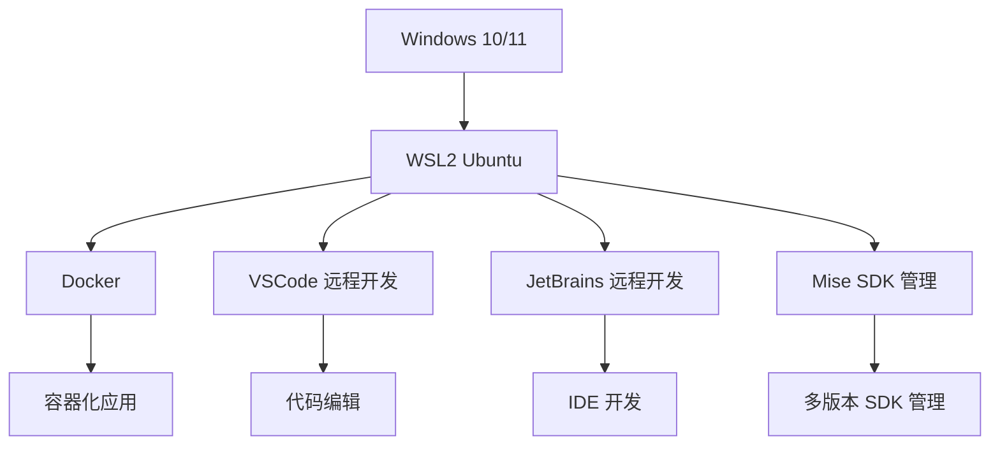

# 个人 Windows 开发环境搭建

## 1. 整体架构

作为一个长期在 Windows 上做开发的程序员，我尝试过各种环境配置方案，最终这套基于 WSL2 的方案是我用过最舒服的。简单来说，就是在 Windows 系统上运行一个轻量级的 Linux 虚拟机（WSL2），然后把所有开发工具都放在这个 Linux 环境里，通过 VSCode 或者 JetBrains 远程连接过去开发。



这套架构的好处在于，你既能享受 Windows 系统的易用性（比如玩游戏、用 Office），又能获得 Linux 环境的开发优势（比如更好的命令行工具、更稳定的 Docker 支持）。而且通过远程开发，你在 VSCode 或者 JetBrains 里看到的就是 Linux 环境的文件，操作起来和在原生 Linux 上几乎没区别。

## 2. WSL2 安装与配置

### 2.1 启用 WSL 功能

以管理员身份运行 PowerShell 并执行：

```powershell
wsl --install
```

### 2.2 安装 Ubuntu 发行版

```powershell
wsl --install -d Ubuntu
```

## 3. WSL2 深度调优

!!! tip "性能贴士"
    我自己踩过的坑：在 WSL2 中访问 /mnt/c/（Windows 分区）的速度真的慢到怀疑人生！特别是跑 Java 项目的时候，编译一次要等半天。后来把代码移到 Linux 根目录的 ~/projects 下，速度直接起飞，编译时间从几分钟降到几十秒，简直是质的飞跃。

### 3.1 创建 .wslconfig 文件

WSL2 默认的配置其实有点保守，特别是内存和 CPU 分配。我建议在 Windows 用户目录下创建一个 `.wslconfig` 文件，根据自己电脑的配置来调优：

```ini
# C:\Users\用户名\.wslconfig
[wsl2]
# 内存分配（建议为物理内存的一半，我 32G 内存就分配 16G）
memory=16GB
# CPU 核心数（不要全用完，留几个给 Windows）
processors=8
# 启用嵌套虚拟化（跑 Docker 时有用）
nestedVirtualization=true
# 启用交换空间（防止内存不够用）
swap=4GB
# 网络优化（镜像模式网络更稳定）
networkingMode=mirrored
# 启用 DNS Tunneling（解决 DNS 解析问题）
dnsTunneling=true
# 启用虚拟机平台缓存（减少资源占用）
vmIdleTimeout=3600
```

### 3.2 应用配置

改完配置后，记得重启 WSL 才能生效：

```powershell
wsl --shutdown
wsl
```

我刚开始用 WSL 的时候，不知道要重启，改了配置半天没效果，后来才发现要先 shutdown 再启动。

## 4. Docker 安装与配置

### 4.0 为什么不选择 Docker Desktop

!!! note "选择理由"
    尽管 Docker Desktop 提供了图形化界面和便捷的安装体验，但我们选择在 WSL Ubuntu 中直接安装 Docker 的原因如下：

1. **性能优势**
   - Docker Desktop 在 Windows 上运行时会创建额外的虚拟机层，增加资源开销
   - 在 WSL 中直接安装 Docker 可以获得原生 Linux 性能，避免多层虚拟化的性能损失
   - 特别是在构建大型镜像和运行多个容器时，性能差异尤为明显

2. **资源占用**
   - Docker Desktop 通常需要更多的内存和 CPU 资源
   - 在 WSL 中安装 Docker 可以更精确地控制资源分配，与 WSL 共享资源

3. **网络性能**
   - Docker Desktop 的网络配置较为复杂，可能导致网络访问延迟
   - WSL 中的 Docker 可以直接使用 Linux 网络栈，网络性能更好

4. **文件系统性能**
   - Docker Desktop 在处理 Windows 文件系统时存在 I/O 性能问题
   - WSL 中的 Docker 直接操作 Linux 文件系统，避免了跨文件系统的性能损耗

5. **许可证问题**
   - Docker Desktop 对商业使用有许可证要求
   - 在 WSL 中使用 Docker CE 是完全免费的

6. **稳定性**
   - Docker Desktop 有时会出现与 Windows 更新冲突的问题
   - WSL 中的 Docker 运行在更稳定的 Linux 环境中

### 4.1 在 WSL Ubuntu 中安装 Docker

```bash
# 更新包管理器
sudo apt update
# 安装依赖
sudo apt install apt-transport-https ca-certificates curl software-properties-common
# 添加 Docker GPG 密钥
curl -fsSL https://download.docker.com/linux/ubuntu/gpg | sudo gpg --dearmor -o /usr/share/keyrings/docker-archive-keyring.gpg
# 添加 Docker 源
echo "deb [arch=$(dpkg --print-architecture) signed-by=/usr/share/keyrings/docker-archive-keyring.gpg] https://download.docker.com/linux/ubuntu $(lsb_release -cs) stable" | sudo tee /etc/apt/sources.list.d/docker.list > /dev/null
# 安装 Docker
sudo apt update
sudo apt install docker-ce docker-ce-cli containerd.io
# 启动 Docker 服务
sudo systemctl start docker
sudo systemctl enable docker
# 将当前用户添加到 docker 组
sudo usermod -aG docker $USER
```

### 4.2 验证 Docker 安装

```bash
docker --version
docker run hello-world
```

## 5. Mise SDK 版本管理

### 5.1 安装 Mise

以前管理多个 SDK 版本真的是个麻烦事，一会儿用 nvm 管 Node.js，一会儿用 jenv 管 Java，每次切换项目都要手动调整版本。直到我发现了 Mise 这个神器，它可以统一管理所有编程语言的 SDK 版本，简直不要太方便！

```bash
# 使用官方安装脚本
curl https://mise.run | sh
# 添加到 shell 配置
echo 'eval "$(mise activate bash)"' >> ~/.bashrc
source ~/.bashrc
```

### 5.2 配置常用 SDK

安装完 Mise 后，我通常会先全局安装几个常用的 SDK 版本：

```bash
# 安装 JDK 17（现在大部分项目都用这个版本）
mise use -g java@17
# 安装 Node.js 20（LTS 版本，稳定可靠）
mise use -g node@20
# 安装 Python 3.11（新特性多，性能也不错）
mise use -g python@3.11
# 安装 Go 1.21（如果你做后端开发的话）
mise use -g go@1.21
```

### 5.3 项目级 SDK 配置

最香的是，Mise 支持项目级配置。在项目根目录创建一个 `.mise.toml` 文件，指定该项目需要的 SDK 版本：

```toml
[tools]
java = "17"
node = "20"
python = "3.11"
```

这样一来，当你进入项目目录时，Mise 会自动切换到正确的 SDK 版本，完全不用手动管理，简直是懒人福音！我现在所有项目都用这个方法管理依赖版本，再也没遇到过版本冲突的问题。

## 6. VSCode 远程开发配置

### 6.1 安装 VSCode

从 [VSCode 官网](https://code.visualstudio.com/) 下载并安装。

### 6.2 安装 Remote - WSL 扩展

在 VSCode 中搜索并安装 "Remote - WSL" 扩展。

### 6.3 连接到 WSL

- 打开 VSCode
- 按 `F1` 输入 "WSL: Connect to WSL"
- 选择 Ubuntu 发行版

## 7. JetBrains 远程开发配置

### 7.1 安装 JetBrains Gateway

从 [JetBrains 官网](https://www.jetbrains.com/gateway/) 下载并安装。

### 7.2 连接到 WSL Ubuntu

- 打开 JetBrains Gateway
- 选择 "WSL"
- 选择 Ubuntu 发行版
- 选择项目目录
- 选择 IDE（如 IntelliJ IDEA）

## 8. Ubuntu 环境工程化

### 8.1 系统优化

```bash
# 更新系统
sudo apt update && sudo apt upgrade -y
# 安装常用工具
sudo apt install -y git curl wget unzip zip htop tmux build-essential
# 配置 Git
git config --global user.name "Your Name"
git config --global user.email "your.email@example.com"
```

### 8.2 环境初始化脚本

```bash
#!/bin/bash

# 环境初始化脚本

echo "开始初始化开发环境..."

# 更新系统
echo "更新系统包..."
sudo apt update && sudo apt upgrade -y

# 安装依赖
echo "安装基础依赖..."
sudo apt install -y apt-transport-https ca-certificates curl software-properties-common git curl wget unzip zip htop tmux build-essential

# 安装 Docker
echo "安装 Docker..."
curl -fsSL https://download.docker.com/linux/ubuntu/gpg | sudo gpg --dearmor -o /usr/share/keyrings/docker-archive-keyring.gpg
echo "deb [arch=$(dpkg --print-architecture) signed-by=/usr/share/keyrings/docker-archive-keyring.gpg] https://download.docker.com/linux/ubuntu $(lsb_release -cs) stable" | sudo tee /etc/apt/sources.list.d/docker.list > /dev/null
sudo apt update
sudo apt install -y docker-ce docker-ce-cli containerd.io
sudo systemctl start docker
sudo systemctl enable docker
sudo usermod -aG docker $USER

# 安装 Mise
echo "安装 Mise SDK 管理..."
curl https://mise.run | sh
echo 'eval "$(mise activate bash)"' >> ~/.bashrc

# 安装常用 SDK
echo "安装常用 SDK..."
eval "$(mise activate bash)"
mise use -g java@17
mise use -g node@20
mise use -g python@3.11

# 创建项目目录
echo "创建项目目录..."
mkdir -p ~/projects

# 配置 Git
echo "配置 Git..."
git config --global user.name "Your Name"
git config --global user.email "your.email@example.com"

echo "环境初始化完成！请重新登录 WSL 以应用所有更改。"
```

## 9. 开发工作流

### 9.1 日常开发

现在我来分享一下我的日常开发流程，其实非常简单：

1. **启动 WSL**：直接在 Windows 终端里输入 `wsl`，几秒钟就启动了
2. **进入项目目录**：`cd ~/projects/your-project`（记住，代码一定要放在 Linux 目录里！）
3. **启动开发服务**：
   - 前端项目：`npm run dev`
   - 后端项目：`./mvnw spring-boot:run`
4. **打开编辑器**：在 VSCode 里按 `F1` 输入 "WSL: Connect to WSL"，或者用 JetBrains Gateway 连接过去

这样操作下来，你会感觉就像在原生 Linux 上开发一样流畅，而且还能随时切回 Windows 做其他事情，比如查资料、回邮件什么的。

### 9.2 容器化开发

如果项目需要容器化部署，我通常会这样操作：

```bash
# 构建镜像
docker build -t your-app .
# 运行容器
docker run -p 8080:8080 your-app
```

我之前用 Docker Desktop 的时候，经常遇到网络问题，容器里的服务访问不到外部资源。但在 WSL 里直接装 Docker 后，这个问题就再也没出现过，网络连接非常稳定。

## 10. 故障排除

在使用过程中，我也遇到过一些问题，这里分享一下我的解决方案：

### 10.1 WSL 启动问题

有时候 WSL 会出现启动失败的情况，比如系统更新后。遇到这种情况，我通常会这样处理：

```powershell
# 重置 WSL
wsl --shutdown
wsl --unregister Ubuntu
wsl --install -d Ubuntu
```

不过重置会删除所有数据，所以建议平时定期备份重要文件。

### 10.2 Docker 权限问题

第一次安装 Docker 后，可能会遇到权限问题，比如执行 `docker ps` 时提示权限不足。这时候需要把当前用户添加到 docker 组：

```bash
# 重新添加用户到 docker 组
sudo usermod -aG docker $USER
# 重新登录
logout
```

记得要重新登录 WSL 才能生效，我第一次装的时候不知道要重新登录，捣鼓了半天。

### 10.3 性能优化

!!! tip "性能贴士"
    - 关闭 Windows Defender 对 WSL 的实时保护（这能显著提升 I/O 性能）
    - 尽量使用 SSD 存储（WSL 对磁盘速度要求比较高）
    - 合理配置 .wslconfig 中的内存和 CPU 分配（根据自己电脑的配置来调整）

我之前没关 Windows Defender，编译项目特别慢，后来关闭了实时保护，速度直接提升了30%以上，效果非常明显。

## 11. 总结

我用这套环境配置已经快两年了，说实话，这是我用过最舒服的 Windows 开发环境。以前总觉得在 Windows 上做开发不如 Mac 或 Linux 流畅，现在完全不这么认为了。

总结一下这套方案的优势：

- **性能优秀**：通过 WSL2 深度调优和把代码放在 Linux 目录，性能几乎和原生 Linux 一样好
- **配置简单**：一个初始化脚本就能搞定所有工具安装，省心省力
- **版本管理方便**：Mise 统一管理所有 SDK 版本，再也不用担心版本冲突
- **开发体验流畅**：VSCode 和 JetBrains 的远程开发功能，让你感觉就像在原生 Linux 上开发
- **资源占用合理**：比 Docker Desktop 占用更少的资源，电脑不会卡

最重要的是，你不用放弃 Windows 系统的便利，比如玩游戏、用 Office、看视频这些日常需求都能满足，同时又能获得 Linux 环境的开发优势。

如果你也是 Windows 用户，还在为开发环境发愁，不妨试试这套方案。我敢说，一旦用习惯了，你会爱上这种开发体验的！