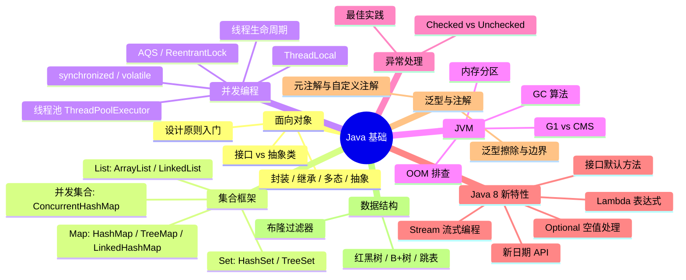
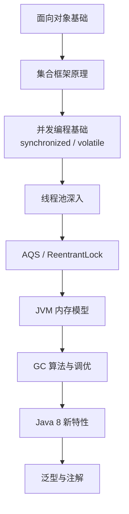

# Java 基础知识与 JVM 原理

> **学习目标**：从"会用"升级到"理解原理 → 能解决问题 → 能做技术决策"
>
> **检验标准**：学完每个模块后，能口述"这个技术解决了什么问题？不用它会怎样？工作中有哪些坑？"

---

## 整体知识地图

---

## 知识点导航

| # | 知识点 | 核心一句话 | 详细文档 |
|---|--------|-----------|---------|
| 01 | **面向对象** | 封装隐藏实现、继承复用代码、多态解耦调用方、抽象定义规范 | [面向对象](@java-面向对象) |
| 02 | **集合框架** | ArrayList 随机访问快、LinkedList 增删快、HashMap 数组+链表+红黑树、ConcurrentHashMap 线程安全 | [集合框架](@java-集合框架) |
| 03 | **并发编程** | synchronized 保证原子性+可见性、volatile 保证可见性+有序性、线程池避免频繁创建销毁线程 | [并发编程](@java-并发编程) |
| 04 | **JVM 内存结构与 GC** | 堆存对象、栈存帧、元空间存类信息；GC 分代收集，G1 是 JDK9+ 默认收集器 | [JVM内存结构与GC](@java-JVM内存结构与GC) |
| 05 | **异常处理** | Checked 编译器强制处理、Unchecked 编程错误应修复代码；禁止空 catch 块 | [异常处理](@java-异常处理) |
| 06 | **AQS 与 CAS** | AQS 是并发包核心框架，CAS 是无锁编程基础；ReentrantLock 比 synchronized 更灵活 | [AQS与CAS](@java-AQS与CAS) |
| 07 | **[Java8] 函数式编程** | Lambda 表达式 + Stream 流式编程 + Optional 空值处理，函数式编程三大核心 | [Java8函数式编程](@java-Java8函数式编程) |
| 08 | **[Java8] 其他新特性** | 新日期 API（java.time）+ 接口默认方法与静态方法 | [Java8其他新特性](@java-Java8其他新特性) |
| 09 | **[Java9-17] 新特性** | var 局部变量推断、Record、Sealed Classes、Pattern Matching 等 | [Java9-17新特性](@java-Java9-17新特性) |
| 10 | **注解** | 元注解定义注解行为，自定义注解 + 反射/APT 实现框架功能 | [注解Annotation](@java-注解Annotation) |
| 11 | **数据结构精讲** | 红黑树自平衡 O(log n)、B+树磁盘友好、跳表概率平衡、布隆过滤器判存在 | [数据结构精讲](@java-数据结构精讲) |

---

## 高频问题索引

| 问题 | 详见 |
|------|------|
| 面向对象四大特性分别解决什么问题？ | [面向对象](@java-面向对象) |
| HashMap 扩容流程？JDK7 头插法为什么会死循环？ | [集合框架](@java-集合框架) |
| synchronized 和 volatile 的区别？ | [并发编程](@java-并发编程) |
| 线程池核心参数怎么设置？为什么不用 Executors？ | [并发编程](@java-并发编程) |
| ThreadLocal 为什么会内存泄漏？ | [并发编程](@java-并发编程) |
| JVM 内存分区有哪些？各自存什么？ | [JVM内存结构与GC](@java-JVM内存结构与GC) |
| G1 和 CMS 的区别？ | [JVM内存结构与GC](@java-JVM内存结构与GC) |
| OOM 问题如何排查？ | [JVM内存结构与GC](@java-JVM内存结构与GC) |
| 双重检查锁的单例为什么需要 volatile？ | [AQS与CAS](@java-AQS与CAS) |
| AQS 等待队列原理？ReentrantLock vs synchronized？ | [AQS与CAS](@java-AQS与CAS) |
| CAS 的 ABA 问题如何解决？ | [AQS与CAS](@java-AQS与CAS) |

---

## 学习路径建议

> **推荐实践**：
> 1. 手写一个线程安全的单例（双重检查锁 + volatile）
> 2. 用 `jvisualvm` 模拟一次内存泄漏并排查
> 3. 配置一个自定义线程池，测试各种拒绝策略的行为