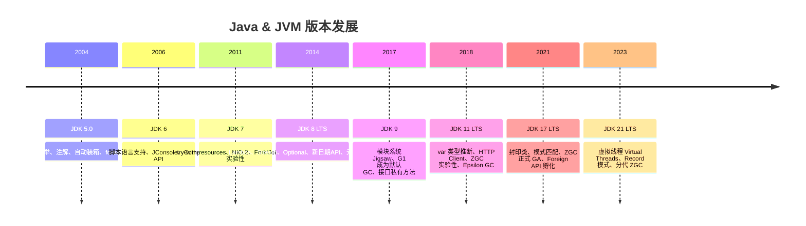
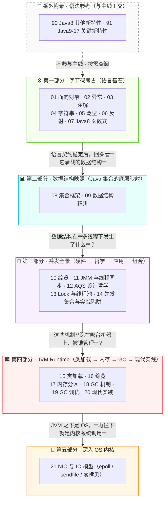
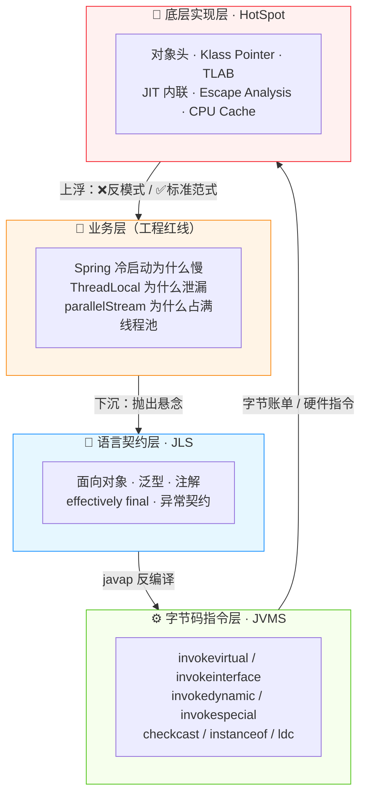

# Java 基础专题概览

> 本专题 24 篇文档覆盖 Java 开发者从日常编码到生产排障中最常遇到的底层问题。以下是你会在本专题中看到答案的问题类型：

**①** Spring Boot 服务启动需要 45 秒，其中 `Method.invoke` 的 JNI 跳板贡献了多少？JDK 18 后这个数字为什么下降了？

**②** `list.parallelStream().map(this::rpcCall).collect(...)` 为什么上线后把线程池打满导致全站饥饿？`ForkJoinPool.commonPool()` 是谁的？

**③** `new String("abc")` 到底创建了几个对象？`"a" + "b"` 和 `"a".concat("b")` 在 `javap` 下为什么长得完全不一样？

**④** `List<String>` 和 `List<Integer>` 在运行时是同一个类，为什么 `list.add(1)` 能在编译期报错？桥接方法（bridge method）在字节码中长什么样？

**⑤** 一个 `HashMap` 在 JDK 7 多线程下可能死循环把 CPU 打满。JDK 8 改成尾插法后为什么只会丢数据而不会死循环？头插法改尾插法，链表反转的那一行字节码到底改了什么？

本专题的组织方式是四层垂直透视——每个知识点从业务代码现场下沉到 `javap` 反编译现场，再下沉到对象头与 CPU 缓存行：

- **看得见的**：代码行为、Bug 现象、性能数据
- **看不见的**：字节码指令（`invokevirtual` / `invokedynamic` / `checkcast`）、对象头与 Klass 指针、方法内联与逃逸分析

二十四篇文档公共回答的只有一个问题：不是"Java 怎么写"，而是"**Java 写成那样，背后到底发生了什么**"。

---

## 版本发展



> 📌 本站聚焦 **JDK 8 / 17 / 21** 三个 LTS 版本。GC 演进路线：Serial → Parallel → CMS → G1（JDK 9+ 默认）→ ZGC（JDK 15+ 正式，JDK 21 分代模式）。JDK 21 起 Oracle 改为每 2 年一个 LTS，中间版本为非 LTS 短期支持。

---

## 如何阅读本专题

本专题 **24 篇文档 · 5 个部分 · 1 个附录**，按由浅入深的顺序依次展开——从**语言基石**到**内核穿刺**，每个部分都在回答上一部分无法回答的问题：



五个部分是**纵切导航**（读哪一篇），下面的四层是**横切透视法**（每一篇怎么读）——同一篇文档在两张图里都要能被定位：



上面开篇的 5 个问题对应到这张图里，就是经典的**L1 抛出悬念 → L3 抢现场 → L4 看真相 → L1 给出工程红线**回环。

> **两张图的分工**：**结构图**回答"**该按什么顺序读**"（纵切导航）；**四层图**回答"**每一篇内部该关注什么**"（横切透视方法论）。深度源码型文档（见下方 tip）会在文档内部同时下沉四层；综览篇与番外语法参考主要停在 L1 或 L2 层。

!!! tip "📖 深度源码型文档的阅读姿势"
    标题包含"深度解析 / 底层 / 原理"的文档（本专题中编号为 **01 / 05 / 06 / 07 / 11 ~ 14 / 15 / 17 / 21**），统一遵循**深度源码型 5 章节契约**：

    1. **业务痛点** —— 3~5 个反问引子 + 一个生产事故现场
    2. **字节码考古** —— `javap -c -v` 完整反编译 + 逐行破案
    3. **内存布局** —— 精确到字节的 ASCII 布局图 + 硬件级性能账单
    4. **工程红线** —— ❌反模式 / ✅标准范式 双代码块 × 3~5 条
5. **后续关联** —— 指向后续篇章的 `@doc_id` 钩子，标记本节的哪个机制在后续哪篇展开

    读者**不必按顺序读完全篇**：想学"怎么写"直接跳 §4；想搞懂"为什么"从 §1 顺读；想调优时回 §3 看内存账单。

---

## 整体知识地图

```markmap
# Java 基础

## 面向对象
- 封装 / 继承 / 多态 / 抽象
- 接口 vs 抽象类
- 设计原则入门

## 集合框架
- List：ArrayList / LinkedList
- Map：HashMap / TreeMap / LinkedHashMap
- Set：HashSet / TreeSet
- 并发集合：ConcurrentHashMap

## 并发编程
- 线程生命周期
- synchronized / volatile
- ThreadLocal
- 线程池 ThreadPoolExecutor
- AQS / ReentrantLock

## JVM
- 内存分区
- GC 算法
- G1 vs CMS
- OOM 排查

## 类加载机制
- 双亲委派模型
- 破坏委派：SPI / Tomcat / OSGi

## 底层原理专题
- 字符串与 StringPool
- 泛型与类型擦除
- 反射与 MethodHandle
- NIO 与 IO 模型

## 异常处理
- Checked vs Unchecked
- 最佳实践

## Java 8 新特性
- Lambda 表达式
- Stream 流式编程
- Optional 空值处理
- 新日期 API
- 接口默认方法

## 泛型与注解
- 泛型擦除与边界
- 元注解与自定义注解

## 数据结构
- 红黑树 / B+树 / 跳表
- 布隆过滤器
```

---

## 知识点导航

### ⚙️ 第一部分 · 字节码考古（语言基石）

| # | 知识点 | 核心一句话 |
| :--: | :-- | :-- |
| 01 | [**面向对象（OOP）**](@java-字节码-面向对象) | 从内存边界到虚方法表，封装 / 继承 / 多态 / 抽象在字节码层的底层透视 |
| 02 | [**异常处理**](@java-字节码-异常处理) | `try-catch-finally` 编译成 **Exception Table**（不是 `if-else`）；`throw` 走操作数栈、栈展开由 JVM 内建，成本远高于普通返回 |
| 03 | [**注解（Annotation）**](@java-字节码-注解) | 注解是 `.class` 属性表里的一段元数据（`RuntimeVisibleAnnotations`）；APT 编译期织入 / 反射运行期读取 是两条完全独立的解析路径 |
| 04 | [**字符串与 StringPool**](@java-字节码-字符串底层原理) | JDK 7+ StringTable 从元空间搬到堆内、JDK 9+ Compact Strings（`byte[] + coder`）省一半内存；`ldc` 指令决定字面量走常量池 |
| 05 | [**泛型（Generics）**](@java-字节码-泛型底层原理) | 编译期检查 + 运行期擦除；`Signature` 属性保存原始泛型信息，`checkcast` 指令兜底类型强转，桥接方法解决继承重写签名冲突 |
| 06 | [**反射与 MethodHandle**](@java-字节码-反射与MethodHandle) | `Method.invoke` 有 JNI 跳板 + 参数包装 + 前 15 次膨胀成本；`MethodHandle` + `invokedynamic` 通过 `LambdaForm` 与 JIT 内联把反射降到接近直接调用 |
| 07 | [**[Java8] 函数式编程**](@java-字节码-函数式编程) | Lambda 不生成 `.class` 匿名类，靠 `invokedynamic` + `LambdaMetafactory` 在**首次调用**才具化实现；`parallelStream` 复用 `ForkJoinPool.commonPool`，是"共享线程池陷阱"的源头 |

---

### 📊 第二部分 · 数据结构映照（Java 集合的底层映射）

| # | 知识点 | 核心一句话 |
| :--: | :-- | :-- |
| 08 | [**集合框架**](@java-数据结构-集合框架) | `HashMap` 数组 + 链表 + 红黑树（JDK 8 起阈值 8/6 由泊松分布推导）；JDK 8 头插改尾插 + `synchronized` 单槽位锁 是并发行为的分水岭 |
| 09 | [**数据结构精讲**](@java-数据结构-数据结构精讲) | 红黑树 / B+ 树 / 跳表 / 时间轮 / 布隆过滤器的**生态映射**：谁在 JDK、谁在 MySQL、谁在 Redis、谁在 Netty |

---

### 🧵 第三部分 · 并发全景（切片家族 · 强耦合下沉）

| # | 知识点 | 核心一句话 |
| :--: | :-- | :-- |
| 10 | [**并发编程综览**](@java-并发-并发编程) | 第三部分 · 硬件事实 → 设计哲学 → 框架应用 → 组合运用四层下沉；子专题**不可跳读**，12 假定读者已读 11、13 假定已读 12、14 假定已读 11/12/13 |
| 11 | [**JMM 与线程同步**](@java-并发-JMM与线程同步) | 硬件地基：JMM 四种屏障 → x86 `mfence` / `LOCK` 指令、`synchronized` 锁升级四阶段的 Mark Word 位跃迁、CAS = `LOCK CMPXCHG` + MESI |
| 12 | [**AQS 设计哲学**](@java-并发-AQS设计哲学) | 设计哲学：`state`（volatile int，5 种语义）+ CLH 双向队列 + 模板方法 + 独占/共享双模式，一个字段撑起 20+ 个 JUC 同步器 |
| 13 | [**并发工具 · Lock 与线程池**](@java-并发-并发工具Lock与线程池) | 框架应用：`ReentrantLock` / `StampedLock` 乐观读 / `LongAdder` 分段计数 都是"在 AQS `state` 上定义语义"的产物；线程池 `ctl` 用一个 `int` 编码"5 状态 + 29 位线程数" |
| 14 | [**并发集合与实战陷阱**](@java-并发-并发集合与实战陷阱) | 组合运用：`ConcurrentHashMap.put` 一次穿透 "CAS 无锁 + `synchronized` 单槽位 + 并发扩容协议" 三种工具；`ThreadLocal` 泄漏、`InheritableThreadLocal` 在池化场景失效的排查 |

---

### 🏛️ 第四部分 · JVM Runtime（序章：类加载）

| # | 知识点 | 核心一句话 |
| :--: | :-- | :-- |
| 15 | [**类加载机制与双亲委派**](@java-JVM-类加载机制与双亲委派模型) | 五阶段（加载 → 验证 → 准备 → 解析 → 初始化）由字节码指令被动触发；"两个类相等"的精确定义 = `ClassLoader + 全限定名` 二元组；JDK 9 起 `Platform CL` 取代 `Ext CL` |

---

### 🏛️ 第四部分 · JVM Runtime（切片家族：内存 / GC / 调优 / 现代实践）

| # | 知识点 | 核心一句话 |
| :--: | :-- | :-- |
| 16 | [**JVM 内存结构与 GC 综览**](@java-JVM-内存结构与GC) | 第四部分子专题导航：内存分区（对象在哪）→ GC 机制（垃圾怎么找）→ 调优实战（参数怎么配）→ 现代实践（容器 / 虚拟线程 / 前沿），四件缺一不可 |
| 17 | [**内存分区与对象布局**](@java-JVM-内存分区与对象布局) | 三共享（堆 / 元空间 / Code Cache）+ 三私有（虚拟机栈 / 本地方法栈 / PC）+ 一堆外（直接内存）；`-Xmx` 管不到的**四大盲区**是容器 OOMKilled 元凶 |
| 18 | [**GC 核心机制与收集器演进**](@java-JVM-GC核心机制与收集器演进) | 可达性分析 + 三色标记 + 写屏障：CMS 走**增量更新**、G1 / ZGC 走 **SATB**，没有第三种；收集器演进主线 Serial → Parallel → CMS → G1 → ZGC 都在回答同一问题：还能把哪些 STW 挪到并发做？ |
| 19 | [**GC 调优实战与常见误区**](@java-JVM-GC调优实战与常见误区) | 调优三步：**定目标（吞吐/延迟/内存三选一互斥）→ 测量（`-Xlog:gc*` + JFR）→ 小步迭代**；OOM 四字诀：堆查对象链、栈查递归、元空间查代理类、直接内存查 NIO |
| 20 | [**JVM 现代实践与前沿技术**](@java-JVM-现代实践与前沿技术) | 容器化 `-XX:+UseContainerSupport` + 虚拟线程 M:N 模型（JDK 21 `synchronized` pin 载体、JDK 24 JEP 491 修复）+ JFR 生产 profiler + 分代 ZGC（JDK 23 默认） |

---

### 🎯 第五部分 · 深入 OS 内核

| # | 知识点 | 核心一句话 |
| :--: | :-- | :-- |
| 21 | [**NIO 与 IO 模型深度解析**](@java-OS-NIO与IO模型) | Java "NIO" 对应的 OS 模型是**多路复用**（不是非阻塞）；`Selector` = `epoll_create1`、`register` = `epoll_ctl`、`select()` = `epoll_wait`；`FileChannel.transferTo()` 走 `sendfile` 零拷贝 |

---

### 📎 番外附录 · Java 版本新特性（与主线正交 · 语法参考页）

> 定位：**打开时机是"迁移 / 查语法 / 抄坑清单"**，不是"深入字节码机制"；对应机制拆到主线相应篇（`Lambda` 见 07、`Record` 见 01、`Sealed` 见 20）。

| # | 知识点 | 核心一句话 |
| :--: | :-- | :-- |
| 90 | [**[Java8] 其他新特性**](@java-番外-Java8其他新特性) | `java.time` 不可变 + 时区显式两条准则治好 `SimpleDateFormat` 传统坑；接口 `default` 方法冲突记"具体优先、类优先、平级显式" |
| 91 | [**[Java 9~17] 关键新特性**](@java-番外-Java9-17关键新特性) | 三主线：**语法糖**（`var` / 文本块 / `switch` 表达式）+ **新类型建模**（`Record` / `Sealed`）+ **模式匹配起点**（`instanceof` 模式匹配 → Java 21 完整落地） |

---

## 高频问题索引

> 按四层垂直透视分类：**🎯 L1 业务层**（Bug 现场 / 排查 / 选型）、**📜 L2 语言契约**（JLS）、**⚙️ L3 字节码**（JVMS）、**🔬 L4 底层实现**（HotSpot / 内存 / 硬件）。

### 🎯 L1 业务层：Bug 现场与工程选型

| 问题 | 详见 |
| :-- | :-- |
| ThreadLocal 为什么会内存泄漏？ | [并发编程](@java-并发-并发编程) |
| 线程池核心参数怎么设置？为什么不用 Executors？ | [并发编程](@java-并发-并发编程) |
| OOM 问题如何排查？ | [JVM内存结构与GC](@java-JVM-内存结构与GC) |
| Tomcat / SPI / 线程上下文类加载器为什么要破坏双亲委派？ | [类加载机制与双亲委派模型](@java-JVM-类加载机制与双亲委派模型) |

### 📜 L2 语言契约层 · JLS：语义与约定

| 问题 | 详见 |
| :-- | :-- |
| 面向对象四大特性分别解决什么问题？ | [面向对象](@java-字节码-面向对象) |
| Checked vs Unchecked 异常的设计哲学？ | [异常处理](@java-字节码-异常处理) |
| AQS 等待队列原理？ReentrantLock vs synchronized？ | [AQS与CAS](@java-并发-AQS设计哲学) |

### ⚙️ L3 字节码指令层 · JVMS：`javap` 挖真相

| 问题 | 详见 |
| :-- | :-- |
| HashMap 扩容流程？JDK7 头插法为什么会死循环？ | [集合框架](@java-数据结构-集合框架) |
| `String s = new String("a")` 创建了几个对象？`intern()` 在 JDK 6/7+ 有什么区别？ | [字符串底层原理与StringPool](@java-字节码-字符串底层原理) |
| 泛型擦除下的桥接方法是干什么的？泛型数组为什么不能 `new T[]`？ | [泛型底层原理与类型擦除](@java-字节码-泛型底层原理) |
| 反射为什么慢？MethodHandle / LambdaMetafactory 快在哪里？ | [反射与MethodHandle](@java-字节码-反射与MethodHandle) |

### 🔬 L4 底层实现层 · HotSpot：内存 / 硬件 / GC

| 问题 | 详见 |
| :-- | :-- |
| JVM 内存分区有哪些？各自存什么？ | [JVM内存结构与GC](@java-JVM-内存结构与GC) |
| G1 和 CMS 的区别？ | [JVM内存结构与GC](@java-JVM-内存结构与GC) |
| synchronized 和 volatile 的区别？（对象头 Mark Word / 内存屏障） | [并发编程](@java-并发-并发编程) |
| 双重检查锁的单例为什么需要 volatile？（指令重排序 + happens-before） | [AQS与CAS](@java-并发-AQS设计哲学) |
| CAS 的 ABA 问题如何解决？（`lock cmpxchg` / LL-SC / AtomicStampedReference） | [AQS与CAS](@java-并发-AQS设计哲学) |
| select / poll / epoll 的区别？Netty 的 Reactor 模型怎么回事？ | [NIO与IO模型深度解析](@java-OS-NIO与IO模型) |
