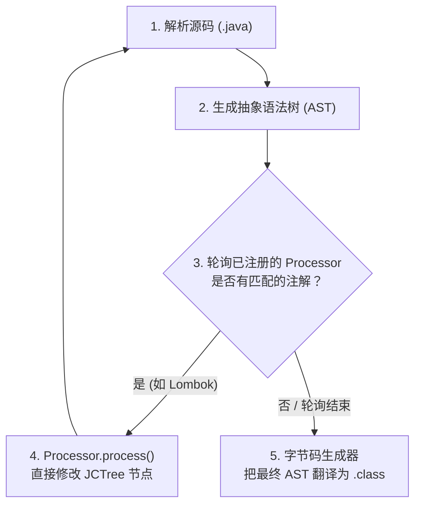

# 注解（Annotation） —— 运行时注解与编译期处理

---

## 1. 业务痛点

### 1.1 三种注解，三种生命周期

三个标注了 `@` 的注解，写法完全一样，运行时行为却截然不同：

- Lombok 的 `@Data`：编译期生成 `getter/setter` 字节码，但运行时用反射查——不存在。
- Spring 的 `@Transactional`：完整保留到运行时，反射可以读取传播行为、回滚规则等属性。
- Google AutoService 的 `@AutoService`：编译期生成 `META-INF/services` 后即被丢弃，既不进 `.class`，也不入内存。

差异的根因不在注解本身——注解只是附着在类/方法/字段上的一段元数据。决定它何时生效、何时消失的，是它的**保留策略（`@Retention`）**和**消费方（编译器 vs 运行时框架）**的组合。

### 1.2 一个典型场景

自定义权限校验注解如果错将 `@Retention` 设为 `SOURCE` 或 `CLASS`：

```java
@Target(ElementType.METHOD)
@Retention(RetentionPolicy.SOURCE)   // 保留策略决定了运行时能否查到
public @interface RequiresRole { String value(); }

// 切面里：
RequiresRole annotation = method.getAnnotation(RequiresRole.class);
String role = annotation.value();  // NPE —— 运行时注解已被丢弃
```

这类问题在开发环境下可能不暴露（编译期处理器的行为掩盖了缺失），上线后就是一个难以定位的 NPE。根因通常只有一个：**声明注解的人与消费注解的人，对保留策略的理解不一致**。

要理清这个问题，需要直接看 `.class` 文件中注解的真实存储形态。

---

## 2. 字节码考古

先明确一个基本事实：**Java 注解在 `.class` 文件中没有任何可执行指令，它只是附着在类、方法、方法参数或字段上的一段属性表（Attribute Table）内的只读元数据**。

### 2.1 属性表里的贴纸：`RuntimeVisibleAnnotations`

反编译一段被 `@RequiresRole("ADMIN")` 修饰的方法，通过 `javap -p -v OrderService.class` 查看其底层的二进制属性区：

```text
public void cancelOrder(java.lang.String);
  descriptor: (Ljava/lang/String;)V
  flags: (0x0001) ACC_PUBLIC
  Code:
    stack=0, locals=2, args_size=2
       0: return
    LineNumberTable:
      line 12: 0

  // 附着在方法末尾的附加属性表
  RuntimeVisibleAnnotations:
    0: #15(#16=s#17)
      com/example/RequiresRole(
        value="ADMIN"
      )
```

在 `Code:` 属性区的 `0: return` 之外，JVM 为这个方法额外挂了一块 `RuntimeVisibleAnnotations` 属性表。里面用 KV 格式记录着：方法上贴着一张叫 `com/example/RequiresRole` 的标签，参数 `value` 指向常量池里的字符串 `"ADMIN"`。

关键结论——**注解只是一段附加数据，对方法自身的字节码执行流程没有任何主动干预**。JVM 主执行引擎运行 `cancelOrder` 时并不会读取这块属性表，只有业务代码主动通过反射查询，注解元数据才会被解析出来。

!!! note "📖 术语家族：`Runtime*Annotations`"
    **字面义**：“运行时可见的注解集合”。
    **在字节码规范中的含义**：附在 `ClassFile` / `field_info` / `method_info` / `Code` 结构上的**只读属性表**之一（JVMS §4.7），不产生任何可执行指令。
    **同家族成员**：

| 成员 | 附着位置 | 类加载时留存状态 | 规范出处 |
    | :-- | :-- | :-- | :-- |
    | `RuntimeVisibleAnnotations` | 类 / 方法 / 字段 | 读入元空间常驻 | JVMS §4.7.16 |
    | `RuntimeInvisibleAnnotations` | 同上 | 读入后丢弃 | JVMS §4.7.17 |
    | `RuntimeVisibleParameterAnnotations` | 方法参数 | 读入元空间常驻 | JVMS §4.7.18 |
    | `RuntimeInvisibleParameterAnnotations` | 方法参数 | 读入后丢弃 | JVMS §4.7.19 |
    | `RuntimeVisibleTypeAnnotations` | 类型使用位置（Java 8+） | 读入元空间常驻 | JVMS §4.7.20 |
    | `RuntimeInvisibleTypeAnnotations` | 同上 | 读入后丢弃 | JVMS §4.7.21 |

    **命名规律**：`Runtime{Visible|Invisible}[Parameter|Type]Annotations` = 【类加载时是否留存】 × 【贴在什么位置】。`Visible` 与否取决于注解声明时的 `@Retention`：`RUNTIME` → `Visible`，`CLASS`（默认）→ `Invisible`，`SOURCE` → 完全不写入。
    **易混点**：`RuntimeInvisibleAnnotations` 不是“无用”。它对运行时反射隐形，但字节码分析器（如 IDEA 的 `NotNull` 检查、SpotBugs、ProGuard）依然能看到它们。

### 2.2 注解本身：一个特殊的接口

既然注解本身没有行为，那我们反编译注解自身的编译产物 `RequiresRole.class`，看看注解在字节码层面究竟是什么：

```volt
public interface com.example.RequiresRole extends java.lang.annotation.Annotation
  minor version: 0
  major version: 65
  flags: (0x2601) ACC_PUBLIC, ACC_INTERFACE, ACC_ABSTRACT, ACC_ANNOTATION
```

结论清晰：**注解在字节码层面就是一个继承了 `java.lang.annotation.Annotation` 的接口**，`ACC_ANNOTATION` 标志只是编译器给它多打的一个身份标记。

既然是接口，注解上声明的属性（如 `String value();`）在字节码里也就是普通的**抽象方法（`ACC_ABSTRACT`）**。

### 2.3 运行时的动态代理（$Proxy）

这里出现了一个看上去矛盾的问题：

既然注解在运行时只是方法区里一段只读元数据字符串，注解类型本身又只是抽象接口，那下面这段反射代码为什么能顺利执行并拿到返回值？

```java
RequiresRole anno = method.getAnnotation(RequiresRole.class);
String role = anno.value(); // anno 是接口，value() 是抽象方法，怎么就能执行了？
```

抽象接口不能直接 `new` 并调用方法，那 `anno.value()` 执行的到底是什么？

我们通过在程序启动时加上 JVM 参数 `-Dsun.misc.ProxyGenerator.saveGeneratedFiles=true`（或在新版本 JDK 中使用 `-Djdk.proxy.ProxyGenerator.saveGeneratedFiles=true`），将 JVM 在运行时生成的内部类全部 Dump 到磁盘上。运行之后，你会发现你的项目根目录下多出了一个内部类文件：**`$Proxy0.class`**。我们立刻将其反编译：

```java
// JVM 在运行时生成的代理类
public final class $Proxy0 extends Proxy implements RequiresRole {
    
    private static Method m3; // 对应 RequiresRole.value() 方法

    public $Proxy0(InvocationHandler var1) {
        super(var1);
    }

    // 你调用的 anno.value() 实际执行的是这里
    public final String value() {
        try {
            // 将调用转发给 AnnotationInvocationHandler 处理器
            return (String)super.h.invoke(this, m3, (Object[])null);
        } catch (RuntimeException | Error var2) {
            throw var2;
        } catch (Throwable var3) {
            throw new UndeclaredThrowableException(var3);
        }
    }
}
```

过程是这样的：当运行时首次调用 `method.getAnnotation(RequiresRole.class)`：

1. JVM 拿着当前方法的程序计数器指针，去方法区的类元数据里翻看 `RuntimeVisibleAnnotations` 属性表。
2. 找到了字符串 `"ADMIN"` 后，JVM 的 `sun.reflect.annotation.AnnotationParser` 核心组件启动。
3. 它在堆内存中动态拼装、并当场向 JVM 注册一个专门实现了你这个注解接口的 JDK 动态代理类（$Proxy）。
4. 这个代理类内部持有一个 Map，里面塞满了从属性表里读出来的配置（如 {"value", "ADMIN"}）。
5. 最终返回给你的 `anno` 引用，是一个封装了 `AnnotationInvocationHandler` 的 JDK 动态代理实例。调用 `anno.value()` 实际上是查询这个运行时 Map 中的只读字符串。

运行时注解的运作机制：`RuntimeVisibleAnnotations` 属性表提供存储，`AnnotationParser` + JDK 动态代理提供访问层。下一层要回答的是 Lombok / Spring / AutoService 三种注解的生命周期差异——这取决于 `RetentionPolicy` 与 APT。

---

## 3. 生命周期与编译期织入

前两层已经说明了运行时注解（`RUNTIME`）依赖 **`RuntimeVisibleAnnotations` 属性表** 与 **JDK 动态代理（`$Proxy`）** 的运作方式。

但并非所有注解都需要活到运行时——如果每一个注解都要通过反射查表并生成代理类，元空间占用与首次调用的开销都是可观的浪费。为此，Java 在语法层用 `RetentionPolicy` 给出了三档保留策略，并配套演化出完全消除运行时开销的编译期机制——**APT（Annotation Processing Tool）**。

### 3.1 三大保留策略（`RetentionPolicy`）的内存本质分野

在语法层，通过 `@Retention` 决定注解的保留级别。在 JVM 的内存结构中，这三级策略直接决定了元数据在内存中的是否留存：

```txt
 源码文件 (.java) ───────► 字节码文件 (.class) ───────► JVM 方法区内存 (Metaspace)
 
 ┌─────────────────────────────────────────────────────────────────────────┐
 │ [RetentionPolicy.SOURCE]                                                │
 │   仅存活于源码，javac 完成语义分析后即被丢弃，【不写入 .class 文件】               │
 ├─────────────────────────────────────────────────────────────────────────┤
 │ [RetentionPolicy.CLASS] (默认)                                           │
 │   编译后写入 .class 文件的属性表（如 RuntimeInvisibleAnnotations），         │
 │   但在类加载器（ClassLoader）将其读入内存时，【直接丢弃，不常驻内存】            │
 ├─────────────────────────────────────────────────────────────────────────┤
 │ [RetentionPolicy.RUNTIME]                                               │
 │   编译后写入 .class 文件的 RuntimeVisibleAnnotations 属性表，               │
 │   类加载时随之【读入元空间（Metaspace）】，常驻内存，供运行时反射查表             │
 └─────────────────────────────────────────────────────────────────────────┘
```

结合这层内存差异回看 §1.1 的三个案例：

- Lombok 的 `@Data` 声明 `SOURCE`。编译为 `.class` 文件前已被丢弃，运行时反射无法查到。
- Spring 的 `@Transactional` 声明 `RUNTIME`。常驻元空间，供 Spring 在运行时通过反射读取其中的元数据。
### 3.2 APT 的编译期机制：直接改写抽象语法树（AST）

既然 SOURCE 级别的注解在编译后就消失了，那 Lombok 的 `@Data` 是怎么变出 `getter/setter` 字节码的？

答案是编译期注解处理器（APT，Annotation Processing Tool）——**它本质是运行在 `javac` 内部的一个插件**。`javac` 编译一个 `.java` 文件时不是一步到位，而是一个循环：



这里的核心区别是：**APT 改的是 AST，不是字节码**。Lombok 与字节码增强工具（ASM / Byte Buddy / Javassist）在原理上是两条不同的路——后者是在 `.class` 生成之后再改，前者是在 `.class` 生成之前就已经改好。

真正执行修改的位置在第 4 步。Lombok 走的不是标准 `javax.lang.model` API（那套 API 只能“读” AST、官方只允许“生成新文件”），而是**直接拿到 `javac` 内部的 `JavacProcessingEnvironment`，强转拿到该类的 AST——`com.sun.tools.javac.tree.JCTree`**，直接往里面插新节点。伪代码大致长这样：

```java
// Lombok 处理 @Getter 的简化逻辑（仅伪代码，说明关键步骤）
public void handleGetter(JCVariableDecl field, JavacNode fieldNode) {
    JavacTreeMaker maker = fieldNode.getTreeMaker();  // 拿到 javac 的节点工厂
    JCClassDecl classDecl = (JCClassDecl) fieldNode.up().get();  // 拿到字段所在的类节点

    // 手工拼一个 getter 方法节点：public <Type> get<Name>() { return this.<name>; }
    JCMethodDecl getter = maker.MethodDef(
        maker.Modifiers(Flags.PUBLIC),
        fieldNode.toName("get" + capitalize(field.name.toString())),
        (JCExpression) field.vartype.clone(),          // 返回类型 = 字段类型
        List.nil(), List.nil(), List.nil(),
        maker.Block(0, List.of(                        // 方法体：return this.<name>;
            maker.Return(maker.Select(maker.Ident(fieldNode.toName("this")), field.name))
        )),
        null);

    // 把新节点直接接到类的成员列表上（这一行是真正的“织入”）
    classDecl.defs = classDecl.defs.append(getter);
}
```

这里有两个需要看清的细节：

1. **`JCTree.JC*` 是 `javac` 内部 AST 节点家族**。`JCClassDecl` / `JCMethodDecl` / `JCVariableDecl` / `JCExpression` 分别代表类声明、方法声明、变量声明、表达式——基本与 Java 语法中的“声明类型”一一对应（`JC` = **J**ava **C**ompiler）。
2. **改的是类内部的 `defs` 链表**。Java 中一个类的方法、字段、内部类，在 AST 中全部管在 `JCClassDecl.defs` 上。往里面 `append` 一个 `JCMethodDecl`，相当于在源码里多写了一个方法——`javac` 后续的语义分析、字节码生成阶段会把它当作“你自己写的”来处理。

这就是 Lombok 能“凭空变出 `getter`”的原因：它在 `javac` 生成字节码之前就修改了 AST，**后续编译流程看到的已经是一份包含 `getter` 声明的源码**。代价是依赖 `com.sun.tools.javac.*` 内部 API——JDK 9 模块化后需要 `--add-opens=jdk.compiler/com.sun.tools.javac.tree=ALL-UNNAMED` 才能继续运作，这也是 Lombok 每次 JDK 大版本升级都要重新适配的原因。

**APT 把本该运行时通过反射 + 代理完成的工作提前到了编译期**，产物与手写字节码等价，运行时零额外开销。

---

### 3.3 Runtime 注解真正的工作模式：从 Annotation 到 Metadata

很多开发者学完运行时注解后，会产生一个误解：
> `method.getAnnotation()` 返回了一个 Annotation 对象，所以框架每次执行业务逻辑时，都在不停地读取这个 Annotation。

实际上，现代 Java 框架几乎都不会这样工作。运行时注解（`RetentionPolicy.RUNTIME`）最大的价值，并不是让框架在业务执行过程中反复去操作 Annotation 对象，**而是在框架启动阶段提供一份元数据（Metadata）**。框架读取完这些元数据后，会立即转换成自己的内部数据结构，并缓存下来，后续运行过程中几乎不会再次解析注解。

整个过程可以抽象成下面这条统一的处理链路：

```text
              ClassFile
                   │
                   ▼
     RuntimeVisibleAnnotations
                   │
                   ▼
        Framework Reflection Scan
                   │
                   ▼
          AnnotationParser
                   │
                   ▼
         Annotation Proxy Object
                   │
                   ▼
     Framework Metadata Conversion
                   │
                   ▼
        ConcurrentHashMap Cache
                   │
                   ▼
          Runtime Framework Logic
```

这是几乎所有 Runtime 注解框架都会遵循的工作模式。。例如，在 Spring 中，`@Transactional` 会被解析成 `TransactionAttribute`；在 Jackson 中，`@JsonProperty` 会被解析成属性描述模型；在 Hibernate 中，`@Column` 会被解析成实体映射信息；在 JUnit 中，`@Test` 会被解析成测试描述对象。这些框架虽然用途完全不同，但处理流程却高度一致：

1. 扫描 Annotation；
2. 解析 Annotation；
3. 转换成框架自己的 Metadata；
4. 缓存 Metadata；
5. 运行阶段直接使用 Metadata，而不是重新解析 Annotation。

以 Spring 为例，当容器启动时，Spring 会扫描 Bean 上的 `@Transactional`，通过反射读取 `RuntimeVisibleAnnotations` 属性，并解析出事务传播行为、隔离级别、回滚规则等配置信息。随后，这些信息会被封装成 `TransactionAttribute`，缓存在 `TransactionAttributeSource` 中。因此，当业务方法真正执行时，Spring 并不会再次调用：`method.getAnnotation(Transactional.class)`，而是直接根据 Method 从缓存中取得已经构建好的 TransactionAttribute，随后决定是否开启事务、传播事务或提交回滚。也就是说，真正驱动事务行为的，已经不是 Annotation 对象，而是框架内部维护的 Metadata。

这一点非常重要，因为它揭示了 Runtime 注解的真正定位：
> Annotation 并不是业务逻辑，它只是业务逻辑的配置描述；真正参与运行的是框架根据 Annotation 构建出来的 Metadata。

也正因为如此，现代框架都会尽量把 Annotation 的解析工作集中到启动阶段完成，把解析结果缓存起来，将运行阶段的开销降到最低。对于绝大多数业务系统而言，运行时方案的主要成本已经不是"重复解析注解"，而是维护代理对象、拦截器链以及运行时元数据体系本身。

从架构角度来看，这也是 Runtime 注解与 APT 编译期方案最大的区别。

APT 在编译阶段直接修改抽象语法树（AST）或生成新的 Java 源码，最终运行时执行的是已经生成好的普通代码；而 Runtime 注解则选择把元数据保留到 Class 文件中，由框架在运行期间读取、解析、缓存，并据此驱动整个框架的行为。

因此，两者最大的区别并不只是"一个快、一个慢"，而是**一个把工作前移到了编译期，一个把工作保留到了运行期；一个依赖代码生成，一个依赖运行时元数据驱动（Runtime Metadata Driven）模型**。

APT 让“代码“参与运行，而 Runtime 注解让“元数据（Metadata）“参与运行。理解了这一点，就理解了现代 Java 框架几乎所有基于注解设计的底层思想。

---

## 4. 工程红线与自定义注解设计

§3.3 揭示了 Runtime 注解在框架中的真正工作模式——Annotation 在启动阶段被读取，转换成框架内部 Metadata 并缓存，运行阶段直接使用 Metadata。自定义注解设计时也应遵循这条主线：**生命周期正确 → 一次解析 → Metadata 化 → 避免硬编码**。以下三条工程红线均围绕这条主线展开。

### 4.1 🚨 工程红线 1：严格区分 `RetentionPolicy`，避免无意义的运行时元数据

`RetentionPolicy` 决定了注解存在的生命周期边界。很多开发者习惯直接写 `@Retention(RetentionPolicy.RUNTIME)`，因为 Spring、Hibernate 等框架大量使用 Runtime 注解，但这并不是默认选择——注解的 Retention 应该由**消费者**决定：

- 如果注解只服务于编译器检查、APT 代码生成或静态分析工具，`SOURCE` 或 `CLASS` 通常更合适；
- 只有当框架需要在运行阶段通过反射读取注解时，才需要 `RUNTIME`。

错误选择 `RUNTIME` 的本质，是让一个本不需要参与运行时系统的信息进入了 `RuntimeVisibleAnnotations` 属性表，进而被 JVM 加载到元空间。这不是简单的"浪费几个字节"——从 §2 的视角看，这是在注解的生命周期上做了错误决策：把"编译期一次性消费"的元数据标记为"运行时常驻"。

```java
// ❌ 反模式：仅用于 APT 代码生成的注解声明为 RUNTIME
@Retention(RetentionPolicy.RUNTIME)
public @interface GenerateDto { }

// ✅ 标准范式：由消费者决定 Retention
@Retention(RetentionPolicy.SOURCE)   // 仅编译期代码生成
public @interface GenerateDto { }
```

### 4.2 🚨 工程红线 2：不要让 Runtime Annotation 直接参与高频业务判断

Runtime 注解本质上是一种配置声明。例如：

```java
@RequiresRole("ADMIN")
public void deleteUser() { ... }
```

它描述的是"这个方法需要 ADMIN 角色"。但运行时真正需要的不是 Annotation 对象本身，而是一份可直接用于权限判断的元数据（Metadata）：

```java
// 运行时真正需要的数据结构
class PermissionMetadata {
    Set<String> roles;
    String resource;
    String action;
}
```

正确的模式应当是 **Annotation → Metadata → Cache → Runtime Check**：

```java
// ✅ 标准范式：启动阶段一次解析，缓存 Metadata，运行阶段直接使用
@Component
public class PermissionInterceptor {
    private final Map<Method, PermissionMetadata> cache = new ConcurrentHashMap<>();

    @PostConstruct
    public void init() {
        // 启动阶段：扫描所有方法，构建 Method → PermissionMetadata 映射并缓存
        for (Method method : scanAnnotatedMethods()) {
            RequiresRole anno = method.getAnnotation(RequiresRole.class);
            cache.put(method, new PermissionMetadata(Set.of(anno.value())));
        }
    }

    public boolean checkPermission(Method method) {
        PermissionMetadata metadata = cache.get(method);
        // 运行阶段：直接从缓存取 Metadata，不再触碰 Annotation
        return metadata != null && hasPermission(metadata);
    }
}
```

这与 §3.3 中 Spring 处理 `@Transactional` 的模式完全一致：`@Transactional` → `TransactionAttribute` → 缓存 → `TransactionInterceptor`。Annotation 只是配置的入口，Metadata 才是运行时的主语。

### 4.3 🚨 工程红线 3：避免 Annotation 成为不可演进的硬编码协议

Java Annotation 有一个天然限制：属性必须是编译期常量（JLS §9.6.1）。这使得 Annotation **天生适合稳定声明，不适合动态配置**。

直接把业务参数写死在注解里，意味着每次调整参数都需要修改源码、重新编译、重新部署：

```java
// ❌ 反模式：业务参数硬编码在注解中，改 QPS 需要重新编译部署
@RateLimit(qps = 100)
public void createOrder() { ... }
```

更好的方式是把 Annotation 当作配置的 Key，真正的参数放在运行时可以动态调整的外部配置中：

```java
// ✅ 标准范式：Annotation 只做 Key，运行时从外部配置读取参数
@RateLimit("order.create")   // "order.create" 只是配置的键
public void createOrder() { ... }

// 真正配置在运行时可动态调整的外部文件中
// rate-limit:
//   order.create:
//     qps: 200
```

这样 Annotation 本身不再承担"携带可变参数"的职责，退回到它最擅长的岗位：**为方法打上一个稳定的、编译期可校验的标签**。运行时框架根据这个标签去外部配置系统查找真正的参数，既保留了 Annotation 的声明式表达能力，又解除了编译期常量的刚性约束。

当需要"看似动态"的注解参数时，SpEL 字符串延迟求值也是一个标准补充方案——注解上存的仍然是常量字符串（满足 JLS），真正的求值推迟到运行时通过 `SpelExpressionParser` 解析：

```java
@Cacheable(key = "#tenantId + ':' + #id")   // SpEL 表达式，注解上仍是字符串常量
public User findUser(String tenantId, String id) { ... }
```

---

## 5. 🗺️ 跨篇章知识关联

- [反射（Reflection）](@java-字节码-反射与MethodHandle) 展开本篇 §2.3 中反射调用的性能根因：安全检查、无法 JIT 内联、参数装箱，以字节码与 JIT 日志逐条验证。
- [并发基础：JMM 与线程同步](@java-并发-JMM与线程同步) 展开本篇 §2.3 中 `$Proxy0` 代理类在高并发路径上对 JIT 方法内联与逃逸分析的影响。