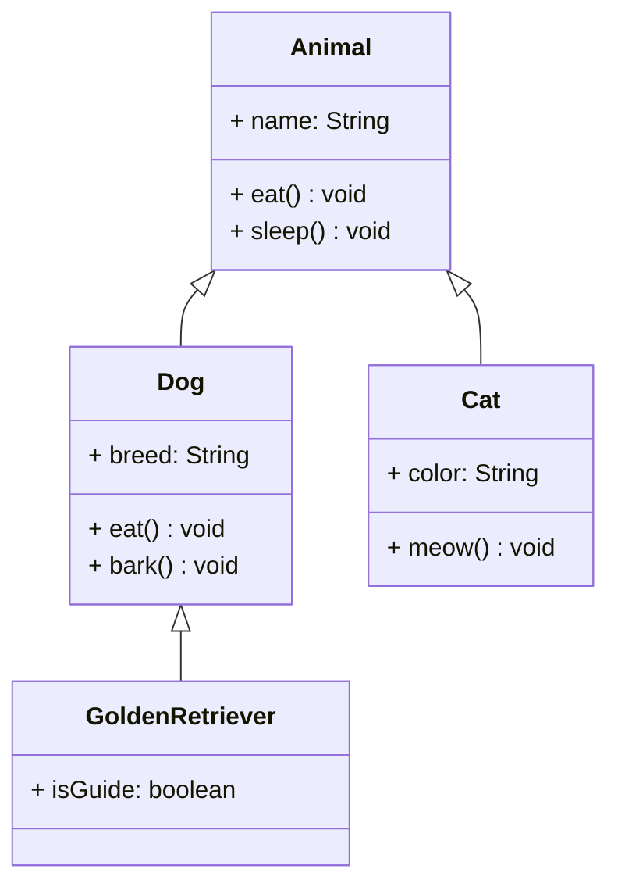
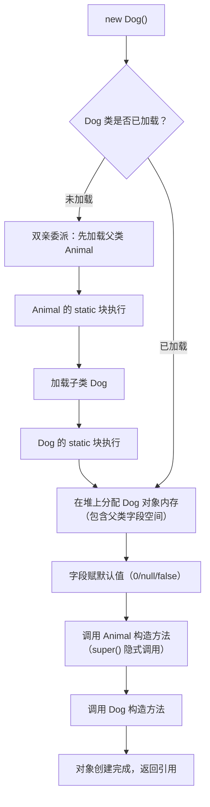
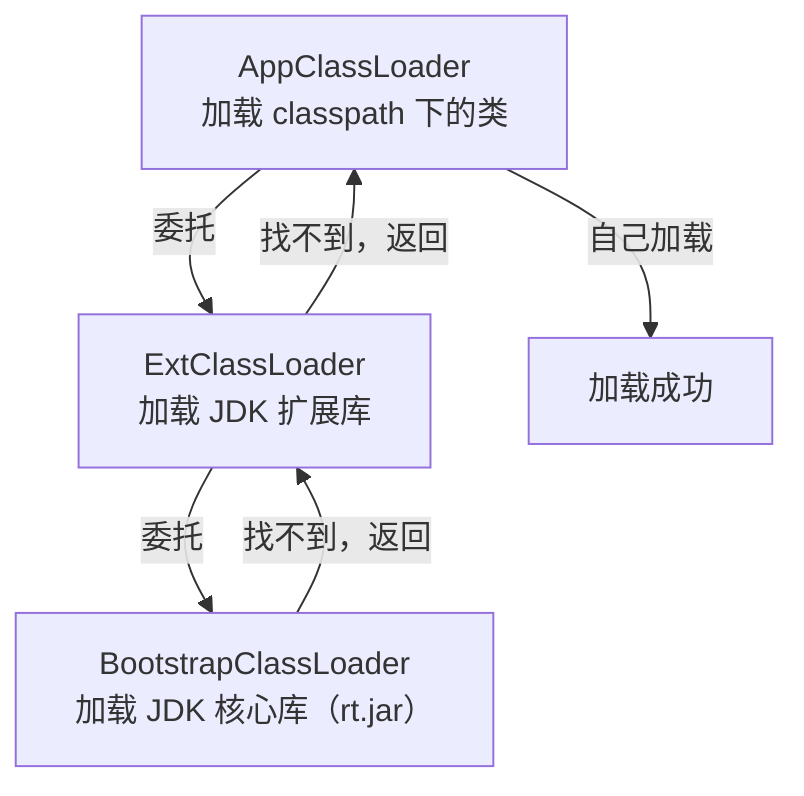
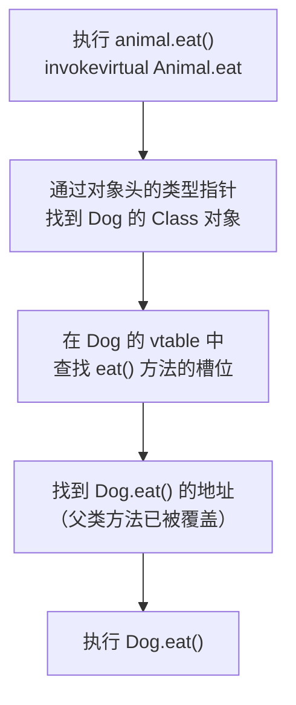
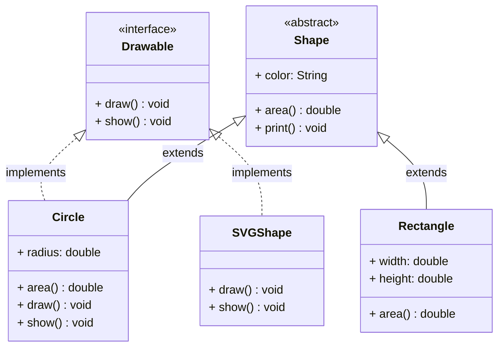
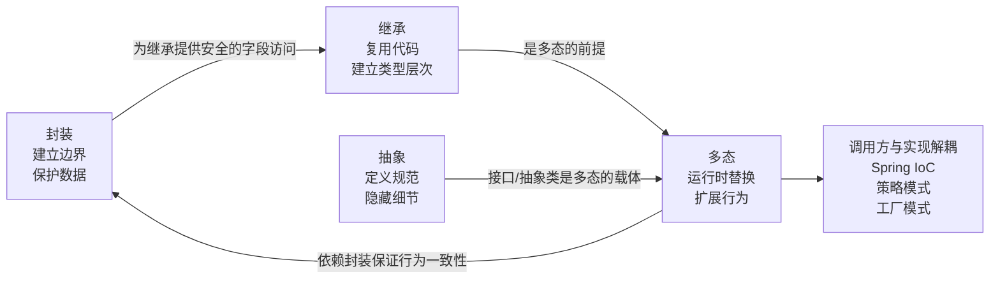

# 面向对象（OOP）

## 1. 为什么需要面向对象？

### 1.1 面向过程的困境

早期的面向过程编程（C 语言风格）将数据和操作分开存放：全局变量满天飞，任何函数都能修改任何数据。随着业务复杂度增长，代码变成一团乱麻：

```txt
Problems of Procedural Programming:

Global Variables Pool              Function Pool
┌──────────────┐           ┌──────────────────────────────┐
│ user_name    │ ←──────── │ login()  logout()  pay()     │
│ user_balance │ ←──────── │ transfer()  query_balance()  │
│ order_list   │ ←──────── │ create_order()  cancel()     │
│ ...          │           │ ...                          │
└──────────────┘           └──────────────────────────────┘
  Any function can directly read/write any data → Chain reaction
```

**核心矛盾**：数据和行为分离，没有边界，没有保护。

### 1.2 面向对象解决的核心问题

| 问题 | OOP 解决方案 | 典型应用 |
| :---- | :------- | :----- |
| 数据被随意篡改 | **封装**：隐藏内部状态，只暴露安全接口 | `BankAccount.deposit()` 校验金额合法性 |
| 代码重复，难以复用 | **继承**：子类复用父类逻辑 | `AbstractList` 提供通用实现 |
| 扩展新功能要改调用方 | **多态**：面向接口编程，运行时替换实现 | Spring IoC 注入不同 Bean |
| 调用方依赖实现细节 | **抽象**：定义规范，隐藏细节 | `Comparable` 接口统一排序规范 |

---

## 2. 封装（Encapsulation）

### 2.1 核心思想

封装的本质是**建立边界**：把数据和操作数据的方法绑定在一起，对外只暴露必要的接口，隐藏内部实现细节。

```java
// ❌ 没有封装：外部可以绕过任何校验
public class BankAccount {
    public double balance;  // 任何人都能直接修改
}
account.balance = -9999;  // 合法！但业务上不允许

// ✅ 封装后：数据始终处于合法状态
public class BankAccount {
    private double balance;  // 外部不可直接访问

    public void deposit(double amount) {
        if (amount <= 0) throw new IllegalArgumentException("金额必须大于0");
        this.balance += amount;  // 校验通过才修改
    }

    public double getBalance() { return balance; }  // 只读
}
```

### 2.2 访问修饰符的可见范围

```txt
Access Modifier Visibility（from narrow to wide）：

                    Same Class  Same Package  Subclass  Other Package
private                ✅            ❌           ❌         ❌
(default/package)      ✅            ✅           ❌         ❌
protected              ✅            ✅           ✅         ❌
public                 ✅            ✅           ✅         ✅
```

### 2.3 封装的 JVM 实现

封装在 JVM 层面通过**访问控制检查**实现，发生在两个阶段：

1. **编译期**：`javac` 检查访问修饰符，违规直接报编译错误
2. **运行期**：JVM 字节码执行时再次校验（防止绕过编译器直接操作字节码）

字节码层面，`private` 方法使用 `invokespecial` 指令调用，**不进入虚方法表**，无法被子类覆盖或外部调用。

!!! tip "反射可以绕过封装"
    `field.setAccessible(true)` 会跳过运行期访问检查。这是框架（如 Spring、MyBatis）能注入私有字段的原因，但业务代码中应避免。

---

## 3. 继承（Inheritance）

### 3.1 继承的本质

继承表达的是 **"is-a"** 关系：子类是父类的一种特化。子类通过 `extends` 继承父类的非 `private` 字段和方法，并可以重写（Override）父类方法。



### 3.2 对象创建时的内存布局

以 `Dog extends Animal` 为例，`new Dog()` 在堆内存中的布局：

```txt
Heap Memory - Dog Object:
┌──────────────────────────────────────────────────────┐
│  Object Header                                       │
│  ├─ Mark Word (8 bytes)                              │
│  │    Stores: hashCode, GC age, lock state flags     │
│  └─ Klass Pointer (4/8 bytes)                        │
│        Points to Dog's Class object in Method Area   │
├──────────────────────────────────────────────────────┤
│  Instance Data                                       │
│  ├─ Parent Fields (Animal's fields first)            │
│  │    name: String reference (4 bytes)               │
│  └─ Child Fields (Dog's fields after)                │
│       breed: String reference (4 bytes)              │
├──────────────────────────────────────────────────────┤
│  Padding                                             |
│  Align to multiple of 8 bytes                        |
└──────────────────────────────────────────────────────┘
```

**方法区（元空间）中的 Class 对象**存储虚方法表：

```txt
Method Area - Dog's Class Object:
┌──────────────────────────────────────────────────────────────┐
│  vtable (Virtual Method Table)                               |
│  ┌────────────────────────────────────────────────────────┐  |
│  │ [0] Object.toString()   → Object.toString address      |  |
│  │ [1] Object.hashCode()   → Object.hashCode address      |  |
│  │ [2] Object.equals()     → Object.equals address        |  |
│  │ [3] Animal.eat()        → Dog.eat address (overridden) |  |
│  │ [4] Animal.sleep()      → Animal.sleep address         |  |
│  │ [5] Dog.bark()          → Dog.bark address             |  |
│  └────────────────────────────────────────────────────────┘  |
│  Static variables, constant pool, class metadata...          |
└──────────────────────────────────────────────────────────────┘
```

!!! tip "关键"
    vtable 中被子类重写的方法，地址已替换为子类实现的地址。这是多态的底层基础。

### 3.3 类加载与继承顺序

`new Dog()` 触发的完整流程：



**双亲委派模型**：类加载器先委托父加载器尝试加载，父加载器无法加载时才自己加载。



**双亲委派的意义**：防止核心类被篡改。即使你自定义了 `java.lang.String`，BootstrapClassLoader 会优先加载 JDK 的 String，你的类永远不会被加载。

!!! tip "打破双亲委派"
    SPI（如 JDBC 驱动）、OSGi、Tomcat 类隔离等场景需要打破双亲委派，通过自定义 `ClassLoader` 并重写 `loadClass()` 实现。

### 3.4 继承的代价：强耦合

继承是**白盒复用**——子类能看到父类的实现细节，父类的任何修改都可能影响子类。这就是"**脆弱基类问题**"：

```java
// 父类修改了内部实现
class HashSet {
    int addCount = 0;
    public boolean add(E e) { addCount++; ... }
    public boolean addAll(Collection c) {
        addCount += c.size();
        // 内部调用了 add()！
        for (E e : c) add(e);
    }
}

// 子类重写了 add()，导致 addCount 被重复计数
class InstrumentedHashSet extends HashSet {
    @Override
    public boolean add(E e) { addCount++; super.add(e); }
    // addAll([1,2,3]) 后 addCount = 6，而不是 3！
}
```

```txt
set.addAll(List.of(1, 2, 3));  // 一次性加 3 个元素
addAll([1,2,3])
  └─ 父类 addAll 内部循环，调用 3 次 add()
       └─ 多态！实际调用的是子类的 add()
            └─ 子类 add() 里 addCount++（又 +1）
                 └─ super.add(e) 真正插入元素

结果：addAll 被调用 1 次（+3），子类 add 被调用 3 次（+3）
      addCount = 3 + 3 = 6  ← 重复计数了！
```

子类根本不知道父类的 addAll() 内部会调用 add()，这是父类的实现细节。父类哪天改了内部实现（比如不再调用 add() 了），子类的行为又会悄悄变化。这就是"脆弱基类"——父类的内部实现细节像地雷一样埋在那里，子类一不小心就踩到。

!!! recommend
    **原则**：继承表达 "is-a" 关系，不确定时**优先用组合**（"has-a"）。
    《Effective Java》第 18 条：复合优先于继承。只有在子类真正是父类的子类型时，才适合使用继承；否则应使用组合 + 转发，避免脆弱基类问题。

---

## 4. 多态（Polymorphism）

### 4.1 多态的本质

多态的本质是：**同一个消息，发给不同的对象，产生不同的行为**。父类引用指向子类对象，运行时根据对象的实际类型决定调用哪个方法（**动态分派**）。

```java
// 编译时类型是 Animal，运行时类型是 Dog
Animal animal = new Dog();
animal.eat();  // 实际调用 Dog.eat()，而不是 Animal.eat()
```

### 4.2 动态分派：invokevirtual 指令

多态通过 `invokevirtual` 字节码指令实现：



**四种方法调用指令对比**：

| 指令 | 用途 | 绑定时机 | 支持多态 |
| :--- | :--- | :----- | :---: |
| `invokevirtual` | 调用实例方法（虚方法） | 运行时（查 vtable） | ✅ |
| `invokeinterface` | 调用接口方法 | 运行时（查 itable） | ✅ |
| `invokespecial` | 构造方法、private 方法、super 方法 | 编译期静态绑定 | ❌ |
| `invokestatic` | 静态方法 | 编译期静态绑定 | ❌ |
| `invokedynamic` | Lambda、动态语言支持（JDK 7+） | 运行时动态链接 | ✅ |

### 4.3 多态失效的四种场景

#### ① 字段访问（最常见误区）

```java
class Animal { String name = "Animal"; }
class Dog extends Animal { String name = "Dog"; }  // 字段隐藏，不是重写

Animal animal = new Dog();
System.out.println(animal.name);       // 输出：Animal（多态不生效！）
System.out.println(animal.getName());  // 输出：Dog（方法多态生效）
```

**根本原因**：字段访问使用 `getfield` 指令，编译期直接将字段偏移量硬编码为声明类型的偏移量，运行时不查 vtable。

```txt
Dog Object Memory Layout:
┌────────────────────────────────────────────────────────────────────────┐
│  offset+0: Animal.name = "Animal"  ← animal.name bound at compile time |
│  offset+4: Dog.name = "Dog"        ← Dog's name stored further         |
└────────────────────────────────────────────────────────────────────────┘
```

**JVM 为什么字段不支持多态？**

- **性能**：字段访问是最频繁的操作，静态偏移量比动态查表快得多
- **语义**：字段是数据，属于声明它的类；方法是行为，才需要多态
- **避免歧义**：父子类同名字段若都多态，语义极其复杂

#### ② 静态方法

```java
Animal animal = new Dog();
animal.staticMethod();  // 输出：Animal static（多态不生效！）
// 静态方法使用 invokestatic，编译期绑定到声明类型 Animal
```

#### ③ private 方法

```java
class Animal {
    private void secret() { System.out.println("Animal"); }
    void callSecret() { secret(); }  // invokespecial，绑定到 Animal.secret
}
class Dog extends Animal {
    private void secret() { System.out.println("Dog"); }  // 新方法，不是重写！
}

new Dog().callSecret();  // 输出：Animal（Dog.secret 不构成重写）
```

#### ④ 构造方法中调用可重写方法（危险！）

```java
class Animal {
    Animal() {
        init();  // ⚠️ 危险：此时 Dog 对象还未完全初始化
    }
    void init() { System.out.println("Animal init"); }
}
class Dog extends Animal {
    private String name = "旺财";
    @Override
    void init() {
        System.out.println("Dog init: " + name);  // 输出：Dog init: null ！
        // name 此时还是 null，因为 Dog 的字段初始化在父类构造方法之后
    }
}
```

**多态失效场景总结**：

| 场景 | 字节码指令 | 绑定时机 | 多态 |
| :--- | :----- | :----- | :---: |
| 普通实例方法 | `invokevirtual` | 运行时（查 vtable） | ✅ |
| 接口方法 | `invokeinterface` | 运行时（查 itable） | ✅ |
| 字段访问 | `getfield/putfield` | 编译期（偏移量） | ❌ |
| 静态方法 | `invokestatic` | 编译期 | ❌ |
| private 方法 | `invokespecial` | 编译期 | ❌ |
| 构造方法 | `invokespecial` | 编译期 | ❌ |

---

## 5. 抽象（Abstraction）

### 5.1 抽象的两种形式

抽象的目标是：**定义规范，隐藏细节，让调用方面向接口编程**。



### 5.2 接口 vs 抽象类：深度对比

| 对比维度 | 接口（Interface） | 抽象类（Abstract Class） |
| :------ | :------------- | :-------------------- |
| **设计语义** | **能力契约**（"我能做什么"） | **模板骨架**（"我们有共同的基础"） |
| **继承限制** | 可多实现（`implements`） | 只能单继承（`extends`） |
| **字段** | 只能是 `public static final` 常量 | 可以有任意实例字段 |
| **构造方法** | ❌ 没有 | ✅ 有，子类必须调用 |
| **方法实现** | Java 8+ 支持 `default`/`static` 方法 | 可以有任意具体方法 |
| **访问修饰符** | 方法默认 `public` | 无限制 |
| **典型例子** | `Serializable`、`Comparable`、`Runnable` | `AbstractList`、`HttpServlet`、`AbstractBeanFactory` |

**选择原则**：

- 定义**跨类族的能力**（如"可序列化"、"可比较"）→ 用**接口**（不同类族都可以实现）
- 提供**公共实现骨架**，子类只需实现差异部分 → 用**抽象类**（模板方法模式）

!!! recommend
    JDK 中的最佳实践：先定义接口（如 `List`），再提供抽象骨架类（如 `AbstractList`），最后提供具体实现（如 `ArrayList`）。这种「接口 + 骨架类」的组合兼顾了灵活性和代码复用。

### 5.3 接口的 JVM 实现：itable

类实现接口时，JVM 为每个接口维护一张 **itable（接口方法表）**：

```txt
Dog 实现了 Runnable 接口：

Dog 的 Class 对象：
┌─────────────────────────────────────────────────────┐
│  vtable (Virtual Method Table)                      │
│  [0] eat() → Dog.eat address                        │
│  [1] sleep() → Animal.sleep address                 │
│  ...                                                │
├─────────────────────────────────────────────────────┤
│  itable (Interface Method Table)                    │
│  [Runnable interface]                               │
│    run() → Dog.run address                          │
│  [Comparable interface] (if implemented)            │
│    compareTo() → Dog.compareTo address              │
└─────────────────────────────────────────────────────┘
```

`invokeinterface` 比 `invokevirtual` 稍慢，因为需要先在 itable 中查找对应接口，再找到方法地址。

!!! tip "JIT 内联优化"
    实际运行中，JIT 编译器会对高频调用的接口方法进行**内联缓存（Inline Cache）**优化：记录上次调用的实际类型，下次直接命中缓存，避免重复查表，性能接近静态调用。

### 5.4 Java 为什么不支持类的多继承？

**菱形继承问题（Diamond Problem）**：

```txt
        A
       / \
      B   C
       \ /
        D

若 B 和 C 都重写了 A 的方法 foo()，
D 继承时：D.foo() 应该用 B 的版本还是 C 的版本？
→ 产生歧义，vtable 中无法确定 foo() 的地址
```

Java 的解决方案：**单继承 + 接口多实现**。接口的 `default` 方法冲突时，强制开发者显式重写解决：

```java
interface A { default void hello() { System.out.println("A"); } }
interface B { default void hello() { System.out.println("B"); } }

class C implements A, B {
    @Override
    public void hello() {
        A.super.hello();  // 必须显式指定，否则编译报错
    }
}
```

??? note "思考一下：既然接口可以通过显示调用来解决冲突，为什么继承不可以？"
    核心差异：状态（State）

    | 接口 | 类 |
    | :-- | :-- |
    |有实例字段？|❌ 没有|✅ 有|
    |有构造方法？|❌ 没有|✅ 有|
    |default 方法冲突时|只是行为冲突，显式重写即可|字段、构造、状态全部冲突，无法调和|

    假设 Java 允许多继承，并且你可以写 A.super.foo()：
    ```java
    class A {
        private int x = 10;       // A 有自己的 x
        void foo() { x++; }
    }
    class B {
        private int x = 20;       // B 也有自己的 x
        void foo() { x++; }
    }
    // 假设允许多继承：
    class C extends A, B {
        @Override
        void foo() {
            A.super.foo();  // ← 这里操作的是哪个 x？
        }
    }
    ```

    问题来了：
    ```txt
    C 对象的内存布局应该是什么？

    方案1：同时包含 A.x 和 B.x
    ┌──────────────────────────────────────┐
    │  A.x = 10                            |
    │  B.x = 20   ← 两份 x，哪个是"真正的" x？|
    └──────────────────────────────────────┘

    方案2：只保留一份 x
    → 那 A.foo() 和 B.foo() 操作的是同一个 x，
    语义完全乱了，A 和 B 的封装被破坏
    ```

    构造方法的问题同样无解
    ```java
    class A { A() { System.out.println("A init"); } }
    class B { B() { System.out.println("B init"); } }

    // 假设允许多继承：
    class C extends A, B {
        C() {
            // super() 应该调用谁？A() 还是 B()？
            // 调用顺序是什么？
            // 如果 A() 和 B() 都修改了同一个继承来的字段，结果是什么？
        }
    }
    ```
    接口没有状态，冲突只是"选哪段代码"的问题，可以由开发者显式解决；类有状态（字段 + 构造方法），冲突是"内存如何布局、状态如何初始化"的问题，强制指定也无法从根本上解决。

    这也是为什么 C++ 虽然支持多继承，但引入了极其复杂的虚继承（virtual inheritance）机制来处理菱形问题——即便如此，C++ 的多继承也被认为是语言中最容易踩坑的特性之一。Java 直接选择了更简洁的方案：单继承 + 接口多实现。

---

## 6. 四大特性的关系与协作

四大特性不是孤立的，它们相互依赖、协同工作：



**实际工程中的体现**：

| 设计模式 / 框架特性 | 依赖的 OOP 特性 |
| :-------------- | :-------------- |
| Spring IoC 依赖注入 | 多态（面向接口）+ 抽象（接口定义） |
| 模板方法模式 | 继承 + 抽象类 |
| 策略模式 | 多态 + 接口 |
| 装饰器模式 | 组合 + 多态 |
| MyBatis Mapper 代理 | 抽象（接口）+ 动态代理（invokedynamic） |

---

## 7. 常见误区与陷阱

### ❌ 误区1：为复用代码而继承（语义错误）

```java
// ❌ 错误：Stack "是" ArrayList？语义不对！
// 导致 Stack 暴露了 add(index, element)、remove(index) 等不该有的方法
class Stack extends ArrayList {
    public void push(Object item) { add(item); }
    public Object pop() { return remove(size() - 1); }
}

// ✅ 正确：组合优于继承（"has-a"）
class Stack {
    private final ArrayList<Object> list = new ArrayList<>();
    public void push(Object item) { list.add(item); }
    public Object pop() { return list.remove(list.size() - 1); }
    public int size() { return list.size(); }
    // 只暴露 Stack 应该有的方法
}
```

### ❌ 误区2：接口滥用 default 方法

`default` 方法是为了**接口演化**（在不破坏已有实现的前提下给接口加新方法），不应将接口当抽象类用。如果需要共享状态（字段）和实现，应该用抽象类。

!!! tip
    `default` 方法的典型用途：`Collection.stream()`、`Iterable.forEach()` 都是 JDK 8 为已有接口新增功能时使用的，保证了对老版本实现类的向后兼容。

### ❌ 误区3：构造方法中调用可重写方法

见 §4.3 ④，父类构造方法中调用的虚方法会被子类重写版本拦截，而此时子类字段尚未初始化，极易产生 NPE 或逻辑错误。

**规则**：构造方法中只调用 `private`、`final`、`static` 方法（这些方法不会被重写）。

!!! recommend
    构造方法应保持简单，只做字段赋值。复杂的初始化逻辑应放到工厂方法或 `init()` 方法中，由调用方显式调用，避免构造期多态带来的隐患。

### ❌ 误区4：equals/hashCode 违反封装

```java
// ❌ 直接访问另一个对象的私有字段（某些语言允许，Java 也允许同类访问）
// 但更好的做法是通过 getter，保持封装一致性
@Override
public boolean equals(Object o) {
    if (!(o instanceof Point)) return false;
    Point p = (Point) o;
    return this.x == p.x && this.y == p.y;  // 同类访问私有字段，Java 允许
}

// ⚠️ 重写 equals 必须同时重写 hashCode！
// 否则违反"相等的对象必须有相同的 hashCode"约定
// 导致 HashMap/HashSet 行为异常
@Override
public int hashCode() {
    return Objects.hash(x, y);
}
```

---

## 8. 设计原则：OOP 的最佳实践

详细内容可以跳转[设计模式总览](@dp-设计模式总览)

### SOLID 原则与 OOP 特性的对应

| SOLID 原则 | 含义 | 依赖的 OOP 特性 |
| :-------- | :----- | :------------- |
| **S** 单一职责 | 一个类只做一件事 | 封装 |
| **O** 开闭原则 | 对扩展开放，对修改关闭 | 多态 + 抽象 |
| **L** 里氏替换 | 子类必须能替换父类 | 继承 + 多态 |
| **I** 接口隔离 | 接口要小而专，不要大而全 | 抽象（接口） |
| **D** 依赖倒置 | 依赖抽象，不依赖具体实现 | 抽象 + 多态 |

**里氏替换原则（LSP）** 是继承的核心约束：

!!! tip
    LSP 的判断标准：用子类替换父类后，所有使用父类的地方行为不变、不抛出新异常、不违反父类的前置/后置条件。违反 LSP 的继承往往意味着设计上的 "is-a" 关系不成立。

```java
// ✅ 满足 LSP：子类可以替换父类，行为一致
class Rectangle {
    int width, height;
    void setWidth(int w) { this.width = w; }
    void setHeight(int h) { this.height = h; }
    int area() { return width * height; }
}

// ❌ 违反 LSP：Square 重写了 setWidth，改变了父类的行为约定
class Square extends Rectangle {
    @Override
    void setWidth(int w) { this.width = this.height = w; }  // 同时改了 height！
    @Override
    void setHeight(int h) { this.width = this.height = h; }
}

// 调用方代码：
Rectangle r = new Square();
r.setWidth(5);
r.setHeight(3);
// 期望 area() = 15，实际 area() = 9 → 子类破坏了父类的行为约定
```

---

## 9. 问题

> **问：Java 面向对象的四大特性是什么？**

面向对象有四大特性：**封装、继承、多态、抽象**。

- **封装**：通过访问修饰符隐藏内部实现，只暴露必要接口，防止外部随意修改内部状态。JVM 层面通过编译期和运行期两次访问控制检查实现。
- **继承**：子类通过 `extends` 复用父类代码，建立类型层次。底层依赖类加载机制和虚方法表（vtable）。要注意继承表达 "is-a" 关系，不确定时优先用组合。
- **多态**：父类引用指向子类对象，运行时通过 `invokevirtual` 指令查 vtable 动态分派，实现"同一接口，不同行为"。字段访问、静态方法、private 方法不支持多态。
- **抽象**：通过接口或抽象类定义规范，隐藏实现细节，让调用方面向接口编程，降低耦合。这是 Spring IoC、策略模式等设计的基础。

> **问：接口和抽象类的区别？**

接口表达**能力契约**（"能做什么"），支持多实现，适合跨类族的能力定义，如 `Serializable`、`Comparable`；抽象类表达**模板骨架**（"有共同的基础"），只能单继承，适合提供公共实现，让子类只实现差异部分，如 `AbstractList`。

选择原则：跨类族的能力用接口；有公共实现要复用用抽象类。Java 不支持类的多继承，根本原因是菱形继承问题会导致 vtable 中方法地址产生歧义。

> **问：为什么字段不支持多态？**

字段访问使用 `getfield` 字节码指令，编译期直接将字段偏移量硬编码为声明类型的偏移量，运行时不查 vtable，是静态绑定。这样设计的原因：一是性能（字段访问极其频繁，静态偏移量比动态查表快得多）；二是语义（字段是数据，属于声明它的类；方法是行为，才需要多态）。
