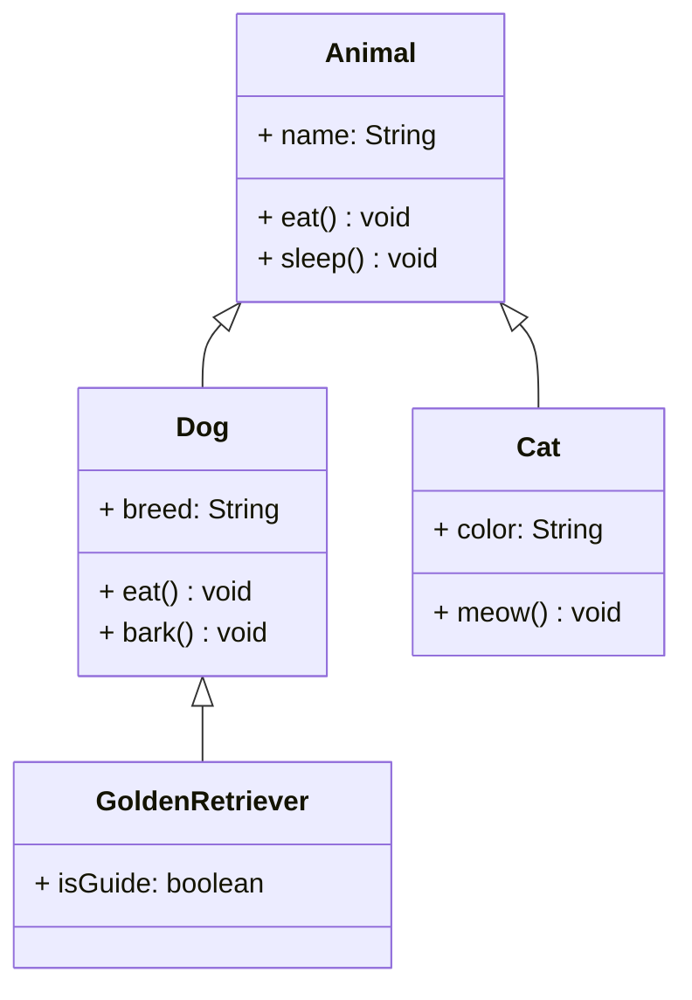
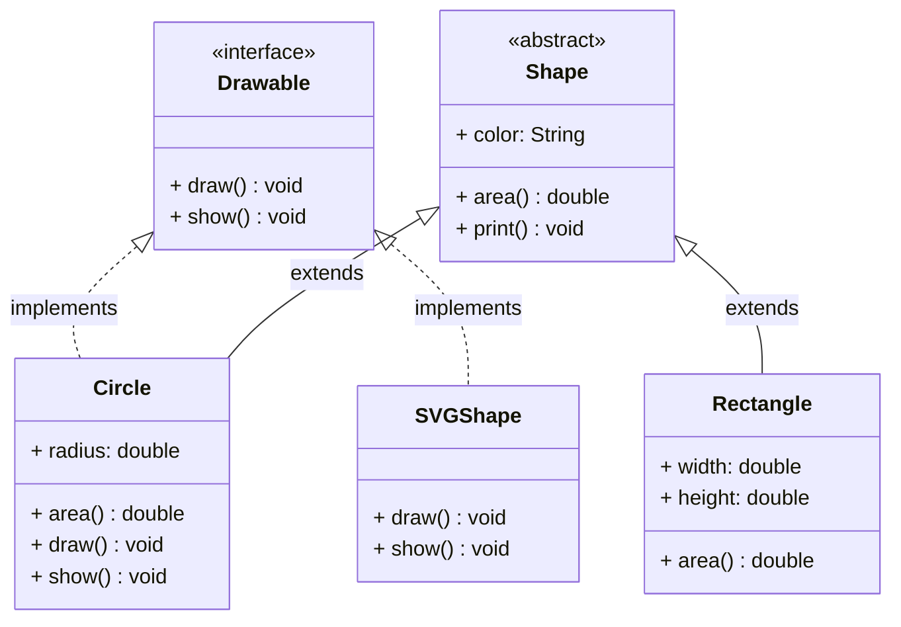
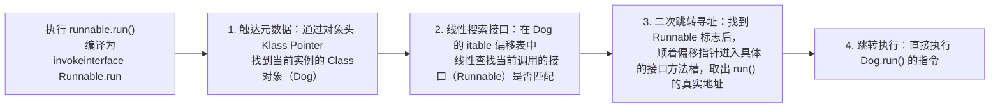
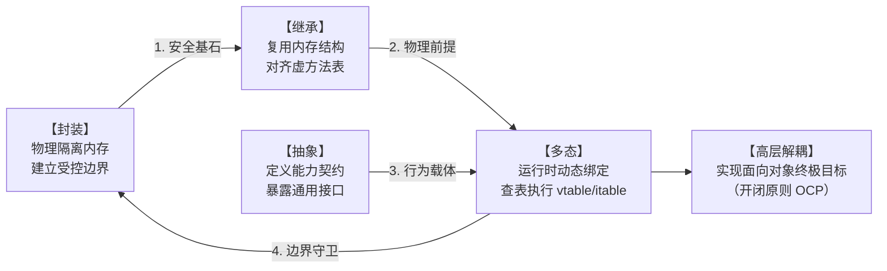

# 面向对象（OOP）：从内存边界到虚方法表的物理透视

面向对象（OOP）是几乎所有 Java 开发者的日常，而封装、继承、多态、抽象则是每个人都能脱口而出的名词。然而，这种语法层面的熟稔，常常掩盖了 JVM 底层的物理真相。在 Java 虚拟机的世界里，根本不存在抽象的“动物”或“银行账户”概念，一切高层设计最终都会坍缩为**堆内存中整齐排列的字节序列、操作数栈上的局部变量符号、以及方法区内冷冰冰的虚方法表（vtable）**。

本篇我们将跨越语法表象，用字节码与内存布局的“透视眼”，重新审视面向对象四大特性的物理骨架与协作秘密。

---

## 1. 引入：从控制流混乱到物理边界的建立

### 1.1 面向过程的边界匮乏困境

在面向过程编程（如经典 C 语言风格）的世界中，系统由**“全局变量池（Data Pool）”**与**“函数池（Function Pool）”**两部分拼装而成。它的致命缺陷在于**数据与行为在物理上完全分离**：

```txt
面向过程的致命黑洞（Procedural Programming Core Defect）:

  全局变量池（Data Pool）                     函数池（Function Pool）
┌─────────────────────────┐               ┌──────────────────────────────┐
│  user_name              │ ◄──────────── │ login()  logout()  pay()     │
│  user_balance           │ ◄──────────── │ transfer()  query_balance()  │
│  order_list             │ ◄──────────── │ create_order()  cancel()     │
└─────────────────────────┘               └──────────────────────────────┘
  【物理上毫无受控边界】 Any function can directly read/write any data → Chain reaction
```

在这种无边界的设计下，任何函数都可以绕过校验直接改写全局数据。一个无心的指针越界或并发变量篡改，就会像推倒多米诺骨牌一样引发不可预测的系统崩溃。系统的状态安全，完全依赖于程序员个人的道德水准与微弱的直觉，这在工程规模迅速放大时会瞬间破产。

### 1.2 面向对象对物理世界的时空重组

面向对象的核心使命，是通过引入类型系统与对象头指针，将原本散落一地的“数据”与“行为”强行打包，在内存空间中划出了一条条神圣不可侵犯的物理边界：

| 核心特性 | 顶层架构语义（解决什么问题） | JVM 底层物理映射（如何解决） |
| :---- | :------- | :----- |
| **封装** | **数据防篡改**。隐藏内部状态，强制走安全接口。 | 编译期校验修饰符，运行期通过 `getfield` 偏移量限制与 `invokespecial` 静态绑定防绕过。 |
| **继承** | **空间与代码复用**。子类天然继承父类基础。 | 继承父类基础。堆内存中父类字段的紧凑嵌套（见3.2）与方法区虚方法表（vtable）的同步对齐。 |
| **多态** | **高层解耦（开闭原则）**。实现运行时的动态替换。 | 依赖对象头` Klass Pointer` 动态寻找 Class，通过 `invokevirtual` 强行查表跳转。 |
| **抽象** | **顶级能力契约**。定义公共规范，强迫面向接口。 | 为多实现场景建立 itable（接口方法表），通过二次跳转进行动态寻址（见5.3）。 |

---

## 2. 封装（Encapsulation）：内存防火墙的建立

### 2.1 封装的物理本质：建立受控边界

封装在语法层表现为“用方法隐藏属性”，但在 JVM 的堆内存看来，它的本质是**建立一堵受控的内存防火墙**。

我们来看这段经典的对比：

```java
// ❌ 反模式：没有封装的裸奔结构
public class OpenAccount {
    public double balance;  // 任何人都能直接修改，完全丧失边界控制
}
account.balance = -9999;    // 语法上合法，但业务逻辑瞬间溃败

// ✅ 标准范式：具备物理防御能力的封装
public class BankAccount {
    private double balance;  // 防火墙：外部物理指令无法直接定位该属性的相对偏移量

    public void deposit(double amount) {
        if (amount <= 0) throw new IllegalArgumentException("金额必须大于0");
        this.balance += amount;  // 只有通过契约校验，执行引擎才允许改写 balance 槽位
    }

    public double getBalance() { return balance; }  // 只读单向通道
}
```

没有封装的类，就像一个没有大门的银行仓库，任何人都可以绕过出纳，直接把假钞塞进金库；而封装后的类，在内存分配上通过访问标志（Access Flags）死死锁住了属性的偏移量，任何外部的指令想要改写 `balance`，必须老老实实通过 `deposit` 这个法定入口。

### 2.2 访问修饰符的可见范围

为了在代码中真正落地“建立边界”的封装思想，Java 提供了四种访问修饰符。它们就像不同安全级别的防火墙，决定了数据隐藏的深度与暴露的广度。只有掌握了这四个修饰符的边界宽窄，我们才能在后面的 2.3 节中，看懂 JVM 是如何根据它们进行极致的字节码性能优化的：

```txt
Access Modifier Visibility（from narrow to wide）：

                    Same Class  Same Package  Subclass  Other Package
private                ✅            ❌           ❌         ❌
(default/package)      ✅            ✅           ❌         ❌
protected              ✅            ✅           ✅         ❌
public                 ✅            ✅           ✅         ✅
```

!!! note "封装的最佳实践"
    在实际开发中，实施封装应遵循“权限最小化原则”：优先使用 private 将数据锁死在 Same Class 内部；仅在需要对特定范围开放时，才逐步放宽至 protected 或 public。这种精细化的范围控制，正是下一节 JVM 能够进行安全校验的依据。

### 2.3 封装的 JVM 实现

封装不仅是语法限制，更是 JVM 提升性能和保障安全的底层基石。封装在 JVM 层面通过**访问控制检查**实现，发生在两个阶段：

1. **编译期**：`javac` 检查访问修饰符，违规直接报编译错误
2. **运行期**：类加载的**验证阶段**（Verification）以及**字节码执行**时，JVM 会再次校验符号引用的权限，防止黑客绕过编译器直接运行恶意字节码。

核心指令差异：为什么 private 能提升性能？

在字节码层面，普通公开方法和被封装的私有方法，其调用指令和执行效率有着天壤之别：

```txt
  Method Type        JVM Instruction       Dispatch Method        Performance
  Public/Protected   invokevirtual         Dynamic (虚方法表)       Slow (需运行时查找)
  Private            invokespecial         Static (直接绑定)        Fast (无表查找开销)
```

1. **`invokevirtual`（动态分派）**：
   标准的 public 方法因为可能被子类重写，JVM 在编译时无法确定到底执行哪个版本。在运行时，JVM 必须去查一张**虚方法表（vtable）**，逐层寻找对应的函数指针。
2. **`invokespecial`（静态分派）**：
   因为 2.2 节中明确了 `private` 的可见性仅限于 `Same Class`，**子类绝对不可能重写私有方法**。因此，JVM 认定该方法是“确定且不可变”的。编译时直接使用 `invokespecial` 指令进行静态绑定，调用时**直接跳过虚方法表**。调用路径极短，甚至触发**内联优化（Method Inlining）**，将方法体直接复制到调用处，消除了方法调用的开销。

!!! tip "反射可以绕过封装，但有代价"
    框架（如 Spring、MyBatis）通过 `field.setAccessible(true)` 可以跳过运行期的访问检查以注入私有字段。但这种“后门”会绕过 JVM 的静态优化路径，带来额外的运行期检查开销，因此业务代码中应极力避免。

---

## 3. 继承（Inheritance）

### 3.1 继承的本质

继承表达的是 **"is-a"** 关系：子类是父类的一种特化。子类通过 `extends` 继承父类的非 `private` 字段和方法，并可以重写（Override）父类方法。



### 3.2 对象创建时的内存布局

继承在语法上表现为代码的复用，但在 JVM 底层，它表现为内存空间的嵌套与方法表槽位的覆盖。理解 `new 子类()` 时的内存真相，是攻克后续“多态”底层原理的必经之路。

以 `Dog extends Animal` 为例，`new Dog()` 在堆内存中的布局：

```txt
Heap Memory - Dog Object:
┌──────────────────────────────────────────────────────┐
│  Object Header                                       │
│  ├─ Mark Word (32 位 JVM = 4 bytes / 64 位 = 8 bytes) │
│  │    Stores: hashCode, GC age, lock state flags     │
│  └─ Klass Pointer                                    │
│        64 位 JVM 开启指针压缩 = 4 bytes；否则 = 8 bytes │
│        Points to Dog's Class object in Method Area   │
├──────────────────────────────────────────────────────┤
│  Instance Data                                       │
│  ├─ Parent Fields (Animal's fields first)            │
│  │    name: String reference (4 bytes)               │
│  └─ Child Fields (Dog's fields after)                │
│       breed: String reference (4 bytes)              │
├──────────────────────────────────────────────────────┤
│  Padding                                             |
│  Align to multiple of 8 bytes                        |
└──────────────────────────────────────────────────────┘
```

**方法区（元空间）中的 Class 对象**存储虚方法表：

```txt
Method Area - Dog's Class Object:
┌──────────────────────────────────────────────────────────────┐
│  vtable (Virtual Method Table)                               |
│  ┌────────────────────────────────────────────────────────┐  |
│  │ [0] Object.toString()   → Object.toString address      |  |
│  │ [1] Object.hashCode()   → Object.hashCode address      |  |
│  │ [2] Object.equals()     → Object.equals address        |  |
│  │ [3] Animal.eat()        → Dog.eat address (overridden) |  |
│  │ [4] Animal.sleep()      → Animal.sleep address         |  |
│  │ [5] Dog.bark()          → Dog.bark address             |  |
│  └────────────────────────────────────────────────────────┘  |
│  Static variables, constant pool, class metadata...          |
└──────────────────────────────────────────────────────────────┘
```

!!! tip "底层透视：继承与重写的终极物理真相"
    1. 属性继承的本质：在堆内存中，父类的字段永远被整齐地排列在子类字段之前，形成物理包容。
    2. 方法重写的本质：在方法区中，子类和父类的虚方法表（`vtable`）中相同方法的索引（Slot）是完全一致的（例如 `eat()` 都在索引 3）。子类重写方法，本质上只是把该索引处的指针替换为自己新方法的内存地址。这种索引一致、地址替换的机制，正是多态动态分派的底层铁律。

### 3.3 类加载与继承顺序

当你在代码中执行 `new Dog()` 时，JVM 内部会严格按照**“先静态后实例，先父类后子类”**的物理顺序，触发类与对象的初始化。

我们可以通过两段核心的字节码指令，彻底看清这个过程的真相：

阶段一：**类的加载与初始化（静态期）**

如果 `Dog` 类是第一次被使用，JVM 会先将其加载到方法区。由于子类依赖父类，**JVM 规定：在加载并初始化子类之前，必须先加载并初始化其父类**。

类的静态变量赋值和 `static {}` 块，在字节码层面会被编译为 `<clinit>`（类初始化方法）：

- `Animal.<clinit>` 自动先于 `Dog.<clinit>` 执行。
- 这是为了确保子类的静态变量在初始化时，能够安全地引用父类的静态资源。
  
阶段二：**对象的内存分配与实例化（对象期）**

类加载完成后，JVM 在堆上为 `Dog` 对象分配内存（布局参考 3.2 节），接着执行类的构造方法。在字节码层面，构造方法表现为 `<init>`（**实例初始化方法**）。

我们可以通过 `javap -c Dog.class` 查看 `Dog` 构造方法的底层指令：

```java
// Java 源码
public Dog() {
    // 隐式调用 super();
    this.breed = "Golden";
}
```

```vlot
// 对应的 JVM 字节码
public com.example.Dog();
  Code:
   0: aload_0          // 将 this 引用压入栈顶
   1: invokespecial #1 // Method com/example/Animal."<init>":()V  ← 核心：调用父类构造方法！
   4: aload_0          // 再次将 this 引用压入栈顶
   5: ldc           #2 // String Golden
   7: putfield      #3 // Field breed:Ljava/lang/String;       ← 核心：为子类字段赋值
  10: return
```

- `invokespecial` 强制先行：无论你在子类构造方法里写了什么，编译器生成的字节码中，第 1 行永远是调用父类 `<init>` 的 `invokespecial` 指令。
- 物理顺序的必然性：结合 3.2 节的堆内存布局，子类对象包裹着父类字段。如果父类没有初始化完成，子类就无法安全地操作这些继承过来的数据。因此，字节码从底层物理上死死了“先父后子”的执行顺序。

!!! summary "终极口诀"
    1. `Animal.<clinit>`（父类静态） → 2. `Dog.<clinit>`（子类静态） → 3. `Animal.<init>`（父类构造） → 4. `Dog.<init>`（子类构造）

### 3.4 继承的代价：强耦合

继承是**白盒复用**——子类能看到父类的实现细节，父类的任何修改都可能影响子类。这就是"**脆弱基类问题**"：

```java
// 模拟 Java 官方的 HashSet（父类内部实现细节）
class MyHashSet<E> {
    public boolean add(E e) {
        // 真正插入元素到底层哈希表...
        return true;
    }
    
    public boolean addAll(Collection<? extends E> c) {
        boolean modified = false;
        // 关键地雷：父类内部为了复用代码，调用了 add() 方法！
        for (E e : c) {
            if (add(e)) modified = true;
        }
        return modified;
    }
}

// 子类：试图统计“自创建以来一共添加了多少个元素”
class InstrumentedHashSet<E> extends MyHashSet<E> {
    private int addCount = 0; // 子类维护自己的计数器，符合封装性

    @Override
    public boolean add(E e) {
        addCount++;          // 1. 计数器 +1
        return super.add(e); // 2. 调用父类真正插入
    }

    @Override
    public boolean addAll(Collection<? extends E> c) {
        addCount += c.size();   // 1. 一次性加上集合大小
        return super.addAll(c); // 2. 调用父类的 addAll
    }

    public int getAddCount() { return addCount; }
}
```

```txt
执行代码：set.addAll(List.of(1, 2, 3)); // 预期 addCount = 3

调用 InstrumentedHashSet.addAll()
  │
  ├── 1. 子类 addCount += 3  ────→ 此时 addCount = 3
  │
  └── 2. 调用 super.addAll() 
            │
            └── [父类逻辑] 内部循环调用 3 次 add()
                     │
                     └── 触发多态！运行时实际调用的是【子类】的重写 add()
                              │
                              ├── 3次循环导致子类 addCount 累计 +3 ──→ 此时 addCount = 3 + 3 = 6!
                              │
                              └── 调用 super.add() 真正插入元素

最终结果：addCount 变成了 6（重复计数），系统行为彻底崩溃！
```

子类根本不知道父类的 addAll() 内部会调用 add()，这是父类的实现细节。父类哪天改了内部实现（比如不再调用 add() 了），子类的行为又会悄悄变化。这就是"脆弱基类"——父类的内部实现细节像地雷一样埋在那里，子类一不小心就踩到。

!!! recommend
    **原则**：继承表达 "is-a" 关系，不确定时**优先用组合**（"has-a"）。
    《Effective Java》第 18 条：复合优先于继承。只有在子类真正是父类的子类型时，才适合使用继承；否则应使用组合 + 转发，避免脆弱基类问题。

---

## 4. 多态（Polymorphism）

### 4.1 多态的本质

多态的本质是：**同一个消息，发给不同的对象，产生不同的行为**。通过父类引用指向子类对象，运行时根据对象的实际类型决定调用哪个方法（**动态分派**）。

```java
// 编译时类型是 Animal，运行时类型是 Dog
Animal animal = new Dog();
animal.eat();  // 实际调用 Dog.eat()，而不是 Animal.eat()
```

还记得 3.4 节中那个导致重复计数的 HashSet 地雷吗？父类 addAll() 内部调用了 add()，正是因为多态的动态分派机制，使得即使在父类内部调用，JVM 也会强行去执行子类重写后的 add()。下面我们彻底解密这一行代码在 JVM 底层是如何运转的。

### 4.2 动态分派：invokevirtual 指令

多态的底层并不是什么魔法，而是通过 JVM 的 `invokevirtual` 字节码指令与虚方法表（`vtable`）配合实现的。执行 `animal.eat()` 时的真实链路如下：

执行 `animal.eat()`，编译为 `invokevirtual Animal.eat`:

 1. 动态查找：通过对象头的 `Klass Pointer`， 找到堆中当前实例的实际 Class 对象（`Dog`）
 2. 索引对齐：在 `Dog` 的 `vtable` 中，直接通过编译期定好的【固定索引槽位】查找 `eat()`
 3. 结果命中：拿到 `Dog.eat()` 的真实地址，（此时父类的 `Animal.eat` 地址已被覆盖）
 4. 跳转执行：直接执行 `Dog.eat()` 的指令

**JVM 五种方法调用指令的终极对比**：

| 指令 | 用途 | 绑定时机 | 是否支持 OOP 多态 | 底层物理机制 |
| :--- | :--- | :----- | :---: | :---: |
| `invokevirtual` | 调用普通的实例方法（虚方法） | 运行时绑定 | ✅ | 必须根据对象实际类型去查 `vtable`。 |
| `invokeinterface` | 调用接口方法 | 运行时绑定 | ✅ | 查 `itable`（由于一个类可实现多接口，查找比 `vtable` 略慢）。 |
| `invokespecial` | 调用构造 `<init>`、`private`、`super` 方法 | 编译期静态绑定 | ❌ | 直接跳转固定内存地址，跳过虚方法表，速度极快（见 2.3）。 |
| `invokestatic` | 调用静态（`static`）方法 | 编译期静态绑定 | ❌ | 属于类本身的行为，与具体对象实例无关，直接静态绑定。 |
| `invokedynamic` | 支持 Lambda 表达式和动态语言 | 运行时动态链接 | **Lambda 专用** | JDK 7+ 引入，不查 vtable，运行时动态生成调用点（Bootstrap Method）。 |

### 4.3 多态失效的四种场景

虽然 Java 是一门多态驱动的语言，但在以下四种场景中，多态要么`彻底失效`，要么会产生让人崩溃的`多态反噬（Bug）`。

#### ① 字段访问：属性不具备多态性（最常见误区）

```java
class Animal { 
    String name = "Animal"; 
    public String getName() { return name; } 
}
class Dog extends Animal { 
    String name = "Dog";// ⚠️ 字段隐藏（Field Hiding），不是重写！
    @Override 
    public String getName() { return name; } 
}

Animal animal = new Dog();
System.out.println(animal.name);       // ❌ 输出：Animal（多态失效！）
System.out.println(animal.getName());  // ✅ 输出：Dog（方法多态依然生效）
```

- **底层硬核原因**：JVM 在执行方法时用 `invokevirtual` 动态查表，但访问字段使用的是 **`getfield` / `putfield` 指令**。编译器在编译期间，就已经根据引用的**声明类型（编译时类型 `Animal`）**，硬编码计算好了字段在内存中的相对偏移量。
- **内存真相**：结合 3.2 节的对象布局，子类对象内部同时存在父类同名属性和子类同名属性。由于不查虚方法表，`animal.name` 永远只能拿到父类区域的数据。

```txt
Dog Object Memory Layout (堆内存):
┌────────────────────────────────────────────────────────────────────────┐
│  Object Header (Mark Word + Klass Pointer)                             │
├────────────────────────────────────────────────────────────────────────┤
│  Parent Fields (Animal's zone) → name reference (指向 "Animal")         │
│  └─ animal.name 在编译期被硬编码死死指向了这个区域                           │
├────────────────────────────────────────────────────────────────────────┤
│  Child Fields (Dog's zone)     → name reference (指向 "Dog")            │
└────────────────────────────────────────────────────────────────────────┘
```

**JVM 为什么字段不支持多态？**

- **性能**：字段访问是最频繁的操作，静态偏移量比动态查表快得多
- **语义**：字段是数据，属于声明它的类；方法是行为，才需要多态
- **避免歧义**：父子类同名字段若都多态，语义极其复杂

#### ② 静态方法：属于类而非对象

```java
Animal animal = new Dog();
animal.staticMethod();  // 输出：Animal static（多态不生效！）
```

- 原因：静态方法通过 `invokestatic` 指令调用。静态方法是绑定在“类”本身上的行为，与具体的对象实例无关。编译器在编译时就直接绑定到了声明类型 `Animal` 上，运行时根本不看右边的 `new Dog()`。

#### ③ private 方法：无法被子类可见，何谈重写

```java
class Animal {
    private void secret() { System.out.println("Animal"); }
    void callSecret() { secret(); } // 编译为 invokespecial，死绑定
}
class Dog extends Animal {
    private void secret() { System.out.println("Dog"); }  // 这是一届新方法，不构成重写！
}

new Dog().callSecret();  // ❌ 输出：Animal（并没有触发多态调用到 Dog 内部）
```

- **原因**：正如 2.3 节所讲，`private` 方法因为子类不可见，JVM 直接使用 `invokespecial` 指令进行静态绑定。子类写一个同名同参的 `private` 方法，只是碰巧名字一样的新方法而已，不进入虚方法表。

#### ④ 构造方法中调用可重写方法：多态的“致命反噬” ⚠️

这是 Java 核心架构中最隐蔽、最危险的深坑：

```java
class Animal {
    Animal() {
        init();  // ⚠️ 危险：此时 Dog 对象还未完全初始化
    }
    void init() { System.out.println("Animal init"); }
}
class Dog extends Animal {
    private String name = "旺财";
    @Override
    void init() {
        System.out.println("Dog init: " + name);  // 输出：Dog init: null ！
        // name 此时还是 null，因为 Dog 的字段初始化在父类构造方法之后
    }
}
```

- **破案现场**：为什么打印出来的 `name` 变成了 `null`？

1. **多态确实生效了**：因为 `init()` 是普通实例方法，JVM 执行父类构造方法时，依然会去查 `Dog` 的 `vtable`，因此成功跃迁调用到了子类的 `init()`。
2. **初始化顺序的地雷（闭环 3.3 节）**：还记得 3.3 节的实例化顺序口诀吗？**“先父类构造，后子类字段赋值”**。当父类构造方法执行到 `init()` 时，子类的 `name = "旺财"` 根本还没有执行！此时子类字段还躺在默认值的状态（即 `null`），惨剧就此发生。

!!! recommend "工程红线"
    **绝不要在任何类的构造方法（以及 private、final 之外的方法）中调用可以被子类重写的方法**。 如果需要初始化，应提供显式的初始化接口或使用工厂模式。

💡**本章核心指令与多态行为全景总结**

拉通全书，JVM 所有的底层操作和多态性的关系可以终极提炼为下表：

| 场景 / 操作 | 对应字节码指令 | 绑定时机 | 是否查表 | 是否支持多态 | 典型特征/潜在风险 |
| :--- | :----- | :----- | :---: | :---: | :---: |
| **普通实例方法** | `invokevirtual` | 运行时动态绑定 | 查 vtable | ✅ | 标准面向对象多态行为。 |
| **接口方法调用** | `invokeinterface` | 运行时动态绑定 | 查 itable | ✅ | 支持接口多态，查找略慢于 vtable。 |
| **属性/字段访问** | `getfield/putfield` | 编译期静态硬编码 | ❌ | ❌ | **字段隐藏**现象，仅看引用的声明类型。 |
| **静态方法调用** | `invokestatic` | 编译期静态硬编码 | ❌ | ❌ | 属于类不属于对象，不具备多态能力。 |
| **私有方法调用** | `invokespecial` | 编译期静态硬编码 | ❌ | ❌ | 子类无法重写（见 2.3 节性能优化）。 |
| **父类构造期间** | `invokespecial`(内部调用) | 运行时动态跃迁 | 查 vtable | **引爆反噬** | 触发子类重写方法，极易引发 **NPE（空指针异常）**。 |

---

## 5. 抽象（Abstraction）

### 5.1 抽象的两种形式

**从多态到抽象的跃迁**：前面第四章告诉我们，多态让同一个接口在运行时能绽放出千变万化的行为。但能力越大，约束就得越紧。为了防止子类的多态行为野蛮生长，我们必须建立一套“顶级契约”。**抽象的本质就是建立规范、隐藏细节，强迫调用方和实现方面向契约编程**。

在 Java 中，这种规范和契约通过两种形式落地：**接口（Interface）**是对行为的纯粹契约，而**抽象类（Abstract Class）**则是带有部分实现骨架的半成品模板。



### 5.2 接口 vs 抽象类：现代 Java 的深度碰撞

随着 Java 版本的演进（尤其是 Java 8 引入 `default` 方法、Java 9 引入 `private` 接口方法），接口和抽象类在**语法边界**上越来越模糊，但在**设计语义**上依然泾渭分明。

**终极维度对比表**:

| 对比维度 | 接口（Interface） | 抽象类（Abstract Class） |
| :------ | :------------- | :-------------------- |
| **设计语义** | **能力契约（Can-do）**：定义对象能做什么，强调行为规范 | **模板骨架"is-a"**：定义共同父类型，封装共享状态和默认实现 |
| **多重性限制** | 一个类可实现多个接口 | 一个类只能继承一个抽象类 |
| **内部字段** | 接口只能声明 `public static final` 常量，不允许实例字段。 | 可声明任意实例字段和静态字段 |
| **构造方法** | ❌ 无构造方法，接口不能实例化，也不存在对象状态 | ✅ 可定义构造方法，用于初始化父类状态，供子类调用 |
| **方法实现** | 支持 `default`、`static` 以及 `private` 内部方法(Java 9+) | 可以拥有从 `private` 到 `public` 的任意具体方法 |
| **典型例子** | `Serializable`、`Comparable`、`Runnable` | `AbstractList`、`HttpServlet`、`AbstractBeanFactory` |

!!! warning "语法盲区
    接口字段的隐式刺客"在接口中写下 `int AGE = 18`;，Java 编译器在编译时会自动、强制将其补全为 public static final int AGE = 18;。接口不存在任何“实例变量”，它无法承载对象的物理状态。

**现代 Java 的演进：为什么接口要支持“带实现的方法”？**

很多读者会产生疑问：既然接口是能力契约，为什么 Java 8+ 还要允许接口里写 `default` 和 `private` 方法？这难道不是抢了抽象类的饭碗吗？

- 为了“API 演进的兼容性”：假设 Java 官方想在拥有数十万实现类的 `Collection` 接口里新增一个 `stream()` 方法。如果没有 `default` 关键字提供默认实现，一旦官方升级 JDK，全世界所有自定义了集合的第三方框架全部会因为“未实现新方法”而编译崩溃。`default` 的出现是为了让老接口能优雅地长出新触角。
- 为了“避免代码冗余”：多个 `default` 方法之间如果存在大量相同的辅助逻辑，在 Java 9 之前无法抽取。Java 9 引入 private 接口方法，允许我们在接口内部抽取公共高频函数，同时不将其暴露给外部实现类。

**黄金选择原则**：

- **用接口**：当你需要定义一个**跨越不同类族、纯粹的功能特征**时。例如，`Dog`（动物类族）和 `Automobile`（汽车类族）都可以实现 `Runnable`（可运行契约）。
- **用抽象类**：当你需要重用一组**紧密相关、拥有相同物理属性**的类族的公共代码，且需要向下传递**模板方法模式**时。

### 5.3 接口的 JVM 实现：itable

在第 4.2 节的终极对比表中我们提到，调用接口方法使用的是 **`invokeinterface`** 指令，其执行效率在没有经由 JIT 优化时略慢于普通的 `invokevirtual`。

要理解这个性能差异，我们必须透视 JVM 方法区中 **`vtable`（虚方法表） 与 `itable`（接口方法表）** 的物理设计差异。

### 5.3.1 核心痛点：多重实现带来的“偏移量失效”

- **为什么 `vtable` 极快？**
  Java 只允许单继承。子类继承父类时，其 `vtable` 是完全继承并向下追加的。如果父类的 `eat()` 方法在 `vtable` 的索引 3 位置，那么无论怎么继承，任何子类的 `eat()` 方法也必定死死固定在索引 3 处。JVM 在编译期就能把“偏移量 = 3”硬编码进字节码中，运行时直接通过一维数组索引触达，速度接近静态绑定。
- **为什么 itable 必须动态查找？**
  Java 允许类多实现接口。假设有 `Runnable` 接口（含 `run()` 方法），不同的类实现它的顺序千差万别：
  
  ```txt
  Class A implements Runnable                → 此时 A 的方法表中 run() 在第 0 位
  Class B implements Comparable, Runnable    → 此时 B 的方法表中 run() 被挤到了第 1 位
  ```

  当写下 `Runnable r = ...; r.run();` 时，编译器根本无法预知 r 运行时到底指向 A 还是 B，**因此无法在编译期固定 `run()` 的内存偏移量索引**。

### 5.3.2 JVM 的解法：`itable` 的网状结构

为了解决偏移量不固定的问题，JVM 为每个实现了接口的类，在其类元数据（Class Metadata）中额外开辟了一块空间用于存放 **`itable`**。它由两部分组成：

1. **接口偏移量表（Interface Offset Table）**：记录该类实现了哪些接口，以及这些接口的方法表在内存中的起始偏移量。
2. **接口方法表（Interface Method Table）**：真正存放该接口方法对应实现的函数指针。

```txt
Dog 类的元数据内存布局 (Method Area):
┌────────────────────────────────────────────────────────────────────────┐
│  vtable (虚方法表)                                                      │
│  ├─ Object.toString()  → 指向底层实现                                    │
│  ├─ Animal.eat()       → 指向 Dog.eat() [覆盖父类]                       │
│  └─ Dog.run()          → 指向 Dog.run() [接口方法的真正实现也在此]          │
├────────────────────────────────────────────────────────────────────────┐
│  itable (接口方法表，紧跟其后)                                             │
│  ├─ [接口偏移表]                                                         │
│  │   ├─ Runnable 接口   ───────→ 联动指针指向下方 Runnable 方法槽起始点      │
│  │   └─ Comparable 接口 ───────→ 联动指针指向下方 Comparable 方法槽起始点    │
│  └─ [接口方法槽]                                                         │
│      ├─ Runnable.run()        → 指向 Dog.run() 的指令地址                 │
│      └─ Comparable.compareTo()→ 指向 Dog.compareTo() 的指令地址           │
└────────────────────────────────────────────────────────────────────────┘
```

`invokeinterface` 的动态寻址链路图

当你执行接口调用时，JVM 内部会经历以下四步跃迁：



由于多了一个**第 2 步（在接口偏移表中进行线性搜索或哈希离散查找）**的开销，`invokeinterface` 的原生性能天然慢于直达索引的 `invokevirtual`。

!!! tip "JIT 的降维打击：内联缓存（Inline Cache）"
    虽然原生的 `invokeinterface` 存在查找开销，但在工业级运行中，JIT 编译器会对其进行内联缓存（Inline Cache）优化：如果 JVM 发现某处接口调用在 99% 的情况下其实都只有一个实际类型，JIT 会直接把这段代码改写为查表前的“直接类型检查跳转”，甚至把方法体直接内联（Inlining）过来，性能会被瞬间提升到与静态调用完全相同的水平。

### 5.4 Java 为什么不支持类的多继承？

既然接口可以实现多重契约，为什么 Java 唯独在“类继承”上死死咬定**单继承**不放？

### 5.4.1 菱形继承问题（Diamond Problem）

```txt
        A
       / \
      B   C
       \ /
        D

若 B 和 C 都重写了 A 的方法 foo()，
D 继承时：D.foo() 应该用 B 的版本还是 C 的版本？
→ 产生歧义，vtable 中无法确定 foo() 的地址
```

对于行为冲突，Java 已经在 Java 8+ 的接口 default 方法中证明了它是可解的。当接口方法冲突时，编译器会**强行报错**，逼迫开发者显式指定调用源：

```java
interface A { default void hello() { System.out.println("A"); } }
interface B { default void hello() { System.out.println("B"); } }

class C implements A, B {
    @Override
    public void hello() {
        A.super.hello();  // 必须显式指定，否则编译报错
    }
}
```

### 5.3.2 深层的物理冲突：类是有“状态（State）”的

既然接口可以通过显式调用解决冲突，为什么类不可以？**核心差异在于：类拥有实例字段与构造方法，具有物理状态**。

如果允许类多继承，结合我们在 3.2 节学过的物理内存布局，JVM 根本无法给子类对象排布内存：

```java
class A {
    private int x = 10;       // A 有自己的 x
    void foo() { x++; }
}
class B {
    private int x = 20;       // B 也有自己的 x
    void foo() { x++; }
}
// 假设允许多继承：
class C extends A, B {
    @Override
    void foo() {
        A.super.foo();  // ← 这里操作的是哪个 x？
    }
}
```

此时，`new C()` 创建出来的对象在堆内存中的布局将陷入死胡同：

```txt
假设的多继承 C 对象物理内存布局 (Heap):

方案 1：内存中强行容纳两份同名变量（A.x 与 B.x）
┌────────────────────────────────────────────────────────┐
│  Object Header (Mark Word + Klass Pointer)             │
├────────────────────────────────────────────────────────┤
│  Parent A Fields → x = 10                               │
├────────────────────────────────────────────────────────┤
│  Parent B Fields → x = 20                              │
└────────────────────────────────────────────────────────┘
 ❌ 致命缺陷：如果执行 C 内部的其他方法访问 x，JVM 根本无法通过
    静态偏移量（getfield）定位到底该找 A.x 还是 B.x。

方案 2：合并字段，内存中只保留一份 x
 ❌ 致命缺陷：A.foo() 与 B.foo() 在运行时会同时修改这唯一的 x，
    父类的私有属性被互相篡改，封装性（Encapsulation）彻底破产。
```

### 5.4.3 无法调和的构造方法链（初始化死锁）

多继承还会彻底摧毁 3.3 节中死死固定的 `<init>` 实例化顺序：

```java
class A { A() { System.out.println("A init"); } }
class B { B() { System.out.println("B init"); } }

// 假设允许多继承：
class C extends A, B {
    C() {
        // 编译器在此处应该先调用 A() 还是先调用 B()？
        // 如果 A 和 B 在构造中修改了同一个父类基类的属性，谁的赋值算数？
    }
}
```

总结

- **接口的冲突**：只是**“选哪段代码执行”**的问题。因为接口没有状态（无字段、无构造），不涉及内存分配，因此强制开发者在代码里“二选一”即可完美化解。
- **类的冲突**：是**“内存如何排布、状态如何初始化”**的物理底层问题。这是编译器和底层指令无论如何也无法替你做决定的。

这也是为什么 C++ 虽然支持多继承，但不得不引入极其繁琐且消耗性能的**虚继承（virtual inheritance）**机制来解决菱形布局问题——即便如此，C++ 的多继承也被业界公认为是最容易踩坑、最具代码污染性的特性之一。

Java 抓住了面向对象的本质痛点，精明地选择了**“单继承（规避状态冲突） + 接口多实现（放开能力契约）”**的黄金组合。

---

## 6. 四大特性的全局协同与工程落地

面向对象的四大特性绝对不是彼此孤立的面试八股文。在真实的工业级架构中，它们就像精密仪器的四个齿轮，环环相扣、共同运转。

### 6.1 四大特性的“化学反应”

我们前面学到的所有物理底层，其实都在支撑着下面这张全局协作网：



- **没有【封装】，【继承】就是灾难**：如果父类数据不通过 `private` 限制访问，子类在继承时可以随意篡改父类内存，整个系统的状态将彻底失控。
- **没有【继承】与【抽象】，【多态】就失去了舞台**：JVM 的 `invokevirtual` 查表机制，其核心前提是子类和父类的 `vtable` 索引完全对齐。没有类型层次的建立，动态绑定就无从谈起。
- **【多态】反过来守卫【封装】**：正是因为多态允许我们在高层写下 `Animal a = new Dog()`;，调用方只能被迫通过 `Animal` 的公开接口去间接操作数据，从而将 Dog 内部的私有实现细节死死地“封装”在底层。

### 6.2 经典框架与设计模式中的 OOP 物理投影

在日常开发中，你写下的每一个主流设计模式或用到的核心框架，本质上都是 JVM 四大指令和内存布局的精妙组合：

| 经典场景 / 框架特性 | 依赖的 OOP 特性组合 | JVM 底层物理映射与核心秘密 |
| :-------------- | :-------------- | :-------------- |
| Spring IoC 依赖注入 | 抽象 + 多态 | 面向接口编程。Spring 容器通过 `Autowired` 注入接口类型的引用，运行时通过 `invokeinterface` 动态寻址到真实的实现类（如 `UserServiceImpl`）。 |
| 模板方法模式 | 继承 + 抽象 | 骨架在父类，实现在子类。父类具体方法通过 `invokevirtual` 调用内部的抽象方法，运行时 JVM 会利用子类的虚方法表（`vtable`）自动“动态跃迁”到子类的具体实现中。 |
| 策略模式 | 接口 + 多态 | 消灭繁琐的 if-else。通过动态切换接口引用指向的具体实例，让相同的字节码指令在运行时查不同的 `itable`，从而绽放出完全不同的业务行为。 |
| 装饰器模式 | 组合 + 多态 | 复合优先于继承的范例。装饰器类与被装饰类实现同一个接口（多态），但内部持有被装饰类的引用（组合），完美规避了多继承引发的内存布局冲突。 |
| MyBatis Mapper 代理 | 抽象 + 多态 + 动态代理 | 接口没有实现类也能运行。MyBatis 仅定义接口（抽象），JDK 动态代理在内存中动态生成一个隐式继承自 `Proxy` 并实现该接口的代理子类（多态），利用 `invokeinterface` 将调用强行拦截并转发给 SQL 处理器。 |

### 6.3 终极复盘：全书八股文避坑红线

拉通整篇 OOP 的底层透视，请在未来的工程设计中死死死守以下 5 条架构红线：

1. 🚨 **权限最小化原则**：属性一律 private。不要图一时痛快开成 public 或 protected。良好的封装不仅能保护数据安全，还能让 JVM 放心使用 `invokespecial` 指令对其进行极致的静态绑定和方法内联优化。
2. 🚨 **复合优先于继承**：只有在子类确实是父类的一种特化（is-a）时才使用继承。否则，盲目继承不仅会引发`脆弱基类问题`，还会因为多态的反噬在父类构造期间引爆子类的空指针异常（NPE）。
3. 🚨 **构造函数安全红线**：绝对不要在基类的构造方法中调用任何可能被子类重写的方法。因为根据 JVM `<init>` 的实例化顺序，“先父类构造，后子类属性赋值”，此时子类的变量全是默认值（如 `null`），极易诱发灾难。
4. 🚨 **字段不具备多态性**：切记 JVM 访问属性使用的是 `getfield` 偏移量硬编码，**属性没有多态能力**。如果父子类定义了同名属性（字段隐藏），用父类引用去访问它，拿到的永远是父类的值。
5. 🚨 **善用「接口 + 骨架类」**：在设计大型组件时，先用接口定义纯粹的能力契约，再提供抽象类实现部分代码复用，最后由具体类落地。这种组合能够完美平衡“接口多实现”的灵活性与“代码复用”的刚性需求。

---

读完这篇文章，当你再次在 IDEA 中敲下一行 `public class`，或者写下一个普通的接口时，你的脑海中应该已经有了另一幅画面：那不是一串死板的英文字符，而是堆内存里整齐排列的 **Mark Word**，是方法区里蓄势待发的 **`vtable` 指针槽**，是编译器为了保护你而自动塞进 `<init>` 第一行的 **`invokespecial` 指令**。

**真正优秀的架构师，从来不只在语法层写代码。他们闭上眼，就能看到字节码在 JVM 的世界里翩翩起舞。**
