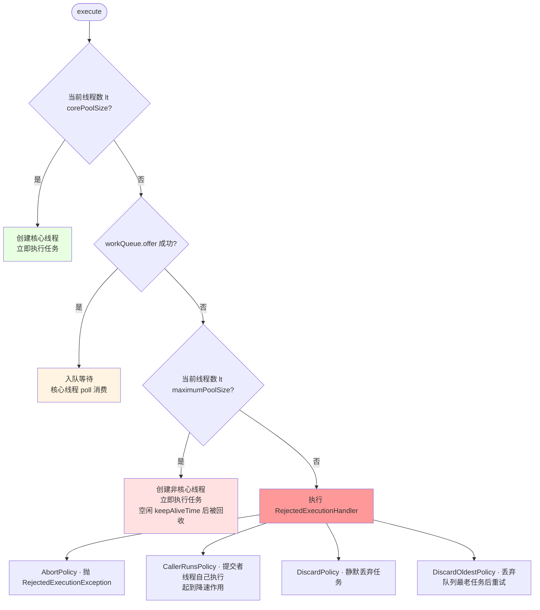

# Lock 与线程池 —— StampedLock、LongAdder 与线程池参数

!!! info "**并发工具 一句话总结**"
    - **JUC 所有锁与同步器都是"AQS `state` 上定义不同语义"的产物**：`ReentrantLock` 用 `state` 存重入次数；`ReentrantReadWriteLock` 用高 16 位存读锁计数、低 16 位存写锁计数；`Semaphore` 用 `state` 存剩余许可；`CountDownLatch` 用 `state` 存倒计数。**一个 `volatile int` 撑起半个 JUC 包**——这是设计哲学的复用力：AQS 提供 CLH 排队 + `park`/`unpark` 骨架，子类只需在 `tryAcquire` / `tryRelease` / `tryAcquireShared` / `tryReleaseShared` 四个钩子里定义"`state` 是什么"和"什么时候能获取"。
    - **`StampedLock` 三种模式（写锁 / 悲观读 / 乐观读）不是简单的"读写锁升级"，是"用无锁乐观读把读操作降到零同步开销"**：乐观读拿到一个 8 字节的 `stamp`（`long` 版本号），读完数据后用 `validate(stamp)` 校验 stamp 是否变化，未变化就直接返回，变化则退化到 `readLock()` 悲观读。在读远多于写的场景比 `ReentrantReadWriteLock` 快 4~10 倍。**代价是不可重入、不支持 `Condition`、不能用 `try-with-resources` 自动释放**——使用前需要明确三条限制。
    - **`LongAdder` = "分段 Cell 数组 + CAS 竞争分流"的底层实现**：低竞争走 `base` 字段的单 CAS；高竞争时把一个 `AtomicLong` 的 CAS 分散到 `cells[]` 上，每个线程通过 `getProbe() & (n-1)` 路由到自己的 `Cell`，`sum()` 时遍历求和。`Striped64.Cell` 用 `@Contended` 注解让每个 `Cell` 独占一条 128 字节的填充区，规避 CPU 缓存行伪共享——这也是"`AtomicLong` 是精确读、`LongAdder` 是最终一致"的根本原因：`sum()` 遍历过程中其他线程仍在写 `Cell`，读到的是**扫过时的快照总和**而非某个原子瞬间的值。
    - **线程池 7 参数 = "核心 → 队列 → 最大 → 拒绝"四段式漏斗**，参数背后是一个 `AtomicInteger ctl` 编码 32 位状态：**高 3 位 = 5 种运行状态（`RUNNING` / `SHUTDOWN` / `STOP` / `TIDYING` / `TERMINATED`）、低 29 位 = 工作线程数**。用一个 `int` 同时读写状态 + 线程数是"避免多字段同步"的经典设计——`RUNNING = -1 << 29` 让 `RUNNING < SHUTDOWN < STOP < TIDYING < TERMINATED` 单调递增，状态迁移用简单的整数比较即可判断，这条位编码技巧后面还会在 `ConcurrentHashMap.sizeCtl` 上重现。

以下问题指向 Lock 与线程池的底层机制：

- `ReentrantLock` 公平锁的 `tryAcquire` 比非公平锁多一步 `hasQueuedPredecessors()`——这一步遍历 CLH 队列的开销有多大？为什么阿里 P3C 手册默认推荐非公平锁？
- `ReentrantReadWriteLock.readLock()` 一次能给 `state` 加多少？为什么读锁允许多线程同时持有，但重入次数会污染读锁计数？
- `StampedLock.tryOptimisticRead()` 返回的 8 字节 `stamp` 里编码了什么？`validate(stamp)` 到底在校验什么位？
- 高并发计数从 `AtomicLong` 换成 `LongAdder` 后为什么 QPS 能提升 5~10 倍？`@Contended` 注解在 JDK 9 之前和之后有什么行为差异？
- 线程池 `ctl = ctlOf(RUNNING, 0)` 初始值的二进制是什么？`SHUTDOWN` 和 `STOP` 状态迁移时用 `ctl.compareAndSet` 会不会误改工作线程数？
- 为什么阿里 P3C 手册禁止 `Executors.newFixedThreadPool` 和 `newCachedThreadPool`？分别会导致什么类型的 OOM？

---

## 1. 第一层：业务痛点 —— 从"生产环境读写锁翻车"到"线程池 OOM"

### 1.1 生产事故现场：读写锁选错、线程池无界，同一天塌了两次

某支付平台的风控服务里出现过下面这段"看起来平淡无奇"的代码。它同时踩中了并发工具选型层面的两颗雷——**读写锁被误当成万能锁**、**线程池用 `Executors` 工厂方法快速创建**：

```java
@Service
public class RiskRuleCache {

    private final Map<String, RiskRule> rules = new HashMap<>();
    private final ReentrantReadWriteLock rwLock = new ReentrantReadWriteLock();

    // 每秒 1 万次调用（读密集）
    public RiskRule get(String id) {
        rwLock.readLock().lock();
        try {
            return rules.get(id);
        } finally {
            rwLock.readLock().unlock();
        }
    }

    // 每 30 秒一次全量刷新（写稀疏）
    public void refresh(Map<String, RiskRule> newRules) {
        rwLock.writeLock().lock();
        try {
            rules.clear();
            rules.putAll(newRules);
        } finally {
            rwLock.writeLock().unlock();
        }
    }
}

@Service
public class RiskAsyncExecutor {
    // 💥 埋雷：Executors 工厂方法生成的线程池
    private final ExecutorService pool = Executors.newFixedThreadPool(20);

    public void submitCheck(RiskEvent e) {
        pool.submit(() -> doRiskCheck(e));    // 💥 内部会调 rpc、DB、下游 HTTP
    }
}
```

上线两周后连续发生两起事故：

1. **读写锁翻车**：`get()` QPS 从 1 万飙到 3 万后 P99 从 2ms 涨到 40ms。压测发现 `ReentrantReadWriteLock.readLock().lock()` 在高并发下**存在写锁饥饿保护逻辑**——`readerShouldBlock()` 会检查等待队列头部是否是写锁请求，若是则新来的读者也必须排队。这在读极密集场景下反而让每个读线程都经历一次 `park`/`unpark` 上下文切换。**根因是选错了工具**：读远多于写的缓存场景，`StampedLock` 的乐观读能把 `get()` 降到零同步开销（只做一次 `validate` 8 字节比较，无 `park`/`unpark`）。
2. **线程池 OOM**：某个下游服务超时，`doRiskCheck` 里的 HTTP 调用阻塞在 `SocketRead0` 上，20 个核心线程全部卡住。`Executors.newFixedThreadPool(20)` 内部使用 `new LinkedBlockingQueue<>()`——**无参构造器的默认容量是 `Integer.MAX_VALUE`**。请求持续涌入，队列疯狂堆积到千万级 `Runnable`，堆内存被 `LinkedBlockingQueue.Node` 撑爆，Full GC 无法回收活对象，JVM `OutOfMemoryError: Java heap space`。

**两条事故根因合并成一句话**：并发工具选型不看"能不能用"，看"硬件特性是否匹配当前场景"。读写锁选错 `StampedLock` 就是选错，线程池选 `newFixedThreadPool` 就是隐性接受了"无界队列 + OOM 风险"这个隐藏合同。

### 1.2 五个核心底层问题

- **问题 1**：`ReentrantLock` 公平锁 `tryAcquire` 里的 `hasQueuedPredecessors()` 遍历 CLH 队列——它遍历几次？为什么阿里 P3C 手册说"公平锁比非公平锁慢 5~10 倍"？
- **问题 2**：`ReentrantReadWriteLock` 的 `state` 高 16 位存读锁计数，如果一个线程重入读锁 65536 次，`state` 会发生什么？
- **问题 3**：`StampedLock` 乐观读为什么能做到"零同步开销"？它的 `stamp` 校验用了什么内存屏障？
- **问题 4**：`LongAdder` 的 `cells[]` 数组为什么初始为 `null`？扩容策略是什么？`@Contended` 注解在 JDK 9+ 的模块化下需要什么参数才能生效？
- **问题 5**：`ThreadPoolExecutor.ctl` 用 `AtomicInteger` 存"状态 + 线程数"，执行 `advanceRunState(STOP)` 时会不会覆盖工作线程数？源码里的 `ctlOf(rs, workerCountOf(c))` 是什么位运算技巧？

这五个问题的答案都在 JDK 源码里。掀开 `java.util.concurrent.locks.*` 和 `ThreadPoolExecutor` 就都清晰了。

---

## 2. 第二层：源码考古 —— AQS 应用视角下的锁族源码解剖

!!! note "本层特殊说明"
    本文的"考古"聚焦**关键源码方法的语义**（如 `NonfairSync.tryAcquire` / `LongAdder.add` / `ThreadPoolExecutor.execute`），而非 `javap -v` 字节码全景——因为 JUC 顶层 API 的关键信息在**源码语义层**，字节码层只是这些源码的 `invokevirtual` 直接映射。想看字节码层原理，回 [异常处理](@java-字节码-异常处理) 和 [并发基础：JMM 与线程同步](@java-并发-JMM与线程同步)。

### 2.1 `ReentrantLock` 公平 vs 非公平：`tryAcquire` 源码差异只在一行

`ReentrantLock` 内部持有一个 `Sync` 对象（`NonfairSync` 或 `FairSync`，都继承 `AbstractQueuedSynchronizer`）。构造器决定公平/非公平：

```java
public ReentrantLock() {
    sync = new NonfairSync();   // 默认非公平
}

public ReentrantLock(boolean fair) {
    sync = fair ? new FairSync() : new NonfairSync();
}
```

**非公平锁的 `lock()` 与 `tryAcquire`**：

```volt
// ReentrantLock.NonfairSync —— JDK 17
final void lock() {
    if (compareAndSetState(0, 1))                    // ① 先直接 CAS 抢锁
        setExclusiveOwnerThread(Thread.currentThread());
    else
        acquire(1);                                   // ② CAS 失败才走 AQS
}

protected final boolean tryAcquire(int acquires) {   // AQS 回调
    return nonfairTryAcquire(acquires);
}

final boolean nonfairTryAcquire(int acquires) {
    final Thread current = Thread.currentThread();
    int c = getState();
    if (c == 0) {
        if (compareAndSetState(0, acquires)) {       // ⭐ 直接 CAS，不看队列
            setExclusiveOwnerThread(current);
            return true;
        }
    } else if (current == getExclusiveOwnerThread()) {
        int nextc = c + acquires;
        if (nextc < 0) throw new Error("Maximum lock count exceeded");
        setState(nextc);                              // 重入，state 累加
        return true;
    }
    return false;
}
```

**公平锁的 `tryAcquire`**：

```volt
// ReentrantLock.FairSync —— JDK 17
protected final boolean tryAcquire(int acquires) {
    final Thread current = Thread.currentThread();
    int c = getState();
    if (c == 0) {
        if (!hasQueuedPredecessors() &&              // ⭐ 关键差异：先看队列
            compareAndSetState(0, acquires)) {
            setExclusiveOwnerThread(current);
            return true;
        }
    } else if (current == getExclusiveOwnerThread()) {
        int nextc = c + acquires;
        if (nextc < 0) throw new Error("Maximum lock count exceeded");
        setState(nextc);
        return true;
    }
    return false;
}

// AQS 内部方法：检查 CLH 队列前面是否有其他等待线程
public final boolean hasQueuedPredecessors() {
    Node t = tail;
    Node h = head;
    Node s;
    return h != t &&
        ((s = h.next) == null || s.thread != Thread.currentThread());
}
```

**逐行破案**：

- **非公平锁的 `lock()` 是"两次 CAS 抢锁"**：第一次在 `lock()` 入口直接 CAS，无视队列有没有等待者；第二次在 `nonfairTryAcquire` 里再来一次 CAS。这就是**新线程"插队"**——不排队直接抢，抢到就走。
- **公平锁多的这一行 `!hasQueuedPredecessors()` 就是全部差异**：它遍历 CLH 队列头部三个节点（`h`、`h.next`、可能的 `s`），判断队列前面是否有"不是当前线程"的等待者。有则立即返回 `false`，让当前线程去 AQS 排队。**这一步的开销就是"一次 volatile 读 head + 一次 volatile 读 tail + 一次条件判断"**——单次调用是 O(1) 常量时间，但在 QPS 10 万+ 的高竞争下累计上下文切换是真实成本。
- **P3C 手册"公平锁慢 5~10 倍"的根本来源**：不是 `hasQueuedPredecessors` 本身慢，而是**"公平锁禁止插队 → 每次锁释放都必须唤醒队列头部线程 → 队列头部线程从 `park` 状态被 `unpark` → 上下文切换 + CPU 缓存失效"**。非公平锁允许新来的线程直接拿走锁，避免了很多次 `park`/`unpark`。

!!! note "📖 术语家族：`*Lock` 三代锁族 —— JUC 显式锁演进"
    **字面义**：JUC 提供的三代显式锁 API，都基于 AQS 骨架实现（除 `StampedLock` 外），但各自定位不同——第一代解决"synchronized 能力欠缺"，第二代解决"读写并发"，第三代解决"读密集场景的零同步开销"。

    **在本框架中的含义**：显式锁族是 AQS 应用层的三次迭代——`ReentrantLock` 是 AQS 独占模式的直接映射，`ReentrantReadWriteLock` 是"位分解"让一个 `state` 承载两把锁，`StampedLock` 则完全跳出 AQS，用 `long` state + 序列号校验实现无锁乐观读。

    **家族成员**：

    | 成员 | JDK 版本 | 底层 | 特点 | 源码位置 |
    | :-- | :-- | :-- | :-- | :-- |
    | `Lock` (interface) | JDK 5 | — | JUC 锁的顶层契约 | `java.util.concurrent.locks.Lock` |
    | `ReentrantLock` | JDK 5 | AQS 独占模式 | 可重入、可选公平/非公平、支持 `Condition` | `java.util.concurrent.locks.ReentrantLock` |
    | `ReentrantReadWriteLock` | JDK 5 | AQS 位分解 | 读写分离、高低 16 位分解 `state`、允许降级 | `java.util.concurrent.locks.ReentrantReadWriteLock` |
    | `StampedLock` | JDK 8 | 自定义 `long` state | 乐观读、三种模式、**不可重入**、**不支持 `Condition`** | `java.util.concurrent.locks.StampedLock` |

    **命名规律**：`Reentrant*Lock` = "可重入"前缀标注支持同线程多次获取；`Stamped*` = "带戳（stamp）"前缀标注每次锁操作都返回一个 8 字节版本号，用于校验或释放。

    **易混点**：`StampedLock` 是**唯一不继承 AQS** 的显式锁——它的 `state` 从 AQS 的 `int` 扩展为 `long`（8 字节），高位是序列号，低位是锁状态标志。这是它能实现"乐观读零同步开销"的硬性前提——序列号可以承载"写锁变化历史"，而 AQS 的 `int state` 只能承载"当前锁状态"。

### 2.2 `ReentrantReadWriteLock`：一个 `state` 用位分解存两把锁

`ReadWriteLock` 接口只有 `readLock()` 和 `writeLock()` 两个方法。`ReentrantReadWriteLock` 的核心创新是**用一个 `state` 同时存"读锁计数"和"写锁计数"**：

```volt
// ReentrantReadWriteLock.Sync —— JDK 17
static final int SHARED_SHIFT   = 16;
static final int SHARED_UNIT    = (1 << SHARED_SHIFT);      // 65536
static final int MAX_COUNT      = (1 << SHARED_SHIFT) - 1;  // 65535
static final int EXCLUSIVE_MASK = (1 << SHARED_SHIFT) - 1;  // 低 16 位掩码

// state 分解
static int sharedCount(int c)    { return c >>> SHARED_SHIFT; }        // 高 16 位 = 读锁总数
static int exclusiveCount(int c) { return c & EXCLUSIVE_MASK; }        // 低 16 位 = 写锁重入次数
```

**读锁获取（简化版）**：

```volt
// ReentrantReadWriteLock.Sync.tryAcquireShared —— JDK 17
protected final int tryAcquireShared(int unused) {
    Thread current = Thread.currentThread();
    int c = getState();
    if (exclusiveCount(c) != 0 &&                             // ① 写锁被别人持有
        getExclusiveOwnerThread() != current)
        return -1;                                             // 立即失败
    int r = sharedCount(c);
    if (!readerShouldBlock() &&                                // ② 写锁优先策略：等待队列头是写锁请求就阻塞
        r < MAX_COUNT &&
        compareAndSetState(c, c + SHARED_UNIT)) {              // ③ state 加 65536
        // ... 记录当前线程的读锁重入次数到 ThreadLocal（HoldCounter）
        return 1;
    }
    return fullTryAcquireShared(current);                      // 竞争或写锁优先时进循环重试
}
```


1. **`state` 加 `SHARED_UNIT`（`1 << 16 = 65536`）不是加 1**：因为读锁计数占高 16 位，加 1 只会影响低 16 位（写锁）。用位分解节省了一个字段。
2. **`readerShouldBlock()` 是"写锁优先防饥饿"的根本来源**：公平模式下检查 `hasQueuedPredecessors`；非公平模式下检查队列头部是否是**独占请求**（写锁）——是则读者主动排队让写锁先来。§1.1 事故中读写锁 P99 涨到 40ms 就是这条逻辑触发了：读密集场景下写锁请求偶发出现，一次 `readerShouldBlock` 就把后续读者全推进 AQS 队列，造成大量上下文切换。
3. **读锁重入次数用 `ThreadLocal<HoldCounter>` 单独维护**：因为读锁允许多线程同时持有，`state` 里只能记"总读锁计数"，无法记"每个线程持有几次"。所以每个线程用 `ThreadLocal` 单独存一个 `HoldCounter` 记录自己的重入次数。这就是"读锁重入 65536 次也不会污染写锁位"的硬件依据——它根本没写进 `state`。

**读写锁降级/升级的底层链路**：

```txt
写锁持有 (state = 1, 二进制 = ...00000001)
    ↓ 同一线程 acquire 读锁
读+写锁同时持有 (state = 65537 = 0x10001, 二进制 = 00000001 00000001)
    ↓ release 写锁
只持有读锁 (state = 65536 = 0x10000)
    ↓ 读锁降级完成，后续读操作可自由进入

⚠️ 升级不允许（会死锁）：
读锁持有 (state = 65536)
    ↓ 尝试 acquire 写锁
写锁 tryAcquire 里检查 sharedCount(c) != 0 → 立即返回 false
    ↓ 当前线程进入 AQS 队列等待
但只有当前线程持有的读锁能释放读锁，队列里的当前线程永远等不到 → 死锁
```

### 2.3 `StampedLock`：8 字节 `stamp` 承载三种模式 + 无锁乐观读

`StampedLock` 是 JDK 8 引入的**非 AQS** 锁——它没有继承 `AbstractQueuedSynchronizer`，`state` 从 AQS 的 `int` 扩容到 `long`（8 字节）以承载更丰富的 stamp 信息：

```volt
// StampedLock —— JDK 17
private transient volatile long state;

// state 的位分解（stamp 编码规则）
// 高位若干位 = 序列号（每次写锁获取时 +1，用于乐观读校验）
// WBIT  = 1L << 7       表示写锁位
// RBITS = 一段区间       表示读锁计数（有上限，超过则溢出到 readerOverflow）
// SBITS = 序列号位掩码
```

**乐观读典型用法**：

```java
// StampedLock 乐观读典型用法 —— JLS 推荐范式
double distanceFromOrigin() {
    long stamp = lock.tryOptimisticRead();       // ① 拿一个 stamp（无锁）
    double currentX = x, currentY = y;            // ② 读数据（完全无锁！）
    if (!lock.validate(stamp)) {                  // ③ 校验 stamp 是否变过
        stamp = lock.readLock();                  // ④ 失效则退化到悲观读
        try {
            currentX = x;
            currentY = y;
        } finally {
            lock.unlockRead(stamp);
        }
    }
    return Math.sqrt(currentX * currentX + currentY * currentY);
}
```

**`tryOptimisticRead` 与 `validate` 源码**：

```volt
// StampedLock —— JDK 17
public long tryOptimisticRead() {
    long s;
    return (((s = state) & WBIT) == 0L) ? (s & SBITS) : 0L;
    //     ⬆ 写锁未持有时返回当前序列号；持有时返回 0（表示无效）
}

public boolean validate(long stamp) {
    VarHandle.acquireFence();                    // ⭐ 建立 acquire 内存屏障
    return (stamp & SBITS) == (state & SBITS);   // 序列号未变化就返回 true
}
```


1. **乐观读期间不占任何锁位**：`tryOptimisticRead` 只是返回一个 `long` stamp，不修改 `state`、不 CAS、不入队。这就是"零同步开销"的根本来源。
2. **`validate` 里的 `VarHandle.acquireFence()` 是关键**：它建立 acquire 内存屏障，保证乐观读期间的字段读操作**不会被重排到 `validate` 之后**（否则可能读到写锁修改后的中间态数据但校验通过）。这就是 [并发基础：JMM 与线程同步](@java-并发-JMM与线程同步) 里 `VarHandle` 家族的实际应用点。
3. **校验的是 `SBITS` 位（序列号）**：每次写锁获取都会 `state += WBIT`（写锁位）+ 序列号递增，导致 `state & SBITS` 变化。乐观读期间只要没有写锁介入，`stamp & SBITS == state & SBITS` 就成立。
4. **三大限制刻在源码里**：
    - **不可重入**：`readLock()` 不检查当前线程是否已持有——同一线程再次调用会**死锁**（因为写锁被自己持有时，读锁请求会等待自己释放）。
    - **不支持 `Condition`**：因为 `state` 里的位不足以承载条件队列信息。
    - **中断需手动处理**：`unlockRead(stamp)` 必须传入正确的 `stamp`，中断异常后要在 catch 里处理释放。

### 2.4 `LongAdder`：分段 `Cell` 数组 + `@Contended` 避免缓存行伪共享

`LongAdder` 继承 `Striped64`——一个专门为高并发计数设计的骨架类。核心思想：**低竞争走单 `AtomicLong` 逻辑（`base` 字段），高竞争把 CAS 分散到 `cells[]` 上**。

```volt
// LongAdder.add() 简化版 —— JDK 17
public void add(long x) {
    Cell[] cs; long b, v; int m; Cell c;
    if ((cs = cells) != null || !casBase(b = base, b + x)) {
        //          ⬆ 分支 A：cells 已初始化，直接走 Cell   ⬆ 分支 B：低竞争走 base 的 CAS
        boolean uncontended = true;
        if (cs == null || (m = cs.length - 1) < 0 ||
            (c = cs[getProbe() & m]) == null ||        // ⭐ 通过 probe 路由到自己的 Cell
            !(uncontended = c.cas(v = c.value, v + x)))
            longAccumulate(x, null, uncontended);       // 高竞争或首次进入时进 Striped64.longAccumulate
    }
}

// Striped64.Cell —— 关键：@Contended 避免缓存行伪共享
@jdk.internal.vm.annotation.Contended
static final class Cell {
    volatile long value;
    Cell(long x) { value = x; }
    final boolean cas(long cmp, long val) {
        return VALUE.compareAndSet(this, cmp, val);
    }
    // ...
}
```


1. **`base` 承担低竞争场景**：无 CAS 冲突时，`add(x)` 就是一次 `casBase(b, b+x)`——性能和 `AtomicLong.getAndAdd` 相同。
2. **`getProbe() & m` 是"分段路由"的底层机制**：`getProbe()` 从当前线程获取一个 `int` 探针（Thread 的 `threadLocalRandomProbe` 字段，`ThreadLocalRandom` 初始化时分配），与 `cells.length - 1` 位与得到路由下标。**同一个线程始终路由到同一个 Cell**，多线程分散到不同 Cell，天然规避 CAS 冲突。
3. **`cells[]` 数组不是一开始就分配**：只在首次 CAS 冲突时才由 `longAccumulate` 触发扩容（初始容量 2，翻倍到不超过 `NCPU`），并且每次扩容都是**幂等的**——只在冲突路径上懒惰构造。
4. **`sum()` 是最终一致，不是原子快照**：

```volt
// LongAdder.sum() —— JDK 17
public long sum() {
    Cell[] cs = cells;
    long sum = base;
    if (cs != null) {
        for (Cell c : cs)
            if (c != null)
                sum += c.value;                         // ⭐ 遍历过程中其他线程仍可在写 Cell
    }
    return sum;
}
```

遍历 `cells[]` 求和的过程**没有加锁、没有 CAS**，其他线程仍可以并发写 `Cell.value`。`sum()` 返回的是"扫过程中的总和快照"——遍历到 `cells[3]` 时读到值 `V3`，之后 `cells[3]` 又被写入变成 `V3'`，但 `sum` 已累加了 `V3` 不会重读。所以 `sum()` **只保证最终一致（Eventually Consistent），不保证某一瞬间的原子值**。这是与 `AtomicLong.get()` 的根本语义差异——需要精确读时（ID 生成、序号发号）必须用 `AtomicLong`；只做计数（QPS/TPS 统计、埋点累计）就用 `LongAdder`。

!!! note "📖 术语家族：`*Adder` / `*Accumulator` 分段计数族"
    **字面义**：JDK 8 引入的高并发计数器族——`Adder` 强调"只加"（限定累加语义），`Accumulator` 强调"自定义累积函数"（可传入 `LongBinaryOperator` 实现 max/min/位运算等任意二元操作）。

    **在本框架中的含义**：都基于 `Striped64` 骨架实现"分段计数 + `@Contended` 规避伪共享"的底层机制。适用于"多写少读、允许最终一致"的高并发计数场景。

    **家族成员**：

    | 成员 | JDK 版本 | 语义 | 源码位置 |
    | :-- | :-- | :-- | :-- |
    | `Striped64` (abstract) | JDK 8 | 分段计数骨架，内部 `Cell` 数组 | `java.util.concurrent.atomic.Striped64` |
    | `LongAdder` | JDK 8 | `long` 累加，`sum()` 最终一致 | `java.util.concurrent.atomic.LongAdder` |
    | `DoubleAdder` | JDK 8 | `double` 累加 | `java.util.concurrent.atomic.DoubleAdder` |
    | `LongAccumulator` | JDK 8 | 自定义累加函数（如 max/min/位或） | `java.util.concurrent.atomic.LongAccumulator` |
    | `DoubleAccumulator` | JDK 8 | `double` 版本 | `java.util.concurrent.atomic.DoubleAccumulator` |

    **命名规律**：`*Adder` = 只累加（固定为 `+` 运算），`*Accumulator` = 自定义累加函数——底层都基于 `Striped64` 的分段思想。

    **易混点**：`LongAdder.sum()` 是**最终一致**读——遍历过程中其他线程仍可写 `Cell`；`AtomicLong.get()` 是**精确读**——原子瞬间的值。这是选型的**唯一判据**：需要精确瞬间值用 `AtomicLong`，只做计数用 `LongAdder`。

### 2.5 `Semaphore` / `CountDownLatch`：AQS 共享模式两大典型

`Semaphore` 和 `CountDownLatch` 都基于 AQS 共享模式（`tryAcquireShared` / `tryReleaseShared`）实现，但 `state` 语义完全不同：

**`Semaphore.NonfairSync` 源码**：

```volt
// Semaphore.NonfairSync —— JDK 17
final int nonfairTryAcquireShared(int acquires) {
    for (;;) {
        int available = getState();
        int remaining = available - acquires;
        if (remaining < 0 ||
            compareAndSetState(available, remaining))    // state = 剩余许可数
            return remaining;
    }
}

protected final boolean tryReleaseShared(int releases) {
    for (;;) {
        int current = getState();
        int next = current + releases;
        if (next < current)
            throw new Error("Maximum permit count exceeded");
        if (compareAndSetState(current, next))
            return true;
    }
}
```

**`CountDownLatch.Sync` 源码**：

```volt
// CountDownLatch.Sync —— JDK 17
protected int tryAcquireShared(int acquires) {
    return (getState() == 0) ? 1 : -1;                   // state = 剩余倒计数
}

protected boolean tryReleaseShared(int releases) {
    for (;;) {
        int c = getState();
        if (c == 0)
            return false;                                 // 已经归零，countDown 无效
        int nextc = c - 1;
        if (compareAndSetState(c, nextc))
            return nextc == 0;                            // 减到 0 时唤醒所有 await 线程
    }
}
```


1. **`Semaphore.state` = 剩余许可数**：`acquire(1)` 让 `state - 1`，`release(1)` 让 `state + 1`——就是一个可增可减的信号量。
2. **`CountDownLatch.state` = 剩余倒计数**：`countDown()` 让 `state - 1`（不能加），`await()` 在 `state == 0` 时返回。**一次性、不可重置**——`state` 归零后 `tryReleaseShared` 直接返回 false。
3. **`CyclicBarrier` 底层不是 AQS**：它用 `ReentrantLock` + `Condition` 组合实现——因为需要"多个线程互相等待、达到阈值一起唤醒、支持重置"，这三条契约用 `Condition` 的等待队列更自然。这也是 §3.1 三者对比时"底层不同"的根本来源。

### 2.6 线程池 `ctl` 位编码：一个 `AtomicInteger` 存"状态 + 线程数"

`ThreadPoolExecutor` 内部有一个 `AtomicInteger ctl` 字段，用**位分解**同时存储两个语义：

```volt
// ThreadPoolExecutor —— JDK 17
private final AtomicInteger ctl = new AtomicInteger(ctlOf(RUNNING, 0));

private static final int COUNT_BITS = Integer.SIZE - 3;   // 32 - 3 = 29
private static final int COUNT_MASK = (1 << COUNT_BITS) - 1;   // 低 29 位掩码

// 状态占高 3 位
private static final int RUNNING    = -1 << COUNT_BITS;   // 二进制补码 111 << 29
private static final int SHUTDOWN   =  0 << COUNT_BITS;   // 000 << 29
private static final int STOP       =  1 << COUNT_BITS;   // 001 << 29
private static final int TIDYING    =  2 << COUNT_BITS;   // 010 << 29
private static final int TERMINATED =  3 << COUNT_BITS;   // 011 << 29

// 打包与拆包
private static int runStateOf(int c)     { return c & ~COUNT_MASK; }   // 取高 3 位
private static int workerCountOf(int c)  { return c &  COUNT_MASK; }   // 取低 29 位
private static int ctlOf(int rs, int wc) { return rs | wc; }           // 位或合并
```


1. **`RUNNING = -1 << 29` 的补码是 `111 00000...0`**：让 `RUNNING < SHUTDOWN < STOP < TIDYING < TERMINATED`（数值上单调递增），状态迁移时用简单的整数比较就能判断"当前状态是否已经过某个阶段"（如 `if (runStateAtLeast(c, SHUTDOWN))`）。
2. **`advanceRunState(STOP)` 只改高 3 位，不覆盖工作线程数**：源码里 `ctl.compareAndSet(c, ctlOf(STOP, workerCountOf(c)))`——先 `workerCountOf(c)` 提取低 29 位，再 `ctlOf(STOP, wc)` 用位或合并，`compareAndSet` 保证 CAS 期间没有其他线程修改。
3. **`workerCountOf` 用 `& COUNT_MASK` 是位运算捷径**：等价于 `c % (1 << 29)` 但快 5~10 倍——同一条设计哲学在 [集合框架](@java-数据结构-集合框架) 的 `HashMap.hash & (n-1)` 上已经见过一次，这里是它在并发工具的第二次公开亮相。这个位编码技巧后面还会在 `ConcurrentHashMap.sizeCtl` 上第三次重现。

---

## 3. 第三层：内存布局 —— 同步器对比、阻塞队列六件套、`Cell` 缓存行伪共享

### 3.1 `Semaphore` / `CountDownLatch` / `CyclicBarrier` 三者直接对比

| 维度 | `Semaphore` | `CountDownLatch` | `CyclicBarrier` |
| :-- | :-- | :-- | :-- |
| 底层实现 | AQS 共享模式 | AQS 共享模式 | `ReentrantLock` + `Condition`（**不是 AQS**） |
| `state` 语义 | 剩余许可数 | 倒计数 | 无 state；用 `count` + `parties` 字段 |
| 生命周期 | 可反复 acquire/release | **一次性**（归零后不可重置） | **可循环使用**（`reset()` 复位） |
| 阻塞语义 | 许可为 0 时 `acquire` 阻塞 | 计数非 0 时 `await` 阻塞 | 未达到 `parties` 时 `await` 阻塞 |
| 是否可打断 | ✅ `acquireInterruptibly` | ✅ `await` 响应中断 | ⚠️ 打断会导致 barrier 破损（`BrokenBarrierException`） |
| 典型场景 | 限流、连接池、资源信号 | 主线程等待子任务全部完成 | N 个线程互相等待、分阶段并行计算 |

**核心区分要点**：

- `Semaphore` = **停车场管理员**（发牌/收牌，可无限循环）
- `CountDownLatch` = **倒计时发射按钮**（一次性，按下就无法回滚）
- `CyclicBarrier` = **集合发车**（凑够 N 人就发一趟，下一趟从头再来）

### 3.2 阻塞队列 6 种技术选型

`BlockingQueue` 是 `ThreadPoolExecutor.workQueue` 的技术选型池——每种队列的底层结构决定了线程池的性能特征：

| 队列 | 底层数据结构 | 有界性 | 特点 | 线程池搭档 |
| :-- | :-- | :-- | :-- | :-- |
| `ArrayBlockingQueue` | 数组 + `ReentrantLock`（单锁） | 有界（构造时必填） | FIFO、写读锁共用 | 生产推荐的**固定大小**线程池 |
| `LinkedBlockingQueue` | 链表 + 双 `ReentrantLock`（`takeLock` / `putLock` 读写分离） | 可选（**无参构造默认 `Integer.MAX_VALUE`**） | FIFO、读写分离锁、吞吐更高 | `newFixedThreadPool` / `newSingleThreadExecutor`（**默认无界是坑**） |
| `SynchronousQueue` | 无缓冲队列、直接移交（TransferQueue） | 无 | 生产者阻塞直到消费者拿走（0 容量） | `newCachedThreadPool`（**线程数无界是坑**） |
| `PriorityBlockingQueue` | 二叉堆（回收 [数据结构精讲](@java-数据结构-数据结构精讲)）+ `ReentrantLock` | 无界（可扩容） | 按优先级 poll、无 FIFO 保证 | 优先级任务调度 |
| `DelayQueue` | 二叉堆（`PriorityQueue`）+ `ReentrantLock` | 无界 | 到期才可 take，未到期 `poll` 返回 null | `ScheduledThreadPoolExecutor` 定时任务底座 |
| `LinkedTransferQueue` | 链表 + CAS 无锁算法 | 无界 | 支持 `transfer()` 直接移交（消费者未取则阻塞） | JDK 7+ 高级用法、Fork/Join 场景 |


1. **`LinkedBlockingQueue` 的默认无界是生产事故的高发地**：`Executors.newFixedThreadPool(N)` 内部 `new LinkedBlockingQueue<Runnable>()`——无参构造的容量是 `Integer.MAX_VALUE`。§1.1 事故就是这条链路——线程全部阻塞在 IO 上后，任务无限堆积到队列，最终堆 OOM。
2. **`DelayQueue` 底层是最小堆**（回收 [数据结构精讲](@java-数据结构-数据结构精讲) §5 的堆结构）：`DelayedWorkQueue`（`ScheduledThreadPoolExecutor` 的定制堆）在此基础上加了"到期时间"作为堆序键，未到期的任务不会被 `take`。这就是"`schedule(cmd, 5, SECONDS)` 提交后线程池不会立即执行"的根本来源。

!!! note "📖 术语家族：`*BlockingQueue` 阻塞队列族"
    **字面义**：JUC 阻塞队列六件套——`Blocking` 前缀标注"队列空/满时会阻塞对应操作方"，这是与 `LinkedList` / `ArrayDeque` 等普通队列的核心差异。

    **在本框架中的含义**：`ThreadPoolExecutor.workQueue` 的技术选型池——每种队列的底层数据结构决定了线程池的性能特征、内存开销和 OOM 风险。

    **家族成员**：

    | 成员 | 底层 | 有界性 | 源码位置 |
    | :-- | :-- | :-- | :-- |
    | `BlockingQueue<E>` (interface) | — | 抽象契约 | `java.util.concurrent.BlockingQueue` |
    | `ArrayBlockingQueue` | 数组 | 有界（必填） | `java.util.concurrent.ArrayBlockingQueue` |
    | `LinkedBlockingQueue` | 链表 | 可选（默认 `Integer.MAX_VALUE`） | `java.util.concurrent.LinkedBlockingQueue` |
    | `SynchronousQueue` | 无缓冲、直接移交 | — | `java.util.concurrent.SynchronousQueue` |
    | `PriorityBlockingQueue` | 二叉堆 | 无界 | `java.util.concurrent.PriorityBlockingQueue` |
    | `DelayQueue` | 二叉堆 + 到期时间 | 无界（到期出队） | `java.util.concurrent.DelayQueue` |
    | `LinkedTransferQueue` | 链表 + CAS | 无界 | `java.util.concurrent.LinkedTransferQueue` |

    **命名规律**：`<结构前缀>BlockingQueue`——`Array` 前缀 = 数组实现，`Linked` 前缀 = 链表实现，`Priority` 前缀 = 优先级堆，`Synchronous` 前缀 = 无缓冲直接移交，`Delay` 前缀 = 延迟到期出队。

### 3.3 `LongAdder` `Cell` 数组的内存机制图

```txt
┌─────────────────────────────────────────────────────────┐
│ LongAdder（继承 Striped64）                              │
│   volatile long base;             ← 低竞争走这里          │
│   volatile Cell[] cells;                                 │
│   ├── cells[0] Cell {                                    │
│   │     [128 字节前置填充]        ← @Contended            │
│   │     volatile long value;      ← 8 字节实际数据        │
│   │     [128 字节后置填充]        ← @Contended            │
│   │   }                                                  │
│   ├── cells[1] Cell { ... }       ← 每个 Cell 独占缓存行  │
│   ├── cells[2] Cell { ... }                              │
│   └── ...                                                │
└─────────────────────────────────────────────────────────┘

伪共享问题（未加 @Contended）：
  cells[0].value ─┐
  cells[1].value ─┼─ 全部落在同一条 CPU 缓存行（64 字节）
  cells[2].value ─┘
  → 多核修改不同 Cell 时，MESI 协议触发缓存行同步（Cache Line Bouncing）
  → 单个 Cell 的 CAS 会让其他核的整条缓存行失效，性能骤降

@Contended 后：
  每个 Cell 前后各填充 128 字节，独占一条缓存行
  → 多核并发修改不同 Cell 时，MESI 完全不干扰
  → 近乎线性加速
```


1. **CPU 缓存行 = 64 字节**（Intel x86 / AMD / ARM 主流架构统一），前后各填充 128 字节是为了防止"预取到下一条缓存行"也被伪共享影响。
2. **`@Contended` 在 JDK 9+ 需要 `-XX:-RestrictContended` 才能生效**（对非 `java.*` 包的用户代码）——`jdk.internal.vm.annotation.Contended` 属于 JDK 内部注解，用户代码要用同名注解需要显式开启 `-XX:-RestrictContended`。
3. **"空间换时间"典型案例**：每个 `Cell` 多花 128 字节内存（16 倍于 `long` 的 8 字节），换来多核并发下的近乎线性加速。同样的技巧在 `Disruptor` 的 `RingBuffer` 上也有应用。

### 3.4 线程池 7 参数性能瓶颈

`ThreadPoolExecutor` 的构造参数决定了任务提交后的最终走向：



**核心 → 队列 → 最大 → 拒绝** 是严格的四段式漏斗——不是"核心满了就创建非核心"，而是"核心满了先入队，队列也满了才创建非核心"。这决定了 `LinkedBlockingQueue` 无界队列下**非核心线程永远不会被创建**（因为队列永远 `offer` 成功）——这是"`newFixedThreadPool` 的 `maximumPoolSize` 参数形同虚设"的根本来源。

### 3.5 `ThreadPoolExecutor.execute()` 完整源码链路

```volt
// ThreadPoolExecutor.execute() —— JDK 17
public void execute(Runnable command) {
    if (command == null) throw new NullPointerException();
    int c = ctl.get();
    if (workerCountOf(c) < corePoolSize) {             // ① 少于核心线程 → addWorker(true)
        if (addWorker(command, true))
            return;
        c = ctl.get();
    }
    if (isRunning(c) && workQueue.offer(command)) {    // ② 状态是 RUNNING 且入队成功
        int recheck = ctl.get();
        if (!isRunning(recheck) && remove(command))    // 双重检查（可能被 shutdown）
            reject(command);
        else if (workerCountOf(recheck) == 0)
            addWorker(null, false);                    // 兜底：无工作线程时补一个
    }
    else if (!addWorker(command, false))               // ③ 尝试创建非核心线程
        reject(command);                               // ④ 失败则拒绝
}
```


1. **步骤 ② 里的"双重检查"是防止 `shutdown()` 与 `execute()` 并发的关键**：任务入队后要重新读 `ctl`，如果发现状态已经变了（如被 `shutdown()`），就把任务从队列移除并拒绝——这是**"入队即接受任务的语义契约"**。
2. **"兜底 `addWorker(null, false)`"处理边界场景**：当 `corePoolSize == 0` 且入队后没有工作线程时，必须补一个非核心线程去消费队列——否则任务会永远卡在队列里。

---

## 4. 第四层：工程红线 —— 6 条关键准则 + `❌ 反模式 / ✅ 标准范式` 双代码块

### 4.1 红线 1：`ReentrantLock` vs `synchronized` 的选型不是"性能"，是"能力"

**技术依据**：现代 JVM（JDK 8+）下 `synchronized` 有锁升级加持（偏向锁 → 轻量级锁 → 重量级锁），低竞争性能与 `ReentrantLock` 持平（见 [并发基础：JMM 与线程同步](@java-并发-JMM与线程同步) §"锁升级"）。选 `ReentrantLock` 的唯一合理理由是它提供了**四种 `synchronized` 无法实现的能力**：可中断锁 / 公平锁 / 尝试获取（`tryLock`）/ 多条件变量（`Condition`）。

```java
// ❌ 反模式：为了"性能"用 ReentrantLock 替代 synchronized
public class Counter {
    private final ReentrantLock lock = new ReentrantLock();
    private long count = 0;

    public void increment() {
        lock.lock();
        try {
            count++;
        } finally {
            lock.unlock();          // 💥 每处都要 finally 释放，忘记就死锁
        }
    }
}
```

```java
// ✅ 标准范式 1：默认用 synchronized（简单、自动释放）
public class Counter {
    private long count = 0;

    public synchronized void increment() {
        count++;                     // 💡 JVM 自动获取和释放 monitor
    }
}

// ✅ 标准范式 2：确需高级能力才升级到 ReentrantLock
public class InterruptibleTask {
    private final ReentrantLock lock = new ReentrantLock();

    public void doWork() throws InterruptedException {
        lock.lockInterruptibly();   // 💡 可中断锁（synchronized 做不到）
        try {
            // 长时间任务，允许外部中断
        } finally {
            lock.unlock();
        }
    }

    public boolean tryDoWork(long timeout) throws InterruptedException {
        if (lock.tryLock(timeout, TimeUnit.SECONDS)) {  // 💡 超时获取
            try {
                return true;
            } finally {
                lock.unlock();
            }
        }
        return false;
    }
}
```

### 4.2 红线 2：读写锁不允许升级（读→写），但允许降级（写→读）

**技术依据**：`ReentrantReadWriteLock.WriteLock.tryAcquire()` 里检查 `sharedCount(c) != 0` 会立即失败——持有读锁的线程尝试获取写锁会死锁自己（§2.2 已推演）。

```java
// ❌ 反模式：写完读、想升级
private RiskRule expensiveGet(String id) {
    rwLock.readLock().lock();
    RiskRule rule = cache.get(id);
    rwLock.readLock().unlock();     // 释放读锁

    if (rule == null) {
        rwLock.writeLock().lock();  // 💥 中间态：读锁已释放，其他线程可能抢先写
        try {
            rule = loadFromDB(id);
            cache.put(id, rule);
        } finally {
            rwLock.writeLock().unlock();
        }
    }
    return rule;
}
```

```java
// ✅ 标准范式 1：需要"读完立即写"直接用写锁（简单可靠）
private RiskRule get(String id) {
    rwLock.writeLock().lock();
    try {
        RiskRule rule = cache.get(id);
        if (rule == null) {
            rule = loadFromDB(id);
            cache.put(id, rule);
        }
        return rule;
    } finally {
        rwLock.writeLock().unlock();
    }
}

// ✅ 标准范式 2：写锁降级到读锁（在持有写锁期间获取读锁再释放写锁）
private RiskRule getWithDowngrade(String id) {
    rwLock.writeLock().lock();
    try {
        RiskRule rule = cache.get(id);
        if (rule == null) {
            rule = loadFromDB(id);
            cache.put(id, rule);
        }
        rwLock.readLock().lock();       // 💡 先获取读锁
    } finally {
        rwLock.writeLock().unlock();    // 💡 再释放写锁，降级完成
    }
    try {
        // 读密集操作，允许并发
        return processRule(cache.get(id));
    } finally {
        rwLock.readLock().unlock();
    }
}
```

### 4.3 红线 3：`StampedLock` 三大限制刻在源码里

**技术依据**：`StampedLock` 源码里没有重入检测、没有 `Condition` 队列、没有 `AutoCloseable` 实现——三条限制都是**语言级**的。

```java
// ❌ 反模式：把 StampedLock 当 ReentrantReadWriteLock 用
StampedLock lock = new StampedLock();

public void badMethod() {
    long stamp1 = lock.readLock();
    try {
        long stamp2 = lock.readLock();   // 💥 同一线程再次读锁，可能死锁
        try {
            // ...
        } finally {
            lock.unlockRead(stamp2);
        }
    } finally {
        lock.unlockRead(stamp1);
    }
}
```

```java
// ✅ 标准范式：只在"读密集 + 无 Condition + 短临界区 + 单次获取"时才用 StampedLock
public class OptimisticPoint {
    private double x, y;
    private final StampedLock lock = new StampedLock();

    public double distanceFromOrigin() {
        long stamp = lock.tryOptimisticRead();
        double currentX = x, currentY = y;
        if (!lock.validate(stamp)) {                 // 💡 校验失败退化到悲观读
            stamp = lock.readLock();
            try {
                currentX = x;
                currentY = y;
            } finally {
                lock.unlockRead(stamp);
            }
        }
        return Math.sqrt(currentX * currentX + currentY * currentY);
    }
}
```

### 4.4 红线 4：`LongAdder` 与 `AtomicLong` 语义不同，不能混用

**技术依据**：`LongAdder.sum()` 是**最终一致（Eventually Consistent）**，遍历过程中其他线程仍可写 `Cell`（§2.4 源码）；`AtomicLong.get()` 是**精确读**，返回原子瞬间的值。

```java
// ❌ 反模式：用 LongAdder 作为 ID 生成器
public class BadIdGenerator {
    private final LongAdder counter = new LongAdder();

    public long nextId() {
        counter.increment();
        return counter.sum();       // 💥 可能读到重复 ID（多线程同时读到相同快照）
    }
}
```

```java
// ✅ 标准范式 1：精确读场景（ID 生成、序号发号）用 AtomicLong
public class IdGenerator {
    private final AtomicLong counter = new AtomicLong();

    public long nextId() {
        return counter.incrementAndGet();   // 💡 原子读改，永远唯一
    }
}

// ✅ 标准范式 2：统计计数（QPS/TPS/埋点）用 LongAdder
public class QpsCounter {
    private final LongAdder qps = new LongAdder();

    public void hit() {
        qps.increment();            // 💡 高竞争下分段 CAS，比 AtomicLong 快 5~10 倍
    }

    public long getQps() {
        return qps.sum();           // 💡 最终一致即可，不要求精确瞬间值
    }
}
```

### 4.5 红线 5：`Executors` 工厂方法生产环境全部禁用

**技术依据**：`Executors.newFixedThreadPool` 内部用 `new LinkedBlockingQueue<>()`（默认 `Integer.MAX_VALUE`，无界队列 → 堆 OOM）；`Executors.newCachedThreadPool` 内部用 `new SynchronousQueue<>()` + `maximumPoolSize = Integer.MAX_VALUE`（线程数无界 → 线程栈 OOM）；`Executors.newSingleThreadExecutor` 同样是无界 `LinkedBlockingQueue`。

```java
// ❌ 反模式：使用 Executors 工厂方法
ExecutorService pool1 = Executors.newFixedThreadPool(20);         // 💥 队列 Integer.MAX_VALUE
ExecutorService pool2 = Executors.newCachedThreadPool();          // 💥 线程数 Integer.MAX_VALUE
ExecutorService pool3 = Executors.newSingleThreadExecutor();      // 💥 队列 Integer.MAX_VALUE
ScheduledExecutorService pool4 = Executors.newScheduledThreadPool(5);  // 💥 队列 Integer.MAX_VALUE
```

```java
// ✅ 标准范式：一律手工构造 ThreadPoolExecutor，四条参数显式声明
private static final ExecutorService BIZ_POOL = new ThreadPoolExecutor(
    10,                                              // corePoolSize
    20,                                              // maximumPoolSize
    60L, TimeUnit.SECONDS,                           // keepAliveTime
    new ArrayBlockingQueue<>(1000),                  // 💡 有界队列，防 OOM
    new ThreadFactoryBuilder()
        .setNameFormat("biz-pool-%d")                // 💡 命名，方便 jstack 排查
        .setUncaughtExceptionHandler((t, e) -> log.error("uncaught", e))
        .build(),
    new ThreadPoolExecutor.CallerRunsPolicy()        // 💡 拒绝策略：调用者执行（自适应限流）
);
```

### 4.6 红线 6：线程池 7 参数的场景化选型

**技术依据**：CPU 密集型任务线程数应接近 CPU 核数（超过反而增加上下文切换开销）；IO 密集型任务线程需等待 IO，可开更多线程提升 CPU 利用率；两者混合时应拆分。

```java
// ✅ CPU 密集型（加密、压缩、计算）
int N = Runtime.getRuntime().availableProcessors();
ExecutorService cpuPool = new ThreadPoolExecutor(
    N + 1,                          // corePoolSize = 核数 + 1（+1 防偶发缺页中断）
    N + 1,                          // maximumPoolSize = corePoolSize（避免抖动）
    0L, TimeUnit.MILLISECONDS,
    new ArrayBlockingQueue<>(200),  // 小队列，避免任务积压
    // ... factory + rejectHandler
);

// ✅ IO 密集型（RPC、DB、HTTP）
ExecutorService ioPool = new ThreadPoolExecutor(
    2 * N,                          // corePoolSize = 2N
    4 * N,                          // maximumPoolSize = 4N（IO 等待时 CPU 空闲）
    60L, TimeUnit.SECONDS,
    new ArrayBlockingQueue<>(500),  // 较大队列
    // ... factory + rejectHandler
);

// ✅ 混合型：拆分两个线程池分别处理
public class HybridService {
    private static final ExecutorService CPU_POOL = /* CPU 密集配置 */;
    private static final ExecutorService IO_POOL  = /* IO 密集配置 */;

    public CompletableFuture<Result> process(Request req) {
        return CompletableFuture
            .supplyAsync(() -> heavyCompute(req), CPU_POOL)      // CPU 密集走 cpuPool
            .thenComposeAsync(r -> callDownstream(r), IO_POOL);  // IO 密集走 ioPool
    }
}
```

---

## 5. 🗺️ 跨篇章知识关联

- [并发集合与实战陷阱](@java-并发-并发集合与实战陷阱) 复用本篇 §2.6 的位编码技巧：`ConcurrentHashMap.sizeCtl` 用一个 `volatile int` 存"是否初始化 + 扩容线程数"；本篇 §3.5 的 `execute` 三阶段决策对应 CHM 的 `transfer` 迁移逻辑。
- [JVM 内存分区与对象布局](@java-JVM-内存分区与对象布局) 展开本篇 §3.3 的 `Cell` 128 字节底层构成：`@Contended` 注解如何影响 `InstanceKlass` 字段偏移量计算、如何让 GC 扫描跳过填充位。
- [JVM 现代实践与前沿技术](@java-JVM-现代实践与前沿技术) 承接本篇 §4.1 的锁选型：`synchronized` 会 pin 虚拟线程到载体线程，`ReentrantLock` 不会——这是虚拟线程时代锁选型的唯一技术依据。
- [函数式编程](@java-字节码-函数式编程) 展开本篇 §2.4 / §3.3 的 `@Contended` 缓存行填充在 `ForkJoinPool.commonPool` 的 `WorkQueue` 数组上的应用。
