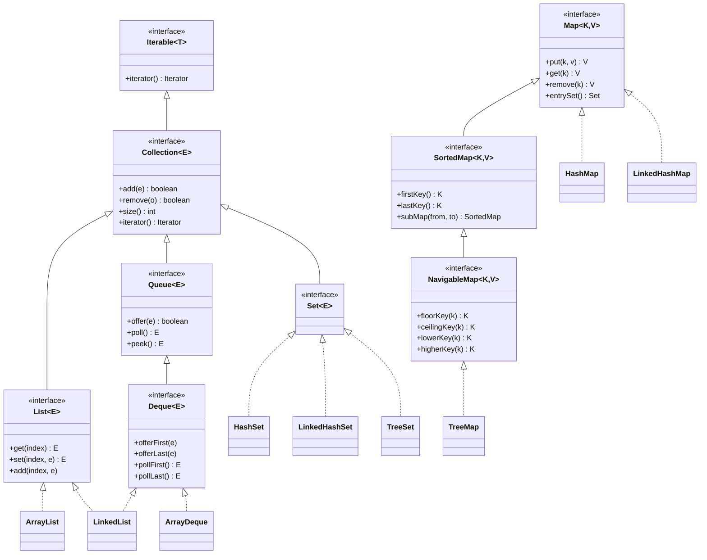
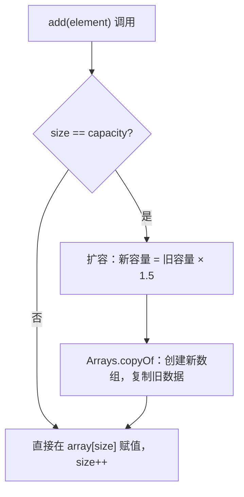
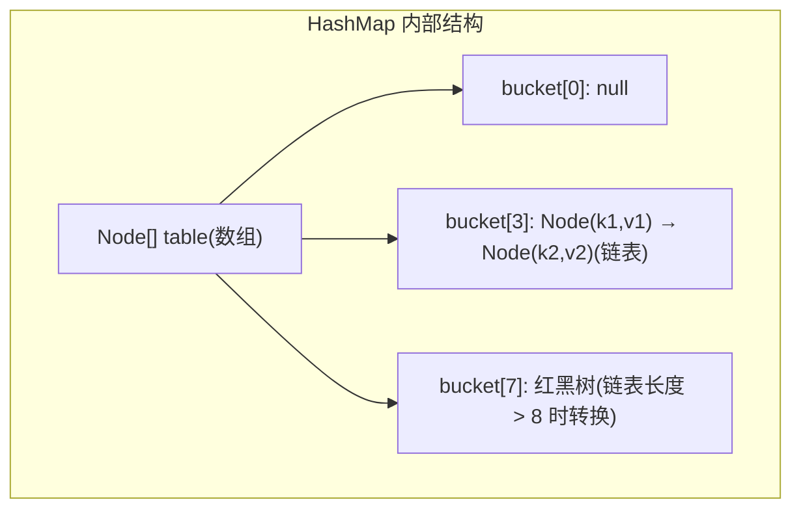
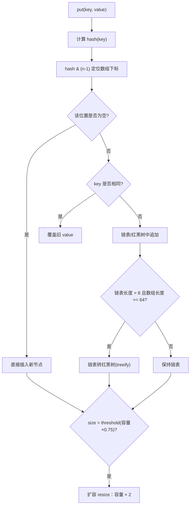
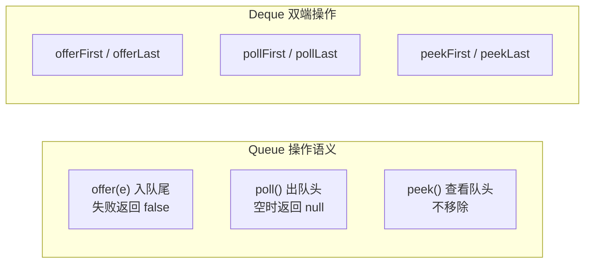
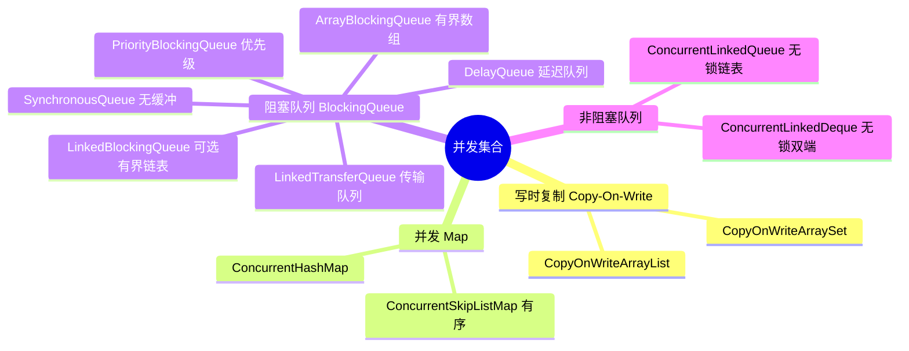
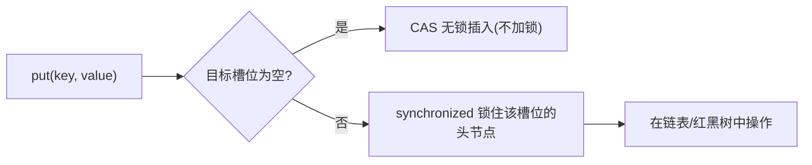
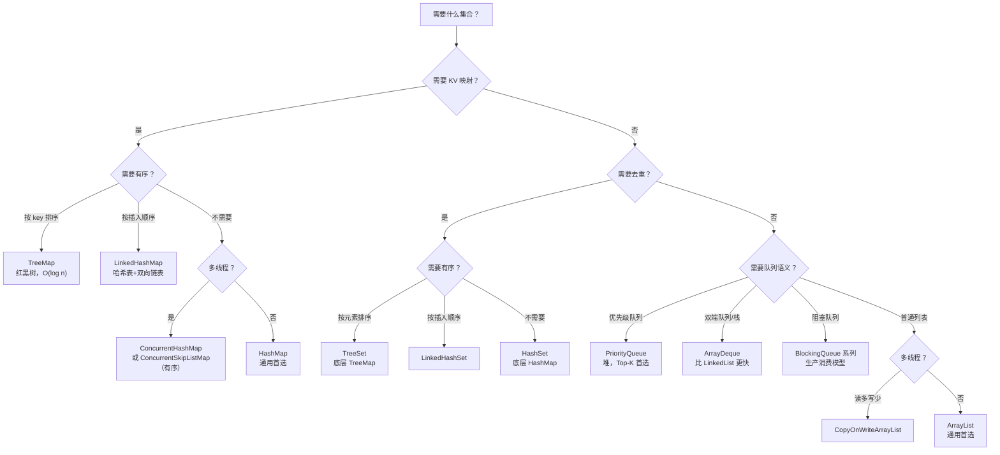

# 集合框架（Collections Framework）

---

## 1. 引入：它解决了什么问题？

**问题背景**：数组是 Java 最基础的数据容器，但有两个致命缺陷：

1. **长度固定**：创建时必须指定大小，无法动态扩容
2. **功能单一**：没有查找、排序、去重等高级操作

**集合框架解决的核心问题**：

- **动态存储** → 自动扩容，无需手动管理内存
- **数据结构选型** → 提供数组、链表、红黑树、哈希表等多种底层实现
- **线程安全** → 提供并发集合，解决多线程数据竞争
- **统一接口** → `List`/`Set`/`Map` 接口让代码面向接口编程，方便切换实现

**用生活模型建立直觉**：

| 集合类 | 生活类比 | 核心特征 |
| :------ | :------ | :------ |
| **ArrayList** | 停车场（编号连续的车位） | 按编号直接找到车位（随机访问 O(1)），但插入中间需要移动所有车（O(n)） |
| **LinkedList** | 火车车厢（每节车厢记录下一节的位置） | 加减车厢只需改指针（O(1)），但找第 n 节要从头数（O(n)） |
| **HashMap** | 图书馆的书架索引卡 | 通过书名（key）的哈希值直接定位书架位置，O(1) 查找 |
| **TreeMap** | 字典（按字母排序） | 所有 key 自动有序，查找是 O(log n) |
| **HashSet** | 签到表（只记录"来过没有"） | 自动去重，底层就是 HashMap（value 是固定占位对象） |

> **关键直觉**：选集合类型时，先问自己：**"我最常做的操作是什么？"** 随机访问多 → ArrayList；增删多 → LinkedList；需要 KV 映射 → HashMap；需要有序 → TreeMap。

---

## 2. 继承体系全景



!!! tip "关键设计模式"
    **关键设计模式**：

    - 🔄 **迭代器模式**：`Iterable` → `Iterator`，将遍历行为与集合实现解耦，`for-each` 语法糖底层就是调用 `iterator()`
    - 📋 **模板方法模式**：`AbstractList`、`AbstractMap` 等抽象类实现了通用逻辑，子类只需实现少量核心方法（如 `get`、`size`）
    - ⚖️ **`Comparable` vs `Comparator`**：前者是对象自身的"自然排序"（实现接口），后者是外部传入的"定制排序"（策略模式）
    
    💡 **理解这些模式有助于深入理解集合框架的设计思想**。

```java
// Comparable：类自身实现，定义自然顺序
class Student implements Comparable<Student> {
    public int compareTo(Student o) { return this.age - o.age; }
}

// Comparator：外部传入，灵活定制排序规则
TreeMap<Student, String> map = new TreeMap<>(
    Comparator.comparing(Student::getName).thenComparingInt(Student::getAge)
);
```

---

## 3. List 体系

### 3.1 ArrayList

**底层**：`Object[]` 数组 + 扩容机制



**关键数字**：

- 默认初始容量：**10**
- 每次扩容：**1.5 倍**（`oldCapacity + (oldCapacity >> 1)`）
- 扩容代价：O(n) 的数组复制，所以批量插入时建议提前 `new ArrayList<>(expectedSize)`

!!! note "ArrayList 扩容机制深度解析"
    **为什么扩容是 1.5 倍而不是 2 倍？**

    **内存复用原理**：每次扩容都会申请新内存，旧数组被废弃等待 GC 回收。如果新数组申请的地址落在旧数组释放的地址范围内，操作系统可以直接把物理内存页重新分配给新数组——这就是**内存复用**。
    
    **核心关键**：**新数组的大小 ≤ 之前所有废弃数组的大小之和**。只有满足这个条件，历史上释放的内存总量才足以容纳新数组，复用才有可能发生。
    
    **数学推导**：假设初始容量为 1，扩容 n 次后容量为 `r^n`，历史内存总和为等比数列：
    
    ```math
    1 + r + r² + ... + r^(n-1) = (r^n - 1) / (r - 1)
    ```
    
    要满足 `r^n ≤ (r^n - 1) / (r - 1)`，化简后得 **r < 2**。
    
    | 倍数 | 问题 |
    | :--- | :--- |
    | **= 2** | 新容量恰好等于历史内存总和，无法复用旧内存 |
    | **> 2**（如 3 倍） | 新数组比所有旧内存之和还大，完全无法复用，内存碎片严重 |
    | **< 1.5**（如 1.25 倍） | 扩容太频繁，每次 `Arrays.copyOf` 的 O(n) 复制开销累积过大 |
    | **= 1.5** | 小于 2 可复用旧内存，又不会太频繁扩容，是工程上的最优平衡点 |
    
    💡 **源码实现**：`oldCapacity >> 1` 即右移一位等于 `oldCapacity / 2`，新容量 = `oldCapacity + oldCapacity/2` = **1.5 倍**。
    
    > 对比：Python list 扩容约 **1.125 倍**，更省内存但扩容更频繁；Go slice 小容量时扩容 **2 倍**，大容量时逐渐降低到 **1.25 倍**。

### 3.2 LinkedList

**底层**：双向链表，每个节点持有 `prev`、`next`、`item` 三个引用。

`LinkedList` 同时实现了 `List` 和 `Deque` 接口，既可以当列表用，也可以当双端队列/栈用。

### 3.3 ArrayList vs LinkedList 对比

| 操作 | ArrayList | LinkedList | 说明 |
| :--- | :------- | :------ | :---- |
| 随机访问 `get(i)` | **O(1)** | O(n) | 数组直接寻址 vs 链表遍历 |
| 头部插入/删除 | O(n) | **O(1)** | 数组需移动元素 vs 改指针 |
| 尾部插入 | O(1) 均摊 | **O(1)** | 数组偶尔扩容 |
| 中间插入/删除 | O(n) | O(n)* | 都需要先定位到位置 |
| 内存占用 | 低（连续数组） | 高（每节点 40 字节） | 见下方内存分析 |
| CPU 缓存命中 | ✅ 高（连续内存） | ❌ 低（指针跳转） | 实际性能差距远大于理论 |

> *LinkedList 中间插入虽然改指针是 O(1)，但找到位置需要 O(n) 遍历

**LinkedList 节点内存结构**：

```java
Node<E> {
    E item;       // 8 字节（引用）
    Node next;    // 8 字节（引用）
    Node prev;    // 8 字节（引用）
    // 对象头：16 字节
}
// 每个节点 = 16（对象头）+ 8 + 8 + 8 = 40 字节
// ArrayList 每个元素只需 8 字节引用，内存是 LinkedList 的 1/5
```

以存储 **100 万个 Integer** 为例（64 位 JVM，开启压缩指针）：

| 存储方式 | 每元素开销 | 总内存（约） | 说明 |
| :------ | :------- | :-------- | :--- |
| `int[]` | 4 字节 | ~4 MB | 基本类型，无装箱 |
| `Integer[]` | 16 字节对象 + 4 字节引用 | ~20 MB | 装箱对象 |
| `ArrayList<Integer>` | 同上 + 数组扩容预留 | ~22 MB | 额外 1.5 倍预留空间 |
| `LinkedList<Integer>` | 16 字节对象 + 24 字节 Node | ~40 MB | 每节点 prev/next/item 三个引用 |

!!! warning "ArrayList vs LinkedList 性能警告"
    **性能对比结论**：

    - ❌ `LinkedList` CPU 缓存命中率低（内存不连续）
    - ❌ `LinkedList` 内存占用是 `ArrayList` 的 5 倍
    - ✅ **绝大多数场景应优先选 `ArrayList`**
    
    ⚠️ **除非有明确的头尾频繁插入删除需求，否则不要使用 LinkedList**。

**大量基本类型的优化方案**：

```java
// ❌ 大量 int 存储，装箱开销大
List<Integer> list = new ArrayList<>();

// ✅ 方案1：直接用数组（已知大小时）
int[] arr = new int[1000000];

// ✅ 方案2：使用 Eclipse Collections（专为基本类型优化）
IntList intList = IntLists.mutable.empty();

// ✅ 方案3：使用 Trove 库
TIntArrayList troveList = new TIntArrayList();
```

---

## 4. Map 体系

### 4.1 HashMap 底层结构（JDK 8）

**底层**：`数组 + 链表 + 红黑树`



**三种结构各自的职责**：

#### ① 数组（Node[] table）—— 定位桶

数组是 HashMap 的"骨架"，每个槽位称为一个**桶（bucket）**。put 时通过 `hash & (n-1)` 将 key 映射到某个桶的下标，这一步是 O(1) 的。数组的作用就是**快速定位**：给定一个 key，立刻知道它在哪个桶里。

```txt
key → hash(key) → hash & (n-1) → 数组下标
"name" → 0x4e616d65 → 0x4e616d65 & 15 → 5 → table[5]
```

#### ② 链表 —— 解决哈希冲突

不同的 key 可能映射到同一个桶（哈希冲突），这时用链表把冲突的节点串起来。链表的作用是**存储冲突元素**，查找时遍历链表逐一比较 key（用 `equals`）。

```txt
table[3] → Node("apple", 1) → Node("grape", 2) → Node("mango", 3) → null
           ↑ 三个 key 的 hash 都落在 bucket[3]，用链表串联
```

正常情况下哈希分布均匀，每个桶的链表长度很短（1~3），查询接近 O(1)。

#### ③ 红黑树 —— 防止链表退化

当某个桶的链表长度超过 8（且数组长度 ≥ 64），链表转为红黑树。红黑树的作用是**兜底保障**：

- 正常情况：链表短，不需要红黑树
- 极端情况（大量 key 哈希冲突，如哈希攻击）：链表查询退化为 O(n)，红黑树将最坏情况压到 O(log n)

```txt
链表查询：O(n)  →  红黑树查询：O(log n)
链表长度 1000   →  红黑树高度约 20
```

> 反过来，当红黑树节点数量减少到 6 以下时，会退化回链表（维护红黑树有额外开销，节点少时链表更轻量）。

**三者协作总结**：

```txt
数组：O(1) 定位到桶
  └── 链表：O(k) 在桶内查找（k 为链表长度，正常很短）
        └── 红黑树：O(log k) 兜底（k 很大时才启用）
```

**put 操作流程**：



### 4.2 HashMap 深层细节

#### 扰动函数（hash 扰动）

```java
// JDK 8 的 hash 方法
static final int hash(Object key) {
    int h;
    return (key == null) ? 0 : (h = key.hashCode()) ^ (h >>> 16);
}
```

**为什么要高 16 位与低 16 位异或？**

数组下标计算是 `hash & (n-1)`，当数组容量较小（如 16）时，只有 hash 的低 4 位参与运算，高位完全被忽略。扰动函数让高 16 位"混入"低 16 位，使高位信息也参与散列，减少低位相同导致的碰撞。

```txt
原始 hashCode：1111 1111 1111 1111  0000 0000 0000 0001
右移 16 位：   0000 0000 0000 0000  1111 1111 1111 1111
异或结果：     1111 1111 1111 1111  1111 1111 1111 1110
                                    ↑ 低位混入了高位信息
```

#### 负载因子与扩容阈值

!!! note "HashMap 参数设计的工程权衡"
    **为什么负载因子默认是 0.75？**

    这是**时间与空间的权衡**：负载因子越小碰撞少但空间浪费多，越大空间利用率高但链表变长查询退化。**0.75** 是经过统计分析的最优平衡点，在泊松分布下能保证大多数桶的链表长度不超过 3。
    
    **为什么链表长度超过 8 才转红黑树？**
    
    在正常的哈希分布下，链表长度超过 8 的概率极低（泊松分布约 0.00000006），转换有额外开销，所以设置阈值 8 作为平衡点。
    
    **为什么 JDK 8 要引入红黑树？**
    
    JDK 7 中，如果大量 key 的哈希值相同（哈希攻击），所有元素都落在同一个桶，链表查询退化为 O(n)。JDK 8 在链表长度超过 8 时转为红黑树，将最坏情况从 O(n) 降为 O(log n)，防止哈希碰撞攻击导致的性能问题。
    
    💡 **工程智慧**：这些参数都是经过大量实践和统计分析得出的最优平衡点。

!!! tip "HashMap 扩容优化技巧"
    **JDK 8 扩容时的 rehash 优化**：

    JDK 8 扩容时，不需要重新计算每个 key 的 hash，只需判断 `hash & oldCapacity` 的结果：
    
    - ✅ **结果为 0**：元素留在原位置（`index`）
    - ✅ **结果为 1**：元素移动到 `index + oldCapacity`
    
    ```txt
    旧容量 16（二进制 10000），扩容后 32
    hash & 16 == 0 → 留在原位
    hash & 16 != 0 → 移到 原位置 + 16
    ```
    
    💡 **优化原理**：扩容后新增的那一位 bit 恰好是 `oldCapacity` 对应的位，只需判断这一位即可，避免了全量 rehash 的开销。
    
    🚀 **性能提升**：这种优化将扩容时间复杂度从 O(n) 降低到 O(n)，但避免了大量的 hash 计算开销。

#### `tableSizeFor`：自动向上取整到 2 的幂次

HashMap 内部用 `hash & (n-1)` 代替取模运算（`hash % n`），这要求 n 必须是 2 的幂次，才能保证 `n-1` 的二进制全为 1，使散列更均匀。

```java
// 传入 10，实际容量变为 16；传入 17，变为 32
static final int tableSizeFor(int cap) {
    int n = cap - 1;
    n |= n >>> 1;
    n |= n >>> 2;
    n |= n >>> 4;
    n |= n >>> 8;
    n |= n >>> 16;
    return (n < 0) ? 1 : (n >= MAXIMUM_CAPACITY) ? MAXIMUM_CAPACITY : n + 1;
}
```

!!! recommendation "HashMap 容量初始化最佳实践"
    **工程建议**：创建 HashMap 时预估容量，避免多次扩容：

    ```java
    // 预计存 1000 个元素，初始容量设为 1000/0.75 ≈ 1334，向上取 2048
    new HashMap<>(2048);
    // 或使用 Guava 工具方法（自动计算）
    Maps.newHashMapWithExpectedSize(1000);
    ```
    
    💡 **计算公式**：`初始容量 = 预计元素数量 / 负载因子(0.75)`，然后向上取整到 2 的幂次。
    
    🚀 **性能收益**：避免扩容的 O(n) 复制开销，提升初始化性能。
    
    ⚠️ **注意**：不要过度预估容量，避免内存浪费。

### 4.3 TreeMap / TreeSet 红黑树细节

#### TreeMap 是什么？

`TreeMap` 是基于**红黑树**实现的有序 Map，它的 key 会按照**自然顺序**（`Comparable`）或**自定义比较器**（`Comparator`）自动排序。

| 特性 | 说明 |
| :--- | :-- |
| 底层结构 | 红黑树（自平衡二叉搜索树） |
| key 排序 | 始终有序，支持范围查询 |
| 时间复杂度 | 增删查均为 O(log n) |
| 是否允许 null key | ❌ 不允许（比较器无法处理 null） |
| 是否线程安全 | ❌ 非线程安全 |
| 典型场景 | 需要按 key 排序、范围查询、取最大/最小 key |

```java
TreeMap<String, Integer> scores = new TreeMap<>();
scores.put("Charlie", 80);
scores.put("Alice", 95);
scores.put("Bob", 88);

// 遍历时自动按 key 字母序排列
scores.forEach((k, v) -> System.out.println(k + ": " + v));
// 输出：Alice: 95 → Bob: 88 → Charlie: 80

scores.firstKey();  // "Alice"（最小）
scores.lastKey();   // "Charlie"（最大）
```

#### TreeSet 是什么？

`TreeSet` 是基于 `TreeMap` 实现的有序 Set，本质上就是一个 **value 全为同一个占位对象的 `TreeMap`**，所有元素自动去重并保持有序。

```java
TreeSet<Integer> set = new TreeSet<>();
set.add(5); set.add(1); set.add(3); set.add(1); // 重复的 1 被忽略

System.out.println(set); // [1, 3, 5]  自动排序 + 去重

set.first();    // 1
set.last();     // 5
set.floor(4);   // 3（≤ 4 的最大值）
set.ceiling(4); // 5（≥ 4 的最小值）
set.subSet(1, true, 4, false); // [1, 3]
```

> **一句话记忆**：`TreeMap` = 有序的 `HashMap`；`TreeSet` = 有序的 `HashSet`。有序的代价是操作从 O(1) 退化为 O(log n)。

---

#### 红黑树的 5 条性质

1. 每个节点是**红色**或**黑色**
2. **根节点**是黑色
3. **叶子节点**（NIL 节点）是黑色
4. **红色节点**的两个子节点必须是黑色（不能有连续红节点）
5. 从任意节点到其所有叶子节点的路径上，**黑色节点数量相同**（黑高相等）

> 这 5 条性质保证了红黑树的最长路径不超过最短路径的 2 倍，从而保证 O(log n) 的操作复杂度。

#### 插入/删除的修复操作（理解原理）

```txt
插入新节点（默认红色）后，可能违反性质4（连续红节点），通过以下操作修复：
  ├── 叔父节点为红色 → 变色（父、叔变黑，祖父变红），问题上移
  └── 叔父节点为黑色 → 旋转 + 变色（左旋/右旋，最多 2 次旋转）

删除节点后，可能违反性质5（黑高不等），通过类似的旋转+变色修复。
```

#### `NavigableMap` 范围查询接口

`TreeMap` 实现了 `NavigableMap`，提供强大的范围查询能力：

```java
TreeMap<Integer, String> map = new TreeMap<>();
// 假设 key: 1, 3, 5, 7, 9

map.floorKey(4);        // 返回 3（≤ 4 的最大 key）
map.ceilingKey(4);      // 返回 5（≥ 4 的最小 key）
map.lowerKey(5);        // 返回 3（< 5 的最大 key）
map.higherKey(5);       // 返回 7（> 5 的最小 key）

map.subMap(3, true, 7, false);  // [3, 7) 的子 Map，包含 3 不含 7
map.headMap(5, true);           // ≤ 5 的所有 entry
map.tailMap(5, false);          // > 5 的所有 entry

map.firstKey();         // 最小 key：1
map.lastKey();          // 最大 key：9
map.descendingMap();    // 逆序视图
```

**`Comparator` 与 `Comparable` 的优先级**：

```java
// TreeMap 使用 Comparator（如果传入）
// 否则要求 key 实现 Comparable
// 注意：TreeMap 的排序和 equals 可能不一致！
TreeMap<String, Integer> map = new TreeMap<>(String.CASE_INSENSITIVE_ORDER);
map.put("Apple", 1);
map.put("apple", 2); // 覆盖！因为 comparator 认为两者相等
map.size();          // 1，不是 2
```

### 4.4 HashMap vs TreeMap vs LinkedHashMap 对比

| 特性 | HashMap | TreeMap | LinkedHashMap |
| :--- | :---- | :----- | :---------- |
| **顺序** | 无序 | 按 key 排序 | 插入顺序 |
| **底层** | 哈希表 | 红黑树 | 哈希表+双向链表 |
| **查询** | O(1) | O(log n) | O(1) |
| **null key** | 允许1个 | ❌ | 允许1个 |
| **适用场景** | 通用KV | 需要有序遍历、范围查询 | LRU缓存、保持插入顺序 |

---

## 5. Set / Queue / Deque 体系

### 5.1 Set 体系

| 实现类 | 底层 | 有序 | null | 适用场景 |
| :--- | :--- | :-- | :--- | :------ |
| `HashSet` | HashMap（value 为固定占位对象） | ❌ | 允许1个 | 通用去重 |
| `LinkedHashSet` | LinkedHashMap | 插入顺序 | 允许1个 | 去重且保持顺序 |
| `TreeSet` | TreeMap | 自然排序 | ❌ | 去重且有序 |

### 5.2 Queue / Deque 体系



**`ArrayDeque` vs `LinkedList`**：

| 特性 | ArrayDeque | LinkedList |
| :---- | :----- | :------- |
| 底层 | 循环数组 | 双向链表 |
| 内存 | 连续，缓存友好 | 分散，每节点额外指针开销 |
| 性能 | 更快（无对象头开销） | 稍慢 |
| null 元素 | ❌ 不允许 | ✅ 允许 |
| 推荐场景 | 栈、队列、双端队列 | 需要 null 元素或 List 接口 |

!!! tip "ArrayDeque 性能优势"
    **官方推荐**：用 `ArrayDeque` 替代 `Stack`

    - ❌ `Stack` 继承自 `Vector`，所有方法加锁，性能差
    - ✅ `ArrayDeque` 无锁设计，性能更优
    - ✅ `ArrayDeque` 内存连续，CPU 缓存友好
    - ✅ `ArrayDeque` 无对象头开销，内存效率高
    
    💡 **使用场景**：
    - 栈操作：`push()`/`pop()`
    - 队列操作：`offer()`/`poll()`
    - 双端队列：`offerFirst()`/`offerLast()`
    
    🚀 **性能提升**：比 `LinkedList` 快 2-3 倍，内存占用更少。

```java
// ✅ 用 ArrayDeque 作栈
Deque<Integer> stack = new ArrayDeque<>();
stack.push(1);      // 等价于 offerFirst
stack.pop();        // 等价于 pollFirst

// ✅ 用 ArrayDeque 作队列
Queue<Integer> queue = new ArrayDeque<>();
queue.offer(1);     // 入队尾
queue.poll();       // 出队头

// PriorityQueue：堆实现，常用于 Top-K 问题
PriorityQueue<Integer> minHeap = new PriorityQueue<>();                          // 小顶堆
PriorityQueue<Integer> maxHeap = new PriorityQueue<>(Comparator.reverseOrder()); // 大顶堆
// Top-K 最大值：维护大小为 K 的小顶堆
minHeap.offer(val);
if (minHeap.size() > k) minHeap.poll(); // 弹出最小值，保留最大的 K 个
```

---

## 6. 并发集合

### 6.1 并发集合完整体系



| 集合类 | 底层机制 | 适用场景 |
| :---- | :---- | :------- |
| `CopyOnWriteArrayList` | 写时复制整个数组 | 读多写少（如配置列表、监听器列表） |
| `ConcurrentHashMap` | CAS + synchronized（槽位级别） | 通用并发 KV |
| `ConcurrentSkipListMap` | 跳表（无锁） | 需要有序的并发 Map |
| `ArrayBlockingQueue` | 数组 + ReentrantLock | 有界生产消费，内存可控 |
| `LinkedBlockingQueue` | 链表 + 两把锁（读写分离） | 高吞吐生产消费 |
| `PriorityBlockingQueue` | 堆 + ReentrantLock | 带优先级的任务调度 |
| `DelayQueue` | 优先级队列 + 延迟 | 定时任务、缓存过期 |
| `SynchronousQueue` | 无缓冲，直接传递 | 线程池中的直接提交策略 |
| `ConcurrentLinkedQueue` | CAS 无锁链表 | 高并发非阻塞队列 |

### 6.2 ConcurrentHashMap 线程安全机制（JDK 8）

**JDK 7**：分段锁（Segment），将数组分成 16 段，每段一把锁
**JDK 8**：**CAS + synchronized**，锁粒度细化到单个数组槽位



**优势**：只有发生哈希冲突时才加锁，且锁的粒度是单个槽位，并发度远高于 JDK 7 的分段锁。

### 6.3 CopyOnWriteArrayList 原理

```java
// 每次写操作都复制整个数组，写完后替换引用
public boolean add(E e) {
    synchronized (lock) {
        Object[] elements = getArray();
        int len = elements.length;
        Object[] newElements = Arrays.copyOf(elements, len + 1); // 复制
        newElements[len] = e;
        setArray(newElements); // 原子替换引用
        return true;
    }
}
// 读操作完全无锁，直接读当前数组快照
public E get(int index) {
    return get(getArray(), index);
}
```

!!! note "CopyOnWriteArrayList 适用场景与限制"
    **CopyOnWriteArrayList 特性**：

    - ✅ **读操作**：完全无锁，直接读当前数组快照
    - ❌ **写操作**：代价高（O(n) 复制），不适合写频繁的场景
    - ⚠️ **数据一致性**：读操作读的是快照，存在短暂的数据不一致（弱一致性）
    
    💡 **适用场景**：
    - 读多写少（如配置列表、监听器列表）
    - 写操作频率低，但要求读操作高性能
    - 可以容忍短暂的数据不一致
    
    ⚠️ **不适用场景**：
    - 写操作频繁
    - 要求强一致性
    - 内存敏感（写操作会产生大量临时对象）
    
    🚀 **性能特征**：读性能接近 `ArrayList`，写性能比 `ArrayList` 差一个数量级。

---

## 7. 工具类与不可变集合

### 7.1 Collections 工具类

```java
List<Integer> list = new ArrayList<>(Arrays.asList(3, 1, 4, 1, 5, 9));

// 排序与查找
Collections.sort(list);                           // 自然排序
Collections.sort(list, Comparator.reverseOrder()); // 逆序
Collections.binarySearch(list, 4);                // 二分查找（要求有序），返回下标
Collections.max(list);                            // 最大值
Collections.min(list);                            // 最小值
Collections.frequency(list, 1);                   // 元素出现次数 → 2

// 操作
Collections.reverse(list);                        // 反转
Collections.shuffle(list);                        // 随机打乱
Collections.fill(list, 0);                        // 填充为指定值
Collections.swap(list, 0, 1);                     // 交换两个位置的元素
Collections.nCopies(3, "hello");                  // 返回含 3 个 "hello" 的不可变 List

// 包装为线程安全（性能差，了解即可，优先用并发集合）
List<String> syncList = Collections.synchronizedList(new ArrayList<>());

// 包装为不可变（防御性编程）
List<String> immutable = Collections.unmodifiableList(list);
immutable.add("x"); // 抛出 UnsupportedOperationException
```

### 7.2 JDK 9+ 不可变集合工厂方法

```java
// JDK 9+：简洁的不可变集合创建方式
List<String> list = List.of("a", "b", "c");
Set<String>  set  = Set.of("x", "y", "z");
Map<String, Integer> map = Map.of("k1", 1, "k2", 2);
Map<String, Integer> map2 = Map.ofEntries(
    Map.entry("k1", 1),
    Map.entry("k2", 2),
    Map.entry("k3", 3)  // 超过 10 个 KV 时用 ofEntries
);
```

**与 `Collections.unmodifiableList` 的区别**：

| 特性 | `List.of()` | `Collections.unmodifiableList()` |
| :---- | :------ | :-------------------------------- |
| 原集合修改 | 无原集合，天然不可变 | 原集合修改后，视图也会变化 |
| null 元素 | ❌ 不允许，抛 NPE | ✅ 允许 |
| 性能 | 更优（专用实现） | 包装层有额外开销 |
| 推荐场景 | 常量集合、方法返回值 | 需要对已有集合做只读包装 |

### 7.3 WeakHashMap 与引用类型

Java 有四种引用强度，直接影响 GC 行为：

| 引用类型 | 类 | GC 行为 | 典型用途 |
| :------ | :-- | :------ | :----- |
| **强引用** | 普通变量 `Object o = new Object()` | 永不回收 | 日常使用 |
| **软引用** | `SoftReference<T>` | 内存不足时回收 | 内存敏感缓存 |
| **弱引用** | `WeakReference<T>` | 下次 GC 必定回收 | 防止内存泄漏的缓存 |
| **虚引用** | `PhantomReference<T>` | 随时回收，无法通过它获取对象 | 跟踪对象被回收的时机 |

**`WeakHashMap`**：key 是弱引用，当 key 对象没有其他强引用时，GC 会自动回收该 key，对应的 entry 也会被清除。

```java
WeakHashMap<Object, String> cache = new WeakHashMap<>();
Object key = new Object();
cache.put(key, "value");

key = null;          // 断开强引用
System.gc();         // 触发 GC
System.out.println(cache.size()); // 输出 0，entry 已被自动清除
```

!!! warning "ThreadLocal 内存泄漏风险"
    **`ThreadLocal` 的内存泄漏问题**：

    `ThreadLocal` 内部使用 `ThreadLocalMap`，其 key 是 `ThreadLocal` 对象的弱引用，value 是强引用。
    
    ```txt
    Thread → ThreadLocalMap → Entry(WeakRef<ThreadLocal>, value)
                                        ↑ 弱引用          ↑ 强引用！
    ```
    
    当 `ThreadLocal` 对象被 GC 回收后，key 变为 null，但 value 仍被强引用，**无法被回收，造成内存泄漏**。
    
    ⚠️ **特别严重**：在线程池场景中，线程被复用，`ThreadLocal` 的 value 会一直累积，导致严重的内存泄漏。
    
    ```java
    // ✅ 正确做法：使用完毕后调用 remove()
    ThreadLocal<UserContext> local = new ThreadLocal<>();
    try {
        local.set(new UserContext(...));
        // 业务逻辑
    } finally {
        local.remove(); // 必须清理，尤其在线程池中（线程复用）
    }
    ```
    
    💡 **最佳实践**：
    - 使用 `try-finally` 确保 `remove()` 被调用
    - 在线程池中必须清理
    - 考虑使用 `InheritableThreadLocal` 时更要注意清理
    
    ⚠️ **生产环境红线**：ThreadLocal 使用后不 remove 是严重的内存泄漏隐患。

---

## 8. 常见误区

!!! danger "多线程使用 HashMap 的严重风险"
    **❌ 绝对禁止**：多线程环境下使用 HashMap

    **JDK 7 风险**：扩容时头插法形成环形链表，导致：
    - ❌ CPU 使用率 100%
    - ❌ 死循环，系统卡死
    - ❌ 无法正常服务

    **JDK 8 风险**：数据丢失和并发问题：
    - ❌ 两个线程同时写同一槽位，数据被覆盖
    - ❌ 并发修改导致数据不一致
    - ❌ 可能抛出 `ConcurrentModificationException`
    
    ```java
    // ❌ 危险！绝对禁止
    Map<String, Integer> map = new HashMap<>();
    
    // ✅ 正确：使用 ConcurrentHashMap
    Map<String, Integer> map = new ConcurrentHashMap<>();
    ```
    
    ⚠️ **生产环境红线**：多线程环境下必须使用并发安全的集合类。

### ❌ 误区2：用 Hashtable 替代 ConcurrentHashMap

`Hashtable` 的所有方法都加了 `synchronized`，锁的是整个对象，并发性能极差。**现代代码应使用 `ConcurrentHashMap`**。

!!! warning "遍历时修改集合的常见错误"
    **❌ 常见错误**：在遍历过程中直接修改集合

    ```java
    List<String> list = new ArrayList<>(Arrays.asList("a", "b", "c"));
    
    // ❌ 抛出 ConcurrentModificationException
    for (String s : list) {
        if (s.equals("b")) list.remove(s);
    }
    ```
    
    ⚠️ **原因**：`for-each` 循环底层使用 `Iterator`，集合的 `modCount` 被修改，但 `Iterator` 的 `expectedModCount` 未更新，导致并发修改异常。
    
    **✅ 正确做法**：
    
    ```java
    // ✅ 使用 Iterator 的 remove 方法
    Iterator<String> it = list.iterator();
    while (it.hasNext()) {
        if (it.next().equals("b")) it.remove();
    }
    
    // ✅ 或使用 removeIf（Java 8+）
    list.removeIf(s -> s.equals("b"));
    ```
    
    💡 **最佳实践**：
    - 使用 `Iterator.remove()` 安全删除
    - Java 8+ 优先使用 `removeIf()`，代码更简洁
    - 多线程环境下使用并发集合的迭代器
    
    ⚠️ **注意**：`CopyOnWriteArrayList` 允许在遍历时修改，但会创建新数组，遍历的是旧数据快照。

!!! danger "HashMap key 的 hashCode/equals 规则违反"
    **❌ 严重错误**：HashMap 的 key 未正确实现 hashCode 和 equals

    ```java
    class Point {
        int x, y;
        // ❌ 只重写 equals，不重写 hashCode
        public boolean equals(Object o) { ... }
        // 没有重写 hashCode()
    }

    Map<Point, String> map = new HashMap<>();
    map.put(new Point(1, 2), "origin");
    map.get(new Point(1, 2));  // ❌ 返回 null！
    ```

    ⚠️ **问题原因**：
    - 两个"相等"的对象（`equals` 返回 true）可能落在不同的桶里
    - `get()` 时计算 hash 值不同，定位到不同的桶，找不到之前 `put()` 的值
    - 数据"丢失"，但实际在 HashMap 中（只是无法通过相同 key 找到）
    
    **✅ 必须遵守的规则**：
    
    ```java
    class Point {
        int x, y;
        
        // ✅ 必须同时重写 equals 和 hashCode
        public boolean equals(Object o) { ... }
        
        public int hashCode() {
            return Objects.hash(x, y); // 使用相同的字段
        }
    }
    ```

    💡 **黄金法则**：

    - `equals` 相等的对象，`hashCode` 必须相等
    - `hashCode` 相等的对象，`equals` 不一定相等（哈希冲突）
    - 使用相同的字段计算 `equals` 和 `hashCode`
    - 推荐使用 `Objects.hash()` 或 IDE 自动生成
    
    ⚠️ **生产环境红线**：违反此规则会导致 HashMap 无法正常工作，是严重 bug。

---

## 9. 总结：选型与问题

### 9.1 实际工程选型决策树



**快速记忆口诀**：

- **通用首选**：`ArrayList`（列表）、`HashMap`（映射）、`HashSet`（集合）
- **需要有序**：加 `Tree` 前缀（`TreeMap`、`TreeSet`）或用 `Linked` 变体（`LinkedHashMap`）
- **多线程**：加 `Concurrent` 前缀，或用 `CopyOnWrite` 变体（读多写少）
- **队列/栈**：`ArrayDeque`（单机）、`BlockingQueue` 系列（生产消费）

### 9.2 核心集合性能速查

| 集合类 | 底层结构 | 查询 | 头部插入 | 尾部插入 | 中间插入 | 线程安全 |
| :---- | :----- | :---- | :---- | :------ | :------ | :------ |
| ArrayList | 动态数组 | O(1) | O(n) | O(1)均摊 | O(n) | ❌ |
| LinkedList | 双向链表 | O(n) | O(1) | O(1) | O(n)* | ❌ |
| HashMap | 数组+链表+红黑树 | O(1)均摊 | - | - | - | ❌ |
| TreeMap | 红黑树 | O(log n) | - | - | - | ❌ |
| ConcurrentHashMap | 数组+链表+红黑树 | O(1)均摊 | - | - | - | ✅ |
| ArrayDeque | 循环数组 | - | O(1) | O(1) | - | ❌ |
| PriorityQueue | 堆 | O(log n) | - | O(log n) | - | ❌ |

> *LinkedList 中间插入需要先遍历找到位置，实际是 O(n)

### 9.3 提问

> **问：HashMap 的底层原理是什么？**

**答案**：

HashMap 底层是**数组 + 链表 + 红黑树**（JDK 8）。

put 时，先对 key 计算 hash 值（高低 16 位异或扰动），再通过 `hash & (n-1)` 定位数组下标。如果该位置为空直接插入；如果有冲突，JDK 8 用尾插法追加到链表；当链表长度超过 8 且数组长度大于等于 64 时，链表转为红黑树，防止哈希攻击导致性能退化。

当元素数量超过 `容量 × 0.75`（负载因子）时触发扩容，容量翻倍，扩容时利用 `hash & oldCapacity` 判断元素新位置，无需全量重算 hash。

多线程下不能用 HashMap，应使用 ConcurrentHashMap。JDK 8 的 ConcurrentHashMap 用 CAS + synchronized 实现，锁粒度是单个数组槽位，并发性能远好于 JDK 7 的分段锁。

> **问：ArrayList 和 LinkedList 怎么选？**

**答案**：

- **ArrayList** 底层是动态数组，随机访问 O(1)，但中间插入/删除需要移动元素，是 O(n)。适合**读多写少、需要随机访问**的场景。
- **LinkedList** 底层是双向链表，头尾插入/删除 O(1)，但随机访问需要遍历，是 O(n)。适合**频繁在头尾操作**的场景，如实现队列或栈。

实际上，由于 CPU 缓存局部性，ArrayList 的连续内存访问比 LinkedList 的指针跳转快得多，且 LinkedList 每个节点内存开销是 ArrayList 的 5 倍，**大多数场景 ArrayList 性能更好**，需要队列/栈语义时优先考虑 `ArrayDeque`。
