# 并发编程（Concurrent Programming）

---

## 1. 为什么需要并发？从硬件说起

### 1.1 多核 CPU 的现实

现代服务器 CPU 通常有 8~128 个核心。如果程序只用单线程，其余核心全部空闲，资源严重浪费。并发编程的本质目标是：

| 目标 | 手段 |
| :--- | :---- |
| 充分利用多核 CPU | 多线程并行计算 |
| 避免 IO 等待浪费 CPU | 异步 / 非阻塞 IO |
| 提升系统吞吐量 | 线程池处理并发请求 |
| 降低响应延迟 | 任务拆分并行执行 |

### 1.2 并发引入的三大问题

并发不是免费的，它带来了三个核心挑战：

```txt
┌─────────────────────────────────────────────────────────────┐
│              Three Core Concurrency Problems                │
│                                                             │
│  1. Atomicity                                               │
│     Multi-step ops interrupted -> inconsistent results      │
│     e.g. i++ = read->add->write, may be interleaved         │
│                                                             │
│  2. Visibility                                              │
│     Thread modifies var, others can't see the new value     │
│     Cause: CPU cache makes each core's data inconsistent    │
│                                                             │
│  3. Ordering                                                │
│     Compiler/CPU reorders instructions for optimization     │
│     No effect on single-thread, may break multi-thread      │
└─────────────────────────────────────────────────────────────┘
```

---

## 2. 底层基础：CPU 缓存与 Java 内存模型

### 2.1 CPU 缓存架构

理解并发问题，必须先理解 CPU 的缓存结构：

```txt
┌─────────────────────────────────────────────────────────────┐
│                   Multi-Core CPU Architecture               │
│                                                             │
│  ┌──────────────────┐    ┌──────────────────┐               │
│  │     Core 0       │    │     Core 1       │               │
│  │  ┌────────────┐  │    │  ┌────────────┐  │               │
│  │  │  Register  │  │    │  │  Register  │  │               │
│  │  └─────┬──────┘  │    │  └─────┬──────┘  │               │
│  │  ┌─────┴──────┐  │    │  ┌─────┴──────┐  │               │
│  │  │  L1 Cache  │  │    │  │  L1 Cache  │  │               │
│  │  │  (32KB)    │  │    │  │  (32KB)    │  │               │
│  │  └─────┬──────┘  │    │  └─────┬──────┘  │               │
│  │  ┌─────┴──────┐  │    │  ┌─────┴──────┐  │               │
│  │  │  L2 Cache  │  │    │  │  L2 Cache  │  │               │
│  │  │  (256KB)   │  │    │  │  (256KB)   │  │               │
│  └──┴─────┬──────┴──┘    └──┴─────┬──────┴──┘               │
│           └──────────┬─────────────┘                        │
│                ┌─────┴──────┐                               │
│                │  L3 Cache  │  (shared, several MB)         │
│                └─────┬──────┘                               │
│                ┌─────┴──────┐                               │
│                │ Main Memory│  (several GB, ~100ns latency) │
│                └────────────┘                               │
└─────────────────────────────────────────────────────────────┘

Access Latency:
  Register : < 1ns
  L1 Cache : ~1ns
  L2 Cache : ~4ns
  L3 Cache : ~10ns
  Main Mem : ~100ns  <-- 100x slower!
```

!!! note "缓存不一致与 MESI 协议"
    **缓存不一致问题**：Core 0 修改了变量 `x=1`，写入 L1 Cache，但 Core 1 的 L1 Cache 中 `x` 仍是旧值 `0`。这就是**可见性问题**的根源。

    **MESI 协议**：CPU 通过 MESI 协议（Modified / Exclusive / Shared / Invalid）维护多核缓存一致性。当一个核心修改了缓存行，会通过总线广播使其他核心的对应缓存行失效，强制它们从主内存重新加载。`volatile` 正是利用了这一机制。

### 2.2 Java 内存模型（JMM）

JMM 是 Java 对底层硬件内存模型的抽象，定义了线程与主内存之间的交互规则：

```txt
┌─────────────────────────────────────────────────────────────┐
│                Java Memory Model (JMM)                      │
│                                                             │
│  ┌──────────────────┐    ┌──────────────────┐               │
│  │    Thread A      │    │    Thread B      │               │
│  │  ┌────────────┐  │    │  ┌────────────┐  │               │
│  │  │ Working    │  │    │  │ Working    │  │               │
│  │  │ Memory     │  │    │  │ Memory     │  │               │
│  │  │ (CPU cache/│  │    │  │ (CPU cache/│  │               │
│  │  │  register) │  │    │  │  register) │  │               │
│  │  └────────────┘  │    │  └────────────┘  │               │
│  └──────────────────┘    └──────────────────┘               │
│           │  read/write           │  read/write             │
│           └───────────────────────┘                         |
|                       │                                     |
│                ┌──────v─────┐                               │
│                │ Main Memory│                               │
│                │ (shared    │                               │
│                │  variables)│                               │
│                └────────────┘                               │
└─────────────────────────────────────────────────────────────┘
```

!!! tip "JMM 的核心规则 —— happens-before"
    光有“工作内存 / 主内存”的模型还不够用——它只描述了内存的结构，却没有告诉你：**线程 A 的写操作，线程 B 到底能不能看到？什么时候能看到？** 如果没有一套明确的规则，开发者就无法判断代码是否线程安全。happens-before 就是这套规则的答案：它是 JMM 对开发者的承诺，只要满足这些规则，JVM 就保证可见性和有序性，开发者不需要关心底层 CPU 缓存和指令重排的细节。

    如果操作 A happens-before 操作 B，则 A 的结果对 B 可见。

| happens-before 规则 | 说明 |
| :----------------- | :--- |
| **程序顺序规则** | 同一线程内，前面的操作 happens-before 后面的操作 |
| **监视器锁规则** | unlock happens-before 后续的 lock |
| **volatile 规则** | volatile 写 happens-before 后续的 volatile 读 |
| **线程启动规则** | `Thread.start()` happens-before 线程内的任何操作 |
| **线程终止规则** | 线程内所有操作 happens-before `Thread.join()` 返回 |
| **传递性** | A hb B，B hb C，则 A hb C |

!!! note
    可以点击 [JVM 内存结构与 GC](@java-JVM内存结构与GC) 深入了解 JMM 

### 2.3 指令重排序

编译器和 CPU 都会对指令进行重排序以提升性能，但必须保证**单线程语义不变**（as-if-serial）：

```java
// 原始代码
int a = 1;   // ①
int b = 2;   // ②
int c = a + b; // ③

// 重排序后（单线程结果相同，但多线程可能出问题）
int b = 2;   // ②
int a = 1;   // ①
int c = a + b; // ③
```

!!! warning "经典案例：双重检查锁（DCL）的重排序问题"

    ```java
    // ❌ 错误的 DCL 单例（没有 volatile）
    public class Singleton {
        private static Singleton instance;

        public static Singleton getInstance() {
            if (instance == null) {           // ① 第一次检查
                synchronized (Singleton.class) {
                    if (instance == null) {   // ② 第二次检查
                        instance = new Singleton(); // ③ 问题在这里！
                    }
                }
            }
            return instance;
        }
    }
    // ③ new Singleton() 实际分三步：
    //   a. 分配内存空间
    //   b. 初始化对象（执行构造方法）
    //   c. 将引用赋值给 instance
    //
    // CPU 可能将 a→c→b 重排序：先赋值引用，再初始化对象
    // 此时另一个线程在 ① 处看到 instance != null，直接返回
    // 但对象还没初始化完成！→ 使用了半初始化的对象
    ```

    ```java
    // ✅ 正确的 DCL 单例（加 volatile 禁止重排序）
    public class Singleton {
        private static volatile Singleton instance; // volatile 关键！

        public static Singleton getInstance() {
            if (instance == null) {
                synchronized (Singleton.class) {
                    if (instance == null) {
                        instance = new Singleton();
                    }
                }
            }
            return instance;
        }
    }
    ```

---

## 3. 线程基础

### 3.1 线程生命周期

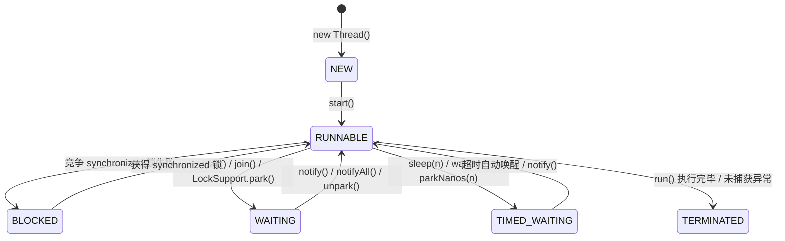

**关键状态区别**：

| 状态 | 触发条件 | 能否被中断 | 是否持有锁 |
| :--- | :--- | :--- | :--- |
| `BLOCKED` | 等待 `synchronized` 锁 | ❌ 不能 | ❌ |
| `WAITING` | `wait()` / `join()` / `park()` | ✅ 可以（抛 InterruptedException） | ❌（wait 会释放锁） |
| `TIMED_WAITING` | `sleep(n)` / `wait(n)` | ✅ 可以 | ❌（sleep 不释放锁！） |

### 3.2 线程中断机制

Java 的线程中断是**协作式**的，不是强制停止：

```java
// 中断一个线程（只是设置中断标志位）
thread.interrupt();

// 线程内部检查中断标志
while (!Thread.currentThread().isInterrupted()) {
    // 执行任务
}

// 阻塞方法（sleep/wait/join）会响应中断，抛出 InterruptedException
// 注意：抛出异常后，中断标志会被清除！需要重新设置
try {
    Thread.sleep(1000);
} catch (InterruptedException e) {
    Thread.currentThread().interrupt(); // 重新设置中断标志
    // 处理中断逻辑
}
```

!!! warning "中断标志会被清除"
    当阻塞方法（`sleep`/`wait`/`join`）抛出 `InterruptedException` 后，线程的中断标志位会被**自动清除**。如果需要保留中断状态，必须在 `catch` 块中调用 `Thread.currentThread().interrupt()` 重新设置。

---

## 4. synchronized 深度解析

### 4.1 Monitor 对象结构

`synchronized` 的底层是 **Monitor（监视器锁）**，在 HotSpot 中由 C++ 的 `ObjectMonitor` 实现：

```txt
┌──────────────────────────────────────────────────┐
│                  ObjectMonitor                   │
│                                                  │
│  _owner       -> current lock holder (Thread*)   │
│  _count       -> reentrant count                 │
│  _recursions  -> recursion depth                 │
│                                                  │
│  _EntryList   -> threads waiting for lock        │
│  ┌────────────────────────────────────────────┐  │
│  │ Thread-2 │ Thread-3 │ Thread-4 │ ...       │  │
│  └────────────────────────────────────────────┘  │
│                                                  │
│  _WaitSet     -> threads called wait()           │
│  ┌────────────────────────────────────────────┐  │
│  │ Thread-5 │ Thread-6 │ ...                  │  │
│  └────────────────────────────────────────────┘  │
└──────────────────────────────────────────────────┘
```

**Monitor 的工作流程**：

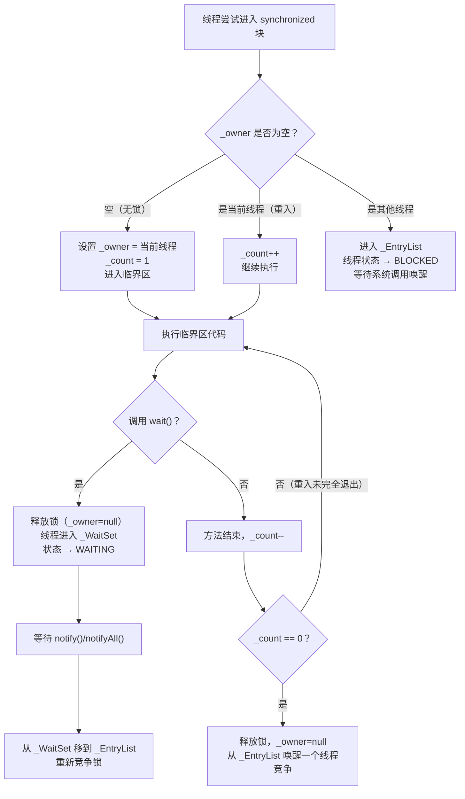

### 4.2 锁升级机制（JDK 6 优化）

JDK 6 之前 `synchronized` 直接使用重量级锁（OS 互斥量），每次加锁都涉及用户态→内核态切换，开销极大。JDK 6 引入了锁升级：

```txt
无锁 ──→ 偏向锁 ──→ 轻量级锁（CAS 自旋）──→ 重量级锁（OS 互斥量）
         （单线程）   （低竞争）              （高竞争）
```

**锁状态存储在对象头的 Mark Word 中**：

```txt
Mark Word (64-bit JVM, 8 bytes):

No Lock:
┌──────────────────────────────────────────────┬──────┬────┐
│  hashCode (31bit)  │ GC age (4bit)           │  0   │ 01 │
└──────────────────────────────────────────────┴──────┴────┘

Biased Lock:
┌──────────────────────────────────────────────┬──────┬────┐
│  threadID (54bit)  │ epoch(2bit) │ GC age    │  1   │ 01 │
└──────────────────────────────────────────────┴──────┴────┘

Lightweight Lock:
┌──────────────────────────────────────────────────────┬────┐
│  pointer to Lock Record on stack (62bit)             │ 00 │
└──────────────────────────────────────────────────────┴────┘

Heavyweight Lock:
┌──────────────────────────────────────────────────────┬────┐
│  pointer to ObjectMonitor (62bit)                    │ 10 │
└──────────────────────────────────────────────────────┴────┘
```

**各阶段详解**：

| 锁状态 | 适用场景 | 加锁方式 | 开销 |
| :--- | :--- | :--- | :--- |
| **偏向锁** | 只有一个线程访问 | 在 Mark Word 写入线程 ID，后续进入只需比较 ID | 极低（无 CAS） |
| **轻量级锁** | 多线程交替访问（无真正竞争） | CAS 将 Mark Word 替换为指向栈帧的指针 | 低（CAS 自旋） |
| **重量级锁** | 多线程真正竞争 | OS 互斥量，线程挂起/唤醒 | 高（内核态切换） |

!!! note "锁只能升级，不能降级"
    偏向锁可以被撤销，但不会降回无锁后再升偏向锁。锁升级是单向的：无锁 → 偏向锁 → 轻量级锁 → 重量级锁。

### 4.3 synchronized 的字节码

```java
// 同步方法
public synchronized void method() { }
// 字节码：方法标志位加 ACC_SYNCHRONIZED，进入时自动获取 this 的 Monitor

// 同步代码块
synchronized (obj) { }
// 字节码：
//   monitorenter  ← 获取 obj 的 Monitor
//   ...
//   monitorexit   ← 释放 Monitor（正常退出）
//   monitorexit   ← 释放 Monitor（异常退出，编译器自动生成）
```

---

## 5. volatile 深度解析

### 5.1 可见性：内存屏障的作用

`volatile` 通过**内存屏障（Memory Barrier）**实现可见性：

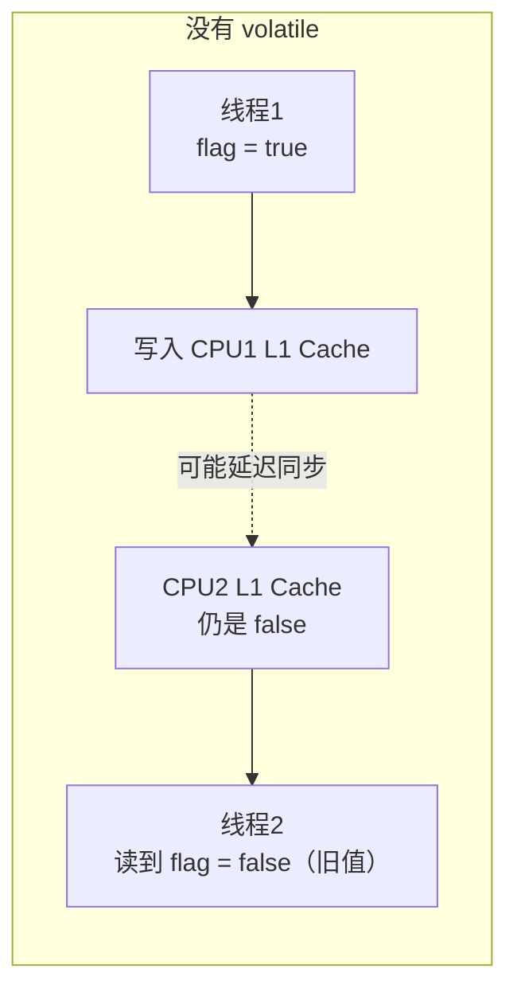

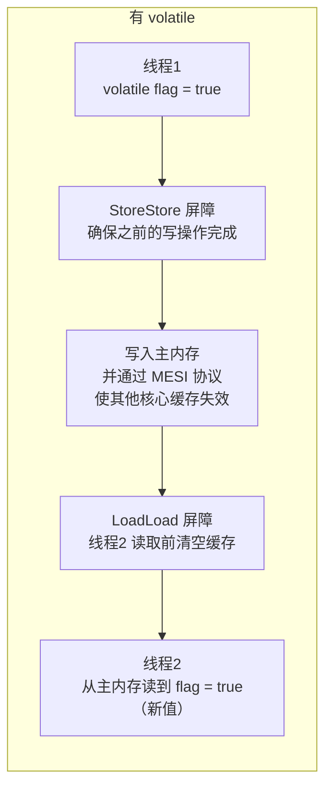

**四种内存屏障**：

| 屏障类型 | 作用 | volatile 使用位置 |
| :----- | :----- | :----- |
| `LoadLoad` | 屏障前的读操作先于屏障后的读操作完成 | volatile 读之后 |
| `StoreStore` | 屏障前的写操作先于屏障后的写操作完成 | volatile 写之前 |
| `LoadStore` | 屏障前的读操作先于屏障后的写操作完成 | volatile 读之后 |
| `StoreLoad` | 屏障前的写操作先于屏障后的读操作完成 | volatile 写之后（最重要，开销最大） |

### 5.2 有序性：禁止指令重排

`volatile` 的 happens-before 规则：**volatile 写 happens-before 后续的 volatile 读**。

```java
// 线程 A
a = 1;              // ① 普通写
volatile_flag = true; // ② volatile 写（StoreStore 屏障保证 ① 在 ② 之前完成）

// 线程 B
if (volatile_flag) {  // ③ volatile 读（LoadLoad 屏障保证 ③ 在 ④ 之前完成）
    use(a);           // ④ 普通读（一定能看到 a=1）
}
// ② happens-before ③，① happens-before ②，所以 ① happens-before ④
// 线程 B 在 ③ 读到 true 后，④ 一定能看到 a=1
```

### 5.3 volatile 不能保证原子性

!!! warning "volatile 不保证原子性"
    `volatile` 只保证可见性和有序性，**不保证原子性**。`count++` 是读→加→写三步操作，即使加了 `volatile`，多线程下仍然不安全。需要使用 `synchronized` 或 `AtomicInteger` 来保证原子性。

```java
volatile int count = 0;

// ❌ 多线程下仍然不安全！
// count++ 分三步：① 读取 count → ② 加 1 → ③ 写回
// 两个线程可能同时读到相同的值，各自加 1 后写回，结果只加了 1
void increment() { count++; }

// ✅ 方案1：synchronized
synchronized void increment() { count++; }

// ✅ 方案2：AtomicInteger（CAS，无锁，性能更好）
AtomicInteger count = new AtomicInteger(0);
void increment() { count.incrementAndGet(); }
```

---

## 6. CAS 与原子类

### 6.1 CAS 原理

CAS（Compare And Swap）是一种**无锁**的原子操作，由 CPU 硬件指令（`cmpxchg`）保证原子性：

```txt
CAS(内存地址V, 期望值A, 新值B)：
  if (V 的当前值 == A) {
      V = B;  // 更新成功
      return true;
  } else {
      return false;  // 更新失败，需要重试
  }
// 以上操作由 CPU 保证原子性（不可被中断）
```

**AtomicInteger.incrementAndGet() 的实现**：

```java
// 底层实现（简化）
public final int incrementAndGet() {
    for (;;) {  // 自旋重试
        int current = get();          // 读取当前值
        int next = current + 1;       // 计算新值
        if (compareAndSet(current, next)) {  // CAS 尝试更新
            return next;  // 成功则返回
        }
        // 失败说明有其他线程修改了值，重新读取再试
    }
}
```

### 6.2 CAS 的三个问题

**① ABA 问题**：

```txt
线程1 读到 A，准备 CAS(A→B)
线程2 将 A→B→A（改了又改回来）
线程1 CAS 成功（看到的还是 A），但中间状态已经变化过

解决：使用 AtomicStampedReference，带版本号的 CAS
AtomicStampedReference<Integer> ref = new AtomicStampedReference<>(A, 0);
ref.compareAndSet(A, B, 0, 1);  // 同时比较值和版本号
```

**② 自旋开销**：竞争激烈时，大量线程自旋消耗 CPU。JDK 8 引入 `LongAdder` 解决高并发计数场景。

**③ 只能保证单个变量的原子性**：多个变量需要用 `AtomicReference` 封装为一个对象。

### 6.3 LongAdder vs AtomicLong

```txt
AtomicLong (single Cell):
┌──────────────────────────────────────────────────────┐
|  All threads compete for the same value              |
|  Thread-1 --> CAS(value)                             |
|  Thread-2 --> CAS(value)  <- heavy contention, spins |
|  Thread-3 --> CAS(value)                             |
└──────────────────────────────────────────────────────┘

LongAdder (Cell array, distributed contention):
┌─────────────────────────────────────────────────────┐
│  base + Cell[0] + Cell[1] + Cell[2] + Cell[3]       │
│  Thread-1 --> CAS(Cell[0])                          │
│  Thread-2 --> CAS(Cell[1])  <- almost no contention │
│  Thread-3 --> CAS(Cell[2])                          │
│  Thread-4 --> CAS(Cell[3])                          │
│                                                     │
│  sum() = base + Cell[0] + Cell[1] + Cell[2] + ...   │
└─────────────────────────────────────────────────────┘
```

!!! tip "如何选择？"
    高并发计数场景用 `LongAdder`（分散竞争，吞吐量高），需要精确读取当前值用 `AtomicLong`（`sum()` 非原子操作，不保证实时精确）。

---

## 7. 锁的进阶：ReentrantLock 与 AQS

### 7.1 ReentrantLock vs synchronized

| 对比项 | synchronized | ReentrantLock |
| :----- | :----- | :----- |
| **实现层面** | JVM 内置，字节码指令 | Java 代码，基于 AQS |
| **可中断** | ❌ | ✅ `lockInterruptibly()` |
| **超时获取** | ❌ | ✅ `tryLock(timeout)` |
| **公平锁** | ❌（非公平） | ✅ `new ReentrantLock(true)` |
| **多条件变量** | 只有一个 wait/notify | ✅ 多个 `Condition` |
| **锁状态查询** | ❌ | ✅ `isLocked()` / `getQueueLength()` |
| **性能（JDK 6+）** | 相当 | 相当 |

```java
ReentrantLock lock = new ReentrantLock();
Condition notFull = lock.newCondition();
Condition notEmpty = lock.newCondition();

// 生产者
lock.lock();
try {
    while (queue.isFull()) {
        notFull.await();  // 等待"不满"条件
    }
    queue.add(item);
    notEmpty.signal();  // 通知消费者"不空了"
} finally {
    lock.unlock();  // 必须在 finally 中释放！
}
```

!!! danger "ReentrantLock 必须在 finally 中释放"
    与 `synchronized` 不同，`ReentrantLock` 不会自动释放锁。如果忘记在 `finally` 中调用 `unlock()`，一旦发生异常，锁将永远不会被释放，导致其他线程永久阻塞。

### 7.2 AQS（AbstractQueuedSynchronizer）原理

AQS 是 Java 并发包的核心框架，`ReentrantLock`、`Semaphore`、`CountDownLatch` 等都基于它实现。

**AQS 的核心数据结构**：

```txt
AQS Internal Structure:
┌─────────────────────────────────────────────────────────────┐
|                          AQS                                |
|                                                             |
|  state (volatile int): sync state                           |
|    ReentrantLock : 0=unlocked, >0=reentrant count           |
|    Semaphore     : remaining permits                        |
|    CountDownLatch: remaining count                          |
|                                                             |
|  CLH variant wait queue (doubly-linked list):               |
|                                                             |
|  head -> [Node] <-> [Node] <-> [Node] <-> [Node] <- tail    |
|          (sentinel) Thread-2   Thread-3   Thread-4          |
|                                                             |
|  Each Node contains:                                        |
|    thread    : the waiting thread                           |
|    waitStatus: CANCELLED/SIGNAL/CONDITION/PROPAGATE/0       |
|    prev/next : doubly-linked list pointers                  |
└─────────────────────────────────────────────────────────────┘
```

**ReentrantLock 加锁流程**：

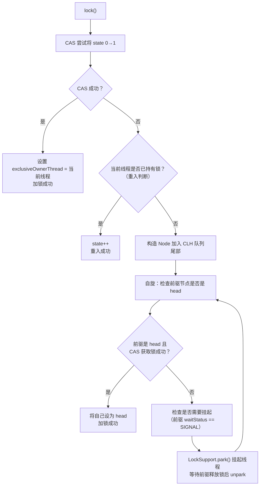

### 7.3 公平锁 vs 非公平锁

```txt
非公平锁（默认）：
  新来的线程先尝试 CAS 抢锁，抢到就直接执行
  抢不到再排队
  优点：吞吐量高（减少线程切换）
  缺点：可能导致队列中的线程长期等待（饥饿）

公平锁：
  新来的线程直接排队，按顺序获取锁
  优点：公平，无饥饿
  缺点：吞吐量低（每次都要唤醒队列头部线程，涉及线程切换）
```

---

## 8. 并发工具类

### 8.1 CountDownLatch

**场景**：等待多个任务全部完成后再继续（一次性，不可重置）。

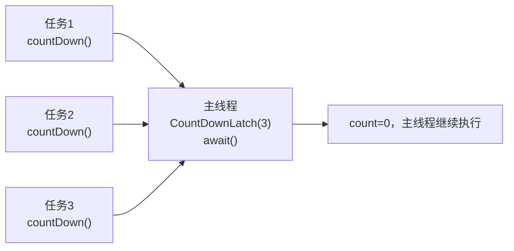

```java
CountDownLatch latch = new CountDownLatch(3);

// 三个子任务
for (int i = 0; i < 3; i++) {
    executor.submit(() -> {
        try {
            doTask();
        } finally {
            latch.countDown(); // 必须在 finally 中！
        }
    });
}

latch.await(); // 主线程等待，直到 count 减为 0
// 所有任务完成后继续
```

### 8.2 CyclicBarrier

**场景**：多个线程互相等待，到达屏障点后一起继续（可重复使用）。

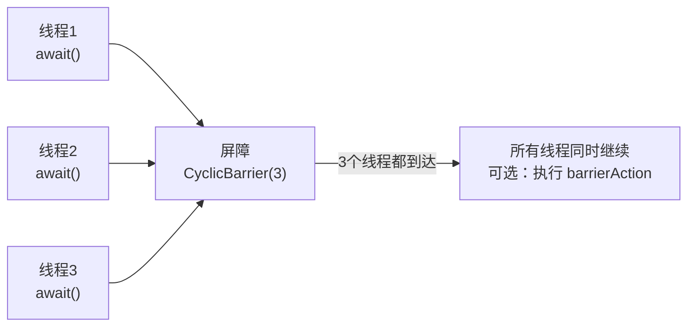

**CountDownLatch vs CyclicBarrier**：

| 对比项 | CountDownLatch | CyclicBarrier |
| :----- | :----- | :----- |
| **等待方向** | 一个线程等多个线程 | 多个线程互相等待 |
| **可重置** | ❌ 一次性 | ✅ 可重复使用 |
| **计数方式** | 减到 0 触发 | 加到 N 触发 |
| **典型场景** | 主线程等子任务完成 | 分阶段并行计算 |

### 8.3 Semaphore

**场景**：控制并发访问数量（限流）。

```java
// 数据库连接池：最多 10 个并发连接
Semaphore semaphore = new Semaphore(10);

public void queryDB() {
    semaphore.acquire(); // 获取许可（没有许可则阻塞）
    try {
        // 执行数据库操作
    } finally {
        semaphore.release(); // 释放许可
    }
}
```

### 8.4 ReadWriteLock

**场景**：读多写少，读读不互斥，读写/写写互斥。

```txt
读写锁的互斥关系：
  读锁 + 读锁 → ✅ 共存（并发读）
  读锁 + 写锁 → ❌ 互斥
  写锁 + 写锁 → ❌ 互斥
```

```java
ReadWriteLock rwLock = new ReentrantReadWriteLock();
Lock readLock = rwLock.readLock();
Lock writeLock = rwLock.writeLock();

// 读操作（并发安全）
readLock.lock();
try { return cache.get(key); }
finally { readLock.unlock(); }

// 写操作（独占）
writeLock.lock();
try { cache.put(key, value); }
finally { writeLock.unlock(); }
```

**StampedLock（JDK 8+）**：在 ReadWriteLock 基础上增加了**乐观读**，读操作不加锁，只在验证失败时升级为悲观读锁，进一步提升读性能。

---

## 9. 线程池深度解析

### 9.1 线程池工作流程

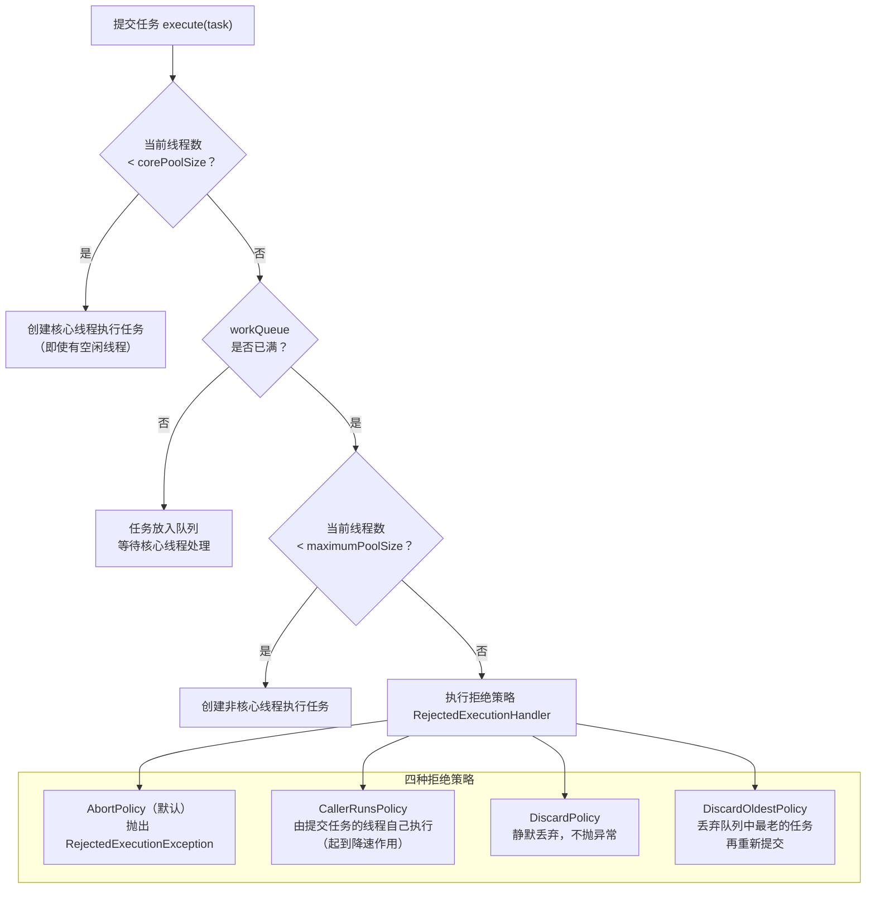

### 9.2 任务队列类型选择

| 队列类型 | 特点 | 适用场景 | 风险 |
| :----- | :----- | :----- | :----- |
| `LinkedBlockingQueue(无界)` | 无限容量 | `newFixedThreadPool` 使用 | OOM 风险 |
| `ArrayBlockingQueue(有界)` | 固定容量，FIFO | **推荐，生产使用** | 队列满触发拒绝策略 |
| `SynchronousQueue` | 不存储任务，直接交给线程 | `newCachedThreadPool` 使用 | 线程数无上限 |
| `PriorityBlockingQueue` | 按优先级排序 | 有优先级的任务调度 | 低优先级任务可能饥饿 |
| `DelayQueue` | 延迟执行 | 定时任务、缓存过期 | - |

### 9.3 线程池参数配置

```java
// ✅ 生产环境推荐写法
ExecutorService pool = new ThreadPoolExecutor(
    10,                              // corePoolSize：核心线程数
    20,                              // maximumPoolSize：最大线程数
    60, TimeUnit.SECONDS,            // keepAliveTime：非核心线程空闲存活时间
    new ArrayBlockingQueue<>(1000),  // 有界队列，防 OOM
    new ThreadFactoryBuilder()
        .setNameFormat("order-pool-%d")  // 线程命名，方便排查
        .setUncaughtExceptionHandler((t, e) -> log.error("线程异常", e))
        .build(),
    new ThreadPoolExecutor.CallerRunsPolicy()  // 拒绝策略：调用者执行
);
```

!!! tip "线程数配置经验"
    - **CPU 密集型任务**（计算、加密）：线程数 = CPU 核数 + 1（+1 防止偶发缺页中断导致 CPU 空闲）
    - **IO 密集型任务**（数据库、网络请求）：线程数 = CPU 核数 × (1 + 等待时间/计算时间)，经验值：CPU 核数 × 2
    - **混合型任务**：拆分为 CPU 密集和 IO 密集两个线程池分别处理

### 9.4 线程池监控

```java
ThreadPoolExecutor executor = (ThreadPoolExecutor) pool;

// 关键监控指标
executor.getPoolSize();          // 当前线程数
executor.getActiveCount();       // 活跃线程数（正在执行任务）
executor.getCorePoolSize();      // 核心线程数
executor.getMaximumPoolSize();   // 最大线程数
executor.getQueue().size();      // 队列中等待的任务数
executor.getCompletedTaskCount(); // 已完成任务总数
executor.getTaskCount();         // 提交的任务总数

// 报警阈值：队列使用率 > 80% 时告警
double queueUsage = (double) executor.getQueue().size() / 1000;
if (queueUsage > 0.8) {
    alert("线程池队列使用率过高: " + queueUsage);
}
```

---

## 10. ThreadLocal 深度解析

### 10.1 ThreadLocal 的存储结构

```txt
Thread Object
┌─────────────────────────────────────────────────────────────┐
│  Thread                                                     │
│  threadLocals -> ThreadLocalMap                             │
│                 ┌─────────────────────────────────────────┐ │
│                 │  Entry[] table (open-addressing hashmap)│ │
│                 │                                         │ │
│                 │  [0]: null                              │ │
│                 │  [1]: Entry(key=TL-A WeakRef, val=val1) │ │
│                 │  [2]: null                              │ │
│                 │  [3]: Entry(key=TL-B WeakRef, val=val2) │ │
│                 │  ...                                    │ │
│                 └─────────────────────────────────────────┘ │
└─────────────────────────────────────────────────────────────┘
```

!!! note "关键设计"
    ThreadLocalMap 是 **Thread** 的字段，不是 ThreadLocal 的字段。ThreadLocal 对象本身只是一个 key，数据存在线程自己的 Map 里，天然线程隔离。

### 10.2 内存泄漏原理

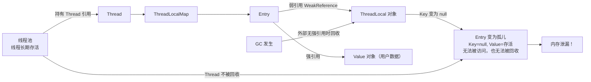

!!! warning "泄漏的三个条件（同时满足时发生）"
    1. 使用线程池（线程长期存活）
    2. ThreadLocal 对象没有外部强引用（被 GC 回收，key 变 null）
    3. 没有调用 `remove()`

!!! note "为什么 key 用弱引用？"
    假设 key 用**强引用**，会发生什么？

    ```java
    // 业务代码
    static ThreadLocal<UserContext> TL = new ThreadLocal<>();
    TL.set(new UserContext());
    // ... 使用完毕 ...
    TL = null;  // 业务代码认为"我不再需要这个 ThreadLocal 了"
    ```

    此时内存中的引用链：

    ```txt
    TL = null（业务代码已经放弃了引用）

    但是：
    Thread → ThreadLocalMap → Entry → key（强引用）→ ThreadLocal 对象
                                    → value（强引用）→ UserContext 对象
    ```

    **问题**：虽然业务代码已经将 `TL` 置为 null，但 ThreadLocalMap 中的 Entry 仍然通过**强引用**指向 ThreadLocal 对象。只要线程还活着（线程池场景），这条引用链就不会断，GC **永远无法回收** ThreadLocal 对象和 value 对象。这就是**彻底的内存泄漏**——连 key 带 value 全部泄漏，而且没有任何补救机会。

    ---

    改用**弱引用**后：

    ```txt
    TL = null（业务代码放弃引用）

    Thread → ThreadLocalMap → Entry → key（弱引用）⇢ ThreadLocal 对象
                                    → value（强引用）→ UserContext 对象
    ```

    GC 发现 ThreadLocal 对象只剩弱引用，**可以回收它**，Entry 的 key 变为 null。虽然 value 仍然泄漏，但这是一种**"降级"的泄漏**——ThreadLocalMap 在后续的 `get()`/`set()`/`remove()` 操作中会主动清理 key 为 null 的 Entry（调用 `expungeStaleEntry()`），value 也会被回收。

    **总结**：弱引用不能完全防止泄漏，但它把"key + value 全部泄漏且无法补救"降级为"只有 value 暂时泄漏，且有自动清理机会"。最佳实践仍然是**用完必须调用 `remove()`**。

```java
// ✅ 正确使用 ThreadLocal
private static final ThreadLocal<UserContext> USER_CONTEXT = new ThreadLocal<>();

public void handleRequest(Long userId) {
    USER_CONTEXT.set(new UserContext(userId));
    try {
        // 业务逻辑，任意层级都可以通过 USER_CONTEXT.get() 获取
        doBusinessLogic();
    } finally {
        USER_CONTEXT.remove(); // 必须！防止内存泄漏和数据污染
    }
}
```

---

## 11. 并发集合

### 11.1 ConcurrentHashMap（JDK 8）

JDK 8 的 `ConcurrentHashMap` 放弃了分段锁，改用 **CAS + synchronized（锁单个桶头节点）**：

```txt
ConcurrentHashMap Structure (JDK 8):

Node[] table (array, default size 16)
┌────┬────┬────┬────┬────┬────┬────┬────┐
|    |    |    |    |    |    |    |    |
└────┴────┴────┴────┴────┴────┴────┴────┘
  |    |
  v    v
[Node] [Node]
  |      +-> [Node] -> [Node]  (linked list, length < 8)
  +-> [TreeNode]               (red-black tree, length >= 8)

Concurrency Control:
  - Bucket empty   : CAS insert head node (lock-free)
  - Bucket not empty: synchronized on head node (lock one bucket only)
  - Resizing       : multi-thread cooperative migration
```

#### put 操作源码流程

`put()` 是 ConcurrentHashMap 最核心的方法，理解它就理解了整个并发控制设计：

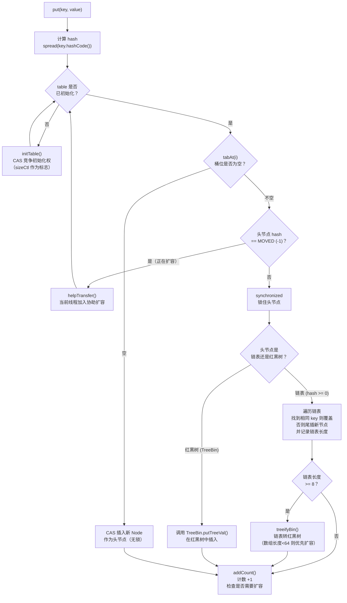

```java
// put 核心源码（简化版）
final V putVal(K key, V value, boolean onlyIfAbsent) {
    if (key == null || value == null) throw new NullPointerException();
    int hash = spread(key.hashCode()); // 高低16位异或 + 强制正数
    int binCount = 0;

    for (Node<K,V>[] tab = table;;) {
        Node<K,V> f; int n, i, fh;

        if (tab == null || (n = tab.length) == 0)
            tab = initTable();                          // ① 懒初始化

        else if ((f = tabAt(tab, i = (n - 1) & hash)) == null) {
            if (casTabAt(tab, i, null, new Node<>(hash, key, value)))
                break;                                  // ② CAS 插入空桶（无锁）

        } else if ((fh = f.hash) == MOVED)
            tab = helpTransfer(tab, f);                 // ③ 协助扩容

        else {
            synchronized (f) {                          // ④ 锁住桶头节点
                if (tabAt(tab, i) == f) {               // double-check
                    if (fh >= 0) {                      // 链表
                        // 遍历链表，尾插或覆盖
                    } else if (f instanceof TreeBin) {  // 红黑树
                        // 红黑树插入
                    }
                }
            }
            if (binCount >= TREEIFY_THRESHOLD)          // ⑤ 链表转树
                treeifyBin(tab, i);
        }
    }
    addCount(1L, binCount);                             // ⑥ 计数 + 扩容检查
    return null;
}
```

!!! tip "关键设计点"
    - **key 和 value 都不允许为 null**：与 HashMap 不同！因为在并发场景下，`get()` 返回 null 无法区分"key 不存在"还是"value 就是 null"，会产生二义性。
    - **spread() 哈希扰动**：`(h ^ (h >>> 16)) & HASH_BITS`，高低 16 位异或后强制最高位为 0（保证 hash 为正数），因为负数 hash 有特殊含义（`MOVED=-1` 表示正在扩容，`TREEBIN=-2` 表示红黑树）。
    - **synchronized 锁的是头节点对象**，不同桶的操作完全并行，锁粒度极细。

#### 扩容机制：多线程协作迁移（transfer）

ConcurrentHashMap 的扩容是其最精妙的设计之一——**多个线程可以同时参与数据迁移**：

```txt
Multi-Thread Cooperative Resizing:

Old table (size=16):
┌────┬────┬────┬────┬────┬────┬────┬────┬────┬────┬────┬────┬────┬────┬────┬────┐
│ 0  │ 1  │ 2  │ 3  │ 4  │ 5  │ 6  │ 7  │ 8  │ 9  │ 10 │ 11 │ 12 │ 13 │ 14 │ 15 │
└────┴────┴────┴────┴────┴────┴────┴────┴────┴────┴────┴────┴────┴────┴────┴────┘
  ^                   ^                   ^                   ^
  │                   │                   │                   │
  Thread-3            Thread-2            Thread-1            Thread-0
  (stride=4)          (stride=4)          (stride=4)          (stride=4)
  migrating           migrating           migrating           migrating
  [0..3]              [4..7]              [8..11]             [12..15]

New table (size=32):
┌────┬────┬────┬────┬────┬────┬────┬────┬────┬────┬────┬────┬────┬────┬────┬────┬...
│ 0  │ 1  │ 2  │ 3  │ 4  │ 5  │ 6  │ 7  │ 8  │ 9  │ 10 │ 11 │ 12 │ 13 │ 14 │ 15 │...
└────┴────┴────┴────┴────┴────┴────┴────┴────┴────┴────┴────┴────┴────┴────┴────┴...

Migration rule for each node:
  if (hash & oldCap == 0) -> stays at index i        (low  list)
  if (hash & oldCap != 0) -> moves to index i+oldCap (high list)
```

**扩容流程详解**：

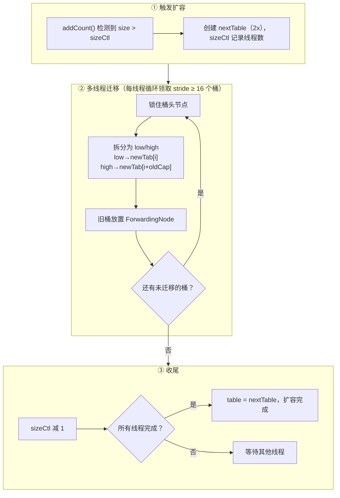

!!! note "ForwardingNode 的作用"
    当一个桶迁移完成后，旧桶位置会放置一个 `ForwardingNode`（hash 值为 `MOVED = -1`）。它有两个作用：

    1. **标记已迁移**：其他线程在 `put` 时发现桶头是 ForwardingNode，就知道正在扩容，会调用 `helpTransfer()` 加入协助
    2. **转发读请求**：`get()` 遇到 ForwardingNode 时，会通过它的 `find()` 方法到新数组中查找，保证扩容期间读操作不受影响

!!! warning "扩容期间的并发安全"
    - **读操作**：完全无锁。如果桶未迁移，直接在旧数组读；如果已迁移（ForwardingNode），转发到新数组读
    - **写操作**：如果桶未迁移，正常加锁写入旧数组；如果遇到 ForwardingNode，先帮助扩容，再在新数组写入
    - **迁移过程**：每个桶的迁移都加了 synchronized 锁，保证同一个桶不会被多个线程同时迁移

#### size() 的实现：分散计数

ConcurrentHashMap 的 `size()` 采用了类似 `LongAdder` 的分散计数策略，避免所有线程竞争同一个计数器：

```txt
Counting Mechanism (similar to LongAdder):

Low contention:
  All threads CAS on baseCount
  baseCount: 42

High contention (CAS on baseCount fails):
  Spread to CounterCell array
  baseCount: 30
  ┌─────────────┬─────────────┬─────────────┬─────────────┐
  │ CounterCell │ CounterCell │ CounterCell │ CounterCell │
  │  value = 3  │  value = 5  │  value = 2  │  value = 2  │
  └─────────────┴─────────────┴─────────────┴─────────────┘

  size() = baseCount + sum(CounterCell[])
         = 30 + 3 + 5 + 2 + 2 = 42
```

```java
// addCount 简化逻辑
private final void addCount(long x, int check) {
    CounterCell[] cs; long b, s;
    // 先尝试 CAS 更新 baseCount
    if ((cs = counterCells) != null ||
        !U.compareAndSetLong(this, BASECOUNT, b = baseCount, s = b + x)) {
        // CAS 失败（竞争激烈），分散到 CounterCell
        CounterCell c; long v;
        int m = cs.length - 1;
        // 用线程探针值（ThreadLocalRandom.getProbe()）选择 Cell
        if ((c = cs[ThreadLocalRandom.getProbe() & m]) == null ||
            !(U.compareAndSetLong(c, CELLVALUE, v = c.value, v + x))) {
            fullAddCount(x, uncontended); // 进一步处理竞争
        }
    }
    // check >= 0 时检查是否需要扩容
    if (check >= 0) { /* 扩容检查逻辑 */ }
}
```

!!! warning "size() 返回的是近似值"
    `size()` 内部调用 `sumCount()` = `baseCount + Σ CounterCell[i].value`。由于没有加全局锁，在并发写入时，返回值可能不是精确的实时值。但对于绝大多数场景（监控、日志、判断是否为空），近似值已经足够。如果需要精确值，需要外部加锁。

#### get 操作：全程无锁

`get()` 操作**完全不加锁**，这是 ConcurrentHashMap 高性能的关键：

```java
public V get(Object key) {
    Node<K,V>[] tab; Node<K,V> e, p; int n, eh; K ek;
    int h = spread(key.hashCode());
    if ((tab = table) != null && (n = tab.length) > 0 &&
        (e = tabAt(tab, (n - 1) & h)) != null) {       // volatile 读取桶头
        if ((eh = e.hash) == h) {
            if ((ek = e.key) == key || (ek != null && key.equals(ek)))
                return e.val;                            // 头节点命中
        }
        else if (eh < 0)                                 // 特殊节点
            return (p = e.find(h, key)) != null ? p.val : null;
            // ForwardingNode: 转发到新数组查找
            // TreeBin: 在红黑树中查找
        while ((e = e.next) != null) {                   // 遍历链表
            if (e.hash == h &&
                ((ek = e.key) == key || (ek != null && key.equals(ek))))
                return e.val;
        }
    }
    return null;
}
```

!!! tip "get() 为什么不需要加锁？"
    三个关键保障：

    1. **Node 的 val 和 next 都是 volatile 的**：保证读到最新值
    2. **tabAt() 使用 Unsafe.getObjectVolatile()**：保证读取数组元素时的可见性
    3. **数组引用 table 也是 volatile 的**：扩容切换数组时，其他线程能立即看到新数组

#### JDK 7 vs JDK 8 对比

| 对比项 | JDK 7 | JDK 8 |
| :----- | :----- | :----- |
| **锁机制** | `Segment` 分段锁（继承 ReentrantLock） | `synchronized` + CAS |
| **锁粒度** | 锁一个 Segment（包含多个桶） | 锁单个桶的头节点 |
| **数据结构** | 数组 + 链表 | 数组 + 链表 + 红黑树 |
| **并发度** | 固定（默认 16 个 Segment） | 等于数组长度（动态增长） |
| **哈希冲突** | 链表（头插法） | 链表（尾插法）+ 红黑树 |
| **扩容** | 单线程迁移（每个 Segment 独立扩容） | **多线程协作迁移** |
| **计数** | 每个 Segment 单独计数，求和需遍历 | baseCount + CounterCell[] |
| **空桶插入** | 加锁 | CAS（无锁） |

```txt
JDK 7 Segment-based Locking:
┌───────────────────────────────────────────────────────────┐
│  ConcurrentHashMap                                        │
│  Segment[] (default 16, fixed after creation)             │
│  ┌──────────┐ ┌──────────┐ ┌──────────┐ ┌──────────┐      │
│  │ Segment0 │ │ Segment1 │ │ Segment2 │ │ Segment3 │ ...  │
│  │ (Lock)   │ │ (Lock)   │ │ (Lock)   │ │ (Lock)   │      │
│  │ HashEntry│ │ HashEntry│ │ HashEntry│ │ HashEntry│      │
│  │ [] table │ │ [] table │ │ [] table │ │ [] table │      │
│  └──────────┘ └──────────┘ └──────────┘ └──────────┘      │
│                                                           │
│  Problem: Segment count is fixed at creation time.        │
│  Even if table grows, max concurrency = 16 (default).     │
└───────────────────────────────────────────────────────────┘

JDK 8 Per-Bucket Locking:
┌───────────────────────────────────────────────────────────┐
│  ConcurrentHashMap                                        │
│  Node[] table (grows dynamically)                         │
│  ┌────┬────┬────┬────┬────┬────┬────┬────┬────┬────┐      │
│  │    │    │    │    │    │    │    │    │    │    │ ...  │
│  └─┬──┴─┬──┴────┴────┴────┴────┴────┴────┴────┴────┘      │
│    │    │                                                 │
│    v    v                                                 │
│  [syn] [syn]  <- synchronized on each bucket head         │
│                                                           │
│  Concurrency = table.length (16 → 32 → 64 → ...)          │
│  Grows with data, no artificial ceiling.                  │
└───────────────────────────────────────────────────────────┘
```

#### 常见陷阱与最佳实践

```java
// ❌ 错误：先检查再操作（check-then-act），非原子
ConcurrentHashMap<String, Integer> map = new ConcurrentHashMap<>();
if (!map.containsKey("key")) {
    map.put("key", 1);  // 两个线程可能同时通过 containsKey 检查
}

// ✅ 正确：使用原子方法
map.putIfAbsent("key", 1);

// ✅ 正确：原子的 compute 操作
map.compute("key", (k, v) -> v == null ? 1 : v + 1);

// ✅ 正确：原子的 merge 操作（累加计数）
map.merge("key", 1, Integer::sum);
```

!!! danger "ConcurrentHashMap 的复合操作不是原子的"
    虽然 `put()`、`get()` 等单个方法是线程安全的，但**多个方法的组合操作不是原子的**。例如 `if (!map.containsKey(k)) map.put(k, v)` 在并发下仍然不安全。必须使用 `putIfAbsent()`、`compute()`、`merge()` 等原子复合方法。

### 11.2 并发集合选型

| 场景 | 推荐集合 | 说明 |
| :----- | :----- | :----- |
| 高并发读写 Map | `ConcurrentHashMap` | 分桶锁，高并发 |
| 读多写少 Map | `CopyOnWriteArrayList` 思路的 Map | 写时复制，读无锁 |
| 并发队列（FIFO） | `LinkedBlockingQueue` | 阻塞队列，生产者-消费者 |
| 高性能无锁队列 | `ConcurrentLinkedQueue` | CAS 实现，非阻塞 |
| 延迟队列 | `DelayQueue` | 定时任务 |
| 优先级队列 | `PriorityBlockingQueue` | 带优先级的阻塞队列 |
| 读多写极少 List | `CopyOnWriteArrayList` | 写时复制，读完全无锁 |

---

## 12. 常见问题与最佳实践

### 12.1 死锁

**死锁的四个必要条件**（破坏任意一个即可预防）：

```txt
① 互斥：资源同一时刻只能被一个线程持有
② 占有并等待：线程持有资源的同时等待其他资源
③ 不可剥夺：线程持有的资源不能被强制剥夺
④ 循环等待：线程间形成环形等待链
```

```java
// ❌ 死锁示例：加锁顺序相反
// 线程1：lockA → lockB
// 线程2：lockB → lockA

// ✅ 预防方案1：统一加锁顺序
// 所有线程都按 lockA → lockB 顺序加锁

// ✅ 预防方案2：tryLock 超时
if (lockA.tryLock(100, TimeUnit.MILLISECONDS)) {
    try {
        if (lockB.tryLock(100, TimeUnit.MILLISECONDS)) {
            try {
                // 临界区
            } finally { lockB.unlock(); }
        }
    } finally { lockA.unlock(); }
}

// ✅ 预防方案3：一次性申请所有资源（破坏"占有并等待"）
```

**死锁排查**：

```bash
# 查看线程堆栈，找到 BLOCKED 状态的线程
jstack <pid> | grep -A 20 "BLOCKED"

# 或使用 jconsole / arthas 的 thread -b 命令
# arthas：
thread -b  # 自动检测死锁
```

Arthas `thread -b` 输出样例：

```txt
$ thread -b
"Thread-1" Id=12 BLOCKED on java.lang.Object@3f2a3a5
  owned by "Thread-0" Id=11
    at com.example.DeadlockDemo.lambda$main$1(DeadlockDemo.java:28)
    -  blocked on java.lang.Object@3f2a3a5       <-- 想获取这把锁
    -  locked   java.lang.Object@1c655221         <-- 已持有这把锁
    at java.lang.Thread.run(Thread.java:750)

Found one Java-level deadlock:
=============================
"Thread-1":
  waiting to lock Monitor of java.lang.Object@3f2a3a5
  which is held by "Thread-0"

"Thread-0":
  waiting to lock Monitor of java.lang.Object@1c655221
  which is held by "Thread-1"
```

!!! tip "如何读懂输出"
    - `BLOCKED on java.lang.Object@3f2a3a5`：Thread-1 正在等待获取 `@3f2a3a5` 这把锁
    - `owned by "Thread-0"`：这把锁被 Thread-0 持有
    - `blocked on ... / locked ...`：Thread-1 **想要** `@3f2a3a5`，但**已持有** `@1c655221`
    - 最下方的 deadlock 摘要清晰展示了环形等待链：Thread-1 等 Thread-0 的锁，Thread-0 等 Thread-1 的锁

### 12.2 活锁与饥饿

**三者对比总览**：

| 问题 | 线程状态 | 描述 | 解决方案 |
| :----- | :----- | :----- | :----- |
| **死锁** | BLOCKED（阻塞） | 线程永久阻塞，互相等待对方释放锁 | 统一加锁顺序 / tryLock 超时 |
| **活锁** | RUNNABLE（运行中） | 线程不阻塞，但一直在重试，无法推进 | 引入随机退避（Exponential Backoff） |
| **饥饿** | RUNNABLE / WAITING | 某些线程长期无法获得资源 | 使用公平锁 / 优先级调整 |

#### 活锁（Livelock）

活锁和死锁的区别在于：**死锁是线程"卡死不动"，活锁是线程"一直在动但做无用功"**。就像两个人在走廊里迎面相遇，都想给对方让路，结果同时往左让、同时往右让，不断重复，谁也过不去。

```txt
Livelock Example: Two Threads Yielding to Each Other

Time  Thread-A                    Thread-B
 t0   tryLock(lockA) -> success   tryLock(lockB) -> success
 t1   tryLock(lockB) -> FAIL      tryLock(lockA) -> FAIL
 t2   unlock(lockA), retry...     unlock(lockB), retry...
 t3   tryLock(lockA) -> success   tryLock(lockB) -> success
 t4   tryLock(lockB) -> FAIL      tryLock(lockA) -> FAIL
 t5   unlock(lockA), retry...     unlock(lockB), retry...
 ...  (infinite loop, both threads are RUNNABLE but make no progress)
```

```java
// ❌ 活锁示例：两个线程互相谦让，永远无法推进
public void transferMoney(Account from, Account to, int amount) {
    while (true) {
        if (from.lock.tryLock()) {
            try {
                if (to.lock.tryLock()) {
                    try {
                        from.balance -= amount;
                        to.balance += amount;
                        return; // 成功
                    } finally { to.lock.unlock(); }
                }
            } finally { from.lock.unlock(); }
        }
        // 两个线程同时执行到这里，同时重试，又同时失败...
    }
}

// ✅ 解决方案：引入随机退避
public void transferMoney(Account from, Account to, int amount) {
    Random random = new Random();
    while (true) {
        if (from.lock.tryLock()) {
            try {
                if (to.lock.tryLock()) {
                    try {
                        from.balance -= amount;
                        to.balance += amount;
                        return;
                    } finally { to.lock.unlock(); }
                }
            } finally { from.lock.unlock(); }
        }
        // 随机等待一段时间再重试，打破同步节奏
        Thread.sleep(random.nextInt(10)); // 随机退避 0~9ms
    }
}
```

!!! tip "活锁的常见场景"
    1. **消息重试**：消息消费失败后立即重试，但失败原因未消除（如下游服务宕机），导致无限重试。应使用**指数退避**（Exponential Backoff）：第 1 次等 1s，第 2 次等 2s，第 3 次等 4s...
    2. **tryLock 互相谦让**：如上例，两个线程用 `tryLock` 避免死锁，但同步重试导致活锁。加随机退避即可解决。
    3. **状态机循环**：两个线程根据对方状态调整自己的状态，导致状态不断翻转但永远无法达到稳定态。

#### 饥饿（Starvation）

饥饿是指某些线程**长期无法获得所需资源**（CPU 时间、锁、IO 等），虽然没有被阻塞，但实际上一直在"排队等待"。

```txt
Starvation Example: Non-Fair Lock

Lock acquisition order (non-fair):
  Thread-1 (high priority): lock -> execute -> unlock -> lock -> execute -> ...
  Thread-2 (high priority): lock -> execute -> unlock -> lock -> execute -> ...
  Thread-3 (low priority) : waiting... waiting... waiting... (starved!)

  Non-fair lock allows "barging": when the lock is released,
  a newly arriving thread can steal it before queued threads.
  High-priority threads keep barging in, Thread-3 never gets a chance.

┌───────────────────────────────────────────────────────────────────┐
│  Time →                                                           │
│  T1: [===]    [===]    [===]    [===]    [===]                    │
│  T2:      [===]    [===]    [===]    [===]    [===]               │
│  T3:  wait  wait  wait  wait  wait  wait  wait  wait  (starved!)  │
└───────────────────────────────────────────────────────────────────┘
```

```java
// ❌ 饥饿场景1：非公平锁 + 高竞争
ReentrantLock unfairLock = new ReentrantLock(); // 默认非公平
// 高优先级线程频繁获取锁，低优先级线程可能长期等待

// ✅ 解决：使用公平锁
ReentrantLock fairLock = new ReentrantLock(true); // 公平锁，FIFO 顺序

// ❌ 饥饿场景2：读写锁中写线程饥饿
ReadWriteLock rwLock = new ReentrantReadWriteLock();
// 大量读线程不断获取读锁，写线程一直无法获取写锁
// 因为读锁是共享的，只要有读锁存在，写锁就无法获取

// ✅ 解决：ReentrantReadWriteLock 默认支持写线程优先
// 当有写线程等待时，后续的读线程会排队，不再插队
ReadWriteLock rwLock = new ReentrantReadWriteLock(true); // 公平模式

// ❌ 饥饿场景3：线程优先级设置不当
thread.setPriority(Thread.MIN_PRIORITY); // 优先级最低，可能长期得不到调度
// 注意：Java 线程优先级只是"建议"，不同 OS 的调度策略不同，不要依赖优先级
```

!!! warning "饥饿 vs 死锁 vs 活锁 的本质区别"
    - **死锁**：所有相关线程都**停止**了，谁也动不了 → 系统完全卡住
    - **活锁**：所有相关线程都在**运动**，但做的是无用功 → 系统在空转
    - **饥饿**：部分线程正常运行，**个别线程**长期得不到资源 → 系统整体能工作，但不公平

    ```txt
    Deadlock:  Thread-A: [blocked...]     Thread-B: [blocked...]
    Livelock:  Thread-A: [retry retry...] Thread-B: [retry retry...]
    Starvation:Thread-A: [run run run...] Thread-B: [wait wait wait...]
    ```

### 12.3 happens-before 实战

```java
// 问题：以下代码线程安全吗？
class Holder {
    int n;
    Holder(int n) { this.n = n; }
}

Holder holder;

// 线程A
holder = new Holder(42);

// 线程B
if (holder != null) {
    System.out.println(holder.n); // 可能打印 0！
}

// 原因：holder 的赋值和 Holder 内部字段的初始化可能被重排序
// 线程B 可能看到 holder != null，但 holder.n 还是 0（未初始化）

// ✅ 解决：将 holder 声明为 volatile，或使用 synchronized
volatile Holder holder;
```

---

## 13. 问题

> **问：synchronized 和 volatile 的区别？**

`volatile` 保证**可见性**和**有序性**，但不保证原子性。通过内存屏障实现：写后立即刷主内存，读前从主内存加载，同时禁止指令重排。适合状态标志位、DCL 单例等场景。

`synchronized` 保证**可见性、有序性和原子性**。通过 Monitor 锁实现互斥，同一时刻只有一个线程能进入临界区。JDK 6 后引入锁升级（偏向锁→轻量级锁→重量级锁），性能大幅提升。适合复合操作、需要互斥的临界区。

> **问：CAS 是什么？有什么问题？**

CAS（Compare And Swap）是 CPU 级别的原子指令，比较内存值与期望值，相等则更新为新值，否则失败重试（自旋）。Java 的 `AtomicInteger` 等原子类基于 CAS 实现无锁并发。

三个问题：① **ABA 问题**：值被改了又改回来，CAS 无法感知，用 `AtomicStampedReference` 加版本号解决；② **自旋开销**：竞争激烈时大量 CPU 空转，高并发计数用 `LongAdder` 替代；③ **只能保证单变量原子性**，多变量需封装为对象用 `AtomicReference`。

> **问：线程池的核心参数和执行流程？**

七个核心参数：`corePoolSize`（核心线程数）、`maximumPoolSize`（最大线程数）、`keepAliveTime`（非核心线程存活时间）、`unit`（时间单位）、`workQueue`（任务队列）、`threadFactory`（线程工厂）、`handler`（拒绝策略）。

执行流程：① 线程数 < 核心线程数 → 创建核心线程；② 核心线程满 → 放入队列；③ 队列满 → 创建非核心线程；④ 达到最大线程数 → 执行拒绝策略。

!!! danger "禁止使用 Executors 工厂方法"
    生产环境必须手动创建 `ThreadPoolExecutor`，使用有界队列（`ArrayBlockingQueue`）。`Executors.newFixedThreadPool` 使用无界队列、`Executors.newCachedThreadPool` 线程数无上限，都有 OOM 风险。

> **问：ThreadLocal 的内存泄漏是怎么发生的？**

`ThreadLocalMap` 的 Entry 中，key（ThreadLocal 对象）是弱引用，value 是强引用。当 ThreadLocal 对象没有外部强引用时，GC 会回收 key，Entry 变为 `key=null, value=存活`。在线程池场景下，线程长期存活，这些孤儿 Entry 无法被访问也无法被回收，造成内存泄漏。

解决方案：使用完后在 `finally` 块中调用 `ThreadLocal.remove()`。
