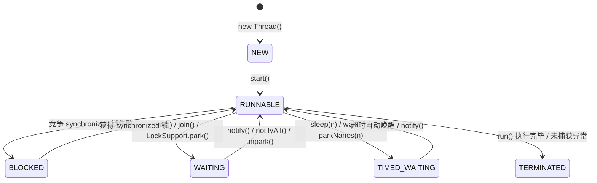
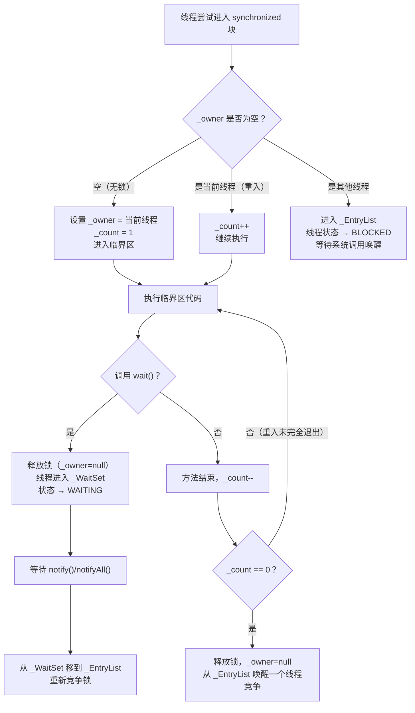
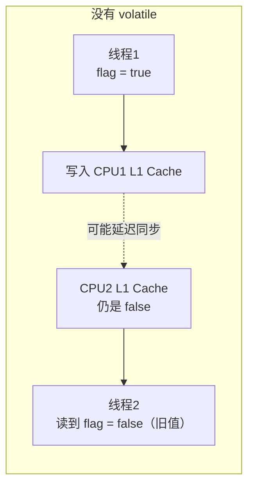
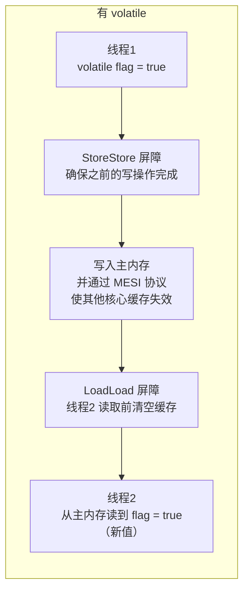
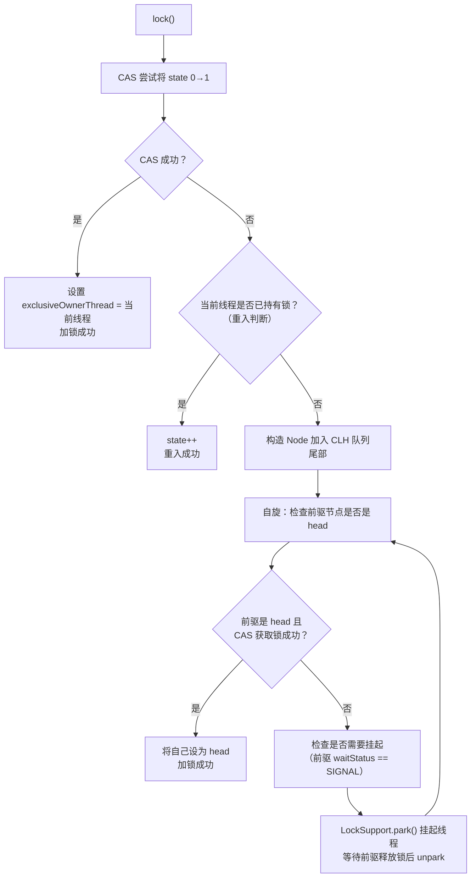
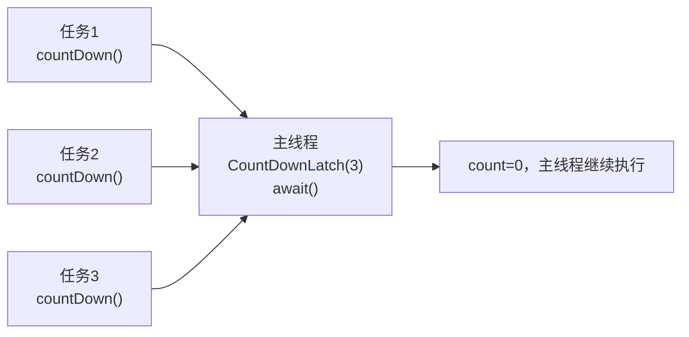
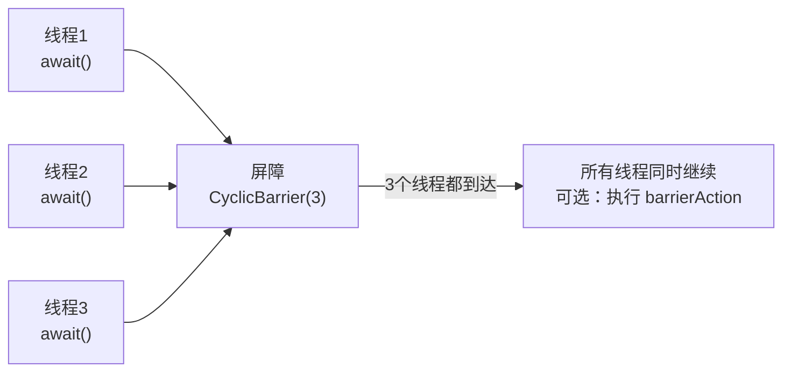
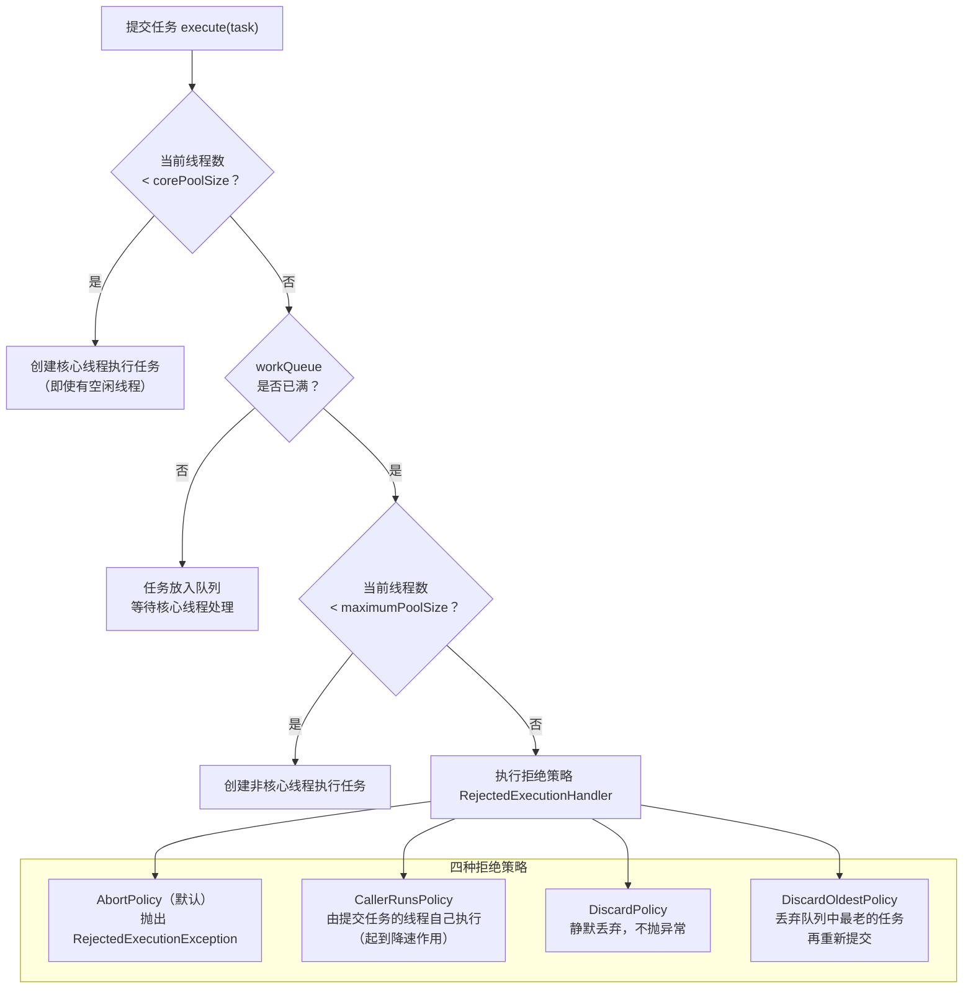
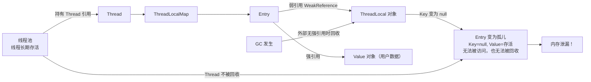

# 并发编程（Concurrent Programming）

---

## 1. 为什么需要并发？从硬件说起

### 1.1 多核 CPU 的现实

现代服务器 CPU 通常有 8~128 个核心。如果程序只用单线程，其余核心全部空闲，资源严重浪费。并发编程的本质目标是：

| 目标 | 手段 |
| :--- | :---- |
| 充分利用多核 CPU | 多线程并行计算 |
| 避免 IO 等待浪费 CPU | 异步 / 非阻塞 IO |
| 提升系统吞吐量 | 线程池处理并发请求 |
| 降低响应延迟 | 任务拆分并行执行 |

### 1.2 并发引入的三大问题

并发不是免费的，它带来了三个核心挑战：

```txt
┌─────────────────────────────────────────────────────────────┐
│                      并发三大问题                             │
│                                                             │
│  ① 原子性（Atomicity）                                       │
│     多步操作被中断，导致结果不一致                             │
│     例：i++ 实际是 读→加→写 三步，中间可能被其他线程插入       │
│                                                             │
│  ② 可见性（Visibility）                                      │
│     一个线程修改了变量，其他线程看不到最新值                   │
│     原因：CPU 缓存导致各核心数据不一致                         │
│                                                             │
│  ③ 有序性（Ordering）                                        │
│     编译器/CPU 对指令重排序优化，导致执行顺序与代码顺序不同     │
│     单线程无影响，多线程可能出错                               │
└─────────────────────────────────────────────────────────────┘
```

---

## 2. 底层基础：CPU 缓存与 Java 内存模型

### 2.1 CPU 缓存架构

理解并发问题，必须先理解 CPU 的缓存结构：

```txt
┌─────────────────────────────────────────────────────────────┐
│                      多核 CPU 架构                           │
│                                                             │
│  ┌──────────────────┐    ┌──────────────────┐              │
│  │     Core 0       │    │     Core 1       │              │
│  │  ┌────────────┐  │    │  ┌────────────┐  │              │
│  │  │  寄存器     │  │    │  │  寄存器     │  │              │
│  │  └─────┬──────┘  │    │  └─────┬──────┘  │              │
│  │  ┌─────▼──────┐  │    │  ┌─────▼──────┐  │              │
│  │  │  L1 Cache  │  │    │  │  L1 Cache  │  │              │
│  │  │  (32KB)    │  │    │  │  (32KB)    │  │              │
│  │  └─────┬──────┘  │    │  └─────┬──────┘  │              │
│  │  ┌─────▼──────┐  │    │  ┌─────▼──────┐  │              │
│  │  │  L2 Cache  │  │    │  │  L2 Cache  │  │              │
│  │  │  (256KB)   │  │    │  │  (256KB)   │  │              │
│  └──┴─────┬──────┴──┘    └──┴─────┬──────┴──┘              │
│           └──────────┬────────────┘                         │
│                ┌─────▼──────┐                               │
│                │  L3 Cache  │  (共享，数MB)                  │
│                └─────┬──────┘                               │
│                ┌─────▼──────┐                               │
│                │  主内存     │  (数GB，访问延迟约100ns)        │
│                └────────────┘                               │
└─────────────────────────────────────────────────────────────┘

访问延迟对比：
  寄存器：< 1ns
  L1 Cache：~1ns
  L2 Cache：~4ns
  L3 Cache：~10ns
  主内存：~100ns  ← 差了100倍！
```

**缓存不一致问题**：Core 0 修改了变量 `x=1`，写入 L1 Cache，但 Core 1 的 L1 Cache 中 `x` 仍是旧值 `0`。这就是**可见性问题**的根源。

**MESI 协议**：CPU 通过 MESI 协议（Modified / Exclusive / Shared / Invalid）维护多核缓存一致性。当一个核心修改了缓存行，会通过总线广播使其他核心的对应缓存行失效，强制它们从主内存重新加载。`volatile` 正是利用了这一机制。

### 2.2 Java 内存模型（JMM）

JMM 是 Java 对底层硬件内存模型的抽象，定义了线程与主内存之间的交互规则：

```txt
┌─────────────────────────────────────────────────────────────┐
│                    Java 内存模型（JMM）                       │
│                                                             │
│  ┌──────────────────┐    ┌──────────────────┐              │
│  │     线程 A        │    │     线程 B        │              │
│  │  ┌────────────┐  │    │  ┌────────────┐  │              │
│  │  │ 工作内存    │  │    │  │ 工作内存    │  │              │
│  │  │ (CPU缓存/  │  │    │  │ (CPU缓存/  │  │              │
│  │  │  寄存器)   │  │    │  │  寄存器)   │  │              │
│  │  └─────┬──────┘  │    │  └─────┬──────┘  │              │
│  └────────┼─────────┘    └────────┼─────────┘              │
│           │  read/write           │  read/write             │
│           └──────────┬────────────┘                         │
│                ┌─────▼──────┐                               │
│                │  主内存     │                               │
│                │  (所有线程  │                               │
│                │   共享变量) │                               │
│                └────────────┘                               │
└─────────────────────────────────────────────────────────────┘
```

**JMM 的核心规则 —— happens-before**：

光有"工作内存 / 主内存"的模型还不够用——它只描述了内存的结构，却没有告诉你：**线程 A 的写操作，线程 B 到底能不能看到？什么时候能看到？** 如果没有一套明确的规则，开发者就无法判断代码是否线程安全，也无法知道加了 `volatile` 或 `synchronized` 之后到底解决了什么问题。happens-before 就是这套规则的答案：它是 JMM 对开发者的承诺，只要满足这些规则，JVM 就保证可见性和有序性，开发者不需要关心底层 CPU 缓存和指令重排的细节。

happens-before 是 JMM 中判断数据是否存在竞争、线程是否安全的核心依据。如果操作 A happens-before 操作 B，则 A 的结果对 B 可见。

| happens-before 规则 | 说明 |
| :----------------- | :--- |
| **程序顺序规则** | 同一线程内，前面的操作 happens-before 后面的操作 |
| **监视器锁规则** | unlock happens-before 后续的 lock |
| **volatile 规则** | volatile 写 happens-before 后续的 volatile 读 |
| **线程启动规则** | `Thread.start()` happens-before 线程内的任何操作 |
| **线程终止规则** | 线程内所有操作 happens-before `Thread.join()` 返回 |
| **传递性** | A hb B，B hb C，则 A hb C |

### 2.3 指令重排序

编译器和 CPU 都会对指令进行重排序以提升性能，但必须保证**单线程语义不变**（as-if-serial）：

```java
// 原始代码
int a = 1;   // ①
int b = 2;   // ②
int c = a + b; // ③

// 重排序后（单线程结果相同，但多线程可能出问题）
int b = 2;   // ②
int a = 1;   // ①
int c = a + b; // ③
```

**经典案例：双重检查锁（DCL）的重排序问题**

```java
// ❌ 错误的 DCL 单例（没有 volatile）
public class Singleton {
    private static Singleton instance;

    public static Singleton getInstance() {
        if (instance == null) {           // ① 第一次检查
            synchronized (Singleton.class) {
                if (instance == null) {   // ② 第二次检查
                    instance = new Singleton(); // ③ 问题在这里！
                }
            }
        }
        return instance;
    }
}

// ③ new Singleton() 实际分三步：
//   a. 分配内存空间
//   b. 初始化对象（执行构造方法）
//   c. 将引用赋值给 instance
//
// CPU 可能将 a→c→b 重排序：先赋值引用，再初始化对象
// 此时另一个线程在 ① 处看到 instance != null，直接返回
// 但对象还没初始化完成！→ 使用了半初始化的对象
```

```java
// ✅ 正确的 DCL 单例（加 volatile 禁止重排序）
public class Singleton {
    private static volatile Singleton instance; // volatile 关键！

    public static Singleton getInstance() {
        if (instance == null) {
            synchronized (Singleton.class) {
                if (instance == null) {
                    instance = new Singleton();
                }
            }
        }
        return instance;
    }
}
```

---

## 3. 线程基础

### 3.1 线程生命周期



**关键状态区别**：

| 状态 | 触发条件 | 能否被中断 | 是否持有锁 |
|------|---------|-----------|-----------|
| `BLOCKED` | 等待 `synchronized` 锁 | ❌ 不能 | ❌ |
| `WAITING` | `wait()` / `join()` / `park()` | ✅ 可以（抛 InterruptedException） | ❌（wait 会释放锁） |
| `TIMED_WAITING` | `sleep(n)` / `wait(n)` | ✅ 可以 | ❌（sleep 不释放锁！） |

### 3.2 线程中断机制

Java 的线程中断是**协作式**的，不是强制停止：

```java
// 中断一个线程（只是设置中断标志位）
thread.interrupt();

// 线程内部检查中断标志
while (!Thread.currentThread().isInterrupted()) {
    // 执行任务
}

// 阻塞方法（sleep/wait/join）会响应中断，抛出 InterruptedException
// 注意：抛出异常后，中断标志会被清除！需要重新设置
try {
    Thread.sleep(1000);
} catch (InterruptedException e) {
    Thread.currentThread().interrupt(); // 重新设置中断标志
    // 处理中断逻辑
}
```

---

## 4. synchronized 深度解析

### 4.1 Monitor 对象结构

`synchronized` 的底层是 **Monitor（监视器锁）**，在 HotSpot 中由 C++ 的 `ObjectMonitor` 实现：

```
ObjectMonitor 结构：
┌─────────────────────────────────────────────────────┐
│                   ObjectMonitor                      │
│                                                     │
│  _owner      → 当前持有锁的线程（Thread*）            │
│  _count      → 重入次数（支持可重入）                  │
│  _recursions → 递归层数                              │
│                                                     │
│  _EntryList  → 等待获取锁的线程队列                   │
│  ┌─────────────────────────────────────────────┐   │
│  │  Thread-2  │  Thread-3  │  Thread-4  │ ...  │   │
│  └─────────────────────────────────────────────┘   │
│                                                     │
│  _WaitSet    → 调用 wait() 后等待唤醒的线程集合       │
│  ┌─────────────────────────────────────────────┐   │
│  │  Thread-5  │  Thread-6  │ ...               │   │
│  └─────────────────────────────────────────────┘   │
└─────────────────────────────────────────────────────┘
```

**Monitor 的工作流程**：



### 4.2 锁升级机制（JDK 6 优化）

JDK 6 之前 `synchronized` 直接使用重量级锁（OS 互斥量），每次加锁都涉及用户态→内核态切换，开销极大。JDK 6 引入了锁升级：

```
无锁 ──→ 偏向锁 ──→ 轻量级锁（CAS 自旋）──→ 重量级锁（OS 互斥量）
         （单线程）   （低竞争）              （高竞争）
```

**锁状态存储在对象头的 Mark Word 中**：

```
Mark Word（64位 JVM，8字节）：

无锁状态：
┌──────────────────────────────────────┬──────┬──┐
│  hashCode (31bit)  │ GC年龄(4bit) │0│  01  │
└──────────────────────────────────────┴──────┴──┘

偏向锁：
┌──────────────────────────────────────┬──────┬──┐
│  线程ID (54bit)  │ epoch(2bit) │GC年龄│  01  │
└──────────────────────────────────────┴──────┴──┘

轻量级锁：
┌──────────────────────────────────────────────┬──┐
│  指向栈中 Lock Record 的指针 (62bit)           │00│
└──────────────────────────────────────────────┴──┘

重量级锁：
┌──────────────────────────────────────────────┬──┐
│  指向 ObjectMonitor 的指针 (62bit)             │10│
└──────────────────────────────────────────────┴──┘
```

**各阶段详解**：

| 锁状态 | 适用场景 | 加锁方式 | 开销 |
|--------|---------|---------|------|
| **偏向锁** | 只有一个线程访问 | 在 Mark Word 写入线程 ID，后续进入只需比较 ID | 极低（无 CAS） |
| **轻量级锁** | 多线程交替访问（无真正竞争） | CAS 将 Mark Word 替换为指向栈帧的指针 | 低（CAS 自旋） |
| **重量级锁** | 多线程真正竞争 | OS 互斥量，线程挂起/唤醒 | 高（内核态切换） |

**锁只能升级，不能降级**（偏向锁可以被撤销，但不会降回无锁后再升偏向锁）。

### 4.3 synchronized 的字节码

```java
// 同步方法
public synchronized void method() { }
// 字节码：方法标志位加 ACC_SYNCHRONIZED，进入时自动获取 this 的 Monitor

// 同步代码块
synchronized (obj) { }
// 字节码：
//   monitorenter  ← 获取 obj 的 Monitor
//   ...
//   monitorexit   ← 释放 Monitor（正常退出）
//   monitorexit   ← 释放 Monitor（异常退出，编译器自动生成）
```

---

## 5. volatile 深度解析

### 5.1 可见性：内存屏障的作用

`volatile` 通过**内存屏障（Memory Barrier）**实现可见性：





**四种内存屏障**：

| 屏障类型 | 作用 | volatile 使用位置 |
|---------|------|-----------------|
| `LoadLoad` | 屏障前的读操作先于屏障后的读操作完成 | volatile 读之后 |
| `StoreStore` | 屏障前的写操作先于屏障后的写操作完成 | volatile 写之前 |
| `LoadStore` | 屏障前的读操作先于屏障后的写操作完成 | volatile 读之后 |
| `StoreLoad` | 屏障前的写操作先于屏障后的读操作完成 | volatile 写之后（最重要，开销最大） |

### 5.2 有序性：禁止指令重排

`volatile` 的 happens-before 规则：**volatile 写 happens-before 后续的 volatile 读**。

```java
// 线程 A
a = 1;              // ① 普通写
volatile_flag = true; // ② volatile 写（StoreStore 屏障保证 ① 在 ② 之前完成）

// 线程 B
if (volatile_flag) {  // ③ volatile 读（LoadLoad 屏障保证 ③ 在 ④ 之前完成）
    use(a);           // ④ 普通读（一定能看到 a=1）
}
// ② happens-before ③，① happens-before ②，所以 ① happens-before ④
// 线程 B 在 ③ 读到 true 后，④ 一定能看到 a=1
```

### 5.3 volatile 不能保证原子性

```java
volatile int count = 0;

// ❌ 多线程下仍然不安全！
// count++ 分三步：① 读取 count → ② 加 1 → ③ 写回
// 两个线程可能同时读到相同的值，各自加 1 后写回，结果只加了 1
void increment() { count++; }

// ✅ 方案1：synchronized
synchronized void increment() { count++; }

// ✅ 方案2：AtomicInteger（CAS，无锁，性能更好）
AtomicInteger count = new AtomicInteger(0);
void increment() { count.incrementAndGet(); }
```

---

## 6. CAS 与原子类

### 6.1 CAS 原理

CAS（Compare And Swap）是一种**无锁**的原子操作，由 CPU 硬件指令（`cmpxchg`）保证原子性：

```
CAS(内存地址V, 期望值A, 新值B)：
  if (V 的当前值 == A) {
      V = B;  // 更新成功
      return true;
  } else {
      return false;  // 更新失败，需要重试
  }
// 以上操作由 CPU 保证原子性（不可被中断）
```

**AtomicInteger.incrementAndGet() 的实现**：

```java
// 底层实现（简化）
public final int incrementAndGet() {
    for (;;) {  // 自旋重试
        int current = get();          // 读取当前值
        int next = current + 1;       // 计算新值
        if (compareAndSet(current, next)) {  // CAS 尝试更新
            return next;  // 成功则返回
        }
        // 失败说明有其他线程修改了值，重新读取再试
    }
}
```

### 6.2 CAS 的三个问题

**① ABA 问题**：

```
线程1 读到 A，准备 CAS(A→B)
线程2 将 A→B→A（改了又改回来）
线程1 CAS 成功（看到的还是 A），但中间状态已经变化过

解决：使用 AtomicStampedReference，带版本号的 CAS
AtomicStampedReference<Integer> ref = new AtomicStampedReference<>(A, 0);
ref.compareAndSet(A, B, 0, 1);  // 同时比较值和版本号
```

**② 自旋开销**：竞争激烈时，大量线程自旋消耗 CPU。JDK 8 引入 `LongAdder` 解决高并发计数场景。

**③ 只能保证单个变量的原子性**：多个变量需要用 `AtomicReference` 封装为一个对象。

### 6.3 LongAdder vs AtomicLong

```
AtomicLong（单个 Cell）：
┌─────────────────────────────────────────────────────┐
│  所有线程竞争同一个 value                              │
│  Thread-1 ──→ CAS(value)                            │
│  Thread-2 ──→ CAS(value)  ← 竞争激烈，大量自旋失败   │
│  Thread-3 ──→ CAS(value)                            │
└─────────────────────────────────────────────────────┘

LongAdder（Cell 数组，分散竞争）：
┌─────────────────────────────────────────────────────┐
│  base + Cell[0] + Cell[1] + Cell[2] + Cell[3]       │
│  Thread-1 ──→ CAS(Cell[0])                          │
│  Thread-2 ──→ CAS(Cell[1])  ← 各打各的，几乎无竞争  │
│  Thread-3 ──→ CAS(Cell[2])                          │
│  Thread-4 ──→ CAS(Cell[3])                          │
│                                                     │
│  sum() = base + Cell[0] + Cell[1] + Cell[2] + ...   │
└─────────────────────────────────────────────────────┘
```

**结论**：高并发计数场景用 `LongAdder`，需要精确读取当前值用 `AtomicLong`。

---

## 7. 锁的进阶：ReentrantLock 与 AQS

### 7.1 ReentrantLock vs synchronized

| 对比项 | synchronized | ReentrantLock |
|--------|-------------|---------------|
| **实现层面** | JVM 内置，字节码指令 | Java 代码，基于 AQS |
| **可中断** | ❌ | ✅ `lockInterruptibly()` |
| **超时获取** | ❌ | ✅ `tryLock(timeout)` |
| **公平锁** | ❌（非公平） | ✅ `new ReentrantLock(true)` |
| **多条件变量** | 只有一个 wait/notify | ✅ 多个 `Condition` |
| **锁状态查询** | ❌ | ✅ `isLocked()` / `getQueueLength()` |
| **性能（JDK 6+）** | 相当 | 相当 |

```java
ReentrantLock lock = new ReentrantLock();
Condition notFull = lock.newCondition();
Condition notEmpty = lock.newCondition();

// 生产者
lock.lock();
try {
    while (queue.isFull()) {
        notFull.await();  // 等待"不满"条件
    }
    queue.add(item);
    notEmpty.signal();  // 通知消费者"不空了"
} finally {
    lock.unlock();  // 必须在 finally 中释放！
}
```

### 7.2 AQS（AbstractQueuedSynchronizer）原理

AQS 是 Java 并发包的核心框架，`ReentrantLock`、`Semaphore`、`CountDownLatch` 等都基于它实现。

**AQS 的核心数据结构**：

```
AQS 内部结构：
┌─────────────────────────────────────────────────────────────┐
│                          AQS                                 │
│                                                             │
│  state（volatile int）：同步状态                             │
│    ReentrantLock：0=未锁，>0=重入次数                        │
│    Semaphore：剩余许可数                                     │
│    CountDownLatch：剩余计数                                  │
│                                                             │
│  CLH 变体等待队列（双向链表）：                               │
│                                                             │
│  head → [Node] ⇄ [Node] ⇄ [Node] ⇄ [Node] ← tail          │
│          (哨兵)   Thread-2   Thread-3   Thread-4             │
│                                                             │
│  每个 Node 包含：                                            │
│    thread：等待的线程                                        │
│    waitStatus：CANCELLED/SIGNAL/CONDITION/PROPAGATE/0       │
│    prev/next：双向链表指针                                   │
└─────────────────────────────────────────────────────────────┘
```

**ReentrantLock 加锁流程**：



### 7.3 公平锁 vs 非公平锁

```
非公平锁（默认）：
  新来的线程先尝试 CAS 抢锁，抢到就直接执行
  抢不到再排队
  优点：吞吐量高（减少线程切换）
  缺点：可能导致队列中的线程长期等待（饥饿）

公平锁：
  新来的线程直接排队，按顺序获取锁
  优点：公平，无饥饿
  缺点：吞吐量低（每次都要唤醒队列头部线程，涉及线程切换）
```

---

## 8. 并发工具类

### 8.1 CountDownLatch

**场景**：等待多个任务全部完成后再继续（一次性，不可重置）。



```java
CountDownLatch latch = new CountDownLatch(3);

// 三个子任务
for (int i = 0; i < 3; i++) {
    executor.submit(() -> {
        try {
            doTask();
        } finally {
            latch.countDown(); // 必须在 finally 中！
        }
    });
}

latch.await(); // 主线程等待，直到 count 减为 0
// 所有任务完成后继续
```

### 8.2 CyclicBarrier

**场景**：多个线程互相等待，到达屏障点后一起继续（可重复使用）。



**CountDownLatch vs CyclicBarrier**：

| 对比项 | CountDownLatch | CyclicBarrier |
|--------|---------------|---------------|
| **等待方向** | 一个线程等多个线程 | 多个线程互相等待 |
| **可重置** | ❌ 一次性 | ✅ 可重复使用 |
| **计数方式** | 减到 0 触发 | 加到 N 触发 |
| **典型场景** | 主线程等子任务完成 | 分阶段并行计算 |

### 8.3 Semaphore

**场景**：控制并发访问数量（限流）。

```java
// 数据库连接池：最多 10 个并发连接
Semaphore semaphore = new Semaphore(10);

public void queryDB() {
    semaphore.acquire(); // 获取许可（没有许可则阻塞）
    try {
        // 执行数据库操作
    } finally {
        semaphore.release(); // 释放许可
    }
}
```

### 8.4 ReadWriteLock

**场景**：读多写少，读读不互斥，读写/写写互斥。

```
读写锁的互斥关系：
  读锁 + 读锁 → ✅ 共存（并发读）
  读锁 + 写锁 → ❌ 互斥
  写锁 + 写锁 → ❌ 互斥
```

```java
ReadWriteLock rwLock = new ReentrantReadWriteLock();
Lock readLock = rwLock.readLock();
Lock writeLock = rwLock.writeLock();

// 读操作（并发安全）
readLock.lock();
try { return cache.get(key); }
finally { readLock.unlock(); }

// 写操作（独占）
writeLock.lock();
try { cache.put(key, value); }
finally { writeLock.unlock(); }
```

**StampedLock（JDK 8+）**：在 ReadWriteLock 基础上增加了**乐观读**，读操作不加锁，只在验证失败时升级为悲观读锁，进一步提升读性能。

---

## 9. 线程池深度解析

### 9.1 线程池工作流程



### 9.2 任务队列类型选择

| 队列类型 | 特点 | 适用场景 | 风险 |
|---------|------|---------|------|
| `LinkedBlockingQueue(无界)` | 无限容量 | `newFixedThreadPool` 使用 | OOM 风险 |
| `ArrayBlockingQueue(有界)` | 固定容量，FIFO | **推荐，生产使用** | 队列满触发拒绝策略 |
| `SynchronousQueue` | 不存储任务，直接交给线程 | `newCachedThreadPool` 使用 | 线程数无上限 |
| `PriorityBlockingQueue` | 按优先级排序 | 有优先级的任务调度 | 低优先级任务可能饥饿 |
| `DelayQueue` | 延迟执行 | 定时任务、缓存过期 | - |

### 9.3 线程池参数配置

```java
// ✅ 生产环境推荐写法
ExecutorService pool = new ThreadPoolExecutor(
    10,                              // corePoolSize：核心线程数
    20,                              // maximumPoolSize：最大线程数
    60, TimeUnit.SECONDS,            // keepAliveTime：非核心线程空闲存活时间
    new ArrayBlockingQueue<>(1000),  // 有界队列，防 OOM
    new ThreadFactoryBuilder()
        .setNameFormat("order-pool-%d")  // 线程命名，方便排查
        .setUncaughtExceptionHandler((t, e) -> log.error("线程异常", e))
        .build(),
    new ThreadPoolExecutor.CallerRunsPolicy()  // 拒绝策略：调用者执行
);
```

**线程数配置经验**：

```
CPU 密集型任务（计算、加密）：
  线程数 = CPU 核数 + 1
  （+1 是为了防止偶发的缺页中断导致 CPU 空闲）

IO 密集型任务（数据库、网络请求）：
  线程数 = CPU 核数 × (1 + 等待时间/计算时间)
  （等待时间远大于计算时间时，可以配置更多线程）
  经验值：CPU 核数 × 2

混合型任务：
  拆分为 CPU 密集和 IO 密集两个线程池分别处理
```

### 9.4 线程池监控

```java
ThreadPoolExecutor executor = (ThreadPoolExecutor) pool;

// 关键监控指标
executor.getPoolSize();          // 当前线程数
executor.getActiveCount();       // 活跃线程数（正在执行任务）
executor.getCorePoolSize();      // 核心线程数
executor.getMaximumPoolSize();   // 最大线程数
executor.getQueue().size();      // 队列中等待的任务数
executor.getCompletedTaskCount(); // 已完成任务总数
executor.getTaskCount();         // 提交的任务总数

// 报警阈值：队列使用率 > 80% 时告警
double queueUsage = (double) executor.getQueue().size() / 1000;
if (queueUsage > 0.8) {
    alert("线程池队列使用率过高: " + queueUsage);
}
```

---

## 10. ThreadLocal 深度解析

### 10.1 ThreadLocal 的存储结构

```
Thread 对象
┌─────────────────────────────────────────────────────────────┐
│  Thread                                                     │
│  threadLocals → ThreadLocalMap                              │
│                 ┌─────────────────────────────────────────┐ │
│                 │  Entry[] table（开放地址法哈希表）         │ │
│                 │                                         │ │
│                 │  [0]: null                              │ │
│                 │  [1]: Entry(key=TL-A弱引用, value=val1) │ │
│                 │  [2]: null                              │ │
│                 │  [3]: Entry(key=TL-B弱引用, value=val2) │ │
│                 │  ...                                    │ │
│                 └─────────────────────────────────────────┘ │
└─────────────────────────────────────────────────────────────┘
```

**关键设计**：ThreadLocalMap 是 Thread 的字段，不是 ThreadLocal 的字段。ThreadLocal 对象本身只是一个 key，数据存在线程自己的 Map 里，天然线程隔离。

### 10.2 内存泄漏原理



**泄漏的三个条件同时满足**：
1. 使用线程池（线程长期存活）
2. ThreadLocal 对象没有外部强引用（被 GC 回收，key 变 null）
3. 没有调用 `remove()`

**为什么 key 用弱引用？**

如果 key 用强引用，当业务代码将 ThreadLocal 变量置为 null 后，ThreadLocalMap 仍持有强引用，ThreadLocal 对象永远无法被 GC 回收。弱引用是一种"尽力而为"的保护，但 value 仍需手动清理。

```java
// ✅ 正确使用 ThreadLocal
private static final ThreadLocal<UserContext> USER_CONTEXT = new ThreadLocal<>();

public void handleRequest(Long userId) {
    USER_CONTEXT.set(new UserContext(userId));
    try {
        // 业务逻辑，任意层级都可以通过 USER_CONTEXT.get() 获取
        doBusinessLogic();
    } finally {
        USER_CONTEXT.remove(); // 必须！防止内存泄漏和数据污染
    }
}
```

---

## 11. 并发集合

### 11.1 ConcurrentHashMap（JDK 8）

JDK 8 的 `ConcurrentHashMap` 放弃了分段锁，改用 **CAS + synchronized（锁单个桶头节点）**：

```
ConcurrentHashMap 结构（JDK 8）：

Node[] table（数组）
┌────┬────┬────┬────┬────┬────┬────┬────┐
│    │    │    │    │    │    │    │    │
└──┬─┴──┬─┴────┴────┴────┴────┴────┴────┘
   │    │
   ▼    ▼
[Node] [Node]
   │      └→ [Node] → [Node]（链表，长度<8）
   └→ [TreeNode]（红黑树，长度≥8）

并发控制：
  - 桶为空时：CAS 插入头节点（无锁）
  - 桶不为空时：synchronized 锁住头节点（只锁一个桶）
  - 扩容时：多线程协作迁移（每个线程负责一段桶）
```

**size() 的实现**：类似 LongAdder，用 `baseCount + CounterCell[]` 分散竞争，最终求和。

### 11.2 并发集合选型

| 场景 | 推荐集合 | 说明 |
|------|---------|------|
| 高并发读写 Map | `ConcurrentHashMap` | 分桶锁，高并发 |
| 读多写少 Map | `CopyOnWriteArrayList` 思路的 Map | 写时复制，读无锁 |
| 并发队列（FIFO） | `LinkedBlockingQueue` | 阻塞队列，生产者-消费者 |
| 高性能无锁队列 | `ConcurrentLinkedQueue` | CAS 实现，非阻塞 |
| 延迟队列 | `DelayQueue` | 定时任务 |
| 优先级队列 | `PriorityBlockingQueue` | 带优先级的阻塞队列 |
| 读多写极少 List | `CopyOnWriteArrayList` | 写时复制，读完全无锁 |

---

## 12. 常见问题与最佳实践

### 12.1 死锁

**死锁的四个必要条件**（破坏任意一个即可预防）：

```
① 互斥：资源同一时刻只能被一个线程持有
② 占有并等待：线程持有资源的同时等待其他资源
③ 不可剥夺：线程持有的资源不能被强制剥夺
④ 循环等待：线程间形成环形等待链
```

```java
// ❌ 死锁示例：加锁顺序相反
// 线程1：lockA → lockB
// 线程2：lockB → lockA

// ✅ 预防方案1：统一加锁顺序
// 所有线程都按 lockA → lockB 顺序加锁

// ✅ 预防方案2：tryLock 超时
if (lockA.tryLock(100, TimeUnit.MILLISECONDS)) {
    try {
        if (lockB.tryLock(100, TimeUnit.MILLISECONDS)) {
            try {
                // 临界区
            } finally { lockB.unlock(); }
        }
    } finally { lockA.unlock(); }
}

// ✅ 预防方案3：一次性申请所有资源（破坏"占有并等待"）
```

**死锁排查**：

```bash
# 查看线程堆栈，找到 BLOCKED 状态的线程
jstack <pid> | grep -A 20 "BLOCKED"

# 或使用 jconsole / arthas 的 thread -b 命令
# arthas：
thread -b  # 自动检测死锁
```

### 12.2 活锁与饥饿

| 问题 | 描述 | 解决方案 |
|------|------|---------|
| **死锁** | 线程永久阻塞，互相等待 | 统一加锁顺序 / tryLock 超时 |
| **活锁** | 线程不阻塞，但一直在重试，无法推进 | 引入随机退避（Exponential Backoff） |
| **饥饿** | 某些线程长期无法获得资源 | 使用公平锁 / 优先级调整 |

### 12.3 happens-before 实战

```java
// 问题：以下代码线程安全吗？
class Holder {
    int n;
    Holder(int n) { this.n = n; }
}

Holder holder;

// 线程A
holder = new Holder(42);

// 线程B
if (holder != null) {
    System.out.println(holder.n); // 可能打印 0！
}

// 原因：holder 的赋值和 Holder 内部字段的初始化可能被重排序
// 线程B 可能看到 holder != null，但 holder.n 还是 0（未初始化）

// ✅ 解决：将 holder 声明为 volatile，或使用 synchronized
volatile Holder holder;
```

---

## 13. 问题

> **问：synchronized 和 volatile 的区别？**

`volatile` 保证**可见性**和**有序性**，但不保证原子性。通过内存屏障实现：写后立即刷主内存，读前从主内存加载，同时禁止指令重排。适合状态标志位、DCL 单例等场景。

`synchronized` 保证**可见性、有序性和原子性**。通过 Monitor 锁实现互斥，同一时刻只有一个线程能进入临界区。JDK 6 后引入锁升级（偏向锁→轻量级锁→重量级锁），性能大幅提升。适合复合操作、需要互斥的临界区。

> **问：CAS 是什么？有什么问题？**

CAS（Compare And Swap）是 CPU 级别的原子指令，比较内存值与期望值，相等则更新为新值，否则失败重试（自旋）。Java 的 `AtomicInteger` 等原子类基于 CAS 实现无锁并发。

三个问题：① **ABA 问题**：值被改了又改回来，CAS 无法感知，用 `AtomicStampedReference` 加版本号解决；② **自旋开销**：竞争激烈时大量 CPU 空转，高并发计数用 `LongAdder` 替代；③ **只能保证单变量原子性**，多变量需封装为对象用 `AtomicReference`。

> **问：线程池的核心参数和执行流程？**

七个核心参数：`corePoolSize`（核心线程数）、`maximumPoolSize`（最大线程数）、`keepAliveTime`（非核心线程存活时间）、`unit`（时间单位）、`workQueue`（任务队列）、`threadFactory`（线程工厂）、`handler`（拒绝策略）。

执行流程：① 线程数 < 核心线程数 → 创建核心线程；② 核心线程满 → 放入队列；③ 队列满 → 创建非核心线程；④ 达到最大线程数 → 执行拒绝策略。

生产环境必须手动创建 `ThreadPoolExecutor`，用有界队列（`ArrayBlockingQueue`），不能用 `Executors` 工厂方法（无界队列/无限线程数，有 OOM 风险）。

> **问：ThreadLocal 的内存泄漏是怎么发生的？**

`ThreadLocalMap` 的 Entry 中，key（ThreadLocal 对象）是弱引用，value 是强引用。当 ThreadLocal 对象没有外部强引用时，GC 会回收 key，Entry 变为 `key=null, value=存活`。在线程池场景下，线程长期存活，这些孤儿 Entry 无法被访问也无法被回收，造成内存泄漏。

解决方案：使用完后在 `finally` 块中调用 `ThreadLocal.remove()`。
