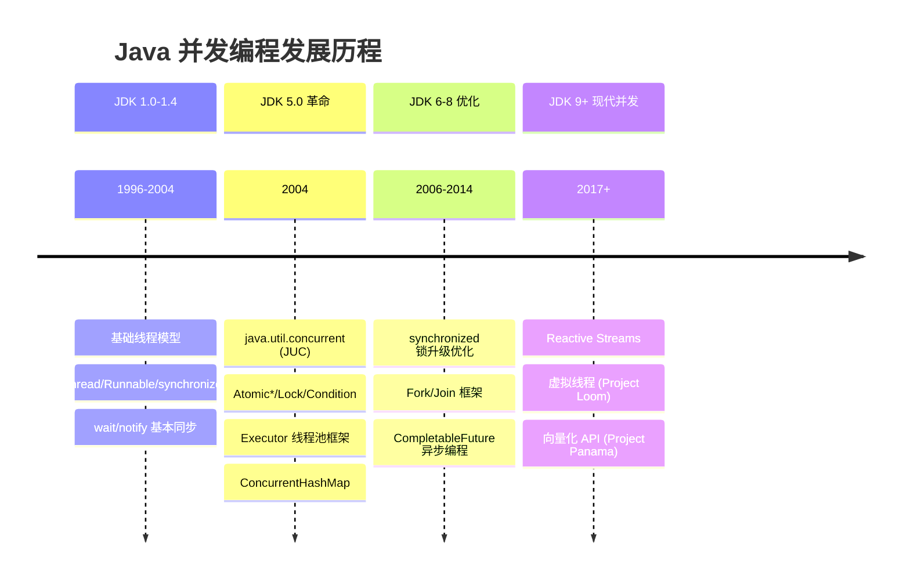
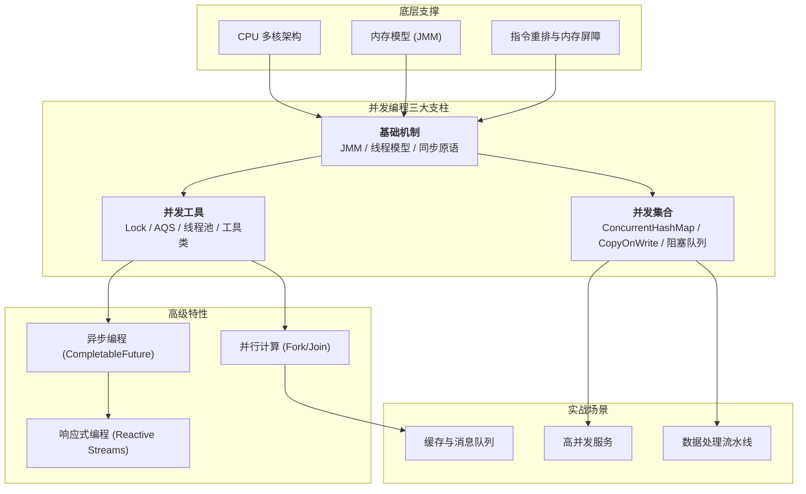
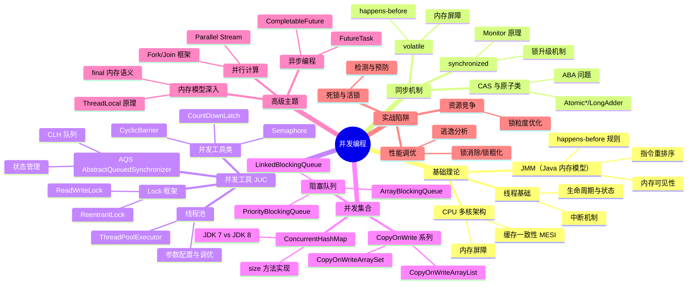

# 并发编程（Concurrent Programming）

> **并发编程**是 Java 开发的核心技能之一，它让程序能够**同时处理多个任务**，充分利用多核 CPU 资源，提升系统吞吐量和响应速度。然而，并发也带来了**线程安全、内存可见性、死锁**等复杂问题，需要深入理解底层机制才能写出正确高效的并发代码。

---

## 1. 发展历程与技术演进

---

## 2. 并发编程全景图

---

## 3. 知识地图

---

## 4. 知识点导航表

| # | 知识点 | 核心一句话 | 详细文档 |
| :-: | :--- | :--- | :--- |
| 1 | **JMM 与内存模型** | Java 对硬件内存模型的抽象，通过 happens-before 保证可见性有序性 | [并发基础：JMM 与线程同步](@java-并发基础JMM与线程同步) |
| 2 | **synchronized** | JDK 内置锁，支持锁升级（无锁→轻量级→重量级），JDK 15+ 默认禁用偏向锁 | [并发基础：JMM 与线程同步](@java-并发基础JMM与线程同步) §4 |
| 3 | **volatile** | 通过内存屏障保证可见性有序性，不保证原子性，解决指令重排问题 | [并发基础：JMM 与线程同步](@java-并发基础JMM与线程同步) §5 |
| 4 | **CAS 与原子类** | 无锁原子操作，基于 CPU 硬件指令，ABA 问题用 AtomicStampedReference 解决 | [并发基础：JMM 与线程同步](@java-并发基础JMM与线程同步) §6 |
| 5 | **Lock 与 AQS** | 比 synchronized 更灵活的锁机制，支持可中断、超时、公平锁等特性 | [并发工具：Lock、AQS 与线程池](@java-并发工具Lock-AQS与线程池) §7-8 |
| 6 | **线程池** | 复用线程资源，避免频繁创建销毁开销，核心参数决定吞吐量与资源消耗 | [并发工具：Lock、AQS 与线程池](@java-并发工具Lock-AQS与线程池) §9 |
| 7 | **并发工具类** | CountDownLatch 一次性等待，CyclicBarrier 可重复屏障，Semaphore 限流 | [并发工具：Lock、AQS 与线程池](@java-并发工具Lock-AQS与线程池) §8 |
| 8 | **ConcurrentHashMap** | 分段锁（JDK7）→ CAS + synchronized（JDK8），高并发下性能优异 | [并发集合与实战陷阱](@java-并发集合与实战陷阱) §11 |
| 9 | **死锁与活锁** | 死锁：四个必要条件；活锁：线程不断重试但无法前进；饥饿：长期得不到资源 | [并发集合与实战陷阱](@java-并发集合与实战陷阱) §12 |
| 10 | **异步编程** | CompletableFuture 提供链式异步编程，支持组合、异常处理等高级特性 | 后续专题（规划中） |

---

## 5. 高频问题索引表

| 问题 | 详见 |
| :--- | :--- |
| synchronized 和 ReentrantLock 有什么区别？ | [并发工具：Lock、AQS 与线程池](@java-并发工具Lock-AQS与线程池) §7.1 |
| volatile 能保证原子性吗？为什么？ | [并发基础：JMM 与线程同步](@java-并发基础JMM与线程同步) §5.3 |
| 什么是 ABA 问题？如何解决？ | [并发基础：JMM 与线程同步](@java-并发基础JMM与线程同步) §6.2 |
| 线程池的核心参数如何配置？ | [并发工具：Lock、AQS 与线程池](@java-并发工具Lock-AQS与线程池) §9.3 |
| ConcurrentHashMap 在 JDK7 和 JDK8 的实现有何不同？ | [并发集合与实战陷阱](@java-并发集合与实战陷阱) §11.1 |
| 什么是死锁？如何检测和避免？ | [并发集合与实战陷阱](@java-并发集合与实战陷阱) §12.1 |
| ThreadLocal 的内存泄漏问题如何解决？ | [并发工具：Lock、AQS 与线程池](@java-并发工具Lock-AQS与线程池) §10.2 |
| 什么是 happens-before 规则？ | [并发基础：JMM 与线程同步](@java-并发基础JMM与线程同步) §2.2 |
| synchronized 的锁升级过程是怎样的？ | [并发基础：JMM 与线程同步](@java-并发基础JMM与线程同步) §4.2 |
| CountDownLatch 和 CyclicBarrier 有什么区别？ | [并发工具：Lock、AQS 与线程池](@java-并发工具Lock-AQS与线程池) §8.1-8.2 |

---

## 6. 学习路径建议

### 🚀 初学者路径（建议顺序）

1. **先掌握基础**：线程生命周期、synchronized、volatile 的基本用法
2. **理解底层机制**：JMM 内存模型、happens-before 规则、锁升级原理
3. **学习 JUC 工具**：Lock、线程池、并发工具类的使用场景
4. **实战练习**：ConcurrentHashMap、死锁检测与避免
5. **深入优化**：性能调优、异步编程、高级并发模式

### 💡 实践建议

- **从 synchronized 开始**：大多数场景下 synchronized 性能足够且更安全
- **谨慎使用 volatile**：只用于状态标志位，不用于计数等需要原子性的场景
- **善用线程池**：避免手动创建线程，使用合适的拒绝策略
- **注意资源清理**：ThreadLocal 使用后及时 remove，线程池及时 shutdown

### ⚠️ 常见陷阱

- **锁粒度不当**：锁太粗影响性能，锁太细可能死锁
- **误用 volatile**：以为能保证原子性，实际只能保证可见性
- **线程池参数配置错误**：核心线程数、队列大小设置不合理导致性能问题
- **死锁忽视**：多个锁的获取顺序不一致可能导致死锁

---

> 📖 **下一步学习**：根据你的当前水平和需求，选择对应的专题深入：
>
> - **刚入门** → 从 [并发基础：JMM 与线程同步](@java-并发基础JMM与线程同步) 开始，打好理论基础
> - **已有基础** → 直接学习 [并发工具：Lock、AQS 与线程池](@java-并发工具Lock-AQS与线程池) 掌握实战工具
> - **面临具体问题** → 查看 [并发集合与实战陷阱](@java-并发集合与实战陷阱) 解决实际工程难题
