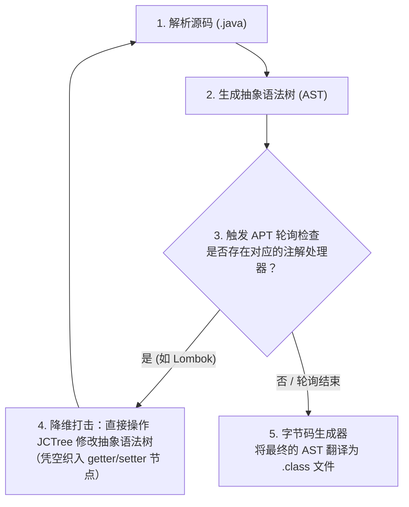

# 注解（Annotation）：字节码属性表里的 `RuntimeVisibleAnnotations` 与 APT 编译期织入注解（Annotation）

---

## 1. 业务痛点与魔幻现实

### 1.1 消失的注解与诡异的空指针（NPE）注解的本质

在实际的微服务项目开发中，很多开发者都遭遇过类似下面这种让人抓狂的“线上悬案”：

团队定义了一个用于权限校验的自定义注解 `@RequiresRole`，并将其挂载到了某个核心业务 Service 的方法上：

```java
@Target(ElementType.METHOD)
@Retention(RetentionPolicy.RUNTIME)
public @interface RequiresRole {
    String value();
}

@Service
public class OrderService {
    @RequiresRole("ADMIN")
    public void cancelOrder(String orderId) {
        // 核心取消订单逻辑...
    }
}
```

随后，架构师编写了一个统一的切面（Aspect）或拦截器，试图通过反射读取该注解来实现自动化权限阻断：

```java
public void checkPermission(Method method) {
    RequiresRole annotation = method.getAnnotation(RequiresRole.class);
    // 💥 线上惨剧：在特定高并发或复杂场景下，这里竟然偶发报出 NullPointerException！
    String role = annotation.value(); 
    if (!"ADMIN".equals(role)) {
        throw new AccessDeniedException();
    }
}
```

通过日志排查，开发人员确认 `cancelOrder` 方法上确确实实写着 `@RequiresRole("ADMIN")`，代码也成功编译部署了。那为什么在运行时通过 `method.getAnnotation()` 拿到的结果竟然是 `null`？注解去哪儿了？

导致这个经典 Bug 的元凶，往往是因为系统引入了第三方框架（如某些旧版本的序列化工具、轻量级 AOP 织入工具或动态热部署插件）。它们在运行时出于某种原因动态修改或重新生成了类的代理，或者在配置注解时，开发者不小心混淆了注解的**生命周期生存边界**。

### 1.2 注解的“尸体”留在了哪里？

要破获上面的悬案，我们必须在脑海中建立起注解的“时空概念”。当我们在编辑器中敲下一个注解时，它其实开始了一段漫长的物理生命周期： `.java` 源码 -> `.class` 字节码 -> JVM 方法区内存。

在这个过程中，注解在不同阶段的形态完全不同：

- 为什么 Lombok 的 `@Data` 注解能凭空在编译期生出大段的 `getter/setter` 字节码，但运行时通过反射却根本找不到 `@Data` 存在的痕迹？
- 为什么 Spring 的 `@Transactional` 却能完好无损地存活在运行时的堆内存中，甚至还能在运行时动态读取属性？

注解在被写下之后，它的“尸体”到底留在了哪里？现在，让我们开启第二层，直接反编译类文件，抓出注解在字节码里的物理遗迹。

---

## 2. 字节码考古——属性表与动态代理

首先必须点透一个颠覆许多人认知的物理真相：**Java 的注解在 Class 二进制文件里没有任何可执行的代码指令。它仅仅是附着在类、方法、方法参数或字段上的一个“附加属性表（Attribute Table）”里的只读字符串元数据**。

### 2.1 隐形的贴纸：RuntimeVisibleAnnotations 属性表

我们反编译一段被 `@RequiresRole("ADMIN")` 修饰的方法，通过 `javap -p -v OrderService.class` 强行查看其底层的二进制属性区：

```volt
public void cancelOrder(java.lang.String);
  descriptor: (Ljava/lang/String;)V
  flags: (0x0001) ACC_PUBLIC
  Code:
    stack=0, locals=2, args_size=2
       0: return
    LineNumberTable:
      line 12: 0

  // 💡 核心考古发现：附着在方法末尾的附加属性表
  RuntimeVisibleAnnotations:
    0: #15(#16=s#17)
      com/example/RequiresRole(
        value="ADMIN"
      )
```

看清了吗？在 `Code:` 属性区的 `0: return` 之外，JVM 为这个方法额外开辟了一块叫 **`RuntimeVisibleAnnotations`** 的只读数据区（这正是字节码规范中规定的十四种核心属性表之一）。

这里面用非常死板的 KV 格式记录着：这里贴着一张叫 `com/example/RequiresRole` 的标签，它的参数 `value` 对应的常量池字符串是 `"ADMIN"`。当 JVM 把这个类加载到方法区（元空间）时，主执行引擎在运行 `cancelOrder` 方法时对这张标签完全视而不见。**注解对方法本身的字节码执行流程不会产生任何一丝一毫的主动干预**。

### 2.2 注解的本质居然是接口？

既然注解本身没有行为，那我们反编译注解本身的编译产物 `RequiresRole.class`，看看注解本身到底是个什么东西：

```volt
public interface com.example.RequiresRole extends java.lang.annotation.Annotation
  minor version: 0
  major version: 65
  flags: (0x2601) ACC_PUBLIC, ACC_INTERFACE, ACC_ABSTRACT, ACC_ANNOTATION
```

这行字节码彻底暴露了注解的底牌：**注解在 Java 世界的物理本质，是一个继承了 `java.lang.annotation.Annotation` 的普通 Java 接口！**

既然是接口，那些所谓的注解属性（如 `String value();`），在字节码层面也不过是一堆普通的**抽象方法（ACC_ABSTRACT）**罢了。

### 2.3 JVM 运行时的伪造术：动态代理（$Proxy）

现在，更加魔幻且矛盾的问题来了：

既然注解在运行时只是方法区里一段冷冰冰的“只读属性表字符串”，且注解本身在底层的本质是个“抽象接口”，那为什么我们在代码中写下下面这段反射代码时，竟然能顺畅地调用方法并拿到返回值？

```java
RequiresRole anno = method.getAnnotation(RequiresRole.class);
String role = anno.value(); // anno 是接口，value() 是抽象方法，怎么就能执行了？
```

抽象接口是绝对不可能被直接 `new` 实例化并调用方法的。JVM 到底在底层玩了什么瞒天过海的把戏？

我们通过在程序启动时加上 JVM 参数 `-Dsun.misc.ProxyGenerator.saveGeneratedFiles=true`（或在新版本 JDK 中使用 `-Djdk.proxy.ProxyGenerator.saveGeneratedFiles=true`），强行将 JVM 在运行时偷偷生成的内部类全部 Dump 到磁盘上。运行之后，你会惊奇地发现你的项目根目录下多出了一个非法的类文件：**`$Proxy0.class`**。我们立刻将其反编译：

```java
// 💥 JVM 在运行时瞒着所有人动态伪造的代理类！
public final class $Proxy0 extends Proxy implements RequiresRole {
    
    private static Method m3; // 对应 RequiresRole.value() 方法

    public $Proxy0(InvocationHandler var1) {
        super(var1);
    }

    // 核心破案点：你调用的 anno.value() 真实执行的是这里！
    public final String value() {
        try {
            // 将调用转发给 AnnotationInvocationHandler 处理器
            return (String)super.h.invoke(this, m3, (Object[])null);
        } catch (RuntimeException | Error var2) {
            throw var2;
        } catch (Throwable var3) {
            throw new UndeclaredThrowableException(var3);
        }
    }
}
```

真相大白！当你在运行时第一次调用 `method.getAnnotation(RequiresRole.class)` 时：

1. JVM 拿着当前方法的程序计数器指针，去方法区的类元数据里翻看 `RuntimeVisibleAnnotations` 属性表。
2. 找到了字符串 `"ADMIN"` 后，JVM 的 `sun.reflect.annotation.AnnotationParser` 核心组件启动。
3. 它在堆内存中动态拼装、并当场向 JVM 注册一个专门实现了你这个注解接口的 JDK 动态代理类（$Proxy）。
4. 这个代理类内部死死持有一个 Map，里面塞满了从属性表里读出来的配置（如 {"value", "ADMIN"}）。
5. 最终返回给你的 anno 引用，本质上就是一个被伪造出来的、封装了 AnnotationInvocationHandler 的动态代理实例。当你调用 anno.value() 时，底层其实是在去查那个运行时 Map 的只读字符串。

通过这一层字节码与运行时考古，我们彻底看清了运行时注解的物理骨架。

然而，我们还没有解决 1.2 节留下的跨时空悬案：为什么有的注解（如 Lombok、Spring 事务）能在这个生命周期的洪流中产生截然不同的超能力？这就需要切入我们的下一个战术维度：三大保留策略（RetentionPolicy）的时空分野与编译期 APT 织入。

---

## 3. 物理生命周期与编译期织入

通过前两层的字节码考古与运行时 Dump 验证，我们揭开了运行时注解（`RUNTIME`）依赖 **`RuntimeVisibleAnnotations` 属性表** 与 **运行时 JDK 动态代理（`$Proxy`）** 的物理骨架。

然而，如果所有的注解都必须在运行时通过反射查表、动态拼装字节码并生成代理类，那么在高并发或大批量使用的场景下，垃圾回收器（GC）和方法区（元空间 MetaSpace）将会承受巨大的物理压力。为了在性能与灵活性之间达成妥协，Java 在物理生命周期的底层设置了严密的分野，并演化出了彻底抹平运行时开销的时空降维打击武器——**APT（Annotation Processing Tool）**。

### 3.1 三大保留策略（RetentionPolicy）的内存物理分野

在语法层，我们通过 `@Retention` 决定注解的寿命。在 JVM 的内存结构中，这三大策略直接决定了元数据在物理空间中的生死存亡：

```txt
 源码文件 (.java) ───────► 字节码文件 (.class) ───────► JVM 方法区内存 (MetaSpace)
 
 ┌─────────────────────────────────────────────────────────────────────────┐
 │ [RetentionPolicy.SOURCE]                                                │
 │   仅存活于源码，在 javac 编译的第一阶段后，字节码中【彻底被抹除，不留痕迹】        │
 ├─────────────────────────────────────────────────────────────────────────┤
 │ [RetentionPolicy.CLASS] (默认)                                           │
 │   编译后写入 .class 文件的属性表（如 RuntimeInvisibleAnnotations），         │
 │   但在类加载器（ClassLoader）将其读入内存时，【直接丢弃，不常驻内存】            │
 ├─────────────────────────────────────────────────────────────────────────┤
 │ [RetentionPolicy.RUNTIME]                                               │
 │   编译后写入 .class 文件的 RuntimeVisibleAnnotations 属性表，               │
 │   类加载时随之【读入元空间（MetaSpace）】，常驻内存，供运行时反射查表             │
 └─────────────────────────────────────────────────────────────────────────┘
```

理解了这层内存分野，我们就能立刻破获 1.2 节留下的双标悬案：

- Lombok 的 `@Data` 声明的是 `SOURCE`。它在变成 `.class` 文件前就被丢进了垃圾桶，因此运行时反射自然“查无此人”。
- Spring 的 `@Transactional` 声明的是 `RUNTIME`。它必须常驻于元空间，等待 Spring 在运行时通过反射去抠出里面的元数据字符串。

### 3.2 APT 的时空降维打击：在编译期拦截抽象语法树（AST）

既然 SOURCE 级别的注解在编译后就消失了，那为什么 Lombok 的 `@Data` 却能凭空变出大段的 `getter/setter` 字节码？

这就是编译期注解处理器（APT，Annotation Processing Tool）大显身手的现场。它的本质是**在编译期间执行的插件**。当 javac 启动编译时，它的核心工作流并非一步到位，而是经历了一场循环：



在第 4 步中，Lombok 的处理器（如 `GetterProcessor`）利用了 JDK 的内部私有 API——**`com.sun.tools.javac.tree.JCTree`**。它像一把外科手术刀一样，绕过了普通的编译器限制，直接在内存中的抽象语法树（AST）上强行嫁接了 `getAge()`、`setAge()` 的抽象节点。

最终，当编译器在第 5 步将这棵被篡改过的语法树翻译成二进制的 `.class` 文件时，里面就已经塞满了合法的 `getter/setter` 字节码。

- 时空压缩红利：APT 机制将原本需要在运行时通过反射、查表、动态动态代理完成的逻辑，**硬生生在编译期“时空压缩”并降维固化成了最纯粹、最普通的字节码指令**。在线上生产环境中，这种注解的运行时成本为绝对的零开销。

### 3.3 运行时反射流派的物理代价：Spring AOP 注解处理链路

与 APT 这种编译期降维流派形成鲜明对比的，是以 Spring 核心框架为代表的**运行时反射/动态代理流派**。

当你在一个方法上加上 `@Transactional` 时，Spring 容器在启动并初始化 Bean 的“三级缓存”阶段（`AbstractAutoProxyCreator`），会触发以下一条极其繁重的运行时链路：

```txt
Spring 运行时注解处理链路（Runtime Reflection Path）:
┌──────────────────────────────────────────────────────────────────────────────┐
│ [第一步：类加载与扫描]                                                        │
│   ClassLoader 将类读入元空间 ──► 触发反射扫描方法的 RuntimeVisibleAnnotations   │
├──────────────────────────────────────────────────────────────────────────────┤
│ [第二步：反射查表]                                                            │
│   通过 Method.getAnnotation() 触发底层 C++ 符号表反查 ──► JVM 动态伪造 $Proxy    │
├──────────────────────────────────────────────────────────────────────────────┤
│ [第三步：CGLIB/JDK 动态代理强行包裹]                                           │
│   发现存在事务注解 ──► 动态在堆内存中生成一个全新的 Proxy 实例包裹原始 Bean     │
├──────────────────────────────────────────────────────────────────────────────┤
│ [第四步：每次调用的高频反射惩罚]                                              │
│   外部调用 ──► 触发反射拦截器链路 ──► 频繁触发 Method.invoke() 反射调用        │
└──────────────────────────────────────────────────────────────────────────────┘
```

由于 `RUNTIME` 注解深度绑定了反射机制，如果在核心高频调用的业务接口中高频触发注解的动态解析，系统就必须频繁付出反射带来的多重硬件代价（我们将在 1.5 篇中深挖反射慢的三大物理根因：安全检查、无法被 JIT 内联、参数装箱）。

认清了注解在“编译期降维固化”与“运行时反射伪造”这两大流派的物理代价后，我们才能在真实的工业级分布式架构中，画出正确的工程设计防线。

## 4. 第四层：工程红线与自定义注解高效设计

理解了注解在字节码属性表里的贴纸本质，以及动态代理伪造、编译期 AST 篡改的物理底牌后，我们在进行系统开发和自定义注解设计时，就必须严守以下三条钢铁工程红线。

### 4.1 🚨 工程红线 1：死守 RetentionPolicy 分野，拒绝元空间（MetaSpace）浪费

在团队内部自定义注解时，绝大多数开发者会为了图省事，不管三七二十一直接复制粘帖一把梭：`@Retention(RetentionPolicy.RUNTIME)`。这是一个极具毁灭性的坏习惯。

- **架构治理策略**：**如果一个注解不需要在运行时被高频动态读取，严禁声明为 `RUNTIME`**。
- **落地范式**：
  - 如果你编写的自定义注解只是为了给内部的构建工具、Maven 打包插件、或者前端 APT 代码生成工具使用（例如自动生成接口的静态配置元数据），**必须降维声明为 `SOURCE`**。
  - 如果你编写的注解是为了在编译后进行代码合规性静态扫描，或者在类加载前进行字节码拦截，**必须降维声明为 `CLASS`**。
  
死守这一红线，能防止成百上千个无用的注解元数据字符串常驻于 JVM 珍贵的元空间（MetaSpace）中，从根源上规避元空间无故膨胀、频繁触发 Full GC 甚至引爆元空间 OOM 的隐患。

### 4.2 🚨 工程红线 2：拔除高频 AOP 切面注解的“运行时反射检索”

在企业级开发中，我们经常使用 Spring AOP 来统一拦截自定义注解（如权限校验 `@RequiresRole`、分布式锁 `@ModifyLock`）。

在编写切面代码时，很多开发者喜欢写出下面这种极低效的“反射检索代码”：

```java
// ❌ 极低效的 AOP 注解检索：每次方法调用都触发一次运行时反射查表
@Around("@annotation(com.example.RequiresRole)")
public Object intercept(ProceedingJoinPoint joinPoint) throws Throwable {
    MethodSignature signature = (MethodSignature) joinPoint.getSignature();
    Method method = signature.getMethod();
    
    // 💥 物理痛点：每一次接口高频调用，都在强迫 JVM 去翻看属性表、调用反射
    RequiresRole annotation = method.getAnnotation(RequiresRole.class); 
    
    if (annotation != null && "ADMIN".equals(annotation.value())) {
        return joinPoint.proceed();
    }
    throw new AccessDeniedException();
}
```

- **高并发架构优化**：我们要利用 AspectJ 的参数绑定机制（Parameter Binding）进行降维设计。

让 Spring 框架在拦截器链路初始化阶段（只有一次），就通过预扫描将对应的注解实例提前准备好，并在运行时以**普通方法参数的形式直接注入到通知（Advice）方法中**。彻底拔除每一次运行时的反射查表动作：

```java
// ✅ 高并发标准范式：利用参数绑定将注解直接注入，零运行时反射查表开销
@Around("@annotation(requiresRole)")
public Object interceptOptimized(ProceedingJoinPoint joinPoint, RequiresRole requiresRole) throws Throwable {
    // 💡 降维红利：无需 method.getAnnotation()，requiresRole 已经作为普通对象指针由 Spring 直接传入
    if ("ADMIN".equals(requiresRole.value())) { 
        return joinPoint.proceed(); // 极其顺畅地顺着底层 Map 引用触达只读字符串
    }
    throw new AccessDeniedException();
}
```

### 4.3 🚨 工程红线 3：严防注解的“常量刚性死锁”

很多初学架构的开发者，在设计缓存组件时，由于对注解的底层贴纸本质缺乏敬畏，常常试图在运行时动态去改变注解的内部属性：

```java
// ❌ 严重的认知破产：试图动态修改注解的刚性属性
@Cacheable(value = getCurrentTenantId()) // 报错：编译期无法通过！
public User findUser(String id) { ... }
```

- 物理铁律：我们在第二层中已经证明，注解方法的返回值在编译期被硬编码为 **常量池（Constant Pool）中的只读符号**。注解内部的属性（如 `@Cacheable(value = "XX")`）本质上是 `public static final` 的编译期常量。它在编译完成后就已经被写死了，是具有极强物理刚性的元数据。
- 架构解耦策略：如果你的业务场景需要面对极强的运行时动态变化性（例如：根据当前登录用户的不同环境动态改变缓存过期时间、动态改变路由目标），绝对不要盲目堆叠静态注解。此时必须优雅地退回到经典的面向对象设计，或者利用 Spring 提供的 Spring EL 表达式（SpEL）（在注解里写下字符串 "#tenantId"），强行逼迫 Spring 在运行时动用专用的表达式解析引擎来动态计算值，以此来击碎注解的常量刚性死锁。

---

## 5. 🗺️ 跨战役知识伏笔

本章我们彻底戳穿了运行时注解的底牌：它并非魔法，而是在运行时依靠 JDK 动态代理 在内存中临时欺骗 JVM 并伪造出的一个 **`$Proxy` 代理实例**。

请把这个运行时偷偷生成的 `$Proxy0` 类的物理形象深深记录下来。因为在后续的 《反射性能底层原理与 MethodHandle》 以及战役三的 《并发基础：JMM 与线程同步》 中，我们将会看到，正是这些由注解衍生出来的、数量庞大的运行时动态代理类，在面对 JVM 极其高傲的 **JIT（即时编译器）** 的 **方法内联（Method Inlining）** 与 **逃逸分析（Escape Analysis）** 优化时，是如何因为指针类型的不确定性，而沦为阻碍编译器进行硬件级性能优化的最大绊脚石。

到那时，你今天在字节码世界里看清的每一张“属性表贴纸”，都会变成你打破分布式框架性能天花板的终极武器。
