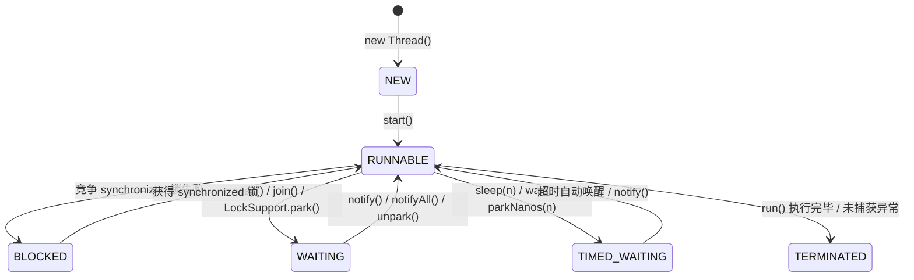
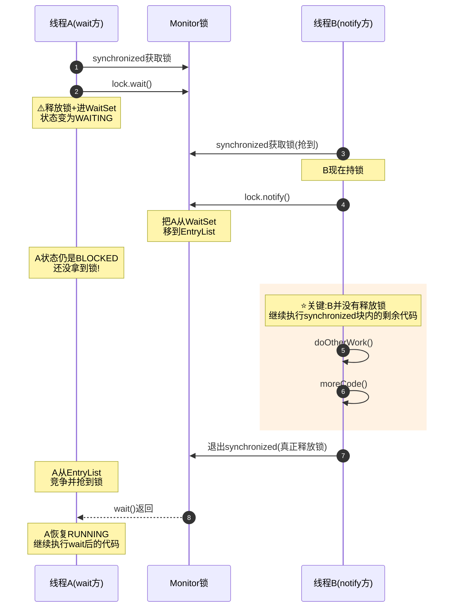
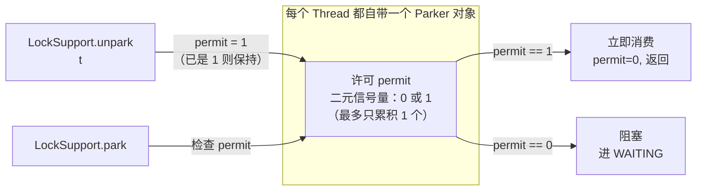
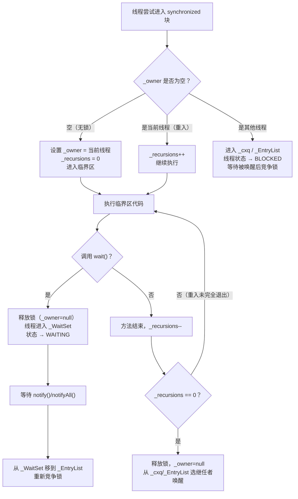
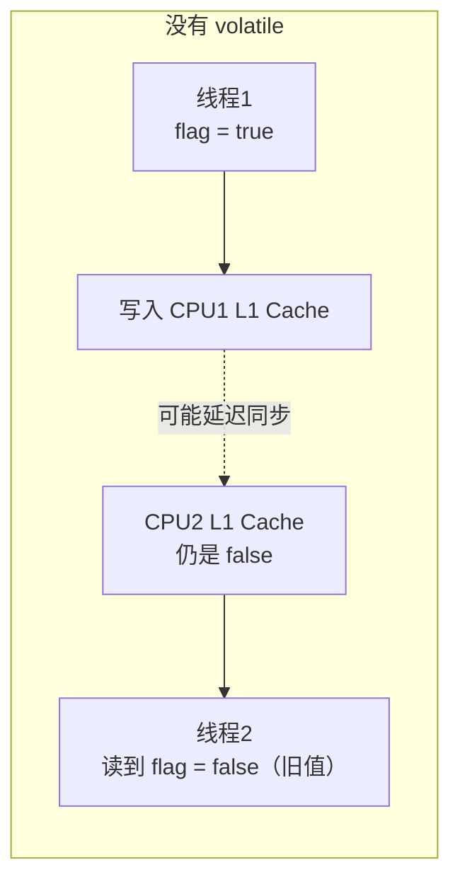
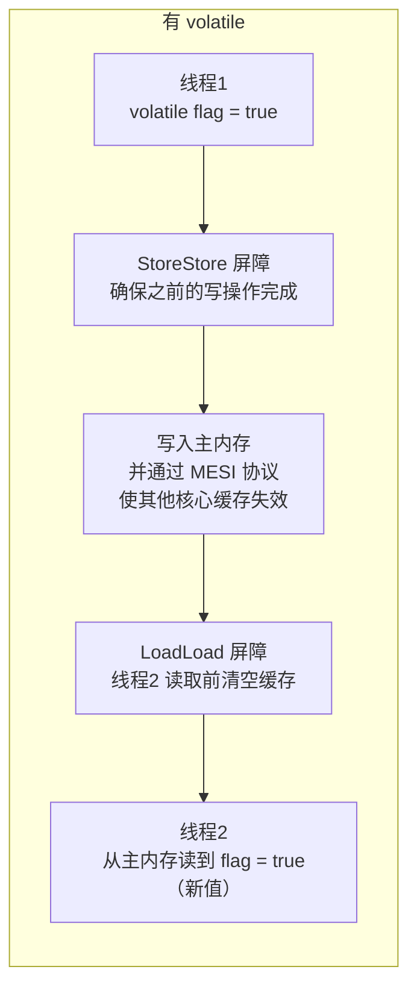

# 并发基础：JMM 与线程同步（Concurrency Fundamentals）

!!! info "**并发基础 一句话口诀**"
    JMM 用 happens-before 保证可见性有序性；synchronized 锁升级：无锁→轻量级锁→重量级锁（JDK 15+ 默认禁用偏向锁）；volatile 靠内存屏障实现可见性有序性，不保证原子性；CAS 无锁但可能 ABA，用 AtomicStampedReference 防重放

> 📖 **边界声明**：本文聚焦"并发编程底层机制与内存模型"，以下主题请见对应专题：
>
> - **并发工具与线程池深度解析** → [并发工具：Lock、AQS 与线程池](@java-并发工具Lock-AQS与线程池)
> - **并发集合与实战陷阱** → [并发集合与实战陷阱](@java-并发集合与实战陷阱)
> - **并发编程整体概览与知识地图** → [并发编程](@java-并发编程)

---

## 1. 为什么需要并发？从硬件说起

### 1.1 多核 CPU 的现实

现代服务器 CPU 通常有 8~128 个核心。如果程序只用单线程，其余核心全部空闲，资源严重浪费。并发编程的本质目标是：

| 目标 | 手段 |
| :--- | :---- |
| 充分利用多核 CPU | 多线程并行计算 |
| 避免 IO 等待浪费 CPU | 异步 / 非阻塞 IO |
| 提升系统吞吐量 | 线程池处理并发请求 |
| 降低响应延迟 | 任务拆分并行执行 |

### 1.2 并发引入的三大问题

并发不是免费的，它带来了三个核心挑战：

```txt
┌─────────────────────────────────────────────────────────────┐
│              Three Core Concurrency Problems                │
│                                                             │
│  1. Atomicity                                               │
│     Multi-step ops interrupted -> inconsistent results      │
│     e.g. i++ = read->add->write, may be interleaved         │
│                                                             │
│  2. Visibility                                              │
│     Thread modifies var, others can't see the new value     │
│     Cause: CPU cache makes each core's data inconsistent    │
│                                                             │
│  3. Ordering                                                │
│     Compiler/CPU reorders instructions for optimization     │
│     No effect on single-thread, may break multi-thread      │
└─────────────────────────────────────────────────────────────┘
```

---

## 2. 底层基础：CPU 缓存与 Java 内存模型

### 2.1 CPU 缓存架构

理解并发问题，必须先理解 CPU 的缓存结构：

```txt
┌─────────────────────────────────────────────────────────────┐
│                   Multi-Core CPU Architecture               │
│                                                             │
│  ┌──────────────────┐    ┌──────────────────┐               │
│  │     Core 0       │    │     Core 1       │               │
│  │  ┌────────────┐  │    │  ┌────────────┐  │               │
│  │  │  Register  │  │    │  │  Register  │  │               │
│  │  └─────┬──────┘  │    │  └─────┬──────┘  │               │
│  │  ┌─────┴──────┐  │    │  ┌─────┴──────┐  │               │
│  │  │  L1 Cache  │  │    │  │  L1 Cache  │  │               │
│  │  │  (32KB)    │  │    │  │  (32KB)    │  │               │
│  │  └─────┬──────┘  │    │  └─────┬──────┘  │               │
│  │  ┌─────┴──────┐  │    │  ┌─────┴──────┐  │               │
│  │  │  L2 Cache  │  │    │  │  L2 Cache  │  │               │
│  │  │  (256KB)   │  │    │  │  (256KB)   │  │               │
│  └──┴─────┬──────┴──┘    └──┴─────┬──────┴──┘               │
│           └──────────┬─────────────┘                        │
│                ┌─────┴──────┐                               │
│                │  L3 Cache  │  (shared, several MB)         │
│                └─────┬──────┘                               │
│                ┌─────┴──────┐                               │
│                │ Main Memory│  (several GB, ~100ns latency) │
│                └────────────┘                               │
└─────────────────────────────────────────────────────────────┘

Access Latency:
  Register : < 1ns
  L1 Cache : ~1ns
  L2 Cache : ~4ns
  L3 Cache : ~10ns
  Main Mem : ~100ns  <-- 100x slower!
```

!!! note "缓存不一致与 MESI 协议"
    **缓存不一致问题**：Core 0 修改了变量 `x=1`，写入 L1 Cache，但 Core 1 的 L1 Cache 中 `x` 仍是旧值 `0`。这就是**可见性问题**的根源。

    **MESI 协议**：现代 CPU 在硬件层本就由 MESI（Modified / Exclusive / Shared / Invalid）等协议维护多核缓存一致性，这一点和 Java 无关。单线程代码无需做任何事，多核 CPU 已经能保证缓存行的一致性。

    **那还为什么需要 `volatile`？** 因为为了性能，CPU 的写操作会先进入 **Store Buffer**，读操作可能直接读 **Invalidate Queue** 之前的旧值——尽管最终通过 MESI 会一致，但**分发有延迟**。Java 并不信赖 CPU 的默认行为，而是通过 `volatile` 在字节码/本地代码层面插入**内存屏障（Memory Barrier / Fence）**，迫使 CPU 立即刷 Store Buffer、清 Invalidate Queue，从而 **间接利用 MESI** 让其他核心看到最新值。严格地说：volatile 是靠内存屏障生效的，MESI 是下层存在的能力，两者是"屏障触发 → MESI 完成一致性更新"的合作关系。

### 2.2 Java 内存模型（JMM）

JMM 是 Java 对底层硬件内存模型的抽象，定义了线程与主内存之间的交互规则：

```txt
┌─────────────────────────────────────────────────────────────┐
│                Java Memory Model (JMM)                      │
│                                                             │
│  ┌──────────────────┐    ┌──────────────────┐               │
│  │    Thread A      │    │    Thread B      │               │
│  │  ┌────────────┐  │    │  ┌────────────┐  │               │
│  │  │ Working    │  │    │  │ Working    │  │               │
│  │  │ Memory     │  │    │  │ Memory     │  │               │
│  │  │ (CPU cache/│  │    │  │ (CPU cache/│  │               │
│  │  │  register) │  │    │  │  register) │  │               │
│  │  └────────────┘  │    │  └────────────┘  │               │
│  └──────────────────┘    └──────────────────┘               │
│           │  read/write           │  read/write             │
│           └───────────────────────┘                         |
|                       │                                     │
│                ┌──────v─────┐                               │
│                │ Main Memory│                               │
│                │ (shared    │                               │
│                │  variables)│                               │
│                └────────────┘                               │
└─────────────────────────────────────────────────────────────┘
```

!!! tip "JMM 的核心规则 —— happens-before"
    光有"工作内存 / 主内存"的模型还不够用——它只描述了内存的结构，却没有告诉你：**线程 A 的写操作，线程 B 到底能不能看到？什么时候能看到？** 如果没有一套明确的规则，开发者就无法判断代码是否线程安全。happens-before 就是这套规则的答案：它是 JMM 对开发者的承诺，只要满足这些规则，JVM 就保证可见性和有序性，开发者不需要关心底层 CPU 缓存和指令重排的细节。

    如果操作 A happens-before 操作 B，则 A 的结果对 B 可见。

| happens-before 规则 | 说明 |
| :----------------- | :--- |
| **程序顺序规则** | 同一线程内，前面的操作 happens-before 后面的操作 |
| **监视器锁规则** | unlock happens-before 后续对同一把锁的 lock |
| **volatile 规则** | 对 volatile 变量的写 happens-before 后续对该变量的读 |
| **线程启动规则** | `Thread.start()` happens-before 该线程内的任何操作 |
| **线程终止规则** | 线程内所有操作 happens-before `Thread.join()` 成功返回 |
| **线程中断规则** | `Thread.interrupt()` happens-before 被中断线程检测到中断（`isInterrupted()` 返回 true 或抛出 `InterruptedException`） |
| **对象终结规则** | 对象的构造方法结束 happens-before 它的 `finalize()` 方法开始 |
| **传递性** | A hb B，B hb C，则 A hb C |

> 📌 JLS §17.4.5 定义了**共 8 条** happens-before 规则，上表全部列出。实际工程中用得最多的是程序顺序、监视器锁、volatile 和传递性四条。

### 2.3 指令重排序

编译器和 CPU 都会对指令进行重排序以提升性能，但必须保证**单线程语义不变**（as-if-serial）：

```java
// 原始代码
int a = 1;   // ①
int b = 2;   // ②
int c = a + b; // ③

// 重排序后（单线程结果相同，但多线程可能出问题）
int b = 2;   // ②
int a = 1;   // ①
int c = a + b; // ③
```

!!! warning "经典案例：双重检查锁（DCL）的重排序问题"

    ```java
    // ❌ 错误的 DCL 单例（没有 volatile）
    public class Singleton {
        private static Singleton instance;

        public static Singleton getInstance() {
            if (instance == null) {           // ① 第一次检查
                synchronized (Singleton.class) {
                    if (instance == null) {   // ② 第二次检查
                        instance = new Singleton(); // ③ 问题在这里！
                    }
                }
            }
            return instance;
        }
    }
    // ③ new Singleton() 实际分三步：
    //   a. 分配内存空间
    //   b. 初始化对象（执行构造方法）
    //   c. 将引用赋值给 instance
    //
    // CPU 可能将 a→c→b 重排序：先赋值引用，再初始化对象
    // 此时另一个线程在 ① 处看到 instance != null，直接返回
    // 但对象还没初始化完成！→ 使用了半初始化的对象

    // ✅ 正确的 DCL 单例（加 volatile 禁止重排序）
    public class Singleton {
        private static volatile Singleton instance; // volatile 关键！

        public static Singleton getInstance() {
            if (instance == null) {
                synchronized (Singleton.class) {
                    if (instance == null) {
                        instance = new Singleton();
                    }
                }
            }
            return instance;
        }
    }
    ```

---

## 3. 线程基础

### 3.1 线程生命周期



**关键状态区别**：

| 状态 | 触发条件 | 中断响应方式 | 是否持有锁 |
| :--- | :--- | :--- | :--- |
| `BLOCKED` | 等待 `synchronized` 锁 | `interrupt()` 只设置中断标志位，不会提前退出 BLOCKED——线程必须等拿到锁后才能检查标志（对比：`ReentrantLock.lockInterruptibly()` 支持可中断等待锁） | ❌ |
| `WAITING` | `wait()` / `join()` / `park()` | ✅ 立即响应，抛 `InterruptedException`（`wait`/`join`）或 `park()` 返回 | ❌（wait 会释放锁） |
| `TIMED_WAITING` | `sleep(n)` / `wait(n)` / `parkNanos(n)` | ✅ 立即响应，抛 `InterruptedException`（sleep/wait）或 parkNanos 返回 | `sleep` 不释放锁，`wait` 释放锁 |



`park/unpark` 的精髓在于它的 "许可（permit）信号量" 语义——和 `wait/notify` 完全不同的模型



三条核心公理：

1. 许可不累积：unpark 调用多次，permit 也最多是 1
2. unpark 可先发制人：即使 unpark 先于 park 调用，permit 会被保存，后续 park 直接返回
3. 精确唤醒：unpark(Thread t) 指定到某个具体线程，不走任何公共队列

详细时序图：覆盖 6 中典型场景

```mermaid
sequenceDiagram
    autonumber
    participant Caller as 调用方<br/>（其他线程）
    participant T as 目标线程 T
    participant Permit as T 的 permit<br/>（0/1）
    participant OS as 操作系统<br/>内核态

    rect rgba(220, 240, 255, 0.4)
        Note over Caller,OS: 场景 ①：最基本流程 —— park 先,unpark 后
        Note over Permit: permit = 0 (初始)
        T->>Permit: LockSupport.park() 检查 permit
        Permit-->>T: permit == 0
        T->>OS: 陷入内核,调用 pthread_cond_wait<br/>线程状态 RUNNABLE → WAITING
        Note over T: 🛌 阻塞中...
        Caller->>Permit: LockSupport.unpark(t) 设置 permit=1
        Caller->>OS: pthread_cond_signal 唤醒 T
        OS-->>T: 内核唤醒
        T->>Permit: 消费许可 permit=1 → 0
        Note over T: 🏃 WAITING → RUNNABLE<br/>park() 返回
    end

    rect rgba(220, 255, 220, 0.4)
        Note over Caller,OS: 场景 ②：unpark 先发制人 —— park 根本不阻塞
        Note over Permit: permit = 0
        Caller->>Permit: LockSupport.unpark(t) 设置 permit=1
        Note over T: T 此时还在干别的事
        Note over Permit: permit = 1 (保存着)
        T->>Permit: LockSupport.park() 检查 permit
        Permit-->>T: permit == 1
        T->>Permit: 直接消费 permit=1 → 0
        Note over T: ✅ 根本没进内核,立即返回<br/>零系统调用开销!
    end

    rect rgba(255, 240, 200, 0.4)
        Note over Caller,OS: 场景 ③：多次 unpark 只累积到 1(关键!)
        Note over Permit: permit = 0
        Caller->>Permit: unpark(t) permit=0 → 1
        Caller->>Permit: unpark(t) permit=1 → 1 (不变!)
        Caller->>Permit: unpark(t) permit=1 → 1 (还是不变!)
        Note over Permit: ⚠️ permit 最大值就是 1<br/>这就是"二元信号量"语义
        T->>Permit: park() 消费
        Permit-->>T: permit == 1 → 0
        Note over T: park() 返回一次
        T->>Permit: 再次 park() 检查
        Permit-->>T: permit == 0
        T->>OS: ❌ 前面那 2 次 unpark 丢了!<br/>线程还是会阻塞
        Note over T: 🛌 阻塞...
    end

    rect rgba(255, 220, 220, 0.4)
        Note over Caller,OS: 场景 ④：虚假唤醒 —— park 可能无故返回
        Note over Permit: permit = 0
        T->>Permit: park() 检查
        Permit-->>T: permit == 0
        T->>OS: 陷入内核阻塞
        Note over OS: ⚡ 未知原因(信号/底层实现)<br/>内核直接把 T 唤醒
        OS-->>T: 莫名其妙醒了
        T->>Permit: 检查 permit
        Permit-->>T: permit == 0 (没人 unpark 过!)
        Note over T: ⚠️ park() 竟然也返回了!<br/>这就是 spurious wakeup<br/>必须在 while 循环里检查业务条件
    end

    rect rgba(255, 200, 255, 0.4)
        Note over Caller,OS: 场景 ⑤：中断响应 —— park 可被 interrupt 唤醒
        Note over Permit: permit = 0,中断标志 = false
        T->>Permit: park() 检查
        Permit-->>T: permit == 0
        T->>OS: 陷入内核阻塞
        Note over T: 🛌 阻塞中...
        Caller->>T: t.interrupt() 设置中断标志=true
        Caller->>OS: 内核唤醒 T
        OS-->>T: 唤醒
        T->>Permit: 检查
        Note over T: ⚠️ park() 返回<br/>但不抛异常(与 wait 不同!)<br/>需手动 Thread.interrupted() 检查
    end

    rect rgba(200, 220, 255, 0.4)
        Note over Caller,OS: 场景 ⑥：带超时的 parkNanos
        Note over Permit: permit = 0
        T->>Permit: parkNanos(1_000_000_000) 1 秒
        Permit-->>T: permit == 0
        T->>OS: pthread_cond_timedwait(1s)
        Note over T: 🛌 阻塞,等待 unpark 或超时
        alt unpark 先到
            Caller->>Permit: unpark(t)
            Caller->>OS: 唤醒
            OS-->>T: 提前返回
            Note over T: ✅ park 正常返回
        else 1 秒超时
            OS-->>T: 内核超时返回
            Note over T: ⏰ park 超时返回<br/>permit 仍为 0
        end
    end
```



### 3.2 线程中断机制

Java 的线程中断是**协作式**的，不是强制停止：

```java
// 中断一个线程（只是设置中断标志位）
thread.interrupt();

// 线程内部检查中断标志
while (!Thread.currentThread().isInterrupted()) {
    // 执行任务
}

// 阻塞方法（sleep/wait/join）会响应中断，抛出 InterruptedException
// 注意：抛出异常后，中断标志会被清除！需要重新设置
try {
    Thread.sleep(1000);
} catch (InterruptedException e) {
    Thread.currentThread().interrupt(); // 重新设置中断标志
    // 处理中断逻辑
}
```

!!! warning "中断标志会被清除"
    当阻塞方法（`sleep`/`wait`/`join`）抛出 `InterruptedException` 后，线程的中断标志位会被**自动清除**。如果需要保留中断状态，必须在 `catch` 块中调用 `Thread.currentThread().interrupt()` 重新设置。

---

## 4. synchronized 深度解析

### 4.1 Monitor 对象结构

`synchronized` 的底层是 **Monitor（监视器锁）**，在 HotSpot 中由 C++ 的 `ObjectMonitor` 实现：

```txt
┌──────────────────────────────────────────────────┐
│                  ObjectMonitor                   │
│                                                  │
│  _owner       -> current lock holder (Thread*)   │
│  _recursions  -> reentrant depth                 │
│                                                  │
│  _EntryList   -> threads waiting for lock        │
│  ┌────────────────────────────────────────────┐  │
│  │ Thread-2 │ Thread-3 │ Thread-4 │ ...       │  │
│  └────────────────────────────────────────────┘  │
│                                                  │
│  _WaitSet     -> threads called wait()           │
│  ┌────────────────────────────────────────────┐  │
│  │ Thread-5 │ Thread-6 │ ...                  │  │
│  └────────────────────────────────────────────┘  │
│                                                  │
│  _cxq         -> contention queue (LIFO stack,   │
│                  new contenders push here)       │
└──────────────────────────────────────────────────┘
```

> 📌 **字段命名说明**：HotSpot 源码中 `ObjectMonitor`（`src/hotspot/share/runtime/objectMonitor.hpp`）的真实字段以 `_recursions` 表达重入深度（不是常见传说中的 `_count`）；新竞争线程先进 `_cxq`，退出时再从 `_cxq`/`_EntryList` 选一个继任者唤醒。

**Monitor 的工作流程**：



### 4.2 锁升级机制（JDK 6 优化，JDK 15+ 的重要变动）

JDK 6 之前 `synchronized` 直接使用重量级锁（OS 互斥量），每次加锁都涉及用户态→内核态切换，开销极大。JDK 6 引入了锁升级：

```txt
无锁 ──→ 偏向锁 ──→ 轻量级锁（CAS 自旋）──→ 重量级锁（OS 互斥量）
         （单线程）   （低竞争）              （高竞争）
```

> ⚠️ **JDK 15+ 重要变动**：[JEP 374](https://openjdk.org/jeps/374)（"Deprecate and Disable Biased Locking"）在 **JDK 15 起默认禁用偏向锁**，`UseBiasedLocking` 默认为 `false`，且整个偏向锁设计被标记为弃用，后续版本计划移除。驱动因素主要是：（1）现代应用普遍使用 `java.util.concurrent` 的高性能锁（`ReentrantLock` / `StampedLock`），纯 `synchronized` 的单线程使用场景边际收益有限；（2）偏向锁撑大了 `ObjectMonitor` / Mark Word 代码复杂度，维护成本高。如你的生产环境仍在 JDK 8/11，以下锁升级链路仍然适用；**若已升级到 JDK 15+，实际链路已退化为"无锁 → 轻量级锁 → 重量级锁"三级**。

**锁状态存储在对象头的 Mark Word 中**（64 位 HotSpot，共 64 bit，按 JDK 8~14 的布局）：

```txt
Mark Word (64-bit HotSpot, 8 bytes = 64 bit, JDK 8~14 layout):

┌──────────────────────────────────────────────────────┬─────────┬─────┬───────┐
│                       主字段                          │ unused  │bias │ lock  │
│                                                      │         │ bit │ state │
└──────────────────────────────────────────────────────┴─────────┴─────┴───────┘

No Lock (biased=0, lock=01):
  [ unused:25 | hashCode:31 | unused:1 | GC age:4 | 0 | 01 ]

Biased Lock (biased=1, lock=01):
  [ threadID:54 | epoch:2 |  unused:1 | GC age:4 | 1 | 01 ]

Lightweight Lock (lock=00):
  [ pointer to Lock Record on stack: 62 bit             | 00 ]

Heavyweight Lock (lock=10):
  [ pointer to ObjectMonitor: 62 bit                    | 10 ]

GC Marked (lock=11):
  [ (used only during GC)                               | 11 ]
```

> 📌 **版本差异**：以上为 JDK 8~14 的经典布局。JDK 15+ 默认禁用偏向锁后，`biased_lock` 标志位保留但不再生效；JDK 18 起 HotSpot 正在简化 Mark Word 布局（[JEP 450: Compact Object Headers](https://openjdk.org/jeps/450)），详见 OpenJDK Release Notes。

**各阶段详解**：

| 锁状态 | 适用场景 | 加锁方式 | 开销 |
| :--- | :--- | :--- | :--- |
| **偏向锁** | 只有一个线程访问 | 在 Mark Word 写入线程 ID，后续进入只需比较 ID | 极低（无 CAS） |
| **轻量级锁** | 多线程交替访问（无真正竞争） | CAS 将 Mark Word 替换为指向栈帧的指针 | 低（CAS 自旋） |
| **重量级锁** | 多线程真正竞争 | OS 互斥量，线程挂起/唤醒 | 高（内核态切换） |

!!! note "锁只能升级，不能降级——但可以被 GC 膨胀回收（deflation）"
    **应用线程视角**：锁升级是单向的（无锁 → 偏向锁 → 轻量级锁 → 重量级锁），偏向锁撤销后不会回退为"无锁后再升偏向锁"，重量级锁在应用运行期也不会主动降回轻量级锁。

    ```mermaid
    flowchart LR
        A[无锁] --> B[偏向锁]
        B --> C[轻量级锁]
        C --> D[重量级锁]
        D -.->|应用视角：不能降级| C
    ```

    **HotSpot 内部视角**：重量级锁对应的 `ObjectMonitor` 在长期无人竞争时，HotSpot 的 **monitor deflation**（JEP 384 引入、JDK 18 改为并发执行）会把不活跃的 monitor 回收、把对象头从重量级锁指针**还原成无锁状态**。这是 JVM 内部的资源回收，对应用代码透明，不影响"锁只能升级"的语义。

    ```mermaid
    flowchart TD
        A[对象处于重量级锁状态] --> B{长期无人竞争？}
        B -->|是| C[JVM后台线程检测到]
        B -->|否| D[保持重量级锁]
        C --> E[执行Monitor Deflation]
        E --> F[释放ObjectMonitor资源]
        F --> G[对象头还原为无锁状态]
        G --> H[下次加锁从无锁重新开始]
    ```

### 4.3 synchronized 的字节码

```java
// 同步方法
public synchronized void method() { }
// 字节码：方法标志位加 ACC_SYNCHRONIZED，进入时自动获取 this 的 Monitor

// 同步代码块
synchronized (obj) { }
// 字节码：
//   monitorenter  ← 获取 obj 的 Monitor
//   ...
//   monitorexit   ← 释放 Monitor（正常退出）
//   monitorexit   ← 释放 Monitor（异常退出，编译器自动生成）
```

---

## 5. volatile 深度解析

### 5.1 可见性：内存屏障的作用

`volatile` 通过**内存屏障（Memory Barrier）**实现可见性：





**四种内存屏障**：

| 屏障类型 | 作用 | volatile 使用位置 |
| :----- | :----- | :----- |
| `LoadLoad` | 屏障前的读操作先于屏障后的读操作完成 | volatile 读之后 |
| `StoreStore` | 屏障前的写操作先于屏障后的写操作完成 | volatile 写之前 |
| `LoadStore` | 屏障前的读操作先于屏障后的写操作完成 | volatile 读之后 |
| `StoreLoad` | 屏障前的写操作先于屏障后的读操作完成 | volatile 写之后（最重要，开销最大） |

### 5.2 有序性：禁止指令重排

`volatile` 的 happens-before 规则：**volatile 写 happens-before 后续的 volatile 读**。

```java
// 线程 A
a = 1;              // ① 普通写
volatile_flag = true; // ② volatile 写（StoreStore 屏障保证 ① 在 ② 之前完成）

// 线程 B
if (volatile_flag) {  // ③ volatile 读（LoadLoad 屏障保证 ③ 在 ④ 之前完成）
    use(a);           // ④ 普通读（一定能看到 a=1）
}
// ② happens-before ③，① happens-before ②，所以 ① happens-before ④
// 线程 B 在 ③ 读到 true 后，④ 一定能看到 a=1
```

### 5.3 volatile 不能保证原子性

!!! warning "volatile 不保证原子性"
    `volatile` 只保证可见性和有序性，**不保证原子性**。`count++` 是读→加→写三步操作，即使加了 `volatile`，多线程下仍然不安全。需要使用 `synchronized` 或 `AtomicInteger` 来保证原子性。

```java
volatile int count = 0;

// ❌ 多线程下仍然不安全！
// count++ 分三步：① 读取 count → ② 加 1 → ③ 写回
// 两个线程可能同时读到相同的值，各自加 1 后写回，结果只加了 1
void increment() { count++; }

// ✅ 方案1：synchronized
synchronized void increment() { count++; }

// ✅ 方案2：AtomicInteger（CAS，无锁，性能更好）
AtomicInteger count = new AtomicInteger(0);
void increment() { count.incrementAndGet(); }
```

---

## 6. CAS 与原子类

### 6.1 CAS 原理

CAS（Compare And Swap）是一种**无锁**的原子操作，由 CPU 硬件指令（`cmpxchg`）保证原子性：

```txt
CAS(内存地址V, 期望值A, 新值B)：
  if (V 的当前值 == A) {
      V = B;  // 更新成功
      return true;
  } else {
      return false;  // 更新失败，需要重试
  }
// 以上操作由 CPU 保证原子性（不可被中断）
```

**AtomicInteger.incrementAndGet() 的实现**：

```java
// 底层实现（简化）
public final int incrementAndGet() {
    for (;;) {  // 自旋重试
        int current = get();          // 读取当前值
        int next = current + 1;       // 计算新值
        if (compareAndSet(current, next)) {  // CAS 尝试更新
            return next;  // 成功则返回
        }
        // 失败说明有其他线程修改了值，重新读取再试
    }
}
```

### 6.2 CAS 的三个问题

**① ABA 问题**：

```txt
线程1 读到 A，准备 CAS(A→B)
线程2 将 A→B→A（改了又改回来）
线程1 CAS 成功（看到的还是 A），但中间状态已经变化过

解决：使用 AtomicStampedReference，带版本号的 CAS
AtomicStampedReference<Integer> ref = new AtomicStampedReference<>(A, 0);
ref.compareAndSet(A, B, 0, 1);  // 同时比较值和版本号
```

**② 自旋开销**：竞争激烈时，大量线程自旋消耗 CPU。JDK 8 引入 `LongAdder` 解决高并发计数场景。

**③ 只能保证单个变量的原子性**：多个变量需要用 `AtomicReference` 封装为一个对象。

### 6.3 LongAdder vs AtomicLong

```txt
AtomicLong (single Cell):
┌──────────────────────────────────────────────────────┐
|  All threads compete for the same value              |
|  Thread-1 --> CAS(value)                             |
|  Thread-2 --> CAS(value)  <- heavy contention, spins |
|  Thread-3 --> CAS(value)                             |
└──────────────────────────────────────────────────────┘

LongAdder (Cell array, distributed contention):
┌─────────────────────────────────────────────────────┐
│  base + Cell[0] + Cell[1] + Cell[2] + Cell[3]       │
│  Thread-1 --> CAS(Cell[0])                          │
│  Thread-2 --> CAS(Cell[1])  <- almost no contention │
│  Thread-3 --> CAS(Cell[2])                          │
│  Thread-4 --> CAS(Cell[3])                          │
│                                                     │
│  sum() = base + Cell[0] + Cell[1] + Cell[2] + ...   │
└─────────────────────────────────────────────────────┘
```

!!! tip "如何选择？"
    高并发计数场景用 `LongAdder`（分散竞争，吞吐量高），需要精确读取当前值用 `AtomicLong`（`sum()` 非原子操作，不保证实时精确）。

---

## 7. 常见问题 Q&A

> **问：JMM 的 happens-before 规则是强制的吗？**

是的。JMM 保证：只要满足 happens-before 规则，JVM 就必须保证可见性和有序性。这是 JMM 对开发者的**承诺**，开发者不需要关心底层 CPU 缓存和指令重排的细节。

> **问：JDK 15+ 禁用偏向锁后，synchronized 性能会下降吗？**

在单线程场景下会有轻微下降（少了偏向锁的快速路径），但在多线程场景下影响不大。现代应用普遍使用 `java.util.concurrent` 包的高性能锁，`synchronized` 的单线程使用场景边际收益有限。

> **问：volatile 能替代 synchronized 吗？**

**不能**。`volatile` 只保证可见性和有序性，不保证原子性。`synchronized` 保证原子性、可见性和有序性。`volatile` 适合做状态标志位，`synchronized` 适合保护临界区代码。

> **问：CAS 为什么比 synchronized 性能好？**

CAS 是**无锁**操作，不涉及线程挂起/唤醒（内核态切换），在低竞争场景下性能更好。但在高竞争场景下，CAS 的自旋开销可能比 `synchronized` 的线程挂起更大。

> **问：LongAdder 的 sum() 方法为什么不保证实时精确？**

`LongAdder` 将计数分散到多个 Cell 中，`sum()` 需要遍历所有 Cell 累加。在并发场景下，可能有线程正在修改某个 Cell，导致 `sum()` 返回的值不是某个精确时间点的快照。如果需要精确计数，应该用 `AtomicLong`。
