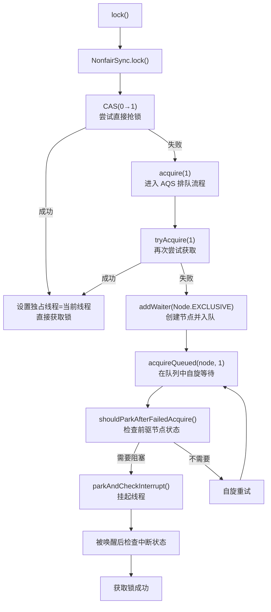
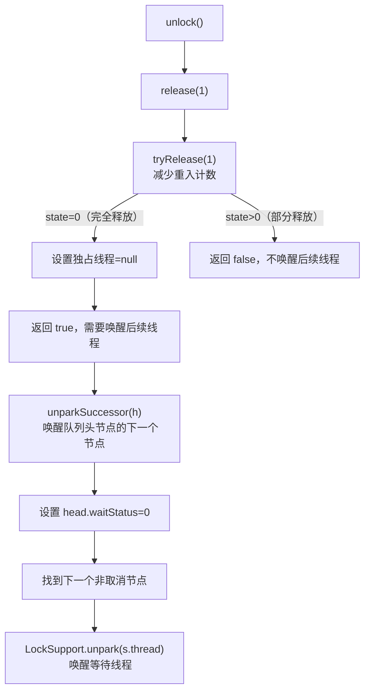
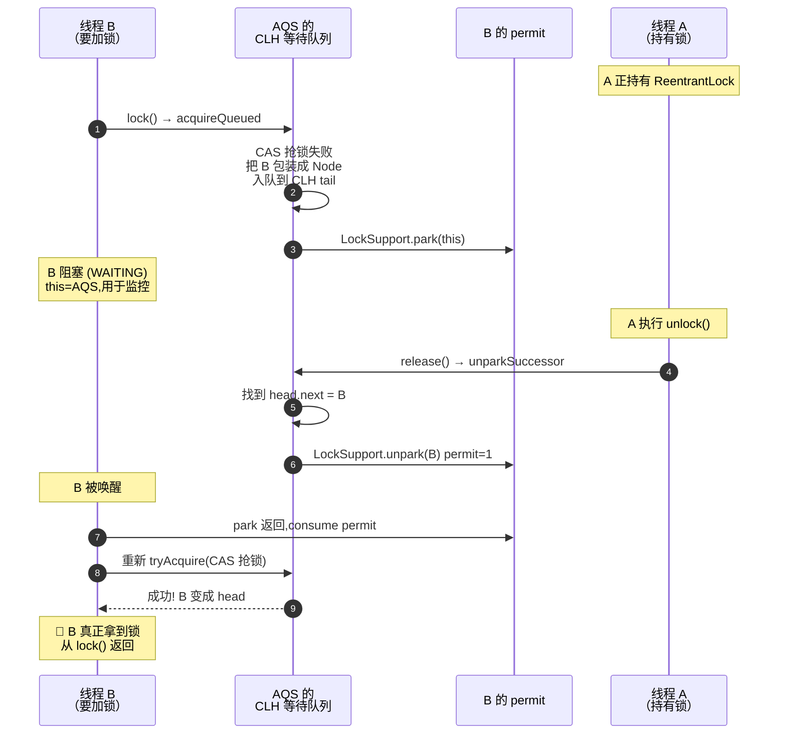
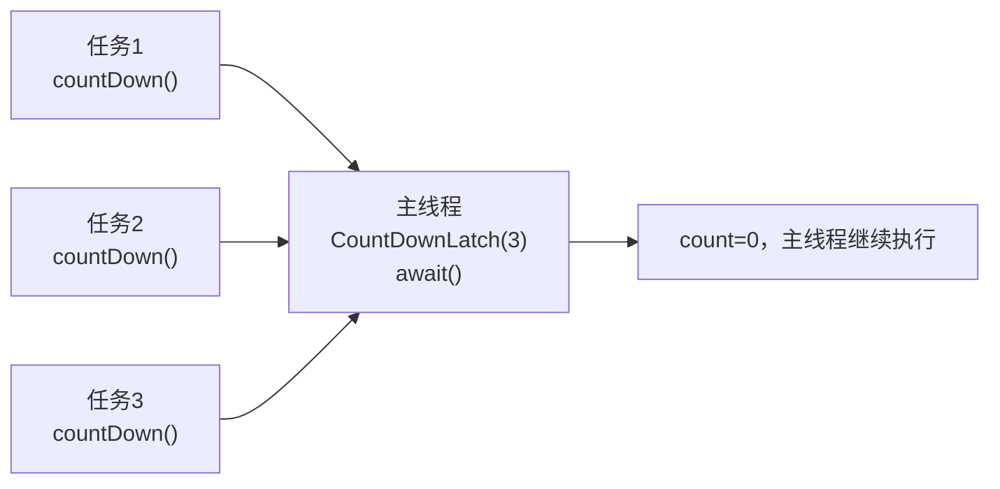
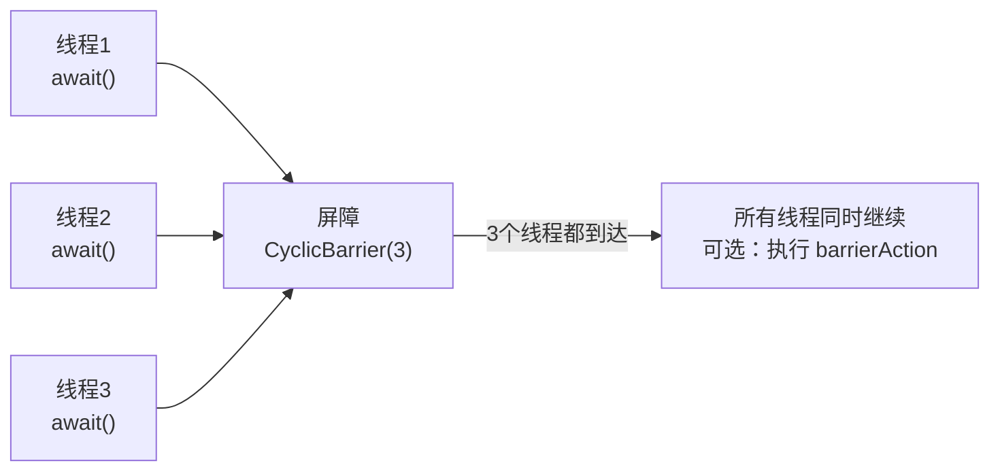
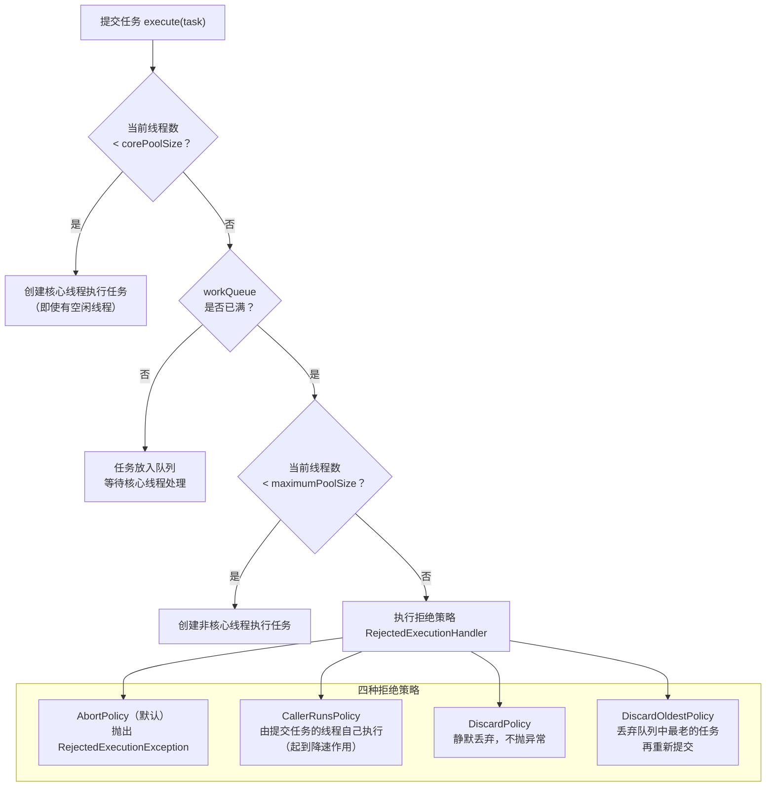
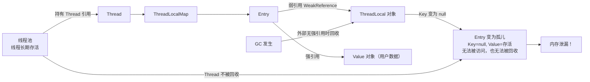

# 并发工具：Lock、AQS 与线程池（Concurrency Tools）

!!! info "**并发工具 一句话口诀**"
    ReentrantLock 基于 AQS 实现公平/非公平锁，AQS 用 CLH 队列管理线程排队；CountDownLatch 主等子，CyclicBarrier 子等子；线程池核心参数 7 个，CPU 密集=核数+1，IO 密集=核数×2；ThreadLocal 用完必须 remove() 防泄漏

> 📖 **边界声明**：本文聚焦"并发工具底层机制与线程池深度解析"，以下主题请见对应专题：
>
> - **JMM 内存模型与线程同步基础** → [并发基础：JMM 与线程同步](@java-并发基础JMM与线程同步)
> - **并发集合与实战陷阱** → [并发集合与实战陷阱](@java-并发集合与实战陷阱)
> - **并发编程整体概览与知识地图** → [并发编程](@java-并发编程)

---

## 1. ReentrantLock 源码深度解析

### 1.1 公平锁 vs 非公平锁

非公平锁（默认）：

- 新来的线程先尝试 CAS 抢锁，抢到就直接执行
- 抢不到再排队
- 优点：吞吐量高（减少线程切换）
- 缺点：可能导致队列中的线程长期等待（饥饿）

公平锁：

- 新来的线程直接排队，按顺序获取锁
- 优点：公平，无饥饿
- 缺点：吞吐量低（每次都要唤醒队列头部线程，涉及线程切换）

### 1.2 Lock 接口与 synchronized 对比

| 特性 | synchronized | Lock |
| :----- | :----- | :----- |
| **实现机制** | JVM 内置 Monitor 锁 | AQS（AbstractQueuedSynchronizer） |
| **锁获取** | 自动获取释放 | 手动 lock()/unlock() |
| **可中断** | ❌ 不可中断等待 | ✅ lockInterruptibly() |
| **超时获取** | ❌ 无限等待 | ✅ tryLock(timeout) |
| **公平性** | ❌ 仅支持非公平（无可选项） | ✅ 构造时可选公平/非公平，默认非公平 |
| **条件变量** | wait()/notify() | Condition.await()/signal() |
| **锁状态** | 无法查询 | isLocked(), getQueueLength() |

### 1.3 ReentrantLock 核心结构

```txt
ReentrantLock Structure:
┌───────────────────────────────────────────────────────────────┐
│  ReentrantLock                                                │
│  ┌─────────────────────────────────────────────────────────┐  │
│  │  Sync extends AbstractQueuedSynchronizer                │  │
│  │  ├─ NonfairSync（非公平锁，默认）                          │  │
│  │  └─ FairSync（公平锁）                                    │  │
│  │                                                         │  │
│  │  AQS 核心字段：                                           │  │
│  │  state: int（锁状态，0=未锁定，>0=重入次数）                 │  │
│  │  head: Node（CLH 队列头节点）                              │ │
│  │  tail: Node（CLH 队列尾节点）                              │ │
│  │                                                          │ │
│  │  Node（队列节点）结构：                                     │ │
│  │  ┌─────────────────────────────────────────────────────┐ │ │
│  │  │  prev: Node（前驱节点）                               │ │ │
│  │  │  next: Node（后继节点）                               │ │ │
│  │  │  thread: Thread（等待线程）                           │ │ │
│  │  │  waitStatus: int（等待状态）                          │ │ │
│  │  │    0=初始状态，CANCELLED=1, SIGNAL=-1,                │ │ │
│  │  │    CONDITION=-2, PROPAGATE=-3                       │ │ │
│  │  └─────────────────────────────────────────────────────┘ │ │
│  └──────────────────────────────────────────────────────────┘ │
└───────────────────────────────────────────────────────────────┘
```

### 1.4 非公平锁获取流程（lock()）



```java
// 非公平锁核心源码
final void lock() {
    if (compareAndSetState(0, 1))  // ① 先尝试 CAS 抢锁
        setExclusiveOwnerThread(Thread.currentThread());
    else
        acquire(1);                // ② 抢不到再排队
}

protected final boolean tryAcquire(int acquires) {
    final Thread current = Thread.currentThread();
    int c = getState();
    if (c == 0) {                   // 锁空闲
        if (compareAndSetState(0, acquires)) {  // ③ 再次尝试 CAS
            setExclusiveOwnerThread(current);
            return true;
        }
    } else if (current == getExclusiveOwnerThread()) {  // ④ 重入
        int nextc = c + acquires;
        if (nextc < 0) throw new Error("Maximum lock count exceeded");
        setState(nextc);
        return true;
    }
    return false;
}
```

!!! tip "非公平锁的"插队"机制"
    非公平锁在 `lock()` 时**先尝试 CAS 抢锁**，不管队列中是否有等待线程。这种"插队"行为在高并发下能减少线程切换，提升吞吐量，但可能导致队列中的线程长期等待（饥饿）。

### 1.5 公平锁获取流程

公平锁与非公平锁的唯一区别在于 `tryAcquire()` 方法：

```java
protected final boolean tryAcquire(int acquires) {
    final Thread current = Thread.currentThread();
    int c = getState();
    if (c == 0) {
        if (!hasQueuedPredecessors() &&  // ① 关键：检查队列中是否有等待线程
            compareAndSetState(0, acquires)) {
            setExclusiveOwnerThread(current);
            return true;
        }
    } else if (current == getExclusiveOwnerThread()) {
        // 重入逻辑相同
    }
    return false;
}

// 检查队列中是否有等待线程
public final boolean hasQueuedPredecessors() {
    Node t = tail; Node h = head; Node s;
    return h != t &&
        ((s = h.next) == null || s.thread != Thread.currentThread());
}
```

!!! note "公平锁的代价"
    公平锁每次获取锁都要检查队列，增加了开销。在竞争激烈时，吞吐量通常低于非公平锁。生产环境**默认使用非公平锁**，除非有明确的公平性需求。

### 1.6 锁释放流程（unlock()）



```java
// 锁释放核心源码
protected final boolean tryRelease(int releases) {
    int c = getState() - releases;
    if (Thread.currentThread() != getExclusiveOwnerThread())
        throw new IllegalMonitorStateException();
    boolean free = false;
    if (c == 0) {                   // 完全释放
        free = true;
        setExclusiveOwnerThread(null);
    }
    setState(c);
    return free;
}

private void unparkSuccessor(Node node) {
    int ws = node.waitStatus;
    if (ws < 0) compareAndSetWaitStatus(node, ws, 0);
    
    Node s = node.next;
    if (s == null || s.waitStatus > 0) {  // 跳过取消的节点
        s = null;
        for (Node t = tail; t != null && t != node; t = t.prev)
            if (t.waitStatus <= 0) s = t;
    }
    if (s != null)
        LockSupport.unpark(s.thread);     // 唤醒等待线程
}
```

---

## 2. AQS（AbstractQueuedSynchronizer）核心机制

### 2.1 AQS 的设计哲学

AQS 是 Java 并发包的基石，采用**模板方法模式**：

- **固定部分**：AQS 负责线程排队、阻塞/唤醒等通用逻辑
- **可变部分**：子类实现 `tryAcquire()`/`tryRelease()` 等钩子方法，定义具体的同步语义

```txt
AQS 核心思想：
  "管理一个 volatile int state（同步状态）+ 一个 FIFO 线程等待队列"

子类只需实现：
  - 如何获取锁（tryAcquire）
  - 如何释放锁（tryRelease）
  - state 的语义（可以是计数、标志位等）

AQS 自动处理：
  - 线程排队（CLH 队列）
  - 阻塞/唤醒（LockSupport.park/unpark）
  - 可中断/超时获取
```

### 2.2 CLH 队列锁的变体

AQS 使用 CLH（Craig, Landin, Hagersten）锁的变体：

```txt
CLH 队列（双向链表）：
  ┌─────────┐    ┌─────────┐    ┌─────────┐    ┌─────────┐
  │  head   │ ←─ │ Node-A  │ ←─ │ Node-B  │ ←─ │ Node-C  │ ← tail
  │（哨兵）  │    │ thread=A│    │ thread=B│    │ thread=C│
  │ thread  │    │ waitStatus│  │ waitStatus│  │ waitStatus│
  │  =null  │    │         │    │         │    │         │
  └─────────┘    └─────────┘    └─────────┘    └─────────┘

每个节点通过 prev 指向前驱，通过前驱节点的 waitStatus 判断是否需要唤醒。
```



!!! note "head 是哨兵节点，不指向持锁线程"
    AQS 采用的是 **CLH 的变体**，其 `head` 节点是一个 **dummy 哨兵节点**（`thread == null`），它并不存储当前持锁线程的信息——**当前持锁线程由 AQS.state + `exclusiveOwnerThread` 记录，与 CLH 队列无关**。真正的等待线程从 `head.next` 开始排队；`unparkSuccessor()` 唤醒的也是 `head.next` 而非 head 本身。这个哨兵设计简化了防止空队列和删除的边界检查。

!!! note "AQS 队列的"自旋检测"优化"
    线程入队后不会立即阻塞，而是先自旋检查几次，如果前驱节点刚好释放锁，可以立即获取，避免不必要的线程切换。这种"乐观自旋"在高竞争下能显著提升性能。

### 2.3 基于 AQS 的同步器家族

| 同步器 | state 语义 | 实现方式 |
| :----- | :----- | :----- |
| `ReentrantLock` | 0=未锁定，>0=重入次数 | 独占模式 |
| `Semaphore` | 剩余许可数 | 共享模式 |
| `CountDownLatch` | 剩余计数 | 共享模式 |
| `ReentrantReadWriteLock` | 高 16 位=读锁计数，低 16 位=写锁计数 | 读写分离 |
| `CyclicBarrier` | 内部使用 ReentrantLock + Condition | 组合实现 |

!!! note "📖 术语家族：`AQS*`（AbstractQueuedSynchronizer 与同步器）"
    **字面义**：Abstract Queued Synchronizer = 抽象的 / 带队列的 / 同步器——顾名思义：一个用 FIFO 队列来排队线程的同步原语框架。
    **在本框架中的含义**：JUC 包的基石，高层锁（`ReentrantLock` / `Semaphore` / `CountDownLatch` 等）均基于 AQS 实现——子类只需实现 `tryAcquire` / `tryRelease` 的语义，AQS 负责线程排队与阻塞/唤醒。
    **同家族成员**：

    | 成员 | 作用 | 源码位置 |
    | :-- | :-- | :-- |
    | `AbstractQueuedSynchronizer` | 独占 + 共享模式的同步原语框架（int `state`） | `java.util.concurrent.locks.AbstractQueuedSynchronizer` |
    | `AbstractQueuedLongSynchronizer` | 与 AQS 结构相同，`state` 为 long，用于需要 64 位状态的场景 | `java.util.concurrent.locks.AbstractQueuedLongSynchronizer` |
    | `AbstractOwnableSynchronizer` | AQS 的父类，只提供 `exclusiveOwnerThread` 字段，记录"当前独占线程是谁" | `java.util.concurrent.locks.AbstractOwnableSynchronizer` |

    **命名规律**：`Abstract*Synchronizer` = 抽象类框架，子类通常命名为同步器内部的 `Sync`（如 `ReentrantLock.Sync` / `Semaphore.Sync`）。

---

## 3. 并发工具类原理

### 3.1 CountDownLatch

**场景**：等待多个任务全部完成后再继续（一次性，不可重置）。



```java
CountDownLatch latch = new CountDownLatch(3);

// 三个子任务
for (int i = 0; i < 3; i++) {
    executor.submit(() -> {
        try {
            doTask();
        } finally {
            latch.countDown(); // 必须在 finally 中！
        }
    });
}

latch.await(); // 主线程等待，直到 count 减为 0
// 所有任务完成后继续
```

**实现原理**：

```java
// CountDownLatch 基于 AQS 共享模式实现
public class CountDownLatch {
    private static final class Sync extends AbstractQueuedSynchronizer {
        Sync(int count) { setState(count); }
        
        protected int tryAcquireShared(int acquires) {
            return getState() == 0 ? 1 : -1;  // state=0 时获取成功
        }
        
        protected boolean tryReleaseShared(int releases) {
            for (;;) {
                int c = getState();
                if (c == 0) return false;
                int nextc = c - 1;
                if (compareAndSetState(c, nextc))
                    return nextc == 0;  // 减到 0 时唤醒所有等待线程
            }
        }
    }
}
```

### 3.2 CyclicBarrier

**场景**：多个线程互相等待，到达屏障点后一起继续（可重复使用）。



**CountDownLatch vs CyclicBarrier**：

| 对比项 | CountDownLatch | CyclicBarrier |
| :----- | :----- | :----- |
| **等待方向** | 一个线程等多个线程 | 多个线程互相等待 |
| **可重置** | ❌ 一次性 | ✅ 可重复使用 |
| **计数方式** | 减到 0 触发 | 加到 N 触发 |
| **典型场景** | 主线程等子任务完成 | 分阶段并行计算 |

### 3.3 Semaphore

**场景**：控制并发访问数量（限流）。

```java
// 数据库连接池：最多 10 个并发连接
Semaphore semaphore = new Semaphore(10);

public void queryDB() {
    semaphore.acquire(); // 获取许可（没有许可则阻塞）
    try {
        // 执行数据库操作
    } finally {
        semaphore.release(); // 释放许可
    }
}
```

**实现原理**：基于 AQS 共享模式，`state` 表示剩余许可数。

### 3.4 ReadWriteLock

**场景**：读多写少，读读不互斥，读写/写写互斥。

```txt
读写锁的互斥关系：
  读锁 + 读锁 → ✅ 共存（并发读）
  读锁 + 写锁 → ❌ 互斥
  写锁 + 写锁 → ❌ 互斥
```

```java
ReadWriteLock rwLock = new ReentrantReadWriteLock();
Lock readLock = rwLock.readLock();
Lock writeLock = rwLock.writeLock();

// 读操作（并发安全）
readLock.lock();
try { return cache.get(key); }
finally { readLock.unlock(); }

// 写操作（独占）
writeLock.lock();
try { cache.put(key, value); }
finally { writeLock.unlock(); }
```

**StampedLock（JDK 8+）**：在 ReadWriteLock 基础上增加了**乐观读**，读操作不加锁，只在验证失败时升级为悲观读锁，进一步提升读性能。

---

## 4. 线程池深度解析

### 4.1 线程池工作流程



### 4.2 任务队列类型选择

| 队列类型 | 特点 | 适用场景 | 风险 |
| :----- | :----- | :----- | :----- |
| `LinkedBlockingQueue(无界)` | 无限容量（实际上默认容量为 `Integer.MAX_VALUE`） | `newFixedThreadPool` 使用 | OOM 风险 |
| `ArrayBlockingQueue(有界)` | 构造时必填固定容量，FIFO | 推荐用于产线的有界队列选型（也可选 `LinkedBlockingQueue(N)` 有界版本） | 队列满触发拒绝策略 |
| `SynchronousQueue` | 不存储任务，直接交给线程 | `newCachedThreadPool` 使用 | 线程数无上限 |
| `PriorityBlockingQueue` | 按优先级排序 | 有优先级的任务调度 | 低优先级任务可能饥饿 |
| `DelayQueue` | 延迟执行 | 定时任务、缓存过期 | - |

### 4.3 线程池参数配置

```java
// ✅ 生产环境推荐写法
ExecutorService pool = new ThreadPoolExecutor(
    10,                              // corePoolSize：核心线程数
    20,                              // maximumPoolSize：最大线程数
    60, TimeUnit.SECONDS,            // keepAliveTime：非核心线程空闲存活时间
    new ArrayBlockingQueue<>(1000),  // 有界队列，防 OOM
    new ThreadFactoryBuilder()
        .setNameFormat("order-pool-%d")  // 线程命名，方便排查
        .setUncaughtExceptionHandler((t, e) -> log.error("线程异常", e))
        .build(),
    new ThreadPoolExecutor.CallerRunsPolicy()  // 拒绝策略：调用者执行
);
```

!!! tip "线程数配置经验"
    - **CPU 密集型任务**（计算、加密）：线程数 = CPU 核数 + 1（+1 防止偶发缺页中断导致 CPU 空闲）
    - **IO 密集型任务**（数据库、网络请求）：线程数 = CPU 核数 × (1 + 等待时间/计算时间)，经验值：CPU 核数 × 2
    - **混合型任务**：拆分为 CPU 密集和 IO 密集两个线程池分别处理

!!! note "📖 术语家族：`Executor*` 与 `*Executor`（执行器体系）"
    **字面义**：Executor = 执行者 / 执行机构——将"任务提交"与"任务执行"解耦的抽象。
    **在本框架中的含义**：JUC 对线程池模型的分层抽象，从`最小划约接口` → `生命周期接口` → `默认实现` → `扩展实现`逐层加能力。
    **同家族成员**：

    | 成员 | 作用 | 源码位置 |
    | :-- | :-- | :-- |
    | `Executor` | 最小接口，只有 `execute(Runnable)` | `java.util.concurrent.Executor` |
    | `ExecutorService` | 扩展 `Executor`，增加生命周期（`shutdown`/`awaitTermination`）与 `submit`/`invokeAll` | `java.util.concurrent.ExecutorService` |
    | `ScheduledExecutorService` | 扩展 `ExecutorService`，支持延迟/周期调度（`schedule`/`scheduleAtFixedRate`） | `java.util.concurrent.ScheduledExecutorService` |
    | `ThreadPoolExecutor` | 标准线程池实现，7 参数构造器 | `java.util.concurrent.ThreadPoolExecutor` |
    | `ScheduledThreadPoolExecutor` | `ThreadPoolExecutor` + `DelayedWorkQueue`，实现调度能力 | `java.util.concurrent.ScheduledThreadPoolExecutor` |
    | `ForkJoinPool` | 工作窃取线程池（不继承 `ThreadPoolExecutor`），JDK 7 引入 | `java.util.concurrent.ForkJoinPool` |
    | `Executors`（工厂类） | 静态工厂方法 `newFixedThreadPool` / `newCachedThreadPool` 等（生产不推荐直接使用） | `java.util.concurrent.Executors` |

    **命名规律**：接口用 **名词 + Service** 逐级扩展能力（`Executor` → `ExecutorService` → `ScheduledExecutorService`）；实现类用 **修饰语 + Executor** 标注特征（`ThreadPoolExecutor` / `ScheduledThreadPoolExecutor` / `ForkJoinPool`）。对应的拒绝策略家族统一命名为 `Abort/CallerRuns/Discard/DiscardOldestPolicy`，均实现 `RejectedExecutionHandler` 接口。

### 4.4 线程池监控

```java
ThreadPoolExecutor executor = (ThreadPoolExecutor) pool;

// 关键监控指标
executor.getPoolSize();          // 当前线程数
executor.getActiveCount();       // 活跃线程数（正在执行任务）
executor.getCorePoolSize();      // 核心线程数
executor.getMaximumPoolSize();   // 最大线程数
executor.getQueue().size();      // 队列中等待的任务数
executor.getCompletedTaskCount(); // 已完成任务总数
executor.getTaskCount();         // 提交的任务总数

// 报警阈值：队列使用率 > 80% 时告警
double queueUsage = (double) executor.getQueue().size() / 1000;
if (queueUsage > 0.8) {
    alert("线程池队列使用率过高: " + queueUsage);
}
```

---

## 5. ThreadLocal 深度解析

### 5.1 ThreadLocal 的存储结构

```txt
Thread Object
┌─────────────────────────────────────────────────────────────┐
│  Thread                                                     │
│  threadLocals -> ThreadLocalMap                             │
│                 ┌─────────────────────────────────────────┐ │
│                 │  Entry[] table (open-addressing hashmap)│ │
│                 │                                         │ │
│                 │  [0]: null                              │ │
│                 │  [1]: Entry(key=TL-A WeakRef, val=val1) │ │
│                 │  [2]: null                              │ │
│                 │  [3]: Entry(key=TL-B WeakRef, val=val2) │ │
│                 │  ...                                    │ │
│                 └─────────────────────────────────────────┘ │
└─────────────────────────────────────────────────────────────┘
```

!!! note "关键设计"
    ThreadLocalMap 是 **Thread** 的字段，不是 ThreadLocal 的字段。ThreadLocal 对象本身只是一个 key，数据存在线程自己的 Map 里，天然线程隔离。

### 5.2 内存泄漏原理



!!! warning "泄漏的三个条件（同时满足时发生）"
    1. 使用线程池（线程长期存活）
    2. ThreadLocal 对象没有外部强引用（被 GC 回收，key 变 null）
    3. 没有调用 `remove()`

!!! note "为什么 key 用弱引用？"
    假设 key 用**强引用**，会发生什么？

    ```java
    // 业务代码
    static ThreadLocal<UserContext> TL = new ThreadLocal<>();
    TL.set(new UserContext());
    // ... 使用完毕 ...
    TL = null;  // 业务代码认为"我不再需要这个 ThreadLocal 了"
    ```

    此时内存中的引用链：

    ```txt
    TL = null（业务代码已经放弃了引用）

    但是：
    Thread → ThreadLocalMap → Entry → key（强引用）→ ThreadLocal 对象
                                    → value（强引用）→ UserContext 对象
    ```

    **问题**：虽然业务代码已经将 `TL` 置为 null，但 ThreadLocalMap 中的 Entry 仍然通过**强引用**指向 ThreadLocal 对象。只要线程还活着（线程池场景），这条引用链就不会断，GC **永远无法回收** ThreadLocal 对象和 value 对象。这就是**彻底的内存泄漏**——连 key 带 value 全部泄漏，而且没有任何补救机会。

    ---

    改用**弱引用**后：

    ```txt
    TL = null（业务代码放弃引用）

    Thread → ThreadLocalMap → Entry → key（弱引用）⇢ ThreadLocal 对象
                                    → value（强引用）→ UserContext 对象
    ```

    GC 发现 ThreadLocal 对象只剩弱引用，**可以回收它**，Entry 的 key 变为 null。虽然 value 仍然泄漏，但这是一种**"降级"的泄漏**——ThreadLocalMap 在后续的 `get()`/`set()`/`remove()` 操作中会主动清理 key 为 null 的 Entry（调用 `expungeStaleEntry()`），value 也会被回收。

    **总结**：弱引用不能完全防止泄漏，但它把"key + value 全部泄漏且无法补救"降级为"只有 value 暂时泄漏，且有自动清理机会"。最佳实践仍然是**用完必须调用 `remove()`**。

```java
// ✅ 正确使用 ThreadLocal
private static final ThreadLocal<UserContext> USER_CONTEXT = new ThreadLocal<>();

public void handleRequest(Long userId) {
    USER_CONTEXT.set(new UserContext(userId));
    try {
        // 业务逻辑，任意层级都可以通过 USER_CONTEXT.get() 获取
        doBusinessLogic();
    } finally {
        USER_CONTEXT.remove(); // 必须！防止内存泄漏和数据污染
    }
}
```

---

## 6. 常见问题 Q&A

> **问：ReentrantLock 的公平锁和非公平锁在性能上有多大差异？**

在高竞争场景下，非公平锁的吞吐量通常比公平锁高 20%~50%。因为非公平锁允许"插队"，减少了线程切换开销。但在低竞争场景下差异不大。生产环境**默认使用非公平锁**，除非有明确的公平性需求（如防止饥饿）。

> **问：AQS 的 CLH 队列为什么用双向链表？**

双向链表主要为了**支持取消操作**。当线程调用 `cancelAcquire()` 时，需要从队列中移除节点。双向链表可以快速找到前驱和后继节点进行链接修复。单向链表无法高效删除中间节点。

> **问：CountDownLatch 和 CyclicBarrier 可以互相替代吗？**

**不能**。CountDownLatch 是**主线程等子线程**（一对多），CyclicBarrier 是**子线程互相等**（多对多）。CountDownLatch 不可重置，CyclicBarrier 可重复使用。

> **问：线程池的 CallerRunsPolicy 拒绝策略有什么妙用？**

`CallerRunsPolicy` 让提交任务的线程自己执行任务，这实际上是一种**自适应限流**：当线程池饱和时，提交任务的线程会变慢（因为要自己执行任务），从而自然降低任务提交速度，避免系统雪崩。

> **问：ThreadLocal 在 Web 应用中如何安全使用？**

Web 应用中，必须在**请求处理完成后清理 ThreadLocal**。Spring MVC 中可以用 `@ControllerAdvice` + `@AfterCompletion`，Servlet 中可以用 Filter 的 `finally` 块。关键原则：**请求入口设置，请求出口清理**。
