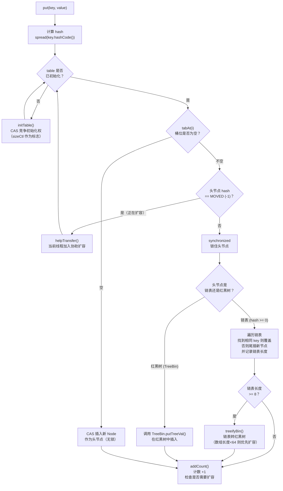
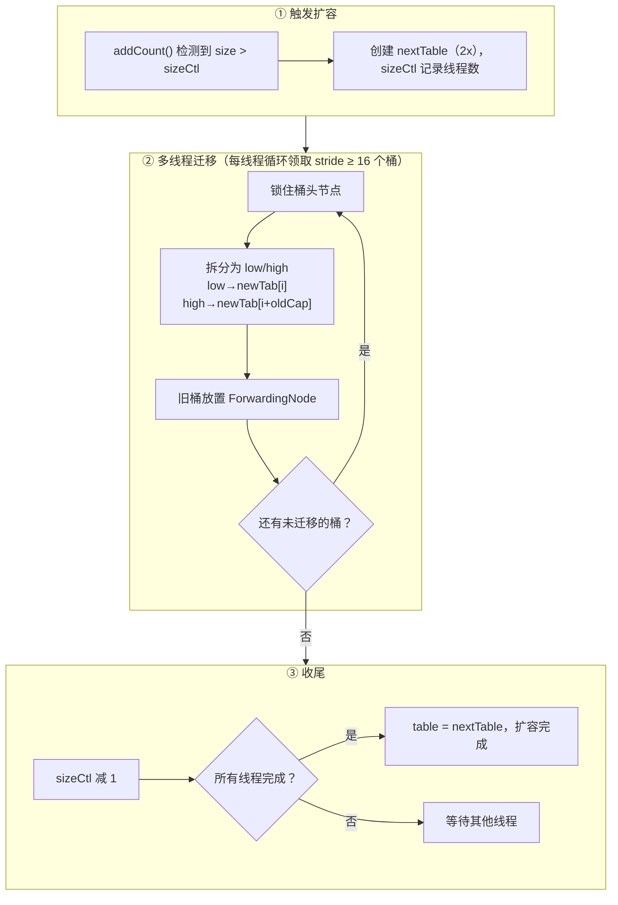

# 并发集合与实战陷阱（Concurrent Collections & Practical Pitfalls）

!!! info "**并发集合与实战陷阱 一句话口诀**"
    ConcurrentHashMap JDK 8 改用 CAS+synchronized 锁单个桶，多线程协作扩容；死锁是互等卡死，活锁是空转无用功，饥饿是长期排队；happens-before 是可见性保证，不是原子性保证

> 📖 **边界声明**：本文聚焦"并发集合的底层机制与并发编程实战陷阱"，以下主题请见对应专题：
>
> - **JMM 内存模型与线程同步基础** → [并发基础：JMM 与线程同步](@java-并发基础JMM与线程同步)
> - **Lock、AQS 与线程池深度解析** → [并发工具：Lock、AQS 与线程池](@java-并发工具Lock-AQS与线程池)
> - **并发编程整体概览与知识地图** → [并发编程](@java-并发编程)

---

## 1. ConcurrentHashMap（JDK 8）深度解析

JDK 8 的 `ConcurrentHashMap` 放弃了分段锁，改用 **CAS + synchronized（锁单个桶头节点）**：

```txt
ConcurrentHashMap Structure (JDK 8):

Node[] table (array, default size 16)
┌────┬────┬────┬────┬────┬────┬────┬────┐
|    |    |    |    |    |    |    |    |
└────┴────┴────┴────┴────┴────┴────┴────┘
  |    |
  v    v
[Node] [Node]
  |      +-> [Node] -> [Node]  (linked list, length < 8)
  +-> [TreeNode]               (red-black tree, length >= 8)

Concurrency Control:
  - Bucket empty   : CAS insert head node (lock-free)
  - Bucket not empty: synchronized on head node (lock one bucket only)
  - Resizing       : multi-thread cooperative migration
```

### 1.1 put 操作源码流程

`put()` 是 ConcurrentHashMap 最核心的方法，理解它就理解了整个并发控制设计：



```java
// put 核心源码（简化版）
final V putVal(K key, V value, boolean onlyIfAbsent) {
    if (key == null || value == null) throw new NullPointerException();
    int hash = spread(key.hashCode()); // 高低16位异或 + 强制正数
    int binCount = 0;

    for (Node<K,V>[] tab = table;;) {
        Node<K,V> f; int n, i, fh;

        if (tab == null || (n = tab.length) == 0)
            tab = initTable();                          // ① 懒初始化

        else if ((f = tabAt(tab, i = (n - 1) & hash)) == null) {
            if (casTabAt(tab, i, null, new Node<>(hash, key, value)))
                break;                                  // ② CAS 插入空桶（无锁）

        } else if ((fh = f.hash) == MOVED)
            tab = helpTransfer(tab, f);                 // ③ 协助扩容

        else {
            synchronized (f) {                          // ④ 锁住桶头节点
                if (tabAt(tab, i) == f) {               // double-check
                    if (fh >= 0) {                      // 链表
                        // 遍历链表，尾插或覆盖
                    } else if (f instanceof TreeBin) {  // 红黑树
                        // 红黑树插入
                    }
                }
            }
            if (binCount >= TREEIFY_THRESHOLD)          // ⑤ 链表转树
                treeifyBin(tab, i);
        }
    }
    addCount(1L, binCount);                             // ⑥ 计数 + 扩容检查
    return null;
}
```

!!! tip "关键设计点"
    - **key 和 value 都不允许为 null**：与 HashMap 不同！因为在并发场景下，`get()` 返回 null 无法区分"key 不存在"还是"value 就是 null"，会产生二义性。
    - **spread() 哈希扰动**：`(h ^ (h >>> 16)) & HASH_BITS`，高低 16 位异或后强制最高位为 0（保证 hash 为正数），因为负数 hash 有特殊含义（`MOVED=-1` 表示正在扩容，`TREEBIN=-2` 表示红黑树）。
    - **synchronized 锁的是头节点对象**，不同桶的操作完全并行，锁粒度极细。

### 1.2 扩容机制：多线程协作迁移（transfer）

ConcurrentHashMap 的扩容是其最精妙的设计之一——**多个线程可以同时参与数据迁移**：

```txt
Multi-Thread Cooperative Resizing:

Old table (size=16):
┌────┬────┬────┬────┬────┬────┬────┬────┬────┬────┬────┬────┬────┬────┬────┬────┐
│ 0  │ 1  │ 2  │ 3  │ 4  │ 5  │ 6  │ 7  │ 8  │ 9  │ 10 │ 11 │ 12 │ 13 │ 14 │ 15 │
└────┴────┴────┴────┴────┴────┴────┴────┴────┴────┴────┴────┴────┴────┴────┴────┘
  ^                   ^                   ^                   ^
  │                   │                   │                   │
  Thread-3            Thread-2            Thread-1            Thread-0
  (stride=4)          (stride=4)          (stride=4)          (stride=4)
  migrating           migrating           migrating           migrating
  [0..3]              [4..7]              [8..11]             [12..15]

New table (size=32):
┌────┬────┬────┬────┬────┬────┬────┬────┬────┬────┬────┬────┬────┬────┬────┬────┬...
│ 0  │ 1  │ 2  │ 3  │ 4  │ 5  │ 6  │ 7  │ 8  │ 9  │ 10 │ 11 │ 12 │ 13 │ 14 │ 15 │...
└────┴────┴────┴────┴────┴────┴────┴────┴────┴────┴────┴────┴────┴────┴────┴────┴...

Migration rule for each node:
  if (hash & oldCap == 0) -> stays at index i        (low  list)
  if (hash & oldCap != 0) -> moves to index i+oldCap (high list)
```

**扩容流程详解**：



!!! note "ForwardingNode 的作用"
    当一个桶迁移完成后，旧桶位置会放置一个 `ForwardingNode`（hash 值为 `MOVED = -1`）。它有两个作用：

    1. **标记已迁移**：其他线程在 `put` 时发现桶头是 ForwardingNode，就知道正在扩容，会调用 `helpTransfer()` 加入协助
    2. **转发读请求**：`get()` 遇到 ForwardingNode 时，会通过它的 `find()` 方法到新数组中查找，保证扩容期间读操作不受影响

!!! warning "扩容期间的并发安全"
    - **读操作**：完全无锁。如果桶未迁移，直接在旧数组读；如果已迁移（ForwardingNode），转发到新数组读
    - **写操作**：如果桶未迁移，正常加锁写入旧数组；如果遇到 ForwardingNode，先帮助扩容，再在新数组写入
    - **迁移过程**：每个桶的迁移都加了 synchronized 锁，保证同一个桶不会被多个线程同时迁移

### 1.3 size() 的实现：分散计数

ConcurrentHashMap 的 `size()` 采用了类似 `LongAdder` 的分散计数策略，避免所有线程竞争同一个计数器：

```txt
Counting Mechanism (similar to LongAdder):

Low contention:
  All threads CAS on baseCount
  baseCount: 42

High contention (CAS on baseCount fails):
  Spread to CounterCell array
  baseCount: 30
  ┌─────────────┬─────────────┬─────────────┬─────────────┐
  │ CounterCell │ CounterCell │ CounterCell │ CounterCell │
  │  value = 3  │  value = 5  │  value = 2  │  value = 2  │
  └─────────────┴─────────────┴─────────────┴─────────────┘

  size() = baseCount + sum(CounterCell[])
         = 30 + 3 + 5 + 2 + 2 = 42
```

```java
// addCount 简化逻辑
private final void addCount(long x, int check) {
    CounterCell[] cs; long b, s;
    // 先尝试 CAS 更新 baseCount
    if ((cs = counterCells) != null ||
        !U.compareAndSetLong(this, BASECOUNT, b = baseCount, s = b + x)) {
        // CAS 失败（竞争激烈），分散到 CounterCell
        CounterCell c; long v;
        int m = cs.length - 1;
        // 用线程探针值（ThreadLocalRandom.getProbe()）选择 Cell
        if ((c = cs[ThreadLocalRandom.getProbe() & m]) == null ||
            !(U.compareAndSetLong(c, CELLVALUE, v = c.value, v + x))) {
            fullAddCount(x, uncontended); // 进一步处理竞争
        }
    }
    // check >= 0 时检查是否需要扩容
    if (check >= 0) { /* 扩容检查逻辑 */ }
}
```

!!! warning "size() 返回的是近似值"
    `size()` 内部调用 `sumCount()` = `baseCount + Σ CounterCell[i].value`。由于没有加全局锁，在并发写入时，返回值可能不是精确的实时值。但对于绝大多数场景（监控、日志、判断是否为空），近似值已经足够。如果需要精确值，需要外部加锁。

### 1.4 get 操作：全程无锁

`get()` 操作**完全不加锁**，这是 ConcurrentHashMap 高性能的关键：

```java
public V get(Object key) {
    Node<K,V>[] tab; Node<K,V> e, p; int n, eh; K ek;
    int h = spread(key.hashCode());
    if ((tab = table) != null && (n = tab.length) > 0 &&
        (e = tabAt(tab, (n - 1) & h)) != null) {       // volatile 读取桶头
        if ((eh = e.hash) == h) {
            if ((ek = e.key) == key || (ek != null && key.equals(ek)))
                return e.val;                            // 头节点命中
        }
        else if (eh < 0)                                 // 特殊节点
            return (p = e.find(h, key)) != null ? p.val : null;
            // ForwardingNode: 转发到新数组查找
            // TreeBin: 在红黑树中查找
        while ((e = e.next) != null) {                   // 遍历链表
            if (e.hash == h &&
                ((ek = e.key) == key || (ek != null && key.equals(ek))))
                return e.val;
        }
    }
    return null;
}
```

!!! tip "get() 为什么不需要加锁？"
    三个关键保障：

    1. **Node 的 val 和 next 都是 volatile 的**：保证读到最新值
    2. **tabAt() 使用 Unsafe.getObjectVolatile()**：保证读取数组元素时的可见性
    3. **数组引用 table 也是 volatile 的**：扩容切换数组时，其他线程能立即看到新数组

### 1.5 JDK 7 vs JDK 8 对比

| 对比项 | JDK 7 | JDK 8 |
| :----- | :----- | :----- |
| **锁机制** | `Segment` 分段锁（继承 ReentrantLock） | `synchronized` + CAS |
| **锁粒度** | 锁一个 Segment（包含多个桶） | 锁单个桶的头节点 |
| **数据结构** | 数组 + 链表 | 数组 + 链表 + 红黑树 |
| **并发度** | 固定（默认 16 个 Segment） | 等于数组长度（动态增长） |
| **哈希冲突** | 链表（JDK 7 的 `HashMap` 内部为头插法，`ConcurrentHashMap` 的 `Segment.HashEntry` 内部同样是头插） | 链表（尾插法，避免扩容时链表倒置）+ 红黑树 |
| **扩容** | 单线程迁移（每个 Segment 独立扩容） | **多线程协作迁移** |
| **计数** | 每个 Segment 单独计数，求和需遍历 | baseCount + CounterCell[] |
| **空桶插入** | 加锁 | CAS（无锁） |

```txt
JDK 7 Segment-based Locking:
┌───────────────────────────────────────────────────────────┐
│  ConcurrentHashMap                                        │
│  Segment[] (default 16, fixed after creation)             │
│  ┌──────────┐ ┌──────────┐ ┌──────────┐ ┌──────────┐      │
│  │ Segment0 │ │ Segment1 │ │ Segment2 │ │ Segment3 │ ...  │
│  │ (Lock)   │ │ (Lock)   │ │ (Lock)   │ │ (Lock)   │      │
│  │ HashEntry│ │ HashEntry│ │ HashEntry│ │ HashEntry│      │
│  │ [] table │ │ [] table │ │ [] table │ │ [] table │      │
│  └──────────┘ └──────────┘ └──────────┘ └──────────┘      │
│                                                           │
│  Problem: Segment count is fixed at creation time.        │
│  Even if table grows, max concurrency = 16 (default).     │
└───────────────────────────────────────────────────────────┘

JDK 8 Per-Bucket Locking:
┌───────────────────────────────────────────────────────────┐
│  ConcurrentHashMap                                        │
│  Node[] table (grows dynamically)                         │
│  ┌────┬────┬────┬────┬────┬────┬────┬────┬────┬────┐      │
│  │    │    │    │    │    │    │    │    │    │    │ ...  │
│  └─┬──┴─┬──┴────┴────┴────┴────┴────┴────┴────┴────┘      │
│    │    │                                                 │
│    v    v                                                 │
│  [syn] [syn]  <- synchronized on each bucket head         │
│                                                           │
│  Concurrency = table.length (16 → 32 → 64 → ...)          │
│  Grows with data, no artificial ceiling.                  │
└───────────────────────────────────────────────────────────┘
```

### 1.6 常见陷阱与最佳实践

```java
// ❌ 错误：先检查再操作（check-then-act），非原子
ConcurrentHashMap<String, Integer> map = new ConcurrentHashMap<>();
if (!map.containsKey("key")) {
    map.put("key", 1);  // 两个线程可能同时通过 containsKey 检查
}

// ✅ 正确：使用原子方法
map.putIfAbsent("key", 1);

// ✅ 正确：原子的 compute 操作
map.compute("key", (k, v) -> v == null ? 1 : v + 1);

// ✅ 正确：原子的 merge 操作（累加计数）
map.merge("key", 1, Integer::sum);
```

!!! danger "ConcurrentHashMap 的复合操作不是原子的"
    虽然 `put()`、`get()` 等单个方法是线程安全的，但**多个方法的组合操作不是原子的**。例如 `if (!map.containsKey(k)) map.put(k, v)` 在并发下仍然不安全。必须使用 `putIfAbsent()`、`compute()`、`merge()` 等原子复合方法。

---

## 2. 并发集合选型

!!! note "📖 术语家族：`*Node`（ConcurrentHashMap 中的节点家族）"
    **字面义**：Node = 结点 / 节点——单链表的基础单元。
    **在本框架中的含义**：`ConcurrentHashMap` 的桶内元素统一以 `Node` 继承树展现，通过 `hash` 字段的特殊取值识别节点类型（正数=普通链表节点，`MOVED=-1`=转发节点，`TREEBIN=-2`=红黑树代理，`RESERVED=-3`=计算占位）。
    **同家族成员**：

    | 成员 | hash 值 | 作用 | 源码位置 |
    | :-- | :-- | :-- | :-- |
    | `Node<K,V>` | >= 0 | 基础链表节点，`val` 与 `next` 均为 `volatile` | `java.util.concurrent.ConcurrentHashMap.Node` |
    | `TreeNode<K,V>` | >= 0 | 红黑树节点，由 `TreeBin` 管理（不直接入桶） | `ConcurrentHashMap.TreeNode` |
    | `TreeBin<K,V>` | `TREEBIN = -2` | 树代理节点，桶头存的是 `TreeBin`，内部持有红黑树的 `root` | `ConcurrentHashMap.TreeBin` |
    | `ForwardingNode<K,V>` | `MOVED = -1` | 扩容时放在旧桶的占位节点，转发 `get()` 到新数组 | `ConcurrentHashMap.ForwardingNode` |
    | `ReservationNode<K,V>` | `RESERVED = -3` | `computeIfAbsent()` 的计算占位，避免重入时重复计算 | `ConcurrentHashMap.ReservationNode` |

    **命名规律**：JDK 集合内部节点类的命名遵循`修饰词 + Node` 或 `Node 组合词` 的模式：`TreeNode` = 树形节点，`TreeBin` = 树箱子（代理），`Forwarding` = 转发的，`Reservation` = 预留的。HashMap 内部也有 `Node` 与 `TreeNode` 的同家族，但非线程安全版，`val` 不加 `volatile`。

---

| 场景 | 推荐集合 | 说明 |
| :----- | :----- | :----- |
| 高并发读写 Map | `ConcurrentHashMap` | 分桶锁，高并发 |
| 读多写极少 Map（写控制在分钟级以上） | `Collections.synchronizedMap(new HashMap<>())` 或 `ConcurrentHashMap` | JDK 并未提供 `CopyOnWriteMap`——若确实需要"读时无锁、写时全量复制"的语义，可用 `ConcurrentHashMap` + `volatile HashMap` 自行封装，或直接用 Guava `ImmutableMap` + 原子引用切换 |
| 并发队列（FIFO） | `LinkedBlockingQueue` | 阻塞队列，生产者-消费者 |
| 高性能无锁队列 | `ConcurrentLinkedQueue` | CAS 实现，非阻塞 |
| 延迟队列 | `DelayQueue` | 定时任务 |
| 优先级队列 | `PriorityBlockingQueue` | 带优先级的阻塞队列 |
| 读多写极少 List | `CopyOnWriteArrayList` | 写时复制，读完全无锁 |
| 读多写极少 Set | `CopyOnWriteArraySet` | 内部委托给 `CopyOnWriteArrayList`，同样写时复制 |

---

## 3. 并发实战陷阱

### 3.1 死锁

**死锁的四个必要条件**（破坏任意一个即可预防）：

```txt
① 互斥：资源同一时刻只能被一个线程持有
② 占有并等待：线程持有资源的同时等待其他资源
③ 不可剥夺：线程持有的资源不能被强制剥夺
④ 循环等待：线程间形成环形等待链
```

```java
// ❌ 死锁示例：加锁顺序相反
// 线程1：lockA → lockB
// 线程2：lockB → lockA

// ✅ 预防方案1：统一加锁顺序
// 所有线程都按 lockA → lockB 顺序加锁

// ✅ 预防方案2：tryLock 超时
if (lockA.tryLock(100, TimeUnit.MILLISECONDS)) {
    try {
        if (lockB.tryLock(100, TimeUnit.MILLISECONDS)) {
            try {
                // 临界区
            } finally { lockB.unlock(); }
        }
    } finally { lockA.unlock(); }
}

// ✅ 预防方案3：一次性申请所有资源（破坏"占有并等待"）
```

**死锁排查**：

```bash
# 查看线程堆栈，找到 BLOCKED 状态的线程
jstack <pid> | grep -A 20 "BLOCKED"

# 或使用 jconsole / arthas 的 thread -b 命令
# arthas：
thread -b  # 自动检测死锁
```

Arthas `thread -b` 输出样例：

```txt
$ thread -b
"Thread-1" Id=12 BLOCKED on java.lang.Object@3f2a3a5
  owned by "Thread-0" Id=11
    at com.example.DeadlockDemo.lambda$main$1(DeadlockDemo.java:28)
    -  blocked on java.lang.Object@3f2a3a5       <-- 想获取这把锁
    -  locked   java.lang.Object@1c655221         <-- 已持有这把锁
    at java.lang.Thread.run(Thread.java:750)

Found one Java-level deadlock:
=============================
"Thread-1":
  waiting to lock Monitor of java.lang.Object@3f2a3a5
  which is held by "Thread-0"

"Thread-0":
  waiting to lock Monitor of java.lang.Object@1c655221
  which is held by "Thread-1"
```

!!! tip "如何读懂输出"
    - `BLOCKED on java.lang.Object@3f2a3a5`：Thread-1 正在等待获取 `@3f2a3a5` 这把锁
    - `owned by "Thread-0"`：这把锁被 Thread-0 持有
    - `blocked on ... / locked ...`：Thread-1 **想要** `@3f2a3a5`，但**已持有** `@1c655221`
    - 最下方的 deadlock 摘要清晰展示了环形等待链：Thread-1 等 Thread-0 的锁，Thread-0 等 Thread-1 的锁

### 3.2 活锁与饥饿

**三者对比总览**：

| 问题 | 线程状态 | 描述 | 解决方案 |
| :----- | :----- | :----- | :----- |
| **死锁** | BLOCKED（阻塞） | 线程永久阻塞，互相等待对方释放锁 | 统一加锁顺序 / tryLock 超时 |
| **活锁** | RUNNABLE（运行中） | 线程不阻塞，但一直在重试，无法推进 | 引入随机退避（Exponential Backoff） |
| **饥饿** | RUNNABLE / WAITING | 某些线程长期无法获得资源 | 使用公平锁 / 优先级调整 |

#### 活锁（Livelock）

活锁和死锁的区别在于：**死锁是线程"卡死不动"，活锁是线程"一直在动但做无用功"**。就像两个人在走廊里迎面相遇，都想给对方让路，结果同时往左让、同时往右让，不断重复，谁也过不去。

```txt
Livelock Example: Two Threads Yielding to Each Other

Time  Thread-A                    Thread-B
 t0   tryLock(lockA) -> success   tryLock(lockB) -> success
 t1   tryLock(lockB) -> FAIL      tryLock(lockA) -> FAIL
 t2   unlock(lockA), retry...     unlock(lockB), retry...
 t3   tryLock(lockA) -> success   tryLock(lockB) -> success
 t4   tryLock(lockB) -> FAIL      tryLock(lockA) -> FAIL
 t5   unlock(lockA), retry...     unlock(lockB), retry...
 ...  (infinite loop, both threads are RUNNABLE but make no progress)
```

```java
// ❌ 活锁示例：两个线程互相谦让，永远无法推进
public void transferMoney(Account from, Account to, int amount) {
    while (true) {
        if (from.lock.tryLock()) {
            try {
                if (to.lock.tryLock()) {
                    try {
                        from.balance -= amount;
                        to.balance += amount;
                        return; // 成功
                    } finally { to.lock.unlock(); }
                }
            } finally { from.lock.unlock(); }
        }
        // 两个线程同时执行到这里，同时重试，又同时失败...
    }
}

// ✅ 解决方案：引入随机退避
public void transferMoney(Account from, Account to, int amount) throws InterruptedException {
    Random random = new Random();
    while (true) {
        if (from.lock.tryLock()) {
            try {
                if (to.lock.tryLock()) {
                    try {
                        from.balance -= amount;
                        to.balance += amount;
                        return;
                    } finally { to.lock.unlock(); }
                }
            } finally { from.lock.unlock(); }
        }
        // 随机等待一段时间再重试，打破同步节奏
        Thread.sleep(random.nextInt(10)); // 随机退避 0~9ms
    }
}
```

!!! tip "活锁的常见场景"
    1. **消息重试**：消息消费失败后立即重试，但失败原因未消除（如下游服务宕机），导致无限重试。应使用**指数退避**（Exponential Backoff）：第 1 次等 1s，第 2 次等 2s，第 3 次等 4s...
    2. **tryLock 互相谦让**：如上例，两个线程用 `tryLock` 避免死锁，但同步重试导致活锁。加随机退避即可解决。
    3. **状态机循环**：两个线程根据对方状态调整自己的状态，导致状态不断翻转但永远无法达到稳定态。

#### 饥饿（Starvation）

饥饿是指某些线程**长期无法获得所需资源**（CPU 时间、锁、IO 等），虽然没有被阻塞，但实际上一直在"排队等待"。

```txt
Starvation Example: Non-Fair Lock

Lock acquisition order (non-fair):
  Thread-1 (high priority): lock -> execute -> unlock -> lock -> execute -> ...
  Thread-2 (high priority): lock -> execute -> unlock -> lock -> execute -> ...
  Thread-3 (low priority) : waiting... waiting... waiting... (starved!)

  Non-fair lock allows "barging": when the lock is released,
  a newly arriving thread can steal it before queued threads.
  High-priority threads keep barging in, Thread-3 never gets a chance.

┌───────────────────────────────────────────────────────────────────┐
│  Time →                                                           │
│  T1: [===]    [===]    [===]    [===]    [===]                    │
│  T2:      [===]    [===]    [===]    [===]    [===]               │
│  T3:  wait  wait  wait  wait  wait  wait  wait  wait  (starved!)  │
└───────────────────────────────────────────────────────────────────┘
```

```java
// ❌ 饥饿场景1：非公平锁 + 高竞争
ReentrantLock unfairLock = new ReentrantLock(); // 默认非公平
// 高优先级线程频繁获取锁，低优先级线程可能长期等待

// ✅ 解决：使用公平锁
ReentrantLock fairLock = new ReentrantLock(true); // 公平锁，FIFO 顺序

// ❌ 饿死场景2：读写锁中写线程饿死
ReadWriteLock rwLock = new ReentrantReadWriteLock();
// 大量读线程不断获取读锁，写线程一直无法获取写锁
// 因为读锁是共享的，只要有读锁存在，写锁就无法获取

// ✅ 解决：使用公平模式的 ReentrantReadWriteLock——默认非公平模式**不拼读写优先**，后来的读线程可能插队成功导致写饥饿
// 公平模式下，如果有写线程在队列中等待，后续读线程会排队，不再插队——系统以 FIFO 语义先放进队列靠前的线程（可能是写）
ReadWriteLock rwLock = new ReentrantReadWriteLock(true); // 公平模式

// ✅ 更弻的选择：`StampedLock`（JDK 8+）引入乐观读 + 转写的三模式锁，在读多写少场景下性能优于 `ReentrantReadWriteLock.FairSync`，但不支持重入、不绑 Condition
// ❌ 饥饿场景3：线程优先级设置不当
thread.setPriority(Thread.MIN_PRIORITY); // 优先级最低，可能长期得不到调度
// 注意：Java 线程优先级只是"建议"，不同 OS 的调度策略不同，不要依赖优先级
```

!!! warning "饥饿 vs 死锁 vs 活锁 的本质区别"
    - **死锁**：所有相关线程都**停止**了，谁也动不了 → 系统完全卡住
    - **活锁**：所有相关线程都在**运动**，但做的是无用功 → 系统在空转
    - **饥饿**：部分线程正常运行，**个别线程**长期得不到资源 → 系统整体能工作，但不公平

    ```txt
    Deadlock:  Thread-A: [blocked...]     Thread-B: [blocked...]
    Livelock:  Thread-A: [retry retry...] Thread-B: [retry retry...]
    Starvation:Thread-A: [run run run...] Thread-B: [wait wait wait...]
    ```

### 3.3 happens-before 实战

```java
// 问题：以下代码线程安全吗？
class Holder {
    int n;
    Holder(int n) { this.n = n; }
}

Holder holder;

// 线程A
holder = new Holder(42);

// 线程B
if (holder != null) {
    System.out.println(holder.n); // 可能打印 0！
}

// 原因：holder 的赋值和 Holder 内部字段的初始化可能被重排序
// 线程B 可能看到 holder != null，但 holder.n 还是 0（未初始化）

// ✅ 解决：将 holder 声明为 volatile，或使用 synchronized
volatile Holder holder;
```

!!! note "为什么 `volatile` 能修复这个问题？"
    `volatile` 写前的 `StoreStore` 屏障保证：写 `volatile` 变量**之前**的所有普通写操作必须先完成。具体到本例：

    ```txt
    线程A 的操作时序（写 volatile 语义）：
      ① 分配 Holder 对象内存
      ② 执行构造器 this.n = 42（普通写）
      ── StoreStore 屏障（保证②结束后才能执行③）──
      ③ holder = 新对象（volatile 写）
      ── StoreLoad 屏障（保证后续线程 volatile 读能立即看到③）──

    线程B 的操作时序（读 volatile 语义）：
      ④ 读到 holder != null（volatile 读）
      ── LoadLoad 屏障（保证④之后的读不能被重排到④之前）──
      ⑤ 读取 holder.n
    ```

    **happens-before 传递链**：② hb ③（StoreStore） → ③ hb ④（volatile 写 hb volatile 读） → ④ hb ⑤（LoadLoad），根据传递性，**② hb ⑤**——线程B 一旦读到 `holder != null`，后续读 `holder.n` 必定看到 42。

---

## 4. 常见问题 Q&A

> **问：synchronized 和 volatile 的区别？**

`volatile` 保证**可见性**和**有序性**，但不保证原子性。通过内存屏障实现：写后立即刷主内存，读前从主内存加载，同时禁止指令重排。适合状态标志位、DCL 单例等场景。

`synchronized` 保证**可见性、有序性和原子性**。通过 Monitor 锁实现互斥，同一时刻只有一个线程能进入临界区。JDK 6 后引入锁升级（偏向锁→轻量级锁→重量级锁），性能大幅提升。适合复合操作、需要互斥的临界区。

> **问：CAS 是什么？有什么问题？**

CAS（Compare And Swap）是 CPU 级别的原子指令，比较内存值与期望值，相等则更新为新值，否则失败重试（自旋）。Java 的 `AtomicInteger` 等原子类基于 CAS 实现无锁并发。

三个问题：① **ABA 问题**：值被改了又改回来，CAS 无法感知，用 `AtomicStampedReference` 加版本号解决；② **自旋开销**：竞争激烈时大量 CPU 空转，高并发计数用 `LongAdder` 替代；③ **只能保证单变量原子性**，多变量需封装为对象用 `AtomicReference`。

> **问：线程池的核心参数和执行流程？**

七个核心参数：`corePoolSize`（核心线程数）、`maximumPoolSize`（最大线程数）、`keepAliveTime`（非核心线程存活时间）、`unit`（时间单位）、`workQueue`（任务队列）、`threadFactory`（线程工厂）、`handler`（拒绝策略）。

执行流程：① 线程数 < 核心线程数 → 创建核心线程；② 核心线程满 → 放入队列；③ 队列满 → 创建非核心线程；④ 达到最大线程数 → 执行拒绝策略。

!!! danger "禁止使用 Executors 工厂方法"
    生产环境必须手动创建 `ThreadPoolExecutor`，使用有界队列（`ArrayBlockingQueue`）。`Executors.newFixedThreadPool` 使用无界队列、`Executors.newCachedThreadPool` 线程数无上限，都有 OOM 风险。

> **问：ThreadLocal 的内存泄漏是怎么发生的？**

`ThreadLocalMap` 的 Entry 中，key（ThreadLocal 对象）是弱引用，value 是强引用。当 ThreadLocal 对象没有外部强引用时，GC 会回收 key，Entry 变为 `key=null, value=存活`。在线程池场景下，线程长期存活，这些孤儿 Entry 无法被访问也无法被回收，造成内存泄漏。

解决方案：使用完后在 `finally` 块中调用 `ThreadLocal.remove()`。
