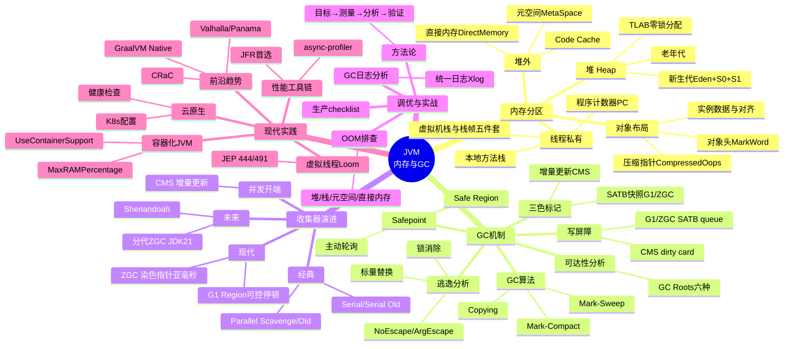

# JVM 内存结构与 GC

!!! info "**本文是 JVM 专题的综览入口**"
    本文承担**知识地图 + 导航索引**的职责：告诉你 JVM 专题由哪些子主题组成、每个子主题解决什么问题、详情去哪篇深度文章。

    所有深度源码追溯、调优实战、前沿技术落地，均已拆入 4 篇姊妹文档（见 §4 知识点导航表）。**本文不重复这些细节**——只做领域全景与阅读路径推荐。

---

## 1. 为什么要深入理解 JVM？

Java 程序运行在 JVM 之上，JVM 屏蔽了底层操作系统的差异，但也带来了一层"黑盒"。当系统出现以下问题时，不理解 JVM 就无从下手：

| 现象 | 根因 | 需要的 JVM 知识 |
| :---- | :---- | :---- |
| `OutOfMemoryError` 崩溃 | 内存泄漏 / 堆太小 | 内存分区 + OOM 排查 |
| 每隔几分钟停顿几秒 | 频繁 Full GC | GC 算法 + 收集器选型 |
| CPU 100% 但业务量不高 | GC 线程占满 CPU | GC 日志分析 + 调优 |
| 响应时间 P99 抖动 | Stop-The-World 停顿 | 低延迟收集器（ZGC / G1） |
| 类加载后内存持续增长 | 元空间泄漏 | 元空间 + 类加载机制 |
| 容器里被 OOM Killer 杀 | JVM 不感知 cgroup | 容器化 JVM 调优 |

---

## 2. JVM 整体架构

JVM 是一个完整的运行时系统，除了内存区域外，还包括**类加载子系统、执行引擎、GC 子系统**等组件。下图从整体架构视角呈现各组件的关系。

```kroki-plantuml
@startuml

' ========= 顶部：输入 =========
rectangle "*.class 文件 / JAR" as ClassFile #E6FFFA

' ========= 中部：JVM 进程 =========
package "JVM 进程" as JVM {

  package "类加载子系统 ClassLoader" as Loader {
    rectangle "加载 / 链接 / 初始化" as CL
  }

  package "运行时数据区 Runtime Data Area\n（即常说的 JVM 内存结构）" as Runtime {

    package "线程共享" as Shared {
      rectangle "堆 Heap\n新生代(Eden+S0+S1) + 老年代" as Heap
      rectangle "元空间 MetaSpace\n类元数据 / 方法信息 / 常量池\n（本地内存）" as Meta
      rectangle "Code Cache\n存放 JIT 产出的机器码\n（本地内存）" as CodeCache
    }

    package "线程私有（每个线程独有）" as Private {
      rectangle "虚拟机栈\n栈帧 = 局部变量表 + 操作数栈\n + 动态链接 + 返回地址" as Stack
      rectangle "本地方法栈\nNative 方法" as NStack
      rectangle "程序计数器\n当前字节码指令地址" as PC
    }
  }

  package "执行引擎 Execution Engine" as Engine {
    rectangle "解释器\n逐条执行字节码" as Interp
    rectangle "JIT 编译器 C1/C2\n热点代码 → 机器码" as JIT
    rectangle "GC 子系统\nMinor / Major / Full GC" as GC
  }

  rectangle "本地接口 JNI" as JNI
}

' ========= 底部：底层资源 =========
rectangle "直接内存 Direct Memory\nNIO ByteBuffer / Netty\n不受 JVM 堆管理" as DirectMem #FFF5F5
rectangle "操作系统 / 物理内存" as OS #FEFCBF

' ========= 连线 =========
ClassFile --> CL
CL --> Meta : 写入类元数据
Interp ..> JIT : 热点方法触发编译
JIT --> CodeCache : 产出机器码写入
Engine --> Heap : 操作对象
Engine --> Stack : 方法调用
Heap <--> GC
NStack <--> JNI
Meta --> OS
CodeCache --> OS
Heap --> OS
DirectMem --> OS

@enduml
```

**架构层次说明**：

- JVM 整体架构涵盖类加载、运行时数据区、执行引擎、本地接口四大子系统；
- "运行时数据区"即通常所说的 **JVM 内存结构**，其细节见 [JVM 内存分区与对象布局](@java-JVM内存分区与对象布局)（堆 / 栈 / 元空间 / PC / 直接内存）；
- 执行引擎本身不是内存区域，但它是产生 Code Cache 机器码、触发 GC 的主体；
- **JIT 编译器（C1/C2/Graal）** 是 JVM 执行引擎的一个子系统，职责是**把字节码翻译成机器码**；
- **Code Cache** 是存放编译产物（机器码）的地方，位于本地内存，由 `-XX:ReservedCodeCacheSize` 控制大小（默认 240MB）。Code Cache 满了会触发"CodeCache is full"告警，JIT 停止编译，程序退化为纯解释执行，性能会明显下降。

---

## 3. JVM 知识地图



---

## 4. 知识点导航表

| # | 子主题 | 核心一句话 | 详细文档 |
| :-- | :-- | :-- | :-- |
| 1 | **内存分区与对象布局** | 七大分区（三共享 + 三私有 + 一补充）+ 对象头 Mark Word 位布局 | [JVM 内存分区与对象布局](@java-JVM内存分区与对象布局) |
| 2 | **GC 核心机制与收集器演进** | 可达性分析、三色标记、写屏障、Serial→Parallel→CMS→G1→ZGC 的演进主线 | [GC 核心机制与收集器演进](@java-GC核心机制与收集器演进) |
| 3 | **GC 调优实战与常见误区** | 调优方法论、参数矩阵、OOM 四字诀、生产 checklist | [GC 调优实战与常见误区](@java-GC调优实战与常见误区) |
| 4 | **JVM 现代实践与前沿技术** | 容器化 JVM、虚拟线程、JFR、JIT 深解、分代 ZGC、CRaC / Valhalla | [JVM 现代实践与前沿技术](@java-JVM现代实践与前沿技术) |

---

## 5. 高频问题索引表

| 问题 | 详见 |
| :-- | :-- |
| JVM 内存分区有哪些？ | [JVM 内存分区与对象布局](@java-JVM内存分区与对象布局) §1 |
| JDK 8 为何用元空间替代永久代？ | [JVM 内存分区与对象布局](@java-JVM内存分区与对象布局) §5 + Q&A |
| 为什么年轻代和老年代分开？ | [GC 核心机制与收集器演进](@java-GC核心机制与收集器演进) §11 Q1 |
| G1 是怎么做到可预测停顿的？ | [GC 核心机制与收集器演进](@java-GC核心机制与收集器演进) §8 + §11 Q2 |
| ZGC 为什么停顿时间这么短？ | [GC 核心机制与收集器演进](@java-GC核心机制与收集器演进) §9 |
| 堆外内存该用多少？ | [GC 调优实战与常见误区](@java-GC调优实战与常见误区) §8 Q1 |
| Full GC 频繁怎么排查？ | [GC 调优实战与常见误区](@java-GC调优实战与常见误区) §8 Q2 |
| 容器里 JVM 被 OOM Killer 怎么办？ | [JVM 现代实践与前沿技术](@java-JVM现代实践与前沿技术) §1 + §8 Q1 |
| 虚拟线程适合什么场景？ | [JVM 现代实践与前沿技术](@java-JVM现代实践与前沿技术) §2 + §8 Q2 |
| G1 vs ZGC 生产如何选型？ | [GC 调优实战与常见误区](@java-GC调优实战与常见误区) §8 Q4 |

---

## 6. 学习路径建议

### 6.1 初学者路径（自底向上，重在建立心智模型）


**推荐顺序**：

1. 先读 [JVM 内存分区与对象布局](@java-JVM内存分区与对象布局)——建立"对象在哪、栈帧怎么回事、PC 是什么"的基本认知
2. 再读 [GC 核心机制与收集器演进](@java-GC核心机制与收集器演进)——理解"GC 是怎么找垃圾的、收集器是怎么演进的"
3. 然后看 [GC 调优实战与常见误区](@java-GC调优实战与常见误区)——把理论落到"参数怎么配、OOM 怎么排查"
4. 最后读 [JVM 现代实践与前沿技术](@java-JVM现代实践与前沿技术)——接轨云原生 / 虚拟线程 / 分代 ZGC 等前沿

### 6.2 线上救火路径（问题导向）

- **OOM 崩溃** → 直接看 [GC 调优实战与常见误区](@java-GC调优实战与常见误区) §4 OOM 排查流程
- **Full GC 频繁** → [GC 调优实战与常见误区](@java-GC调优实战与常见误区) §3 诊断决策树
- **容器被 OOM Killer** → [JVM 现代实践与前沿技术](@java-JVM现代实践与前沿技术) §1 容器化 JVM 调优
- **P99 抖动** → [GC 核心机制与收集器演进](@java-GC核心机制与收集器演进) §9 ZGC + [GC 调优实战与常见误区](@java-GC调优实战与常见误区) §5 参数矩阵

### 6.3 面试冲刺路径（高频考点）

- **底层机制题**（GC Roots、三色标记、Mark Word 位布局、染色指针）→ [JVM 内存分区与对象布局](@java-JVM内存分区与对象布局) + [GC 核心机制与收集器演进](@java-GC核心机制与收集器演进) 的 Q&A
- **调优排查题**（Full GC 分析、OOM 定位、JVM 参数选择）→ [GC 调优实战与常见误区](@java-GC调优实战与常见误区) §8 Q&A
- **前沿技术题**（虚拟线程、ZGC、分代 ZGC、GraalVM）→ [JVM 现代实践与前沿技术](@java-JVM现代实践与前沿技术) §8 Q&A

---

## 7. 一句话口诀

> **JVM 四大件：内存分区（知道对象在哪）、GC 机制（知道垃圾怎么找）、调优实战（知道参数怎么配）、现代实践（知道容器 / 虚拟线程 / 前沿趋势）——四篇通读，线上排障有底气。**
