# JVM 内存结构与 GC

---

## 1. 为什么要深入理解 JVM？

Java 程序运行在 JVM 之上，JVM 屏蔽了底层操作系统的差异，但也带来了一层"黑盒"。当系统出现以下问题时，不理解 JVM 就无从下手：

| 现象 | 根因 | 需要的 JVM 知识 |
| :---- | :---- | :---- |
| `OutOfMemoryError` 崩溃 | 内存泄漏 / 堆太小 | 内存分区 + OOM 排查 |
| 每隔几分钟停顿几秒 | 频繁 Full GC | GC 算法 + 收集器选型 |
| CPU 100% 但业务量不高 | GC 线程占满 CPU | GC 日志分析 + 调优 |
| 响应时间 P99 抖动 | Stop-The-World 停顿 | 低延迟收集器（ZGC/G1） |
| 类加载后内存持续增长 | 元空间泄漏 | 元空间 + 类加载机制 |

---

## 2. JVM 整体架构

JVM 是一个完整的运行时系统，除了内存区域外，还包括**类加载子系统、执行引擎、GC 子系统**等组件。下图从整体架构视角呈现各组件的关系。

```kroki-plantuml
@startuml

' ========= 顶部：输入 =========
rectangle "*.class 文件 / JAR" as ClassFile #E6FFFA

' ========= 中部：JVM 进程 =========
package "JVM 进程" as JVM {

  package "类加载子系统 ClassLoader" as Loader {
    rectangle "加载 / 链接 / 初始化" as CL
  }

  package "运行时数据区 Runtime Data Area\n（即常说的 JVM 内存结构）" as Runtime {

    package "线程共享" as Shared {
      rectangle "堆 Heap\n新生代(Eden+S0+S1) + 老年代" as Heap
      rectangle "元空间 MetaSpace\n类元数据 / 方法信息 / 常量池\n（本地内存）" as Meta
      rectangle "Code Cache\n存放 JIT 产出的机器码\n（本地内存）" as CodeCache
    }

    package "线程私有（每个线程独有）" as Private {
      rectangle "虚拟机栈\n栈帧 = 局部变量表 + 操作数栈\n + 动态链接 + 返回地址" as Stack
      rectangle "本地方法栈\nNative 方法" as NStack
      rectangle "程序计数器\n当前字节码指令地址" as PC
    }
  }

  package "执行引擎 Execution Engine" as Engine {
    rectangle "解释器\n逐条执行字节码" as Interp
    rectangle "JIT 编译器 C1/C2\n热点代码 → 机器码" as JIT
    rectangle "GC 子系统\nMinor / Major / Full GC" as GC
  }

  rectangle "本地接口 JNI" as JNI
}

' ========= 底部：底层资源 =========
rectangle "直接内存 Direct Memory\nNIO ByteBuffer / Netty\n不受 JVM 堆管理" as DirectMem #FFF5F5
rectangle "操作系统 / 物理内存" as OS #FEFCBF

' ========= 连线 =========
ClassFile --> CL
CL --> Meta : 写入类元数据
Interp ..> JIT : 热点方法触发编译
JIT --> CodeCache : 产出机器码写入
Engine --> Heap : 操作对象
Engine --> Stack : 方法调用
Heap <--> GC
NStack <--> JNI
Meta --> OS
CodeCache --> OS
Heap --> OS
DirectMem --> OS

@enduml
```

- JVM 整体架构涵盖类加载、运行时数据区、执行引擎、本地接口四大子系统；
- "运行时数据区"即通常所说的 **JVM 内存结构**，其细节会在下面展开（堆 / 栈 / 元空间 / PC / 直接内存）；
- 执行引擎本身不是内存区域，但它是产生 Code Cache 机器码、触发 GC 的主体，放在一起看更有助于理解全局。
- **JIT 编译器（C1/C2/Graal）** 是 JVM 执行引擎的一个子系统（一段编译器实现代码），职责是**把字节码翻译成机器码**。
- **Code Cache** 是存放编译产物（机器码）的地方，位于本地内存，由 `-XX:ReservedCodeCacheSize` 控制大小（默认 240MB）。Code Cache 满了会触发"CodeCache is full"告警，JIT 停止编译，程序退化为纯解释执行，性能会明显下降。

---

## 3. 内存分区详解

在深入每个分区的内部细节之前，先建立一个全局视角。JVM 的**运行时数据区**（即常说的"内存结构"）可以从两条主线来理解，掌握这两条主线后再逐个展开，思路会清晰很多。

下面这张二维分组图把七大分区按两条主线铺开，一眼就能看到每个分区的"身份"（横向：线程维度；纵向：位置维度）：

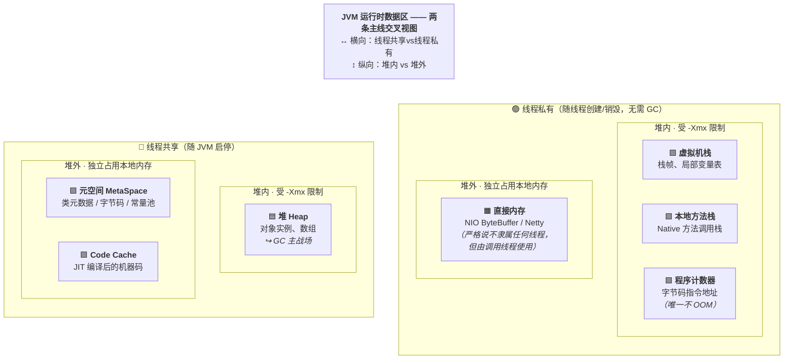

图中的颜色含义：🟦 堆（GC 核心战场）、🟩 线程私有区（随线程创建/销毁、无需 GC）、🟪 堆外共享区（类/代码元数据）、🟧 堆外辅助区（直接内存）。

下面把这两条主线各自展开讲清楚。

一是从线程维度 —— 线程共享 vs 线程私有

| 分类 | 分区 | 生命周期 | GC 关注 |
| :---- | :---- | :---- | :---- |
| **线程共享** | 堆、元空间、Code Cache | 随 JVM 启停 | ✅ GC 核心战场 |
| **线程私有** | 虚拟机栈、本地方法栈、程序计数器 | 随线程创建/销毁 | ❌ 无需 GC |

另一个是从内存位置维度 —— 堆内 vs 堆外

| 分类 | 分区 | 是否受 `-Xmx` 限制 |
| :---- | :---- | :---- |
| **堆内（JVM 管理）** | 堆、虚拟机栈、本地方法栈、程序计数器 | ✅ 堆受 `-Xmx` 限制 |
| **堆外（本地内存）** | 元空间、Code Cache、直接内存 | ❌ 独立占用物理内存 |

!!! warning "生产事故最常见的盲区"
    很多同学以为 `-Xmx2g` 就是 JVM 进程的总内存上限，其实**元空间、Code Cache、直接内存、线程栈**都在堆外独立占用内存。一个 Java 进程的 RSS（实际物理内存占用）常常远大于 `-Xmx`。

    ⚠️ **容器内存限制必须把这些堆外部分都算上**，否则容易被 OOM Killer 直接干掉（参见 [§11.1 容器化环境下的 JVM 调优](#111-容器化环境下的jvm调优)）。

七大分区速览表

| 分区 | 线程 | 位置 | 存什么 | 是否 GC | OOM 表现 | 关键参数 |
| :---- | :---- | :---- | :---- | :---- | :---- | :---- |
| **堆 Heap** | 共享 | 堆内 | 对象实例、数组 | ✅ 主战场 | `Java heap space` | `-Xms` / `-Xmx` |
| **元空间** | 共享 | 堆外 | 类元数据、字节码、运行时常量池 | ✅ 随 Full GC | `Metaspace` | `-XX:MaxMetaspaceSize` |
| **Code Cache** | 共享 | 堆外 | JIT 编译后的机器码 | ⚠️ Sweeper 回收 | `CodeCache is full`（不抛 OOM） | `-XX:ReservedCodeCacheSize` |
| **虚拟机栈** | 私有 | 堆内 | 栈帧（局部变量表、操作数栈等） | ❌ | `StackOverflowError` / `OOM` | `-Xss` |
| **本地方法栈** | 私有 | 堆内 | Native 方法调用栈 | ❌ | `StackOverflowError` | 与 `-Xss` 类似 |
| **程序计数器** | 私有 | 堆内 | 当前字节码指令地址 | ❌ | **唯一不会 OOM** | 无需配置 |
| **直接内存** | — | 堆外 | NIO ByteBuffer、Netty 缓冲 | ❌（依赖 Cleaner） | `Direct buffer memory` | `-XX:MaxDirectMemorySize` |

一次方法调用，各分区如何协作？

以 `User u = new User("Tom")` 为例，把所有分区串起来：

```txt
1. 类加载器读取 User.class
   └─→ 类元数据写入 【元空间】

2. JVM 在 【堆】 的 Eden 区（通过 TLAB）分配 User 对象内存

3. 执行构造方法时：
   ├─→ 【虚拟机栈】 压入新栈帧
   │    ├─ 局部变量表存 this 引用、参数 "Tom"
   │    └─ 操作数栈作为字节码执行的工作区
   └─→ 【程序计数器】 记录当前执行到哪条字节码

4. 引用 u 存在栈帧的局部变量表中，指向堆中的对象

5. 若该方法成为热点，JIT 编译它
   └─→ 机器码存入 【Code Cache】

6. 方法返回：栈帧弹出，u 不再被引用
   └─→ 下次 GC 时，堆中的 User 对象可被回收
```

分区与 OOM 的对应关系

这是面试与线上排障的高频考点，看到异常类型应立刻反应到对应分区：

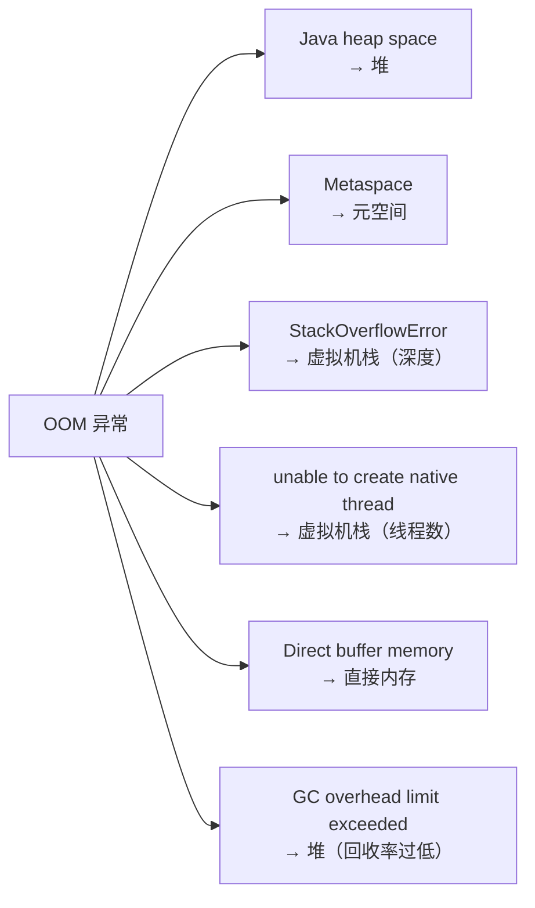

!!! tip "记忆口诀"
    - **三共享**：堆、元空间、Code Cache
    - **三私有**：虚拟机栈、本地方法栈、程序计数器
    - **一堆外补充**：直接内存（NIO / Netty 的命脉）
    - **一个例外**：程序计数器——唯一不会 OOM 的区域
    - **一个主战场**：堆——GC 的核心关注区域

带着这份全局认知，下面逐个展开每个分区的内部结构与实现细节。

---

### 3.1 堆（Heap）

堆是 JVM 中最大的内存区域，**所有线程共享**，几乎所有对象实例都在这里分配（逃逸分析例外，见 [§5.4 逃逸分析与栈上分配](#54-逃逸分析与栈上分配)）。

#### 堆的内部结构

```txt
┌─────────────────────────────────────────────────────────────┐
│                         Heap                                │
│  ┌──────────────────────────────┐  ┌──────────────────────┐ │
│  │         Young Generation     │  │    Old Generation    │ │
│  │  ┌──────────┬────┬────┐      │  │                      │ │
│  │  │  Eden    │ S0 │ S1 │      │  │  Long-lived objects  │ │
│  │  │  (80%)   │(10%)│(10%)│    │  │  Large objects direct│ │
│  │  └──────────┴────┴────┘      │  │                      │ │
│  └──────────────────────────────┘  └──────────────────────┘ │
│         Eden:S0:S1 = 8:1:1(default)                         │
└─────────────────────────────────────────────────────────────┘
```

**为什么要有 Survivor 区？**

如果只有 Eden 和 Old，Minor GC 后存活对象直接进老年代，老年代会很快被短命对象填满，触发 Full GC。Survivor 区的作用是**缓冲**：让对象在新生代多"熬"几轮 GC，确认它真的是长期存活对象，再晋升老年代，减少 Full GC 频率。

**为什么 Survivor 要有两个（S0 和 S1）？**

复制算法需要一块空闲空间作为目标区域。S0 和 S1 交替使用：每次 Minor GC，将 Eden + 当前 Survivor 中的存活对象复制到另一个 Survivor，然后清空 Eden 和原 Survivor。始终保持一个 Survivor 是空的。

#### 对象晋升流程

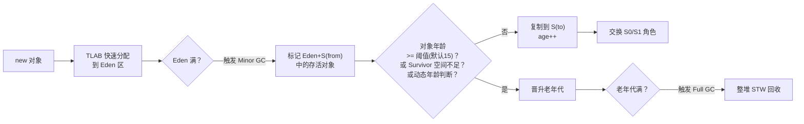

**动态年龄判断**：如果 Survivor 中相同年龄的对象总大小超过 Survivor 空间的 50%，则年龄 ≥ 该值的对象直接晋升老年代，不必等到 15 岁。这是为了防止 Survivor 空间被占满。

#### TLAB（Thread-Local Allocation Buffer）

堆是线程共享的，如果每次分配对象都要加锁，性能极差。JVM 的解决方案是 **TLAB**：

- 每个线程在 Eden 区预先申请一小块私有内存（大小**自适应**，由 JVM 根据线程数、分配速率动态调整，非固定比例）
- 线程内分配对象时直接在 TLAB 上 bump pointer，无需加锁
- TLAB 用完后再申请新的，此时才需要同步

!!! note "TLAB 相关参数"
    - `-XX:+UseTLAB`：启用 TLAB（默认开启）
    - `-XX:+ResizeTLAB`：开启 TLAB 自适应调整（默认开启）
    - `-XX:TLABSize`：显式指定 TLAB 初始大小（一般无需手动设置）
    - `-XX:TLABWasteTargetPercent`：TLAB 占 Eden 的目标浪费比例（默认 1%，这才是"1%"一说的真实出处——指的是**可容忍的空间浪费**，而非 TLAB 固定大小）

```txt
Eden Area
┌──────────────────────────────────────────────────┐
│  Thread-1 TLAB  │  Thread-2 TLAB  │  Shared Area │
│  [obj][obj][  ] │  [obj][      ]  │              │
└──────────────────────────────────────────────────┘
                                    ↑ Large objects allocated in shared area
```

### 3.2 虚拟机栈（VM Stack）

每个线程独有，线程创建时分配，线程结束时销毁。每次方法调用压入一个**栈帧（Stack Frame）**，方法返回时弹出。

#### 栈帧的内部结构

一个栈帧由**五件套**组成，它们共同支撑起"一次方法调用"的全部运行时状态：

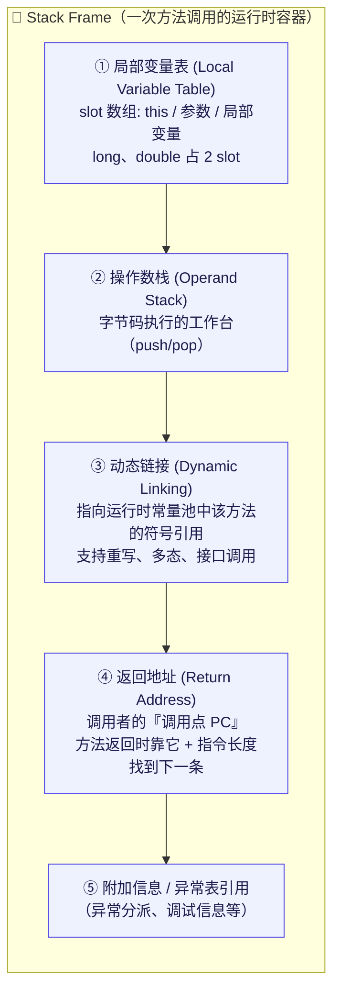

下面逐项展开这五件套的语义；其中 **④ 返回地址** 与 [§3.4 程序计数器](#34-程序计数器pc-register) 是一对孪生概念，读完本节再去看 §3.4 会更有体感。

#### 栈帧五件套详解

| 组件 | 是什么 | 运行时作用 |
| :---- | :---- | :---- |
| **① 局部变量表** | slot 数组，存 `this`、方法参数、局部变量（long/double 占 2 slot） | 字节码通过 `iload_n` / `istore_n` 等指令读写；方法编译期就确定了 slot 数量 |
| **② 操作数栈** | 字节码执行的"工作台"，所有计算都在这里完成（push/pop） | 每条字节码的本质就是：从操作数栈取输入、算出结果再压回去 |
| **③ 动态链接** | 指向运行时常量池中该方法的**符号引用**，用于运行时解析被调用方法（支持重写/多态） | 执行 `invokevirtual` / `invokeinterface` 等 invoke 指令时，通过这个引用查到真正要调用的方法 |
| **④ 返回地址** | **调用点的 PC**（见下面"返回地址的精确语义"） | 方法返回时，JVM 用它+指令长度恢复调用者的 PC |
| **⑤ 附加信息** | 异常分派表引用、调试信息、本地方法接口状态等 | 抛异常时用于查找 `exception_table` 匹配 catch；调试器通过它定位帧 |

**一次方法调用的完整运行时图景**（以 `main` 调 `sum(10, 0)` 为例）：

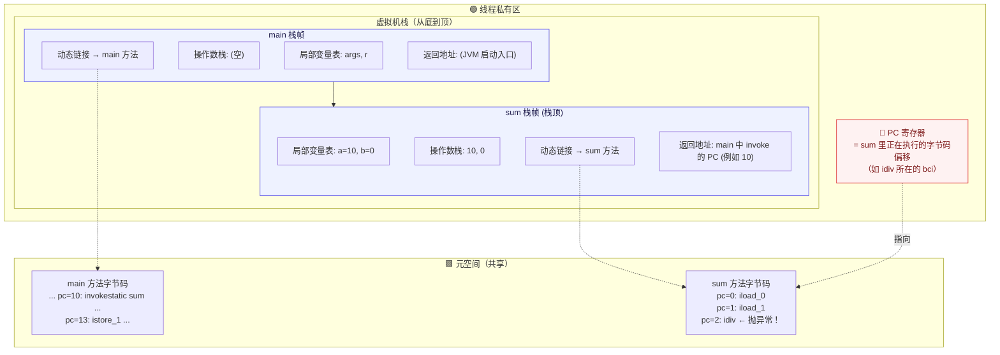

> 💡 这张图是理解栈帧的"总地图"：**栈顶栈帧的当前位置由 PC 寄存器持有；非栈顶栈帧的"曾经执行到哪儿"则快照在各自的『返回地址』字段里**。两者语义高度一致，都记录"当前正在执行的那条指令的偏移"——下面这节会把这个重要细节讲透。

#### 返回地址的精确语义 & 异常栈行号是怎么来的

这是一个容易被教科书一笔带过、但面试和调试时极有价值的细节。

**误区澄清**：很多资料会说"返回地址 = 下一条指令的 PC"，这在逻辑上说得通（返回时拿来就能用），但**不是 HotSpot 的真实实现**。

**JVM 规范层面**：两种实现都合法——存"调用点 PC"或存"下一条 PC"都行。

**HotSpot 实际做法**：

> ✅ **返回地址字段存的是『调用点 PC』**——也就是 invoke 指令本身的偏移量，**不是**它的下一条。

这意味着一条重要的心智模型：

!!! important "统一的『当前执行位置』语义"
    **无论栈顶还是非栈顶，JVM 中所有记录『执行位置』的字段，语义都是『正在执行的那条指令本身的偏移』，而不是『下一条』。**

    - **栈顶栈帧**：由 PC 寄存器持有——抛异常瞬间，PC 停在**肇事指令本身**（如 `idiv`、`invokevirtual`）
    - **非栈顶栈帧**：由栈帧的"返回地址"字段持有——值是**当时调用下级方法的 invoke 指令偏移**
    
    "移动到下一条"（`PC += 指令长度`）这个动作，只发生在"指令执行完"或"方法返回"的瞬间，**不会提前写进存储**。

**为什么 HotSpot 这样选？** 两种方案对比：

| 方案 | 存的值 | 正常返回路径 | 异常栈打印路径 |
| :---- | :---- | :---- | :---- |
| A. 存"下一条" | 13 | `PC = 13`，直接用 | ❌ 需要回退到 10 才能查行号——但字节码是变长指令，回退需要从头扫描，很麻烦 |
| **B. 存"调用点"** ✅ | 10 | `PC = 10 + 指令长度` | ✅ 直接用 10 查 `LineNumberTable` 就拿到行号 |

HotSpot 选 B 的核心理由：**把"加指令长度"这个动作放在"正常返回"这条高频路径上，而不是放在"打印异常栈"这条低频路径上**，同时异常堆栈、调试器、`Thread.getStackTrace()` 等所有"需要知道调用位置"的场景都能直接复用这个值。

**异常栈行号的完整打印过程**（以 `main → sum → idiv 抛 ArithmeticException` 为例）：

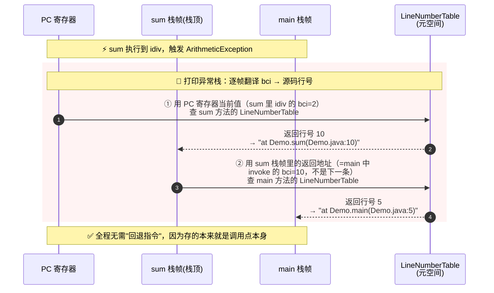

**关键要点小结**：

- 🎯 **PC 在抛异常那一刻是"冻结"在肇事指令上的**，不会被推进到下一条——所以栈顶栈帧的行号不需要任何调整
- 🎯 **返回地址存的是『调用点 PC』**（HotSpot 实现），不是"下一条 PC"——所以非栈顶栈帧的行号也不需要回退
- 🎯 **正常返回时**，JVM 读出返回地址（如 10），再 `+ invoke 指令长度（如 3）` 得到 13，从这里继续执行调用者
- 🎯 **`LineNumberTable` 存放在元空间的方法 Code 属性里**，是一张 `bci → 源码行号` 的映射表，`javap -l` 可以打印出来

**`StackOverflowError` vs `OutOfMemoryError`**：

- 递归调用过深 → 栈帧不断压栈 → 超过栈深度限制 → `StackOverflowError`
- 线程数量过多 → 每个线程都要分配栈空间 → 内存耗尽 → `OutOfMemoryError`（创建线程时）

### 3.3 元空间（MetaSpace）

JDK 8 用元空间替换了永久代（PermGen），存储**类的元数据**：

| 存储内容 | 说明 |
| :---- | :---- |
| 类的结构信息 | 字段、方法、接口、父类等 |
| 方法字节码 | 编译后的字节码指令 |
| 运行时常量池 | 字面量、符号引用 |

!!! note "JIT 编译后的机器码不在元空间"
    **常见误区**：JIT 编译后的机器码并不存放在元空间，而是存放在独立的 **Code Cache（代码缓存）** 区域，同样使用本地内存，由 `-XX:ReservedCodeCacheSize` 控制（默认 240MB）。元空间只存放**字节码**和**类元数据**。

!!! important "字符串常量池（String Table）的位置变迁"
    **字符串常量池**（String Table，也叫 `StringTable`）的位置经过了几次重要变迁，这是高频面试考点，也直接影响 `String.intern()` 的行为：

    | JDK 版本 | 字符串常量池位置 | `intern()` 行为 |
    | :---- | :---- | :---- |
    | JDK 6 及以前 | **永久代**（PermGen） | 将字符串**复制**到永久代常量池，返回常量池引用 |
    | JDK 7 | **堆** | 若堆中已有该字符串，直接**记录引用**到 StringTable，不再复制 |
    | JDK 8+ | **堆**（元空间取代永久代，但 StringTable 仍在堆中） | 同 JDK 7 |

    ⚠️ **关键澄清**：虽然上面\"存储内容\"表格中提到元空间里有\"运行时常量池\"，但这里的\"运行时常量池\"指**类级别**的常量池（每个 Class 一份，存字面量和符号引用），而**全局的字符串常量池（StringTable）从 JDK 7 起就已经移到堆中了**——这两者经常被混淆。

    💡 **实战影响**：因为 StringTable 在堆中，大量调用 `intern()` 或存在海量重复字符串时，会直接撑大堆内存，可能触发 `Java heap space` OOM（而不是 `Metaspace` OOM）。JDK 7+ 可通过 `-XX:StringTableSize` 调整 StringTable 桶大小（默认 60013），对 `intern()` 密集场景可显著提升性能。

!!! warning "元空间关键区别"
    **关键区别**：元空间使用**本地内存（Native Memory）**，不在 JVM 堆内，默认无上限（受物理内存限制）。

    ⚠️ **生产环境必须设置** `-XX:MaxMetaspaceSize` 防止无限增长，否则可能导致系统内存耗尽。

!!! warning "元空间泄漏风险"
    **元空间泄漏的典型场景**：
    
    - CGLib 动态代理：每次代理都生成新类，类卸载条件苛刻
    - JSP 热部署：每次修改 JSP 都重新生成类
    - OSGI 框架：频繁加载/卸载 Bundle
    
    ⚠️ 这些场景容易导致元空间持续增长，必须设置 `-XX:MaxMetaspaceSize` 进行限制。

### 3.4 程序计数器（PC Register）

- 每个线程独有，记录当前线程正在执行的字节码指令地址
- 执行 Native 方法时值为 undefined
- **唯一不会发生 OOM 的内存区域**（大小固定，只存一个地址）
- CPU 多线程切换时，靠 PC 恢复执行位置

!!! note "与栈帧的关系"
    PC 寄存器可以理解为栈顶栈帧的一个"外置字段"——[§3.2](#32-虚拟机栈vm-stack) 中讲过的"返回地址"就是**非栈顶栈帧版的 PC**。两者本质上记录同一件事："正在执行的那条指令的偏移"；只是栈顶用 PC 寄存器保存，非栈顶用栈帧里的返回地址字段保存。建议先读完 §3.2 再回到这里。

#### 指令存在哪？PC 存的又是什么？

PC 寄存器本身非常"轻"——它只保存一个数字，真正的问题是：**那这个数字指向的字节码指令，存放在哪里？** 答案是 **元空间**。

字节码指令在类加载时被写入元空间中对应 `Method` 结构的 **Code 属性**里，是一段线性的字节数组。所有线程**共享**这份指令（类似多个演奏者共用一本乐谱），而每个线程通过"**栈帧 + PC**"这对组合来定位自己当前执行到哪一条：

- **栈帧**（虚拟机栈）告诉你"**当前在哪个方法**"——里面有一个指向元空间中该 `Method` 的引用
- **PC 寄存器**告诉你"**方法内的第几个字节**"——保存的是字节码数组中的**偏移量**（不是下标）

两者合起来才能唯一定位一条正在执行的指令。

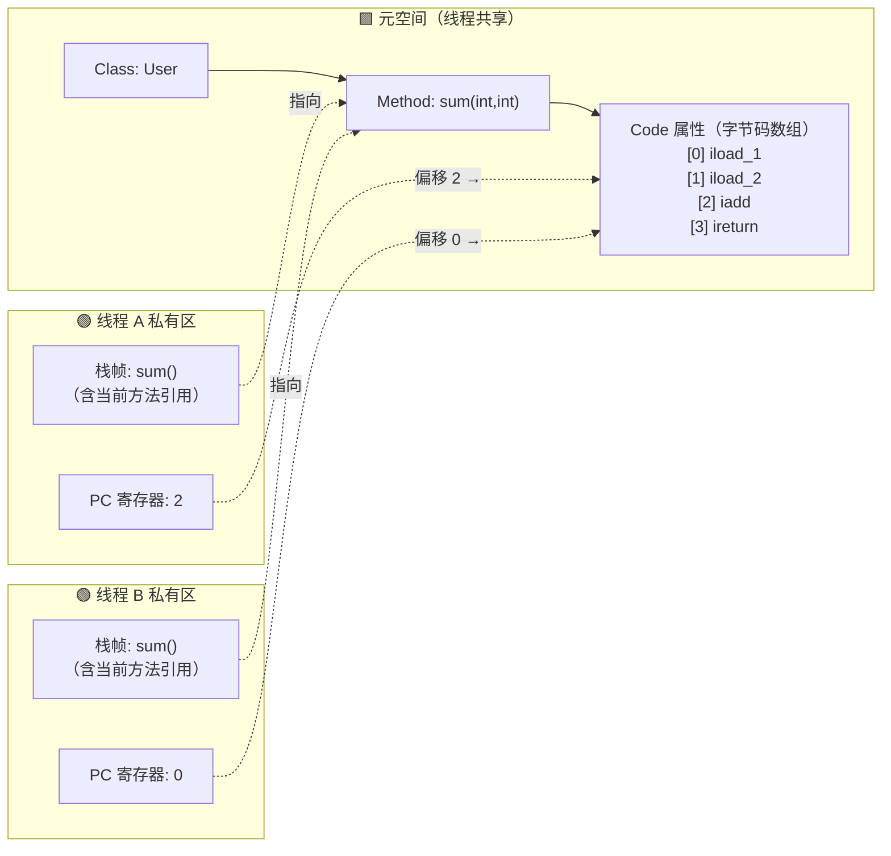

上图展示了两个线程同时执行 `sum()` 方法的场景：它们**共用元空间中同一份字节码**，但各自的栈帧和 PC 记录着"自己走到哪一步"（线程 A 执行到偏移 2 的 `iadd`，线程 B 刚开始执行偏移 0 的 `iload_1`）——这就是 PC 必须线程私有的根本原因。

#### PC 为什么存"偏移量"而不是"下标"？

字节码数组中不同指令占用的字节数不同（1~N 字节），PC 保存的是**字节偏移量**，而非逻辑下标：

```txt
偏移  指令             字节数
[0]   aload_0          1
[1]   invokespecial    3   （含 2 字节操作数 #Method）
[4]   iload_1          1   ← 下一条指令直接跳到偏移 4
[5]   ireturn          1
```

像 `if_icmpge`、`goto`、`tableswitch` 这类跳转指令，其语义就是**直接修改 PC 的值**，让执行流跳到目标偏移量——这正是所有控制流（if/for/while/switch）在字节码层面的实现方式。

#### 线程切换时 PC 的作用

这就回到了最初那句"CPU 多线程切换时靠 PC 恢复执行位置"的底层含义：

```txt
线程 A 正执行 sum() 第 2 字节处的 iadd
        ↓ 时间片耗尽，被 OS 挂起
JVM 保存：线程 A 的栈帧 + PC = 2
        ↓
CPU 切到线程 B 执行
        ↓ ...  一段时间后 ...
线程 A 重新获得 CPU
        ↓
JVM 读取：线程 A 的 PC = 2
        ↓
回到元空间 sum() 字节码数组[2] → 继续执行 iadd
```

如果 PC 是线程共享的，多个线程的"执行位置"就会互相覆盖，根本无法正确恢复——这就是 JVM 规范强制规定 PC 寄存器**线程私有**的根本原因。

!!! tip "一句话总结"
    **字节码在元空间（共享乐谱），栈帧指明当前方法（翻到哪一页），PC 指明方法内偏移（拉到哪一小节）**——三者配合，才能让任意数量的线程在同一份字节码上各自独立推进。

### 3.5 直接内存（Direct Memory）

不属于 JVM 规范定义的内存区域，但频繁使用：

```java
// NIO 直接内存分配
ByteBuffer buffer = ByteBuffer.allocateDirect(1024 * 1024); // 1MB 直接内存

// 底层调用 unsafe.allocateMemory()，绕过 JVM 堆，直接向 OS 申请内存
// 好处：避免 Java 堆和 Native 堆之间的数据拷贝（零拷贝）
// 坏处：不受 GC 管理，需要手动释放（或依赖 Cleaner 机制）
```

**为什么 Netty 大量使用直接内存？**

传统 IO：`磁盘 → 内核缓冲区 → JVM 堆 → 网络`（两次拷贝）

NIO 直接内存：`磁盘 → 直接内存 → 网络`（一次拷贝，零拷贝）

---

## 4. 对象的内存布局

理解对象在堆中的实际存储结构，是理解 GC、锁优化、内存占用的基础。

### 4.1 对象头（Object Header）

```txt
┌──────────────────────────────────────────────────────────┐
│                    Object Header                         │
│                                                          │
│  ┌──────────────────────────────────────────────────┐    │
│  │  Mark Word(8 bytes, 64-bit JVM)                  │    │
│  │  Stores: hashCode / GC age / lock state /        │    │
│  │         biased lock thread ID                    │    │
│  └──────────────────────────────────────────────────┘    │
│  ┌──────────────────────────────────────────────────┐    │
│  │  Klass Pointer(4 bytes with pointer compression; │    │
│  │                8 bytes otherwise)                │    │
│  │  Points to class metadata in method area         │    │
│  └──────────────────────────────────────────────────┘    │
│  ┌──────────────────────────────────────────────────┐    │
│  │  Array length(array objects only, 4 bytes)       │    │
│  └──────────────────────────────────────────────────┘    │
└──────────────────────────────────────────────────────────┘
```

**Mark Word 的多态复用**（64 位 JVM，共 64 bit）：

| 锁状态 | 存储内容（按位拆解，合计 64 bit） | 标志位（低 2 bit） |
| :---- | :---- | :---- |
| 无锁 | unused(25) + hashCode(31) + unused(1) + GC 年龄(4) + 偏向标志(1) + 锁标志(2) | 01（偏向标志=0） |
| 偏向锁 | 线程 ID(54) + epoch(2) + unused(1) + GC 年龄(4) + 偏向标志(1) + 锁标志(2) | 01（偏向标志=1） |
| 轻量级锁 | 指向栈中锁记录的指针(62) + 锁标志(2) | 00 |
| 重量级锁 | 指向 Monitor 对象的指针(62) + 锁标志(2) | 10 |
| GC 标记 | 由 GC 使用，配合 forwarding pointer | 11 |

!!! warning "偏向锁已被废弃（JDK 15+）"
    **JEP 374** 在 JDK 15 中将偏向锁标记为 **deprecated**，并默认关闭；**JDK 18** 中彻底废弃。

    - 废弃原因：现代 JVM 中无竞争同步已通过 JIT 的"锁消除"优化得很好，偏向锁带来的收益越来越小，而它的复杂性（撤销/批量重偏向）给 JVM 维护带来巨大负担。
    - 现状：JDK 15+ 上 `-XX:+UseBiasedLocking` 已无效；Mark Word 中的偏向锁相关字段在这些版本已不再使用，但表格中的位布局仍是理解历史实现的参考。
    - 影响：对绝大多数业务几乎无感；但依赖"短临界区单线程重复加锁"优化的老代码，需留意并推荐升级到更高效的同步原语（`java.util.concurrent`、`VarHandle`）。

### 4.2 实例数据与对齐填充

```
┌─────────────────────────────────────┐
│  Object Header（12 or 16 bytes）      │
├─────────────────────────────────────┤
│  Instance Data（field values）        │
│  JVM reorders fields to reduce memory │
│  Order：long/double > int/float >     │
│        short/char > byte/boolean >  │
│        reference                     │
├─────────────────────────────────────┤
│  Padding                            │
│  Align to multiple of 8 bytes       │
└─────────────────────────────────────┘
```

**计算一个对象的实际大小**：

```java
// 示例：一个只有 int 字段的对象
class Foo {
    int x; // 4 字节
}
// 对象头：12 字节（开启指针压缩）
// 实例数据：4 字节（int x）
// 对齐填充：0 字节（12+4=16，已是8的倍数）
// 总计：16 字节

// 可用 JOL（Java Object Layout）工具精确查看
// System.out.println(ClassLayout.parseInstance(new Foo()).toPrintable());
```

---

## 5. GC 核心机制

### 5.1 可达性分析与 GC Roots

JVM 不使用引用计数（无法解决循环引用），而是**可达性分析**：从 GC Roots 出发，能被引用链到达的对象就是存活的，否则可以回收。

**GC Roots 的完整范围**：

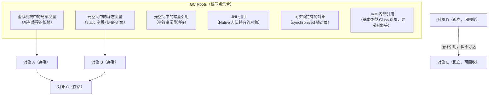

### 5.2 三色标记算法（理解并发 GC 的基础）

并发 GC（CMS、G1、ZGC）在标记阶段与业务线程并发执行，需要解决**标记过程中对象引用关系变化**的问题。三色标记是核心算法：

- **白色**：未被访问，GC 结束后仍为白色 → 可回收
- **灰色**：已被访问，但其引用的对象还未全部扫描完
- **黑色**：已被访问，且其所有引用都已扫描完 → 存活，不会再被扫描

```txt
初始状态：所有对象白色
    ↓
从 GC Roots 出发，将直接引用的对象标记为灰色
    ↓
取出一个灰色对象，扫描其所有引用：
  - 将未访问的引用对象标记为灰色
  - 将当前对象标记为黑色
    ↓
重复直到没有灰色对象
    ↓
剩余白色对象 = 垃圾
```

**并发标记的问题：漏标**

业务线程在 GC 标记过程中修改了引用关系，可能导致**存活对象被错误回收**（漏标）：

```txt
初始：A(黑) → B(灰) → C(白)
并发执行时：
  业务线程：A.ref = C（黑色 A 新增对 C 的引用）
  业务线程：B.ref = null（灰色 B 删除对 C 的引用）
结果：C 变成白色（无灰色节点引用它），但 A 是黑色不会再扫描
  → C 被错误回收！
```

**解决方案**：

| 方案 | 原理 | 使用者 |
| :---- | :---- | :---- |
| **增量更新（Incremental Update）** | 黑色对象新增引用时，将该黑色对象重新标记为灰色，重新扫描 | CMS |
| **原始快照（SATB）** | 灰色对象删除引用时，将被删除的引用记录下来，GC 结束前重新扫描 | G1、ZGC |

#### 💡 谁来"重新标记为灰色"？——写屏障（Write Barrier）

GC 线程无法实时感知业务线程的每一次字段赋值，所以"把黑色对象改回灰色"这件事其实是**业务线程自己**在赋值的瞬间完成的：

JIT / 解释器会在每条"引用字段赋值"字节码前后自动插入一小段机器码，这段代码叫 **Write Barrier（写屏障）**。业务线程在赋值时顺带执行屏障，留下一个"这里改过"的记号；GC 线程到了 Remark 阶段再根据这些记号去补扫，从而保证并发期间发生的引用变动不会被漏标。

简单说就是一句话：**业务线程留痕，GC 线程补扫。**

??? note "展开：两种写屏障的伪代码 & 执行者分工"

    以 `a.ref = c;` 为例，CMS 和 G1/ZGC 采用了两种不同的屏障策略：

    ```java
    // CMS 增量更新屏障（Post-write，写之后）
    void putfield_ref(Object a, Object c) {
        a.ref = c;                                  // ① 先赋值
        if (in_concurrent_marking) {
            card_table[addressOf(a) >> 9] = DIRTY;  // ② 把 a 所在 card 标脏
        }
    }

    // G1 / ZGC 的 SATB 屏障（Pre-write，写之前）
    void putfield_ref(Object a, Object c) {
        if (in_concurrent_marking) {
            Object old = a.ref;       // ① 先读出旧值
            satb_queue.push(old);     // ② 旧值入 SATB 队列（按"GC 开始时快照"视为存活）
        }
        a.ref = c;                    // ③ 再赋值
    }
    ```

    执行者分工：

    | 步骤 | 执行者 | 时机 |
    | :---- | :---- | :---- |
    | ① 拦截赋值、留下记号（dirty card / SATB entry） | **业务线程**（执行 JIT 生成的屏障代码） | 赋值那一瞬间 |
    | ② 真正把黑色对象重新扫描 | **GC 线程** | Remark 阶段（STW） |

写屏障把 STW 期间需要做的事情从"扫整个堆"压缩成"只扫并发期间变脏的那一小部分"——本质上是**用"全量扫描"换"增量扫描"**。于是同样是 STW，时长可以从秒级降到毫秒级。

形象点说：

- **无写屏障** = 装修要把**全屋家具**都搬走（停工几天）
- **有写屏障** = 只搬**今天要施工那个房间**的家具（停工几小时）


??? note "这也是 JVM GC 演进的主线：**还能把哪些"必须 STW 才能做的事"，挪到业务线程并发的时候做？**"

    | 方案 | STW 时长 | 原因 |
    | :---- | :---- | :---- |
    | 无写屏障（Serial / Parallel） | 百 ms ~ 秒级 | 必须暂停业务线程，把整个堆扫一遍 |
    | 有写屏障（CMS / G1） | 10 ~ 50 ms | 大部分标记在并发阶段完成，Remark 只需扫并发期间变脏的 card |
    | 染色指针 + 读屏障（ZGC / Shenandoah） | < 1 ms | 连对象搬迁都能并发做 |

    > 📖 写屏障在具体收集器上是如何落地、一次完整并发收集的四阶段时间线长什么样，见 §6.3 CMS 详解。

??? warning "展开：写屏障的代价"
    每一条引用字段赋值都会多执行几条屏障指令，引用更新密集的业务（大图遍历、ORM、大量 setter）开销可达 5%~10%。这也是为什么 Parallel GC 的吞吐量最高——它**没有写屏障**。G1 的 RSet 维护同样依赖写屏障，这也是 G1 内存占用较高的原因之一（见 §6.4）。

??? note "展开：写屏障如何补上 Initial Mark 的'漏'——一张图串起全流程"

    Initial Mark 本身并不漏扫——它在 STW 下完整枚举了当时的 GC Roots。真正的"漏"发生在**并发标记期间**：业务线程会新增引用（黑→白）、修改 Root（新压栈局部变量、静态字段改写）。写屏障让业务线程在每次"危险操作"时留下痕迹（dirty card 或 SATB entry），Remark 阶段 STW 重扫线程栈 + 消费所有痕迹，把这些"并发期间漏掉的增量"补扫完。

    ```mermaid
    sequenceDiagram
        participant App as 业务线程
        participant Barrier as 写屏障(JIT插入)
        participant GC as GC线程

        Note over GC: Initial Mark (STW)
        GC->>GC: 扫 GC Roots 直接引用，染灰

        Note over App,GC: Concurrent Mark (并发)
        App->>App: a.ref = c   (a黑, c白 → 漏标风险!)
        App->>Barrier: 触发写屏障
        Barrier->>Barrier: CMS: card_table[a]=DIRTY<br/>G1: satb_queue.push(old)
        GC->>GC: 并行地从灰色对象出发扫描

        Note over GC: Remark (STW)
        GC->>GC: ① 重扫线程栈(新增Root)
        GC->>GC: ② 扫 dirty card / 消费 SATB 队列
        GC->>GC: ③ 从新增灰色对象继续扫完

        Note over App,GC: Concurrent Sweep (并发)
        GC->>GC: 清理白色对象
    ```

    所以写屏障的真正定位是：**不是让 Initial Mark 扫得更全，而是让"Initial Mark + 并发标记"这套流水线在业务不停顿的前提下仍然正确**。它把并发 GC 的正确性问题，转化成了一个"业务线程留痕 + GC 线程增量补扫"的工程问题。

### 5.3 三种 GC 算法

```txt
Mark-Sweep Algorithm：
┌────────────────────────────────────────────────────────────────────────────┐
│ [Alive] [Garbage] [Alive] [Garbage] [Alive] [Garbage] │  After marking.    │
│ [Alive] [       ] [Alive] [       ] [Alive] [       ] │  After sweeping.   │
│ ← Generates memory fragmentation, large objects cannot allocate →          │
└────────────────────────────────────────────────────────────────────────────┘

Mark-Compact Algorithm：
┌────────────────────────────────────────────────────────────────────────────┐
│ [Alive] [Garbage] [Alive] [Garbage] [Alive] [Garbage] │  After marking     │
│ [Alive] [Alive] [Alive] [           Free Space     ] │  After compacting   │
│ ← No fragmentation, but moving objects requires updating all references →  │
└────────────────────────────────────────────────────────────────────────────┘

Copying Algorithm：
┌────────────────────────────────────────────────────────────────────────────┐
│ From: [Alive][Garbage][Alive][Garbage] │ To: [Empty] │  Before GC          │
│ From: [Cleared             ]    │ To: [Alive][Alive] │  After GC           │
│ ← No fragmentation, fast, but 50% space utilization →                      │
└────────────────────────────────────────────────────────────────────────────┘
```

### 5.4 逃逸分析与栈上分配

前面讲的所有 GC 机制都在解决一个问题：**如何高效地回收堆上的垃圾**。但还有一条更激进的思路——**如果一个对象根本不需要进堆，那就不需要 GC 了**。这就是 **逃逸分析（Escape Analysis）** 的出发点：JDK 6 起由 C2 JIT 在方法编译时进行的一项静态分析，JDK 8 起默认开启（`-XX:+DoEscapeAnalysis`）。

#### 什么叫"逃逸"？

"逃逸"指的是**一个在方法内部 new 出来的对象，其引用被传播到方法作用域之外**。HotSpot 把逃逸程度分为三级，级别越高，可做的优化越少：

| 逃逸级别 | 含义 | 典型场景 | 可做的优化 |
| :---- | :---- | :---- | :---- |
| **NoEscape** | 引用完全不离开当前方法 | 局部 `new` 后只读字段 | 标量替换、（理论上的）栈上分配、锁消除 |
| **ArgEscape** | 引用作为参数传给别的方法，但未被外部长期持有 | `logger.debug(new Point(x,y))` | 锁消除（有条件） |
| **GlobalEscape** | 引用被存入静态字段 / 实例字段 / 返回值 / 抛出的异常 | `return new X()`、`this.p = new P()` | 无，必须堆分配 |

```java
// ① NoEscape：引用完全不出方法
public int sum() {
    Point p = new Point(1, 2);
    return p.x + p.y;              // p 用完即弃，JIT 可做标量替换
}

// ② ArgEscape：引用作为参数传出去，但未被长期持有
public void log() {
    logger.debug(new Point(1, 2)); // 逃到 debug 方法，但没被存起来
}

// ③ GlobalEscape：引用被外部长期持有
public Point create() {
    return new Point(1, 2);        // 逃到调用者，必须堆分配
}
```

#### 基于逃逸分析的三项优化

HotSpot 在确认一个对象为 `NoEscape` 后，会按以下优先级尝试优化：

**① 标量替换（Scalar Replacement）—— 真正在生产中起作用的主力优化**

把对象的字段**直接拆散为独立的局部变量**，塞进栈帧或寄存器，对象本身彻底不存在。由 `-XX:+EliminateAllocations` 控制（默认开启）。

```java
// 源代码
Point p = new Point(1, 2);
return p.x + p.y;

// JIT 等价改写为（伪代码）
int p$x = 1;     // 对象消失，字段变成局部变量
int p$y = 2;     // 后续甚至可能被常量折叠为 return 3
return p$x + p$y;
```

**② 锁消除（Lock Elision）**

如果加锁对象是 `NoEscape` 的（不可能被其他线程看到），同步块就没有存在的必要。经典例子：`StringBuffer.append` 内部有 `synchronized`，但如果这个 `StringBuffer` 是方法内的局部变量，JIT 会直接把锁去掉，性能退化到接近 `StringBuilder`。

**③ 栈上分配（Stack Allocation）—— 理论存在，HotSpot 实际并未落地**

!!! warning "一个常见的误解"
    很多资料（包括《深入理解 Java 虚拟机》早期版本）都写过"逃逸分析会把对象分配到栈上"。**但 HotSpot 至今没有真正实现过通用的栈上分配**——源码里只保留了 `StackAllocate` 的占位开关，C2 最终落地的始终是**标量替换**。
    
    换个角度看，标量替换其实比栈上分配"更彻底"：栈上分配只是换了个分配位置，对象结构还在；而标量替换直接让对象消失、字段变成独立的局部变量。所以你在实践中观察到的"对象没进堆"，本质都是标量替换的效果。本节标题仍然沿用"栈上分配"这个流传更广的说法，但请记住：**真正在工作的是标量替换**。

#### 怎么验证它生效了？

相关的 JVM 参数（JDK 8+ 默认都为开启）：

```bash
-XX:+DoEscapeAnalysis           # 逃逸分析总开关
-XX:+EliminateAllocations       # 标量替换
-XX:+EliminateLocks             # 锁消除
-XX:+PrintEscapeAnalysis        # 打印 EA 过程（需 debug 版 JVM）
-XX:+PrintEliminateAllocations  # 打印被消除的分配（需 debug 版 JVM）
```

生产 JVM 上看不到 `PrintXxx` 的输出也没关系，更实用的验证方式是**写一个紧循环反复创建短命对象，观察 Young GC 频率**：关闭逃逸分析（`-XX:-DoEscapeAnalysis`）后 Young GC 会显著变密，前后对比即可看到优化效果。

#### 局限性

- **只在 C2（Server 编译器）里有效**——C1（Client）不做逃逸分析，解释执行时也不生效。所以**冷代码、启动期、被 `-Xcomp` 强制编译到 C1 的路径都吃不到这个优化**。
- **分析成本不低**：对象字段一多、调用链一深，逃逸分析会保守地把对象判为 GlobalEscape（宁可放弃优化也不能出错）。
- **数组不友好**：元素个数在编译期不可知的数组很难被标量替换。

> 💡 **和 GC 的关系**：逃逸分析本身不是 GC 算法，但它是**减小 GC 压力的第一道防线**——大量短命对象（方法内的临时 `Point`、`Iterator`、自动装箱的 `Integer` 等）如果都能被标量替换掉，Eden 的分配速率会显著下降，Young GC 频率也随之降低。这也是为什么"方法短、对象作用域小"的代码风格天然对 JIT 友好。

### 5.5 Safepoint（安全点）—— STW 的基石

前面讲到的"STW（Stop-The-World）"并不是 JVM 下达一个指令，业务线程就能瞬间全部暂停。业务线程随时可能在 JIT 后的机器码中间执行，JVM 必须让它们**主动停在一个"安全"的位置**——这个位置就叫 **Safepoint（安全点）**。所有 GC 算法的 STW 阶段、栈扫描、对象移动，都必须以"所有业务线程都到达 Safepoint"为前提。

#### 什么是 Safepoint？

Safepoint 是线程执行过程中的一个**特殊位置**，在这个位置上：

- 线程的**栈帧、寄存器、PC** 等全部运行时状态是**可被 JVM 安全读取和修改**的（例如 GC 可以精确扫描栈上的引用、可以移动对象后更新指针）；
- 线程的执行语义保证**没有处于一条字节码指令的"中间"**（比如 `iadd` 刚从操作数栈弹出一个操作数、还没压回结果的瞬间，就不是安全的）。

只有所有业务线程都停在 Safepoint 上，JVM 才能安心执行"需要全局一致视图"的任务（GC、偏向锁撤销、Code Cache 清理、Class Redefinition 等）。

#### JVM 在哪里插入 Safepoint？

HotSpot 在以下位置埋设 Safepoint 检查点：

| 位置 | 说明 |
| :---- | :---- |
| **方法返回之前** | 保证每次方法调用链结束都会有机会停下 |
| **非 counted loop 的回边** | 例如 `while(cond)`、`for(:)`，循环每次迭代检查一次 |
| **调用另一个方法的位置** | `invokevirtual` 等 invoke 指令前后 |
| **抛异常的位置** | 异常分派前 |

!!! warning "counted loop 的 Safepoint 空洞（经典坑）"
    HotSpot 为了优化性能，**默认不在 `for (int i = 0; i < N; i++)` 这种"可数循环"（counted loop）的回边插 Safepoint**（因为循环变量是 int，被认为循环时间"可控"）。
    
    **后果**：如果循环体极长（例如数组 `int[] arr = new int[Integer.MAX_VALUE]` 的遍历），其他线程触发 GC 后会**一直等待这个线程跳出循环**，表现为"莫名其妙的长 STW"——日志里看到 `Total time for which application threads were stopped: 5.2s`，但 GC 本身只花了 20ms，剩下 5 秒全在等那个线程到达 Safepoint。
    
    **对策**：JDK 10+ 可用 `-XX:+UseCountedLoopSafepoints` 在 counted loop 回边也插 Safepoint；或把长循环拆小。

#### JVM 如何通知线程进入 Safepoint？

HotSpot 采用非常精巧的**主动轮询（polling）** 机制，而不是挂起信号：

```text
1. JVM 需要 STW 时，设置一个全局标志（修改某个特殊内存页的保护属性）
2. 每个 Safepoint 检查点编译进了一条 "test" 指令去读那个内存页
3. 正常情况下读取成功，线程继续跑（开销 ~ 一条指令）
4. STW 时那个页被设为不可读，读取触发 SIGSEGV 信号
5. JVM 的信号处理器接管，把该线程挂起在 Safepoint 上
6. 所有线程都挂起后，JVM 执行需要 STW 的工作（GC 扫描等）
7. 工作完成，恢复页保护，所有线程被唤醒继续执行
```

这个设计让 Safepoint 检查在**正常运行时几乎零开销**，只有进入 STW 时才付出代价。

#### Safepoint 与 Safe Region 的区别

问题：线程处于 `sleep()`、阻塞 IO 或 `synchronized` 等待中时，它根本"跑不起来"，也就无法主动到达 Safepoint。怎么办？

答案：**Safe Region（安全区域）**。

- 线程进入 sleep/阻塞前，标记自己处于 Safe Region —— "我这段时间状态是冻结的，GC 随便看"；
- JVM 发起 STW 时，看到 Safe Region 中的线程直接视作"已到 Safepoint"，不再等待；
- 线程醒来离开 Safe Region 时，检查 STW 是否正在进行——如果是就等 STW 结束再继续。

#### Safepoint 与 GC 日志诊断

看到奇怪的长停顿但 GC 本身很短，务必开启 Safepoint 相关日志：

```bash
# JDK 9+ 统一日志
-Xlog:safepoint=info

# JDK 8
-XX:+PrintSafepointStatistics -XX:PrintSafepointStatisticsCount=1
```

输出中关注两个指标：

- **`time to safepoint`（TTSP）**：从 JVM 发起 STW 到所有线程到位的时间——偏高说明有线程迟迟不到达，可能命中 counted loop 空洞；
- **`at safepoint`**：真正执行 GC/其他工作的时间。

!!! tip "一句话总结 Safepoint"
    **GC 日志里写的"STW 停顿"= TTSP（等线程到齐） + at safepoint（干活时间）**。GC 调优不仅要调 GC 算法本身，还要关注**所有业务线程能不能快速到达 Safepoint**——这才是所有并发/低延迟收集器的真正前提。

---

## 6. GC 收集器演进

### 6.1 收集器全景

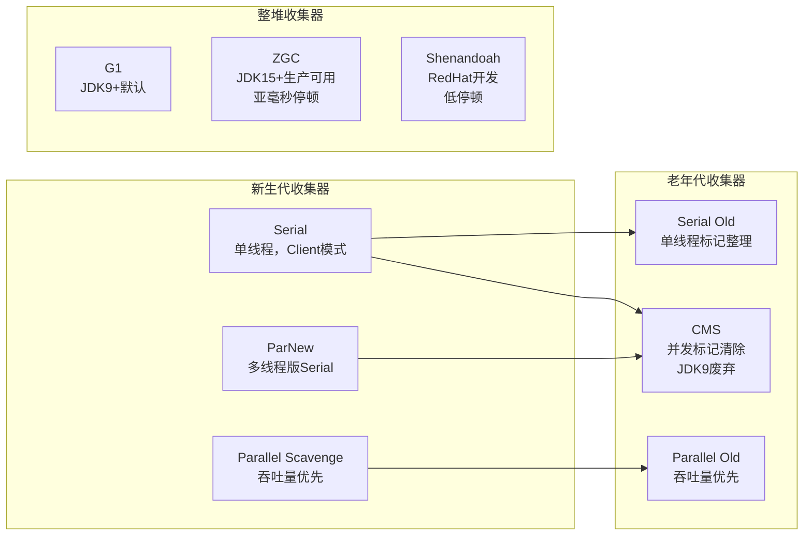

!!! note "全景图中几个收集器的现状说明"
    - **ParNew**：JDK 9 被标记为废弃（与 CMS 绑定），JDK 14 正式移除，新项目无需关注。
    - **Shenandoah**：由 Red Hat 主导、与 ZGC 定位相似的低停顿收集器，OpenJDK 12+ 提供，Oracle JDK 未包含，生产使用远少于 ZGC，本文不展开。
    - 下面按照「**先经典后现代**」的顺序展开：先讲 Serial / Parallel 这两条基础线（§6.2），再讲 CMS → G1 → ZGC 的演进（§6.3 ~ §6.5）。

### 6.2 Serial / Parallel 系列详解

这两个系列是 JVM 最经典、也最容易被教程跳过的收集器。但它们**绝不是只有历史意义**：

- **Parallel Scavenge + Parallel Old 是 JDK 8 的默认组合**，大量仍在线的 JDK 8 服务此刻正在使用它；
- **Serial / Serial Old 是所有其他收集器的"最终兜底"**：CMS 并发失败会退化到 Serial Old，G1 的 Full GC 退路同样偏向单线程整堆回收，Serverless 冷启动 / 小堆容器 / CLI 工具的默认选择也是 Serial。

#### 6.2.1 Serial / Serial Old

- **线程模型**：单线程 GC，GC 期间**全程 STW**。
- **算法**：新生代复制算法（Serial）；老年代标记-整理（Serial Old）。
- **启用参数**：`-XX:+UseSerialGC`（新生代 + 老年代一起启用）。
- **定位**：
    1. **Client 模式 / 小堆（< 100MB）** 的默认选择——单线程反而省去了线程间协调开销；
    2. **其他收集器 Full GC 的兜底**——CMS 的 Concurrent Mode Failure、G1 Full GC（早期版本）都会回退到 Serial Old 风格的单线程整堆回收，**一次 Full GC 常常就是几秒**；
    3. Serverless 冷启动、CI/CLI 短任务、单核容器等"堆小、生命周期短"的场景。


#### 6.2.2 ParNew

- **本质**：Serial 的多线程版本，**仅负责新生代**。
- **历史地位**：在很长一段时间里，ParNew 是**唯一能与 CMS 配合**的新生代收集器，因此成为 CMS 体系的"标配"。
- **现状**：
    - **JDK 9** 把 `ParNew + CMS 以外的所有 ParNew 组合`标记为废弃；
    - **JDK 14** 随 CMS 一并被移除。
- **新项目无需再关注 ParNew**，但维护老 JDK 8 服务时仍可能看到。

#### 6.2.3 Parallel Scavenge / Parallel Old（JDK 8 默认）

- **线程模型**：多线程 GC，**GC 期间全程 STW**（和 Serial 一样会 STW，只是"并行"干活，不是"并发"与业务线程同时跑）。
- **算法**：新生代复制算法（PS）；老年代标记-整理（PO）。
- **启用参数**：`-XX:+UseParallelGC`（JDK 8 为默认，JDK 9+ 需显式指定）。
- **设计目标**：**吞吐量优先**，即 `业务运行时间 / (业务运行时间 + GC 时间)` 最大化，不追求单次停顿短。
- **独有的自适应调节**：PS 提供一组"说目标、不说参数"的开关，让 JVM 自己调新生代大小、Survivor 比例、晋升阈值：

| 参数 | 含义 |
| :---- | :---- |
| `-XX:MaxGCPauseMillis=<N>` | 期望的最大停顿时间目标（软目标，JVM 尽量满足） |
| `-XX:GCTimeRatio=<N>` | 吞吐量目标，GC 时间占比 = 1/(1+N)，默认 99（即 1%） |
| `-XX:+UseAdaptiveSizePolicy` | 打开自适应调节，JVM 自动调整分代大小（默认开启） |

!!! tip "Parallel 的适用场景"
    **追求吞吐量、不关心单次停顿长短**的离线/后台任务：
    
    - 批处理作业（Spark/Flink 的部分场景）、ETL、数据导出
    - 定时计算、离线报表
    - CPU 核数多、堆不大（几 GB）、可接受秒级 STW 的场景
    
    反之，**在线接口服务**通常要的是"停顿可控"，此时应选 G1 / ZGC，而不是 Parallel。

#### 6.2.4 经典组合关系

§6.1 全景图中的几条连线，对应的就是历史上真正被广泛使用的组合：

| 新生代 → 老年代 | 组合特点 | 启用参数 |
| :---- | :---- | :---- |
| **Serial → Serial Old** | 单线程全 STW，小堆兜底 | `-XX:+UseSerialGC` |
| **ParNew → CMS** | 低停顿经典组合（已废弃） | `-XX:+UseConcMarkSweepGC` |
| **Parallel Scavenge → Parallel Old** | 吞吐量优先，JDK 8 默认 | `-XX:+UseParallelGC` |
| **Serial → CMS** | 历史可用组合，实际极少见 | - |

### 6.3 CMS 详解

CMS（Concurrent Mark Sweep）是第一个真正意义上的并发收集器，目标是**最短 STW 停顿时间**。它首次将「标记」与「清除」两个最耗时的阶段挪到业务线程并发执行，是从 Parallel 到 G1/ZGC 这条演进主线上的**关键跳板**。

#### 6.3.1 四阶段流程

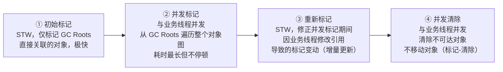

以典型的 4GB 老年代为例，一次完整的并发收集时间分布大致如下（具体数值受堆大小、对象图复杂度、业务写入速率影响）：

```txt
┌─────────────┬──────────────────────┬──────────────┬────────────────┐
│ Initial Mark│  Concurrent Mark     │   Remark     │ Concurrent     │
│   (STW)     │   (并发，不停业务)    │   (STW)      │  Sweep (并发)   │
├─────────────┼──────────────────────┼──────────────┼────────────────┤
│   ~5 ms     │    ~2 s              │   ~20 ms     │    ~1 s         │
│ 扫 GC Roots │  顺着 Roots 扫全堆    │ 只扫 dirty   │  清理白色对象    │
│             │  业务线程并发运行，   │  card（增量）│                 │
│             │  write barrier 记录  │              │                 │
│             │  引用变更           │              │                 │
└─────────────┴──────────────────────┴──────────────┴────────────────┘
```

**关键设计取舍**：

- **只在 ① 和 ③ STW**——这两步耗时极短（合计约 25 ms），而最耗时的 ② 和 ④ 都是并发完成。这正是 CMS 把整体停顿从秒级压到几十毫秒的根本原因。
- **Remark 阶段依赖写屏障 + Card Table**——并发标记期间业务线程的引用修改已被写屏障记为 dirty card，Remark 只需扫这些增量，而不是扫整堆（三色标记 / 写屏障的原理见 §5.2）。
- **采用 Mark-Sweep 而非 Mark-Compact**——整理（Compact）需要移动对象、更新所有引用，必须 STW 完成。CMS 为了换取并发清除的能力，**主动放弃了内存整理**——这也是下文「内存碎片」问题的根源。

#### 6.3.2 三大核心问题

!!! warning "CMS 的三个致命缺陷"
    **1. 浮动垃圾（Floating Garbage）**

    并发清除阶段业务线程产生的新垃圾，标记阶段已结束、不会被识别，只能等下一次 GC 回收。为此 CMS 必须**预留一部分老年代空间**给浮动垃圾使用，不能等到老年代 100% 满才触发 GC。

    **2. 内存碎片（Fragmentation）**

    Mark-Sweep 不移动对象，长期运行后老年代会碎片化。即使总剩余空间充足，也可能因为**找不到连续空间**而无法分配大对象，此时被迫触发 Full GC。

    **3. 并发模式失败（Concurrent Mode Failure）**

    如果在 CMS 并发执行期间老年代空间不够容纳新晋升对象（包括浮动垃圾），JVM 会**中断 CMS**、退化为 **Serial Old 单线程整堆 Mark-Compact**——一次停顿可能长达几秒到十几秒，是 CMS 最可怕的抖动来源。

    触发链路：

    ```txt
    老年代使用率达到阈值（默认 92%）
        ↓
    CMS 启动并发收集
        ↓
    并发期间业务线程持续往老年代晋升对象
        ↓
    老年代撑爆 → Concurrent Mode Failure
        ↓
    STW，退化为 Serial Old Full GC（单线程、整堆压缩）
        ↓
    停顿数秒
    ```

#### 6.3.3 关键参数

| 参数 | 作用 | 调优建议 |
| :---- | :---- | :---- |
| `-XX:+UseConcMarkSweepGC` | 启用 CMS（JDK 9 后已废弃） | - |
| `-XX:CMSInitiatingOccupancyFraction=N` | 老年代占用达到 N% 时触发 CMS | 默认 ~92%，建议调低到 70~80%，留出浮动垃圾空间 |
| `-XX:+UseCMSInitiatingOccupancyOnly` | 只按上面阈值触发，不让 JVM 自适应调整 | 建议开启，让 GC 触发时机可预测 |
| `-XX:+CMSScavengeBeforeRemark` | Remark 前先做一次 Young GC | 建议开启，能显著缩短 Remark 的 STW |
| `-XX:+CMSClassUnloadingEnabled` | CMS 并发收集期间卸载类 | 有动态加载类的场景需开启 |
| `-XX:CMSFullGCsBeforeCompaction=N` | 每 N 次 Full GC 后强制压缩一次老年代 | 碎片严重时设为 0~5 |

#### 6.3.4 历史意义与退役

CMS 在 2004 年（JDK 1.4.2）引入，统治了整个 Java 服务端低延迟场景十年之久。但它也留下了两个无法根治的硬伤：**内存碎片**和**并发模式失败**——这两者叠加意味着 CMS 的尾延迟永远不可控。

- **JDK 9**：`-XX:+UseConcMarkSweepGC` 被标记为**废弃**，启动时会打印 deprecation 警告。
- **JDK 14**：CMS 被**正式移除**，相关代码从 HotSpot 彻底删除。
- **精神遗产**：CMS 开创的"并发标记 + 写屏障 + 增量更新"范式被 G1 完整继承并改良（SATB 替代增量更新、Region + Compact 解决碎片问题），dirty card 机制更是一直沿用至今。**读懂 CMS 是读懂 G1 的前提**。

⚠️ **升级建议**：新项目直接用 G1（JDK 9+ 默认）或 ZGC（JDK 15+ 生产可用）；存量 CMS 项目在升级 JDK 时必须同步切换收集器，最简单的迁移路径是 `-XX:+UseG1GC`。

### 6.4 G1 详解

G1（Garbage First）是 JDK 9+ 的默认收集器，核心设计思想是**将堆划分为等大的 Region，优先回收垃圾最多的 Region**。

#### G1 的堆结构

```txt
G1 堆（示例：2GB 堆，Region 大小 = 2MB，共 1024 个 Region）

┌────┬────┬────┬────┬────┬────┬────┬────┐
│ E  │ E  │ S  │ O  │ O  │ H  │ H  │ E  │
├────┼────┼────┼────┼────┼────┼────┼────┤
│ O  │ E  │ O  │ E  │ S  │ O  │ E  │ O  │
├────┼────┼────┼────┼────┼────┼────┼────┤
│ E  │ O  │ O  │ E  │ O  │ E  │ O  │ E  │
└────┴────┴────┴────┴────┴────┴────┴────┘

E = Eden Region    S = Survivor Region
O = Old Region     H = Humongous Region（大对象，占连续多个 Region）
```

#### G1 的 GC 模式

| 模式 | 触发条件 | 回收范围 | STW |
| :---- | :---- | :---- | :---- |
| **Young GC** | Eden Region 用完 | 所有 Young Region | 是（短暂） |
| **Mixed GC** | 老年代占堆比例超过阈值（默认 45%） | 所有 Young + 部分 Old Region | 是（短暂） |
| **Full GC** | Mixed GC 来不及回收 / 大对象分配失败 | 整堆 | 是（长，应避免） |

#### G1 的 Remembered Set（RSet）

G1 的每个 Region 都维护一个 RSet，记录**哪些其他 Region 的对象引用了本 Region 中的对象**。这样 GC 时只需扫描 RSet，不必扫描整个堆，实现 Region 级别的独立回收。

```txt
Region A (Old)          Region B (Young)
┌──────────────┐        ┌──────────────┐
│  obj1 ──────────────→ │  obj2        │
│              │        │              │
│  RSet: {}    │        │  RSet: {A}   │ ← 记录 A 中有引用指向 B
└──────────────┘        └──────────────┘
```

!!! note "G1 RSet 的性能代价"
    **RSet 的代价**：每次引用关系变化都要更新 RSet（通过 Write Barrier 实现），这是 G1 内存占用较高的原因之一。
    
    💡 **优化建议**：在引用关系变化频繁的场景中，G1 的内存开销会相对较高，需要适当增大堆空间。

### 6.5 ZGC 详解（JDK 15+ 生产可用）

ZGC 的目标是**无论堆多大，STW 停顿时间都不超过 10ms**（实际通常 < 1ms）。

核心技术：**染色指针（Colored Pointer）**

ZGC 将 GC 信息直接编码在对象引用的指针中（利用 64 位地址的高位比特）：

```txt
64-bit Pointer Layout：
┌──────┬──────┬──────┬──────┬─────────────────────────────────┐
│ Bit63│ Bit62│ Bit61│ Bit60│        Lower 44 bits            │
│      │      │      │      │      Actual object address      │
├──────┼──────┼──────┼──────┼─────────────────────────────────┤
│Unused│Marked│Remapped│Finalizable│ Object address（max 16TB）│
└──────┴──────┴──────┴──────┴─────────────────────────────────┘
```

**ZGC 的并发阶段**（几乎全程与业务线程并发）：

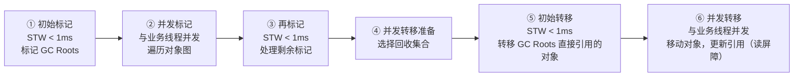

!!! note "ZGC 读屏障机制"
    **读屏障（Load Barrier）**：业务线程每次读取对象引用时，ZGC 插入一段检查代码，如果对象已被移动，自动修正指针。这是 ZGC 实现并发移动对象的关键。
    
    💡 **技术细节**：读屏障是 ZGC 实现亚毫秒停顿的核心技术，虽然带来少量性能开销，但实现了真正的并发对象移动。

#### 6.5.1 五大收集器横向对比

| 对比项 | Serial / Serial Old | Parallel Scavenge / Parallel Old | CMS | G1 | ZGC |
| :---- | :---- | :---- | :---- | :---- | :---- |
| **GC 线程** | 单线程 | 多线程（并行） | 多线程（并发） | 多线程（并发） | 多线程（几乎全并发） |
| **是否全程 STW** | 是 | 是 | 仅初始/重新标记 STW | 仅短暂 STW | 仅 < 1ms STW |
| **设计目标** | 简单、小堆 | **高吞吐** | 低停顿 | 可控停顿 + 吞吐平衡 | **极低停顿** |
| **最大停顿时间** | 长（全程 STW） | 长（全程 STW，但并行更短） | 数百ms（Full GC 可达秒级） | 可控（默认 200ms 目标） | < 10ms（通常 < 1ms） |
| **吞吐量** | 低 | **最高** | 高 | 中高 | 略低（读屏障开销） |
| **内存占用** | 极低 | 低 | 低 | 中（RSet 开销） | 中（染色指针） |
| **适用堆大小** | < 100MB | 100MB ~ 数 GB | < 6GB | 6GB ~ 数十GB | 数GB ~ 16TB |
| **JDK 版本** | 全版本可用 | JDK 8 默认，仍可用 | JDK 9 废弃 | JDK 9+ 默认 | JDK 15+ 生产可用 |
| **启用参数** | `-XX:+UseSerialGC` | `-XX:+UseParallelGC` | `-XX:+UseConcMarkSweepGC`（已废） | `-XX:+UseG1GC` | `-XX:+UseZGC` |
| **典型场景** | 小堆 / 冷启动 / 兜底 | 批处理 / 后台计算 / 吞吐敏感 | 历史遗留系统 | 通用场景 | 超大堆 / 低延迟场景 |

!!! tip "一句话选型指南"
    - **堆 < 100MB / Serverless / CLI 工具** → Serial
    - **JDK 8 + 离线批处理、ETL、不在乎停顿** → Parallel（JDK 8 默认，通常不用改）
    - **JDK 8 + 在线服务、追求停顿可控** → G1（JDK 8u40 起稳定，JDK 9+ 默认）
    - **JDK 11+ 且堆 > 16GB 或对 P99 停顿极敏感** → ZGC
    - **还在用 CMS** → 计划升级到 G1 或 ZGC

---

## 7. GC 调优实战

### 7.1 GC 日志分析

开启 GC 日志（JDK 9+ 统一日志格式）：

```bash
# JDK 9+
-Xlog:gc*:file=gc.log:time,uptime,level,tags:filecount=10,filesize=100m

# JDK 8
-XX:+PrintGCDetails -XX:+PrintGCDateStamps -Xloggc:gc.log
```

**读懂一条 G1 GC 日志**：

```txt
[2.345s][info][gc] GC(3) Pause Young (Normal) (G1 Evacuation Pause)
                   ↑ 第3次GC  ↑ Young GC    ↑ 原因：Eden 满了触发疏散
[2.345s][info][gc] GC(3) Heap before GC: 512M->256M(1024M)
                                          ↑ GC前  ↑ GC后  ↑ 堆总大小
[2.356s][info][gc] GC(3) Pause Young (Normal) 512M->256M(1024M) 11.234ms
                                                                  ↑ 停顿时间
```

### 7.2 常见 GC 问题诊断

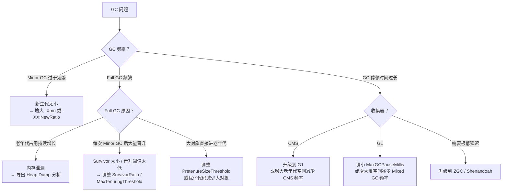

### 7.3 OOM 排查流程

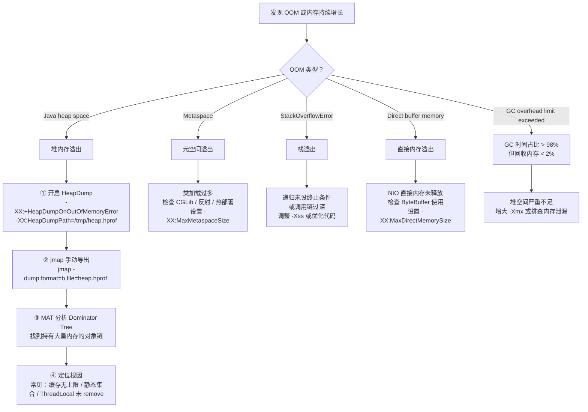

### 7.4 常用 JVM 参数速查

| 参数 | 含义 | 推荐值 |
| :---- | :---- | :---- |
| `-Xms` / `-Xmx` | 初始/最大堆大小 | 设为相同值，避免动态扩容 |
| `-Xmn` | 新生代大小 | 堆的 1/3 ~ 1/4 |
| `-Xss` | 每个线程栈大小 | 256k ~ 1m |
| `-XX:MetaspaceSize` | 元空间初始高水位（触发首次 Full GC 的阈值） | 根据应用测量，Spring Boot 微服务一般 256m 起步 |
| `-XX:MaxMetaspaceSize` | 元空间最大大小 | 根据应用测量，Spring Boot 微服务推荐 512m ~ 1g（防止无限增长，但不能过小导致 OOM） |
| `-XX:+UseG1GC` | 使用 G1 收集器 | JDK 8 需显式指定 |
| `-XX:MaxGCPauseMillis` | G1 停顿时间目标 | 100 ~ 200ms |
| `-XX:G1HeapRegionSize` | G1 Region 大小 | 1m ~ 32m（2的幂次） |
| `-XX:+UseZGC` | 使用 ZGC | JDK 15+ |
| `-XX:+HeapDumpOnOutOfMemoryError` | OOM 时导出堆快照 | 生产必开 |
| `-XX:+DisableExplicitGC` | 禁用 System.gc() | 生产推荐 |
| `-Xlog:gc*` | 开启 GC 日志（JDK9+） | 生产必开 |

---

## 8. 常见误区与边界

### ❌ 误区1：堆内存设置越大越好

堆越大，单次 Full GC 的停顿时间越长（需要扫描更多对象）。对于延迟敏感的服务：

- 使用 G1 + `-XX:MaxGCPauseMillis` 控制停顿
- 或使用 ZGC（JDK 15+）实现亚毫秒停顿，此时可以放心用大堆

### ❌ 误区2：`System.gc()` 能立即触发 GC

`System.gc()` 只是**建议** JVM 进行 GC，JVM 可以忽略。生产环境应禁用：`-XX:+DisableExplicitGC`。

### ❌ 误区3：对象一定在堆上分配

逃逸分析 + 标量替换可以让对象完全消失（字段变为局部变量），或分配在栈上。这是 JIT 的重要优化，减少 GC 压力。

### ❌ 误区4：老年代满了才触发 Full GC

以下任一条件都会触发 Full GC：

- 老年代空间不足
- 元空间空间不足
- `System.gc()` 被调用（未禁用时）
- CMS 并发模式失败
- Minor GC 晋升失败（老年代没有足够连续空间）

### 边界：永久代 vs 元空间

| | 永久代（JDK 7-） | 元空间（JDK 8+） |
| :---- | :---- | :---- |
| 位置 | JVM 堆内 | 本地内存（堆外） |
| 大小 | 固定（`-XX:MaxPermSize`） | 默认无上限 |
| GC | 随 Full GC 回收 | 随 Full GC 回收 |
| OOM 风险 | 高（大小固定） | 低（但需设上限） |

---

## 9. 设计原因：为什么这样设计？

### 为什么要分代收集？

**弱分代假说**：大多数对象朝生夕死。实测数据表明，超过 90% 的对象在第一次 Minor GC 时就被回收。

分代的收益：Minor GC 只扫描新生代（约占堆的 1/3），速度快（通常 < 10ms），频率高但代价小。如果不分代，每次 GC 都要扫描全堆，代价极高。

### 为什么 G1 要用 Region 替代连续分代？

传统分代（CMS）的老年代是一块连续内存，回收时必须处理整个老年代，停顿时间随堆增大而增大，不可控。

G1 将堆切成小块（Region），每次只选**垃圾最多的 Region** 回收（Garbage First 名字由来），在有限时间内回收最多垃圾，实现**可预测的停顿时间**。

### 为什么 ZGC 能做到亚毫秒停顿？

ZGC 通过**染色指针**将 GC 状态编码在指针高位，通过**读屏障**在业务线程读取引用时自动修正被移动对象的指针，使得对象转移（移动）可以与业务线程并发进行，不需要 STW。STW 阶段只剩标记 GC Roots 等极少量工作，因此停顿时间通常 < 1ms，与堆大小无关。

### 为什么 JDK 8 用元空间替换永久代？

1. 永久代大小固定，CGLib/热部署场景容易 OOM
2. Oracle 合并 HotSpot 和 JRockit，JRockit 没有永久代
3. 元空间使用本地内存，理论上只受物理内存限制，更灵活

---

## 10. 常见问题

> **问：JVM 内存分区有哪些？**

JVM 内存分**线程共享**和**线程私有**两类。线程共享的有：**堆**（存放对象实例，分新生代和老年代，是 GC 主要区域）和**元空间**（JDK 8 替代永久代，存类元数据，使用本地内存）。线程私有的有：**虚拟机栈**（每次方法调用创建栈帧，存局部变量和操作数栈）、**本地方法栈**（Native 方法）、**程序计数器**（唯一不会 OOM 的区域）。此外还有**直接内存**，NIO 使用，不受 JVM 堆管理。

> **问：G1 和 CMS 的区别？**

CMS 以**最短停顿时间**为目标，采用标记-清除算法，会产生内存碎片，适合中小堆。并发标记阶段与业务线程并发，但如果并发模式失败（老年代满了还没回收完），退化为 Serial Old Full GC，停顿极长。JDK 9 已废弃。

G1 是 JDK 9+ 默认收集器，将堆划分为多个等大的 Region，优先回收垃圾最多的 Region，通过 `-XX:MaxGCPauseMillis` 设置停顿时间目标，实现**可预测的停顿时间**。采用标记-整理，无内存碎片，适合大堆。

> **问：ZGC 为什么停顿时间这么短？**

ZGC 通过**染色指针**将 GC 状态编码在指针高位，通过**读屏障**在业务线程读取引用时自动修正被移动对象的指针，使得对象转移（移动）可以与业务线程并发进行，不需要 STW。STW 阶段只剩标记 GC Roots 等极少量工作，因此停顿时间通常 < 1ms，与堆大小无关。

> **问：如何排查 OOM 问题？**

首先看 OOM 类型：`Java heap space` 是堆溢出，`Metaspace` 是元空间溢出，`StackOverflowError` 是栈溢出，`Direct buffer memory` 是直接内存溢出。

对于堆溢出：① 开启 `-XX:+HeapDumpOnOutOfMemoryError` 自动导出堆快照；② 用 `jmap -dump` 手动导出；③ 用 MAT 分析 Dominator Tree，找到持有大量内存的对象；④ 结合代码定位根因（常见：缓存无上限、静态集合持有引用、ThreadLocal 未 remove）。

---

## 11. 现代JVM实践与前沿技术

### 11.1 容器化环境下的JVM调优

随着云原生和容器化技术的普及，JVM在容器环境中的表现需要特别关注。Docker和Kubernetes环境与传统物理机/虚拟机有显著差异：

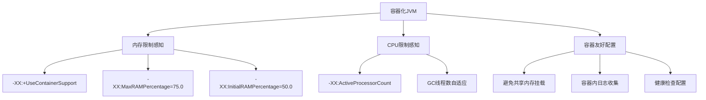

!!! tip "容器环境关键配置（最佳实践）"
    **容器环境关键配置**：
    
    ```bash
    # 必须开启容器支持
    -XX:+UseContainerSupport
    
    # 基于容器内存限制的比例配置（推荐）
    -XX:MaxRAMPercentage=75.0
    -XX:InitialRAMPercentage=50.0
    
    # 显式设置CPU数量
    -XX:ActiveProcessorCount=$(nproc)
    
    # G1收集器优化
    -XX:+UseG1GC
    -XX:MaxGCPauseMillis=200
    -XX:G1HeapRegionSize=4m
    ```
    
    💡 **说明**：这些配置确保JVM能正确感知容器资源限制，避免OOM Killer和资源争抢问题。

!!! warning "容器环境常见问题（风险提示）"
    **容器环境常见问题**：

    - ❌ JVM无法感知容器内存限制，导致OOM Killer杀死进程
    - ❌ GC线程数基于宿主机CPU核心数，造成资源争抢
    - ❌ 缺乏容器内日志收集，排查困难
    - ❌ 健康检查配置不当，导致频繁重启
    
    ⚠️ **解决方案**：务必配置 `-XX:+UseContainerSupport` 和 `-XX:MaxRAMPercentage` 等参数。

### 11.2 Project Loom与虚拟线程（JDK 21+）

Project Loom引入了虚拟线程（Virtual Threads），彻底改变了Java的并发模型：

```java
// 传统线程（1:1线程模型） - 每个OS线程对应一个Java线程
ExecutorService executor = Executors.newFixedThreadPool(200); // 200个OS线程

// 虚拟线程（M:N线程模型） - 百万级轻量级线程
ExecutorService virtualExecutor = Executors.newVirtualThreadPerTaskExecutor();
// 每个任务一个虚拟线程，由JVM调度到少量载体线程上
```

**虚拟线程的GC影响**：

- 创建成本极低（约几百字节 vs 传统线程1MB栈）
- 支持百万级并发线程，但要注意同步操作会pin住载体线程
- 减少线程池的使用，简化并发编程模型

!!! recommendation "Project Loom 迁移建议"
    **Project Loom 迁移建议**：

    - ✅ **I/O密集型应用**：积极采用虚拟线程，显著提升吞吐量
    - ⚖️ **CPU密集型应用**：评估收益，可能仍需传统线程池
    - 🔄 **现有代码**：逐步替换，注意同步块和ThreadLocal的使用
    
    🚀 **技术优势**：虚拟线程支持百万级并发，创建成本极低，显著减少内存占用。

### 11.3 现代性能分析工具链

| 工具类别 | 工具名称 | 适用场景 | 特点 |
|---------|---------|---------|------|
| **实时监控** | `jstat`, `vmstat`, `top` | 实时性能指标 | 轻量级，低开销 |
| **堆分析** | MAT, `jhat`, VisualVM | 内存泄漏分析 | 离线分析，功能强大 |
| **CPU分析** | async-profiler, JProfiler | 热点方法定位 | 精准定位性能瓶颈 |
| **GC分析** | GCViewer, gceasy | GC日志可视化 | 趋势分析，调优指导 |
| **APM** | SkyWalking, Pinpoint | 分布式追踪 | 全链路监控，生产必备 |
| **现代工具** | JFR（Java Flight Recorder） | 综合性能分析 | 低开销，生产环境友好 |

**JFR使用示例**：

```bash
# 启动时开启JFR
java -XX:StartFlightRecording=duration=60s,filename=recording.jfr 

# 运行时动态开启
jcmd <pid> JFR.start duration=60s filename=recording.jfr

# 分析记录
jfr print recording.jfr --events GCPhasePause
```

### 11.4 云原生时代的最佳实践

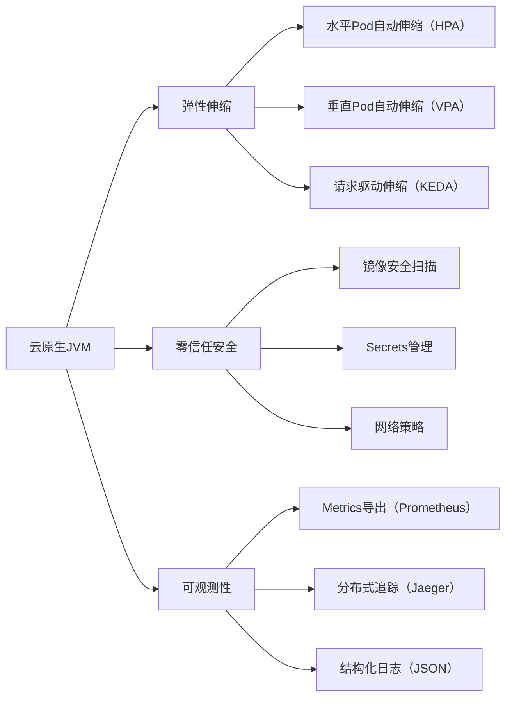

!!! tip "云原生配置清单："
    ```yaml
    # 资源限制
    resources:
    limits:
        memory: "2Gi"
        cpu: "2"
    requests:
        memory: "1Gi" 
        cpu: "1"

    # 健康检查
    livenessProbe:
    httpGet:
        path: /actuator/health/liveness
        port: 8080
    initialDelaySeconds: 60
    periodSeconds: 10

    readinessProbe:
    httpGet:
        path: /actuator/health/readiness
        port: 8080
    initialDelaySeconds: 30
    periodSeconds: 5
    ```

### 11.5 JVM内部机制深度解析

#### JIT编译优化层级

- **分层编译**（-XX:+TieredCompilation）：C1（客户端编译器）快速启动，C2（服务端编译器）深度优化
- **方法内联优化策略**：基于方法大小、调用频率的热点方法内联
- **逃逸分析的局限性**：复杂对象图分析成本高，实际优化有限
- **锁消除与锁粗化**：基于逃逸分析的锁优化，减少同步开销

#### 内存屏障与可见性

- **内存模型与happens-before**：JMM保证的内存可见性规则
- **volatile的实现原理**：内存屏障插入，防止指令重排序
- **final字段的内存语义**：构造函数完成后保证可见性

### 11.6 生产环境故障案例库

#### 案例1：元空间泄漏

```bash
# 症状：Metaspace持续增长，频繁Full GC
# 根因：CGLib动态代理类未卸载
# 解决方案：
-XX:MaxMetaspaceSize=512m
# 代码层面控制代理类缓存大小
```

#### 案例2：线程池不当使用

```java
// 错误：使用无界队列
ExecutorService executor = Executors.newFixedThreadPool(100);

// 正确：使用有界队列+拒绝策略
ThreadPoolExecutor executor = new ThreadPoolExecutor(
    10, 100, 60L, TimeUnit.SECONDS,
    new ArrayBlockingQueue<>(1000),
    new ThreadPoolExecutor.CallerRunsPolicy()
);
```

#### 案例3：堆外内存泄漏

```java
// 症状：物理内存持续增长，但堆内存正常
// 根因：DirectByteBuffer未释放或Netty池化内存泄漏
// 排查：NativeMemoryTracking（-XX:NativeMemoryTracking=summary）

// 监控命令
jcmd <pid> VM.native_memory summary
jcmd <pid> VM.native_memory detail
```

!!! warning "生产环境红线（必须遵守）"
    **生产环境红线**：
    
    - ❌ **禁止使用无界队列**（ArrayBlockingQueue无界构造函数）
    - ❌ **禁止静态集合缓存无上限控制**
    - ❌ **禁止ThreadLocal使用后不remove**（尤其线程池场景）
    - ✅ **必须设置元空间上限**（-XX:MaxMetaspaceSize）
    - ✅ **必须开启GC日志和OOM自动dump**
    
    ⚠️ **违反这些规则可能导致系统崩溃或严重性能问题**。

### 11.7 未来趋势与展望

#### 价值堆（Generational ZGC）

JDK 21+引入分代ZGC，结合分代收集的理论优势和ZGC的低延迟特性：

- 年轻代使用复制算法，快速回收短命对象
- 老年代使用ZGC的染色指针和并发转移
- 目标：更低延迟，更高吞吐量

#### 弹性元空间（Elastic Metaspace）

JDK 21+优化元空间内存管理：

- 更高效的内存分配和回收
- 减少内存碎片
- 更好的性能表现

#### 统一日志系统完善

JDK 9引入的统一日志系统（Xlog）持续增强：

- 更细粒度的日志控制
- 更好的性能诊断能力
- 与APM工具深度集成

!!! recommendation "技术选型建议（最佳实践）"
    **技术选型建议**：

    - 🆕 **新项目**：JDK 21+ + ZGC + 虚拟线程
    - 🔄 **现有系统**：JDK 11/17 + G1GC（平稳过渡）
    - 🚀 **超大堆/低延迟**：JDK 17+ + ZGC（堆>32GB）
    - 🐳 **容器环境**：务必配置UseContainerSupport和RAMPercentage参数
    
    💡 **说明**：根据应用场景和JDK版本选择合适的收集器组合，平衡吞吐量、延迟和内存开销。
