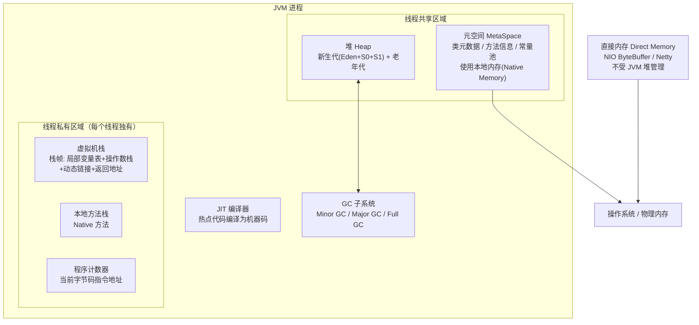
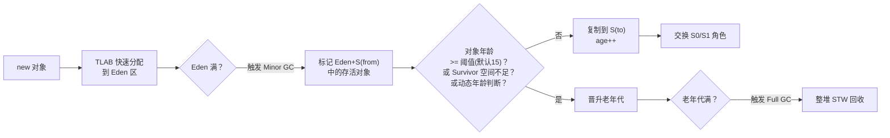
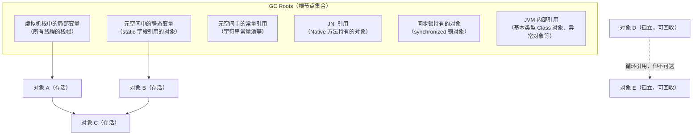
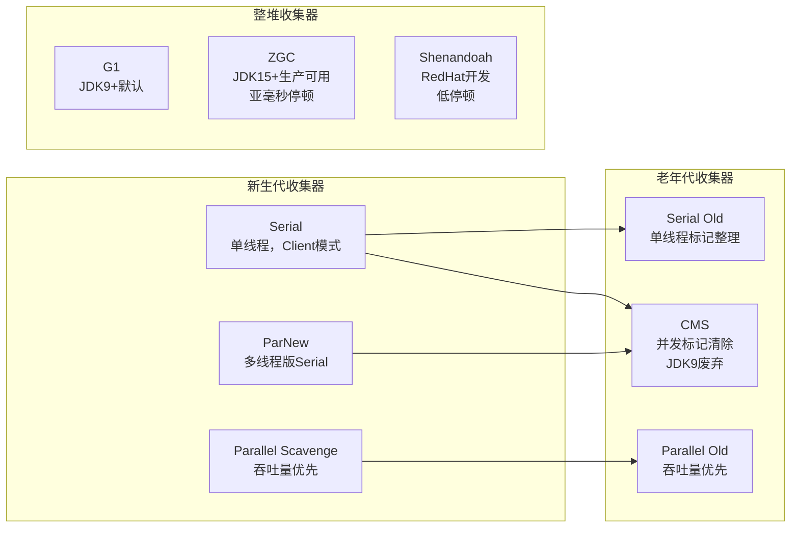
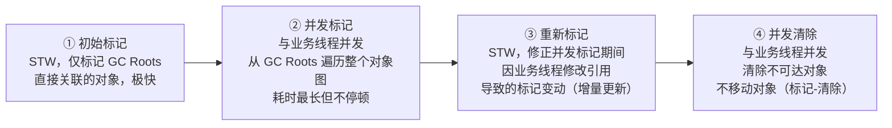
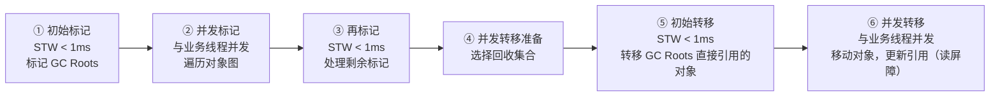
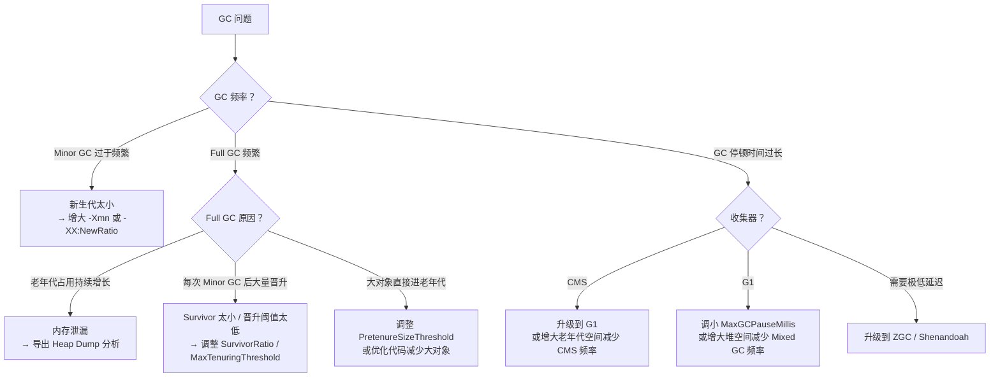
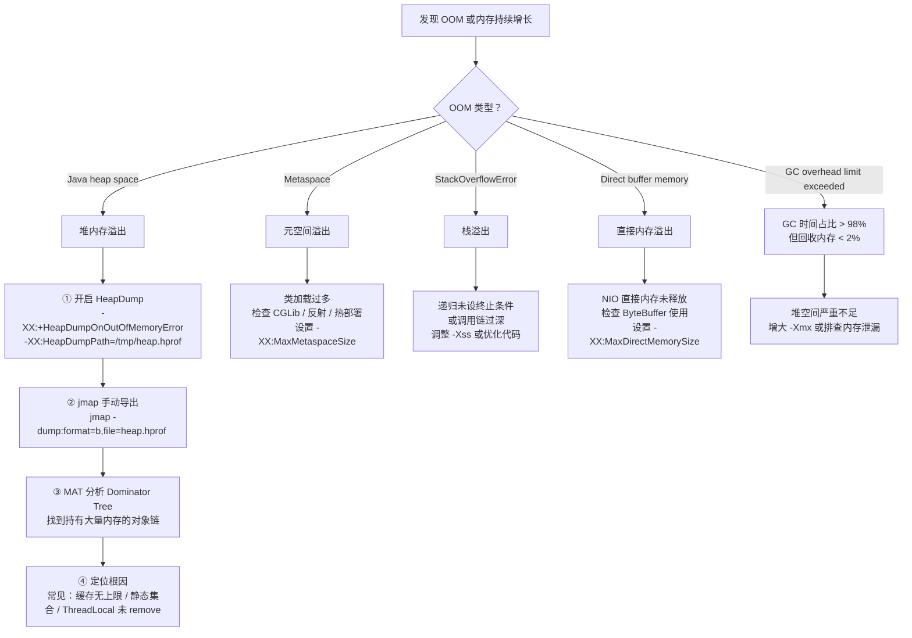
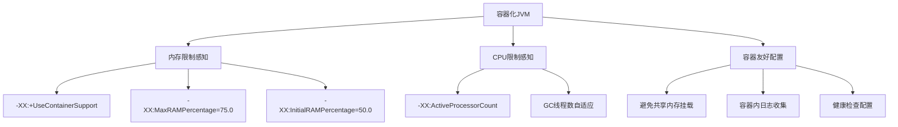
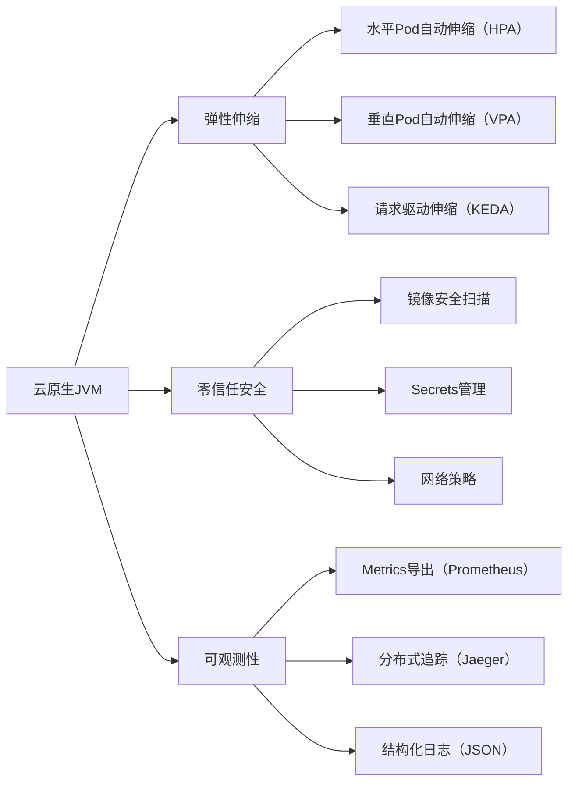

# JVM 内存结构与 GC

---

## 1. 为什么要深入理解 JVM？

Java 程序运行在 JVM 之上，JVM 屏蔽了底层操作系统的差异，但也带来了一层"黑盒"。当系统出现以下问题时，不理解 JVM 就无从下手：

| 现象 | 根因 | 需要的 JVM 知识 |
| :---- | :---- | :---- |
| `OutOfMemoryError` 崩溃 | 内存泄漏 / 堆太小 | 内存分区 + OOM 排查 |
| 每隔几分钟停顿几秒 | 频繁 Full GC | GC 算法 + 收集器选型 |
| CPU 100% 但业务量不高 | GC 线程占满 CPU | GC 日志分析 + 调优 |
| 响应时间 P99 抖动 | Stop-The-World 停顿 | 低延迟收集器（ZGC/G1） |
| 类加载后内存持续增长 | 元空间泄漏 | 元空间 + 类加载机制 |

---

## 2. JVM 整体架构

在深入各个内存区域之前，先建立整体视图：



---

## 3. 内存分区详解

### 3.1 堆（Heap）

堆是 JVM 中最大的内存区域，**所有线程共享**，几乎所有对象实例都在这里分配（逃逸分析例外，见 §5.3）。

#### 堆的内部结构

```
┌─────────────────────────────────────────────────────────────┐
│                         Heap                                │
│  ┌──────────────────────────────┐  ┌──────────────────────┐ │
│  │         Young Generation     │  │    Old Generation    │ │
│  │  ┌──────────┬────┬────┐      │  │                      │ │
│  │  │  Eden    │ S0 │ S1 │      │  │  Long-lived objects  │ │
│  │  │  (80%)   │(10%)│(10%)│    │  │  Large objects direct│ │
│  │  └──────────┴────┴────┘      │  │                      │ │
│  └──────────────────────────────┘  └──────────────────────┘ │
│         Eden:S0:S1 = 8:1:1（default）                        │
└─────────────────────────────────────────────────────────────┘
```

**为什么要有 Survivor 区？**

如果只有 Eden 和 Old，Minor GC 后存活对象直接进老年代，老年代会很快被短命对象填满，触发 Full GC。Survivor 区的作用是**缓冲**：让对象在新生代多"熬"几轮 GC，确认它真的是长期存活对象，再晋升老年代，减少 Full GC 频率。

**为什么 Survivor 要有两个（S0 和 S1）？**

复制算法需要一块空闲空间作为目标区域。S0 和 S1 交替使用：每次 Minor GC，将 Eden + 当前 Survivor 中的存活对象复制到另一个 Survivor，然后清空 Eden 和原 Survivor。始终保持一个 Survivor 是空的。

#### 对象晋升流程



**动态年龄判断**：如果 Survivor 中相同年龄的对象总大小超过 Survivor 空间的 50%，则年龄 ≥ 该值的对象直接晋升老年代，不必等到 15 岁。这是为了防止 Survivor 空间被占满。

#### TLAB（Thread-Local Allocation Buffer）

堆是线程共享的，如果每次分配对象都要加锁，性能极差。JVM 的解决方案是 **TLAB**：

- 每个线程在 Eden 区预先申请一小块私有内存（默认约 Eden 的 1%）
- 线程内分配对象时直接在 TLAB 上 bump pointer，无需加锁
- TLAB 用完后再申请新的，此时才需要同步

```txt
Eden Area
┌──────────────────────────────────────────────────┐
│  Thread-1 TLAB  │  Thread-2 TLAB  │  Shared Area │
│  [obj][obj][  ] │  [obj][      ]  │              │
└──────────────────────────────────────────────────┘
                                    ↑ Large objects allocated in shared area
```

### 3.2 虚拟机栈（VM Stack）

每个线程独有，线程创建时分配，线程结束时销毁。每次方法调用压入一个**栈帧（Stack Frame）**，方法返回时弹出。

#### 栈帧的内部结构

```txt
┌─────────────────────────────────────────┐
│              Stack Frame                │
│                                         │
│  Local Variable Table                   │
│  ┌────┬────┬────┬────┬────┐             │
│  │ 0  │ 1  │ 2  │ 3  │... │  slot array │
│  │this│ a  │ b  │long│    │  (long/double use 2 slots) │
│  └────┴────┴────┴────┴────┘             │
│                                         │
│  Operand Stack                          │
│  ┌────┐                                 │
│  │    │  ← Workspace for bytecode       │
│  │    │                                 │
│  └────┘                                 │
│                                         │
│  Dynamic Linking                        │
│  → Reference to method in runtime       │
│    constant pool                        │
│                                         │
│  Return Address                         │
│  → Caller's PC value, resume execution  │
│    after method ends                    │
└─────────────────────────────────────────┘
```

**`StackOverflowError` vs `OutOfMemoryError`**：

- 递归调用过深 → 栈帧不断压栈 → 超过栈深度限制 → `StackOverflowError`
- 线程数量过多 → 每个线程都要分配栈空间 → 内存耗尽 → `OutOfMemoryError`（创建线程时）

### 3.3 元空间（MetaSpace）

JDK 8 用元空间替换了永久代（PermGen），存储**类的元数据**：

| 存储内容 | 说明 |
| :---- | :---- |
| 类的结构信息 | 字段、方法、接口、父类等 |
| 方法字节码 | 编译后的字节码指令 |
| 运行时常量池 | 字面量、符号引用 |
| JIT 编译后的代码 | 热点方法的机器码缓存 |

!!! warning "元空间关键区别"
    **关键区别**：元空间使用**本地内存（Native Memory）**，不在 JVM 堆内，默认无上限（受物理内存限制）。
    
    ⚠️ **生产环境必须设置** `-XX:MaxMetaspaceSize` 防止无限增长，否则可能导致系统内存耗尽。

!!! warning "元空间泄漏风险"
    **元空间泄漏的典型场景**：
    
    - CGLib 动态代理：每次代理都生成新类，类卸载条件苛刻
    - JSP 热部署：每次修改 JSP 都重新生成类
    - OSGI 框架：频繁加载/卸载 Bundle
    
    ⚠️ 这些场景容易导致元空间持续增长，必须设置 `-XX:MaxMetaspaceSize` 进行限制。

### 3.4 程序计数器（PC Register）

- 每个线程独有，记录当前线程正在执行的字节码指令地址
- 执行 Native 方法时值为 undefined
- **唯一不会发生 OOM 的内存区域**（大小固定，只存一个地址）
- CPU 多线程切换时，靠 PC 恢复执行位置

### 3.5 直接内存（Direct Memory）

不属于 JVM 规范定义的内存区域，但频繁使用：

```java
// NIO 直接内存分配
ByteBuffer buffer = ByteBuffer.allocateDirect(1024 * 1024); // 1MB 直接内存

// 底层调用 unsafe.allocateMemory()，绕过 JVM 堆，直接向 OS 申请内存
// 好处：避免 Java 堆和 Native 堆之间的数据拷贝（零拷贝）
// 坏处：不受 GC 管理，需要手动释放（或依赖 Cleaner 机制）
```

**为什么 Netty 大量使用直接内存？**

传统 IO：`磁盘 → 内核缓冲区 → JVM 堆 → 网络`（两次拷贝）

NIO 直接内存：`磁盘 → 直接内存 → 网络`（一次拷贝，零拷贝）

---

## 4. 对象的内存布局

理解对象在堆中的实际存储结构，是理解 GC、锁优化、内存占用的基础。

### 4.1 对象头（Object Header）

```txt
┌──────────────────────────────────────────────────────────┐
│                    Object Header                         │
│                                                          │
│  ┌──────────────────────────────────────────────────┐    │
│  │  Mark Word（8 bytes, 64-bit JVM）                 │    │
│  │  Stores: hashCode / GC age / lock state /         │   │
│  │         biased lock thread ID                     │   │
│  └──────────────────────────────────────────────────┘   │
│  ┌──────────────────────────────────────────────────┐   │
│  │  Klass Pointer（4 bytes with pointer compression; │   │
│  │                8 bytes otherwise）                │   │
│  │  Points to class metadata in method area          │   │
│  └──────────────────────────────────────────────────┘   │
│  ┌──────────────────────────────────────────────────┐   │
│  │  Array length（array objects only, 4 bytes）      │   │
│  └──────────────────────────────────────────────────┘   │
└──────────────────────────────────────────────────────────┘
```

**Mark Word 的多态复用**（64位 JVM）：

| 锁状态 | 存储内容 | 标志位 |
| :---- | :---- | :---- |
| 无锁 | hashCode(31bit) + GC年龄(4bit) + 偏向锁标志(1bit) | 01 |
| 偏向锁 | 线程ID(54bit) + epoch(2bit) + GC年龄(4bit) | 01 |
| 轻量级锁 | 指向栈中锁记录的指针 | 00 |
| 重量级锁 | 指向 Monitor 对象的指针 | 10 |
| GC 标记 | 空（GC 使用） | 11 |

### 4.2 实例数据与对齐填充

```
┌─────────────────────────────────────┐
│  Object Header（12 or 16 bytes）      │
├─────────────────────────────────────┤
│  Instance Data（field values）        │
│  JVM reorders fields to reduce memory │
│  Order：long/double > int/float >     │
│        short/char > byte/boolean >  │
│        reference                     │
├─────────────────────────────────────┤
│  Padding                            │
│  Align to multiple of 8 bytes       │
└─────────────────────────────────────┘
```

**计算一个对象的实际大小**：

```java
// 示例：一个只有 int 字段的对象
class Foo {
    int x; // 4 字节
}
// 对象头：12 字节（开启指针压缩）
// 实例数据：4 字节（int x）
// 对齐填充：0 字节（12+4=16，已是8的倍数）
// 总计：16 字节

// 可用 JOL（Java Object Layout）工具精确查看
// System.out.println(ClassLayout.parseInstance(new Foo()).toPrintable());
```

---

## 5. GC 核心机制

### 5.1 可达性分析与 GC Roots

JVM 不使用引用计数（无法解决循环引用），而是**可达性分析**：从 GC Roots 出发，能被引用链到达的对象就是存活的，否则可以回收。

**GC Roots 的完整范围**：



### 5.2 三色标记算法（理解并发 GC 的基础）

并发 GC（CMS、G1、ZGC）在标记阶段与业务线程并发执行，需要解决**标记过程中对象引用关系变化**的问题。三色标记是核心算法：

- **白色**：未被访问，GC 结束后仍为白色 → 可回收
- **灰色**：已被访问，但其引用的对象还未全部扫描完
- **黑色**：已被访问，且其所有引用都已扫描完 → 存活，不会再被扫描

```txt
初始状态：所有对象白色
    ↓
从 GC Roots 出发，将直接引用的对象标记为灰色
    ↓
取出一个灰色对象，扫描其所有引用：
  - 将未访问的引用对象标记为灰色
  - 将当前对象标记为黑色
    ↓
重复直到没有灰色对象
    ↓
剩余白色对象 = 垃圾
```

**并发标记的问题：漏标**

业务线程在 GC 标记过程中修改了引用关系，可能导致**存活对象被错误回收**（漏标）：

```txt
初始：A(黑) → B(灰) → C(白)
并发执行时：
  业务线程：A.ref = C（黑色 A 新增对 C 的引用）
  业务线程：B.ref = null（灰色 B 删除对 C 的引用）
结果：C 变成白色（无灰色节点引用它），但 A 是黑色不会再扫描
  → C 被错误回收！
```

**解决方案**：

| 方案 | 原理 | 使用者 |
| :---- | :---- | :---- |
| **增量更新（Incremental Update）** | 黑色对象新增引用时，将该黑色对象重新标记为灰色，重新扫描 | CMS |
| **原始快照（SATB）** | 灰色对象删除引用时，将被删除的引用记录下来，GC 结束前重新扫描 | G1、ZGC |

### 5.3 三种 GC 算法

```txt
Mark-Sweep Algorithm：
┌──────────────────────────────────────────┐
│ [Alive] [Garbage] [Alive] [Garbage] [Alive] [Garbage] │  After marking
│ [Alive] [       ] [Alive] [       ] [Alive] [       ] │  After sweeping
│ ← Generates memory fragmentation, large objects cannot allocate → │
└──────────────────────────────────────────┘

Mark-Compact Algorithm：
┌──────────────────────────────────────────┐
│ [Alive] [Garbage] [Alive] [Garbage] [Alive] [Garbage] │  After marking
│ [Alive] [Alive] [Alive] [           Free Space     ] │  After compacting
│ ← No fragmentation, but moving objects requires updating all references → │
└──────────────────────────────────────────┘

Copying Algorithm：
┌──────────────────────┬──────────────────────┐
│ From: [Alive][Garbage][Alive][Garbage] │ To: [Empty] │  Before GC
│ From: [Cleared             ]    │ To: [Alive][Alive] │  After GC
│ ← No fragmentation, fast, but 50% space utilization → │
└──────────────────────────────────────────────────┘
```

### 5.4 逃逸分析与栈上分配

JDK 6+ 引入逃逸分析，JIT 编译器判断对象是否会"逃逸"出方法：

```java
// 未逃逸：对象不会被外部引用
public int sum() {
    Point p = new Point(1, 2); // p 不会逃逸
    return p.x + p.y;
    // JIT 可能：1. 栈上分配（方法结束自动回收，无需 GC）
    //           2. 标量替换（直接用 int x=1, int y=2 替代对象）
}

// 已逃逸：对象被外部持有
public Point create() {
    return new Point(1, 2); // 逃逸到调用者，必须在堆上分配
}
```

**标量替换**是逃逸分析最重要的优化：将对象的字段拆散为独立的局部变量，完全消除对象分配，减少 GC 压力。

---

## 6. GC 收集器演进

### 6.1 收集器全景



### 6.2 CMS 详解

CMS（Concurrent Mark Sweep）是第一个真正意义上的并发收集器，目标是**最短 STW 停顿时间**。



!!! warning "CMS 收集器核心问题"
    **CMS 的核心问题**：
    
    1. **浮动垃圾**：并发清除阶段业务线程产生的新垃圾，本次 GC 无法回收，只能等下次
    2. **内存碎片**：标记-清除不整理内存，长期运行后大对象无法分配，触发 Full GC（Serial Old 兜底，停顿极长）
    3. **并发模式失败（Concurrent Mode Failure）**：老年代空间不足以容纳浮动垃圾，CMS 被迫中断，退化为 Serial Old 进行 Full GC
    
    ⚠️ **建议**：JDK 9+ 已废弃 CMS，推荐升级到 G1 或 ZGC 收集器。

### 6.3 G1 详解

G1（Garbage First）是 JDK 9+ 的默认收集器，核心设计思想是**将堆划分为等大的 Region，优先回收垃圾最多的 Region**。

#### G1 的堆结构

```txt
G1 堆（示例：2GB 堆，Region 大小 = 2MB，共 1024 个 Region）

┌────┬────┬────┬────┬────┬────┬────┬────┐
│ E  │ E  │ S  │ O  │ O  │ H  │ H  │ E  │
├────┼────┼────┼────┼────┼────┼────┼────┤
│ O  │ E  │ O  │ E  │ S  │ O  │ E  │ O  │
├────┼────┼────┼────┼────┼────┼────┼────┤
│ E  │ O  │ O  │ E  │ O  │ E  │ O  │ E  │
└────┴────┴────┴────┴────┴────┴────┴────┘

E = Eden Region    S = Survivor Region
O = Old Region     H = Humongous Region（大对象，占连续多个 Region）
```

#### G1 的 GC 模式

| 模式 | 触发条件 | 回收范围 | STW |
| :---- | :---- | :---- | :---- |
| **Young GC** | Eden Region 用完 | 所有 Young Region | 是（短暂） |
| **Mixed GC** | 老年代占堆比例超过阈值（默认 45%） | 所有 Young + 部分 Old Region | 是（短暂） |
| **Full GC** | Mixed GC 来不及回收 / 大对象分配失败 | 整堆 | 是（长，应避免） |

#### G1 的 Remembered Set（RSet）

G1 的每个 Region 都维护一个 RSet，记录**哪些其他 Region 的对象引用了本 Region 中的对象**。这样 GC 时只需扫描 RSet，不必扫描整个堆，实现 Region 级别的独立回收。

```txt
Region A (Old)          Region B (Young)
┌──────────────┐        ┌──────────────┐
│  obj1 ──────────────→ │  obj2        │
│              │        │              │
│  RSet: {}    │        │  RSet: {A}   │ ← 记录 A 中有引用指向 B
└──────────────┘        └──────────────┘
```

!!! note "G1 RSet 的性能代价"
    **RSet 的代价**：每次引用关系变化都要更新 RSet（通过 Write Barrier 实现），这是 G1 内存占用较高的原因之一。
    
    💡 **优化建议**：在引用关系变化频繁的场景中，G1 的内存开销会相对较高，需要适当增大堆空间。

### 6.4 ZGC 详解（JDK 15+ 生产可用）

ZGC 的目标是**无论堆多大，STW 停顿时间都不超过 10ms**（实际通常 < 1ms）。

核心技术：**染色指针（Colored Pointer）**

ZGC 将 GC 信息直接编码在对象引用的指针中（利用 64 位地址的高位比特）：

```txt
64-bit Pointer Layout：
┌──────┬──────┬──────┬──────┬─────────────────────────────────┐
│ Bit63│ Bit62│ Bit61│ Bit60│        Lower 44 bits            │
│      │      │      │      │      Actual object address      │
├──────┼──────┼──────┼──────┼─────────────────────────────────┤
│Unused│Marked│Remapped│Finalizable│ Object address（max 16TB）│
└──────┴──────┴──────┴──────┴─────────────────────────────────┘
```

**ZGC 的并发阶段**（几乎全程与业务线程并发）：



!!! note "ZGC 读屏障机制"
    **读屏障（Load Barrier）**：业务线程每次读取对象引用时，ZGC 插入一段检查代码，如果对象已被移动，自动修正指针。这是 ZGC 实现并发移动对象的关键。
    
    💡 **技术细节**：读屏障是 ZGC 实现亚毫秒停顿的核心技术，虽然带来少量性能开销，但实现了真正的并发对象移动。

| 对比项 | CMS | G1 | ZGC |
| :---- | :---- | :---- | :---- |
| **最大停顿时间** | 数百ms（Full GC 可达秒级） | 可控（默认 200ms 目标） | < 10ms（通常 < 1ms） |
| **吞吐量** | 高 | 中高 | 略低（读屏障开销） |
| **内存占用** | 低 | 中（RSet 开销） | 中（染色指针） |
| **适用堆大小** | < 6GB | 6GB ~ 数十GB | 数GB ~ 16TB |
| **JDK 版本** | JDK 9 废弃 | JDK 9+ 默认 | JDK 15+ 生产可用 |
| **适用场景** | 历史遗留系统 | 通用场景 | 超大堆 / 低延迟场景 |

---

## 7. GC 调优实战

### 7.1 GC 日志分析

开启 GC 日志（JDK 9+ 统一日志格式）：

```bash
# JDK 9+
-Xlog:gc*:file=gc.log:time,uptime,level,tags:filecount=10,filesize=100m

# JDK 8
-XX:+PrintGCDetails -XX:+PrintGCDateStamps -Xloggc:gc.log
```

**读懂一条 G1 GC 日志**：

```txt
[2.345s][info][gc] GC(3) Pause Young (Normal) (G1 Evacuation Pause)
                   ↑ 第3次GC  ↑ Young GC    ↑ 原因：Eden 满了触发疏散
[2.345s][info][gc] GC(3) Heap before GC: 512M->256M(1024M)
                                          ↑ GC前  ↑ GC后  ↑ 堆总大小
[2.356s][info][gc] GC(3) Pause Young (Normal) 512M->256M(1024M) 11.234ms
                                                                  ↑ 停顿时间
```

### 7.2 常见 GC 问题诊断



### 7.3 OOM 排查流程



### 7.4 常用 JVM 参数速查

| 参数 | 含义 | 推荐值 |
| :---- | :---- | :---- |
| `-Xms` / `-Xmx` | 初始/最大堆大小 | 设为相同值，避免动态扩容 |
| `-Xmn` | 新生代大小 | 堆的 1/3 ~ 1/4 |
| `-Xss` | 每个线程栈大小 | 256k ~ 1m |
| `-XX:MetaspaceSize` | 元空间初始大小 | 256m |
| `-XX:MaxMetaspaceSize` | 元空间最大大小 | 512m（防止无限增长） |
| `-XX:+UseG1GC` | 使用 G1 收集器 | JDK 8 需显式指定 |
| `-XX:MaxGCPauseMillis` | G1 停顿时间目标 | 100 ~ 200ms |
| `-XX:G1HeapRegionSize` | G1 Region 大小 | 1m ~ 32m（2的幂次） |
| `-XX:+UseZGC` | 使用 ZGC | JDK 15+ |
| `-XX:+HeapDumpOnOutOfMemoryError` | OOM 时导出堆快照 | 生产必开 |
| `-XX:+DisableExplicitGC` | 禁用 System.gc() | 生产推荐 |
| `-Xlog:gc*` | 开启 GC 日志（JDK9+） | 生产必开 |

---

## 8. 常见误区与边界

### ❌ 误区1：堆内存设置越大越好

堆越大，单次 Full GC 的停顿时间越长（需要扫描更多对象）。对于延迟敏感的服务：

- 使用 G1 + `-XX:MaxGCPauseMillis` 控制停顿
- 或使用 ZGC（JDK 15+）实现亚毫秒停顿，此时可以放心用大堆

### ❌ 误区2：`System.gc()` 能立即触发 GC

`System.gc()` 只是**建议** JVM 进行 GC，JVM 可以忽略。生产环境应禁用：`-XX:+DisableExplicitGC`。

### ❌ 误区3：对象一定在堆上分配

逃逸分析 + 标量替换可以让对象完全消失（字段变为局部变量），或分配在栈上。这是 JIT 的重要优化，减少 GC 压力。

### ❌ 误区4：老年代满了才触发 Full GC

以下任一条件都会触发 Full GC：

- 老年代空间不足
- 元空间空间不足
- `System.gc()` 被调用（未禁用时）
- CMS 并发模式失败
- Minor GC 晋升失败（老年代没有足够连续空间）

### 边界：永久代 vs 元空间

| | 永久代（JDK 7-） | 元空间（JDK 8+） |
| :---- | :---- | :---- |
| 位置 | JVM 堆内 | 本地内存（堆外） |
| 大小 | 固定（`-XX:MaxPermSize`） | 默认无上限 |
| GC | 随 Full GC 回收 | 随 Full GC 回收 |
| OOM 风险 | 高（大小固定） | 低（但需设上限） |

---

## 9. 设计原因：为什么这样设计？

### 为什么要分代收集？

**弱分代假说**：大多数对象朝生夕死。实测数据表明，超过 90% 的对象在第一次 Minor GC 时就被回收。

分代的收益：Minor GC 只扫描新生代（约占堆的 1/3），速度快（通常 < 10ms），频率高但代价小。如果不分代，每次 GC 都要扫描全堆，代价极高。

### 为什么 G1 要用 Region 替代连续分代？

传统分代（CMS）的老年代是一块连续内存，回收时必须处理整个老年代，停顿时间随堆增大而增大，不可控。

G1 将堆切成小块（Region），每次只选**垃圾最多的 Region** 回收（Garbage First 名字由来），在有限时间内回收最多垃圾，实现**可预测的停顿时间**。

### 为什么 ZGC 能做到亚毫秒停顿？

ZGC 通过**染色指针**将 GC 状态编码在指针高位，通过**读屏障**在业务线程读取引用时自动修正被移动对象的指针，使得对象转移（移动）可以与业务线程并发进行，不需要 STW。STW 阶段只剩标记 GC Roots 等极少量工作，因此停顿时间通常 < 1ms，与堆大小无关。

### 为什么 JDK 8 用元空间替换永久代？

1. 永久代大小固定，CGLib/热部署场景容易 OOM
2. Oracle 合并 HotSpot 和 JRockit，JRockit 没有永久代
3. 元空间使用本地内存，理论上只受物理内存限制，更灵活

---

## 10. 常见问题

> **问：JVM 内存分区有哪些？**

JVM 内存分**线程共享**和**线程私有**两类。线程共享的有：**堆**（存放对象实例，分新生代和老年代，是 GC 主要区域）和**元空间**（JDK 8 替代永久代，存类元数据，使用本地内存）。线程私有的有：**虚拟机栈**（每次方法调用创建栈帧，存局部变量和操作数栈）、**本地方法栈**（Native 方法）、**程序计数器**（唯一不会 OOM 的区域）。此外还有**直接内存**，NIO 使用，不受 JVM 堆管理。

> **问：G1 和 CMS 的区别？**

CMS 以**最短停顿时间**为目标，采用标记-清除算法，会产生内存碎片，适合中小堆。并发标记阶段与业务线程并发，但如果并发模式失败（老年代满了还没回收完），退化为 Serial Old Full GC，停顿极长。JDK 9 已废弃。

G1 是 JDK 9+ 默认收集器，将堆划分为多个等大的 Region，优先回收垃圾最多的 Region，通过 `-XX:MaxGCPauseMillis` 设置停顿时间目标，实现**可预测的停顿时间**。采用标记-整理，无内存碎片，适合大堆。

> **问：ZGC 为什么停顿时间这么短？**

ZGC 通过**染色指针**将 GC 状态编码在指针高位，通过**读屏障**在业务线程读取引用时自动修正被移动对象的指针，使得对象转移（移动）可以与业务线程并发进行，不需要 STW。STW 阶段只剩标记 GC Roots 等极少量工作，因此停顿时间通常 < 1ms，与堆大小无关。

> **问：如何排查 OOM 问题？**

首先看 OOM 类型：`Java heap space` 是堆溢出，`Metaspace` 是元空间溢出，`StackOverflowError` 是栈溢出，`Direct buffer memory` 是直接内存溢出。

对于堆溢出：① 开启 `-XX:+HeapDumpOnOutOfMemoryError` 自动导出堆快照；② 用 `jmap -dump` 手动导出；③ 用 MAT 分析 Dominator Tree，找到持有大量内存的对象；④ 结合代码定位根因（常见：缓存无上限、静态集合持有引用、ThreadLocal 未 remove）。

---

## 11. 现代JVM实践与前沿技术

### 11.1 容器化环境下的JVM调优

随着云原生和容器化技术的普及，JVM在容器环境中的表现需要特别关注。Docker和Kubernetes环境与传统物理机/虚拟机有显著差异：



!!! tip "容器环境关键配置（最佳实践）"
    **容器环境关键配置**：
    
    ```bash
    # 必须开启容器支持
    -XX:+UseContainerSupport
    
    # 基于容器内存限制的比例配置（推荐）
    -XX:MaxRAMPercentage=75.0
    -XX:InitialRAMPercentage=50.0
    
    # 显式设置CPU数量
    -XX:ActiveProcessorCount=$(nproc)
    
    # G1收集器优化
    -XX:+UseG1GC
    -XX:MaxGCPauseMillis=200
    -XX:G1HeapRegionSize=4m
    ```
    
    💡 **说明**：这些配置确保JVM能正确感知容器资源限制，避免OOM Killer和资源争抢问题。

!!! warning "容器环境常见问题（风险提示）"
    **容器环境常见问题**：

    - ❌ JVM无法感知容器内存限制，导致OOM Killer杀死进程
    - ❌ GC线程数基于宿主机CPU核心数，造成资源争抢
    - ❌ 缺乏容器内日志收集，排查困难
    - ❌ 健康检查配置不当，导致频繁重启
    
    ⚠️ **解决方案**：务必配置 `-XX:+UseContainerSupport` 和 `-XX:MaxRAMPercentage` 等参数。

### 11.2 Project Loom与虚拟线程（JDK 21+）

Project Loom引入了虚拟线程（Virtual Threads），彻底改变了Java的并发模型：

```java
// 传统线程（1:1线程模型） - 每个OS线程对应一个Java线程
ExecutorService executor = Executors.newFixedThreadPool(200); // 200个OS线程

// 虚拟线程（M:N线程模型） - 百万级轻量级线程
ExecutorService virtualExecutor = Executors.newVirtualThreadPerTaskExecutor();
// 每个任务一个虚拟线程，由JVM调度到少量载体线程上
```

**虚拟线程的GC影响**：

- 创建成本极低（约几百字节 vs 传统线程1MB栈）
- 支持百万级并发线程，但要注意同步操作会pin住载体线程
- 减少线程池的使用，简化并发编程模型

!!! recommendation "Project Loom 迁移建议"
    **Project Loom 迁移建议**：

    - ✅ **I/O密集型应用**：积极采用虚拟线程，显著提升吞吐量
    - ⚖️ **CPU密集型应用**：评估收益，可能仍需传统线程池
    - 🔄 **现有代码**：逐步替换，注意同步块和ThreadLocal的使用
    
    🚀 **技术优势**：虚拟线程支持百万级并发，创建成本极低，显著减少内存占用。

### 11.3 现代性能分析工具链

| 工具类别 | 工具名称 | 适用场景 | 特点 |
|---------|---------|---------|------|
| **实时监控** | `jstat`, `vmstat`, `top` | 实时性能指标 | 轻量级，低开销 |
| **堆分析** | MAT, `jhat`, VisualVM | 内存泄漏分析 | 离线分析，功能强大 |
| **CPU分析** | async-profiler, JProfiler | 热点方法定位 | 精准定位性能瓶颈 |
| **GC分析** | GCViewer, gceasy | GC日志可视化 | 趋势分析，调优指导 |
| **APM** | SkyWalking, Pinpoint | 分布式追踪 | 全链路监控，生产必备 |
| **现代工具** | JFR（Java Flight Recorder） | 综合性能分析 | 低开销，生产环境友好 |

**JFR使用示例**：

```bash
# 启动时开启JFR
java -XX:StartFlightRecording=duration=60s,filename=recording.jfr 

# 运行时动态开启
jcmd <pid> JFR.start duration=60s filename=recording.jfr

# 分析记录
jfr print recording.jfr --events GCPhasePause
```

### 11.4 云原生时代的最佳实践



!!! tip "云原生配置清单："
    ```yaml
    # 资源限制
    resources:
    limits:
        memory: "2Gi"
        cpu: "2"
    requests:
        memory: "1Gi" 
        cpu: "1"

    # 健康检查
    livenessProbe:
    httpGet:
        path: /actuator/health/liveness
        port: 8080
    initialDelaySeconds: 60
    periodSeconds: 10

    readinessProbe:
    httpGet:
        path: /actuator/health/readiness
        port: 8080
    initialDelaySeconds: 30
    periodSeconds: 5
    ```

### 11.5 JVM内部机制深度解析

#### JIT编译优化层级

- **分层编译**（-XX:+TieredCompilation）：C1（客户端编译器）快速启动，C2（服务端编译器）深度优化
- **方法内联优化策略**：基于方法大小、调用频率的热点方法内联
- **逃逸分析的局限性**：复杂对象图分析成本高，实际优化有限
- **锁消除与锁粗化**：基于逃逸分析的锁优化，减少同步开销

#### 内存屏障与可见性

- **内存模型与happens-before**：JMM保证的内存可见性规则
- **volatile的实现原理**：内存屏障插入，防止指令重排序
- **final字段的内存语义**：构造函数完成后保证可见性

### 11.6 生产环境故障案例库

#### 案例1：元空间泄漏

```bash
# 症状：Metaspace持续增长，频繁Full GC
# 根因：CGLib动态代理类未卸载
# 解决方案：
-XX:MaxMetaspaceSize=512m
# 代码层面控制代理类缓存大小
```

#### 案例2：线程池不当使用

```java
// 错误：使用无界队列
ExecutorService executor = Executors.newFixedThreadPool(100);

// 正确：使用有界队列+拒绝策略
ThreadPoolExecutor executor = new ThreadPoolExecutor(
    10, 100, 60L, TimeUnit.SECONDS,
    new ArrayBlockingQueue<>(1000),
    new ThreadPoolExecutor.CallerRunsPolicy()
);
```

#### 案例3：堆外内存泄漏

```java
// 症状：物理内存持续增长，但堆内存正常
// 根因：DirectByteBuffer未释放或Netty池化内存泄漏
// 排查：NativeMemoryTracking（-XX:NativeMemoryTracking=summary）

// 监控命令
jcmd <pid> VM.native_memory summary
jcmd <pid> VM.native_memory detail
```

!!! warning "生产环境红线（必须遵守）"
    **生产环境红线**：
    
    - ❌ **禁止使用无界队列**（ArrayBlockingQueue无界构造函数）
    - ❌ **禁止静态集合缓存无上限控制**
    - ❌ **禁止ThreadLocal使用后不remove**（尤其线程池场景）
    - ✅ **必须设置元空间上限**（-XX:MaxMetaspaceSize）
    - ✅ **必须开启GC日志和OOM自动dump**
    
    ⚠️ **违反这些规则可能导致系统崩溃或严重性能问题**。

### 11.7 未来趋势与展望

#### 价值堆（Generational ZGC）

JDK 21+引入分代ZGC，结合分代收集的理论优势和ZGC的低延迟特性：

- 年轻代使用复制算法，快速回收短命对象
- 老年代使用ZGC的染色指针和并发转移
- 目标：更低延迟，更高吞吐量

#### 弹性元空间（Elastic Metaspace）

JDK 21+优化元空间内存管理：

- 更高效的内存分配和回收
- 减少内存碎片
- 更好的性能表现

#### 统一日志系统完善

JDK 9引入的统一日志系统（Xlog）持续增强：

- 更细粒度的日志控制
- 更好的性能诊断能力
- 与APM工具深度集成

!!! recommendation "技术选型建议（最佳实践）"
    **技术选型建议**：

    - 🆕 **新项目**：JDK 21+ + ZGC + 虚拟线程
    - 🔄 **现有系统**：JDK 11/17 + G1GC（平稳过渡）
    - 🚀 **超大堆/低延迟**：JDK 17+ + ZGC（堆>32GB）
    - 🐳 **容器环境**：务必配置UseContainerSupport和RAMPercentage参数
    
    💡 **说明**：根据应用场景和JDK版本选择合适的收集器组合，平衡吞吐量、延迟和内存开销。
