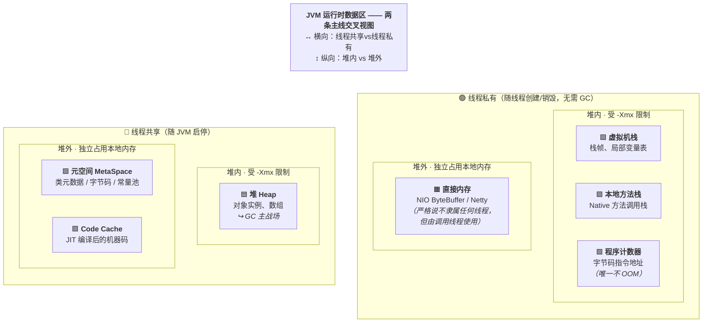
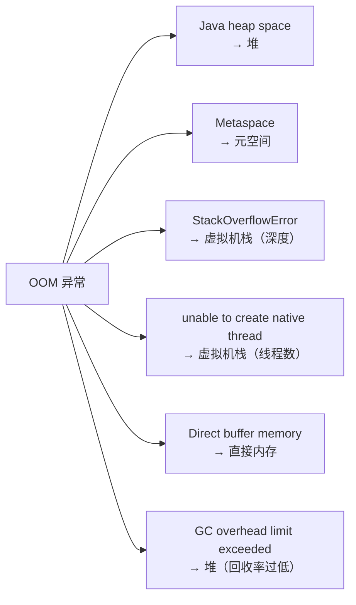
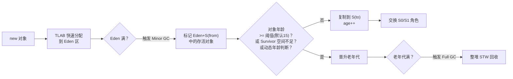
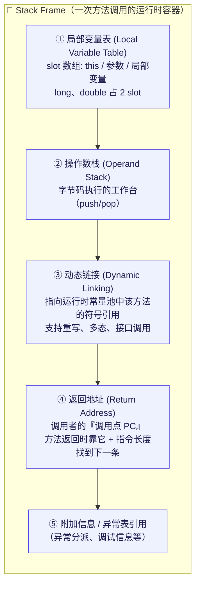
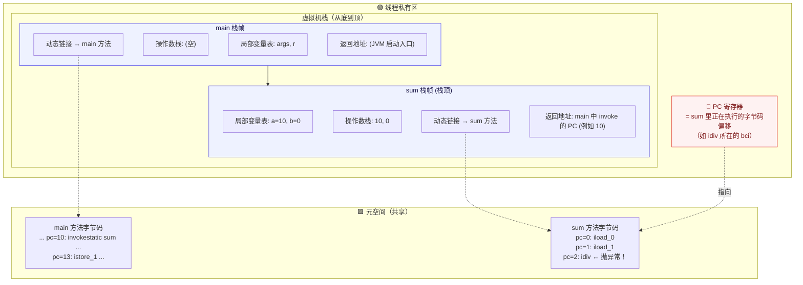
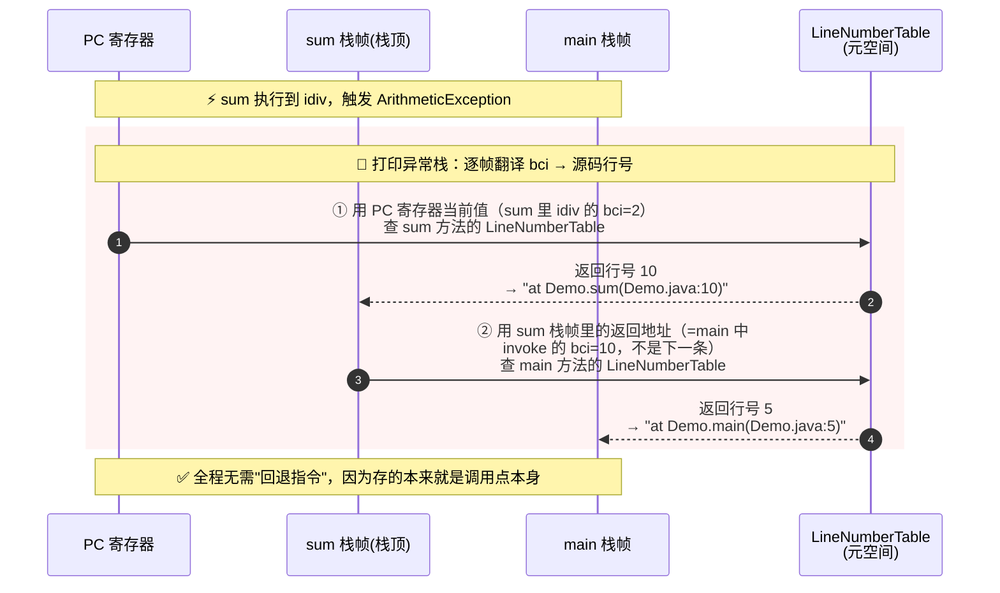
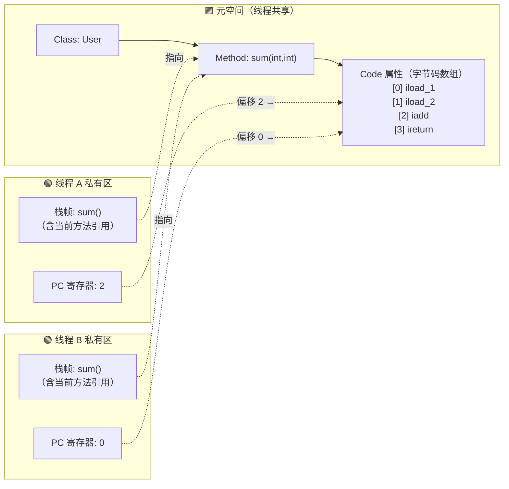

# JVM 内存分区与对象布局

!!! info "**JVM 内存分区 一句话口诀**"
    1. **七大分区记忆法**：**三共享**（堆、元空间、Code Cache）+ **三私有**（虚拟机栈、本地方法栈、程序计数器）+ **一堆外补充**（直接内存）。**唯一不 OOM** 的是程序计数器。

    2. **`-Xmx` 管不到的地方**：元空间、Code Cache、直接内存、线程栈全在堆外——容器 `memory.limit` 必须算上这些，否则 OOM Killer 伺候。

    3. **堆分代结构**：Eden ∶ S0 ∶ S1 = 8∶1∶1；对象先进 Eden，Minor GC 后复制到 Survivor，年龄达 15（或动态判断）晋升老年代。

4. **TLAB** 是堆分配零锁的基础——每个线程在 Eden 预留私有小块，bump pointer 分配；`-XX:TLABWasteTargetPercent=1` 指的是**每次 refill 时可容忍的空间浪费目标**，TLAB 实际大小由 `TLABWasteTargetPercent × Eden / (期望 refill 次数 × 活跃线程数)` 动态计算，**并非固定 1%**。

5. **对象头 Mark Word**（64 位 8 字节）多态复用——存 hashCode / GC 年龄 / 锁状态 / 偏向线程 ID；**偏向锁 JEP 374 在 JDK 15 默认关闭并弃用、JDK 18 起命令行选项标记为 obsolete（接受但产生警告），至今尚未有 JEP 将其正式移除**，但可视为已退出历史舞台。

    6. **字符串常量池（StringTable）从 JDK 7 起在堆里**，不在元空间——`intern()` 撑爆的是 `Java heap space`，不是 `Metaspace`。

<!-- -->

> 📖 **边界声明**：本文聚焦"JVM 运行时数据区的结构与对象在堆中的内存布局"，以下主题请见对应专题：
>
> - **GC 算法、三色标记、G1/ZGC 实现** → [GC 核心机制与收集器演进](@java-GC核心机制与收集器演进)
> - **GC 调优参数、OOM 排查、生产 checklist** → [GC 调优实战与常见误区](@java-GC调优实战与常见误区)
> - **容器化 JVM、JFR、虚拟线程** → [JVM 现代实践与前沿技术](@java-JVM现代实践与前沿技术)
> - **`synchronized` 锁升级流程（偏向锁→轻量级锁→重量级锁）的运行时行为** → 见后续「并发编程」专题相关章节（拆分中）

---

## 1. 运行时数据区全景

在深入每个分区的内部细节之前，先建立一个全局视角。JVM 的**运行时数据区**（即常说的"内存结构"）可以从两条主线来理解，掌握这两条主线后再逐个展开，思路会清晰很多。

下面这张二维分组图把七大分区按两条主线铺开，一眼就能看到每个分区的"身份"（横向：线程维度；纵向：位置维度）：



图中的颜色含义：🟦 堆（GC 核心战场）、🟩 线程私有区（随线程创建/销毁、无需 GC）、🟪 堆外共享区（类/代码元数据）、🟧 堆外辅助区（直接内存）。

下面把这两条主线各自展开讲清楚。

### 1.1 线程维度 —— 线程共享 vs 线程私有

| 分类 | 分区 | 生命周期 | GC 关注 |
| :---- | :---- | :---- | :---- |
| **线程共享** | 堆、元空间、Code Cache | 随 JVM 启停 | ✅ GC 核心战场 |
| **线程私有** | 虚拟机栈、本地方法栈、程序计数器 | 随线程创建 / 销毁 | ❌ 无需 GC |

### 1.2 内存位置维度 —— 堆内 vs 堆外

| 分类 | 分区 | 是否受 `-Xmx` 限制 |
| :---- | :---- | :---- |
| **堆内（JVM 管理）** | 堆、虚拟机栈、本地方法栈、程序计数器 | ✅ 堆受 `-Xmx` 限制 |
| **堆外（本地内存）** | 元空间、Code Cache、直接内存 | ❌ 独立占用物理内存 |

!!! warning "生产事故最常见的盲区"
    很多同学以为 `-Xmx2g` 就是 JVM 进程的总内存上限，其实**元空间、Code Cache、直接内存、线程栈**都在堆外独立占用内存。一个 Java 进程的 RSS（实际物理内存占用）常常远大于 `-Xmx`。

    ⚠️ **容器内存限制必须把这些堆外部分都算上**，否则容易被 OOM Killer 直接干掉（参见 [JVM 现代实践与前沿技术](@java-JVM现代实践与前沿技术) §1）。

### 1.3 七大分区速览表

| 分区 | 线程 | 位置 | 存什么 | 是否 GC | OOM 表现 | 关键参数 |
| :---- | :---- | :---- | :---- | :---- | :---- | :---- |
| **堆 Heap** | 共享 | 堆内 | 对象实例、数组 | ✅ 主战场 | `Java heap space` | `-Xms` / `-Xmx` |
| **元空间** | 共享 | 堆外 | 类元数据、字节码、运行时常量池 | ✅ 随 Full GC | `Metaspace` | `-XX:MaxMetaspaceSize` |
| **Code Cache** | 共享 | 堆外 | JIT 编译后的机器码 | ⚠️ Sweeper 回收 | `CodeCache is full`（不抛 OOM） | `-XX:ReservedCodeCacheSize` |
| **虚拟机栈** | 私有 | 堆内 | 栈帧（局部变量表、操作数栈等） | ❌ | `StackOverflowError` / `OOM` | `-Xss` |
| **本地方法栈** | 私有 | 堆内 | Native 方法调用栈 | ❌ | `StackOverflowError` | 与 `-Xss` 类似 |
| **程序计数器** | 私有 | 堆内 | 当前字节码指令地址 | ❌ | **唯一不会 OOM** | 无需配置 |
| **直接内存** | — | 堆外 | NIO ByteBuffer、Netty 缓冲 | ❌（依赖 Cleaner） | `Direct buffer memory` | `-XX:MaxDirectMemorySize` |

### 1.4 一次方法调用，各分区如何协作？

以 `User u = new User("Tom")` 为例，把所有分区串起来：

```txt
1. 类加载器读取 User.class
   └─→ 类元数据写入 【元空间】

2. JVM 在 【堆】 的 Eden 区（通过 TLAB）分配 User 对象内存

3. 执行构造方法时：
   ├─→ 【虚拟机栈】 压入新栈帧
   │    ├─ 局部变量表存 this 引用、参数 "Tom"
   │    └─ 操作数栈作为字节码执行的工作区
   └─→ 【程序计数器】 记录当前执行到哪条字节码

4. 引用 u 存在栈帧的局部变量表中，指向堆中的对象

5. 若该方法成为热点，JIT 编译它
   └─→ 机器码存入 【Code Cache】

6. 方法返回：栈帧弹出，u 不再被引用
   └─→ 下次 GC 时，堆中的 User 对象可被回收
```

### 1.5 分区与 OOM 的对应关系

这是面试与线上排障的高频考点，看到异常类型应立刻反应到对应分区：



!!! tip "记忆口诀"
    - **三共享**：堆、元空间、Code Cache
    - **三私有**：虚拟机栈、本地方法栈、程序计数器
    - **一堆外补充**：直接内存（NIO / Netty 的命脉）
    - **一个例外**：程序计数器——唯一不会 OOM 的区域
    - **一个主战场**：堆——GC 的核心关注区域

带着这份全局认知，下面逐个展开每个分区的内部结构与实现细节。

---

## 2. 堆（Heap）

堆是 JVM 中最大的内存区域，**所有线程共享**，几乎所有对象实例都在这里分配（逃逸分析例外，见 [GC 核心机制与收集器演进](@java-GC核心机制与收集器演进) §4）。

### 2.1 堆的内部结构

```txt
┌─────────────────────────────────────────────────────────────┐
│                         Heap                                │
│  ┌──────────────────────────────┐  ┌──────────────────────┐ │
│  │         Young Generation     │  │    Old Generation    │ │
│  │  ┌──────────┬────┬────┐      │  │                      │ │
│  │  │  Eden    │ S0 │ S1 │      │  │  Long-lived objects  │ │
│  │  │  (80%)   │(10%)│(10%)│    │  │  Large objects direct│ │
│  │  └──────────┴────┴────┘      │  │                      │ │
│  └──────────────────────────────┘  └──────────────────────┘ │
│         Eden:S0:S1 = 8:1:1(default)                         │
└─────────────────────────────────────────────────────────────┘
```

**为什么要有 Survivor 区？**

如果只有 Eden 和 Old，Minor GC 后存活对象直接进老年代，老年代会很快被短命对象填满，触发 Full GC。Survivor 区的作用是**缓冲**：让对象在新生代多"熬"几轮 GC，确认它真的是长期存活对象，再晋升老年代，减少 Full GC 频率。

**为什么 Survivor 要有两个（S0 和 S1）？**

复制算法需要一块空闲空间作为目标区域。S0 和 S1 交替使用：每次 Minor GC，将 Eden + 当前 Survivor 中的存活对象复制到另一个 Survivor，然后清空 Eden 和原 Survivor。始终保持一个 Survivor 是空的。

### 2.2 对象晋升流程



**动态年龄判断**：如果 Survivor 中相同年龄的对象总大小超过 Survivor 空间的 50%，则年龄 ≥ 该值的对象直接晋升老年代，不必等到 15 岁。这是为了防止 Survivor 空间被占满。

### 2.3 TLAB（Thread-Local Allocation Buffer）

堆是线程共享的，如果每次分配对象都要加锁，性能极差。JVM 的解决方案是 **TLAB**：

- 每个线程在 Eden 区预先申请一小块私有内存（大小**自适应**，由 JVM 根据线程数、分配速率动态调整，非固定比例）
- 线程内分配对象时直接在 TLAB 上 bump pointer，无需加锁
- TLAB 用完后再申请新的，此时才需要同步

!!! note "TLAB 相关参数"
    - `-XX:+UseTLAB`：启用 TLAB（默认开启）
    - `-XX:+ResizeTLAB`：开启 TLAB 自适应调整（默认开启）
    - `-XX:TLABSize`：显式指定 TLAB 初始大小（一般无需手动设置）
    - `-XX:TLABWasteTargetPercent`：TLAB 占 Eden 的目标浪费比例（默认 1%，这才是"1%"一说的真实出处——指的是**可容忍的空间浪费**，而非 TLAB 固定大小）。最终每个线程的 TLAB 实际大小由 `TLABWasteTargetPercent × Eden / (期望 refill 次数 × 活跃线程数)` 动态计算，并非固定 1%

```txt
Eden Area
┌──────────────────────────────────────────────────┐
│  Thread-1 TLAB  │  Thread-2 TLAB  │  Shared Area │
│  [obj][obj][  ] │  [obj][      ]  │              │
└──────────────────────────────────────────────────┘
                                    ↑ Large objects allocated in shared area
```

---

## 3. 虚拟机栈（VM Stack）

每个线程独有，线程创建时分配，线程结束时销毁。每次方法调用压入一个**栈帧（Stack Frame）**，方法返回时弹出。

### 3.1 栈帧的内部结构

一个栈帧由**五件套**组成，它们共同支撑起"一次方法调用"的全部运行时状态：



下面逐项展开这五件套的语义；其中 **④ 返回地址** 与 §4 程序计数器是一对孪生概念，读完本节再去看 §4 会更有体感。

### 3.2 栈帧五件套详解

| 组件 | 是什么 | 运行时作用 |
| :---- | :---- | :---- |
| **① 局部变量表** | slot 数组，存 `this`、方法参数、局部变量（long/double 占 2 slot） | 字节码通过 `iload_n` / `istore_n` 等指令读写；方法编译期就确定了 slot 数量 |
| **② 操作数栈** | 字节码执行的"工作台"，所有计算都在这里完成（push/pop） | 每条字节码的本质就是：从操作数栈取输入、算出结果再压回去 |
| **③ 动态链接** | 指向运行时常量池中该方法的**符号引用**，用于运行时解析被调用方法（支持重写/多态） | 执行 `invokevirtual` / `invokeinterface` 等 invoke 指令时，通过这个引用查到真正要调用的方法 |
| **④ 返回地址** | **调用点的 PC**（见下面"返回地址的精确语义"） | 方法返回时，JVM 用它 + 指令长度恢复调用者的 PC |
| **⑤ 附加信息** | 异常分派表引用、调试信息、本地方法接口状态等 | 抛异常时用于查找 `exception_table` 匹配 catch；调试器通过它定位帧 |

**一次方法调用的完整运行时图景**（以 `main` 调 `sum(10, 0)` 为例）：



> 💡 这张图是理解栈帧的"总地图"：**栈顶栈帧的当前位置由 PC 寄存器持有；非栈顶栈帧的"曾经执行到哪儿"则快照在各自的『返回地址』字段里**。两者语义高度一致，都记录"当前正在执行的那条指令的偏移"——下面这节会把这个重要细节讲透。

### 3.3 返回地址的精确语义 & 异常栈行号是怎么来的

这是一个容易被教科书一笔带过、但面试和调试时极有价值的细节。

**误区澄清**：很多资料会说"返回地址 = 下一条指令的 PC"，这在逻辑上说得通（返回时拿来就能用），但**不是 HotSpot 的真实实现**。

**JVM 规范层面**：两种实现都合法——存"调用点 PC"或存"下一条 PC"都行。

**HotSpot 实际做法**：

> ✅ **返回地址字段存的是『调用点 PC』**——也就是 invoke 指令本身的偏移量，**不是**它的下一条。

这意味着一条重要的心智模型：

!!! important "统一的『当前执行位置』语义"
    **无论栈顶还是非栈顶，JVM 中所有记录『执行位置』的字段，语义都是『正在执行的那条指令本身的偏移』，而不是『下一条』。**

    - **栈顶栈帧**：由 PC 寄存器持有——抛异常瞬间，PC 停在**肇事指令本身**（如 `idiv`、`invokevirtual`）
    - **非栈顶栈帧**：由栈帧的"返回地址"字段持有——值是**当时调用下级方法的 invoke 指令偏移**

    "移动到下一条"（`PC += 指令长度`）这个动作，只发生在"指令执行完"或"方法返回"的瞬间，**不会提前写进存储**。

**为什么 HotSpot 这样选？** 两种方案对比：

| 方案 | 存的值 | 正常返回路径 | 异常栈打印路径 |
| :---- | :---- | :---- | :---- |
| A. 存"下一条" | 13 | `PC = 13`，直接用 | ❌ 需要回退到 10 才能查行号——但字节码是变长指令，回退需要从头扫描，很麻烦 |
| **B. 存"调用点"** ✅ | 10 | `PC = 10 + 指令长度` | ✅ 直接用 10 查 `LineNumberTable` 就拿到行号 |

HotSpot 选 B 的核心理由：**把"加指令长度"这个动作放在"正常返回"这条高频路径上，而不是放在"打印异常栈"这条低频路径上**，同时异常堆栈、调试器、`Thread.getStackTrace()` 等所有"需要知道调用位置"的场景都能直接复用这个值。

**异常栈行号的完整打印过程**（以 `main → sum → idiv 抛 ArithmeticException` 为例）：



**关键要点小结**：

- 🎯 **PC 在抛异常那一刻是"冻结"在肇事指令上的**，不会被推进到下一条——所以栈顶栈帧的行号不需要任何调整
- 🎯 **返回地址存的是『调用点 PC』**（HotSpot 实现），不是"下一条 PC"——所以非栈顶栈帧的行号也不需要回退
- 🎯 **正常返回时**，JVM 读出返回地址（如 10），再 `+ invoke 指令长度（如 3）` 得到 13，从这里继续执行调用者
- 🎯 **`LineNumberTable` 存放在元空间的方法 Code 属性里**，是一张 `bci → 源码行号` 的映射表，`javap -l` 可以打印出来

### 3.4 `StackOverflowError` vs `OutOfMemoryError`

- 递归调用过深 → 栈帧不断压栈 → 超过栈深度限制 → `StackOverflowError`
- 线程数量过多 → 每个线程都要分配栈空间 → 内存耗尽 → `OutOfMemoryError`（创建线程时）

---

## 4. 程序计数器（PC Register）

- 每个线程独有，记录当前线程正在执行的字节码指令地址
- 执行 Native 方法时值为 undefined
- **唯一不会发生 OOM 的内存区域**（大小固定，只存一个地址）
- CPU 多线程切换时，靠 PC 恢复执行位置

!!! note "与栈帧的关系"
    PC 寄存器可以理解为栈顶栈帧的一个"外置字段"——§3 中讲过的"返回地址"就是**非栈顶栈帧版的 PC**。两者本质上记录同一件事："正在执行的那条指令的偏移"；只是栈顶用 PC 寄存器保存，非栈顶用栈帧里的返回地址字段保存。建议先读完 §3 再回到这里。

### 4.1 指令存在哪？PC 存的又是什么？

PC 寄存器本身非常"轻"——它只保存一个数字，真正的问题是：**那这个数字指向的字节码指令，存放在哪里？** 答案是 **元空间**。

字节码指令在类加载时被写入元空间中对应 `Method` 结构的 **Code 属性**里，是一段线性的字节数组。所有线程**共享**这份指令（类似多个演奏者共用一本乐谱），而每个线程通过"**栈帧 + PC**"这对组合来定位自己当前执行到哪一条：

- **栈帧**（虚拟机栈）告诉你"**当前在哪个方法**"——里面有一个指向元空间中该 `Method` 的引用
- **PC 寄存器**告诉你"**方法内的第几个字节**"——保存的是字节码数组中的**偏移量**（不是下标）

两者合起来才能唯一定位一条正在执行的指令。



上图展示了两个线程同时执行 `sum()` 方法的场景：它们**共用元空间中同一份字节码**，但各自的栈帧和 PC 记录着"自己走到哪一步"（线程 A 执行到偏移 2 的 `iadd`，线程 B 刚开始执行偏移 0 的 `iload_1`）——这就是 PC 必须线程私有的根本原因。

### 4.2 PC 为什么存"偏移量"而不是"下标"？

字节码数组中不同指令占用的字节数不同（1~N 字节），PC 保存的是**字节偏移量**，而非逻辑下标：

```txt
偏移  指令             字节数
[0]   aload_0          1
[1]   invokespecial    3   （含 2 字节操作数 #Method）
[4]   iload_1          1   ← 下一条指令直接跳到偏移 4
[5]   ireturn          1
```

像 `if_icmpge`、`goto`、`tableswitch` 这类跳转指令，其语义就是**直接修改 PC 的值**，让执行流跳到目标偏移量——这正是所有控制流（if/for/while/switch）在字节码层面的实现方式。

### 4.3 线程切换时 PC 的作用

这就回到了最初那句"CPU 多线程切换时靠 PC 恢复执行位置"的底层含义：

```txt
线程 A 正执行 sum() 第 2 字节处的 iadd
        ↓ 时间片耗尽，被 OS 挂起
JVM 保存：线程 A 的栈帧 + PC = 2
        ↓
CPU 切到线程 B 执行
        ↓ ...  一段时间后 ...
线程 A 重新获得 CPU
        ↓
JVM 读取：线程 A 的 PC = 2
        ↓
回到元空间 sum() 字节码数组[2] → 继续执行 iadd
```

如果 PC 是线程共享的，多个线程的"执行位置"就会互相覆盖，根本无法正确恢复——这就是 JVM 规范强制规定 PC 寄存器**线程私有**的根本原因。

!!! tip "一句话总结"
    **字节码在元空间（共享乐谱），栈帧指明当前方法（翻到哪一页），PC 指明方法内偏移（拉到哪一小节）**——三者配合，才能让任意数量的线程在同一份字节码上各自独立推进。

---

## 5. 元空间（MetaSpace）

JDK 8 用元空间替换了永久代（PermGen），存储**类的元数据**：

| 存储内容 | 说明 |
| :---- | :---- |
| 类的结构信息 | 字段、方法、接口、父类等 |
| 方法字节码 | 编译后的字节码指令 |
| 运行时常量池 | 字面量、符号引用 |

!!! note "JIT 编译后的机器码不在元空间"
    **常见误区**：JIT 编译后的机器码并不存放在元空间，而是存放在独立的 **Code Cache（代码缓存）** 区域，同样使用本地内存，由 `-XX:ReservedCodeCacheSize` 控制（默认 240MB）。元空间只存放**字节码**和**类元数据**。

!!! important "字符串常量池（String Table）的位置变迁"
    **字符串常量池**（String Table，也叫 `StringTable`）的位置经过了几次重要变迁，这是高频面试考点，也直接影响 `String.intern()` 的行为：

    | JDK 版本 | 字符串常量池位置 | `intern()` 行为 |
    | :---- | :---- | :---- |
    | JDK 6 及以前 | **永久代**（PermGen） | 将字符串**复制**到永久代常量池，返回常量池引用 |
    | JDK 7 | **堆** | 若堆中已有该字符串，直接**记录引用**到 StringTable，不再复制 |
    | JDK 8+ | **堆**（元空间取代永久代，但 StringTable 仍在堆中） | 同 JDK 7 |

    ⚠️ **关键澄清**：虽然上面"存储内容"表格中提到元空间里有"运行时常量池"，但这里的"运行时常量池"指**类级别**的常量池（每个 Class 一份，存字面量和符号引用），而**全局的字符串常量池（StringTable）从 JDK 7 起就已经移到堆中了**——这两者经常被混淆。

    💡 **实战影响**：因为 StringTable 在堆中，大量调用 `intern()` 或存在海量重复字符串时，会直接撑大堆内存，可能触发 `Java heap space` OOM（而不是 `Metaspace` OOM）。JDK 7+ 可通过 `-XX:StringTableSize` 调整 StringTable 桶大小（默认 60013），对 `intern()` 密集场景可显著提升性能。

    📖 **版本冷知识**：JDK 6 及以前 StringTable 默认桶数仅为 **1009**，性能瓶颈明显；这也是 JDK 7 把字符串常量池搬到堆后顺带做的容量升级，60013 是一个约 60× 的跨越。

!!! warning "元空间关键区别"
    **关键区别**：元空间使用**本地内存（Native Memory）**，不在 JVM 堆内，默认无上限（受物理内存限制）。

    ⚠️ **生产环境必须设置** `-XX:MaxMetaspaceSize` 防止无限增长，否则可能导致系统内存耗尽。

!!! warning "元空间泄漏风险"
    **元空间泄漏的典型场景**：

    - CGLib 动态代理：每次代理都生成新类，类卸载条件苛刻
    - JSP 热部署：每次修改 JSP 都重新生成类
    - OSGI 框架：频繁加载 / 卸载 Bundle

    ⚠️ 这些场景容易导致元空间持续增长，必须设置 `-XX:MaxMetaspaceSize` 进行限制。

---

## 6. 直接内存（Direct Memory）

不属于 JVM 规范定义的内存区域，但频繁使用：

```java
// NIO 直接内存分配
ByteBuffer buffer = ByteBuffer.allocateDirect(1024 * 1024); // 1MB 直接内存

// 底层调用 unsafe.allocateMemory()，绕过 JVM 堆，直接向 OS 申请内存
// 好处：避免 Java 堆和 Native 堆之间的数据拷贝（零拷贝）
// 坏处：不受 GC 管理，需要手动释放（或依赖 Cleaner 机制）
```

**为什么 Netty 大量使用直接内存？**

传统 IO：`磁盘 → 内核缓冲区 → JVM 堆 → 网络`（两次拷贝）

NIO 直接内存：`磁盘 → 直接内存 → 网络`（一次拷贝，零拷贝）

!!! warning "直接内存 OOM 排查"
    - 堆内内存正常但物理内存持续上涨 → 直接内存泄漏的强信号
    - 排查工具：`-XX:NativeMemoryTracking=summary` + `jcmd <pid> VM.native_memory summary`
    - 详细排查流程见 [GC 调优实战与常见误区](@java-GC调优实战与常见误区) §4.2

---

## 7. 对象的内存布局

理解对象在堆中的实际存储结构，是理解 GC、锁优化、内存占用的基础。

### 7.1 对象头（Object Header）

```txt
┌──────────────────────────────────────────────────────────┐
│                    Object Header                         │
│                                                          │
│  ┌──────────────────────────────────────────────────┐    │
│  │  Mark Word(8 bytes, 64-bit JVM)                  │    │
│  │  Stores: hashCode / GC age / lock state /        │    │
│  │         biased lock thread ID                    │    │
│  └──────────────────────────────────────────────────┘    │
│  ┌──────────────────────────────────────────────────┐    │
│  │  Klass Pointer(4 bytes with pointer compression; │    │
│  │                8 bytes otherwise)                │    │
│  │  Points to class metadata in method area         │    │
│  └──────────────────────────────────────────────────┘    │
│  ┌──────────────────────────────────────────────────┐    │
│  │  Array length(array objects only, 4 bytes)       │    │
│  └──────────────────────────────────────────────────┘    │
└──────────────────────────────────────────────────────────┘
```

**Mark Word 的多态复用**（64 位 JVM，共 64 bit）：

| 锁状态 | 存储内容（按位拆解，合计 64 bit） | 标志位（低 2 bit） |
| :---- | :---- | :---- |
| 无锁 | unused(25) + hashCode(31) + unused(1) + GC 年龄(4) + 偏向标志(1) + 锁标志(2) | 01（偏向标志=0） |
| 偏向锁 | 线程 ID(54) + epoch(2) + unused(1) + GC 年龄(4) + 偏向标志(1) + 锁标志(2) | 01（偏向标志=1） |
| 轻量级锁 | 指向栈中锁记录的指针(62) + 锁标志(2) | 00 |
| 重量级锁 | 指向 Monitor 对象的指针(62) + 锁标志(2) | 10 |
| GC 标记 | 由 GC 使用，配合 forwarding pointer | 11 |

!!! warning "偏向锁已被废弃（JDK 15+）"
    **JEP 374** 在 JDK 15 中将偏向锁标记为 **deprecated** 并默认关闭；**JDK 18** 起命令行选项 `-XX:+UseBiasedLocking` 被标记为 **obsolete**（仍可使用但产生警告），**至今 OpenJDK 尚未发布任何 JEP 将其正式移除**，相关代码在源码中仍然存在——但对应用开发者而言，可视为已退出历史舞台。

    - 废弃原因：现代 JVM 中无竞争同步已通过 JIT 的"锁消除"优化得很好，偏向锁带来的收益越来越小，而它的复杂性（撤销 / 批量重偏向）给 JVM 维护带来巨大负担。
    - 现状：JDK 15+ 起 `-XX:+UseBiasedLocking` 默认关闭；JDK 18+ 显式开启会收到 obsolete 警告；Mark Word 中的偏向锁相关字段在这些版本已不再参与锁路径，但表格中的位布局仍是理解历史实现的参考。
    - 影响：对绝大多数业务几乎无感；但依赖"短临界区单线程重复加锁"优化的老代码，需留意并推荐升级到更高效的同步原语（`java.util.concurrent`、`VarHandle`）。

### 7.2 实例数据与对齐填充

```txt
┌─────────────────────────────────────┐
│  Object Header（12 or 16 bytes）      │
├─────────────────────────────────────┤
│  Instance Data（field values）        │
│  JVM reorders fields to reduce memory │
│  Order：long/double > int/float >     │
│        short/char > byte/boolean >  │
│        reference                     │
├─────────────────────────────────────┤
│  Padding                            │
│  Align to multiple of 8 bytes       │
└─────────────────────────────────────┘
```

**计算一个对象的实际大小**：

```java
// 示例：一个只有 int 字段的对象
class Foo {
    int x; // 4 字节
}
// 对象头：12 字节（开启指针压缩）
// 实例数据：4 字节（int x）
// 对齐填充：0 字节（12+4=16，已是8的倍数）
// 总计：16 字节

// 可用 JOL（Java Object Layout）工具精确查看
// System.out.println(ClassLayout.parseInstance(new Foo()).toPrintable());
```

### 7.3 压缩指针（Compressed Oops）

- **启用条件**：堆 ≤ 32GB（2^32 × 8 字节对齐 = 32GB），JDK 8+ 默认开启
- **参数**：`-XX:+UseCompressedOops`（默认开启）
- **收益**：对象头 Klass Pointer 从 8 字节压缩到 4 字节，对象引用字段也从 8 字节压到 4 字节——**整体节省 30%~40% 的堆内存**
- **关闭场景**：堆 > 32GB 时自动关闭；或生产要求大堆时主动用 `-XX:-UseCompressedOops`

!!! tip "📌 为什么要设 32GB 为边界？"
    64 位指针被压缩为 32 位无符号整数，最大表示 2^32 = 4G；因为 JVM 对象 8 字节对齐，所以每个地址都是 8 的倍数——可以只存"高位的 32 位"，低位自动补 0 还原，得到 4G × 8 = 32GB 的可寻址空间。**堆超过 32GB 时压缩失效，引用回到 8 字节，对象密度骤降**——这也是为什么生产上"30GB 堆比 40GB 堆更省内存"的反直觉现象。

!!! note "📖 术语家族：`*Oops` 压缩指针家族"
    **字面义**：`oop` = **O**rdinary **O**bject **P**ointer（普通对象指针），HotSpot 源码里对"Java 堆中对象引用"的内部称呼，不是 Java 语言层面的 `Object` 引用而是 VM 层面的 64/32 位地址。

    **在本框架中的含义**：HotSpot 用一整套 `*Oops` / `*Oop` 命名的 C++ 类来表达"如何在堆中引用一个对象"——包括未压缩的 8 字节指针、压缩后的 4 字节偏移、以及对不同类元数据（普通类、数组类、常量池等）的 Klass 指针变体。

    **同家族成员**：

    | 成员 | 作用 | 源码位置（HotSpot） |
    | :-- | :-- | :-- |
    | `oop` | 未压缩的对象指针（8 字节裸指针） | `hotspot/share/oops/oop.hpp` |
    | `narrowOop` | 压缩指针（4 字节，基于 heap base + shift 还原） | `hotspot/share/oops/oopsHierarchy.hpp` |
    | `Klass*` | 未压缩的元数据指针（指向方法区的类元信息） | `hotspot/share/oops/klass.hpp` |
    | `narrowKlass` | 压缩 Klass 指针（对象头里的 4 字节 Klass Pointer 即是此类型） | `hotspot/share/oops/compressedOops.hpp` |
    | `CompressedOops` | 压缩/解压的静态工具类（`encode` / `decode` 方法） | `hotspot/share/oops/compressedOops.hpp` |
    | `instanceOop` / `arrayOop` / `objArrayOop` / `typeArrayOop` | 具体对象类别（普通实例 / 数组 / 引用数组 / 基本类型数组） | `hotspot/share/oops/instanceOop.hpp` 等 |

    **命名规律**：`<Xxx>Oop` / `narrow<Xxx>` = "HotSpot 中对 Java 堆引用的 C++ 表示"；**压缩版加 `narrow` 前缀、未压缩版直接用 `oop` / `Klass*`**。JVM 参数 `-XX:+UseCompressedOops` 控制对象**引用字段**的压缩，`-XX:+UseCompressedClassPointers`（JDK 8+ 默认开）控制对象头 **Klass Pointer** 的压缩——两者独立开关，但默认都打开。

---

## 8. 常见问题 Q&A

**Q1：JDK 8 为何用元空间替代永久代？**

> 三条根本原因：① 永久代大小固定（`-XX:MaxPermSize`），CGLib 动态代理 / 热部署场景极易 OOM；② Oracle 合并 HotSpot 和 JRockit，JRockit 本身没有永久代的概念，合并时统一到元空间；③ 元空间使用本地内存（Native Memory），理论上只受物理内存限制，更灵活。但要注意：**生产环境必须显式设 `-XX:MaxMetaspaceSize`**，否则类泄漏会吃光本地内存。

**Q2：为什么 Eden ∶ S0 ∶ S1 = 8 ∶ 1 ∶ 1？**

> **弱分代假说**告诉我们：大部分对象朝生夕死，Minor GC 后存活的不到 10%——因此让 Eden 占 80% 保证分配速率，S0/S1 各占 10% 刚好容纳那不到 10% 的存活对象。`-XX:SurvivorRatio=8` 是这个比例的默认值，可以按业务实测调整。

**Q3：程序计数器为什么是唯一不会 OOM 的区域？**

> 因为它只存一个固定大小的数字（字节码偏移量），随线程创建即分配、随线程销毁即释放，不会动态增长。这也是 JVM 规范的要求："The pc register is large enough to hold a returnAddress or a native pointer on the specific platform"——固定大小，永不溢出。

**Q4：栈帧里的"返回地址"到底存的是啥？是下一条指令的 PC 吗？**

> **JVM 规范允许两种实现**，但 **HotSpot 实际存的是『调用点 PC』**（invoke 指令本身的偏移），不是下一条。理由是：异常栈打印、调试器定位、`Thread.getStackTrace()` 等低频但高价值的场景直接复用这个值就能查到源码行号；而"加指令长度跳到下一条"这个动作被放到了"正常返回"的高频路径里。一句话：**JVM 中所有记录『执行位置』的字段，语义都是『正在执行的那条指令本身的偏移』**。

**Q5：`String.intern()` 在 JDK 7 前后到底变了什么？**

> **JDK 6 及以前**：字符串常量池在**永久代**，`intern()` 会把字符串**复制一份**到常量池。**JDK 7+**：常量池搬到**堆**，`intern()` 不再复制，而是**记录堆中已有字符串的引用**到 StringTable——这意味着大量 `intern()` 调用直接吃堆内存，OOM 类型是 `Java heap space` 而非 `Metaspace`。JDK 8 元空间取代永久代，但 StringTable 仍在堆中，行为不变。

> 📖 **调优题**（"堆外内存该设多大？Full GC 频繁怎么排查？"）已在 [GC 调优实战与常见误区](@java-GC调优实战与常见误区) 给出工程视角答案，本文不再重复，专注"机制原理"题。

---

## 9. 一句话口诀

> **三共享（堆/元空间/Code Cache）+ 三私有（VM 栈/Native 栈/PC）+ 一补充（直接内存），PC 永不 OOM；Eden 8 ∶ 1 ∶ 1，TLAB 零锁分配；对象头 Mark Word 多态复用，偏向锁 JDK 15 默认关闭、JDK 18 标记 obsolete；StringTable 从 JDK 7 起搬到堆里（桶数 1009 → 60013）。**
