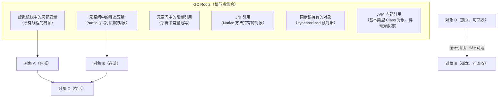
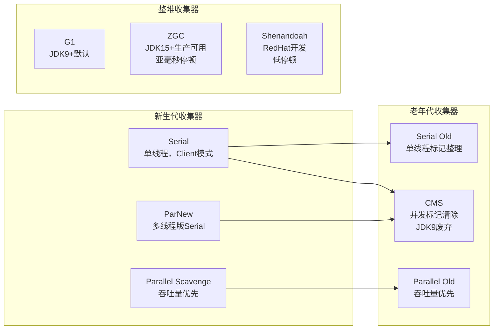
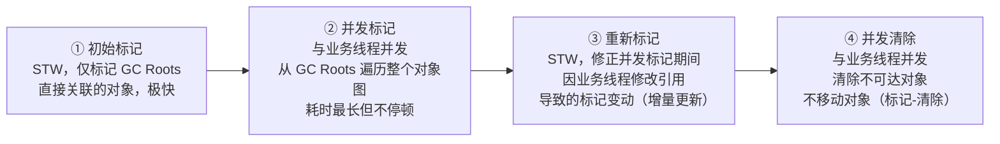
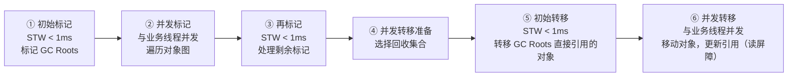

# GC 核心机制与收集器演进

!!! info "**GC 核心机制 一句话口诀**"
    1. **可达性分析 + GC Roots** 是 GC 的根基——从 Roots 出发扫不到的就是垃圾；循环引用在可达性分析下天然不成问题（引用计数才怕循环）。

    2. **三色标记（白/灰/黑）** 是所有并发 GC 的公共语言；并发标记的漏标靠**写屏障**补扫——**业务线程留痕、GC 线程补扫**。

    3. **三种 GC 算法**：标记-清除（留碎片）、标记-整理（慢但无碎片）、复制（快但浪费一半空间）；分代收集的本质是**新生代用复制、老年代用整理/清除**。

    4. **收集器演进主线**：Serial→Parallel（吞吐）→CMS（首次并发）→G1（Region + 可预测停顿）→ZGC（染色指针 + 读屏障 + 亚毫秒）。每一代都在回答同一个问题：**还能把哪些必须 STW 的事挪到业务线程并发时做？**

    5. **ZGC 染色指针**把 GC 状态编在指针高位 4 位（Finalizable / Remapped / Marked1 / Marked0），配合读屏障实现对象并发转移——这是 ZGC 亚毫秒停顿的根本。

<!-- -->

> 📖 **边界声明**：本文聚焦"GC 算法机制与收集器的实现原理"，以下主题请见对应专题：
>
> - **内存分区、对象头、压缩指针** → [JVM 内存分区与对象布局](@java-JVM内存分区与对象布局)
> - **GC 调优参数、OOM 排查、生产 checklist** → [GC 调优实战与常见误区](@java-GC调优实战与常见误区)
> - **容器化 JVM、虚拟线程、JFR、分代 ZGC 落地** → [JVM 现代实践与前沿技术](@java-JVM现代实践与前沿技术)

---

## 1. 可达性分析与 GC Roots

JVM 不使用引用计数（无法解决循环引用），而是**可达性分析**：从 GC Roots 出发，能被引用链到达的对象就是存活的，否则可以回收。

**GC Roots 的完整范围**：



!!! note "📖 术语家族：`*Reference` 引用强度家族"
    **字面义**：`reference` = 引用；`strong` / `soft` / `weak` / `phantom` = 强 / 软 / 弱 / 虚——描述"这条引用对 GC 可达性的约束力有多强"。

    **在本框架中的含义**：Java 从 JDK 1.2 起把"引用"本身变成了**一等公民对象**（`java.lang.ref` 包），让应用层能显式告诉 GC："这条引用在内存紧张时可以放弃"。GC Roots 的可达性分析遵循一条严格规则：**只有经过强引用链路可达的对象才不回收；经过软/弱/虚引用可达的对象各有各的回收时机**。

    **同家族成员**：

    | 成员 | GC 回收时机 | 典型用途 | 源码位置 |
    | :-- | :-- | :-- | :-- |
    | **强引用**（普通变量 `Object o = new Object()`） | 永不回收（除非手动置 null） | 日常对象引用 | — |
    | `SoftReference<T>` | **内存不足时**回收（Full GC 前最后的救命稻草） | 内存敏感的缓存（如图片缓存） | `java.lang.ref.SoftReference` |
    | `WeakReference<T>` | **下一次 GC 必定**回收（不管内存是否充足） | 规范键值缓存、`WeakHashMap`、`ThreadLocalMap.Entry` | `java.lang.ref.WeakReference` |
    | `PhantomReference<T>` | 随时回收，且**无法通过它 `get()` 到对象**（`get()` 永远返回 null） | 对象被回收时的清理通知（替代 `finalize()`） | `java.lang.ref.PhantomReference` |
    | `FinalReference<T>`（JDK 内部） | 对象实现了 `finalize()` 方法时 JVM 自动生成 | `finalize()` 机制的底层实现 | `java.lang.ref.FinalReference`（package-private） |
    | `Reference<T>` | 上述四种的共同基类，定义 `get()` / `clear()` / `enqueue()` 契约 | — | `java.lang.ref.Reference` |
    | `ReferenceQueue<T>` | 配合 Soft/Weak/Phantom 使用，对象被 GC 回收时会把引用对象入队 | 实现"对象死亡通知"的通道 | `java.lang.ref.ReferenceQueue` |

    **命名规律**：`<Xxx>Reference` = "可达性约束力为 Xxx 的引用"。强度递减排列：**强 > 软 > 弱 > 虚**，约束力越弱，GC 越早可以放弃。`ReferenceQueue` 是配套的"死亡通知队列"，`Reference#get()` 返回 `null` 是"被 GC 回收了"的信号。JVM 在可达性分析遍历时，按强度分轮次处理：**第一轮只沿强引用走标记**，第二轮再决定软/弱/虚引用对象的命运。

---

## 2. 三色标记算法（理解并发 GC 的基础）

并发 GC（CMS、G1、ZGC）在标记阶段与业务线程并发执行，需要解决**标记过程中对象引用关系变化**的问题。三色标记是核心算法：

- **白色**：未被访问，GC 结束后仍为白色 → 可回收
- **灰色**：已被访问，但其引用的对象还未全部扫描完
- **黑色**：已被访问，且其所有引用都已扫描完 → 存活，不会再被扫描

```txt
初始状态：所有对象白色
    ↓
从 GC Roots 出发，将直接引用的对象标记为灰色
    ↓
取出一个灰色对象，扫描其所有引用：
  - 将未访问的引用对象标记为灰色
  - 将当前对象标记为黑色
    ↓
重复直到没有灰色对象
    ↓
剩余白色对象 = 垃圾
```

**并发标记的问题：漏标**：

业务线程在 GC 标记过程中修改了引用关系，可能导致**存活对象被错误回收**（漏标）：

```txt
初始：A(黑) → B(灰) → C(白)
并发执行时：
  业务线程：A.ref = C（黑色 A 新增对 C 的引用）
  业务线程：B.ref = null（灰色 B 删除对 C 的引用）
结果：C 变成白色（无灰色节点引用它），但 A 是黑色不会再扫描
  → C 被错误回收！
```

**解决方案**：

| 方案 | 原理 | 使用者 |
| :---- | :---- | :---- |
| **增量更新（Incremental Update）** | 黑色对象新增引用时，将该黑色对象重新标记为灰色，重新扫描 | CMS |
| **原始快照（SATB）** | 灰色对象删除引用时，将被删除的引用记录下来，GC 结束前重新扫描 | G1、ZGC |

### 2.1 谁来"重新标记为灰色"？——写屏障（Write Barrier）

GC 线程无法实时感知业务线程的每一次字段赋值，所以"把黑色对象改回灰色"这件事其实是**业务线程自己**在赋值的瞬间完成的：

JIT / 解释器会在每条"引用字段赋值"字节码前后自动插入一小段机器码，这段代码叫 **Write Barrier（写屏障）**。业务线程在赋值时顺带执行屏障，留下一个"这里改过"的记号；GC 线程到了 Remark 阶段再根据这些记号去补扫，从而保证并发期间发生的引用变动不会被漏标。

简单说就是一句话：**业务线程留痕，GC 线程补扫。**

??? note "展开：两种写屏障的伪代码 & 执行者分工"

    以 `a.ref = c;` 为例，CMS 和 G1/ZGC 采用了两种不同的屏障策略：

    ```java
    // CMS 增量更新屏障（Post-write，写之后）
    void putfield_ref(Object a, Object c) {
        a.ref = c;                                  // ① 先赋值
        if (in_concurrent_marking) {
            card_table[addressOf(a) >> 9] = DIRTY;  // ② 把 a 所在 card 标脏
        }
    }

    // G1 / ZGC 的 SATB 屏障（Pre-write，写之前）
    void putfield_ref(Object a, Object c) {
        if (in_concurrent_marking) {
            Object old = a.ref;       // ① 先读出旧值
            satb_queue.push(old);     // ② 旧值入 SATB 队列（按"GC 开始时快照"视为存活）
        }
        a.ref = c;                    // ③ 再赋值
    }
    ```

    执行者分工：

    | 步骤 | 执行者 | 时机 |
    | :---- | :---- | :---- |
    | ① 拦截赋值、留下记号（dirty card / SATB entry） | **业务线程**（执行 JIT 生成的屏障代码） | 赋值那一瞬间 |
    | ② 真正把黑色对象重新扫描 | **GC 线程** | Remark 阶段（STW） |

写屏障把 STW 期间需要做的事情从"扫整个堆"压缩成"只扫并发期间变脏的那一小部分"——本质上是**用"全量扫描"换"增量扫描"**。于是同样是 STW，时长可以从秒级降到毫秒级。

形象点说：

- **无写屏障** = 装修要把**全屋家具**都搬走（停工几天）
- **有写屏障** = 只搬**今天要施工那个房间**的家具（停工几小时）

??? note "这也是 JVM GC 演进的主线：**还能把哪些\"必须 STW 才能做的事\"，挪到业务线程并发的时候做？**"

    | 方案 | STW 时长 | 原因 |
    | :---- | :---- | :---- |
    | 无写屏障（Serial / Parallel） | 百 ms ~ 秒级 | 必须暂停业务线程，把整个堆扫一遍 |
    | 有写屏障（CMS / G1） | 10 ~ 50 ms | 大部分标记在并发阶段完成，Remark 只需扫并发期间变脏的 card |
    | 染色指针 + 读屏障（ZGC / Shenandoah） | < 1 ms | 连对象搬迁都能并发做 |

    > 📖 写屏障在具体收集器上是如何落地、一次完整并发收集的四阶段时间线长什么样，见 §5.1 CMS 详解。

??? warning "展开：写屏障的代价"
    每一条引用字段赋值都会多执行几条屏障指令，引用更新密集的业务（大图遍历、ORM、大量 setter）开销可达 5%~10%。这也是为什么 Parallel GC 的吞吐量最高——它**没有写屏障**。G1 的 RSet 维护同样依赖写屏障，这也是 G1 内存占用较高的原因之一（见 §5.2）。

??? note "展开：写屏障如何补上 Initial Mark 的'漏'——一张图串起全流程"

    Initial Mark 本身并不漏扫——它在 STW 下完整枚举了当时的 GC Roots。真正的"漏"发生在**并发标记期间**：业务线程会新增引用（黑→白）、修改 Root（新压栈局部变量、静态字段改写）。写屏障让业务线程在每次"危险操作"时留下痕迹（dirty card 或 SATB entry），Remark 阶段 STW 重扫线程栈 + 消费所有痕迹，把这些"并发期间漏掉的增量"补扫完。

    ```mermaid
    sequenceDiagram
        participant App as 业务线程
        participant Barrier as 写屏障(JIT插入)
        participant GC as GC线程

        Note over GC: Initial Mark (STW)
        GC->>GC: 扫 GC Roots 直接引用，染灰

        Note over App,GC: Concurrent Mark (并发)
        App->>App: a.ref = c   (a黑, c白 → 漏标风险!)
        App->>Barrier: 触发写屏障
        Barrier->>Barrier: CMS: card_table[a]=DIRTY<br/>G1: satb_queue.push(old)
        GC->>GC: 并行地从灰色对象出发扫描

        Note over GC: Remark (STW)
        GC->>GC: ① 重扫线程栈(新增Root)
        GC->>GC: ② 扫 dirty card / 消费 SATB 队列
        GC->>GC: ③ 从新增灰色对象继续扫完

        Note over App,GC: Concurrent Sweep (并发)
        GC->>GC: 清理白色对象
    ```

    所以写屏障的真正定位是：**不是让 Initial Mark 扫得更全，而是让"Initial Mark + 并发标记"这套流水线在业务不停顿的前提下仍然正确**。它把并发 GC 的正确性问题，转化成了一个"业务线程留痕 + GC 线程增量补扫"的工程问题。

!!! note "📖 术语家族：`*Barrier` 屏障家族"
    **字面义**：`barrier` = 屏障 / 拦截；在 GC 语境里是指"JIT 在业务线程的读/写字节码前后自动插入的一小段拦截代码"。

    **在本框架中的含义**：屏障是并发 GC 的"眼线"——GC 线程没法在业务线程的每一次字段访问时都暂停它，于是把"记录引用变化"这件事外包给业务线程自己：业务线程执行赋值或取值时顺带做一次检查或登记，GC 线程日后按这些记录补扫。不同收集器根据"想补扫什么"选用不同的屏障。

    **同家族成员**：

    | 成员 | 触发时机 | 主要动作 | 典型使用者 |
    | :-- | :-- | :-- | :-- |
    | **Write Barrier**（写屏障） | 引用字段赋值时 | 拦截 `a.ref = b`，记录一条痕迹给 GC | 所有并发 GC 的通用基础 |
    | ├─ **Pre-write Barrier**（前置写屏障） | 赋值**之前** | 读出旧值 `old`，入 SATB 队列（保证"GC 开始时可达就算活"） | G1、Shenandoah（SATB 实现） |
    | ├─ **Post-write Barrier**（后置写屏障） | 赋值**之后** | 把源对象所在 Card 标脏（`card_table[a>>9]=DIRTY`） | CMS 增量更新、G1 RSet 维护 |
    | **Load Barrier**（读屏障 / 加载屏障） | 读取引用字段时（`Object b = a.ref`） | 检查染色指针的颜色位：若对象已迁移则自动修正到新地址 | ZGC、Shenandoah |
    | **Memory Barrier**（内存屏障，广义） | 指令间 | CPU 级别的重排序 / 可见性约束，与 GC 无直接关系（见 JMM） | 所有并发原语 |

    **命名规律**：`<Xxx> Barrier` = "在 Xxx 操作前后插入的拦截代码"。写屏障按插入位置细分 **Pre-** 与 **Post-**，按"要记录什么"选定 SATB（记旧值）或增量更新（记脏 Card）。**读屏障是 ZGC 的标志性技术**——它让"对象转移"也能并发完成，代价是每次读引用多几条指令。

    > 📖 CPU 级别的 Memory Barrier 和 JMM 的 happens-before 关系详见 [并发基础：JMM 与线程同步](@java-并发基础JMM与线程同步)，本文的 Barrier 专指 GC 屏障。

---

## 3. 三种 GC 算法

```txt
Mark-Sweep Algorithm：
┌────────────────────────────────────────────────────────────────────────────┐
│ [Alive] [Garbage] [Alive] [Garbage] [Alive] [Garbage] │  After marking.    │
│ [Alive] [       ] [Alive] [       ] [Alive] [       ] │  After sweeping.   │
│ ← Generates memory fragmentation, large objects cannot allocate →          │
└────────────────────────────────────────────────────────────────────────────┘

Mark-Compact Algorithm：
┌────────────────────────────────────────────────────────────────────────────┐
│ [Alive] [Garbage] [Alive] [Garbage] [Alive] [Garbage] │  After marking     │
│ [Alive] [Alive] [Alive] [           Free Space     ] │  After compacting   │
│ ← No fragmentation, but moving objects requires updating all references →  │
└────────────────────────────────────────────────────────────────────────────┘

Copying Algorithm：
┌────────────────────────────────────────────────────────────────────────────┐
│ From: [Alive][Garbage][Alive][Garbage] │ To: [Empty] │  Before GC          │
│ From: [Cleared             ]    │ To: [Alive][Alive] │  After GC           │
│ ← No fragmentation, fast, but 50% space utilization →                      │
└────────────────────────────────────────────────────────────────────────────┘
```

| 算法 | 优点 | 缺点 | 典型使用者 |
| :-- | :-- | :-- | :-- |
| **Mark-Sweep** | 实现简单、不移动对象 | 内存碎片、大对象难分配 | CMS |
| **Mark-Compact** | 无碎片、空间利用率高 | 移动对象、需要更新引用、慢 | Serial Old、Parallel Old、G1 Full GC |
| **Copying** | 无碎片、速度最快（无需扫描死对象） | 空间利用率 50% | 新生代（Serial、ParNew、G1 Young） |

**分代收集的本质**：**新生代用 Copying（死多活少，浪费一半也划算）、老年代用 Mark-Compact 或 Mark-Sweep（死少活多，copy 成本太高）**——这是弱分代假说的直接工程化。

---

## 4. 逃逸分析与栈上分配

前面讲的所有 GC 机制都在解决一个问题：**如何高效地回收堆上的垃圾**。但还有一条更激进的思路——**如果一个对象根本不需要进堆，那就不需要 GC 了**。这就是 **逃逸分析（Escape Analysis）** 的出发点：JDK 6 起由 C2 JIT 在方法编译时进行的一项静态分析，JDK 8 起默认开启（`-XX:+DoEscapeAnalysis`）。

### 4.1 什么叫"逃逸"？

"逃逸"指的是**一个在方法内部 new 出来的对象，其引用被传播到方法作用域之外**。HotSpot 把逃逸程度分为三级，级别越高，可做的优化越少：

| 逃逸级别 | 含义 | 典型场景 | 可做的优化 |
| :---- | :---- | :---- | :---- |
| **NoEscape** | 引用完全不离开当前方法 | 局部 `new` 后只读字段 | 标量替换、（理论上的）栈上分配、锁消除 |
| **ArgEscape** | 引用作为参数传给别的方法，但未被外部长期持有 | `logger.debug(new Point(x,y))` | 锁消除（有条件） |
| **GlobalEscape** | 引用被存入静态字段 / 实例字段 / 返回值 / 抛出的异常 | `return new X()`、`this.p = new P()` | 无，必须堆分配 |

```java
// ① NoEscape：引用完全不出方法
public int sum() {
    Point p = new Point(1, 2);
    return p.x + p.y;              // p 用完即弃，JIT 可做标量替换
}

// ② ArgEscape：引用作为参数传出去，但未被长期持有
public void log() {
    logger.debug(new Point(1, 2)); // 逃到 debug 方法，但没被存起来
}

// ③ GlobalEscape：引用被外部长期持有
public Point create() {
    return new Point(1, 2);        // 逃到调用者，必须堆分配
}
```

### 4.2 基于逃逸分析的三项优化

HotSpot 在确认一个对象为 `NoEscape` 后，会按以下优先级尝试优化：

#### ① 标量替换（Scalar Replacement）—— 真正在生产中起作用的主力优化

把对象的字段**直接拆散为独立的局部变量**，塞进栈帧或寄存器，对象本身彻底不存在。由 `-XX:+EliminateAllocations` 控制（默认开启）。

```java
// 源代码
Point p = new Point(1, 2);
return p.x + p.y;

// JIT 等价改写为（伪代码）
int p$x = 1;     // 对象消失，字段变成局部变量
int p$y = 2;     // 后续甚至可能被常量折叠为 return 3
return p$x + p$y;
```

#### ② 锁消除（Lock Elision）

如果加锁对象是 `NoEscape` 的（不可能被其他线程看到），同步块就没有存在的必要。经典例子：`StringBuffer.append` 内部有 `synchronized`，但如果这个 `StringBuffer` 是方法内的局部变量，JIT 会直接把锁去掉，性能退化到接近 `StringBuilder`。

#### ③ 栈上分配（Stack Allocation）—— 理论存在，HotSpot 实际并未落地

!!! warning "一个常见的误解"
    很多资料（包括《深入理解 Java 虚拟机》早期版本）都写过"逃逸分析会把对象分配到栈上"。**但 HotSpot 至今没有真正实现过通用的栈上分配**——源码里只保留了 `StackAllocate` 的占位开关，C2 最终落地的始终是**标量替换**。

    换个角度看，标量替换其实比栈上分配"更彻底"：栈上分配只是换了个分配位置，对象结构还在；而标量替换直接让对象消失、字段变成独立的局部变量。所以你在实践中观察到的"对象没进堆"，本质都是标量替换的效果。本节标题仍然沿用"栈上分配"这个流传更广的说法，但请记住：**真正在工作的是标量替换**。

### 4.3 怎么验证它生效了？

相关的 JVM 参数（JDK 8+ 默认都为开启）：

```bash
-XX:+DoEscapeAnalysis           # 逃逸分析总开关
-XX:+EliminateAllocations       # 标量替换
-XX:+EliminateLocks             # 锁消除
-XX:+PrintEscapeAnalysis        # 打印 EA 过程（需 debug 版 JVM）
-XX:+PrintEliminateAllocations  # 打印被消除的分配（需 debug 版 JVM）
```

生产 JVM 上看不到 `PrintXxx` 的输出也没关系，更实用的验证方式是**写一个紧循环反复创建短命对象，观察 Young GC 频率**：关闭逃逸分析（`-XX:-DoEscapeAnalysis`）后 Young GC 会显著变密，前后对比即可看到优化效果。

### 4.4 局限性

- **只在 C2（Server 编译器）里有效**——C1（Client）不做逃逸分析，解释执行时也不生效。所以**冷代码、启动期、被 `-Xcomp` 强制编译到 C1 的路径都吃不到这个优化**。
- **分析成本不低**：对象字段一多、调用链一深，逃逸分析会保守地把对象判为 GlobalEscape（宁可放弃优化也不能出错）。
- **数组不友好**：元素个数在编译期不可知的数组很难被标量替换。

> 💡 **和 GC 的关系**：逃逸分析本身不是 GC 算法，但它是**减小 GC 压力的第一道防线**——大量短命对象（方法内的临时 `Point`、`Iterator`、自动装箱的 `Integer` 等）如果都能被标量替换掉，Eden 的分配速率会显著下降，Young GC 频率也随之降低。这也是为什么"方法短、对象作用域小"的代码风格天然对 JIT 友好。

---

## 5. Safepoint（安全点）—— STW 的基石

前面讲到的"STW（Stop-The-World）"并不是 JVM 下达一个指令，业务线程就能瞬间全部暂停。业务线程随时可能在 JIT 后的机器码中间执行，JVM 必须让它们**主动停在一个"安全"的位置**——这个位置就叫 **Safepoint（安全点）**。所有 GC 算法的 STW 阶段、栈扫描、对象移动，都必须以"所有业务线程都到达 Safepoint"为前提。

### 5.1 什么是 Safepoint？

Safepoint 是线程执行过程中的一个**特殊位置**，在这个位置上：

- 线程的**栈帧、寄存器、PC** 等全部运行时状态是**可被 JVM 安全读取和修改**的（例如 GC 可以精确扫描栈上的引用、可以移动对象后更新指针）；
- 线程的执行语义保证**没有处于一条字节码指令的"中间"**（比如 `iadd` 刚从操作数栈弹出一个操作数、还没压回结果的瞬间，就不是安全的）。

只有所有业务线程都停在 Safepoint 上，JVM 才能安心执行"需要全局一致视图"的任务（GC、偏向锁撤销、Code Cache 清理、Class Redefinition 等）。

### 5.2 JVM 在哪里插入 Safepoint？

HotSpot 在以下位置埋设 Safepoint 检查点：

| 位置 | 说明 |
| :---- | :---- |
| **方法返回之前** | 保证每次方法调用链结束都会有机会停下 |
| **非 counted loop 的回边** | 例如 `while(cond)`、`for(:)`，循环每次迭代检查一次 |
| **调用另一个方法的位置** | `invokevirtual` 等 invoke 指令前后 |
| **抛异常的位置** | 异常分派前 |

!!! warning "counted loop 的 Safepoint 空洞（经典坑）"
    HotSpot 为了优化性能，**默认不在 `for (int i = 0; i < N; i++)` 这种"可数循环"（counted loop）的回边插 Safepoint**（因为循环变量是 int，被认为循环时间"可控"）。

    **后果**：如果循环体极长（例如数组 `int[] arr = new int[Integer.MAX_VALUE]` 的遍历），其他线程触发 GC 后会**一直等待这个线程跳出循环**，表现为"莫名其妙的长 STW"——日志里看到 `Total time for which application threads were stopped: 5.2s`，但 GC 本身只花了 20ms，剩下 5 秒全在等那个线程到达 Safepoint。

    **对策**：JDK 10+ 可用 `-XX:+UseCountedLoopSafepoints` 在 counted loop 回边也插 Safepoint；或把长循环拆小。

### 5.3 JVM 如何通知线程进入 Safepoint？

HotSpot 采用非常精巧的**主动轮询（polling）** 机制，而不是挂起信号：

```text
1. JVM 需要 STW 时，设置一个全局标志（修改某个特殊内存页的保护属性）
2. 每个 Safepoint 检查点编译进了一条 "test" 指令去读那个内存页
3. 正常情况下读取成功，线程继续跑（开销 ~ 一条指令）
4. STW 时那个页被设为不可读，读取触发 SIGSEGV 信号
5. JVM 的信号处理器接管，把该线程挂起在 Safepoint 上
6. 所有线程都挂起后，JVM 执行需要 STW 的工作（GC 扫描等）
7. 工作完成，恢复页保护，所有线程被唤醒继续执行
```

这个设计让 Safepoint 检查在**正常运行时几乎零开销**，只有进入 STW 时才付出代价。

### 5.4 Safepoint 与 Safe Region 的区别

问题：线程处于 `sleep()`、阻塞 IO 或 `synchronized` 等待中时，它根本"跑不起来"，也就无法主动到达 Safepoint。怎么办？

答案：**Safe Region（安全区域）**。

- 线程进入 sleep / 阻塞前，标记自己处于 Safe Region —— "我这段时间状态是冻结的，GC 随便看"；
- JVM 发起 STW 时，看到 Safe Region 中的线程直接视作"已到 Safepoint"，不再等待；
- 线程醒来离开 Safe Region 时，检查 STW 是否正在进行——如果是就等 STW 结束再继续。

### 5.5 Safepoint 与 GC 日志诊断

看到奇怪的长停顿但 GC 本身很短，务必开启 Safepoint 相关日志：

```bash
# JDK 9+ 统一日志
-Xlog:safepoint=info

# JDK 8
-XX:+PrintSafepointStatistics -XX:PrintSafepointStatisticsCount=1
```

输出中关注两个指标：

- **`time to safepoint`（TTSP）**：从 JVM 发起 STW 到所有线程到位的时间——偏高说明有线程迟迟不到达，可能命中 counted loop 空洞；
- **`at safepoint`**：真正执行 GC / 其他工作的时间。

!!! tip "一句话总结 Safepoint"
    **GC 日志里写的"STW 停顿" = TTSP（等线程到齐） + at safepoint（干活时间）**。GC 调优不仅要调 GC 算法本身，还要关注**所有业务线程能不能快速到达 Safepoint**——这才是所有并发 / 低延迟收集器的真正前提。

---

## 6. GC 收集器演进

### 6.1 收集器全景



!!! note "全景图中几个收集器的现状说明"
    - **ParNew**：JDK 9 被标记为废弃（与 CMS 绑定），JDK 14 正式移除，新项目无需关注。
    - **Shenandoah**：由 Red Hat 主导、与 ZGC 定位相似的低停顿收集器，OpenJDK 12+ 提供，Oracle JDK 未包含，生产使用远少于 ZGC，本文不展开。
    - 下面按照「**先经典后现代**」的顺序展开：先讲 Serial / Parallel 这两条基础线（§6.2），再讲 CMS → G1 → ZGC 的演进（§7 ~ §9）。

!!! note "📖 术语家族：`*Collector` / GC 收集器家族"
    **字面义**：`collector` = 收集器 / 回收器；HotSpot 用"Collector"指代一整套完成垃圾回收工作的算法组合（分代划分 + 扫描策略 + 回收算法 + 并发度）。

    **在本框架中的含义**：一个收集器 = **"作用分代（新生代 / 老年代 / 整堆）+ 并发度（串行 / 并行 / 并发）+ 回收算法（复制 / 标记清除 / 标记整理）"** 的一种组合。JVM 参数层面用一组 `-XX:+Use<Xxx>GC` 开关来启用不同收集器；源码层面每个收集器都对应一个 C++ 类（继承 `CollectedHeap`）。

    **同家族成员**：

    | 成员 | 作用分代 | 并发度 | 算法 | JVM 参数 | 现状 |
    | :-- | :-- | :-- | :-- | :-- | :-- |
    | **Serial** | 新生代 | 单线程（全程 STW） | 复制 | `-XX:+UseSerialGC` | 小堆 / 冷启动兜底 |
    | **Serial Old** | 老年代 | 单线程（全程 STW） | 标记-整理 | 同上 | 所有收集器 Full GC 兜底 |
    | **ParNew** | 新生代 | 多线程并行（全程 STW） | 复制 | 与 CMS 绑定 | JDK 14 移除 |
    | **Parallel Scavenge** | 新生代 | 多线程并行（全程 STW） | 复制 | `-XX:+UseParallelGC` | JDK 8 默认，仍可用 |
    | **Parallel Old** | 老年代 | 多线程并行（全程 STW） | 标记-整理 | 同上 | 同上 |
    | **CMS**（Concurrent Mark Sweep） | 老年代 | 多线程并发（仅 Init/Remark STW） | 标记-清除 | `-XX:+UseConcMarkSweepGC` | JDK 9 废弃 / 14 移除 |
    | **G1**（Garbage First） | 整堆（Region 化） | 多线程并发 | Region + 复制 / 标记-整理 | `-XX:+UseG1GC` | JDK 9+ 默认 |
    | **ZGC** | 整堆 | 多线程几乎全并发 | 染色指针 + 读屏障 | `-XX:+UseZGC` | JDK 15+ 生产可用；JDK 21+ 可分代 |
    | **Shenandoah** | 整堆 | 多线程几乎全并发 | Brooks Pointer + 读写屏障 | `-XX:+UseShenandoahGC` | OpenJDK 12+，Oracle JDK 无 |
    | **Epsilon** | 整堆 | — | 只分配不回收（No-Op） | `-XX:+UseEpsilonGC` | JDK 11+，专用于性能压测 |

    **命名规律**：
    1. **"Serial" / "Parallel" / "Concurrent"** 描述**并发度**——单线程 / 多线程并行（都 STW）/ 多线程并发（与业务线程同时跑）
    2. **"Scavenge" / "Old" 后缀**描述**作用分代**——Scavenge 专属新生代（复制算法），Old 专属老年代（整理算法）
    3. **无后缀的现代收集器（G1 / ZGC / Shenandoah）都是整堆收集器**，不再强分代，而是用 Region / 染色指针等新抽象统一处理
    4. **`-XX:+Use<Xxx>GC`** 是启用参数统一格式；**一个 Use 开关通常同时激活新生代 + 老年代收集器的组合**（如 `-XX:+UseSerialGC` 同时激活 Serial + Serial Old）

    **演进主线**：Serial → Parallel（吞吐优先）→ CMS（首次把"标记-清除"做成并发）→ G1（Region 化 + 可预测停顿）→ ZGC（染色指针 + 读屏障 + 亚毫秒）——每一代都在回答同一个问题：**还能把哪些必须 STW 的事挪到业务线程并发时做？**

### 6.2 Serial / Parallel 系列详解

这两个系列是 JVM 最经典、也最容易被教程跳过的收集器。但它们**绝不是只有历史意义**：

- **Parallel Scavenge + Parallel Old 是 JDK 8 的默认组合**，大量仍在线的 JDK 8 服务此刻正在使用它；
- **Serial / Serial Old 是所有其他收集器的"最终兜底"**：CMS 并发失败会退化到 Serial Old，G1 的 Full GC 退路同样偏向单线程整堆回收，Serverless 冷启动 / 小堆容器 / CLI 工具的默认选择也是 Serial。

#### 6.2.1 Serial / Serial Old

- **线程模型**：单线程 GC，GC 期间**全程 STW**。
- **算法**：新生代复制算法（Serial）；老年代标记-整理（Serial Old）。
- **启用参数**：`-XX:+UseSerialGC`（新生代 + 老年代一起启用）。
- **定位**：
    1. **Client 模式 / 小堆（< 100MB）** 的默认选择——单线程反而省去了线程间协调开销；
    2. **其他收集器 Full GC 的兜底**——CMS 的 Concurrent Mode Failure、G1 Full GC（早期版本）都会回退到 Serial Old 风格的单线程整堆回收，**一次 Full GC 常常就是几秒**；
    3. Serverless 冷启动、CI / CLI 短任务、单核容器等"堆小、生命周期短"的场景。


#### 6.2.2 ParNew

- **本质**：Serial 的多线程版本，**仅负责新生代**。
- **历史地位**：在很长一段时间里，ParNew 是**唯一能与 CMS 配合**的新生代收集器，因此成为 CMS 体系的"标配"。
- **现状**：
    - **JDK 9** 把 `ParNew + CMS 以外的所有 ParNew 组合`标记为废弃；
    - **JDK 14** 随 CMS 一并被移除。
- **新项目无需再关注 ParNew**，但维护老 JDK 8 服务时仍可能看到。

#### 6.2.3 Parallel Scavenge / Parallel Old（JDK 8 默认）

- **线程模型**：多线程 GC，**GC 期间全程 STW**（和 Serial 一样会 STW，只是"并行"干活，不是"并发"与业务线程同时跑）。
- **算法**：新生代复制算法（PS）；老年代标记-整理（PO）。
- **启用参数**：`-XX:+UseParallelGC`（JDK 8 为默认，JDK 9+ 需显式指定）。
- **设计目标**：**吞吐量优先**，即 `业务运行时间 / (业务运行时间 + GC 时间)` 最大化，不追求单次停顿短。
- **独有的自适应调节**：PS 提供一组"说目标、不说参数"的开关，让 JVM 自己调新生代大小、Survivor 比例、晋升阈值：

| 参数 | 含义 |
| :---- | :---- |
| `-XX:MaxGCPauseMillis=<N>` | 期望的最大停顿时间目标（软目标，JVM 尽量满足） |
| `-XX:GCTimeRatio=<N>` | 吞吐量目标，GC 时间占比 = 1/(1+N)，默认 99（即 1%） |
| `-XX:+UseAdaptiveSizePolicy` | 打开自适应调节，JVM 自动调整分代大小（默认开启） |

!!! tip "Parallel 的适用场景"
    **追求吞吐量、不关心单次停顿长短**的离线 / 后台任务：

    - 批处理作业（Spark / Flink 的部分场景）、ETL、数据导出
    - 定时计算、离线报表
    - CPU 核数多、堆不大（几 GB）、可接受秒级 STW 的场景

    反之，**在线接口服务**通常要的是"停顿可控"，此时应选 G1 / ZGC，而不是 Parallel。

#### 6.2.4 经典组合关系

§6.1 全景图中的几条连线，对应的就是历史上真正被广泛使用的组合：

| 新生代 → 老年代 | 组合特点 | 启用参数 |
| :---- | :---- | :---- |
| **Serial → Serial Old** | 单线程全 STW，小堆兜底 | `-XX:+UseSerialGC` |
| **ParNew → CMS** | 低停顿经典组合（已废弃） | `-XX:+UseConcMarkSweepGC` |
| **Parallel Scavenge → Parallel Old** | 吞吐量优先，JDK 8 默认 | `-XX:+UseParallelGC` |
| **Serial → CMS** | 历史可用组合，实际极少见 | - |

---

## 7. CMS 详解

CMS（Concurrent Mark Sweep）是第一个真正意义上的并发收集器，目标是**最短 STW 停顿时间**。它首次将「标记」与「清除」两个最耗时的阶段挪到业务线程并发执行，是从 Parallel 到 G1 / ZGC 这条演进主线上的**关键跳板**。

### 7.1 四阶段流程



以典型的 4GB 老年代为例，一次完整的并发收集时间分布大致如下（具体数值受堆大小、对象图复杂度、业务写入速率影响）：

```txt
┌─────────────┬──────────────────────┬──────────────┬────────────────┐
│ Initial Mark│  Concurrent Mark     │   Remark     │ Concurrent     │
│   (STW)     │   (并发，不停业务)    │   (STW)      │  Sweep (并发)   │
├─────────────┼──────────────────────┼──────────────┼────────────────┤
│   ~5 ms     │    ~2 s              │   ~20 ms     │    ~1 s         │
│ 扫 GC Roots │  顺着 Roots 扫全堆    │ 只扫 dirty   │  清理白色对象    │
│             │  业务线程并发运行，   │  card（增量）│                 │
│             │  write barrier 记录  │              │                 │
│             │  引用变更           │              │                 │
└─────────────┴──────────────────────┴──────────────┴────────────────┘
```

**关键设计取舍**：

- **只在 ① 和 ③ STW**——这两步耗时极短（合计约 25 ms），而最耗时的 ② 和 ④ 都是并发完成。这正是 CMS 把整体停顿从秒级压到几十毫秒的根本原因。
- **Remark 阶段依赖写屏障 + Card Table**——并发标记期间业务线程的引用修改已被写屏障记为 dirty card，Remark 只需扫这些增量，而不是扫整堆（三色标记 / 写屏障的原理见 §2）。
- **采用 Mark-Sweep 而非 Mark-Compact**——整理（Compact）需要移动对象、更新所有引用，必须 STW 完成。CMS 为了换取并发清除的能力，**主动放弃了内存整理**——这也是下文「内存碎片」问题的根源。

### 7.2 三大核心问题

!!! warning "CMS 的三个致命缺陷"
    **1. 浮动垃圾（Floating Garbage）**

    并发清除阶段业务线程产生的新垃圾，标记阶段已结束、不会被识别，只能等下一次 GC 回收。为此 CMS 必须**预留一部分老年代空间**给浮动垃圾使用，不能等到老年代 100% 满才触发 GC。

    **2. 内存碎片（Fragmentation）**

    Mark-Sweep 不移动对象，长期运行后老年代会碎片化。即使总剩余空间充足，也可能因为**找不到连续空间**而无法分配大对象，此时被迫触发 Full GC。

    **3. 并发模式失败（Concurrent Mode Failure）**

    如果在 CMS 并发执行期间老年代空间不够容纳新晋升对象（包括浮动垃圾），JVM 会**中断 CMS**、退化为 **Serial Old 单线程整堆 Mark-Compact**——一次停顿可能长达几秒到十几秒，是 CMS 最可怕的抖动来源。

    触发链路：

    ```txt
    老年代使用率达到阈值（默认 92%）
        ↓
    CMS 启动并发收集
        ↓
    并发期间业务线程持续往老年代晋升对象
        ↓
    老年代撑爆 → Concurrent Mode Failure
        ↓
    STW，退化为 Serial Old Full GC（单线程、整堆压缩）
        ↓
    停顿数秒
    ```

### 7.3 关键参数

| 参数 | 作用 | 调优建议 |
| :---- | :---- | :---- |
| `-XX:+UseConcMarkSweepGC` | 启用 CMS（JDK 9 后已废弃） | - |
| `-XX:CMSInitiatingOccupancyFraction=N` | 老年代占用达到 N% 时触发 CMS | 默认 ~92%，建议调低到 70~80%，留出浮动垃圾空间 |
| `-XX:+UseCMSInitiatingOccupancyOnly` | 只按上面阈值触发，不让 JVM 自适应调整 | 建议开启，让 GC 触发时机可预测 |
| `-XX:+CMSScavengeBeforeRemark` | Remark 前先做一次 Young GC | 建议开启，能显著缩短 Remark 的 STW |
| `-XX:+CMSClassUnloadingEnabled` | CMS 并发收集期间卸载类 | 有动态加载类的场景需开启 |
| `-XX:CMSFullGCsBeforeCompaction=N` | 每 N 次 Full GC 后强制压缩一次老年代 | 碎片严重时设为 0~5 |

### 7.4 历史意义与退役

CMS 在 2004 年（JDK 1.4.2）引入，统治了整个 Java 服务端低延迟场景十年之久。但它也留下了两个无法根治的硬伤：**内存碎片**和**并发模式失败**——这两者叠加意味着 CMS 的尾延迟永远不可控。

- **JDK 9**：`-XX:+UseConcMarkSweepGC` 被标记为**废弃**，启动时会打印 deprecation 警告。
- **JDK 14**：CMS 被**正式移除**，相关代码从 HotSpot 彻底删除。
- **精神遗产**：CMS 开创的"并发标记 + 写屏障 + 增量更新"范式被 G1 完整继承并改良（SATB 替代增量更新、Region + Compact 解决碎片问题），dirty card 机制更是一直沿用至今。**读懂 CMS 是读懂 G1 的前提**。

⚠️ **升级建议**：新项目直接用 G1（JDK 9+ 默认）或 ZGC（JDK 15+ 生产可用）；存量 CMS 项目在升级 JDK 时必须同步切换收集器，最简单的迁移路径是 `-XX:+UseG1GC`。

---

## 8. G1 详解

G1（Garbage First）是 JDK 9+ 的默认收集器，核心设计思想是**将堆划分为等大的 Region，优先回收垃圾最多的 Region**。

### 8.1 G1 的堆结构

```txt
G1 堆（示例：2GB 堆，Region 大小 = 2MB，共 1024 个 Region）

┌────┬────┬────┬────┬────┬────┬────┬────┐
│ E  │ E  │ S  │ O  │ O  │ H  │ H  │ E  │
├────┼────┼────┼────┼────┼────┼────┼────┤
│ O  │ E  │ O  │ E  │ S  │ O  │ E  │ O  │
├────┼────┼────┼────┼────┼────┼────┼────┤
│ E  │ O  │ O  │ E  │ O  │ E  │ O  │ E  │
└────┴────┴────┴────┴────┴────┴────┴────┘

E = Eden Region    S = Survivor Region
O = Old Region     H = Humongous Region（大对象，占连续多个 Region）
```

### 8.2 G1 的 GC 模式

| 模式 | 触发条件 | 回收范围 | STW |
| :---- | :---- | :---- | :---- |
| **Young GC** | Eden Region 用完 | 所有 Young Region | 是（短暂） |
| **Mixed GC** | 老年代占堆比例超过阈值（默认 45%） | 所有 Young + 部分 Old Region | 是（短暂） |
| **Full GC** | Mixed GC 来不及回收 / 大对象分配失败 | 整堆 | 是（长，应避免） |

### 8.3 G1 的 Remembered Set（RSet）

G1 的每个 Region 都维护一个 RSet，记录**哪些其他 Region 的对象引用了本 Region 中的对象**。这样 GC 时只需扫描 RSet，不必扫描整个堆，实现 Region 级别的独立回收。

```txt
Region A (Old)          Region B (Young)
┌──────────────┐        ┌──────────────┐
│  obj1 ──────────────→ │  obj2        │
│              │        │              │
│  RSet: {}    │        │  RSet: {A}   │ ← 记录 A 中有引用指向 B
└──────────────┘        └──────────────┘
```

!!! note "G1 RSet 的性能代价"
    **RSet 的代价**：每次引用关系变化都要更新 RSet（通过 Write Barrier 实现），这是 G1 内存占用较高的原因之一。

    💡 **优化建议**：在引用关系变化频繁的场景中，G1 的内存开销会相对较高，需要适当增大堆空间。

---

## 9. ZGC 详解（JDK 15+ 生产可用）

ZGC 的目标是**无论堆多大，STW 停顿时间都不超过 10ms**（实际通常 < 1ms）。

### 9.1 染色指针：ZGC 如何在指针里做文章

ZGC 在 **64 位指针的高位**（**原版 ZGC 在 JDK 11～20 里默认占 bit 42～45**、共 4 位）直接编码 GC 状态，体现成"染色"。这 4 位分别表示：

| 标志位 | 含义 |
| :---- | :---- |
| `Finalizable` | 该引用可由 Finalizer 达（即使对象"已死"） |
| `Remapped` | 最新发生的转移周期已经完成，指针是指向新地址的"最新值" |
| `Marked1` | 在最新一轮标记中已被标记（与 Marked0 交替使用） |
| `Marked0` | 在上一轮标记中已被标记 |

示意图（并非精确位置，仅表示"指针高位有几个状态标志 + 低 42~44 位存真实地址"）：

```txt
64-bit Pointer Layout（示意）：
┌────────────────────────┬──────────────────────────────┐
│ Unused(18b) │ Color(4b)  │         Virtual address（低 42~44 位）         │
│             │ F,R,M1,M0  │         指向对象实际地址（堆最大理论 16TB）      │
└────────────────────────┴──────────────────────────────┘
```

> 💡 早期资料常写"ZGC 最大支持 4TB"——那是 JDK 11~12 的早期限制。**JDK 13 起 ZGC 支持最大 16TB 堆，JDK 15 起正式生产可用**。

!!! note "分代 ZGC（JDK 21+）的位布局已调整"
    上图的"bit 42～45 四位染色"是原版 ZGC（JDK 11~20）的设计。分代 ZGC（JDK 21+，JEP 439）为了划分年轻代/老年代、以及 remember set 交互，在底层分配了更多颜色位——读者遇到"ZGC 最终形态"这种表述时，需略好分代/非分代的区别；本节代码默认描述原版 ZGC 以保持原理层面的清晰度。

### 9.2 并发阶段流程

**ZGC 的并发阶段**（几乎全程与业务线程并发）：



!!! note "ZGC 读屏障机制"
    **读屏障（Load Barrier）**：业务线程每次读取对象引用时，ZGC 插入一段检查代码，如果对象已被移动，自动修正指针。这是 ZGC 实现并发移动对象的关键。

    💡 **技术细节**：读屏障是 ZGC 实现亚毫秒停顿的核心技术，虽然带来少量性能开销，但实现了真正的并发对象移动。

### 9.3 分代 ZGC（JDK 21+）

> 📖 分代 ZGC（JEP 439，JDK 21 引入；JEP 474，JDK 23 成为默认）的启用方式与收益对比见 [JVM 现代实践与前沿技术](@java-JVM现代实践与前沿技术) §7.1，本文不再重复。

---

## 10. 五大收集器横向对比

| 对比项 | Serial / Serial Old | Parallel Scavenge / Parallel Old | CMS | G1 | ZGC |
| :---- | :---- | :---- | :---- | :---- | :---- |
| **GC 线程** | 单线程 | 多线程（并行） | 多线程（并发） | 多线程（并发） | 多线程（几乎全并发） |
| **是否全程 STW** | 是 | 是 | 仅初始 / 重新标记 STW | 仅短暂 STW | 仅 < 1ms STW |
| **设计目标** | 简单、小堆 | **高吞吐** | 低停顿 | 可控停顿 + 吞吐平衡 | **极低停顿** |
| **最大停顿时间** | 长（全程 STW） | 长（全程 STW，但并行更短） | 数百 ms（Full GC 可达秒级） | 可控（默认 200ms 目标） | < 10ms（通常 < 1ms） |
| **吞吐量** | 低 | **最高** | 高 | 中高 | 略低（读屏障开销） |
| **内存占用** | 极低 | 低 | 低 | 中（RSet 开销） | 中（染色指针） |
| **适用堆大小** | < 100MB | 100MB ~ 数 GB | < 6GB | 6GB ~ 数十 GB | 数 GB ~ 16TB |
| **JDK 版本** | 全版本可用 | JDK 8 默认，仍可用 | JDK 9 废弃 | JDK 9+ 默认 | JDK 15+ 生产可用 |
| **启用参数** | `-XX:+UseSerialGC` | `-XX:+UseParallelGC` | `-XX:+UseConcMarkSweepGC`（已废） | `-XX:+UseG1GC` | `-XX:+UseZGC` |
| **典型场景** | 小堆 / 冷启动 / 兜底 | 批处理 / 后台计算 / 吞吐敏感 | 历史遗留系统 | 通用场景 | 超大堆 / 低延迟场景 |

!!! tip "一句话选型指南"
    - **堆 < 100MB / Serverless / CLI 工具** → Serial
    - **JDK 8 + 离线批处理、ETL、不在乎停顿** → Parallel（JDK 8 默认，通常不用改）
    - **JDK 8 + 在线服务、追求停顿可控** → G1（JDK 8u40 起稳定，JDK 9+ 默认）
    - **JDK 11+ 且堆 > 16GB 或对 P99 停顿极敏感** → ZGC
    - **还在用 CMS** → 计划升级到 G1 或 ZGC

---

## 11. 常见问题 Q&A

**Q1：为什么年轻代和老年代要分开？**

> **弱分代假说**：大多数对象朝生夕死。实测数据表明，超过 90% 的对象在第一次 Minor GC 时就被回收。分代的收益：Minor GC 只扫描新生代（约占堆的 1/3），速度快（通常 < 10ms），频率高但代价小。如果不分代，每次 GC 都要扫描全堆，代价极高。分代收集还能按"对象年龄"选择最优算法——新生代用复制（死多活少，浪费 50% 空间也划算），老年代用标记-整理（活多死少，复制成本太高）。

**Q2：G1 是怎么做到可预测停顿的？**

> 传统分代（CMS）的老年代是一块连续内存，回收时必须处理整个老年代，停顿随堆增大而不可控。G1 将堆切成小块（Region），每次根据 `-XX:MaxGCPauseMillis` 的目标**选垃圾最多的部分 Region** 回收（Garbage First 名字由来），在有限时间内回收最多垃圾——停顿时间因此可预测。RSet 让 Region 可以独立回收（只扫 RSet 而非全堆），是可预测停顿的基础设施。

**Q3：ZGC 为什么停顿时间这么短？**

> ZGC 通过**染色指针**将 GC 状态编码在指针高位，通过**读屏障**在业务线程读取引用时自动修正被移动对象的指针，使得对象转移（移动）可以与业务线程并发进行，不需要 STW。STW 阶段只剩标记 GC Roots 等极少量工作，因此停顿时间通常 < 1ms，与堆大小无关。

**Q4：三色标记的漏标问题，CMS 和 G1 各用什么方案解决？**

> **CMS 用增量更新（Incremental Update）**：黑色对象新增引用时，写屏障把黑色对象改回灰色，Remark 时重扫。**G1 用 SATB（Snapshot At The Beginning）**：灰色对象删除引用时，写屏障把被删除的引用入队，Remark 时按"GC 开始时快照"视为存活。SATB 的优点是"不把黑色改回灰色"——减少 Remark 工作量。

**Q5：Soft / Weak / Phantom Reference 到底什么时候会被回收？**

> 按"约束力递减"排序：**强引用**永不回收；**`SoftReference`** 只在 Full GC 前"最后挣扎"时回收（内存够就保留），是典型的"内存敏感缓存"场景；**`WeakReference`** 下一次 GC 不管内存够不够都回收，典型应用是 `WeakHashMap` 的 key 和 `ThreadLocalMap.Entry` 的 key；**`PhantomReference`** 最弱——`get()` 永远返回 null，唯一用途是配合 `ReferenceQueue` 接收"对象已被回收"的通知，替代不靠谱的 `finalize()`。一句话：**软引用防 OOM、弱引用防泄漏、虚引用做清理通知**。

> 📖 **写屏障代价的量化数据**（引用密集型业务 5%~10% 开销、Parallel 为什么吞吐最高）已在 §2.1 的"写屏障的代价"折叠块给出，**生产调优题**（Full GC 频繁怎么排查？、G1 vs ZGC 生产怎么选？）已在 [GC 调优实战与常见误区](@java-GC调优实战与常见误区) 给出工程视角答案，本文不再重复，专注"机制原理"题。

---

## 12. 一句话口诀

> **可达性分析找活人、三色标记搞并发、写屏障补漏标、分代假说分代回收——从 Serial 到 ZGC，一部演进史就是一部"把 STW 挪到业务线程并发时做"的历史。**
