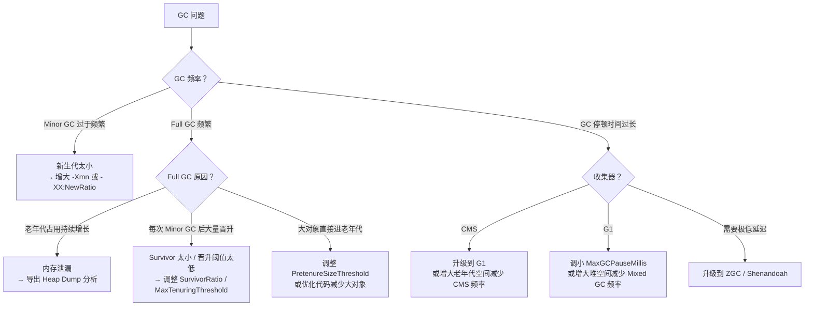
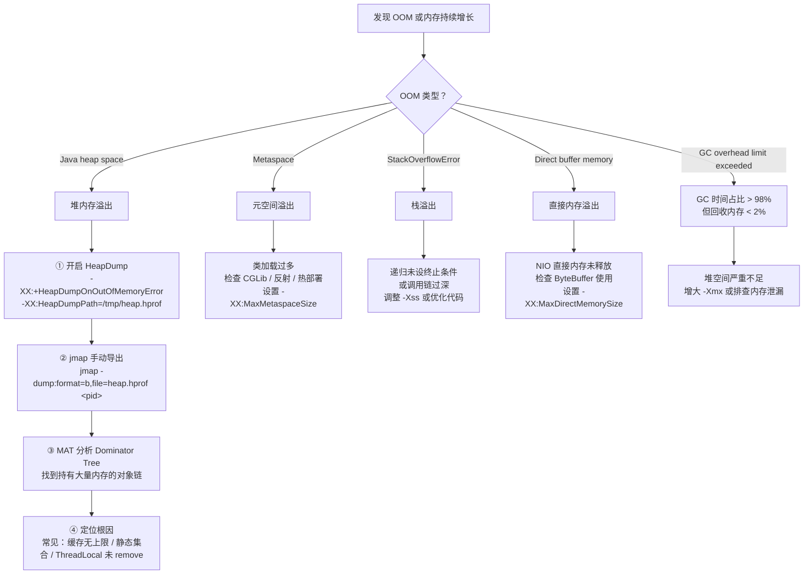

# GC 调优实战与常见误区

!!! info "**GC 调优 一句话口诀**"
    1. **调优不是猜参数**——先定**目标**（吞吐 / 延迟 / 内存），再**测量**（GC 日志 + JFR），最后**小步迭代**（一次只改一个参数），否则每一次"拍脑袋调优"都是在引入新 Bug。

    2. **堆不是越大越好**：CMS / G1 下堆越大 Full GC 停顿越长；只有 **ZGC / Shenandoah** 下大堆才安全。

    3. **`System.gc()` 是建议不是命令**——生产必加 `-XX:+DisableExplicitGC`，否则三方库一行 `System.gc()` 能让你整夜加班。

    4. **OOM 四字诀**：**堆（Java heap space）查对象链、栈（StackOverflowError）查递归、元空间（Metaspace）查代理类、直接内存（Direct buffer memory）查 NIO**——对号入座，不越界。

    5. **生产必开三件套**：GC 日志（`-Xlog:gc*`）+ OOM 堆转储（`+HeapDumpOnOutOfMemoryError`）+ 禁用显式 GC（`+DisableExplicitGC`）——出事才有现场可查。

<!-- -->

> 📖 **边界声明**：本文聚焦"GC 调优的方法论、参数矩阵与 OOM 排查流程"，以下主题请见对应专题：
>
> - **GC 算法、三色标记、G1/ZGC 的实现机制** → [GC 核心机制与收集器演进](@java-GC核心机制与收集器演进)
> - **内存分区、对象头、压缩指针底层** → [JVM 内存分区与对象布局](@java-JVM内存分区与对象布局)
> - **容器化 JVM、虚拟线程、JFR、生产故障案例库** → [JVM 现代实践与前沿技术](@java-JVM现代实践与前沿技术)

---

## 1. 调优方法论：目标 → 测量 → 分析 → 验证

!!! tip "⭐ GC 调优的唯一正确流程"
    ```txt
    ① 定目标 → ② 基线测量 → ③ 分析瓶颈 → ④ 小步修改 → ⑤ 回归验证 → ⑥ 上线观察
    ```

    **反模式**：上来就 `-Xmx8g -XX:+UseG1GC -XX:MaxGCPauseMillis=50`——没有测量就没有调优，这叫玄学。

**调优目标三选一（互有冲突）**：

| 目标 | 关注指标 | 推荐收集器 | 典型场景 |
| :-- | :-- | :-- | :-- |
| **高吞吐** | Throughput（业务 CPU 时间占比） | Parallel / G1 | 离线批处理、大数据任务 |
| **低延迟** | P99 / P999 GC 停顿 | ZGC / Shenandoah / G1 | 交易系统、实时推荐 |
| **低内存** | Footprint（常驻内存） | Serial / CMS 小堆 | 嵌入式、资源受限容器 |

!!! warning "三者互斥"
    追吞吐量就得容忍长停顿；追低延迟就得牺牲吞吐和堆利用率；追低内存就得接受 GC 频繁。**不要奢望一套参数满足所有指标。**

---

## 2. GC 日志分析

### 2.1 开启 GC 日志

```bash
# JDK 9+ 统一日志（推荐）
-Xlog:gc*:file=gc.log:time,uptime,level,tags:filecount=10,filesize=100m

# JDK 8
-XX:+PrintGCDetails -XX:+PrintGCDateStamps -Xloggc:gc.log
```

### 2.2 读懂一条 G1 GC 日志

**Young GC（正常疏散暂停）**：

```txt
[2.345s][info][gc] GC(3) Pause Young (Normal) (G1 Evacuation Pause)
│         │         │     │           │         └─ 原因：Eden 满了触发疏散
│         │         │     │           └─ GC 类型：Normal（非 Concurrent Start / Mixed）
│         │         │     └─ Young GC（只回收 Young Region）
│         │         └─ 第 3 次 GC
│         └─ 日志级别
└─ JVM 启动后经过时间

[2.345s][info][gc,heap] GC(3) Eden regions: 128->0(128)   ← Eden 从 128 个 Region 清空
[2.345s][info][gc,heap] GC(3) Survivor regions: 8->12(16) ← Survivor 从 8 增到 12 个
[2.345s][info][gc,heap] GC(3) Old regions: 64->64(512)    ← Old 未变（Young GC 不回收 Old）
[2.356s][info][gc     ] GC(3) Pause Young (Normal) 512M->256M(1024M) 11.234ms
                                                    │       │   │      └─ 停顿时间
                                                    │       │   └─ 堆总大小
                                                    │       └─ GC 后堆使用量
                                                    └─ GC 前堆使用量
```

**Mixed GC（混合回收，老年代占比超阈值触发）**：

```txt
[15.678s][info][gc] GC(42) Pause Young (Mixed) (G1 Evacuation Pause)
                                    ↑ Mixed = 同时回收 Young + 部分 Old Region
[15.678s][info][gc,heap] GC(42) Old regions: 256->198(512)  ← Old 被回收了 58 个 Region
[15.689s][info][gc     ] GC(42) Pause Young (Mixed) 768M->512M(1024M) 10.876ms
```

**Full GC（应避免，出现即需排查）**：

```txt
[30.123s][info][gc] GC(99) Pause Full (G1 Compaction Pause)
                                        ↑ 原因：Mixed GC 来不及回收 / 大对象分配失败
[30.123s][info][gc,heap] GC(99) Heap before GC: 1020M(1024M)  ← 堆几乎打满
[30.456s][info][gc     ] GC(99) Pause Full 1020M->256M(1024M) 333.456ms
                                                                ↑ 停顿 333ms，远超 Young GC
```

!!! warning "Full GC 的三大触发原因"
    1. **Mixed GC 来不及回收**：老年代增长速度 > Mixed GC 回收速度 → 调小 `-XX:InitiatingHeapOccupancyPercent`（默认 45%）提前触发
    2. **大对象（Humongous）分配失败**：单个对象 > Region 大小的 50% 直接进 Old，Old 满了触发 Full GC → 调大 `-XX:G1HeapRegionSize`
    3. **元空间不足**：`-XX:MaxMetaspaceSize` 未设置，类加载过多 → 显式设置上限

**ZGC 日志（JDK 15+）**：

```txt
[0.123s][info][gc,start] GC(0) Garbage Collection (Warmup)
[0.123s][info][gc,phases] GC(0) Pause Mark Start 0.456ms   ← STW < 1ms
[0.124s][info][gc,phases] GC(0) Concurrent Mark 12.345ms   ← 并发，不停业务
[0.136s][info][gc,phases] GC(0) Pause Mark End 0.234ms     ← STW < 1ms
[0.136s][info][gc,phases] GC(0) Concurrent Process Non-Strong References 1.234ms
[0.138s][info][gc,phases] GC(0) Concurrent Reset Relocation Set 0.123ms
[0.138s][info][gc,phases] GC(0) Concurrent Select Relocation Set 2.345ms
[0.140s][info][gc,phases] GC(0) Pause Relocate Start 0.345ms  ← STW < 1ms
[0.140s][info][gc,phases] GC(0) Concurrent Relocate 8.901ms   ← 并发转移，不停业务
[0.149s][info][gc       ] GC(0) Garbage Collection (Warmup) 256M(25%)->128M(12%) 26.789ms
                                                              └─ 总耗时 26ms，但 STW 合计 < 1.1ms
```

**关键指标速查**：

| 日志关键词 | 含义 | 告警阈值 |
| :-- | :-- | :-- |
| `Pause Young (Normal)` | 正常 Young GC | 停顿 > 200ms 需关注 |
| `Pause Young (Mixed)` | Mixed GC（G1 老年代回收） | 停顿 > 200ms 需关注 |
| `Pause Full` | Full GC（应避免） | 出现即告警 |
| `Concurrent Mode Failure` | CMS 并发失败，退化 Serial Old | 出现即告警 |
| `To-space Exhausted` | G1 Survivor/Old 空间不足 | 出现即告警 |
| `Allocation Failure` | Eden 满触发 GC（正常） | 频率过高需扩 Eden |

### 2.3 推荐可视化工具

- **GCViewer**（离线）：开源、轻量、支持 JDK 8~21 各种日志格式
- **gceasy.io**（在线）：上传即分析，可识别 40+ 种异常模式
- **JMC（JDK Mission Control）**：配合 JFR 使用，事件维度最全

---

## 3. 常见 GC 问题诊断决策树



---

## 4. OOM 排查流程

### 4.1 OOM 类型对照



### 4.2 堆 OOM 排查四步法

```bash
# 步骤 1：生产环境务必预设 OOM 自动转储
-XX:+HeapDumpOnOutOfMemoryError
-XX:HeapDumpPath=/var/log/app/heap.hprof

# 步骤 2：未预设时手动导出（活着的进程）
jmap -dump:live,format=b,file=heap.hprof <pid>

# 步骤 3：MAT 分析（Leak Suspects Report + Dominator Tree）

# 步骤 4：定位常见根因
# - 静态集合（static Map / List）只加不删
# - 缓存无上限（不设 maximumSize 的 Caffeine / Guava Cache）
# - ThreadLocal 在线程池场景未 remove
# - 监听器 / 回调注册后未反注册
```

---

## 5. 常用 JVM 参数速查矩阵

| 参数 | 含义 | 推荐值 |
| :---- | :---- | :---- |
| `-Xms` / `-Xmx` | 初始 / 最大堆大小 | **设为相同值**，避免动态扩容引发 Full GC |
| `-Xmn` | 新生代大小 | 堆的 1/3 ~ 1/4（G1 下不建议手动设，由 G1 自适应） |
| `-Xss` | 每个线程栈大小 | 256k ~ 1m |
| `-XX:MetaspaceSize` | 元空间初始高水位（触发首次 Full GC 的阈值） | Spring Boot 微服务一般 256m 起步 |
| `-XX:MaxMetaspaceSize` | 元空间最大大小 | Spring Boot 微服务推荐 512m ~ 1g |
| `-XX:+UseG1GC` | 使用 G1 收集器 | JDK 9+ 默认；JDK 8 需显式指定 |
| `-XX:MaxGCPauseMillis` | G1 停顿时间目标 | 100 ~ 200ms（过小会导致频繁 Mixed GC） |
| `-XX:G1HeapRegionSize` | G1 Region 大小 | 1m ~ 32m（2 的幂次） |
| `-XX:+UseZGC` | 使用 ZGC | JDK 15+ 稳定；JDK 23+ 默认分代 |
| `-XX:+HeapDumpOnOutOfMemoryError` | OOM 时导出堆快照 | **生产必开** |
| `-XX:HeapDumpPath=<path>` | 堆快照路径 | 指向大盘或网络存储，避免被容器清理 |
| `-XX:+DisableExplicitGC` | 禁用 `System.gc()` | **生产推荐** |
| `-XX:+ExitOnOutOfMemoryError` | OOM 时立即退出（配合 K8s 自愈） | 容器环境推荐 |
| `-Xlog:gc*` | 开启 GC 日志（JDK 9+） | **生产必开** |

!!! tip "📌 生产环境黄金参数组合（G1，JDK 17）"
    ```bash
    -Xms4g -Xmx4g
    -XX:+UseG1GC
    -XX:MaxGCPauseMillis=200             # 交易系统常用 100~200ms，小于 50ms 会导致 Mixed GC 频繁触发
    -XX:MaxMetaspaceSize=512m
    -XX:+HeapDumpOnOutOfMemoryError
    -XX:HeapDumpPath=/var/log/app/heap.hprof
    -XX:+DisableExplicitGC
    -XX:+ExitOnOutOfMemoryError
    -Xlog:gc*:file=/var/log/app/gc.log:time,uptime,level,tags:filecount=10,filesize=100m
    ```

---

## 6. 常见误区与边界

### ❌ 误区 1：堆内存设置越大越好

堆越大，单次 Full GC 的停顿时间越长（需要扫描更多对象）。对于延迟敏感的服务：

- 使用 G1 + `-XX:MaxGCPauseMillis` 控制停顿
- 或使用 **ZGC（JDK 15+）/ Shenandoah** 实现亚毫秒停顿，此时可以放心用大堆

### ❌ 误区 2：`System.gc()` 能立即触发 GC

`System.gc()` 只是**建议** JVM 进行 GC，JVM 可以忽略。生产环境应禁用：`-XX:+DisableExplicitGC`。

### ❌ 误区 3：对象一定在堆上分配

逃逸分析 + 标量替换可以让对象完全消失（字段变为局部变量），或分配在栈上。这是 JIT 的重要优化，减少 GC 压力。

> 📖 逃逸分析的限制与实际收益见 [JVM 现代实践与前沿技术](@java-JVM现代实践与前沿技术) §5.1。

### ❌ 误区 4：老年代满了才触发 Full GC

以下任一条件都会触发 Full GC：

- 老年代空间不足
- 元空间空间不足
- `System.gc()` 被调用（未禁用时）
- CMS 并发模式失败（concurrent mode failure）
- Minor GC 晋升失败（老年代没有足够连续空间，HandlePromotionFailure）

### 边界：永久代 vs 元空间

| | 永久代（JDK 7-） | 元空间（JDK 8+） |
| :---- | :---- | :---- |
| 位置 | JVM 堆内 | 本地内存（堆外） |
| 大小 | 固定（`-XX:MaxPermSize`） | 默认无上限 |
| GC | 随 Full GC 回收 | 随 Full GC 回收 |
| OOM 风险 | 高（大小固定） | 低（但**必须设上限**，否则会吃光本地内存） |

---

## 7. 设计原因：为什么这样设计？

### 7.1 为什么要分代收集？

**弱分代假说（Weak Generational Hypothesis）**：大多数对象朝生夕死。实测数据表明，超过 90% 的对象在第一次 Minor GC 时就被回收。

分代的收益：Minor GC 只扫描新生代（约占堆的 1/3），速度快（通常 < 10ms），频率高但代价小。如果不分代，每次 GC 都要扫描全堆，代价极高。

### 7.2 为什么 G1 要用 Region 替代连续分代？

传统分代（CMS）的老年代是一块连续内存，回收时必须处理整个老年代，停顿时间随堆增大而增大，不可控。

G1 将堆切成小块（Region），每次只选**垃圾最多的 Region** 回收（Garbage First 名字由来），在有限时间内回收最多垃圾，实现**可预测的停顿时间**。

### 7.3 为什么 ZGC 能做到亚毫秒停顿？

ZGC 通过**染色指针**将 GC 状态编码在指针高位，通过**读屏障**在业务线程读取引用时自动修正被移动对象的指针，使得对象转移（移动）可以与业务线程并发进行，不需要 STW。STW 阶段只剩标记 GC Roots 等极少量工作，因此停顿时间通常 < 1ms，与堆大小无关。

> 📖 染色指针的位布局、读屏障的字节码插入细节见 [GC 核心机制与收集器演进](@java-GC核心机制与收集器演进) §6。

### 7.4 为什么 JDK 8 用元空间替换永久代？

1. 永久代大小固定，CGLib / 热部署场景容易 OOM
2. Oracle 合并 HotSpot 和 JRockit，JRockit 没有永久代
3. 元空间使用本地内存，理论上只受物理内存限制，更灵活

---

## 8. 常见问题 Q&A

**Q1：堆外内存（直接内存 / Native）该用多少？**

> **经验值**：容器内存 `limit` ≥ `Xmx + MaxMetaspaceSize + MaxDirectMemorySize + 线程数×Xss + 20% buffer`。实战中常用 `-XX:MaxDirectMemorySize=<Xmx/4>`（NIO / Netty 场景）。容器环境用 `-XX:MaxRAMPercentage=75.0`，把剩下 25% 留给堆外和内核。

**Q2：Full GC 频繁怎么排查？**

> ① 看 GC 日志确认 Full GC 触发原因（元空间？晋升失败？CMS concurrent mode failure？）；② 看老年代占用曲线——持续增长是**内存泄漏**，锯齿状是**晋升频繁**；③ 导出 Heap Dump 用 MAT 看 Dominator Tree；④ 定位根因：缓存无界、静态集合、`ThreadLocal` 未 `remove`、监听器未反注册。

**Q3：如何在容器里正确设置堆大小？**

> 不要用 `-Xmx4g` 硬编码——换容器规格就失效。用 `-XX:MaxRAMPercentage=75.0` 按容器内存比例自适应；JDK 10+ 默认开启 `UseContainerSupport` 能识别 cgroup 内存，JDK 8 需 `8u191+` 并显式加。容器里 `-Xmx` 和 `-Xms` 也建议相同。

**Q4：G1 和 ZGC 生产如何选型？**

> **G1**：堆 4G~32G、停顿要求 100~200ms，JDK 9+ 默认，稳定性首选；**ZGC**：堆 > 32G 或停顿要求 < 10ms，JDK 21+ 分代 ZGC 吞吐和延迟兼得，下一代默认。**CMS**：JDK 9 废弃，JDK 14 彻底移除，**新项目不要再选**。

**Q5：`System.gc()` 什么时候真的会被执行？**

> 未加 `-XX:+DisableExplicitGC` 时，默认触发 Full GC；加了则被忽略。`DirectByteBuffer` 释放依赖 `System.gc()` 触发 `Cleaner`——如果禁用了显式 GC，必须用 `-XX:+ExplicitGCInvokesConcurrent`（允许 System.gc 但降为并发）或改用 Netty 的 `PooledByteBufAllocator` 管理堆外内存。

> 📖 **源码机制题**（"G1 怎么实现可预测停顿？"、"ZGC 染色指针位布局？"）已在 [GC 核心机制与收集器演进](@java-GC核心机制与收集器演进) 给出源码视角答案，本文不再重复，专注"工程调优"题。

---

## 9. 生产上线 Checklist

- [ ] 堆大小：`-Xms` 与 `-Xmx` 相等
- [ ] 元空间：**必设** `-XX:MaxMetaspaceSize`，生产推荐 512m~1g
- [ ] GC 日志：**必开** `-Xlog:gc*`，并做 rotation（`filecount` + `filesize`）
- [ ] OOM 转储：**必开** `-XX:+HeapDumpOnOutOfMemoryError -XX:HeapDumpPath=<持久化路径>`
- [ ] 禁用显式 GC：**必开** `-XX:+DisableExplicitGC`（除非依赖 DirectByteBuffer 回收）
- [ ] 容器环境：必开 `-XX:+UseContainerSupport -XX:MaxRAMPercentage=75.0`
- [ ] K8s 健康检查：`livenessProbe` 延迟 ≥ 60 秒，避免启动期被重启
- [ ] 监控：Prometheus 采集 `jvm_gc_*` 指标；P99 停顿告警 > 500ms
- [ ] 压测：上线前用真实业务流量跑 1 小时，看 GC 频率与停顿曲线

---

## 10. 一句话口诀

> **调优先定目标、再看日志、最后动参数——不测量就没有调优，`System.gc()` 是建议不是命令，OOM 四字诀（堆/栈/元空间/直接内存）对号入座。**
