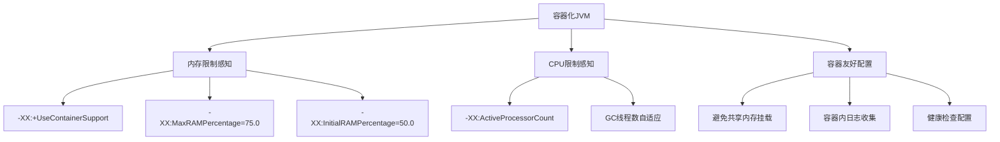
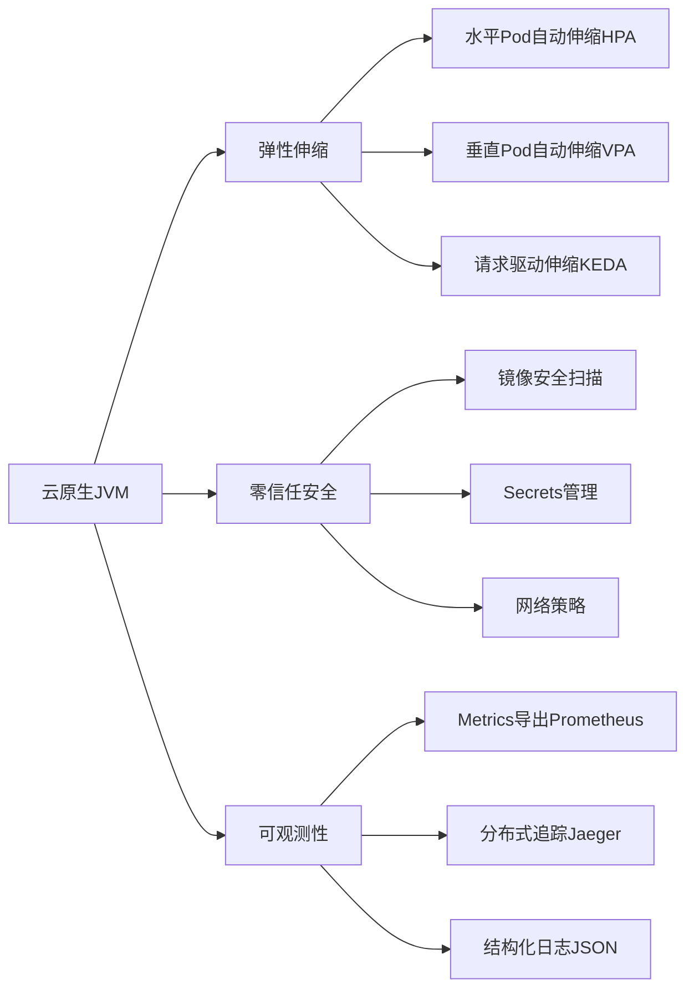

# JVM 现代实践与前沿技术

!!! info "**JVM 现代实践 一句话口诀**"
    1. **容器化 JVM 必开 `-XX:+UseContainerSupport`**（JDK 10+ 默认开，JDK 8 需 `8u191+`），搭配 `-XX:MaxRAMPercentage=75.0` 让 JVM 正确感知 cgroup 内存，否则必被 OOM Killer。

    2. **虚拟线程（JDK 21+ JEP 444）**适合 **I/O 密集**，不适合 CPU 密集；载体线程数 = CPU 核数，`synchronized` 会 **pin 住载体线程**（JDK 24 JEP 491 才移除此限制）。

    3. **JFR 是生产环境首选 profiler**——持续开启开销 < 1%，用 `jcmd <pid> JFR.start` 动态采集，用 `jfr print` 或 JMC 分析。

    4. **分代 ZGC（JEP 439）JDK 21 引入、JDK 23（JEP 474）成为默认**——无需再显式加 `-XX:+ZGenerational`。

    5. **生产红线**：无界队列禁用、ThreadLocal 必 `remove`、必设 `MaxMetaspaceSize`、必开 GC 日志与 OOM dump——每条都是血泪教训。

<!-- -->

> 📖 **边界声明**：本文聚焦"现代 JVM 的容器化/虚拟线程/JFR/JIT/云原生落地"，以下主题请见对应专题：
>
> - **基础内存分区、对象头、压缩指针** → [JVM 内存分区与对象布局](@java-JVM内存分区与对象布局)
> - **传统 GC 算法、三色标记、G1/ZGC 机制** → [GC 核心机制与收集器演进](@java-GC核心机制与收集器演进)
> - **通用 GC 调优参数与 OOM 排查** → [GC 调优实战与常见误区](@java-GC调优实战与常见误区)
> - **虚拟线程中的 JMM / 内存屏障基础** → 见后续「并发编程」专题相关章节（拆分中）

---

## 1. 容器化环境下的 JVM 调优

随着云原生和容器化技术的普及，JVM 在容器环境中的表现需要特别关注。Docker 和 Kubernetes 环境与传统物理机 / 虚拟机有显著差异：



!!! tip "容器环境关键配置（最佳实践）"
    ```bash
    # 必须开启容器支持（JDK 10+ 默认开启；JDK 8 需 8u191+ 才支持）
    -XX:+UseContainerSupport

    # 基于容器内存限制的比例配置（推荐）
    -XX:MaxRAMPercentage=75.0
    -XX:InitialRAMPercentage=50.0

    # 显式设置 CPU 数量（Kubernetes 中避免读到宿主机核数）
    -XX:ActiveProcessorCount=$(nproc)

    # G1 收集器优化
    -XX:+UseG1GC
    -XX:MaxGCPauseMillis=200
    -XX:G1HeapRegionSize=4m
    ```

    💡 **说明**：这些配置确保 JVM 能正确感知容器资源限制，避免 OOM Killer 和资源争抢问题。

!!! warning "容器环境常见问题（风险提示）"
    - ❌ JVM 无法感知容器内存限制，导致 OOM Killer 杀死进程
    - ❌ GC 线程数基于宿主机 CPU 核心数，造成资源争抢
    - ❌ 缺乏容器内日志收集，排查困难
    - ❌ 健康检查配置不当，导致频繁重启

    ⚠️ **解决方案**：务必配置 `-XX:+UseContainerSupport` 和 `-XX:MaxRAMPercentage` 等参数。

!!! note "📌 版本差异：`-XX:+UseContainerSupport` 的演进"
    - **JDK 8（8u191 之前）**：JVM 完全不感知 cgroup，容器内跑 JVM 等于"瞎跑"
    - **JDK 8u191+**：回迁该参数，需**手动开启**
    - **JDK 10+**：默认开启，无需显式配置（但显式写明更保险）
    - **JDK 15+**：进一步支持 cgroup v2

---

## 2. Project Loom 与虚拟线程（JDK 21+）

Project Loom 引入了虚拟线程（Virtual Threads），彻底改变了 Java 的并发模型。以下是从 Preview 到 GA 再到完善的完整 JEP 演进轨迹：

**JEP 演进表**：

| JEP | JDK 版本 | 状态 | 关键变化 |
| :-- | :-- | :-- | :-- |
| **JEP 425** | JDK 19 | Preview | 虚拟线程首次引入，`Thread.ofVirtual()` API 可用，需 `--enable-preview` |
| **JEP 436** | JDK 20 | **Second Preview（第二次预览）** | API 微调，`StructuredConcurrency`（JEP 428）同期在 JDK 20 以 incubator（孵化）状态发布 |
| **JEP 444** | JDK 21 | **GA（正式发布）** | 虚拟线程成为正式特性，无需 `--enable-preview`；`synchronized` 仍会 pin 载体线程 |
| **JEP 491** | JDK 24 | **GA** | `synchronized` **不再 pin 载体线程**，历史遗留问题彻底解决；虚拟线程在同步块中可正常 unmount |
| **JEP 487** | JDK 24 | **Fourth Preview（第四次预览）** | `ScopedValue` 第四次预览（JDK 21 JEP 446 1st → JDK 22 JEP 464 2nd → JDK 23 JEP 481 3rd → JDK 24 JEP 487 4th），用于替代虚拟线程场景下 `ThreadLocal` 的高内存开销，**目前仍未 GA**，使用需 `--enable-preview` |

!!! note "JEP 491 的意义"
    JDK 21（JEP 444）发布时，虚拟线程在 `synchronized` 块中会 **pin 住载体线程**（carrier thread），等同于传统线程——这使得大量依赖 `synchronized` 的框架（如 JDBC 驱动、部分 Spring 组件）无法充分受益于虚拟线程。

    **JDK 24（JEP 491）** 彻底修复了这个问题：虚拟线程在 `synchronized` 块中阻塞时，载体线程可以正常 unmount 去执行其他虚拟线程，不再被 pin 住。这意味着：
    - **JDK 21~23**：`synchronized` 密集的代码需改为 `ReentrantLock` 才能充分受益
    - **JDK 24+**：无需修改 `synchronized` 代码，直接享受虚拟线程收益

```java
// 传统线程（1:1 线程模型）- 每个 OS 线程对应一个 Java 线程
ExecutorService executor = Executors.newFixedThreadPool(200); // 200 个 OS 线程

// 虚拟线程（M:N 线程模型）- 百万级轻量级线程
ExecutorService virtualExecutor = Executors.newVirtualThreadPerTaskExecutor();
// 每个任务一个虚拟线程，由 JVM 调度到少量载体线程（carrier thread）上
```

**虚拟线程的关键机制**：

- 创建成本极低（约几百字节 vs 传统线程 1MB 栈）
- 支持百万级并发线程
- 由 `ForkJoinPool` 的载体线程承载，载体线程数 ≈ CPU 核数
- 阻塞时虚拟线程的栈帧**转移到堆**（unmount），释放载体线程

!!! warning "⚠️ 同步操作会 pin 住载体线程（JDK 21~23）"
    JDK 21~23 下，虚拟线程执行 `synchronized` 块或 native 方法时，会把**载体线程**一起 pin 住，等同于传统线程——这在同步块密集的场景会让虚拟线程的收益打折扣。

    **解决方案**：
    - **JDK 21~23**：把 `synchronized` 改为 `ReentrantLock`（可正常 unmount）
    - **JDK 24+（JEP 491）**：`synchronized` 不再 pin 载体线程，历史问题彻底解决

```java
// ❌ 虚拟线程中的 synchronized 会 pin 载体线程（JDK 21~23）
synchronized(lock) { ... }

// ✅ ReentrantLock 不会 pin（JDK 21~23 的推荐写法）
private final ReentrantLock lock = new ReentrantLock();
lock.lock();
try { ... } finally { lock.unlock(); }

// ✅ JDK 24+ 两种写法均可，synchronized 不再 pin
synchronized(lock) { ... }  // JDK 24+ 已修复
```

!!! recommendation "Project Loom 迁移建议"
    - ✅ **I/O 密集型应用**：积极采用虚拟线程，显著提升吞吐量
    - ⚖️ **CPU 密集型应用**：评估收益，可能仍需传统线程池（虚拟线程调度到少量载体线程，CPU 密集不会提速）
    - 🔄 **现有代码（JDK 21~23）**：逐步替换，注意同步块和 `ThreadLocal` 的使用（虚拟线程下 `ThreadLocal` 变成百万份，内存飙升）
    - 🔄 **现有代码（JDK 24+）**：`synchronized` 无需改写，直接受益；`ThreadLocal` 可关注 `ScopedValue`（JEP 487，JDK 24 仍为 Preview）的演进，但 API 未冻结前暂不建议在生产代码大面积替换
    - 🆕 **JDK 24+ 预览尝鲜**：`ScopedValue`（JEP 487 Fourth Preview）需 `--enable-preview` 开启，未来正式发布后将在虚拟线程场景替代 `ThreadLocal` 主导地位

    🚀 **技术优势**：虚拟线程支持百万级并发，创建成本极低，显著减少内存占用。

---

## 3. 现代性能分析工具链

| 工具类别 | 工具名称 | 适用场景 | 特点 |
| :--- | :--- | :--- | :--- |
| **实时监控** | `jstat`, `vmstat`, `top` | 实时性能指标 | 轻量级，低开销 |
| **堆分析** | MAT, `jhat`, VisualVM | 内存泄漏分析 | 离线分析，功能强大 |
| **CPU 分析** | async-profiler, JProfiler | 热点方法定位 | 精准定位性能瓶颈 |
| **GC 分析** | GCViewer, gceasy | GC 日志可视化 | 趋势分析，调优指导 |
| **APM** | SkyWalking, Pinpoint | 分布式追踪 | 全链路监控，生产必备 |
| **首选工具** | JFR（Java Flight Recorder） | 综合性能分析 | 低开销（< 1%），生产环境友好 |

!!! tip "JFR：为什么是生产环境首选"
    - **商业解禁**：JDK 11+ 起 JFR 完全开源（之前是 Oracle 商业特性）
    - **持续开启**：默认采样开销 < 1%，可 7×24 开启
    - **事件全面**：GC、线程、锁竞争、I/O、TLAB、方法采样、异常抛出等全覆盖
    - **配合 JMC**：JDK Mission Control 提供可视化分析界面

**JFR 使用示例**：

```bash
# 启动时开启 JFR（采集 60 秒）
java -XX:StartFlightRecording=duration=60s,filename=recording.jfr YourApp

# 运行时动态开启（推荐，生产环境按需采集）
jcmd <pid> JFR.start duration=60s filename=recording.jfr

# 持续录制（覆盖最近一段窗口）
jcmd <pid> JFR.start maxsize=200m maxage=1h name=continuous

# 转储当前录制
jcmd <pid> JFR.dump name=continuous filename=dump.jfr

# 分析记录
jfr print recording.jfr --events GCPhasePause
jfr summary recording.jfr
```

---

## 4. 云原生时代的最佳实践



!!! tip "云原生配置清单（Kubernetes Deployment 片段）"
    ```yaml
    # 资源限制
    resources:
      limits:
        memory: "2Gi"
        cpu: "2"
      requests:
        memory: "1Gi"
        cpu: "1"

    # 健康检查
    livenessProbe:
      httpGet:
        path: /actuator/health/liveness
        port: 8080
      initialDelaySeconds: 60
      periodSeconds: 10

    readinessProbe:
      httpGet:
        path: /actuator/health/readiness
        port: 8080
      initialDelaySeconds: 30
      periodSeconds: 5
    ```

!!! note "📌 云原生 JVM 的三条硬约束"
    1. **启动时间**：Serverless 场景下启动 > 3 秒就不可接受 → 考虑 **GraalVM Native Image** 或 **CRaC（Coordinated Restore at Checkpoint）**
    2. **内存下限**：容器 `requests.memory` 至少给到 `Xmx + 元空间 + 直接内存 + 线程栈` 总和的 1.2 倍，否则 HPA 会抖
    3. **JIT 预热**：K8s 滚动升级后新 Pod 未预热就收流量会造成毛刺 → `readinessProbe` 延迟 + 预热流量

---

## 5. JVM 内部机制深度解析

### 5.1 JIT 编译优化层级

- **分层编译**（`-XX:+TieredCompilation`，JDK 8+ 默认开启）：C1（客户端编译器）快速启动，C2（服务端编译器）深度优化
- **方法内联策略**：基于方法字节码大小（默认 `-XX:MaxInlineSize=35`）与调用频率热点内联
- **逃逸分析**：标量替换 + 栈上分配 + 锁消除，但复杂对象图成本高，实际优化有限
- **锁粗化与锁消除**：基于逃逸分析的锁优化，减少同步开销

```java
// 逃逸分析举例：本方法内局部 StringBuilder 可栈上分配
public String concat(String a, String b) {
    StringBuilder sb = new StringBuilder(); // 不逃逸，可标量替换
    sb.append(a).append(b);
    return sb.toString();
}
```

### 5.2 内存屏障与可见性

- **Java 内存模型与 happens-before**：JMM 保证的内存可见性规则
- **`volatile` 实现原理**：写后插入 `StoreLoad` 屏障，禁止指令重排序；x86 上体现为 `lock addl` 指令
- **`final` 字段的内存语义**：构造器退出（return）之前对 `final` 字段的写入，对通过对象引用访问这些字段的其他线程均可见（无需 `synchronized` / `volatile`）——**前提是 `this` 引用未在构造期间逃逸**

> 📖 JMM 的完整规则、`volatile` 双重屏障的指令级分析见后续「并发编程」专题相关章节（拆分中），本文不再重复。

---

## 6. 生产环境故障案例库

### 6.1 案例 1：元空间泄漏

```txt
# 症状：Metaspace 持续增长，频繁 Full GC
# 根因：CGLib 动态代理类未卸载（常见于反复创建 Spring 代理）
# 解决方案：
-XX:MaxMetaspaceSize=512m
# 代码层面控制代理类缓存大小，或使用类加载器隔离
```

**排查命令**：

```bash
jcmd <pid> GC.class_histogram | head -20
jstat -gc <pid> 1000
```

### 6.2 案例 2：线程池不当使用

```java
// ❌ 错误：使用无界队列（LinkedBlockingQueue 默认 Integer.MAX_VALUE）
ExecutorService executor = Executors.newFixedThreadPool(100);

// ✅ 正确：使用有界队列 + 拒绝策略
ThreadPoolExecutor executor = new ThreadPoolExecutor(
    10, 100, 60L, TimeUnit.SECONDS,
    new ArrayBlockingQueue<>(1000),
    new ThreadPoolExecutor.CallerRunsPolicy()
);
```

> 📖 线程池 7 参数与生命周期源码分析见后续「并发编程」专题相关章节（拆分中）。

### 6.3 案例 3：堆外内存泄漏

```txt
# 症状：物理内存（RSS）持续增长，但堆内存正常
# 根因：DirectByteBuffer 未释放或 Netty 池化内存泄漏
# 排查：Native Memory Tracking
```

```bash
# 启动时开启（有 5~10% 性能损耗）
-XX:NativeMemoryTracking=summary
# 或 detail 模式
-XX:NativeMemoryTracking=detail

# 运行时查看
jcmd <pid> VM.native_memory summary
jcmd <pid> VM.native_memory detail

# 基线对比（排查泄漏趋势）
jcmd <pid> VM.native_memory baseline
jcmd <pid> VM.native_memory summary.diff
```

!!! warning "生产环境红线（必须遵守）"
    - ❌ **禁止使用无界队列**（`LinkedBlockingQueue` 默认无界）
    - ❌ **禁止静态集合缓存无上限控制**
    - ❌ **禁止 `ThreadLocal` 使用后不 `remove`**（尤其线程池场景，会导致内存泄漏）
    - ✅ **必须设置元空间上限**（`-XX:MaxMetaspaceSize`）
    - ✅ **必须开启 GC 日志和 OOM 自动 dump**：
      ```bash
      -Xlog:gc*:file=gc.log:time,uptime:filecount=10,filesize=100M
      -XX:+HeapDumpOnOutOfMemoryError
      -XX:HeapDumpPath=/var/log/app/heap.hprof
      ```

    ⚠️ **违反这些规则可能导致系统崩溃或严重性能问题**。

---

## 7. 未来趋势与展望

### 7.1 分代 ZGC（Generational ZGC）

| 版本 | 状态 | 启用方式 |
| :-- | :-- | :-- |
| **JDK 21**（JEP 439） | 引入，默认仍为非分代 | `-XX:+UseZGC -XX:+ZGenerational` |
| **JDK 23**（JEP 474） | **分代成为默认** | `-XX:+UseZGC` 即为分代模式；非分代模式标记为废弃 |
| **JDK 24+**（JEP 490） | 非分代 ZGC 正式移除 | 仅剩分代模式 |

**分代 ZGC 的机制收益**：

- 新生代使用复制算法，快速回收短命对象（Hypothesis：绝大多数对象朝生夕灭）
- 老年代使用 ZGC 的染色指针和并发转移
- 减少标记成本（新生代无需全堆扫描）
- 目标：更低延迟，更高吞吐量

### 7.2 弹性元空间（Elastic Metaspace）

JDK 16 起（JEP 387）优化元空间内存管理：

- 更高效的内存分配和回收
- 减少内存碎片
- 将释放的元空间内存更及时地归还操作系统

### 7.3 统一日志系统（Unified Logging）完善

JDK 9 引入的统一日志系统（`-Xlog`）持续增强：

- 更细粒度的日志控制（按 tag、level 分类）
- 更好的性能诊断能力
- 与 APM 工具深度集成

```bash
# 统一日志示例
-Xlog:gc*=info,safepoint=debug:file=jvm.log:time,uptime,level,tags:filecount=10,filesize=100M
```

### 7.4 其他前沿技术速览

| 项目 | JEP | 状态 | 对 JVM 的影响 |
| :-- | :-- | :-- | :-- |
| **GraalVM Native Image** | — | 生产可用 | 启动毫秒级、内存低 10 倍；但放弃 JIT 的峰值性能 |
| **CRaC（Checkpoint/Restore）** | — | 孵化 | 冷启动秒级恢复到"已预热"状态 |
| **Valhalla（值类型）** | 401/402 | Preview | 消除对象头开销，提升 cache 局部性 |
| **Panama（外部函数）** | 442（final） | JDK 22 稳定 | 替代 JNI，零拷贝访问堆外内存 |
| **ScopedValue** | 487 | Preview（JDK 24） | 虚拟线程下替代 `ThreadLocal` |

!!! recommendation "技术选型建议（2025 年视角）"
    - 🆕 **新项目（2025+）**：**JDK 21 LTS** 或 **JDK 25 LTS** + 分代 ZGC + 虚拟线程
    - 🔄 **现有系统平稳过渡**：JDK 17 LTS + G1GC
    - 🚀 **超大堆 / 低延迟**：JDK 21+ + 分代 ZGC（堆 > 32GB 尤其推荐）
    - 🐳 **容器环境**：务必显式配置 `-XX:+UseContainerSupport` 和 `MaxRAMPercentage`
    - ⚡ **Serverless / FaaS**：考虑 GraalVM Native Image 或 CRaC

    💡 **说明**：根据应用场景和 JDK 版本选择合适的收集器组合，平衡吞吐量、延迟和内存开销。

---

## 8. 常见问题 Q&A

**Q1：容器里跑 JVM，为什么明明 `-Xmx` 设小了还是被 OOM Killer 杀？**

> 除了堆，JVM 还占用**元空间、代码缓存、直接内存、线程栈、Native 结构**。容器 `memory.limit` 必须 ≥ `Xmx + MaxMetaspaceSize + MaxDirectMemorySize + 线程数×栈大小 + 20% buffer`，否则 cgroup 触发 OOM Killer。用 `-XX:MaxRAMPercentage=75.0` 自动留 25% 给堆外是最省心的做法。

**Q2：虚拟线程到底适合什么场景？**

> **I/O 密集型**（HTTP 调用、数据库查询、消息订阅）收益最大——虚拟线程在阻塞时 unmount，载体线程能并行处理其他任务。**CPU 密集型**无收益，因为瓶颈在 CPU 核数而非线程数。**同步块密集**（JDK 23 及以前）会 pin 住载体线程，收益打折扣，应改用 `ReentrantLock` 或升级到 JDK 24。

**Q3：JFR 和 async-profiler 怎么选？**

> **JFR**：Java 官方方案，事件全面（GC / 锁 / I/O / TLAB / 采样），持续开启开销 < 1%，**生产首选**；但采样频率较低。**async-profiler**：基于 `perf_events`，CPU 热点分析更精准（可生成火焰图），采样频率高；但事件类型没 JFR 全。**结合使用**：JFR 做常态监控，async-profiler 做定点 CPU profiling。

**Q4：分代 ZGC 和原来的 ZGC 有什么区别？我该用哪个？**

> 原 ZGC（JDK 15 起稳定）全堆统一扫描，所有对象一视同仁；分代 ZGC（JDK 21 起）按弱分代假说把堆分成新老两代，新生代用复制算法快速回收短命对象，老年代保留 ZGC 的染色指针并发转移。收益：**减少标记成本、提升吞吐量、同样低延迟**。**JDK 21/22 需显式 `-XX:+ZGenerational`；JDK 23+ 分代已成默认，直接 `-XX:+UseZGC` 即可**。

**Q5：`-XX:NativeMemoryTracking` 的性能损耗能忍吗？**

> `summary` 模式约 5% 开销，`detail` 模式约 10%。**生产短期开启排查泄漏可接受**，长期挂着不推荐。排查流程：① 开 NMT baseline → ② 观察一段时间 → ③ 跑 `summary.diff` 看哪块增长最快 → ④ 定位泄漏根因后关闭 NMT。

---

## 9. 一句话口诀

> **容器化看 `UseContainerSupport`、并发看虚拟线程、监控看 JFR、低延迟看分代 ZGC——四件套齐备，现代 JVM 到位。**
