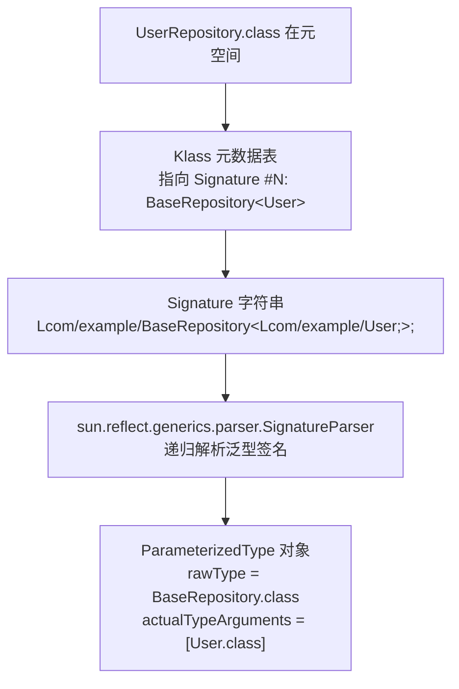

# 泛型（Generics）：Signature 属性、checkcast 指令与类型擦除的时空双重契约

在 Java 语言的兵器库里，泛型（Generics）几乎是每一个业务代码作者都会顺手抄起的工具。集合、DAO、Repository、Result 包装类——凡是想让类型多复用一次的场景，`<T>` 就会自然而然地长出来。在绝大多数开发者的心智模型中，泛型就像 C++ 模板那样"神通广大"：写下 `List<String>`，运行时就存在一个具体的、被约束住的 `List<String>`。

然而，这种表象层面的"神通"，在 JVM 底层的微观世界里，其实是一场极其精妙的**编译期契约表演** —— 演员在开幕前化好妆（编译期类型检查），当灯光真正亮起（运行时执行）时，妆全部卸干净、恢复裸脸（类型擦除），只留一张"到底演过谁"的**签名报表（Signature 属性）**悄悄挂在后台墙上。

你是否真正直面过这些问题：

- 为什么 `List<String>` 和 `List<Integer>` 在运行时是**同一个 Class**，`instanceof List<String>` 却在编译期直接被亮红灯？
- 为什么 `new T[]` 会被编译器无情驳回，但 `new String[]` 却畅行无阻？编译器到底是嫌弃 T 什么？
- 为什么 Spring 却能通过 `ResolvableType` 在运行时精确识别 `ApplicationListener<UserCreatedEvent>` 的具体事件类型，实现类型感知的事件分发？
- 为什么高并发热点路径上大量使用 `List<Integer>` 会撞出装箱拆箱的性能开销？它究竟是**类型擦除**的锅、还是**Java 泛型不接受 primitive** 这条独立设计限制的锅？

真正优秀的架构师，从来不满足于只在"擦除 = 变 Object"这一层泛化收工。本篇我们将剥离一切浮于表面的教条讲法，直接拉通 **"业务表象 → 字节码考古 → 内存时空布局 → 工程红线"** 的四层垂直透视，带你看清那份贯穿"编译期签名 + 运行时擦除"的时空双重契约。

!!! tip "⭐ 阅读全文之前请先钉住一张正交机制图"
    Java 泛型体系里有**四套彼此独立**的机制，读者最容易犯的错就是把它们串成一条因果链"泛型 → 擦除 → Object → checkcast → 装箱 → GC → 性能差"。请先把它们的正交关系钉在脑中：

    ```txt
                             Java Generics
                                   │
             ┌─────────────────────┼─────────────────────┐
             │                     │                     │
       ① Type Erasure       ② Signature 属性       ③ 泛型不支持 primitive
             │                     │                     │
       擦除到擦除边界         Class 文件元数据        List<int> 不存在
             │                     │                     │
       JVM descriptor         Reflection API         必须用 Integer
             │                     │                     │
       ↓ 使用点 checkcast     ↓ Spring ResolvableType  ↓ boxing / unboxing
    ```

    ① ② ③ 三者互相**独立**，只是恰好在 `List<Integer>` 这类高频用例上**同时出现**在字节码里。切记不要把 ① 当成 ③ 的因，也不要把 ② 当成 ① 的果——它们只是共同构成了 Java 泛型这块"时空双重契约"的四条正交轨道。

---

## 1. 第一层：业务痛点与反直觉幻觉

### 1.1 经典 `instanceof` 问题：一个类真的能"重载"两次吗？

先看一段几乎每位老手都写过、却几乎每位老手都被 IDE 无情打脸过的代码：

```java
public class GenericProbe {
    // ❌ 编译错误现场：Erasure of method process(List<String>) is the same
    //                as another method in type GenericProbe
    public void process(List<String> list) {
        // 处理字符串
    }

    public void process(List<Integer> list) {
        // 处理整型
    }
}
```

在多数程序员的直觉里，`List<String>` 与 `List<Integer>` 明明是两个**完全不同的类型**——编译器怎么会认为它们"擦除后签名相同"，直接拒绝我们做方法重载？

如果只从语法层看，你根本无法解释：为什么下面这段"擦除以后应该无法区分"的代码，反倒在编译期百分之百拒绝了：

```java
List<String> stringList = new ArrayList<>();
List<Integer> intList = new ArrayList<>();

// ✅ 运行时打印同一个 Class
System.out.println(stringList.getClass() == intList.getClass()); // true

// ❌ 编译错误：Cannot perform instanceof check against parameterized type
if (stringList instanceof List<String>) { }
```

这背后的诡异感在于：**类型信息似乎存在，又似乎不存在**。它像量子叠加态一样，只有到具体地"观测"时才会坍缩。谁在观测？观测点在哪？答案要到字节码考古现场才能揭晓。

在动身之前，必须先引入 JLS 规范里的一对硬术语，它们是解释一切后续现象的**根词根**——**Reifiable Type（可具体化类型）** 与 **Non-reifiable Type（不可具体化类型）**：

- **Reifiable Type**：运行时仍能获得**完整**类型信息的类型，包括原生类型（`int`）、非参数化类（`String`）、无界通配符参数化类型（`List<?>`）、原生数组（`String[]`）
- **Non-reifiable Type**：运行时无法获得**完整**类型信息的类型，如 `List<String>`、`Map<String, User>` 这类**带具体类型参数的参数化类型**

这对术语一举解释了两个看似割裂的现象：为什么 `if (stringList instanceof List<?>)` 编译通过、而 `if (stringList instanceof List<String>)` 编译失败？——因为 `List<?>` 是 reifiable 的，JVM 运行时只需要检查"对象是不是某种 List"；而 `List<String>` 是 non-reifiable 的，JVM 运行时**根本没有一个独立的"List<String>"类型可以拿来比对**。同一条 `instanceof` 指令，只能在 reifiable type 上工作。

### 1.2 堆污染（Heap Pollution）：一颗延迟触发的时间炸弹

如果上面的问题还停留在"编译期拒载"的层面，那么下面这种线上问题则更隐蔽、更难定位——它**在污染发生的瞬间不报错，直到下游不相干的业务方法读取时才抛出异常**：

```java
public class GenericAnomaly {
    // 模拟第三方遗留库或者未洗净的 Raw Type 赋值
    @SuppressWarnings("unchecked")
    public void legacyInject(List rawList) {
        rawList.add(1024); // 💥 隐蔽地塞入了一个 Integer，此时系统一切正常，不报错
    }

    public void productionPipeline() {
        List<String> secureList = new ArrayList<>();
        secureList.add("正常业务数据");

        // 问题出现：由于接口对接，安全的泛型列表被传入了遗留库
        legacyInject(secureList);

        // 💥 线上报错：代码执行到这里时，抛出 ClassCastException！
        String data = secureList.get(1); // 期待拿到 String，实际拿到了 Integer
        System.out.println(data);
    }
}
```

**Bug 现场痛点**：这段代码最麻烦的地方在于，堆内存被污染的那个瞬间（`rawList.add(1024)` 时），程序没有任何报错或异常。它像一颗被埋下的定时炸弹，静静地躺在堆内存里，直到下游不知道多少层、不相干的业务方法执行 `secureList.get(1)` 试图取出数据时，才突然抛出异常。排查人员看着报错行，百思不得其解：为什么声明为 `List<String>` 的容器里会蹦出一个 `Integer`？

这背后的根因，同样要等到第二层字节码考古现场才能揭晓：由于类型擦除把 `List<String>` 拉平成 `Object`，遗留库往里塞 `Integer` 时 JVM 一路放行；直到下游执行 `get(1)` 时，字节码里的 `checkcast #class java/lang/String` 发现内存里真实对象是 `Integer`，无法通过类型检查，才立即抛出 `ClassCastException`。

⭐ 但这里必须澄清一个更根本的 JVM 层真相——**并不是 JVM 明知道"这是 `List<String>`"却故意选择放行**，而是**在 JVM 的运行时类型系统里，这个 List 对象本身根本没有一个可以强制验证"所有元素必须是 String"的运行时参数化类型约束**。换句话说，JVM 从始至终看到的都只是一个裸的 `ArrayList`，"每个元素必须是 String" 这件事**从未以任何运行时可执行的形式存在过**——它只作为编译期的静态类型契约存在于 `javac` 的类型推导过程中。这也正是 4.2 节"必须用匿名子类钉住泛型"红线之外，另一种极端反模式——**裸用 Raw Type 绕过了编译器的类型安全检查，给堆污染提供了入口**。

于是，堆污染的完整因果链可以被拆成"写入路径无阻 + 读取路径触发"两条独立轨道：

```txt
写入路径：
    Integer → List.add(Object) 擦除签名 → JVM 放行（因为没有运行时参数化约束）
        ↓
读取路径：
    List.get() → Object → 编译器插入 checkcast String → 类型不匹配 → ClassCastException
```

**关键洞察**：异常真正发生的位置，往往不是污染发生的位置。你看到的可能是 `String data = secureList.get(1);` 这一行，但真正的 bug 可能发生在很久之前的 `rawList.add(1024);`，甚至可能来自另一个模块、第三方库或者历史遗留代码。

### 1.3 高并发热点：`List<Integer>` 的隐形装箱内存税

另一个隐形但严重的工业级坏习惯，是在高并发热点路径上大量使用 `List<Integer>` 甚至 `Map<Long, Integer>`：

```java
// ❌ 严重生产反模式：QPS 5 万的接口用 List<Integer> 装载订单 ID
public List<Integer> pickTopOrders(List<Order> orders) {
    List<Integer> ids = new ArrayList<>();
    for (Order o : orders) {
        ids.add(o.getId()); // int → Integer 隐式装箱
    }
    return ids;
}
```

这段代码在单元测试时看起来毫无异样。然而一旦部署到高并发生产，QPS 一冲上 5 万，YoungGen 里就会快速堆满**海量的 `Integer` 装箱对象**——每一个 `int → Integer` 的隐式装箱都在 Eden 区分配一个 16 字节的对象（对象头 12B + int 字段 4B）。CPU 缓存命中率骤降，Minor GC 频率飙升，接口 P99 延迟呈台阶式劣化。

⚠️ **这里必须锁死一个极易被误传的因果关系**：这个成本**不是**"类型擦除直接导致的"。真正的因果链是两条**独立**的机制，只是恰好在同一段代码里同时出现：

```txt
链 A（类型擦除机制）：
    List<E>  →  擦除到 List
        ↓
    List.get() 返回 Object
        ↓
    编译器插入 checkcast

链 B（装箱机制 · 与 A 独立）：
    Java 泛型不支持 primitive type parameter
        ↓
    List<int> 不存在，只能写 List<Integer>
        ↓
    int ↔ Integer 之间 boxing / unboxing
```

**链 A 与链 B 都会在 `List<Integer>` 的字节码里同时出现**（`checkcast Integer` 紧挨着 `Integer.intValue()`），但它们各自源于不同的设计决策——链 A 是为了让老 Class 文件跨版本兼容而选择"擦除到擦除边界"，链 B 是因为 JVM 类型系统里 primitive 与 reference 是两套完全独立的类型域、泛型参数只能承载 reference。**即使 Java 未来通过 Valhalla 引入 reified 泛型（保留 `List<T>` 的 T 到运行时），只要 Universal Generics 未同步落地、`List<int>` 仍然不合法，装箱的开销依然不会消失**。这条反向假设是链 A 与链 B 独立的最硬反证。

究竟是什么在默默吞噬着 CPU 时钟周期？想要彻底破案，我们需要深入字节码层面，直接进入 Class 文件的字节码世界，看看**类型擦除究竟是如何让 CPU 在指令层做装箱的**（严格来说是"链 A 与链 B 在字节码里如何相邻共存"）。

---

## 2. 第二层：字节码考古 —— `Signature` 属性与 `checkcast` 指令

许多程序员的潜意识里，泛型是"从 C++ 模板抄过来的东西"——编译器应该为每一种具体泛型都生成一份独立的字节码副本。然而事实恰恰相反：**JVM 完全不认识 `List<String>` 和 `List<Integer>` 的区别。所有类型参数在字节码指令流里都被拉平为 `Object`**——只在类文件的**属性表**里挂一张"擦除前长什么样"的签名照片（`Signature`），以及在**调用点**插入一系列低成本的强转指令（`checkcast`），来维持类型安全的编译期契约。

### 2.1 擦除规则的精确表达：**擦到第一个上界**而不是"一律变 Object"

在挖字节码之前，必须先纠正一个几乎所有 Java 教程都会犯的口误——"Java 泛型在运行时被擦除成 Object"。这句话过于简化。JLS §4.6 的**精确规则**是：

> **类型变量会被擦除为它的第一个上界（leftmost bound）；如果没有显式上界，才默认擦除为 `Object`。**

三个例子摊开来看就一目了然：

```java
// 例 1：无显式上界 → 擦到 Object
class Box<T> {
    private T value;
    public T get() { return value; }
}
// 擦除后：private Object value; public Object get() { ... }

// 例 2：显式上界 Number → 擦到 Number
class NumberBox<T extends Number> {
    private T value;
    public T get() { return value; }
}
// 擦除后：private Number value; public Number get() { ... }

// 例 3：递归上界 Comparable<T> → 擦到 Comparable
class ComparableBox<T extends Comparable<T>> {
    private T value;
}
// 擦除后：private Comparable value;
```

这条规则会直接影响下面**六个字节码级构造**的底层形态：

- **字段的 descriptor**（`Ljava/lang/Number;` vs `Ljava/lang/Object;`）
- **方法的参数 descriptor**
- **方法的返回值 descriptor**
- **编译器在使用点插入的 `checkcast` 目标类**（后面 §2.3 会看到）
- **编译器合成的桥接方法签名**（后面 §2.4 会看到）
- **反射 API `getGenericSuperclass()` 里承载的类型上界**

这条规则也解释了一个隐蔽的性能事实——**给泛型加上适当的上界（如 `<T extends Number>`）可以让 JVM 方法调用避开"擦到 Object"后的额外 checkcast**，因为擦除后签名已经是 `Number`，编译器再插一次 `checkcast Number` 就够了，不需要下溯到具体子类。

搞清楚这条规则以后，我们才能真正走进 Class 文件属性表，看看 `Signature` 到底长什么样。

---

!!! note "📖 术语家族：`*Signature` 与 Class 文件属性表族"
    **字面义**：`Signature` = "签名 / 手写签字"——一份对"擦除前长什么样"的书面追认凭证，用于在字节码层面上重建擦除前的泛型形态。

    **在本框架中的含义**：`Signature` 是 JVM Class 文件规范里**专门给泛型保留信息的一张属性表**（JVMS §4.7.9）。虽然 JVM 运行时执行引擎完全无视它，但**编译器（跨类编译）、反射 API、Spring `ResolvableType` 等框架都从这张表反查泛型信息**。它是"类型擦除并未真的把泛型信息销毁，只是把它挪到了执行引擎看不见的地方"的底层证据。

    **同家族成员**（均为 Class 文件的 Attribute，JVMS §4.7）：

    | 成员 | 挂载位置 | 承载内容 | 谁会读它 |
    | :-- | :-- | :-- | :-- |
    | `Signature` | ClassFile / field_info / method_info | 擦除前的泛型签名（`Ljava/util/List<Ljava/lang/String;>;`） | `javac` 跨类编译、反射 API、Spring `ResolvableType` |
    | `Code` | method_info | 方法体字节码 + 异常表 + 行号表 | JVM 执行引擎 |
    | `Exceptions` | method_info | `throws` 声明的 Checked 异常列表 | `javac` 编译期校验 |
    | `LocalVariableTable` | Code | 局部变量名与作用域 | IDE 调试器 |
    | `LocalVariableTypeTable` | Code | **局部变量的擦除前泛型类型** | IDE 调试器 · 极少数框架 |
    | `RuntimeVisibleAnnotations` | 各种 info | 运行时可见注解（详见 [注解篇](@java-字节码-注解)） | 反射 API |

    **命名规律**：**"运行时执行引擎会消费的表" → 挂在 `Code` 下（`Exception Table` / `LineNumberTable` / `StackMapTable`）**；**"仅供编译器 / 反射 / 调试器旁路消费的元数据表" → 平级挂在 `ClassFile` 或 `method_info` 下（`Signature` / `Exceptions` / `LocalVariableTable`）**。老手常混淆——JVM 执行引擎在方法调用时**从不看 `Signature`**，它只按擦除后的方法描述符 `(Ljava/lang/Object;)Ljava/lang/Object;` 派发。

    !!! warning "易混点：`Signature` ≠ `descriptor`（方法描述符）"
        `descriptor`（如 `(Ljava/lang/Object;)Ljava/lang/Object;`）是 JVM 执行引擎唯一认可的**擦除后**方法签名，用于方法派发；`Signature`（如 `(Ljava/lang/String;)Ljava/util/List<Ljava/lang/String;>;`）是**擦除前**的完整泛型签名，仅供旁路消费者阅读。方法重载判定依据 `descriptor`，因此 1.1 节两个 `process` 方法擦除后 descriptor 完全相同，直接被判为"重复方法"。

### 2.2 隐形的签名报表：`Signature` 属性表长什么样

我们写一段极简的泛型类，让 `javap -v` 直接给出 Class 文件里的属性表全景：

```java
public class SignatureProbe {
    public <T extends Comparable<T>> List<T> pick(Map<String, T> src) {
        return null;
    }
}
```

用 `javap -p -v SignatureProbe.class` 反编译，抓出核心属性区：

```volt
public <T extends java.lang.Comparable<T>> java.util.List<T> pick(java.util.Map<java.lang.String, T>);
  descriptor: (Ljava/util/Map;)Ljava/util/List;                              // ← ⚠️ 执行引擎认这一行
  flags: (0x0001) ACC_PUBLIC
  Code:
    stack=1, locals=2, args_size=2
       0: aconst_null
       1: areturn
  
  // 💡 核心考古发现：擦除前的原始签名，仅供旁路消费
  Signature: #16                                                              // ← ⭐ 反射与框架认这一行
    // <T::Ljava/lang/Comparable<TT;>;>(Ljava/util/Map<Ljava/lang/String;TT;>;)Ljava/util/List<TT;>;
```

看清了吗？在同一个方法上，Class 文件里赫然并列着**两份签名**：

- **`descriptor`**：`(Ljava/util/Map;)Ljava/util/List;` —— 类型参数已擦除，`Map<String, T>` 变成裸的 `Map`，`List<T>` 变成裸的 `List`。**这是 JVM 执行引擎唯一认可的方法身份**。
- **`Signature` 属性**：`<T::Ljava/lang/Comparable<TT;>;>(Ljava/util/Map<Ljava/lang/String;TT;>;)Ljava/util/List<TT;>;` —— 擦除前的完整泛型签名，把类型参数 `T`、上界 `Comparable<T>`、`Map` 的两个具体类型参数、`List` 的返回泛型全部保留下来。

这也就完美解释了 1.1 节的"重载问题"：`javac` 判定方法重载时看的是 `descriptor`，两个 `process` 方法的 `descriptor` 都是 `(Ljava/util/List;)V` **完全一致**，被直接判为重复方法，`Signature` 属性根本进不了裁决现场。

### 2.3 拆解 `checkcast`：编译器自动插入的强转补丁

现在我们看**"编译期类型检查过关 + 运行期擦除退化"** 之间的桥梁到底怎么搭。写一段最普通的泛型集合调用：

```java
public class CheckcastProbe {
    public void probe() {
        List<String> list = new ArrayList<>();
        list.add("hello");
        String s = list.get(0);  // ← 编译器暗地里插了一条 checkcast
    }
}
```

`javap -c CheckcastProbe.class` 反编译：

```volt
public void probe();
  Code:
     0: new           #7                  // class java/util/ArrayList
     3: dup
     4: invokespecial #9                  // Method java/util/ArrayList."<init>":()V
     7: astore_1
     8: aload_1
     9: ldc           #10                 // String hello
    11: invokeinterface #12,  2           // InterfaceMethod java/util/List.add:(Ljava/lang/Object;)Z
                                          //   ↑ 注意签名：add(Object)，不是 add(String)
    16: pop
    17: aload_1
    18: iconst_0
    19: invokeinterface #18,  2           // InterfaceMethod java/util/List.get:(I)Ljava/lang/Object;
                                          //   ↑ 返回签名：Object，不是 String
    24: checkcast     #24                 // 💥 关键补丁：class java/lang/String
    27: astore_2
    28: return
```

看清了吗？这段字节码有两处不容忽视的底层证据：

1. **`invokeinterface List.add:(Ljava/lang/Object;)Z`**：接口 `List<E>` 在字节码里的方法签名彻底退化为 `add(Object)`，编译器根本没有生成 `add(String)` 版本。
2. **`checkcast class java/lang/String`**：`get(0)` 返回类型是裸 `Object`，编译器在字节码里**主动、隐式、无条件**地插入了一条 `checkcast` 指令，把 `Object` 验证并转为 `String`。

这就是所谓"类型擦除运行时零开销"这一常见误解的真相——**擦除本身零开销，但为了维持类型安全承诺，编译器在每一个泛型返回值使用点都要插入一条 `checkcast`**。

**`checkcast` 的底层操作**（HotSpot 在 x86 上的落地）：

- 读取栈顶引用指向的对象头（Object Header）
- 通过对象头里的 `Klass Pointer`（开启指针压缩时是 4 字节，未开启是 8 字节）拿到对象的类元数据
- 与常量池索引 `#24` 指向的目标类做**继承关系比对**（HotSpot 内部 `Klass::is_subtype_of` 快速路径）
- 命中则继续；不命中直接抛出 `ClassCastException`

单次 `checkcast` 通常在 1~3 个 CPU 时钟周期，本身开销很低。**但在现代 CPU 高频执行的流水线（Pipeline）里，它仍是一个具有真实底层成本的阻碍**：当执行引擎运行到 `checkcast #class java/lang/String` 时，CPU 无法像执行普通跳转那样一步到位，必须顺着指针去堆内存抓取对象头、提取 `Klass Pointer`、跃迁到元空间做类型等级树线性检索。在线上系统高频解析百万级数据（如高性能中间件反序列化、批量流处理）的场景中，成千上万次高频触发的 `checkcast` 会频繁打断 CPU 的**分支预测（Branch Prediction）**，造成处理器流水线频繁中断与**指令缓存（I-Cache）失效**，直接在硬件层拉低核心执行引擎的吞吐极限。

**真正的性能陷阱不是 `checkcast` 自身，而是它一手促成的下一条隐形指令：装箱**。这一点我们要留到第三层去展开。

!!! note "📖 术语家族：`checkcast` 与 JVM 类型语义指令族"
    **字面义**：`checkcast` = "check + cast"，先检查再强转——JVM 的**类型断言**指令。

    **在本框架中的含义**：`checkcast` 是 JVM 字节码指令集里三条与"类型断言"相关的指令之一，专门在类型擦除、多态下溯、桥接方法转发等场景里**做运行时类型契约的兜底校验**。它是"编译期类型检查 + 运行期字节码保底"这条设计哲学的核心执行者。

    **同家族成员**（JVMS §6.5 相关指令，均涉及运行时的 `Klass` 比对）：

    | 指令 | 语义 | 失败行为 | 典型触发点 |
    | :-- | :-- | :-- | :-- |
    | `checkcast` | 检查栈顶引用是否可强转为目标类，成功后**保留栈顶引用**并"贴标签" | 抛 `ClassCastException` | 泛型返回值使用点、显式 `(String) obj`、桥接方法转发 |
    | `instanceof` | 检查栈顶引用是否是目标类的实例，**弹出引用并压入 boolean** | 不抛异常，压 `false` | `if (obj instanceof String)` |
    | `athrow` | 抛出栈顶的 `Throwable` 引用 | — | 详见 [异常处理篇](@java-字节码-异常处理) §2.2 |

    **命名规律**：**动词 + 名词 = "对栈顶引用施加的类型语义动作"**——`checkcast` = "check 一下能不能 cast"、`instanceof` = "问一下是不是 instance of"、`athrow` = "a（当前）throw 出去"。三条指令共享同一套底层 `Klass::is_subtype_of` 快速通道，性能开销几乎一致。

    !!! warning "易混点：`checkcast` 失败抛 CCE，`instanceof` 失败只返回 false"
        很多老手把 `checkcast` 当成 `instanceof` 的等价物——不是。`checkcast` 是**类型契约的强制执行者**（不通过就爆炸），`instanceof` 是**类型契约的旁观询问者**（不通过只是压 false）。编译器在**泛型返回值使用点自动插入 `checkcast`**，是为了在类型擦除后依然维持"你写了 `String s = list.get(0)` 就必须真的拿到 String"的契约承诺。

### 2.4 桥接方法（Bridge Method）：擦除留下的签名裂缝

类型擦除会引发一个极其隐蔽的字节码级裂缝：**当子类具体化父类泛型并 `@Override` 时，方法签名会对不上**。看个例子：

```java
public interface Box<T> {
    void set(T value);
}

public class StringBox implements Box<String> {
    @Override
    public void set(String value) { /* ... */ }
}
```

擦除以后：

- 接口 `Box<T>` 的方法擦除为 `set(Object)`
- 子类的方法签名是 `set(String)`

于是问题来了：外部通过 `Box<String> b = new StringBox(); b.set("hi");` 调用时，字节码调用点使用的是 `Box.set(Ljava/lang/Object;)V`——但 `StringBox` 里根本没有这个签名的方法！怎么办？

`javap -p -c StringBox.class` 直接给出真相：

```volt
public void set(java.lang.String);
  Code:
     0: return

// 💥 编译器凭空多生成的一个"桥接方法"，源码里从来没有它
public void set(java.lang.Object);
  flags: (0x1041) ACC_PUBLIC, ACC_BRIDGE, ACC_SYNTHETIC
  Code:
     0: aload_0
     1: aload_1
     2: checkcast     #17                 // class java/lang/String
     5: invokevirtual #23                 // Method set:(Ljava/lang/String;)V
     8: return
```

看清了吗？编译器**凭空为子类生成了一个源码里根本不存在的方法** `set(Object)`——它带着两个特殊 flag：

- `ACC_BRIDGE`：告诉 JVM 这是一个桥接方法（Bridge Method）
- `ACC_SYNTHETIC`：告诉 JVM 这是编译器合成的、源码里不存在的

桥接方法的方法体极其简单：先 `checkcast` 强转参数为 `String`，再 `invokevirtual` 转发到真正的 `set(String)` 实现。它就是那条**同时匹配"擦除前签名（接口调用点）"与"擦除后签名（真正实现）"的技术补丁**，把泛型多态在字节码层面粘合起来。

!!! warning "反射时会被桥接方法坑到"
    通过 `getClass().getDeclaredMethods()` 遍历 `StringBox` 时，你会拿到**两个** `set` 方法：一个 `set(String)`（真正实现）和一个 `set(Object)`（桥接方法）。如果反射调用桥接版本，会多一次 `checkcast` 的开销。**降维范式**：反射遍历方法时一律加 `if (method.isBridge()) continue;` 过滤。

通过这一层字节码考古，我们不难发现：JVM 靠 `Signature` 属性保住了泛型的**编译期契约痕迹**，靠 `checkcast` + 桥接方法保住了**运行期契约兜底**。字节码的指令优化只解决了"行为的正确"，想要彻底破获 1.2 节留下的装箱风暴问题，我们必须跨越字节码，踏入 JVM 运行时对象在堆内存上的字节排布。

---

## 3. 第三层：内存布局 —— 类型擦除的字节账单 · 装箱代价的独立议题

在前两层里，我们看清了泛型在字节码指令流里的两副面孔：**执行引擎眼里是裸 Object + `checkcast` 兜底，反射框架眼里是完整 `Signature` 字符串**。当这一套字节码真正跑到 CPU 上时，它会向堆内存和 CPU 缓存索取真实的性能代价。

⚠️ **本章需要读者时刻清楚一件事**：以下讨论的性能代价来自**两条完全独立**的机制——

- **链 A · 类型擦除的底层产物**：`Signature` 表在元空间常驻的字节账单（§3.3）、反射链路重建 `ParameterizedType` 的底层路径（§3.4）、Spring `ResolvableType` 对反射的工业级封装（§3.5）
- **链 B · 泛型不接受 primitive 的独立后果**：`List<Integer>` 装箱风暴的堆布局（§3.1）、`IntegerCache` 未命中的隐形黑名单（§3.2）

**不要把链 B 误认为链 A 的下游**——就算未来 Java 通过 Valhalla 保留 `List<T>` 的 T 到运行时（消灭链 A 的擦除），只要 Universal Generics 未同步落地、`List<int>` 仍不合法，链 B 的装箱代价依然一分不减。§3.1~§3.2 讨论的是**链 B 的独立议题**，只是恰好也需要通过内存布局来看清代价。

### 3.1 `List<Integer>` 装箱风暴的内存布局图（链 B · 独立议题）

回到 1.3 节的问题：为什么高并发热点上使用 `List<Integer>` 会引发装箱风暴？让我们把一段最普通的代码摊开在硬件层：

```java
List<Integer> ids = new ArrayList<>();
ids.add(42);          // int → Integer 隐式装箱
int x = ids.get(0);   // Integer → int 隐式拆箱
```

字节码擦除后的底层操作：

```volt
     8: aload_1                          // 加载 ArrayList 引用
     9: bipush        42
    11: invokestatic  Integer.valueOf:(I)Ljava/lang/Integer;   // 💥 装箱：new Integer(42) 或缓存查表
    14: invokeinterface List.add:(Ljava/lang/Object;)Z         //     add 的签名是 (Object)
    ...
    19: invokeinterface List.get:(I)Ljava/lang/Object;         //     返回 Object
    24: checkcast     #24                                       //     class java/lang/Integer（编译器补丁）
    27: invokevirtual Integer.intValue:()I                     // 💥 拆箱
```

`int → Integer` 装箱在堆内存上分配的对象长这样（64 位 JVM · 开启指针压缩 · UseCompressedOops）：

```txt
┌───────────────────────────┬───────────────────────────┐
│       Mark Word (8B)      │     Klass Pointer (4B)    │  ← 对象头 (12B)
├───────────────────────────┴───────────────────────────┤
│                      int value (4B)                    │  ← 实例数据 (4B)
├───────────────────────────────────────────────────────┤
│  对齐填充 Padding (0B) [12+4=16, 已是 8 的倍数, 不需填充]  │  ← (0B)
└───────────────────────────────────────────────────────┘  → Integer 对象共占 16 字节
```

对比原生 `int` 的内存占用：

| 存储形态 | 单元素内存开销 | 引用开销 | 总账（100 万元素） |
| :-- | :-- | :-- | :-- |
| `int[]` 原生数组 | 4 B | 0 B（数组元素直接是 int） | **~4 MB** |
| `List<Integer>` (`ArrayList` 底层是 `Object[]`) | 16 B（Integer 对象） | 4 B（数组元素是 Integer 引用） | **~20 MB** |
| `IntArrayList`（Fastutil / Eclipse Collections） | 4 B | 0 B | **~4 MB** |

**装箱风暴的性能代价 = 5 倍内存 + 每一个 Integer 对象都参与 GC 标记与复制**。当 QPS 达到 5 万，每秒新增数百万个 Integer 对象涌入 Eden，Minor GC 频率从毫秒级降到亚秒级——这就是 1.3 节接口 P99 台阶式劣化的底层真相。

> 📖 **对象头字段（Mark Word / Klass Pointer）的完整位分布 + 指针压缩阈值** 详见 [字符串底层原理](@java-字节码-字符串底层原理) §3.1 与后续战役四 [JVM 内存分区与对象布局](@java-JVM-内存分区与对象布局)，本文不再重复。

### 3.2 `Integer.valueOf` 的缓存池：一处极易被忽略的隐形黑名单

JDK 对 `Integer` 装箱做过缓存优化：`Integer.valueOf(int)` 会命中 **`IntegerCache`** 池：

```java
// java.lang.Integer 内部（简化）
private static class IntegerCache {
    static final int low = -128;
    static final int high;                       // 默认 127，可通过 -XX:AutoBoxCacheMax=N 上调
    static final Integer[] cache;                // 缓存数组

    static Integer valueOf(int i) {
        if (i >= low && i <= high) {
            return cache[i + (-low)];            // 命中缓存，零分配
        }
        return new Integer(i);                   // 未命中，真实分配
    }
}
```

**性能开销的两副面孔**：

- `ids.add(42)`：命中缓存池（-128 ~ 127 之间），零对象分配、几乎零成本
- `ids.add(orderId)`（`orderId` 通常是十几位的雪花 ID 或递增主键）：**必然未命中**，每一次都真实分配 16 字节 Integer 对象——这正是热点路径最容易踩坑的隐形黑名单

**降维标准范式**：

- 已知取值范围狭窄的场景（如状态码、枚举 ID）：可以放心用 `List<Integer>`
- 取值范围广的场景（订单 ID、用户 ID、时间戳）：一律降维到 `int[]` 或 `IntArrayList`（Fastutil）

### 3.3 `Signature` 属性表在 Class 文件里的字节账单

前面提到的 `Signature` 属性在底层到底占多大？我们看一个真实的例子：

```java
public class BigMap {
    public Map<String, List<Map<Long, String>>> data;
}
```

`javap -v` 抓这个字段的字节码属性：

```volt
public java.util.Map<java.lang.String, java.util.List<java.util.Map<java.lang.Long, java.lang.String>>> data;
  descriptor: Ljava/util/Map;                                    // 15 字节的常量池 UTF-8
  flags: (0x0001) ACC_PUBLIC
  Signature: #14                                                  // 常量池索引指向：
    // Ljava/util/Map<Ljava/lang/String;Ljava/util/List<Ljava/util/Map<Ljava/lang/Long;Ljava/lang/String;>;>;>;
    // 上面这一整串是 88 字节的常量池 UTF-8
```

**内存账单**：

- `descriptor`：15 字节
- `Signature`：88 字节（约 `descriptor` 的 6 倍）

对于一个用了几百个复杂泛型嵌套的中大型项目，**类文件里 `Signature` 属性表的总占用可能达到几 MB 到几十 MB**——但它**只在类加载阶段被解析成 `Klass` 对象里的元数据表**，永久驻留在**元空间（Metaspace）**里，不参与执行引擎的运行时热路径。

**这就是"类型擦除"的时空双重契约**：

- **时**：编译期完成所有类型检查，运行时执行引擎完全无视 `Signature`
- **空**：`Signature` 独立挂在属性表里，不污染方法调用的常量池索引与字节码流

### 3.4 `Signature` 属性的反射突破：`ParameterizedType` 的根本来源

既然 `Signature` 在元空间常驻，那反射 API 就有硬件条件在运行时把它读出来。看一段最经典的 Spring 泛型基类：

```java
abstract class BaseRepository<T> {
    protected Class<T> entityClass;

    @SuppressWarnings("unchecked")
    public BaseRepository() {
        // ⭐ 关键：把 Signature 属性反查为运行时对象
        Type superClass = getClass().getGenericSuperclass();
        if (superClass instanceof ParameterizedType pt) {
            this.entityClass = (Class<T>) pt.getActualTypeArguments()[0];
        }
    }
}

// 子类：具体化泛型
class UserRepository extends BaseRepository<User> { }

// 使用
UserRepository repo = new UserRepository();
System.out.println(repo.entityClass); // ✅ class com.example.User
```

`getGenericSuperclass()` 的底层操作：



关键顿悟点是：**能被反射拿到泛型的必须是"类 / 字段 / 方法签名"这三个层级的泛型**，因为它们对应的 `Klass` 元数据表里挂了 `Signature` 属性。而**局部变量的泛型信息不保留**——因为局部变量在字节码里只有 `LocalVariableTypeTable` 且默认不开启，绝大多数 JVM 场景根本不生成这张表。这就是为什么 `new BaseRepository<User>(){}` 必须用**匿名子类**才能拿到 `User`——你要通过"构造一个类的方式"让泛型信息挂到 `Klass` 上。

### 3.5 Spring `ResolvableType`：泛型反射的工业级封装

Spring 对 `ParameterizedType` 做了精巧的封装：`ResolvableType` 支持嵌套泛型的透视：

```java
// 获取 Map<String, List<Integer>> 的嵌套类型
ResolvableType mapType = ResolvableType.forClassWithGenerics(
    Map.class, String.class, ResolvableType.forClassWithGenerics(List.class, Integer.class)
);
ResolvableType valueType = mapType.getGeneric(1);          // List<Integer>
Class<?> innerType = valueType.getGeneric(0).resolve();    // Integer.class
```

Spring `ApplicationListener<UserCreatedEvent>` 的类型感知事件分发就建立在这一机制上：

```java
@Component
public class UserCreatedListener implements ApplicationListener<UserCreatedEvent> {
    @Override
    public void onApplicationEvent(UserCreatedEvent event) { /* ... */ }
}

// Spring 内部：AbstractApplicationEventMulticaster.supportsEvent()
// 通过 ResolvableType.forClass(listener.getClass()).as(ApplicationListener.class)
// 反查出 <UserCreatedEvent> 泛型参数，精确匹配事件类型
```

**这就是所谓的"泛型运行时可用"的内存边界**：不是运行时真的有 `List<String>` 这个 Class，而是**任何"挂在 `Klass` / `Field` / `Method` 上的 `Signature`" 都能被反射反查出来**。

认清了这一层泛型在物理内存与元空间上的真实成本，我们就能把底层的硬性规则转化为工程红线。

---

## 4. 第四层：工程红线与高并发降维设计

### 4.1 🚨 工程红线 1：热点路径禁用 `List<Integer>` / `Map<Long, Integer>` 等基本类型泛型集合

通过第三层的装箱内存账单，我们看清：**装箱风暴的性能代价 = 5 倍内存 + 高频 GC + 每次 `Integer.valueOf` 未命中缓存池的 16B 对象分配，一律降维到原生数组或 `LongArrayList`。

```java
// ❌ 严重反模式：QPS 5 万热点路径用 List<Long>
public List<Long> filterOrderIds(List<Order> orders) {
    List<Long> ids = new ArrayList<>();
    for (Order o : orders) {
        ids.add(o.getId()); // 💥 每次装箱都在 Eden 分配 16 字节 Long 对象
    }
    return ids;
}
```

**降维标准范式**：热点路径的原生类型集合，一律降维到**原生数组** 或 **基本类型集合库**：

```java
// ✅ 降维方案 1：直接用原生数组（零装箱）
public long[] filterOrderIds(List<Order> orders) {
    long[] ids = new long[orders.size()];
    for (int i = 0; i < orders.size(); i++) {
        ids[i] = orders.get(i).getId(); // 直接写入原生 long，零对象分配
    }
    return ids;
}

// ✅ 降维方案 2：使用 Eclipse Collections / Fastutil 的原生类型集合
LongArrayList ids = new LongArrayList(orders.size());
for (Order o : orders) {
    ids.add(o.getId()); // 底层是 long[]，零装箱
}
```

**判定标准**：只要热点路径涉及**基本类型 → 泛型集合**的写入，必须使用原生数组或 `IntArrayList` / `LongArrayList` / `DoubleArrayList` 这类专用类型。**唯一例外**：取值范围严格在 `Integer.IntegerCache` 的 -128 ~ 127（或用 `-XX:AutoBoxCacheMax` 上调后的范围）内的状态码 / 枚举 ID。

### 4.2 🚨 工程红线 2：泛型基类抽取时必须用匿名子类"钉住泛型"

如 3.4 节所述，`Signature` 属性只保留在**类 / 字段 / 方法签名**层级。想通过反射拿到泛型实参，必须**用一个类去承载它**：

```java
// ❌ 反模式：通过局部变量拿泛型 → 编译期就没在 Signature 里
public <T> T loadFromJson(String json) {
    // ❌ 编译错误的思路：ParameterizedType 无处可拿
    Type type = T.class; // T 是局部类型参数，运行时不存在
    // ...
}

// ⚠️ 错误示范：Jackson 直接接受 Class<T> 无法处理嵌套泛型
public <T> T loadJson(String json, Class<T> clazz) {
    return objectMapper.readValue(json, clazz);
}
loadJson(json, List.class); // ❌ 你想拿 List<User>？擦除后只剩 List

// ✅ 标准范式：TypeReference / TypeToken 匿名子类捕获泛型
public <T> T loadJson(String json, TypeReference<T> typeRef) {
    return objectMapper.readValue(json, typeRef);
}
// 调用方：用 {} 构造匿名子类
List<User> users = loadJson(json, new TypeReference<List<User>>() {}); 
// 💡 顿悟点：new TypeReference<List<User>>() {} 里的 {} 让编译器生成了一个匿名子类
//         这个子类的 Signature 属性里挂着 List<User>
//         Jackson 通过 getGenericSuperclass() 反查出 List<User>
```

**降维统一范式**：

- 平级泛型（`Class<User>`）：直接传 `User.class`
- 嵌套泛型（`List<User>` / `Map<String, User>`）：必须传 `new TypeReference<...>() {}` 或 Guava 的 `new TypeToken<...>() {}`

### 4.3 🚨 工程红线 3：反射遍历方法时必须过滤桥接方法

如 2.4 节所述，编译器会**为泛型子类合成桥接方法**。反射遍历时如果不过滤，会拿到**两份同名方法**——一个是真正实现，一个是签名为 `Object` 的桥接版本。

```java
// ❌ 反模式：不过滤桥接方法 → 反射调用可能踩到桥接版本 → 多一次 checkcast 开销
public Method findSetter(Class<?> clazz, String name) {
    for (Method m : clazz.getDeclaredMethods()) {
        if (m.getName().equals(name)) {
            return m; // 💥 可能返回桥接版本 set(Object)，走一次多余的 checkcast
        }
    }
    return null;
}

// ✅ 标准范式：反射遍历方法一律过滤桥接方法
public Method findSetter(Class<?> clazz, String name) {
    for (Method m : clazz.getDeclaredMethods()) {
        if (m.isBridge() || m.isSynthetic()) continue; // ⭐ 桥接 & 合成方法一律跳过
        if (m.getName().equals(name)) {
            return m;
        }
    }
    return null;
}
```

Spring / MyBatis / Jackson 等主流框架的反射工具类（`ReflectionUtils` / `BeanUtils`）内部都严格遵守这条红线，自己写反射工具时必须对齐。

### 4.4 🚨 工程红线 4：`? extends` / `? super` 通配符按 PECS 用足，不要退化到裸类型

Joshua Bloch 在《Effective Java》里立下的 **PECS = Producer Extends, Consumer Super** 原则，本质是泛型不变性（Invariance）的**解决方案**：

| 角色 | 通配符 | 语义 | 典型场景 |
| :-- | :-- | :-- | :-- |
| **Producer**（生产者，只出不进） | `? extends T` | 只允许读取，禁止写入（除 null） | 遍历、只读接口、`stream()` |
| **Consumer**（消费者，只进不出） | `? super T` | 允许写入 T 及其子类，读取只能得到 Object | `addAll`、写入型 API、事件分发 |

```java
// ❌ 反模式：接口签名裸用 List<Number>，调用方无法传 List<Integer>
public void sum(List<Number> numbers) { /* ... */ }
sum(new ArrayList<Integer>()); // ❌ 编译错误：List<Integer> 不是 List<Number> 的子类型（泛型不变性）

// ✅ 标准范式：签名用 ? extends 打开生产者通配
public void sum(List<? extends Number> numbers) {
    for (Number n : numbers) { /* 只读，正常 */ }
    // numbers.add(1); ← 编译器会拒绝，防止破坏类型安全
}
sum(new ArrayList<Integer>()); // ✅ 顺利传入

// ✅ 经典对照：Collections.copy 严格遵守 PECS
public static <T> void copy(
    List<? super T> dest,       // Consumer：只写入
    List<? extends T> src) {    // Producer：只读取
    for (T t : src) dest.add(t);
}
```

**判定口诀**：`extends` 像漏斗**出口**（数据只能流出）、`super` 像漏斗**入口**（数据只能流入）。写库、写基础工具方法时**首选带通配符**，写具体业务方法可以退回到 `List<T>`。

### 4.5 🚨 工程红线 5：`Class<T>` vs `TypeReference<T>` vs `KClass<T>` 的三级选型契约

在设计一个通用工厂 / 反序列化器 / 缓存加载器时，"用什么承载类型信息" 直接决定了框架的泛型友好度：

| 场景 | 载体 | 能表达的信息 |
| :-- | :-- | :-- |
| 简单类型（`String` / `User`） | `Class<T>` | 类本身，无嵌套泛型 |
| 嵌套泛型（`List<User>` / `Map<String, User>`） | `TypeReference<T>` (Jackson) / `TypeToken<T>` (Gson / Guava) | 完整嵌套签名，通过匿名子类捕获 |
| Kotlin 项目 | `KClass<T>` + `typeOf<T>()` | Kotlin 独立的类型信息（reified type parameters） |

**标准范式**：写通用框架的关键 API 签名，**默认接受 `TypeReference<T>`**，同时提供 `Class<T>` 的重载作为降维便捷入口：

```java
// ✅ 双档 API：嵌套泛型 + 简单类型
public class JsonMapper {
    public <T> T read(String json, TypeReference<T> type) { /* ... */ }
    public <T> T read(String json, Class<T> clazz) {
        return read(json, new TypeReference<T>() { /* 无法真正捕获，此处仅作降级示意 */ });
    }
}
```

---

## 5. 最终模型：Java 泛型的"时空双重契约"

从 §1 的业务痛点到 §4 的工程红线，我们已经把 Java 泛型的完整机制解剖了一遍。现在把整个泛型体系放到一张全景图里：

```txt
                         Java Generics
                               │
             ┌─────────────────┼─────────────────┐
             │                 │                 │
          编译期             Class 文件          JVM
             │                 │                 │
       类型安全检查        Signature 属性      类型擦除
             │                 │                 │
     ① Reifiable 判断       泛型元数据保存     擦除到擦除边界
             │                 │                 │
             │                 ↓                 ↓
             │             Reflection          Object / Bound
             │                 │                 │
             │                 ↓                 ↓
             │          ParameterizedType      使用点 checkcast
             │                 │                 │
             │                 ↓                 ↓
             │        Spring ResolvableType   桥接方法多态兜底
             │
             └────────────── Bridge Method
```

于是本篇讨论过的每一个问题，都能在这张图上找到明确坐标：

### 为什么 `process(List<String>)` 与 `process(List<Integer>)` 不能重载？

因为擦除后 `List<String> → List`、`List<Integer> → List`，方法 descriptor 冲突。**判定重载看 descriptor，不看 Signature**。

---

### 为什么 `instanceof List<String>` 不允许，但 `instanceof List<?>` 允许？

因为 `List<String>` 属于 **non-reifiable type**，运行时无法直接检查其 String 类型参数；而 `List<?>` 是 **reifiable type**，运行时只需要检查"对象是不是某种 List"。同一条 `instanceof` 指令，只能在 reifiable type 上工作。

---

### 为什么 `String s = list.get(0);` 可能产生 `ClassCastException`？

因为 `List.get()` 返回 `Object`，编译器插入 `checkcast String`，若实际对象类型不匹配则失败抛出——这不是显式强转的产物，而是**类型擦除后使用点契约的兜底动作**。

---

### 为什么 `new T[10]` 不允许？

因为数组的 component type 必须是 **reifiable** 的，而 `T` 在运行时会被擦除，不是一个可以直接具体化的运行时类型。因此 `new String[10]` 可以，`new T[10]` 不可以。

---

### 为什么 Spring 能识别 `ApplicationListener<UserCreatedEvent>`？

因为反射链路走的是：

```txt
Class 文件 → Signature → Reflection → ParameterizedType → ResolvableType → UserCreatedEvent
```

这并不是 JVM 恢复了一个 `ApplicationListener<UserCreatedEvent>.class`，而是**框架重新解析了 Class 文件里保留的泛型元数据**。JVM 层面的类型擦除与 Spring 框架层面的类型解析可以同时成立。

---

### 为什么 `List<Integer>` 可能存在性能成本？

**不是**因为类型擦除直接导致装箱，而是：

> **Java 泛型不接受 primitive type parameter → `List<int>` 不存在 → 使用 `Integer` → 可能发生 boxing / unboxing → wrapper 对象与引用带来额外底层成本。**

链 A（擦除）与链 B（装箱）**在同一段代码里相邻共存但因果独立**——即使未来擦除消失，只要 primitive 边界还在，装箱代价就分毫不减。

---

**这就是 Java 泛型的时空双重契约**——泛型没有简单地"消失"，它只是从一个层次迁移到了另一个层次：

- **时间维度**：编译器在**编译期**提前兑现类型安全承诺，通过对 reifiable / non-reifiable 的区分把大量类型错误挡在字节码之外
- **空间维度**：Class 文件在**元空间**里通过 `Signature` 属性保存擦除前的泛型结构，供反射与框架旁路消费
- **执行维度**：JVM 在**运行时**按擦除后的 descriptor 派发方法，通过 `checkcast` 与桥接方法在类型边界处兜底

而理解"类型信息在不同时间、不同空间中的存在形式"，才是真正打通 Java 泛型、JVM 字节码与 Spring 类型解析机制的入口。所以，当我们再次看到 `List<String>` 时，正确的心智模型不应该是"JVM 里有一个只能放 String 的 List"，也不应该退化为"泛型全被擦除、运行时啥都没有"，而是：

> **`List<String>` 是 Java 编译器理解的一种参数化类型。它的类型参数通常不会成为 JVM 独立的运行时类型，也不会进入普通方法 descriptor；但泛型结构可能通过 Class 文件的 Signature 属性保留下来，并被 Reflection 与框架重新解析。同时，在从擦除类型回到源代码静态类型的边界上，编译器会通过 `checkcast` 执行必要的运行时类型检查，并通过 Bridge Method 维持泛型多态。**

---

## 6. 🗺️ 跨战役知识伏笔

本章我们深挖了泛型在 Class 文件里留下的两张"签名报表"——`descriptor` 与 `Signature`，以及编译器在使用点自动插入的 **`checkcast`** 类型断言指令。请把这个硬件事实记住："每一次泛型返回值使用都伴随一次 `checkcast`"

因为在接下来的《反射性能底层原理与 MethodHandle》里，我们将看到反射 API 为了处理**擦除后的方法签名 + 使用点必须重新 checkcast**这两条硬约束，是如何被 JIT 编译器判定为"难以内联"——而 JDK 7 引入的 `MethodHandle` 又是如何通过**将 `checkcast` 常量折叠到 CallSite 里**，把反射的性能开销降到与直接调用同一数量级的。

进一步，在下一篇《[Java 8] 函数式编程》里，我们会看到 `invokedynamic` 是如何绕开桥接方法这道障碍，让 Lambda 表达式直接在字节码层面变成"零装箱、零反射、零桥接"的最高效函数指针——**Lambda 的性能红利，本质上就是它一次性避开了本章讲的桥接方法与 checkcast 两大机制**。

最后到战役三的《并发集合与实战陷阱》，你会看到 `ConcurrentHashMap<K, V>` 内部的 `Node<K,V>` 与 `TreeNode<K,V>` 在字节码层面都是裸的 `Object` 引用；而 CAS 操作的每一次 `Node.next` 更新都建立在**擦除后的裸引用比较**之上——正是本章的类型擦除机制，让 CAS 无锁化在泛型集合上成为可能。

到那时，你今天在字节码世界里搞清的每一条 `checkcast` 与每一张 `Signature`，都会变成你打通"泛型—反射—Lambda—CAS"整条战线的关键钥匙。
