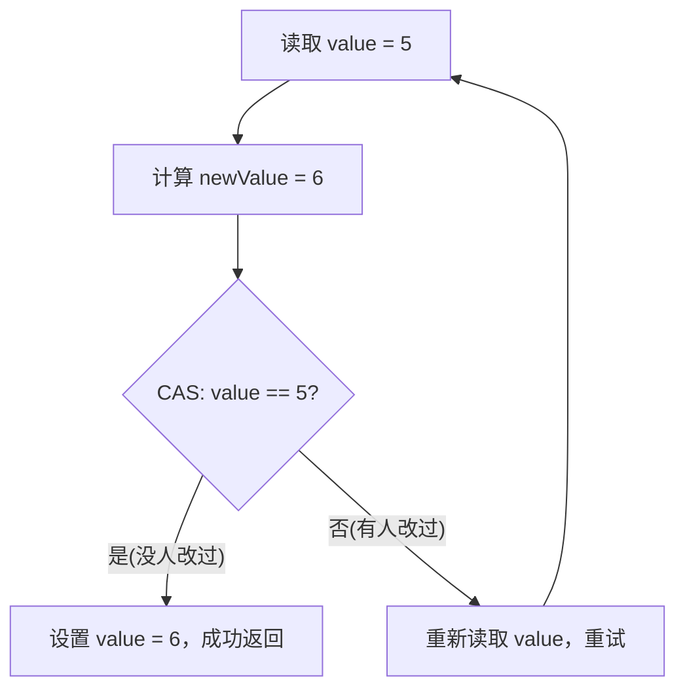
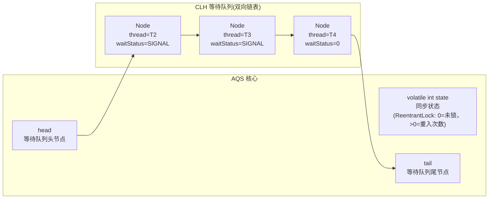
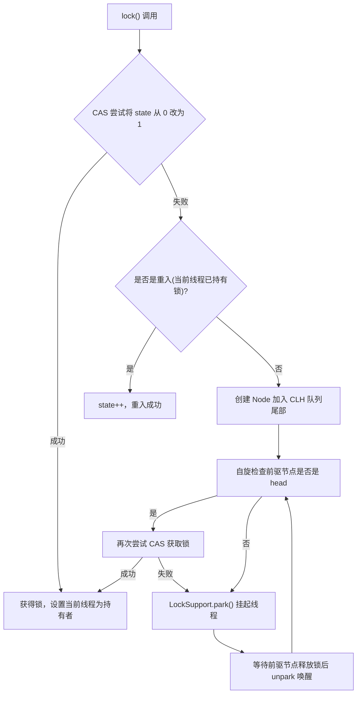
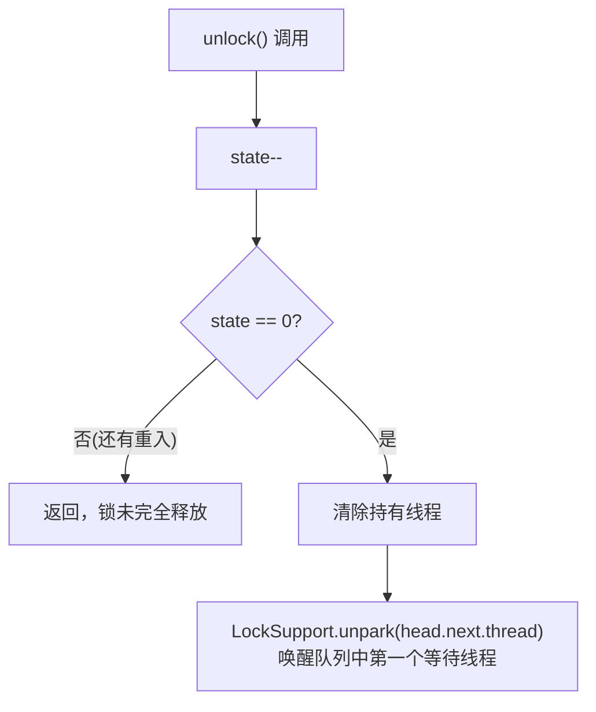
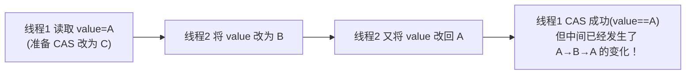

# AQS 与 CAS

---

## 1. 引入：它解决了什么问题？

**问题背景**：`synchronized` 是 JVM 层面的重量级锁，在竞争激烈时需要将线程挂起（涉及用户态→内核态切换），性能开销大。Java 并发包（`java.util.concurrent`）需要一套**更灵活、更高性能**的同步机制。

**AQS 和 CAS 解决的核心问题**：

| 问题 | 解决方案 |
| :----- | :----- |
| `synchronized` 不支持超时获取锁 | `ReentrantLock.tryLock(timeout)` |
| `synchronized` 不支持可中断等待 | `ReentrantLock.lockInterruptibly()` |
| `synchronized` 不支持公平锁 | `new ReentrantLock(true)` |
| `synchronized` 只有一个等待队列 | `Condition` 多个等待队列 |
| 简单计数器用锁太重 | `AtomicInteger` 基于 CAS 无锁操作 |

**典型应用场景**：

- `ReentrantLock`：需要超时、可中断、公平锁的场景
- `CountDownLatch`：等待多个线程完成（如并行查询后汇总结果）
- `Semaphore`：限流（如数据库连接池限制并发数）
- `AtomicInteger`：高并发计数器
- `ConcurrentHashMap`：JDK 8 的 put 操作用 CAS 实现无锁插入

---

## 2. 类比：用生活模型建立直觉

### AQS = 银行叫号系统

银行只有一个窗口（临界资源），客户来了先取号（加入等待队列），窗口空闲时叫号（唤醒队首线程）：

- **state（同步状态）** = 窗口是否有人在办理（0=空闲，1=占用）
- **CLH 等待队列** = 等候区的叫号队列
- **获取锁** = 取到号，走到窗口办理
- **释放锁** = 办理完毕，叫下一个号

**公平锁 vs 非公平锁**：

- **公平锁** = 严格按叫号顺序（先来先得）
- **非公平锁** = 新来的客户可以直接插队尝试（如果窗口刚好空闲就直接办理，不用排队）

### CAS = 乐观锁的"比较并交换"

就像两个人同时修改同一份 Google 文档：

- 你读取文档版本号为 v1，做了修改
- 提交时，先检查当前版本号是否还是 v1
- 如果是 v1（没人改过），提交成功，版本号变为 v2
- 如果不是 v1（别人改过了），提交失败，重新读取最新版本再修改

这就是 CAS：**Compare And Swap（比较并交换）**，不加锁，通过重试保证最终成功。

---

## 3. 原理：逐步拆解核心机制

### 3.1 CAS 原理

**CAS 是一条 CPU 原子指令**（`cmpxchg`），包含三个操作数：

- **内存地址 V**：要修改的变量
- **期望值 A**：认为变量当前应该是这个值
- **新值 B**：要设置的新值

**操作语义**：如果 V 的当前值等于 A，则将 V 设置为 B，返回 true；否则不修改，返回 false。

```java
// AtomicInteger.incrementAndGet()（JDK 8+）的真实实现
public final int incrementAndGet() {
    // 底层调用 Unsafe.getAndAddInt，它是 native + JIT intrinsic，
    // 在 x86 上会被 JIT 直接编译为 `LOCK XADD` 指令（原子加并返回旧值）。
    return U.getAndAddInt(this, VALUE, 1) + 1;
}

// 而 Unsafe.getAndAddInt 在不支持 LOCK XADD 的平台上的后备实现才是这种自旋 CAS 循环：
public final int getAndAddInt(Object o, long offset, int delta) {
    int v;
    do {
        v = getIntVolatile(o, offset);                   // volatile 读，拿到当前值
    } while (!compareAndSwapInt(o, offset, v, v + delta)); // CAS，失败重试
    return v;
}
```



### 3.2 AQS 介绍

**AQS（AbstractQueuedSynchronizer，抽象队列同步器）** 是 `java.util.concurrent.locks` 包下的一个抽象基类，由 Doug Lea 在 JDK 1.5 中引入，是整个 Java 并发包的**核心基础框架**。

`ReentrantLock`、`CountDownLatch`、`Semaphore`、`ReentrantReadWriteLock` 等同步工具类直接基于 AQS 实现；**`CyclicBarrier` 没有直接继承 AQS**，而是在内部用一把 `ReentrantLock` + `Condition` 组合实现（间接复用了 AQS）。

#### AQS 的继承体系

```txt
AbstractOwnableSynchronizer          ← 记录当前持有独占锁的线程
    └── AbstractQueuedSynchronizer   ← AQS 核心（本节主角）
            ├── ReentrantLock.Sync
            ├── CountDownLatch.Sync
            ├── Semaphore.Sync
            └── ReentrantReadWriteLock.Sync
```

#### AQS 的三大核心要素

| 要素 | 类型 | 作用 |
| :----- | :--- | :----- |
| `state` | `volatile int` | 同步状态，含义由子类定义（如 ReentrantLock 用它记录重入次数，Semaphore 用它记录剩余许可数） |
| CLH 等待队列 | 双向链表 | 存放所有等待获取同步状态的线程节点，保证线程按顺序被唤醒 |
| `exclusiveOwnerThread` | `Thread` | 当前持有独占锁的线程（继承自 `AbstractOwnableSynchronizer`） |

#### AQS 的工作模式

AQS 支持两种同步模式，子类选择其一实现：

```txt
独占模式（Exclusive）                    共享模式（Shared）
─────────────────────                   ─────────────────────
同一时刻只有一个线程持有                  同一时刻多个线程可以持有
代表：ReentrantLock                      代表：CountDownLatch、Semaphore
实现：tryAcquire / tryRelease            实现：tryAcquireShared / tryReleaseShared
```

!!! note
    AQS 本身不实现任何同步语义，它只提供了**线程排队、挂起、唤醒**的通用框架。具体"什么条件下能获取同步状态"完全由子类通过重写钩子方法来定义，这是 AQS 能支撑如此多不同并发工具的根本原因。

### 3.3 AQS 核心结构



**获取锁的流程**：



**释放锁的流程**：



### 3.4 CAS 的 ABA 问题



**ABA 问题的危害**：在某些场景下（如链表操作），ABA 变化可能导致数据结构损坏。

**解决方案**：`AtomicStampedReference` — 每次修改同时更新版本号（stamp），CAS 同时比较值和版本号：

```java
AtomicStampedReference<Integer> ref = new AtomicStampedReference<>(1, 0);

// 读取当前值和版本号
int[] stampHolder = new int[1];
Integer value = ref.get(stampHolder);
int stamp = stampHolder[0];

// CAS：同时比较值和版本号
ref.compareAndSet(value, newValue, stamp, stamp + 1);
// 即使值相同，版本号不同也会失败，解决 ABA 问题
```

---

## 4. 特性：关键对比

### ReentrantLock vs synchronized

| 对比项 | synchronized | ReentrantLock |
| :----- | :----- | :----- |
| **实现层面** | JVM 内置关键字 | Java 代码（基于 AQS） |
| **可中断等待** | ❌ | ✅ `lockInterruptibly()` |
| **超时获取锁** | ❌ | ✅ `tryLock(timeout, unit)` |
| **公平锁** | ❌（非公平） | ✅ `new ReentrantLock(true)` |
| **多个等待队列** | ❌（一个 wait set） | ✅ 多个 `Condition` |
| **自动释放** | ✅（代码块结束自动释放） | ❌ 必须在 finally 中 `unlock()` |
| **性能** | JDK 6 后差距不大 | 高竞争场景略好 |

**选择原则**：大多数场景用 `synchronized` 即可（更简单，不会忘记释放锁）；只有需要超时、可中断、公平锁、多条件队列时才用 `ReentrantLock`。

### 常用并发工具类

| 工具类 | 基于 | 用途 | 典型场景 |
| :--- | :--- | :--- | :--- |
| `ReentrantLock` | AQS | 可重入互斥锁 | 替代 synchronized |
| `ReentrantReadWriteLock` | AQS | 读写锁 | 读多写少场景 |
| `CountDownLatch` | AQS | 等待 N 个事件完成 | 并行任务汇总 |
| `CyclicBarrier` | ReentrantLock | N 个线程互相等待 | 分阶段并行计算 |
| `Semaphore` | AQS | 限制并发数 | 连接池、限流 |
| `AtomicInteger` | CAS | 原子整数 | 高并发计数器 |
| `AtomicStampedReference` | CAS | 带版本号的原子引用 | 解决 ABA 问题 |

---

## 5. 边界：异常情况与常见误区

### ❌ 误区1：忘记在 finally 中释放 ReentrantLock

```java
// ❌ 如果 doSomething() 抛出异常，锁永远不会释放 → 死锁！
lock.lock();
doSomething();
lock.unlock();

// ✅ 必须在 finally 中释放
lock.lock();
try {
    doSomething();
} finally {
    lock.unlock();  // 无论是否异常，都会释放
}
```

### ❌ 误区2：CAS 自旋在高竞争下性能差

CAS 失败后会自旋重试，如果竞争非常激烈，大量线程不断自旋，会**白白消耗 CPU**。

**解决方案**：

- 高竞争场景用 `synchronized`（失败后线程挂起，不消耗 CPU）
- 或使用 `LongAdder` 替代 `AtomicLong`（分段累加，减少竞争）

### ❌ 误区3：CountDownLatch 不能重用

`CountDownLatch` 的计数器减到 0 后不能重置，如果需要重复使用，应该用 `CyclicBarrier`（可以重置）。

### 边界：AQS 的公平锁 vs 非公平锁性能

- **非公平锁**：新来的线程可以直接 CAS 抢锁，不用排队。如果恰好锁刚释放，可以直接获得，减少了线程切换，**吞吐量更高**。
- **公平锁**：严格按队列顺序，每次都要检查队列，**延迟更稳定**但吞吐量略低。

`ReentrantLock` 默认是**非公平锁**，这是性能优先的设计选择。

---

## 6. 设计原因：为什么这样设计？

### 为什么 AQS 用 CLH 变种队列而不用普通链表？

CLH（Craig, Landin, and Hagersten）队列原本是一种**单向**的自旋锁队列，每个节点自旋等待前驱节点的状态。AQS 在此基础上做了两点改造，常被称为 **CLH 变种**：

1. **单向 → 双向链表**：节点同时带 `prev` 和 `next`——支持 O(1) 定位前驱和删除取消的节点
2. **自旋 → 阻塞**：头节点以外的节点通过 `LockSupport.park()` 挂起，不再空转 CPU；只有头节点后继在被 `unpark` 后会做一次短自旋 + CAS 尝试抢锁

这两条改造使 AQS 队列同时具备：

1. 每个线程只关注自己的前驱节点，减少了缓存一致性流量（继承于 CLH 的原生优势）
2. 通过 `LockSupport.park()` 将自旋改为挂起，避免 CPU 空转
3. 双向链表支持取消等待（将节点从队列中移除）
### 为什么 CAS 是原子操作？

CAS 对应 CPU 的 `cmpxchg` 指令，在多核 CPU 上通过两种机制保证原子性：

- **缓存锁**（首选，现代 CPU 的主要方式）：通过 MESI 协议锁定目标缓存行，粒度细、性能好
- **总线锁**（降级方案）：当操作跨越缓存行边界、或缓存锁不支持时才使用，会锁住整条总线

这是**硬件层面**的保证，比软件锁（`synchronized` 进入重量级后需要操作系统单元）的开销小得多；但 CAS 相比无锁读写仍有显著开销（一条 `LOCK CMPXCHG` 在 x86 上数十个时钟周期起，远超一条普通 `MOV`）。

### 为什么 AtomicLong 在高并发下要用 LongAdder 替代？

`AtomicLong` 所有线程竞争同一个变量，CAS 失败率高，大量自旋浪费 CPU。`LongAdder` 将值分散到多个 Cell（类似 ConcurrentHashMap 的分段思想），每个线程优先更新自己对应的 Cell，最终求和时汇总所有 Cell，大幅减少竞争。代价是读取时需要汇总，适合**写多读少**的计数场景。

---

## 7. 深入底层：硬件与 JVM 视角

### 7.1 CAS 的 CPU 指令实现

CAS 在 x86 架构下对应 `LOCK CMPXCHG` 指令。`LOCK` 前缀的作用是在执行 `CMPXCHG` 期间锁定总线（或缓存行），确保多核环境下的原子性。

```txt
; x86 汇编伪代码
; compareAndSet(expected=5, update=6)
MOV  EAX, 5          ; 将期望值 5 放入 EAX 寄存器
MOV  EBX, 6          ; 将新值 6 放入 EBX 寄存器
LOCK CMPXCHG [addr], EBX
; 若 [addr] == EAX(5)，则 [addr] = EBX(6)，ZF=1（成功）
; 若 [addr] != EAX(5)，则 EAX = [addr]，ZF=0（失败，EAX 被更新为实际值）
```

**MESI 缓存一致性协议**保证了多核下 CAS 的正确性：

```txt
┌─────────────────────────────────────────────────────────────┐
│                      多核 CPU 架构                           │
│                                                             │
│  Core 0          Core 1          Core 2                     │
│  ┌────────┐      ┌────────┐      ┌────────┐                 │
│  │ L1/L2  │      │ L1/L2  │      │ L1/L2  │                 │
│  │ Cache  │      │ Cache  │      │ Cache  │                 │
│  └───┬────┘      └───┬────┘      └───┬────┘                 │
│      │               │               │                      │
│  ────┴───────────────┴───────────────┴────  L3 Cache        │
│                       │                                     │
│                  ─────┴─────  主内存 (RAM)                   │
└─────────────────────────────────────────────────────────────┘

MESI 状态：
  M (Modified)  - 缓存行已修改，与主内存不一致，独占
  E (Exclusive) - 缓存行与主内存一致，独占（其他核无此缓存行）
  S (Shared)    - 缓存行与主内存一致，多核共享
  I (Invalid)   - 缓存行无效，需要重新从主内存/其他核加载

CAS 执行时：
  1. 发出 LOCK 信号，锁定目标缓存行
  2. 将其他核中该缓存行状态置为 I（Invalid）
  3. 执行比较并交换，将本核缓存行置为 M（Modified）
  4. 释放 LOCK，其他核若需要该值，触发缓存一致性协议同步
```

!!! note
    `LOCK CMPXCHG` 在现代 CPU 上优先使用**缓存锁**（锁定缓存行），而非总线锁（锁定整条总线）。缓存锁的粒度更细，性能更好。只有当操作的内存地址跨越缓存行边界，或 CPU 不支持缓存锁时，才退化为总线锁。

### 7.2 volatile 与 CAS 的配合

CAS 操作的变量必须用 `volatile` 修饰，原因是：

- **CAS 保证原子性**：比较+交换是一个不可分割的原子操作
- **volatile 保证可见性**：每次读取都从主内存获取最新值，每次写入立即刷新到主内存
- **volatile 保证有序性**：禁止指令重排序（通过内存屏障实现）

```java
// Unsafe 类中 CAS 的底层调用（JDK 源码简化）
public final class AtomicInteger extends Number {
    // volatile 保证可见性，CAS 保证原子性，两者缺一不可
    private volatile int value;

    // 最终调用 Unsafe.compareAndSwapInt()
    // 该方法是 native 方法，直接映射到 LOCK CMPXCHG 指令
    public final boolean compareAndSet(int expect, int update) {
        return unsafe.compareAndSwapInt(this, valueOffset, expect, update);
    }
}
```

!!! tip
    JDK 9 之后，`Unsafe` 的 CAS 操作被 `VarHandle` 替代，提供了更安全、更规范的底层访问方式。`VarHandle.compareAndSet()` 是推荐的新写法，但底层原理相同。

### 7.3 AQS 中的内存屏障

AQS 的 `state` 字段是 `volatile` 的，这意味着：

```java
// AQS 源码（简化）
public abstract class AbstractQueuedSynchronizer {
    // volatile 写：释放锁时，确保临界区内的所有写操作对后续获取锁的线程可见
    private volatile int state;

    protected final void setState(int newState) {
        state = newState;  // volatile 写，插入 StoreStore + StoreLoad 屏障
    }

    protected final int getState() {
        return state;  // volatile 读，插入 LoadLoad + LoadStore 屏障
    }
}
```

```txt
线程 A（持有锁，执行临界区）          线程 B（等待锁）
─────────────────────────────────────────────────────
写入共享数据 x = 1
写入共享数据 y = 2
setState(0)  ← volatile 写          
  [StoreStore 屏障]                  
  [StoreLoad  屏障]                  
                                     getState() → 读到 0
                                       [LoadLoad  屏障]
                                       [LoadStore 屏障]
                                     读取 x → 保证看到 1
                                     读取 y → 保证看到 2
```

**结论**：`volatile` 的 `state` 字段充当了 happens-before 的"桥梁"，保证了线程 A 在临界区内的所有写操作，对线程 B 获取锁之后的读操作可见。

---

## 8. 进阶：AQS 模板方法与自定义同步器

### 8.1 AQS 的模板方法设计模式

AQS 是一个典型的**模板方法模式**：框架定义了同步的骨架流程，子类只需实现少数几个钩子方法来定义"什么情况下算获取成功"。

```txt
AbstractQueuedSynchronizer（模板）
├── acquire(int arg)          ← 模板方法，定义获取锁的完整流程
│   ├── tryAcquire(arg)       ← 钩子方法，子类实现（独占模式）
│   ├── addWaiter(Node.EXCLUSIVE)
│   └── acquireQueued(node, arg)
│
├── release(int arg)          ← 模板方法，定义释放锁的完整流程
│   └── tryRelease(arg)       ← 钩子方法，子类实现（独占模式）
│
├── acquireShared(int arg)    ← 模板方法（共享模式）
│   └── tryAcquireShared(arg) ← 钩子方法，子类实现（共享模式）
│
└── releaseShared(int arg)    ← 模板方法（共享模式）
    └── tryReleaseShared(arg) ← 钩子方法，子类实现（共享模式）
```

| 模式 | 代表实现 | 说明 |
| :----- | :----- | :----- |
| **独占模式** | `ReentrantLock` | 同一时刻只有一个线程持有 |
| **共享模式** | `CountDownLatch`、`Semaphore`、`ReadLock` | 同一时刻多个线程可以持有 |

### 8.2 自定义同步器：实现一个不可重入互斥锁

通过实现 AQS 的钩子方法，可以快速构建自定义同步器：

```java
/**
 * 基于 AQS 实现的简单不可重入互斥锁
 * state = 0：未锁定；state = 1：已锁定
 */
public class SimpleMutex implements Lock {

    // 内部类：继承 AQS，实现独占模式的钩子方法
    private static class Sync extends AbstractQueuedSynchronizer {

        // 尝试获取锁：CAS 将 state 从 0 改为 1
        @Override
        protected boolean tryAcquire(int acquires) {
            if (compareAndSetState(0, 1)) {
                setExclusiveOwnerThread(Thread.currentThread());
                return true;
            }
            return false;  // 不支持重入，直接返回 false
        }

        // 尝试释放锁：将 state 从 1 改为 0
        @Override
        protected boolean tryRelease(int releases) {
            if (getState() == 0) throw new IllegalMonitorStateException();
            setExclusiveOwnerThread(null);
            setState(0);  // volatile 写，保证可见性
            return true;
        }

        // 是否被当前线程持有（用于 Condition 判断）
        @Override
        protected boolean isHeldExclusively() {
            return getState() == 1;
        }

        // 提供 Condition 支持
        Condition newCondition() {
            return new ConditionObject();
        }
    }

    private final Sync sync = new Sync();

    @Override
    public void lock() {
        sync.acquire(1);  // 调用 AQS 模板方法
    }

    @Override
    public boolean tryLock() {
        return sync.tryAcquire(1);
    }

    @Override
    public void unlock() {
        sync.release(1);  // 调用 AQS 模板方法
    }

    @Override
    public Condition newCondition() {
        return sync.newCondition();
    }

    // ... 其他 Lock 接口方法省略
    @Override public void lockInterruptibly() throws InterruptedException { sync.acquireInterruptibly(1); }
    @Override public boolean tryLock(long time, TimeUnit unit) throws InterruptedException { return sync.tryAcquireNanos(1, unit.toNanos(time)); }
}
```

```java
// 使用示例
SimpleMutex mutex = new SimpleMutex();
mutex.lock();
try {
    // 临界区
} finally {
    mutex.unlock();
}
```

!!! tip
    可以看到，自定义同步器只需要实现 `tryAcquire` 和 `tryRelease` 两个方法，排队、挂起、唤醒等复杂逻辑全部由 AQS 框架处理。这正是 AQS 的价值所在：**将同步状态管理与线程调度解耦**。

### 8.3 CountDownLatch 的共享模式实现原理

`CountDownLatch` 是共享模式的典型实现，理解它有助于掌握 AQS 共享模式：

```java
// CountDownLatch 内部 Sync（简化）
private static final class Sync extends AbstractQueuedSynchronizer {
    Sync(int count) {
        setState(count);  // state = 初始计数值
    }

    // 共享模式获取：state == 0 时才能获取（await() 才能通过）
    @Override
    protected int tryAcquireShared(int acquires) {
        return (getState() == 0) ? 1 : -1;
        // 返回 >= 0 表示获取成功；返回 < 0 表示获取失败，进入等待队列
    }

    // 共享模式释放：state-- 直到 0（countDown() 的实现）
    @Override
    protected boolean tryReleaseShared(int releases) {
        for (;;) {
            int c = getState();
            if (c == 0) return false;
            int nextc = c - 1;
            if (compareAndSetState(c, nextc))
                return nextc == 0;  // 减到 0 时返回 true，触发唤醒所有等待线程
        }
    }
}
```

```txt
CountDownLatch(3) 执行流程：

初始 state = 3

await() 线程 ──→ tryAcquireShared() 返回 -1 ──→ 进入等待队列，park()

countDown() ──→ state: 3 → 2
countDown() ──→ state: 2 → 1
countDown() ──→ state: 1 → 0 ──→ tryReleaseShared 返回 true
                                  ──→ doReleaseShared()
                                  ──→ unpark 所有等待线程（共享传播）
                                  ──→ await() 线程全部唤醒
```

!!! note
    共享模式与独占模式的关键区别：共享模式唤醒时会**传播唤醒**（`doReleaseShared`），即唤醒一个线程后，该线程还会继续唤醒后续等待线程，直到没有更多可唤醒的线程为止。这保证了 `CountDownLatch.await()` 能同时唤醒所有等待线程。

---

## 9. 进阶工具：StampedLock 与 LongAdder

### 9.1 StampedLock：比 ReadWriteLock 更高性能的读写锁

`ReentrantReadWriteLock` 的问题：读锁和写锁互斥，大量读线程会导致写线程长期饥饿。JDK 8 引入的 `StampedLock` 通过**乐观读**解决了这个问题。

**三种模式**：

| 模式 | 方法 | 说明 |
| :--- | :--- | :--- |
| **写锁** | `writeLock()` | 独占，与读锁互斥 |
| **悲观读锁** | `readLock()` | 共享，与写锁互斥（类似 ReadWriteLock） |
| **乐观读** | `tryOptimisticRead()` | **不加锁**，读完后验证是否有写操作发生 |

> 📌 `StampedLock` 的 stamp 是一个 64 位 `long`，内部用低几位表示锁模式位，高位表示写版本数。**不是“奇数=有写锁，偶数=无写锁”的简单奇偶判定**（这是一些简化教程里的错误流传）；应一律通过 `lock.validate(stamp)` 判断乐观读是否有效，而不要自己解析 stamp。

```java
private final StampedLock lock = new StampedLock();
private double x, y;

// 乐观读：性能最高，适合读多写少且读操作耗时短的场景
public double distanceFromOrigin() {
    // 1. 获取乐观读戳（不加锁，仅记录当前版本号）
    long stamp = lock.tryOptimisticRead();

    // 2. 读取数据（可能与写操作并发）
    double currentX = x, currentY = y;

    // 3. 验证：读取期间是否有写操作发生
    if (!lock.validate(stamp)) {
        // 4. 验证失败（有写操作），升级为悲观读锁
        stamp = lock.readLock();
        try {
            currentX = x;
            currentY = y;
        } finally {
            lock.unlockRead(stamp);
        }
    }

    return Math.sqrt(currentX * currentX + currentY * currentY);
}

// 写操作
public void move(double deltaX, double deltaY) {
    long stamp = lock.writeLock();
    try {
        x += deltaX;
        y += deltaY;
    } finally {
        lock.unlockWrite(stamp);
    }
}
```

```txt
StampedLock 乐观读流程：

tryOptimisticRead()
  └─ 返回 stamp（非 0 表示当前无写锁；0 表示当前已有写锁，乐观读失败）

读取数据（不加锁）

validate(stamp)
  ├─ stamp 仍有效 → 读取有效，直接使用 ✅
  └─ stamp 已失效（期间发生了写操作）→ 读取无效，升级为悲观读锁 🔄
```

!!! warning
    `StampedLock` **不支持重入**，也**不支持 Condition**，且不可中断的锁获取可能导致线程无法响应中断。在使用时需要特别注意：

    - 不要在持有 `StampedLock` 的情况下调用可能阻塞的 I/O 操作
    - 不要在 `StampedLock` 的锁内部再次获取同一个 `StampedLock`（会死锁）
    - 推荐使用 `readLockInterruptibly()` 和 `writeLockInterruptibly()` 替代不可中断版本

### 9.2 LongAdder：高并发计数器的最优解

**AtomicLong 的瓶颈**：所有线程竞争同一个 `value` 变量，CAS 失败率随并发数线性增长。

**LongAdder 的分段思想**：

```txt
AtomicLong（高竞争时）：
  Thread1 ──→ CAS(value) ──→ 失败，自旋
  Thread2 ──→ CAS(value) ──→ 成功
  Thread3 ──→ CAS(value) ──→ 失败，自旋
  Thread4 ──→ CAS(value) ──→ 失败，自旋
  （大量 CPU 空转）

LongAdder（高竞争时）：
  base = 0
  cells = [Cell(3), Cell(7), Cell(2), Cell(5)]
                ↑         ↑         ↑         ↑
            Thread1   Thread2   Thread3   Thread4
  （每个线程操作自己的 Cell，几乎无竞争）

  sum() = base + cells[0] + cells[1] + cells[2] + cells[3]
        = 0 + 3 + 7 + 2 + 5 = 17
```

```java
// LongAdder 核心逻辑（Striped64 简化）
public void add(long x) {
    Cell[] as;
    long b, v;
    // 1. 优先尝试直接 CAS 更新 base（低竞争时走这条路）
    if ((as = cells) != null || !casBase(b = base, b + x)) {
        // 2. base CAS 失败，说明有竞争，找到当前线程对应的 Cell
        int index = getProbe() & (as.length - 1);  // 线程探针哈希
        Cell cell = as[index];
        // 3. 对 Cell 执行 CAS（竞争分散到各个 Cell）
        if (cell == null || !cell.cas(v = cell.value, v + x)) {
            longAccumulate(x, null, ...);  // Cell 不存在或 CAS 失败，扩容或重试
        }
    }
}

public long sum() {
    // 汇总 base + 所有 Cell 的值（非原子操作，可能读到中间状态）
    long sum = base;
    Cell[] as = cells;
    if (as != null) {
        for (Cell a : as) if (a != null) sum += a.value;
    }
    return sum;
}
```

!!! warning
    `LongAdder.sum()` 不是原子操作，在并发写入时读取到的值可能不是精确的瞬时值。如果需要**精确的原子读取**（如实现序列号生成器），应使用 `AtomicLong`；如果只是统计计数（如 QPS 统计），`LongAdder` 是更好的选择。

**性能对比**（数量级示意，具体数值依赖 JDK 版本/硬件/线程数，严谨对比请用 JMH 自测）：

| 工具 | 高并发计数场景的相对吞吐量 | 适用场景 |
| :----- | :----- | :----- |
| `synchronized` | 最低（线程挂起/唤醒开销大） | 通用，低并发 |
| `AtomicLong` | 中（线程数 ≈ 核心数时 CAS 失败率上升） | 需要精确原子读写 |
| `LongAdder` | 最高（线程数越多优势越大） | 高并发纯计数，允许非精确读 |

> 📌 三者在**低并发**（线程数 ≤ 4）下吞吐量差距不大；`LongAdder` 优势在线程数超过 CPU 核心数后才明显。

---

## 10. 总结：面试标准化表达

> **面试问：AQS 的原理是什么？**

**标准答法**：

AQS（AbstractQueuedSynchronizer）是 Java 并发包的核心框架，`ReentrantLock`、`CountDownLatch`、`Semaphore` 都基于它实现。

AQS 的核心是一个 `volatile int state`（同步状态）和一个 CLH 双向等待队列。

获取锁时，线程通过 CAS 尝试修改 state（如从 0 改为 1）；失败则创建 Node 加入等待队列，并通过 `LockSupport.park()` 挂起。释放锁时，将 state 改回 0，然后 `unpark` 唤醒队列中的第一个等待线程。

`ReentrantLock` 支持重入，是通过 state 记录重入次数实现的（同一线程每次 lock state++，每次 unlock state--，减到 0 才真正释放）。

> **面试问：CAS 的 ABA 问题是什么？如何解决？**

**标准答法**：

ABA 问题是指：线程1 读取变量值为 A，此时线程2 将值改为 B，再改回 A。线程1 执行 CAS 时，发现值还是 A，认为没有变化，CAS 成功。但实际上中间已经发生了 A→B→A 的变化，在某些场景下（如链表操作）可能导致数据错误。

解决方案是使用 `AtomicStampedReference`，在每次修改时同时更新一个版本号（stamp）。CAS 时同时比较值和版本号，即使值相同，版本号不同也会失败，从而检测到 ABA 变化。

---

## 11. 生产实践建议

### 锁选型决策树

```txt
需要同步？
├─ 只是简单计数/标志位？
│   ├─ 高并发写多读少 → LongAdder / AtomicLong
│   └─ 低并发 → AtomicInteger
│
├─ 需要互斥锁？
│   ├─ 不需要超时/中断/公平/多条件 → synchronized（优先）
│   └─ 需要上述特性 → ReentrantLock
│
├─ 读多写少？
│   ├─ 读操作极短且写操作不频繁 → StampedLock（乐观读）
│   └─ 一般读多写少 → ReentrantReadWriteLock
│
└─ 线程协调？
    ├─ 等待 N 个任务完成 → CountDownLatch
    ├─ N 个线程互相等待到同一起跑线 → CyclicBarrier
    └─ 限制并发数量 → Semaphore
```

!!! tip
    **优先使用 `synchronized`**：JDK 6 之后 `synchronized` 引入了偏向锁、轻量级锁优化，在低竞争场景下性能与 `ReentrantLock` 相当，且代码更简洁，不会因忘记 `unlock()` 导致死锁。只有在确实需要 `ReentrantLock` 的高级特性时才切换。

### 常见生产问题排查

!!! warning "死锁排查"
    当系统出现线程卡死时，使用 `jstack <pid>` 生成线程转储，搜索 `BLOCKED` 状态的线程和 `waiting to lock` 关键字。JDK 自带的死锁检测会在 jstack 输出末尾打印 `Found one Java-level deadlock` 提示。

    ```bash
    # 生成线程转储
    jstack -l <pid> > thread_dump.txt

    # 搜索死锁信息
    grep -A 20 "deadlock" thread_dump.txt
    ```

!!! warning
    **锁竞争热点**：使用 Java Flight Recorder（JFR）监控锁竞争：

    ```bash
    # 启动时开启 JFR
    java -XX:StartFlightRecording=duration=60s,filename=recording.jfr MyApp

    # 或运行时动态开启（JDK 11+）
    jcmd <pid> JFR.start duration=60s filename=recording.jfr
    ```

    在 JDK Mission Control 中打开录制文件，查看 **Lock Instances** 视图，可以直观看到哪些锁竞争最激烈、平均等待时间多长。

!!! note
    **LongAdder vs AtomicLong 选型**：在实际压测中，当并发线程数超过 CPU 核心数时，`LongAdder` 的优势才会明显体现。对于并发数较低（< 8 线程）的场景，两者性能差异不大，此时 `AtomicLong` 的语义更清晰（支持 `get()` 精确读取），是更好的选择。
