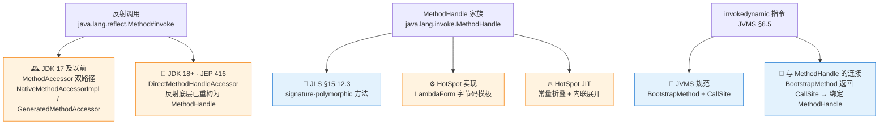
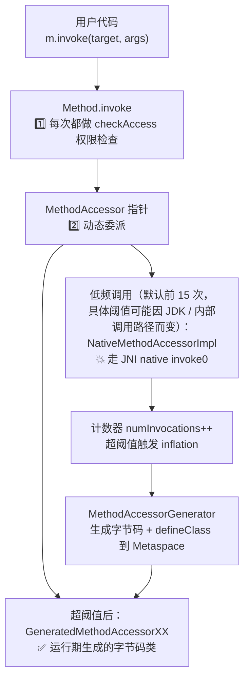
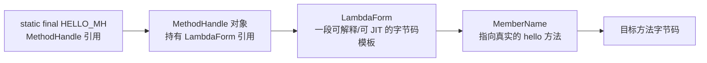

# 反射（Reflection）：调用链、字节码指令与 JIT 内联的三层视角

在 Java 生态里，**反射（Reflection）** 是所有主流框架的隐形地基——Spring IoC 的 Bean 实例化、MyBatis 的结果集映射、Jackson 的字段序列化、JUnit 的测试方法调度、Dubbo 的远程服务调用，都在其动态发现与调用链路上大量使用 `Class.forName` + `Method.invoke` + `Field.get/set` 这套 API（现代框架通常还会叠加 `MethodHandle` / `VarHandle` / 字节码生成 / 代理 / 缓存等组合机制）。它赋予了 Java "编译期未知、运行期动态发现"的超能力，让"配置驱动"和"插件化架构"成为可能。

然而这份"超能力"从来都不是免费的。每一次 `Method.invoke` 的背后，都藏着一场跨越三层规范的博弈：**Java 语言规范（JLS）** 规定了调用语义、**JVM 规范（JVMS）** 决定了字节码指令与分派规则、**HotSpot 实现（且随 JDK 版本演化）** 决定了具体调用链的物理形态。三层交织，让"反射慢"不是一句静态的口诀，而是一条会随着 JDK 版本重塑的动态曲线。

你是否真正直面过这些问题：

- 为什么 `Method.invoke` 在 JDK 17 与 JDK 18 上的调用栈**完全不同**？JEP 416 到底改了哪一层？
- `MethodHandle.invokeExact` 的"签名多态"（signature-polymorphic）到底是 JLS 的规定，还是 JVMS 的规定？它跟 `invokedynamic` 是什么关系？
- 为什么 `AtomicInteger` 到 JDK 21 都还在用 `jdk.internal.misc.Unsafe`？`VarHandle` 只是"官方替代"却没能替代 JDK 内部原子类？
- 为什么 JDK 动态代理只能代理接口、CGLIB 遇到 `final` 类会直接罢工？两者在字节码层的差异到底是什么？

真正优秀的架构师，不会满足于"反射慢 = 用 MethodHandle" 这一层浅薄的选型口诀。本篇我们将按 **"业务痛点 → 字节码考古 → 物理内存布局 → 工程红线"** 四层垂直透视展开，并**在每个技术点显式标注归属哪一层规范**——JLS / JVMS / HotSpot 实现——让你既看清 Java 反射的"本质契约"，又能识别哪些是"HotSpot 特定版本的实现细节"。

!!! note "📖 阅读约定：三层规范体系（含衍生层）"
    本文正文所有技术断言都会标注归属层次，请留意以下惯例：

    - **JLS**（Java Language Specification）：Java 语言层面的**永恒契约**，跨 JDK 版本稳定。示例：JLS 对 signature-polymorphic method invocation 有专门规定，`MethodHandle.invokeExact` / `VarHandle.*` 家族属此范畴。
    - **JVMS**（Java Virtual Machine Specification）：字节码指令与分派规则，跨实现稳定。示例：`invokedynamic` 指令通过 `BootstrapMethod` 绑定 `CallSite`；JVMS 也定义了 signature-polymorphic 方法的字节码表示。
    - **HotSpot 实现**（且标注 JDK 版本）：随 OpenJDK 版本演化的实现细节。示例：`MethodAccessor` inflation 阈值（HotSpot ≤ JDK 17）、`LambdaForm` 常量折叠（HotSpot 全版本）、C2 内联启发式。

    ⚠️ 遇到"HotSpot 实现"标签的内容时，请把它当作**"当前主流 JDK 的一种实现方式"**，而不是"Java 语言规律"——同一段代码在 GraalVM / OpenJ9 上完全可能走不同的物理路径。

    **📌 三层之外的衍生层**：本文还会出现三个不属于上述三层但同样重要的归属标签，请一并注意：

    - **Java API 契约**：`java.base` 等标准模块公开 API 的行为规范（如 `VarHandle` 访问模式集合、`MethodHandles.Lookup` 权限模型）——跨实现稳定，但不属于 JLS / JVMS。
    - **JDK 内部实现选型**：`java.base` 内部模块的实现选择（如 `AtomicInteger` 用 `jdk.internal.misc.Unsafe` 而非 `VarHandle`）——随 JDK 版本演化，不承诺兼容。
    - **框架实现契约**：Spring / MyBatis / Jackson 等第三方框架的实现约定——由框架自身版本决定。

---

## 1. 第一层：业务痛点 —— 从"框架启动慢"到"热点接口 P99 飙升"

### 1.1 悬案一：Spring 冷启动被 10 万次反射拖到 30 秒级

先看一段几乎所有 Spring Boot 项目在服务发现/自动装配场景里都会经历的现象（**以下为示意场景，非实际生产数据**）：

```txt
📌 示意日志（非实际生产数据，用于说明现象量级）：

Application started: Scanning ~10K candidate components ...
Application started: Instantiating ~3K beans ...
Application started: Injecting dependencies via reflection ...
Application started in 20~30 seconds  // 💥 冷启动瓶颈
```

在传统单体架构里 20~30 秒冷启动勉强可忍，但在 K8s 弹性扩容、Serverless 冷启动、CI/CD 流水线里就是致命瓶颈。**问题不在反射本身，而在这几万到几十万次调用里绝大多数都发生在"极低频"边界之内**——绝大多数 Bean 的字段注入只发生 1~3 次，永远够不到反射自我优化的门槛（假设你在 JDK ≤17 上运行）。

要破解这个悬案，我们必须搞清楚：`Method.invoke` 内部在**不同 JDK 版本**上到底走什么样的调用链？JDK 18 之后的实现（JEP 416）是否已经把这个瓶颈缓解？

### 1.2 悬案二：热点接口 Jackson 反序列化撞上 GC 抖动

再看一段高并发生产环境里几乎每个团队都写过的代码：

```java
@RestController
public class OrderController {
    private final ObjectMapper mapper = new ObjectMapper();

    @PostMapping("/api/orders")
    public OrderResponse createOrder(@RequestBody String body) throws Exception {
        // ❌ 高并发热点：假设每秒数万次反序列化
        OrderRequest req = mapper.readValue(body, OrderRequest.class);
        return orderService.create(req);
    }
}
```

单元测试跑起来毫无异样。一旦压测把 QPS 冲到万级以上，Young GC 频率可能从"分钟级"劣化到"秒级"，接口 P99 延迟呈台阶式跳升。

⚠️ **但注意**：现代 Jackson 在**首次反序列化目标类时**会缓存字段访问器（`AnnotatedMethod` + 内部 `MemberKey` 缓存），并不是"每一次调用都新建一个反射查找"。真正落到反射调用层的物理成本主要有两块：

1. **`Method.invoke` 内部的调用链开销**——这一块随 JDK 版本变化很大（详见 §2）
2. **调用方 varargs 装箱产生的 `Object[]` + 基本类型的自动装箱**——这一块由**调用者字节码**决定，与反射内部实现无关

到底是哪一块在字节码层面阻挡了 JIT 的内联？为什么 `MethodHandle` 能绕开这道墙？答案要到字节码考古现场才能揭晓。

---

## 2. 第二层：字节码考古 —— 四条独立技术线索的字节码真相

许多人把反射、`MethodHandle`、`invokedynamic` 混为一谈，认为它们是"同一件事的不同名字"。这个印象是**错的**——它们在字节码层是**四条独立的技术线索**，只是在 HotSpot 的具体实现里发生过历史性的融合（JEP 416）。

本层我们按下面四条主线各自考古：



- **蓝底 = 规范层保证**（JLS / JVMS，跨实现稳定）
- **橙底 = HotSpot 实现细节**（且随 JDK 版本演化）

### 2.1 分支一 · JDK 17 及以前的反射调用链（HotSpot 实现，历史模型）

先看 JDK 17 及以前的**经典模型**——这是绝大多数博客、面经、老手记忆里"反射内部是怎么回事"的默认版本。

写一段最普通的反射调用：

```java
public class ReflectionProbe {
    public String hello(String name) { return "Hello, " + name; }

    public static void main(String[] args) throws Exception {
        Method m = ReflectionProbe.class.getDeclaredMethod("hello", String.class);
        ReflectionProbe target = new ReflectionProbe();
        m.invoke(target, "World");  // ← 反射调用的物理入口
    }
}
```

**HotSpot ≤ JDK 17 的委派链**：



用 `javap -c -p` 反编译 JDK 17 内部关键类 `jdk.internal.reflect.NativeMethodAccessorImpl`（关键逻辑，示意化简）：

```volt
public Object invoke(Object obj, Object[] args);
  Code:
     0: aload_0
     1: dup
     2: getfield      #12                 // Field numInvocations:I
     5: iconst_1
     6: iadd
     7: dup_x1
     8: putfield      #12                 // 💥 numInvocations++
    11: getstatic     #15                 // Field inflationThreshold:I
    14: if_icmple     30                  // 未超阈值则跳到 30 走 JNI
    17: aload_0                           // 💥 超过阈值 → 触发 inflation
    18: invokestatic  #18                 // Method generateGeneratedAccessor
    21: astore_2
    22: aload_0
    23: getfield      #22                 // Field parent
    26: aload_2
    27: invokevirtual #24                 // DelegatingMethodAccessor.setDelegate
    30: aload_0                           // 未膨胀分支
    31: getfield      #28                 // Field method
    34: aload_1
    35: aload_2
    36: invokestatic  #32                 // 💥 Method invoke0 (native) —— JNI 边界
    39: areturn
```

**关键破案点**：`NativeMethodAccessorImpl.invoke` 内部维护一个 `numInvocations` 计数器，每次调用 `++`；累计超过 `inflationThreshold`（默认 15）时，触发 `MethodAccessorGenerator` **实时拼装一份字节码**并 `defineClass` 加载到 JVM，然后通过 `parent.setDelegate` 把委派指针从"JNI 慢路径"切换到"Java 字节码快路径"。

⚠️ **归属层次**：**HotSpot 实现（JDK ≤17）**。这条委派链**不是** JVMS 规定的行为，纯粹是 HotSpot 团队在 `jdk.internal.reflect` 包里的实现选择。GraalVM / OpenJ9 / Android ART 完全可能有不同的反射调用链。

!!! note "📖 术语家族：`MethodAccessor` 与反射委派体系（HotSpot ≤17）"
    **字面义**：`MethodAccessor` = "方法访问器"——夹在 `Method.invoke` 和真实方法之间的**可替换代理**，负责决定"这次调用走 JNI 还是走生成字节码"。

    **在 HotSpot ≤17 的含义**：`jdk.internal.reflect.MethodAccessor` 是 JDK 内部（`jdk.internal.reflect` 包）的**反射调用抽象层**，专门用来在"启动期节省内存（用 JNI）"和"稳态期换取性能（生成字节码）"之间做自适应切换。

    **同家族成员**（HotSpot ≤17）：

    | 成员 | 作用 | 触发时机 |
    | :-- | :-- | :-- |
    | `MethodAccessor` | 方法调用访问器抽象接口 | `Method.invoke` 首次进入 |
    | `DelegatingMethodAccessorImpl` | 持有一个可替换的委派指针 | 永久持有，作为 `Method` 的稳定入口 |
    | `NativeMethodAccessorImpl` | JNI 版本实现，含 `numInvocations` 计数器 | 低频阶段（默认阈值前 15 次） |
    | `GeneratedMethodAccessorXXX` | `MethodAccessorGenerator` 运行期拼装的字节码类 | 超阈值后 |
    | `ConstructorAccessor` / `FieldAccessor` | 构造器 / 字段访问器同家族 | `Constructor.newInstance` / `Field.get/set` |

    **命名规律**：**动作名 + `Accessor` = "对反射 API 的底层访问器"**——每个都遵循"Delegating（薄壳） → Native（慢路径） → Generated（快路径）"的三段式委派结构。

    ⚠️ **关键警告：这个家族在 JDK 18 起被淘汰**。见 §2.2。

### 2.2 分支二 · JDK 18+ 的反射调用链（HotSpot 实现，JEP 416 后）

**JEP 416（JDK 18，2022 年 3 月）** 是反射历史上最重要的一次内部重构：把 `java.lang.reflect.{Method, Constructor, Field}` 的底层实现**从 `MethodAccessor` 双路径改为直接基于 `MethodHandle`**。

变更清单（源自 [JEP 416 官方说明](https://openjdk.org/jeps/416)）：

| 项 | JDK ≤17（旧模型） | JDK 18+（新模型） |
| :-- | :-- | :-- |
| `Method.invoke` 内部实现 | `DelegatingMethodAccessorImpl` → `NativeMethodAccessorImpl` / `GeneratedMethodAccessorXX` | `MethodHandleAccessorFactory.newMethodAccessor` → `DirectMethodHandleAccessor` |
| `Field.get/set` 内部实现 | `sun.misc.Unsafe`（跨模块访问） | 基于 `VarHandle`（内部化） |
| Inflation 计数器 | 前 15 次走 JNI，超阈值切换字节码 | ❌ **完全移除** |
| `-Dsun.reflect.inflationThreshold` | 生效 | ❌ **不再生效**（除非启用回退开关） |
| Metaspace 中的 `GeneratedMethodAccessorXX` 类 | 每个热点方法产出一个 | ❌ **不再产出** |
| 逃生开关 | — | `-Djdk.reflect.useDirectMethodHandle=false` 可切回旧实现（未来版本会移除） |
| VM 启动早期 | 上述委派链一路走到底 | 仍保留 `NativeMethodAccessorImpl` 用一次，直到 `System::initPhase2` 完成 |

**JDK 18+ 反射调用栈的新形态**（源自 JEP 416 官方栈轨样例）：

```txt
CSM.returnCallerClass()
  jdk.internal.reflect.DirectMethodHandleAccessor.invokeImpl
  jdk.internal.reflect.DirectMethodHandleAccessor.invoke
  java.lang.reflect.Method.invoke(mh)
  java.lang.invoke.LambdaForm$MH/0x0000...invokeSpecial
  java.lang.invoke.LambdaForm$MH/0x0000...invoke
  <调用者>
```

⚠️ **归属层次**：**HotSpot 实现（JDK ≥18）**。JEP 416 官方释疑给了三条重要事实：

1. **API 层零变化**：`Method.invoke` 的 Javadoc、行为语义、抛出异常保持不变——这是 Java 平台的向后兼容承诺
2. **性能有得有失**：`Method` / `Field` / `Constructor` 存到 `static final` 字段时，JIT 常量折叠能让新实现比旧实现**快 43~57%**；反之若存在 `Map` / 数组等非常量位置里，`Field` 访问可能**慢 51~77%**
3. **`sun.misc.Unsafe` 移除加速**：反射不再依赖 `Unsafe`，为最终移除 `sun.misc.Unsafe` 铺路

**这就是 §1.1 悬案的现代真相**：Spring 5.x + JDK 8/11/17 冷启动路径中，`MethodAccessor` inflation 是**反射相关成本的一个可观贡献者**——注意冷启动整体耗时还涉及类加载、Classpath 扫描、BeanDefinition 注册、条件装配、依赖注入、代理创建等大量非反射成本，反射只是其中一环；JDK 18+ 基于 `MethodHandle` 重构反射后，HotSpot 对位于稳定常量位置（`static final` 等）的反射元数据可以进行更积极的优化，因此某些反射场景的性能**明显改善**。

⚠️ **但注意**：这并不意味着 `Method.invoke` 与 `MethodHandle.invokeExact` 或直接调用**等价**——`Method.invoke` 仍然有自己的 API 语义层（参数检查、参数适配、访问检查、异常包装等），这些开销无法被 JEP 416 消除。若你的项目还没升级到 JDK 21，或反射目标存到了非稳定位置，性能特征则更接近 §2.1 的经典模型。

### 2.3 分支三 · `MethodHandle` 家族的字节码真相

`MethodHandle` 不是反射的"另一种写法"，而是 **JDK 7（JSR 292）引入的、独立于反射 API 的调用抽象**。它有一套自己的规范契约与实现路径。

**规范层保证（JLS §15.12.3 / JVMS §2.9.3）**：

- `MethodHandle` 与 `VarHandle` 中声明的**每个方法**，当**同时满足以下三条**时就被 JVM 判定为 **signature-polymorphic**（每个方法在自己所在类内独立满足，不需全类统一属性）：
    1. 单一形参声明为 `Object[]`
    2. 有 `ACC_VARARGS` 与 `ACC_NATIVE` 标志
    3. 声明在 `java.lang.invoke.MethodHandle` 或 `java.lang.invoke.VarHandle` 类中
- 对 signature-polymorphic 方法的字节码调用，**编译器发射的 `invokevirtual` 指令保留调用点的实参签名**（不做类型擦除），JVM 在链接时特殊处理

⚠️ **归属层次**：**JLS + JVMS**（跨实现稳定）。所有兼容 Java 7+ 的 JVM 都必须遵守这条契约。

写同样的方法调用：

```java
public class MethodHandleProbe {
    public String hello(String name) { return "Hello, " + name; }

    private static final MethodHandle HELLO_MH;
    static {
        try {
            HELLO_MH = MethodHandles.lookup().findVirtual(
                MethodHandleProbe.class, "hello",
                MethodType.methodType(String.class, String.class)
            );
        } catch (Exception e) { throw new Error(e); }
    }

    public static void main(String[] args) throws Throwable {
        MethodHandleProbe target = new MethodHandleProbe();
        String r = (String) HELLO_MH.invokeExact(target, "World");
    }
}
```

用 `javap -c -v` 反编译 `main` 的关键调用点：

```volt
public static void main(java.lang.String[]) throws java.lang.Throwable;
  Code:
     0: new           #10                 // class MethodHandleProbe
     3: dup
     4: invokespecial #12                 // Method "<init>":()V
     7: astore_1
     8: getstatic     #13                 // Field HELLO_MH:Ljava/lang/invoke/MethodHandle;
    11: aload_1
    12: ldc           #14                 // String World
    14: invokevirtual #20                 // 💥 关键：签名多态调用
                                          //     Method java/lang/invoke/MethodHandle.invokeExact:
                                          //     (LMethodHandleProbe;Ljava/lang/String;)Ljava/lang/String;
    17: astore_2
    18: return
```

看清了吗？`invokeExact` 在字节码层面就是一条**普通的 `invokevirtual` 指令**——但它的方法描述符 `(LMethodHandleProbe;Ljava/lang/String;)Ljava/lang/String;` **精确到实参与返回类型**，不像 `Method.invoke` 那样统一擦除为 `(LObject;[LObject;)LObject`。这正是 JLS §15.12.3 定义的 **signature-polymorphic** 行为。

**签名多态的两条重要边界**：

- ✅ `invokeExact(target, "World")` 要求调用点签名与目标方法**精确匹配**。若把 `String` 参数换成 `Object`，会抛 `WrongMethodTypeException`——**无自动装箱、无隐式转换**
- ⚠️ `invoke(target, "World")` 会做 `asType` 适配（**可能装箱**），比 `invokeExact` 慢

**HotSpot 实现层的三个加分项**：

- `HELLO_MH` 是 `static final` 字段 → HotSpot C2 把它当作 **trusted final**，进而对 `LambdaForm` 做常量折叠
- `MethodHandle` 内部持有一个 `LambdaForm` 对象 → 一段可解释、可 JIT 编译的字节码模板
- JIT 编译 `main` 方法时，可以**沿着 `LambdaForm` 展开到目标方法 `hello`**，最终生成的机器码接近直接调用

⚠️ **归属层次划分**：

| 事实 | 归属 |
| :-- | :-- |
| `invokeExact` 是 signature-polymorphic 方法 | **JLS / JVMS** ✅ 永恒契约 |
| `MethodHandle.invokeExact` 编译为 `invokevirtual` 字节码 | **JVMS** ✅ 永恒契约 |
| `static final MethodHandle` 会被 JIT 常量折叠 | **HotSpot 实现** ⚠️ 依赖 C2 的 trusted final 优化 |
| `LambdaForm` 展开链 | **HotSpot 实现** ⚠️ OpenJ9 / GraalVM 有各自不同的实现 |

### 2.4 分支四 · `invokedynamic` 指令的字节码地基

`invokedynamic` 是 **JVMS §6.5 定义的 5 条方法调用字节码之一**，与前面的 `MethodHandle`、反射并列，是**又一条独立技术线索**。

⚠️ **归属层次**：**JVMS 规范**（跨实现稳定）。所有 Java 7+ JVM 必须实现这条指令。

!!! note "📖 术语家族：JVM 的 5 条方法调用指令"
    **字面义**：JVMS §6.5 定义的方法调用指令族。

    **同家族成员**（按分派策略分类）：

    | 指令 | 分派策略 | 目标绑定时机 | 典型触发点 |
    | :-- | :-- | :-- | :-- |
    | `invokestatic` | 直接调用静态方法 | 编译期完全解析 | `Integer.parseInt(...)` |
    | `invokespecial` | 私有 / 构造器 / super 调用 | 编译期完全解析 | `new` 后的 `<init>` |
    | `invokevirtual` | 虚方法表 vtable 分派 | **接收者的具体类在运行期决定**，方法在编译期已知 | `obj.method()` |
    | `invokeinterface` | 接口方法表 itable 分派 | **接收者的具体类在运行期决定**，接口在编译期已知 | `list.add(x)` |
    | `invokedynamic` | 首次调用时**通过 `BootstrapMethod` 决定目标**，之后沿绑定的 `CallSite` 分派 | **目标方法本身在首次调用时通过 Bootstrap 决定** | Lambda、字符串拼接、Record 生成方法 |

    **命名规律**：**`invoke` + 分派策略 = "如何找到真实方法"**。前 4 条是 Java 1.0 就有的"传统四剑客"，`invokedynamic` 是 JDK 7（JSR 292）引入的"第五武器"。

    ⚠️ **关键辨析（易混点）**：

    - **不是**"`invokedynamic` 是唯一在运行期决定目标的指令"——`invokevirtual` / `invokeinterface` 本身就是**运行期虚分派**
    - **准确说法**：`invokedynamic` 独特之处在于**"调用目标"本身（不只是接收者的具体类）在首次调用时才通过 `BootstrapMethod` 决定**；且首次决定后，通过 `CallSite` 缓存，之后每次调用都直接分派
    - `MethodHandle.invokeExact` **不使用** `invokedynamic` 指令，而是通过普通 `invokevirtual` 调用签名多态方法——两者是"数据（`MethodHandle` 对象）vs 指令（`invokedynamic` 字节码）"的关系

#### 典型触发点 1：Java 8 Lambda 表达式

```java
Runnable r = () -> System.out.println("hi");
```

反编译后能看到 Lambda 表达式创建点是 `invokedynamic`，`BootstrapMethod` 是 `LambdaMetafactory.metafactory`。

#### 典型触发点 2：Java 14+ Record 的 `equals` / `hashCode` / `toString`

```java
public record Color(String name, int code) {}
```

用 `javap -c -v` 反编译 `Color.equals` 的字节码：

```volt
public final boolean equals(java.lang.Object);
  Code:
     0: aload_0
     1: aload_1
     2: invokedynamic #27, 0    // 💥 InvokeDynamic #0:equals:(LColor;LObject;)Z
     7: ireturn

BootstrapMethods:
  0: #42 REF_invokeStatic java/lang/runtime/ObjectMethods.bootstrap:
       (Ljava/lang/invoke/MethodHandles$Lookup;
        Ljava/lang/String;
        Ljava/lang/invoke/TypeDescriptor;
        Ljava/lang/Class;
        Ljava/lang/String;
        [Ljava/lang/invoke/MethodHandle;)Ljava/lang/Object;
     Method arguments:
       #8 Color
       #49 name;code
       #51 REF_getField Color.name:Ljava/lang/String;
       #52 REF_getField Color.code:I
```

**准确说法**：**Record 的 `equals` / `hashCode` / `toString` 三个方法通过 `invokedynamic` 调用 `java.lang.runtime.ObjectMethods.bootstrap`，由 Bootstrap 方法在首次调用时根据 Record 的字段列表 + Getter `MethodHandle` 列表，生成对应的 `equals` / `hashCode` / `toString` 实现。**

⚠️ **归属层次辨析**：

- **JVMS 契约**：Record 三方法使用 `invokedynamic` + `ObjectMethods.bootstrap` ——这由 `javac` 发射的字节码与 `java.lang.runtime.ObjectMethods` 的 API 契约确定
- **JDK 实现选型**：Bootstrap 方法返回的 `CallSite` 具体类型（当前 OpenJDK 主流实现中为 `ConstantCallSite`）——属于 `ObjectMethods.bootstrap` 的实现细节，不属于 Record 语义或 `invokedynamic` 指令本身的硬性保证。依赖"一定是 `ConstantCallSite`"写代码时需注意版本兼容性

#### 其他典型触发点

- **Java 9+ 字符串拼接**：`"a" + b + "c"` → `invokedynamic` → `StringConcatFactory.makeConcatWithConstants`
- **Java 21+ Switch 模式匹配**：含类型模式的 `switch` 在当前主流 `javac` 编译策略下，选择性使用 `invokedynamic` + `SwitchBootstraps.typeSwitch` 做类型分派。具体字节码可能叠加 `tableswitch` / `lookupswitch` / `instanceof` / `checkcast`，编译策略可能随 `javac` 版本演化，不能把"整个 Java 21 Switch 模式匹配"等同于"`invokedynamic + SwitchBootstraps`"

### 2.5 分支五 · 动态代理的字节码考古（横跨反射与字节码生成）

回到 §1 的另一个隐性痛点——JDK 动态代理与 CGLIB 代理。这两者**都不用 `invokedynamic`**，走的是**运行期字节码生成 + 类加载**。

**JDK 动态代理**：

```java
public interface OrderService { void create(Order o); }

OrderService proxy = (OrderService) Proxy.newProxyInstance(
    loader, new Class[]{OrderService.class},
    (p, m, args) -> { /* invocationHandler */ return null; }
);
```

用 `-Djdk.proxy.ProxyGenerator.saveGeneratedFiles=true`（JDK 9+）把生成的 `$Proxy0.class` 落盘，`javap -c -p` 反编译：

```volt
public final class com.sun.proxy.$Proxy0
    extends java.lang.reflect.Proxy
    implements OrderService
{
  private static final Method m3;   // 💡 static 字段，指向 OrderService.create 的 Method 对象

  public final void create(Order);
    Code:
       0: aload_0
       1: getfield      #16                 // Field Proxy.h:Ljava/lang/reflect/InvocationHandler;
       4: aload_0
       5: getstatic     #22                 // Field m3:Ljava/lang/reflect/Method;
       8: iconst_1
       9: anewarray     #24                 // class java/lang/Object
      12: dup
      13: iconst_0
      14: aload_1
      15: aastore
      16: invokeinterface #30,  4           // 💥 InvocationHandler.invoke(Object, Method, Object[])
      21: pop
      22: return
}
```

**关键破案点（澄清一个常见误解）**：

- ✅ **代理框架层**：`$Proxy0.create` 只做"参数打包成 `Object[]` → 转发到 `InvocationHandler.invoke`"。这里的 `m3` 是**在类初始化时缓存的 `Method` 引用**，不是每次调用都反射查找。**这个环节没有反射调用开销**
- ⚠️ **用户 handler 层**：`InvocationHandler` 内部通常会写 `method.invoke(target, args)` 来把调用转发给真实目标——**这里才是反射调用**（`Method.invoke` 的开销由 §2.1 / §2.2 决定）
- ❌ **错误说法**："JDK 动态代理 = 每次调用都反射"——不严谨。**是否使用反射取决于 `InvocationHandler` 的实现方式**：若 handler 直接调用目标（`target.foo(args)`）或用 `MethodHandle` 转发，则**全程无反射**；只有当 handler 内部写 `method.invoke(target, args)` 时才引入一次 `Method.invoke` 开销。Spring AOP、MyBatis Mapper 等主流框架的 `InvocationHandler` 实现两种写法都有出现

**CGLIB 代理**：字节码结构截然不同——CGLIB 通过 ASM 生成**目标类的子类**，重写目标方法，并借助 `FastClass` 为每个方法生成一个数字索引，通过 `switch` 直接分派到目标方法字节码。**代理调用不经过 `Method.invoke`**，因此性能比 JDK 动态代理的"含反射"路径明显更好。

⚠️ **CGLIB 的现代地位**：CGLIB 上游多年停止维护，Spring 从 5.x 起把 CGLIB 复刻到 `spring-core` 内部维护，Mockito / Hibernate 6+ 已改用 **ByteBuddy**（现代等价物，字节码 API 更清晰、模块系统兼容更好）；但 ByteBuddy 与 CGLIB 都基于"生成子类"，`final` 类/`final` 方法/静态方法的短板依然存在。

> 📖 03 注解篇 §4.3 埋下了"`$Proxy0` 加载时的双亲委派链"伏笔，这里正式回收：**`$Proxy0` 由 `ProxyGenerator` 在运行时 `defineClass` 到 App ClassLoader（或指定 loader），而不是 Bootstrap ClassLoader**——这是它能被反射修改、能被 JVM Instrumentation 增强的物理前提。

至此四条主线索都完成字节码考古。要真正把这套字节码机制落地为工程决策，我们还需要看清它们在物理内存、Metaspace、CPU 指令流上留下的每一处实证。

---

## 3. 第三层：物理内存布局 —— Metaspace、Eden、`LambdaForm` 与 CPU 缓存

前一层里，我们看清了反射委派链在字节码上的路径。当这套字节码真正跑到 CPU 上时，它会向 **Metaspace（元空间）**、**Eden 区（新生代）**、**CPU L1/L2 缓存**索取真实的物理代价。

⚠️ **本章数据口径说明**：以下所有字节数、耗时数、Metaspace 增量都是**数量级示意**，实际值随 JDK 版本、压缩指针（`-XX:+UseCompressedOops`）、对象对齐、`Integer` 缓存池、JIT 状态等因素浮动。若要在生产项目中做决策，请**自行用 JMH 在你的目标 JDK 上跑基准测试**。

### 3.1 `MethodAccessor` inflation 的 Metaspace 账单（HotSpot ≤17）

先看 JDK 17 及以前 `Method.invoke` 触发 inflation 后 Metaspace 里发生什么（示意数据）：

```txt
📌 示意估算（HotSpot ≤17，压缩指针默认开启）：

低频调用阶段（调用次数 ≤ 阈值，默认 15）：
  → NativeMethodAccessorImpl 走 JNI 路径
  → Metaspace 增量：0（无字节码生成）

触发膨胀阶段（超过阈值那一次）：
  → MethodAccessorGenerator 拼装 class 字节流（典型 KB 量级）
  → defineClass 加载 GeneratedMethodAccessorXXX Klass 到 Metaspace
  → 类初始化 <clinit>（一次性微秒级）
  → 替换 DelegatingMethodAccessor 的委派指针

超阈值以后：走 GeneratedMethodAccessor（纯 Java 调用，无 JNI 跨界）
```

**物理账单**（数量级示意）：

| 场景 | 单方法 Metaspace 增量 | 备注 |
| :-- | :-- | :-- |
| 只调用少数几次（不触发 inflation） | 0 | 全程 JNI 慢路径 |
| 调用次数超过阈值（触发 inflation） | 典型 KB 量级 | 每个热点方法产生一个 `GeneratedMethodAccessor` 类 |

**这就是 §1.1 Spring 启动悬案在 HotSpot ≤17 上的物理证据**：Spring 冷启动里大量反射调用**次数达不到 inflation 阈值**，全部困在 JNI 慢路径里，每次调用都要跨 Java/Native 边界。

⚠️ **反面案例：不要盲目调 `-Dsun.reflect.inflationThreshold=0`**

- 有人建议把这个参数设为 0，让第一次调用就触发膨胀，跳过 JNI 慢路径
- 副作用：对"仅反射几次就丢弃"的启动期扫描场景，会造成 **Metaspace 无谓膨胀 + 首次调用延迟尖刺 + 类初始化爆发**
- ❌ **JDK 18 起该参数不再生效**（除非启用 `-Djdk.reflect.useDirectMethodHandle=false` 回退开关；未来版本会彻底移除）
- ✅ **正解**：升级到 JDK 18+ 后享受 JEP 416 的统一实现，或把反射对象缓存到 `static final` 让 JIT 常量折叠生效

⚠️ **归属层次**：**HotSpot 实现（JDK ≤17）**，且 JDK 18+ 已淘汰。

### 3.2 反射调用一次的 Eden 区物理账单

先澄清一个常见混淆点：**"每次 `method.invoke` 都会分配 `Object[]`"到底是谁在分配？**

看这段代码：

```java
Method m = ...;
Object target = ...;
m.invoke(target, "World", 42, 3.14);  // 调用点写了 3 个参数
```

**真相拆解**：

- **`m.invoke(target, "World", 42, 3.14)` 的 `Object[]` 分配是编译器的行为**——`Method.invoke(Object, Object...)` 的第二个形参是 varargs，`javac` 编译**调用点**时会为你自动生成 `new Object[]{"World", 42, 3.14}` 的字节码
- **对基本类型的 `Integer.valueOf(42)` 装箱同样在调用点由 `javac` 插入**——因为 `int` 无法直接放入 `Object[]`
- **`Method.invoke` 内部实现**（无论 HotSpot ≤17 还是 JDK 18+）**并不会额外分配这个数组**——它接收的就是你传进来的 `Object[]`

也就是说，若你写：

```java
Object[] argsBuffer = new Object[]{...};  // 复用同一个数组
for (...) {
    m.invoke(target, argsBuffer);  // ⭐ 未触发 varargs 装箱，因为直接传数组
}
```

调用点就不会每次分配 `Object[]`。这是老手都可能忽略的细节。

**堆分配示意**（假设调用点是 `m.invoke(target, "World", 42, 3.14)`）：

```txt
每次调用点可能产生：
  ① Object[] args = new Object[]{...}     // 由 javac 编译 varargs 语法糖生成
  ② Integer.valueOf(42)                    // 由 javac 插入自动装箱
                                           //   命中 IntegerCache (-128~127) 无分配
                                           //   否则产生一个 Integer 对象
  ③ Double.valueOf(3.14)                   // Double 无缓存池，产生一个 Double 对象

📌 具体分配量取决于：JVM 实现、压缩指针、对象对齐、参数数量、
   primitive boxing 情况、varargs 数组、JIT Escape Analysis / 标量替换是否触发。
   以上为示意结构，不代表 Method.invoke 的固定分配成本。
```

⚠️ **归属层次**：**JLS**（varargs 与自动装箱是 Java 语言规范定义的行为）+ **HotSpot 实现**（具体对象头字节数、缓存池行为）。这一层的开销**与反射内部实现无关**——就算 JEP 416 之后反射底层变成 `MethodHandle`，只要你用的还是 `Method.invoke` API，varargs 装箱开销依然存在。

**规避手段**：换用 `MethodHandle.invokeExact` 的 signature-polymorphic 调用——签名精确匹配，直接传原生 `int` / `double`，**无装箱、无数组**。见 §3.3。

### 3.3 `MethodHandle` 的 `LambdaForm` 常量折叠链

现在看 `MethodHandle` 是怎么绕开这份 Eden 分配的：

```java
private static final MethodHandle HELLO_MH = /* ... */;

// 单次调用
HELLO_MH.invokeExact(target, "World");
```

`MethodHandle` 调用链的对象网结构：



**HotSpot C2 在此链路上的两级优化**：

1. **`static final` 字段的 trusted final 处理**：C2 把 `HELLO_MH` 当作运行时常量，进而把它引用的整条 `LambdaForm` 链视为常量子表达式
2. **`LambdaForm` 展开内联**：JIT 编译 `main` 方法时，沿 `LambdaForm` 一路展开到 `hello` 方法体，最终机器码接近直接调用

⚠️ **归属层次**：

| 事实 | 归属 |
| :-- | :-- |
| `static final` 字段的语义 | **JLS** ✅ 永恒契约 |
| C2 把 `static final` 字段当 trusted final 优化 | **HotSpot 实现** ⚠️ 依赖 C2 |
| `LambdaForm` 结构存在 | **HotSpot 实现** ⚠️ OpenJ9 / GraalVM 有各自不同实现 |

**⭐ 关键工程结论（本节最重要的一句）**：**稳定的 `MethodHandle` 引用有利于 JIT 优化，但 `static final` 并不是内联的硬性前提**。当 `MethodHandle` 以 `static final` 等稳定方式持有、调用点类型明确、目标方法稳定时，HotSpot 更容易沿 `MethodHandle` / `LambdaForm` 调用链进行常量传播与内联展开。

这里必须区分三个层次的概念（避免一个常见误区）：

```txt
static final 字段  ≠  Java 编译期常量  ≠  JIT 一定能内联
```

- `MethodHandle` **对象**并不是 Java 语言意义上的 compile-time constant（JLS §15.28 定义的编译期常量仅限基本类型与 `String`）
- `static final MethodHandle` 之所以对 JIT 友好，是因为 HotSpot C2 把它当作 **trusted final** —— 这属于 HotSpot 实现层的优化，**不是** Java 语言规范或 JVM 规范要求的行为
- 即使 `MethodHandle` 不是 `static final`（如放到 `Map` 中按需查表），JIT 仍**可能**在 profile 稳定、调用点类型稳定的前提下进行 speculative optimization——只是常量传播与内联展开的机会通常更少

**`Map` 查表场景的准确描述**：如果 `MethodHandle` 通过 `Map` 等动态容器获取，JIT 通常更难在编译阶段确定唯一目标，可能降低常量传播与内联机会；实际性能取决于调用点稳定性和 JIT 运行时 profile，**不能简单认为一定会退化到反射水平**。

这也是 Spring 6 / MyBatis 3.5+ 等现代框架倾向于 **"每个反射热点方法生成一个专属 `static final MethodHandle` 字段"** 或用 `LambdaMetafactory` 生成 `Function<T, R>` 的原因——不是"必须如此"，而是**这是把 JIT 优化机会最大化的一种稳妥写法**。

**性能量级示意**（同为 HotSpot，具体数字请自行 JMH 验证）：

| 调用方式 | JIT 内联能力 | 相对稳态性能量级 |
| :-- | :-- | :-- |
| 直接方法调用 | ✅ 完全内联 | 基准 |
| `MethodHandle.invokeExact`（`static final`） | ✅ `LambdaForm` 展开后接近完全内联 | 接近基准 |
| `MethodHandle.invoke`（非 `static final`，从 `Map` 查表） | ⚠️ 常量传播机会降低，可能仍能 speculative 优化 | 通常慢于稳定持有场景，具体取决于 profile |
| `Method.invoke`（JDK 18+，`static final` 缓存） | ⚠️ 底层是 `MethodHandle`，但仍有 API 语义层 | 慢于 `MethodHandle.invokeExact`，但明显优于 HotSpot ≤17 |
| `Method.invoke`（HotSpot ≤17，未膨胀 + varargs 装箱） | ❌ 无法内联 + JNI 跨界 | 明显最慢 |

📌 **数量级说明**：以上量级参考 JEP 416 官方 benchmark 与 OpenJDK 邮件列表社区数据，具体差异因签名复杂度、JDK 版本、CPU 微架构而异。请勿把数量级排序当作绝对精确的 ns 值。

### 3.4 `VarHandle` vs `Unsafe`：为什么 `AtomicInteger` 至今没换？

`VarHandle`（JDK 9+）在物理层面与 `sun.misc.Unsafe.compareAndSwapInt` 等价——都会被 HotSpot 最终编译为 CPU 的平台相关 CAS 指令（典型地，x86 上是 `lock cmpxchg`，ARM/AArch64 上是 LL/SC 或 `casal` 家族）。那为什么 `AtomicInteger` 到 JDK 21 都没换？

翻开 OpenJDK 21 的 `java.util.concurrent.atomic.AtomicInteger` 源码：

```java
public class AtomicInteger extends Number implements java.io.Serializable {
    // 💥 依然使用 jdk.internal.misc.Unsafe，不是 VarHandle
    private static final Unsafe U = Unsafe.getUnsafe();
    private static final long VALUE = U.objectFieldOffset(AtomicInteger.class, "value");

    private volatile int value;

    public final boolean compareAndSet(int expectedValue, int newValue) {
        return U.compareAndSetInt(this, VALUE, expectedValue, newValue);
    }
    // ...
}
```

同样，翻开 `ConcurrentHashMap` 源码（JDK 21），你会看到它的关键状态字段（`SIZECTL` / `TRANSFERINDEX` / `BASECOUNT` / `CELLSBUSY`）**依然通过 `jdk.internal.misc.Unsafe`**（`U.objectFieldOffset` + CAS 操作）实现，**并没有**改用 `VarHandle`。需注意：这里说的是 CHM 中使用 `Unsafe` 的**关键内部状态字段**，而非“全类所有字段都走 Unsafe”；同时具体实现会随 JDK 版本演化，若需基于此行为写代码应以对应版本的 OpenJDK 源码为准。

**这里需要区分两个概念（澄清一个常见误解）**：

- ❌ **错误说法**："`VarHandle` 是 `Unsafe` 的替代品，JDK 内部原子类都要迁移到 `VarHandle`"
- ✅ **准确说法**：
  1. `sun.misc.Unsafe`（**给用户代码用的那个版本**）确实被 JDK 逐步关闭，`VarHandle` 是**面向用户代码**的官方替代
  2. **`jdk.internal.misc.Unsafe`**（JDK 内部版本）依然是 `java.base` 模块内部无限制使用，性能与 `VarHandle` 等价（甚至更低层）
  3. `AtomicInteger` / `AtomicLong` / `ConcurrentHashMap` 这些类都在 `java.base` 内，用 `jdk.internal.misc.Unsafe` **完全合规**

**为什么 JDK 内部没有集体迁移到 `VarHandle`？**

这属于 JDK 内部**设计选型层面的权衡**（非语言/JVM 契约层面的硬要求）：

- 现有 `Unsafe` 用法工作良好，稳定性经过多年验证
- `VarHandle` 的 CAS 家族（`compareAndSet` / `compareAndExchange` / `weakCompareAndSet` 等多个变体）语义精细，与 `Unsafe` 的历史 CAS 语义并非 1:1 映射
- JDK 内部代码没有把用户空间的"`sun.misc.Unsafe` 兼容性风险"当作驱动因素

**对用户代码的启示**：

- ✅ 用户代码要写字段原子操作，**首选 `VarHandle`**（官方 API + 模块系统友好）
- ❌ 用户代码严禁再引 `sun.misc.Unsafe`——现代 JDK 已经用 `--illegal-access=deny` / 模块封装等手段逐步锁死这条路

⚠️ **归属层次**：

| 事实 | 归属 |
| :-- | :-- |
| `VarHandle` 是 signature-polymorphic 类 | **JLS / JVMS** ✅ |
| `VarHandle` 的访问模式（access modes） | **Java API 契约** ✅ |
| `VarHandle` 最终编译为 `lock cmpxchg` | **HotSpot 实现** ⚠️ |
| `AtomicInteger` / CHM 用 `Unsafe` 而非 `VarHandle` | **JDK 内部实现选型** ⚠️ 与规范无关 |

### 3.5 动态代理的物理开销全景

最后回收 §2.5 的动态代理素材，看物理层面的开销分布（**数量级示意**）：

```txt
📌 JDK 动态代理调用链（数量级示意）：

写法 A · 含反射的典型实现（如通用拦截器）：
  proxy.create(order)
    → $Proxy0.create（字节码转发）→ new Object[]{order}（varargs 分配）
      → InvocationHandler.invoke(...)
        → method.invoke(target, args)   💥 反射（开销随 JDK 版本变化）
          → target.create(order)

写法 B · 不含反射的实现（如 MyBatis Mapper 代理）：
  proxy.create(order)
    → $Proxy0.create → InvocationHandler.invoke(...)
      → sqlSession.selectOne(...)       ✅ 直接调用，无 Method.invoke
        → 业务返回

📌 CGLIB / ByteBuddy 生成子类的调用链：
  proxy.create(order)
    → EnhancerGenerated.create（子类字节码，覆盖父类方法）
      → MethodInterceptor.intercept(...)
        → MethodProxy.invokeSuper(...)   💥 FastClass 索引 switch 分派
          → target.create(order)
）  ✅ 子类继承分派，典型场景下无 Method.invoke、无 varargs 装箱
```

⚠️ **CGLIB / ByteBuddy 的边界**：基于"子类继承"的典型代理模式确实在核心调用路径上不需 `Method.invoke`。但 ByteBuddy 本身是通用字节码生成框架，它的 `MethodDelegation` + `@Origin Method` / `@AllArguments Object[]` 等拦截配置下依然会引入 `Method.invoke` 转发（例如把所有拦截都转发到一个通用 `MethodInterceptor`）——不能绝对化为"CGLIB/ByteBuddy 任何用法都无反射"。
**关键对比（澄清一个流传甚广的误区）**：

- **JDK 动态代理**只能代理接口。代理类 `$Proxy0.method()` 的实现会把调用统一转发到 `InvocationHandler.invoke(proxy, method, args)`；⚠️ **但 JDK Proxy 本身并不要求必须使用反射调用目标方法**——`InvocationHandler` 内部完全可以：

    ```java
    // 写法 A（不含反射）：InvocationHandler 直接调用目标
    return target.foo(args);

    // 写法 B（不含反射）：用 MethodHandle 转发
    return TARGET_FOO_MH.invokeExact(target, args);

    // 写法 C（含反射）：Method.invoke 转发
    return method.invoke(target, args);
    ```

    只有采用**写法 C** 时才引入 `Method.invoke` 的反射开销。Spring AOP、MyBatis Mapper 等主流框架的 `InvocationHandler` 实现有些用写法 A（直接分派到目标 Bean），有些用写法 C（通用拦截转发）——**具体开销由 handler 实现决定，不是 JDK 动态代理机制本身的固有属性**。

- **CGLIB / ByteBuddy** 通过继承生成子类——直接覆盖目标方法，无反射调用；但**继承的天然短板**：无法覆盖 `final` 类、`final` 方法、静态方法

**这就是 §1.2 里"CGLIB 遇到 `final` 罢工"、"`@Transactional` 修饰 `final` 方法失效"的字节码根源**。

⚠️ **归属层次**：**JLS**（Java 继承规则决定 `final` 无法覆盖）+ **框架实现契约**（Spring AOP / Mockito / MapStruct 等）。

认清了这一层物理代价与 JIT 优化边界，我们就能把这些底层规律转化为高并发场景下的工程红线。

---

## 4. 第四层：工程红线与高并发降维契约

⚠️ **本章的口径**：以下 4 条是**工程实践中能带来可观性能改善或封装完整性提升**的规范。**注意区分**：

- **原则**（§4.1、§4.2）：属于"决策指引"，需要根据场景 profiling / 频次判断是否套用
- **红线**（§4.3、§4.4）：属于"硬性技术约束"，一旦踩中会引发 API 报错或功能失效（`InaccessibleObjectException` / AOP 失效）

**任何工程规则都有例外**——低频调用场景（如单元测试、启动期一次性扫描）不必强套原则；红线则不受此例外约束。

### 4.1 🚨 工程原则 1：高频反射路径应缓存元数据，介质由场景决定

**核心事实**：Java Reflection API **不保证**连续调用 `clazz.getDeclaredMethod(...)` / `clazz.getDeclaredField(...)` 返回同一个 `Method` / `Field` 对象——因此应用代码不应依赖对象身份，且高频场景通常应该缓存反射元数据。这里的重复开销在 HotSpot ≤17 上意味着 `MethodAccessor` 计数器从 0 开始，够不到 inflation 阈值；在 JDK 18+ 上意味着**反射元数据解析及相关内部访问对象构建的重复开销**。

**原则**：当反射元数据的重复查找成本明显高于缓存维护成本、或反射调用位于高频路径时，应缓存反射元数据。**缓存介质由场景决定**：

- **目标方法在编译期已知** → `static final Method` / `static final MethodHandle` 字段（引用稳定性最佳，配合 JIT 常量传播效果最好）
- **目标方法动态发现（如按类名/方法名字典查询）** → `ConcurrentHashMap<Key, Method>` / `ClassValue<...>` / 框架自身的 metadata cache
- **只在启动期用一次** → 局部变量即可，无需缓存

**❌ 反模式**：

```java
public class BadService {
    public void invokeReflectively(Object bean, String methodName) throws Exception {
        // 💥 每次调用都重新查找 Method
        Method m = bean.getClass().getDeclaredMethod(methodName);
        m.setAccessible(true);
        m.invoke(bean);
    }
}
```

**✅ 标准范式（介质二选一）**：

```java
// 范式 A：静态可知的少量方法 → static final MethodHandle
public class ServiceA {
    private static final MethodHandle EXECUTE_MH;
    static {
        try {
            EXECUTE_MH = MethodHandles.lookup().findVirtual(
                TargetBean.class, "execute",
                MethodType.methodType(void.class));
        } catch (Exception e) { throw new Error(e); }
    }
    public void call(TargetBean b) throws Throwable {
        EXECUTE_MH.invokeExact(b);
    }
}

// 范式 B：按类名 / 方法名动态查找 → ConcurrentHashMap 缓存
public class ServiceB {
    private static final ConcurrentHashMap<String, Method> METHOD_CACHE = new ConcurrentHashMap<>();

    public void invokeReflectively(Object bean, String methodName) throws Exception {
        Method m = METHOD_CACHE.computeIfAbsent(
            bean.getClass().getName() + "#" + methodName,
            k -> {
                try {
                    Method method = bean.getClass().getDeclaredMethod(methodName);
                    method.setAccessible(true);  // ⭐ 缓存时一次性 setAccessible
                    return method;
                } catch (NoSuchMethodException e) { throw new IllegalArgumentException(e); }
            }
        );
        m.invoke(bean);
    }
}

// 范式 C：Per-Class 元数据 → ClassValue（自动 ClassLoader 生命周期管理）
// 适合按类粒度缓存的场景：computeValue 中一次性拿 getDeclaredMethods() 并 setAccessible
// 用法示意：ClassValue<Method[]> METHODS = new ClassValue<>() { protected Method[] computeValue(Class<?> c) {...} }
```

**技术依据**：Spring 6 `ReflectionUtils`、Jackson 2.14+ `AnnotatedMethod`、MyBatis 3.5+ `Reflector` 全部采用"元数据缓存 + 冷路径解析"的模式。范式 A/B/C 都是合规的具体缓存介质，**没有"必须 `static final`"这条硬要求**——`ConcurrentHashMap` 或 `ClassValue` 在动态发现场景下反而更合适。

### 4.2 🚨 工程原则 2：profiling 驱动决定是否升级到 `MethodHandle` + `invokeExact`

**核心事实**：反射 `Method.invoke` 与 `static final MethodHandle.invokeExact` 在**稳态性能上有可观差距**（§3.3 已给量级排序），差距的物理原因是：`invokeExact` 的签名多态调用 + `LambdaForm` 常量传播 + JIT 内联三重优化。

**决策模型（真正的工程红线）**：**不要**基于 QPS 阈值一刀切决定是否升级——正确的决策路径是：

```txt
是否升级到 MethodHandle？
    ↓
① profiling 证明反射调用位于 CPU 热点路径（火焰图 / async-profiler 定位）
    ↓
② 反射调用的开销、对象分配或 P99 延迟已经成为实际瓶颈
    ↓
③ 已确认 static final Method 缓存 + JDK 18+ 无法满足性能目标
    ↓
④ 再考虑 MethodHandle、LambdaMetafactory、代码生成、直接调用
```

**反例思考**：一个 API `QPS = 10000`，`Method.invoke` 每次约 50 ns，即使不升级，CPU 消耗理论上也只有 `10000 × 50ns = 0.5ms/s`——完全不值得为了 `MethodHandle` 增加代码复杂度。所以**只有当 profiling 证明反射位于 CPU 热点、并且优化收益（相对复杂度成本）足够大时，才升级**。

**若确定要升级到 `MethodHandle`，则以下三条是硬性技术要求**：

1. `MethodHandle` 优先存到 `static final` 字段（有利于常量传播，虽非硬性前提，见 §3.3）
2. 使用 `invokeExact` 而非 `invoke`（后者可能触发 `asType` 适配 + 装箱）
3. 调用点签名与目标方法签名**精确匹配**（含返回值强转）

**❌ 反模式**：

```java
public class SlowSerializer {
    // 反射 + Map 查找，热点路径每次触发多层薄壳
    private static final Map<String, Method> GETTERS = new HashMap<>();

    public String serialize(Object bean) throws Exception {
        StringBuilder sb = new StringBuilder();
        for (String field : fields) {
            Method g = GETTERS.get(field);
            sb.append(g.invoke(bean));   // 💥 varargs 装箱 + Method.invoke 反射调用
        }
        return sb.toString();
    }
}
```

**✅ 标准范式**：

```java
public class FastSerializer {
    // 每个字段一个 static final MethodHandle
    private static final MethodHandle GETTER_NAME;
    private static final MethodHandle GETTER_AGE;

    static {
        try {
            MethodHandles.Lookup lookup = MethodHandles.lookup();
            GETTER_NAME = lookup.findVirtual(User.class, "getName",
                MethodType.methodType(String.class));
            GETTER_AGE = lookup.findVirtual(User.class, "getAge",
                MethodType.methodType(int.class));
        } catch (Exception e) { throw new Error(e); }
    }

    public String serialize(User bean) throws Throwable {
        // ⭐ invokeExact 精确签名匹配：在本签名（String / int）下直接传递原生类型，无 Object[] varargs、无自动装箱
        String name = (String) GETTER_NAME.invokeExact(bean);
        int age = (int) GETTER_AGE.invokeExact(bean);
        return name + "," + age;
    }
}
```

**动态字段场景的降维方案**：如果字段集合无法在编译期锁定（如通用 ORM），使用 `LambdaMetafactory` 在启动期把 `MethodHandle` 转成 `Function<T, R>` 是更进一步的方案——运行期就是普通 Lambda，通常能获得接近直接方法调用的性能（具体收益取决于 JIT 状态与调用点）：

```java
// ✅ 高性能框架必备：LambdaMetafactory 把 MethodHandle 熔炼为 Function 接口
public static Function<Object, Object> asFunction(Method method) throws Throwable {
    MethodHandles.Lookup lookup = MethodHandles.lookup();
    MethodHandle mh = lookup.unreflect(method);
    CallSite site = LambdaMetafactory.metafactory(
        lookup, "apply",
        MethodType.methodType(Function.class),
        MethodType.methodType(Object.class, Object.class),
        mh,
        MethodType.methodType(method.getReturnType(), method.getDeclaringClass())
    );
    return (Function<Object, Object>) site.getTarget().invokeExact();
}
```

⚠️ **归属层次**：**JLS / JVMS**（`invokeExact` 签名多态）+ **HotSpot 实现**（常量折叠效果依赖 C2）。

### 4.3 🚨 工程红线 3：跨模块访问优先 `privateLookupIn`，慎用 `setAccessible`

**核心事实**（Java 9+ 模块系统时代）：

- **同模块内** `setAccessible(true)` 依然有效——这不是要被消灭的 API
- **跨模块**（例如从用户代码访问 `java.base` 的私有字段）`setAccessible(true)` 会抛 `InaccessibleObjectException`，除非目标模块 `opens` 或通过 `--add-opens` 命令行参数放开
- `MethodHandles.privateLookupIn(...)` 是**模块系统时代的模块间可控访问**替代方案，需要目标模块 `opens` 允许

**红线**：**跨模块访问**优先使用 `privateLookupIn`；如果只是**同模块内**的私有访问，`setAccessible(true)` 依然是合规写法——不必过度改造。

**❌ 反模式（跨模块）**：

```java
// Java 9+ 用户代码访问 String 内部字段
Field f = String.class.getDeclaredField("value");
f.setAccessible(true);   // 💥 java.base 未 open java.lang 给未命名模块 → InaccessibleObjectException
byte[] value = (byte[]) f.get(someString);
```

**⚠️ 命令行绕过**（仅供研究/临时用，不推荐业务代码）：`java --add-opens java.base/java.lang=ALL-UNNAMED MyApp`

**✅ 标准范式（跨模块）**：**避开 `String.value` 这类 JDK 内部字段**，用公共 API；如果确有跨模块反射需求，用 `privateLookupIn`（要求目标模块已 `opens`）：

```java
// 假设：跨模块访问自己项目 my-lib 模块的一个内部字段
// 前提：my-lib 的 module-info.java 声明了 `opens com.example.internal to my-app;`

public class SafeAccessor {
    private static final VarHandle SOME_STATE;
    static {
        try {
            MethodHandles.Lookup lookup = MethodHandles.privateLookupIn(
                SomeInternalClass.class, MethodHandles.lookup()
            );
            SOME_STATE = lookup.findVarHandle(SomeInternalClass.class, "state", int.class);
        } catch (Exception e) { throw new Error(e); }
    }

    public int getState(SomeInternalClass s) {
        return (int) SOME_STATE.get(s);
    }
}
```

**✅ 同模块内的私有反射（依然可用 `setAccessible`）**：

```java
public class MyOwnUtil {
    // 同模块访问自己项目的私有字段 —— setAccessible(true) 合规
    public void resetInternal(MyOwnBean bean) throws Exception {
        Field f = MyOwnBean.class.getDeclaredField("counter");
        f.setAccessible(true);   // ✅ 同模块 OK
        f.setInt(bean, 0);
    }
}
```

⚠️ **归属层次**：**JLS / JVMS**（模块系统访问规则）。跨实现稳定。

### 4.4 🚨 工程红线 4：动态代理避开 `final` 与静态方法

**核心事实**（§2.5 / §3.5 已考古）：CGLIB / ByteBuddy 通过**继承生成子类**实现代理——`final` 类无法生成子类、`final` 方法无法覆盖、静态方法没有 `this` 无法拦截。这是 Java 继承规则的硬约束（JLS），不是框架 bug。

**红线**：需要被 AOP 增强（`@Transactional` / `@Cacheable` / `@Async` 等）的目标方法**必须是非 `final` 实例方法**；**是否走 JDK 动态代理还是 CGLIB 由 `proxy-target-class` 配置决定**：

- **Spring Framework 6** 本身：`ProxyFactory` 默认 `proxyTargetClass = false`，即"有接口走 JDK 动态代理、无接口走 CGLIB"
- **Spring Boot 2.x / 3.x**：`spring.aop.proxy-target-class` 的**默认值是 `true`**（强制 CGLIB，无论是否有接口）——绝大多数 Boot 项目实际跑的是 CGLIB 而非 JDK 动态代理

**工程建议**：为了 AOT / GraalVM Native Image 更好的兼容性与模块解耦，推荐面向接口编程并显式设置 `spring.aop.proxy-target-class=false` 让 Boot 走 JDK 动态代理；若确需保留基于类的代理能力（如目标类无接口且已经在使用类字段直接注入），则保持 CGLIB 默认即可。

**❌ 反模式集锦**：

```java
// ❌ 反模式 1：final 类 → CGLIB 无法生成子类
public final class UserService { ... }

// ❌ 反模式 2：@Transactional 修饰 final 方法 → CGLIB 无法覆盖，事务失效
public class OrderService {
    @Transactional public final void charge() { ... }
}

// ❌ 反模式 3：@Transactional 修饰 static 方法 → 无 this，无法拦截
public class OrderService {
    @Transactional public static void charge() { ... }
}

// ❌ 反模式 4：同类内自调用 → this 是原始对象不是代理，@Transactional 失效
public class OrderService {
    @Transactional public void a() { ... }
    public void b() { this.a(); }
}
```

**✅ 标准范式**：

```java
// ✅ 优先接口 + JDK 动态代理
public interface OrderService {
    void charge();
}

@Service
public class OrderServiceImpl implements OrderService {
    @Transactional
    @Override
    public void charge() { ... }         // 非 final 实例方法 ✓
}

// 注入用接口类型
@Autowired
private OrderService orderService;       // ✅ JDK 动态代理
```

⚠️ **归属层次**：**JLS**（继承规则）+ **框架实现契约**（Spring AOP / Mockito / MapStruct 等）。

---

## 5. 🗺️ 跨战役知识伏笔（埋眼管理）

本章我们从**四条独立技术线索**（HotSpot ≤17 反射、JEP 416 后反射、`MethodHandle` 家族、`invokedynamic` 指令）打通了反射生态的全貌，并按 **JLS / JVMS / HotSpot 实现** 三层规范体系锁定了每个技术断言的归属。以下三条伏笔请一起焊在思维版图中。

### 5.1 伏笔一 · `invokedynamic` + `MethodHandle` → 通向 Lambda 与 Stream

本章 §2.4 反复强调 `invokedynamic` 是 JVMS 定义的第五条方法调用指令，其 `BootstrapMethod` 负责首次调用时决定目标并返回 `CallSite`。这条机制不是为反射设计的，而是**运行时动态链接**的通用地基。

紧接着的 [Java 8 函数式编程](@java-字节码-函数式编程)（战役一收官篇）会揭示：**每一个 Lambda 表达式在字节码层都被编译为一条 `invokedynamic`，`BootstrapMethod` 是 `LambdaMetafactory.metafactory`**——Bootstrap 方法在首次调用时通过 `MethodHandle` 生成实现目标函数式接口（`Function` / `Consumer` / `Predicate`）的对象并封装到 `ConstantCallSite`；此后每次调用都直接沿 `CallSite` 分派，性能接近直接方法调用，摆脱了泛型篇的桥接方法与 `checkcast` 开销。

**读到那里，你会顿悟**：Lambda 不是"编译期语法糖"，而是**运行期通过 `invokedynamic` + `MethodHandle` 生成的匿名类**——本章 §4.2 提到的 `LambdaMetafactory` 熔炼术，就是把冷冰冰的反射 `Method` 转成"和 Lambda 完全一样的物理形态"的降维打击。

### 5.2 伏笔二 · `VarHandle` + `Unsafe` → 通向 J.U.C 并发原语

本章 §2.3 / §3.4 已经拆解 `VarHandle` 的字节码语义与它跟 `sun.misc.Unsafe` / `jdk.internal.misc.Unsafe` 的边界。请把这三个事实先锁死：

- `VarHandle.compareAndSet` 属于 signature-polymorphic 家族（**JLS / JVMS 规范**）
- 底层在典型 HotSpot 实现与 x86 平台上会编译为 `lock cmpxchg` 硬件指令（**HotSpot 实现**；具体机器码因 CPU 架构、访问模式、数据类型及 JIT 编译结果而异，例如 ARM/AArch64 上会选用 LL/SC 或 `casal` 家族指令）
- `AtomicInteger` / `ConcurrentHashMap` 内部依然使用 `jdk.internal.misc.Unsafe`（**JDK 内部选型**）

进入战役三高并发全景专题：

- [并发基础：JMM 与线程同步](@java-并发-JMM与线程同步) 揭示 `volatile` 的读写语义与 `VarHandle` 各访问模式的对应关系
- [AQS 设计哲学](@java-并发-AQS设计哲学) 揭示 `AQS.state` / `CountDownLatch` / `Semaphore` 全部通过 `VarHandle`（或早期 JDK 的 `Unsafe`）实现无锁 CAS，构成整个 J.U.C 的物理地基
- [并发集合与实战陷阱](@java-并发-并发集合与实战陷阱) 揭示 `ConcurrentHashMap` 的 `sizeCtl` 状态机、`transferIndex` 协作扩容、`baseCount` 分段计数——都是 `Unsafe.compareAndSwap*` 的经典应用场景

**读到那里，你会顿悟**：并发编程的本质，就是把"CPU 硬件的 `lock cmpxchg` 指令 + JVM 内存屏障"包装成"程序员能理解的 API"——`VarHandle` 是这条包装链的最上层入口，`Unsafe` 是它的历史前身。

### 5.3 伏笔三 · Record 的 `invokedynamic` → 通向语言演进的 Bootstrap 生态

本章 §2.4 展示了 Record 的 `equals` / `hashCode` / `toString` 通过 `invokedynamic` 调用 `java.lang.runtime.ObjectMethods.bootstrap` 生成。这是 Java 语言演进的**新范式**：编译器只写一行 `invokedynamic` + 一个 `BootstrapMethod`，具体实现在运行时首次调用由 Bootstrap 生成——**字节码长度不随字段数增长**。

这套范式在现代 Java 中被大量复用：**字符串拼接**（Java 9+）用 `StringConcatFactory.makeConcatWithConstants`、**Record 三方法**（Java 14+）用 `ObjectMethods.bootstrap`、**Switch 模式匹配**（Java 21+）用 `SwitchBootstraps`。

**读到那里，你会顿悟**：`invokedynamic` + `BootstrapMethod` 不是"给动态语言用的一条冷门指令"，而是**现代 Java 语法糖的通用地基**——每一次 Java 引入新语法糖，几乎都是"在字节码层多埋一条 `invokedynamic`，把复杂度推到运行时 Bootstrap 里"。

---

至此，四条独立技术线索都拆开了，三层规范体系也贯穿了每一处技术断言。你今天在字节码里挖出的每一条 `invokedynamic` 指令、每一次 `LambdaForm` 常量折叠、每一次 `VarHandle.compareAndSet`，都会变成你打通 **"反射 → Lambda → 并发 → 原子"** 整条战线的关键钥匙。
