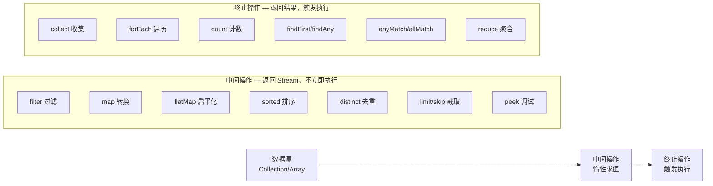

# [Java8] 函数式编程

> 本文涵盖 Java 8 函数式编程三大核心：**Lambda 表达式**、**Stream API**、**Optional**。

---

# 一、Lambda 表达式

---

## 1. 引入：它解决了什么问题？

Java 8 之前，传递"行为"需要写冗长的匿名内部类。Lambda 表达式让代码更简洁，将行为作为参数传递。

```java
// 传统写法：匿名内部类（5行）
List<String> names = Arrays.asList("Charlie", "Alice", "Bob");
Collections.sort(names, new Comparator<String>() {
    @Override
    public int compare(String a, String b) {
        return a.compareTo(b);
    }
});

// Lambda 写法（1行）
Collections.sort(names, (a, b) -> a.compareTo(b));

// 方法引用（更简洁）
Collections.sort(names, String::compareTo);
```

> **为什么 Lambda 能替代匿名内部类**：Lambda 只能替代**函数式接口**（只有一个抽象方法的接口）的匿名内部类。`Comparator` 只有一个 `compare` 方法，所以可以用 Lambda 替代。如果接口有多个抽象方法，Lambda 无法替代。

---

## 2. Lambda 语法

```
(参数列表) -> { 方法体 }
```

| 形式 | 示例 |
|------|------|
| 无参数 | `() -> System.out.println("hello")` |
| 单参数（可省略括号） | `x -> x * 2` |
| 多参数 | `(x, y) -> x + y` |
| 多行方法体 | `(x, y) -> { int sum = x + y; return sum; }` |

---

## 3. 四大函数式接口

| 接口 | 方法签名 | 用途 | 示例 | 记忆口诀 |
|------|---------|------|------|---------|
| `Function<T, R>` | `R apply(T t)` | 转换：输入T，输出R | `Function<String, Integer> f = Integer::parseInt` | 有进有出 |
| `Consumer<T>` | `void accept(T t)` | 消费：输入T，无返回 | `Consumer<String> c = System.out::println` | 有进无出 |
| `Supplier<T>` | `T get()` | 供给：无输入，输出T | `Supplier<List> s = ArrayList::new` | 无进有出 |
| `Predicate<T>` | `boolean test(T t)` | 断言：输入T，返回boolean | `Predicate<String> p = String::isEmpty` | 有进出布尔 |

```java
// Function：字符串转整数
Function<String, Integer> toInt = Integer::parseInt;
Integer result = toInt.apply("123"); // 123

// Consumer：打印每个元素
Consumer<String> printer = System.out::println;
printer.accept("Hello Lambda"); // Hello Lambda

// Supplier：延迟创建对象（懒加载）
Supplier<List<String>> listFactory = ArrayList::new;
List<String> list = listFactory.get();

// Predicate：过滤空字符串
Predicate<String> notEmpty = s -> !s.isEmpty();
boolean valid = notEmpty.test("Java"); // true
```

---

## 4. 方法引用四种形式

| 类型 | 语法 | 等价 Lambda | 使用场景 |
|------|------|------------|---------|
| 静态方法引用 | `Integer::parseInt` | `s -> Integer.parseInt(s)` | 调用静态方法 |
| 实例方法引用（特定对象） | `str::toUpperCase` | `() -> str.toUpperCase()` | 调用特定对象的方法 |
| 实例方法引用（任意对象） | `String::toUpperCase` | `s -> s.toUpperCase()` | 调用参数本身的方法 |
| 构造方法引用 | `ArrayList::new` | `() -> new ArrayList<>()` | 创建对象 |

---

## 5. Lambda 的限制：effectively final

```java
int count = 0;
// ❌ 编译错误：count 在 Lambda 外被修改
list.forEach(item -> count++); // Variable used in lambda should be effectively final

// 原因：Lambda 可能在不同线程中执行，如果允许修改外部变量会有并发问题
// Lambda 捕获的是变量的副本（值），而非引用，所以要求变量不可变

// ✅ 正确：使用 AtomicInteger（线程安全的可变容器）
AtomicInteger count = new AtomicInteger(0);
list.forEach(item -> count.incrementAndGet());
```

---

## 6. Lambda 常见问题

**Q：Lambda 表达式能访问外部变量吗？**
> 可以，但外部变量必须是 **effectively final**（事实上不可变）。原因：Lambda 可能在不同线程中执行，如果允许修改外部变量会有并发问题；Lambda 捕获的是变量的副本（值），而非引用，所以要求变量不可变。

**Q：Lambda 和匿名内部类有什么区别？**
> 1. Lambda 只能替代函数式接口（单抽象方法接口）的匿名内部类；2. Lambda 中的 `this` 指向外部类，匿名内部类中的 `this` 指向匿名内部类本身；3. Lambda 没有自己的作用域，匿名内部类有独立作用域。

---

## 7. Lambda 工作中常见坑

### ❌ 坑1：在 Lambda 中修改外部变量（effectively final 问题）

```java
// ❌ 编译报错：count 在 Lambda 外被修改
int count = 0;
list.forEach(item -> {
    if (item.isValid()) count++; // Variable used in lambda should be effectively final
});

// ❌ 同样报错：即使在 Lambda 外修改也不行
int count = 0;
list.forEach(item -> System.out.println(count)); // 如果后面有 count = 1 就报错

// ✅ 方案1：用 AtomicInteger（线程安全场景）
AtomicInteger count = new AtomicInteger(0);
list.forEach(item -> { if (item.isValid()) count.incrementAndGet(); });

// ✅ 方案2：用 Stream 的 filter + count（更函数式）
long count = list.stream().filter(Item::isValid).count();
```

### ❌ 坑2：Lambda 中的异常处理

```java
// ❌ 问题：Lambda 内部抛出 Checked Exception，编译报错
// 因为 Function<T,R> 的 apply 方法没有声明 throws
list.stream()
    .map(path -> Files.readString(path))  // 编译报错：IOException 未处理
    .collect(Collectors.toList());

// ✅ 方案1：在 Lambda 内部 try-catch（代码丑但直接）
list.stream()
    .map(path -> {
        try {
            return Files.readString(path);
        } catch (IOException e) {
            throw new RuntimeException(e);  // 包装为 RuntimeException
        }
    })
    .collect(Collectors.toList());

// ✅ 方案2：抽取工具方法，统一包装
@FunctionalInterface
interface ThrowingFunction<T, R> {
    R apply(T t) throws Exception;
}

static <T, R> Function<T, R> wrap(ThrowingFunction<T, R> f) {
    return t -> {
        try { return f.apply(t); }
        catch (Exception e) { throw new RuntimeException(e); }
    };
}

list.stream()
    .map(wrap(Files::readString))  // 干净
    .collect(Collectors.toList());
```

### ❌ 坑3：方法引用与 null 的问题

```java
// ❌ 危险：list 中有 null 元素时，方法引用会 NPE
List<String> names = Arrays.asList("Alice", null, "Bob");
names.stream()
    .map(String::toUpperCase)  // null.toUpperCase() → NPE！
    .collect(Collectors.toList());

// ✅ 先过滤 null
names.stream()
    .filter(Objects::nonNull)
    .map(String::toUpperCase)
    .collect(Collectors.toList());
```

### ❌ 坑4：Lambda 持有外部对象引用导致内存泄漏

```java
// ❌ 危险：Lambda 持有 this 引用，如果 Lambda 被长期持有（如注册到事件总线），
// 会导致外部对象无法被 GC 回收
public class OrderService {
    private List<Order> orders = new ArrayList<>();

    public void register() {
        // Lambda 隐式持有 OrderService.this 的引用
        eventBus.subscribe(event -> orders.add(event.getOrder()));
        // 如果 eventBus 生命周期比 OrderService 长，OrderService 永远不会被 GC
    }
}

// ✅ 注意及时取消订阅，或使用弱引用
```

---

# 二、Stream API

---

## 1. 引入：它解决了什么问题？

Stream API 让集合操作（过滤、转换、聚合）从命令式循环变为声明式链式调用，代码更简洁、可读性更强。

```java
// 传统写法：找出所有长度>3的名字，转大写，排序
List<String> names = Arrays.asList("Alice", "Bob", "Charlie", "Di");
List<String> result = new ArrayList<>();
for (String name : names) {
    if (name.length() > 3) {
        result.add(name.toUpperCase());
    }
}
Collections.sort(result);

// Stream 写法（链式，一目了然）
List<String> result = names.stream()
    .filter(name -> name.length() > 3)
    .map(String::toUpperCase)
    .sorted()
    .collect(Collectors.toList());
```

---

## 2. Stream 操作分类


> **关键原理：惰性求值**
> 中间操作不会立即执行，只有遇到终止操作时才会触发整个流水线的执行。
> **为什么这样设计**：惰性求值允许短路优化——如 `findFirst()` 找到第一个就停止，不需要处理所有元素；`limit(10)` 只处理前 10 个元素，后面的中间操作根本不执行。

---

## 3. 常用操作示例

```java
List<Integer> numbers = Arrays.asList(1, 2, 3, 4, 5, 6, 7, 8, 9, 10);

// filter + collect：过滤偶数
List<Integer> evens = numbers.stream()
    .filter(n -> n % 2 == 0)
    .collect(Collectors.toList()); // [2, 4, 6, 8, 10]

// map：平方
List<Integer> squares = numbers.stream()
    .map(n -> n * n)
    .collect(Collectors.toList()); // [1, 4, 9, 16, ...]

// reduce：求和
int sum = numbers.stream()
    .reduce(0, Integer::sum); // 55

// groupingBy：按奇偶分组
Map<Boolean, List<Integer>> grouped = numbers.stream()
    .collect(Collectors.groupingBy(n -> n % 2 == 0));
// {false=[1,3,5,7,9], true=[2,4,6,8,10]}

// flatMap：扁平化嵌套列表
List<List<Integer>> nested = Arrays.asList(
    Arrays.asList(1, 2), Arrays.asList(3, 4));
List<Integer> flat = nested.stream()
    .flatMap(Collection::stream)
    .collect(Collectors.toList()); // [1, 2, 3, 4]
```

---

## 4. 综合实战

**需求**：从用户列表中找出年龄大于18岁的活跃用户，取其邮箱，去重后按字母排序。

```java
// 函数式写法：Stream + Lambda + Optional 组合
List<String> getActiveUserEmails(List<User> users) {
    return users.stream()
        .filter(u -> u.getAge() > 18 && u.isActive())  // 过滤条件
        .map(User::getEmail)                             // 提取邮箱
        .filter(Objects::nonNull)                        // 过滤空值
        .distinct()                                      // 去重
        .sorted()                                        // 排序
        .collect(Collectors.toList());                   // 收集结果
}
```

---

## 5. Stream 工作中常见坑

| 坑点 | 问题描述 | 根本原因 | 解决方案 |
|------|---------|---------|---------|
| Stream 只能消费一次 | 对同一个 Stream 调用两次终止操作会抛异常 | Stream 是一次性的流水线，消费后状态变为"已关闭" | 每次从数据源重新创建 Stream |
| 并行流线程安全 | `parallelStream()` 操作非线程安全集合会出错 | 并行流在 ForkJoinPool 中多线程执行，共享状态会竞争 | 使用 `collect()` 而非直接 `add()` |
| 空指针异常 | `map()` 返回 null 后续操作 NPE | Stream 不会自动处理 null 值 | 使用 `filter(Objects::nonNull)` 或 Optional |
| 性能误区 | 小数据量用 Stream 反而更慢 | Stream 有创建流水线的开销，数据量小时开销占比大 | 数据量小时用普通 for 循环 |

### 坑点代码示例

```java
// ❌ 坑1：Stream 只能消费一次
Stream<String> stream = list.stream().filter(s -> s.length() > 3);
long count = stream.count();          // 第一次消费，OK
List<String> result = stream.collect(Collectors.toList()); // 抛 IllegalStateException！
// ✅ 每次重新创建
long count = list.stream().filter(s -> s.length() > 3).count();
List<String> result = list.stream().filter(s -> s.length() > 3).collect(Collectors.toList());

// ❌ 坑2：parallelStream 操作非线程安全集合
List<Integer> result = new ArrayList<>();
IntStream.range(0, 1000).parallel().forEach(result::add); // 数据丢失！
// ✅ 用 collect 收集，线程安全
List<Integer> result = IntStream.range(0, 1000).parallel()
    .boxed()
    .collect(Collectors.toList());

// ❌ 坑3：map 返回 null 导致后续 NPE
List<String> names = Arrays.asList("Alice", "Bob", "Charlie");
List<Integer> lengths = names.stream()
    .map(name -> name.equals("Bob") ? null : name.length()) // Bob 返回 null
    .collect(Collectors.toList()); // 不报错，但 list 中有 null
// 后续调用 lengths.stream().mapToInt(Integer::intValue) 会 NPE！
// ✅ 过滤 null
List<Integer> lengths = names.stream()
    .map(name -> name.equals("Bob") ? null : name.length())
    .filter(Objects::nonNull)
    .collect(Collectors.toList());

// ❌ 坑4：在 Stream 中修改外部集合（ConcurrentModificationException）
List<String> list = new ArrayList<>(Arrays.asList("a", "b", "c"));
list.stream().forEach(s -> {
    if (s.equals("b")) list.remove(s); // 抛 ConcurrentModificationException！
});
// ✅ 用 removeIf
list.removeIf(s -> s.equals("b"));

// ❌ 坑5：peek 用于调试可以，但不要用于修改状态（有副作用）
// peek 是中间操作，在某些短路场景下可能不执行
list.stream()
    .peek(s -> System.out.println("处理: " + s)) // 调试用，OK
    .filter(s -> s.length() > 1)
    .findFirst(); // 找到第一个就停止，后面的 peek 不会执行
```

---

## 6. Stream 常见问题

**Q：Stream 的惰性求值是什么意思？**
> 中间操作（filter/map/sorted）不会立即执行，它们只是构建了一个操作流水线。只有当终止操作（collect/forEach/count）被调用时，整个流水线才会被触发执行。好处是可以进行短路优化（如 `findFirst()` 找到第一个就停止）。

**Q：Stream 和 for 循环哪个性能更好？**
> 数据量大时 Stream（尤其是 parallelStream）有优势；数据量小时 for 循环更快，因为 Stream 有创建流水线的额外开销。

**Q：parallelStream 一定比 stream 快吗？**
> 不一定。parallelStream 使用 ForkJoinPool 多线程执行，适合 CPU 密集型、数据量大的场景。如果任务本身很轻量或数据量小，线程切换的开销反而会使性能更差。

---

# 三、Optional

---

## 1. 引入：它解决了什么问题？

Optional 将"可能为空"这个语义显式化，强制调用方处理空值情况，减少 NullPointerException。

```java
// 传统写法：层层判空，代码丑陋，容易遗漏
String city = null;
if (user != null) {
    Address address = user.getAddress();
    if (address != null) {
        city = address.getCity();
    }
}

// Optional 写法：链式调用，语义清晰，强制处理空值
String city = Optional.ofNullable(user)
    .map(User::getAddress)
    .map(Address::getCity)
    .orElse("未知城市");
```

> **为什么 Optional 能减少 NPE**：Optional 将"可能为空"这个语义显式化，调用方必须处理空值情况（通过 `orElse`/`ifPresent` 等），而不是忘记判空。

---

## 2. Optional 核心 API

```java
// 创建
Optional<String> opt1 = Optional.of("value");        // 值不能为null，否则NPE
Optional<String> opt2 = Optional.ofNullable(null);   // 值可以为null
Optional<String> opt3 = Optional.empty();             // 空Optional

// 判断与获取
opt1.isPresent();           // true
opt1.get();                 // "value"（为空时抛NoSuchElementException）
opt2.orElse("default");     // null时返回"default"
opt2.orElseGet(() -> computeDefault()); // 懒加载默认值（比orElse更高效，只在为空时才计算）
opt2.orElseThrow(() -> new RuntimeException("值不存在"));

// 转换
opt1.map(String::toUpperCase);           // Optional["VALUE"]
opt1.filter(s -> s.length() > 3);       // Optional["value"]
opt1.flatMap(s -> Optional.of(s + "!")); // Optional["value!"]
```

> **为什么 `orElseGet` 比 `orElse` 更高效**：`orElse("default")` 无论是否为空都会计算默认值；`orElseGet(() -> computeDefault())` 只在为空时才执行 Lambda，如果默认值计算开销大（如查数据库），应优先用 `orElseGet`。

---

## 3. Optional 使用原则（误区分析）

```java
// ✅ 正确：用于方法返回值，表达"可能没有结果"
public Optional<User> findUserById(Long id) {
    return Optional.ofNullable(userRepository.findById(id));
}

// ❌ 错误：不应用于方法参数（调用方传null更混乱）
// 原因：调用方可能传 Optional.empty()，也可能传 null，反而增加处理复杂度
public void process(Optional<String> name) { ... }

// ❌ 错误：不应用于字段（序列化问题）
// 原因：Optional 没有实现 Serializable，序列化时会报错
public class User {
    private Optional<String> nickname; // 错误！
}

// ❌ 错误：不要用isPresent() + get()，等同于判null，没有意义
if (opt.isPresent()) {
    String val = opt.get(); // 这和 if(val != null) 没区别，失去了 Optional 的意义
}
// ✅ 应该用 ifPresent() 或 map()
opt.ifPresent(val -> System.out.println(val));
```

---

## 4. Optional 常见问题

**Q：Optional 为什么不能用于方法参数？**
> 如果方法参数是 `Optional<T>`，调用方可能传入 `Optional.empty()`，也可能传入 `null`（忘记包装），反而增加了处理复杂度。方法参数应该直接用 `@Nullable` 注解或重载方法来表达可选性。

**Q：为什么 `orElseGet` 比 `orElse` 更高效？**
> `orElse(value)` 无论是否为空都会计算 value；`orElseGet(() -> compute())` 只在为空时才执行 Lambda。如果默认值计算开销大（如查数据库），应优先用 `orElseGet`。

**Q：Optional.of() 和 Optional.ofNullable() 有什么区别？**
> `Optional.of(value)` 要求 value 不能为 null，否则立即抛 NullPointerException；`Optional.ofNullable(value)` 允许 value 为 null，为 null 时返回 `Optional.empty()`。

---

## 5. Optional 工作中常见坑

### ❌ 坑1：Optional 嵌套（Optional 套 Optional）

```java
// ❌ 错误：返回 Optional<Optional<User>>，调用方很难处理
public Optional<Optional<User>> findUser(Long id) {
    Optional<User> user = userRepo.findById(id);
    return Optional.of(user); // 多此一举！
}

// ✅ 正确：直接返回 Optional<User>
public Optional<User> findUser(Long id) {
    return userRepo.findById(id);
}

// ❌ 错误：flatMap 用错成 map，导致嵌套
Optional<String> city = Optional.ofNullable(user)
    .map(u -> Optional.ofNullable(u.getAddress()))  // 返回 Optional<Optional<Address>>
    .map(addr -> addr.map(Address::getCity));        // 很难用

// ✅ 正确：用 flatMap 展开
Optional<String> city = Optional.ofNullable(user)
    .flatMap(u -> Optional.ofNullable(u.getAddress()))  // 返回 Optional<Address>
    .map(Address::getCity);
```

### ❌ 坑2：在 Stream 中与 Optional 配合使用

```java
// 场景：从 ID 列表中查找用户，过滤掉不存在的
List<Long> ids = Arrays.asList(1L, 2L, 3L);

// ❌ 错误：map 返回 Optional，collect 得到 List<Optional<User>>
List<Optional<User>> users = ids.stream()
    .map(id -> userRepo.findById(id))
    .collect(Collectors.toList());

// ✅ 正确：用 flatMap 展开 Optional（Java 9+）
List<User> users = ids.stream()
    .map(id -> userRepo.findById(id))  // Stream<Optional<User>>
    .flatMap(Optional::stream)          // 展开：空 Optional 被过滤，有值的展开为元素
    .collect(Collectors.toList());

// Java 8 的写法（没有 Optional::stream）
List<User> users = ids.stream()
    .map(id -> userRepo.findById(id))
    .filter(Optional::isPresent)
    .map(Optional::get)
    .collect(Collectors.toList());
```

### ❌ 坑3：Optional 序列化问题

```java
// ❌ 错误：Optional 没有实现 Serializable，作为字段会导致序列化失败
public class UserDTO implements Serializable {
    private Optional<String> nickname; // 序列化时报错！
}

// ✅ 正确：字段用普通类型，在 getter 中返回 Optional
public class UserDTO {
    private String nickname; // 字段用普通类型

    public Optional<String> getNickname() {
        return Optional.ofNullable(nickname); // getter 返回 Optional
    }
}
```

### ❌ 坑4：orElse 的副作用陷阱

```java
// ❌ 危险：orElse 的参数无论是否为空都会被求值
// 如果 createDefaultUser() 有副作用（如写数据库），每次都会执行！
Optional<User> user = findUser(id);
User result = user.orElse(createDefaultUser()); // createDefaultUser() 每次都执行

// ✅ 正确：用 orElseGet，只在为空时才执行
User result = user.orElseGet(() -> createDefaultUser()); // 只在 user 为空时执行
```
