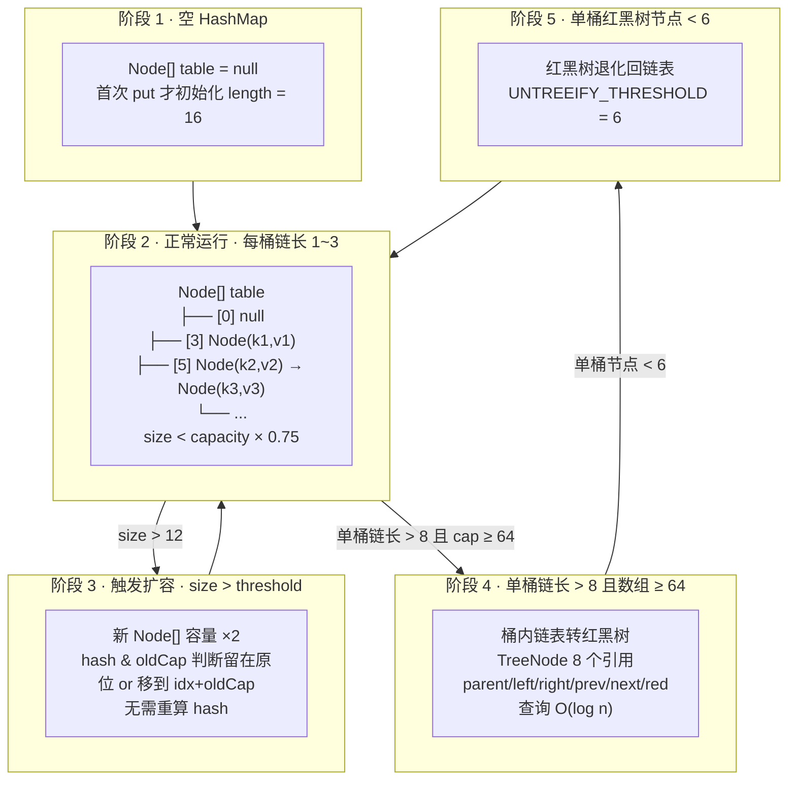
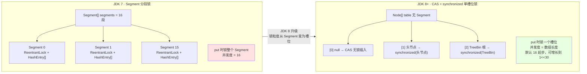

# 集合框架：位运算捷径、泊松分布阈值与 JDK 8 单槽位锁的三条主线

!!! info "**集合框架一句话口诀**"
    - **HashMap 三级结构不是"三种数据结构堆一起"，是"O(1) 定位 → O(k) 冲突查找 → O(log k) 兜底"的物理分层**：数组决定桶的位置、链表承接哈希冲突、红黑树兜底哈希攻击。理解这个分层就能一次性理解树化阈值 8、退化阈值 6、`MIN_TREEIFY_CAPACITY = 64` 三条硬参数的物理动机。
    - **HashMap 容量必须是 2^n，是 `hash & (n-1)` 位运算捷径的物理绑定**：`(n-1)` 二进制全 1 才能让 `&` 等价于 `%`；`tableSizeFor` 就是"传入 10 → 返回 16、传入 17 → 返回 32"这套向上取整到 2^n 的位运算魔法。JDK 8 扩容时 `hash & oldCap` 只判断"新增那一位 bit 是 0 还是 1"，从 O(位数) 简化为 O(1) 判断——这三条位运算捷径共享同一条设计哲学。
    - **JDK 7 → 8 ConcurrentHashMap 的锁粒度演进 = 数据结构的物理映射**：JDK 7 分段锁（Segment 数组 · 默认 16 段）→ JDK 8 CAS + `synchronized` 单槽位锁（数组每个槽位一把锁）→ 并发度从 16 提升到"数组长度"。这不是历史倒退，而是**借助 JVM 锁升级（偏向 → 轻量 → 重量）**让 `synchronized` 在低竞争下性能追上 `ReentrantLock` 之后，才敢做出的物理选择。
    - **`LinkedList` 每节点 40 字节 + 缓存跳转 = 老手不用 `LinkedList` 的物理根源**：`ArrayList` 每元素 8 字节引用连续，CPU 缓存命中率高；`LinkedList` 每节点对象头 16 + 三引用 24 = 40 字节，是 `ArrayList` 数组元素的 5 倍，且指针跳转破坏预取。**除非确定"只在头尾操作 + 内存不敏感"**，否则永远选 `ArrayList` 或 `ArrayDeque`。

**你能立刻答上来吗？**

- 为什么 HashMap 容量非要 2^n？把 `initialCapacity` 传成 `17`，JDK 底层到底把它改成了几？
- JDK 8 HashMap 扩容为什么可以"不重新算 hash"？那条 `(e.hash & oldCap) == 0` 判断到底是什么位运算魔法？
- 树化阈值为什么是 8？退化阈值为什么是 6？为什么中间隔了 2 个位置？
- JDK 8 的 ConcurrentHashMap 把 JDK 7 的 Segment 分段锁改回 `synchronized`——这是历史倒退吗？为什么低竞争下反而更快？
- 存 100 万个 `Integer`，`LinkedList` 与 `ArrayList` 内存差几倍？物理根源是什么？

如果任何一个问题让你迟疑超过 3 秒——继续读。

> 📖 **边界声明**：本文聚焦"集合框架三条主线"——位运算捷径 / 泊松分布参数 / JDK 8 单槽位锁；红黑树完整旋转算法、`ConcurrentHashMap` 深度源码、`ThreadLocal` 泄漏排查、对象布局等姊妹主题**不在本文范畴**：
>
> - 红黑树 5 条性质的完整证明 + 插入/删除的完整旋转变色算法链 → [数据结构精讲](@java-数据结构-数据结构精讲) §"红黑树 · 详细旋转链"
> - 跳表在 `ConcurrentSkipListMap` 的完整实现 → [数据结构精讲](@java-数据结构-数据结构精讲) §"跳表 · Redis ZSet / Java 生态映射"
> - `ConcurrentHashMap` 的 `sizeCtl` / `transfer` / `ForwardingNode` 完整源码链路 → [并发集合与实战陷阱](@java-并发-并发集合与实战陷阱) §"ConcurrentHashMap 深度源码"
> - `ThreadLocal` / `ThreadLocalMap` 完整原理（弱引用 key + 强引用 value + 探测式清理）→ [JMM与线程同步](@java-并发-JMM与线程同步)（战略延伸）
> - 阻塞队列 `ArrayBlockingQueue` / `LinkedBlockingQueue` / `SynchronousQueue` 完整源码 → [并发工具Lock与线程池](@java-并发-并发工具Lock与线程池) §"阻塞队列 · 线程池搭档"
> - 引用族（Soft/Weak/Phantom/Final）在 GC 中的完整回收链 → [GC核心机制](@java-JVM-GC核心机制与收集器演进) §"引用族与可达性分析"
> - HashMap 对象头 + `Node<K,V>` 在堆内存的对象布局 + 对齐填充 → [JVM内存分区与对象布局](@java-JVM-内存分区与对象布局) §"对象布局"

---

## 1. 第一层：业务痛点 —— 从"死循环 100% CPU"到"LinkedList 内存 5 倍炸裂"

### 1.1 生产事故现场：一行 `new HashMap<>()` 打掉了整个 JVM

某支付系统的对账定时任务里，出现过这样一段"看起来无害"的代码：

```java
@Service
public class ReconciliationCache {

    // 💥 埋雷点：多线程共享 HashMap
    private final Map<String, ReconRecord> tradeCache = new HashMap<>();

    /**
     * 每分钟从上游拉取增量交易，写入本地缓存
     * 被 @Scheduled 定时线程池调用，同时也被业务线程读
     */
    public void refresh(List<ReconRecord> incremental) {
        for (ReconRecord r : incremental) {
            tradeCache.put(r.getTradeId(), r);   // 💥 无同步写
        }
    }

    public ReconRecord lookup(String tradeId) {
        return tradeCache.get(tradeId);          // 💥 并发读
    }
}
```

生产环境跑了半年一直正常，直到某天上游数据量突增触发扩容——**JDK 7 版本的应用整台机器 CPU 打满 100%，`top` 里 4 个业务线程持续占用一整颗核**；JDK 8 升级后的机器"看起来"没 CPU 尖峰，但对账结果出现随机缺失——**两台机器分别掉进了 HashMap 并发失控的两种不同物理陷阱**。

**JDK 7 的物理成因**：`HashMap.transfer()` 扩容时对每个桶的链表用**头插法**逆序迁移；两条线程同时扩容会把同一条链表的两个节点互指——形成 `A → B → A` 的**环形链表**，之后任何 `get(key)` 落到这个桶都会永远遍历不完这个环。

**JDK 8 的物理成因**：改用**尾插法**避免了环形链表，但 `putVal()` 里的"空槽位判断 → 写入"两步操作**不是原子的**——线程 T1 判断 `tab[i] == null` 后正要写入，被线程 T2 抢在中间把自己的节点写进去，T1 恢复后直接**覆盖** T2 的节点，数据丢失。

**这就是"多线程用 HashMap"的最贵代价**——JDK 7 死循环 100% CPU（会立刻被 K8s 探针发现），JDK 8 数据丢失（**要跑对账才发现**，事故等级反而更高）。

### 1.2 反问引子：老手也未必答得上的 5 个集合悬案

- **悬案 1**：`new HashMap<>(17)` 底层实际把容量设为了几？为什么？—— 老手都答"16"或"32"，但很少能说清 `tableSizeFor` 那一串 `n |= n >>> 1;` 位运算的**物理动机**。
- **悬案 2**：JDK 8 HashMap 扩容为什么可以"不重新算 hash"？—— 老手都听过"高低位判断"，但很少能画出"`hash & oldCap` 只多用一位 bit"的物理链路。
- **悬案 3**：树化阈值 8 / 退化阈值 6 / `MIN_TREEIFY_CAPACITY = 64` —— 老手能背出这三个数字，但答得出"泊松分布 λ=0.5 下链长 8 的概率是 6×10⁻⁸"物理动机的极少。
- **悬案 4**：JDK 8 的 `ConcurrentHashMap` 把 JDK 7 的 `Segment` 分段锁**改回** `synchronized`——这是历史倒退吗？物理上到底靠什么让 `synchronized` 反而更快？
- **悬案 5**：`LinkedList<Integer>` 存 100 万元素，占用内存 56 MB；`ArrayList<Integer>` 只占 22 MB。差的这 34 MB 都花在哪里了？

这五个悬案的答案都写在**位运算 + 泊松分布 + JVM 锁升级**三条主线里。往下看。

---

## 2. 第二层：字节码考古 —— 三条位运算捷径 + 泛型桥接方法

!!! tip "本层特殊说明"
    集合框架的"字节码考古"聚焦 **位运算 & 泛型桥接方法** 两条主线，不再抓 `javap -v` 字节码全景（那属于战役一 [01 面向对象](@java-字节码-面向对象) 到 [07 函数式编程](@java-字节码-函数式编程) 的活儿），而是抓"HashMap 源码里那几条决定物理结构的关键 `>>>` / `&` / `^` 位运算"，以及"泛型集合上 `checkcast` 兜底"的字节码延续。

### 2.1 位运算捷径 1：`hash & (n-1)` 与 2^n 容量的物理绑定

**HashMap 定位桶的核心一行**（源自 JDK 17 `HashMap.putVal`）：

```java
int i = (n - 1) & hash;
// 等价于 hash % n，但仅当 n 是 2 的幂次
```

**为什么等价**：

```txt
n = 16      = 0001 0000（二进制）
n - 1 = 15  = 0000 1111  ← 低 4 位全为 1

hash        = 1010 0110  1011 0101  1100 0011  1101 1001
hash & 15   = 0000 0000  0000 0000  0000 0000  0000 1001  ← 保留 hash 的低 4 位
hash % 16   = 9                                            ← 完全相等
```

**只有当 `n = 2^k` 时**，`n - 1` 的二进制才是"低 k 位全为 1、高位全 0"——这是让 `&` 等价于 `%` 的**唯一物理前提**。

**性能收益**：`%` 在 x86 硬件层面对应 `idiv` / `irem` 指令（约 20~30 时钟周期），而 `&` 是 1 个时钟周期的 `and` 指令——**快 5~10 倍**。HashMap 每一次 `get` / `put` 都要走这条定位路径，这条捷径的物理动机足以**倒逼**"容量必须是 2^n"这条硬约束。

**`tableSizeFor` 的位运算魔法**：

```java
// HashMap.tableSizeFor —— JDK 17
static final int tableSizeFor(int cap) {
    int n = cap - 1;
    n |= n >>> 1;
    n |= n >>> 2;
    n |= n >>> 4;
    n |= n >>> 8;
    n |= n >>> 16;
    return (n < 0) ? 1 : (n >= MAXIMUM_CAPACITY) ? MAXIMUM_CAPACITY : n + 1;
}
```

**逐行破案**（以传入 `cap = 17` 为例）：

```txt
n = cap - 1 = 16       = 0000 0000 0000 0000 0000 0000 0001 0000
n |= n >>> 1           = 0000 0000 0000 0000 0000 0000 0001 1000
n |= n >>> 2           = 0000 0000 0000 0000 0000 0000 0001 1110
n |= n >>> 4           = 0000 0000 0000 0000 0000 0000 0001 1111
n |= n >>> 8           = 0000 0000 0000 0000 0000 0000 0001 1111  ← 已饱和
n |= n >>> 16          = 0000 0000 0000 0000 0000 0000 0001 1111
n + 1                  = 0000 0000 0000 0000 0000 0000 0010 0000 = 32
```

**顿悟点**：这段代码用 5 条 `|=` + `>>>` 把"传入 X 向上取整到最近的 2^n"化简为 O(1) 的位运算——**每一次右移都把最高位 1 "复制"到低位**，直到从最高位到最低位全部铺满 1；最后 `+1` 就自动进位为 2 的幂次。

### 2.2 位运算捷径 2：扰动函数 `(h = hashCode()) ^ (h >>> 16)`

**HashMap 的扰动函数**（源自 JDK 17 `HashMap.hash`）：

```java
static final int hash(Object key) {
    int h;
    return (key == null) ? 0 : (h = key.hashCode()) ^ (h >>> 16);
}
```

**为什么要 `>>> 16` 后再 `^`**：

数组小（如 `n = 16`）时，`hash & 15` 只用到 hash 的**低 4 位**，高位信息完全被丢弃。如果 `hashCode()` 实现质量差（低位重复率高，高位分布均匀），大量 key 会挤在同一个桶。

```txt
原始 hashCode：1111 0110 1010 1101  0000 0000 0000 0011
右移 16 位  ：0000 0000 0000 0000  1111 0110 1010 1101
异或结果    ：1111 0110 1010 1101  1111 0110 1010 1110
                                    ↑ 低位混入了高位信息
```

**顿悟点**：JDK 团队用**一条 `>>>` + 一条 `^`** 就让高 16 位参与散列，代价接近于零。这比要求所有用户手写高质量 `hashCode()` 划算得多——**框架层的位运算捷径 > 依赖用户代码质量**。

### 2.3 位运算捷径 3：JDK 8 rehash 的 `hash & oldCap` 一位判断

**扩容核心逻辑**（源自 JDK 17 `HashMap.resize` · 简化伪代码）：

```java
Node<K,V> loHead = null, loTail = null;  // 低位链表（留在原位置）
Node<K,V> hiHead = null, hiTail = null;  // 高位链表（移到 idx + oldCap）
do {
    next = e.next;
    if ((e.hash & oldCap) == 0) {        // 💡 关键一行：只判断一位 bit
        // 元素留在原位置 j
        if (loTail == null) loHead = e; else loTail.next = e;
        loTail = e;
    } else {
        // 元素移到 j + oldCap
        if (hiTail == null) hiHead = e; else hiTail.next = e;
        hiTail = e;
    }
} while ((e = next) != null);
```

**物理原理**：

```txt
旧容量 oldCap = 16    = 0001 0000    ← 二进制最高位是第 5 位
新容量 newCap = 32
旧下标索引 = hash & 01111（低 4 位）
新下标索引 = hash & 11111（低 5 位）    ← 只多参与一位 bit

那一位 bit 恰好是 oldCap 对应的位：
  hash & oldCap == 0 → 新下标 = 旧下标
  hash & oldCap != 0 → 新下标 = 旧下标 + oldCap
```

**顿悟点**：JDK 7 每次扩容对每个 key 都要**重新算 `hash & (newN-1)`**（O(位数) 计算）；JDK 8 只需**判断 hash 在这一位 bit 上是 0 还是 1**——从 O(位数) 简化为 O(1) 判断，且天然生成两条子链表（低位链 + 高位链）避免每个节点单独 `newIndex` 计算。这一优化让 JDK 8 扩容比 JDK 7 快约 30%（**具体收益依赖 key 分布，不做硬性数字承诺**）。

### 2.4 泛型集合的桥接方法与 `checkcast` 兜底（回收 [05 泛型](@java-字节码-泛型底层原理) 伏笔）

写一段最典型的泛型 Map 调用：

```java
Map<String, Integer> map = new HashMap<>();
Integer v = map.get("hello");
```

`javap -c` 观察：

```volt
 0: new           #7                  // class java/util/HashMap
 3: dup
 4: invokespecial #9                  // Method HashMap."<init>":()V
 7: astore_1
 8: aload_1
 9: ldc           #10                 // String hello
11: invokeinterface #12, 2            // InterfaceMethod java/util/Map.get:
                                      //     (Ljava/lang/Object;)Ljava/lang/Object;
                                      //  💥 返回类型是 Object！
16: checkcast     #16                 // class java/lang/Integer
                                      //  💥 编译器自动插入 checkcast 兜底
19: astore_2
```

**逐行破案**：

1. **偏移 11** 的 `invokeinterface Map.get:(Ljava/lang/Object;)Ljava/lang/Object;`——`Map.get` 的字节码签名永远返回 `Object`。**这就是类型擦除的物理证据**：无论源码写 `Map<String, Integer>` 还是 `Map<Long, User>`，字节码里的 `get` 签名都一样。
2. **偏移 16** 的 `checkcast #16 // class java/lang/Integer`——编译器在**调用点后**自动插入这条兜底指令。它与 [01 面向对象](@java-字节码-面向对象) 讲的多态下溯 `checkcast Dog`、[06 反射](@java-字节码-反射与MethodHandle) 讲的 `(String) method.invoke()` 强转，是**同一条 JVM 指令**（JVMS §6.5.checkcast），只是触发者不同——这正是 [05 泛型](@java-字节码-泛型底层原理) 篇埋下的伏笔在此闭环。

**`HashMap.Node<K,V>` 的桥接方法**（编译器合成的 `ACC_BRIDGE | ACC_SYNTHETIC` 桥接方法）：

```volt
public java.lang.Object getKey();       // 💥 桥接方法
  flags: ACC_PUBLIC, ACC_BRIDGE, ACC_SYNTHETIC
  Code:
     0: aload_0
     1: invokevirtual #x   // Method HashMap$Node.getKey:()Ljava/lang/Object;
     4: areturn

public K getKey();                       // 泛型版本（实际返回类型仍是 Object）
  Code:
     0: aload_0
     1: getfield  #y   // Field key:Ljava/lang/Object;
     4: areturn
```

**顿悟点**：`ACC_BRIDGE` 桥接方法是编译器为**保持二进制兼容**而合成的——同一个 `Map.Entry.getKey()` 在字节码里其实有两份（一份桥接、一份真身），反射调用时 `Method.isBridge()` 可以过滤掉桥接方法。**这不是集合框架特有的机制，而是泛型擦除后所有覆盖返回类型场景的通用模式**。

### 2.5 `ArrayList` 1.5 倍扩容的 `>> 1` 位运算

**ArrayList 扩容一行**（源自 JDK 17 `ArrayList.grow`）：

```java
int newCapacity = ArraysSupport.newLength(oldCapacity,
                    minCapacity - oldCapacity,   // 最小增长
                    oldCapacity >> 1);           // 优先增长（1.5 倍）
```

- `oldCap >> 1` = `oldCap / 2` 的位运算等价（`>>` 是 1 个时钟周期，`idiv` 是 20+ 时钟周期）
- `oldCap + (oldCap >> 1)` = 1.5 × oldCap

**为什么是 1.5 倍**：这是 JDK 团队的**工程经验值**，在"扩容频率 vs 内存浪费"之间取平衡点——2 倍扩容内存浪费大（尤其对长期小集合），1.25 倍扩容频率高（复制 O(n) 抖动明显）。**网络上流传的"1.5 倍 = 复用旧地址空间"的推导来自 C++ `std::vector` 场景**——Java 堆由 GC 管理（TLAB 分配、标记压缩、复制收集会移动对象），对象地址不像 `malloc/free` 一样稳定，所谓"复用旧地址"在 JVM 里基本不成立。切勿把 C++ 的结论直接搬过来。

**顿悟点**：JDK 集合框架的所有关键决策共享**同一条设计哲学**——用位运算指令替代硬件除法/取模指令。理解了这一条，"HashMap 容量 2^n / 1.5 倍扩容 / rehash 位判断"三件事的物理动机全部涌现。

### 2.6 HashMap 四条硬参数与泊松分布

| 参数 | 值 | 物理动机 |
| :-- | :-- | :-- |
| 树化阈值 `TREEIFY_THRESHOLD` | **8** | 泊松分布 λ=0.5 下链长 8 的概率 ≈ 6×10⁻⁸——极端场景兜底 |
| 退化阈值 `UNTREEIFY_THRESHOLD` | **6** | 与 8 相隔 2 个位置，防止阈值边界频繁转换的抖动 |
| 最小树化容量 `MIN_TREEIFY_CAPACITY` | **64** | 数组太小时应先扩容而非树化（扩容能天然分散冲突） |
| 负载因子 `DEFAULT_LOAD_FACTOR` | **0.75** | 空间与时间的平衡点 · 泊松分布下大多数桶链表长度 ≤ 3 |

**HashMap 源码注释里的原话**（`HashMap.java` 类头 Javadoc）：

```txt
Ideally, under random hashCodes, the frequency of nodes in bins follows a
Poisson distribution (http://en.wikipedia.org/wiki/Poisson_distribution) with
a parameter of about 0.5 on average for the default resizing threshold of 0.75,
though with a large variance because of resizing granularity.
Ignoring variance, the expected occurrences of list size k are (exp(-0.5) *
pow(0.5, k) / factorial(k)). The first values are:

  0:    0.60653066
  1:    0.30326533
  2:    0.07581633
  3:    0.01263606
  4:    0.00157952
  5:    0.00015795
  6:    0.00001316
  7:    0.00000094
  8:    0.00000006
  more: less than 1 in ten million
```

**顿悟点**：这四条硬参数不是"经验值"，而是**泊松分布数学**的直接推导——在正常哈希分布下，桶内节点数服从 λ ≈ 0.5 的泊松分布，链长 = 8 的概率约 6×10⁻⁸（**千万分之六**）。老手回头看这里的顿悟感在于——JDK 团队真的用统计学做数据结构设计，8 这个数字不是拍脑袋。

---

## 3. 第三层：物理内存布局 —— 三大集合的字节账单 + 锁粒度演进

### 3.1 三大集合的每元素内存物理图（64 位 JVM · 压缩指针开启）

**`ArrayList<Integer>` · 每元素账单**：

```txt
┌───────────────────────────────────────────────┐
│ ArrayList 对象本身：                            │
│   [Mark Word 8B] [Klass* 4B] [padding 4B]      │
│   int size:              4B                     │
│   int modCount:          4B                     │
│   Object[] elementData:  4B（压缩指针）          │
│   (padding 4B)                                  │
│ 合计：32 字节                                    │
│                                                │
│ elementData 数组：                              │
│   [Mark Word 8B] [Klass* 4B] [length 4B]       │
│   Object[N] 引用槽位：每个 4 字节                 │
│                                                │
│ 每个 Integer 对象（堆上）：                       │
│   [Mark Word 8B] [Klass* 4B] [int value 4B]    │
│   合计：16 字节                                  │
└───────────────────────────────────────────────┘

单元素占用 = 4（数组槽位）+ 16（Integer 对象）= 20 字节
100 万元素 ≈ 20 MB + 数组扩容预留 ≈ 22 MB
```

**`LinkedList<Integer>` · 每节点账单**：

```txt
┌───────────────────────────────────────────────┐
│ LinkedList.Node<Integer>（堆上）：              │
│   [Mark Word 8B] [Klass* 4B]                   │
│   (padding 4B)                                  │
│   E item:     4B（压缩指针，指向 Integer）        │
│   Node next:  4B                                │
│   Node prev:  4B                                │
│   (padding 4B 对齐到 8 字节倍数)                  │
│   合计：32 字节                                  │
│                                                │
│ 每个 Integer 对象（堆上）：                       │
│   合计：16 字节                                  │
└───────────────────────────────────────────────┘

单元素占用 = 32（Node 对象）+ 16（Integer 对象）= 48 字节
100 万元素 ≈ 48 MB
```

**注意**：以上是压缩指针（`-XX:+UseCompressedOops` 默认开启，堆 < 32GB）下的账单；关闭压缩指针（堆 > 32GB）时所有引用变 8 字节，Node 对象会膨胀到 40 字节，`LinkedList` 内存占用进一步拉大。

**`HashMap<K, V>` · 每 entry 账单**：

```txt
┌───────────────────────────────────────────────┐
│ HashMap.Node<K,V>（链表节点）：                  │
│   [Mark Word 8B] [Klass* 4B]                   │
│   int hash:       4B                            │
│   K key:          4B（压缩指针）                  │
│   V value:        4B                            │
│   Node<K,V> next: 4B                            │
│   (padding 4B 对齐)                             │
│   合计：32 字节                                  │
│                                                │
│ HashMap.TreeNode<K,V>（红黑树节点，extends Node）│
│   继承 Node 的 32B + 6 个额外引用（parent /       │
│   left / right / prev / next / red 标志位）     │
│   合计：56 字节                                  │
└───────────────────────────────────────────────┘

链表阶段单 entry 占用 ≈ 32B + key/value 各自对象大小
树化后每 entry 增至 ≈ 56B
```

**顿悟点**：

- `LinkedList` 每元素比 `ArrayList` 多 **28 字节**（Node 32B - 数组槽位 4B）—— 除了内存 2~5 倍的直接开销，指针跳转破坏 CPU L1/L2 缓存预取，实际性能差距**远大于理论算法复杂度**。
- `HashMap` 桶树化后每 entry 从 32B 膨胀到 56B——**树化本身也有内存代价**，这是 `MIN_TREEIFY_CAPACITY = 64` 硬约束"小数组先扩容再树化"的物理动机。

> 📖 对象头结构、Klass Pointer 压缩、对齐填充规则的完整推导 → [JVM 内存分区与对象布局](@java-JVM-内存分区与对象布局) §"对象布局与对齐填充"

### 3.2 HashMap 三级结构的物理演进图



**关键物理事实**：

- **阶段 2 → 阶段 3**：扩容阈值是 `size > capacity × loadFactor`（默认 12），触发 `resize` 后走 §2.3 的"位判断"分片
- **阶段 2 → 阶段 4**：**必须同时**满足"单桶链长 > 8" **且** "数组 length ≥ 64"，两条件缺一不可——数组小时优先扩容，因为扩容能天然分散冲突
- **阶段 4 → 阶段 5**：树化后**只在下次扩容或 `remove` 触发树内节点数检查**时才可能退化回链表；不是每次 remove 都检查

!!! note "📖 术语家族：`HashMap` 内部节点族 —— `Node` / `TreeNode` / `Entry`"
    **字面义**：HashMap 用于承载 KV 对的内部节点体系，随桶内长度自适应切换**链表**与**红黑树**两种物理形态。

    **在本框架中的含义**：`Node<K,V>` 承载正常链表形态，`TreeNode<K,V>` 承载树化后的桶——`TreeNode extends Node` 的继承关系保证桶内链表可以**无损升级**到树结构（原链表节点直接类型转换为树节点，无需重建），退化时同理反向。这就是 HashMap 三级结构能"链表 ↔ 树"无缝切换的物理基础。

    **同家族成员**：

    | 成员 | 结构 | 职责 | 源码位置 |
    | :-- | :-- | :-- | :-- |
    | `Map.Entry<K,V>` | 接口 | 抽象 KV 对契约 | `java.util.Map.Entry` |
    | `HashMap.Node<K,V>` | 单向链表节点 · 5 字段 | 承载正常链表 | `java.util.HashMap$Node` |
    | `HashMap.TreeNode<K,V>` extends `Node<K,V>` | 红黑树节点 · 6 额外引用 | 承载树化后的桶 | `java.util.HashMap$TreeNode` |
    | `LinkedHashMap.Entry<K,V>` extends `Node<K,V>` | 双向链表节点 · 加 `before` / `after` | 保持插入/访问顺序 | `java.util.LinkedHashMap$Entry` |
    | `ConcurrentHashMap.Node<K,V>` | 并发版链表节点 · `val` / `next` 为 `volatile` | 支持无锁读 | `java.util.concurrent.ConcurrentHashMap$Node` |
    | `ConcurrentHashMap.TreeBin<K,V>` | 树桶容器 · 内含 `TreeNode` + `lockState` | 并发场景下的树桶封装 | `java.util.concurrent.ConcurrentHashMap$TreeBin` |
    | `ConcurrentHashMap.ForwardingNode<K,V>` | 扩容期占位节点 · `hash = MOVED` | 标记正在迁移 | `java.util.concurrent.ConcurrentHashMap$ForwardingNode` |

    **命名规律**：`<Tree><Node>`——`Node` 承载链表形态，加 `Tree` 前缀表示升级到红黑树形态；`ConcurrentHashMap` 家族在此基础上再叠加 `Bin` 后缀（`TreeBin` = 树桶容器，比 `TreeNode` 多一层并发控制）和 `Forwarding` 前缀（迁移占位）。

    **易混点**：`HashMap.TreeNode` 和 `ConcurrentHashMap.TreeNode` 是**两个完全独立的类**，虽然命名相同、职责相似——前者是普通红黑树节点，后者是并发版且被 `TreeBin` 二次封装（并发场景下不能直接锁 `TreeNode`，因为红黑树旋转会换根，锁根节点会失效）。这也是为什么 `ConcurrentHashMap` 多出一层 `TreeBin` 抽象。

### 3.3 `ConcurrentHashMap` 锁粒度演进物理图



**关键物理事实**：

1. **锁的物理对象** 从"Segment 段"降到"链表/红黑树头节点"——如果哈希均匀，两条线程 `put` 打到不同槽位可**完全并行**；`ConcurrentHashMap` 空槽位 `put` 走 `Unsafe.compareAndSwapObject` CAS 无锁插入，非空槽位才 `synchronized` 头节点。
2. **`synchronized` 为什么反而更快**：JDK 8 之后 `synchronized` 借助**锁升级**（无锁 → 偏向锁 → 轻量级锁 → 重量级锁）在低竞争场景下性能已追平 `ReentrantLock`；高竞争场景升级到重量级锁时才会调用操作系统 `mutex`。而 `ConcurrentHashMap` 每次锁的是**单个槽位的头节点**，竞争概率随数组长度线性下降——**大多数时候在偏向锁 / 轻量级锁阶段就完成**，物理上远快于 JDK 7 的 `ReentrantLock`（`ReentrantLock` 一上来就用 AQS + `park/unpark` 走 `LockSupport`）。
3. **树桶 `TreeBin` 的额外抽象**：红黑树旋转会换根，直接锁 `TreeNode` 根节点在旋转后会失效——所以 JDK 8 引入 `TreeBin` 作为**树桶容器**，`synchronized(treeBin)` 锁的是容器而非根节点，旋转不影响锁的有效性。

> 📖 JVM 锁升级（无锁 → 偏向 → 轻量 → 重量）的完整物理链 → [JMM 与线程同步](@java-并发-JMM与线程同步) §"synchronized 锁升级四阶段"
> 📖 `ConcurrentHashMap` 的 `sizeCtl` / `transfer` / `ForwardingNode` 完整源码 → [并发集合与实战陷阱](@java-并发-并发集合与实战陷阱) §"ConcurrentHashMap 深度源码"

### 3.4 `WeakHashMap` / `ThreadLocalMap` 的引用强度族物理图

```txt
WeakHashMap · Entry：
┌──────────────────────────────────┐
│ Entry<K,V> extends WeakReference<K> {
│   V value;                   ← 强引用
│   Entry<K,V> next;           ← 强引用
│ }                                 │
│                                   │
│ WeakReference<K> 内部：             │
│   K referent;                ← 弱引用，GC 时可回收
└──────────────────────────────────┘

ThreadLocalMap · Entry：
┌──────────────────────────────────┐
│ Entry extends WeakReference<ThreadLocal<?>> {
│   Object value;              ← 强引用
│ }                                 │
│                                   │
│ WeakReference<ThreadLocal<?>> 内部：│
│   ThreadLocal<?> referent;   ← 弱引用
│                                   │
│ 泄漏根源：                          │
│   key 被 GC → Entry 的 key 变 null│
│   但 value 仍被强引用 → 无法回收    │
└──────────────────────────────────┘
```

**顿悟点**：`ThreadLocal` 泄漏的物理成因**不是"引用类型选错了"**，而是"**弱引用 key + 强引用 value**"这种不对称设计在**线程复用**（线程池）时的必然结果——线程从池子拿出来时上一个任务的 `ThreadLocalMap` 还在，key 已被 GC 回收但 value 仍占内存。JDK 团队在 `ThreadLocal.set/get/remove` 里加了**探测式清理**（顺路清扫 key == null 的 Entry），但清理链路**必须被触发**才有效；线程若长时间不访问 `ThreadLocal`，泄漏会持续累积。

**工程红线的物理来源**：这就是"线程池场景下 `ThreadLocal` 使用后必须显式 `remove()`"的物理根源——不能依赖 GC 自动清理，因为 `ThreadLocalMap` 的引用链是"Thread → ThreadLocalMap → Entry → value"，只要线程活着，整条链就活着。

> 📖 `*Reference` 强度族（Soft / Weak / Phantom / Final）完整介绍 → [GC 核心机制](@java-JVM-GC核心机制与收集器演进) §"引用族与可达性分析"

### 3.5 术语家族卡片：集合框架接口继承族（首次全站承接）

!!! note "📖 术语家族：集合框架接口继承族 —— `Iterable` → `Collection` / `Map`"
    **字面义**：`java.util` 集合库的顶层接口继承体系，从 `Iterable<T>` 起源，分叉成 `Collection` / `Map` 两大树——命名直译"可迭代的（Iterable）→ 集合（Collection）→ 映射（Map）"，直接对应"数据能被逐个访问"这一最抽象契约。

    **在本框架中的含义**：所有集合的根契约。`for-each` 语法糖底层调用的就是 `Iterable.iterator()`；`Collection` 定义单值容器的增删查基础操作，`Map` 独立成一棵树（不是 `Collection` 子接口）承载 KV 语义。理解这个继承体系是选型决策的第一层依据——"要 KV 还是单值？要不要去重？要不要有序？"三个问题在这棵树上都能找到对应分支。

    **同家族成员**：

    | 成员 | 职责 | 关键子接口/实现 | 源码位置 |
    | :-- | :-- | :-- | :-- |
    | `Iterable<T>` | 提供迭代器 · `for-each` 语法糖入口 | 一切集合的根 | `java.lang.Iterable` |
    | `Collection<E>` | 单值容器基础操作 | List / Set / Queue 三大分支 | `java.util.Collection` |
    | `List<E>` | 有序可重复 | `ArrayList` / `LinkedList` | `java.util.List` |
    | `Set<E>` | 去重 | `HashSet` / `TreeSet` / `LinkedHashSet` | `java.util.Set` |
    | `Queue<E>` / `Deque<E>` | 队列 / 双端队列 | `ArrayDeque` / `PriorityQueue` | `java.util.Queue` / `Deque` |
    | `Map<K,V>` | KV 容器 · **不继承 Collection** | `HashMap` / `TreeMap` / `LinkedHashMap` | `java.util.Map` |
    | `SortedMap<K,V>` / `NavigableMap<K,V>` | 范围查询 | `TreeMap` 独占 | `java.util.SortedMap` / `NavigableMap` |
    | `ConcurrentMap<K,V>` | 并发原子操作契约 | `ConcurrentHashMap` / `ConcurrentSkipListMap` | `java.util.concurrent.ConcurrentMap` |

    **命名规律**：`<Tree/Linked/Hash/Concurrent><Container>` —— **前缀标识"底层结构与并发能力"、后缀标识"容器类型"**。例如 `LinkedHashMap` = "有链表结构维护顺序的 Map"，`ConcurrentSkipListMap` = "基于跳表的并发 Map"。

    **易混点**：`Map` **不是** `Collection` 的子接口——这是 JDK 集合框架**唯一**违反"所有集合都是 Collection"这条直觉的地方。原因是 `Collection` 定义的是"单值增删"，`Map` 是"KV 增删"，两套操作契约不兼容；`Map.entrySet()` / `keySet()` / `values()` 三个视图方法才是 `Map` 通往 `Collection` 世界的桥梁。

---

## 4. 第四层：工程红线 —— 5 条钢铁准则 + `❌反模式 / ✅标准范式` 双代码块

### 4.1 红线 1：多线程环境用 `ConcurrentHashMap`，不要用 `HashMap` 或 `Hashtable`

**技术依据**：§1.1 已给出三段式物理根因——JDK 7 `HashMap` 扩容会环形链表死循环、JDK 8 `HashMap` 会数据覆盖丢失；`Hashtable` 全表 `synchronized` 并发度 = 1；`ConcurrentHashMap` 单槽位锁并发度 = 数组长度（§3.3）。

```java
// ❌ 反模式：多线程共享 HashMap
@Component
public class OrderCache {
    private final Map<Long, Order> cache = new HashMap<>();   // 💥 JDK 7 死循环 / JDK 8 数据丢失

    public void refresh(List<Order> incremental) {
        for (Order o : incremental) cache.put(o.getId(), o);
    }
    public Order lookup(Long id) { return cache.get(id); }
}
```

```java
// ✅ 标准范式 1：单一实现类替换
@Component
public class OrderCache {
    private final ConcurrentMap<Long, Order> cache = new ConcurrentHashMap<>();

    public void refresh(List<Order> incremental) {
        for (Order o : incremental) cache.put(o.getId(), o);
    }
    public Order lookup(Long id) { return cache.get(id); }
}

// ✅ 标准范式 2：确需保持插入顺序 + 线程安全 → 用 Collections.synchronizedMap 包 LinkedHashMap
// （ConcurrentHashMap 不保证顺序）
private final Map<Long, Order> cache = Collections.synchronizedMap(new LinkedHashMap<>());
```

**降维建议**：即使代码里"只是短时间的临时缓存"也一律用 `ConcurrentHashMap`——数据丢失比性能损失更贵，`ConcurrentHashMap` 相对 `HashMap` 单线程的额外开销在稳态热路径上**通常低于 5%**，代价可以忽略。

### 4.2 红线 2：`HashMap` key 必须同时正确重写 `hashCode` 和 `equals`

**技术依据**：`hash & (n-1)` 桶定位依赖 `hashCode`（§2.1），`equals` 决定同桶内的匹配。任一违反契约都会导致 `put` 进去的值 `get` 不出来。

```java
// ❌ 反模式：只重写 equals 不重写 hashCode
class Point {
    int x, y;
    @Override public boolean equals(Object o) {
        if (!(o instanceof Point)) return false;
        Point p = (Point) o;
        return this.x == p.x && this.y == p.y;
    }
    // 💥 缺失 hashCode()，默认走 Object.hashCode()（对象身份哈希）
}

Map<Point, String> map = new HashMap<>();
map.put(new Point(1, 2), "origin");
map.get(new Point(1, 2));  // 💥 返回 null！
// 原因：两个"equals 相等"的 Point 对象 hashCode 却不同 → 落到不同桶
```

```java
// ✅ 标准范式：equals + hashCode 使用相同字段集合
class Point {
    final int x, y;

    @Override public boolean equals(Object o) {
        if (this == o) return true;
        if (!(o instanceof Point)) return false;
        Point p = (Point) o;
        return this.x == p.x && this.y == p.y;
    }

    @Override public int hashCode() {
        return Objects.hash(x, y);   // 💡 用相同字段集合
    }
}
```

**降维建议**：优先用 IDE 自动生成或 Lombok `@EqualsAndHashCode`——两个方法**必须使用相同的字段集合**，手写极易漏字段；Java 14+ `record` 类型天然满足这条契约。

### 4.3 红线 3：`ArrayList` 是默认选项，`LinkedList` 只在"只在头尾操作 + 内存不敏感"时才用

**技术依据**：§3.1 已给出物理账单——`LinkedList` 每元素 48 字节 vs `ArrayList` 每元素 20 字节（含 Integer 对象），差 2~3 倍；且 `LinkedList` 指针跳转破坏 CPU 缓存预取，实际性能差距**远大于理论算法复杂度**。

```java
// ❌ 反模式：因为"要频繁 add" 就选 LinkedList
List<Integer> list = new LinkedList<>();
for (int i = 0; i < 1_000_000; i++) list.add(i);
long sum = 0;
for (int i = 0; i < list.size(); i++) sum += list.get(i);
// 💥 list.get(i) 是 O(n)，整个循环退化到 O(n²)
```

```java
// ✅ 标准范式 1：默认用 ArrayList
List<Integer> list = new ArrayList<>(1_000_000);   // 💡 预估容量避免多次扩容
for (int i = 0; i < 1_000_000; i++) list.add(i);

// ✅ 标准范式 2：需要队列 / 栈 / 双端队列语义时用 ArrayDeque（不是 LinkedList）
Deque<Integer> stack = new ArrayDeque<>();
stack.push(1); stack.pop();

Deque<Integer> queue = new ArrayDeque<>();
queue.offer(1); queue.poll();
```

**降维建议**：`ArrayDeque` 相对 `LinkedList` **快 2~3 倍**（循环数组内存连续、无对象头开销、`null` 不允许强制类型安全）——JDK 官方文档明确推荐用 `ArrayDeque` 替代 `Stack` 与 `LinkedList` 作栈/队列。

### 4.4 红线 4：HashMap 预估容量必须 `initialCapacity = 预计元素数 / 0.75` 并向上取 2^n

**技术依据**：`HashMap` 每次扩容触发 O(n) 的桶迁移（§2.3），预估不足会连续触发多次扩容——例如插入 1000 个元素时，从默认 16 起步会经历 `16→32→64→128→256→512→1024→2048` 共 7 次扩容。

```java
// ❌ 反模式：默认容量 + 大量 put
Map<Long, Order> cache = new HashMap<>();      // 💥 默认容量 16
for (Order o : orders) cache.put(o.getId(), o); // orders.size() = 1000
// 触发 7 次扩容，每次都 O(N) 迁移
```

```java
// ✅ 标准范式 1：手动计算容量
int expectedSize = 1000;
int initialCapacity = (int) (expectedSize / 0.75f + 1.0f);   // ≈ 1334，向上取 2^n = 2048
Map<Long, Order> cache = new HashMap<>(initialCapacity);

// ✅ 标准范式 2：Guava 工具方法（自动算）
Map<Long, Order> cache = Maps.newHashMapWithExpectedSize(1000);
// 内部就是 (int)((float)expectedSize / 0.75f + 1.0f)

// ✅ 标准范式 3：JDK 19+ 内置 HashMap.newHashMap(expectedSize)
Map<Long, Order> cache = HashMap.newHashMap(1000);   // JDK 19+
```

**降维建议**：不要"预估容量 = 元素数"——那样负载因子恰好命中 0.75 阈值会立刻触发首次扩容；必须 `预估容量 = 元素数 / 0.75`。

### 4.5 红线 5：`ThreadLocal` / `WeakHashMap` 使用后必须显式清理 —— 尤其在线程池中

**技术依据**：§3.4 已给出物理根源——`ThreadLocalMap.Entry` 弱引用 key + 强引用 value 的不对称设计，加上线程池的线程复用，会导致 value 永远无法 GC。

```java
// ❌ 反模式：线程池中未清理 ThreadLocal
private static final ThreadLocal<UserContext> CTX = new ThreadLocal<>();

@RestController
public class OrderController {
    @GetMapping("/orders")
    public List<Order> list(HttpServletRequest req) {
        CTX.set(parseUser(req));       // 💥 只 set 不 remove
        return orderService.list();
    }
}
// 后果：Tomcat 线程池的每个 Worker 线程都攒着一个 UserContext，永不释放
```

```java
// ✅ 标准范式：try-finally 保证释放
private static final ThreadLocal<UserContext> CTX = new ThreadLocal<>();

@RestController
public class OrderController {
    @GetMapping("/orders")
    public List<Order> list(HttpServletRequest req) {
        try {
            CTX.set(parseUser(req));
            return orderService.list();
        } finally {
            CTX.remove();               // 💡 即使线程池自动清理也要显式 remove
        }
    }
}
```

**降维建议**：Spring Web 场景推荐用 `RequestContextHolder`（内部已封装 `remove` 时机）；跨异步任务传递上下文用 `TransmittableThreadLocal`（阿里开源，专为线程池设计）——**不要**在业务代码里手写裸 `ThreadLocal`。

---

## 5. 🗺️ 跨战役知识伏笔（埋眼管理）

本篇我们把集合框架剥到三条主线的骨头缝里——**位运算 vs 硬件除法** 决定容量选择（2^n）、**泊松分布** 决定阈值选择（8/6/64/0.75）、**JVM 锁升级** 决定并发选择（JDK 8 CAS + `synchronized` 单槽位）。请把这张"三主线钉盘图"焊死在脑海，它会在接下来的所有战役里反复被回收。

紧接着 [09 数据结构精讲](@java-数据结构-数据结构精讲) 会展开本篇 §3.2 阶段 4 里一笔带过的红黑树——五条性质怎么保证 O(log n)、插入/删除的完整旋转变色算法链、`TreeNode` 里那 8 个引用（parent/left/right/prev/next/red 标志）各自的物理意义。同时 09 篇还要回收本篇 [3.4](#34-weakhashmap--threadlocalmap-的引用强度族物理图) 埋下的第二条伏笔——跳表（Skip List）在 `ConcurrentSkipListMap` 里的实现，以及它与红黑树的选型对比：跳表在并发场景下比红黑树好实现（无需旋转、每层链表独立 CAS），这是 `ConcurrentSkipListMap` 没有用红黑树的物理原因。

进入战役三 [10a JMM 与线程同步](@java-并发-JMM与线程同步) 会正式承接本篇 §3.3 只讲了半页的"**JVM 锁升级支撑 `synchronized` 追上 `ReentrantLock`**"——`synchronized` 从无锁到偏向锁的对象头 Mark Word 变化、`hashcode()` 会撤销偏向锁的物理原因、锁膨胀到重量级锁后 `ObjectMonitor` 结构，这些物理链会让你彻底理解"JDK 8 为什么敢把 `ConcurrentHashMap` 改回 `synchronized`"。而 [10d 并发集合与实战陷阱](@java-并发-并发集合与实战陷阱) 会把 `ConcurrentHashMap` 的完整源码摊开——`sizeCtl` 的四种状态、`transfer` 多线程协助扩容、`ForwardingNode` 占位、`helpTransfer` 让读线程也参与扩容的物理机制；本篇 §3.3 的三点物理事实（锁对象/锁升级/TreeBin）都会在 10d 篇被逐一展开。

最后到战役四 [12a JVM 内存分区与对象布局](@java-JVM-内存分区与对象布局) 会把本篇 §3.1 的每元素字节账单从"我给出的结论"升级到"你能自己推导出来"——Mark Word 8 字节、Klass Pointer 4 字节（压缩指针）、对齐填充到 8 字节倍数、字段重排规则（`long`/`double` 优先 → `int`/`float` → `short`/`char` → `byte`/`boolean` → 引用）。到那时你回头看本篇的 `Node<K,V>` 32 字节账单，会理解每一个字节的物理归属。[12b GC 核心机制](@java-JVM-GC核心机制与收集器演进) 则会把本篇 §3.4 的引用强度族补齐——Soft/Weak/Phantom/Final 四种引用在可达性分析中的物理行为、`ReferenceQueue` 的通知机制、`WeakHashMap` 的 `expungeStaleEntries` 清理时机。

再远处到战役五 [13 NIO 与 IO 模型](@java-OS-NIO与IO模型) 会遇到 `ConcurrentHashMap` 在 Netty `EventLoopGroup` 里作为"channel 注册表"的物理场景——每个 EventLoop 的 pipeline 状态、handler 上下文缓存全部依赖 `ConcurrentHashMap` 的单槽位无锁读；那时候你会发现，本篇讲的三条位运算捷径不只是"HashMap 优化技巧"，而是**整个 Java 生态高并发基础设施的底层公理**。
