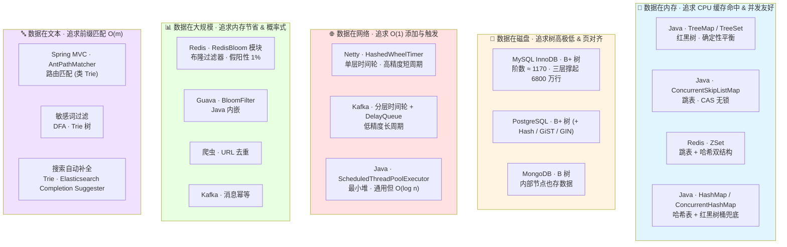
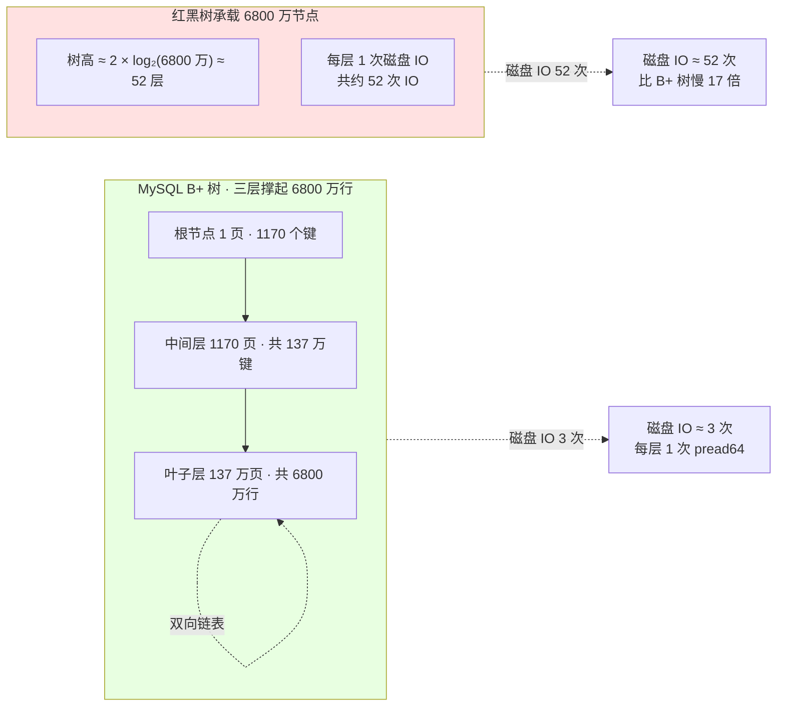

# 数据结构精讲：红黑树、B+ 树、跳表、时间轮、布隆过滤器的生态映射

!!! info "**数据结构与物理介质映射 · 一句话口诀**"
    - **技术选型不是"看哪个数据结构快"，是"看数据在哪里"**——数据在内存 → 选红黑树 / 跳表；数据在磁盘 → 选 B+ 树（阶数 = 磁盘页容纳的 key 数）；数据在网络 → 选时间轮（O(1) 添加/触发定时任务）。物理介质决定数据结构，这是老手需要顿悟的第一条主线。
    - **红黑树 vs 跳表不是"更好或更差"，是"两种维护平衡的哲学"**——红黑树用旋转 + 变色**确定性**保持 O(log n)；跳表用抛硬币**概率式**保持 O(log n)。这就是 `TreeMap` 选红黑树（追求严格上界）而 `ConcurrentSkipListMap` / Redis ZSet 选跳表（追求并发友好 + 范围查询）的物理根源。
    - **B+ 树的三层高度撑起 6800 万行 MySQL 记录 = "磁盘页 16 KB × 阶数 ≈ 1170 分支"的物理算术**——内部节点只存 key 让每页能塞更多分支，叶子链表让范围扫描不用回溯到根；这两个物理约束就是 B+ 树打败红黑树的全部理由。
    - **布隆过滤器不是"防缓存穿透的银弹"，是"用假阳性率换内存"的物理妥协**——1000 万条 key + 1% 误判率只需 12 MB 内存，比 Redis 存全量键节省 100 倍；代价是"存在"结论不可靠、"不存在"结论 100% 可靠——老手要理解这种"不对称语义"来自 `k` 个哈希位的物理布局。
    - **Netty 用单层时间轮、Kafka 用分层时间轮 + `DelayQueue`、JDK 用最小堆 —— 同一件事（到期触发定时任务）三家生态选了完全不同的数据结构**，本质是"数据规模 × 时间跨度 × 添加/触发频率"三维物理博弈的产物。

**你能立刻答上来吗？**

- MySQL 千万级表主键查询为什么只要 3 次磁盘 IO？把"页 16 KB × 阶数 1170 × 三层 6800 万行"这条物理算术全链路讲一遍，你能做到吗？
- Redis ZSet 用跳表 + 哈希表双结构，红黑树看起来更严格更快，为什么不用红黑树？跳表的抛硬币和 CAS 无锁并发有什么关系？
- 1000 万黑名单用布隆过滤器只要 12 MB —— `m = -n × ln(p) / (ln 2)²` 这条公式怎么从假阳性率 1% 反推到 96M bits + 7 个哈希函数？
- Netty 用单层时间轮、Kafka 用分层时间轮、JDK 用最小堆 —— 同样是"到期触发定时任务"，为什么三家生态选了完全不同的数据结构？
- `HashMap.TreeNode` 树化桶用红黑树、`ConcurrentSkipListMap` 用跳表、`Nginx.timer` 用红黑树 —— 一句话说清"为什么 Java 内部索引偏爱红黑树而并发场景偏爱跳表"你能做到吗？

如果任何一个问题让你迟疑超过 3 秒——继续读。

> 📖 **本文讲什么 / 不讲什么**
>
> **本文讲**（顿悟浓度集中区）：
>
> 1. 红黑树 5 条性质 + 插入删除的旋转变色链（回收 [08 集合框架](@java-数据结构-集合框架) 埋下的伏笔 · 深度展开）
> 2. 红黑树 vs AVL 树 vs 跳表的**平衡维护哲学**对比——确定性 vs 概率式
> 3. B+ 树的**磁盘页对齐 + 阶数 + 叶子链表**三段物理设计
> 4. 跳表在 Redis ZSet 与 Java `ConcurrentSkipListMap` 里的**同结构不同实现**对比
> 5. 时间轮（`HashedWheelTimer` / Kafka 分层时间轮）与最小堆的物理选型对比
> 6. 布隆过滤器的 `k` 个哈希 + `m` 个 bit 的假阳性率数学推导
> 7. Trie 树在敏感词过滤 / 路由匹配 / 搜索自动补全的三种落地场景
>
> **本文不讲**（`📖` 引用到姊妹文档）：
>
> - HashMap 数组 + 链表 + 红黑树三级结构 + 三条位运算捷径 → [@java-数据结构-集合框架](@java-数据结构-集合框架) §"三条位运算捷径 + HashMap 三级结构"
> - `ConcurrentSkipListMap` 的完整源码（分段头节点 / 无锁 CAS 插入 / `helpDelete` 协作删除）→ [@java-并发-并发集合与实战陷阱](@java-并发-并发集合与实战陷阱) §"跳表并发实现"
> - MySQL InnoDB 索引与锁机制、聚簇 / 二级索引的完整回表流程 → `@mysql-索引与锁机制`
> - Redis ZSet 完整命令集（`ZADD` / `ZRANGE` / `ZRANGEBYSCORE` / `ZINCRBY`）与 skiplist + hash 双结构 → `@redis-数据结构`
> - Netty `HashedWheelTimer` 完整源码 + Kafka `SystemTimer` 分层时间轮源码 → `@netty` / `@kafka`
> - Guava BloomFilter 完整 API + Redis RedisBloom 模块使用 → `@redis-布隆过滤器`
> - 优先队列在 `ScheduledThreadPoolExecutor` 里的 `DelayedWorkQueue` 完整实现 → [@java-并发-并发工具Lock与线程池](@java-并发-并发工具Lock与线程池) §"阻塞队列 · 延迟队列"

---

## 1. 第一层：业务痛点 —— 从"MySQL 3 次 IO 撑起千万级表"到"数据结构选型的物理映射"

### 1.1 生产事故现场：一次"数据结构选错了"引发的雪崩

某电商平台大促前一周做压测，业务同学写了一段"看起来很直觉"的代码来做用户黑名单校验：

```java
@Service
public class BlackListChecker {

    /** 用户黑名单，启动时从 DB 加载 · 约 1000 万条 */
    private final Set<String> blackList = ConcurrentHashMap.newKeySet();

    @PostConstruct
    public void loadFromDB() {
        blackList.addAll(userDao.selectAllBlackUserIds());  // 1000 万条 String
    }

    public boolean isBlacklisted(String userId) {
        return blackList.contains(userId);
    }
}
```

单看没什么问题——`ConcurrentHashMap.newKeySet()` 就是 `KeySetView`，底层就是 `ConcurrentHashMap`，`contains` O(1) 均摊。压测第一天风平浪静，直到运维发现这台微服务 Pod 常驻**堆内存 1.2 GB**——单是 `blackList` 一个字段就吃掉 800 MB。

内存 dump 分析出来的账单：

- 1000 万个 `String` 用户 ID，平均 20 个字符
- 每个 `String` 对象头 16 B + 4 B (`coder`) + 4 B (`hash`) + `byte[]` 引用 4 B + 4 B 对齐 = 32 B
- 每个 `byte[]` 对象头 16 B + 长度 4 B + 20 B 内容 + 4 B 对齐 = 44 B
- `ConcurrentHashMap.Node` 每个 32 B（对象头 16 + hash 4 + key 引用 4 + value 引用 4 + next 引用 4）
- 单条记录约 108 B × 1000 万条 ≈ **1.03 GB**

这个"直觉方案"在功能上完全正确，问题只是——**为了做"存在性判断"这一件事，把全量数据都塞进内存了**。而这件事恰好是布隆过滤器的核心舞台：**1000 万条 + 1% 假阳性率**只需要 12 MB bit 数组和 7 个哈希函数——**内存压缩 85 倍**，代价仅仅是"存在"结论不 100% 可靠（可能把不在黑名单的人误判为在，走一次 DB 兜底就能修正）。

事故复盘会上有人问："为什么我们没想到用布隆过滤器？"——答案是：**大家把布隆过滤器只记成了"防缓存穿透的一个工具"，没意识到它是"存在性判断"这个抽象问题的通用降维方案**。而这正是本篇要穿刺的第一条主线——**技术选型不是"选一个熟悉的数据结构"，是"识别问题的抽象形态，然后选与问题形态物理匹配的数据结构"**。

### 1.2 反问引子：老手也未必答得上的 5 个数据结构悬案

- **悬案 1**：MySQL InnoDB 单表 5000 万行主键查询，为什么线上稳定在 3 次磁盘 IO？把"页 16 KB × 阶数 1170 × 三层 6800 万行"这条物理算术**逐步推导**一遍，你能做到吗？
- **悬案 2**：Redis ZSet 底层是 skiplist + hash 双结构，为什么不干脆全用红黑树？跳表的"抛硬币"和"CAS 无锁"之间到底有什么因果关系？
- **悬案 3**：1000 万条黑名单用布隆过滤器只要 12 MB，`m = -n × ln(p) / (ln 2)²` 这条公式怎么从"1% 假阳性率"反推到"96 M bits + 7 个哈希函数"？为什么最优哈希数是 7 而不是 8 或 10？
- **悬案 4**：Netty 用**单层**时间轮、Kafka 用**分层**时间轮 + `DelayQueue`、JDK 用**最小堆** —— 同一件"到期触发定时任务"的事，三家生态为什么不共用一套？
- **悬案 5**：`HashMap.TreeNode` 树化桶用红黑树、`ConcurrentSkipListMap` 用跳表、`ScheduledThreadPoolExecutor.DelayedWorkQueue` 用最小堆、Nginx `timer` 用红黑树、Linux CFS 调度器用红黑树 —— 这些"内部索引结构"的选型是拍脑袋，还是各有物理动机？

这五个悬案的答案都在"数据结构与物理介质映射"这一条主线上。掀开每种数据结构的物理动作，就都清晰了。

### 1.3 三条痛点主线（与四层往后强绑定）

- **痛点 A · 内存介质的选型迷雾**：技术评审时"该用红黑树还是跳表"，凭"哪个熟悉"选而说不出物理根源 → 第三层 §3.2 §3.3 揭"确定性平衡 vs 概率式平衡"两条哲学，并给出 Java 内部索引偏爱红黑树、并发场景偏爱跳表的物理动机
- **痛点 B · 磁盘介质的选型盲区**：知道 MySQL 用 B+ 树，但说不出"为什么红黑树在磁盘场景彻底不能用" → 第二层 §2.3 揭"磁盘页对齐 + 阶数 + 叶子链表"三段物理设计 + 第三层 §3.4 揭 B+ 树 vs 红黑树的磁盘 IO 3 次 vs 52 次的对比
- **痛点 C · 概率式数据结构的参数迷信**：布隆过滤器的假阳性率、bit 数组长度、哈希函数个数全部拍脑袋估 → 第二层 §2.4 揭 `m = -n × ln(p) / (ln 2)²` 的完整数学推导，让参数选择从"经验"变"公式"

---

## 2. 第二层：物理动作考古 —— 旋转、抛硬币、磁盘页、假阳性率数学

!!! tip "本层特殊说明"
    本篇的"字节码考古"不再抓 `javap -v`（那属于战役一）——数据结构的物理真相不在字节码里，而在**旋转的 3 次指针交换**、**跳表的 `Math.random() < 0.5` 抛硬币**、**B+ 树磁盘页的 `pread64` 系统调用**、**布隆过滤器的 `m/n/k` 数学公式**这些"操作对应的物理动作"上。

### 2.1 红黑树旋转变色的三步物理动作（回收 08 集合框架伏笔）

红黑树在 [08 集合框架](@java-数据结构-集合框架) §3.2 里作为 `HashMap` 桶兜底、`TreeMap` 底层、`ConcurrentHashMap.TreeBin` 承载体反复出现，但当时只谈了"5 条性质保证 O(log n)"这一层——真正让红黑树在 Java 生态里赢过 AVL 树的**根本理由**是它的**旋转次数有严格上界**，这一节正面穿刺。

**主考古样本 · 左旋（Left Rotate）的 3 步指针交换**：

```txt
左旋 (LR - Left Rotate) —— "把 X 沉到 Y 的左孩子位置"

        X                              Y
       / \                            / \
      α   Y     ── 左旋 X ──▶        X   γ
         / \                        / \
        β   γ                      α   β

物理动作 · 3 步指针交换（伪代码）:
  Step 1:  X.right   = Y.left     // β 从 Y 的左孩子转成 X 的右孩子
  Step 2:  Y.left    = X          // X 变成 Y 的左孩子
  Step 3:  Y.parent  = X.parent   // Y 继承 X 的父指针
           X.parent  = Y          // X 挂到 Y 下面
           (若 X 有父节点, 把父节点对 X 的引用改成 Y)
```

**顿悟点**：红黑树的所有维护操作在插入路径上**最多 2 次旋转**、在删除路径上**最多 3 次旋转**（Sedgewick 与 Guibas 1978 论文严格证明），加上 O(log n) 次变色。这个"旋转次数上界"是 AVL 树没有的——AVL 树的严格平衡条件（左右子树高度差 ≤ 1）会让**一次删除操作沿着回溯路径连续触发 O(log n) 次旋转**。

**红黑树 5 条性质的物理动机对齐表**：

| 性质 | 物理动机 |
| :-- | :-- |
| ① 每个节点是红色或黑色 | 只用 1 bit 存平衡信息，比 AVL 的 `int height`（4 B）省内存 |
| ② 根节点是黑色 | 保证"从根到叶必经黑节点"路径起点 |
| ③ 叶子节点（NIL 哨兵）是黑色 | 让"路径黑高"计算不用特判空指针 |
| ④ 红节点的两个子节点必须是黑色 | 禁止两个连续红节点 → 限制最长路径长度 |
| ⑤ 从任意节点到其后代叶子的所有路径黑节点数相同 | 保证 **最长路径 ≤ 2 × 最短路径**，即树高 ≤ 2·log(n+1) |

**这 5 条性质共同锁定的物理事实**：树高 ≤ 2·log(n+1)，比 AVL 的 1.44·log(n+1) 略高，**换来了"最多 3 次旋转"的插入删除上界**——这是一次刻意的性能权衡：**用 40% 的查询高度换来数倍的写入性能稳定性**。这就解释了为什么 Java 集合选红黑树：`HashMap` 桶树化、`TreeMap`、`ConcurrentHashMap.TreeBin` 都是**写操作频繁**的场景，需要旋转次数上界；而反过来，那些"极端读多写少 + 严格查询延迟"的场景（比如某些嵌入式数据库内存表），才会选 AVL 树。

### 2.2 跳表的抛硬币物理机制

跳表和红黑树都能做到 O(log n)，但走的是完全不同的哲学——红黑树是**确定性平衡**（旋转 + 变色主动维护），跳表是**概率式平衡**（抛硬币被动维护）。看核心代码：

```java
// ConcurrentSkipListMap.doPut() 里的建索引层逻辑简化版
static final int MAX_LEVEL = 32;

int randomLevel() {
    int level = 1;
    while (ThreadLocalRandom.current().nextDouble() < 0.5 && level < MAX_LEVEL) {
        level++;
    }
    return level;
}
```

**物理动作只有一次抛硬币**——插入节点时按概率 p = 0.5 逐层向上"晋升"，晋升到什么高度停止完全由随机数决定。**没有旋转、没有变色、没有回溯**——这就是跳表"实现极简 + 并发极友好"的物理根源。

**概率分析**：p = 0.5 时，节点晋升到第 L 层的概率是 `(1/2)^(L-1)`，第 L 层期望节点数 = `n × (1/2)^(L-1)`。查找从最高层开始，平均每层跳约 2 步就下沉，**平均查找步数 ≈ 2·log₂(n)**——与红黑树同数量级。

**红黑树 vs 跳表的哲学对比表**（这张表是"两条主线"的一次性总纲）：

| 维度 | 红黑树 | 跳表 |
| :-- | :-- | :-- |
| 平衡维护 | 确定性 · 旋转 + 变色 | 概率式 · 抛硬币 |
| 最坏时间复杂度 | O(log n) · 有严格理论上界 | O(n) · 概率极低但存在 |
| 并发实现难度 | 复杂 · 旋转影响多节点，锁粒度大 | 简单 · 局部 CAS 修改，锁粒度小 |
| 内存占用（每节点） | 1 bit 颜色 + 父/左/右三个指针 ≈ 24 B | 多层前进指针 · 平均 2 层 ≈ 24 B |
| Java 归属 | `TreeMap` / `TreeSet` / `HashMap.TreeNode` / `ConcurrentHashMap.TreeBin` | `ConcurrentSkipListMap` / `ConcurrentSkipListSet` |
| 生态映射 | Java 内部索引 / Linux CFS 调度器 / Nginx timer | Redis ZSet / LevelDB / HBase / RocksDB memtable |

**这张表的顿悟点**：**Java 内部索引偏爱红黑树，是因为"上界确定"契合内部索引的稳定性要求；Redis / LevelDB 偏爱跳表，是因为"局部修改"契合并发场景的低锁粒度要求**——同一件事（有序索引），两个截然不同的选择，各自都是它所处场景下的最优解。

!!! note "📖 术语家族：Java 生态"树 / 跳表"内部索引结构族"
    **字面义**：
    - `Tree*` = "底层是树的容器"，Java 生态里几乎特指红黑树
    - `Skip*` = "底层是跳表的容器"
    - `Concurrent*` = "支持并发访问的容器"

    **在本框架中的含义**：Java 集合框架里承担"内部索引"角色的数据结构族——`TreeMap` / `HashMap.TreeNode` / `ConcurrentSkipListMap` 都不直接作为用户的日常首选 API（用户日常直接用 `HashMap` 或 `ConcurrentHashMap`），而是作为"哈希冲突严重时的兜底"或"需要有序范围查询时的选择"。

    **同家族成员**：

    | 成员 | 结构 | 承载位置 | 平衡策略 |
    | :-- | :-- | :-- | :-- |
    | `TreeMap.Entry` | 红黑树节点 | JDK 通用有序 KV | 旋转 + 变色 · 有上界 |
    | `HashMap.TreeNode` | 红黑树节点 | HashMap 桶兜底 | 同上 |
    | `ConcurrentHashMap.TreeBin` | 红黑树封装 · 加同步锁 | CHM 桶兜底 | 同上 + `synchronized` 头节点 |
    | `LinkedHashMap.Entry` | 链表 + 哈希 | 双向链表维护插入 / LRU 顺序 | — |
    | `ConcurrentSkipListMap.Node` + `Index` | 跳表 + 独立索引层 | CAS 无锁并发有序 Map | 抛硬币概率式 |

    **命名规律**：`<Tree/Skip/Concurrent>Xxx` = "底层是树 / 跳表 / 并发的容器"——前缀标识底层结构与并发能力，后缀标识容器类型（`Map` / `Set` / `Entry`）。

    !!! warning "易混点：`TreeMap` vs `ConcurrentSkipListMap`"
        **两者都是"有序 Map"但适用场景截然不同**：`TreeMap` 是单线程有序 Map（多线程写会破坏红黑树平衡）；`ConcurrentSkipListMap` 是多线程有序 Map（CAS 无锁跳表）。**禁止**在多线程写场景下用 `Collections.synchronizedSortedMap(TreeMap)` 硬套——所有操作都需要锁整棵树，并发度远低于 `ConcurrentSkipListMap` 的局部 CAS。

### 2.3 B+ 树的磁盘页对齐物理算术

跳到磁盘介质，一切换成 B+ 树。**为什么？**——因为磁盘 IO 是数据库性能的第一约束，而 B+ 树的**每个节点大小可以精确对齐磁盘页**，让"一次 IO 读满一页 = 一次 IO 处理一层树"，把树高压到极致。

**主考古样本 · InnoDB 页 16 KB 的内部布局**：

```txt
┌──────────────────────────────────────────────────────────┐
│ InnoDB 数据页 (16 KB · 由 innodb_page_size 决定)          │
├──────────────────────────────────────────────────────────┤
│ ① File Header (38 B) + Page Header (56 B)                │
│   ├── 页号 · 页类型 · Checksum                             │
│   └── 上一页 / 下一页页号 (叶子链表指针)                    │
├──────────────────────────────────────────────────────────┤
│ ② Infimum + Supremum (26 B) · 页内伪记录 · 用于二分       │
├──────────────────────────────────────────────────────────┤
│ ③ User Records (变长 · 页大部分空间在这里)                │
│   内部节点存: key(8 B) + 子节点页号(6 B) ≈ 14 B/记录        │
│   叶子节点存: key(8 B) + 完整行数据(~300 B) ≈ 320 B/记录   │
├──────────────────────────────────────────────────────────┤
│ ④ Free Space + Page Directory + File Trailer              │
└──────────────────────────────────────────────────────────┘

内部节点扇出估算:
  (16384 - 200) / 14 ≈ 1156 ≈ 1170 分支
```

**三层 B+ 树的容量算术**（这是老手需要背下来的"物理算术"）：

- **第 1 层**（根节点）：1 页 · **约 1170 个键**
- **第 2 层**（内部节点层）：1170 页 · 每页 1170 键 = **约 137 万个键**
- **第 3 层**（叶子层）：约 137 万个页 · 每页存 50 行数据 ≈ **6800 万行**

**顿悟点**：**MySQL InnoDB 单表 6800 万行只需 3 次磁盘 IO** 不是玄学，是 `页大小 × 阶数^(层数-1) × 每叶行数` 的**乘积算术**。老手要顿悟的是——**数据结构选型永远伴随硬件参数（页大小 / 缓存行 / 磁盘扇区）的乘积算术**，脱离硬件谈数据结构性能都是纸上谈兵。

**从系统调用视角观测这 3 次 IO**（Linux `strace` 抓 `pread64`）：

```volt
$ strace -e trace=pread64,read -p <mysqld_pid> 2>&1 | head
pread64(fd=42, buf=0x7f8c00400000, count=16384, offset=0x00400000) = 16384   # 读根页 · 16 KB
pread64(fd=42, buf=0x7f8c00404000, count=16384, offset=0x1a800000) = 16384   # 读中间层页 · 16 KB
pread64(fd=42, buf=0x7f8c00408000, count=16384, offset=0x3c000000) = 16384   # 读叶子页 · 16 KB
# 3 次 pread64 系统调用 ← 对应 B+ 树 3 层高度 · 每次读满一页
```

**为什么内部节点不存完整行数据？**——因为一旦叶子节点每条记录从 14 B 膨胀到 320 B，内部节点每页从 1170 分支塌到 50 分支，三层树的容量从 6800 万骤降到 12 万行，MySQL 就成不了数据库了。**这就是 B+ 树打败 B 树（B 树内部节点也存完整数据）的根本理由**。

**叶子节点的双向链表**是 B+ 树的**第二个致命优势**——`SELECT ... WHERE id BETWEEN 1000 AND 2000` 只需要沿着叶子层的 `next` 指针横向扫描，**不用回溯到根节点**。红黑树做范围查询必须中序遍历回溯，磁盘 IO 会飙升到远超 B+ 树。

### 2.4 布隆过滤器的假阳性率数学推导

跳到"大规模数据的存在性判断"这个场景，一切换成布隆过滤器。**核心数学**：

```txt
参数定义:
  n = 元素总数
  m = bit 数组长度
  k = 哈希函数个数
  p = 假阳性率（False Positive Rate）

理论假阳性率:
  p ≈ (1 - e^(-kn/m))^k

给定 n 和目标 p, 反推最优 m 和 k:
  最优 k = (m/n) × ln(2)
  最优 m = -n × ln(p) / (ln 2)²

实例 · 1000 万黑名单 · 1% 假阳性:
  n = 10⁷
  p = 0.01
  m = -10⁷ × ln(0.01) / (ln 2)²
    = -10⁷ × (-4.605) / 0.4805
    ≈ 9.585 × 10⁷ bits
    ≈ 96 M bits
    ≈ 12 MB
  k = (m/n) × ln(2) ≈ 9.585 × 0.693 ≈ 6.64 → 取整为 7
```

**顿悟点**：**1000 万黑名单只需要 12 MB bit 数组 + 7 个哈希函数**——这不是"经验估算"，是数学公式硬推的物理约束。回头看 §1.1 那个 1.03 GB 的 `ConcurrentHashMap.newKeySet()` 方案，**内存被压缩了 86 倍**。

**为什么最优哈希数是 7 而不是 8 或 10？**——因为 `p ≈ (1 - e^(-kn/m))^k` 对 k 求导等于 0 时得到极值点 `k = (m/n) × ln(2)`。哈希函数太少 → bit 命中率不足 → 假阳性率高；哈希函数太多 → bit 数组饱和过快 → 假阳性率同样飙升。**7 是数学上的甜点位**。

**布隆过滤器的三条硬性物理事实**：

1. **"不存在"结论 100% 可靠**——因为如果元素被 `put` 过，它对应的 k 个 bit 一定都被置为 1；查询时只要有一个 bit 是 0，就 100% 确定这个元素**从未** put 过
2. **"存在"结论有假阳性**——因为多个元素的 k 个哈希位可能碰巧完全重合，让一个未 put 的元素被误判为已 put
3. **不支持删除**——因为"清零"一个元素的 k 个 bit 会同时"删除"其他共享这些 bit 的元素；如果确实需要删除，用 Counting Bloom Filter（每个 bit 变成计数器，但内存翻数倍）

---

## 3. 第三层：JVM 内存与生态映射 —— 数据结构与物理介质的物理博弈

!!! tip "本层是本文最重要的一层"
    本层承担"生态映射"的主战场——把 Java / Spring / MySQL / Redis / Kafka / Netty 生态里的所有关键数据结构选型统一到"**物理介质 → 数据结构**"这一条主线上。这一层读完，你能一眼看穿"红黑树 vs 跳表 vs B+ 树 vs 时间轮 vs 布隆过滤器"这五大数据结构在生态里的位置。

### 3.1 生态映射全景图（五分区）



**这张图的顿悟点**：**五大数据结构的选型完全被物理介质决定**——内存追求缓存命中和并发友好、磁盘追求树高极低和页对齐、网络追求 O(1) 添加与触发、大规模追求内存节省和概率式、文本追求前缀匹配。**记住这五个分区的物理特征**，遇到任何数据结构选型题，先问"数据在哪里、访问模式是什么"，答案就自动涌现。

### 3.2 红黑树在 Java/Spring 生态的完整落地（回收 08 集合框架伏笔）

回收 [08 集合框架](@java-数据结构-集合框架) §7.1 埋下的伏笔——那里承诺了"红黑树 5 条性质 + `TreeNode` 8 引用完整旋转变色算法链"由本篇承接。这里给出**完整的红黑树在 Java/Spring/Linux/Nginx 生态的落地清单**：

| 落地场景 | 使用位置 | 备注 |
| :-- | :-- | :-- |
| `TreeMap` | JDK · `java.util.TreeMap.Entry` | 红黑树根节点直接是 Entry · 有序 KV |
| `TreeSet` | JDK · 底层 `TreeMap` · value 是同一个占位对象 | 红黑树 + Set 语义 |
| `HashMap.TreeNode` | JDK · 链表 → 红黑树兜底 | 桶内长度 > 8 且数组 ≥ 64 触发 |
| `ConcurrentHashMap.TreeBin` | JDK · `synchronized` 锁 TreeBin | 头节点是 TreeBin 而非 TreeNode |
| Linux CFS 调度器 | 内核 · `sched_entity` 红黑树 | 按 `vruntime` 排序找"最需要 CPU 的进程" |
| Nginx `ngx_event_timer` | Nginx · 红黑树管理定时器 | 按到期时间排序 · 每次拿最小到期时间做 epoll 超时 |
| Netty `EpollEventLoop` 定时任务 | Netty · 部分实现走红黑树 | 场景类似 Nginx timer |

**顿悟点**：红黑树在这些生态里几乎全部承担"**内部索引结构**"角色（不直接作为用户日常首选 API），因为其**旋转次数上界**保证了**写多读少场景下响应时间的稳定性**——`HashMap` 桶树化就是写多，Linux CFS 每次任务切换都要更新 `vruntime`，Nginx timer 每次超时都要重排——**这些场景都受不了 AVL 树"回溯链式旋转"的抖动**。

### 3.3 跳表在 Redis vs Java 的双面孔

跳表在 Redis 和 Java 里是**同一个抽象数据结构，两个截然不同的实现哲学**。

**Redis ZSet 的 skiplist + hash 双结构**：

```txt
┌────────────────────────────────────────────┐
│ Redis ZSet 内部（zset.c · zset 结构体）      │
│                                             │
│ dict (哈希表 · O(1)) ────▶ member → score  │
│   用于 ZSCORE member 单点查分                │
│                                             │
│ zskiplist (跳表 · O(log n)) ────▶ 有序      │
│   Level 3: HEAD ────────────────▶ ...       │
│   Level 2: HEAD ──▶ node2 ──────▶ ...       │
│   Level 1: HEAD ──▶ node1 ──▶ node2 ──▶ ... │
│   用于 ZRANGE / ZRANGEBYSCORE 范围查询       │
│                                             │
│ 两个结构共享同一个 sds member 数据           │
│ 单个 member 对象只存一份 · 只多两个指针       │
└────────────────────────────────────────────┘
```

- `ZADD` / `ZINCRBY` / `ZRANGEBYSCORE`：走 skiplist（有序 + 范围查询）
- `ZSCORE member`：走 dict（O(1) 查分，不需要遍历跳表）
- **两个结构共享 sds member**——不重复存储字符串本体，只多两个指针的开销

**Java `ConcurrentSkipListMap` 的 CAS 无锁跳表**：

```txt
┌────────────────────────────────────────┐
│ ConcurrentSkipListMap 内部              │
│                                          │
│ 只有跳表结构 · 无双结构                  │
│                                          │
│ Index[] 索引层节点独立于 Node[]          │
│   Index.node → Node                      │
│   Index.right → Index                    │
│   Index.down → Index                     │
│                                          │
│ 插入/删除全走 CAS (VarHandle):           │
│   compareAndExchange(expected, new)     │
│                                          │
│ 删除用"标记删除"(markerNode) 配合协作清理 │
└────────────────────────────────────────┘
```

**顿悟点**：**同样是跳表，Redis 追求单线程内存友好 + 双结构 O(1) 查分，Java 追求多线程 CAS 无锁 + 索引层节点独立**——数据结构相同，实现哲学不同。Redis 用双结构是因为单线程模型下"多一个 dict"没有锁竞争代价，纯赚 O(1) 单点查分；Java 用单结构是因为多线程下每多一个共享结构就多一份并发协调成本，CAS 无锁跳表在这一点上做到了极致。

### 3.4 B+ 树 vs 红黑树的磁盘 IO 物理博弈



**顿悟点**：所谓"B+ 树优于红黑树"不是抽象比较，是**磁盘 IO 次数 3 vs 52** 的物理差距（约 17 倍）。老手回头看时的顿悟感在于——**数据结构的性能永远和它承载的物理介质深度绑定**，脱离介质谈复杂度都是抽象的算法题。

### 3.5 时间轮 vs 最小堆的物理选型对比

三家生态在"到期触发定时任务"这件事上的选择完全不同，都是"数据规模 × 时间跨度 × 添加/触发频率"三维物理博弈的产物。

**Netty `HashedWheelTimer` · 单层时间轮**：

```txt
┌──────────────────────────────────────┐
│ 512 个槽 · 每格 100 ms                │
│ 最大范围: 512 × 100 ms = 51.2 秒       │
│                                        │
│ [0] → Task(round=0) → Task(round=1)   │
│ [1] → Task(round=0)                   │
│  ...                                   │
│                                        │
│ 指针每 100 ms 前进 1 格                │
│ 到期条件: task.round == 0             │
│ round > 0 的任务留在槽里等下一圈       │
└──────────────────────────────────────┘

添加任务: O(1) · 计算槽位 + 塞进链表
触发任务: O(k) · k = 当前槽中 round==0 的任务数
```

**Kafka `SystemTimer` · 分层时间轮 + `DelayQueue`**：

```txt
┌─────────────────────────────────────────────────────┐
│ 分层时间轮(TimingWheel):                             │
│   Layer 0 · 每格 1 ms · 20 格 · 覆盖 20 ms          │
│   Layer 1 · 每格 20 ms · 20 格 · 覆盖 400 ms        │
│   Layer 2 · 每格 400 ms · 20 格 · 覆盖 8 s          │
│   Layer 3 · 每格 8 s · 20 格 · 覆盖 160 s           │
│   Layer 4 · 每格 160 s · 20 格 · 覆盖 3200 s         │
│   ...                                                │
│                                                      │
│ DelayQueue<TimerTaskList>(最小堆):                   │
│   管理"有任务的 bucket"                              │
│   时间指针跳过空 bucket · 避免空转                    │
│                                                      │
│ 到期后逐层降级: Layer N 的 bucket 到期时             │
│   把里面的任务重新分配到 Layer N-1 的对应 bucket     │
└─────────────────────────────────────────────────────┘

添加任务: O(1) · 找到对应层 + 塞进 bucket
触发任务: O(1) · DelayQueue 弹出到期 bucket
```

**时间轮 vs 最小堆的选型对比表**：

| 维度 | Netty `HashedWheelTimer` | Kafka `SystemTimer` | JDK `DelayedWorkQueue` |
| :-- | :-- | :-- | :-- |
| 底层结构 | 单层时间轮 | 分层时间轮 + `DelayQueue` | 最小堆 |
| 添加任务复杂度 | O(1) | O(1) | O(log n) |
| 触发到期复杂度 | O(1) | O(1) | O(log n) |
| 内存占用 | 固定 · 槽数 × 平均 bucket 大小 | 固定 · 各层槽数之和 | 与任务数线性 |
| 精度 | 由格粒度决定（默认 100 ms） | 最内层格粒度（默认 1 ms） | 毫秒 |
| 时间跨度 | 有限（≤ 槽数 × 格粒度 × 单轮 round） | 极大（多层堆叠） | 无限制 |
| 适用场景 | 大量短期定时（连接超时、心跳） | 大量任意跨度定时（消息延迟从秒到小时） | 少量任务、通用调度 |

**顿悟点**：**Netty 用单层时间轮**是因为连接超时都在 30 秒内、任务量大——单层足够 + O(1) 添加最重要；**Kafka 用分层时间轮 + DelayQueue** 是因为消息延迟从秒级到小时级横跨 4 个数量级——分层才能覆盖 + DelayQueue 跳过空 bucket；**JDK 用最小堆**是因为标准库要通用性——牺牲 O(log n) 换任意跨度和任意精度。**三种选型都是它所处场景下的最优解**。

!!! note "📖 术语家族：`*Timer` / `DelayedWorkQueue` / `SystemTimer` —— 生态定时数据结构族"
    **字面义**：**定时任务调度容器族**——不同生态围绕"到期触发定时任务"这个共同目标选择了完全不同的数据结构。

    **在本框架中的含义**：这个家族是"数据规模 × 时间跨度 × 添加/触发频率"三维物理博弈的产物——同一件事有 4 种数据结构实现，各有其物理约束下的最优场景。

    **同家族成员**：

    | 成员 | 生态 | 结构 | 添加/触发复杂度 |
    | :-- | :-- | :-- | :-- |
    | `ScheduledThreadPoolExecutor.DelayedWorkQueue` | JDK | 最小堆 | O(log n) / O(log n) |
    | `Netty.HashedWheelTimer` | Netty | 单层时间轮 | O(1) / O(1) |
    | `Kafka.SystemTimer` | Kafka | 分层时间轮 + `DelayQueue` | O(1) / O(1) |
    | `Nginx.ngx_event_timer_rbtree` | Nginx | 红黑树 | O(log n) / O(log n) |
    | `Linux CFS.rb_root` | 内核 | 红黑树 | O(log n) / O(log n) |

    **命名规律**：不同生态各有前缀（`Scheduled*` / `HashedWheel*` / `System*` / `ngx_*`），但功能都是"定时任务调度"——**这个家族的存在本身就是"数据结构与物理介质映射"最生动的证据**。

    **引用其他篇的家族**（本篇不重复展开）：

    - 📖 集合框架接口继承族 → [08 集合框架](@java-数据结构-集合框架) §"术语家族卡片一"
    - 📖 HashMap 内部节点族（`Node<K,V>` / `TreeNode<K,V>`）→ [08 集合框架](@java-数据结构-集合框架) §"术语家族卡片二"

### 3.6 哈希表、Trie、堆在生态里的补充位置

**哈希表**已在 [08 集合框架](@java-数据结构-集合框架) §"三条位运算捷径 + HashMap 三级结构"里深度展开——本篇不重复，只强调它在**内存介质 · O(1) 单点查找**这个分区的核心地位（`HashMap` / `ConcurrentHashMap` / Redis Hash / Python dict 全部是这个族的成员）。

**Trie 树**是**文本介质 · 前缀匹配 O(m)**（m 为字符串长度，与总集大小 n 无关）分区的核心：

- Spring MVC `AntPathMatcher` / `PathPatternParser` 用类 Trie 结构做 URL 路由匹配，支持 `/**`、`/{id}` 通配符
- 敏感词过滤走 DFA（确定有限状态自动机）算法，本质是 Trie + 状态转移，时间复杂度 O(n)（n 为文本长度）远优于逐词 `contains` 的 O(n·m)
- Elasticsearch Completion Suggester 用 FST（Finite State Transducer，本质是压缩 Trie）做搜索自动补全

**堆 / 优先队列**是**"求最值 + 中等规模数据"**场景的默认选择：

- `PriorityQueue`（单线程小顶堆/大顶堆） · `PriorityBlockingQueue`（并发版本，用 `ReentrantLock` 而非 CAS）
- Top-K 问题的经典解法（维护大小为 K 的小顶堆，遍历 O(n·log k)）
- `ScheduledThreadPoolExecutor.DelayedWorkQueue`（最小堆按执行时间排序）

---

## 4. 第四层：工程红线 —— 5 条钢铁准则 + `❌ 反模式 / ✅ 标准范式` 双代码块

### 4.1 红线 1：技术选型第一问 —— "数据在哪里？"

**技术依据**：§3.1 生态映射全景图——五分区（内存 / 磁盘 / 网络 / 大规模 / 文本）对应五族数据结构。

```java
// ❌ 反模式：不问物理介质，凭"哪个熟悉"选
public class UserCache {
    // 目标：做用户存在性判断 + 全量数据缓存到本地
    // 决策依据：ConcurrentHashMap 最熟
    private final ConcurrentMap<String, User> cache = new ConcurrentHashMap<>();

    @PostConstruct
    void load() {
        cache.putAll(userDao.selectAll());  // 💥 1000 万条 · 内存 1 GB+
    }

    boolean exists(String id) {
        return cache.containsKey(id);
    }
}
```

```java
// ✅ 标准范式：先反问"数据在哪里、访问模式是什么"，再选型
public class UserExistenceChecker {
    // 场景 1：只做存在性判断，允许 1% 假阳性 → 布隆过滤器
    // 场景 2：需要完整数据 → Redis + DB 二级缓存，本地不缓存
    // 场景 3：需要有序范围查询 → TreeMap / ConcurrentSkipListMap

    private final BloomFilter<String> filter = BloomFilter.create(
        Funnels.stringFunnel(StandardCharsets.UTF_8),
        10_000_000,   // 预期元素数
        0.01          // 假阳性率 1%
    );

    @PostConstruct
    void load() {
        userDao.streamAllIds().forEach(filter::put);   // 💡 只加载 ID · 12 MB
    }

    boolean mayExist(String id) {
        return filter.mightContain(id);
    }
}
```

**降维建议**：面试和技术评审时先反问"数据规模 + 存储介质 + 访问模式"三件事再选型，不要凭"哪个 API 熟"选。

### 4.2 红线 2：红黑树 vs 跳表 vs AVL 树的三选一心法

**技术依据**：§2.1 §2.2 的哲学对比表——旋转次数上界 vs 无锁 CAS 友好 vs 严格查询延迟。

| 场景特征 | 选型 | 理由 |
| :-- | :-- | :-- |
| 写多读少的**单线程内部索引** | 红黑树 | 旋转次数有上界（最多 3 次） · 稳态延迟稳定 |
| 并发读写 + 范围查询 | 跳表 | 局部 CAS 修改 · 无锁并发友好 |
| 极端读多写少 + 严格查询延迟 | AVL 树 | 严格平衡 · 树高更矮查询更快（但工程实践少见） |

```java
// ❌ 反模式：用 synchronizedSortedMap(TreeMap) 硬套多线程有序场景
Map<String, Long> counts = Collections.synchronizedSortedMap(new TreeMap<>());
// 💥 所有读写操作串行 · 并发度 = 1 · 高并发下退化为顺序执行
```

```java
// ✅ 标准范式：多线程有序场景直接用 ConcurrentSkipListMap
ConcurrentSkipListMap<String, Long> counts = new ConcurrentSkipListMap<>();
// 💡 CAS 无锁 · 局部修改 · 并发度接近 CPU 核数
```

### 4.3 红线 3：MySQL 索引选型永远从"B+ 树三层能装多少行"倒推

**技术依据**：§2.3 三层 B+ 树容量算术——`阶数 × 阶数 × 每叶行数 ≈ 6800 万行`。

```txt
❌ 反模式：不做容量估算，等表变慢了才优化
  单表 8000 万行 · 主键查询 P99 从 3 ms 飙到 12 ms
  排查后发现 B+ 树已退化到 4 层 · 每次查询多 1 次 IO

✅ 标准范式：单表容量超 5000 万行开始警惕，超 8000 万必须分表
  阈值判断:
    5000 万行 → 开始规划分表 · 归档冷数据
    8000 万行 → 必须动手 · B+ 树 4 层退化临界点
    2 亿行 → B+ 树 4 层稳定 · 每次查询 4 次 IO · 性能下降 33%
    5 亿行 → B+ 树逼近 5 层 · 必须分库分表
```

**降维预警**：主键类型选择也影响 B+ 树扇出——`BIGINT`（8 B）+ 页指针（6 B）= 14 B 每记录；如果主键是 `VARCHAR(36)` 存 UUID（36 B）+ 页指针（6 B）= 42 B 每记录，**扇出从 1170 降到 390**，三层树容量从 6800 万降到 760 万。**这就是"主键别用 UUID 字符串、用 `BIGINT` 或压缩 UUID"的物理根源**。

### 4.4 红线 4：布隆过滤器不要"预估过大"或"预估过小"

**技术依据**：§2.4 数学推导——`m = -n × ln(p) / (ln 2)²`；`k = (m/n) × ln(2)`。

```java
// ❌ 反模式：预估参数拍脑袋
BloomFilter<String> filter1 = BloomFilter.create(funnel, 1_000_000, 0.001);
// 💥 预估 100 万但实际塞了 5000 万 · 假阳性率飙升到 30%+
```

```java
// ✅ 标准范式 1：Guava · 让工厂方法自动算 m 和 k
BloomFilter<String> filter = BloomFilter.create(
    Funnels.stringFunnel(StandardCharsets.UTF_8),
    10_000_000L,   // ⭐ 必须准确估计元素数
    0.01           // ⭐ 明确目标假阳性率
);
// Guava 内部算出:
//   m = 95,850,584 bits ≈ 12 MB
//   k = 7 个哈希函数

// ✅ 标准范式 2：Redis · BF.RESERVE 支持动态扩容
// 命令: BF.RESERVE mykey 0.01 10000000 EXPANSION 2
//   error_rate = 0.01
//   capacity = 10000000
//   EXPANSION 2 = 满了后自动创建 2 倍容量的新层, 保留旧层查询
```

**降维实践**：Guava 的 `BloomFilter.create(funnel, expectedInsertions, fpp)` 会自动算 `m` 和 `k`；Redis `BF.RESERVE` 支持 `EXPANSION` 参数动态扩容——**不要手动算完塞进 `long[]` 自己造轮子**。

### 4.5 红线 5：时间轮选型不要"越复杂越好"

**技术依据**：§3.5 时间轮 vs 最小堆的三方对比——数据规模 × 时间跨度 × 添加/触发频率。

```txt
❌ 反模式：一上来就上分层时间轮
  中小系统 · 定时任务 < 10000 个 · 时间跨度 < 30 秒
  却直接引入 Kafka SystemTimer 那套分层时间轮
  → 代码复杂度爆炸 · 收益微乎其微

✅ 标准范式：按场景选型
  中小系统 + 时间跨度大: ScheduledThreadPoolExecutor(最小堆)
    → 简单 · 精度高 · 通用
  高并发短周期(连接超时/心跳): Netty HashedWheelTimer(单层)
    → O(1) 添加 · 精度足够 · 内存占用固定
  跨天/跨月延迟消息: Kafka 分层时间轮 + DelayQueue
    → 大跨度覆盖 · 空 bucket 跳过
```

**降维金句**：**"数据结构不是抽象的算法题，是硬件 / 磁盘 / 网络 / 内存与业务规模的物理映射。B+ 树赢在磁盘、跳表赢在并发、时间轮赢在网络定时、布隆过滤器赢在内存节省——一次穿刺这个物理映射，就能理解 Java / Spring / MySQL / Redis / Netty / Kafka 生态里的所有关键数据结构选型。"**

---

## 5. 🗺️ 跨战役知识伏笔

本篇作为**战役二 · 数据结构映照的收官篇**，把"红黑树 5 条性质 + 旋转变色算法链"这条 [08 集合框架](@java-数据结构-集合框架) §7.1 埋下的伏笔（★★★★★）**在第二层 §2.1 与第三层 §3.2 完整闭环**——从此之后全站提到红黑树都 `📖` 引用回来本篇，不再重复。

紧接着的战役三 · 并发全景里，本篇埋下的"跳表 CAS 无锁"引信会正面点燃：[10a JMM 与线程同步](@java-并发-JMM与线程同步) 将展开 `VarHandle.compareAndSet` 的**硬件级 CAS 语义**（`lock cmpxchg` 汇编指令 · x86 内存屏障 · CPU cache line 一致性协议），让"跳表为什么能做到 CAS 无锁"从抽象概念下沉到 CPU 指令层；[10c 并发工具 Lock 与线程池](@java-并发-并发工具Lock与线程池) 将承接本篇 §3.5 的 `ScheduledThreadPoolExecutor.DelayedWorkQueue` **最小堆完整源码**，把"延迟任务的插入/触发 O(log n)"这条物理链讲透；[10d 并发集合与实战陷阱](@java-并发-并发集合与实战陷阱) 则会承接本篇 §3.3 的 `ConcurrentSkipListMap` 完整无锁 CAS 源码（分段头节点、`helpDelete` 协作删除、`markerNode` 标记法）——把跳表在多线程环境下的物理动作彻底穿刺。

再往后到战役四 · JVM Runtime，本篇 §3.5 的时间轮伏笔会在 [13 NIO 与 IO 模型](@java-OS-NIO与IO模型) 里正面接上：**Netty `HashedWheelTimer` 在连接超时 / 心跳检测的应用**、`EpollEventLoop` 如何驱动时间轮转动、Reactor 模式如何和时间轮协作管理海量长连接——**"网络介质的定时数据结构"这条物理链将在那里完整闭环**。同期 [12a 内存分区与对象布局](@java-JVM-内存分区与对象布局) §"堆内对象布局"会承接本篇的"每种数据结构的每节点物理内存开销"账单（红黑树节点 32 字节 + 颜色位 · 跳表节点 24 字节 + 多层指针 · B+ 树叶子 16 KB 页），把"数据结构选型的内存代价"从 §3.5 的对比表下沉到字节级 ASCII 布局图。

到那时，你今天在本篇里挖出的每一次旋转、每一次抛硬币、每一次 `pread64`、每一次 `(1 - e^(-kn/m))^k` 数学推导，都会变成打通"字节码—反射—Lambda—集合—数据结构—并发—JVM 内存—网络 IO"整条战线的**关键钥匙**。而当你回头再看 §3.1 的"五分区生态映射图"，你会发现——**Java 生态几十年积累的所有关键选型，都收敛到"物理介质 → 数据结构"这一条主线上**，不是巧合，而是硬件物理规律在软件工程层面的**必然投影**。
