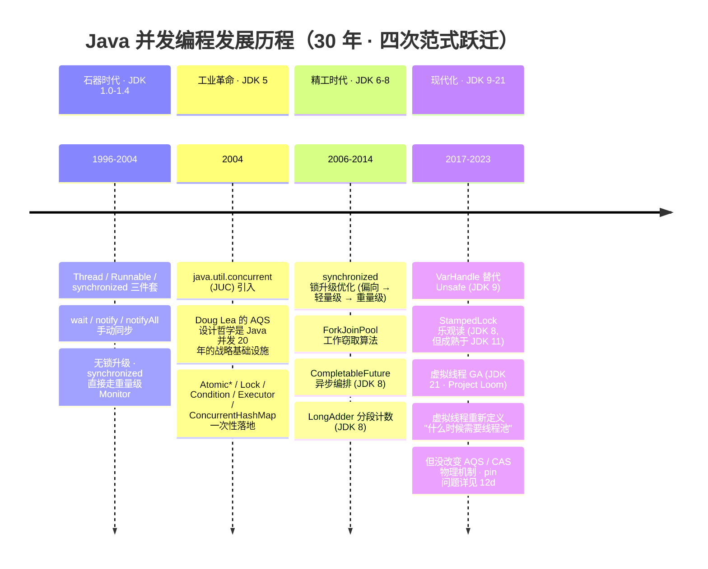
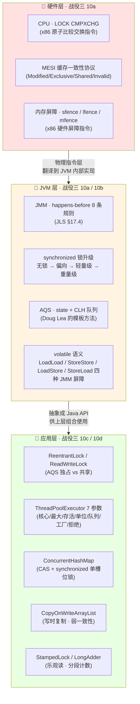
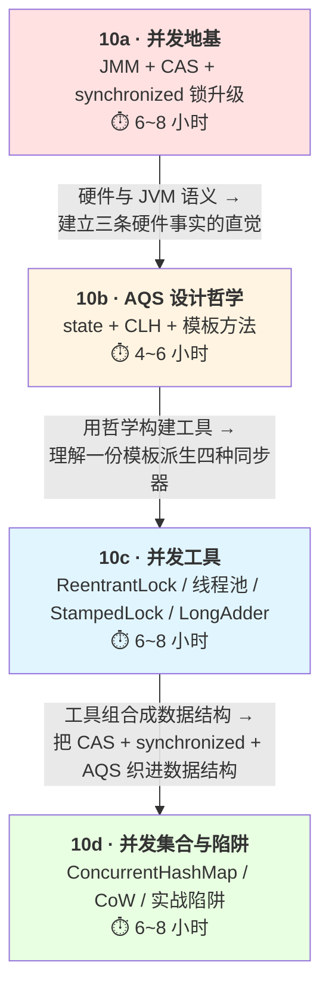
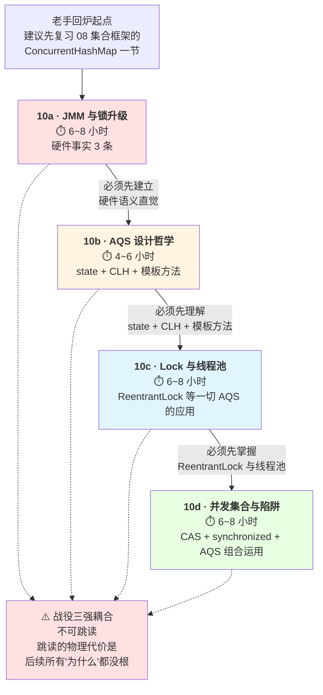

# 并发编程综览：战役三 · 从硬件事实到组合运用的四层下沉

> **战役三 · 并发全景**：4 个子专题不是并列关系，是"**硬件地基 → 设计哲学 → 框架应用 → 组合运用**"的强耦合下沉。
>
> ⚠️ **不可跳读**：`10b` 假定读者已读 `10a`；`10c` 假定已读 `10b`；`10d` 假定已读 `10a/10b/10c`。中途跳过一层，后面全部读不懂——这不是修辞，是并发这门学问在物理上就无法回避的四层同时穿透。

!!! info "**战役三 · 并发全景一句话口诀**"
    - **战役三 4 个子专题不是并列关系，是"硬件地基 → 设计哲学 → 框架应用 → 组合运用"的强耦合下沉**：`10a` 讲 JMM + CAS + `synchronized` 锁升级三件"CPU/JVM 硬件级"事实；`10b` 讲 AQS 用什么"设计哲学"（模板方法 + `state` + CLH）在硬件之上构建同步框架；`10c` 讲 `ReentrantLock` / 线程池 / `StampedLock` 如何**应用** AQS 这套哲学；`10d` 讲 `ConcurrentHashMap` / `CopyOnWriteArrayList` 如何**组合运用** CAS + `synchronized` + AQS 三种工具解决实际数据结构并发问题。
    - **战役三所有并发题都收敛到 3 条硬件事实 + 1 条设计哲学**：三条硬件事实 = `LOCK CMPXCHG`（CAS 硬件语义）/ MESI 缓存一致性协议 / `synchronized` 偏向 → 轻量 → 重量三级锁升级；一条设计哲学 = AQS 模板方法 + `state` 语义 + CLH 队列。理解这四条就能推演所有 JUC 包源码——`ConcurrentHashMap.put` 的 CAS 无锁分支属第一条、槽位 `synchronized` 分支属第三条、扩容协助属 AQS 哲学的组合体现。
    - **JDK 21 虚拟线程改变了"什么时候用线程池"的答案，但没改变 AQS / CAS 的物理机制**——虚拟线程让"高并发不再依赖线程池"，但同步机制（`synchronized` / `ReentrantLock` / AQS）依然是虚拟线程的基石；`synchronized` 在虚拟线程中会 pin 到载体线程的排查思路详见 [12d JVM 现代实践](@java-JVM-现代实践与前沿技术)，本战役不承接。

**你能立刻答上来吗？**（老手视角开场）

- **面试老手都会背 `synchronized` 锁升级四阶段**，但很少能一次说清"**偏向锁的 Mark Word 前 54 位存的到底是什么、为什么 JDK 15 后 `-XX:+UseBiasedLocking` 被默认禁用**"——这就是战役三的入口，硬件事实与 JVM 语义之间的中间层。
- **多线程八股题的所有"为什么"**——`volatile` 为什么不保证原子性、`ConcurrentHashMap` 为什么把分段锁改回 `synchronized`、`ThreadLocal` 为什么会内存泄漏——**都收敛到三条硬件事实 + 一条设计哲学**。
- **CAS 硬件指令 `LOCK CMPXCHG` 具体在做什么？** 它和 `AtomicLong.compareAndSet` / `Unsafe.compareAndSwapLong` 三者是同一件事吗？为什么后者能把前者"直接"暴露到 Java 层？
- **AQS 的 `state` 语义在 `ReentrantLock` / `Semaphore` / `CountDownLatch` / `ReadWriteLock` 里为什么长得完全不一样？** 是四份实现？还是一份模板？——答案在 `10b`。
- **`ConcurrentHashMap.put` 的一行代码同时穿透 `10a/10b/10c/10d` 四层**——你能一次画清"哪一段走 CAS、哪一段走 `synchronized`、`sizeCtl` 的 CAS 争抢又属哪一层"吗？

任何一个问题让你迟疑超过 3 秒——请按顺序读完 `10a → 10b → 10c → 10d`。

!!! note "📖 姊妹文档边界"
    **本页讲**（综览页只做**索引**，不做**展开**）：

    1. 战役三 5 篇文档的**认知下沉顺序**（`10 → 10a → 10b → 10c → 10d`）
    2. 并发**命名哲学索引**（动词型 / 名词型 / 介词型三大词根家族）
    3. 高频问题**跨篇索引** + 战役内学习路径与**强耦合警告**

    **本页不讲**（点到即止 + `@doc_id` 下钻）：

    - JMM 四种内存屏障 + 锁升级完整机制 → [10a JMM 与线程同步](@java-并发-JMM与线程同步)
    - AQS `state` 语义 + CLH 队列 + 模板方法 → [10b AQS 设计哲学](@java-并发-AQS设计哲学)
    - `ReentrantLock` / 线程池 7 参数 / `StampedLock` / `LongAdder` → [10c 并发工具 Lock 与线程池](@java-并发-并发工具Lock与线程池)
    - `ConcurrentHashMap` 完整源码 / `CopyOnWriteArrayList` 弱一致性 → [10d 并发集合与实战陷阱](@java-并发-并发集合与实战陷阱)
    - 虚拟线程 pin 到载体线程的排查 → [12d JVM 现代实践](@java-JVM-现代实践与前沿技术)

---

## 1. 并发演进 timeline：Java 并发 30 年的四次范式跃迁

**四次跃迁的共同规律**：每次跃迁都**不是把上一代废弃**，而是把上一代当作"更底层的原语"继续使用——`ReentrantLock` 没有取代 `synchronized`（JDK 6 之后二者性能持平）、`LongAdder` 没有取代 `AtomicLong`（低并发下前者反而更重）、虚拟线程也没有取代 `ForkJoinPool`（虚拟线程调度的载体线程池本身就是 `ForkJoinPool`）。这就是战役三的核心节奏——**新工具是老工具的组合运用，不是替代**。

---

## 2. 并发全景图：硬件层 → JVM 层 → 应用层三层穿透

**顿悟点**：并发编程学习曲线陡峭的**物理根源**是"三层同时穿刺"——硬件层（CPU 指令）+ JVM 层（JMM 抽象）+ 应用层（JUC API），必须**自下而上**打通才能理解。任何跳过硬件层直接看 `ReentrantLock` 源码的尝试，最终都会卡在"`CAS` 到底是不是原子的、为什么 `park/unpark` 不用担心信号丢失、`ConcurrentHashMap.sizeCtl` 为什么用 CAS 而不是 `synchronized`"这类底层问题上——因为这些"为什么"的答案**全部躺在硬件层**。

---

## 3. 战役三内部认知下沉图：四层强耦合动线

**顿悟点**：JDK 里所有并发类都可以用"这个类在哪一层"归位——

- `AtomicLong` 属 **`10a` 层**（直接封装 CAS 硬件语义，不用 AQS）；
- `ReentrantLock` 属 **`10c` 层**（AQS 哲学的具体应用，`state` 记录持有次数）；
- `ThreadPoolExecutor` 内部的 `Worker` 属 **`10c` 层**（`Worker extends AbstractQueuedSynchronizer`，用 AQS 实现"不可重入"锁避免中断时误伤正在跑任务的线程）；
- `ConcurrentHashMap.put` **同时穿透 `10a/10b/10c/10d` 四层**——空槽位 CAS 无锁插入（10a）、非空槽位 `synchronized` 头节点锁（10a）、扩容协助的 `sizeCtl` 语义借鉴 AQS `state`（10b）、整体 API 是并发数据结构（10d）。

这就是"战役三强耦合、不可跳读"的**物理根源**——一个 `HashMap.put` 就能把四层全用上，你没法通过"只学 10d"就搞懂它。

---

## 4. 五篇子专题导航表

| # | 子专题 | 战役内定位 | 硬骨头 | doc_id |
| :-- | :-- | :-- | :-- | :-- |
| 10 | 并发编程综览（本页） | 入口页 | — | 本页 |
| 10a | JMM 与线程同步 | **硬件地基** | CAS 硬件语义 / `synchronized` 锁升级 / 内存屏障 / `volatile` 四种 JMM 屏障 | [@java-并发-JMM与线程同步](@java-并发-JMM与线程同步) |
| 10b | AQS 设计哲学 | **设计哲学** | `state` / CLH 队列 / 模板方法 / 独占 vs 共享 / `Condition` 队列 | [@java-并发-AQS设计哲学](@java-并发-AQS设计哲学) |
| 10c | 并发工具 Lock 与线程池 | **框架应用** | `ReentrantLock` / 线程池 7 参数 / `StampedLock` / `LongAdder` / `CountDownLatch` / `CyclicBarrier` / `Semaphore` | [@java-并发-并发工具Lock与线程池](@java-并发-并发工具Lock与线程池) |
| 10d | 并发集合与实战陷阱 | **组合运用** | `ConcurrentHashMap` 完整源码（`sizeCtl` / `transfer` / `ForwardingNode`） / `CopyOnWrite` 弱一致性 / `BlockingQueue` 家族 / 死锁与活锁 | [@java-并发-并发集合与实战陷阱](@java-并发-并发集合与实战陷阱) |

---

## 5. 高频问题索引表

| 归属 | 问题 | 详见 |
| :-- | :-- | :-- |
| **10a** | CAS 硬件指令 `LOCK CMPXCHG` 具体做什么？和 `Unsafe.compareAndSwapLong` 是同一件事吗？ | [10a](@java-并发-JMM与线程同步) §CAS 硬件语义 |
| **10a** | MESI 缓存一致性协议在 `volatile` 里怎么体现？为什么"写立即可见"其实是"写广播 + 读失效重新加载"？ | [10a](@java-并发-JMM与线程同步) §MESI 与 volatile |
| **10a** | 内存屏障 `sfence` / `lfence` / `mfence` 与 `LoadLoad` / `StoreStore` / `LoadStore` / `StoreLoad` 四种 JMM 屏障如何对应？ | [10a](@java-并发-JMM与线程同步) §内存屏障 |
| **10a** | `volatile` 能保证原子性吗？为什么？ | [10a](@java-并发-JMM与线程同步) §5.3 |
| **10a** | `synchronized` 的锁升级过程是怎样的？为什么 JDK 15+ 默认禁用偏向锁？ | [10a](@java-并发-JMM与线程同步) §4.2 |
| **10a** | ABA 问题是什么？如何解决？`AtomicStampedReference` 内部怎么加版本号？ | [10a](@java-并发-JMM与线程同步) §6.2 |
| **10a** | happens-before 8 条规则是哪 8 条？在哪个 JLS 章节？ | [10a](@java-并发-JMM与线程同步) §2.2 |
| **10b** | AQS 的 `state` 语义在 `ReentrantLock` / `Semaphore` / `CountDownLatch` / `ReadWriteLock` 里为什么长得完全不一样？ | [10b](@java-并发-AQS设计哲学) §state 语义变形 |
| **10b** | CLH 队列的自旋 → 挂起 → 唤醒是怎么和 `LockSupport.park/unpark` 配合的？为什么不用担心 unpark 先来的信号丢失？ | [10b](@java-并发-AQS设计哲学) §CLH 队列挂起唤醒 |
| **10b** | AQS 的模板方法钩子 `tryAcquire` / `tryRelease` / `tryAcquireShared` / `tryReleaseShared` 分别在什么时候被调用？ | [10b](@java-并发-AQS设计哲学) §模板方法 |
| **10c** | `synchronized` 和 `ReentrantLock` 有什么区别？何时选哪个？ | [10c](@java-并发-并发工具Lock与线程池) §7.1 |
| **10c** | 线程池的核心参数如何配置？CPU 密集型 / IO 密集型分别怎么算？ | [10c](@java-并发-并发工具Lock与线程池) §9.3 |
| **10c** | `StampedLock` 的乐观读、悲观读、写锁三种模式怎么工作？为什么它比 `ReentrantReadWriteLock` 快？ | [10c](@java-并发-并发工具Lock与线程池) §StampedLock |
| **10c** | `LongAdder` 相比 `AtomicLong` 快在哪里？`Striped64` 的分段思想是什么？ | [10c](@java-并发-并发工具Lock与线程池) §LongAdder |
| **10c** | `CountDownLatch` 和 `CyclicBarrier` 有什么区别？前者可复用吗？ | [10c](@java-并发-并发工具Lock与线程池) §8.1-8.2 |
| **10c** | `ThreadLocal` 内存泄漏问题如何解决？在线程池中为什么必须 `remove()`？ | [10c](@java-并发-并发工具Lock与线程池) §10.2 |
| **10d** | `ConcurrentHashMap` 在 JDK 7 和 JDK 8 的实现有何不同？为什么改回 `synchronized`？ | [10d](@java-并发-并发集合与实战陷阱) §11.1 |
| **10d** | `ConcurrentHashMap.size()` 如何在并发下算出精确大小？`baseCount` + `CounterCell[]` 分段计数怎么协作？ | [10d](@java-并发-并发集合与实战陷阱) §size 方法 |
| **10d** | `CopyOnWriteArrayList` 的弱一致性具体表现是什么？什么场景下容忍、什么场景下必须禁用？ | [10d](@java-并发-并发集合与实战陷阱) §CoW 弱一致性 |
| **10d** | 什么是死锁？四个必要条件是什么？如何检测和避免？ | [10d](@java-并发-并发集合与实战陷阱) §12.1 |
| **10d** | `BlockingQueue` 家族中 `ArrayBlockingQueue` / `LinkedBlockingQueue` / `SynchronousQueue` / `PriorityBlockingQueue` 分别用了 AQS 的哪种模式？ | [10d](@java-并发-并发集合与实战陷阱) §BlockingQueue |

---

## 6. 并发命名哲学索引（战役三通用词根家族）

> ⚠️ 综览页只做**索引**，不做**展开**——具体的术语家族卡片在各子专题的**源头文档**首次承接，本页只登记"你在战役三会遇到哪几大类词根"。

!!! note "📖 术语家族索引 · `10` 综览页仅索引，不展开"
    **一、动词型词根**（表"动作"——描述一次原子操作 / 状态迁移）：

    | 家族 | 三层同义家族 | 展开位置 |
    | :-- | :-- | :-- |
    | `compareAndSet` / `compareAndSwap` / `CMPXCHG` | Java API（`AtomicLong.compareAndSet`）/ Unsafe（`Unsafe.compareAndSwapLong`）/ CPU 指令（x86 `LOCK CMPXCHG`）三层同名同姓 | [10a](@java-并发-JMM与线程同步) §CAS 硬件语义 |
    | `park` / `unpark` | `LockSupport.park` / `LockSupport.unpark`——底层挂起/唤醒对（比 `wait/notify` 更精细，`unpark` 可先于 `park` 调用不丢信号） | [10b](@java-并发-AQS设计哲学) §CLH 队列挂起唤醒 |
    | `tryAcquire` / `tryRelease` / `tryAcquireShared` / `tryReleaseShared` | AQS 四大钩子——所有同步器只需要实现这几个方法就能跑起来 | [10b](@java-并发-AQS设计哲学) §模板方法 |

    **二、名词型词根**（表"实体"——描述一个类 / 一族类）：

    | 家族 | 成员 | 展开位置 |
    | :-- | :-- | :-- |
    | `*Adder` 族 | `LongAdder` / `DoubleAdder` / `LongAccumulator` / `DoubleAccumulator` / `Striped64`（基类）——**分段计数**思想，高竞争下比 `AtomicLong` 快数倍 | [10c](@java-并发-并发工具Lock与线程池) §LongAdder |
    | `*Handle` 族 | `MethodHandle` / `VarHandle`（JDK 9+ 替代 `Unsafe` 的官方 API，提供细粒度内存序控制） | [10c](@java-并发-并发工具Lock与线程池) §VarHandle |
    | `*Lock` 族 | `ReentrantLock` / `ReentrantReadWriteLock` / `StampedLock`——**三代锁**（可重入独占 → 读写分离 → 乐观读优化） | [10c](@java-并发-并发工具Lock与线程池) §Lock 家族 |
    | `*Latch` / `*Barrier` / `*Semaphore` 族 | `CountDownLatch`（一次性）/ `CyclicBarrier`（可复用）/ `Semaphore`（信号量）——**协作型同步器三件套** | [10c](@java-并发-并发工具Lock与线程池) §8 |

    **三、介词型词根**（表"关系"——描述"作用于……"）：

    | 家族 | 成员 | 展开位置 |
    | :-- | :-- | :-- |
    | `AtomicXxxFieldUpdater` 族 | `AtomicIntegerFieldUpdater` / `AtomicLongFieldUpdater` / `AtomicReferenceFieldUpdater`——对**现有** `volatile` 字段做 CAS（省一层 `AtomicLong` 包装的对象头开销） | [10a](@java-并发-JMM与线程同步) §Atomic 家族 |
    | `Concurrent*` 前缀 | `ConcurrentHashMap` / `ConcurrentSkipListMap` / `ConcurrentLinkedQueue` / `ConcurrentLinkedDeque`——**并发容器**统一命名规约 | [10d](@java-并发-并发集合与实战陷阱) §Concurrent 家族 |
    | `CopyOnWrite*` 前缀 | `CopyOnWriteArrayList` / `CopyOnWriteArraySet`——**写时复制**容器命名规约 | [10d](@java-并发-并发集合与实战陷阱) §CoW 家族 |

**命名规律的降维金句**：

- `compareAnd<X>` / `park<X>` / `tryAcquire<X>` = **动词型**（描述一次原子操作）
- `<X>Adder` / `<X>Handle` / `<X>Lock` / `<X>Latch` / `<X>Barrier` = **名词型**（描述一族同类型工具）
- `Atomic<X>FieldUpdater` / `Concurrent<X>` / `CopyOnWrite<X>` = **介词型**（描述"作用于……"的关系）

**这三类词根覆盖了 JUC 包 90% 的类名**——理解了词根家族，看到一个陌生类名就能猜出它在四层里的哪一层。

---

## 7. 战役三学习路径 + 强耦合动线声明

**降维金句**：

> *"并发编程之所以难，不是因为知识点多，是因为它**同时穿透**'硬件事实 / JVM 语义 / 框架抽象 / 实战组合'四层——任何一层没打通，都会在另一层遇到看似神秘的 bug。战役三这四篇的强耦合动线，就是为了让你**一次性把这四层同时打通**。"*

---

## 8. 🗺️ 跨战役知识伏笔（埋眼管理）

本篇是战役三的**入口页**，本身不承接任何前置伏笔（战役三就此起航）。但我们要在这里**登记本战役会埋给下游的所有伏笔**，方便你在读 `10a/10b/10c/10d` 时随时回头核对：

- **`10 → 10a`**：本页 §6 提到 `compareAndSet` / `Unsafe.compareAndSwapLong` / x86 `LOCK CMPXCHG` **三层同义家族**——`10a` 需在"CAS 硬件语义"章节承接完整的**术语家族卡片**（三层名称如何一一对应、`Unsafe` 为什么在 JDK 9 之后要用 `VarHandle` 逐步替代）。
- **`10 → 10b`**：本页 §6 提到 `park` / `unpark` 家族与 `tryAcquire` / `tryRelease` 四大钩子——`10b` 需在"CLH 队列挂起唤醒"与"模板方法"两个章节各承接一次家族卡片，并解释"为什么 `unpark` 先于 `park` 调用不会丢信号"这个 CLH 队列的**关键物理事实**。
- **`10 → 10c`**：本页 §6 提到 `*Adder` / `*Lock` / `*Handle` / `*Latch` 四大家族——`10c` 需**完整展开**这四大家族卡片，尤其 `*Adder` 家族的 `Striped64` 分段计数（这是 `LongAdder` 相比 `AtomicLong` 在高竞争下快数倍的**唯一物理原因**）。
- **`10 → 10d`**：本页 §3 提到 `ConcurrentHashMap.put` **同时穿透四层**——`10d` 需在"完整源码"章节承接"CAS 无锁插入 + `synchronized` 头节点锁 + `sizeCtl` CAS 争抢 + `ForwardingNode` 协助扩容"这条**四层穿透的物理链**。
- **`10 → 12d`**：本页 §1 timeline 提到虚拟线程 pin 到载体线程的问题**不改变** AQS/CAS 物理机制——`12d` 需承接"虚拟线程 + `synchronized` = pin 现场；虚拟线程 + `ReentrantLock` = 不 pin"这条**JDK 21 关键差异**（`synchronized` 在虚拟线程中会导致载体线程被挂起、无法承载其他虚拟线程，而 `ReentrantLock` 基于 AQS 的 `LockSupport.park` 会正确让出载体线程）。

**读战役三的方式**：把本页的 §3 认知下沉图与 §7 学习路径打印出来贴在显示器边——每读完一篇回来打勾一次，读完 `10d` 时，你应该能反过来一眼看出 §2 全景图里**每一个方框属于哪一层、由哪一篇承接**。到那时，"并发"这门在无数简历上被写烂的技能，才真正变成你写代码时**手里握着的一把刀**，而不是面试时**嘴上背着的一段文**。

