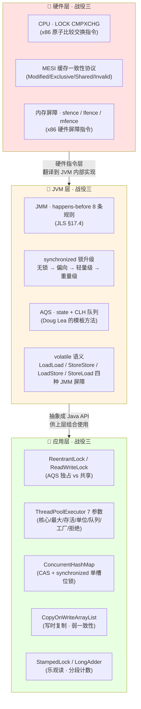
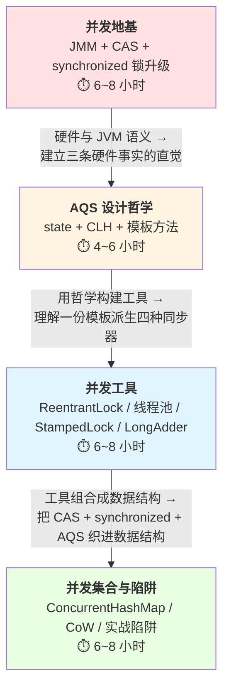

# 并发编程综览：战役三 · 从硬件事实到组合运用的四层下沉

**你能立刻答上来吗？**（老手视角开场）

- **面试老手都会背 `synchronized` 锁升级四阶段**，但很少能一次说清"**偏向锁的 Mark Word 前 54 位存的到底是什么、为什么 JDK 15 后 `-XX:+UseBiasedLocking` 被默认禁用**"——这就是战役三的入口，硬件事实与 JVM 语义之间的中间层。
- **多线程八股题的所有"为什么"**——`volatile` 为什么不保证原子性、`ConcurrentHashMap` 为什么把分段锁改回 `synchronized`、`ThreadLocal` 为什么会内存泄漏——**都收敛到三条硬件事实 + 一条设计哲学**。
- **CAS 硬件指令 `LOCK CMPXCHG` 具体在做什么？** 它和 `AtomicLong.compareAndSet` / `Unsafe.compareAndSwapLong` 三者是同一件事吗？为什么后者能把前者"直接"暴露到 Java 层？
- **AQS 的 `state` 语义在 `ReentrantLock` / `Semaphore` / `CountDownLatch` / `ReadWriteLock` 里为什么长得完全不一样？** 是四份实现？还是一份模板？——答案在 `10b`。
- **`ConcurrentHashMap.put` 的一行代码同时贯穿 `10a/10b/10c/10d` 四层**——你能一次画清"哪一段走 CAS、哪一段走 `synchronized`、`sizeCtl` 的 CAS 争抢又属哪一层"吗？

---

## 1. 并发演进 timeline：Java 并发 30 年的四次范式跃迁

**四次跃迁的共同规律**：每次跃迁都**不是把上一代废弃**，而是把上一代当作"更底层的原语"继续使用——`ReentrantLock` 没有取代 `synchronized`（JDK 6 之后二者性能持平）、`LongAdder` 没有取代 `AtomicLong`（低并发下前者反而更重）、虚拟线程也没有取代 `ForkJoinPool`（虚拟线程调度的载体线程池本身就是 `ForkJoinPool`）。这就是战役三的核心节奏——**新工具是老工具的组合运用，不是替代**。

---

## 2. 并发全景图：硬件层 → JVM 层 → 应用层三层贯穿

**顿悟点**：并发编程学习曲线陡峭的**根本原因**是"三层同时交织"——硬件层（CPU 指令）+ JVM 层（JMM 抽象）+ 应用层（JUC API），必须**自下而上**打通才能理解。任何跳过硬件层直接看 `ReentrantLock` 源码的尝试，最终都会卡在"`CAS` 到底是不是原子的、为什么 `park/unpark` 不用担心信号丢失、`ConcurrentHashMap.sizeCtl` 为什么用 CAS 而不是 `synchronized`"这类底层问题上——因为这些"为什么"的答案**全部躺在硬件层**。

---

## 3. 战役三内部认知下沉图：四层强耦合动线

---

## 4. 五篇子专题导航表

| 子专题 | 战役内定位 | 硬骨头 | doc_id |
| :-- | :-- | :-- | :-- |
| 并发编程综览（本页） | 入口页 | — | 本页 |
| JMM 与线程同步 | **硬件地基** | CAS 硬件语义 / `synchronized` 锁升级 / 内存屏障 / `volatile` 四种 JMM 屏障 | [@java-并发-JMM与线程同步](@java-并发-JMM与线程同步) |
| AQS 设计哲学 | **设计哲学** | `state` / CLH 队列 / 模板方法 / 独占 vs 共享 / `Condition` 队列 | [@java-并发-AQS设计哲学](@java-并发-AQS设计哲学) |
| 并发工具 Lock 与线程池 | **框架应用** | `ReentrantLock` / 线程池 7 参数 / `StampedLock` / `LongAdder` / `CountDownLatch` / `CyclicBarrier` / `Semaphore` | [@java-并发-并发工具Lock与线程池](@java-并发-并发工具Lock与线程池) |
| 并发集合与实战陷阱 | **组合运用** | `ConcurrentHashMap` 完整源码（`sizeCtl` / `transfer` / `ForwardingNode`） / `CopyOnWrite` 弱一致性 / `BlockingQueue` 家族 / 死锁与活锁 | [@java-并发-并发集合与实战陷阱](@java-并发-并发集合与实战陷阱) |

