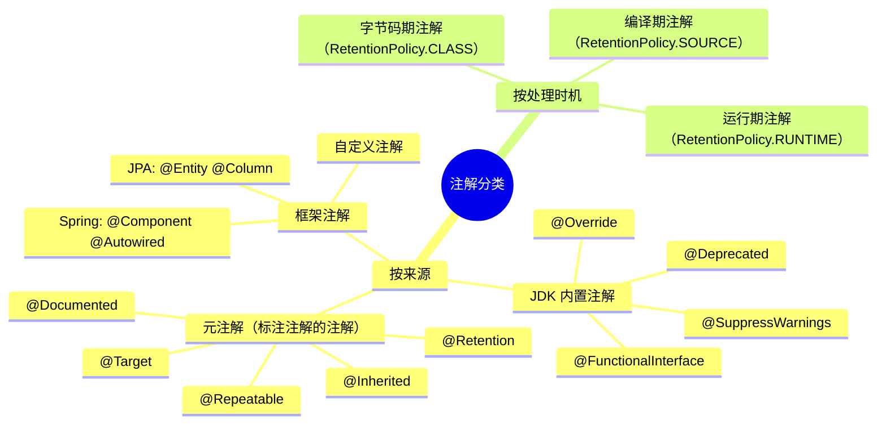
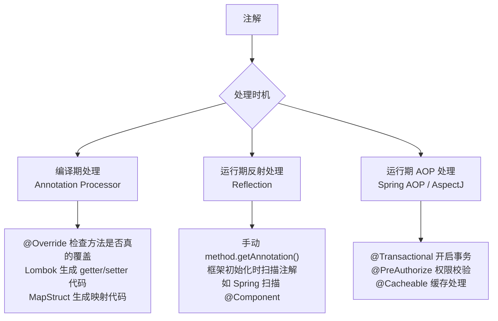

# 注解（Annotation）

> **学习目标**：搞清楚注解是什么、能做什么、不能做什么，以及在 Spring/AOP 场景下注解是如何工作的。
>
> **检验标准**：能回答"注解本身有没有行为？谁赋予了它行为？"

---

## 一、注解是什么？

### 注解的本质

注解（Annotation）本质上是一种**元数据标签**，它本身**没有任何行为**，只是在代码上打了一个"标记"。

```
注解 = 标签 + 元数据
```

就像给快递包裹贴标签，标签本身不会让包裹移动，**是快递员（处理器）读取标签后决定怎么处理**。

```java
// 注解只是一个标记，本身什么都不做
@Transactional
public void createOrder() {
    // ...
}
```

> ⚠️ **关键认知**：`@Transactional` 本身不会开启事务，是 **Spring AOP 代理**在运行时读取这个注解后，才帮你开启了事务。注解 ≠ 行为，注解只是一个"声明"。

---

## 二、注解的分类



---

## 三、元注解（Meta-Annotation）

元注解是**标注在注解上的注解**，用来描述注解的行为规则。

### @Target —— 注解能标注在哪里

```java
@Target(ElementType.METHOD)          // 只能标注在方法上
@Target(ElementType.TYPE)            // 只能标注在类/接口上
@Target({ElementType.METHOD, ElementType.TYPE})  // 多个位置
```

| ElementType 值 | 作用位置 | 典型使用场景 |
|---|---|---|
| `TYPE` | 类、接口、枚举 | `@Component`、`@Entity`、`@RestController` 标注在类上，Spring 扫描注册 Bean 或 JPA 映射表 |
| `METHOD` | 方法 | `@Transactional`、`@GetMapping`、`@Cacheable` 标注在方法上，AOP 拦截或路由映射 |
| `FIELD` | 字段 | `@Autowired`、`@Value`、`@Column` 标注在字段上，注入依赖或映射数据库列 |
| `PARAMETER` | 方法参数 | `@RequestParam`、`@PathVariable`、`@NotNull` 标注在参数上，绑定请求参数或做参数校验 |
| `CONSTRUCTOR` | 构造方法 | `@Autowired` 标注在构造方法上，Spring 推荐的构造注入方式 |
| `LOCAL_VARIABLE` | 局部变量 | `@SuppressWarnings` 压制编译器警告，仅编译期有效，运行时不可见 |
| `ANNOTATION_TYPE` | 注解类型本身（元注解用） | `@Target`、`@Retention`、`@Inherited` 等元注解，用来描述其他注解的行为规则 |
| `PACKAGE` | 包 | `package-info.java` 中标注包级别注解，如 `@NonNullApi`（Spring 用来声明整个包默认非空） |

**多位置组合示例**：

```java
// @Transactional 同时支持标注在类和方法上
// 标注在类上 → 类中所有 public 方法都开启事务
// 标注在方法上 → 只有该方法开启事务（方法级优先级更高）
@Target({ElementType.TYPE, ElementType.METHOD})
@Retention(RetentionPolicy.RUNTIME)
public @interface Transactional { ... }

// 标注在类上：整个 Service 都走事务
@Transactional
@Service
public class OrderService {
    public void createOrder() { ... }   // 有事务
    public void queryOrder() { ... }    // 也有事务（通常查询不需要，应在方法上覆盖）

    @Transactional(readOnly = true)     // 方法级覆盖类级配置
    public Order getOrder(Long id) { ... }
}
```

### @Retention —— 注解保留到什么阶段

| RetentionPolicy 值 | 保留阶段 | 典型使用场景 |
|---|---|---|
| `SOURCE` | 仅源码，编译后丢弃 | `@Override`（编译器检查是否真的覆盖父类方法）、`@SuppressWarnings`（压制警告）、Lombok 的 `@Data`（APT 生成代码后注解本身没用了） |
| `CLASS` | 保留到字节码，运行时不可见 | 字节码增强工具使用，如 AspectJ 的编译时织入、某些代码分析工具（FindBugs 的 `@NonNull`）。日常开发几乎用不到 |
| `RUNTIME` | 保留到运行时，反射可读 | Spring 全家桶几乎所有注解（`@Transactional`、`@Autowired`、`@RequestMapping`）、自定义业务注解，需要在运行时被 AOP 或框架读取 |

**三个阶段的生命周期**：

```
源码(.java) ──编译──▶ 字节码(.class) ──类加载──▶ 运行时(JVM)
   SOURCE 止步于此 ↑        CLASS 止步于此 ↑        RUNTIME 到达这里
```

**选择原则**：
- 自定义注解需要被 Spring AOP / 反射读取 → **必须用 `RUNTIME`**
- 只是给编译器看的（如检查、代码生成） → 用 `SOURCE`
- 给字节码工具看的 → 用 `CLASS`（极少用到）

```java
// ❌ 错误：忘记设置 RUNTIME，AOP 切面读不到注解，权限校验永远不生效
@Target(ElementType.METHOD)
@Retention(RetentionPolicy.CLASS)   // 运行时不可见！
public @interface RequiresPermission {
    String value();
}

// ✅ 正确
@Target(ElementType.METHOD)
@Retention(RetentionPolicy.RUNTIME)  // 运行时可见，AOP 才能拦截
public @interface RequiresPermission {
    String value();
}
```

> ⚠️ **能力边界**：如果你想在运行时通过反射读取注解（Spring AOP 就是这么做的），**必须设置 `RetentionPolicy.RUNTIME`**，否则运行时根本看不到这个注解。这是自定义注解最常见的坑之一。

### @Inherited —— 注解能否被子类继承

```java
@Inherited   // 加了这个，子类会继承父类的类级别注解
@Retention(RetentionPolicy.RUNTIME)
@Target(ElementType.TYPE)
public @interface MyAnnotation {}

@MyAnnotation
public class Parent {}

public class Child extends Parent {}

// Child.class.isAnnotationPresent(MyAnnotation.class) → true
```

> ⚠️ **注意**：`@Inherited` 只对**类级别**注解有效，方法上的注解不会被子类继承。

### @Repeatable —— 同一位置能否重复标注（Java 8+）

```java
// 定义可重复注解
@Repeatable(Roles.class)
public @interface Role {
    String value();
}

// 容器注解
public @interface Roles {
    Role[] value();
}

// 使用：同一个方法可以标多个 @Role
@Role("admin")
@Role("manager")
public void doSomething() {}
```

---

## 四、自定义注解

### 定义语法

```java
@Target(ElementType.METHOD)
@Retention(RetentionPolicy.RUNTIME)
@Documented
public @interface RequiresPermission {
    
    // 注解属性（本质是无参方法）
    String value() default "";          // 权限点，有默认值
    String[] roles() default {};        // 角色列表
    boolean requireAll() default false; // 是否需要满足所有角色
}
```

### 使用

```java
// 只有一个属性且名为 value，可以省略属性名
@RequiresPermission("order:create")

// 多个属性时需要指定属性名
@RequiresPermission(value = "order:create", roles = {"admin", "manager"})
```

### 注解属性支持的类型

| 支持类型 | 示例 |
|---|---|
| 基本类型 | `int`, `long`, `boolean` 等 |
| `String` | `String name()` |
| `Class<?>` | `Class<?> targetClass()` |
| 枚举 | `MyEnum level()` |
| 注解类型 | `OtherAnnotation other()` |
| 以上类型的数组 | `String[] roles()` |

> ⚠️ **不支持**：不能用 `Object`、`List`、`Map` 等作为注解属性类型。

---

## 五、注解的处理方式

注解本身没有行为，**必须有处理器来读取并执行逻辑**。处理方式分三种：



### 方式一：编译期注解处理器（APT）

```java
// Lombok 就是这么工作的
// 你写 @Data，编译时 Lombok 的 APT 处理器自动生成 getter/setter/equals/hashCode
@Data
public class User {
    private String name;
    private Integer age;
    // 编译后自动生成 getName() setName() equals() hashCode() toString()
}
```

### 方式二：运行期反射读取

```java
// 手动通过反射读取注解
Method method = UserService.class.getMethod("createUser", User.class);

// 获取方法上的注解
RequiresPermission annotation = method.getAnnotation(RequiresPermission.class);
if (annotation != null) {
    String permission = annotation.value();  // 读取注解属性
    // 执行权限校验逻辑...
}

// 获取类上的注解
MyAnnotation classAnnotation = UserService.class.getAnnotation(MyAnnotation.class);
```

### 方式三：Spring AOP 拦截注解（最常用）

```java
// 定义切面，拦截所有标注了 @RequiresPermission 的方法
@Aspect
@Component
public class PermissionAspect {

    @Around("@annotation(requiresPermission)")
    public Object checkPermission(ProceedingJoinPoint pjp, 
                                   RequiresPermission requiresPermission) throws Throwable {
        // 1. 读取注解上的权限配置
        String permission = requiresPermission.value();
        
        // 2. 从 ThreadLocal 中取当前用户权限（Spring Security 存在这里）
        Authentication auth = SecurityContextHolder.getContext().getAuthentication();
        
        // 3. 校验
        if (!hasPermission(auth, permission)) {
            throw new AccessDeniedException("无权限: " + permission);
        }
        
        // 4. 放行
        return pjp.proceed();
    }
}
```

---

## 六、注解的传递性

### 元注解传递（组合注解）

注解可以标注在另一个注解上，形成**组合注解**，这是 Spring 大量使用的模式：

```java
// @Service 的源码
@Target(ElementType.TYPE)
@Retention(RetentionPolicy.RUNTIME)
@Component   // ← @Service 上有 @Component，这就是元注解传递
public @interface Service {}

// @RestController 的源码
@Target(ElementType.TYPE)
@Retention(RetentionPolicy.RUNTIME)
@Controller
@ResponseBody   // ← 组合了两个注解的能力
public @interface RestController {}
```

Spring 扫描时用 `AnnotationUtils.findAnnotation()` 会**向上查找元注解链**，所以 `@Service` 能被 Spring 识别为 `@Component`。

### 自定义组合注解

```java
// 把常用配置封装成一个注解，避免重复写
@Target(ElementType.METHOD)
@Retention(RetentionPolicy.RUNTIME)
@Transactional(rollbackFor = Exception.class, timeout = 30, isolation = Isolation.READ_COMMITTED)
public @interface BizTransactional {
    // 业务事务注解，统一配置，避免每次都写一堆参数
}

// 使用时更简洁
@BizTransactional
public void createOrder() { ... }
```

### @Inherited 类继承传递

```java
// 父类上的注解，子类能否继承取决于注解是否有 @Inherited
@Transactional  // @Transactional 没有 @Inherited
public class BaseService {
    public void save() { ... }
}

public class UserService extends BaseService {
    // 子类调用 save()，@Transactional 是否生效？
    // → 方法上的注解不继承，但 Spring 的 AnnotationUtils 会向上查找父类方法
    // → Spring 事务是生效的（Spring 做了特殊处理）
}
```

---

## 七、注解的能力边界

### 注解能做什么

| 能力 | 说明 |
|---|---|
| **声明元数据** | 给代码打标签，描述意图 |
| **编译期代码生成** | 配合 APT（如 Lombok、MapStruct） |
| **运行期行为增强** | 配合 AOP（如 `@Transactional`、`@Cacheable`） |
| **框架扫描识别** | Spring 扫描 `@Component` 注册 Bean |
| **参数校验** | 配合 `javax.validation`（如 `@NotNull`、`@Size`） |

### 注解不能做什么

| 限制 | 说明 |
|---|---|
| **注解本身没有行为** | 必须有处理器配合才能产生效果 |
| **属性类型受限** | 不支持 `Object`、`List`、`Map` |
| **不能继承其他注解** | Java 注解没有继承体系（只有元注解组合） |
| **同类内部调用 AOP 失效** | 注解在同一个类内部方法调用时，AOP 不会拦截 |
| **private 方法 AOP 失效** | Spring AOP 基于代理，无法拦截 private 方法 |

### ⚠️ 最常见的坑：同类内部调用

```java
@Service
public class OrderService {

    public void createOrder() {
        // ❌ 内部调用，AOP 代理不生效，@Transactional 不会开启事务！
        this.saveOrder();
    }

    @Transactional
    public void saveOrder() {
        // ...
    }
}
```

**根本原因**：Spring AOP 是通过**代理对象**拦截方法调用的，`this.saveOrder()` 直接调用的是原始对象，绕过了代理。

**解决方案**：
```java
// 方案1：拆分到不同的 Bean（推荐）
@Autowired
private OrderRepository orderRepository;  // 把 saveOrder 移到 Repository 层

// 方案2：注入自身代理（不推荐，有循环依赖风险）
@Autowired
private OrderService self;
self.saveOrder();  // 通过代理调用

// 方案3：通过 ApplicationContext 获取代理（不推荐）
((OrderService) AopContext.currentProxy()).saveOrder();
```

---

## 八、Spring 中常用注解速查

### Bean 管理

| 注解 | 作用 |
|---|---|
| `@Component` | 通用组件，注册为 Bean |
| `@Service` | 业务层组件（语义化的 `@Component`） |
| `@Repository` | 数据层组件，额外处理持久化异常 |
| `@Controller` / `@RestController` | Web 层组件 |
| `@Configuration` | 配置类，等价于 XML 配置文件 |
| `@Bean` | 方法级别，手动注册 Bean |
| `@Scope` | 指定 Bean 作用域（singleton/prototype） |

### 依赖注入

| 注解 | 作用 |
|---|---|
| `@Autowired` | 按类型注入（Spring 原生） |
| `@Qualifier` | 配合 `@Autowired`，按名称区分多个实现 |
| `@Resource` | 按名称注入（JDK 标准） |
| `@Value` | 注入配置文件中的值 |

### AOP 相关

| 注解 | 作用 |
|---|---|
| `@Transactional` | 声明式事务 |
| `@Cacheable` | 方法结果缓存 |
| `@Async` | 异步执行方法 |
| `@Scheduled` | 定时任务 |
| `@PreAuthorize` | 方法执行前权限校验（Spring Security） |

---

## 九、常见问题

**Q：注解和 XML 配置相比有什么优缺点？**

| 对比项 | 注解 | XML |
|---|---|---|
| 可读性 | 高，和代码在一起 | 低，需要跳转文件 |
| 侵入性 | 高，代码和配置耦合 | 低，配置与代码分离 |
| 修改成本 | 需要重新编译 | 不需要重新编译 |
| 适用场景 | 业务代码配置 | 需要外部化的配置 |

**Q：`@Autowired` 和 `@Resource` 的区别？**
- `@Autowired`：Spring 提供，**先按类型**，有多个实现时配合 `@Qualifier` 按名称
- `@Resource`：JDK 标准（JSR-250），**先按名称**，找不到再按类型

**Q：`@Component`、`@Service`、`@Repository`、`@Controller` 有什么区别？**

本质上都是 `@Component` 的语义化别名，功能几乎相同。区别在于：
- `@Repository`：Spring 会将持久层抛出的原生异常（如 JDBC 异常）转换为 Spring 的 `DataAccessException`
- `@Controller`：配合 Spring MVC 的请求映射机制
- `@Service`：纯语义，无额外功能，但表达了"这是业务层"的意图，便于团队理解和 AOP 切点定义