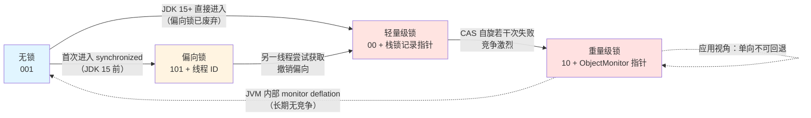
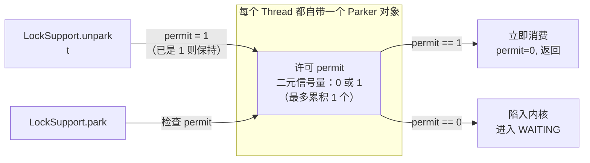
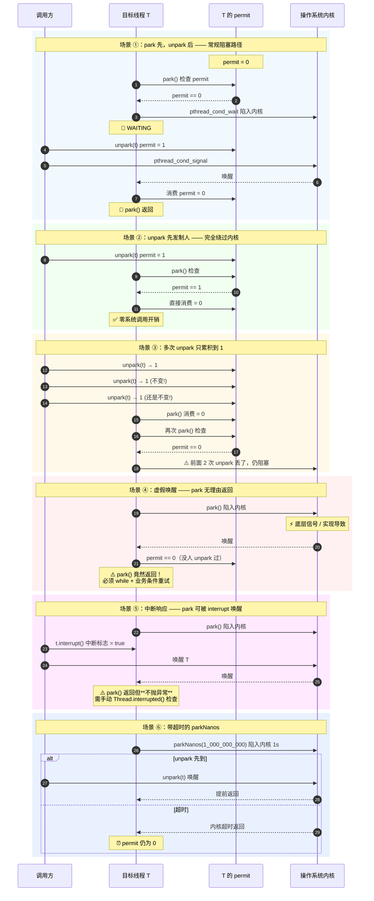

# 并发基础：JMM 与线程同步 —— 硬件屏障、Mark Word 位跃迁与 LOCK CMPXCHG 的底层真相

!!! info "**并发基础 · 一句话口诀**"
    - **JMM 不是"内存模型"，是"重排序契约 + 内存屏障使用手册"**：JLS §17.4.5 的 8 条 happens-before 规则决定"哪些代码不能重排、哪些必须建立可见性"，编译器 / JIT 依据这份契约插入四种 JMM 屏障（`LoadLoad` / `StoreStore` / `LoadStore` / `StoreLoad`），最终在 x86 上落成 `sfence` / `lfence` / `mfence` 或 `LOCK` 前缀指令。**四种 JMM 屏障在 x86 上有三种是空指令（TSO 天然有序），只有 `StoreLoad` 需要真实 `mfence`**——这就是"x86 上 volatile 读几乎零成本、volatile 写才是唯一显著开销"的根本原因。
    - **`synchronized` 锁升级四阶段 = Mark Word 前 8 字节最低 3 位的位跃迁**：无锁（`001`）→ 偏向锁（`101` + 线程 ID）→ 轻量级锁（`00` + 栈锁记录指针）→ 重量级锁（`10` + `ObjectMonitor` 指针）。**JDK 15 起（[JEP 374](https://openjdk.org/jeps/374)）默认关闭偏向锁**——现代应用几乎全是多线程竞争场景，偏向锁的撤销开销大于收益，实际链路已退化为"无锁 → 轻量级锁 → 重量级锁"。这一条与 01 OOP 篇 §3 Mark Word 段落埋下的伏笔在此闭环。
    - **CAS 不是软件魔法，是 CPU `LOCK CMPXCHG` + MESI 缓存一致性协议的组合**：`LOCK` 前缀让缓存行独占（首选缓存锁 · 跨行降级为总线锁），MESI 协议保证其他核对应缓存行置为 Invalid——**硬件保证的原子性**，比软件锁（重量级 `synchronized` 陷入内核 `pthread_mutex`）快 10~100 倍。Java 层的 `AtomicInteger.compareAndSet` / JDK 内部的 `Unsafe.compareAndSwapInt` / CPU 指令 `LOCK CMPXCHG` 是**同一件事在三个层级上的投影**（术语家族卡片一）。
    - **`volatile` 只保证可见性 + 有序性，**不**保证原子性**：可见性靠 volatile 读/写强制刷新主内存；有序性靠内存屏障禁止部分重排序；原子性需要另外用 `AtomicInteger.incrementAndGet` 或 `synchronized` 兜底。`i++` 编译成 `getfield → iconst_1 → iadd → putfield` 四步字节码，中间任何时刻都可能被抢占——**volatile 修饰 i 依然会丢失更新**，这是并发编程最经典的死角。

**你能立刻答上来吗？**（老手引子 · 5 连击）

- DCL 单例的 `instance = new Singleton()` 编译成哪三条字节码？为什么去掉 `volatile` 就能读到"引用不为 null 但字段未初始化"的半成品？CPU 到底允许把哪两条指令重排序？
- `synchronized` 锁升级四阶段的 Mark Word 最低 3 位标志分别是什么？JDK 15 为什么把偏向锁默认关掉？关闭之后 HotSpot 的 `ObjectMonitor` 有没有跟着变简单？
- CAS 的原子性从哪里来？`LOCK CMPXCHG` 与 MESI 协议是怎么配合的？x86 上一条 `volatile int` 的写会被 JIT 编译成哪一条汇编指令？
- JMM 四种内存屏障对应 x86 上的哪些 CPU 指令？为什么 x86 只需要一条 `mfence`（TSO 强内存模型的硬件事实），而 ARM 需要四种 `dmb` 变种？
- `AtomicInteger.incrementAndGet` 高竞争下为什么改用 `LongAdder` 会快 10 倍？`Cell[]` 分段是怎么把"单点 CAS 争抢"变成"多点 CAS 无争抢"的？

任何一个问题让你迟疑超过 3 秒——继续读。

---

> 📖 **边界声明**：本文聚焦"**JMM 契约 + 硬件级同步原语**"三层视角（字节码 → 屏障 → CPU 指令），以下主题请见对应专题：
>
> - **AQS `state` / CLH 队列 / 模板方法完整源码链路** → [AQS 设计哲学](@java-并发-AQS设计哲学)
> - **`ReentrantLock` 公平/非公平实现、`StampedLock`、`LongAdder`/`Striped64` 完整源码、线程池 7 参数与阻塞队列搭档** → [并发工具：Lock 与线程池](@java-并发-并发工具Lock与线程池)
> - **`ConcurrentHashMap` 完整源码（`sizeCtl` / `transfer` / `ForwardingNode`）与 CopyOnWrite 弱一致性实战陷阱** → [并发集合与实战陷阱](@java-并发-并发集合与实战陷阱)
> - **Mark Word 完整位分布（含 hashcode / age 完整位段）与 OOP-Klass 二元模型** → [JVM 内存分区与对象布局](@java-JVM-内存分区与对象布局)
> - **`*Reference` 强度族（Soft / Weak / Phantom / Final）在 GC 中的完整回收链** → [GC 核心机制与收集器演进](@java-JVM-GC核心机制与收集器演进)
> - **虚拟线程 pin 到载体线程的排查与规避** → [JVM 现代实践与前沿技术](@java-JVM-现代实践与前沿技术)
> - **并发全景与知识地图** → [并发编程](@java-并发-并发编程)

---

## 1. 第一层：业务痛点 —— 从"DCL 崩溃"到"i++ 丢失更新"

### 1.1 生产事故现场一：DCL 单例读到"半成品对象"

某支付网关的路由模块，用最"面试标准答案"版本的 DCL 写了一个策略路由器单例：

```java
public class RouteStrategyRegistry {

    // ❌ 缺少 volatile
    private static RouteStrategyRegistry instance;

    private final Map<String, RouteStrategy> strategies;
    private final ConfigLoader loader;
    private final CircuitBreaker breaker;

    private RouteStrategyRegistry() {
        this.strategies = new ConcurrentHashMap<>();
        this.loader = new ConfigLoader();       // 💥 耗时 50~200ms（读远程配置）
        this.breaker = new CircuitBreaker();    // 💥 耗时 10~30ms（初始化熔断器）
        loader.loadInto(strategies);            // 💥 耗时 100~500ms（预热策略缓存）
    }

    public static RouteStrategyRegistry getInstance() {
        if (instance == null) {
            synchronized (RouteStrategyRegistry.class) {
                if (instance == null) {
                    instance = new RouteStrategyRegistry();   // 💥 老手也不会一眼看出的暗雷
                }
            }
        }
        return instance;
    }
}
```

上线一周后偶发核心告警：`NullPointerException: strategies is null` 从 `RouteStrategyRegistry.getInstance().strategies.get(...)` 抛出。诡异之处在于——**`instance` 明明已经被 `new` 了**（否则第一次 `if (instance == null)` 就会拦下、走 `synchronized` 块），但拿到手的 `instance.strategies` 却是 `null`。

事后拉线程 dump 看到的底层真相是：某个线程 A 在 `synchronized` 块里执行 `instance = new RouteStrategyRegistry()`，CPU 把这条语句编译成的**三条字节码**（`new` 分配堆内存 → `<init>` 执行构造器 → `putstatic` 把引用赋给 `instance`）**允许把第 2 步和第 3 步重排序**——先把"引用"塞进 `instance` 字段（让 `instance != null`），再回头慢悠悠调用构造器初始化 `strategies` / `loader` / `breaker`。这中间，恰巧线程 B 走到第一层 `if (instance == null)` 判断，看到 `instance` 非 null 直接返回——**它拿到的是一个"引用有效但字段全部未初始化"的半成品对象**。

修复只需要一个字：给 `instance` 加 `volatile`。这一个字为什么就能救命，答案藏在 §2.1 的字节码考古里——**`putstatic` 前后的内存屏障禁止了 `<init>` 与 `putstatic` 的重排序**，让"引用可见"和"字段可见"两件事在执行时序上强制对齐。

### 1.2 生产事故现场二：高并发 `i++` 一夜丢失 8000 次调用

某网关服务在监控大盘看到"总请求量"字段和"分接口累加"字段对不上账。代码类似这样：

```java
public class CallCounter {

    // 用 volatile 保证"其他线程读到的一定是最新值"
    private volatile long totalCalls = 0;

    public void onCall() {
        totalCalls++;   // 💥 这一行错在哪里？
    }

    public long getTotal() {
        return totalCalls;
    }
}
```

老手看代码第一反应是"`volatile` 已经加了、可见性没问题"——但真实的硬件事实是 `totalCalls++` 会被 `javac` 编译成**四条字节码**（对 `long` 字段读写是 `getfield_wide → lconst_1 → ladd → putfield_wide`，对 `int` 是 `getfield → iconst_1 → iadd → putfield`）。这四条字节码**中间任何时刻都可能被抢占**——线程 T1 刚 `getfield` 完读到 100、还没写回；线程 T2 也 `getfield` 读到 100、加 1 后 `putfield` 写回 101；T1 抢回来把手里的 100+1 也写成 101——**两次 `onCall` 只累加了一次**。

`volatile` 只在**单次读、单次写**上保证"其他核能看到我这次的写"，**它对"读—改—写这种复合操作"完全无能**。修复必须换成 `AtomicLong.incrementAndGet`（§2.4 的 `LOCK XADD` 单指令原子）或 `LongAdder`（§4 红线 4 的分段 CAS）。

### 1.3 三条痛点抛给字节码考古

痛点 A（DCL）→ **`putstatic` 上的 volatile 屏障怎么禁止 `<init>` 与 `putstatic` 重排？** 由 §2.1 揭。
痛点 B（`i++`）→ **read-modify-write 三步字节码怎么用 `LOCK CMPXCHG` / `LOCK XADD` 一次原子搞定？** 由 §2.4 揭。
痛点 C（`synchronized` 为什么在低竞争下比 `ReentrantLock` 还快）→ **Mark Word 前 3 位怎么在无锁/偏向/轻量/重量四态之间跃迁？** 由 §2.3 揭。

---

## 2. 第二层：字节码考古 —— volatile 屏障、锁升级与 LOCK CMPXCHG

### 2.1 `volatile` 的字节码 + CPU 屏障映射

**主考古样本** —— DCL 单例的 `instance = new Singleton()` 字节码：

```volt
public class Singleton {
  private static volatile Singleton instance;

  public static Singleton getInstance();
    Code:
       0: getstatic     #2       // Field instance:LSingleton;    ← 💡 volatile 读
       3: ifnonnull    37
       6: ldc           #3       // class Singleton
       8: dup
       9: astore_0
      10: monitorenter            // synchronized 入口
      11: getstatic     #2       // Field instance:LSingleton;    ← 💡 volatile 读
      14: ifnonnull    27

      // ⭐ 核心 3 步 —— instance = new Singleton()
      17: new           #3       // 步骤 ①：堆上分配内存（引用入栈，字段全为默认值 null/0）
      20: dup
      21: invokespecial #4       // 步骤 ②：调用 <init>，逐字段初始化 strategies/loader/breaker
      24: putstatic     #2       // 步骤 ③：把引用写入静态字段 instance   ← 💡 volatile 写

      27: aload_0
      28: monitorexit             // synchronized 出口
      29: goto          37
      ...
```

**顿悟三条**：

1. **CPU 允许把步骤 ②（`invokespecial <init>`）与步骤 ③（`putstatic`）重排序**——从"分配内存 → 初始化 → 赋值引用"变成"分配内存 → 赋值引用 → 初始化"。JMM/JLS 只承诺**单线程语义不变**（as-if-serial），这样的重排在单线程视角下确实等价（反正只有当前线程会用这个引用）。但**多线程视角下**，另一个线程可能在步骤 ③ 已完成、步骤 ② 未完成的窗口期读到"非 null 但字段未初始化"的半成品。
2. **`volatile` 修饰 `instance` 后**，JIT 会在 `putstatic` 之前插入 `StoreStore` 屏障、之后插入 `StoreLoad` 屏障——`StoreStore` 保证步骤 ② 里所有对新对象字段的写入**必须先于**步骤 ③ 的引用赋值完成，`StoreLoad` 保证步骤 ③ 完成后其他线程立刻能读到新引用。这一对屏障从字节码层禁止了 ② 与 ③ 的重排，DCL 才终于安全。
3. **`volatile` 读几乎零成本、`volatile` 写才是真开销**——因为 x86 的 TSO 强内存模型下 `LoadLoad` / `LoadStore` 都是空指令（见 §2.2），唯有 `StoreLoad` 需要真实 `mfence`（或用 `LOCK`-prefixed 指令替代）。这就是"高频只读 volatile 字段完全可以放心用"的硬件依据。

### 2.2 四种 JMM 内存屏障与 CPU 指令映射

四种 JMM 屏障是**编译器/JIT 层的抽象概念**，真正落到硬件时会退化为具体的 CPU 指令。x86（TSO 强内存模型）和 ARM（弱内存模型）的落地方式差异巨大：

| JMM 屏障 | 语义 | x86 CPU 指令 | ARM CPU 指令 |
| :-- | :-- | :-- | :-- |
| `LoadLoad` | 前面所有读操作对后面读操作可见 | **空**（TSO 保证读读天然有序） | `dmb ishld` |
| `StoreStore` | 前面所有写操作对后面写操作可见 | **空**（TSO 保证写写天然有序） | `dmb ishst` |
| `LoadStore` | 前面所有读操作先于后面写操作 | **空**（TSO 天然） | `dmb ish` |
| `StoreLoad` | 前面所有写操作先于后面读操作 | **`mfence`** / `LOCK`-prefixed 任意指令（唯一必须显式屏障） | `dmb ish` |

**顿悟点**：

- **x86 是 TSO（Total Store Order）强内存模型**——CPU 硬件已经天然保证前三种屏障的语义，编译器不需要插入任何指令。唯一的漏洞是"写后读"——CPU 为了性能会让写操作先进 Store Buffer 再异步落缓存/主存，此时同一线程后续的读操作可能读到 Store Buffer 之前的值。`StoreLoad` 屏障就是通过 `mfence`（或任一 `LOCK`-prefixed 指令）强制刷 Store Buffer 来堵住这个漏洞。
- **ARM 是弱内存模型**——四种屏障都必须显式落到 `dmb`（Data Memory Barrier）指令族上。这就是为什么"x86 上跑得好好的代码换到 ARM（比如 Apple Silicon、AWS Graviton、鲲鹏 920）就冒出灵异并发 Bug"——你之前吃过 TSO 免费午餐，换个 CPU 就得还债。
- **`volatile int x; x = 42;`** 在 x86 上会被 JIT 编译成 `mov [x_addr], eax` + `lock addl $0, (%rsp)`（用一条空的 `LOCK` 前缀原子加操作代替 `mfence`，因为 `LOCK`-prefixed 指令本身就带全屏障语义且比 `mfence` 快）。这就是"volatile 写在 x86 上到底代表哪一条汇编"的答案。

### 2.3 `synchronized` 锁升级四阶段的 Mark Word 位跃迁

**Mark Word 是对象头的第一个 8 字节槽位**（64 位 HotSpot 中固定 64 bit），最低 3 位（`biased_bit:1 | lock_state:2`）编码了 5 种锁态。**这就是 01 OOP 篇 §3 埋下的"Mark Word 承载 `synchronized` 锁状态"伏笔的回收落点**。

Mark Word 在 JDK 8~14 的完整位分布（64 位 HotSpot · 无指针压缩时同样是 8 字节）：

```txt
锁态         主字段（高位）                                    | biased | lock
────────────────────────────────────────────────────────────┼────────┼──────
无锁         unused:25 | hashCode:31 | unused:1 | age:4      |   0    |  01
偏向锁       threadID:54  | epoch:2  | unused:1 | age:4      |   1    |  01
轻量级锁     ptr_to_lock_record_on_stack :  62                            |  00
重量级锁     ptr_to_ObjectMonitor         :  62                            |  10
GC 标记      (used only during GC)        :  62                            |  11
```

**四阶段状态机**：



**顿悟四条**：

1. **偏向锁 = "假设只有一个线程用"的极致优化**——首次 `synchronized` 时用一次 CAS 把 `threadID` 写进 Mark Word；同一线程后续进入只需比较 `threadID`，**连 CAS 都不用**。但一旦有第二个线程尝试获取，就必须"撤销偏向"——需要在 safepoint 停下持有偏向锁的线程、读其栈找是否还持锁、决定是升级为轻量级锁还是回退到无锁，这个过程的开销远超一次普通 CAS。
2. **JDK 15 起（[JEP 374](https://openjdk.org/jeps/374)）默认禁用偏向锁**——现代 Java 应用几乎全靠 `java.util.concurrent` 高性能锁支撑（`ReentrantLock` / `StampedLock` / 各种 `Atomic*`），纯 `synchronized` 且真的"单线程无竞争"的场景已经极少。偏向锁撑大了 HotSpot 里 Mark Word 和 `ObjectMonitor` 的代码复杂度、维护成本极高——收益不再匹配代价。**JDK 15+ 上锁升级链路已退化为"无锁 → 轻量级 → 重量级"三级**。
3. **轻量级锁 = 栈上 Lock Record + CAS**——JVM 在当前线程栈帧里开一块 Lock Record，把对象头的 Mark Word 拷进去（Displaced Mark Word），然后 CAS 把对象头替换成"指向 Lock Record 的指针 + `00` 标志"。释放锁时反向 CAS 把 Mark Word 恢复。轻量级锁的核心假设是"竞争概率低、CAS 一次就成功"，一旦 CAS 失败会自旋若干次（早期 10 次，JDK 6+ 自适应），仍失败才膨胀为重量级锁。
4. **重量级锁 = `ObjectMonitor` + `pthread_mutex`**——锁膨胀后对象头 Mark Word 变成"指向 `ObjectMonitor` 的指针 + `10` 标志"。`ObjectMonitor` 里持有 `_owner` / `_recursions` / `_EntryList` / `_WaitSet` / `_cxq` 五个关键字段（HotSpot `src/hotspot/share/runtime/objectMonitor.hpp`），获取失败的线程会被 `park()` 挂起（陷入内核 `pthread_cond_wait`）——这是重量级锁"慢"的根本来源，也是"用户态→内核态切换"的开销。

> 🗺️ **伏笔闭环**：01 OOP 篇 §3 对象头段落曾说"Mark Word 承载 `synchronized` 锁状态，具体状态机在 10a 章节展开"——本节完成了从"无锁 001 → 偏向锁 101 → 轻量级 00 → 重量级 10"四阶段位跃迁的完整叙述。同时**部分承接**了 08 集合框架 §3.3 埋下的伏笔（"`ConcurrentHashMap` 单槽位 `synchronized` 借助锁升级实现低竞争高吞吐"）——因为 CHM 的槽位竞争频率极低，绝大部分场景停留在轻量级锁，永远不会膨胀成重量级，这就是它敢在 JDK 8 把 JDK 7 的 Segment 分段锁改回 `synchronized` 的技术底气。

!!! note "📖 术语家族：Mark Word 锁状态标志位 —— 对象头承载的 5 种锁态"
    **字面义**：Mark Word 是对象头的第一个 8 字节槽位，字面就是"标记字"——用来承载 hashCode、分代年龄（age）、锁状态、GC 状态等**运行期动态信息**。

    **在本框架中的含义**：Mark Word 的**最低 3 位**（1 位偏向标志 + 2 位锁标志）编码了 5 种锁态，是 HotSpot JVM 实现 `synchronized` 锁升级的**唯一状态机字段**。同一个对象在生命周期中会在这 5 种锁态之间跃迁，Mark Word 的其余高位则承担 hashCode（无锁态）/ 线程 ID（偏向态）/ 栈锁指针（轻量态）/ Monitor 指针（重量态）**不同的载荷**——单个 8 字节被复用出了极致的密度。

    **家族成员**（3 位标志 `biased | lock:2` 的完整枚举）：

    | 锁态 | 3 位标志 | Mark Word 主字段 | 触发条件 | 源码依据 |
    | :-- | :-- | :-- | :-- | :-- |
    | 无锁 | `0 \| 01` | hashCode + age | 对象刚创建、且未被同步 | HotSpot `markOopDesc.hpp` |
    | 偏向锁（JDK 15 前） | `1 \| 01` | 线程 ID + epoch + age | 首次进入 `synchronized` | 同上 |
    | 轻量级锁 | `0 \| 00` | 指向栈上 Lock Record 的指针 | 多线程无竞争交替持有 | 同上 |
    | 重量级锁 | `0 \| 10` | 指向 `ObjectMonitor` 的指针 | 高竞争 · 线程需 `park()` 挂起 | `objectMonitor.hpp` |
    | GC 标记 | `0 \| 11` | GC forward pointer | GC 期间 | 各 GC 收集器 |

    **命名规律**：低 3 位是"锁标志（2 位）+ 偏向标志（1 位）"的紧凑编码——JVM 用最少的位数表达最多的状态跃迁，是 08 集合框架 §2 讲的"位运算 vs 硬件指令"设计哲学在对象头层面的又一次显影。

    **易混点**：JDK 18 起的 [JEP 450: Compact Object Headers](https://openjdk.org/jeps/450) 正在把 Mark Word 从 64 bit 压到 32 bit（压缩对象头），届时锁位分布会重新洗牌——但本节介绍的**四阶段状态跃迁语义**保持不变，位数变化不影响锁升级机制的抽象模型。

### 2.4 CAS 硬件语义 —— `LOCK CMPXCHG` + MESI 缓存一致性协议

**主考古样本** —— `AtomicInteger.incrementAndGet` 的完整调用链：

```java
// Java 层 · AtomicInteger （JDK 17）
public final int incrementAndGet() {
    return U.getAndAddInt(this, VALUE, 1) + 1;
}

// JDK 内部 · Unsafe.getAndAddInt
public final int getAndAddInt(Object o, long offset, int delta) {
    int v;
    do {
        v = getIntVolatile(o, offset);
    } while (!weakCompareAndSetInt(o, offset, v, v + delta));
    return v;
}
```

**在 x86 上被 JIT 编译成一条汇编指令**：

```volt
; JIT 内联 Unsafe.getAndAddInt 后的最终汇编（简化）
    mov     eax, 1
    lock xadd DWORD PTR [rdi + offset], eax   ; ⭐ 一条指令搞定"原子加并返回旧值"
    ; eax 现在是 add 之前的旧值 v
```

**顿悟五条**：

1. **`LOCK` 前缀是硬件级"锁定信号"**——CPU 在执行带 `LOCK` 前缀的指令时，会通过硬件机制保证目标内存位置的读-改-写在整条指令期间**原子且对其他核可见**。现代 CPU 首选**缓存锁**（Cache Lock）实现：锁定单个缓存行（64 字节），通过 MESI 协议把其他核持有的该缓存行置为 Invalid，粒度细、开销小。只有当操作跨越缓存行边界或 CPU 不支持缓存锁时，才降级到**总线锁**（Bus Lock）——锁定整条内存总线，粒度粗、开销大（几十到几百倍差距）。
2. **`CMPXCHG` 是"比较并交换"指令**——语义等价于 `if (*addr == expected) { *addr = new; ZF=1 } else { expected = *addr; ZF=0 }`。单独的 `CMPXCHG` **本身不是原子的**（在多核下另一核可能穿插修改），必须加 `LOCK` 前缀才能变成原子指令。`LOCK CMPXCHG` 就是 CAS 的完整硬件实现。
3. **`LOCK XADD` 是 `LOCK CMPXCHG` 循环的单指令优化版**——`XADD` = eXchange and ADD，一条指令原子完成"读旧值 + 加 delta + 写回 + 返回旧值"。当业务语义是"原子加"时，JIT 会把 `Unsafe.getAndAddInt` 的 `do-while(CAS)` 循环折叠成单条 `LOCK XADD`，比循环 CAS 快得多。
4. **MESI 协议是硬件层保证多核缓存一致性的硬件机制**——每个缓存行有 4 种状态：M（Modified，本核独占且已修改，与主存不一致）、E（Exclusive，本核独占且与主存一致）、S（Shared，多核共享且一致）、I（Invalid，无效需重新加载）。当 `LOCK` 指令写入某缓存行时，会通过总线广播让其他核持有的该行状态转为 I。此时其他核想读同一地址会触发缓存缺失、必须重新从当前 M 状态的核（或主存）拉取——这就是"CAS 一次修改被其他核立刻看到"的底层实现路径。
5. **CAS 是硬件原语而非软件模拟**——这就是"CAS 比 `synchronized` 快"的根本原因：`synchronized` 重量级锁竞争失败要走 `park()` 陷入内核 `pthread_cond_wait`，涉及用户态/内核态切换（数千纳秒），而 CAS 全在用户态由 CPU 硬件一条指令完成（几纳秒到几十纳秒），差距 10~100 倍。**代价**是高竞争下 CAS 会不停自旋消耗 CPU——这就是 §4 红线 4 要求高并发计数改用 `LongAdder` 的根本动机。

!!! note "📖 术语家族：`compareAndSet` / `compareAndSwap` / `CMPXCHG` —— CAS 三层同义族"
    **字面义**：
    - `compareAndSet` = "比较并设置"——Java 公开 API 层的语义命名（`Atomic*` / `VarHandle`）。
    - `compareAndSwap` = "比较并交换"——JDK 内部（`Unsafe`）与 CPU 指令的原始命名。
    - `LOCK CMPXCHG` = x86-64 的原子指令——`CMP` + `XCHG` 的融合体，`LOCK` 前缀是硬件锁定信号。

    **在本框架中的含义**：三个名字指的是**同一件事在三个层级上的投影**——Java API 层 → JDK 内部封装层 → CPU 硬件层。理解这个"三层同义"，才能理解"为什么 CAS 是硬件原语而非软件模拟"——它不是在 Java 层拼出来的锁，而是 CPU 提供的一条原子指令的层层封装。

    **家族成员**：

    | 层 | 名称 | 位置 | 源码依据 |
    | :-- | :-- | :-- | :-- |
    | Java 公开 API | `AtomicInteger.compareAndSet` | `java.util.concurrent.atomic.AtomicInteger` | JDK 5+ |
    | Java 公开 API | `VarHandle.compareAndSet` | `java.lang.invoke.VarHandle` | JDK 9+ |
    | JDK 内部封装 | `Unsafe.compareAndSwapInt` | `sun.misc.Unsafe`（JDK 8）/ `jdk.internal.misc.Unsafe`（JDK 9+） | 已从公开 API 移出 |
    | JDK 内部封装 | `Unsafe.weakCompareAndSetInt` | 同上 | 允许伪失败换取更高性能 |
    | CPU 硬件 | `LOCK CMPXCHG` / `LOCK CMPXCHG8B` / `LOCK CMPXCHG16B` | x86-64 硬件 | Intel SDM Vol.2A |
    | CPU 硬件 | `LDXR` / `STXR`（Load-Linked/Store-Conditional） | ARMv8 硬件 | ARM ARM |

    **命名规律**：`compare<And>Set/Swap` = 比较并交换 · 三层同义。**JDK 9 起官方推荐用 `VarHandle` 替代 `Unsafe`**（后者在 JDK 9 后被移入 `jdk.internal.misc` 且限制访问），`VarHandle` 是类型安全的公开 API，同时保留了完整的 CAS 语义与内存屏障控制（见 §2.5 六种访问模式）。

    **易混点**：`compareAndSet` 与 `weakCompareAndSet` 的区别——前者严格保证"如果 CAS 失败一定是因为值不匹配"，后者允许伪失败（Spurious Failure），即使值匹配也可能返回 false。ARM 弱内存模型 CPU 上 `weakCAS` 用 LL/SC 指令实现，性能更好；在循环中反复重试的场景下（`do { ... } while (!weakCAS(...))`）优先用 `weakCAS`。

### 2.5 `VarHandle` 六种访问模式 —— JMM 屏障的类型安全表达

JDK 9 引入 `VarHandle` 作为字段级并发操作的**类型安全公开 API**，取代 `Unsafe.putObjectVolatile` 这种"把内存屏障塞进方法名"的老范式。**这就是 06 反射篇 §2.4 埋下的"`VarHandle` 的 `getVolatile` / `setVolatile` = JMM 内存屏障的类型安全公开表达"伏笔的回收落点**。

```java
public class SafeCounter {

    private volatile int value = 0;
    private static final VarHandle VALUE;

    static {
        try {
            VALUE = MethodHandles.lookup()
                .findVarHandle(SafeCounter.class, "value", int.class);
        } catch (Exception e) {
            throw new ExceptionInInitializerError(e);
        }
    }

    // 六种典型访问模式，语义从弱到强
    public int  plainRead()             { return (int) VALUE.get(this);             }  // Plain：无屏障，等价普通字段读
    public int  opaqueRead()            { return (int) VALUE.getOpaque(this);       }  // Opaque：仅保证顺序性
    public int  acquireRead()           { return (int) VALUE.getAcquire(this);      }  // Acquire：LoadLoad + LoadStore
    public int  volatileRead()          { return (int) VALUE.getVolatile(this);     }  // Volatile：全屏障
    public void releaseWrite(int v)     { VALUE.setRelease(this, v);                }  // Release：StoreStore + LoadStore
    public boolean cas(int expect, int upd) {
        return VALUE.compareAndSet(this, expect, upd);                                  // CAS：全屏障
    }
}
```

**六种访问模式的屏障强度对照**：

| 模式 | 语义 | 屏障组合（JMM 抽象） | x86 落地 | 典型使用 |
| :-- | :-- | :-- | :-- | :-- |
| **Plain** | 普通读写 · 无任何跨线程语义 | 无屏障 | 普通 `mov` | 单线程访问、局部变量 |
| **Opaque** | 保证顺序 · **不保证可见性** | 编译器屏障（禁止编译器重排，不禁止 CPU 重排） | 普通 `mov` + 编译器 barrier | 计数不精确场景（如统计尝试次数） |
| **Acquire** | 单向 · 后续读写不能重排到本次读之前 | `LoadLoad` + `LoadStore` | 普通 `mov`（TSO 天然） | 与 Release 配对做低开销同步 |
| **Release** | 单向 · 之前的读写不能重排到本次写之后 | `StoreStore` + `LoadStore` | 普通 `mov`（TSO 天然） | 与 Acquire 配对做低开销同步 |
| **Volatile** | 双向 · 全屏障 | 全屏障（含 `StoreLoad`） | `LOCK`-prefixed 或 `mfence` | 传统 `volatile` 语义 |
| **CAS** | 原子读改写 + 全屏障 | 全屏障 | `LOCK CMPXCHG` | 无锁并发算法 |

**顿悟点**：以前 `Unsafe.putObjectVolatile` / `putOrderedObject` / `putObject` 三个方法名分别对应"全屏障 / release 屏障 / 无屏障"三种语义——**名字里塞语义**、类型不安全、只能通过反射拿到（`Unsafe` 是 `sun.misc` 私有）。`VarHandle` 把这三种（以及更细粒度的六种）语义抽出来做成**访问模式常量**，由 JIT 根据模式常量选择相应的屏障组合，既类型安全又便于优化。

> 🗺️ **伏笔闭环**：06 反射篇 §2.4 讲 `MethodHandle` 家族时曾在末尾埋下"`VarHandle` 提供 `getVolatile` / `setVolatile` / `compareAndSet` 等方法，语义等价于 JMM 内存屏障"的伏笔——本节以六种访问模式的完整语义表格闭环。

---

## 3. 第三层：内存布局 —— MESI 状态、park/unpark 与 Monitor 结构

### 3.1 JMM 主内存与工作内存的底层映射

JMM 抽象里的"主内存"和"工作内存"到硬件的映射并不是 1:1——JMM 是 **语言层规范**，硬件是 **CPU 层实现**：

```txt
JMM 抽象                        HotSpot on x86-64 硬件实现
────────────────────────────    ────────────────────────────────────
主内存（Main Memory）            主存 DRAM（几 GB · ~100ns 访问）
                                + L3 Cache（共享 · 几十 MB · ~10ns）

工作内存（Working Memory）        每核私有 L1/L2 Cache（L1 ~1ns / L2 ~4ns）
                                + Store Buffer（写入延迟队列）
                                + Invalidate Queue（失效消息延迟队列）
                                + CPU 寄存器（<1ns）

happens-before 契约              MESI 缓存一致性协议 + 内存屏障 mfence/LOCK
```

**关键硬件事实**：MESI 协议本身能保证"多核之间缓存行状态最终一致"，但**它有两个延迟队列**——写操作先进 Store Buffer 再异步落 L1（Store Buffer 未刷新时其他核看到旧值）、失效消息先进 Invalidate Queue 再异步执行（Invalidate Queue 未处理完时本核读到自己缓存里的旧值）。这两个队列是"volatile 需要在写侧加屏障"的根本原因——`volatile` 的写屏障强制刷 Store Buffer，读屏障强制清 Invalidate Queue，把 MESI 的"最终一致"逼成"立即一致"。

### 3.2 MESI 协议状态机

```txt
每个缓存行有 4 种状态：
  M (Modified)   本核独占，已修改，与主存不一致
  E (Exclusive)  本核独占，与主存一致（其他核无此行）
  S (Shared)     多核共享，与主存一致
  I (Invalid)    无效，需重新加载

主要状态转换（简化）：
──────────────────────────────────────────────────────────────
初始状态    读命中/写命中          Bus 事件（其他核请求）
──────────────────────────────────────────────────────────────
I           读缺失 → 拉入 → E/S    -
S           写命中 → 广播 → M      Read → 保持 S；Invalidate → I
E           写命中 → M             Read → S；Invalidate → I
M           读/写命中 → 保持 M     Read → 写回主存并转 S；Invalidate → I

⭐ LOCK CMPXCHG 的执行时序：
  1. 本核申请获得该缓存行的 M 状态（可能触发从 E/S 升级 M）
  2. 广播 Invalidate 消息，让其他核持有该行的副本状态转 I
  3. 在锁定期间执行 CMP + XCHG，成功则保持 M；失败则不写
  4. 释放锁，其他核想读该地址会触发缓存缺失、从当前 M 核拉取
```

### 3.3 `park` / `unpark` 的 permit 二元信号量语义

重量级锁获取失败、`wait()` / `LockSupport.park()`、`Thread.join()` 全都通过 `park()` 挂起线程——底层是 `pthread_cond_wait`（Linux）或 `WaitForSingleObject`（Windows）。`park` / `unpark` 与 `wait` / `notify` 是 Java 并发同步的**两套完全不同的模型**：



**三条核心公理**：

1. **许可不累积**：`unpark` 调用多次，`permit` 最多是 1。这与信号量、`notify` 的"每次唤醒一个等待者"不同——**多次 unpark = 一次 unpark**。
2. **`unpark` 可先发制人**：即使 `unpark` 先于 `park` 调用，`permit` 会被保存，后续 `park` 直接消费 permit 立即返回、根本不进内核。这是"两次 `wait/notify` 顺序颠倒会导致永久阻塞"的经典陷阱在 `park/unpark` 里被消除的原因。
3. **精确唤醒**：`unpark(Thread t)` 指定唤醒某个具体线程，不走任何公共队列——这是 AQS 能实现"精确唤醒队头节点"的底层基础，也是 10b AQS 篇 §3 里 CLH 队列前驱唤醒后继节点的实现依据。

**六种典型时序场景**（现存正文中的详细时序图已在此节保留）：



**顿悟点**：

- 场景 ③ 是 `park/unpark` 与 `wait/notify` 最关键的差异——`notify` 会精确唤醒一个等待者、多次 notify 会累积唤醒多个；`unpark` 只累积一位、多次 unpark 就是一次 unpark。**在 AQS 的 `release` 唤醒后继节点场景下这恰恰是想要的语义**——即使多次尝试唤醒，只要目标线程还未消费，最终只唤醒一次即可。
- 场景 ④ 是"必须用 `while` 循环 + 业务条件"的根本原因——不是 Java 特有的坑，而是 POSIX `pthread_cond_wait` 本身就允许虚假唤醒，Java `park()` 是它的直接封装。
- 场景 ⑤ 与 `wait()` 的核心差异——`wait()` 响应中断会抛 `InterruptedException`；`park()` 响应中断**不抛异常**、只是从阻塞返回，需要用户代码调用 `Thread.interrupted()` 检查后自行决定如何处理。

### 3.4 重量级锁的 `ObjectMonitor` 结构

一旦锁膨胀为重量级锁，对象头 Mark Word 指向的 `ObjectMonitor` 结构（HotSpot `src/hotspot/share/runtime/objectMonitor.hpp`）：

```txt
ObjectMonitor {
  _owner        Thread*  ← 当前持锁线程（NULL 表示无人持有）
  _recursions   intptr_t ← 重入深度（0 表示未被本线程重入）
  _EntryList    Node*    ← 等待获取锁的线程队列（FIFO）
  _WaitSet      Node*    ← 调用 wait() 释放锁后进入的等待集合
  _cxq          Node*    ← Contention List（LIFO 单向链表栈），新竞争线程通过 CAS 压入栈头
  _succ         Thread*  ← 继任者（unpark 后被授权尝试竞争的线程）
  ...
}
```

**顿悟点**：

- **`_cxq` + `_EntryList` 双队列设计**是 HotSpot 竞争优化的产物——新竞争线程为了减少 CAS 开销，先无锁 push 到 `_cxq`（LIFO 栈头）；持锁线程释放时会把 `_cxq` 整段"倒进"`_EntryList`（FIFO 队列），然后从 `_EntryList` 取继任者 `unpark`。这样做的好处是：无竞争路径**完全无锁**（`_cxq` 用 CAS push），有竞争路径**批量处理**（一次性把 `_cxq` 全部搬到 `_EntryList`）。
- **`_owner` + `_recursions` 是可重入的底层载体**——同一线程进入同一 `synchronized` 块会看 `_owner == currentThread`，然后仅递增 `_recursions`、无需真的争锁。这就是 `synchronized` 天然可重入的实现依据。
- **HotSpot 的 Monitor Deflation**（[JEP 384](https://openjdk.org/jeps/384) 引入、JDK 18 [JEP 375] 改为并发执行）会在重量级锁长期无人竞争时**释放 `ObjectMonitor` 并把对象头还原为无锁状态**——这是 HotSpot 内部的资源回收机制，对应用透明，不违反"应用视角锁只能升级"的语义。

### 3.5 `ThreadLocal` 内存底层结构（引用强度族的又一次显影）

```txt
Thread 对象
├── ThreadLocalMap threadLocals
│   ├── Entry[] table
│   │   ├── [0] Entry(WeakRef<ThreadLocal_1>, Object value_1)
│   │   ├── [1] null
│   │   ├── [2] Entry(WeakRef<ThreadLocal_3>, Object value_3)
│   │   └── ...
│   └── ...
└── ...

Entry 结构：
  WeakReference<ThreadLocal<?>> key  ← 弱引用（GC 时可回收）
  Object value                        ← 强引用（不可回收）
                                        ↑ 泄漏根源

内存泄漏底层路径：
  ThreadLocal 外部引用被清 → key 弱引用被 GC → key 变 null
  但 value 仍被 Entry 强引用 → value 无法回收
  ⇒ 线程池中长期存活的线程 → 泄漏累积到 OOM
```

**顿悟点**：`ThreadLocal` 泄漏的根本成因不是"引用类型选错了"，是**"弱引用 key + 强引用 value"这种不对称设计**在线程池复用场景下的必然产物。JDK 团队在 `ThreadLocal.set/get/remove` 中加了探测式清理（发现 key 为 null 的 Entry 就删除 value），但清理链路必须被后续 `set/get/remove` 触发才有效——**线程复用但 ThreadLocal 不再被访问时**，泄漏会持续累积。这也是 §4 红线 5 强制"用完必须 `remove()`"的根本动机。

> 📖 `*Reference` 强度族（Soft / Weak / Phantom / Final）的完整回收链详见 [GC 核心机制与收集器演进](@java-JVM-GC核心机制与收集器演进) §"引用族与可达性分析"，本文只用到 `WeakReference` 一种。08 集合框架 §3.4 同样在 `WeakHashMap` 视角下引用了这一家族。

---

## 4. 第四层：工程红线 —— 5 条硬依据 + `❌ 反模式 / ✅ 标准范式` 双代码块

### 4.1 红线 1：`volatile` 只保证可见性 + 有序性，`i++` 类复合操作必须换原子类

**技术依据**：`i++` 在字节码层是 `getfield → iconst_1 → iadd → putfield` 四步，中间任意时刻可被抢占；`volatile` 只在**单次读、单次写**层面保证跨核可见，对"读—改—写"复合操作无能为力（JLS §17.4）。

```java
// ❌ 反模式：以为 volatile 就能保证 i++ 原子性
public class BadCounter {
    private volatile long total = 0;

    public void onCall() {
        total++;  // 💥 高并发下丢失更新
    }
}
```

```java
// ✅ 标准范式 1：CAS 原子类（低到中等竞争场景）
public class GoodCounter {
    private final AtomicLong total = new AtomicLong(0);

    public void onCall() {
        total.incrementAndGet();  // LOCK XADD 单指令原子
    }

    public long get() {
        return total.get();
    }
}

// ✅ 标准范式 2：LongAdder（高竞争场景，见红线 4）
public class BestCounter {
    private final LongAdder total = new LongAdder();

    public void onCall() {
        total.increment();  // 分段 CAS，Cell[] 分散热点
    }

    public long get() {
        return total.sum();  // ⚠️ 弱一致：多核累加时并非某一时刻的精确快照
    }
}
```

### 4.2 红线 2：DCL 单例必须 `volatile` 修饰 instance

**技术依据**：§1.1 事故现场 + §2.1 字节码考古已完整给出——`new Singleton()` 三步字节码（`new` / `<init>` / `putstatic`）允许 CPU 把 `<init>` 与 `putstatic` 重排序，其他线程可能在第一次 `if (instance == null)` 处看到半成品。**这不是"要不要加"的性能选择，是"加不加代码正确"的正确性问题**。

```java
// ❌ 反模式：DCL 缺 volatile
public class UnsafeSingleton {
    private static UnsafeSingleton instance;   // 💥 无 volatile

    public static UnsafeSingleton getInstance() {
        if (instance == null) {
            synchronized (UnsafeSingleton.class) {
                if (instance == null) {
                    instance = new UnsafeSingleton();  // 💥 允许字段初始化前引用赋值
                }
            }
        }
        return instance;  // 💥 可能返回半成品
    }
}
```

```java
// ✅ 标准范式 1：DCL + volatile
public class SafeSingleton {
    private static volatile SafeSingleton instance;  // ⭐ volatile 禁止 <init> 与 putstatic 重排

    public static SafeSingleton getInstance() {
        SafeSingleton local = instance;   // 局部变量缓存，减少 volatile 读次数
        if (local == null) {
            synchronized (SafeSingleton.class) {
                local = instance;
                if (local == null) {
                    local = new SafeSingleton();
                    instance = local;   // StoreStore + StoreLoad 屏障
                }
            }
        }
        return local;
    }
}

// ✅ 标准范式 2：静态内部类持有者（更推荐，JVM 类加载天然保证线程安全）
public class HolderSingleton {
    private HolderSingleton() {}

    private static class Holder {
        static final HolderSingleton INSTANCE = new HolderSingleton();
    }

    public static HolderSingleton getInstance() {
        return Holder.INSTANCE;   // 首次调用触发 Holder 类加载，JLS §12.4 保证 <clinit> 单线程执行
    }
}

// ✅ 标准范式 3：枚举单例（Effective Java 推荐，防反射防序列化）
public enum EnumSingleton {
    INSTANCE;
    public void doWork() { /* ... */ }
}
```

### 4.3 红线 3：JDK 15+ 不再手动调 `-XX:+UseBiasedLocking`

**技术依据**：[JEP 374](https://openjdk.org/jeps/374) 在 JDK 15 起把 `UseBiasedLocking` 默认设为 `false`，且整个偏向锁设计被标记为**弃用**。原因见 §2.3 顿悟点 2——现代应用普遍走 `java.util.concurrent` 高性能锁，纯 `synchronized` 且真的"单线程无竞争"的场景已极少，偏向锁的撤销开销大于其省下的 CAS 开销。

```bash
# ❌ 反模式：JDK 15+ 上还在启动参数里加这个
java -XX:+UseBiasedLocking -jar app.jar
# JVM 会打印 warning: Option UseBiasedLocking was deprecated in version 15.0

# ✅ 标准范式：直接跑，JDK 15+ 默认已经关闭偏向锁
java -jar app.jar
```

工程建议：如果你的性能压测显示 `synchronized` 是瓶颈，把注意力放到"能否用 `Atomic*` / `LongAdder` / `ConcurrentHashMap` 替代"，而不是回退去开偏向锁——那条路已经废了。

### 4.4 红线 4：高竞争计数场景一律用 `LongAdder`，`AtomicLong` 只在需要精确读时用

**技术依据**：`AtomicLong` 用一个共享 `value` 字段，所有线程在同一个 `LOCK CMPXCHG` 上竞争——高竞争下 CPU 缓存行来回在多核间弹跳（Cache Line Ping-Pong），每次 CAS 都要通过 MESI 让其他核 Invalid、拉行、再改，实测在 32 核以上时性能急剧下降。`LongAdder` 内部维护一个 `Cell[]` 数组，通过线程哈希把竞争打散到不同缓存行（每个 Cell 加 `@Contended` 注解占满一个缓存行避免伪共享），读时 `sum()` 遍历累加——弱一致换高吞吐。

```txt
AtomicLong（单 Cell · 竞争热点）：
┌──────────────────────────────────────────────────────┐
│  All threads compete for the same value             │
│  Thread-1 ─→ CAS(value)  ┐                          │
│  Thread-2 ─→ CAS(value)  ├─ heavy contention, spins │
│  Thread-3 ─→ CAS(value)  ┘                          │
└──────────────────────────────────────────────────────┘

LongAdder（Cell 数组 · 分段竞争）：
┌─────────────────────────────────────────────────────┐
│  base + Cell[0] + Cell[1] + Cell[2] + Cell[3] + ... │
│  Thread-1 ─→ CAS(Cell[0])                           │
│  Thread-2 ─→ CAS(Cell[1])  ← 落到不同缓存行          │
│  Thread-3 ─→ CAS(Cell[2])     几乎无争抢             │
│  Thread-4 ─→ CAS(Cell[3])                           │
│                                                     │
│  sum() = base + Σ Cell[i]  ← 弱一致读               │
└─────────────────────────────────────────────────────┘
```

```java
// ❌ 反模式：32 核机器上 100 线程狂加 AtomicLong
private final AtomicLong requests = new AtomicLong();

public void handle() {
    requests.incrementAndGet();  // 💥 Cache Line Ping-Pong 严重
}
```

```java
// ✅ 标准范式：高并发计数用 LongAdder
private final LongAdder requests = new LongAdder();

public void handle() {
    requests.increment();  // 落到 Cell[thread_hash]，几乎无争抢
}

public long report() {
    return requests.sum();  // ⚠️ 弱一致：与所有并发 increment 之间无 happens-before 保证
}
```

选型速查表：

| 场景 | 首选 | 原因 |
| :-- | :-- | :-- |
| 单线程或低并发计数 | `AtomicLong` | 单值精确，`sum()` 强一致 |
| 高并发计数、只读求和不要求瞬时精确 | `LongAdder` | 分段 CAS，吞吐提升 5~10 倍 |
| 高并发累加浮点数 | `DoubleAdder` | LongAdder 的浮点版本 |
| 需要 `compareAndSet` 语义 | `AtomicLong` | LongAdder 不提供 CAS |

### 4.5 红线 5：`ThreadLocal` 使用后必须 `try-finally remove()`，尤其在线程池中

**技术依据**：§3.5 已给出根本成因——`ThreadLocalMap.Entry` 的"弱引用 key + 强引用 value"设计在线程池长期复用场景下必然泄漏。**这不是"最佳实践"级别的建议，是"不做就会 OOM"级别的红线**。

```java
// ❌ 反模式：Spring MVC 里保存请求上下文
private static final ThreadLocal<UserContext> CONTEXT = new ThreadLocal<>();

@GetMapping("/api/xxx")
public Response handle(@RequestHeader("X-User-Id") long userId) {
    CONTEXT.set(new UserContext(userId, /* 大对象 */));   // 💥 Tomcat 线程池复用，永不 remove
    return doBusinessLogic();
}
```

```java
// ✅ 标准范式 1：显式 try-finally remove
private static final ThreadLocal<UserContext> CONTEXT = new ThreadLocal<>();

@GetMapping("/api/xxx")
public Response handle(@RequestHeader("X-User-Id") long userId) {
    try {
        CONTEXT.set(new UserContext(userId, /* 大对象 */));
        return doBusinessLogic();
    } finally {
        CONTEXT.remove();   // ⭐ 强制清理
    }
}

// ✅ 标准范式 2：Spring Framework 里的 RequestContextHolder 已封装好清理逻辑
//   Servlet Filter / OncePerRequestFilter 会在 finally 里调 resetRequestAttributes()
//   业务代码只需 RequestContextHolder.currentRequestAttributes() 读取

// ✅ 标准范式 3：跨线程池传递上下文用 TransmittableThreadLocal（阿里 TTL 库）
// 因为 InheritableThreadLocal 只在子线程创建瞬间复制一次，不适用线程池复用场景
private static final TransmittableThreadLocal<UserContext> CONTEXT = new TransmittableThreadLocal<>();
```

**降维金句**：*"并发编程的所有'为什么'都收敛到三条硬件事实：**`LOCK CMPXCHG` 让 CPU 保证原子性**、**MESI 协议让多核缓存一致**、**内存屏障让重排序可控**。JMM 是这三条硬件事实的 Java 侧语义封装，`synchronized` / `volatile` / CAS 都是它们的语法糖。老手工作十年，最终会在心底把三个词焊死：**LOCK · MESI · Barrier**——所有并发正确性都是这三张牌的组合。"*

---

## 5. 🗺️ 跨战役知识伏笔

本篇我们把 JMM 从"内存模型"这个玄学包装里剥出来——它的底层真相是 **CPU 内存屏障 + MESI 缓存一致性协议 + `LOCK` 前缀原子指令**三张牌的组合。请把这个硬件事实焊死在脑海——它是理解后续所有并发/异步/框架设计的**硬件地基**。

紧接着的 [10b AQS 设计哲学](@java-并发-AQS设计哲学) 会承接本篇 §3.3 的 `park` / `unpark` 二元信号量语义——AQS 的 CLH 队列在节点入队后调用 `LockSupport.park(this)` 挂起，前驱节点释放锁时调用 `LockSupport.unpark(next)` 精确唤醒后继。**AQS 的"精确唤醒"能力来源于 `unpark(Thread)` 而非 `notify` 的公共队列语义**——今天在 §3.3 场景 ② 里看到的"unpark 可先发制人、根本不进内核"的性能优势，明天到 AQS 里就是"高性能队列锁的核心加速手段"。同时本篇 §2.4 的 `LOCK CMPXCHG` 会在 10b §2 变成 AQS `compareAndSetState` 的 JIT 汇编——底层是同一条 x86 指令，AQS 只是在其上加了 CLH 队列这层调度。

进一步在 [10c Lock 与线程池](@java-并发-并发工具Lock与线程池) 里，本篇 §4.4 的 `LongAdder` 会展开成 `Striped64` 类的完整源码——`Cell` 数组的初始化时机、`@Contended` 缓存行填充、`probe` 线程哈希 rehash 都会讲清楚；`ReentrantLock` 的公平锁与非公平锁会承接本篇 §2.3 讲的锁升级思想（`synchronized` 隐式升级 vs `ReentrantLock` 一步到位重量级）；线程池的 `Worker` 类会用 AQS `state` 字段实现"是否正在执行任务 + 是否已 shutdown"的双状态编码。**本篇 §3.5 讲的 `ThreadLocal` 引用强度族陷阱，会在线程池篇里变成"为什么 Alibaba TransmittableThreadLocal 必须存在"的根本动机**。

再到 [10d 并发集合与实战陷阱](@java-并发-并发集合与实战陷阱)，本篇 §2.3 顿悟点 4 埋下的"`ConcurrentHashMap` 单槽位 `synchronized` 借助锁升级"会完整展开——CHM 的 `putVal` 源码里 `synchronized (f)` 锁的是链表头节点，绝大部分场景停留在轻量级锁；`sizeCtl` 字段用 `LOCK CMPXCHG` 无锁初始化；扩容时 `ForwardingNode` 借助 `Unsafe.compareAndSwapObject` 换表——**每一处并发原语，都是本篇讲的三张硬件牌的排列组合**。

最后到战役四 [12a JVM 内存分区与对象布局](@java-JVM-内存分区与对象布局) §7 讲对象头完整位分布时，会回收本篇 §2.3 的 Mark Word 锁状态族——本篇讲了 5 种锁态的低 3 位编码，12a 篇会完整展开 hashCode（31 bit）、age（4 bit）、压缩指针下的位分布优化、[JEP 450 Compact Object Headers](https://openjdk.org/jeps/450) 的未来演进。到 [12d JVM 现代实践](@java-JVM-现代实践与前沿技术) 讲虚拟线程时，会承接本篇讲的 `synchronized` 重量级锁陷入内核 `park` 的底层路径——**虚拟线程 pin 到载体线程的最重要触发因素之一，就是持有 `synchronized` 锁时的 `park`**（因为 HotSpot 无法把 monitor 状态从载体栈搬到虚拟线程栈），这也是 JDK 21 之前 Loom 早期版本"虚拟线程 + `synchronized` 有坑"的根本原因，JDK 24 [JEP 491] 正在系统性移除这个 pin 点。

当你真正读懂本篇的 §2.4（`LOCK CMPXCHG` + MESI 的组合）与 §2.5（`VarHandle` 六种访问模式），回头看 06 反射篇 §2.4 的 `MethodHandle` / `VarHandle` 家族——会顿悟"JDK 9 引入的一整套 `java.lang.invoke.*` 包，本质上是把 `Unsafe` 里的所有 native 原语（内存屏障、原子操作、字段直读）**类型安全化 + 语义显式化**的公开 API"。到 [08 集合框架](@java-数据结构-集合框架) §2.2 讲桥接方法的 `checkcast` 兜底、[09 数据结构精讲](@java-数据结构-数据结构精讲) §3 讲 `ConcurrentSkipListMap` 的 `VarHandle` 无锁跳表，你会看到 `VarHandle.compareAndSet` 一次次以不同姿态复用同一套硬件原语——**并发正确性从来不是软件魔法，是 CPU 硬件保证 + 语言层契约 + 编译器插入屏障三方合作的产物**。到那时，你今天在 §2 挖出的每一条 `mfence`、每一次 Mark Word 位跃迁、每一句 `LOCK XADD`，都会变成打通整条并发战线的关键钥匙。
