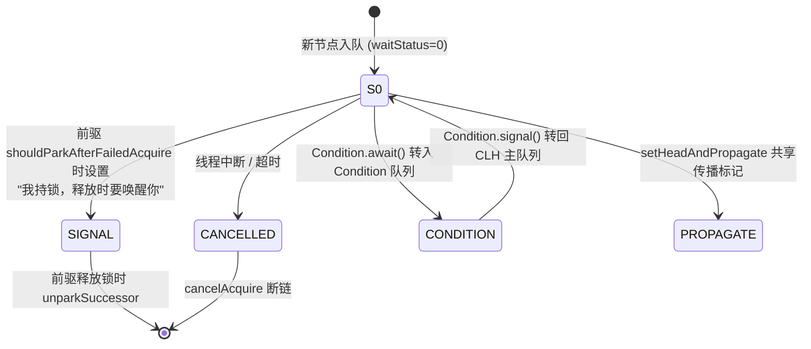
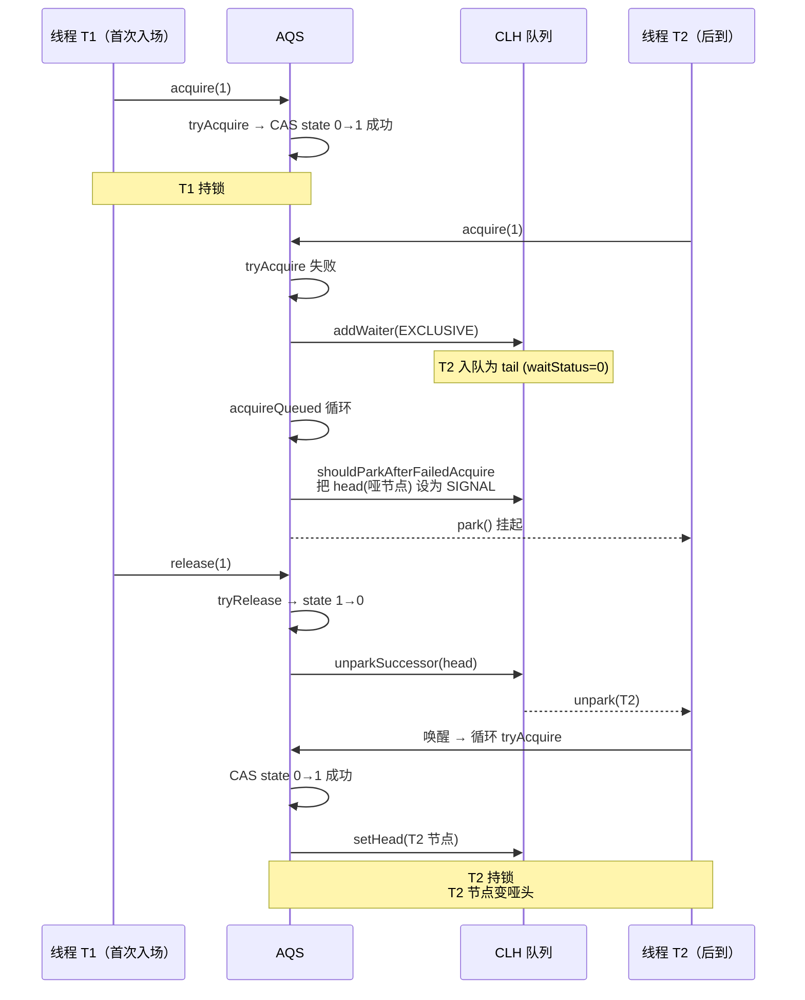
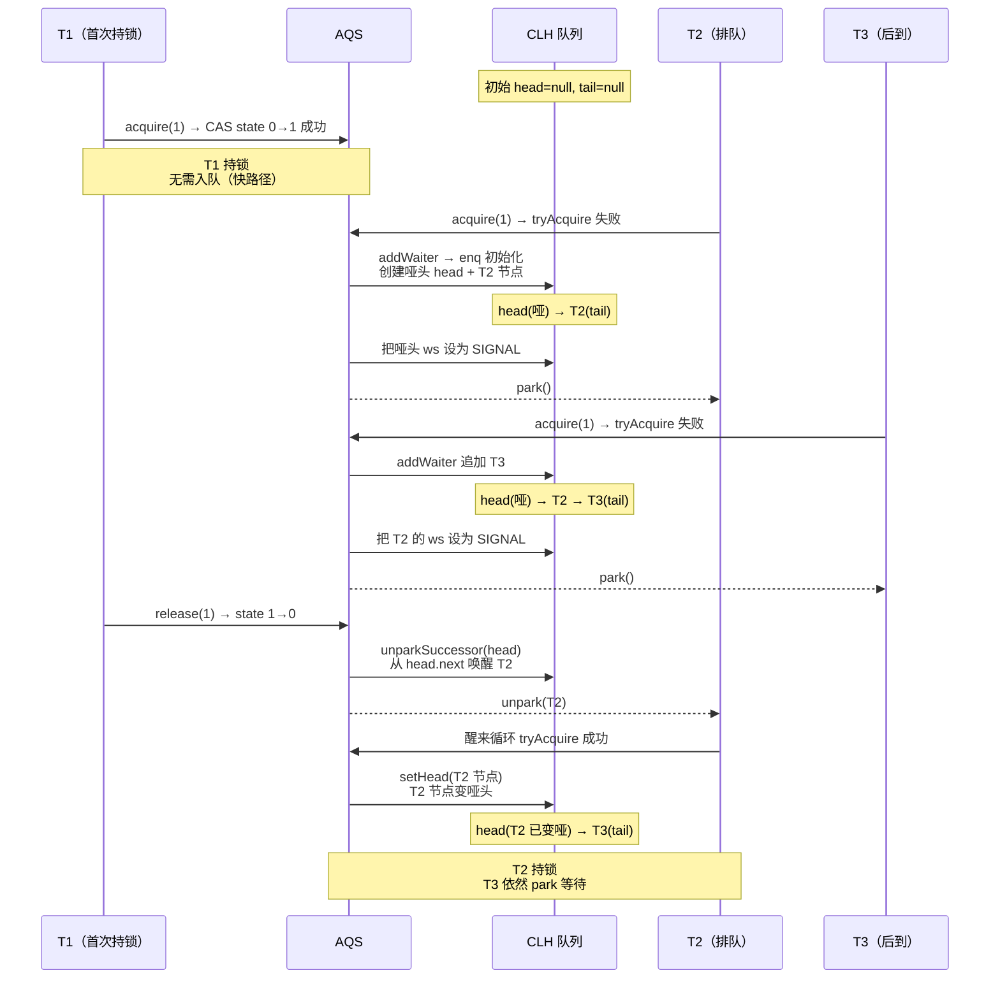
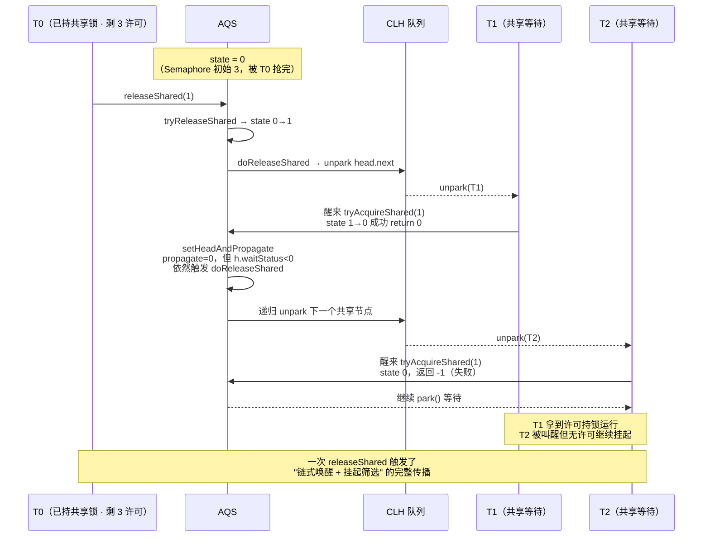

# AQS 设计哲学 —— state 心脏、CLH 队列、模板方法与独占共享双模式

!!! info "**AQS 设计哲学一句话口诀**"
    - **AQS = `state`（volatile int）+ CLH 双向队列 + 模板方法 + 独占/共享双模式** —— 四件事撑起 20+ 个 JUC 同步器。所有 `Lock` / `Semaphore` / `CountDownLatch` / `ReadWriteLock` / `ThreadPoolExecutor.Worker` 都是"在 `state` 上定义不同语义 + 复用模板方法"的产物。
    - **`state` 是 AQS 的心脏 —— 一个 `volatile int` 承载所有语义**：`ReentrantLock` 里 `state` = 重入次数、`Semaphore` 里 = 剩余许可数、`CountDownLatch` 里 = 倒计数、`ReentrantReadWriteLock` 里 = 高 16 位读锁 + 低 16 位写锁计数。**用最少的字段撑起最大语义空间**，是 Doug Lea 设计哲学的典型体现。
    - **CLH 双向队列是严格 FIFO 公平性的硬件保证**：每个等待线程封装成 `Node`（`prev` / `next` 双向指针 + 状态位 `waitStatus`），头节点持有锁的哑节点、尾节点是新入队、`park()` / `unpark()` 是挂起唤醒对。CLH 名字来自三位作者（Craig / Landin / Hagersten），原始 CLH 是**单向自旋队列**，AQS 变体升级为**双向 + `park` 阻塞**，`prev` 支持"取消节点"直接跳过。
    - **模板方法模式是 AQS 复用的秘诀**：AQS 提供 `acquire` / `release` / `acquireShared` / `releaseShared` 四个 `final` 骨架方法，子类只重写 `tryAcquire` / `tryRelease` / `tryAcquireShared` / `tryReleaseShared` 四个抽象方法定义"什么条件下能拿到 state" —— **框架封装公共排队/挂起/唤醒逻辑，子类只声明业务语义**。
    - **AQS 不参与 `synchronized` 锁升级** —— AQS 完全在 Java 层实现，`park` 底层是 `pthread_cond_wait`；`synchronized` 是 JVM 内建同步机制，走偏向锁 → 轻量级锁 → 重量级锁升级。二者是**两条完全独立的技术路径**，选型时不要混淆。

**你能立刻答上来吗？**

- 一个 `volatile int state` 是怎么同时承担"重入次数 / 剩余许可数 / 倒计数 / 高低 16 位读写锁计数"四种完全不同的语义的？
- 为什么 CLH 队列的头节点在 AQS 里是"哑节点"（`thread = null`）？释放锁时到底 unpark head 还是 head.next？
- `LockSupport.park` 和 `Object.wait` 底层都能挂起线程，为什么 AQS 一律用前者？
- 独占模式与共享模式的唯一分岔点是什么？为什么 `Semaphore(3).release()` 能"传播唤醒"多个等待线程，而 `ReentrantLock.unlock()` 只唤醒一个？
- `ReentrantLock` 走 AQS、`synchronized` 走 JVM 锁升级 —— 两条路径的选型分界到底在哪里？

如果任何一个问题让你迟疑超过 3 秒——继续读。

---

## 1. 第一层：业务痛点 —— 从"AQS 名字听得多"到"骨架说不清"

### 1.1 生产现场：一个 `state` 承担四种语义的迷思

某电商团队做技术分享，抽了三道面试题问后端组：

```java
// 题 1：ReentrantLock 重入 5 次后 state 是多少？
ReentrantLock lock = new ReentrantLock();
for (int i = 0; i < 5; i++) lock.lock();
// answer: state == 5，重入次数直接累加在 state 上

// 题 2：Semaphore(3) 拿掉 2 个许可后 state 是多少？
Semaphore sem = new Semaphore(3);
sem.acquire();
sem.acquire();
// answer: state == 1，state 直接就是剩余许可数

// 题 3：CountDownLatch(5) 调用 3 次 countDown 后 state 是多少？
CountDownLatch latch = new CountDownLatch(5);
latch.countDown();
latch.countDown();
latch.countDown();
// answer: state == 2，state 就是倒计数
```

三题都是同一个 `AbstractQueuedSynchronizer.state` 字段，但语义完全不同 —— **一个是"我持有几次"、一个是"我还剩几个"、一个是"还差几步"**。而更极端的是 `ReentrantReadWriteLock`：

```java
// 题 4：ReadWriteLock，2 个读锁 + 1 个写锁重入 3 次 —— state 是多少？
ReentrantReadWriteLock rwl = new ReentrantReadWriteLock();
rwl.readLock().lock();
rwl.readLock().lock();
// state = 0x00020000  （高 16 位 = 2，即 2 个读锁）
// 换个线程持有写锁并重入 3 次：
rwl.writeLock().lock();
rwl.writeLock().lock();
rwl.writeLock().lock();
// state = 0x00020003  （高 16 位 = 2 个读锁，低 16 位 = 3 次写锁重入）
```

**这就是 AQS 设计哲学的第一道题**：Doug Lea 用**一个 32 位 `volatile int`** 承担了整个 JUC 包 20 多个同步器的所有状态。理解不了这一点，就永远读不懂 AQS 的源码。

### 1.2 五个核心底层问题

- **问题 1**：CLH 队列的头节点 `head` 为什么是"哑节点"（`thread = null`）？释放锁时到底应该 `unpark(head)` 还是 `unpark(head.next)`？
- **问题 2**：`addWaiter` 里为什么要用 `oldTail.setPrevRelaxed(node)` + `compareAndSetTail(oldTail, node)` 两步走？直接一步 CAS 不行吗？
- **问题 3**：`shouldParkAfterFailedAcquire` 为什么要**回头**把前驱的 `waitStatus` 改成 `SIGNAL` 再挂起？直接 `park` 不行吗？
- **问题 4**：`Node.SHARED` 和 `Node.EXCLUSIVE` 的区别只是一个 `Node` 字段标记吗？共享模式的"传播唤醒"底层机制究竟在源码哪一行？
- **问题 5**：`park` 可以先于 `unpark` 调用（"许可"语义）—— 这在 AQS 里解决了什么并发竞争问题？

这五个问题的答案都埋在 400 行左右的 AQS 源码里。掀开看，就都清晰了。

### 1.3 痛点清单：为什么这篇必须硬啃

| 痛点 | 对应第 N 层解决 |
| :-- | :-- |
| **A**：读 AQS 源码不知道从哪切入 —— 类图看了 10 遍还是茫然 | §2 从 `acquire` / `release` 两个模板方法作为切入点 |
| **B**：独占 vs 共享的分岔在源码哪一行 —— 说不清"传播唤醒"的底层机制 | §2.6 & §3.3 揭 `setHeadAndPropagate` 是共享模式独有的核心分岔 |
| **C**：AQS 与 `synchronized` 锁升级什么关系 —— 二者能互相替代吗？ | §3.4 澄清 AQS 全在 Java 层用 `park`、`synchronized` 走 JVM 三级升级，两条独立路径 |

---

## 2. 第二层：字节码与源码考古 —— AQS 骨架四要素的底层实现

!!! tip "本层特殊说明"
    AQS 的"字节码考古"聚焦**核心源码方法的关键指令**（如 `enq` 的 CAS 自旋、`parkAndCheckInterrupt` 的 `LockSupport.park`），不再抓 `javap -v` 字节码全景。所有内存布局图与源码块统一用 ```volt``` 语言标记。

### 2.1 AQS 骨架四要素：一张字段清单穿透整个框架

```java
public abstract class AbstractQueuedSynchronizer
        extends AbstractOwnableSynchronizer {

    // 1️⃣ state —— 心脏（承载所有语义）
    private volatile int state;

    // 2️⃣ CLH 队列头尾指针（双向链表）
    private transient volatile Node head;
    private transient volatile Node tail;

    // 3️⃣ 四个 final 骨架（框架实现 · 调用 tryXxx）
    public final void    acquire(int arg)         { /* 独占模式获取骨架 */ }
    public final boolean release(int arg)         { /* 独占模式释放骨架 */ }
    public final void    acquireShared(int arg)   { /* 共享模式获取骨架 */ }
    public final boolean releaseShared(int arg)   { /* 共享模式释放骨架 */ }

    // 4️⃣ 四个抽象契约（子类必须实现其中的一对）
    protected boolean tryAcquire(int arg)        { throw new UnsupportedOperationException(); }
    protected boolean tryRelease(int arg)        { throw new UnsupportedOperationException(); }
    protected int     tryAcquireShared(int arg)  { throw new UnsupportedOperationException(); }
    protected boolean tryReleaseShared(int arg)  { throw new UnsupportedOperationException(); }
    protected boolean isHeldExclusively()        { throw new UnsupportedOperationException(); }
}
```

AQS 就这四件事 —— **一个 `state` 字段是心脏 · 一条 CLH 队列是骨架 · 四个 `final` 是模板 · 四个抽象是契约**。子类只写 `tryXxx`，框架管所有排队 / 挂起 / 唤醒 / 中断处理。

!!! note "📖 术语家族：AQS 骨架四要素"
    **字面义**：AQS = "Abstract Queued Synchronizer" = "抽象的、基于队列的、同步器" —— 名字本身就把四要素包含了三个词：**Abstract**（模板方法 + 抽象契约）、**Queued**（CLH 队列骨架）、**Synchronizer**（`state` 心脏 + 独占-共享双模式）。

    **在框架中的含义**：Doug Lea 用这四件事撑起了整个 JUC 包的同步基础设施，`java.util.concurrent.locks` 与 `java.util.concurrent` 下所有"需要挂起线程 + 排队唤醒"的组件（`Lock` / `Semaphore` / `CountDownLatch` / `ReentrantReadWriteLock` / `ThreadPoolExecutor.Worker` / `FutureTask.Sync` / `SynchronousQueue.TransferStack` 等）全部继承或组合 AQS。

    **家族成员**：

    | 要素 | 名称 | 职责 |
    | :-- | :-- | :-- |
    | 心脏 | `volatile int state` | 承载所有语义（重入次数 / 许可数 / 倒计数 / 分位读写等） |
    | 队列 | `Node head` / `Node tail`（CLH 双向链表） | 严格 FIFO 排队 |
    | 4 个 `final` 骨架 | `acquire` / `release` / `acquireShared` / `releaseShared` | 框架公共排队 / 挂起 / 唤醒逻辑 |
    | 4 个抽象契约 | `tryAcquire` / `tryRelease` / `tryAcquireShared` / `tryReleaseShared` | 子类业务语义定义 |

    **命名规律**：**动词前缀 `try` = "允许失败的业务判断"**，返回 `boolean` / `int` 让框架决定是否入队；**动词无前缀 `acquire` / `release` = "由框架实现的骨架"**，声明为 `final` 禁止子类覆盖。这种"契约动词 + 骨架动词"的成对命名，是模板方法模式在 JDK 内部最标准的实现之一。

    **易混点**：`AbstractOwnableSynchronizer` 是 AQS 的**父类**，只做一件事：记录当前独占持有者线程（`exclusiveOwnerThread`）。它本身不管 `state`、不管队列 —— 独占模式通过它记录"是谁在持锁"、共享模式则完全不用它。

### 2.2 `state` 的多语义承载 —— Doug Lea 用一个 int 撑起整个 JUC

| 同步器 | `state` 语义 | 模式 | 关键约束 |
| :-- | :-- | :-- | :-- |
| `ReentrantLock` | 重入次数（0 = 空闲，>0 = 被持有 N 次） | 独占 | 溢出 int 最大值时抛 `Error` |
| `ReentrantReadWriteLock` | **高 16 位读锁计数 + 低 16 位写锁重入次数** | 独占 + 共享 | 读锁最多 65535 个，写锁最多重入 65535 次 |
| `Semaphore` | 剩余许可数 | 共享 | `acquire()` 减、`release()` 加，可初始化为负数 |
| `CountDownLatch` | 倒计数 | 共享 | 减到 0 时所有 `await()` 线程一起唤醒，**不可重置** |
| `ThreadPoolExecutor.Worker` | 独占持锁标志（0/1） | 独占 | 巧用 AQS 判断"任务执行中"—— 池化线程不响应中断 |
| `FutureTask` | 任务运行状态位（NEW / COMPLETING / NORMAL / EXCEPTIONAL / CANCELLED / INTERRUPTING / INTERRUPTED） | 共享 | JDK 7+ 用 `state` 存 7 种任务生命周期状态 |
| `SynchronousQueue.TransferStack` | 复杂状态位 + 节点组合 | 共享 | 高级用法：`state` 只做辅助 |

**一个 `volatile int`** 通过**位分解 / 计数语义 / 标志语义** 承担了 JUC 里所有 20+ 同步器的所有状态 —— 这就是"最少字段撑起最大语义空间"的设计哲学。而 `ReentrantReadWriteLock` 的**高低 16 位分解**是这条哲学的典型表达：

```java
// ReentrantReadWriteLock.Sync 源码节选（JDK 17）
static final int SHARED_SHIFT   = 16;
static final int SHARED_UNIT    = (1 << SHARED_SHIFT);        // 0x00010000
static final int MAX_COUNT      = (1 << SHARED_SHIFT) - 1;    // 0x0000FFFF = 65535
static final int EXCLUSIVE_MASK = (1 << SHARED_SHIFT) - 1;    // 0x0000FFFF

/** 高 16 位 = 读锁持有数 */
static int sharedCount(int c)    { return c >>> SHARED_SHIFT; }
/** 低 16 位 = 写锁重入次数 */
static int exclusiveCount(int c) { return c & EXCLUSIVE_MASK; }
```

一个 `int` 拆成两个 `short`，各自表达"读锁数量"与"写锁重入" —— 而完整的 acquire / release 骨架**一行都不用改**。这种"位分解"的复用哲学，在整个 JDK 里都是绝无仅有的手笔。

### 2.3 CLH 节点结构与 `waitStatus` 状态机

```java
static final class Node {
    volatile int      waitStatus;   // 5 种状态位
    volatile Node     prev;         // 前驱指针（AQS 变体新增）
    volatile Node     next;         // 后继指针
    volatile Thread   thread;       // 关联线程
    Node              nextWaiter;   // Condition 队列指针 OR 共享模式标记

    static final int CANCELLED =  1;  // 已取消 · 从队列跳过
    static final int SIGNAL    = -1;  // 后继需要被唤醒
    static final int CONDITION = -2;  // 在 Condition 等待队列
    static final int PROPAGATE = -3;  // 共享模式传播释放
    // 0 = 默认状态（新入队还未处理）

    static final Node SHARED    = new Node();       // 共享模式标记（复用 nextWaiter）
    static final Node EXCLUSIVE = null;             // 独占模式标记（nextWaiter = null）
}
```

**状态跃迁图**：



!!! note "📖 术语家族：`Node.waitStatus` 五状态族"
    **字面义**：`waitStatus` = "等待状态"，字面就是"CLH 节点在同步器生命周期中所处的状态位"。

    **在 AQS 中的含义**：AQS 用一个 `volatile int waitStatus` 字段承载 5 种节点生命周期状态，是节点状态机的**唯一存储位**。所有 `acquire` / `release` / `cancelAcquire` / `signal` 逻辑都围绕这 5 个常量做分支判断。

    **家族成员**：

    | 常量 | 值 | 语义 | 触发时机 |
    | :-- | :-- | :-- | :-- |
    | `CANCELLED` | 1 | 已取消 · 从队列跳过 | 线程中断 / 超时 → `cancelAcquire` |
    | `SIGNAL` | -1 | 后继需要被唤醒 | 前驱执行 `shouldParkAfterFailedAcquire` 时设置自己为 `SIGNAL` |
    | `CONDITION` | -2 | 在 Condition 等待队列 | `Condition.await()` 转入等待条件队列 |
    | `PROPAGATE` | -3 | 共享模式 · 传播释放信号 | `setHeadAndPropagate` 特殊场景标记 |
    | `0` | 0 | 默认（新入队状态） | `addWaiter` 首次创建 |

    **命名规律**：**负值 = "需要框架帮忙的活状态"**（SIGNAL / CONDITION / PROPAGATE），**正值 = "已终结不用管"**（CANCELLED），**零 = "刚入队还没打标记"**。这种"符号位承载语义"的设计让 `waitStatus <= 0` 一句代码就能判断"是否还需要处理"（`>0` 直接跳过 CANCELLED 节点）。

    **易混点**：`SIGNAL = -1` 是**最重要的一个状态** —— 但它设置在**前驱节点**上，不是自己身上。"我把前驱设为 SIGNAL" 的语义是"我这个后继需要被前驱在释放时唤醒"。初读源码时容易把这里的对象搞反 —— 记住："**SIGNAL 是给别人贴的标签**"。

### 2.4 独占模式完整源码链路 —— `acquire()` 三步走

```java
// AbstractQueuedSynchronizer 源码（JDK 17，简化）
public final void acquire(int arg) {
    if (!tryAcquire(arg) &&                              // ① 先试一次（子类实现）
        acquireQueued(addWaiter(Node.EXCLUSIVE), arg))   // ② 入队 + ③ 排队获取
        selfInterrupt();
}

// ② addWaiter —— 入队（CAS 保证顺序）
private Node addWaiter(Node mode) {
    Node node = new Node(mode);
    Node oldTail = tail;
    if (oldTail != null) {
        node.setPrevRelaxed(oldTail);                    // 💡 relaxed 先设 prev（此时新节点尚未可达）
        if (compareAndSetTail(oldTail, node)) {          // 💥 CAS 更新 tail —— 唯一竞争点
            oldTail.next = node;                         // 💡 CAS 成功后再补 next 链
            return node;
        }
    }
    enq(node);                                            // 队列为空或 CAS 失败 → 自旋兜底
    return node;
}

// ③ acquireQueued —— 循环试锁 + 挂起
final boolean acquireQueued(final Node node, int arg) {
    boolean interrupted = false;
    try {
        for (;;) {
            final Node p = node.predecessor();
            if (p == head && tryAcquire(arg)) {          // 💡 只有前驱是 head 才有资格试锁
                setHead(node);                           // 成功 → 自己变哑节点
                p.next = null;                           // 帮 GC 回收前一个 head
                return interrupted;
            }
            if (shouldParkAfterFailedAcquire(p, node) && // 把前驱设为 SIGNAL
                parkAndCheckInterrupt())                 // 💥 LockSupport.park(this) 挂起
                interrupted = true;
        }
    } catch (Throwable t) {
        cancelAcquire(node);
        throw t;
    }
}
```

**逐行破案**：

1. **`addWaiter` 的两步 CAS 妙处**：`node.setPrevRelaxed(oldTail)` 是 `Unsafe.putObject`（无内存屏障、非 volatile 写），此时新节点还没接入队列 —— 只有下一行 `compareAndSetTail(oldTail, node)` 成功才让新节点**真正可达**。这一"先设 prev + 再 CAS tail" 的双步是 AQS 精妙的入队方案：**避免"部分可达节点"污染其他线程的遍历**。
2. **`oldTail.next = node` 为什么放在 CAS 之后**：`prev` 是节点入队的**必要**指针（`predecessor()` 靠它找前驱），`next` 只是**辅助**指针（`unparkSuccessor` 用它跳过 CANCELLED 快速定位后继）。这也就是为什么 `next` 是普通写、`prev` 字段声明为 `volatile` 却在 `setPrevRelaxed` 中以 relaxed 方式写入（`VarHandle.set`，无内存屏障）—— 保证了 `prev` 的读可见性、`next` 允许"暂时是 null 由 `prev` 兜底遍历"。
3. **`p == head && tryAcquire(arg)`**：AQS 里"**只有队头后一位有资格试锁**"这条铁律的直接体现 —— 保证严格 FIFO。哑头节点的存在正是为了让"队头就是持锁者"这条不变量始终成立。
4. **`shouldParkAfterFailedAcquire`**：把前驱的 `waitStatus` 改成 `SIGNAL` 才 `park` —— 这一步是"**先立契约再挂起**"，避免"我 park 了但你没人叫我"的死锁窗口。
5. **`parkAndCheckInterrupt`** 底层直通 `LockSupport.park(this)`，也就是 `Unsafe.park` / `JVM_Park` / `pthread_cond_wait` 一路直下 OS。

**独占模式生命周期时序图**：



### 2.5 `LockSupport.park` / `unpark` 挂起唤醒对

```java
// AQS —— 挂起当前线程
private final boolean parkAndCheckInterrupt() {
    LockSupport.park(this);
    // 底层调用链：Unsafe.park → JVM_Park → os::PlatformEvent::park → pthread_cond_wait
    return Thread.interrupted();
}

// 释放锁时唤醒后继
private void unparkSuccessor(Node node) {
    int ws = node.waitStatus;
    if (ws < 0)
        compareAndSetWaitStatus(node, ws, 0);  // 清 SIGNAL 标记
    Node s = node.next;
    if (s == null || s.waitStatus > 0) {       // next 为 null 或已取消
        s = null;
        for (Node t = tail; t != null && t != node; t = t.prev)
            if (t.waitStatus <= 0)
                s = t;                          // 💡 用 prev 从 tail 反向找到最近的有效后继
    }
    if (s != null)
        LockSupport.unpark(s.thread);
}
```


- `park` / `unpark` 是 **JVM 提供的最基础的挂起 / 唤醒对**，比 `wait` / `notify` 更精细 —— 不依赖对象监视器、允许在任意时刻挂起、`unpark` 可以先于 `park` 调用（"许可"语义）。
- Linux 上底层是 `pthread_cond_wait` / `pthread_cond_signal`（HotSpot 用 `PlatformEvent` 或 `Parker` 封装）。
- **`unpark` 先于 `park` 可以先发**："许可"会被记录，等下次 `park` 立即返回 —— 这解决了 AQS 里"释放锁时后继还没 park" 的竞争窗口：即使 `unparkSuccessor` 先执行，后继随后 `park` 时也会立刻返回，不会永久沉睡。

[并发基础：JMM 与线程同步](@java-并发-JMM与线程同步) 篇介绍了 CAS 是硬件级原子操作、`park` 是 OS 级挂起原语，`10a` 讲了 CAS 是硬件级原子操作、`park` 是 OS 级挂起原语，但没展开 AQS 是如何组合使用这两者的。本节完整承接：**`state` 上的 CAS 用于"低竞争快速通过"、`park` / `unpark` 用于"高竞争排队挂起"**，AQS = "CAS 快路径 + `park` 慢路径" 的经典组合。

### 2.6 共享模式完整链路 —— `setHeadAndPropagate` 的传播机制

```java
// AQS —— 共享模式获取
public final void acquireShared(int arg) {
    if (tryAcquireShared(arg) < 0)
        doAcquireShared(arg);
}

private void doAcquireShared(int arg) {
    final Node node = addWaiter(Node.SHARED);
    boolean interrupted = false;
    try {
        for (;;) {
            final Node p = node.predecessor();
            if (p == head) {
                int r = tryAcquireShared(arg);
                if (r >= 0) {
                    setHeadAndPropagate(node, r);   // ⭐ 共享模式独有 · 传播唤醒
                    p.next = null;
                    return;
                }
            }
            if (shouldParkAfterFailedAcquire(p, node) &&
                parkAndCheckInterrupt())
                interrupted = true;
        }
    } catch (Throwable t) {
        cancelAcquire(node);
        throw t;
    }
}

// ⭐ 拿到共享锁后 —— 传播唤醒下一个共享节点
private void setHeadAndPropagate(Node node, int propagate) {
    Node h = head;
    setHead(node);
    if (propagate > 0 || h == null || h.waitStatus < 0 ||
        (h = head) == null || h.waitStatus < 0) {
        Node s = node.next;
        if (s == null || s.isShared())
            doReleaseShared();                     // ⭐ 递归唤醒下一个共享节点
    }
}
```

**独占 vs 共享的核心差异表**：

| 维度 | 独占模式 | 共享模式 |
| :-- | :-- | :-- |
| 允许持有者数量 | 只有 1 个线程 | 多个线程可同时持有 |
| 使用者 | `ReentrantLock` · `WriteLock` · `ThreadPoolExecutor.Worker` | `ReadLock` · `Semaphore` · `CountDownLatch` |
| 唤醒机制 | 释放时只唤醒**队头后一位** | 释放/获取时**传播唤醒** —— 依次唤醒所有连续的共享节点 |
| Node 标记 | `Node.EXCLUSIVE = null` | `Node.SHARED`（复用 `nextWaiter` 字段） |
| `tryXxx` 返回值 | `boolean`（成功 / 失败） | `int`（负数 = 失败；0 = 成功但无剩余；正数 = 成功且有剩余可让下一个抢） |
| 关键源码分岔点 | `unparkSuccessor(head)` 只 unpark 后一位 | `setHeadAndPropagate` + `doReleaseShared` 递归传播 |

**共享模式的"传播"不是并行唤醒，而是链式唤醒** —— 每个共享节点在自己拿到锁后，如果剩余许可还够（`propagate > 0`），就把下一位也 unpark。下一位醒来 `tryAcquireShared` 成功后又调 `setHeadAndPropagate`，就这样一路传下去，直到 `tryAcquireShared` 返回 `< 0` 停下。**这就是 `Semaphore(3).release()` 能同时唤醒 3 个等待线程的底层机制**（严格来说不是"同时"，是"一个接一个链式唤醒"，但从线程调度视角看几乎同时）。

---

## 3. 第三层：JVM 内存与底层结构 —— AQS 对象与 CLH 队列的堆内存布局

### 3.1 AQS 完整内存机制图

```volt
┌──────────────────────────────────────────────────────────────┐
│ AbstractQueuedSynchronizer 对象（64 位 JVM 压缩指针）           │
│  offset 0    Mark Word                        (8B)             │
│  offset 8    Klass Pointer                    (4B, 压缩)       │
│  offset 12   int state                        (4B, volatile)   │← 心脏
│  offset 16   Node* head                       (4B, volatile)   │← CLH 头
│  offset 20   Node* tail                       (4B, volatile)   │← CLH 尾
│  offset 24   Thread* exclusiveOwnerThread     (4B, 继承自父类) │← 独占持有者
│  offset 28   (对齐填充)                                         │
└──────────────┬───────────────────────────────────────┬────────┘
               │                                       │
               ▼                                       ▼
        ┌─────────────┐                         ┌─────────────┐
        │ head Node   │                         │ tail Node   │
        │ (哑节点)     │                         │             │
        │ thread=null │                         │ thread=T3   │
        │ ws = 0      │                         │ ws = 0      │
        │ next → ─────┼─→ ┌─────────────┐ ← prev│             │
        │             │   │  mid Node   │       │             │
        └─────────────┘   │ thread=T2   │       └─────────────┘
                          │ ws=SIGNAL   │
                          │ (park 中)   │
                          └─────────────┘

Node 对象布局（约 32~40 字节 · 与 JVM 版本 / 是否 64bit / 压缩指针有关）：
  8B  Mark Word
  4B  Klass Pointer (压缩)
  4B  volatile int waitStatus
  4B  volatile Node* prev
  4B  volatile Node* next
  4B  volatile Thread* thread
  4B  Node* nextWaiter
  4B  对齐填充
```

**底层常量对齐**（对齐 [JVM 内存分区与对象布局](@java-JVM-内存分区与对象布局) §"对象布局"）：

- 每个 `Node` 对象约 40 字节，等待队列越长 heap 压力越大 —— 这也是"高竞争锁 = 内存压力"的根本来源。
- `head` 始终是**哑节点**（`thread = null`），持锁者的原始 Node 在 `setHead()` 之后自身变成哑节点 —— **"当前持锁 = 当前 head"** 是 AQS 里最重要的不变量之一。
- `exclusiveOwnerThread` 继承自 `AbstractOwnableSynchronizer`，只被独占模式使用；共享模式（`Semaphore` / `CountDownLatch`）**根本不设置这个字段**。

### 3.2 独占模式生命周期时序图（补齐 head 迁移细节）



### 3.3 共享模式传播机制机制图（回答 §1.2 问题 4）



**共享模式的"传播"是"叫一声看是否有人接" + "接得动就继续叫" 的链式过程**，不是并行释放许可。这也是为什么 `Semaphore(3)` 有 5 个 `acquire()` 等待时，一次 `release(1)` 只让 1 个线程真正走通，剩下的都被"叫醒又挂起"（这在 CPU 层是有性能开销的 —— 无谓的挂起唤醒是"传播机制"的一个隐性代价）。

### 3.4 AQS 与 JVM 锁升级的关系（关键澄清点）

这是全文最容易混淆的地方，专列一节澄清：

| 维度 | AQS `ReentrantLock` | `synchronized` |
| :-- | :-- | :-- |
| 实现层 | 完全 Java 层 | JVM 内建（HotSpot C++） |
| 挂起原语 | `LockSupport.park` → `Unsafe.park` → `pthread_cond_wait` | Monitor 重量级锁 → `ObjectMonitor::enter` → `pthread_cond_wait` |
| 锁优化路径 | 无 —— `park` 直接挂起 OS 线程 | 偏向锁（无竞争） → 轻量级锁（CAS） → 重量级锁（`ObjectMonitor` + `pthread`） |
| Mark Word 占用 | 完全不占（AQS 在自己的 heap 对象存 state） | 占据 8 字节 Mark Word 的低 3 bit 标识锁状态 |
| 中断响应 | 支持（`lockInterruptibly` / `tryLock(timeout)`） | 不支持（`synchronized` 阻塞无法被 `interrupt` 唤醒） |
| 可否公平 | 可（`new ReentrantLock(true)`） | 永远非公平 |
| 场景 | 需要超时 / 可中断 / 公平锁 / 多 Condition | 大多数低竞争临界区，JDK 6+ 优化后性能接近 |

**关键结论**：

- **AQS 从来不参与 JVM 锁升级** —— 二者是两条完全独立的技术路径。`park` 是 JVM 提供给 Java 的挂起原语（`sun.misc.Unsafe.park`），`synchronized` 是 JVM 自己内部实现的同步机制（走 `ObjectMonitor`）。
- **底层 OS 系统调用可能一样**（Linux 上都能落到 `pthread_cond_wait`），但**入口和管控完全不同** —— `park` 是"允许在任意时刻挂起一个线程"的通用原语；`synchronized` 的 `pthread_cond_wait` 只在**锁升级到重量级**后才用到。
- **[并发集合与实战陷阱](@java-并发-并发集合与实战陷阱) 会承接**："`ConcurrentHashMap` 的单槽位 `synchronized` 借助 JVM 锁升级达到低竞争零开销 —— 而 `ReentrantLock` 走 AQS 完全没有偏向锁 / 轻量级锁的底层机制，第一次未获取就直接 `park`"。这也是为什么 `ConcurrentHashMap` 从 JDK 8 开始敢把分段锁换成 `synchronized` —— **借的正是 JVM 锁升级的东风**，而 AQS 借不到这股东风。

---

## 4. 第四层：工程红线 —— 5 条关键准则 + `❌ 反模式 / ✅ 标准范式`

### 4.1 红线 1：读 AQS 源码的第一步 —— 先看子类怎么用 `state`，不要从 `acquire` 骨架切入

**技术依据**：AQS 是**模板方法模式**（§2.1），子类只写 `tryAcquire` / `tryRelease` / `tryAcquireShared` / `tryReleaseShared`，公共排队逻辑全部在框架里。**每个具体同步器的核心差异都在 `state` 语义上**（§2.2）。

```java
// ❌ 反模式：从 acquire 骨架切入，被"入队 + park + 唤醒"绕晕
// 打开 ReentrantLock 源码，先看 lock() → sync.acquire(1) → 一头扎进 addWaiter / acquireQueued
// 40 分钟后：越读越糊，不知道 tryAcquire 里的 state 到底代表什么
```

```java
// ✅ 标准范式：先 grep tryAcquire —— 看子类怎么定义 state 语义
// $ grep -n "tryAcquire" ReentrantLock.java

// 独占非公平锁的 tryAcquire：
final boolean nonfairTryAcquire(int acquires) {
    final Thread current = Thread.currentThread();
    int c = getState();
    if (c == 0) {                                    // 💡 state = 0 表示空闲
        if (compareAndSetState(0, acquires)) {       // 💡 CAS state 从 0 变 1（首次抢锁）
            setExclusiveOwnerThread(current);
            return true;
        }
    } else if (current == getExclusiveOwnerThread()) { // 💡 state != 0 且是当前线程 → 重入
        int nextc = c + acquires;
        if (nextc < 0) throw new Error("Maximum lock count exceeded");
        setState(nextc);                              // 💡 state 增加重入次数（无 CAS，独占安全）
        return true;
    }
    return false;                                     // 💡 别人持锁 → 让框架去入队 park
}

// 这 10 行代码就完整定义了"ReentrantLock 里 state 是重入次数"
// 然后再回头看 acquire 骨架 —— 就知道 tryAcquire 失败后框架会做什么了
```

**工程范式**：读 AQS 子类源码的固定顺序 —— **`grep tryAcquire` → 看 `state` 语义 → 回看骨架**。这个顺序反过来的话，10 遍都读不懂。

### 4.2 红线 2：自定义同步器必须继承 AQS 的 `Sync` 内部类，禁止直接 extends AQS

**技术依据**：JDK 里所有同步器（`ReentrantLock` / `Semaphore` / `CountDownLatch` / `ReentrantReadWriteLock`）都是**外层业务类** + **内部 `Sync extends AbstractQueuedSynchronizer`** 的组合模式：

- 外层类实现业务接口（`Lock` / `Semaphore` API），把请求 delegate 给内部 `Sync`
- `Sync` 内部类只做 AQS 契约实现

```java
// ❌ 反模式：直接 extends AQS
public class MyLock extends AbstractQueuedSynchronizer implements Lock {
    // 💥 问题 1：AQS 的 acquire / release 是 public，直接暴露给外部调用者
    //     users 可以直接 myLock.acquire(1) 而不用 lock() —— 破坏封装
    // 💥 问题 2：无法为 Lock 接口新增业务方法（会与 AQS 的方法命名冲突）
    // 💥 问题 3：Condition 的 ConditionObject 是 AQS 内部类，直接暴露破坏抽象
}
```

```java
// ✅ 标准范式：外层业务类 + 内部 Sync 组合
public class MyLock implements Lock {

    // 💡 内部 Sync 只实现 AQS 契约
    private static class Sync extends AbstractQueuedSynchronizer {
        @Override
        protected boolean tryAcquire(int acquires) {
            if (compareAndSetState(0, 1)) {
                setExclusiveOwnerThread(Thread.currentThread());
                return true;
            }
            return false;
        }

        @Override
        protected boolean tryRelease(int releases) {
            if (getState() == 0) throw new IllegalMonitorStateException();
            setExclusiveOwnerThread(null);
            setState(0);
            return true;
        }

        @Override
        protected boolean isHeldExclusively() { return getState() == 1; }

        Condition newCondition() { return new ConditionObject(); }
    }

    private final Sync sync = new Sync();

    @Override public void lock()          { sync.acquire(1); }
    @Override public void unlock()        { sync.release(1); }
    @Override public boolean tryLock()    { return sync.tryAcquire(1); }
    @Override public Condition newCondition() { return sync.newCondition(); }
    // ...其他 Lock 接口方法委托给 sync
}
```

**工程范式**：**"业务外层 + Sync 内层" 是 AQS 唯一的正确使用姿势**。JDK 里 20+ 同步器全部遵循此模式，没有一个例外 —— 这不是可选偏好，是 AQS 契约的一部分。

### 4.3 红线 3：`tryAcquire` / `tryRelease` 内禁止调用 `park` / `unpark` 或阻塞 API

**技术依据**：AQS 的排队 / 挂起 / 唤醒完全由框架的 `acquire` / `release` 骨架管理 —— 子类的 `tryXxx` 只负责**判断能否成功 + 更新 `state`**，一次调用应在 **O(1)** 内完成、**永不阻塞**。

```java
// ❌ 反模式：tryAcquire 里做阻塞操作
protected boolean tryAcquire(int acquires) {
    // 💥 问题：tryAcquire 在 acquire 骨架的自旋 CAS 循环中被反复调用
    //     一次阻塞 = 整个 AQS 排队机制卡死
    try {
        Thread.sleep(100);        // ❌ 阻塞
    } catch (InterruptedException e) { /**/ }
    // 💥 或调用 LockSupport.park() —— 与框架的 park 语义冲突
    LockSupport.park();           // ❌ 破坏框架
    return getState() == 0;
}
```

```java
// ✅ 标准范式：tryAcquire 里只做 CAS + state 判断
protected boolean tryAcquire(int acquires) {
    int c = getState();
    if (c == 0 && compareAndSetState(0, acquires)) {
        setExclusiveOwnerThread(Thread.currentThread());
        return true;
    }
    return false;              // 💡 失败 —— 让框架去入队 park
}
```

**工程范式**：**`tryXxx` 是"业务判断层"，永远不阻塞、永远快速返回**。任何"想让某个条件下阻塞等待" 的需求都应该让 `tryAcquire` 返回 `false`，把阻塞交给框架的 `parkAndCheckInterrupt`。

### 4.4 红线 4：`park` / `unpark` 是 AQS 的唯一挂起原语，禁止在 AQS 内混用 `wait` / `notify`

**技术依据**：

- `Object.wait` / `notify` 要求线程**持有对象监视器**（`synchronized` 块内），失败会抛 `IllegalMonitorStateException`
- `LockSupport.park` / `unpark` 无此约束，可以在任意时刻挂起任意线程
- AQS 内部依赖 `park` 的"许可先发也算数"语义（§2.5）— `wait` / `notify` 没有这个语义（notify 必须在 wait 之后才能被感知）

```java
// ❌ 反模式：在自定义 AQS 内混用 wait/notify
class BadSync extends AbstractQueuedSynchronizer {
    private final Object monitor = new Object();

    protected boolean tryAcquire(int arg) {
        synchronized (monitor) {                     // ❌ 在 tryAcquire 里加另一把锁
            if (getState() == 0) {
                setState(1);
                return true;
            }
            try { monitor.wait(); }                  // ❌ 与 AQS 排队机制冲突
            catch (InterruptedException e) { /**/ }
            return false;
        }
    }
}
```

```java
// ✅ 标准范式：全走 AQS 自己的 park / unpark 骨架
class GoodSync extends AbstractQueuedSynchronizer {
    protected boolean tryAcquire(int arg) {
        return compareAndSetState(0, 1)              // 💡 只做 CAS 判断
            && setExclusiveOwnerThreadIfAbsent();
    }
    // 💡 阻塞 / 唤醒完全交给 AQS 的 acquire / release 骨架
}
```

**工程范式**：**AQS 内部只能存在一套挂起 / 唤醒机制**，任何和 `park` / `unpark` 并行的挂起原语都会破坏排队一致性。这条红线在自定义同步器时**必须**遵守。

### 4.5 红线 5：AQS 与 `synchronized` 的选型分界 —— 按需求维度选，不是按性能选

**技术依据**：§3.4 已澄清 —— AQS 与 `synchronized` 是两条**独立**的技术路径，各自有各自的舒适区。

| 需求维度 | AQS `ReentrantLock` | `synchronized` |
| :-- | :-- | :-- |
| 需要**超时获取** `tryLock(timeout)` | ✅ | ❌ |
| 需要**可中断**等待 `lockInterruptibly` | ✅ | ❌ |
| 需要**公平锁** `new ReentrantLock(true)` | ✅ | ❌（永远非公平） |
| 需要**多个 Condition** 等待队列 | ✅ | ❌（一个 wait set） |
| **低竞争场景**性能 | 首次未获取即 `park` —— 有 OS 挂起代价 | 偏向锁 → 轻量级锁 CAS —— 零 OS 代价 |
| **高竞争场景**性能 | 稳定 —— 走完整排队 | 升级到重量级锁 —— 类似代价 |
| 代码复杂度 | 必须 `try-finally { lock.unlock(); }` | 语法级自动释放 |

```java
// ❌ 反模式：不看需求直接用 ReentrantLock
private final ReentrantLock lock = new ReentrantLock();

public int increment() {
    lock.lock();
    try {
        return ++counter;
    } finally {
        lock.unlock();
    }
}
// 💥 这里既不需要超时、也不需要中断、更不需要公平 —— 却付出了 AQS 的所有额外代价
```

```java
// ✅ 标准范式 1：无高级需求 → synchronized
public synchronized int increment() {
    return ++counter;
}

// ✅ 标准范式 2：需要超时 / 中断 / 公平 → ReentrantLock
private final ReentrantLock lock = new ReentrantLock(true);  // 公平锁

public boolean tryIncrement(long timeoutMs) throws InterruptedException {
    if (lock.tryLock(timeoutMs, TimeUnit.MILLISECONDS)) {
        try {
            counter++;
            return true;
        } finally {
            lock.unlock();
        }
    }
    return false;  // 💡 超时 → 明确失败返回，不无限阻塞
}
```

**工程范式**：**选 `synchronized` 还是 `ReentrantLock` 的唯一判据是"需要不需要 AQS 的高级特性"**，性能不是判据。JDK 6+ 之后 `synchronized` 的偏向锁 + 轻量级锁优化让它在**低竞争场景下比 `ReentrantLock` 更快**（因为 AQS 首次未获取即 `park` 有 OS 挂起代价），不要迷信"`ReentrantLock` 更快"的过时说法。

---

## 5. 🗺️ 跨篇章知识关联

- [并发基础：JMM 与线程同步](@java-并发-JMM与线程同步) 承接本篇 §2.4 的 CAS 硬件语义与 §3.3 的 `park` / `unpark` 原语。
- [并发工具 Lock 与线程池](@java-并发-并发工具Lock与线程池) 展开本篇的骨架四要素与独占/共享双模式：`ReentrantLock` / `Semaphore` / `ReentrantReadWriteLock` 都是 `state` 语义的不同定义。
- [并发集合与实战陷阱](@java-并发-并发集合与实战陷阱) 展开本篇 §3.4 的锁选型分岔：`ConcurrentHashMap` 单槽位用 `synchronized` 而非 AQS，`ThreadPoolExecutor.Worker` 用 AQS 独占模式实现中断控制。
- [JVM 内存分区与对象布局](@java-JVM-内存分区与对象布局) 展开本篇 AQS `Node` 对象的物理内存代价（32~40 字节，高竞争堆积 Old Gen）。
- [JVM 现代实践与前沿技术](@java-JVM-现代实践与前沿技术) 展开本篇 §3.4 的两条挂起路径：虚拟线程在 `park` 时不 pin 载体线程，在 `synchronized` 块内 `park` 时 pin。

