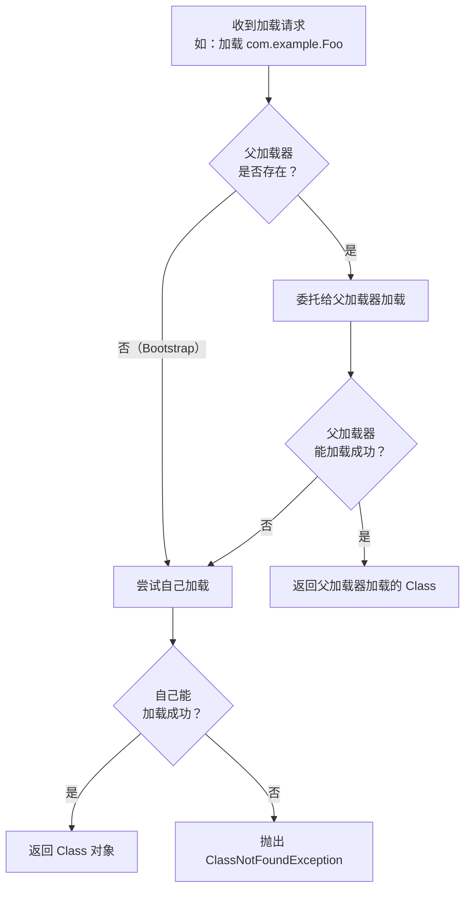

# 类加载机制与双亲委派模型

---

## 1. 为什么要理解类加载机制？

当你遇到以下问题时，不理解类加载机制就无从下手：

| 现象 | 根因 | 需要的知识 |
| :---- | :---- | :---- |
| `ClassNotFoundException` | 类路径缺失 / 类加载器找不到类 | 类加载流程 + 双亲委派 |
| `NoClassDefFoundError` | 类在编译时存在，运行时找不到 | 类加载时机 |
| 同一个类出现两个实例，`instanceof` 返回 false | 被不同类加载器加载 | 类加载器隔离 |
| Tomcat 多应用共存，依赖版本冲突 | 类加载器隔离机制 | 双亲委派破坏 |
| 热部署后新代码不生效 | 旧类未卸载 | 类卸载条件 |

---

## 2. 类加载的五个阶段

JVM 将一个 `.class` 文件加载到内存并可以使用，需要经历以下五个阶段：


> 验证、准备、解析三个阶段合称**链接（Linking）**。

### 2.1 加载（Loading）

JVM 通过类的全限定名找到对应的 `.class` 文件，将其字节流读入内存，并在方法区（元空间）创建对应的 `Class` 对象。

**加载阶段做了三件事：**

```txt
1. 通过类的全限定名获取定义此类的二进制字节流
   （可以来自 .class 文件、JAR 包、网络、动态生成等）

2. 将字节流所代表的静态存储结构转化为方法区的运行时数据结构

3. 在堆中生成一个代表该类的 java.lang.Class 对象，
   作为方法区这些数据的访问入口
```

!!! note "加载时机"
    JVM 规范没有强制规定何时加载，但规定了以下情况**必须立即初始化**（隐含着必须先完成加载）：

    - `new` 一个类的实例
    - 访问类的静态字段或静态方法
    - 反射调用（`Class.forName()`）
    - 初始化子类时，父类尚未初始化
    - JVM 启动时的主类（含 `main` 方法的类）

### 2.2 验证（Verification）

确保 `.class` 文件的字节流符合 JVM 规范，防止恶意代码危害 JVM 安全。

```txt
验证分为四个子阶段：

┌─────────────────┬──────────────────────────────────────────┐
│ 文件格式验证     │ 魔数 0xCAFEBABE、版本号是否支持等         │
├─────────────────┼──────────────────────────────────────────┤
│ 元数据验证       │ 是否有父类、是否继承了 final 类等语义检查  │
├─────────────────┼──────────────────────────────────────────┤
│ 字节码验证       │ 数据流和控制流分析，确保指令合法           │
├─────────────────┼──────────────────────────────────────────┤
│ 符号引用验证     │ 解析阶段前，确认引用的类/方法/字段存在     │
└─────────────────┴──────────────────────────────────────────┘
```

!!! tip "性能优化"
    `-Xverify:none` 可以关闭验证，加快启动速度，但存在安全风险，**生产环境不建议使用**。

### 2.3 准备（Preparation）

为类的**静态变量**分配内存，并设置**零值**（不是代码中赋的初始值）。

```java
// 准备阶段后：value = 0（零值），而不是 123
// 赋值为 123 的动作在初始化阶段执行
public static int value = 123;

// 特例：基本类型 / String 的 final static 常量，且编译期能确定值（ConstantValue 属性），
//   在准备阶段就直接赋为 456
public static final int CONST = 456;

// ⚠️ 注意：并非所有 final static 字段都会在准备阶段赋值，
//         如果右侧表达式在编译期无法求值（如函数调用、引用类型），仍需等到初始化阶段
public static final Integer BOXED = Integer.valueOf(123);  // 初始化阶段才赋值
public static final int RUNTIME = computeAtRuntime();      // 初始化阶段才赋值
```

| 数据类型 | 零值 |
| :---- | :---- |
| `int` / `long` / `short` / `byte` / `char` | `0` |
| `float` / `double` | `0.0` |
| `boolean` | `false` |
| 引用类型 | `null` |

### 2.4 解析（Resolution）

将常量池中的**符号引用**替换为**直接引用**（内存地址或偏移量）。

```txt
符号引用：一组符号来描述所引用的目标（如 "java/lang/String"）
直接引用：直接指向目标的指针、相对偏移量或能间接定位到目标的句柄
```

解析的目标包括：类或接口、字段、类方法、接口方法、方法类型、方法句柄、调用点限定符。

### 2.5 初始化（Initialization）

执行类的 `<clinit>()` 方法，这是编译器自动收集类中所有**静态变量赋值动作**和**静态代码块**合并生成的。

```java
public class InitDemo {
    static int a = 10;          // 静态变量赋值
    static int b;

    static {                    // 静态代码块
        b = a * 2;
        System.out.println("类初始化执行");
    }
}
// <clinit>() 执行顺序：a=10 → b=a*2=20 → 打印
```

!!! warning "初始化的线程安全"
    JVM 保证 `<clinit>()` 方法在多线程环境下被正确加锁同步，同一个类只会被初始化一次。这也是**静态内部类单例模式**线程安全的根本原因。

---

## 3. 双亲委派模型

### 3.1 类加载器层级

JVM 内置三层类加载器，形成父子关系（注意：这里的"父子"是**组合关系**，不是继承关系）：

```txt
┌─────────────────────────────────────────────────────────┐
│              Bootstrap ClassLoader（启动类加载器）         │
│         加载 JDK 核心类库（JDK 8 rt.jar / JDK 9+ java.base 模块）  │
│              由 C++ 实现，Java 中表示为 null               │
└───────────────────────────┬─────────────────────────────┘
                            │ parent
┌───────────────────────────▼─────────────────────────────┐
│     Extension / Platform ClassLoader                      │
│       JDK 8：Extension ClassLoader，加载 $JAVA_HOME/lib/ext │
│       JDK 9+：Platform ClassLoader，加载非 java.base 的平台模块 │
│       （职责不同：ext 接受用户自定义扩展；Platform 不接受，     │
│        ext 目录已在 JDK 9 被移除）                          │
└───────────────────────────┬─────────────────────────────┘
                            │ parent
┌───────────────────────────▼─────────────────────────────┐
│          Application ClassLoader（应用类加载器）           │
│         加载 classpath 下的类（用户代码 / 第三方 JAR）      │
│              也称 System ClassLoader                      │
└───────────────────────────┬─────────────────────────────┘
                            │ parent
┌───────────────────────────▼─────────────────────────────┐
│              自定义 ClassLoader（用户扩展）                 │
└─────────────────────────────────────────────────────────┘
```

### 3.2 委派流程



**核心代码（`ClassLoader.loadClass` 源码逻辑）：**

```java
protected Class<?> loadClass(String name, boolean resolve)
        throws ClassNotFoundException {
    synchronized (getClassLoadingLock(name)) {
        // 1. 先检查是否已经加载过
        Class<?> c = findLoadedClass(name);
        if (c == null) {
            try {
                // 2. 委托给父加载器
                if (parent != null) {
                    c = parent.loadClass(name, false);
                } else {
                    // 父加载器为 null，说明父加载器是 Bootstrap
                    c = findBootstrapClassOrNull(name);
                }
            } catch (ClassNotFoundException e) {
                // 父加载器无法加载，捕获异常继续
            }
            if (c == null) {
                // 3. 父加载器无法加载，自己尝试加载
                c = findClass(name);
            }
        }
        return c;
    }
}
```

### 3.3 双亲委派的意义

```txt
安全性：核心类库（java.lang.String 等）只能由 Bootstrap 加载，
        用户无法通过自定义同名类替换核心类，防止恶意代码攻击。

唯一性：同一个类只会被加载一次，保证 JVM 中类的唯一性。
        （同一个类被不同类加载器加载，JVM 视为两个不同的类）

稳定性：类加载有明确的层次，避免类的重复加载。
```

---

## 4. 双亲委派的破坏场景

双亲委派并非铁板一块，以下三种场景需要打破它：

### 4.1 SPI 机制（JDBC Driver 加载）

**问题：** `java.sql.Driver` 接口由 Bootstrap 加载，但其实现类（如 `com.mysql.jdbc.Driver`）在用户 classpath 中，Bootstrap 无法加载用户代码。

**解决：** 引入**线程上下文类加载器**（Thread Context ClassLoader），允许父加载器委托子加载器加载。

```java
// JDBC 加载 Driver 的核心逻辑（DriverManager 源码简化）
ServiceLoader<Driver> loadedDrivers =
    ServiceLoader.load(Driver.class);
// ServiceLoader.load 内部使用线程上下文类加载器
// Thread.currentThread().getContextClassLoader()
// 默认是 AppClassLoader，可以加载 classpath 下的实现类
```


!!! note "Java 9 模块化后的 SPI"
    Java 9 模块化引入了 `module-info.java` 中的 `provides ... with ...` / `uses ...` 声明，使 `ServiceLoader` 能同时在 **模块路径（module path）** 和 **类路径（classpath）** 上寻找实现。线程上下文类加载器仍是 `ServiceLoader.load(Class)` 的默认查找入口（没有变化）；新的能力是多出了 `ServiceLoader.load(ModuleLayer, Class)` 等模块感知重载。

### 4.2 Tomcat 的 WebAppClassLoader

**问题：** 同一个 Tomcat 实例部署多个 Web 应用，不同应用可能依赖同一个库的不同版本（如 Spring 4 和 Spring 5），需要相互隔离。

**解决：** 每个 Web 应用有独立的 `WebAppClassLoader`，**优先加载自己 `WEB-INF/lib` 下的类**，而不是先委托父加载器。

```txt
Tomcat 类加载器层级（以 Tomcat 8/9/10 为例）：

Bootstrap ClassLoader
    └── Platform / Extension ClassLoader
        └── Application ClassLoader（也称 System ClassLoader）
            └── Common ClassLoader（Tomcat 自身与所有应用共享的类库，
                                    如 servlet-api、jsp-api；配置在 catalina.properties 的 common.loader）
                ├── WebApp1 ClassLoader（应用1，WEB-INF/classes + WEB-INF/lib，优先自加载）
                └── WebApp2 ClassLoader（应用2，与应用1完全隔离）
```

> 📌 **版本差异说明**：Tomcat 早期版本（Tomcat 5.x）中曾存在独立的 **Catalina ClassLoader** 与 **Shared ClassLoader**（对应 `server.loader` / `shared.loader` 配置），用于隔离 Tomcat 内部类、共享多应用公共库。Tomcat 6+ 起这两项默认**为空并回退到 Common ClassLoader**，日常使用只需记住 `Common → WebAppX` 两层即可；若需要多应用共享某个库，直接放到 `$CATALINA_HOME/lib` 由 Common 加载。

### 4.3 OSGi 模块化

**问题：** OSGi（如 Eclipse 插件系统）需要实现模块的动态安装、卸载和版本共存。

**解决：** OSGi 完全打破了双亲委派的树形结构，改为**网状结构**。每个 Bundle 有自己的类加载器，类加载请求根据 `Import-Package` 声明在 Bundle 之间互相委托，形成复杂的网状依赖。

```txt
传统双亲委派（树形）：        OSGi（网状）：

Bootstrap                   Bundle A <---> Bundle B
    └── App                     ^               ^
        └── Custom              |               |
                            Bundle C <---> Bundle D
```

---

## 5. 自定义类加载器

继承 `ClassLoader` 并重写 `findClass` 方法（**不要重写 `loadClass`**，否则会破坏双亲委派）：

```java
public class FileSystemClassLoader extends ClassLoader {

    private final String classPath;

    public FileSystemClassLoader(String classPath) {
        this.classPath = classPath;
    }

    @Override
    protected Class<?> findClass(String name) throws ClassNotFoundException {
        // 将类名转换为文件路径
        String fileName = classPath + File.separator
                + name.replace('.', File.separatorChar) + ".class";

        try (FileInputStream fis = new FileInputStream(fileName)) {
            byte[] classBytes = fis.readAllBytes();
            // 将字节数组转换为 Class 对象
            return defineClass(name, classBytes, 0, classBytes.length);
        } catch (IOException e) {
            throw new ClassNotFoundException("找不到类文件: " + fileName, e);
        }
    }

    public static void main(String[] args) throws Exception {
        FileSystemClassLoader loader =
                new FileSystemClassLoader("/tmp/classes");

        // 加载 /tmp/classes/com/example/Hello.class
        Class<?> clazz = loader.loadClass("com.example.Hello");
        Object instance = clazz.getDeclaredConstructor().newInstance();

        // 注意：如果用不同的 loader 加载同一个类，instanceof 会返回 false
        System.out.println(instance.getClass().getClassLoader());
    }
}
```

!!! tip "实现热部署"
    热部署的核心思路：每次需要重新加载时，**创建一个新的 ClassLoader 实例**重新加载类。由于 JVM 中类的唯一性由「类加载器 + 类全限定名」共同决定，新 ClassLoader 加载的类与旧的是不同的类，从而实现"替换"效果。旧的 ClassLoader 在没有引用后会被 GC 回收（前提是没有内存泄漏）。

---

## 6. 常见问题排查

### 6.1 ClassNotFoundException vs NoClassDefFoundError

| 对比项 | `ClassNotFoundException` | `NoClassDefFoundError` |
| :---- | :---- | :---- |
| **类型** | 受检异常（Checked Exception） | 错误（Error） |
| **触发时机** | 运行时动态加载类时找不到 | 编译时存在，运行时找不到 |
| **常见场景** | `Class.forName()`、`ClassLoader.loadClass()` | 类在编译时存在，但运行时 classpath 缺少 |
| **根本原因** | 类从未被加载过 | 类曾经加载成功，但后来不可用（如静态初始化失败） |
| **解决方向** | 检查 classpath 配置 | 检查依赖是否完整、静态初始化是否抛出异常 |

```java
// ClassNotFoundException 示例
try {
    Class.forName("com.mysql.jdbc.Driver"); // 找不到 MySQL 驱动
} catch (ClassNotFoundException e) {
    // 处理：检查 pom.xml 是否引入 mysql-connector-java
}

// NoClassDefFoundError 示例（静态初始化失败）
class Broken {
    static int value = Integer.parseInt("not-a-number"); // 抛出异常
}
// 第一次加载 Broken 时抛出 ExceptionInInitializerError
// 后续再加载时抛出 NoClassDefFoundError
```

### 6.2 类冲突排查方法

当出现 `ClassCastException`（两个类互转失败）或方法签名不匹配时，可能是类冲突：

```java
// 1. 查看类被哪个 ClassLoader 加载
System.out.println(MyClass.class.getClassLoader());

// 2. 查看类文件来自哪个 JAR
URL location = MyClass.class.getProtectionDomain()
                             .getCodeSource()
                             .getLocation();
System.out.println(location); // 输出 JAR 路径
```

```bash
# 3. Maven 依赖树分析（找出重复依赖）
mvn dependency:tree | grep "your-lib"

# 4. 使用 -verbose:class JVM 参数打印所有类加载信息
java -verbose:class -jar your-app.jar 2>&1 | grep "MyClass"
```

!!! warning "类加载器隔离陷阱"
    在 Spring Boot 等框架中，如果使用了自定义类加载器（如 `URLClassLoader`），要注意：

    - 同一个类被不同类加载器加载后，`instanceof` 和类型转换会失败
    - 序列化/反序列化时可能出现类不匹配问题
    - 解决方案：确保相关类由同一个类加载器加载，或使用接口进行解耦

---

## 7. 小结

```txt
类加载五阶段：
  加载 → 验证 → 准备 → 解析 → 初始化
  （链接 = 验证 + 准备 + 解析）

双亲委派：
  子加载器先委托父加载器，父加载器无法加载才自己加载
  保证核心类库的安全性和唯一性

三种破坏场景：
  SPI（线程上下文类加载器）
  Tomcat（WebAppClassLoader 优先自加载）
  OSGi（网状委派结构）

自定义类加载器：
  继承 ClassLoader，重写 findClass（不要重写 loadClass）
  热部署核心：每次用新的 ClassLoader 实例重新加载
```
