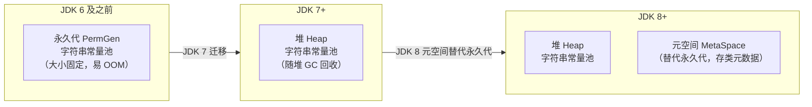
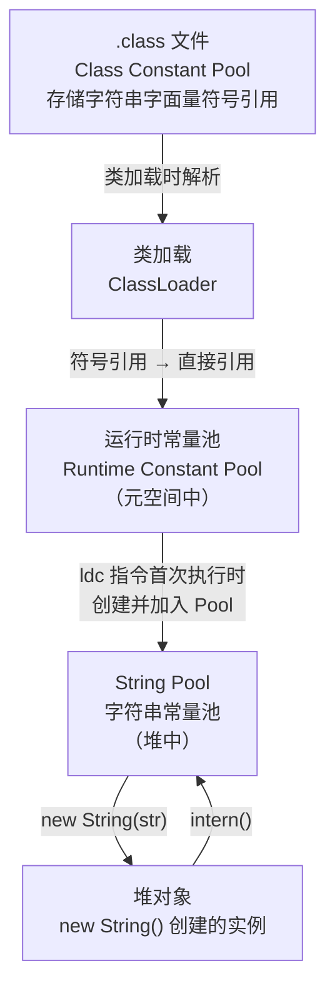

# 字符串底层原理与 String Pool

---

## 1. 为什么要深入理解 String？

`String` 是 Java 中使用频率最高的类，几乎每个程序都离不开它。但它的底层实现远比表面复杂：

| 现象 | 根因 | 需要的知识 |
| :---- | :---- | :---- |
| `==` 比较字符串结果不符合预期 | 常量池 vs 堆对象引用不同 | String Pool 机制 |
| 大量字符串拼接导致 OOM | `String +` 产生大量临时对象 | StringBuilder 原理 |
| JDK 9 升级后内存占用下降 | `byte[]` 替代 `char[]` 存储 | Compact Strings 优化 |
| `intern()` 调用后内存反而增大 | 常量池膨胀 | `intern()` 的副作用 |

---

## 2. String 的底层存储结构

### 2.1 JDK 8：char[] 存储

JDK 8 及之前，`String` 内部使用 `char[]` 数组存储字符，每个 `char` 占 **2 字节**（UTF-16 编码）：

```java
// JDK 8 String 源码（简化）
public final class String implements Serializable, Comparable<String>, CharSequence {
    private final char[] value;   // 存储字符数据
    private int hash;             // 缓存 hashCode，默认 0
}
```

对于纯 ASCII 字符串（如 `"hello"`），每个字符实际只需 1 字节，但 `char[]` 强制使用 2 字节，**造成 50% 的内存浪费**。

### 2.2 JDK 9+：byte[] + coder（Compact Strings）

JDK 9 引入 **Compact Strings** 优化（JEP 254），将存储结构改为 `byte[]` + `coder` 标志：

```java
// JDK 9+ String 源码（简化）
public final class String implements Serializable, Comparable<String>, CharSequence {
    private final byte[] value;   // 存储字符数据
    private final byte coder;     // 编码标志：LATIN1=0, UTF16=1
    private int hash;

    static final byte LATIN1 = 0;
    static final byte UTF16  = 1;
}
```

编码策略对比：

| 字符串内容 | JDK 8（char[]） | JDK 9+（byte[]） | 节省 |
| :---- | :---- | :---- | :---- |
| `"hello"` (纯 ASCII) | 10 字节 | 5 字节（LATIN1） | 50% |
| `"你好"` (含中文) | 4 字节 | 4 字节（UTF16） | 0% |
| `"hello世界"` (混合) | 14 字节 | 14 字节（UTF16） | 0% |

!!! note "为什么选择 LATIN1 而不是 UTF-8？"
    LATIN1（ISO-8859-1）是单字节定长编码，每个字符恰好 1 字节，便于通过下标 O(1) 随机访问。UTF-8 是变长编码，随机访问需要 O(n) 扫描，不适合作为内部存储格式。

**coder 由 JVM 自动判断**：创建 String 对象时，JVM 会扫描所有字符，根据码点范围自动选择编码，对开发者完全透明。

??? info "展开：coder 的自动判断规则与示例"

    ```java
    // 判断规则（伪代码）
    if (所有字符码点 <= 0xFF) {
        coder = LATIN1;   // 每字符 1 字节
    } else {
        coder = UTF16;    // 每字符 2 字节
    }
    ```

    ```java
    String s1 = "hello";       // 全 ASCII → LATIN1（5 字节）
    String s2 = "café";        // é 码点 0xE9 ≤ 0xFF → LATIN1（4 字节）
    String s3 = "你好";         // 中文码点 > 0xFF → UTF16（4 字节）
    String s4 = "hello世界";    // 含中文 → 整体升级为 UTF16（14 字节）
    ```

    **一票否决制**：只要字符串中任何一个字符超出 LATIN1 范围（> 0xFF），整个字符串就必须使用 UTF16 存储，不能混合编码。这是为了保证 `charAt(i)`、`length()` 等方法能够 O(1) 随机访问。

    可以通过 JVM 参数 `-XX:-CompactStrings` 关闭该优化，强制所有 String 使用 UTF16（退化为 JDK 8 的 `char[]` 等价行为），默认开启 `-XX:+CompactStrings`。

```txt
JDK 8 存储 "hello"：
┌────┬────┬────┬────┬────┐
│'h' │'e' │'l' │'l' │'o' │   char[]，每格 2 字节，共 10 字节
└────┴────┴────┴────┴────┘

JDK 9+ 存储 "hello"（LATIN1）：
┌───┬───┬───┬───┬───┐
│104│101│108│108│111│   byte[]，每格 1 字节，共 5 字节
└───┴───┴───┴───┴───┘
coder = 0 (LATIN1)
```

---

## 3. 字符串常量池（String Pool）

### 3.1 常量池的位置变迁

字符串常量池（String Pool / String Intern Table）是 JVM 维护的一张**哈希表**，用于存储字符串字面量，实现字符串复用。



**为什么 JDK 7 将常量池从永久代迁移到堆？**

- 永久代大小有限（HotSpot 默认值随版本与 Client/Server 模式有差，Server 模式约 64MB，上限由 `-XX:MaxPermSize` 控制），大量使用 `String.intern()` 或动态生成字符串时容易触发 `java.lang.OutOfMemoryError: PermGen space`
- 迁移到堆后，常量池中的字符串对象可以被 GC 正常回收，不再受永久代大小限制

### 3.2 字符串字面量的创建过程

```java
String s1 = "hello";   // ① 编译期写入 .class 常量池，运行时加载到 String Pool
String s2 = "hello";   // ② 直接复用 String Pool 中已有的对象
System.out.println(s1 == s2);  // true，同一个对象引用
```

```txt
String Pool（堆中的哈希表）：
┌──────────────────────────────┐
│  "hello" → 0x7f3a1b2c（引用）│
└──────────────────────────────┘
         ↑
    s1 和 s2 都指向同一个堆对象
```

### 3.3 new String() 创建了几个对象？

这是面试高频题，答案取决于常量池中是否已存在该字符串：

```txt
场景一：常量池中已有 "abc"（之前有字面量 "abc" 出现过）
  String s = new String("abc");

  执行过程：
  ① 检查 String Pool，"abc" 已存在
  ② new String(...) 在堆上创建一个新的 String 对象

  结果：创建 1 个新对象（堆上的 String 实例）

场景二：常量池中没有 "abc"（首次出现）
  String s = new String("abc");

  执行过程：
  ① 检查 String Pool，"abc" 不存在
  ② 在 String Pool 中创建 "abc" 对象
  ③ new String(...) 在堆上再创建一个新的 String 对象

  结果：创建 2 个对象（String Pool 中 1 个 + 堆上 1 个）
```

**`==` vs `equals` 的区别：**

```java
String s1 = "hello";
String s2 = "hello";
String s3 = new String("hello");
String s4 = new String("hello");

System.out.println(s1 == s2);      // true  - 同一个 String Pool 对象
System.out.println(s1 == s3);      // false - s3 是堆上新对象
System.out.println(s3 == s4);      // false - 两个不同的堆对象
System.out.println(s3.equals(s4)); // true  - 内容相同
```

!!! warning "永远用 equals() 比较字符串内容"
    `==` 比较的是**引用地址**，只有当两个变量指向同一个对象时才为 `true`。比较字符串内容必须使用 `equals()` 或 `equalsIgnoreCase()`。

### 3.4 String.intern() 方法

`intern()` 方法的作用：将字符串对象手动加入 String Pool，并返回 Pool 中的引用。

```java
// JDK 7+ 的 intern() 行为
String s1 = new String("hello");  // 堆上新对象
String s2 = s1.intern();          // 将 s1 加入（或查找）String Pool
String s3 = "hello";              // 直接引用 String Pool

System.out.println(s2 == s3);     // true  - 都是 String Pool 中的引用
System.out.println(s1 == s2);     // false - s1 是堆上对象，s2 是 Pool 引用
```

**JDK 6 vs JDK 7+ 的 intern() 差异：**

| 版本 | intern() 行为 |
| :---- | :---- |
| JDK 6 | 若 Pool 中无此字符串，**复制**一份到永久代 Pool，返回永久代中的引用 |
| JDK 7+ | 若 Pool 中无此字符串，**直接将堆中该对象的引用**存入 Pool（不复制），返回该引用 |

!!! tip "JDK 7+ intern() 的内存优化"
    JDK 7+ 的 `intern()` 不再复制对象，Pool 中存储的是堆对象的引用，避免了重复存储，节省内存。

!!! warning "谨慎使用 intern()"
    大量调用 `intern()` 存入不重复的字符串会导致 Pool 持续膨胀，增加 GC 压力。将用户输入、随机 ID 等动态字符串全部 `intern()` 是典型的反模式。

---

## 4. 字符串不可变性

### 4.1 String 为什么设计为不可变？

```java
public final class String {        // final：不可被继承
    private final byte[] value;    // final：引用不可重新赋值
    // ...
}
```

String 不可变的三大设计原因：

**① 线程安全**：

```java
// 多线程共享同一个 String 对象，无需同步
String url = "https://example.com";
// 线程 A 和线程 B 同时读取 url，不会有并发问题
```

**② 字符串常量池共享**：

```java
// 如果 String 可变，常量池共享就会出问题
String s1 = "hello";
String s2 = "hello";  // s1 和 s2 指向同一个 Pool 对象
// 假设 String 可变：修改 s1 会同时影响 s2，破坏程序正确性
```

**③ hashCode 缓存**：

```java
// String 的 hashCode 只计算一次，之后缓存在 hash 字段
public int hashCode() {
    int h = hash;
    if (h == 0 && !hashIsZero) {
        h = isLatin1() ? StringLatin1.hashCode(value)
                       : StringUTF16.hashCode(value);
        if (h == 0) {
            hashIsZero = true;
        } else {
            hash = h;
        }
    }
    return h;
}
// 不可变性保证了 hashCode 永远不会改变，可以安全地作为 HashMap 的 key
```

!!! note "final 修饰符的作用"
    `private final byte[] value` 中的 `final` 保证了 `value` 引用不可重新赋值，但**数组内容本身理论上是可以修改的**。String 的不可变性是通过 `private` 访问控制 + 不提供任何修改方法来保证的，而非单靠 `final`。

---

## 5. 字符串拼接性能对比

### 5.1 String + 的编译器优化

```java
// 编译期常量折叠：纯字面量拼接直接合并
String result = "Hello" + ", " + "World";
// 编译后等价于：
// String result = "Hello, World";

// 含变量的拼接（JDK 8）
String name = "Java";
String result = "Hello, " + name + "!";
// 编译为：
String result = new StringBuilder()
    .append("Hello, ")
    .append(name)
    .append("!")
    .toString();
```

!!! tip "JDK 9+ 的字符串拼接优化"
    JDK 9 引入 `invokedynamic` 指令处理字符串拼接，`StringConcatFactory` 可以在运行时选择最优策略（如直接操作 `byte[]`），比 JDK 8 的 `StringBuilder` 方式减少了中间对象的创建。

### 5.2 循环中拼接的陷阱

```java
// 反例：循环中使用 + 拼接（每次循环都创建新的 StringBuilder 和 String）
String result = "";
for (int i = 0; i < 10000; i++) {
    result += i;  // 等价于 result = new StringBuilder(result).append(i).toString()
}
// 产生约 10000 个临时 StringBuilder 和 String 对象！

// 正例：循环外创建 StringBuilder，复用同一个实例
StringBuilder sb = new StringBuilder();
for (int i = 0; i < 10000; i++) {
    sb.append(i);
}
String result = sb.toString();
```

### 5.3 各拼接方式性能与适用场景

| 方式 | 线程安全 | 适用场景 | 性能 |
| :---- | :---- | :---- | :---- |
| `String +` | ✅（不可变） | 少量拼接（≤3次）、编译期常量 | 少量时最简洁 |
| `StringBuilder` | ❌ | 单线程循环拼接、高性能场景 | ⭐⭐⭐⭐⭐ |
| `StringBuffer` | ✅（synchronized） | 多线程共享拼接（极少使用） | ⭐⭐⭐ |
| `String.join()` | ✅ | 固定分隔符连接集合/数组 | ⭐⭐⭐⭐ |
| `StringJoiner` | ✅ | 需要前缀/后缀的连接，Stream 场景 | ⭐⭐⭐⭐ |
| `String.format()` | ✅ | 格式化输出（可读性优先） | ⭐⭐（较慢） |

```java
// String.join() - 最简洁的集合连接
List<String> list = List.of("a", "b", "c");
String result = String.join(", ", list);  // "a, b, c"

// StringJoiner - 支持前缀和后缀
StringJoiner sj = new StringJoiner(", ", "[", "]");
sj.add("a").add("b").add("c");
String result = sj.toString();  // "[a, b, c]"

// Stream + Collectors.joining()
String result = list.stream()
    .collect(Collectors.joining(", ", "[", "]"));  // "[a, b, c]"
```

---

## 6. 常见面试题解析

### 6.1 String、StringBuilder、StringBuffer 的区别

| 特性 | String | StringBuilder | StringBuffer |
| :---- | :---- | :---- | :---- |
| 可变性 | 不可变 | 可变 | 可变 |
| 线程安全 | ✅ | ❌ | ✅ |
| 性能 | 拼接慢 | 最快 | 较快 |
| 底层（JDK 9+） | `byte[] value`（final，长度不可变） | `byte[] value`（非final，可扩容，默认初始容量 16） | `byte[] value`（非final，可扩容，默认初始容量 16） |

### 6.2 字符串常量池相关题目

```java
// 题目 1：编译期常量折叠
String s1 = "ab";
String s2 = "a" + "b";
System.out.println(s1 == s2);  // true
// 原因："a" + "b" 编译期折叠为 "ab"，指向同一个 Pool 对象

// 题目 2：含变量的拼接
String a = "a";
String s3 = a + "b";
System.out.println(s1 == s3);  // false
// 原因：a 是变量，运行时通过 StringBuilder 拼接，产生新的堆对象

// 题目 3：intern() 归一化
String s4 = s3.intern();
System.out.println(s1 == s4);  // true
// 原因：intern() 返回 String Pool 中 "ab" 的引用，与 s1 相同
```

### 6.3 String 的 hashCode 为什么用 31 作为乘数？

```java
// String.hashCode() 的计算公式：
// h = s[0]*31^(n-1) + s[1]*31^(n-2) + ... + s[n-1]
```

选择 31 的原因：

- `31` 是奇素数，且是奇数：**偶数作乘数在溢出时会丢失信息**（相当于左移，低位被补 0），质数则对任意数的映射都不存在建立在整除上的碰撞规律，能使散列分布更均匀
- `31 * i == (i << 5) - i`，JVM 可以将乘法优化为位移和减法，性能更好
- 其他候选（17 / 37 / 57 等）在常见英文字符串上实测碰撞率大同小异，选 31 是经验权衡下的惯例（Joshua Bloch《Effective Java》也沿用此设定）

---

## 7. 与 JVM 内存的关联

String Pool 本质上是 JVM 堆中的一块特殊区域，与 JVM 内存结构紧密相关：

- 字符串常量池存储在**堆**中（JDK 7+），受堆大小（`-Xmx`）限制
- 类文件中的字符串字面量存储在 `.class` 文件的**常量池**（Class Constant Pool）中，类加载时解析到运行时常量池（Runtime Constant Pool），再通过 `ldc` 指令加载到 String Pool
- String Pool 中的对象在没有强引用时可以被 GC 回收

!!! note "深入了解 JVM 内存结构"
    关于堆、元空间、运行时常量池的详细介绍，请参考 @java-JVM内存结构与GC。



---

## 8. 小结

| 知识点 | 核心结论 |
| :---- | :---- |
| 底层存储 | JDK 8 用 `char[]`（2字节/字符），JDK 9+ 用 `byte[]` + `coder`（ASCII 节省 50%） |
| 不可变性 | 线程安全 + 常量池共享 + hashCode 缓存，`final` 保证引用不变 |
| String Pool 位置 | JDK 6 在永久代，JDK 7+ 在堆（可 GC） |
| `new String("abc")` | 常量池已有时创建 1 个对象，否则创建 2 个 |
| `intern()` | 返回 Pool 中的引用；JDK 7+ 不复制对象，直接存引用 |
| 拼接性能 | 循环拼接用 `StringBuilder`；少量拼接 `+` 即可；集合连接用 `String.join()` |
| `==` vs `equals` | `==` 比较引用地址，`equals()` 比较内容，字符串比较永远用 `equals()` |
