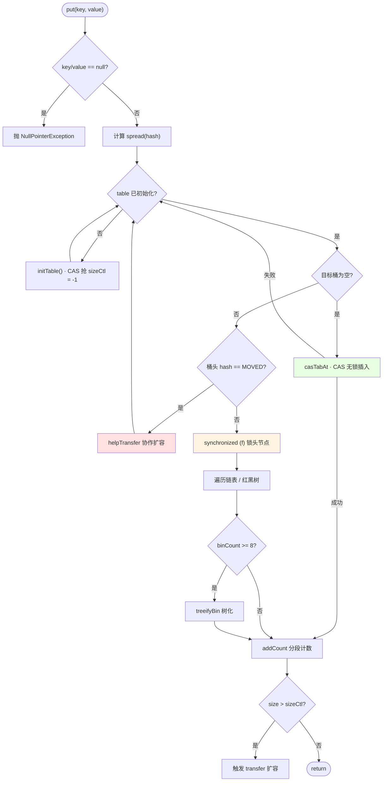
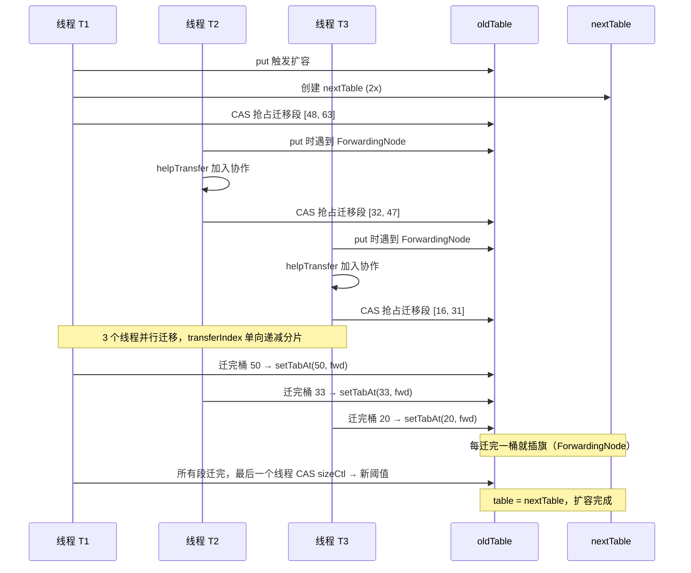
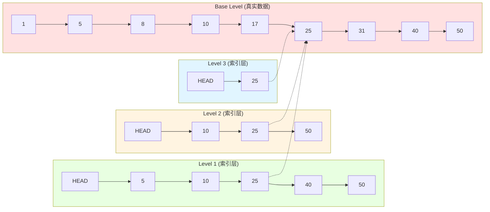

# 并发集合与实战陷阱 —— ConcurrentHashMap 三种同步工具的组合运用与 ThreadLocal 泄漏排查

**你能立刻答上来吗？**

- `ConcurrentHashMap.put()` 究竟什么时候走 CAS、什么时候走 `synchronized`、什么时候走 `helpTransfer`？完整决策链能一次画出来吗？
- `sizeCtl` 的 5 种语义分别对应什么运行阶段？扩容中的高 16 位"扩容 stamp"到底校验什么？
- CHM 扩容期间，另一个线程来 `get(key)` 会读到什么？如果这个 key 已经被迁移到 `nextTable` 呢？
- `CopyOnWriteArrayList` 迭代到一半有别的线程 `add`，会抛 `ConcurrentModificationException` 吗？为什么？
- 线程池的 `Worker` 复用后，`ThreadLocal` 传递的 `traceId` 为什么会串？`ThreadLocalMap.Entry` 里到底哪个引用强、哪个引用弱？
- `InheritableThreadLocal` 在线程池里为什么"看似能用其实失效"？跨线程池传递上下文的正确姿势是什么？

任何一个问题让你迟疑超过 3 秒——继续读。

---

## 1. 第一层：业务痛点 —— 从"CHM put 决策链"到"ThreadLocal 泄漏 OOM"

### 1.1 生产事故现场：CoW 存 10 万订单、CPU 直接打满

某电商大促当天，订单中心的一段"看起来没问题"的代码把整个 CPU 打到 100%：

```java
@Service
public class OrderRuleEngine {

    // ❌ 用 CopyOnWriteArrayList 存所有活跃订单
    private final List<Order> activeOrders = new CopyOnWriteArrayList<>();

    // 每毫秒都有新订单进来（写密集）
    public void onOrderCreated(Order o) {
        activeOrders.add(o);           // ⚠️ 每次都 O(n) 复制整个数组
    }

    // 每秒一次全量扫描（读）
    @Scheduled(fixedRate = 1000)
    public void scanTimeout() {
        for (Order o : activeOrders) { // ⚠️ 迭代持有旧快照
            if (o.isTimeout()) reject(o);
        }
    }
}
```

大促当天订单数飙到 10 万，`activeOrders.add(o)` 每次都要 `Arrays.copyOf` 一份长度 10 万的数组——**单次 add 的时间复杂度是 O(n)，N 次 add 累计就是 O(N²)**。更关键的是每次 `copyOf` 都触发一次新数组分配 + 老数组变垃圾，Eden 区被快速占满，`Young GC` 一秒好几次，GC 时间占比冲到 40%，业务线程时间片全被吃干。

这个事故直接暴露了三个老手的盲区：

- **盲区一**：`CopyOnWriteArrayList` 从来不是"通用线程安全 List"——它是"读远多于写 + 元素少 + 可接受弱一致"三个条件同时满足才用的**特化容器**，写次数不能是每毫秒级
- **盲区二**：`activeOrders.iterator()` 拿到的**不是当前 array 引用**，而是**创建迭代器那一刻的 array 快照**——迭代期间的新 `add` 一律读不到，但快照会长期占堆
- **盲区三**：单次 `add` 的锁竞争极低（只锁一个 `lock` 对象、只锁写、时间只有 `System.arraycopy`），所以 CPU profiler 一开始不会告诉你"锁在冲突"——它告诉你"`Arrays.copyOf` 和 `Young GC` 在打架"

修复方案的实际选择是**换 `ConcurrentHashMap<Long, Order>`**（用订单 ID 做 key），或者**普通 `List` + `synchronized` + 分批扫描**——本文第 4 层的红线 3 会给出完整的选型决策依据。

### 1.2 生产事故现场：`ThreadLocal` 串联的 `traceId` 泄漏出别人的日志

同一家电商的日志中间件里，出现过更诡异的一次事故：

```java
public class TraceContext {
    private static final ThreadLocal<String> TRACE_ID = new ThreadLocal<>();

    public static void set(String id) { TRACE_ID.set(id); }
    public static String get() { return TRACE_ID.get(); }
    // ❌ 没有 remove()！
}

// 拦截器
public class TraceInterceptor implements HandlerInterceptor {
    public boolean preHandle(HttpServletRequest req, ...) {
        TraceContext.set(req.getHeader("X-Trace-Id"));
        return true;
    }
    // ❌ postHandle / afterCompletion 里都没有 TraceContext.remove()！
}
```

上线两周后，运维发现日志系统里同一条 `traceId` **跨着不同的用户订单**出现——用户 A 的 `traceId` 打到了用户 B 的日志里。排查了两天，最终 heap dump 一看：Tomcat 的 `NioEndpoint$Poller` 里有 200 个 `Worker` 线程，每个 `Worker` 的 `Thread.threadLocals` 里都塞着上一批请求的 `TRACE_ID` 值。

**底层链路条**：

- Tomcat 的 `Worker` 是**线程池复用**的，Thread 对象长期存活
- `TraceContext.set("A的id")` 会把 `("A的id" 的 value)` 塞进 `Thread.threadLocals`（也就是 `ThreadLocalMap`）
- 请求 A 结束、`Worker` 被回收进池
- 请求 B 复用了同一个 `Worker`，但由于**没有调用 `remove()`**，`ThreadLocalMap` 里还残留着 `"A的id"` 的 Entry
- B 的业务代码里恰好有条路径没走 `TraceContext.set()`（比如异步补偿分支），直接读了 `TRACE_ID.get()` —— **读到了 A 的 traceId**

这个事故揭示了 `ThreadLocal` 在线程池场景下的**独特泄漏路径**——不是"内存泄漏"这么简单，而是"**上下文串了**"。而线程池里 `Worker` 一活就是几天，`ThreadLocalMap` 里的 `Entry` 只要不 `remove()`、`ThreadLocal` 对象自身没被 GC，就永远不会被清理。第 3 层 §3.4 会画出 `ThreadLocalMap` 的内存布局，第 4 层红线 4 给出根治范式。

### 1.3 痛点清单

| 痛点 | 现象 | 归因层 |
| :-- | :-- | :-- |
| **A**：CHM 扩容期间的读一致性 | 一个 key 恰好被迁到 `nextTable`，另一个线程来 `get(key)` 会不会读到 null？ | 第 3 层 §3.2 `ForwardingNode` 转发协议 |
| **B**：CoW 迭代期间的写可见性 | 迭代到一半有别的线程 `add`，会抛 `CME` 吗？迭代器会不会读到新元素？ | 第 3 层 §3.3 快照迭代底层机制 |
| **C**：死锁排查为什么必用 `jstack` | 为什么不能用日志/APM 提前发现？为什么线程池阻塞不算死锁？ | 第 4 层红线 6 死锁四条件 |

---

## 2. 第二层：源码考古 —— CHM / CoW / ThreadLocal 的源码底层链路

> ⭐ **本层特殊说明**：并发容器的"字节码考古"聚焦**源码剖析**主线，不再抓通用 `invokevirtual` 全景（那属于战役一），而是抓"CHM 内部那几段决定底层结构的关键代码"与"`ThreadLocalMap` 的不对称引用设计"。`javap -v -p ConcurrentHashMap.class` 可观察到 `Unsafe.compareAndSetReference` / `getReferenceAcquire` 调用点。

### 2.1 `ConcurrentHashMap.put()` 完整源码链路

`put()` 是理解 CHM 全部并发控制的钥匙——**六个分支覆盖了 CAS、`synchronized`、协作扩容三种同步工具**：

```java
public V put(K key, V value) {
    return putVal(key, value, false);
}

final V putVal(K key, V value, boolean onlyIfAbsent) {
    if (key == null || value == null) throw new NullPointerException();  // ⚠️ 与 HashMap 不同：并发下 null 无法区分"不存在"和"值为 null"
    int hash = spread(key.hashCode());  // 高低 16 位异或 + 强制正数（负数 hash 有特殊语义）
    int binCount = 0;
    for (Node<K,V>[] tab = table;;) {
        Node<K,V> f; int n, i, fh;

        // 分支 ① 表未初始化 → 走 CAS 抢初始化权
        if (tab == null || (n = tab.length) == 0)
            tab = initTable();

        // 分支 ② 目标桶为空 → CAS 无锁插入（快速路径）
        else if ((f = tabAt(tab, i = (n - 1) & hash)) == null) {
            if (casTabAt(tab, i, null,
                         new Node<K,V>(hash, key, value, null)))
                break;                            // 成功即出循环
        }

        // 分支 ③ 桶头是 ForwardingNode（正在扩容）→ 帮助迁移
        else if ((fh = f.hash) == MOVED)
            tab = helpTransfer(tab, f);

        // 分支 ④ 桶头是普通节点 → synchronized 锁头节点
        else {
            V oldVal = null;
            synchronized (f) {                    // ⭐ JVM 锁升级：偏向 → 轻量 → 重量
                if (tabAt(tab, i) == f) {         // 二次校验（防扩容并发下头节点已换）
                    if (fh >= 0) {                // 分支 ④a 链表
                        binCount = 1;
                        for (Node<K,V> e = f;; ++binCount) {
                            // 遍历链表：命中 key 则覆盖，否则尾插
                            if (e.next == null) {
                                e.next = new Node<K,V>(hash, key, value, null);
                                break;
                            }
                            // ... (省略 key 相等的覆盖分支)
                        }
                    }
                    else if (f instanceof TreeBin) {   // 分支 ④b 红黑树
                        binCount = 2;
                        // 调用 TreeBin.putTreeVal() 在树中插入
                    }
                }
            }
            // 分支 ⑤ 链表长度 >= 8 → 尝试树化（数组长度 < 64 时先扩容）
            if (binCount != 0) {
                if (binCount >= TREEIFY_THRESHOLD)
                    treeifyBin(tab, i);
                if (oldVal != null) return oldVal;
                break;
            }
        }
    }
    // 分支 ⑥ CounterCell 分段计数 + 扩容触发
    addCount(1L, binCount);
    return null;
}
```

**`javap -v -p ConcurrentHashMap` 关键切片**（观察 `Unsafe` 调用与 `monitorenter` 编排）：

```volt
// putVal 内部 tabAt(...) 的最终字节码
invokestatic  #NN  // Method jdk/internal/misc/Unsafe.getReferenceAcquire:(Ljava/lang/Object;J)Ljava/lang/Object;

// casTabAt(...) 的最终字节码
invokestatic  #NM  // Method jdk/internal/misc/Unsafe.compareAndSetReference:(Ljava/lang/Object;JLjava/lang/Object;Ljava/lang/Object;)Z

// synchronized (f) 的字节码指令对
monitorenter
...                // 分支 ④a / ④b 内部代码
monitorexit
```

**顿悟三条**：

1. **`put` 是 CAS + `synchronized` + `ForwardingNode` 三种同步工具的组合**——快速路径无锁、冲突路径低粒度锁、扩容期间协作迁移，三条路径的分岔口就在 `tabAt(i) == null` / `f.hash == MOVED` / `else` 三个判断上。
2. **`synchronized (f)` 锁的是**桶头节点对象本身**，不是整个表**——不同桶的 `put` 完全并行，并发度 = `table.length`（默认 16，扩容后线性增长）。
3. **锁升级红利**：低竞争场景下 `synchronized (f)` 就是一次 CAS 修改 Mark Word 到轻量级锁，几乎零开销。这是 CHM 从 JDK 7 的 `ReentrantLock`（`Segment`）换成 `synchronized` 的核心动机——**JDK 6 之后的 `synchronized` 已经比 `ReentrantLock` 更轻**（详见 [`10a` § JMM 与锁升级](@java-并发-JMM与线程同步)）。

### 2.2 `sizeCtl` 的 5 种语义 —— 一个 `volatile int` 撑 5 种状态

CHM 里最"精打细算"的字段是 `sizeCtl`——单个 `int` 承担 5 种运行期语义：

```java
private transient volatile int sizeCtl;
```

| 值域 | 语义 | 触发时机 |
| :-- | :-- | :-- |
| **`> 0`** | 扩容阈值（如 12 = 16 × 0.75） | 正常运行期 |
| **`= 0`** | 尚未指定初始容量（默认 16） | `new ConcurrentHashMap()` 且未 `put` |
| **`= -1`** | 正在初始化 | `initTable()` 期间 CAS 抢到的线程 |
| **`< -1`** | **高 16 位 = 扩容 stamp**（校验位）+ **低 16 位 = 参与扩容线程数 + 1** | `transfer()` 期间 |
| **具体如 `-M`** | 扩容中间态，M = `(rs << 16) + N`，N 为工作线程数 | 多线程协作扩容 |

**为什么要塞 5 种语义**：`sizeCtl` 是 `volatile`，任何写入都要走内存屏障——**用一个字段表达所有关键状态**能把"多字段之间可见性对齐"的复杂度砍到 0。CAS 一次修改 `sizeCtl` 就能完成"从阈值状态切换到初始化状态"或"从阈值状态切换到扩容状态"这样的原子跳变，避免"改完 A 字段还没改 B 字段"的窗口期。

**与 `10b` / `10c` 的呼应**：

| 场景 | 字段 | 承载语义数 | 位编码技巧 |
| :-- | :-- | :-- | :-- |
| AQS `state` | `volatile int` | 2~3 种（锁状态 / 计数） | `ReentrantReadWriteLock` 高 16 位读、低 16 位写 |
| 线程池 `ctl` | `AtomicInteger` | 5 种运行状态 + 工作线程数 | 高 3 位状态、低 29 位线程数 |
| CHM `sizeCtl` | `volatile int` | 5 种运行阶段 | 高 16 位扩容 stamp、低 16 位线程数 |

这就是 **Doug Lea 的 JUC 三大字段设计哲学**——"用最少字段撑最大语义空间"。

### 2.3 `transfer()` 分段迁移 + `ForwardingNode` 转发协议

CHM 扩容的精髓是**多线程协作迁移**——不搞"扩容线程独占，其他线程阻塞"，而是让每个来 `put` 的线程都顺手帮忙搬一段。

```java
private final void transfer(Node<K,V>[] tab, Node<K,V>[] nextTab) {
    int n = tab.length, stride;
    // 每个线程一次领 stride 个桶（最小 16），CPU 越多分片越大
    if ((stride = (NCPU > 1) ? (n >>> 3) / NCPU : n) < MIN_TRANSFER_STRIDE)
        stride = MIN_TRANSFER_STRIDE;

    if (nextTab == null) {
        nextTab = new Node<K,V>[n << 1];        // ⭐ 新表容量 2x
        transferIndex = n;
    }
    int nextn = nextTab.length;
    ForwardingNode<K,V> fwd = new ForwardingNode<K,V>(nextTab);  // ⭐ 共享的转发节点
    boolean advance = true, finishing = false;

    for (int i = 0, bound = 0;;) {
        // 通过 CAS 抢占 stride 大小的迁移任务段（transferIndex 单向递减）
        // ... 抢到 [bound, i] 区间后，逐桶迁移

        // 迁移单个桶：拆分链表为 low/high（依据 hash & oldCap）
        //   low  → nextTab[i]
        //   high → nextTab[i + n]

        // ⭐ 迁移完成后，原桶放置 ForwardingNode
        setTabAt(tab, i, fwd);
    }
}
```

`ForwardingNode` 是并发扩容的**核心**——它是一个 hash 值恒为 `MOVED = -1` 的特殊节点，持有 `nextTable` 引用：

```java
static final class ForwardingNode<K,V> extends Node<K,V> {
    final Node<K,V>[] nextTable;   // 转发目标：新表

    ForwardingNode(Node<K,V>[] tab) {
        super(MOVED, null, null, null);   // hash 强制为 MOVED (-1)
        this.nextTable = tab;
    }

    // ⭐ 遇到查询请求：转发到 nextTable 查找
    Node<K,V> find(int h, Object k) {
        outer: for (Node<K,V>[] tab = nextTable;;) {
            // ...在 tab 中继续 hash → i → 链表遍历
            // 如果又遇 ForwardingNode，就沿 nextTable 链继续转发
        }
    }
}
```

**协议全景**（并发迁移期间三种线程角色的行为）：

| 线程角色 | 遇到 `ForwardingNode` 时 | 行为 |
| :-- | :-- | :-- |
| **读线程**（`get`） | `f.hash == MOVED` | 调用 `f.find(h, k)`，转发到 `nextTable` 查找 —— **读操作永不阻塞** |
| **写线程**（`put`） | `f.hash == MOVED` | 调用 `helpTransfer(tab, f)`，加入协作迁移，迁完再回来 `put` |
| **迁移线程** | 迁完一个桶 | `setTabAt(tab, i, fwd)`，插旗告知其他线程该桶已完成 |

这就是 CHM"**扩容不停机**"的底层机制——旧表变成一张"路标网"，每张路标（`ForwardingNode`）指向新表的对应位置。

### 2.4 `size()` 与 `CounterCell` 分段计数

CHM 的 `size()` 借鉴了 `LongAdder` 的分段设计（同一作者 Doug Lea）：

```java
private transient volatile long baseCount;
private transient volatile CounterCell[] counterCells;

public int size() {
    long n = sumCount();
    return ((n < 0L) ? 0
            : (n > (long)Integer.MAX_VALUE) ? Integer.MAX_VALUE
            : (int) n);
}

final long sumCount() {
    CounterCell[] cs = counterCells;
    long sum = baseCount;
    if (cs != null) {
        for (CounterCell c : cs)
            if (c != null) sum += c.value;   // ⭐ 遍历累加：语义上是"最终一致快照"
    }
    return sum;
}

@jdk.internal.vm.annotation.Contended            // ⭐ 128 字节填充避免伪共享
static final class CounterCell {
    volatile long value;
    CounterCell(long x) { value = x; }
}
```

**顿悟三条**：

1. **`addCount(x, ...)` 先 CAS `baseCount`，冲突再散到 `CounterCell[]`**——这是 [`10c` § LongAdder 分段计数](@java-并发-并发工具Lock与线程池) 讲过的同一个套路，用在 CHM 上是为了让 `size()` 计数不成为写热点。
2. **`@Contended` 让每个 `CounterCell` 独占 128 字节缓存行**——避免多个 `Cell` 落在同一缓存行导致 MESI 一致性风暴（[`10a` § MESI](@java-并发-JMM与线程同步) 已讲）。
3. **`size()` 返回值是最终一致快照**——`sumCount` 遍历过程中其他线程仍在写 `Cell`，读到的是"扫过时的快照总和"，不是某个原子瞬间的精确值。老手不能拿 `size()` 当 `while` 循环上限用，第 4 层红线 2 有工程范式。

### 2.5 `CopyOnWriteArrayList.add()` 完整源码

CoW 的整份并发控制其实**只有一把锁**——写锁：

```java
final transient Object lock = new Object();     // 唯一的写锁对象
private transient volatile Object[] array;      // ⭐ volatile 引用，读永远看得到最新数组

public boolean add(E e) {
    synchronized (lock) {                       // 只锁写，读完全无锁
        Object[] es = getArray();
        int len = es.length;
        es = Arrays.copyOf(es, len + 1);        // ⭐ O(n) 复制整个数组
        es[len] = e;
        setArray(es);                           // ⭐ 原子替换 array 引用
        return true;
    }
}

public Iterator<E> iterator() {
    return new COWIterator<E>(getArray(), 0);   // ⭐ 拿当前 array 引用作为快照
}

static final class COWIterator<E> implements ListIterator<E> {
    private final Object[] snapshot;            // ⭐ 迭代器创建时的数组快照
    private int cursor;

    COWIterator(Object[] es, int initialCursor) {
        cursor = initialCursor;
        snapshot = es;
    }
    // next() / hasNext() 全部只操作 snapshot，不受后续 add 影响
}
```

**顿悟三条**：

1. **每次 `add` 都 O(n) 拷贝**——N 次 add 累计 O(N²)，元素上万时性能坍缩（回顾 §1.1 的生产事故）。
2. **迭代器基于快照 `Object[]` 引用**——`iterator()` 拿到的是当时的 `array`，`add()` 通过 `setArray(newEs)` 切换的是 `this.array`，**两者是不同的引用**，快照不会被写方"追赶到"，所以永远不抛 `ConcurrentModificationException`。
3. **代价是内存翻倍 + GC 压力**——迭代器持有的旧快照数组会阻止 GC 回收，长时间迭代 + 频繁写入 = 旧数组堆积 = Full GC。

### 2.6 `ThreadLocal` 完整原理 + 线程池泄漏路径

`ThreadLocal` 的秘密全在 `ThreadLocalMap.Entry` 的**引用不对称设计**：

```java
public class Thread {
    ThreadLocal.ThreadLocalMap threadLocals = null;   // ⭐ 每个线程独立一份
}

public class ThreadLocal<T> {
    public void set(T value) {
        Thread t = Thread.currentThread();
        ThreadLocalMap map = getMap(t);
        if (map != null) map.set(this, value);
        else createMap(t, value);
    }

    static class ThreadLocalMap {
        // ⭐ Entry 继承 WeakReference：key 是弱引用
        static class Entry extends WeakReference<ThreadLocal<?>> {
            Object value;                             // ⭐ value 是强引用
            Entry(ThreadLocal<?> k, Object v) {
                super(k);                             // key 弱引用
                value = v;
            }
        }
        private Entry[] table;                        // 开放地址法（线性探测）
    }
}
```

**引用不对称的底层示意**：

```txt
Thread 对象                              ThreadLocal 对象
┌──────────────────────────┐          ┌──────────────────────┐
│ threadLocals ─┐          │          │ (无外部强引用)        │
│               │          │          │                      │
│      ┌────────┴──────┐   │          │                      │
│      │ ThreadLocalMap│   │          │                      │
│      │  table[]      │   │          │                      │
│      │  ┌──────┐     │   │          │                      │
│      │  │Entry │     │   │          │                      │
│      │  │ key ⇢⇢⇢⇢⇢⇢⇢⇢⇢⇢⇢⇢⇢⇢⇢⇢⇢⇢⇢⇢⇢⇢⇢⇢⇢⇢⇢⇢⇢⇢⇢⇢⇢⇢⇢⇢⇢⇢⇢⇢⇢⇢▶│ (弱引用，可被 GC) │
│      │  │value━━━━━━━━━━━━━━━━━━━━━━▶│ Object            │
│      │  └──────┘     │   │          │ (强引用！)          │
│      └───────────────┘   │          └──────────────────────┘
└──────────────────────────┘
```

**线程池场景下的独特泄漏路径**（回顾 §1.2 事故）：

```txt
Step 1: 线程池 Worker 线程被创建，Thread 对象长期存活（可能存活数天）
Step 2: 任务 A 执行 threadLocal.set(largeObject_A)
         → Worker.threadLocals.table[i] = Entry(TL_ref, largeObject_A)
Step 3: 任务 A 结束（但没 remove()），Worker 归池等下一个任务
Step 4: 若 threadLocal 对象自身在应用层没有强引用了：
         → GC 回收 threadLocal，Entry 里的 key 变为 null
         → Entry.value 依然强引用着 largeObject_A → largeObject_A 泄漏
Step 5: 若 threadLocal 对象自身在应用层仍被引用（如 static 字段）：
         → Entry 完整保留 → largeObject_A 一直活着
         → 任务 B 若走了"没有 set 就 get"的分支，读到的是 A 的值 → 上下文串了
```

**探测式清理的兜底与不足**：

```java
// ThreadLocalMap.set 内部会顺手清理 stale entry
private void set(ThreadLocal<?> key, Object value) {
    // ... 找到目标 slot
    for (Entry e = tab[i]; e != null; e = tab[i = nextIndex(i, len)]) {
        ThreadLocal<?> k = e.get();
        if (k == null)                     // ⭐ 探测到 stale entry（key 已被 GC）
            replaceStaleEntry(key, value, i);
        // ...
    }
}
```

**探测式清理**只在 `set` / `get` / `remove` 被调用时**顺手触发**——如果一段 `Worker` 生命周期里再也没有其他 `ThreadLocal.set` / `get` 调用，那些 stale entry 就会一直烂在 `table[]` 里，直到 `Worker` 销毁。这就是为什么第 4 层红线 4 强制要求 `try/finally + remove()` 显式清理。

---

## 3. 第三层：JVM 底层结构 —— CHM 决策图 · 扩容协作 · CoW 快照 · ThreadLocalMap

### 3.1 CHM `put()` 决策流程图



**决策岔口**——同一段 `put` 代码在不同状态走出三条截然不同的路径：**空桶 CAS 无锁**、**非空桶 `synchronized` 单槽位**、**遇 FN 走 `helpTransfer`**。这三条路径就是"三种同步工具的组合运用"的底层证据。

### 3.2 CHM 并发扩容协作时序图



**扩容期间读线程的行为**：

```txt
Reader.get(key):
  1. 定位桶 i = (n - 1) & hash
  2. tabAt(i) → 桶头节点 f
  3. if (f.hash == MOVED)          // 遇到 ForwardingNode
     → f.find(h, k)                // 转发到 nextTable 查找
       → nextTable 里再定位桶 i'
       → 若又遇 ForwardingNode，沿 nextTable 链继续转发
  4. else 走正常链表/红黑树查找

结论：读操作永不阻塞，永远能读到"当前状态下应有的值"
```

### 3.3 CoW 迭代器快照机制图

```txt
时间线：

t0:  array 引用 R1 = [A, B, C]
     ┌────────────────────────┐
     │ Object[] R1: [A, B, C] │
     └────────────────────────┘

t1:  线程 X 创建迭代器
     iter.snapshot = R1
     ┌────────────────────────┐
     │ iter.snapshot ─┐        │
     │                ▼        │
     │ Object[] R1: [A, B, C] │
     └────────────────────────┘

t2:  线程 Y 调用 list.add(D)
     synchronized (lock):
       R2 = Arrays.copyOf(R1, 4)
       R2[3] = D
       list.array = R2
     ┌────────────────────────────────┐
     │ list.array ─┐                  │
     │             ▼                  │
     │ Object[] R2: [A, B, C, D]      │
     │                                │
     │ iter.snapshot ─┐  ← 仍指向 R1  │
     │                ▼                │
     │ Object[] R1: [A, B, C] (旧)    │
     └────────────────────────────────┘

t3:  线程 X 调用 iter.next()
     读的是 iter.snapshot → 得到 R1 的元素，永远读不到 D
     不抛 ConcurrentModificationException（因为迭代器根本不 check R1 是否变化）

t4:  迭代器结束
     R1 变成 GC Root 不可达 → 才能被回收

事故窗口：
  - 若迭代耗时长（如 60s 全表扫描）
  - 期间线程 Y 调用 add 一千次 → 产生 R2, R3, ..., R1001
  - 若某读线程也持有 R500 的迭代器 → R500 及之后所有版本都不能回收
  → 内存翻倍 + 大量 minor GC
```

**顿悟点**：CoW 的"弱一致性"不是"实现漏洞"，是**用空间换时间 + 用一致性换无锁**的显式设计——迭代器**永远不会**抛 `CME`，代价是**迭代期间的写永远读不到**。

### 3.4 `ThreadLocalMap` 内存布局图

```txt
Thread 对象（线程池 Worker 长期存活）
┌──────────────────────────────────────────────────────────┐
│ ThreadLocalMap threadLocals                              │
│                                                          │
│  Entry[] table (开放地址法 + 线性探测)                   │
│  ┌──────────┬──────────┬──────────┬──────────┬─────────┐ │
│  │ [0]      │ [1]      │ [2]      │ [3]      │ [4] ... │ │
│  │ Entry    │ null     │ Entry    │ Entry    │         │ │
│  │  key ⇢⇢⇢⇢⇢⇢⇢⇢⇢⇢⇢⇢⇢⇢⇢⇢⇢⇢⇢⇢⇢⇢⇢⇢⇢⇢⇢⇢⇢⇢⇢⇢⇢⇢⇢⇢⇢⇢⇢⇢⇢⇢▶ TL_A (弱) │
│  │  value━━━━━━━━━━━━━━━━━━━━━━━━━━━━━━━━━━━━━━━━━━━━▶ V_A (强)  │
│  │          │          │ key: null│ key ⇢⇢⇢⇢▶ TL_C     │
│  │          │          │ value:   │ value ━━▶ V_C (强)  │
│  │          │          │ V_B (强)│                    │ │
│  │          │          │ ⚠️ stale│                    │ │
│  └──────────┴──────────┴──────────┴──────────┴─────────┘ │
│                              ▲                           │
│                              └─ TL_B 已被 GC             │
│                                 但 value V_B 仍强引用    │
│                                 → 泄漏点                 │
└──────────────────────────────────────────────────────────┘

清理时机：
  ✅ 主动 threadLocal.remove()      → 立即清理 slot
  ⚠️ 下次 set/get 顺手扫到 stale    → 探测式清理
  ❌ 若 Worker 生命周期内不再触发    → 永久泄漏

图例：
  ⇢⇢⇢▶  弱引用（可被 GC）
  ━━━▶  强引用（不可被 GC）
```

**引用不对称的根本原因**：

- **key 用弱引用**：防止 `ThreadLocal` 对象因被 `ThreadLocalMap` 强持有而永不释放（`ThreadLocal` 通常是 `static final` 字段，这不是关键；关键是不允许"用户端引用消失后 map 还硬撑着")
- **value 用强引用**：value 通常没有其他外部引用，如果也用弱引用，任何一次 minor GC 都会让 value 消失，`ThreadLocal.get()` 就会诡异地返回 null

**这个不对称是刻意为之的**——JDK 设计者选择"key 可回收、value 靠用户显式 `remove()` 清理"，就是把清理责任转嫁给用户，换取更强的 value 可用性。**代价就是用户必须写 `try/finally + remove()`**。

### 3.5 `ConcurrentSkipListMap` 无锁跳表（回收 `09` 伏笔）

CHM 之外，`ConcurrentSkipListMap`（CSLM）是 JUC 里唯一一个**纯 CAS 无锁**的并发容器——它选用**跳表**而不是红黑树，根本原因就是**跳表的修改只影响相邻 2 个节点，CAS 冲突范围极小**：



**关键的无锁修改**（CSLM 内部用 `VarHandle` 做 CAS）：

```java
// ConcurrentSkipListMap.Node —— CAS 修改 next 指针
static final class Node<K,V> {
    final K key;
    V val;
    Node<K,V> next;
    // ... casNext / casVal 均通过 VarHandle 完成
}
```

**顿悟点**：

- **红黑树的修改可能连带旋转多个节点** —— CHM 的 `TreeBin` 只能靠 `synchronized` 锁头节点保护
- **跳表的修改只涉及相邻 2 个 `next` 指针** —— CSLM 用 CAS 就能保证正确性，完全无锁
- **CSLM 是 JUC 里唯一保序的并发 Map** —— 需要范围查询 (`subMap` / `headMap`) 或有序遍历时的首选
- **代价**：单次操作 O(log n) 慢于 CHM 的 O(1)（无冲突场景），且内存开销是 CHM 的 1.5~2 倍

---

## 4. 第四层：工程红线与优化架构

### 红线 1 · 多线程 Map 一律 `ConcurrentHashMap`

**硬性依据**：

- `HashMap` JDK 7 并发 `put` → 环形链表 → `get()` 死循环（100% CPU）
- `HashMap` JDK 8 并发 `put` → 尾插法虽避免了环，但仍会**数据丢失**（后写者覆盖前写者未提交的节点）
- `Hashtable` / `Collections.synchronizedMap` → 全表 `synchronized`，并发度 = 1

```java
// ❌ 反模式：以为"只是临时缓存不会有并发"
private final Map<String, Object> cache = new HashMap<>();

// ✅ 标准范式：即使写少也一律 CHM
private final Map<String, Object> cache = new ConcurrentHashMap<>();
```

**并发度对比**：CHM 单槽位锁并发度 = `table.length`，从 16 起步、扩容后线性增长；`Hashtable` 恒为 1；差距不是常数倍，而是**接近数组长度倍**。

### 红线 2 · CHM 的 `size()` 是最终一致，不能作循环上限

**硬性依据**：`sumCount()` 遍历 `CounterCell[]` 时其他线程仍在写，返回值是快照总和而非精确瞬时值。

```java
// ❌ 反模式：拿 size() 当循环上限
ConcurrentHashMap<Long, Order> orders = ...;
for (int i = 0; i < orders.size(); i++) {   // ⚠️ size 期间还在写 → 可能越界或漏
    // ...
}

// ✅ 标准范式 A：显式维护 AtomicLong 精确计数
private final AtomicLong orderCount = new AtomicLong();
public void put(Order o) {
    if (orders.put(o.id, o) == null) orderCount.incrementAndGet();
}

// ✅ 标准范式 B：迭代器 / entrySet（弱一致但内容自洽）
for (Order o : orders.values()) { ... }     // 迭代器是弱一致的，不会 CME
```

### 红线 3 · `CopyOnWriteArrayList` 只用在"读远多于写 + 元素少 + 可接受弱一致"

**硬性依据**：单次 add O(n)、N 次 add O(N²)；旧快照阻止 GC → 元素上万时 Young GC 频率线性上升。

**适用/禁用场景**：

| 场景 | 推荐? | 理由 |
| :-- | :-- | :-- |
| Spring `ApplicationListener` 列表（启动期写、运行期读） | ✅ 首选 | 写一次终生只读 |
| 网关路由表（分钟级更新） | ✅ 推荐 | 写频率 << 读频率，且数据量小 |
| IP 白名单 / 权限列表 | ✅ 推荐 | 同上 |
| 订单列表 / 消息队列 | ❌ 禁止 | 每毫秒都写，O(N²) 直接打满 CPU |
| 计数器场景 | ❌ 禁止 | 用 `LongAdder`（[`10c`](@java-并发-并发工具Lock与线程池)） |

```java
// ❌ 反模式：把 CoW 当通用 List 用
private final List<Order> orders = new CopyOnWriteArrayList<>();
public void onOrderCreated(Order o) { orders.add(o); }  // 每次 O(n)！

// ✅ 标准范式：换成 ConcurrentHashMap<Long, Order>
private final Map<Long, Order> orders = new ConcurrentHashMap<>();
public void onOrderCreated(Order o) { orders.put(o.id, o); }
```

### 红线 4 · `ThreadLocal` 使用后必须 `try/finally + remove()` —— 尤其在线程池

**硬性依据**：`ThreadLocalMap.Entry` 弱引用 key + 强引用 value → 探测式清理仅在下次 `set`/`get` 触发 → 线程池 `Worker` 长期存活 → value 永久泄漏或上下文串（回顾 §1.2 事故）。

```java
// ❌ 反模式：设置后不清理
public void handle(Request req) {
    TRACE_ID.set(req.traceId);
    // ... 业务逻辑
    // ⚠️ 方法结束，Worker 归池，Entry 还在
}

// ✅ 标准范式：try / finally 强制清理
public void handle(Request req) {
    TRACE_ID.set(req.traceId);
    try {
        // ... 业务逻辑
    } finally {
        TRACE_ID.remove();                  // ⭐ 无论成功失败都清理
    }
}
```

**AOP / 拦截器场景**必须写在 `afterCompletion` / `@Around` 的 finally 块里：

```java
public class TraceInterceptor implements HandlerInterceptor {
    public boolean preHandle(HttpServletRequest req, ...) {
        TraceContext.set(req.getHeader("X-Trace-Id"));
        return true;
    }
    public void afterCompletion(HttpServletRequest req, ...) {
        TraceContext.remove();              // ⭐ 强制清理，兜底一切分支
    }
}
```

### 红线 5 · `InheritableThreadLocal` 与线程池不兼容 —— 用 `TransmittableThreadLocal`

**硬性依据**：`InheritableThreadLocal` 在 `Thread.<init>` 里执行"父线程 → 新线程"的一次性拷贝；线程池的 `Worker` 已经存活，`execute(task)` 时不会重新调用 `Thread` 构造函数 → 拷贝时机错过 → 子任务读到的是**创建 Worker 那一刻的父线程值**，而不是"提交任务的那个线程"的值。

```java
// ❌ 反模式：以为 InheritableThreadLocal 能跨线程池传值
private static final InheritableThreadLocal<String> CTX = new InheritableThreadLocal<>();
CTX.set("A");
executor.submit(() -> System.out.println(CTX.get()));   // ⚠️ 可能读到旧值或 null

// ✅ 标准范式：用阿里 TransmittableThreadLocal（TTL）
// pom.xml
// <dependency>
//   <groupId>com.alibaba</groupId>
//   <artifactId>transmittable-thread-local</artifactId>
// </dependency>
private static final TransmittableThreadLocal<String> CTX = new TransmittableThreadLocal<>();
CTX.set("A");
executor = TtlExecutors.getTtlExecutorService(executor);   // ⭐ 装饰器
executor.submit(() -> System.out.println(CTX.get()));      // ✅ 始终读到 "A"
```

**原理简述**：TTL 通过任务包装器（Decorator）在 `submit` 时刻拷贝 `TTL.copy()`，在 Worker 真正 `run` 时把值临时塞进 `Worker.threadLocals`，`run` 结束再恢复。**这才是"跨线程池传上下文"的正确姿势**。

### 红线 6 · 死锁排查用 `jstack -l`，防御用"统一加锁顺序 + tryLock 超时"

**死锁四条件同时满足才成立**：① 互斥（资源不能共享）② 持有并等待（拿着 A 等 B）③ 不可剥夺（不能强抢）④ 循环等待（形成环）—— **破坏任意一条即可预防**。

```java
// ❌ 反模式：加锁顺序相反 → 循环等待
// 线程 1: synchronized (lockA) { synchronized (lockB) { ... } }
// 线程 2: synchronized (lockB) { synchronized (lockA) { ... } }

// ✅ 标准范式 A：全局统一加锁顺序（用 System.identityHashCode 定序）
static void transfer(Account from, Account to, int amount) {
    Account first  = System.identityHashCode(from) < System.identityHashCode(to) ? from : to;
    Account second = first == from ? to : from;
    synchronized (first) {
        synchronized (second) {
            from.balance -= amount;
            to.balance += amount;
        }
    }
}

// ✅ 标准范式 B：tryLock 超时 + 随机退避（打破循环等待）
if (from.lock.tryLock(100, TimeUnit.MILLISECONDS)) {
    try {
        if (to.lock.tryLock(100, TimeUnit.MILLISECONDS)) {
            try { /* transfer */ } finally { to.lock.unlock(); }
        }
    } finally { from.lock.unlock(); }
}
```

**排查工具**：

```bash
# jstack 自动检测 Java-level deadlock
jstack -l <pid> | grep -A 30 "Found one Java-level deadlock"

# Arthas 快速定位
thread -b
```

`jstack` 输出的"Found one Java-level deadlock"段会**打印完整的循环等待链**——`Thread-A 等 Thread-B 的 Object@xxx，Thread-B 等 Thread-A 的 Object@yyy`。这是死锁排查的**黄金证据**。

### 红线 7 · 不可变对象天然线程安全 —— 优先设计不可变

**硬性依据**：不可变对象无 setter、字段 `final`、构造完成后状态永不变 → 没有 `read-modify-write` 三步操作 → 天然无并发问题。

```java
// ❌ 反模式：可变 DTO
public class UserProfile {
    private String name;
    private int age;
    public void setName(String n) { this.name = n; }   // ⚠️ 并发下必须加锁
    public void setAge(int a) { this.age = a; }
}

// ✅ 标准范式 A：final 字段 + 无 setter
public final class UserProfile {
    private final String name;
    private final int age;
    public UserProfile(String name, int age) {
        this.name = name;
        this.age = age;
    }
    public UserProfile withName(String n) {             // "修改" 返回新对象
        return new UserProfile(n, this.age);
    }
}

// ✅ 标准范式 B：JDK 16+ record（更简洁的不可变载体）
public record UserProfile(String name, int age) {}

// ✅ 标准范式 C：不可变集合
List<String> tags = List.of("a", "b", "c");            // JDK 9+
Map<String, Integer> scores = Map.of("A", 90, "B", 85);
```

**核心结论**：*"能不可变就不可变——**最好的锁就是没有锁**。"*

---

**战役三核心总结**：

> *"战役三的所有并发问题都收敛到三条根源：**可见性**（10a JMM 缓存一致性）· **原子性**（10a CAS `LOCK CMPXCHG`）· **有序性**（10a 内存屏障）。理解了 10a 的三条硬件事实、10b 的 AQS 骨架（一个 `volatile int` + CLH 队列 + `park`/`unpark`）、10c 的锁与线程池（`state` 语义定义 + `ctl` 位编码）、以及本文的三种同步工具组合运用（CAS + `synchronized` + 转发协议），20 年 Java 并发的所有 bug 都能追溯到这套底层机制。"*

---

## 5. 🗺️ 跨战役知识伏笔（战役三收官 · 全部闭环）

### 5.1 本文回收的伏笔（战役三之内 + 战役二反向承接）

| 上游篇 → 本篇 | 承接内容 | 落地章节 | 状态 |
| :-- | :-- | :-- | :-- |
| [`08` 集合框架](@java-数据结构-集合框架) → 本文 | `ConcurrentHashMap` 完整源码 · `sizeCtl` / `transfer` / `ForwardingNode` · CoW 弱一致 | §2.1~§2.5 + §3.1~§3.3 | ✅ 已闭环（★★★★★） |
| [`09` 数据结构精讲](@java-数据结构-数据结构精讲) → 本文 | `ConcurrentSkipListMap` 无锁 CAS 跳表原理 | §3.5 | ✅ 已闭环（★★★★★） |
| [`10a` JMM 与线程同步](@java-并发-JMM与线程同步) → 本文 | `synchronized` 锁升级让 CHM 单槽位锁近乎零开销 · `@Contended` 避免伪共享 | §2.1 + §2.4 | ✅ 已闭环（★★★★） |
| [`10c` Lock 与线程池](@java-并发-并发工具Lock与线程池) → 本文 | `ctl` 位编码 → `sizeCtl` 位编码同构 · `LongAdder` 分段 → `CounterCell` 分段 | §2.2 + §2.4 | ✅ 已闭环（★★★★） |

### 5.2 本文埋下的伏笔（面向战役四 · JVM Runtime）

| 本篇 → 目标篇 | 伏笔内容 | 优先级 |
| :-- | :-- | :-- |
| 本文 → [`12a` 内存分区与对象布局](@java-JVM-内存分区与对象布局) | `ForwardingNode.hash == MOVED == -1` 的"哨兵节点"设计模式 · 与对象头 Mark Word 特殊位对照 | ★★ |
| 本文 → [`12b` GC 核心机制与收集器演进](@java-JVM-GC核心机制与收集器演进) | `CopyOnWriteArrayList` 旧快照数组阻止 GC · Young GC 压力线性上升 · 引用族与 GC Root | ★★★ |
| 本文 → [`12c` GC 调优实战与常见误区](@java-JVM-GC调优实战与常见误区) | `ThreadLocal` 泄漏 heap dump 定位 `ThreadLocalMap.table` · OOM 排查流程 | ★★★★ |
| 本文 → [`12d` JVM 现代实践与前沿技术](@java-JVM-现代实践与前沿技术) | CHM 内部大量 `synchronized (f)` · 虚拟线程执行 CHM 时载体线程会被 pin · JDK 21+ 的适配之路 | ★★★★★ |

---

## 6. 术语家族卡片

!!! note "📖 术语家族一：`Concurrent*` 并发容器族"
    **字面义**：`Concurrent<Container>` = "非阻塞并发容器"（读永不阻塞、写走 CAS 或低粒度锁）

    **在本框架中的含义**：`java.util.concurrent` 包里所有以 `Concurrent` 开头的容器 —— 特点是**读操作无锁、写操作用 CAS + 单槽位 `synchronized`**，与 `Hashtable` / `synchronizedXxx` 的"全表锁"形成对立。

    **家族成员**：

    | 成员 | 底层同步机制 | 数据结构 | 源码位置 |
    | :-- | :-- | :-- | :-- |
    | `ConcurrentHashMap<K,V>` | CAS + `synchronized` 单槽位 + `ForwardingNode` 转发 | 数组 + 链表 + 红黑树 | `java.util.concurrent.ConcurrentHashMap` |
    | `ConcurrentSkipListMap<K,V>` | 纯 CAS 无锁 | 跳表（有序） | `java.util.concurrent.ConcurrentSkipListMap` |
    | `ConcurrentSkipListSet<E>` | 委托 CSLM | 有序 Set | `java.util.concurrent.ConcurrentSkipListSet` |
    | `ConcurrentLinkedQueue<E>` | 纯 CAS 无锁 | Michael-Scott 无锁队列 | `java.util.concurrent.ConcurrentLinkedQueue` |
    | `ConcurrentLinkedDeque<E>` | 纯 CAS 无锁 | 无锁双端队列 | `java.util.concurrent.ConcurrentLinkedDeque` |

    **命名规律**：`Concurrent*` = "非阻塞并发（CAS 主导 + `synchronized` 补位）"，与 `CopyOnWrite*`（写复制）、`Blocking*`（阻塞）形成三大并发容器族对立。

    **易混点**：`ConcurrentHashMap` 与 `Hashtable` —— 前者是 CAS + 单槽位锁（并发度 = table.length），后者是全表 `synchronized`（并发度 = 1），差距接近数组长度倍。

!!! note "📖 术语家族二：`CopyOnWrite*` 快照并发族"
    **字面义**：`CopyOnWrite<Container>` = "写时复制容器" —— 写操作复制整个底层数组、读操作走 volatile 引用、迭代器基于创建时的数组快照

    **在本框架中的含义**：JUC 里唯一一族"**读永远无锁 + 迭代永不 CME**"的并发容器，代价是"读不到最新写"+"O(N²) 累计拷贝成本"+"旧快照 GC 压力"。

    **家族成员**：

    | 成员 | 底层策略 | 适用场景 |
    | :-- | :-- | :-- |
    | `CopyOnWriteArrayList<E>` | 写时 `Arrays.copyOf` + 原子替换 `array` 引用 | 读远多于写 + 元素少（Spring 监听器列表、路由表） |
    | `CopyOnWriteArraySet<E>` | 内部委托 `CopyOnWriteArrayList` | 同上，去重语义 |

    **命名规律**：`CopyOnWrite*` = "写时复制 · 读免锁 · 迭代快照"

    **易混点**：老手最容易把 `CopyOnWriteArrayList` 当"通用线程安全 List"用 —— 一旦写次数达到每秒千次级别，O(N²) 直接把 CPU 打爆（见 §1.1 事故）。

!!! note "📖 术语家族三：`ConcurrentHashMap.Node*` 节点家族"
    **字面义**：CHM 桶内元素以 `Node` 继承体系表达 —— 通过 `hash` 字段的特殊取值区分节点类型

    **在本框架中的含义**：JDK 集合内部节点类的命名遵循`修饰词 + Node` 或 `Node + 组合词` 的模式，`hash` 字段的正负值是识别节点类型的关键信号。

    **家族成员**：

    | 成员 | `hash` 值 | 作用 | 源码位置 |
    | :-- | :-- | :-- | :-- |
    | `Node<K,V>` | ≥ 0 | 普通链表节点，`val` 与 `next` 均为 `volatile` | `CHM.Node` |
    | `TreeNode<K,V>` | ≥ 0 | 红黑树节点（不直接入桶，由 `TreeBin` 管理） | `CHM.TreeNode` |
    | `TreeBin<K,V>` | `TREEBIN = -2` | 桶头代理节点，持有红黑树 `root` | `CHM.TreeBin` |
    | `ForwardingNode<K,V>` | `MOVED = -1` | 扩容时的占位节点，转发查询到 `nextTable` | `CHM.ForwardingNode` |
    | `ReservationNode<K,V>` | `RESERVED = -3` | `computeIfAbsent` 的计算占位，防重入 | `CHM.ReservationNode` |

    **命名规律**：`Node` 家族的 `hash` 负值都是"特殊标记"—— `-1` 转发、`-2` 树代理、`-3` 计算占位。老手看到 `f.hash < 0` 立刻知道"这不是普通节点，要走特殊分支"。

    **易混点**：`TreeNode` 与 `TreeBin` —— 前者是树里的具体节点，后者是**桶头代理**（桶头存的是 `TreeBin`，`TreeBin` 内部再指向 `TreeNode` 树的根）。

**引用其他篇的术语家族**：

- 📖 CAS 三层同义族（`compareAndSet` / `weakCompareAndSet` / `LOCK CMPXCHG`）→ [`10a` JMM 与线程同步](@java-并发-JMM与线程同步) §术语家族
- 📖 AQS 四要素族（`state` / CLH / 模板方法 / `park` 挂起）→ [`10b` AQS 设计哲学](@java-并发-AQS设计哲学) §术语家族
- 📖 `*Lock` 三代锁族 · `*Adder` 分段计数族 · `*BlockingQueue` 阻塞队列族 → [`10c` Lock 与线程池](@java-并发-并发工具Lock与线程池) §术语家族
- 📖 `*Reference` 四大引用强度族（`Strong` / `Soft` / `Weak` / `Phantom`）→ [`12b` GC 核心机制](@java-JVM-GC核心机制与收集器演进) §术语家族

---

## 7. 常见问题 Q&A

> **Q1：ConcurrentHashMap 的 `put()` 什么时候用 CAS · 什么时候用 `synchronized`？完整决策链是什么？**
>
> 三条路径的分岔口在 `tabAt(i)` 的判断上：**桶为 null → CAS 无锁插入**（`casTabAt`，快速路径）；**桶头 `hash == MOVED` → `helpTransfer` 加入协作扩容**；**其他情况 → `synchronized (f)` 锁头节点后遍历链表 / 红黑树**。这三条路径就是"三种同步工具的组合运用"—— CAS 覆盖无冲突场景、`synchronized` 覆盖单桶冲突场景、`ForwardingNode` 协议覆盖扩容期间的并发协作。完整决策图见 §3.1。

> **Q2：`sizeCtl` 的 5 种语义分别是什么？扩容中的高低 16 位怎么分解？**
>
> `> 0`：扩容阈值（如 12 = 16 × 0.75）；`= 0`：初始默认（未指定容量）；`= -1`：正在 `initTable`；`< -1`：扩容中，**高 16 位是扩容 stamp**（一个从容量派生的校验位，防止不同代扩容互相干扰），**低 16 位是参与扩容的线程数 + 1**。当最后一个协作线程完成时，会 CAS 把 `sizeCtl` 更新为下一轮的新阈值。**用一个 `volatile int` 撑 5 种状态**是 Doug Lea "最小字段撑最大语义"设计哲学在 CHM 上的实例（与 `10c` 线程池 `ctl`、`10b` AQS `state` 同源）。

> **Q3：CHM 扩容期间的读操作会读到什么？`ForwardingNode` 协议是什么？**
>
> **读操作永不阻塞**。桶头如果是 `ForwardingNode`（`hash == MOVED == -1`），`get()` 会调用 `f.find(h, k)` **转发到 `nextTable`** 继续查找——如果新表里的桶头又是 `ForwardingNode`（多轮扩容），就沿 nextTable 链继续转发。**这是 CHM"扩容不停机"的底层机制**：旧表变成一张"路标网"，每张路标（迁完的桶）都指向新表的对应位置。写操作遇到 FN 则走 `helpTransfer` 加入协作，先帮迁完再回来 `put`。

> **Q4：`CopyOnWriteArrayList` 的迭代器为什么不会抛 `ConcurrentModificationException`？弱一致的底层链路是什么？**
>
> 因为迭代器持有的是**创建时的 `Object[]` 快照引用**（`iter.snapshot`），而 `add()` 是通过 `list.array = newArray` **切换外部引用**——两者是不同的对象，快照永远不会被写方"追赶到"。所以迭代器：① 永不抛 CME（没有 `modCount` 检查）；② 迭代期间的新 `add` 全部读不到（弱一致性）；③ 代价是旧快照阻止 GC，长迭代 + 频繁写 = Young GC 压力（见 §3.3）。

> **Q5：`ThreadLocal` 在线程池场景下的泄漏路径是什么？如何避免？**
>
> **底层链路**：线程池 `Worker` 长期存活 → `Worker.threadLocals` 的 `Entry[]` 长期存活 → `Entry` 里 `key` 是弱引用（可被 GC）但 `value` 是强引用 → 若忘 `remove()`，`value` 永久泄漏；若 `ThreadLocal` 自身还被 static 字段引用，下一批任务复用 `Worker` 时可能读到上批任务的 value（"上下文串了"，见 §1.2 事故）。**避免范式**：`try { local.set(...); ... } finally { local.remove(); }`，AOP / 拦截器场景把 `remove()` 写在 `afterCompletion` 里。

> **Q6：`InheritableThreadLocal` 为什么在线程池中失效？如何跨线程池正确传值？**
>
> `InheritableThreadLocal` 的拷贝时机在 `Thread.<init>` 里——**新线程被创建时**从父线程一次性复制。线程池的 `Worker` **早就存活了**，`executor.submit(task)` 时不会调用 `Thread` 构造函数，所以拷贝时机**根本不会触发**。子任务读到的是"创建 Worker 那一刻的父线程值"，而不是"提交任务的当前线程"的值。正确姿势用**阿里的 `TransmittableThreadLocal`（TTL）**——通过任务包装器在 `submit` 时刻拷贝、`run` 时刻塞值、`run` 结束恢复。见红线 5 完整范式。

> **Q7：并发编程 5 大实战陷阱有哪些？**
>
> **① 不可变对象设计缺失**——`final` 字段 + 无 setter 就能天然线程安全，能不可变就不可变（红线 7）；**② 无锁数据结构选型错**——`CopyOnWriteArrayList` 当通用 List、`AtomicLong` 当计数器（应换 `LongAdder`）；**③ 异常吞噬 / 复合操作非原子**——`if (!map.containsKey(k)) map.put(k, v)` 必须换成 `map.putIfAbsent(k, v)` 或 `map.compute(...)`；**④ 死锁四条件（互斥 · 持有并等待 · 不可剥夺 · 循环等待）**——防御用"统一加锁顺序 + tryLock 超时"（红线 6）；**⑤ `InheritableThreadLocal` 与线程池不兼容**——跨池传上下文必须用 TTL（红线 5）。

> 📖 **AQS 骨架 · CAS 硬件语义 · `ReentrantLock` 用法 · 线程池 7 参数** 已分别在 [`10b` AQS 设计哲学](@java-并发-AQS设计哲学) / [`10a` JMM 与线程同步](@java-并发-JMM与线程同步) / [`10c` Lock 与线程池](@java-并发-并发工具Lock与线程池) 给出答案，本文专注"并发容器组合运用与实战陷阱"题。
>
> 🎉 **战役三 · 并发全景至此收官**：从 [`10a` 硬件地基](@java-并发-JMM与线程同步) → [`10b` 设计哲学](@java-并发-AQS设计哲学) → [`10c` 框架应用](@java-并发-并发工具Lock与线程池) → 本文的组合运用，**20+ JUC 同步器的所有源码都能追溯到"三条硬件事实 + 一条 AQS 骨架 + 一套组合运用"这三条主线**。战役四即将进入 JVM Runtime 视角，届时你会发现 `Worker` 长期存活的"GC Root 身份"、`CopyOnWriteArrayList` 快照的"引用可达性"、`ThreadLocalMap` 的"堆内定位"，都能在 [`12a` 内存分区与对象布局](@java-JVM-内存分区与对象布局) 之后一一破解。
