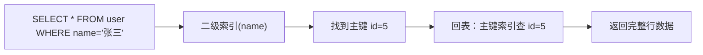

# 数据结构精讲（Java & Spring 生态视角）

---

## 概览：数据结构在 Java/Spring 生态中的分布

| 数据结构 | 使用场景 |
|---------|---------|
| **红黑树** | `TreeMap`、`TreeSet`、`HashMap`（链表转树）、`ConcurrentHashMap` |
| **B+ 树** | MySQL InnoDB 索引、PostgreSQL 索引 |
| **跳表（Skip List）** | Redis `ZSet`（有序集合）、`ConcurrentSkipListMap` |
| **哈希表** | `HashMap`、`HashSet`、`ConcurrentHashMap`、Redis Hash |
| **堆（优先队列）** | `PriorityQueue`、线程池任务调度、定时任务 |
| **Trie 树（前缀树）** | 搜索自动补全、敏感词过滤、路由匹配 |
| **布隆过滤器** | Redis 缓存穿透防护、黑名单过滤 |
| **时间轮** | Netty 超时管理、Kafka 延迟消息 |

---

## 一、红黑树（Red-Black Tree）

### 1.1 是什么

红黑树是一种**自平衡二叉搜索树**，通过对节点染色（红/黑）和旋转操作，保证树的高度始终在 `O(log n)` 级别，从而保证查找、插入、删除都是 `O(log n)`。

### 1.2 五条核心规则

```
1. 每个节点是红色或黑色
2. 根节点是黑色
3. 叶子节点（NIL 哨兵节点）是黑色
4. 红色节点的两个子节点必须是黑色（不能有连续红节点）
5. 从任意节点到其所有叶子节点的路径上，黑色节点数量相同（黑高相等）
```

这五条规则共同保证：**最长路径不超过最短路径的 2 倍**，即树高 ≤ `2 * log(n+1)`。

```
最短路径：全黑节点，高度 = 黑高 h
最长路径：红黑交替，高度 = 2h
```

### 1.3 与 AVL 树的对比

| 特性 | 红黑树 | AVL 树 |
|------|--------|--------|
| **平衡条件** | 黑高相等（较宽松） | 左右子树高度差 ≤ 1（严格） |
| **树高** | ≤ 2log(n+1) | ≤ 1.44log(n+1) |
| **查询性能** | 略低 | 略高 |
| **插入/删除旋转次数** | ≤ 3 次（有上界） | O(log n) 次（可能很多） |
| **适用场景** | **写多读少**（插入删除频繁） | **读多写少**（查询为主） |

> **Java 选红黑树而非 AVL 树的原因**：`TreeMap`、`HashMap` 等集合的插入删除操作频繁，红黑树的旋转次数有上界（最多 3 次），维护成本更低。

### 1.4 在 Java 中的应用

**① TreeMap / TreeSet**

```java
// TreeMap 底层就是红黑树，key 自动有序
TreeMap<Integer, String> map = new TreeMap<>();
map.put(3, "c");
map.put(1, "a");
map.put(2, "b");
// 遍历结果：1->a, 2->b, 3->c（有序）

// 常用操作（利用有序性）
map.firstKey();           // 最小 key
map.lastKey();            // 最大 key
map.floorKey(2);          // ≤ 2 的最大 key
map.ceilingKey(2);        // ≥ 2 的最小 key
map.subMap(1, 3);         // [1, 3) 范围的子 Map
```

**② HashMap 中的红黑树**

当某个桶的链表长度 > 8 且数组长度 ≥ 64 时，链表转为红黑树，防止哈希攻击导致 O(n) 退化。

```
链表（长度 ≤ 8）：O(n) 查找
红黑树（长度 > 8）：O(log n) 查找
```

### 1.5 面试标准答法

> **红黑树为什么能保证 O(log n)？**

通过五条染色规则，保证从根到叶子的最长路径不超过最短路径的 2 倍。由于最短路径至少为 `log(n)`，所以最长路径不超过 `2log(n)`，即树高是 `O(log n)`，所有操作都能在 `O(log n)` 内完成。

---

## 二、B+ 树

### 2.1 是什么

B+ 树是一种**多路平衡搜索树**，专为磁盘 I/O 优化设计。与二叉树不同，B+ 树每个节点可以有多个子节点（阶数 m），从而降低树高，减少磁盘访问次数。

### 2.2 核心结构

```
                    [30 | 60]                ← 内部节点（只存 key，不存数据）
                   /    |    \
          [10|20]    [40|50]    [70|80]      ← 内部节点
          /  |  \    /  |  \    /  |  \
        叶子节点（存储完整数据，用双向链表串联）
        [10→20→30→40→50→60→70→80]           ← 叶子层双向链表
```

**两类节点**：
- **内部节点**：只存 key（索引），不存实际数据，起导航作用
- **叶子节点**：存储完整的 key + data，所有叶子通过**双向链表**串联

### 2.3 为什么 MySQL 用 B+ 树而不用红黑树？

| 对比维度 | B+ 树 | 红黑树 |
|---------|-------|--------|
| **树高** | 极低（百万数据高度约 3） | 较高（百万数据高度约 20） |
| **磁盘 I/O** | 每层一次 I/O，3 次即可 | 每层一次 I/O，需要 20 次 |
| **范围查询** | 叶子链表直接扫描，极快 | 需要中序遍历，慢 |
| **节点大小** | 可设计为与磁盘页对齐（16KB） | 节点小，无法充分利用磁盘预读 |

**核心原因**：
1. **减少磁盘 I/O**：B+ 树高度极低（InnoDB 默认页大小 16KB，3 层 B+ 树可存约 2000 万行数据），每次查询只需 2~3 次磁盘 I/O
2. **范围查询高效**：叶子节点的双向链表支持高效的范围扫描（`BETWEEN`、`ORDER BY`）
3. **内部节点不存数据**：内部节点只存 key，一个磁盘页能存更多 key，进一步降低树高

### 2.4 InnoDB 中的 B+ 树

**聚簇索引（主键索引）**：
```
叶子节点存储：主键 + 完整行数据
查询主键：直接在叶子节点拿到数据（1次B+树查找）
```

**二级索引（非主键索引）**：
```
叶子节点存储：索引列值 + 主键值
查询非主键列：先在二级索引找到主键，再回主键索引查完整数据（回表）
覆盖索引：查询列都在索引中，无需回表
```



### 2.5 B 树 vs B+ 树

| 特性 | B 树 | B+ 树 |
|------|------|-------|
| **数据存储位置** | 内部节点和叶子节点都存数据 | 只有叶子节点存数据 |
| **范围查询** | 需要中序遍历，效率低 | 叶子链表直接扫描，效率高 |
| **单点查询** | 可能在内部节点命中，略快 | 必须到叶子节点，略慢 |
| **磁盘利用率** | 内部节点存数据，每页存的 key 少，树更高 | 内部节点只存 key，每页存更多 key，树更矮 |
| **使用场景** | MongoDB（文档数据库） | MySQL InnoDB、PostgreSQL |

---

## 三、跳表（Skip List）

### 3.1 是什么

跳表是一种**基于有序链表的概率型数据结构**，通过建立多层索引，将链表的 O(n) 查找优化到 O(log n)，同时保持链表的简单性。

### 3.2 结构示意

```
Level 3:  1 ──────────────────────────── 50 ──── null
Level 2:  1 ──────── 10 ──────── 30 ──── 50 ──── null
Level 1:  1 ── 5 ── 10 ── 20 ── 30 ── 40 ── 50 ── null（原始链表）
```

查找 30 的过程：
1. 从最高层（Level 3）开始，1 → 50，50 > 30，下降到 Level 2
2. Level 2：1 → 10 → 30，找到！只需 3 步，而原始链表需要 6 步

### 3.3 跳表 vs 红黑树

| 对比维度 | 跳表 | 红黑树 |
|---------|------|--------|
| **时间复杂度** | O(log n) 均摊 | O(log n) 最坏 |
| **实现复杂度** | 简单（概率插入，无需旋转） | 复杂（旋转、变色规则多） |
| **范围查询** | 天然支持（底层链表顺序扫描） | 需要中序遍历 |
| **内存占用** | 略高（多层索引节点） | 略低 |
| **并发友好性** | 更好（局部修改，锁粒度小） | 较差（旋转影响范围大） |

> **Redis 为什么用跳表实现 ZSet 而不用红黑树？**
> 1. **范围查询更高效**：`ZRANGEBYSCORE` 等范围操作在跳表底层链表上直接扫描，比红黑树中序遍历简单
> 2. **实现更简单**：跳表代码量少，易于维护和调试
> 3. **并发性能更好**：跳表的插入删除只影响局部节点，锁粒度更细

### 3.4 在 Java 中的应用

```java
// ConcurrentSkipListMap：线程安全的有序 Map，底层跳表
ConcurrentSkipListMap<Integer, String> map = new ConcurrentSkipListMap<>();
map.put(3, "c");
map.put(1, "a");
map.put(2, "b");
// 遍历有序：1->a, 2->b, 3->c

// 对比 TreeMap：TreeMap 用红黑树，非线程安全
// ConcurrentSkipListMap：跳表，线程安全，高并发场景优先选择
```

---

## 四、哈希表（Hash Table）

### 4.1 核心原理

哈希表通过**哈希函数**将 key 映射到数组下标，实现 O(1) 的平均查找。

```
key → hash(key) → index → table[index]
```

**哈希冲突解决方案**：

| 方案 | 原理 | 代表实现 |
|------|------|---------|
| **链地址法（拉链法）** | 冲突的元素用链表串联在同一个桶 | Java `HashMap` |
| **开放地址法** | 冲突时探测下一个空位 | Java `ThreadLocalMap`、Python dict |
| **再哈希法** | 冲突时用第二个哈希函数计算新位置 | 部分数据库实现 |

### 4.2 Java HashMap 的哈希优化

```java
// JDK 8 的 hash 方法：高 16 位与低 16 位异或
static final int hash(Object key) {
    int h;
    return (key == null) ? 0 : (h = key.hashCode()) ^ (h >>> 16);
}
```

**为什么要高低位异或？**

数组长度通常较小（如 16），`hash & (n-1)` 只用到 hash 的低位。如果 hashCode 的低位分布不均匀，会导致大量冲突。高低位异或让高位信息也参与散列，使分布更均匀。

### 4.3 ThreadLocalMap 的开放地址法

`ThreadLocalMap` 使用**线性探测**（开放地址法）而非链地址法：

```
冲突时：index = (index + 1) & (len - 1)  // 往后找下一个空位
```

**为什么 ThreadLocalMap 不用链地址法？**

ThreadLocal 的 key 是弱引用，GC 后 key 变为 null，需要定期清理过期 Entry。开放地址法的连续内存布局更便于探测和清理，而链表结构清理更复杂。

---

## 五、堆（Heap）/ 优先队列

### 5.1 是什么

堆是一种**完全二叉树**，分为最大堆（父节点 ≥ 子节点）和最小堆（父节点 ≤ 子节点）。用数组存储时，父子关系通过下标计算：

```
父节点下标：(i - 1) / 2
左子节点：2 * i + 1
右子节点：2 * i + 2
```

| 操作 | 时间复杂度 |
|------|-----------|
| 插入（上浮 sift-up） | O(log n) |
| 删除堆顶（下沉 sift-down） | O(log n) |
| 查看堆顶 | O(1) |
| 建堆（heapify） | O(n) |

### 5.2 Java PriorityQueue

```java
// 默认最小堆
PriorityQueue<Integer> minHeap = new PriorityQueue<>();
minHeap.offer(3);
minHeap.offer(1);
minHeap.offer(2);
System.out.println(minHeap.poll()); // 输出 1（最小值）

// 最大堆：传入反转比较器
PriorityQueue<Integer> maxHeap = new PriorityQueue<>(Collections.reverseOrder());

// 自定义对象排序
PriorityQueue<int[]> pq = new PriorityQueue<>((a, b) -> a[0] - b[0]);
```

### 5.3 在 Spring/Java 生态中的应用

**① 线程池任务调度**

`ScheduledThreadPoolExecutor` 内部用**最小堆**管理延迟任务，堆顶始终是最近要执行的任务：

```java
// DelayedWorkQueue 底层是最小堆，按执行时间排序
ScheduledExecutorService scheduler = Executors.newScheduledThreadPool(4);
scheduler.schedule(() -> System.out.println("延迟执行"), 5, TimeUnit.SECONDS);
```

**② Top-K 问题**

```java
// 求数组中最大的 K 个数：维护一个大小为 K 的最小堆
// 堆顶是当前 K 个数中最小的，遍历时如果新数 > 堆顶则替换
PriorityQueue<Integer> minHeap = new PriorityQueue<>(k);
for (int num : nums) {
    if (minHeap.size() < k) {
        minHeap.offer(num);
    } else if (num > minHeap.peek()) {
        minHeap.poll();
        minHeap.offer(num);
    }
}
// 堆中剩余的 K 个元素即为最大的 K 个数
```

**③ Kafka 延迟消息**

Kafka 的延迟操作（如延迟生产、延迟拉取）使用**时间轮 + 最小堆**实现，堆用于管理最近到期的时间轮格。

---

## 六、Trie 树（前缀树）

### 6.1 是什么

Trie 树是一种**多叉树**，专门用于字符串的前缀匹配。每个节点代表一个字符，从根到某个节点的路径代表一个字符串前缀。

```
插入：["apple", "app", "application", "banana"]

        root
       /    \
      a      b
      |      |
      p      a
      |      |
      p      n
     /|\     |
    l  i  (end) a
    |  |       |
    e  c       n
    |  |       |
  (end) a     (end)
        |
        t
        |
        i
        |
        o
        |
        n
       (end)
```

### 6.2 核心操作

```java
class TrieNode {
    TrieNode[] children = new TrieNode[26]; // 26个字母
    boolean isEnd = false;
}

class Trie {
    TrieNode root = new TrieNode();

    // 插入：O(m)，m 为字符串长度
    void insert(String word) {
        TrieNode node = root;
        for (char c : word.toCharArray()) {
            int idx = c - 'a';
            if (node.children[idx] == null) {
                node.children[idx] = new TrieNode();
            }
            node = node.children[idx];
        }
        node.isEnd = true;
    }

    // 搜索：O(m)
    boolean search(String word) {
        TrieNode node = root;
        for (char c : word.toCharArray()) {
            int idx = c - 'a';
            if (node.children[idx] == null) return false;
            node = node.children[idx];
        }
        return node.isEnd;
    }

    // 前缀匹配：O(m)
    boolean startsWith(String prefix) {
        TrieNode node = root;
        for (char c : prefix.toCharArray()) {
            int idx = c - 'a';
            if (node.children[idx] == null) return false;
            node = node.children[idx];
        }
        return true;
    }
}
```

### 6.3 实际应用场景

**① 搜索自动补全**

用户输入 "app"，系统快速找到所有以 "app" 开头的词条。

**② 敏感词过滤（DFA 算法）**

将敏感词库构建成 Trie 树，对文本进行多模式匹配，时间复杂度 O(n)（n 为文本长度），远优于逐词 `contains` 的 O(n*m)。

```java
// Spring 项目中常见的敏感词过滤实现
// 1. 启动时将敏感词库加载到 Trie 树
// 2. 用户发帖时，O(n) 扫描文本，命中敏感词则替换为 ***
```

**③ Spring MVC 路由匹配**

Spring MVC 的 `AntPathMatcher` 和 Spring 5 的 `PathPatternParser` 内部使用类 Trie 结构进行 URL 路由匹配，支持 `/**`、`/{id}` 等通配符。

---

## 七、布隆过滤器（Bloom Filter）

### 7.1 是什么

布隆过滤器是一种**概率型数据结构**，用极小的内存判断一个元素**是否可能存在**于集合中。

- **判断不存在**：100% 准确（一定不存在）
- **判断存在**：有一定误判率（可能不存在，即假阳性）

### 7.2 原理

```
初始化：一个长度为 m 的 bit 数组，全为 0

插入元素 x：
  用 k 个哈希函数计算 k 个位置，将这些位置置为 1
  h1(x)=3, h2(x)=7, h3(x)=12 → bits[3]=bits[7]=bits[12]=1

查询元素 y：
  计算 k 个位置，如果所有位置都为 1 → 可能存在
  如果任意一个位置为 0 → 一定不存在
```

### 7.3 在 Java/Spring 生态中的应用

**① 防止缓存穿透**

```java
// 使用 Guava 的 BloomFilter
BloomFilter<String> bloomFilter = BloomFilter.create(
    Funnels.stringFunnel(Charset.defaultCharset()),
    1000000,  // 预期元素数量
    0.01      // 误判率 1%
);

// 启动时将所有有效 ID 加入布隆过滤器
bloomFilter.put("user:1001");
bloomFilter.put("user:1002");

// 请求时先判断
public User getUser(String userId) {
    if (!bloomFilter.mightContain(userId)) {
        return null; // 一定不存在，直接返回，不查 Redis 和 DB
    }
    // 可能存在，走正常查询流程
    return cache.get(userId);
}
```

**② Redis 布隆过滤器**

Redis 4.0+ 通过 RedisBloom 模块支持原生布隆过滤器，适合分布式场景：

```
BF.ADD myfilter "user:1001"
BF.EXISTS myfilter "user:1001"  → 1（可能存在）
BF.EXISTS myfilter "user:9999"  → 0（一定不存在）
```

---

## 八、时间轮（Time Wheel）

### 8.1 是什么

时间轮是一种**高效的定时任务调度数据结构**，将时间划分为固定的槽（slot），每个槽对应一个时间刻度，任务按到期时间放入对应的槽中。

```
时间轮（8个槽，每槽1秒）：

  [0] → Task(到期时间=0s)
  [1] → Task(到期时间=1s) → Task(到期时间=9s, round=1)
  [2] → null
  [3] → Task(到期时间=3s)
  ...
  [7] → null

指针每秒移动一格，执行当前槽的任务
```

### 8.2 对比堆（PriorityQueue）

| 对比维度 | 时间轮 | 堆（最小堆） |
|---------|--------|------------|
| **添加任务** | O(1) | O(log n) |
| **执行到期任务** | O(1) | O(log n) |
| **适用场景** | 大量短期定时任务 | 任务数量少、时间跨度大 |
| **代表实现** | Netty `HashedWheelTimer`、Kafka | JDK `ScheduledThreadPoolExecutor` |

### 8.3 Netty 中的应用

```java
// Netty HashedWheelTimer：用于连接超时、心跳检测
HashedWheelTimer timer = new HashedWheelTimer(
    100, TimeUnit.MILLISECONDS,  // 每格时间精度 100ms
    512                           // 槽数量
);

// 添加超时任务：O(1)
timer.newTimeout(timeout -> {
    System.out.println("连接超时，关闭连接");
}, 30, TimeUnit.SECONDS);
```

---

## 九、面试高频问题汇总

### Q1：HashMap 和 TreeMap 怎么选？

- **HashMap**：不需要有序，O(1) 查找，首选
- **TreeMap**：需要按 key 有序遍历，或需要范围查询（`subMap`、`floorKey`），选 TreeMap（底层红黑树，O(log n)）

### Q2：Redis ZSet 为什么用跳表不用红黑树？

1. 跳表范围查询更高效（底层链表直接扫描）
2. 跳表实现更简单，代码量少
3. 跳表并发性能更好（局部修改，锁粒度小）
4. 内存占用相近，没有明显劣势

### Q3：MySQL 为什么用 B+ 树不用红黑树？

1. B+ 树高度极低（3层存千万数据），磁盘 I/O 次数少
2. 叶子节点双向链表支持高效范围查询
3. 内部节点只存 key，每个磁盘页能存更多 key，进一步降低树高
4. 红黑树高度约 20，每次查询需要 20 次磁盘 I/O，性能差

### Q4：什么场景用布隆过滤器？有什么缺点？

**适用场景**：
- 防止缓存穿透（判断 key 是否可能存在）
- 黑名单过滤（垃圾邮件、恶意 IP）
- 爬虫 URL 去重

**缺点**：
- 有误判率（假阳性），不能 100% 确定元素存在
- 不支持删除（删除会影响其他元素的判断）
- 需要提前估算数据量，动态扩容困难

### Q5：PriorityQueue 和 TreeMap 都能实现有序，怎么选？

| 场景 | 选择 |
|------|------|
| 只需要取最大/最小值 | `PriorityQueue`（O(1) 查看堆顶，O(log n) 插入删除） |
| 需要有序遍历所有元素 | `TreeMap`（中序遍历有序） |
| 需要范围查询 | `TreeMap`（`subMap`、`headMap`、`tailMap`） |
| Top-K 问题 | `PriorityQueue`（维护大小为 K 的堆） |