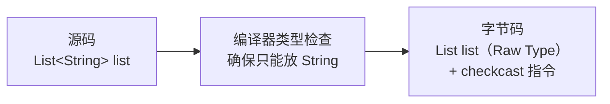
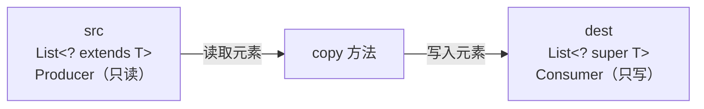
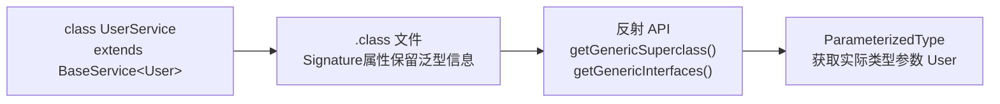
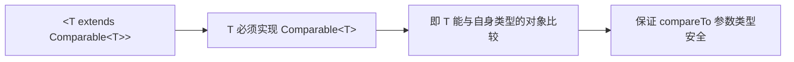

# 泛型底层原理与类型擦除

---

## 1. 为什么要理解泛型底层？

Java 泛型自 JDK 5 引入，但它是一种**编译期特性**，在运行时几乎不存在。这种设计带来了大量"反直觉"的行为：

| 现象 | 根因 |
| :---- | :---- |
| `List<String>` 和 `List<Integer>` 是同一个 Class | 类型擦除 |
| 无法创建 `new T[]` | 类型擦除导致运行时类型未知 |
| `instanceof List<String>` 编译报错 | 运行时无泛型信息 |
| Spring 能通过反射获取泛型类型 | `ParameterizedType` 保留了部分信息 |

理解类型擦除，是读懂集合框架源码、设计通用框架、排查泛型编译错误的基础。

---

## 2. 类型擦除（Type Erasure）

### 2.1 擦除规则

Java 泛型在**编译阶段**完成类型检查后，编译器会将所有泛型类型参数擦除：

- 无界类型参数 `<T>` → 擦除为 `Object`
- 有界类型参数 `<T extends Comparable<T>>` → 擦除为上界 `Comparable`
- 通配符 `<?>` → 擦除为 `Object`



### 2.2 字节码证明

用一个简单示例，通过 `javap` 反编译来直观验证擦除：

```java
import java.util.ArrayList;
import java.util.List;

public class GenericDemo {
    public static void main(String[] args) {
        List<String> list = new ArrayList<>();
        list.add("hello");
        String s = list.get(0);  // 编译器自动插入 checkcast
    }
}
```

编译后执行 `javap -c GenericDemo`，关键字节码如下：

```txt
// list.add("hello")
invokevirtual #4  // Method java/util/ArrayList.add:(Ljava/lang/Object;)Z

// String s = list.get(0)
invokevirtual #5  // Method java/util/ArrayList.get:(I)Ljava/lang/Object;
checkcast     #6  // class java/lang/String   ← 编译器自动插入的强转
```

可以看到：

- `add` 方法接收的是 `Object`，而非 `String`
- `get` 方法返回的是 `Object`，编译器自动插入了 `checkcast` 强转为 `String`

这就是类型擦除的本质：**泛型只在编译期存在，运行时全部退化为原始类型**。

### 2.3 桥接方法（Bridge Method）

类型擦除会引发一个问题：子类重写泛型父类方法时，签名不一致。编译器会自动生成**桥接方法**来解决：

```java
class StringBox implements Box<String> {
    @Override
    public void set(String value) { ... }
}
```

擦除后 `Box<String>` 变为 `Box`，其 `set(Object)` 方法与子类的 `set(String)` 签名不同。编译器自动生成：

```java
// 编译器自动生成的桥接方法（对开发者不可见）
public void set(Object value) {
    set((String) value);  // 调用真正的实现
}
```

!!! note "桥接方法的影响"
    通过反射获取方法时，`getDeclaredMethods()` 会返回桥接方法。可通过 `method.isBridge()` 过滤。

---

## 3. 通配符与 PECS 原则

### 3.1 上界通配符 `? extends T`

```java
// 只能读取，不能写入（除了 null）
List<? extends Number> numbers = new ArrayList<Integer>();
Number n = numbers.get(0);   // ✅ 安全：返回值至少是 Number
numbers.add(1);              // ❌ 编译错误：不知道具体是 Integer 还是 Double
```

**为什么不能写入？** 因为 `? extends Number` 可能是 `List<Integer>`，也可能是 `List<Double>`，向其中写入 `Double` 可能破坏 `List<Integer>` 的类型安全。

### 3.2 下界通配符 `? super T`

```java
// 可以写入 T 及其子类，读取只能得到 Object
List<? super Integer> ints = new ArrayList<Number>();
ints.add(1);                     // ✅ 安全：Integer 是 Integer 的子类
ints.add(Integer.valueOf(2));    // ✅ 安全（new Integer(int) 自 JDK 9 已弃用，改用 valueOf）
Object obj = ints.get(0);       // ⚠️ 只能用 Object 接收
```

### 3.3 PECS 原则

**PECS = Producer Extends, Consumer Super**，由 Joshua Bloch 在《Effective Java》中提出：

| 角色 | 通配符 | 说明 |
| :---- | :---- | :---- |
| **Producer**（数据来源，只读） | `? extends T` | 从集合中**读取**数据 |
| **Consumer**（数据消费，只写） | `? super T` | 向集合中**写入**数据 |

```java
// 经典示例：Collections.copy 源码
public static <T> void copy(List<? super T> dest,    // Consumer：写入
                             List<? extends T> src) { // Producer：读取
    for (T t : src) {
        dest.add(t);
    }
}
```



!!! tip "记忆技巧"
    - `extends`：上界，像漏斗**出口**，数据只能流出（读）
    - `super`：下界，像漏斗**入口**，数据只能流入（写）

---

## 4. 泛型与反射：运行时获取泛型类型

### 4.1 为什么反射能获取泛型？

虽然类型擦除会抹去运行时的泛型信息，但有一个例外：**类、方法、字段的声明中的泛型信息会保留在 `.class` 文件的 `Signature` 属性中**，可通过反射 API 读取。

> 📌 **保留范围**：类声明、类成员（方法签名 / 返回值 / 参数 / 字段）的泛型信息均保留；**局部变量的泛型信息不保留**（因为局部变量在字节码中只有擦除后的类型），这也是为什么 `new BaseRepository<User>(){}` 匹配匹配等技巧要用 **匿名子类** 而不能仍是普通变量。



### 4.2 通过 `ParameterizedType` 获取泛型参数

```java
import java.lang.reflect.ParameterizedType;
import java.lang.reflect.Type;

// 基类：持有泛型参数
abstract class BaseRepository<T> {
    // 在构造器中获取泛型实际类型
    protected Class<T> entityClass;

    @SuppressWarnings("unchecked")
    public BaseRepository() {
        // getGenericSuperclass() 返回带泛型的父类类型
        Type superClass = getClass().getGenericSuperclass();
        if (superClass instanceof ParameterizedType pt) {
            // getActualTypeArguments()[0] 获取第一个类型参数
            this.entityClass = (Class<T>) pt.getActualTypeArguments()[0];
        }
    }
}

// 子类：具体化泛型
class UserRepository extends BaseRepository<User> {
    // entityClass 自动为 User.class
}

// 使用
UserRepository repo = new UserRepository();
System.out.println(repo.entityClass); // class com.example.User
```

### 4.3 Spring 中的 `ResolvableType`

Spring 对 `ParameterizedType` 进行了封装，提供了更强大的 `ResolvableType`：

```java
// 获取 List<String> 中的元素类型
ResolvableType type = ResolvableType.forField(
    UserService.class.getDeclaredField("names") // private List<String> names
);
Class<?> elementType = type.getGeneric(0).resolve(); // String.class

// 获取 Map<String, List<Integer>> 的嵌套类型
ResolvableType mapType = ResolvableType.forClass(MyMap.class);
ResolvableType valueType = mapType.getGeneric(1);          // List<Integer>
Class<?> innerType = valueType.getGeneric(0).resolve();    // Integer.class
```

!!! note "Spring 事件监听的泛型匹配"
    Spring 的 `ApplicationListener<T>` 就是利用 `ResolvableType` 在运行时匹配事件类型，实现泛型感知的事件分发。

---

## 5. 常见泛型陷阱

!!! warning "以下是开发中最容易踩坑的泛型限制，务必牢记"

### 5.1 不能创建泛型数组

```java
// ❌ 编译错误：Generic array creation
List<String>[] arr = new ArrayList<String>[10];

// ✅ 替代方案 1：使用原始类型（需要强转）
@SuppressWarnings("unchecked")
List<String>[] arr = new ArrayList[10];

// ✅ 替代方案 2：使用 List<List<String>>
List<List<String>> list = new ArrayList<>();
```

**根本原因**：数组是协变的（`String[]` 是 `Object[]` 的子类），而泛型是不变的。如果允许泛型数组，会破坏类型安全：

```java
// 假设允许泛型数组（实际不允许）
List<String>[] arr = new ArrayList<String>[1];
Object[] objArr = arr;          // 数组协变，合法
objArr[0] = new ArrayList<Integer>(); // 运行时不报错（类型擦除）
String s = arr[0].get(0);       // 运行时 ClassCastException！
```

### 5.2 泛型类不能用 `instanceof` 判断

```java
List<String> list = new ArrayList<>();

// ❌ 编译错误：Cannot perform instanceof check against parameterized type
if (list instanceof List<String>) { }

// ✅ 只能判断原始类型
if (list instanceof List<?>) { }
if (list instanceof List) { }
```

### 5.3 静态方法/静态字段不能使用类的泛型参数

```java
class Box<T> {
    private T value;

    // ❌ 编译错误：Cannot make a static reference to the non-static type T
    private static T defaultValue;
    public static T getDefault() { return null; }

    // ✅ 静态泛型方法需要单独声明类型参数
    public static <E> E identity(E e) { return e; }
}
```

**根本原因**：类的泛型参数属于实例级别，而静态成员属于类级别，两者生命周期不同。

### 5.4 泛型类型不能直接实例化

```java
class Factory<T> {
    // ❌ 编译错误：Type parameter 'T' cannot be instantiated directly
    public T create() {
        return new T();
    }

    // ✅ 通过 Class<T> 反射创建
    public T create(Class<T> clazz) throws Exception {
        return clazz.getDeclaredConstructor().newInstance();
    }

    // ✅ 通过 Supplier<T> 函数式接口创建
    public T create(Supplier<T> supplier) {
        return supplier.get();
    }
}
```

---

## 6. 泛型边界

### 6.1 有界类型参数

```java
// 限制 T 必须实现 Comparable，才能进行比较
public <T extends Comparable<T>> T max(T a, T b) {
    return a.compareTo(b) > 0 ? a : b;
}

// 使用
max(1, 2);       // ✅ Integer 实现了 Comparable<Integer>
max("a", "b");   // ✅ String 实现了 Comparable<String>
```

### 6.2 多重边界

```java
// T 必须同时继承 Animal 并实现 Serializable 和 Cloneable
// 注意：类必须放在接口之前
public <T extends Animal & Serializable & Cloneable> void process(T t) {
    // 可以调用 Animal 的方法
    // 可以序列化
    // 可以克隆
}
```

!!! warning "多重边界的限制"
    多重边界中**最多只能有一个类**（因为 Java 单继承），其余必须是接口，且类必须写在最前面。

### 6.3 递归类型边界

```java
// 经典的递归类型边界：确保 T 能与自身比较
public <T extends Comparable<T>> void sort(List<T> list) {
    Collections.sort(list);
}

// Java 枚举的定义就使用了递归类型边界
public abstract class Enum<E extends Enum<E>> implements Comparable<E> { }
```



---

## 7. 总结

```txt
┌─────────────────────────────────────────────────────────────────┐
│                      Java 泛型知识体系                           │
├─────────────────┬───────────────────────────────────────────────┤
│  类型擦除        │ 编译后泛型参数消失，退化为 Object 或上界       │
│                 │ 编译器自动插入 checkcast 保证类型安全           │
├─────────────────┼───────────────────────────────────────────────┤
│  通配符 PECS    │ ? extends T → Producer（只读）                 │
│                 │ ? super T   → Consumer（只写）                 │
├─────────────────┼───────────────────────────────────────────────┤
│  运行时泛型      │ Signature 属性保留声明处泛型信息               │
│                 │ ParameterizedType / ResolvableType 可读取      │
├─────────────────┼───────────────────────────────────────────────┤
│  常见陷阱        │ 不能创建泛型数组                               │
│                 │ 不能 instanceof 泛型类型                       │
│                 │ 静态成员不能用类的泛型参数                      │
│                 │ 不能直接 new T()                               │
├─────────────────┼───────────────────────────────────────────────┤
│  泛型边界        │ <T extends A & B> 多重边界（类在前，接口在后） │
│                 │ <T extends Comparable<T>> 递归类型边界         │
└─────────────────┴───────────────────────────────────────────────┘
```

!!! tip "与集合框架的关联"
    理解了 PECS 原则，就能读懂 `Collections.copy`、`Collections.addAll` 等工具方法的签名设计。集合框架中大量使用了 `? extends E` 和 `? super E`，都遵循 PECS 原则。
