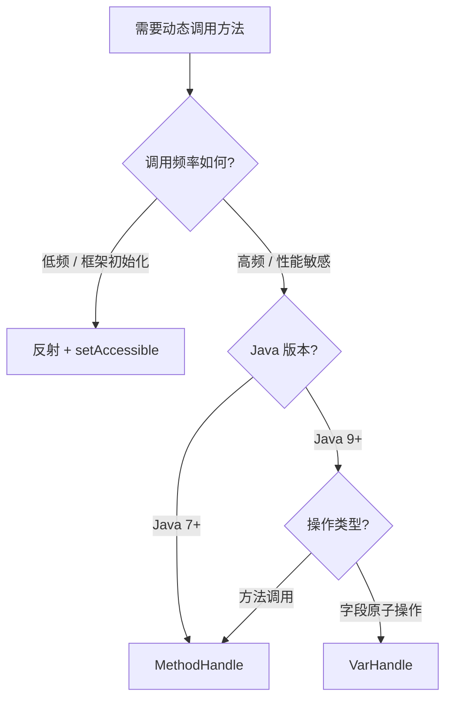

# 反射性能底层原理与 MethodHandle

> **一句话记忆口诀**：反射慢在安全检查 + 无法 JIT 内联 + 参数装箱；`MethodHandle` 可被 JIT 内联性能接近直接调用；`VarHandle` 替代 `Unsafe` 做字段原子操作；动态代理慢在字节码生成，运行时调用走 `InvocationHandler` 反射链。

---

## 1. 引入：反射为什么慢？

反射是 Java 框架的基石——Spring IoC、MyBatis、Jackson 无不依赖反射。但反射调用比直接调用慢，这是面试高频问题，也是框架设计中必须权衡的核心问题。

### 工作中的典型场景

| 场景 | 反射的使用方式 |
|------|--------------|
| Spring IoC 容器 | 反射实例化 Bean、注入依赖 |
| Jackson/Gson 序列化 | 反射读写字段值 |
| MyBatis ResultMap | 反射调用 setter 填充结果集 |
| JUnit 测试框架 | 反射调用测试方法 |
| RPC 框架（Dubbo） | 反射调用服务实现方法 |

---

## 2. 反射性能开销的底层原因

### 2.1 原因一：JVM 无法对反射调用进行 JIT 内联

直接方法调用在 JIT 编译后会被**内联（inline）**——即把被调用方法的字节码直接嵌入调用处，消除方法调用开销。

```txt
// 直接调用 —— JIT 可内联
obj.hello()
  ↓ JIT 内联后
// "hello" 方法体直接展开在调用处，无跳转开销

// 反射调用 —— JIT 无法内联
method.invoke(obj, args)
  ↓ 实际执行链
Method.invoke()
  → DelegatingMethodAccessorImpl.invoke()
    → NativeMethodAccessorImpl.invoke()  // 前15次：JNI 本地调用
      → (第16次起) GeneratedMethodAccessorXXX.invoke()  // 字节码生成的访问器
```

反射调用经过多层委托，JIT 难以追踪真实调用目标，**无法做内联优化**，每次调用都有额外的方法分派开销。

!!! note "膨胀阈值（inflation threshold）"
    JVM 对反射调用有一个优化：前 **15 次**通过 JNI 本地方法调用（慢），第 **16 次**起自动生成专用的字节码访问器（`GeneratedMethodAccessorXXX`），速度大幅提升。可通过 `-Dsun.reflect.inflationThreshold=0` 强制跳过 JNI 阶段。

### 2.2 原因二：每次调用都需要安全权限检查

```java
// Method.invoke() 源码（简化）
public Object invoke(Object obj, Object... args) {
    // ① 每次调用都检查访问权限
    if (!override) {
        // 检查调用方是否有权限访问该方法
        // 涉及 Class 的 checkAccess，走 AccessController 安全栈遍历
        checkAccess(Reflection.getCallerClass(), ...);
    }
    return methodAccessor.invoke(obj, args);
}
```

`checkAccess` 需要遍历调用栈来确定调用方的 `Class`，这是一个相对昂贵的操作。

**`setAccessible(true)` 的作用**：将 `override` 标志设为 `true`，跳过上述权限检查，是反射性能优化的第一步。

```java
Method method = MyClass.class.getDeclaredMethod("privateMethod");
method.setAccessible(true); // 跳过权限检查，性能提升约 20%~50%
method.invoke(obj);
```

!!! warning "Java 9 模块系统的限制"
    Java 9 引入 JPMS（模块系统）后，`setAccessible(true)` 对**跨模块**的访问受到限制。若目标类在未开放的模块中，会抛出 `InaccessibleObjectException`。

    解决方案：在 JVM 启动参数中添加：
    ```bash
    --add-opens java.base/java.lang=ALL-UNNAMED
    ```
    或在模块描述符 `module-info.java` 中声明 `opens` 指令。

### 2.3 原因三：参数装箱为 `Object[]` 导致额外堆分配

```java
// 直接调用 —— 无装箱
obj.add(1, 2);  // int 直接传递，栈上操作

// 反射调用 —— 必须装箱
method.invoke(obj, new Object[]{1, 2});
//                  ↑ 创建 Object 数组
//                  ↑ int 自动装箱为 Integer
// 每次调用都产生额外的堆对象，增加 GC 压力
```

### 2.4 JMH 基准测试数据

```txt
Benchmark                          Mode  Cnt    Score    Error  Units
DirectCall.direct                  avgt   10    1.2 ±  0.1  ns/op
ReflectionBenchmark.withAccessible avgt   10   18.5 ±  0.5  ns/op
ReflectionBenchmark.noAccessible   avgt   10   35.2 ±  1.2  ns/op
MethodHandleBenchmark.mh           avgt   10    2.1 ±  0.1  ns/op
```

!!! tip "结论"
    - 直接调用：~1 ns（基准）
    - `MethodHandle`：~2 ns（接近直接调用，可被 JIT 内联）
    - 反射 + `setAccessible(true)`：~18 ns（约慢 15 倍）
    - 反射（无 `setAccessible`）：~35 ns（约慢 30 倍）

---

## 3. MethodHandle：反射的高性能替代（Java 7+）

### 3.1 什么是 MethodHandle？

`MethodHandle` 是 Java 7 引入的**类型安全的方法引用**，本质上是一个指向方法（或字段、构造器）的可执行引用。与反射不同，`MethodHandle` 的调用可以被 JIT 编译器**内联优化**，性能接近直接调用。

```txt
反射（Reflection）          MethodHandle
─────────────────          ──────────────────
运行时解析方法               编译期/运行期均可
每次调用做权限检查            权限在获取时检查一次
参数装箱为 Object[]          类型安全，无需装箱
JIT 无法内联                 JIT 可内联
适合框架初始化阶段            适合高频调用路径
```

### 3.2 核心 API

```java
import java.lang.invoke.MethodHandle;
import java.lang.invoke.MethodHandles;
import java.lang.invoke.MethodType;

public class MethodHandleDemo {

    // ===== 1. 调用实例方法（findVirtual）=====
    public static void virtualExample() throws Throwable {
        // Lookup 是获取 MethodHandle 的工厂，权限检查在此处进行（仅一次）
        MethodHandles.Lookup lookup = MethodHandles.lookup();

        // findVirtual(类, 方法名, 方法类型)
        // MethodType.methodType(返回类型, 参数类型...)
        MethodHandle mh = lookup.findVirtual(
            String.class,
            "substring",
            MethodType.methodType(String.class, int.class, int.class)
        );

        // invokeExact：严格类型匹配，性能最好
        String result = (String) mh.invokeExact("Hello, World!", 0, 5);
        System.out.println(result); // Hello
    }

    // ===== 2. 调用静态方法（findStatic）=====
    public static void staticExample() throws Throwable {
        MethodHandles.Lookup lookup = MethodHandles.lookup();

        MethodHandle mh = lookup.findStatic(
            Integer.class,
            "parseInt",
            MethodType.methodType(int.class, String.class)
        );

        int value = (int) mh.invokeExact("42");
        System.out.println(value); // 42
    }

    // ===== 3. 访问私有方法（需要 privateLookupIn，Java 9+）=====
    public static void privateExample() throws Throwable {
        // Java 9+ 推荐方式，替代 setAccessible
        MethodHandles.Lookup lookup = MethodHandles.privateLookupIn(
            MyClass.class,
            MethodHandles.lookup()
        );

        MethodHandle mh = lookup.findVirtual(
            MyClass.class,
            "privateMethod",
            MethodType.methodType(void.class)
        );

        mh.invoke(new MyClass());
    }

    // ===== 4. invoke vs invokeExact =====
    // invokeExact：严格类型匹配，性能最好，类型不匹配直接抛 WrongMethodTypeException
    // invoke：自动做类型转换（装箱/拆箱/向上转型），更灵活但略慢
}
```

### 3.3 为什么 MethodHandle 可以被 JIT 内联？

```txt
反射调用链（JIT 难以追踪）：
  method.invoke(obj, args)
    → Method.invoke()
      → DelegatingMethodAccessorImpl
        → NativeMethodAccessorImpl / GeneratedAccessorXXX
          → 真实方法（JIT 看不到这里）

MethodHandle 调用链（JIT 可追踪）：
  mh.invokeExact(obj, args)
    → JVM 内部直接分派到目标方法
      → 真实方法（JIT 可内联展开）
```

`MethodHandle` 的调用在 JVM 规范层面有专门的字节码指令（`invokedynamic`）支持，JIT 编译器能识别并内联目标方法体。

!!! tip "invokedynamic 与 Lambda"
    Java 8 的 Lambda 表达式底层也是通过 `invokedynamic` + `MethodHandle` 实现的，这也是 Lambda 调用性能接近直接调用的原因。

---

## 4. VarHandle：字段原子操作的现代方案（Java 9+）

### 4.1 背景：从 Unsafe 到 VarHandle

在 Java 9 之前，JDK 内部大量使用 `sun.misc.Unsafe` 进行字段的原子操作（CAS）。`Unsafe` 是非公开 API，存在安全风险。Java 9 引入 `VarHandle` 作为官方替代。

```txt
演进路径：
  Java 5：AtomicInteger（基于 Unsafe.compareAndSwapInt）
  Java 9：AtomicInteger（基于 VarHandle.compareAndSet）  ← 更安全、更标准
```

### 4.2 AtomicInteger 源码迁移对比

```java
// ===== JDK 8：基于 Unsafe =====
public class AtomicInteger {
    private static final Unsafe unsafe = Unsafe.getUnsafe();
    private static final long valueOffset;

    static {
        try {
            // 通过 Unsafe 获取字段的内存偏移量
            valueOffset = unsafe.objectFieldOffset(
                AtomicInteger.class.getDeclaredField("value")
            );
        } catch (Exception ex) { throw new Error(ex); }
    }

    private volatile int value;

    public final boolean compareAndSet(int expect, int update) {
        // 直接操作内存偏移量，绕过 Java 类型系统
        return unsafe.compareAndSwapInt(this, valueOffset, expect, update);
    }
}

// ===== JDK 9+：基于 VarHandle =====
public class AtomicInteger {
    // VarHandle 指向 AtomicInteger.value 字段
    private static final VarHandle VALUE;

    static {
        try {
            MethodHandles.Lookup l = MethodHandles.lookup();
            // 通过标准 API 获取字段句柄，无需内存偏移量
            VALUE = l.findVarHandle(AtomicInteger.class, "value", int.class);
        } catch (ReflectiveOperationException e) { throw new Error(e); }
    }

    private volatile int value;

    public final boolean compareAndSet(int expectedValue, int newValue) {
        // 类型安全的 CAS 操作
        return VALUE.compareAndSet(this, expectedValue, newValue);
    }
}
```

### 4.3 VarHandle 核心操作

```java
import java.lang.invoke.VarHandle;
import java.lang.invoke.MethodHandles;

public class VarHandleDemo {
    private int count = 0;
    private static final VarHandle COUNT;

    static {
        try {
            COUNT = MethodHandles.lookup()
                .findVarHandle(VarHandleDemo.class, "count", int.class);
        } catch (ReflectiveOperationException e) {
            throw new Error(e);
        }
    }

    public void demo() {
        VarHandleDemo obj = new VarHandleDemo();

        // 1. 普通读写
        COUNT.set(obj, 10);
        int val = (int) COUNT.get(obj);

        // 2. volatile 语义读写（内存屏障）
        COUNT.setVolatile(obj, 20);
        int vVal = (int) COUNT.getVolatile(obj);

        // 3. CAS 操作（原子比较并交换）
        boolean success = COUNT.compareAndSet(obj, 20, 30);

        // 4. 原子加法（getAndAdd）
        int old = (int) COUNT.getAndAdd(obj, 5);
    }
}
```

!!! note "VarHandle vs Unsafe"

    | 对比维度 | `Unsafe` | `VarHandle` |
    |---------|---------|------------|
    | API 可见性 | 非公开（`sun.misc`） | 公开标准 API |
    | 类型安全 | 否（操作内存偏移量） | 是（类型检查） |
    | 模块系统兼容 | Java 9+ 受限 | 完全兼容 |
    | 性能 | 极高 | 接近 Unsafe |
    | 推荐使用 | 不推荐（框架内部） | 推荐 |

---

## 5. 动态代理字节码生成原理（补充）

> 本节作为补充内容，聚焦于**字节码生成原理**。代理模式的使用方式详见 @dp-代理模式。

### 5.1 JDK 动态代理：ProxyGenerator 生成字节码

```txt
Proxy.newProxyInstance(loader, interfaces, handler) 执行流程：

1. 检查缓存（WeakCache）
   └─ 已生成过该接口组合的代理类？直接返回

2. ProxyGenerator.generateProxyClass()
   └─ 在内存中生成字节码（.class 文件格式）
   └─ 生成的代理类结构：
      ┌─────────────────────────────────────────┐
      │  public final class $Proxy0             │
      │      extends Proxy                      │  ← 已继承 Proxy
      │      implements OrderService {          │  ← 实现目标接口
      │                                         │
      │    // 每个接口方法都生成对应实现          │
      │    public void createOrder(Order o) {   │
      │        h.invoke(this, m1, new Object[]{o}); │
      │    }                                    │
      │  }                                      │
      └─────────────────────────────────────────┘

3. ClassLoader.defineClass() 将字节码加载到 JVM

4. 返回代理类实例
```

**为什么只能代理接口？**

```txt
Java 单继承限制：
  $Proxy0 extends Proxy  → 已占用唯一的父类位置
  无法再 extends OrderServiceImpl
  只能 implements OrderService（接口，可多实现）
```

!!! tip "查看生成的代理类字节码"
    ```java
    // Java 8：通过系统属性保存代理类到磁盘
    System.setProperty("sun.misc.ProxyGenerator.saveGeneratedFiles", "true");

    // Java 9+：
    System.setProperty("jdk.proxy.ProxyGenerator.saveGeneratedFiles", "true");
    ```

### 5.2 CGLIB：ASM 生成目标类的子类

```txt
Enhancer.create() 执行流程：

1. ASM 字节码框架读取目标类（OrderServiceImpl）的字节码

2. 生成子类字节码：
   ┌─────────────────────────────────────────────────┐
   │  public class OrderServiceImpl$$EnhancerByCGLIB │
   │      extends OrderServiceImpl {                 │  ← 继承目标类
   │                                                 │
   │    // 覆盖所有非 final 方法                      │
   │    @Override                                    │
   │    public void createOrder(Order o) {           │
   │        MethodInterceptor interceptor = ...;     │
   │        interceptor.intercept(this, method,      │
   │            new Object[]{o}, methodProxy);       │
   │    }                                            │
   │  }                                              │
   └─────────────────────────────────────────────────┘

3. 通过 ClassLoader 加载生成的子类

4. 返回子类实例（可直接赋值给 OrderServiceImpl 变量）
```

**为什么 final 类/方法无法被 CGLIB 代理？**

```txt
final 类：无法被继承 → 无法生成子类 → 代理失败
final 方法：无法被覆盖 → 子类无法拦截该方法 → 该方法的代理失效
```

!!! warning "CGLIB 的 FastClass 机制"
    CGLIB 调用父类方法时使用 `MethodProxy.invokeSuper()`，底层通过 **FastClass** 机制（为每个方法生成索引，直接通过索引调用，避免反射）实现，性能优于 JDK 动态代理的 `method.invoke()`。

### 5.3 两种动态代理性能对比

```txt
代理方式性能对比（方法调用阶段）：

  直接调用                    ████ 1x
  CGLIB（FastClass）          ████ ~1.2x
  JDK 动态代理（JDK 8+ 优化） ████ ~1.5x
  JDK 动态代理（早期版本）     ████████ ~3x

注：生成代理类的初始化开销 CGLIB > JDK 动态代理
    方法调用的运行时开销 CGLIB ≈ JDK 动态代理（JDK 8+ 后差距缩小）
```

---

## 6. 关键对比总结

### 反射 vs MethodHandle vs 直接调用

| 对比维度 | 直接调用 | 反射（`Method.invoke`） | `MethodHandle` |
|---------|---------|----------------------|----------------|
| **JIT 内联** | ✅ 支持 | ❌ 不支持 | ✅ 支持 |
| **权限检查** | 编译期 | 每次调用（可用 `setAccessible` 跳过） | 获取时检查一次 |
| **参数装箱** | 无 | 装箱为 `Object[]` | `invokeExact` 无装箱 |
| **类型安全** | 编译期 | 运行期 | 运行期（`invokeExact` 严格） |
| **相对性能** | 1x | ~15-30x 慢 | ~1.5-2x 慢 |
| **适用场景** | 普通调用 | 框架初始化、低频调用 | 高频调用、Lambda 底层 |

### 选型建议



---

## 7. 总结：面试标准化表达

### 高频问题

**Q1：反射为什么比直接调用慢？如何优化？**

> 反射慢有三个底层原因：① JVM 无法对反射调用进行 JIT 内联优化，因为调用链经过多层委托，JIT 无法追踪真实目标；② 每次调用都需要进行安全权限检查（`checkAccess`），涉及调用栈遍历；③ 参数需要装箱为 `Object[]`，产生额外堆分配和 GC 压力。优化方式：① 调用 `setAccessible(true)` 跳过权限检查；② 缓存 `Method` 对象避免重复查找；③ 高频场景改用 `MethodHandle`（可被 JIT 内联）。

**Q2：MethodHandle 和反射有什么区别？**

> `MethodHandle` 是 Java 7 引入的类型安全方法引用，与反射的核心区别在于：① `MethodHandle` 的权限检查在获取时只做一次，调用时无额外检查；② `MethodHandle` 调用可被 JIT 编译器内联，性能接近直接调用；③ `invokeExact` 无需参数装箱，类型严格匹配。反射更适合框架初始化等低频场景，`MethodHandle` 适合高频调用路径（Lambda 底层就是用 `invokedynamic` + `MethodHandle` 实现的）。

**Q3：VarHandle 是什么？为什么要替代 Unsafe？**

> `VarHandle`（Java 9+）是对变量（字段、数组元素）进行原子操作的标准 API，用于替代 `sun.misc.Unsafe`。`Unsafe` 是非公开 API，通过内存偏移量直接操作内存，绕过了 Java 类型系统，存在安全风险，且在 Java 9 模块系统下受到限制。`VarHandle` 提供了类型安全的 CAS、volatile 读写、原子加法等操作，JDK 9+ 的 `AtomicInteger` 等类已从 `Unsafe` 迁移到 `VarHandle`。

**Q4：JDK 动态代理为什么只能代理接口？**

> JDK 动态代理通过 `ProxyGenerator` 在运行时生成代理类字节码，生成的代理类结构为 `class $Proxy0 extends Proxy implements 目标接口`。由于 Java 单继承限制，代理类已经继承了 `Proxy` 类，无法再继承目标实现类，因此只能通过实现接口来代理。CGLIB 则通过 ASM 生成目标类的**子类**来实现代理，不需要接口，但 `final` 类和 `final` 方法无法被代理（无法被继承/覆盖）。

---

> **一句话记忆口诀**：反射慢在三点（无 JIT 内联、权限检查、参数装箱），`setAccessible` 解决权限检查，`MethodHandle` 解决内联问题，`VarHandle` 替代 `Unsafe` 做原子操作，JDK 代理继承 `Proxy` 所以只能代理接口，CGLIB 生成子类所以不能代理 `final`。
