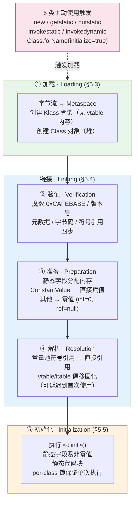
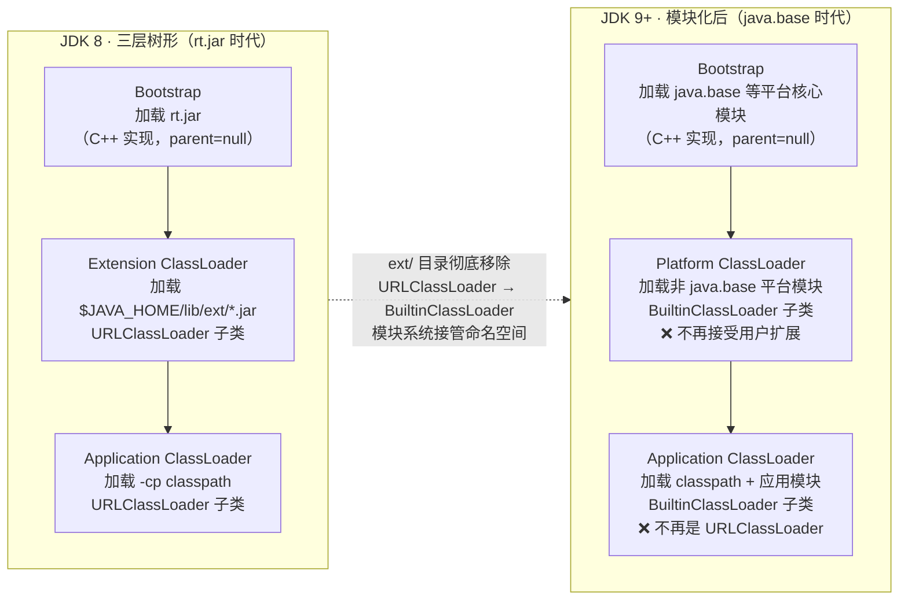

# 类加载机制与双亲委派模型 —— 五阶段字节码触发时机、`ClassLoader + 全限定名` 二元组与 JDK 9 模块化重构

!!! info "**类加载 一句话口诀**"
    - **类加载五阶段"加载 → 验证 → 准备 → 解析 → 初始化"不是概念清单，是 JVMS §5 定义的执行时序**：`加载` 由字节码指令（`new` / `getstatic` / `putstatic` / `invokestatic` / `invokedynamic` / `ldc → Class`）**被动触发**，`初始化` 由 6 条"必须立即初始化"规则触发，中间三阶段（`验证` / `准备` / `解析`）合称 `Linking`。理解这套时序才能一次性理解 `ClassNotFoundException`（加载阶段找不到 `.class` 字节流）与 `NoClassDefFoundError`（曾经加载成功但初始化时 `<clinit>` 抛异常）的本质差异。
    - **JVM 中"两个类相等"的精确定义 = `ClassLoader + 全限定名` 二元组**：同一个 `com.example.Foo` 被 `AppClassLoader` 和 `MyClassLoader` 各加载一次，在 JVM 内部就是两个独立的 `Klass`，`instanceof` 返回 `false`、`ClassCastException` 一触即发。这是"热部署换新 ClassLoader 实现类替换"与"Tomcat 多应用隔离依赖版本冲突"共享的**同一条底层机制**。
    - **双亲委派不是"继承关系"而是"组合关系 + 递归委托"**：`ClassLoader.loadClass()` 内部 `parent.loadClass()` 递归上溯，只有父加载器抛 `ClassNotFoundException` 才回落到 `findClass()`——这条递归链是"用户无法自定义 `java.lang.String` 替换核心类"的唯一硬件防线；破坏它必须**重写 `loadClass()`** 而非 `findClass()`。
    - **JDK 8 → 9 类加载器族发生了底层结构重构**：`Extension ClassLoader` 被 `Platform ClassLoader` 取代（不再接受用户扩展、`ext` 目录被移除）、`Bootstrap ClassLoader` 从加载 `rt.jar` 改为加载 `java.base` 等平台模块、`AppClassLoader` 从 `URLClassLoader` 子类改为 `BuiltinClassLoader` 子类。**升级 JDK 9+ 时读不到 `ext/` 目录扩展的类、`sun.misc.*` 类找不到，都是这次重构的直接后果**。

**你能立刻答上来吗？**

- `ClassNotFoundException` 与 `NoClassDefFoundError` 分别在类加载五阶段的**哪一阶段**抛出？实际触发点差异是什么？
- `String s = Foo.class.getName();` 会不会执行 `Foo` 的 `<clinit>()`？为什么 `Class.forName("Foo")` 会，而 `Foo.class` 语法糖不会？
- `public static final String NAME = "hello";` 能被调用方内联，`public static final Integer BOXED = Integer.valueOf(1);` 却不能——`field_info` 属性表里的**哪一个字段**决定了这条边界？
- 自定义类加载器要重写 `findClass()` 还是 `loadClass()`？为什么 Tomcat 的 `WebAppClassLoader` **必须**重写 `loadClass()`？
- 同一个 `Foo.class` 字节流被两个 `URLClassLoader` 各加载一次，`Class<Foo> a = ...; Class<Foo> b = ...;` —— `a == b` 返回什么？`a.isAssignableFrom(b)` 返回什么？`a.getSuperclass() == b.getSuperclass()` 呢？
- JDK 8 升级到 JDK 11，`getSystemClassLoader() instanceof URLClassLoader` 从 `true` 变 `false`——为什么？`ext/` 目录扩展 JAR 为什么被静默忽略？

任何一个问题让你迟疑超过 3 秒——继续读。

---

> 📖 **边界声明**：本文是**战役四 · JVM Runtime 的序章**，聚焦"字节码 → 类加载 → 方法区"这条跨战役因果链的中转站。以下主题请见对应专题：
>
> - **对象头 `Klass Pointer` 位分布 / `Klass` 元数据在 Metaspace 的完整对象布局 / `oop-Klass` 二元模型** → [12a JVM 内存分区与对象布局](@java-JVM-内存分区与对象布局)
> - **`ClassLoaderData` 作为类卸载最小单元 + 三色标记对 `Klass` 的可达性分析** → [12b GC 核心机制与收集器演进](@java-JVM-GC核心机制与收集器演进)
> - **元空间 OOM 三大根因（类加载器泄漏 / 动态代理生成 / CGLIB 未卸载）排查与调优** → [12c GC 调优实战与常见误区](@java-JVM-GC调优实战与常见误区)
> - **Hidden Class（JDK 15+）与 `Lookup.defineHiddenClass` / GraalVM AOT / 模块系统 `--add-opens`** → [12d JVM 现代实践与前沿技术](@java-JVM-现代实践与前沿技术)
> - **`invokedynamic` + `LambdaMetafactory` 触发的 Lambda 类加载完整链路** → [07 函数式编程](@java-字节码-函数式编程)
> - **反射 `Class.forName()` 与 `MethodHandles.Lookup` 触发类加载的完整调用链** → [06 反射与 MethodHandle](@java-字节码-反射与MethodHandle)
> - **APT / ASM / Byte Buddy / Javassist 编译期字节码生成的加载入口** → [03 注解](@java-字节码-注解)

---

## 1. 第一层：业务痛点 —— 从"跨 CL 类型转换失败"到"JDK 9 升级踩雷"

### 1.1 生产事故现场：热部署方案 `instanceof` 全变 `false`

某电商中台的规则引擎为了实现规则热更新，写了下面这段"看起来平淡无奇"的代码：

```java
@Service
public class RuleEngine {

    /** 上一版规则的 ClassLoader，用于旧规则实例的清理 */
    private volatile URLClassLoader currentCL;
    private volatile RuleHandler currentHandler;   // 接口引用

    /** 每次规则版本升级时调用 */
    public synchronized void reload(String jarPath) throws Exception {
        // ① 用全新的 URLClassLoader 加载新 JAR
        URLClassLoader newCL = new URLClassLoader(
                new URL[]{ new URL("file:" + jarPath) },
                getClass().getClassLoader()             // ⭐ 父加载器 = App
        );

        // ② 反射实例化新版规则实现类
        Class<?> newImpl = newCL.loadClass("com.example.rule.OrderRule");
        RuleHandler newHandler = (RuleHandler) newImpl.getDeclaredConstructor().newInstance();

        // ③ 若新旧规则是"同一种"，做增量校验
        if (currentHandler != null && currentHandler.getClass().isAssignableFrom(newImpl)) {
            log.info("规则平滑升级 · 走增量校验路径");
        } else {
            log.warn("规则大版本升级 · 走全量校验路径");   // ❌ 上线后一直走这条
        }

        // ④ 切换引用，旧 CL 等待 GC
        currentHandler = newHandler;
        currentCL = newCL;
    }
}
```

**事故现象**：每次规则升级都进"全量校验路径"——`isAssignableFrom(newImpl)` **永远返回 `false`**，即便新旧 JAR 里的 `OrderRule` 类是**逐字节相同**的字节码。

**表层归因**：`OrderRule` 类没变啊，`isAssignableFrom` 为什么不认识自己？

**根本原因**（层 3.1 完整揭开）：**JVM 中"两个类相等"的精确定义是 `ClassLoader + 全限定名` 二元组**。旧的 `URLClassLoader` 实例与新的 `URLClassLoader` 实例是两个不同对象，即便加载了同名字节流，产生的也是**方法区里两个独立的 `Klass`**。`currentHandler.getClass()` 属于旧 CL，`newImpl` 属于新 CL——JVM 眼里就是两个不同的类，`isAssignableFrom` 只查父类链，父类链走到 `OrderRule` 就已经分叉了。

### 1.2 生产事故现场：JDK 8 → 11 升级后 `sun.misc.Unsafe` 无声崩溃

同一个团队，在把服务从 JDK 8 升级到 JDK 11 的当天，日志刷屏 `NoClassDefFoundError: sun/misc/BASE64Encoder`。DBA 部门更狠——他们放在 `$JAVA_HOME/lib/ext` 下的 JCE 加密扩展 JAR **静默失效**，签名校验一直失败，直到线上告警才发现。

**表层归因**："Java 版本兼容问题，加个 `--add-opens` 就行了。"

**根本原因**（层 3.4 完整揭开）：JDK 8 → 9 的类加载器族**发生了底层结构重构**——

- `Extension ClassLoader` **被 `Platform ClassLoader` 取代**（不再接受用户扩展）
- `AppClassLoader` **从 `URLClassLoader` 子类改为 `BuiltinClassLoader` 子类**
- `Bootstrap ClassLoader` **从加载 `rt.jar` 改为加载 `java.base` 等平台模块**
- `ext/` 目录**被彻底移除**，`sun.misc.*` 默认不导出

这不是"兼容问题"，是**加载器血统全线换代**。老代码里的 `(URLClassLoader) getSystemClassLoader()` 强转、`sun.misc.Unsafe` 的直接使用、`ext/` 目录的扩展点——**每一条都踩中了这次重构的雷区**。

### 1.3 三条痛点收敛到四层结构

| 痛点 | 表象 | 根本原因 | 后续章节 |
| :-- | :-- | :-- | :-- |
| **A · `CNFE` vs `NCDFE` 傻傻分不清** | 抓到 `ClassNotFoundException` 就重试，抓到 `NoClassDefFoundError` 却重试无效 | 前者在**加载**阶段抛出（字节流找不到），后者在**初始化**阶段抛出（`<clinit>()` 内部异常导致 `Klass` 变 `errorState`） | 层 2 §1 + 层 3.2 |
| **B · `<clinit>` 死锁** | 多线程首次访问同一个类，`<clinit>` 里获取分布式锁，jstack 显示线程全部 `WAITING` 但看不到锁对象 | JVM 用 **per-class 锁**（`getClassLoadingLock(name)`）保证 `<clinit>` 单次执行；`<clinit>` 里再抢外部锁 = **双锁嵌套**，且 class 加载锁不在标准锁 dump 里 | 层 2 §3 + 层 4 红线 4 |
| **C · 破坏双亲委派该改哪里** | 复制默认 `loadClass()` 实现再"稍微改改"，结果 `findLoadedClass` 去重、per-class 锁、递归委托三层保证全部失效 | 只重写 `findClass()` 保留三层保证；显式破坏时必须**重实现**反转顺序，而非"复制粘贴微调" | 层 3.3 + 层 4 红线 1 |

---

## 2. 第二层：字节码考古 —— 6 类触发指令、`<clinit>` 合成规则与 `defineClass` 唯一入口

> ⭐ **本层特殊说明**：类加载篇的"字节码考古"聚焦**触发类加载的 6 类字节码指令 + `<clinit>` 合成规则 + `defineClass` 唯一入口**，是"字节码 → 类加载 → JVM 内存"跨战役因果链的关键中转站。所有战役一（字节码考古）埋下的伏笔——`invokestatic` 触发静态方法调用类、`invokedynamic` 触发 CallSite 类加载、`ldc → Class` 的"轻触"性质——都在本层收敛。

### 2.1 主考古样本一：触发类加载的 6 类字节码指令

JVMS §5.5 定义"必须立即初始化"的 6 个时机，实质是 **5 类字节码指令 + 1 类反射调用**：

```volt
new #<Class Foo>              → 触发 Foo 的加载 + 初始化    ← 新建实例
getstatic #<Foo.field>        → 触发 Foo 的加载 + 初始化    ← 读静态字段
putstatic #<Foo.field>        → 触发 Foo 的加载 + 初始化    ← 写静态字段
invokestatic #<Foo.method>    → 触发 Foo 的加载 + 初始化    ← 调用静态方法
invokedynamic #<BSM>          → 触发 CallSite 目标类加载 + 初始化  ← Lambda / StringConcat
ldc #<Class Foo>              → 只触发 Foo 的加载，不初始化 ⚠️ JDK 5+ 修订
```

**顿悟点**：

- `ldc → Class` 指令**只触发加载**，不触发初始化——这就是 `Foo.class.getName()` **不会**执行 `Foo` 的 `<clinit>()` 的根本原因；而 `Class.forName("Foo")` 会（因其 `initialize=true` 默认值走完整链路）
- `invokedynamic` 是 JDK 7 新增的第 5 类触发指令——JDK 8 的 Lambda、JDK 9 的字符串拼接、JDK 15 的 Hidden Class 都借这条指令入场
- 反射 `Class.forName(name)` 等价于 `Class.forName(name, true, currentCL)`——`initialize=true` 是常被忽略的默认参数

**辅助验证**（`-verbose:class` 打印加载事件）：

```bash
$ java -verbose:class -cp . Sample 2>&1 | grep "com.example.Foo"
[0.234s][info][class,load] com.example.Foo source: file:/.../Sample.jar
```

看到 `Loaded` 代表**加载**完成；`<clinit>` 是否执行需靠静态块打日志验证（因为 `-verbose:class` 只覆盖加载事件，不覆盖初始化事件）。

> 📖 `invoke*` 五条方法调用指令族的完整解剖详见 [01 面向对象](@java-字节码-面向对象) §"术语家族卡片：`invoke*` 家族"；本文只借用 `invokestatic` / `invokedynamic` 的"触发加载"性质。

### 2.2 主考古样本二：`ConstantValue` 属性 —— 准备阶段赋非零值的唯一硬件依据

**源码样本**：

```java
public class ConstantProbe {
    public static int value = 123;                                       // ① 准备阶段零值 → <clinit> 赋 123
    public static final int CONST = 456;                                 // ② 准备阶段直接 456（ConstantValue）
    public static final String NAME = "hello";                           // ③ 同上（编译期常量）
    public static final Integer BOXED = Integer.valueOf(789);            // ④ 涉及方法调用 → 走 <clinit>
    public static final long BIG = System.currentTimeMillis();           // ⑤ 非编译期常量 → 走 <clinit>
}
```

**对应字节码的 `field_info` 属性表切片**：

```volt
public static int value;
  descriptor: I
  flags: (0x0009) ACC_PUBLIC, ACC_STATIC

public static final int CONST;
  descriptor: I
  flags: (0x0019) ACC_PUBLIC, ACC_STATIC, ACC_FINAL
  ConstantValue: int 456                    ← ⭐ 关键：编译期就固化到属性表

public static final java.lang.String NAME;
  descriptor: Ljava/lang/String;
  flags: (0x0019) ACC_PUBLIC, ACC_STATIC, ACC_FINAL
  ConstantValue: String hello               ← ⭐ 同上

public static final java.lang.Integer BOXED;
  descriptor: Ljava/lang/Integer;
  flags: (0x0019) ACC_PUBLIC, ACC_STATIC, ACC_FINAL
  // ❌ 无 ConstantValue 属性 → 值走 <clinit> 里的 putstatic

public static final long BIG;
  descriptor: J
  flags: (0x0019) ACC_PUBLIC, ACC_STATIC, ACC_FINAL
  // ❌ 无 ConstantValue 属性
```

**顿悟三条**：

1. `field_info.attributes` 里的 `ConstantValue` 属性是**准备阶段赋非零值**的**唯一硬件依据**（JVMS §4.7.2）
2. 仅 **8 种基本类型 + `String`** 的 `final static` 字面量能产生 `ConstantValue`——`Integer` 装箱、`enum`、`new Foo()` 全部走 `<clinit>` 路径
3. 因为 `NAME` 有 `ConstantValue`，调用方 `getstatic ConstantProbe.NAME` 在编译期被**直接内联**为 `ldc "hello"`——**这就是"改了常量值不重编译调用方，值不会变"的根本原因**

**反问自检**：为什么 `switch(String)` 只能用 `final static` 字符串常量做 `case`？→ 因为 `case` 标签必须在编译期确定，`ConstantValue` 属性是唯一能让常量"编译期可见"的底层载体。

### 2.3 主考古样本三：`<clinit>()` 方法的编译器合成规则

**源码样本**：

```java
public class ClinitProbe {
    static int a = 10;                     // ① 静态变量赋值
    static int b;
    static {                               // ② 静态代码块
        b = a * 2;
        System.out.println("clinit");
    }
    static final int C = compute();        // ③ 非编译期常量 → 进 <clinit>
    static int compute() { return 42; }
}
```

**对应 `<clinit>()` 的字节码**（`javap -c -v ClinitProbe.class`）：

```volt
static {};
  descriptor: ()V
  flags: (0x0008) ACC_STATIC              ← ⭐ 编译器合成方法，唯一标志
  Code:
     0: bipush        10
     2: putstatic     #2   // static int a = 10
     5: getstatic     #2
     8: iconst_2
     9: imul
    10: putstatic     #4   // static int b = a * 2
    13: getstatic     #5   // System.out
    16: ldc           #6   // "clinit"
    18: invokevirtual #7   // println
    21: invokestatic  #8   // compute()
    24: putstatic     #9   // static final int C = compute()
    27: return
```

**顿悟三条**：

1. `<clinit>()` 是**编译器合成方法**，`ACC_STATIC` 标志，与 `<init>()`（实例构造方法）并列——但**只此一个**（无重载），因为静态代码块和静态字段赋值会被**合并到同一个** `<clinit>()`
2. 合并顺序 = **源码书写顺序**——静态字段赋值和静态代码块交错时，字节码里也按同样顺序生成 `putstatic` 与代码块指令
3. `<clinit>()` 的**多线程单次执行**由 JVM 保证：JDK 6 之前是 `synchronized(this)` 的全局锁，JDK 7 起改为 `ClassLoader.getClassLoadingLock(name)` 的 **per-class 锁**——不同类的 `<clinit>` 可以并发，同一类的 `<clinit>` 只执行一次

**顿悟金句**：静态内部类单例模式（Bill Pugh Singleton）的线程安全，根源不在 `synchronized` 也不在 `volatile`，而在 `<clinit>()` 的 JVM 契约——JVM 保证每个类的 `<clinit>` 在多线程首次访问时**只执行一次**，且执行完成前其他线程阻塞在 per-class 锁上。

```java
public class Singleton {
    private Singleton() {}

    // ⭐ Holder 类只在首次访问 INSTANCE 时才加载 → 触发 <clinit> → JVM 保证单次执行
    private static class Holder {
        static final Singleton INSTANCE = new Singleton();
    }

    public static Singleton getInstance() {
        return Holder.INSTANCE;   // 首次访问触发 Holder 加载 + 初始化
    }
}
```

### 2.4 主考古样本四：`defineClass` —— 字节流 → `Klass` 的绝对唯一入口

**唯一入口**：`ClassLoader.defineClass(name, byte[], off, len)` 是 JVM 里**所有**类加载路径的最终收敛点：

```txt
应用层入口（4 条并列路径）                             最终收敛点
─────────────────────────────                    ─────────────────
  new URLClassLoader.loadClass()          ┐
  ClassLoader.findClass() → defineClass() │
  Unsafe.defineAnonymousClass()（≤ JDK 14）├──→ native defineClass1()
  Lookup.defineHiddenClass()（JDK 15+）    │      │
  ASM ClassWriter.toByteArray() + ...    ─┘      │
                                                  ▼
                              SystemDictionary::resolve_or_null()
                                                  ↓
                              ClassFileParser::parseClassFile()   ← 字节流 → Klass 骨架
                                                  ↓
                              InstanceKlass::allocate_instance()  ← Metaspace 分配
                                                  ↓
                              加入 ClassLoaderData 的 klass 链表    ← 归属确定
```

**顿悟点**：无论是编译产物 `.class` 文件、Lambda 生成的 `LambdaProbe$$Lambda$1`、还是 ASM 运行时织入的字节码，**最终都要走 `defineClass` 才能进入方法区**——这是 JIT 与 AOT 无法绕过的"字节流 → JVM 类型系统"内存边界。

> 📖 `invokedynamic` + `LambdaMetafactory` 触发的 Hidden Class 加载完整链路详见 [07 函数式编程](@java-字节码-函数式编程) §"`invokedynamic` 引导链路"；`Lookup.defineHiddenClass` 的现代实践详见 [12d JVM 现代实践](@java-JVM-现代实践与前沿技术) §"Hidden Class"。

---

## 3. 第三层：内存布局 —— `Klass` / `ClassLoader` / `ClassLoaderData` 三元关系

### 3.1 `Klass` / `ClassLoader` / `ClassLoaderData` 三元强引用机制图

```txt
Metaspace（方法区）                                       Heap（Java 堆）
════════════════════════════════════════════       ══════════════════════════
┌────────────────────────────────────────────┐       ┌───────────────────────┐
│ ClassLoaderData（AppClassLoader 的 CLD 单元）│       │ AppClassLoader oop    │
│                                            │       │ ├── parent → Platform │
│  ┌──────────────────────────────────┐      │       │ ├── classes: Vector<> │
│  │ InstanceKlass* [com.example.Foo] │◄─────┼───┐   │ └── ...               │
│  │  ├── vtable                       │      │   │   └───────────────────────┘
│  │  ├── itable                       │      │   │            ▲
│  │  ├── ConstantPool*                │      │   │            │ classLoader 字段
│  │  ├── methods[]                    │      │   │            │
│  │  ├── java_mirror ─────────────────┼──┐   │   │   ┌────────┴──────────────┐
│  │  └── class_loader_data → CLD ─────┼──┼───┘   └───┤ Class<Foo> oop（堆）  │
│  └──────────────────────────────────┘  │           │ ├── klass → Klass ────┼──┐
│                                        │           │ ├── classLoader ──────┼──┤
│  ┌──────────────────────────────────┐  │           │ ├── name = "Foo"     │  │
│  │ InstanceKlass* [com.example.Bar] │  │           │ └── ...               │  │
│  └──────────────────────────────────┘  │           └───────────────────────┘  │
│                                        │                                       │
└────────────────────────────────────────┼───────────────────────────────────────┘
                                         │  ⭐ 相互强引用：
                                         │     Klass → java_mirror → Class<Foo>
                                         └──  Class<Foo> → classLoader → CL
                                             CL → classes Vector → Class<Foo>
                                             Klass → class_loader_data → CLD
                                             CLD → 反向持有该 CLD 内所有 Klass
```

**顿悟三条**：

1. **`Klass` 与 `ClassLoader` 相互强引用**——`Klass.java_mirror` 指向堆中 `Class<Foo>` 对象；`Class<Foo>.classLoader` 字段指回 `AppClassLoader`；`AppClassLoader.classes` 反向持有已加载类列表。**只要 `ClassLoader` 对象不被 GC，它加载的所有 `Klass` 都无法卸载**——这是"热部署必须换新 CL 实例，旧实例断开引用后类才会真正卸载"的**硬性必要条件**
2. **`ClassLoaderData`（CLD）是 GC 卸载类的最小单元**——整体回收 / 整体保留，不存在"卸载 CLD 里一部分类"的操作。这就是元空间 OOM 排查时"泄漏一个类加载器 = 泄漏它加载的整个类树"的根本原因
3. **同一个 `Foo.class` 字节流被两个 CL 各调用一次 `defineClass()`**，产生**两个独立的 `Klass`**——方法区两份元数据、堆里两个 `Class<Foo>` 镜像、`Foo == Foo` 返回 `false`。这**闭环了 §1.1 的热部署事故**：`isAssignableFrom` 只查父类链，父类链走到 `OrderRule` 就已经分叉了两条独立的 `Klass` 血脉

> 📖 `Klass` 骨架在 Metaspace 里的完整字段布局（`ConstantPool` / `Method` / `vtable` / `itable` 各字段偏移）详见 [12a JVM 内存分区与对象布局](@java-JVM-内存分区与对象布局) §"元空间对象布局"；`ClassLoaderData` 与 GC 可达性分析详见 [12b GC 核心机制](@java-JVM-GC核心机制与收集器演进) §"类卸载与 CLD 回收"。

### 3.2 类加载五阶段与内存状态跃迁



**四条硬件事实**：

1. **`Klass` 骨架在加载阶段就已创建**（无字段值、无 vtable 内容）——这就是 `Class.forName("Foo", false, loader)` 第二个参数 `initialize=false` 能"只加载不初始化"的硬件依据
2. **准备阶段的零值 vs 初始化阶段的赋值**是两个执行时刻：`public static int v = 123;` 在**准备阶段**是 `0`（内存槽位分配 + 零值填充），在 **`<clinit>` 里被 `putstatic` 赋为 `123`**
3. **验证阶段**分四步——文件格式验证（魔数 / 版本号）、元数据验证（是否有父类 / 是否实现接口 SAM）、字节码验证（`StackMapTable` 帮忙加速）、符号引用验证（引用的类 / 方法是否存在）
4. **解析阶段**决定"方法调用点是否走 `vtable` 索引"——解析后 `invokevirtual` 才能拿到 `vtable` 偏移；未解析时走符号查找（延迟到运行时）

### 3.3 双亲委派递归调用链的底层路径

**`ClassLoader.loadClass(name, resolve)` 完整源码链路**：

```txt
AppClassLoader.loadClass("com.example.Foo")
  │
  └── ClassLoader.loadClass(name, false)             ← ⭐ 从 App 开始
        ├── synchronized(getClassLoadingLock(name))   ← 【保证 1】per-class 锁
        │
        ├── findLoadedClass(name)                     ← 【保证 2】本 CLD 已加载？
        │   └── if (loadedClass != null) return       ← 命中 → 直接返回
        │
        ├── if (parent != null) {                     ← 【保证 3】递归上溯
        │     parent.loadClass(name, false)           ←   ↓
        │       └── PlatformClassLoader.loadClass(...)
        │             ├── findLoadedClass()
        │             ├── parent.loadClass(...)       ←   ↓
        │             │     └── Bootstrap (parent == null)
        │             │           └── findBootstrapClassOrNull()
        │             │                 └── 返回 null（Bootstrap 无此类）
        │             └── findClass()                 ← Platform 兜底
        │                   └── 返回 null（Platform 无此类）
        │   } else {
        │     findBootstrapClassOrNull(name)
        │   }
        │
        └── findClass()                               ← App 兜底加载
              └── defineClass()                       ← 字节流 → Klass
```

**顿悟四条**：

1. 递归调用链是**深度优先向上遍历**——"父加载器优先"是**递归返回顺序**的自然结果，不是 `if (parent != null) parent.load; else self.load;` 这种直觉理解
2. **`findLoadedClass()` 每层都要检查一次**——这是"同一个类不会被同一 CLD 加载两次"的硬件保证，也是"重写 `findClass()` 保留双亲委派"的底层基础
3. **每层加锁的锁对象是 per-class 的**（`getClassLoadingLock(name)`）——JDK 7 起的关键性能优化，让不同类的加载可以完全并发（例如两个线程分别首次访问 `Foo` 和 `Bar` 不会互相阻塞）
4. **两条常见破坏点**：
    - **破坏点 A**：`WebAppClassLoader` **重写 `loadClass()`** 反转顺序（先 `findClass` 再委托父）——目的是 Web 应用可以带自己版本的库覆盖容器同名库
    - **破坏点 B**：`Thread.currentThread().setContextClassLoader()` 让 Bootstrap 加载的代码能**反向调用** App 加载器——SPI (`ServiceLoader`)、JDBC 驱动、JNDI 都靠这条

### 3.4 JDK 8 → 9 类加载器族底层重构对比



**JDK 8 → 9 三条硬变更**：

| 变更点 | JDK 8 | JDK 9+ | 后果 |
| :-- | :-- | :-- | :-- |
| **中层加载器名称** | `Extension ClassLoader` | `Platform ClassLoader` | `getSystemClassLoader().getParent()` 类型变了 |
| **中层加载器父类** | `URLClassLoader` | `BuiltinClassLoader`（模块感知） | `ext/` 目录不再被扫描，用户扩展入口关闭 |
| **App 加载器父类** | `URLClassLoader` | `BuiltinClassLoader` | `(URLClassLoader) getSystemClassLoader()` 强转崩溃 |

**这就是 §1.2 事故的完整根本原因**——Spring Boot 早期版本（2.0 前）在 `LaunchedURLClassLoader` 初始化时依赖 `(URLClassLoader) parent`，升级 JDK 9+ 后直接 `ClassCastException`。修复方案是把强转改为 `MethodHandles.Lookup` 反射调用 `URLClassLoader::getURLs`（或走模块化 API `ModuleLayer::configuration`）。

### 3.5 术语家族卡片：`ClassLoader` 类加载器族

!!! note "📖 术语家族：`ClassLoader` 类加载器族"
    **字面义**：`Class + Loader` = "加载 `.class` 字节流并生成 `Klass` 的执行单元"

    **在 JVM 中的含义**：JVM 中所有类的加载路径必须以某个 `ClassLoader` 实例为入口，该实例与其加载的 `Klass` 共同构成 `ClassLoaderData` 单元；`ClassLoader + 全限定名` 二元组是 JVM 判定"两个类是否相等"的唯一硬件依据。

    **家族成员**：

    | 成员 | 层级 | JDK 8 实现 | JDK 9+ 实现 | 加载范围 |
    | :-- | :-- | :-- | :-- | :-- |
    | `Bootstrap ClassLoader` | 顶层 | C++ 实现（`null`） | C++ 实现（`null`） | `rt.jar` → `java.base` 等平台模块 |
    | `Extension ClassLoader` | 中层 | `URLClassLoader` 子类 | ❌ 已移除 | `$JAVA_HOME/lib/ext` |
    | `Platform ClassLoader` | 中层 | ❌ 不存在 | `BuiltinClassLoader` 子类 | 非 `java.base` 平台模块 |
    | `Application ClassLoader` | 底层 | `URLClassLoader` 子类 | `BuiltinClassLoader` 子类 | classpath + 应用模块 |
    | `URLClassLoader` | 用户扩展 | JDK 内置通用扩展 | 同 | 从 URL 数组加载（JAR / 目录） |
    | `WebAppClassLoader` | Tomcat 扩展 | 破坏委派：优先自加载 | 同 | `WEB-INF/classes` + `WEB-INF/lib` |
    | `LaunchedURLClassLoader` | Spring Boot | Fat JAR 内嵌 JAR 加载 | 同 | `BOOT-INF/lib`（嵌套 JAR） |

    **命名规律**：`<载体前缀><ClassLoader>`——`Bootstrap`（启动）、`Platform`（平台）、`Application`（应用）、`URL`（通用 URL）、`WebApp`（Web 应用）；每个都必须能通过 `defineClass()` 生成 `Klass`。

    **易混点**：`Extension ClassLoader` 与 `Platform ClassLoader` **不是简单改名**——前者是 `URLClassLoader` 子类且加载 `ext/` 目录，后者是 `BuiltinClassLoader` 子类且**不接受用户扩展**。底层职责变了、父类变了、加载范围变了——是**血统换代**而非"改名"。

### 3.6 术语家族卡片：类加载五阶段族

!!! note "📖 术语家族：类加载五阶段族"
    **字面义**：`Loading / Verification / Preparation / Resolution / Initialization`——JVM 规范定义的类从字节流到可用的必经五阶段

    **在 JVMS §5 中的含义**：类加载不是"一个动作"，是**五个可观测的执行阶段**，每个阶段有独立触发时机、独立异常类型、独立可延迟策略。

    **家族成员**：

    | 阶段 | JVMS 章节 | 触发时机 | 关键动作 | 底层产物 | 异常类型 |
    | :-- | :-- | :-- | :-- | :-- | :-- |
    | 加载 Loading | §5.3 | 6 类字节码指令 / 反射 | 字节流 → Metaspace，创建 `Klass` 骨架 + `Class` 对象 | `Klass` 骨架 | `ClassNotFoundException` |
    | 验证 Verification | §5.4.1 | 加载后立即执行 | 魔数 / 版本号 / 元数据 / 字节码 / 符号引用 | 通过验证的 `Klass` | `VerifyError` / `ClassFormatError` |
    | 准备 Preparation | §5.4.2 | 验证后 | 静态字段分配内存 + 零值 / `ConstantValue` 提前赋值 | 静态字段内存槽位 | `OutOfMemoryError` |
    | 解析 Resolution | §5.4.3 | 准备后（可延迟） | 常量池符号引用 → 直接引用（vtable/itable 偏移固化） | 直接引用 | `NoSuchMethodError` / `NoSuchFieldError` |
    | 初始化 Initialization | §5.5 | 6 类主动使用触发 | 执行 `<clinit>()`，静态字段赋非零值 + 静态代码块 | 完全就绪的 `Klass` | `ExceptionInInitializerError` → `NoClassDefFoundError` |

    **命名规律**：五阶段名称对应"从字节流到可用"的因果链——`Loading`（进内存）→ `Linking`（含 `Verification`/`Preparation`/`Resolution`，做校验和对齐）→ `Initialization`（跑用户代码）。

    **易混点**：`ClassNotFoundException` 是 **`加载` 阶段**抛出（字节流找不到）；`NoClassDefFoundError` 是 **`初始化` 阶段** `<clinit>()` 抛异常导致 `Klass` 变 `errorState`，后续再访问就永远抛 `NCDFE`。前者可重试（换加载器 / 换路径），后者**不可重试**（`Klass` 已经废掉）。

---

## 4. 第四层：工程红线 —— 5 条硬性禁令与降维范式

### 红线 1：自定义类加载器只重写 `findClass()`，绝不重写 `loadClass()`

**根本原因**：`loadClass()` 实现了**递归委托链路 + `findLoadedClass()` 去重 + per-class 锁**三层保证；重写 `loadClass()` 意味着这三条保证全部失效。

**❌ 反模式**（复制默认实现"稍微改改"）：

```java
public class BrokenLoader extends ClassLoader {
    @Override
    public Class<?> loadClass(String name) throws ClassNotFoundException {
        // ❌ 忘了 findLoadedClass → 同一类可能被加载两次 → OOM / 死循环
        // ❌ 忘了 per-class 锁 → 多线程首次访问同类可能触发两次 <clinit>
        // ❌ 直接 defineClass → 无法委托父加载器 → java.lang.* 也走自加载 → 破坏 JVM 安全边界
        byte[] bytes = readClassBytes(name);
        return defineClass(name, bytes, 0, bytes.length);
    }
}
```

**✅ 标准范式**（仅重写 `findClass()`，保留三层保证）：

```java
public class SafeLoader extends ClassLoader {
    private final Path classpath;

    public SafeLoader(Path classpath, ClassLoader parent) {
        super(parent);                                  // ⭐ 关键：显式传父加载器
        this.classpath = classpath;
    }

    @Override
    protected Class<?> findClass(String name) throws ClassNotFoundException {
        // ✅ 只在父加载器找不到时才会走这里（loadClass 已经递归上溯过了）
        try {
            byte[] bytes = Files.readAllBytes(classpath.resolve(name.replace('.', '/') + ".class"));
            return defineClass(name, bytes, 0, bytes.length);
        } catch (IOException e) {
            throw new ClassNotFoundException(name, e);
        }
    }
}
```

**✅ 破坏委派的显式实现**（如需 Web 容器隔离）：

```java
public class WebAppLikeLoader extends URLClassLoader {
    public WebAppLikeLoader(URL[] urls, ClassLoader parent) {
        super(urls, parent);
    }

    @Override
    protected Class<?> loadClass(String name, boolean resolve) throws ClassNotFoundException {
        synchronized (getClassLoadingLock(name)) {      // ⭐ 保留 per-class 锁
            Class<?> c = findLoadedClass(name);         // ⭐ 保留去重
            if (c == null) {
                // ⭐ 显式反转：先自加载，失败再委托父加载器
                if (name.startsWith("java.") || name.startsWith("javax.")) {
                    c = getParent().loadClass(name);    // 核心类必须走双亲委派
                } else {
                    try {
                        c = findClass(name);            // 优先自加载
                    } catch (ClassNotFoundException e) {
                        c = getParent().loadClass(name); // 失败再委托
                    }
                }
            }
            if (resolve) resolveClass(c);
            return c;
        }
    }
}
```

### 红线 2：升级 JDK 9+ 前必须审计 `sun.misc.*` / `URLClassLoader` 强转 / `ext/` 目录扩展

**根本原因**：JDK 9 类加载器族**血统换代**——`sun.*` 包默认不导出、`AppClassLoader` 不再是 `URLClassLoader` 子类、`ext/` 目录被删。

**❌ 反模式**（假设加载器血统不变）：

```java
// ❌ JDK 9+ 直接 ClassCastException
URLClassLoader appLoader = (URLClassLoader) ClassLoader.getSystemClassLoader();
URL[] urls = appLoader.getURLs();

// ❌ JDK 9+ 默认 NoClassDefFoundError: sun/misc/Unsafe
sun.misc.Unsafe unsafe = sun.misc.Unsafe.getUnsafe();

// ❌ JDK 9+ ext/ 目录已删除，扩展 JAR 静默失效
// 部署脚本里的 `cp custom-jce.jar $JAVA_HOME/lib/ext/`
```

**✅ 标准范式**：

```java
// ✅ 使用模块化 API 或反射 + Lookup
public URL[] getSystemClassPath() throws Throwable {
    ClassLoader sys = ClassLoader.getSystemClassLoader();

    // 方式 1：仅 JDK 8 才是 URLClassLoader
    if (sys instanceof URLClassLoader url) {
        return url.getURLs();
    }

    // 方式 2：JDK 9+ 走模块化 API
    return Stream.of(System.getProperty("java.class.path").split(File.pathSeparator))
                 .map(p -> {
                     try { return Paths.get(p).toUri().toURL(); }
                     catch (Exception e) { return null; }
                 })
                 .filter(Objects::nonNull)
                 .toArray(URL[]::new);
}

// ✅ 用 VarHandle / MethodHandles.Lookup 替代 sun.misc.Unsafe
VarHandle handle = MethodHandles.privateLookupIn(Foo.class, MethodHandles.lookup())
                                .findVarHandle(Foo.class, "value", int.class);
handle.setVolatile(fooInstance, 42);   // 相当于 UNSAFE.putIntVolatile(...)
```

**如无法立即迁移**，临时用 `--add-opens java.base/sun.misc=ALL-UNNAMED` 打开访问（但会在 `mvn build` / CI 里留下警告，属于**技术债务债券**而非解决方案）。

### 红线 3：热部署必须"整个 `ClassLoader` 实例换掉"，而非"用同一个 `ClassLoader` 重新加载同名类"

**根本原因**：同一 CLD 内 `findLoadedClass` 去重，无法重复加载同名类；且 `ClassLoader` 与 `Klass` 强引用锁定，只有整个 CLD 无引用才能被 GC 卸载。

**❌ 反模式**（同一 CL 反复加载）：

```java
public class BrokenHotSwap {
    private final URLClassLoader singleton = new URLClassLoader(...);

    public void reload(String jarPath) throws Exception {
        // ❌ 同一个 CL 里 findLoadedClass("Rule") 命中旧版 → 永远拿不到新字节码
        Class<?> impl = singleton.loadClass("com.example.rule.Rule");
        // ❌ 反射拿到的仍是旧版
    }
}
```

**✅ 标准范式**（每次热部署 `new` 新实例）：

```java
public class SafeHotSwap {
    private volatile URLClassLoader currentCL;
    private volatile RuleHandler currentHandler;

    public synchronized void reload(String jarPath) throws Exception {
        // ✅ ① 每次 new 新的 CL 实例
        URLClassLoader newCL = new URLClassLoader(
                new URL[]{ new URL("file:" + jarPath) },
                getClass().getClassLoader()          // 父加载器 = App
        );

        // ✅ ② 新版实现类通过新 CL 加载
        Class<?> newImpl = newCL.loadClass("com.example.rule.OrderRule");
        RuleHandler newHandler = (RuleHandler) newImpl.getDeclaredConstructor().newInstance();

        // ✅ ③ 跨 CL 边界只传接口 —— RuleHandler 接口由父 CL 加载，共用
        RuleHandler oldHandler = currentHandler;
        URLClassLoader oldCL = currentCL;
        currentHandler = newHandler;
        currentCL = newCL;

        // ✅ ④ 断开旧 CL 所有引用，等待 GC
        if (oldCL != null) {
            oldHandler = null;                        // 显式置空
            oldCL.close();                            // 关闭 JAR 文件句柄
            // 旧 CL 会在下一次 Full GC / Metaspace GC 时被卸载
        }
    }
}
```

**闭环 §1.1 事故**：错误的 `isAssignableFrom` 是伪问题——**跨 CL 边界不该有 `isAssignableFrom` 判断**。正确做法是"接口用父 CL 加载（共享），实现类用子 CL 加载（隔离）"。

### 红线 4：`<clinit>()` 里禁止调用外部锁（数据库 / 分布式锁 / `wait()`）

**根本原因**：JVM 用 per-class 锁保证 `<clinit>` 单次执行；`<clinit>` 里再获取外部锁 = **双锁嵌套**，且 class 加载锁**不在标准锁 dump 里**——线程 dump 只显示"等待外部锁"，看不到"持有 class 加载锁"这一层，导致死锁排查完全无从下手。

**❌ 反模式**（`<clinit>` 抢外部锁）：

```java
public class BrokenConfig {
    private static final Config CONFIG;

    static {                                          // ❌ <clinit>
        try {
            // ❌ 从数据库读取配置（获取 DB 连接锁）
            CONFIG = jdbcTemplate.queryForObject(
                    "SELECT * FROM config", Config.class);
        } catch (Exception e) {
            throw new ExceptionInInitializerError(e);
        }
    }
}
```

**死锁场景**：

- 线程 A：首次访问 `BrokenConfig` → 持有 `BrokenConfig` per-class 锁 → 抢 DB 连接锁
- 线程 B：持有 DB 连接锁执行长事务 → 首次访问 `BrokenConfig` → 等待 per-class 锁

此时 `jstack` 只显示 "线程 A WAITING on DB pool"，看不到 "线程 A 持有 `BrokenConfig` per-class 锁"——**死锁诊断完全断链**。

**✅ 标准范式**（`<clinit>` 只做纯 CPU + 内存分配，外部资源延迟到显式 `init()`）：

```java
public class SafeConfig {
    private static volatile Config CONFIG;
    private static final Object INIT_LOCK = new Object();

    // ✅ <clinit> 只声明字段，不做 IO
    static { /* 什么都不做 */ }

    public static Config get() {
        Config local = CONFIG;
        if (local == null) {
            synchronized (INIT_LOCK) {              // 显式用户可见锁
                local = CONFIG;
                if (local == null) {
                    local = loadFromDb();          // ✅ 用户可见锁 → dump 可诊断
                    CONFIG = local;
                }
            }
        }
        return local;
    }
}
```

### 红线 5：多 ClassLoader 场景禁止用 `instanceof` / `ClassCastException` 做类型判断

**根本原因**：`ClassLoader + 全限定名` 二元组决定 `Klass` 唯一性——同名类跨 CLD 时 `instanceof` 返回 `false`，`ClassCastException` 一触即发。

**❌ 反模式**：

```java
public void handle(Object plugin) {
    // ❌ 若 plugin 由子 CL 加载、Handler 接口由父 CL 加载 → false
    if (plugin instanceof OrderHandler h) {
        h.handle(...);
    }
}
```

**✅ 标准范式**（接口由共同父 CL 加载）：

```java
// ✅ ① Handler 接口在父 CL 加载（宿主 JAR 提供）
public interface Handler {
    void handle(String orderId);
}

// ✅ ② 实现类由子 CL 加载（插件 JAR 提供），父 CL 看不到实现类
// ✅ ③ 跨 CL 边界只传接口 Handler，绝不传具体实现类
public void register(Handler handler) {     // ← 参数类型是 Handler 接口
    // Handler.class 在父 CL 里定义唯一 → 子 CL 里的实现类是它的合法子类型 → OK
    handler.handle("order-123");
}
```

**跨 CL 判断类型的正确姿势**：

```java
// ❌ 错误：Class 对象跨 CL 不相等
if (obj.getClass() == OrderHandler.class) { ... }

// ✅ 正确：用父 CL 里的 Class 对象做反射判断
Class<?> commonInterface = getClass().getClassLoader().loadClass("com.example.Handler");
if (commonInterface.isInstance(obj)) {
    // ✅ isInstance 走接口的 Klass 匹配，跨 CL 也能识别
    Method method = commonInterface.getMethod("handle", String.class);
    method.invoke(obj, "order-123");
}
```

**降维金句**：*"类加载篇的所有'为什么'都收敛到三条主线：**字节码 6 类触发时机** 决定加载/初始化的执行时刻、**`ClassLoader + 全限定名` 二元组** 决定 `Klass` 唯一性、**双亲委派递归链路** 决定安全边界。理解了这三条主线，`ClassNotFoundException` / `NoClassDefFoundError` / SPI / Tomcat / 热部署 / OSGi 都是这些主线的排列组合。"*

---

## 5. 🗺️ 跨战役知识伏笔

### 5.1 本文回收的伏笔

| 埋点篇 | 承接内容 | 落地位置 |
| :-- | :-- | :-- |
| ✅ [00 综览](@java-概览) | "类加载器族的完整家族卡片—— `11` 需在战役四序章首次承接" | §3.5 术语家族卡片：`ClassLoader` 类加载器族 |
| ✅ [03 注解](@java-字节码-注解) | "APT 编译期织入的字节码最终仍要走 `defineClass` 才能进入方法区" | §2.4 `defineClass` 唯一入口机制图 |
| ✅ [07 函数式编程](@java-字节码-函数式编程) | "`invokedynamic` 触发的 Hidden Class 加载走 `Lookup.defineHiddenClass` 而非 `Unsafe.defineAnonymousClass`" | §2.1 6 类触发指令表 + §2.4 加载路径收敛图 |

### 5.2 本文埋下的伏笔

| 本篇 → 目标篇 | 伏笔内容 | 优先级 |
| :-- | :-- | :-- |
| `11 类加载` → [12a 内存分区与对象布局](@java-JVM-内存分区与对象布局) | `Klass` 骨架在 Metaspace 里的完整对象布局（`ConstantPool` / `Method` / `vtable` / `itable` 各字段偏移）——本篇 §3.1 只画了三元强引用外壳，字段级位分布留给 `12a` | ★★★★★ |
| `11 类加载` → [12b GC 核心机制](@java-JVM-GC核心机制与收集器演进) | `ClassLoaderData` 作为类卸载最小单元 + `Klass` 与 `ClassLoader` 相互强引用的 GC 可达性分析——本篇 §3.1 结论"只要 CL 不被 GC，Klass 就无法卸载"的完整可达性证明留给 `12b` | ★★★★★ |
| `11 类加载` → [12c GC 调优实战](@java-JVM-GC调优实战与常见误区) | 元空间 OOM（`OutOfMemoryError: Metaspace`）的三大根因（类加载器泄漏 / 动态代理生成 / 未卸载 CGLIB）与 `-XX:MaxMetaspaceSize` 调优——本篇 §3.1 埋下"泄漏一个 CL = 泄漏整个类树"的排查主线 | ★★★★ |
| `11 类加载` → [12d JVM 现代实践](@java-JVM-现代实践与前沿技术) | Hidden Class（JDK 15+）与 `Lookup.defineHiddenClass` / 模块系统 `--add-opens` / GraalVM AOT 的类加载差异——本篇 §2.4 已埋 `Lookup.defineHiddenClass` 的入口，完整机制留给 `12d` | ★★★★ |

---

> 📖 **元空间 OOM 排查、Hidden Class 完整机制、模块系统 `--add-opens` 详细行为、动态代理与 CGLIB 类泄漏排查** 等实战调优题已在 [12c GC 调优实战](@java-JVM-GC调优实战与常见误区) / [12d JVM 现代实践](@java-JVM-现代实践与前沿技术) 给出答案，本文专注"五阶段字节码触发时机 + 双亲委派递归链路 + `ClassLoader + 全限定名` 二元组"三层机制。
