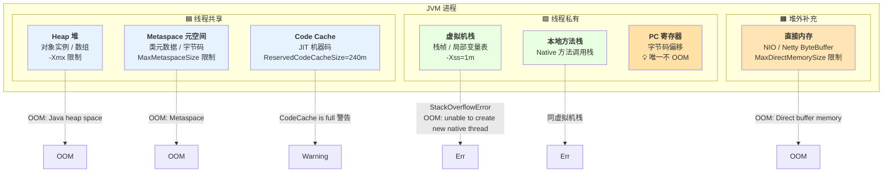
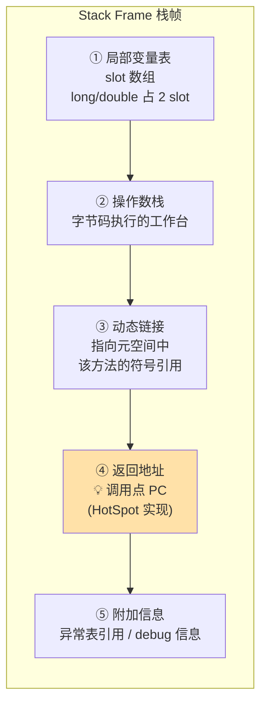

# JVM 内存分区与对象布局：堆栈元空间三大分区 + 对象头 Mark Word 的底层透视

!!! info "**JVM 内存分区与对象布局 一句话总结**"
    - **七大分区两条主线记忆法**：`三共享（堆 / 元空间 / Code Cache）+ 三私有（虚拟机栈 / 本地方法栈 / PC 寄存器）+ 一堆外补充（直接内存）`。**唯一不 OOM** 的是 PC 寄存器 —— 它只存一个固定大小的字节码偏移，随线程生随线程死。
    - **`-Xmx` 管不到的四大盲区**：元空间、Code Cache、直接内存、线程栈全在堆外，容器 `memory.limit` 必须算上这四块 —— 否则一个 `-Xmx=2g` 的 JVM RSS 常常 3~4g，被 K8s OOM Killer 直接干掉。
    - **TLAB 的 "1%" 不是固定大小，是空间浪费目标**：`-XX:TLABWasteTargetPercent=1` 指的是**每次 refill 时可容忍的空间浪费比例**；TLAB 实际大小由 `TLABWasteTargetPercent × Eden / (期望 refill 次数 × 活跃线程数)` 动态计算，"每线程 1% Eden" 是流传最广的误读。
    - **对象头 Mark Word 是 64 bit 多态复用的最小内存单元**：无锁态存 `hashCode(31) + GC 年龄(4) + 锁标志(2)`；偏向锁存 `线程 ID(54) + epoch(2)`；轻量级锁存 `栈中锁记录指针(62)`；重量级锁存 `Monitor 指针(62)`；GC 标记态复用低 2 bit 的 `11` 标志。**同一个 8 字节槽位、五种状态、共享低 2 位分派入口**。
    - **偏向锁 JEP 374 已"事实退休"但未正式移除**：JDK 15 默认关闭 + 标记 deprecated；JDK 18 起 `-XX:+UseBiasedLocking` 标记为 obsolete（可用但产生警告）；**至今尚无 JEP 将其真正从代码中删除**，Mark Word 位布局里的偏向锁字段仍然存在 —— 但业务开发者可当作不存在。
    - **StringTable 从 JDK 7 起在堆里、不在元空间**：类级别的运行时常量池（每 Class 一份，存字面量 + 符号引用）在元空间；**全局的字符串常量池（`StringTable`，Hashtable 结构）在堆里**。`intern()` 撑爆的是 `Java heap space`，不是 `Metaspace`。JDK 6 桶数 1009 → JDK 7+ 桶数 60013（约 60× 跨越）。

---

## 1. 第一层：业务痛点 —— 从"`-Xmx=2g` 却 RSS 4g 被 OOMKilled"到"`intern()` 撑满的到底是哪块内存"

### 1.1 生产事故现场：容器内 `-Xmx=2g` 的 JVM，为什么 RSS 常常 3~4g？

**痛点引子**：某 K8s 集群里一个 Java 服务的 Pod `memory.limit=3g`，JVM 参数 `-Xmx=2g` 看似留足了 1g 富余；但线上运行 30 分钟后被 OOM Killer 强制杀死，`kubectl describe pod` 显示 `Reason: OOMKilled`，同时 JVM 侧 `/actuator/heapdump` **完全正常**。运维怀疑内存泄漏，业务侧坚持"堆没用满"，两边扯了一下午 —— 一句话定位：**`-Xmx` 只管堆，堆外还有四大盲区独立吃内存**。

```yaml
# ❌ 事故版部署配置
resources:
  limits:
    memory: 3Gi   # 只留了 1Gi 给堆外
env:
  - name: JAVA_OPTS
    value: "-Xmx2g"   # 只管堆
# 结果：Metaspace 涨到 800m + CodeCache 240m + DirectMemory 512m + 500 线程 × Xss 1m = 500m
# → 堆外累计 2G+，加上堆 2G，RSS 稳超 4G，被 OOM Killer 终止
```

**四大盲区**：

- **元空间**：默认无上限（`MaxMetaspaceSize = 2^64 - 1`）—— 大量 CGLib / JSP / Groovy 动态生成的类会持续增长
- **Code Cache**：默认 `-XX:ReservedCodeCacheSize=240m` —— JIT 编译热点方法后落盘
- **直接内存**：默认与 `-Xmx` 相同 —— Netty / NIO ByteBuffer 的常驻缓冲
- **线程栈**：每线程 `-Xss=1m` × 500 线程 = 500m —— Tomcat 大线程池的隐形消耗

容器 `memory.limit` **必须** ≥ `-Xmx + MaxMetaspaceSize + ReservedCodeCacheSize + MaxDirectMemorySize + (Xss × 线程数) + 200m 兜底`，否则被 OOM Killer 干掉是**必然事件**，不是概率事件。

### 1.2 六个核心底层问题

- **难题 1**：`-Xmx=2g` 却 RSS 4g —— 差的 2g 藏在哪？为什么 `jmap -heap` 完全看不到？
- **难题 2**：`String.intern()` 循环调用 100 万次，抛的 OOM 是 `Java heap space` 还是 `Metaspace`？为什么 JDK 6 和 JDK 7+ 答案不一样？
- **难题 3**：`new Object()` 到底占多少字节？开启 `-XX:+UseCompressedOops` 和关闭它有多少差距？为什么 30GB 堆比 40GB 堆更省内存？
- **难题 4**：TLAB 的 `-XX:TLABWasteTargetPercent=1` 到底是"每线程占 1% Eden"还是别的意思？大家都在说的"1%"出处到底在哪？
- **难题 5**：Mark Word 才 8 字节 = 64 bit —— 怎么同时装下 hashCode、GC 年龄、锁状态、偏向线程 ID 这么多信息？"多态复用"的底层机制是什么？
- **难题 6**：栈帧里的"返回地址"存的是"下一条指令的 PC"还是"调用点 PC"？HotSpot 为什么这么选？异常栈打印的行号是怎么算出来的？

这六个难题的答案全部藏在 `jmap` / `jcmd VM.native_memory` / `jol-cli` / `hotspot/share/oops/markWord.hpp` 里。

### 1.3 痛点清单（3 条 · 与后三层强绑定）

| 痛点 | 表象 | 承接 |
| :-- | :-- | :-- |
| **A** 容器内 JVM 被 OOM Killer 杀死，`-Xmx` 显然留了余量 | K8s Pod OOMKilled + JVM 堆正常 | §2.1 `-XX:+PrintFlagsFinal` 摸清四大盲区默认值 + §3.1 七大分区全景 + §4 红线 1 |
| **B** 一个只有 1 个 `int` 字段的对象到底占几字节？ | `new Integer(0)` 占 16 字节，业务数据只 4 字节 | §2.2 `jol-cli` 打印真实字节布局 + §3.6 对象内存布局公式 + §3.7 压缩指针 32GB 边界 |
| **C** `synchronized` 加锁到底往哪里写状态位？ | Mark Word 五态多态复用，看起来"不可能" | §2.3 `markWord.hpp` 源码考古 + §3.6 Mark Word 五态位分布表 + §4 红线 4（偏向锁事实退休） |

---

## 2. 第二层：JVM 内存三件套透视 —— `PrintFlagsFinal` + `jol-cli` + `markWord.hpp`

> ⭐ **本层特殊说明**：内存布局的"字节码考古"不是抓 `javap -v` 字节码，而是抓 **JVM 内部三件观测工具**：`-XX:+PrintFlagsFinal` 摸清所有默认参数、`jol-cli` 打印对象在堆里的真实字节布局、`hotspot/share/oops/markWord.hpp` 看 Mark Word 64 bit 的精确定义。这三件套构成"JVM 内存底层真相"的三个入口。

### 2.1 `-XX:+PrintFlagsFinal` 打印所有默认参数 —— 摸清"四大盲区"底数

主考古样本：

```bash
java -XX:+PrintFlagsFinal -version | grep -E "TLAB|Metaspace|CodeCache|SurvivorRatio|MaxTenuring|UseCompressedOops|StringTable"
```

关键输出（JDK 17）：

```volt
uintx TLABSize                                = 0                      {product}
double TLABWasteTargetPercent                 = 1.000000               {product}
uintx MaxMetaspaceSize                        = 18446744073709551615   {product}   ← 事实上无上限（2^64 - 1）
uintx ReservedCodeCacheSize                   = 251658240              {product}   ← 240 MB
uintx SurvivorRatio                           = 8                      {product}   ← Eden : S = 8 : 1
uintx MaxTenuringThreshold                    = 15                     {product}
bool  UseCompressedOops                       = true                   {product}
uintx StringTableSize                         = 65536                  {product}   ← JDK 7+ 桶数 60013 附近
```

**逐行破案**：

1. **`TLABSize=0`** 说明 TLAB 默认走**自适应**（`-XX:+ResizeTLAB`），大家常说的"1%"出自 `TLABWasteTargetPercent`，是**每次 refill 时可容忍的空间浪费目标**，不是 TLAB 固定大小
2. **`MaxMetaspaceSize=18446744073709551615`** 就是 `2^64 - 1`（`uint64` 最大值），事实上无上限 —— **生产必须显式设置**，否则 CGLib 动态代理会吃光本地内存
3. **`ReservedCodeCacheSize=240 MB`** 是容易被忽视的堆外常驻，JIT 编译密集应用（Groovy / Kotlin 反射 / Spring Boot 冷启动）容易顶到上限
4. **`StringTableSize`** 从 JDK 6 的 1009 涨到 JDK 8+ 的 65536 —— 约 60× 跨越，是搬进堆之后顺带做的容量升级

**所有"默认参数默认值"必须先摸清底数才能谈调优**。生产 JVM 上线前跑一次 `PrintFlagsFinal | grep -i` 命中关键字，比读 100 篇调优博客都实在。

### 2.2 `jol-cli` 打印对象在堆里的真实字节布局 —— 一个 `Integer` 占几字节？

主考古样本：

```bash
java -jar jol-cli.jar internals -cp . java.lang.Integer
```

输出（64 位 JVM · `-XX:+UseCompressedOops` · `-XX:+UseCompressedClassPointers` 默认开启）：

```volt
java.lang.Integer object internals:
 OFFSET  SIZE   TYPE DESCRIPTION                    VALUE
      0     4        (object header: mark)           0x0000000000000001 (non-biasable; age: 0)
      4     4        (object header: class)          0x0000e2c0            ← 压缩 Klass Pointer
      8     4    int Integer.value                   0                     ← 唯一字段
     12     4        (object alignment/padding)                            ← 对齐填充
Instance size: 16 bytes                                                    ← 总大小
Space losses: 0 bytes internal + 4 bytes external = 4 bytes total
```

**逐行破案**：

1. **OFFSET 0~7 · 8 字节 Mark Word**：`0x01` 低 2 bit 是 `01`（无锁/偏向标志态），高位无锁时存 hashCode（此时未算，全 0）+ GC 年龄
2. **OFFSET 8~11 · 4 字节压缩 Klass Pointer**：指向元空间中 `Integer` 类的元数据（`InstanceKlass*`），压缩后 4 字节 —— 未压缩需 8 字节
3. **OFFSET 12~15 · 4 字节 `int` value**：唯一的实例字段
4. **对齐填充**：`8 + 4 + 4 = 16` 字节，恰好是 8 的倍数，本例无需额外 padding

**一个 `new Integer(0)` 占 16 字节 —— 而它承载的 int 数据只有 4 字节**，对象头 + 对齐开销占 75%。这就是为什么 `int[]` 数组永远比 `Integer[]` 数组省内存 2~3 倍的根本原因，也是 [集合框架](@java-数据结构-集合框架) 讲 `HashMap.Node = 48 字节` 的对齐推导起点。

### 2.3 `markWord.hpp` 源码考古 —— Mark Word 64 bit 的精确定义

主考古样本（`hotspot/share/oops/markWord.hpp`）：

```cpp
//  32 bits:
//  --------
//             hash:25 ------------>| age:4    biased_lock:1 lock:2 (normal object)
//             JavaThread*:23 epoch:2 age:4    biased_lock:1 lock:2 (biased object)
//
//  64 bits:
//  --------
//  unused:25 hash:31 -->| unused_gap:1   age:4    biased_lock:1 lock:2 (normal object)
//  JavaThread*:54 epoch:2 unused_gap:1   age:4    biased_lock:1 lock:2 (biased object)
//
//    [ptr             | 00]  locked             ← 轻量级锁：低 2 bit = 00，高 62 bit 为栈锁记录指针
//    [header      | 0 | 01]  unlocked           ← 无锁：低 2 bit = 01，第 3 bit = 0
//    [header      | 1 | 01]  biased             ← 偏向锁：低 2 bit = 01，第 3 bit = 1
//    [ptr             | 10]  monitor            ← 重量级锁：低 2 bit = 10，指向 ObjectMonitor
//    [ptr             | 11]  marked             ← GC 标记态：低 2 bit = 11
```

**逐行破案**：

- **锁标志位（低 2 bit）是所有状态的公共入口**：`00` 轻量锁、`01` 无锁/偏向、`10` 重量锁、`11` GC 标记 —— JVM 判断对象状态永远只读这 2 bit
- **偏向锁标志（第 3 bit）区分"真无锁"和"偏向锁"**：低 3 bit `001` = 无锁、`101` = 偏向锁
- **Mark Word 是 JVM 内存布局里最紧凑的多态设计**：8 字节槽位 + 低 2 bit 分派 + 五种状态共享同一内存空间

> 📖 完整锁升级链路（Mark Word 状态位跃迁：无锁 → 偏向 → 轻量 → 重量）请见 [并发基础：JMM 与线程同步](@java-并发-JMM与线程同步) §"锁升级四阶段"，本文只讲 Mark Word 的**位分布布**。

---

## 3. 第三层：内存布局 —— 七大分区 + 五张核心机制图

### 3.1 七大分区两条主线全景图

!!! note "📖 术语家族：JVM 运行时数据区族（Runtime Data Areas）"
    **字面义**：`Runtime Data Areas` —— JVMS §2.5 定义的 JVM 运行时数据区

    **在 JVM 中的含义**：JVM 规范规定的六大运行时数据区 + 一个约定俗成的堆外补充（直接内存）

    **家族成员**：

    | 成员 | 线程归属 | 内存位置 | 是否 GC | 存什么 | JVMS 章节 |
    | :-- | :-- | :-- | :-- | :-- | :-- |
    | `Heap` | 共享 | 堆内 | ✅ | 对象实例 / 数组 | §2.5.3 |
    | `Method Area / Metaspace` | 共享 | 堆外 | ✅（Full GC） | 类元数据 / 字节码 / 类级常量池 | §2.5.4 |
    | `Code Cache` | 共享 | 堆外 | ⚠️ Sweeper | JIT 机器码 | 非 JVMS 规定，HotSpot 特有 |
    | `VM Stack` | 私有 | 堆内 | ❌ | 栈帧 / 局部变量表 | §2.5.2 |
    | `Native Method Stack` | 私有 | 堆内 | ❌ | Native 方法栈 | §2.5.6 |
    | `PC Register` | 私有 | 堆内 | ❌（不 OOM） | 字节码偏移 | §2.5.1 |
    | `Direct Memory` | — | 堆外 | ❌（Cleaner） | NIO / Netty 缓冲 | 非 JVMS 规定 |

    **命名规律**：`<线程归属> + <位置> + <职责>` —— JVMS 用这套三元组严格定义了每个区的生命周期与错误类型

    **易混点**：`Method Area` 是 JVMS **规范层面**的概念，`Metaspace` 是 HotSpot 从 JDK 8 起对 `Method Area` 的**具体实现**（JDK 6~7 的实现是 `PermGen`）。规范和实现不能混说。

**核心 Mermaid**（横轴：线程共享 vs 线程私有 · 纵轴：堆内 vs 堆外）：



**七大分区速览表**：

| 分区 | 线程归属 | 位置 | 存什么 | 是否 GC | OOM 表现 | 关键参数 |
| :-- | :-- | :-- | :-- | :-- | :-- | :-- |
| **Heap 堆** | 共享 | 堆内 | 对象实例 / 数组 | ✅ | `OOM: Java heap space` | `-Xmx` / `-Xms` |
| **Metaspace 元空间** | 共享 | 堆外（本地内存） | 类元数据 / 字节码 / 类级常量池 | ⚠️ Full GC | `OOM: Metaspace` | `-XX:MaxMetaspaceSize` |
| **Code Cache** | 共享 | 堆外 | JIT 编译后机器码 | ⚠️ Sweeper | `CodeCache is full` 警告 | `-XX:ReservedCodeCacheSize=240m` |
| **虚拟机栈** | 私有 | 堆内 | 栈帧 / 局部变量表 | ❌ | `StackOverflowError` / `OOM: unable to create new native thread` | `-Xss=1m` |
| **本地方法栈** | 私有 | 堆内 | Native 方法调用栈 | ❌ | 同虚拟机栈 | 同 `-Xss` |
| **PC 寄存器** | 私有 | 堆内 | 字节码偏移 | ❌ | **不 OOM** | 无 |
| **直接内存** | 共享 | 堆外 | NIO / Netty 缓冲 | ❌（Cleaner） | `OOM: Direct buffer memory` | `-XX:MaxDirectMemorySize` |

- **PC 寄存器是唯一不会 OOM 的分区** —— 它只存一个固定大小的字节码偏移，随线程生随线程死
- **元空间用完抛的是 `OOM: Metaspace`**，与堆的 `Java heap space` 是**两种不同类型**的 OOM —— 生产排查看错方向会浪费半天
- **虚拟机栈"栈深过多"抛 `StackOverflowError`（递归失控），"线程过多"抛 `OOM: unable to create new native thread`**（本地内存不足）

### 3.2 堆的三代结构 + Eden : S0 : S1 = 8 : 1 : 1

**核心 ASCII 图**：

```txt
┌─────────────────────────────────────────────────────────────┐
│                         Heap                                │
│  ┌──────────────────────────────┐  ┌──────────────────────┐ │
│  │        Young Generation      │  │    Old Generation    │ │
│  │  ┌──────────┬────┬────┐      │  │  Long-lived objects  │ │
│  │  │  Eden    │ S0 │ S1 │      │  │  Large objects direct│ │
│  │  │  (80%)   │(10%)│(10%)│    │  │                      │ │
│  │  └──────────┴────┴────┘      │  │                      │ │
│  └──────────────────────────────┘  └──────────────────────┘ │
└─────────────────────────────────────────────────────────────┘

对象生命周期：
  new →  Eden  ──Minor GC──→  S0 ──Minor GC──→  S1 ──年龄≥15──→  Old Gen
                          (age=1)          (age=2)                  (Tenured)
```

**关键结论**（弱分代假说的根本原因）：

- **大部分对象朝生夕死** → Minor GC 后存活率 < 10% → Eden 占 80% 保证分配速率
- **S0/S1 各占 10%** 恰好容纳存活对象；两个 Survivor 交替使用是**复制算法**的硬性前提（To 空间清空、From 空间存活对象复制过来）
- **动态年龄判断**：Survivor 中相同年龄对象总大小超 50% 时提前晋升（`-XX:TargetSurvivorRatio=50`）—— 防止 Survivor 撑爆
- **大对象直接进老年代**：`-XX:PretenureSizeThreshold=1m` 设置阈值，超过直接分配到 Old Gen，绕过 Eden

### 3.3 TLAB 零锁分配的机制图

**核心 ASCII 图**：

```txt
Eden Area
┌──────────────────────────────────────────────────────────────┐
│  Thread-1 TLAB    │  Thread-2 TLAB    │  ...  │  Shared Area │
│  [obj][obj][    ] │  [obj][        ]  │       │              │
│   ↑ top           │   ↑ top           │       │  ↑ 大对象走这里 │
│   bump pointer    │   bump pointer    │       │   (CAS 分配)   │
└──────────────────────────────────────────────────────────────┘

分配流程：
1. Thread-1 分配对象 → 走 TLAB → bump pointer 前移 → 零锁 O(1)
2. TLAB 剩余空间 < 对象大小 → 触发 refill
3. refill 时判断"当前 TLAB 剩余是否 < TLABWasteTargetPercent × TLAB 大小"
   - 是 → 舍弃剩余，重新分配一整块新 TLAB
   - 否 → 该对象走共享区 CAS 分配（避免频繁 refill 浪费空间）
```

**关键结论**（"1% 迷思"澄清）：

- **每线程在 Eden 预留私有小块** → `bump pointer` 分配 → **零锁**（无需 CAS，本线程独占）
- **TLAB 用完走 refill**；`TLABWasteTargetPercent=1` 是**每次 refill 可容忍的空间浪费目标**
- **TLAB 实际大小** = `TLABWasteTargetPercent × Eden / (期望 refill 次数 × 活跃线程数)` —— **动态自适应**，不是固定 1%
- **`-XX:+ResizeTLAB`（默认开启）** 让 TLAB 大小随线程分配速率动态调整，热点线程拿到更大的 TLAB

### 3.4 栈帧五件套 + PC 寄存器的底层协作图

**核心 Mermaid**（栈帧五件套结构）：



**一次方法调用完整运行时图**：

```txt
Thread-1 (私有)
┌────────────────────────────────────────┐
│  PC Register: 42 (当前 method 的字节码偏移)│
│                                        │
│  VM Stack (栈帧从底往上生长):             │
│  ┌─────────────────────────────────┐   │
│  │ Frame 3: current method         │   │
│  │  ├─ Locals: [this, arg1, arg2] │   │
│  │  ├─ Stack:  [tmp1, tmp2]       │   │
│  │  ├─ DynLink → 元空间 Method*    │   │
│  │  ├─ Return: 调用点 PC = 38      │   │
│  │  └─ ExHandler → 元空间 ExTable  │   │
│  ├─────────────────────────────────┤   │
│  │ Frame 2: caller method          │   │
│  │  ...                            │   │
│  ├─────────────────────────────────┤   │
│  │ Frame 1: main()                 │   │
│  └─────────────────────────────────┘   │
└────────────────────────────────────────┘
                 │
                 ↓ 引用堆
              Heap (共享)
```

**核心结论**（返回地址的精确语义 · 全站独家）：

- **JVMS 规范允许两种实现**：存"调用点 PC"或存"下一条 PC"都合法
- **HotSpot 选存"调用点 PC"**：把"加指令长度跳到下一条"放在**正常返回**的高频路径；把"用调用点 PC 直接查 LineNumberTable"放在**异常栈打印**的低频高价值路径 —— 复用同一个字段
- **统一心智模型**：**JVM 中所有记录"执行位置"的字段（PC 寄存器 + 栈帧返回地址），语义都是"正在执行的那条指令本身的偏移"，不是"下一条"**
- **异常行号的根本来源**：`Throwable.fillInStackTrace()` 遍历栈帧，逐帧取出"调用点 PC" → 查方法的 `Code` 属性下的 `LineNumberTable` → 得到源码行号

> 📖 `Throwable.fillInStackTrace()` 的完整 native 栈帧遍历链路请见 [异常处理](@java-字节码-异常处理) §"fillInStackTrace 与栈展开"。

### 3.5 元空间 + Code Cache + 直接内存三块堆外内存的分布

**元空间**（本地内存 · 全局共享）：

- **存什么**：类的结构信息（`InstanceKlass`）+ 方法字节码（`ConstMethod`）+ **类级**运行时常量池（每 Class 一份，存字面量 + 符号引用）
- **回收时机**：Full GC 时可能卸载类加载器（配合 `-XX:+ClassUnloadingWithConcurrentMark`）
- **不设上限的后果**：CGLib 动态代理 / Groovy 每次 eval / JSP 热部署每次都生成新 `Class` → 元空间无限增长 → 挤占本地内存 → 容器被 OOM Killer

**Code Cache**（本地内存 · 全局共享）：

- **存什么**：JIT 编译后的机器码（C1 + C2 分层编译产物）
- **回收时机**：`-XX:+UseCodeCacheFlushing`（默认开）让 Sweeper 线程回收冷代码
- **满了怎样**：不抛 OOM，而是 `CodeCache is full` 警告 → JIT 停止工作 → 应用退化到解释执行 → **性能悬崖式下跌**

**直接内存**（Native Memory · NIO / Netty 命脉）：

- **存什么**：`ByteBuffer.allocateDirect()` 分配的堆外缓冲
- **回收时机**：靠 `Cleaner` 机制 —— `DirectByteBuffer` 被 GC 时触发 Cleaner，释放本地内存
- **陷阱**：如果堆内 `DirectByteBuffer` 长时间不 GC，本地内存永远不会释放 —— **堆很轻但 RSS 激增**

**澄清**（StringTable 位置变迁 · 全站独家表格）：

| JDK 版本 | 字符串常量池位置 | `intern()` 行为 | 桶数（默认） |
| :-- | :-- | :-- | :-- |
| JDK 6 及以前 | **永久代（PermGen）** | 复制到永久代常量池 | 1009 |
| JDK 7 | **堆** | 记录堆中已有字符串的引用 | 60013 |
| JDK 8+ | **堆**（元空间取代永久代，但 StringTable 位置未变） | 同 JDK 7 | 60013+ |

`intern()` 撑爆的是 `Java heap space`，**不是** `Metaspace` —— 因为**类级**运行时常量池在元空间，**全局** StringTable 在堆里，这两者经常被混为一谈。**JDK 8 元空间替代永久代**这件事和 **JDK 7 StringTable 搬到堆**是**两件独立的事**，很多人也容易混淆。

> 📖 `String` 的 `ldc` 字节码 + `CONSTANT_String_info` + Compact Strings 完整链路请见 [字符串底层原理](@java-字节码-字符串底层原理)。

### 3.6 对象在堆中的完整内存布局（核心机制图 · Mark Word 三处透视首发源头）

**核心 ASCII 图**：

```txt
┌────────────────────────────────────────────────────────────┐
│                    Object Header                           │
│  ┌──────────────────────────────────────────────────────┐  │
│  │  Mark Word (8 bytes, 64-bit JVM)                     │  │
│  │  多态复用：hashCode / GC 年龄 / 锁状态 / 偏向线程 ID    │  │
│  └──────────────────────────────────────────────────────┘  │
│  ┌──────────────────────────────────────────────────────┐  │
│  │  Klass Pointer (4 字节压缩 / 8 字节未压缩)              │  │
│  │  → 指向元空间中的类元数据（InstanceKlass*）             │  │
│  └──────────────────────────────────────────────────────┘  │
│  ┌──────────────────────────────────────────────────────┐  │
│  │  Array Length (仅数组对象，4 字节)                     │  │
│  └──────────────────────────────────────────────────────┘  │
├────────────────────────────────────────────────────────────┤
│  Instance Data（字段值，JVM 重排以减少对齐损失）             │
│  排序：long/double > int/float > short/char > byte/bool >  │
│       reference                                            │
├────────────────────────────────────────────────────────────┤
│  Padding（对齐填充到 8 字节倍数）                            │
└────────────────────────────────────────────────────────────┘

通用大小公式：
  对象大小 = 对象头 (12 或 16) + 实例数据 (字段实际字节) + 对齐填充 (0~7)
        向上取整到 8 字节倍数
```

**Mark Word 五态多态复用表**（本篇为 Mark Word 三处透视的**首发源头**）：

| 锁状态 | 存储内容（按位拆解，合计 64 bit） | 标志位（低 3 bit） |
| :-- | :-- | :-- |
| **无锁** | `unused(25) + hashCode(31) + unused_gap(1) + GC 年龄(4) + 偏向标志(1)=0 + 锁标志(2)=01` | `001` |
| **偏向锁** | `线程 ID(54) + epoch(2) + unused_gap(1) + GC 年龄(4) + 偏向标志(1)=1 + 锁标志(2)=01` | `101` |
| **轻量级锁** | `指向栈中锁记录的指针(62) + 锁标志(2)=00` | `xx0` (低 2 bit=00) |
| **重量级锁** | `指向 Monitor 对象(ObjectMonitor)的指针(62) + 锁标志(2)=10` | `xx0` (低 2 bit=10) |
| **GC 标记** | 由 GC 使用，配合 forwarding pointer（复制算法转发指针） | `xx1` (低 2 bit=11) |

- **8 字节槽位 + 低 2 bit 分派入口 + 五种状态共享同一内存空间** —— Mark Word 是 JVM 内存布局里最紧凑的多态设计
- **同一个字段在五种状态下"存不同的东西"**，判断当前是哪种状态只需读低 2 bit + 第 3 bit（偏向标志）
- **GC 标记态复用**：Serial / Parallel GC 用 forwarding pointer 记录转发地址；G1 / ZGC 有自己的着色指针，但同样借用 Mark Word 的低位分派

> 📖 **Mark Word 三处透视**：本篇讲**位分布**（哪些位存什么）· [并发基础：JMM 与线程同步](@java-并发-JMM与线程同步) 讲**状态位跃迁**（锁升级时机）· [GC 核心机制与收集器演进](@java-JVM-GC核心机制与收集器演进) 讲**GC 使用**（三色标记 + forwarding pointer）。

> 📖 `Klass` / `oop` 二元模型 + `invokevirtual` 查 vtable 完整展开请见 [面向对象（OOP）](@java-字节码-面向对象) §"对象头与 Klass Pointer"。

### 3.7 压缩指针（Compressed Oops）32GB 边界的数学推导

!!! note "📖 术语家族：`*Oops` 压缩指针族（Ordinary Object Pointer）"
    **字面义**：`oop` = **O**rdinary **O**bject **P**ointer，HotSpot 对"Java 堆中对象引用"的内部称呼

    **在 HotSpot 中的含义**：C++ 层面表达"如何在堆中引用一个对象"的一整套类型

    **家族成员**：

    | 成员 | 作用 | 源码位置 |
    | :-- | :-- | :-- |
    | `oop` | 未压缩对象指针（8 字节裸指针） | `hotspot/share/oops/oop.hpp` |
    | `narrowOop` | 压缩对象引用（4 字节，基于 heap base + shift 还原） | `hotspot/share/oops/oopsHierarchy.hpp` |
    | `Klass*` | 未压缩元数据指针 | `hotspot/share/oops/klass.hpp` |
    | `narrowKlass` | 压缩 Klass Pointer（对象头 4 字节 Klass Pointer 即此类型） | `hotspot/share/oops/compressedOops.hpp` |
    | `CompressedOops` | 压缩/解压静态工具类（`encode` / `decode`） | `hotspot/share/oops/compressedOops.hpp` |
    | `instanceOop` / `arrayOop` / `objArrayOop` / `typeArrayOop` | 具体对象类别（实例 / 一维数组 / 引用数组 / 基本类型数组） | `hotspot/share/oops/instanceOop.hpp` 等 |

    **命名规律**：`<Xxx>Oop` / `narrow<Xxx>` = "HotSpot 中对 Java 堆引用的 C++ 表示"；压缩版加 `narrow` 前缀、未压缩版直接用 `oop` / `Klass*`

    **易混点**：`-XX:+UseCompressedOops` 控制对象**引用字段**压缩 · `-XX:+UseCompressedClassPointers` 控制对象头 **Klass Pointer** 压缩 —— **两者独立开关但默认都开**，堆 > 32GB 时 `UseCompressedOops` 自动关闭，`UseCompressedClassPointers` 仍可保留（因为它压缩的是元空间指针，不受堆大小限制）。

**推导链**：

```txt
① 64 位指针压缩为 32 位无符号整数
   → 最大表示 2^32 = 4G 个地址槽

② JVM 对象 8 字节对齐（-XX:ObjectAlignmentInBytes=8）
   → 每个对象地址都是 8 的倍数
   → 低 3 bit 永远为 0，存"高 32 位"就够，低位自动补 0

③ 可寻址空间 = 4G × 8 = 32GB
   → 堆超过 32GB → 压缩失效 → 引用回到 8 字节
```

**关键结论**（30GB 堆比 40GB 堆更省内存的反直觉现象）：

- **堆 ≤ 32GB**：引用字段 4 字节 · Klass Pointer 4 字节 · 对象平均密度高
- **堆 > 32GB**：引用字段 8 字节 · Klass Pointer 8 字节 · **每个对象平均多消耗 12~16 字节**
- **临界结果**：32GB 压缩堆能装的对象数量 > 40GB 未压缩堆 —— 这是"生产宁可用 30GB 堆，不用 40GB 堆"的根本原因
- **`-XX:ObjectAlignmentInBytes=16`** 可以把上限提到 64GB，代价是每个对象平均多浪费 4 字节 padding —— 非极端场景不建议动

**实践建议**：

- 堆需求 ≤ 32GB → 保持默认 `-XX:+UseCompressedOops`（自动开）
- 堆需求略超 32GB → **优先降到 30GB**，保住压缩指针（配合 ZGC 减少 STW）
- 堆需求 >> 32GB（如 128GB+）→ 直接上 ZGC，压缩指针失效但 STW 可控

---

## 4. 第四层：工程红线 —— 5 条硬依据

### 红线 1：容器化 JVM 的 `memory.limit` 必须包含堆外四大盲区

**根本原因**：`-Xmx` 只管堆，元空间 / Code Cache / 直接内存 / 线程栈全在堆外，独立占用本地内存。

**❌ 反模式**：

```yaml
# K8s Pod 配置
resources:
  limits:
    memory: 3Gi
env:
  - name: JAVA_OPTS
    value: "-Xmx2g"   # 只留 1Gi 给堆外，完全不够
# 结果：Metaspace 涨到 800m + CodeCache 240m + DirectMemory 512m + 500 线程栈 500m
#     = 堆外 2G+，加上堆 2G → RSS 4G+ → OOM Killer
```

**✅ 标准范式**：

```yaml
resources:
  limits:
    memory: 3Gi
env:
  - name: JAVA_OPTS
    value: >-
      -Xmx1g
      -XX:MaxMetaspaceSize=256m
      -XX:ReservedCodeCacheSize=240m
      -XX:MaxDirectMemorySize=256m
      -Xss1m
      -XX:+UseContainerSupport
      -XX:MaxRAMPercentage=40.0
# 堆 1g + Metaspace 256m + CodeCache 240m + Direct 256m + 200 线程 × 1m = ~2G
# 加上 200m 兜底 → RSS 峰值 2.2G，安全落在 3Gi 内
```

**验证公式**：`memory.limit ≥ -Xmx + MaxMetaspaceSize + ReservedCodeCacheSize + MaxDirectMemorySize + (Xss × 线程数) + 200m 兜底`

### 红线 2：`-XX:MaxMetaspaceSize` 生产必设

**根本原因**：默认 `MaxMetaspaceSize = 2^64 - 1`，事实上无上限。CGLib 动态代理、JSP 热部署、Groovy `eval` 会持续生成新 Class 塞入元空间。

**❌ 反模式**：

```bash
java -Xmx2g -jar app.jar   # 完全不设 MaxMetaspaceSize，元空间无限增长
```

**✅ 标准范式**：

```bash
# 非 hot-swap 场景（常规 Spring Boot 服务）
java -Xmx2g -XX:MaxMetaspaceSize=256m -jar app.jar

# 中等应用（含 CGLib / MyBatis 动态代理）
java -Xmx4g -XX:MaxMetaspaceSize=512m -jar app.jar

# 大型 microservice / Spring Cloud 全家桶
java -Xmx8g -XX:MaxMetaspaceSize=1g -jar app.jar

# ⚠️ 特殊：Groovy / JRuby / 频繁热部署场景
# 需要 -XX:+ClassUnloadingWithConcurrentMark 配合，且 MaxMetaspaceSize 需 1.5~2 倍冗余
```

### 红线 3：堆 > 32GB 时压缩指针自动关闭 —— 优先选 30GB 而非 40GB

**根本原因**：`-XX:+UseCompressedOops` 的 32GB 上限来自"32 位偏移 + 8 字节对齐"数学推导。堆超限后引用字段 4 字节 → 8 字节，对象密度骤降。

**❌ 反模式**：

```bash
java -Xmx40g -jar app.jar   # 压缩指针失效，40G 堆装的对象数量 < 30G 压缩堆
```

**✅ 标准范式**：

```bash
# 需求 32~40GB 之间 → 优先降到 30GB 保住压缩指针
java -Xmx30g -XX:+UseCompressedOops -jar app.jar

# 确需 > 32GB → 直接上 ZGC（压缩指针失效但 STW < 10ms）
java -Xmx64g -XX:+UseZGC -jar app.jar
```

### 红线 4：`-XX:+UseBiasedLocking` 在 JDK 15+ 不要再显式开启

**根本原因**：JEP 374 在 JDK 15 默认关闭 + 标记 deprecated；JDK 18 起显式开启会产生 obsolete 警告。现代 JIT 的锁消除已足够优秀，偏向锁在低竞争场景收益微乎其微，反而增加锁升级复杂度。

**❌ 反模式**：

```bash
# 从 JDK 8 迁移到 JDK 17 的老项目，运维盲目保留原参数
java -XX:+UseBiasedLocking -Xmx2g -jar app.jar
# JDK 18+ 会打印警告：Option UseBiasedLocking was deprecated in version 15.0
```

**✅ 标准范式**：

```bash
# JDK 15+：删掉 UseBiasedLocking，让 JVM 走默认（关闭偏向锁）
java -Xmx2g -jar app.jar

# 低竞争同步的现代姿势
# 1) java.util.concurrent 优先（AQS + CAS）
# 2) VarHandle 替代 Unsafe 做无锁编程
# 3) 保留 synchronized 即可，靠 JIT 锁消除 + 轻量级锁
```

### 红线 5：`String.intern()` 密集调用抛的是 `Java heap space`，不是 `Metaspace`

**根本原因**：StringTable 从 JDK 7 起在堆里，不在元空间。`intern()` 只是在 StringTable 里加一条"字符串 → 堆对象"的映射，被引用的字符串本身占用堆内存。

**❌ 反模式**：

```java
// 用户输入不加限制地 intern()，希望"字符串去重省内存"
public String cacheKey(String userInput) {
    return userInput.intern();   // 100 万个不同用户输入 → StringTable 挂 100 万条 → 堆 OOM
}
```

**✅ 标准范式**：

```java
// 方案 1：显式增大 StringTable 桶数（JVM 参数）
// -XX:StringTableSize=1000003   // 100 万级质数

// 方案 2：应用层手写字符串去重，避开 StringTable 隐式堆压力
private static final ConcurrentHashMap<String, String> DEDUP = new ConcurrentHashMap<>();

public String cacheKey(String userInput) {
    // 已存在则返回原引用（省内存）；不存在则放入
    String existing = DEDUP.get(userInput);
    if (existing != null) return existing;
    DEDUP.putIfAbsent(userInput, userInput);
    return DEDUP.get(userInput);
}
// 优势：容量、逐出策略、监控指标全都可控，不依赖 JVM 内部 StringTable
```

**总结要义**：

> *"JVM 的所有'内存去哪了'问题都收敛到三条主线：**七大分区两条主线**决定内存在哪、**对象头 + 实例数据 + 对齐填充**决定单对象占多少、**压缩指针 32GB 边界**决定堆密度。理解了这三条主线，OOM 类型、`jmap -heap` 输出、容器内存超限、`intern()` 撑堆全都是这些主线的排列组合。"*

---

## 5. 🗺️ 跨篇章知识关联

- [并发基础：JMM 与线程同步](@java-并发-JMM与线程同步) 承接本篇 §3.6 的 Mark Word 五态多态复用：偏向 → 轻量 → 重量 → GC 标记的状态位跃迁。
- [GC 核心机制与收集器演进](@java-JVM-GC核心机制与收集器演进) 承接本篇 §3.6 的 Mark Word GC 标记态与 forwarding pointer。
- [GC 调优实战与常见误区](@java-JVM-GC调优实战与常见误区) 承接本篇 §1.1 的容器内存公式，展开完整 checklist 与 `jcmd VM.native_memory` 排查链路。
- [JVM 现代实践与前沿技术](@java-JVM-现代实践与前沿技术) 承接本篇 §3.7 的压缩指针 32GB 边界，展开 ZGC 大堆与 Loom 虚拟线程栈内存模型。
