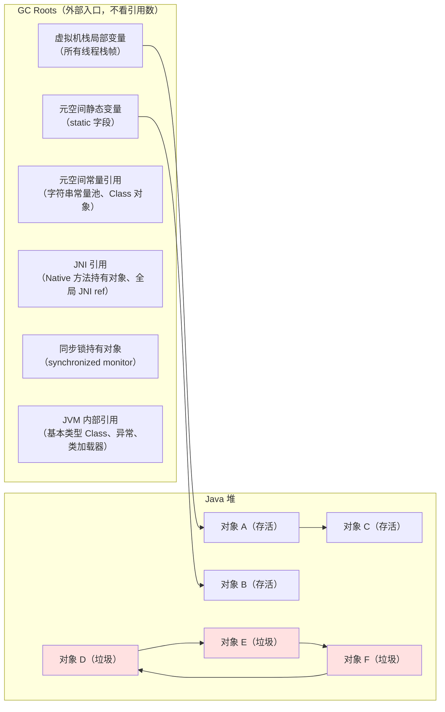
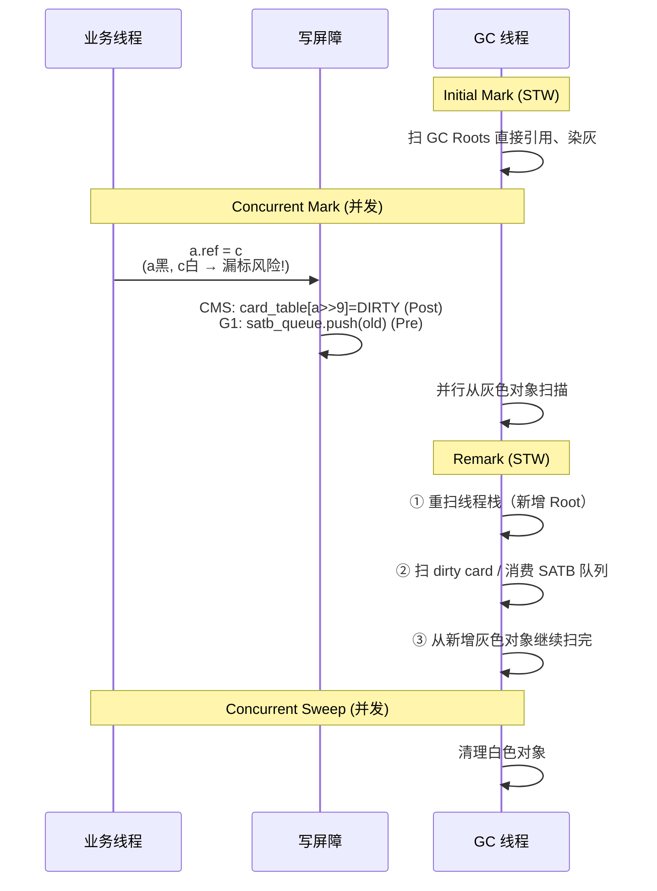

# GC 核心机制与收集器演进 —— 可达性分析 / 三色标记 / 写屏障 / 染色指针的底层透视

以下问题指向 GC 核心机制与收集器演进的关键：

- GC 日志显示 `real=0.02s` 但 `Total time for which application threads were stopped: 5.2s`，剩下的 5 秒去哪了？为什么 Safepoint 空洞是根因？
- 三色标记漏标为什么只有两种解法？为什么 CMS 选增量更新、G1 / ZGC 选 SATB？没有第三种吗？
- 写屏障是"每次赋值都跑一段代码" —— 这个开销有多大？为什么 Parallel GC 吞吐最高（提示：它没有写屏障）？
- ZGC 的染色指针把 4 bit 编在指针高位 —— 业务代码用这个"被染色"的指针访问对象时会不会读到脏数据？读屏障是怎么"透明修正"的？
- G1 的 RSet（Remembered Set）为什么让 G1 内存占用比 CMS 高？"记录哪些别的 Region 指向我"这件事的底层成本是什么？
- 逃逸分析 + 标量替换到底把对象分配到栈上了吗？为什么《深入理解 JVM》早期版本的"栈上分配"说法是误传？

---

## 1. 第一层：业务痛点 —— 从"GC 日志 20ms、业务停 5 秒"到"Full GC 一次十几秒抖崩服务"

### 1.1 生产事故现场：GC 日志 20ms，业务线程却停了 5 秒？

某支付平台的 JDK 8 + CMS 线上服务，白天巡检时发现 GC 日志出现这一行：

```txt
Total time for which application threads were stopped: 5.203 seconds
[Times: user=0.03 sys=0.00 real=0.02 secs]
```

GC 本身只花了 20ms（`real=0.02s`），但业务线程被卡了整整 **5.2 秒**。SRE 直觉指向"内存不足触发抖动"，可 heap 明明还剩 60%；开发同学怀疑"锁竞争把线程队住了"，可 `jstack` dump 出来所有业务线程都停在正常的 `parking` 或 `sleeping` 状态。事件在事故复盘会上僵持了两个小时。

这份日志的关键词是 —— **TTSP 空洞（Time-To-SafePoint gap）**。GC 日志里那个 `[Times: user=... sys=... real=...]` 段只统计"执行GC"的时间（`at safepoint`），而 `Total time for which application threads were stopped` 是**"业务被停"** 的总时长，两者差值就是"业务线程从收到 GC 通知到真正跑到 Safepoint 挂起"的等待时间（TTSP）。

**根本原因**：STW 停顿 = **TTSP（等所有线程到齐） + at safepoint（执行阶段）**。GC 日志的 `real=0.02s` 只是后者，前者被隐藏在 `Total time` 里 —— 需要 `-Xlog:safepoint=info`（JDK 9+）或 `-XX:+PrintSafepointStatistics`（JDK 8）才能看得清。事故的直接肇因是某个批处理任务里有一段 `for (int i = 0; i < 200_000_000; i++) { ... }` 的 counted loop，HotSpot 默认**不在 counted loop 的回边插 Safepoint** —— 其他线程触发 GC 后，JVM 必须一直等到这个循环跑完（大约 5 秒）才能让整个进程进入 STW。

调 GC 不只是调算法本身，还要**关注所有业务线程能不能快速到达 Safepoint** —— 这才是所有并发 / 低延迟收集器的**真正前提**。JDK 10+ 可用 `-XX:+UseCountedLoopSafepoints` 在 counted loop 回边也插 Safepoint 关闭这个空洞。

### 1.2 生产事故现场：CMS 用得好好的，突然一次 Full GC 十几秒抖崩服务

另一段常见的翻车剧本：某电商风控服务用 CMS 收集器跑了一年多，日常表现十分优秀 —— 初始标记 5ms、Remark 20ms、并发标记 2s（不停业务）、并发清除 1s（不停业务），线上 P99 一直 < 50ms。某天大促高峰，突然出现一次长达 **12 秒**的 STW，日志显示：

```txt
[Full GC (Allocation Failure) [CMS: 3072000K->2856000K(3145728K), 12.4213821 secs]
 3251200K->2856000K(4194304K), [Metaspace: 187123K->187123K(196608K)],
 12.4225410 secs] [Times: user=12.42 sys=0.00 real=12.42 secs]
concurrent mode failure
```

关键字 `concurrent mode failure`：CMS 在并发标记 / 清除期间，业务线程持续晋升对象到老年代，老年代空间**在 CMS 本轮扫完前撑爆**了。JVM 无可奈何，只能中断 CMS、**退化到 Serial Old 单线程整堆 Mark-Compact**，把整个堆压缩重排一遍。单线程 + 整堆 + 移动对象 —— 12 秒 STW 就是这样堆出来的。

**根本原因链**：老年代占用达 92% 的 `CMSInitiatingOccupancyFraction` 阈值 → CMS 启动并发收集 → 并发期间业务线程持续晋升对象 → 老年代撑爆 → JVM 中断 CMS 退化为 Serial Old → **单线程压缩整堆** → 12 秒 STW。

CMS 的 Mark-Sweep 不移动对象，长期运行必定碎片化 —— 即使总剩余空间充足也可能因为**找不到连续空间**而无法分配大对象，被迫触发 Full GC。**这是 CMS 无法根治的两个硬伤（碎片 + 并发模式失败），也是 G1 用 Region + Compact 全面替代它的根本动机**。JDK 9 起 CMS 被标记为废弃、JDK 14 起彻底移除。

### 1.3 六个核心底层问题

- **难题 1**：GC Roots 到底有几种来源？除了"栈上局部变量"和"静态字段"，还有哪些？为什么 Python 的引用计数处理不了循环引用、而 Java 的可达性分析天然不成问题？
- **难题 2**：三色标记的漏标为什么只有两种解法（增量更新 vs SATB）？没有第三种吗？为什么 CMS 选前者、G1 / ZGC 选后者？
- **难题 3**：写屏障是"每次赋值都跑一段代码" —— 这个开销有多大？为什么 Parallel GC 吞吐最高（提示：它没有写屏障）？
- **难题 4**：ZGC 的染色指针把 4 bit 编在指针高位 —— 那业务代码用这个"被染色"的指针访问对象时会不会读到脏数据？读屏障是怎么"透明修正"的？
- **难题 5**：G1 的 RSet（Remembered Set）为什么让 G1 内存占用比 CMS 高？"记录哪些别的 Region 指向我"这件事的底层成本是什么？
- **难题 6**：逃逸分析 + 标量替换到底把对象分配到栈上了吗？为什么《深入理解 JVM》早期版本的"栈上分配"说法是误传？

这六个难题的答案都写在 HotSpot 源码 `hotspot/share/gc/*` 目录 + `-Xlog:gc*,safepoint` 日志里。

### 1.4 痛点清单（3 条，与后三层强绑定）

- **痛点 A**：GC 日志停顿 = TTSP + at safepoint，业务停顿远大于 GC 本身 → 第二层 §2.1 揭 Safepoint 主动轮询机制 + 第四层红线 1（counted loop 空洞）
- **痛点 B**：CMS 一次 Full GC 十几秒退化到 Serial Old → 第三层 §3.5 揭 CMS 三大缺陷（浮动垃圾 / 碎片 / 并发模式失败） + 第四层红线 2（新项目禁用 CMS）
- **痛点 C**：ZGC 承诺"堆再大 STW 都 < 1ms"到底怎么做到 → 第二层 §2.3 揭染色指针位布局 + 第三层 §3.7 揭读屏障并发转移底层链路

---

## 2. 第二层：字节码考古 —— `-Xlog:gc*+safepoint` + `hotspot/share/gc/*` + JIT 屏障代码的三件套透视

!!! note "本层特殊说明"
    GC 机制的"字节码考古"不是抓 `javap -v` 字节码，而是抓 **JVM 内部三件观测工具**：`-Xlog:gc*,safepoint` 摸清 GC 事件与 TTSP、`hotspot/share/gc/{shared,cms,g1,z}/*.cpp` 看每种收集器的 C++ 实现、`-XX:+PrintAssembly` 反汇编 JIT 插入的屏障机器码。三件套合起来才是"运行时视角的字节码考古"。

### 2.1 `-Xlog:safepoint=info` 揭 TTSP 空洞

**主考古样本**（JDK 17）：

```bash
# JDK 9+ 统一日志（推荐）
java -Xlog:gc*,safepoint=info -jar app.jar

# JDK 8 兼容语法
java -XX:+PrintSafepointStatistics -XX:PrintSafepointStatisticsCount=1 -jar app.jar
```

关键输出：

```volt
[3.421s][info][safepoint] Safepoint "G1CollectForAllocation", Time since last: 12ms
[3.421s][info][safepoint]   Reaching safepoint: 5192.3 ms       ← TTSP（等线程到齐）
[3.421s][info][safepoint]   At safepoint:       21.4 ms         ← at safepoint（执行阶段）
[3.421s][info][safepoint]   Total:              5213.7 ms       ← STW 总时长
```

GC 日志里 `[Times: user=... sys=... real=...]` 段只统计 `At safepoint`；`Reaching safepoint` 才是"业务线程被卡住等 GC 开始"的真实等待时间。TTSP 飙高说明有线程迟迟不到达 Safepoint —— 高频命中 counted loop 空洞（回边不插 Safepoint、必须等循环跑完）。

### 2.2 `hotspot/share/gc/g1/g1CollectedHeap.cpp` 源码考古 —— G1 Region 化的代码入口

**主考古样本**（伪代码 · 提炼自 HotSpot 源码骨架）：

```cpp
// hotspot/share/gc/g1/g1CollectedHeap.cpp
class G1CollectedHeap : public CollectedHeap {
  HeapRegionManager _hrm;              // Region 管理器（1024~2048 个 Region）
  G1CollectionSet   _collection_set;   // 本次 GC 要回收的 Region 集合
  G1RemSet          _rem_set;          // 全局 RSet 管理器

  void collect(GCCause::Cause cause) {
    if (cause == GCCause::_g1_inc_collection_pause) {
      do_collection_pause_at_safepoint();  // Young / Mixed GC
    } else {
      do_full_collection(...);              // Full GC 退化到 Serial Old 风格
    }
  }
};
```

- 每个收集器都是 `CollectedHeap` 的一个 C++ 子类 —— 从设计模式看是**策略模式的经典落地**
- `HeapRegionManager` 是 G1 的核心骨架 —— 堆不再是"新生代 + 老年代"两块连续内存，而是 1024+ 个等大 Region
- `G1RemSet` 就是"每个 Region 记录谁引用了我"的表 —— 让 Region 可以独立回收（只扫 RSet 而非全堆）

### 2.3 JIT 屏障机器码考古 —— 写屏障 / 读屏障的真实成本

**主考古样本 A**（**CMS 后置写屏障** · 伪代码）：

```java
// 业务代码
a.ref = c;

// JIT 生成的机器码等价语义（伪代码）
void putfield_ref(Object a, Object c) {
    a.ref = c;                                          // ① 先赋值
    if (in_concurrent_marking) {
        card_table[addressOf(a) >> 9] = DIRTY;          // ② 把 a 所在 card（512 字节）标脏
    }
}
```

**主考古样本 B**（**G1 / ZGC 前置写屏障 · SATB**）：

```java
// 业务代码
a.ref = c;

// JIT 生成的机器码等价语义（伪代码）
void putfield_ref(Object a, Object c) {
    if (in_concurrent_marking) {
        Object old = a.ref;                             // ① 先读旧值
        satb_queue.push(old);                           // ② 旧值入 SATB 队列（按"GC 开始时快照"视为存活）
    }
    a.ref = c;                                          // ③ 再赋值
}
```

**主考古样本 C**（**ZGC 读屏障 · Load Barrier**）：

```java
// 业务代码
Object b = a.ref;

// JIT 生成的机器码等价语义（伪代码）
Object load_ref(Object* addr) {
    Object obj = *addr;                                 // ① 读引用
    if (isColored(obj) && !isRemapped(obj)) {           // ② 检查染色指针高 4 位
        obj = remap(obj);                               // ③ 若对象已迁移，自动修正到新地址
        *addr = obj;                                    // ④ 写回修正后的指针（self-healing）
    }
    return obj;
}
```

- **写屏障成本**：每条引用赋值多 2~4 条机器指令 —— 引用密集业务（大图遍历、ORM、大量 setter）**开销可达 5%~10%**。这就是"Parallel 吞吐最高"的根本原因（它没有写屏障）
- **读屏障成本**：每条引用读取多 3~5 条机器指令 —— 但换来了对象**并发转移**的能力。这是 ZGC 亚毫秒停顿的**根本代价**
- **Self-Healing**：ZGC 读屏障发现指针需要修正时，顺手把新指针写回原字段 —— 后续读取就零开销，这是 ZGC 稳态性能追上 G1 的核心机制

---

## 3. 第三层：内存布局 —— GC Roots + 三色标记 + 五大收集器完整视图

### 3.1 可达性分析与 GC Roots 六大来源（第一张核心机制图）

Java GC 采用**可达性分析**判定对象是否存活：从一组"GC Roots"作为起点向外遍历，凡是能通过引用链走到的对象都是"可达 / 存活"，扫不到的就是垃圾。



**关键结论**（对比引用计数）：

- **循环引用**在可达性分析下天然不成问题 —— GC Roots 是外部入口、不看引用数，图中的 `D ↔ E ↔ F` 三者互相引用但没有 Root 能走到，就是垃圾
- Python 用引用计数需要额外的"循环检测器"配合；Java 从 JDK 1.2 起就抛弃了引用计数
- **GC Roots 的六大来源要背下来**：栈局部变量、静态字段、常量、JNI、锁对象、JVM 内部。生产事故排查时"哪个 Root 意外持有了对象"是最高频问题

### 3.2 三色标记算法与漏标的两种解法（第二张核心机制图 · 全站首发源头）

**三色标记状态机**：

```txt
白色 → 灰色 → 黑色
未访问   已访问但未扫完   已访问且扫完

初始：所有对象白色
    ↓
从 GC Roots 出发，直接引用染灰
    ↓
取出一个灰色对象，扫描其所有引用：
  - 未访问引用染灰
  - 当前对象染黑
    ↓
重复直到没有灰色对象
    ↓
剩余白色对象 = 垃圾
```

**并发标记的漏标机理**（关键：只有"黑色新增指向白色 + 灰色同时删除对该白色的引用"时才会漏标）：

```txt
初始：A(黑) → B(灰) → C(白)

并发执行时，业务线程做了两件事：
  ① A.ref = C        （黑色 A 新增对 C 的引用）
  ② B.ref = null      （灰色 B 删除对 C 的引用）

结果：
  - C 没有灰色对象再指向它（B 断了）
  - A 已黑（不会再重扫）
  → C 被错误当作垃圾回收！
```

**两种解法完整对比表**（全站源头）：

| 方案 | 原理 | 屏障位置 | 使用者 | 优点 | 缺点 |
| :-- | :-- | :-- | :-- | :-- | :-- |
| **增量更新 Incremental Update** | 黑色对象新增引用时，把该黑色对象重标为灰色 | Post-write（写之后）+ dirty card | CMS | 实现简单 | Remark 要重扫黑色对象（工作量大） |
| **SATB Snapshot At The Beginning** | 灰色对象删除引用时，记录被删除的引用（按 GC 开始时快照视为存活） | Pre-write（写之前）+ SATB queue | G1、ZGC、Shenandoah | 不把黑色改灰、Remark 工作量小 | 会保留"并发期间死掉的对象"到下轮 GC（浮动垃圾） |

**漏标的解法只有两种、没有第三种** —— 要么"发现黑色新增引用 → 把黑改灰重扫"，要么"发现灰色删除引用 → 保守视为存活到下轮"。**其余方案都是这两条主线的变体**。

### 3.3 写屏障与 Card Table 的底层协作图（第三张核心机制图）

**四阶段时序流转**：



**Card Table 内存布局**：

```txt
Java 堆（假设 4GB）
┌──────────────────────────────────────────────────────────────┐
│ Object Object Object Object Object Object Object Object ...  │
└──────────────────────────────────────────────────────────────┘

按 512 字节切成 "Card"：
┌──────┬──────┬──────┬──────┬──────┬──────┬──────┬──────┐
│Card 0│Card 1│Card 2│Card 3│Card 4│Card 5│Card 6│ ...  │
└──────┴──────┴──────┴──────┴──────┴──────┴──────┴──────┘
   ↓ 每张卡对应 Card Table 一个字节
Card Table（8MB · 相当于堆 1/512）：
┌────┬────┬────┬────┬────┬────┬────┬────┐
│CLEAN│DIRTY│CLEAN│DIRTY│CLEAN│CLEAN│DIRTY│ ... │
└────┴────┴────┴────┴────┴────┴────┴────┘
       ↑
   Remark 时 GC 只扫脏卡（大约 5% 覆盖率）
```

- **Card Table**：把堆按 512 字节切成"卡"，每张卡对应 1 字节标志。写屏障标脏后 GC 只扫脏卡（**512 倍空间压缩**）
- **STW 时长压缩公式**：**无写屏障（Serial / Parallel）** 百 ms ~ 秒级（扫全堆）→ **写屏障（CMS / G1）** 10~50 ms（只扫脏 card）→ **染色指针 + 读屏障（ZGC / Shenandoah）** < 1 ms（连对象搬迁都能并发）

!!! note "📖 术语家族：`*Barrier` 屏障族"
    **字面义**：`barrier` = 屏障 / 拦截；GC 语境指"JIT 在业务线程的读 / 写字节码前后自动插入的一小段拦截代码"

    **在 JVM 中的含义**：并发 GC 的"眼线" —— 把"记录引用变化"外包给业务线程自己，业务线程留痕、GC 线程按记录补扫

    **家族成员**：

    | 成员 | 触发时机 | 主要动作 | 典型使用者 |
    | :-- | :-- | :-- | :-- |
    | **Write Barrier**（写屏障） | 引用字段赋值时 | 拦截 `a.ref = b`、记痕迹给 GC | 所有并发 GC 通用基础 |
    | ├─ **Pre-write Barrier**（前置写屏障） | 赋值**之前** | 读旧值 `old` 入 SATB 队列 | G1、Shenandoah（SATB） |
    | ├─ **Post-write Barrier**（后置写屏障） | 赋值**之后** | 把源对象所在 Card 标脏 | CMS 增量更新、G1 RSet 维护 |
    | **Load Barrier**（读屏障） | 读取引用字段时 | 检查染色指针颜色位、若对象已迁移自动修正 | ZGC、Shenandoah |
    | **Memory Barrier**（内存屏障，广义） | 指令间 | CPU 级重排序 / 可见性约束（与 GC 无关，属 JMM） | 所有并发原语 |

    **命名规律**：`<Xxx> Barrier` = "在 Xxx 操作前后插入的拦截代码"；写屏障按插入位置细分 **Pre-** / **Post-**、按记录内容选定 SATB / Card 增量更新

    **易混点**：GC Write / Load Barrier 与 JMM Memory Barrier 完全是两回事 —— 前者由 GC 逻辑决定"记什么"，后者由 CPU 决定"重排/可见性" → 📖 完整 JMM 视角详见 [并发基础：JMM 与线程同步](@java-并发-JMM与线程同步)

    **读屏障是 ZGC 的标志性技术** —— 让"对象转移"也能并发完成，代价是每次读引用多几条指令

### 3.4 三种 GC 算法的分代映射（第四张核心机制图）

```txt
┌──────────────────────────┬──────────────────────────┬──────────────────────────┐
│      Mark-Sweep          │      Mark-Compact         │        Copying           │
│      标记-清除            │      标记-整理             │        复制              │
├──────────────────────────┼──────────────────────────┼──────────────────────────┤
│ 标记后原地清除，留碎片    │ 标记后压缩到一端，无碎片   │ 存活对象复制到另一半空间 │
│ 不移动对象、实现简单      │ 移动对象、要更新所有引用   │ 无碎片、速度最快          │
│ 空间利用率 100%           │ 空间利用率 100%           │ 空间利用率 50%           │
│ ↓                         │ ↓                         │ ↓                        │
│ 使用者：CMS               │ 使用者：Serial Old /      │ 使用者：Serial /         │
│                           │        Parallel Old /      │        ParNew /          │
│                           │        G1 Full GC          │        Parallel Scavenge/│
│                           │                            │        G1 Young          │
└──────────────────────────┴──────────────────────────┴──────────────────────────┘
```

**分代收集的本质映射**：**新生代用 Copying（死多活少、浪费一半也划算） · 老年代用 Mark-Compact 或 Mark-Sweep（死少活多、复制成本太高）** —— 弱分代假说（Weak Generational Hypothesis）"绝大多数对象朝生夕死"的直接工程化。

### 3.5 CMS 四阶段流程与三大关键缺陷（第五张核心机制图）

**四阶段流程图**：

```txt
┌─────────────┬──────────────────────┬──────────────┬────────────────┐
│ Initial Mark│  Concurrent Mark     │   Remark     │ Concurrent     │
│   (STW)     │   (并发，不停业务)    │   (STW)      │  Sweep (并发)   │
├─────────────┼──────────────────────┼──────────────┼────────────────┤
│   ~5 ms     │    ~2 s              │   ~20 ms     │    ~1 s         │
│ 扫 GC Roots │  顺 Roots 扫全堆      │ 扫 dirty     │  清理白色对象    │
│             │  写屏障记引用变更     │ card 增量    │                 │
└─────────────┴──────────────────────┴──────────────┴────────────────┘
```

**三大关键缺陷**（全站源头）：

- **浮动垃圾**：并发清除期间业务线程新产生的垃圾无法本轮回收 → 必须预留老年代空间给下一轮
- **内存碎片**：Mark-Sweep 不移动对象 → 长期运行必碎片化 → 大对象分配失败触发 Full GC
- **并发模式失败**：并发期间老年代撑爆 → 退化为 **Serial Old 单线程整堆 Mark-Compact** → 停顿数秒到十几秒（就是 §1.2 的事故来源）

CMS 的历史意义（**首次把标记 / 清除挪到并发**）与历史局限（**碎片 + 并发模式失败不可根治**）是同一枚硬币两面 —— 这也是 JDK 9 废弃 / JDK 14 移除的根本原因。

### 3.6 G1 的 Region + RSet + Mixed GC（第六张核心机制图）

**Region 化堆布局**（G1 的核心骨架）：

```txt
G1 堆（2GB · Region=2MB · 1024 个 Region）
┌────┬────┬────┬────┬────┬────┬────┬────┐
│ E  │ E  │ S  │ O  │ O  │ H  │ H  │ E  │
├────┼────┼────┼────┼────┼────┼────┼────┤
│ O  │ E  │ O  │ E  │ S  │ O  │ E  │ O  │
├────┼────┼────┼────┼────┼────┼────┼────┤
│ .. │ .. │ .. │ .. │ .. │ .. │ .. │ .. │
└────┴────┴────┴────┴────┴────┴────┴────┘

E = Eden Region     S = Survivor Region
O = Old Region      H = Humongous Region（大对象跨多个 Region）
```

**G1 三种 GC 模式对比表**：

| 模式 | 触发条件 | 回收范围 | STW | 是否可预测 |
| :-- | :-- | :-- | :-- | :-- |
| **Young GC** | Eden 满 | 全部 Young Region（Eden + Survivor） | STW | ✅ 可控 |
| **Mixed GC** | 老年代占比达 `-XX:InitiatingHeapOccupancyPercent`（默认 45%） | 全部 Young + 部分 Old（垃圾最多的 Region） | STW（每次可控） | ✅ 可控 |
| **Full GC** | 分配失败 / 疏散失败 | 整堆 | STW（不可控） | ❌ 退化为 Serial Old 风格 |

**RSet（Remembered Set）底层机制**：

- 每个 Region 维护一个 RSet，记录"哪些其他 Region 的对象引用了本 Region"
- 目的：让 Region 可以**独立回收**（只扫 RSet、不扫全堆）—— 这是可预测停顿的**基础设施**
- 代价：RSet 依赖写屏障维护 → G1 内存占用比 CMS 高 5%~10%（**尤其引用变化频繁的业务**）

**Garbage First 名字由来**：每次 GC 根据 `-XX:MaxGCPauseMillis` 目标，**优先选垃圾最多的 Region** 回收 → 在有限时间回收最多垃圾 → 停顿时间可预测。

### 3.7 ZGC 染色指针 + 读屏障并发转移（第七张核心机制图 · ZGC 亚毫秒的根本原因）

**染色指针位布局**（原版 ZGC · JDK 11~20）：

```txt
64-bit Pointer Layout（原版 ZGC · JDK 11~20）
┌─────────────┬─────────────┬────────────────────────────────┐
│ Unused(18b) │ Color(4b)   │  Virtual address（低 42~44 位） │
│             │ F,R,M1,M0   │  对象实际地址（堆最大 16TB）      │
└─────────────┴─────────────┴────────────────────────────────┘

4 位染色位：
  Finalizable  该引用可由 Finalizer 达（即使"已死"）
  Remapped     最新转移周期完成、指针是最新值
  Marked1      在最新一轮标记中已标记
  Marked0      在上一轮标记中已标记（Marked0/1 交替使用）
```

**六阶段并发流程图**：

```txt
① 初始标记 (STW < 1ms) —— 标记 GC Roots
② 并发标记        —— 与业务并发遍历对象图
③ 再标记 (STW < 1ms) —— 处理剩余标记
④ 并发转移准备    —— 选回收集合
⑤ 初始转移 (STW < 1ms) —— 转移 Roots 直接引用的对象
⑥ 并发转移        —— 移对象、读屏障自动修正引用
```

- **染色指针 4 位编码**让 GC 状态与对象地址**同槽位复用** —— 无需额外元数据表
- **读屏障 Self-Healing** 让"对象搬迁"这件事**能并发做** —— 业务线程读到旧指针时自己修正，GC 线程不阻塞业务
- **STW 阶段只剩标记 GC Roots + 少量瑞士刀操作** —— 停顿与堆大小**无关**、始终 < 1ms

> 📖 分代 ZGC（JEP 439 JDK 21 引入、JEP 474 JDK 23 默认）位布局有所调整（Young / Old 位取代原 Marked0/1）→ 完整收益对比见 [JVM 现代实践与前沿技术](@java-JVM-现代实践与前沿技术) §"分代 ZGC"

### 3.8 Safepoint / Safe Region 与 STW 的底层契约（第八张核心机制图）

**Safepoint 主动轮询机制**（HotSpot 用一页 4KB 内存作为"信号旗"）：

```txt
1. JVM 需要 STW 时，修改某个特殊内存页的保护属性
2. 每个 Safepoint 检查点编译进一条 "test" 指令读那个页
3. 正常读取成功 → 线程继续（开销 ~ 一条指令）
4. STW 时页设为不可读 → 触发 SIGSEGV
5. JVM 信号处理器接管 → 挂起线程在 Safepoint 上
6. 所有线程都挂起后 → JVM 执行 STW 工作（GC 扫描等）
7. 恢复页保护 → 所有线程唤醒继续执行
```

**Safepoint 埋点位置**：

- 方法返回之前
- **非 counted loop 的回边**（`while(cond)`、`for(Object x : list)`）—— **counted loop 是空洞源头**
- 调用另一个方法的位置（`invoke*` 前后）
- 抛异常的位置

**Safe Region**：线程 sleep / 阻塞 IO / `synchronized` wait 时"跑不起来"，标记进入 Safe Region → JVM 视其为"已到 Safepoint"不再等待。

GC 日志的 STW 停顿 = **TTSP（等线程到齐） + at safepoint（执行阶段）** —— counted loop 空洞是 TTSP 高的头号嫌疑。

### 3.9 逃逸分析 + 标量替换（第九张核心机制图 · 减小 GC 压力的第一道防线）

**三级逃逸表**：

| 逃逸级别 | 含义 | 可做的优化 |
| :-- | :-- | :-- |
| **NoEscape** | 引用完全不离开当前方法 | 标量替换、(理论)栈上分配、锁消除 |
| **ArgEscape** | 引用作为参数传给别的方法 | 锁消除（有条件） |
| **GlobalEscape** | 引用被存入静态字段 / 实例字段 / 返回值 | 无，必须堆分配 |

**三项优化**：

- ① **标量替换 Scalar Replacement**（**真正在生产中起作用的主力优化** · `-XX:+EliminateAllocations`）—— 把对象字段拆散为独立局部变量、对象本身彻底不存在
- ② **锁消除 Lock Elision** —— `StringBuffer` 局部变量的 `synchronized` 被消除
- ③ **栈上分配 Stack Allocation**（**理论存在、HotSpot 从未真正落地** · 源码里只有 `StackAllocate` 占位）

!!! warning "关键澄清（破除误传）"
    **《深入理解 JVM》早期版本的"栈上分配"是误传** —— HotSpot 实际落地的始终是标量替换。标量替换比栈上分配"更彻底"：栈上分配只是换了个分配位置、对象结构还在；标量替换直接让对象消失、字段变成独立局部变量。你实践中观察到的"对象没进堆"，本质都是标量替换的效果。

    C2 只对**热点代码**做逃逸分析 → 冷代码 / 启动期吃不到该优化，这也是"JVM 预热"能显著降低 GC 压力的一个原因。

!!! note "📖 术语家族：`*Reference` 引用强度族"
    **字面义**：`reference` = 引用；`strong` / `soft` / `weak` / `phantom` = 强 / 软 / 弱 / 虚 —— 描述"这条引用对 GC 可达性的约束力有多强"

    **在 JVM 中的含义**：从 JDK 1.2 起把"引用"变成一等公民对象（`java.lang.ref` 包），让应用层能显式告诉 GC："这条引用在内存紧张时可以放弃"

    **家族成员**：

    | 成员 | GC 回收时机 | 典型用途 | 源码位置 |
    | :-- | :-- | :-- | :-- |
    | **强引用**（普通 `Object o = new Object()`） | 永不回收（除非置 null） | 日常对象引用 | — |
    | `SoftReference<T>` | 内存不足时回收（Full GC 前最后回收） | 内存敏感缓存（图片缓存） | `java.lang.ref.SoftReference` |
    | `WeakReference<T>` | 下次 GC 必定回收 | 规范键值缓存、`WeakHashMap`、`ThreadLocalMap.Entry` | `java.lang.ref.WeakReference` |
    | `PhantomReference<T>` | 随时回收，`get()` 恒返回 null | 对象回收时的清理通知（替代 `finalize()`） | `java.lang.ref.PhantomReference` |
    | `FinalReference<T>`（JDK 内部） | `finalize()` 机制的底层实现 | — | `java.lang.ref.FinalReference` (pkg-private) |
    | `Reference<T>` | 上述四种的共同基类 | 定义 `get()` / `clear()` / `enqueue()` 契约 | `java.lang.ref.Reference` |
    | `ReferenceQueue<T>` | 对象被 GC 回收时把引用对象入队 | 实现"对象死亡通知"通道 | `java.lang.ref.ReferenceQueue` |

    **命名规律**：`<Xxx>Reference` = "可达性约束力为 Xxx 的引用"；强度递减：**强 > 软 > 弱 > 虚**；`ReferenceQueue` 是配套的"死亡通知队列"

    **一句话总结**：**软引用防 OOM、弱引用防泄漏、虚引用做清理通知**

    📖 具体集合应用（`WeakHashMap` / `ThreadLocalMap.Entry`）见 [集合框架](@java-数据结构-集合框架) §"WeakHashMap 与引用强度族"

!!! note "📖 术语家族：GC 收集器族（Collector Family）"
    **字面义**：`collector` = 收集器 / 回收器

    **在 HotSpot 中的含义**："作用分代 + 并发度 + 回收算法"的组合 —— 每个收集器对应 `CollectedHeap` 的一个 C++ 子类

    **家族成员**：

    | 成员 | 作用分代 | 并发度 | 算法 | JVM 参数 | 现状 |
    | :-- | :-- | :-- | :-- | :-- | :-- |
    | **Serial** | 新生代 | 单线程（STW） | 复制 | `-XX:+UseSerialGC` | 小堆 / 冷启动兜底 |
    | **Serial Old** | 老年代 | 单线程（STW） | 标记-整理 | 同上 | 所有收集器 Full GC 兜底 |
    | **ParNew** | 新生代 | 多线程并行（STW） | 复制 | 与 CMS 绑定 | JDK 14 移除 |
    | **Parallel Scavenge** | 新生代 | 多线程并行（STW） | 复制 | `-XX:+UseParallelGC` | JDK 8 默认，仍可用 |
    | **Parallel Old** | 老年代 | 多线程并行（STW） | 标记-整理 | 同上 | 同上 |
    | **CMS** | 老年代 | 多线程并发（仅 Init/Remark STW） | 标记-清除 | `-XX:+UseConcMarkSweepGC` | JDK 9 废弃 / 14 移除 |
    | **G1** | 整堆（Region 化） | 多线程并发 | Region + 复制 / 标记-整理 | `-XX:+UseG1GC` | JDK 9+ 默认 |
    | **ZGC** | 整堆 | 几乎全并发 | 染色指针 + 读屏障 | `-XX:+UseZGC` | JDK 15+ 生产可用；JDK 21+ 分代 |
    | **Shenandoah** | 整堆 | 几乎全并发 | Brooks Pointer + 读写屏障 | `-XX:+UseShenandoahGC` | OpenJDK 12+，Oracle JDK 无 |
    | **Epsilon** | 整堆 | — | 只分配不回收 | `-XX:+UseEpsilonGC` | JDK 11+，性能压测专用 |

    **命名规律**：

    1. **Serial / Parallel / Concurrent** 描述**并发度**
    2. **Scavenge / Old 后缀**描述**作用分代**
    3. **无后缀的现代收集器**（G1 / ZGC / Shenandoah）都是整堆收集器 —— Region / 染色指针统一处理
    4. **`-XX:+Use<Xxx>GC`** 是启用参数统一格式 —— 一个 Use 开关通常同时激活新生代 + 老年代组合

    **演进主线**：Serial → Parallel（吞吐）→ CMS（首次并发）→ G1（Region + 可预测）→ ZGC（染色指针 + 亚毫秒） —— **每一代都在回答同一个问题：还能把哪些必须 STW 的事挪到业务线程并发时做？**

---

## 4. 第四层：工程红线 —— 5 条硬依据

### 红线 1：counted loop 里做重活必须显式插 Safepoint

**根本原因**：HotSpot 默认不在 `for (int i = 0; i < N; i++)` 的回边插 Safepoint → 循环体极长时其他线程触发 GC 会一直等 → TTSP 飙到秒级（就是 §1.1 事故来源）。

```java
// ❌ 反模式：int counted loop + 循环体重活
public void batchProcess(List<Order> orders) {
    for (int i = 0; i < orders.size(); i++) {   // counted loop → 回边无 Safepoint
        Order o = orders.get(i);
        heavyWork(o);                            // 循环体越长，TTSP 越大
    }
}
```

```java
// ✅ 标准范式 A：改成 uncounted loop（增强 for / iterator）
public void batchProcess(List<Order> orders) {
    for (Order o : orders) {                     // uncounted loop → 每次回边都有 Safepoint
        heavyWork(o);
    }
}

// ✅ 标准范式 B：JDK 10+ 直接开启参数
// -XX:+UseCountedLoopSafepoints
```

**依据**：JDK-8223051 增强 `-XX:+UseCountedLoopSafepoints`，JDK 10+ 默认开启（部分平台）。

### 红线 2：新项目一律选 G1 或 ZGC，禁用 CMS

**根本原因**：CMS 内存碎片 + 并发模式失败**不可根治** —— 一次退化到 Serial Old 就是十几秒 STW（就是 §1.2 事故来源）。

```bash
# ❌ 反模式：新项目仍在使用 CMS
-XX:+UseConcMarkSweepGC -XX:+UseParNewGC
-XX:CMSInitiatingOccupancyFraction=70
# 问题：JDK 9 起废弃、JDK 14 起完全移除；碎片 + 并发模式失败无解
```

```bash
# ✅ 标准范式 A：JDK 8 服务用 G1
-XX:+UseG1GC -XX:MaxGCPauseMillis=200

# ✅ 标准范式 B：JDK 11+ 堆 > 16GB 或 P99 极敏感用 ZGC
-XX:+UseZGC -Xmx32g
# JDK 21+ 用分代 ZGC（无需额外参数，默认开启）
```

**依据**：JEP 291（JDK 9 废弃 CMS）、JEP 363（JDK 14 移除 CMS）、JEP 439 / JEP 474（JDK 21/23 分代 ZGC）。

### 红线 3：Parallel GC 只用于"追求吞吐、不关心停顿"的离线场景

**根本原因**：Parallel 没有写屏障 → 吞吐最高 → 但全程 STW，一次 GC 可达秒级。

```bash
# ❌ 反模式：在线接口服务错用 Parallel
-XX:+UseParallelGC -XX:+UseParallelOldGC -Xmx8g
# 问题：P99 剧烈抖动、一次 Old GC 可停 3~5 秒
```

```bash
# ✅ 标准范式：Parallel 只用于批处理 / ETL / 定时报表
-XX:+UseParallelGC -XX:+UseParallelOldGC          # 吞吐优先场景
-XX:MaxGCPauseMillis=500 -XX:GCTimeRatio=99       # 允许更长停顿换更高吞吐

# 在线接口服务一律 G1 / ZGC：
-XX:+UseG1GC -XX:MaxGCPauseMillis=100
```

**依据**：Parallel 无写屏障 = 无并发标记 = 全程 STW，其吞吐优势来自"不给业务线程增加任何负担"。

### 红线 4：`SoftReference` 防 OOM、`WeakReference` 防泄漏、`PhantomReference` 做清理通知

**根本原因**：三种引用的 GC 回收时机不同 —— Soft 只在 Full GC 前回收、Weak 每次 GC 必回收、Phantom `get()` 恒返回 null。

```java
// ❌ 反模式 A：用强引用做缓存 → 缓存无界增长直至 OOM
private static final Map<String, byte[]> imageCache = new HashMap<>();

// ❌ 反模式 B：用 SoftReference 做防内存泄漏的 key → 语义错位
private static final Map<SoftReference<UserId>, Session> sessions = new HashMap<>();
```

```java
// ✅ 标准范式 A：内存敏感缓存用 SoftReference（防 OOM）
private static final Map<String, SoftReference<byte[]>> imageCache = new HashMap<>();

// ✅ 标准范式 B：ThreadLocal 用 WeakReference 存 key（防泄漏）
static class Entry extends WeakReference<ThreadLocal<?>> {
    Object value;
    Entry(ThreadLocal<?> k, Object v) { super(k); value = v; }
}

// ✅ 标准范式 C：DirectByteBuffer 用 Cleaner + PhantomReference（清理通知）
sun.misc.Cleaner cleaner = Cleaner.create(bufferObj, deallocatorRunnable);
```

**依据**：`java.lang.ref` 包的 JDK 1.2 契约；HotSpot 的 `-XX:SoftRefLRUPolicyMSPerMB` 控制软引用存活时长。

### 红线 5：引用密集业务优先考虑标量替换 —— 短方法 + 小作用域 + 不逃逸的临时对象

**根本原因**：标量替换是**减小 GC 压力的第一道防线**；大量短命对象若能被拆散到局部变量、Eden 分配速率显著下降、Young GC 频率随之降低。

```java
// ❌ 反模式：临时对象作为字段 / 返回值 → 一定 GlobalEscape
public class BadCalculator {
    private Point tempPoint;
    public Point compute(int a, int b) {
        this.tempPoint = new Point(a, b);   // 逃逸到字段
        return this.tempPoint;               // 逃逸到返回值 → 无法标量替换
    }
}
```

```java
// ✅ 标准范式：短方法 + 局部变量 + 不逃逸 → 可被标量替换
public class GoodCalculator {
    public int computeDistance(int x1, int y1, int x2, int y2) {
        Point p1 = new Point(x1, y1);       // NoEscape → 拆散为 (int, int)
        Point p2 = new Point(x2, y2);       // NoEscape → 拆散为 (int, int)
        return p1.distanceTo(p2);            // 全程栈内标量运算，对象消失
    }
}
```

**依据**：`-XX:+DoEscapeAnalysis`（默认开启）+ `-XX:+EliminateAllocations`（默认开启）；C2 只对热点代码生效，用 `-XX:+PrintEscapeAnalysis` 观察。

**总结要义**：

> *"GC 的所有'为什么'都收敛到三条主线：**可达性分析 + GC Roots** 决定谁是垃圾、**三色标记 + 写屏障** 决定并发怎么标不漏、**Region / 染色指针 / 读屏障** 决定停顿怎么压到亚毫秒。理解了这三条主线，Serial → Parallel → CMS → G1 → ZGC 的整部演进史都是这些主线在'把 STW 挪到业务线程并发时做'这一个问题上的排列组合。"*

---

## 5. 🗺️ 跨篇章知识关联

- [GC 调优实战与常见误区](@java-JVM-GC调优实战与常见误区) 承接本篇的写屏障代价、CMS 三大缺陷、G1 RSet 内存开销、ZGC 读屏障，展开 GC 参数调优链路与 Full GC 排查 checklist。
- [JVM 现代实践与前沿技术](@java-JVM-现代实践与前沿技术) 承接本篇的收集器机制，展开分代 ZGC（JEP 439 / 474）与 Loom 虚拟线程栈扫描。
- [Java NIO 与 I/O 模型](@java-OS-NIO与IO模型) 承接本篇直接内存的 GC 回收路径，展开 `DirectByteBuffer.Cleaner` 与 Netty ByteBuf 泄漏排查。
