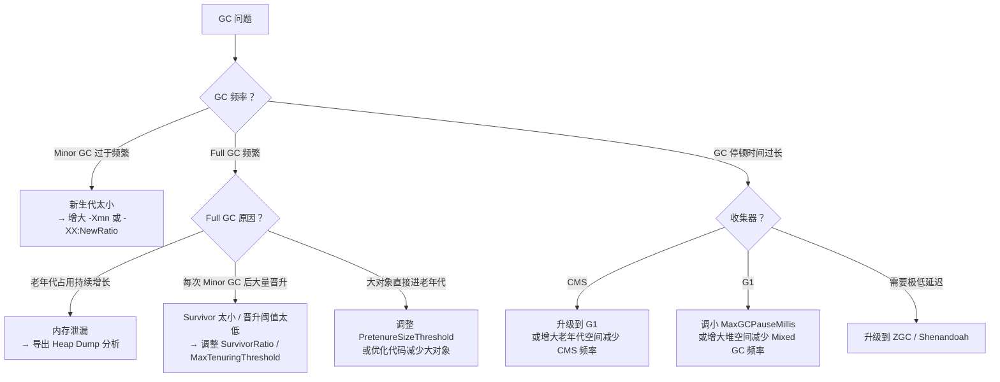
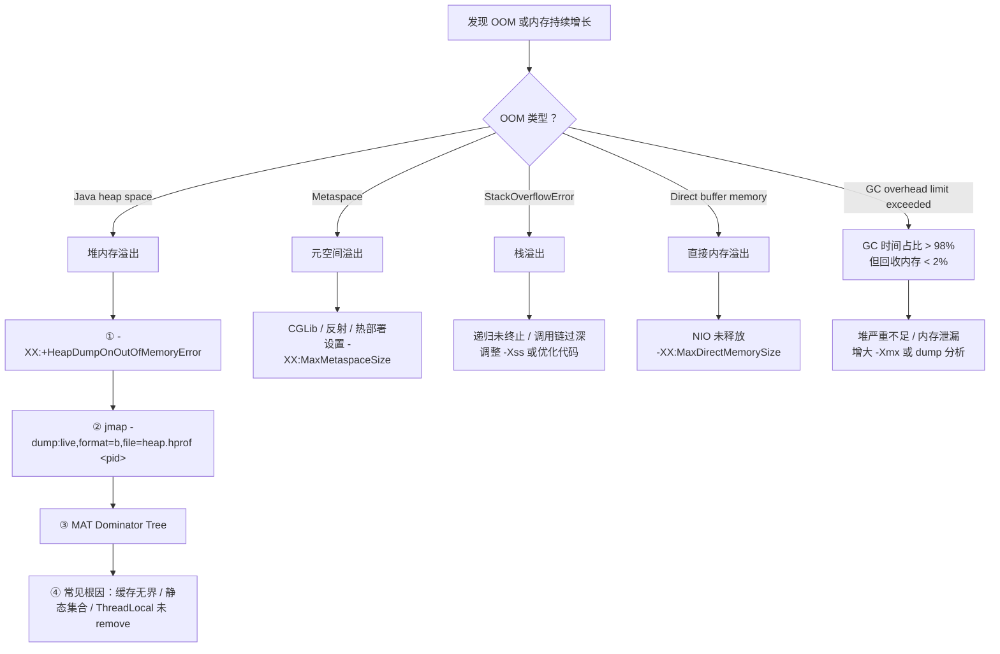

# GC 调优实战与常见误区 —— 方法论、参数矩阵、OOM 排查与设计原因

!!! info "**GC 调优实战 一句话口诀**"
    - **调优不是猜参数** —— 先定**目标**（吞吐 / 延迟 / 内存 · **三者互斥**），再**测量**（`-Xlog:gc*` + JFR），最后**小步迭代**（一次只改一个参数 · 每次跑回归验证）。**上来就 `-Xmx8g -XX:+UseG1GC -XX:MaxGCPauseMillis=50` 是玄学不是调优**。
    - **堆不是越大越好** —— CMS / G1 下堆越大 · 单次 Full GC 停顿越长；只有 **ZGC / Shenandoah** 能靠染色指针 + 读屏障做到"停顿与堆大小无关"，所以只有它们下**大堆才安全**。
    - **`System.gc()` 是建议不是命令** —— 生产必加 `-XX:+DisableExplicitGC`，否则三方库一行 `System.gc()` 就能让你整夜加班。**唯一例外**：依赖 `DirectByteBuffer.Cleaner` 回收堆外内存时改用 `-XX:+ExplicitGCInvokesConcurrent`（允许但降为并发）。
    - **OOM 四字诀** —— **堆（Java heap space）查对象链**、**栈（StackOverflowError）查递归**、**元空间（Metaspace）查代理类**、**直接内存（Direct buffer memory）查 NIO**。对号入座、不越界。
    - **生产必开三件套** —— GC 日志（`-Xlog:gc*`）+ OOM 堆转储（`-XX:+HeapDumpOnOutOfMemoryError`）+ 禁用显式 GC（`-XX:+DisableExplicitGC`）。**出事才有现场可查**，比事后 100 行日志分析都值。

<!-- -->

> 📖 **边界声明**：本文聚焦"GC 调优方法论、参数矩阵与 OOM 排查流程"（工程实战视角），以下主题请见对应姊妹文档：
>
> - **GC 算法、三色标记、写屏障、染色指针、五大收集器实现原理** → [GC 核心机制与收集器演进](@java-JVM-GC核心机制与收集器演进)（本文只讨论"参数调优 · 日志阅读 · 排查流程"，不重讲原理）
> - **内存分区、对象头、Mark Word、压缩指针 32GB 边界** → [JVM 内存分区与对象布局](@java-JVM-内存分区与对象布局)
> - **容器化 JVM、虚拟线程、JFR 深度使用、分代 ZGC（JEP 439 / JEP 474）落地** → [JVM 现代实践与前沿技术](@java-JVM-现代实践与前沿技术)
> - **`Reference` 强度族与 `WeakHashMap` / `ThreadLocalMap` 泄漏机制** → [集合框架](@java-数据结构-集合框架) / [GC 核心机制与收集器演进](@java-JVM-GC核心机制与收集器演进)
> - **CMS 三大缺陷（浮动垃圾 / 碎片 / 并发模式失败）源码级展开** → [GC 核心机制与收集器演进](@java-JVM-GC核心机制与收集器演进) §"CMS 四阶段"

---

## 1. 调优方法论：目标 → 测量 → 分析 → 验证

### 1.1 生产事故引子：老手也翻车的"参数玄学"三连击

**引子 1 · `MaxGCPauseMillis` 越调越卡**

某电商大促前，运维把 `-XX:MaxGCPauseMillis` 从默认 200ms 调到 50ms —— **本以为停顿会变短，结果 P99 反而从 80ms 涨到 400ms**。事后才知：G1 为达到 50ms 目标必须把每次 Mixed GC 处理的 Region 数减半，回收速率跟不上分配速率 → 老年代积压 → 触发 Full GC → 单次 300ms+ 停顿。**"停顿目标越小越好"是最经典的调优反模式**。

**引子 2 · 元空间"无上限"不等于"不用管"**

某 Spring Boot 微服务莫名频繁 Full GC，日志显示 `Metadata GC Threshold` —— 排查两天才发现是没设 `-XX:MaxMetaspaceSize`，元空间默认无上限但受 `MetaspaceSize`（触发首次 Full GC 的水位线）驱动 → CGLib 生成大量代理类推高元空间 → 每次跨过水位就 Full GC。

**引子 3 · 容器时代 `-Xmx` 硬编码是头号地雷**

容器里 `-Xmx4g` 硬编码，某天 SRE 把 K8s Pod 内存 limit 从 6G 调到 4G —— **JVM 直接被 OOMKilled，且没有留下任何 Java 层 OOM 日志**。因为 Java 堆 4G + 元空间 512M + 直接内存 1G + 线程栈 + JIT Code Cache 早就超过 4G 容器 limit，被 Linux OOM Killer 干掉。

### 1.2 反问引子：老手也未必答得上的 5 个调优悬案

- **悬案 1**：GC 日志里 `Total time for which application threads were stopped: 5.2s` 但 `[Times: real=0.02 secs]` —— 剩下的 5 秒去哪了？（提示：**TTSP 空洞** · 见 [GC 核心机制](@java-JVM-GC核心机制与收集器演进) §"Safepoint"）
- **悬案 2**：`-Xmx` 和 `-Xms` 为什么要设成一样？"堆自动扩容不是很省内存吗？"
- **悬案 3**：`System.gc()` 到底能不能被执行？为什么禁用它、又要留 `ExplicitGCInvokesConcurrent` 后门？
- **悬案 4**：为什么容器里必须 `-XX:MaxRAMPercentage=75.0` 而不是 `-Xmx4g`？剩下的 25% 是给谁的？
- **悬案 5**：Full GC 频繁 —— 是"老年代满了"吗？还有几种触发原因？

这五个悬案的答案都写在 GC 日志 + `jcmd` 输出 + K8s 事件里。

### 1.3 GC 调优的唯一正确流程

!!! tip "⭐ 调优五步铁律"
    ```txt
    ① 定目标 → ② 基线测量 → ③ 分析瓶颈 → ④ 小步修改 → ⑤ 回归验证 → ⑥ 上线观察
    ```

    **反模式**：跳过 ①② 直接 ④、一次改多个参数、无压测直接上线。**没有测量就没有调优**。

**调优目标三选一（互有冲突）**：

| 目标 | 关注指标 | 推荐收集器 | 典型场景 |
| :-- | :-- | :-- | :-- |
| **高吞吐** | Throughput（业务 CPU 时间占比） | Parallel / G1 | 离线批处理、大数据任务 |
| **低延迟** | P99 / P999 GC 停顿 | ZGC / Shenandoah / G1 | 交易系统、实时推荐 |
| **低内存** | Footprint（常驻内存） | Serial / 小堆 | 嵌入式、资源受限容器 |

!!! warning "三者互斥 · 顿悟点"
    追吞吐就得容忍长停顿、追低延迟就得牺牲吞吐和堆利用率、追低内存就得接受 GC 频繁。**一套参数不可能三个指标全占**，先确认业务真正要什么再动手。

---

## 2. GC 日志分析（老手视角）

### 2.1 开启统一 GC 日志

```bash
# JDK 9+ 统一日志（推荐）
-Xlog:gc*:file=gc.log:time,uptime,level,tags:filecount=10,filesize=100m

# JDK 8
-XX:+PrintGCDetails -XX:+PrintGCDateStamps -Xloggc:gc.log
```

**关键约定**：

- `filecount` + `filesize` 做日志轮转，避免 GC 日志把磁盘吃满
- 日志路径必须落到持久化目录（不能在容器临时目录 · 容器重启会丢）
- `-Xlog:gc*` 里的 `*` 是通配所有以 `gc` 开头的 GC 相关子日志（`gc` / `gc+heap` / `gc+phases` / `gc+ergo` 等）。`safepoint` 是独立顶层标签，需单独指定：`-Xlog:gc*,safepoint=info`。

### 2.2 读懂一条 G1 GC 日志

**Young GC（正常疏散暂停）**：

```txt
[2.345s][info][gc] GC(3) Pause Young (Normal) (G1 Evacuation Pause)
│         │         │     │           │         └─ 原因：Eden 满触发疏散
│         │         │     │           └─ Normal（非 Concurrent Start / Mixed）
│         │         │     └─ Young GC（只回收 Young Region）
│         │         └─ 第 3 次 GC
│         └─ 日志级别
└─ JVM 启动后经过时间

[2.345s][info][gc,heap] GC(3) Eden regions: 128->0(128)   ← Eden 清空
[2.345s][info][gc,heap] GC(3) Survivor regions: 8->12(16) ← Survivor 增
[2.345s][info][gc,heap] GC(3) Old regions: 64->64(512)    ← Old 未变（Young GC 不回收 Old）
[2.356s][info][gc     ] GC(3) Pause Young (Normal) 512M->256M(1024M) 11.234ms
                                                    │       │   │      └─ 停顿时间
                                                    │       │   └─ 堆总大小
                                                    │       └─ GC 后堆
                                                    └─ GC 前堆
```

**Mixed GC（混合回收 · 老年代占比超阈值触发）**：

```txt
[15.678s][info][gc] GC(42) Pause Young (Mixed) (G1 Evacuation Pause)
                                    ↑ Mixed = 同时回收 Young + 部分 Old Region
[15.678s][info][gc,heap] GC(42) Old regions: 256->198(512)  ← Old 回收 58 个 Region
[15.689s][info][gc     ] GC(42) Pause Young (Mixed) 768M->512M(1024M) 10.876ms
```

**Full GC（应避免 · 出现即需排查）**：

```txt
[30.123s][info][gc] GC(99) Pause Full (G1 Compaction Pause)
                                        ↑ 原因：Mixed GC 来不及回收 / 大对象分配失败
[30.123s][info][gc,heap] GC(99) Heap before GC: 1020M(1024M)  ← 堆几乎打满
[30.456s][info][gc     ] GC(99) Pause Full 1020M->256M(1024M) 333.456ms
                                                                ↑ 333ms · 远超 Young GC
```

!!! warning "Full GC 的三大触发原因（务必背熟）"
    1. **Mixed GC 来不及回收**：老年代增长速率 > Mixed GC 回收速率 → 调小 `-XX:InitiatingHeapOccupancyPercent`（默认 45%）提前触发
    2. **大对象（Humongous）分配失败**：单个对象 > Region 大小的 50% 直接进 Old · Old 满触发 Full GC → 调大 `-XX:G1HeapRegionSize`
    3. **元空间不足**：未设 `-XX:MaxMetaspaceSize` · 类加载过多 → 显式设置上限（Spring Boot 微服务推荐 512m~1g）

### 2.3 读懂一条 ZGC 日志（亚毫秒 STW · 全并发的物理证据）

```txt
[0.123s][info][gc,start ] GC(0) Garbage Collection (Warmup)
[0.123s][info][gc,phases] GC(0) Pause Mark Start 0.456ms          ← STW < 1ms
[0.124s][info][gc,phases] GC(0) Concurrent Mark 12.345ms          ← 并发 · 不停业务
[0.136s][info][gc,phases] GC(0) Pause Mark End 0.234ms            ← STW < 1ms
[0.136s][info][gc,phases] GC(0) Concurrent Process Non-Strong References 1.234ms
[0.138s][info][gc,phases] GC(0) Concurrent Reset Relocation Set 0.123ms
[0.138s][info][gc,phases] GC(0) Concurrent Select Relocation Set 2.345ms
[0.140s][info][gc,phases] GC(0) Pause Relocate Start 0.345ms      ← STW < 1ms
[0.140s][info][gc,phases] GC(0) Concurrent Relocate 8.901ms       ← 并发转移 · 不停业务
[0.149s][info][gc       ] GC(0) Garbage Collection (Warmup) 256M(25%)->128M(12%) 26.789ms
                                                              └─ 总耗时 26ms · 但 STW 合计 < 1.1ms
```

**顿悟点**：ZGC 的**总耗时**和 **STW 时间**是两个截然不同的概念 —— G1 时代混为一谈，ZGC 时代必须**只看 `Pause` 开头的三行**判断业务感受。染色指针 + 读屏障的物理机制细节 → [GC 核心机制](@java-JVM-GC核心机制与收集器演进) §"ZGC 染色指针"。

### 2.4 GC 日志关键词速查

| 日志关键词 | 含义 | 告警阈值 |
| :-- | :-- | :-- |
| `Pause Young (Normal)` | 正常 Young GC | 停顿 > 200ms 需关注 |
| `Pause Young (Mixed)` | Mixed GC（G1 老年代回收） | 停顿 > 200ms 需关注 |
| `Pause Full` | Full GC | **出现即告警** |
| `Concurrent Mode Failure` | CMS 并发失败 · 退化 Serial Old | **出现即告警**（[GC 核心机制](@java-JVM-GC核心机制与收集器演进) §"CMS 三大缺陷"完整机理） |
| `To-space Exhausted` | G1 Survivor/Old 空间不足 | **出现即告警** |
| `Allocation Failure` | Eden 满触发 GC（正常） | 频率过高需扩 Eden |
| `Metadata GC Threshold` | 元空间跨过水位 · 触发 Full GC | 需设 `MaxMetaspaceSize` |
| `Ergonomics` | JVM 自适应触发的 GC | 频繁出现说明堆分配不合理 |

### 2.5 推荐可视化工具

- **GCViewer**（离线 · 开源 · 支持 JDK 8~21）：三条曲线（Heap After / Pause / Throughput）一眼看清趋势
- **gceasy.io**（在线）：上传即分析、可识别 40+ 种异常模式（浮动垃圾、大对象、内存泄漏）
- **JMC（JDK Mission Control）** + JFR：事件维度最全、可追踪具体分配调用栈

---

## 3. 常见 GC 问题诊断决策树



**决策树使用心法**：

1. **先看频率、再看类型、最后看停顿** —— 频率高、类型 Full、停顿长 = 三种不同处方，不要一锅端
2. **Full GC 频繁不等于内存泄漏** —— 也可能是元空间没上限 / 大对象太多 / CMS 并发模式失败
3. **停顿长不一定是 GC 慢** —— TTSP 空洞（[GC 核心机制](@java-JVM-GC核心机制与收集器演进) §"Safepoint"）也会让业务感觉停顿长

---

## 4. OOM 排查流程（OOM 四字诀）

### 4.1 五种 OOM 类型对照



### 4.2 堆 OOM 排查四步法（工程标准流程）

```bash
# 步骤 1：生产环境务必预设 OOM 自动转储
-XX:+HeapDumpOnOutOfMemoryError
-XX:HeapDumpPath=/var/log/app/heap.hprof

# 步骤 2：未预设时手动导出（活着的进程）
jmap -dump:live,format=b,file=heap.hprof <pid>

# 步骤 3：MAT 分析
#   - Leak Suspects Report（自动识别大对象持有链）
#   - Dominator Tree（对象层级 · 找持有大量内存的顶端节点）
#   - Path to GC Roots（一路追到 Root 定位泄漏源）

# 步骤 4：定位常见根因
#   - 静态集合（static Map / List）只加不删
#   - 缓存无上限（Caffeine / Guava Cache 不设 maximumSize）
#   - ThreadLocal 在线程池场景未 remove
#   - 监听器 / 回调注册后未反注册
```

### 4.3 OOM 五字诀 · 完整对号入座表

| OOM 类型 | 报错信息 | 主要根因 | 排查工具 |
| :-- | :-- | :-- | :-- |
| **堆** | `java.lang.OutOfMemoryError: Java heap space` | 大对象 / 缓存无界 / 静态集合 / 内存泄漏 | MAT + Heap Dump |
| **栈** | `java.lang.StackOverflowError` | 递归未终止 / 调用链过深 | jstack + 线程 dump |
| **元空间** | `java.lang.OutOfMemoryError: Metaspace` | CGLib 代理类无节制 / 反射 / 热部署 | `jcmd VM.metaspace` |
| **直接内存** | `java.lang.OutOfMemoryError: Direct buffer memory` | Netty / NIO ByteBuffer 未释放 | `jcmd VM.native_memory` |
| **GC 开销超限** | `java.lang.OutOfMemoryError: GC overhead limit exceeded` | 堆严重不足 / 内存泄漏（GC > 98% CPU · 回收 < 2%） | MAT + GC 日志 |

**顿悟点**：五种 OOM **各有专属报错关键词** —— 拿到栈顶第一行就能定位到具体类型。**永远先看 `OutOfMemoryError` 后面的冒号 · 别先看栈**。

!!! note "📖 术语家族：`OutOfMemoryError` OOM 类型族"
    **字面义**：`OutOfMemoryError` = "内存耗尽错误" · JLS §11.1.1 中最著名的 `Error` 子类。

    **在 JVM 中的含义**：JVM 内存**任一分区**耗尽时抛出 · 报错关键词直接对应耗尽分区 · **是 JVM 层最可靠的分区诊断信号**。

    **家族成员**（8 个 · 覆盖 JVM 全部内存耗尽场景）：

    | 成员 | 报错关键词 | 耗尽分区 | 主要根因 | 排查工具 |
    | :-- | :-- | :-- | :-- | :-- |
    | **堆 OOM** | `Java heap space` | Java Heap | 缓存无界 / 静态集合 / 内存泄漏 | MAT + Heap Dump |
    | **栈 OOM** | `StackOverflowError`（严格是 Error 非 OOM · 但归入 OOM 家族） | 线程栈 | 递归未终止 / 调用链过深 | jstack |
    | **元空间 OOM** | `Metaspace` | 元空间（Native） | CGLib 代理 / 反射 / 热部署 | `jcmd VM.metaspace` |
    | **压缩类空间 OOM** | `Compressed class space` | Compressed Class Space（元空间子集 · 压缩指针启用时） | 类过多 · 超过 `-XX:CompressedClassSpaceSize` | 同元空间 |
    | **直接内存 OOM** | `Direct buffer memory` | Native · 由 NIO 显式申请 | Netty / NIO ByteBuffer 未释放 | `jcmd VM.native_memory` |
    | **代码缓存 OOM** | `CodeCache` | JIT 编译产物存储 | 大量 JIT 编译 · 未启用 `SegmentedCodeCache` | `jstat -jitcompiler` |
    | **GC 开销超限** | `GC overhead limit exceeded` | 综合信号（GC > 98% CPU · 回收 < 2%） | 堆严重不足 / 内存泄漏 | MAT + GC 日志 |
    | **无法创建线程** | `unable to create native thread` | 系统线程数 / 内存限制 | 线程数超 ulimit / 每线程栈过大 | `ulimit -a` + jstack |

    **命名规律**：`OutOfMemoryError: <耗尽分区名>` —— 冒号后即是精确定位。**栈溢出走独立 Error（`StackOverflowError`）但语义归入 OOM 家族**。

    **一句话总结**：**OOM 四字诀（堆 / 栈 / 元空间 / 直接内存）+ 三个补充（压缩类空间 / 代码缓存 / GC 开销）覆盖 JVM 全部内存耗尽场景**。

---

## 5. 常用 JVM 参数速查矩阵

### 5.1 核心参数

| 参数 | 含义 | 推荐值 |
| :-- | :-- | :-- |
| `-Xms` / `-Xmx` | 初始 / 最大堆大小 | **设为相同值**，避免动态扩容引发 Full GC |
| `-Xmn` | 新生代大小 | 堆的 1/3 ~ 1/4（G1 下不建议手动设，由 G1 自适应） |
| `-Xss` | 每个线程栈大小 | 256k ~ 1m |
| `-XX:MetaspaceSize` | 元空间初始高水位（触发首次 Full GC 的阈值） | Spring Boot 微服务 256m 起步 |
| `-XX:MaxMetaspaceSize` | 元空间最大大小 | Spring Boot 微服务 512m ~ 1g |
| `-XX:+UseG1GC` | 使用 G1 收集器 | JDK 9+ 默认；JDK 8 需显式指定 |
| `-XX:MaxGCPauseMillis` | G1 停顿时间目标 | 100 ~ 200ms（过小导致频繁 Mixed GC） |
| `-XX:G1HeapRegionSize` | G1 Region 大小 | 1m ~ 32m（2 的幂次） |
| `-XX:+UseZGC` | 使用 ZGC | JDK 15+ 稳定；JDK 23+ 默认分代 |
| `-XX:+HeapDumpOnOutOfMemoryError` | OOM 时导出堆快照 | **生产必开** |
| `-XX:HeapDumpPath=<path>` | 堆快照路径 | 大盘或网络存储 · 避免被容器清理 |
| `-XX:+DisableExplicitGC` | 禁用 `System.gc()` | **生产推荐** |
| `-XX:+ExitOnOutOfMemoryError` | OOM 时立即退出（配合 K8s 自愈） | 容器环境推荐 |
| `-Xlog:gc*` | 开启 GC 日志（JDK 9+） | **生产必开** |
| `-XX:MaxRAMPercentage=75.0` | 按容器内存比例自适应堆 | **容器环境必开** |

!!! note "📖 术语家族：GC 参数命名族"
    **字面义**：JVM 参数按前缀划分三大族 —— `-X` = 标准非稳定参数 · `-XX:` = 高级参数 · 无前缀 = 系统属性。

    **在 JVM 中的含义**：前缀直接暗示"稳定性 · 是否跨 JVM 版本兼容 · 是否影响 GC"。

    **家族成员**：

    | 前缀 | 含义 | 典型成员 | 版本兼容性 |
    | :-- | :-- | :-- | :-- |
    | `-Xms` / `-Xmx` / `-Xmn` / `-Xss` | 堆 / 栈内存类 · 标准参数 | 上述 4 个 + `-Xloggc` | **跨所有 JVM 版本稳定** |
    | `-XX:+<Flag>` / `-XX:-<Flag>` | 布尔开关 | `+UseG1GC` / `+HeapDumpOnOutOfMemoryError` / `+DisableExplicitGC` | 部分参数随版本废弃（如 `+UseConcMarkSweepGC` JDK 14 移除） |
    | `-XX:<Key>=<Value>` | 数值 / 字符串参数 | `MaxGCPauseMillis=200` / `MaxMetaspaceSize=512m` / `MaxRAMPercentage=75.0` | 跨版本相对稳定 |
    | `-XX:+PrintFlagsFinal` | 元查询参数 | 打印所有参数最终值 · **排查参数是否生效的终极大招** | 所有 JVM 版本可用 |
    | `-Xlog:<tag>` | 统一日志系统（JDK 9+） | `-Xlog:gc*` / `-Xlog:safepoint=info` / `-Xlog:class+load` | JDK 9+ · **替代 JDK 8 各种独立 `-XX:+Print*` 参数** |

    **命名规律**：

    1. **`-Xms/Xmx/Xmn/Xss` 前缀 `-X`** 是"最稳定 · 跨所有 JVM 版本"参数 —— 老手第一批背下的四个
    2. **`-XX:+/-` 是布尔开关** · **`-XX:Key=Value` 是数值**
    3. **JDK 9+ 统一走 `-Xlog:<tag>`** · JDK 8 各种独立 `-XX:+Print*` 参数（`+PrintGCDetails`、`+PrintGCDateStamps`、`+PrintSafepointStatistics`）在 JDK 9+ 都被整合到 `-Xlog`

    **一句话总结**：**`-X` 是身份证 · `-XX:` 是护照 · `-Xlog:` 是新一代通用签证** —— 记住三条前缀规则 · 任何 JVM 参数一眼看穿身份。

### 5.2 生产环境黄金参数组合（G1 · JDK 17）

!!! tip "📌 一键复用模板"
    ```bash
    -Xms4g -Xmx4g
    -XX:+UseG1GC
    -XX:MaxGCPauseMillis=200             # 交易系统常用 100~200ms · 小于 50ms 会 Mixed GC 频繁
    -XX:MaxMetaspaceSize=512m
    -XX:+HeapDumpOnOutOfMemoryError
    -XX:HeapDumpPath=/var/log/app/heap.hprof
    -XX:+DisableExplicitGC
    -XX:+ExitOnOutOfMemoryError
    -Xlog:gc*:file=/var/log/app/gc.log:time,uptime,level,tags:filecount=10,filesize=100m
    ```

**顿悟点**：**"三必开 + 一固定 + 一自适应"** —— 三必开（GC 日志 / OOM 转储 / 禁 `System.gc()`）+ 一固定（`-Xms = -Xmx`）+ 一自适应（`MaxRAMPercentage` 容器场景）。这五条覆盖 90% 生产 JVM 参数需求。

---

## 6. 常见误区与边界（老手最容易踩的 4 个坑）

### ❌ 误区 1：堆内存设置越大越好

**根源**：堆越大 · 单次 Full GC 停顿越长（扫更多对象）。

**降维**：

- 延迟敏感 · 用 G1 + `-XX:MaxGCPauseMillis` 控停顿
- 大堆场景 · 用 **ZGC / Shenandoah** 实现亚毫秒 STW（染色指针 + 读屏障 · 见 [GC 核心机制](@java-JVM-GC核心机制与收集器演进) §"ZGC 染色指针 4 位编码"）

### ❌ 误区 2：`System.gc()` 能立即触发 GC

**根源**：`System.gc()` 只是**建议** · JVM 可以忽略。

**降维**：

- 生产禁用：`-XX:+DisableExplicitGC`
- **唯一例外**：依赖 `DirectByteBuffer.Cleaner` 回收堆外内存时 → 改用 `-XX:+ExplicitGCInvokesConcurrent`（允许但降为并发 · 不 STW）

### ❌ 误区 3：对象一定在堆上分配

**根源**：**逃逸分析 + 标量替换**能让对象**完全消失** —— 字段变为独立局部变量、不进堆。

**降维**：**"栈上分配"是误传** —— HotSpot 实际落地始终是**标量替换**。短方法 + 小作用域 + 不逃逸的临时对象最容易吃到这个优化。

> 📖 逃逸分析限制与实际收益 → [JVM 现代实践与前沿技术](@java-JVM-现代实践与前沿技术) §5.1

### ❌ 误区 4：老年代满了才触发 Full GC

**根源**：Full GC 触发条件**远不止老年代满**。

**完整触发清单**（任一条件即可）：

1. 老年代空间不足
2. 元空间空间不足（`Metadata GC Threshold`）
3. `System.gc()` 被调用（未禁用时）
4. CMS 并发模式失败（`concurrent mode failure` · 见 [GC 核心机制](@java-JVM-GC核心机制与收集器演进) §"CMS 三大缺陷"）
5. Minor GC 晋升失败（老年代无足够连续空间 · `HandlePromotionFailure`）
6. G1 大对象（Humongous）分配失败

### 边界：永久代 vs 元空间（JDK 8 分水岭）

| 维度 | 永久代（JDK 7-） | 元空间（JDK 8+） |
| :-- | :-- | :-- |
| **位置** | JVM 堆内 | 本地内存（堆外） |
| **大小** | 固定（`-XX:MaxPermSize`） | 默认无上限 |
| **GC** | 随 Full GC 回收 | 随 Full GC 回收 |
| **OOM 风险** | 高（大小固定） | 低（但**必须设上限** · 否则会吃光本地内存） |

---

## 7. 设计原因：为什么这样设计？（老手视角的顿悟收网）

### 7.1 为什么要分代收集？

**弱分代假说（Weak Generational Hypothesis）**：大多数对象**朝生夕死** —— 实测超过 90% 的对象在第一次 Minor GC 时就被回收。

**分代的收益**：Minor GC 只扫新生代（约堆的 1/3） · 速度快（通常 < 10ms） · 频率高但代价小。如果不分代 · 每次 GC 都要扫全堆 · 代价极高。

> 📖 三色标记 + 写屏障如何和分代协作 → [GC 核心机制与收集器演进](@java-JVM-GC核心机制与收集器演进) §"三色标记算法"

### 7.2 为什么 G1 要用 Region 替代连续分代？

**根源**：传统分代（CMS）的老年代是一整块连续内存 · 回收时必须处理整个老年代 · 停顿随堆增大而增大 · **不可控**。

**G1 的降维**：把堆切成小块 Region · 每次只选**垃圾最多的 Region** 回收（**Garbage First** 名字由来）· 在有限时间内回收最多垃圾 · **可预测停顿**。

> 📖 G1 Region + RSet + Mixed GC 完整机制 → [GC 核心机制与收集器演进](@java-JVM-GC核心机制与收集器演进) §"G1 Region + RSet"

### 7.3 为什么 ZGC 能做到亚毫秒停顿？

**根源**：**染色指针**（把 GC 状态编在指针高位 4 位）+ **读屏障**（业务线程读引用时自动修正被移动对象的指针）—— 让**对象转移（移动）能与业务线程并发进行 · 不需要 STW**。

**STW 只剩什么**：标记 GC Roots 等极少量工作 → 停顿 < 1ms · **与堆大小无关**。

> 📖 染色指针位布局 · 读屏障字节码插入 · Self-Healing 机制 → [GC 核心机制与收集器演进](@java-JVM-GC核心机制与收集器演进) §"ZGC 染色指针"

### 7.4 为什么 JDK 8 用元空间替换永久代？

1. **永久代大小固定** —— CGLib / 热部署场景容易 OOM
2. **Oracle 合并 HotSpot 和 JRockit** —— JRockit 没有永久代 · 合并后统一走"本地内存 · 无固定大小"
3. **元空间使用本地内存** —— 理论只受物理内存限制 · 更灵活（**代价**：必须显式设 `MaxMetaspaceSize` · 否则吃光本地内存）

---

## 8. 常见问题 Q&A（工程实战题）

**Q1：堆外内存（直接内存 / Native）该用多少？容器里怎么算？**

> **经验值**：容器内存 `limit` ≥ `Xmx + MaxMetaspaceSize + MaxDirectMemorySize + 线程数×Xss + 20% buffer`。实战中常用 `-XX:MaxDirectMemorySize=<Xmx/4>`（NIO / Netty 场景）。容器环境用 `-XX:MaxRAMPercentage=75.0`，把剩下 25% 留给堆外和内核。

**Q2：Full GC 频繁怎么排查？完整流程是什么？**

> ① 看 GC 日志确认 Full GC 触发原因（元空间？晋升失败？CMS `concurrent mode failure`？）；② 看老年代占用曲线——**持续增长是内存泄漏**、**锯齿状是晋升频繁**；③ 导出 Heap Dump 用 MAT 看 Dominator Tree；④ 定位根因：缓存无界、静态集合、`ThreadLocal` 未 `remove`、监听器未反注册。

**Q3：如何在容器里正确设置堆大小？为什么不能硬编码 `-Xmx4g`？**

> 不要用 `-Xmx4g` 硬编码——换容器规格就失效。用 `-XX:MaxRAMPercentage=75.0` 按容器内存比例自适应；JDK 10+ 默认开启 `UseContainerSupport` 能识别 cgroup 内存，JDK 8 需 `8u191+` 并显式加。容器里 `-Xmx` 和 `-Xms` 也建议相同。

**Q4：G1 和 ZGC 生产如何选型？CMS 还能用吗？**

> **G1**：堆 4G~32G、停顿要求 100~200ms，JDK 9+ 默认，稳定性首选；**ZGC**：堆 > 32G 或停顿要求 < 10ms，JDK 21+ 分代 ZGC 吞吐和延迟兼得，下一代默认；**CMS**：JDK 9 废弃、JDK 14 彻底移除，**新项目不要再选**。

**Q5：`System.gc()` 什么时候真的会被执行？和 `DirectByteBuffer` 回收有什么关系？**

> 未加 `-XX:+DisableExplicitGC` 时，默认触发 Full GC；加了则被忽略。`DirectByteBuffer` 释放依赖 `System.gc()` 触发 `Cleaner`——如果禁用了显式 GC，必须用 `-XX:+ExplicitGCInvokesConcurrent`（允许 `System.gc()` 但降为并发）或改用 Netty 的 `PooledByteBufAllocator` 管理堆外内存。

> 📖 **源码机制题**（"G1 怎么实现可预测停顿？"、"ZGC 染色指针位布局？"、"三色标记漏标为什么只有两种解法？"）已在 [GC 核心机制与收集器演进](@java-JVM-GC核心机制与收集器演进) 给出源码视角答案，本文不再重复，专注"工程调优 · 参数矩阵 · OOM 排查"题。

---

## 9. 生产上线 Checklist（收网清单 · 老手可打印贴显示器）

- [ ] **堆大小**：`-Xms` 与 `-Xmx` 相等（避免动态扩容 Full GC）
- [ ] **元空间**：**必设** `-XX:MaxMetaspaceSize` · 生产推荐 512m~1g
- [ ] **GC 日志**：**必开** `-Xlog:gc*` · 并做 rotation（`filecount` + `filesize`）
- [ ] **OOM 转储**：**必开** `-XX:+HeapDumpOnOutOfMemoryError -XX:HeapDumpPath=<持久化路径>`
- [ ] **禁用显式 GC**：**必开** `-XX:+DisableExplicitGC`（依赖 `DirectByteBuffer.Cleaner` 时改用 `-XX:+ExplicitGCInvokesConcurrent`）
- [ ] **容器环境**：必开 `-XX:+UseContainerSupport -XX:MaxRAMPercentage=75.0`
- [ ] **K8s 健康检查**：`livenessProbe` 延迟 ≥ 60 秒 · 避免启动期被重启
- [ ] **监控**：Prometheus 采集 `jvm_gc_*` 指标 · P99 停顿告警 > 500ms
- [ ] **压测**：上线前用真实业务流量跑 1 小时 · 看 GC 频率与停顿曲线
- [ ] **收集器选型**：JDK 8 用 G1、JDK 21+ 大堆 / 低延迟用 ZGC · **CMS 一律不选**
- [ ] **参数验证**：`java -XX:+PrintFlagsFinal -version | grep <Flag>` 确认参数实际生效

---

## 10. 🗺️ 跨战役知识伏笔

### 10.1 本文回收的伏笔

- ✅ 回收 [GC 核心机制](@java-JVM-GC核心机制与收集器演进) 埋下的伏笔："**写屏障代价 5%~10%、CMS 三大缺陷、G1 RSet 内存开销、ZGC 读屏障额外开销** —— `12c` 需承接完整 GC 参数调优链路 + Full GC 排查 checklist + G1 vs ZGC 生产选型"（★★★★★）
    - **落地位置**：§2 GC 日志分析（G1 Young/Mixed/Full + ZGC 亚毫秒 STW 完整日志样本）· §3 决策树 · §4 OOM 五字诀 · §5 参数矩阵 · §6 误区 3 & 4 · §8 Q4 收集器选型
- ✅ 回收 [JVM 内存结构与 GC 综览](@java-JVM-内存结构与GC) / [JVM 内存分区与对象布局](@java-JVM-内存分区与对象布局) 埋下的伏笔："GC 调优 checklist + 生产黄金参数组合 —— `12c` 需完整承接"（★★★★）
    - **落地位置**：§5.2 生产黄金参数组合 + §9 上线 Checklist 11 条

### 10.2 本文埋下的伏笔

| 本篇 → 目标篇 | 伏笔内容 | 优先级 |
| :-- | :-- | :-- |
| `12c` → [JVM 现代实践与前沿技术](@java-JVM-现代实践与前沿技术) | 容器化 JVM（`MaxRAMPercentage` · `UseContainerSupport`）· 虚拟线程 GC 视角 · JFR 深度使用 · 分代 ZGC（JEP 439 / JEP 474）参数调优 —— `12d` 需承接容器 & 前沿场景 | ★★★★★ |
| `12c` → [NIO 与 IO 模型深度解析](@java-OS-NIO与IO模型) | 直接内存 GC 回收路径 · `DirectByteBuffer.Cleaner` · `-XX:+ExplicitGCInvokesConcurrent` · Netty `PooledByteBufAllocator` —— `13` 需承接堆外内存工程视角 | ★★★★ |
| `12c` → [GC 核心机制](@java-JVM-GC核心机制与收集器演进) | 写屏障 / CMS 缺陷 / G1 RSet / ZGC 读屏障源码级机理 | ✅ 已闭环 |
| `12c` → [并发集合与实战陷阱](@java-并发-并发集合与实战陷阱) | `ThreadLocal` 在线程池未 remove 导致堆 OOM | ✅ 已闭环 |

