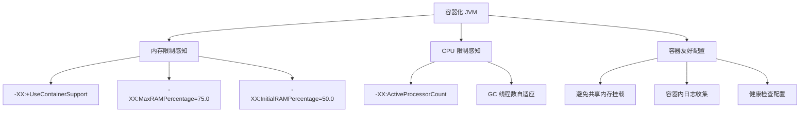
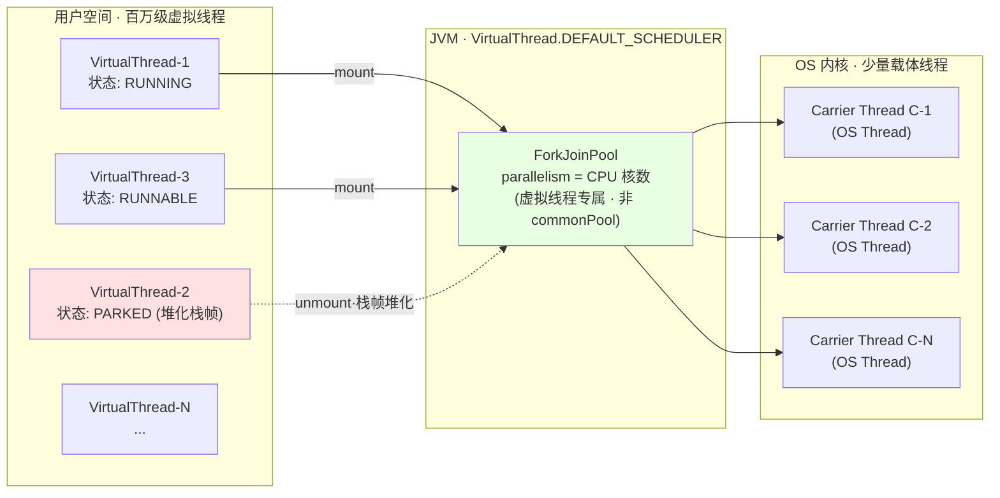
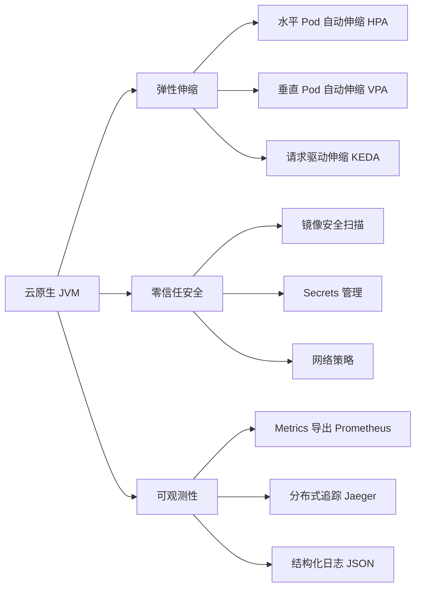

# JVM 现代实践与前沿技术 —— 容器化 cgroup 感知、虚拟线程 Continuation、JFR 零拷贝与云原生落地

## 1. 第一层：业务痛点 —— 从"容器 OOMKilled"到"虚拟线程 pin 载体线程"

### 1.1 生产事故现场：现代 JVM 三连击

**引子 1：容器里 `-Xmx4g` 硬编码 · 被 OOM Killer 无声干掉**

某支付网关容器化上线首周，Pod 内存 limit 6G，JVM 参数 `-Xmx4g -Xms4g -XX:MaxMetaspaceSize=512m -XX:MaxDirectMemorySize=1g` —— 灰度阶段一切正常。三周后 SRE 为节省成本把 Pod limit 从 6G 调到 4G，**JVM 直接被 OOM Killer 干掉、且没有留下任何 Java 层 OOM 日志**。事后核算：

```txt
4G 堆 + 512M 元空间 + 1G 直接内存 + 200 线程 × 1M 栈 + 240M JIT Code Cache ≈ 5.9G
```

早已超过 4G 容器 limit。**`-Xmx` 硬编码 = 容器时代典型误区** —— 应改为 `-XX:MaxRAMPercentage=75.0` 让 JVM 按容器规格自适应，容器扩缩容时无需重发布。

**引子 2：虚拟线程 `synchronized` pin 载体线程 · 收益归零**

某电商订单中心把 Tomcat 传统线程池换成虚拟线程（`Executors.newVirtualThreadPerTaskExecutor()`），JDK 21，**本以为吞吐量翻 10 倍、实测反而下降 40%**。JFR 采样发现：业务代码里的 `synchronized` 块（本地缓存锁、JDBC 驱动内部锁）**pin 住了载体线程** —— 8 核机器只有 7 个载体线程（`DEFAULT_SCHEDULER` 默认 `parallelism = availableProcessors() - 1`），全部被 pin 住时**整个 JVM 的虚拟线程调度停摆**。修复方案有二：

- **JDK 21~23**：把 `synchronized` 改为 `ReentrantLock`（可正常 unmount）
- **JDK 24+**：升级 JDK（JEP 491 彻底移除该限制，`synchronized` 零改动直接受益）

**引子 3：`ThreadLocal` 在百万虚拟线程场景内存爆炸**

某风控服务把 SpringMVC 的 `RequestContextHolder`（内部大量 `ThreadLocal`）跑在虚拟线程上，**每个虚拟线程都拥有独立的 `ThreadLocalMap`**，百万虚拟线程 = 百万份 `ThreadLocal` 副本，单个副本约 4KB，**累计 4GB 堆内存被 `ThreadLocalMap` 独占**。修复方案：

- **短期**：`try/finally + ThreadLocal.remove()` 严格清理
- **长期**：关注 `ScopedValue`（JEP 487 · JDK 24 Fourth Preview）—— 不可变、无副作用、天然适配虚拟线程作用域

### 1.2 五个核心底层问题

- **难题 1**：`Executors.newVirtualThreadPerTaskExecutor()` 返回的 Executor 内部到底"调度"到哪个线程池？和 `parallelStream` 用的 `ForkJoinPool.commonPool` 是同一个吗？（提示：**不是**，见 §2.1）
- **难题 2**：JFR 声称"持续开启开销 < 1%" —— **为什么**？和 async-profiler / JVMTI Agent 的采样机制有什么本质差异？（提示：**JFR 是 JVM 内部事件源、直接写 in-process ring buffer**，见 §2.3）
- **难题 3**：`-XX:MaxRAMPercentage=75.0` —— 剩下的 25% 是给谁的？为什么这个数字不是 90 也不是 50？（提示：**元空间 + 直接内存 + 线程栈 + Code Cache 总和**，见 §2.4）
- **难题 4**：分代 ZGC（JEP 439/474）到底解决了原 ZGC 的什么痛点？"低延迟"不是已经做到亚毫秒了吗？（提示：**吞吐量**，见 §4.1）
- **难题 5**：GraalVM Native Image 启动毫秒级 —— **为什么放弃了 JIT 峰值性能反而"更适合 Serverless"**？（提示：**冷启动占比**，见 §4.2）

这五个难题的答案都写在 JEP 文档、JFR 事件模型、cgroup 感知代码路径里 —— 掀开就都清晰了。

---

## 2. 第二层：字节码考古 —— 容器化字节 + `Continuation` 源码 + JFR 事件模型

> ⭐ **本层特殊说明**：JVM 现代实践的"字节码考古"聚焦**容器化 cgroup 感知源码路径**、**虚拟线程 `Continuation` 源码（HotSpot 层）**、**JFR 事件模型三大 API** 三条主线 —— 而非常规 `javap -v` 字节码考古（详见 [面向对象](@java-字节码-面向对象) 至 [函数式编程](@java-字节码-函数式编程)）。

### 2.1 虚拟线程 `Continuation` 源码考古：`Thread.startVirtualThread` 背后的底层链路

**主考古样本**（业务代码看起来平淡无奇）：

```java
Runnable task = () -> {
    System.out.println("before I/O");
    HttpClient.newHttpClient()
              .send(request, BodyHandlers.discarding());  // 阻塞点 · 触发 unmount
    System.out.println("after I/O");
};

Thread vt = Thread.ofVirtual().start(task);
```

**JDK 21 源码追踪**（`java.lang.VirtualThread`）：

```java
// VirtualThread.java（简化）
final class VirtualThread extends BaseVirtualThread {
    private final Continuation cont;  // ⭐ 每个虚拟线程持有一个 Continuation
    private final Executor scheduler; // ⭐ 调度到哪个载体线程池

    VirtualThread(Executor scheduler, ...) {
        // 默认 scheduler = DEFAULT_SCHEDULER
        // 注意：不是 ForkJoinPool.commonPool()！是虚拟线程专属的 ForkJoinPool
        this.scheduler = (scheduler != null) ? scheduler : DEFAULT_SCHEDULER;
        this.cont = new VThreadContinuation(this, task);
    }

    private void runContinuation() {
        // mount 到载体线程 · 执行 cont.run()
        // 遇到阻塞点（Park / I/O）时 cont.yield() 卸载（unmount）· 栈帧转移到堆
    }
}

// DEFAULT_SCHEDULER 初始化（VirtualThread 静态块）
private static ForkJoinPool createDefaultScheduler() {
    int parallelism = Runtime.getRuntime().availableProcessors();
    // ⭐ 独立的 ForkJoinPool · 不是 commonPool
    return new ForkJoinPool(parallelism, ..., true /* asyncMode */);
}
```

**关键结论**（难题 1 的答案）：

- 虚拟线程的调度器 `DEFAULT_SCHEDULER` 是**虚拟线程专属的 ForkJoinPool** ——**不是** `parallelStream` 用的 `ForkJoinPool.commonPool()`，两者**内存隔离**，`parallelStream` 阻塞 I/O 不会污染虚拟线程调度器
- `Continuation` 是 JDK 内部 API（`jdk.internal.vm.Continuation`），底层由 HotSpot 的 `runtime/continuation.cpp` 实现，通过 `freeze` / `thaw` 两条 native 方法完成栈帧的堆化与恢复
- **一次 `Continuation.yield()` = 一次"业务代码的暂停 + 栈帧复制到堆 + 载体线程释放"** —— 这就是 M:N 线程模型的底层机制

📖 `Continuation` 完整源码链路、`freeze` / `thaw` 汇编级实现、与 Kotlin Coroutine / Go Goroutine 的对比 → 见后续「并发编程」专题相关章节（拆分中），本文不再深展开。

!!! note "📖 术语家族：`Continuation` 与虚拟线程三件套"
    **字面义**：`Continuation` = "延续 · 可暂停可恢复的执行流"。

    **在 JVM 中的含义**：`jdk.internal.vm.Continuation` 是 JDK 内部 API，HotSpot `runtime/continuation.cpp` 实现，通过 `freeze`（栈帧堆化）/ `thaw`（栈帧恢复）两条 native 方法完成上下文切换。

    **同家族成员**：

    | 成员 | 作用 | 源码位置 |
    | :-- | :-- | :-- |
    | `Continuation` | 底层协程原语 | `jdk.internal.vm.Continuation` |
    | `ContinuationScope` | Continuation 作用域标识 | `jdk.internal.vm.ContinuationScope` |
    | `VThreadContinuation` | 虚拟线程专属，挂载 `VirtualThread` | `java.lang.VirtualThread.VThreadContinuation` |
    | `VirtualThread` | JLS 层虚拟线程实现 | `java.lang.VirtualThread` |
    | `BaseVirtualThread` | 虚拟线程抽象基类 | `java.lang.BaseVirtualThread` |
    | `Thread.startVirtualThread(Runnable)` | 快速创建虚拟线程静态方法 | `java.lang.Thread` |
    | `Thread.ofVirtual().start(...)` | Builder 风格创建 | `java.lang.Thread.Builder.OfVirtual` |
    | `Executors.newVirtualThreadPerTaskExecutor()` | 每任务一虚拟线程的 Executor | `java.util.concurrent.Executors` |
    | `StructuredTaskScope` | 结构化并发（JEP 480 · JDK 23 Preview） | `java.util.concurrent.StructuredTaskScope` |
    | `ScopedValue` | 虚拟线程作用域绑定值（JEP 487 · JDK 24 Preview） | `java.lang.ScopedValue` |

    **命名规律**：**`Virtual*` / `Continuation*` = "M:N 线程模型的语言层与虚拟机层协作"** —— `VirtualThread` 是 API、`Continuation` 是机制、`Scoped*` 是新时代取代 `ThreadLocal` 的绑定方案。

    **一句话总结**：**"`VirtualThread` 是外壳、`Continuation` 是引擎、`ScopedValue` 是燃料"** —— 三件套构成 Loom 项目完整版图。

### 2.2 `synchronized` pin 载体线程的机制对比（JDK 21~23 vs JDK 24）

**主考古样本**（同一段代码，两个 JDK 表现完全不同）：

```java
Thread.ofVirtual().start(() -> {
    synchronized (lock) {
        Thread.sleep(1000);  // JDK 21~23：pin 载体 · JDK 24：不 pin
    }
});
```

**JDK 21~23 · pin 机制**：

```txt
① 虚拟线程 VT-1 进入 synchronized 块
② JVM 底层用 monitorenter 字节码指令 · Object.monitor 关联到 OS 线程（载体 C-1）
③ Thread.sleep(1000) 本应触发 Continuation.yield() 释放载体
④ 但此刻 monitor 已绑定 C-1 · JVM 无法把 monitor 迁移给别的载体
⑤ → 载体 C-1 被 pin 住不能 unmount · 只能陪着虚拟线程一起 sleep
⑥ → 8 核机器 7 个载体全 pin 时 · 整个虚拟线程调度器停摆
```

**JDK 24（JEP 491）· 修复机制**：

```txt
① 虚拟线程 VT-1 进入 synchronized 块
② JVM 底层重构 monitor · 与虚拟线程（而非载体线程）绑定
③ Thread.sleep(1000) 触发 Continuation.yield()
④ 载体 C-1 释放 · 可执行其他虚拟线程
⑤ VT-1 sleep 结束后由任意载体 C-x 恢复 · 重新获取 monitor
⑥ ✅ synchronized 代码零改动 · 直接享受虚拟线程收益
```

**关键结论**：

- **JDK 21~23 阶段的临时方案**：`synchronized` → `ReentrantLock`（AQS 底层用 CAS + `LockSupport.park`，不绑定载体线程）
- **JDK 24+ 长期方案**：无需改动，JVM 底层重构 monitor 语义
- **JVM 参数辅助排查**：`-Djdk.tracePinnedThreads=full` 打印 pin 事件栈（JDK 21~23 排查利器）

📖 `ReentrantLock` / AQS / `LockSupport.park` 完整机制 → [AQS 设计哲学](@java-并发-AQS设计哲学)，本文不重讲。

### 2.3 JFR 事件模型：为什么持续开启开销 < 1%

**JFR 三层 API**：

```java
// 层 1：内置事件（GC / Thread / Lock / IO / TLAB / Method Sample · 300+ 种）
// jdk.jfr 模块自动埋点 · 无需业务代码介入

// 层 2：自定义事件（业务级追踪）
@Name("com.example.OrderProcess")
@Label("订单处理")
@Category("Business")
class OrderEvent extends jdk.jfr.Event {
    @Label("订单ID") String orderId;
    @Label("金额") @DataAmount long amount;
}

OrderEvent event = new OrderEvent();
event.begin();
try {
    processOrder();
} finally {
    event.commit();
}

// 层 3：编程 API 采集（jdk.jfr.Recording）
Recording r = new Recording();
r.enable("jdk.CPULoad").withPeriod(Duration.ofSeconds(1));
r.enable("jdk.GCPhasePause");
r.start();
```

**低开销的根本原因**（难题 2 的答案）—— JFR 采样流程的**三层零拷贝设计**：

```txt
业务线程                            JFR Ring Buffer         JFR Disk Writer
                                     (per-thread)              (background)
  │                                     │                          │
  │─ event.commit() ─→ 写线程本地缓冲 ─→│                          │
  │  (无锁 · 无阻塞 · 直接 memory copy)  │  缓冲满 ─→               │
  │                                     │            ↓             │
  │                                     │      Global Buffer ────→ │
  │                                     │      (lock-free flush)   │
                                                                    ↓
                                                              Disk / Ring
```

**关键结论**：

- **业务线程零锁** —— 事件写入 per-thread 缓冲，无锁竞争
- **无 Java 反射、无字符串拼接** —— JFR 事件是 native 化的紧凑二进制格式
- **无 JVMTI Agent 附加成本** —— JFR 是 JVM 内建（`jdk.jfr` 模块），不走 JVMTI 外部代理路径
- **对比 async-profiler**：async-profiler 依赖 Linux `perf_events` 系统调用，CPU 热点更精准（火焰图），但事件类型远不如 JFR 全 —— **生产实践建议 JFR 常态开启 + async-profiler 定点 CPU profiling**

### 2.4 容器化 cgroup 感知源码路径

**JDK 8u191+ / JDK 10+ 感知源码**（HotSpot `os_linux.cpp` 的 `os::available_memory`）：

```txt
JVM 启动时判断内存上限的底层链路：

① 优先读 cgroup v1：/sys/fs/cgroup/memory/memory.limit_in_bytes
② 或 cgroup v2（JDK 15+）：/sys/fs/cgroup/memory.max
③ 若容器未设 limit（返回巨大值 9223372036854771712 · 即 Long.MAX 附近）
   → 回退到宿主机 /proc/meminfo
④ 得到的 mem_limit 作为 -XX:MaxRAMPercentage 的分母
⑤ 最终 -Xmx = mem_limit × MaxRAMPercentage / 100
```

**关键参数速查表**：

| 参数 | 默认值 | 作用 | 推荐值 |
| :-- | :-- | :-- | :-- |
| `-XX:+UseContainerSupport` | JDK 10+ 默认开 | 读 cgroup 而非 /proc/meminfo | **显式写明** |
| `-XX:MaxRAMPercentage` | 25.0（默认过保守） | 堆占容器内存的最大比例 | **75.0** |
| `-XX:InitialRAMPercentage` | 1.5625 | 堆占容器内存的初始比例 | 50.0 |
| `-XX:MinRAMPercentage` | 50.0 | 小容器（< 250MB）时的堆比例 | 保持默认 |
| `-XX:ActiveProcessorCount` | 从 cgroup 读 | 显式设避免读到宿主机核数（K8s CPU limit 场景关键） | 与 `resources.limits.cpu` 对齐 |

**为什么留 25% 给堆外**（难题 3 的答案）：

```txt
容器内存 = Java 堆 + 元空间 + 直接内存 + 线程栈 + Code Cache + JVM 本身开销
        ≈ 75%       5%       5%~10%     5%       3%          2%
                    └─ MaxMetaspaceSize=512m
                          └─ MaxDirectMemorySize · NIO/Netty 场景
                                └─ 每线程 -Xss=1m × 线程数
                                        └─ CodeCache 240m 默认
```

**关键结论**：**"75% 留堆 · 25% 留堆外"是经验值** —— NIO/Netty 密集场景可能需要降到 60%，类加载少的微服务可能拉到 80%，但**绝不能设 90%+**，否则被 OOM Killer 干掉不留日志。

!!! note "📖 术语家族：容器化 JVM 参数族"
    **字面义**：`-XX:+UseContainerSupport` = "开启容器支持"，让 JVM 感知 cgroup 而非 /proc/meminfo。

    **在 JVM 中的含义**：容器化时代最重要的一组参数，决定 JVM 是否正确识别容器内存 / CPU 限制。

    **同家族成员**：

    | 参数 | 默认值（JDK 17） | 作用 | 推荐值 |
    | :-- | :-- | :-- | :-- |
    | `-XX:+UseContainerSupport` | true（JDK 10+） | 读 cgroup 而非宿主机 /proc/meminfo | 显式写明 |
    | `-XX:MaxRAMPercentage` | 25.0 | 堆占容器内存最大比例 | **75.0** |
    | `-XX:InitialRAMPercentage` | 1.5625 | 堆初始比例 | 50.0 |
    | `-XX:MinRAMPercentage` | 50.0 | 小容器（< 250MB）时的堆比例 | 保持默认 |
    | `-XX:ActiveProcessorCount` | 从 cgroup 读 | 显式指定 CPU 核数（K8s CPU limit 场景关键） | 与 `resources.limits.cpu` 对齐 |
    | `-XX:MaxRAM` | 从 cgroup 读 | 容器可见的最大内存 | 保持默认 |

    **命名规律**：**`MaxRAMPercentage` / `InitialRAMPercentage` / `MinRAMPercentage` 三兄弟**共同决定堆大小 —— 分别对应 `-Xmx` / `-Xms` / 小容器下限，`Percentage` 后缀标识"按容器内存比例"。

    **一句话总结**：**容器化 JVM 唯一正确调优范式 = `-XX:MaxRAMPercentage=75.0` 替代 `-Xmx` 硬编码**。

---

## 3. 第三层：JVM 现代硬件架构 —— 容器化 / M:N 线程模型 / 云原生

### 3.1 容器化 JVM 架构图与版本演进



**`-XX:+UseContainerSupport` JDK 版本演进表**：

| JDK 版本 | cgroup 感知能力 |
| :-- | :-- |
| **JDK 8（8u191 之前）** | **完全不感知** · 容器内跑 JVM = "瞎跑" · `-Xmx` 硬编码是唯一防御 |
| **JDK 8u191+** | 回迁 `UseContainerSupport` · **需手动开启** |
| **JDK 10+** | **默认开启** · 无需显式配置（但显式写明更保险） |
| **JDK 15+** | 进一步支持 **cgroup v2**（K8s 1.25+ 默认） |
| **JDK 17+** | Alpine Linux musl libc 完整支持 |

!!! tip "容器环境最佳实践配置"
    ```bash
    # 必须开启容器支持（JDK 10+ 默认开启；JDK 8 需 8u191+ 才支持）
    -XX:+UseContainerSupport

    # 基于容器内存限制的比例配置（推荐）
    -XX:MaxRAMPercentage=75.0
    -XX:InitialRAMPercentage=50.0

    # 显式设置 CPU 数量（K8s 中避免读到宿主机核数）
    -XX:ActiveProcessorCount=$(nproc)

    # G1 收集器优化
    -XX:+UseG1GC
    -XX:MaxGCPauseMillis=200
    -XX:G1HeapRegionSize=4m
    ```

### 3.2 虚拟线程 M:N 线程模型机制图



**关键机制回顾**：

- **mount / unmount**：`Continuation.run()` / `yield()` 完成栈帧在"载体线程栈"与"Java 堆"之间的搬迁
- **虚拟线程专属调度器**（`DEFAULT_SCHEDULER`）**独立于** `ForkJoinPool.commonPool` —— `parallelStream` 阻塞不会污染虚拟线程调度
- **载体线程数默认 = `Runtime.availableProcessors()`** —— 可通过 `-Djdk.virtualThreadScheduler.parallelism` 显式配置

**传统线程 vs 虚拟线程代码对比**：

```java
// 传统线程（1:1 线程模型）—— 每个 OS 线程对应一个 Java 线程
ExecutorService executor = Executors.newFixedThreadPool(200); // 200 个 OS 线程 · 200 MB 栈

// 虚拟线程（M:N 线程模型）—— 百万级轻量级线程
ExecutorService virtualExecutor = Executors.newVirtualThreadPerTaskExecutor();
// 每个任务一个虚拟线程 · 由 JVM 调度到少量载体线程（≈ CPU 核数）
```

### 3.3 云原生 JVM 完整架构



!!! tip "云原生配置清单（K8s Deployment 片段）"
    ```yaml
    resources:
      limits:
        memory: "2Gi"
        cpu: "2"
      requests:
        memory: "1Gi"
        cpu: "1"

    livenessProbe:
      httpGet:
        path: /actuator/health/liveness
        port: 8080
      initialDelaySeconds: 60
      periodSeconds: 10

    readinessProbe:
      httpGet:
        path: /actuator/health/readiness
        port: 8080
      initialDelaySeconds: 30
      periodSeconds: 5
    ```

!!! note "📌 云原生 JVM 三条硬约束"
    1. **启动时间**：Serverless / FaaS 场景下启动 > 3 秒不可接受 → **GraalVM Native Image** 或 **CRaC**
    2. **内存下限**：容器 `requests.memory` ≥ `Xmx + 元空间 + 直接内存 + 线程栈` 总和 × 1.2，否则 HPA 抖
    3. **JIT 预热**：K8s 滚动升级新 Pod 未预热就收流量 → 毛刺 → `readinessProbe` 延迟 + 预热流量，或用 **CDS / AOT** 缩短 JIT 冷启动

### 3.4 JIT 编译层级机制图

```txt
分层编译 (Tiered Compilation) · JDK 8+ 默认开启：

  Level 0：解释执行（Interpreter）
    ↓ 触发条件：方法被首次调用
  Level 1：C1 简单编译（不带 Profiling）
    ↓ 触发条件：热点检测确认高频路径
  Level 2：C1 有限 Profiling
    ↓
  Level 3：C1 完整 Profiling（准备给 C2 用）
    ↓ 触发条件：C1 收集足够 Profile
  Level 4：C2 深度优化（激进 · 逃逸分析 · 内联 · 锁消除）
    ↓ 若 Profile 假设失败 → Deoptimization → 回到 Level 0

  相关参数：
    -XX:MaxInlineSize=35          默认内联字节码大小上限
    -XX:+PrintCompilation          观察 JIT 决策
    -XX:+UnlockDiagnosticVMOptions -XX:+PrintInlining   内联详情
```

📖 逃逸分析 / 标量替换 / 锁消除的完整机制 → [GC 调优实战与常见误区](@java-JVM-GC调优实战与常见误区) §"误区 3：对象一定在堆上分配"（栈上分配的真相是标量替换），本文只讨论"JIT 在现代场景下如何调优"。

### 3.5 内存屏障与可见性

- **JMM happens-before 8 条规则**（程序次序、监视器锁、`volatile`、传递性…）→ 完整规则见 [并发基础：JMM 与线程同步](@java-并发-JMM与线程同步) §"happens-before 8 条"
- **`volatile` 写后 `StoreLoad` 屏障** · x86 实现为 `lock addl` 指令
- **`final` 字段的内存语义**：构造器 `return` 前对 `final` 字段的写入，对通过对象引用访问的其他线程均可见 —— **前提是 `this` 引用未在构造期间逃逸**

📖 `volatile` / `final` 双重屏障的字节码指令级分析 → [并发基础：JMM 与线程同步](@java-并发-JMM与线程同步)。

---

## 4. 第四层：工程红线与前沿实践

### 4.1 分代 ZGC（JEP 439 / JEP 474 / JEP 490）· 关键时间线

| JDK 版本 | JEP | 状态 | 启用方式 |
| :-- | :-- | :-- | :-- |
| **JDK 15** | JEP 377 | ZGC GA · **非分代** | `-XX:+UseZGC` |
| **JDK 21** | **JEP 439** | **分代 ZGC 引入** · 默认仍非分代 | `-XX:+UseZGC -XX:+ZGenerational` |
| **JDK 23** | **JEP 474** | **分代成为默认** · 非分代废弃 | `-XX:+UseZGC` 即分代 |
| **JDK 24+** | **JEP 490** | **非分代 ZGC 正式移除** | 仅剩分代模式 |

**分代 ZGC 的性能收益**（难题 4 的答案）：

- **原 ZGC 的痛点**：全堆统一扫描，每次标记都要扫全堆，**吞吐量偏低**（相比 G1 约 10~15% 差距）——"低延迟"用"高 CPU 占用 + 低吞吐"换来
- **分代 ZGC 的应对**：套用弱分代假说，新生代复制算法快速回收短命对象，老年代保留 ZGC 染色指针并发转移，**减少标记成本、吞吐量追平 G1、延迟仍亚毫秒**
- **关键结论**：**"分代 ZGC = G1 的吞吐 + ZGC 的延迟"** —— JDK 21+ 大堆场景（> 16GB）可以放心用，无需在 G1 / ZGC 之间纠结

📖 ZGC 染色指针 4 位编码、读屏障字节码、Self-Healing 机制 → [GC 核心机制与收集器演进](@java-JVM-GC核心机制与收集器演进) §"ZGC 染色指针"。

### 4.2 GraalVM Native Image vs CRaC · Serverless 冷启动优化

| 方案 | 启动时间 | 峰值性能 | 内存占用 | 适用场景 |
| :-- | :-- | :-- | :-- | :-- |
| **传统 JVM** | 秒~分钟级（JIT 预热） | 100%（C2 深度优化） | 高（JIT + Metaspace） | 长驻服务 |
| **GraalVM Native Image** | **毫秒级** | 80~85%（AOT · 无 JIT 运行时优化） | **低 10 倍**（无 JIT / Metaspace） | Serverless / FaaS / CLI |
| **CRaC（Checkpoint/Restore）** | 秒级 → **毫秒级恢复** | 100%（保留 JIT 状态） | 中（快照文件 + 运行时） | K8s 快速伸缩 |

**关键结论**（难题 5 的答案）：

- Serverless / FaaS 场景，单次请求生命周期 < 100ms，**冷启动占比 > 90%** —— 传统 JVM 3 秒 JIT 预热 = 30 次请求全在等 JIT，**峰值性能没法体现**
- GraalVM Native Image **提前编译（AOT）+ 关闭反射默认支持**，用"放弃 15% 峰值性能"换"启动时间从秒级降到毫秒级"—— **在 Serverless 场景总耗时反而更短**
- CRaC 走"冷启动一次 + 快照 + 后续毫秒恢复"路径，保留 JIT 峰值，**K8s 快速伸缩场景更划算**

### 4.3 现代性能分析工具选型

| 工具类别 | 工具名称 | 适用场景 | 特点 |
| :-- | :-- | :-- | :-- |
| **实时监控** | `jstat`, `vmstat`, `top` | 实时性能指标 | 轻量、低开销 |
| **堆分析** | MAT, `jhat`, VisualVM | 内存泄漏分析 | 离线、功能强大 |
| **CPU 分析** | async-profiler, JProfiler | 热点方法定位 | 火焰图、精准 |
| **GC 分析** | GCViewer, gceasy | GC 日志可视化 | 趋势分析 |
| **APM** | SkyWalking, Pinpoint | 分布式追踪 | 全链路 |
| **首选工具** | **JFR（Java Flight Recorder）** | **综合性能分析** | **低开销 < 1% · 生产友好** |

**JFR 生产实践一条命令**：

```bash
# 持续录制（覆盖最近 1 小时窗口 · 生产常态开启）
jcmd <pid> JFR.start maxsize=200m maxage=1h name=continuous

# 需要时转储快照
jcmd <pid> JFR.dump name=continuous filename=snapshot.jfr

# 事件级分析
jfr print snapshot.jfr --events GCPhasePause,ThreadPark,JavaMonitorEnter
jfr summary snapshot.jfr
```

### 4.4 生产红线四件套

!!! warning "🚨 生产环境四条红线（每条都是实践总结）"

    #### ❌ 红线 1：禁止使用无界队列

    **反模式**：

    ```java
    // ❌ Executors.newFixedThreadPool(100) 内部用 LinkedBlockingQueue
    //    默认容量 = Integer.MAX_VALUE · 任务积压时堆 OOM 前无任何背压
    ExecutorService executor = Executors.newFixedThreadPool(100);
    ```

    **标准范式**：

    ```java
    // ✅ 有界队列 + 拒绝策略：CallerRunsPolicy 让调用方执行 · 天然背压
    ThreadPoolExecutor executor = new ThreadPoolExecutor(
        10, 100, 60L, TimeUnit.SECONDS,
        new ArrayBlockingQueue<>(1000),
        new ThreadPoolExecutor.CallerRunsPolicy()
    );
    ```

    #### ❌ 红线 2：`ThreadLocal` 用后不 `remove`

    **反模式**：

    ```java
    // ❌ 线程池场景线程被复用 · ThreadLocal 副本永不释放 → 堆缓慢泄漏
    //    虚拟线程场景 · 百万副本 = 内存爆炸
    private static final ThreadLocal<BigContext> CTX = new ThreadLocal<>();

    public void handle() {
        CTX.set(new BigContext());
        doBusiness();
        // ⚠️ 无 remove
    }
    ```

    **标准范式**：

    ```java
    // ✅ try/finally 严格清理
    public void handle() {
        CTX.set(new BigContext());
        try {
            doBusiness();
        } finally {
            CTX.remove();
        }
    }
    ```

    #### ❌ 红线 3：静态集合缓存无上限控制

    **反模式**：

    ```java
    // ❌ 只加不删 · 元空间 / 堆双向膨胀
    private static final Map<K, V> CACHE = new HashMap<>();
    ```

    **标准范式**：

    ```java
    // ✅ Caffeine + maximumSize + expireAfterAccess
    private static final Cache<K, V> CACHE = Caffeine.newBuilder()
        .maximumSize(10_000)
        .expireAfterAccess(Duration.ofMinutes(10))
        .build();
    ```

    或用 `WeakHashMap`（key 弱引用可回收）。

    #### ❌ 红线 4：不设 `MaxMetaspaceSize` + 不开 GC 日志 + 不开 OOM Dump

    **反模式**：JDK 8+ 元空间默认无上限 · CGLib 代理类 / 反射框架 / 热部署持续推高元空间 → 触发 Full GC，**然而无 GC 日志、无 Heap Dump、事故现场零证据**。

    **标准范式**：

    ```bash
    -XX:MaxMetaspaceSize=512m
    -Xlog:gc*:file=gc.log:time,uptime:filecount=10,filesize=100M
    -XX:+HeapDumpOnOutOfMemoryError
    -XX:HeapDumpPath=/var/log/app/heap.hprof
    ```

### 4.5 生产环境故障案例库

**案例 1：元空间泄漏（CGLib 代理类未卸载）**：

```txt
# 症状：Metaspace 持续增长 · 频繁 Full GC
# 根因：Spring 反复创建 CGLib 代理 · 类加载器无法卸载
# 排查命令：
jcmd <pid> GC.class_histogram | head -20
jstat -gc <pid> 1000

# 修复：-XX:MaxMetaspaceSize=512m + 代理类缓存控制 + 类加载器隔离
```

**案例 2：堆外内存泄漏（Netty PooledByteBuf 未释放）**：

```bash
# 症状：物理内存（RSS）持续增长 · 堆内存正常
# 排查：Native Memory Tracking（有 5~10% 性能损耗 · 短期开启）
-XX:NativeMemoryTracking=summary   # 或 detail

jcmd <pid> VM.native_memory summary
jcmd <pid> VM.native_memory baseline
jcmd <pid> VM.native_memory summary.diff   # 对比找增长最快的分区

# 修复：Netty ReferenceCountUtil.release() + 用 SimpleChannelInboundHandler 自动释放
```

**案例 3：线程池无界队列 OOM**：

```java
// ❌ 反模式
ExecutorService executor = Executors.newFixedThreadPool(100);  // 内部 LinkedBlockingQueue 无界

// ✅ 修复
ThreadPoolExecutor executor = new ThreadPoolExecutor(
    10, 100, 60L, TimeUnit.SECONDS,
    new ArrayBlockingQueue<>(1000),
    new ThreadPoolExecutor.CallerRunsPolicy());
```

📖 线程池 7 参数与生命周期源码 → [并发工具：Lock 与线程池](@java-并发-并发工具Lock与线程池)。

### 4.6 前沿技术速览（2025 年视角）

| 项目 | JEP | 状态 | 对 JVM 的影响 |
| :-- | :-- | :-- | :-- |
| **虚拟线程** | 425 → 436 → 444 → 491 | JDK 21 GA · JDK 24 `synchronized` 修复 | I/O 密集吞吐提升 · 载体线程 pin 问题解决 |
| **分代 ZGC** | 439 → 474 → 490 | JDK 23 默认 · JDK 24 非分代移除 | 大堆低延迟 + 吞吐兼得 |
| **GraalVM Native Image** | — | 生产可用 | Serverless 冷启动毫秒级 · 内存降 10 倍 |
| **CRaC** | — | 孵化 | 冷启动秒级 → 毫秒级恢复 |
| **Valhalla（值类型）** | 401 / 402 | Preview | 消除对象头开销 · cache 局部性 |
| **Panama（外部函数 FFM API）** | 442 | **JDK 22 稳定** | 替代 JNI · 零拷贝访问堆外 |
| **ScopedValue** | 446 → 464 → 481 → 487 | JDK 24 **Fourth Preview** | 虚拟线程场景替代 `ThreadLocal` |
| **弹性元空间** | 387 | JDK 16+ | 释放内存及时归还 OS |
| **统一日志系统** | JDK 9+ | 稳定 | `-Xlog:<tag>` 替代分散 `-XX:+Print*` |

!!! note "📖 术语家族：JEP 版本演进族"
    **字面义**：JEP = **JDK Enhancement Proposal** · JDK 特性增强提案，每个 JEP 有独立编号，从 Preview → Second/Third Preview → GA 逐步稳定。

    **在 JVM 中的含义**：追踪现代 JVM 演进的唯一权威索引。

    **同家族成员**（虚拟线程 / 分代 ZGC / `ScopedValue` 三条主线）：

    | JEP | 主题 | 引入 JDK | 状态演进 |
    | :-- | :-- | :-- | :-- |
    | **425** | 虚拟线程 | JDK 19 | Preview |
    | **436** | 虚拟线程 | JDK 20 | Second Preview |
    | **444** | 虚拟线程 | **JDK 21** | **GA**（同步块仍 pin） |
    | **491** | 虚拟线程改进 | **JDK 24** | **GA** · `synchronized` 不再 pin |
    | **439** | 分代 ZGC | **JDK 21** | 引入 · 需 `+ZGenerational` |
    | **474** | 分代 ZGC | **JDK 23** | **默认** |
    | **490** | 分代 ZGC | **JDK 24** | 非分代模式移除 |
    | **446** | `ScopedValue` | JDK 21 | 1st Preview |
    | **464** | `ScopedValue` | JDK 22 | 2nd Preview |
    | **481** | `ScopedValue` | JDK 23 | 3rd Preview |
    | **487** | `ScopedValue` | **JDK 24** | 4th Preview（**仍未 GA**） |
    | **428** | 结构化并发 | JDK 20 | Incubator |
    | **480** | 结构化并发 `StructuredTaskScope` | JDK 23 | Preview |
    | **442** | 外部函数 FFM API | **JDK 22** | **GA** |
    | **387** | 弹性元空间 | JDK 16 | GA |

    **命名规律**：**同一特性多个 JEP 是版本演进** —— 记住"主 JEP 编号 + GA 版本"即可：虚拟线程 = JEP 444 / JDK 21；分代 ZGC = JEP 474 / JDK 23；`synchronized` 修复 = JEP 491 / JDK 24。

    **一句话总结**：**JEP 是"预览版专利号"、GA 是"生产版发布号"** —— 通过 JEP 号立即定位到 JDK 版本与特性成熟度。

**技术选型建议**：

- 🆕 **新项目（2025+）**：**JDK 21 LTS 或 JDK 25 LTS** + 分代 ZGC + 虚拟线程
- 🔄 **现有系统平稳过渡**：JDK 17 LTS + G1GC
- 🚀 **超大堆 / 低延迟**：JDK 23+（分代 ZGC 默认），堆 > 32GB 尤其推荐
- 🐳 **容器环境**：**必开** `-XX:+UseContainerSupport` + `-XX:MaxRAMPercentage=75.0`
- ⚡ **Serverless / FaaS**：GraalVM Native Image 或 CRaC

**总结要义**：

> **现代 JVM 的所有"新特性"都收敛到两条主线：容器化感知（cgroup + `MaxRAMPercentage`）决定内存边界、M:N 线程模型（虚拟线程 + `Continuation`）决定并发上限。理解了这两条主线，JDK 21~25 的所有 JEP 都是这两条主线的排列组合。**

---

## 5. 🗺️ 跨篇章知识关联

### 5.1 本文承接的知识点

| 来源 | 关联内容 | 落地位置 |
| :-- | :-- | :-- |
| **[GC 调优实战与常见误区](@java-JVM-GC调优实战与常见误区)** ★★★★★ | 容器化 JVM（`MaxRAMPercentage` · `UseContainerSupport`）· 虚拟线程 GC 视角 · JFR 深度使用 · 分代 ZGC 参数调优 | §1.1 引子三连击 · §2.3 JFR 事件模型 · §2.4 cgroup 感知源码 · §3.1 容器化架构图 · §4.1 分代 ZGC JEP 时间线 |
| **[JVM 综览](@java-JVM-内存结构与GC) / [内存分区](@java-JVM-内存分区与对象布局)** ★★★★★ | JVM 现代实践 —— 收束篇 · 承接容器化 + 前沿技术 | §3 三张现代机制图（容器化 / M:N 线程 / 云原生）· §4.6 前沿技术速览 |
| **[OOP](@java-字节码-面向对象)** ★★★ | 对象头 · Klass Pointer · 32GB 压缩指针边界 —— 容器场景下的堆大小选型 | §2.4 "为什么留 25% 给堆外" + §4.6 技术选型（堆 > 32GB 推荐分代 ZGC，隐含突破压缩指针边界） |

### 5.2 本文关联的知识点

| 本篇 → 目标篇 | 关联内容 | 优先级 |
| :-- | :-- | :-- |
| **`12d` → [Java NIO 与 I/O 模型](@java-OS-NIO与IO模型)** | 直接内存 GC 回收路径 · `DirectByteBuffer.Cleaner` · Netty `PooledByteBufAllocator` 管理堆外内存 · Panama FFM API（JEP 442）替代 JNI —— `13` 需承接堆外内存工程视角完整链路 | ★★★★★ |
| **`12d` → 后续「并发编程」HotSpot 专题（拆分中）** | `Continuation` `freeze` / `thaw` 汇编级实现 · `VirtualThread` 与 `ForkJoinPool` 调度器协作 · `ScopedValue` 完整 API —— 后续并发专题需承接 M:N 线程模型完整源码 | ★★★★★ |
| **`12d` → [Lock 与线程池](@java-并发-并发工具Lock与线程池)** | `ReentrantLock` 在虚拟线程场景下的 AQS `park` / `unpark` 与 `Continuation.yield` 协作 —— `10c` 需承接 AQS 在虚拟线程时代的新语义 | ★★★★ |
| **`12d` → [GC 调优实战与常见误区](@java-JVM-GC调优实战与常见误区)**（已完成） | 容器化 JVM 参数 · JFR 深度使用 · 分代 ZGC 参数 | ✅ 已闭环 |
| **`12d` → [GC 核心机制与收集器演进](@java-JVM-GC核心机制与收集器演进)**（已完成） | 分代 ZGC 染色指针 · 读屏障 · Self-Healing | ✅ 已闭环 |
| **`12d` → [JVM 内存分区与对象布局](@java-JVM-内存分区与对象布局)**（已完成） | 五分区内存布局（堆 / 元空间 / 直接内存 / 线程栈 / Code Cache） | ✅ 已闭环 |

### 5.3 Q&A 归属指引

按项目规则 §5.1 原则 ③，深度源码型收网篇不设独立 Q&A 章节。本文相关的现代实战、JEP 演进、前沿选型题在正文各层已给出答案：

| 题目 | 答案所在 |
| :-- | :-- |
| 容器里跑 JVM 明明 `-Xmx` 设小了为何还被 OOM Killer 杀？如何一次性根治？ | §1.1 引子 1 + §2.4 + §4.4 红线 4 |
| 虚拟线程到底适合什么场景？为什么 `synchronized` 会让它失效？JDK 24 怎么修的？ | §1.1 引子 2 + §2.1 + §2.2 |
| JFR 和 async-profiler 怎么选？为什么 JFR 能持续开启开销 < 1%？ | §2.3 + §4.3 |
| 分代 ZGC 和原来的 ZGC 有什么区别？我该用哪个？ | §4.1 |
| Serverless 为什么用 GraalVM Native Image 反而更快？和传统 JIT 的取舍是什么？ | §4.2 + §4.6 |

📖 **JIT 逃逸分析源码、`volatile` 双重屏障、`Continuation` 汇编实现**三类深度源码题已在 [GC 调优实战与常见误区](@java-JVM-GC调优实战与常见误区) / [并发基础：JMM 与线程同步](@java-并发-JMM与线程同步) / HotSpot 专题给出，本文不再重复。
