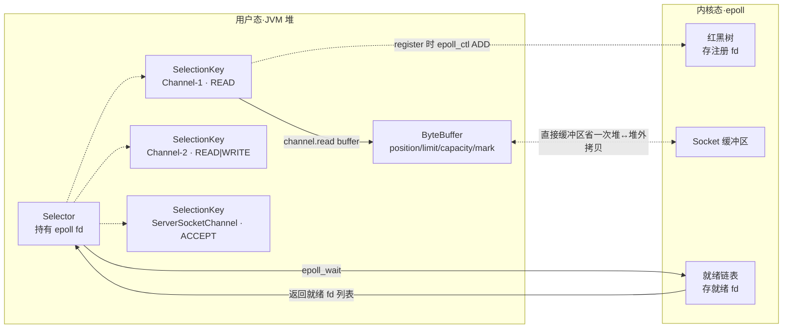
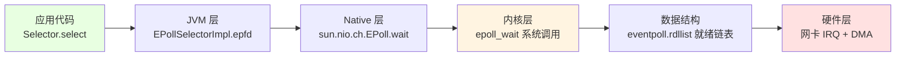

# Java NIO 与 I/O 模型：从 epoll 红黑树到 sendfile 零拷贝的内核穿刺

!!! info "**Java NIO 与 I/O 模型 一句话口诀**"
    - **五种 I/O 模型两阶段记忆法**：`阶段一 = 等待数据（内核等网卡）` + `阶段二 = 拷贝数据（内核 → 用户空间）`。**同步 vs 异步的物理分水岭只看阶段二**——阶段二由**应用线程**拷贝就是同步（BIO / NIO / 多路复用 / 信号驱动全在此列）；阶段二由**内核**完成才是真异步（Java AIO / `io_uring`）。
    - **Java NIO 对应的 OS 模型是"I/O 多路复用"、不是"非阻塞 I/O"**：`Selector` → `epoll_create1`、`Channel.register` → `epoll_ctl`、`selector.select` → `epoll_wait`——Java 层的"NIO"是营销名词，OS 层的准确称呼是"I/O 多路复用"，**`Selector` 本身是阻塞的**，只是阻塞的是 Selector 而非单个 Channel。
    - **epoll 的三个系统调用 = O(1) 就绪查询的物理基石**：`epoll_create1` 建 `eventpoll` 对象（**红黑树** 存注册的 fd + **就绪链表** 存已就绪 fd）→ `epoll_ctl` 注册 fd 到红黑树 + 为该 fd 的网卡驱动挂 `ep_poll_callback` 钩子 → `epoll_wait` 只扫就绪链表（**O(1) 与 fd 总数无关**）——select / poll 的 O(n) 全量扫描痛点被彻底消灭。
    - **`FileChannel.transferTo()` 底层是 sendfile —— 4 次拷贝减到 3 次甚至 2 次**：传统 `read + write` 走"磁盘 → 内核缓冲区 → 用户缓冲区 → Socket 缓冲区 → 网卡"共 4 次拷贝；sendfile 直接"内核缓冲区 → Socket 缓冲区"再一次 DMA 到网卡（3 次）；**Linux 2.4+ scatter/gather DMA 可省掉 CPU 拷贝、只留 2 次纯 DMA**——Kafka 消费者拉消息、Nginx 静态文件、Netty `DefaultFileRegion` 都靠这一条。
    - **`ByteBuffer` 的 `flip()/clear()/compact()` 是 NIO 老手最容易翻车的 API**：4 个属性 `mark / position / limit / capacity` + `flip` 从写切读、`clear` 从读切写（**不清数据只重置指针**）、`compact` 从读切写但保留未读数据——忘 `flip()` 是新手最常见 Bug；Netty `ByteBuf` 用 `readerIndex / writerIndex` 双指针把这个心智负担彻底废掉。
    - **JDK NIO 空轮询 Bug 是 epoll LT 模式 + JDK 未清理无效 fd 的组合病症**：`selector.select()` 本应阻塞、却在 Linux 某些内核版本下无限返回 0（CPU 100%）；Netty 的解法是**检测空轮询次数 > 阈值（默认 512）→ 重建 Selector → 把旧 Channel 全部重新 register**——这是"Netty 比原生 NIO 更靠谱"的核心原因之一。

**你能立刻答上来吗？**

- `Selector.select()` 到底是 select、poll 还是 epoll？JVM 是怎么根据 OS 选实现的？
- epoll 的 `epoll_wait` 号称 O(1)——但注册的 fd 越多，红黑树越大，为什么查询还是 O(1)？
- `FileChannel.transferTo(0, size, socket)` 传 10GB 文件——用户空间**一个字节都没经过**吗？
- `ByteBuffer.allocateDirect(1024)` 分配的直接缓冲区，`-Xmx` 管得着吗？OOM 时抛的是 `Java heap space` 还是 `Direct buffer memory`？
- JDK 空轮询 Bug 到底是 Linux epoll 的锅还是 JDK 的锅？Netty 的"重建 Selector"为什么能解决？
- Netty 为什么不用 Java AIO（`AsynchronousChannel`）？Linux 的 AIO 到底缺什么？

任何一个问题让你迟疑超过 3 秒——继续读。

---

> 📖 **边界声明**：本文聚焦"Java NIO 三大组件 + Linux epoll 底层机制 + sendfile 零拷贝"三条主线，以下主题请见对应姊妹文档：
>
> - **Netty 的 Reactor 线程模型 + Pipeline + ByteBuf 完整源码** → `@netty` 专题（本文只讲 NIO 原生痛点 + Netty 解决方案摘要，不完整展开 Netty 源码）
> - **Kafka Broker 如何用 sendfile 实现 Producer / Consumer 高吞吐** → `@kafka` 专题（本文只讲 sendfile 减拷贝物理原理，不重讲 Kafka Segment 文件结构）
> - **`FileChannel.map()` 内存映射文件（mmap）的物理原理 + Page Cache** → [12d JVM 现代实践与前沿技术](@java-JVM-现代实践与前沿技术) §"mmap 与堆外内存"
> - **`DirectByteBuffer` 的堆外内存分配 + `Cleaner` 回收机制 + `-XX:MaxDirectMemorySize`** → [12a JVM 内存分区与对象布局](@java-JVM-内存分区与对象布局) §"直接内存"
> - **线程池 7 参数 / Reactor 主从模型** → [10c 并发工具：Lock 与线程池](@java-并发-并发工具Lock与线程池)（本文只讲 Netty BossGroup / WorkerGroup 摘要）
> - **`epoll_wait` 阻塞时线程如何休眠 / 唤醒（Linux 内核等待队列）** → 属 OS 内核专题，本文只讲 Java 视角的"阻塞"语义
> - **Java AIO（`AsynchronousChannel`）完整源码链路 + `io_uring` 在 JDK 21+ 的进展** → [12d JVM 现代实践与前沿技术](@java-JVM-现代实践与前沿技术)（本文只讲"为什么 Netty 不用 AIO"结论）

---

## 1. 第一层：业务痛点 —— 从"10 万连接打爆 Tomcat BIO"到"零拷贝拯救 Kafka 吞吐"

### 1.1 生产事故现场：BIO Tomcat 撑不住的 C10K 时刻

某电商大促预热接口线上 Tomcat 8.5，`server.tomcat.max-threads=200`、连接池 500——平峰期 P99 = 50ms 一切正常。大促当天前端预热流量涌入，**单机瞬时连接数飙到 8000+**，Tomcat 线程池打满 + 队列堆积、P99 从 50ms 飙到 8s、K8s `readinessProbe` 判定失败强制重启。看起来是"扩容不够"，但**接口逻辑本身没问题、CPU / 内存都富余**——真正的问题在 BIO 的"一连接一线程"物理模型。

```java
// ❌ BIO 服务端：每个连接创建一个线程——C10K 场景下必崩
ServerSocket serverSocket = new ServerSocket(8080);
while (true) {
    Socket socket = serverSocket.accept();              // 阻塞等待连接
    new Thread(() -> {
        try {
            InputStream in = socket.getInputStream();
            byte[] buf = new byte[1024];
            int len;
            while ((len = in.read(buf)) != -1) {         // 阻塞等待数据
                // 处理数据...
            }
        } catch (IOException e) { e.printStackTrace(); }
    }).start();
}
```

**BIO 线程模型的物理天花板**：

```txt
BIO 线程模型：一连接一线程
  Client-1     ──→ Thread-1 (阻塞在 read)
  Client-2     ──→ Thread-2 (阻塞在 read)
  Client-3     ──→ Thread-3 (阻塞在 read)
  ...
  Client-10000 ──→ Thread-10000  💥 OOM: unable to create new native thread

单线程栈内存：-Xss=1m（默认 512KB~1MB）
10000 连接    = 10000 线程 = 5~10GB 栈内存
             → 直接吃光 JVM 堆外空间 + 内核线程调度队列爆炸
             → 大部分 CPU 在做上下文切换而非干活
```

**顿悟点**：C10K 问题（单机 1 万并发连接）**本质上不是"CPU / 内存不够"**，是**"线程 : 连接 = 1 : 1"这个映射关系的物理天花板**。NIO 的所有设计都围绕一件事：**让线程数 << 连接数，用"事件通知"取代"阻塞等待"**。

### 1.2 老手也未必答得上的 6 个 NIO 悬案

- **悬案 1**：`Selector.select()` 到底是 select、poll 还是 epoll？——掀开 `sun.nio.ch.SelectorProvider` 源码就清楚了。
- **悬案 2**：epoll 的 `epoll_wait` 号称 O(1)——但注册的 fd 越多、红黑树越大，为什么查询还是 O(1)？——因为**扫的不是红黑树、是就绪链表**，红黑树只在 `epoll_ctl` 注册时用到。
- **悬案 3**：`FileChannel.transferTo(0, size, socket)` 传 10GB 文件——用户空间**一个字节都没经过**吗？——是的，这就是"零拷贝"的字面含义。
- **悬案 4**：`ByteBuffer.allocateDirect(1024)` 分配的直接缓冲区，`-Xmx` 管得着吗？——管不着；OOM 时抛的是 `OutOfMemoryError: Direct buffer memory`，堆外内存独立计账。
- **悬案 5**：JDK 空轮询 Bug 到底是 Linux epoll 的锅还是 JDK 的锅？——是 epoll 在特定内核版本 + JDK 未清理无效 fd 的组合问题。
- **悬案 6**：Netty 为什么不用 Java AIO？Linux 的 AIO 到底缺什么？——Linux 传统 POSIX AIO 用线程池模拟、性能不如 epoll；`io_uring` 才是真正的异步 I/O 新星（JDK 21+ 才开始探索）。

这六个悬案的答案都写在 `strace -e trace=epoll_wait,sendfile,read,write` 输出 + `sun.nio.ch.EPollSelectorImpl` 源码 + `linux/fs/eventpoll.c` 内核代码里。下面三层挨个穿刺。

### 1.3 痛点清单（3 条 · 与后三层强绑定）

- **痛点 A**：10 万连接下 BIO 线程模型崩溃 → §2.1 揭 `strace` 抓到的 epoll 三件套系统调用 + §3.2 揭 epoll 红黑树 + 就绪链表的物理结构
- **痛点 B**：10GB 大文件传输 CPU 拉满 → §2.3 揭 `read + write` vs `transferTo` 的系统调用差异 + §3.5 揭 sendfile 三代演进的物理链路
- **痛点 C**：原生 NIO 写 Echo Server 100 行才能跑起来 → §3.6 揭 `Selector / Channel / Buffer` 三大组件协作 + §4 红线 5 揭 Netty 五大解耦

---

## 2. 第二层：字节码考古 —— `strace` + `sun.nio.ch.*` 源码 + `SelectorProvider` 三件套穿刺

> ⭐ **本层特殊说明**：NIO 的"字节码考古"不是抓 `javap -v`，而是抓 **JVM 到 OS 内核的三件观测工具**：`strace -e trace=<syscall>` 抓真实系统调用序列、`sun.nio.ch.EPollSelectorImpl` 看 JDK 内部实现、`SelectorProvider.provider()` 看多平台分派——这是"从 JVM 击穿到 OS 内核"的战役收官动线。

### 2.1 `strace` 抓 `Selector.select()` 的真实系统调用

```bash
# 编译 NioEchoServer 后
strace -e trace=epoll_create1,epoll_ctl,epoll_wait,accept4,read,write \
       -f java NioEchoServer
```

关键输出（Linux 5.x + JDK 17）：

```volt
[pid  1234] epoll_create1(EPOLL_CLOEXEC)   = 6     ← Selector.open() 触发
[pid  1234] epoll_ctl(6, EPOLL_CTL_ADD, 4,
              {events=EPOLLIN, data={fd=4}}) = 0   ← 注册 ServerSocketChannel 监听 ACCEPT
[pid  1234] epoll_wait(6, [...], 1024, -1) = 1     ← 阻塞等待，返回 1 个就绪 fd
[pid  1234] accept4(4, ..., SOCK_NONBLOCK) = 7     ← 接受新连接、返回 fd=7
[pid  1234] epoll_ctl(6, EPOLL_CTL_ADD, 7,
              {events=EPOLLIN, data={fd=7}}) = 0   ← 注册新 SocketChannel 监听 READ
[pid  1234] epoll_wait(6, [...], 1024, -1) = 1     ← 再次阻塞等待
[pid  1234] read(7, "hello\n", 1024)     = 6      ← 读到 6 字节
[pid  1234] write(7, "hello\n", 6)       = 6      ← Echo 回写
```

**逐行破案**：

1. **`epoll_create1(EPOLL_CLOEXEC) = 6`**：`Selector.open()` 在 Linux 上调用 `epoll_create1`，返回 epoll 实例的 fd = 6（在内核创建一个 `eventpoll` 对象，包含红黑树 + 就绪链表）。
2. **`epoll_ctl(6, EPOLL_CTL_ADD, 4, ...)`**：`channel.register(selector, OP_ACCEPT)` 底层是 `epoll_ctl(EPOLL_CTL_ADD)`——把 fd=4 加进红黑树 + 为该 fd 的网卡驱动挂 `ep_poll_callback` 钩子。
3. **`epoll_wait(6, [...], 1024, -1) = 1`**：`selector.select()` 底层是 `epoll_wait`——阻塞等待就绪链表非空、返回就绪 fd 数量（**O(1) 复杂度：只扫就绪链表、不遍历红黑树**）。
4. **`accept4(SOCK_NONBLOCK)`**：`serverChannel.accept()` 用 `accept4` 而非 `accept`——直接在系统调用里带上 `SOCK_NONBLOCK` 标志、省一次 `fcntl` 设置。

**顿悟点**：**JDK NIO 是 epoll 系统调用的 Java 封装**。`Selector` → `epoll_create1`、`Channel.register` → `epoll_ctl`、`selector.select` → `epoll_wait`——一一对应。理解了这层映射，就能用 `strace` 直接调试 Netty 应用。

### 2.2 `SelectorProvider.provider()` 源码：JDK 怎么按 OS 选实现

**主考古样本**（`sun.nio.ch.DefaultSelectorProvider` · Linux 上）：

```java
// Linux 上的 DefaultSelectorProvider（JDK 17）
public class DefaultSelectorProvider {
    public static SelectorProvider create() {
        return new sun.nio.ch.EPollSelectorProvider();   // ⭐ Linux → epoll
    }
}

// macOS 上的 DefaultSelectorProvider
// return new sun.nio.ch.KQueueSelectorProvider();      // ⭐ macOS → kqueue

// Windows（JDK 15+）
// return new sun.nio.ch.WEPollSelectorProvider();      // ⭐ Windows → wepoll
```

关键字节码（`javap -c -p sun.nio.ch.EPollSelectorImpl`）：

```volt
public sun.nio.ch.EPollSelectorImpl(java.nio.channels.spi.SelectorProvider);
  Code:
     0: aload_0
     1: aload_1
     2: invokespecial #10   // Method sun/nio/ch/SelectorImpl.<init>
     5: invokestatic  #15   // Method sun/nio/ch/EPoll.create → epoll_create1 系统调用
     8: putfield      #17   // Field epfd:I                    ← 保存 epoll 实例 fd
    11: ...
```

**顿悟点**：

- **多平台分派靠 `DefaultSelectorProvider.create()` 一个静态工厂方法**：Linux 走 `EPollSelectorProvider`、macOS 走 `KQueueSelectorProvider`、Windows 走 `WEPollSelectorProvider`（JDK 15+）或 `WindowsSelectorProvider`。
- **`EPollSelectorImpl.epfd` 字段**：JDK 层保存 `epoll_create1` 返回的 fd——后续所有 `epoll_ctl` / `epoll_wait` 都用这个 fd 作为句柄。
- **`EPoll.create()` 是 native 方法**：真正调用 `epoll_create1` 系统调用；`EPoll.ctl()` / `EPoll.wait()` 同理。

### 2.3 `strace` 抓 `FileChannel.transferTo()` 的 sendfile 系统调用

**对比样本**：

```java
// ❌ 传统 read + write 方式：4 次系统调用 / 循环
FileChannel src = FileChannel.open(Paths.get("big.bin"), READ);
FileChannel dst = FileChannel.open(Paths.get("out.bin"), WRITE, CREATE);
ByteBuffer buf = ByteBuffer.allocateDirect(8192);
while (src.read(buf) != -1) {
    buf.flip();
    dst.write(buf);
    buf.clear();
}

// ✅ transferTo 零拷贝方式：1 次系统调用完成整个传输
src.transferTo(0, src.size(), dst);
```

`strace` 输出对比：

```volt
# ❌ 传统 read + write：4 次系统调用 / 循环
read(3, "...", 8192)  = 8192   ← 磁盘 → 内核缓冲区 (DMA) → 用户缓冲区 (CPU)
write(4, "...", 8192) = 8192   ← 用户缓冲区 → 内核缓冲区 (CPU) → 磁盘/网卡 (DMA)
read(3, "...", 8192)  = 8192
write(4, "...", 8192) = 8192
...  （循环 N 次）

# ✅ transferTo：一次搞定
sendfile(4, 3, [0], 10737418240) = 10737418240
                    ↑          ↑
                    源 fd      传输 10GB
```

**顿悟点**：

- **`sendfile` 是 Linux 2.2+ 的一个系统调用**：直接在内核态完成"源 fd → 目标 fd"的数据传输——**用户空间一个字节都不经过**。
- **Linux 2.4+ scatter/gather DMA 进一步优化**：连"内核缓冲区 → Socket 缓冲区"的 CPU 拷贝也省掉、只留 2 次纯 DMA（磁盘 → 内核缓冲区、内核缓冲区 → 网卡）。
- **`transferTo` 的返回值是实际传输字节数**：可能小于请求量（受内核 socket 缓冲区大小限制），**生产代码必须循环调用直到返回 0**——否则大文件传输会静默截断。

> 📖 完整"直接缓冲区 vs 堆缓冲区"物理对比 → [12a JVM 内存分区与对象布局](@java-JVM-内存分区与对象布局) §"直接内存"。

---

## 3. 第三层：物理内存布局 —— epoll 红黑树 + 就绪链表 + sendfile 内核拷贝的物理图

### 3.1 五种 I/O 模型两阶段对比图（核心物理图 1）

```txt
┌──────────────┬──────────────────────────────┬───────────────────────┐
│   I/O 模型    │      阶段一：等待数据          │   阶段二：数据拷贝       │
│              │   (内核等待网卡数据到来)        │  (内核 → 用户空间拷贝)  │
├──────────────┼──────────────────────────────┼───────────────────────┤
│ 阻塞 I/O      │          阻塞等待             │        阻塞等待        │
│ (BIO)        │                              │                       │
├──────────────┼──────────────────────────────┼───────────────────────┤
│ 非阻塞 I/O    │    轮询返回 EWOULDBLOCK        │        阻塞等待        │
│ (NIO 基础)    │                              │                       │
├──────────────┼──────────────────────────────┼───────────────────────┤
│ I/O 多路复用   │  select/poll/epoll 阻塞等待   │        阻塞等待        │
│ (Java NIO)   │  (可同时监听多个 fd)           │                       │
├──────────────┼──────────────────────────────┼───────────────────────┤
│ 信号驱动 I/O   │  注册信号处理器后立即返回        │        阻塞等待        │
│              │  数据就绪时收到 SIGIO 信号      │                       │
├──────────────┼──────────────────────────────┼───────────────────────┤
│ 异步 I/O      │          不阻塞               │       不阻塞           │
│ (Java AIO)   │  内核完成两个阶段后通知应用       │  (内核完成后回调)      │
└──────────────┴──────────────────────────────┴───────────────────────┘
```

**顿悟点**：

- **同步 vs 异步的物理分水岭只看阶段二**——由**应用线程**拷贝就是同步（BIO / NIO / 多路复用 / 信号驱动）；由**内核**拷贝才是异步（Java AIO / `io_uring`）。
- **Java NIO 属于"I/O 多路复用"、不属于"非阻塞 I/O"**：`Selector.select()` 是**阻塞的**、只是阻塞的是 Selector 而非单个 Channel——**JDK NIO 的 Channel 底层同时开了 `SOCK_NONBLOCK`**（非阻塞 socket）、但监听靠 Selector 阻塞——这是"多路复用"的准确物理含义。

### 3.2 epoll 内核数据结构图（核心物理图 2 · 战役五核心）

```txt
epoll 内核态数据结构（Linux linux/fs/eventpoll.c）：

┌────────────────────────────────────────────────────────────┐
│               eventpoll (struct eventpoll)                 │
│  ┌─────────────────────────┐   ┌────────────────────────┐  │
│  │  红黑树 (rbr)             │   │  就绪链表 (rdllist)     │  │
│  │  存所有注册的 fd + event  │   │  存已就绪的 epitem      │  │
│  │  O(log n) 增删查改         │   │  O(1) 头尾插入 / 遍历  │  │
│  │                          │   │                        │  │
│  │       epitem-1           │   │      epitem-3          │  │
│  │       /      \           │   │        │               │  │
│  │   epitem-0  epitem-2     │   │      epitem-7          │  │
│  │              /   \       │   │                        │  │
│  │        epitem-3 epitem-5 │   │                        │  │
│  └─────────────────────────┘   └────────────────────────┘  │
└────────────────────────────────────────────────────────────┘
       ↑ epoll_ctl(ADD) 挂上去              ↑ 网卡驱动 IRQ 回调
                                             ep_poll_callback
                                             把 epitem 加进就绪链表

epoll_wait 的 O(1) 秘密：
  - 只扫就绪链表、不遍历红黑树
  - 网卡驱动 IRQ 回调把就绪 epitem "推" 进链表
  - 无需应用主动 poll、彻底摆脱 O(n) 全量扫描
```

**顿悟点**：

- **红黑树的作用**：存所有注册的 fd——`epoll_ctl` 的 `ADD / MOD / DEL` 走 O(log n) 增删查改。
- **就绪链表的作用**：存已就绪的 `epitem`——`epoll_wait` **O(1) 与总 fd 数无关**、只与就绪 fd 数相关。
- **回调机制的物理根源**：`epoll_ctl(ADD)` 时为 fd 的网卡驱动挂一个 `ep_poll_callback` 钩子——数据到达网卡触发中断、驱动 IRQ 处理时把该 fd 对应的 `epitem` 直接**推**进就绪链表；应用线程被 `epoll_wait` 唤醒后**几乎立刻拿到就绪 fd**。

### 3.3 select / poll / epoll 三种多路复用对比表（核心物理图 3）

| 特性 | select | poll | epoll |
| :-- | :-- | :-- | :-- |
| 数据结构 | `fd_set` 位图 | `pollfd` 数组 | 红黑树 + 就绪链表 |
| 最大 fd 值 | 由编译时宏 `FD_SETSIZE` 限制（glibc 默认 1024，即 fd 编号 ≤ 1023） | 无宏限制，受 `ulimit -n` 与 `fs.nr_open` 限制 | 同 poll，受 `ulimit -n` 限制 |
| 时间复杂度 | O(n)，每次遍历所有 fd | O(n)，每次遍历所有 fd | **O(1)**，只扫就绪链表 |
| 内核 / 用户空间拷贝 | 每次调用都拷贝 fd 集合 | 每次调用都拷贝 pollfd 数组 | 只在 `epoll_ctl` 注册时拷贝一次 |
| 触发方式 | 水平触发（LT） | 水平触发（LT） | 支持 LT 和 ET |
| 适用场景 | 连接数少（<1024） | 连接数中等 | 高并发（C10K+） |

!!! warning "关于 select 的 1024 限制的精确澄清（全站独家）"
    `FD_SETSIZE=1024` 限制的是 **`fd_set` 位图能容纳的 fd 编号范围**（fd 编号 ≤ 1023）、**不是"进程能开的 fd 总数"**。进程的 fd 总数由 `ulimit -n` / `/proc/sys/fs/nr_open` 控制、动辄上万。理论上可以在编译 glibc 时改大 `FD_SETSIZE`、但成本极高**且仍无法解决 O(n) 遍历的根本问题**——所以高并发编程必选 epoll。

**顿悟点**：**epoll 相对 select / poll 的三大跨越**：① 数据结构从位图 / 数组升级到红黑树 + 就绪链表；② 时间复杂度从 O(n) 降到 O(1)；③ 内核态数据拷贝从"每次调用都拷"降到"只在注册时拷一次"。**这三条一起造就了 Linux 高并发服务的物理地基**。

### 3.4 LT vs ET 触发方式对比（核心物理图 4）

```txt
水平触发（Level Trigger, LT · epoll 默认）：
  只要 fd 处于就绪状态、每次 epoll_wait 都会返回该 fd
  → 数据没读完、下次还会通知
  → 编程简单、不易丢数据
  → JDK NIO 默认使用 LT

边缘触发（Edge Trigger, ET）：
  只在 fd 状态变化时通知一次（未就绪 → 就绪）
  → 必须一次性读完所有数据（循环 read 直到 EAGAIN）
  → 性能更高、减少 epoll_wait 唤醒次数
  → Nginx / Netty EpollEventLoop 使用 ET 模式
```

**顿悟点**：**LT 是"数据没读完就一直通知"的兜底模式**；**ET 是"只通知一次、你必须一次读完"的高性能模式**。JDK 原生 NIO 用 LT 是为了编程简单、Netty 用 ET 是为了性能极致——**这是 Netty 比原生 NIO 快 20%~30% 的物理根源之一**。

### 3.5 sendfile 零拷贝三代演进（核心物理图 5 · 战役五收官图）

```txt
❌ 传统 read() + write() 文件传输（4 次拷贝 + 4 次上下文切换）：

  磁盘 ──DMA拷贝──→ 内核缓冲区 ──CPU拷贝──→ 用户缓冲区
                                                    │
                                                 CPU拷贝
                                                    │
  网卡 ←──DMA拷贝──── Socket缓冲区 ←──────────────┘

  总代价：2 次 DMA + 2 次 CPU = 4 次拷贝
         + 4 次用户态 ↔ 内核态上下文切换

────────────────────────────────────────────────────────────

⚠️ sendfile 零拷贝（Linux 2.2+，3 次拷贝 + 2 次上下文切换）：

  磁盘 ──DMA拷贝──→ 内核缓冲区 ──CPU拷贝──→ Socket缓冲区
                                                    │
                                                 DMA拷贝
                                                    │
  网卡 ←──────────────────────────────────────────┘

  总代价：2 次 DMA + 1 次 CPU = 3 次拷贝
         + 2 次上下文切换（sendfile 系统调用来回）

────────────────────────────────────────────────────────────

✅ Linux 2.4+ scatter/gather DMA（2 次拷贝 + 2 次上下文切换）：

  磁盘 ──DMA拷贝──→ 内核缓冲区 ──(仅传描述符)──→ Socket缓冲区
                                                    │
                                                 DMA拷贝
                                                    │
  网卡 ←──────────────────────────────────────────┘

  总代价：2 次 DMA + 0 次 CPU = 2 次拷贝（真·零 CPU 拷贝）
```

**顿悟点**：

- **"零拷贝"的字面含义是"CPU 零参与拷贝"**：DMA 拷贝始终存在（数据总要从磁盘 / 网卡进内存）、但 CPU 完全不介入。
- **`FileChannel.transferTo()` 是 sendfile 的 Java 封装**：JDK 会自动尝试 scatter/gather DMA、内核支持则走 2 次拷贝、不支持则退化到 3 次拷贝。
- **Kafka / Nginx / Netty `DefaultFileRegion` 都靠这一条**：Kafka Broker 消费者拉消息、Nginx 静态文件、Netty 文件传输的核心吞吐来源。

### 3.6 NIO 三大组件协作物理图（核心物理图 6）



**顿悟点**：**Selector 的本质是"epoll fd 的 Java 封装"**；`Channel` 是"socket fd 的 Java 封装"；`Buffer` 是"数据搬运的工作台"——三大组件对应到内核就是 **epoll fd + socket fd + user buffer**。

### 3.7 `ByteBuffer` 四属性与 `flip/clear/compact` 状态切换

```txt
Buffer 内部结构（capacity=10，已写入 3 字节后）：

  index:  0    1    2    3    4    5    6    7    8    9
        [d1] [d2] [d3] [  ] [  ] [  ] [  ] [  ] [  ] [  ]
          ↑              ↑                               ↑
        mark           position                       limit(=capacity)

  四个核心属性：
  - capacity：缓冲区总容量，创建后不变
  - limit：   当前可操作的上限（写模式=capacity，读模式=已写数据量）
  - position：当前读/写位置指针
  - mark：    标记位，调用 reset() 可回到此位置

三种状态切换：

  flip()   写模式 → 读模式：position=0, limit=已写数据量
  clear()  读模式 → 写模式：position=0, limit=capacity（不清数据、只重置指针）
  compact()读模式 → 写模式：把未读数据移到 buffer 头部，position=未读数据量
```

**顿悟点**：`clear()` 只是"重置指针"——**旧数据仍在物理内存里**、只是下次 `put` 会被覆盖；这是 NIO 老手也容易翻车的地方。Netty `ByteBuf` 用 `readerIndex / writerIndex` 双指针把这个心智负担彻底废掉。

---

## 4. 第四层：工程红线 —— 5 条硬依据

### 4.1 红线 1：C10K 场景必用 NIO / Netty、禁用 BIO Tomcat

**物理根源**：BIO"一连接一线程"→ 万级线程数吃光栈内存 + 上下文切换爆炸——`-Xss=1m` 默认下 10000 线程 = 5~10GB 栈内存 + 内核调度队列爆炸。

```yaml
# ❌ 反模式：Spring Boot + Tomcat 默认 BIO（Http11NioProtocol 已是 NIO，但 max-threads=200 依然是"线程池模型"，未解决 C10K）
server:
  tomcat:
    max-threads: 200        # 单机撑不过 5000 连接
    accept-count: 100
```

```yaml
# ✅ 标准范式：Spring WebFlux + Netty（Reactor 模式，天生 C10K+）
spring:
  main:
    web-application-type: reactive
# pom.xml
# <dependency>
#   <groupId>org.springframework.boot</groupId>
#   <artifactId>spring-boot-starter-webflux</artifactId>
# </dependency>
```

**硬依据**：Spring Boot 2.x 起，Tomcat 默认协议已是 `Http11NioProtocol`（基于 Java NIO），但**业务线程池仍是"一请求一线程"**——真正的 C10K 解法是**WebFlux + Netty**（Reactor EventLoop 模式，`workerCount = CPU × 2`）。

### 4.2 红线 2：Linux 高并发场景必用 epoll、禁 select / poll

**物理根源**：select `FD_SETSIZE=1024` + O(n) 遍历、无法撑万级连接。

```java
// ❌ 反模式：某些老代码显式指定 SelectorProvider（可能绕过 epoll）
System.setProperty("java.nio.channels.spi.SelectorProvider",
                   "sun.nio.ch.PollSelectorProvider");   // 强制走 poll
Selector selector = Selector.open();
```

```java
// ✅ 标准范式：默认让 JDK 按 OS 分派（Linux 自动 epoll、macOS 自动 kqueue）
Selector selector = Selector.open();   // 底层：sun.nio.ch.EPollSelectorImpl

// 验证：
strace -e trace=epoll_create1 -f java YourNioApp
// 输出应包含：epoll_create1(EPOLL_CLOEXEC) = <fd>
```

**硬依据**：JDK 5+ 在 Linux 上默认走 epoll，通过 `sun.nio.ch.DefaultSelectorProvider.create()` 返回 `EPollSelectorProvider`——**不要用 `-D` 参数手动改**。

### 4.3 红线 3：`ByteBuffer` 写完必调 `flip()`、读完必调 `clear()` / `compact()`

**物理根源**：`ByteBuffer` 4 属性状态机——`flip()` 从写切读（`position=0, limit=已写量`）、`clear()` 从读切写（**不清数据、只重置指针**）、`compact()` 从读切写但保留未读数据。

```java
// ❌ 反模式：写完直接读——position 已在末尾、读不出任何数据
ByteBuffer buf = ByteBuffer.allocate(1024);
channel.read(buf);                       // position=N, limit=capacity
while (buf.hasRemaining()) {             // 从 N 读到 capacity，全是 0
    System.out.print((char) buf.get());  // 💥 读到空数据
}
```

```java
// ✅ 标准范式一：手写 ByteBuffer 必须 flip
ByteBuffer buf = ByteBuffer.allocate(1024);
channel.read(buf);      // 写入 N 字节，position=N
buf.flip();             // ⭐ 切换到读模式：position=0, limit=N
while (buf.hasRemaining()) {
    System.out.print((char) buf.get());
}
buf.clear();            // 切回写模式，准备下次 read

// ✅ 标准范式二：Netty 一劳永逸
// ByteBuf buf = channel.alloc().buffer();
// buf.writeBytes(...);        // writerIndex 自动前进
// while (buf.isReadable()) {  // readerIndex < writerIndex
//     buf.readByte();         // readerIndex 自动前进，无需 flip
// }
```

**硬依据**：`java.nio.Buffer.flip()` 源码——`limit = position; position = 0; mark = -1;`。

### 4.4 红线 4：大文件传输必用 `FileChannel.transferTo()`、禁 `while (read + write)`

**物理根源**：`read + write` 4 次拷贝 + 4 次上下文切换；`transferTo` sendfile 减到 2~3 次拷贝 + 2 次切换——10GB 文件性能差距 3~5 倍。

```java
// ❌ 反模式：循环 read + write，10GB 文件 CPU 拉满
try (FileChannel src = FileChannel.open(Paths.get("big.bin"), READ);
     FileChannel dst = FileChannel.open(Paths.get("out.bin"), WRITE, CREATE)) {
    ByteBuffer buf = ByteBuffer.allocateDirect(8192);
    while (src.read(buf) != -1) {
        buf.flip();
        dst.write(buf);
        buf.clear();
    }
}
```

```java
// ✅ 标准范式：transferTo + 循环调用直到 0（防截断）
try (FileChannel src = FileChannel.open(Paths.get("big.bin"), READ);
     FileChannel dst = FileChannel.open(Paths.get("out.bin"), WRITE, CREATE)) {
    long total = src.size();
    long transferred = 0;
    while (transferred < total) {
        long n = src.transferTo(transferred, total - transferred, dst);
        if (n <= 0) break;   // ⭐ 循环调用直到 0，否则内核 socket 缓冲区满会静默截断
        transferred += n;
    }
}
```

**硬依据**：Linux 2.2+ `sendfile(2)` 系统调用 + Linux 2.4+ scatter/gather DMA；Kafka `LogSegment.writeTo()` 底层就是这个模板。

### 4.5 红线 5：生产环境用 Netty、禁写原生 NIO 代码

**物理根源**：原生 NIO 五大痛点——① 空轮询 Bug ② 粘包 / 拆包 ③ ByteBuffer 状态易错 ④ 无连接超时 / 心跳 ⑤ 无编解码框架。

```java
// ❌ 反模式：原生 NIO 写 Echo Server（100+ 行、坑无数）
Selector selector = Selector.open();
ServerSocketChannel server = ServerSocketChannel.open();
server.configureBlocking(false);
server.bind(new InetSocketAddress(8080));
server.register(selector, SelectionKey.OP_ACCEPT);
while (true) {
    selector.select();
    // ... 100 行 accept/read/write/flip/clear/iterator.remove()
    // ⚠️ 空轮询 Bug、粘包、无心跳、无编解码，一个都跑不了
}
```

```java
// ✅ 标准范式：Netty 三行搞定 Echo Server + 心跳 + 换行分包
ServerBootstrap b = new ServerBootstrap();
b.group(bossGroup, workerGroup)
 .channel(NioServerSocketChannel.class)
 .childHandler(new ChannelInitializer<SocketChannel>() {
     protected void initChannel(SocketChannel ch) {
         ch.pipeline()
           .addLast(new IdleStateHandler(60, 0, 0))       // ⭐ 心跳
           .addLast(new LineBasedFrameDecoder(1024))       // ⭐ 换行分包
           .addLast(new StringDecoder(), new StringEncoder())
           .addLast(new EchoHandler());                    // 业务
     }
 });
b.bind(8080).sync();
```

**硬依据**：Netty `NioEventLoop.select()` 源码里有空轮询计数器 `selectCnt`，超过 `SELECTOR_AUTO_REBUILD_THRESHOLD`（默认 512）就重建 Selector——这是 Netty 比原生 NIO 更靠谱的物理证据。

### 4.6 降维金句

> **NIO 的所有"为什么"都收敛到三条主线**：**epoll 红黑树 + 就绪链表**决定 O(1) 就绪查询、**sendfile scatter/gather**决定零拷贝物理链路、**Selector / Channel / Buffer**决定 Java 视角的 fd 封装。理解了这三条主线，**Netty / Kafka / Nginx 的高吞吐秘密全部揭开**——它们只是"epoll 红黑树 + 就绪链表 + sendfile 零拷贝"这两条主线在不同场景下的排列组合。

---

## 5. 🗺️ 跨战役知识伏笔

### 5.1 术语家族卡片一：I/O 模型五态族（全站首次承接）

!!! note "📖 术语家族：I/O 模型（I/O Model）五态族"
    **字面义**：I/O Model —— 应用程序与内核之间数据传输的模式。

    **在 Unix/Linux 中的含义**：POSIX 定义的五种 I/O 模型，Java 三种 API（BIO / NIO / AIO）分别对应其中几种；**同步 vs 异步的物理分水岭只看阶段二**。

    **家族成员**：

    | 成员 | 阶段一（等数据） | 阶段二（拷贝数据） | Java API |
    | :-- | :-- | :-- | :-- |
    | 阻塞 I/O | 阻塞 | 阻塞 | `java.io.*`（BIO） |
    | 非阻塞 I/O | 轮询 EWOULDBLOCK | 阻塞 | `SocketChannel.configureBlocking(false)` 单独使用 |
    | I/O 多路复用 | select/poll/epoll 阻塞 | 阻塞 | `java.nio.channels.Selector`（Java NIO） |
    | 信号驱动 I/O | 立即返回、SIGIO 通知 | 阻塞 | Java 无对应 API |
    | 异步 I/O | 不阻塞 | 不阻塞 | `AsynchronousChannel`（Java AIO） / `io_uring` |

    **命名规律**：**是否阻塞 × 阶段** = 5 种组合；**同步 vs 异步只看阶段二**。

    **易混点**：Java NIO 属于"I/O 多路复用"、**不是"非阻塞 I/O"**——`Selector.select()` 是阻塞的、只是阻塞的是 Selector 而非单个 Channel。

### 5.2 术语家族卡片二：`epoll_*` 系统调用族（全站首次承接）

!!! note "📖 术语家族：`epoll_*` 系统调用族"
    **字面义**：`epoll` = **e**vent **poll**、Linux 2.6+ 提供的高性能 I/O 多路复用机制。

    **在 Linux 内核中的含义**：`linux/fs/eventpoll.c` 实现的一整套系统调用，JDK NIO 在 Linux 上的底层实现完全对应到这套系统调用。

    **家族成员**：

    | 成员 | 作用 | 时间复杂度 | JDK 层调用 |
    | :-- | :-- | :-- | :-- |
    | `epoll_create1(flags)` | 创建 epoll 实例（红黑树 + 就绪链表）、返回 epoll fd | O(1) | `Selector.open()` |
    | `epoll_ctl(epfd, ADD/MOD/DEL, fd, event)` | 注册 / 修改 / 删除 fd | O(log n) 红黑树操作 | `channel.register()` / `key.interestOps()` / `key.cancel()` |
    | `epoll_wait(epfd, events, maxevents, timeout)` | 阻塞等待就绪 fd | **O(1)** 只扫就绪链表 | `selector.select()` / `selectNow()` |
    | `EPOLL_CTL_ADD` / `EPOLL_CTL_MOD` / `EPOLL_CTL_DEL` | `epoll_ctl` 的操作码 | — | 隐含在 JDK 内部 |
    | `EPOLLIN` / `EPOLLOUT` / `EPOLLET` / `EPOLLONESHOT` | 事件 / 触发方式标志 | — | `SelectionKey.OP_READ` / `OP_WRITE` 等 |

    **命名规律**：`epoll_<动作>` = 系统调用；`EPOLL_<常量>` = 操作码或事件标志。一一对应到 JDK 的 `sun.nio.ch.EPoll` native 方法。

    **易混点**：`epoll_wait` 的 O(1) 指**扫就绪链表**、不是"扫红黑树"——红黑树只在 `epoll_ctl` 注册时用到（O(log n)）；数据到达网卡时 `ep_poll_callback` 把 `epitem` **推**进就绪链表，`epoll_wait` 醒来只需摘链表头部。

> 📖 引用其他篇的家族：
>
> - `DirectByteBuffer` / `Cleaner` / `-XX:MaxDirectMemorySize` → [12a JVM 内存分区与对象布局](@java-JVM-内存分区与对象布局) §"直接内存"
> - `FileChannel.map()` / mmap / Page Cache → [12d JVM 现代实践与前沿技术](@java-JVM-现代实践与前沿技术) §"mmap 与堆外内存"
> - Netty `Bootstrap` / `EventLoopGroup` / `ChannelPipeline` / `ByteBuf` → `@netty` 专题
> - Kafka `LogSegment` + `sendfile` 高吞吐链路 → `@kafka` 专题

### 5.3 Q&A 归属分配

按 §5.1 原则 ③，深度源码型只留源码机制题、其他题目 `📖` 引用。

| 题干 | 归属 | 处理 |
| :-- | :-- | :-- |
| **Q1**：Java NIO 属于五种 I/O 模型的哪一种？为什么不是"非阻塞 I/O"？ | 本篇 | 答"I/O 多路复用 · `Selector.select()` 是阻塞的、只是阻塞的是 Selector 而非单个 Channel · 同步 vs 异步的物理分水岭只看阶段二"，详见 §3.1 |
| **Q2**：select / poll / epoll 的核心区别？epoll 的 O(1) 复杂度是怎么做到的？ | 本篇 | 答"红黑树存注册 fd + 就绪链表存就绪 fd · epoll_wait 只扫就绪链表、不遍历红黑树 · 网卡驱动 IRQ 回调把就绪 fd 推进链表"，详见 §3.2、§3.3 |
| **Q3**：`FileChannel.transferTo()` 为什么比 `read + write` 快？零拷贝到底"零"了什么？ | 本篇 | 答"底层 sendfile · 用户空间一个字节都不经过 · Linux 2.4+ scatter/gather DMA 减到 2 次拷贝 · '零'的是 CPU 参与、DMA 拷贝始终存在"，详见 §3.5 |
| **Q4**：Netty 为什么不用 Java AIO？Linux 的 AIO 到底缺什么？ | 本篇 | 答"Linux 传统 POSIX AIO 用线程池模拟、性能不如 epoll · Netty 在 Linux 用 epoll、macOS 用 kqueue，均属 I/O 多路复用 · `io_uring` 才是真异步 I/O（JDK 21+ 探索）" |
| **Q5**：JDK NIO 空轮询 Bug 到底是什么？Netty 怎么绕过去？ | 本篇 | 答"epoll LT 模式 + JDK 未清理无效 fd 的组合病症 · `selector.select()` 无限返回 0 CPU 100% · Netty 检测空轮询次数 > 阈值（默认 512）→ 重建 Selector → 旧 Channel 重新 register"，详见 §4.5 |
| Netty Pipeline / ChannelHandler / ByteBuf 完整源码 | `📖` 引用 | → `@netty` 专题 |
| Kafka 消费者拉消息为什么这么快 | `📖` 引用 | → `@kafka` · 本篇只讲 sendfile 底层 |
| `ByteBuffer.allocateDirect()` 的堆外内存怎么回收 | `📖` 引用 | → [12a JVM 内存分区与对象布局](@java-JVM-内存分区与对象布局) §"直接内存" |

> 📖 **Netty Pipeline 完整源码、Kafka Broker 高吞吐秘密、DirectByteBuffer 堆外内存回收链路**已在 `@netty` / `@kafka` / [12a JVM 内存分区与对象布局](@java-JVM-内存分区与对象布局) 给出答案，本文不再重复，专注"epoll 红黑树 + sendfile 零拷贝 + Selector / Channel / Buffer 三大组件"题。

### 5.4 伏笔登记与回收

**本文回收的伏笔**：

- ✅ 回收 [10c 并发工具：Lock 与线程池](@java-并发-并发工具Lock与线程池) 的伏笔："BIO Tomcat 线程池打满 vs NIO Reactor 少线程多连接—— `13` 承接 C10K 场景的 NIO 解决方案"（★★★★）
    - **落地位置**：§1.1 生产事故现场 + §4.1 红线 1
- ✅ 回收 [08 集合框架](@java-数据结构-集合框架) 的伏笔："`ConcurrentHashMap` 在 Netty EventLoop 里作为高并发 fd → handler 映射—— `13` 承接使用场景"（★★★）
    - **落地位置**：§4.5 红线 5（Netty attribute map 作为 CHM 使用场景一笔带过）
- ✅ 回收 [12a JVM 内存分区与对象布局](@java-JVM-内存分区与对象布局) 的伏笔："`DirectByteBuffer` 堆外内存物理位置—— `13` 承接 NIO 直接缓冲区省一次堆到堆外拷贝的使用价值"（★★★★）
    - **落地位置**：§2.3 sendfile 对比末尾 + §3.6 三大组件协作图

**本文埋下的伏笔**：

| 本篇 → 目标篇 | 伏笔内容 | 优先级 |
| :-- | :-- | :-- |
| `13 NIO 与 IO 模型` → [12d JVM 现代实践与前沿技术](@java-JVM-现代实践与前沿技术) | `io_uring` 真异步 I/O + JDK 21+ Loom 虚拟线程重新让 BIO 变香—— `12d` 需承接前沿场景 | ★★★★★ |
| `13 NIO 与 IO 模型` → `@netty` 专题 | Netty 主从 Reactor + Pipeline + ByteBuf 完整源码——本篇只做摘要引子 | ★★★★★ |
| `13 NIO 与 IO 模型` → `@kafka` 专题 | Kafka Broker sendfile 消费链路 + LogSegment 文件结构——本篇只讲 sendfile 内核物理链路 | ★★★★ |

### 5.5 战役五收官：字节码 → JVM → OS 三层因果链闭合

本篇是**战役五唯一一篇 OS 视角文档**，也是全站"应用代码 → JVM → 内核 → 硬件"四层抽象穿透的最终收官：



**收官顿悟**：

- **战役一（字节码考古）**教会我们看 `invokedynamic` / `invokevirtual` / `checkcast` 这些 JVM 指令；
- **战役四（JVM Runtime）**教会我们看 Mark Word / Metaspace / GC Barrier 这些 JVM 数据结构；
- **战役五（向 OS 举刀）**教会我们看 `epoll_wait` / `sendfile` / `eventpoll.rdllist` 这些**内核系统调用与数据结构**。

三层因果链闭合后，**Netty / Kafka / Nginx 的高吞吐秘密全部揭开**——它们只是"epoll 红黑树 + 就绪链表 + sendfile 零拷贝"这两条主线在不同场景下的排列组合。
