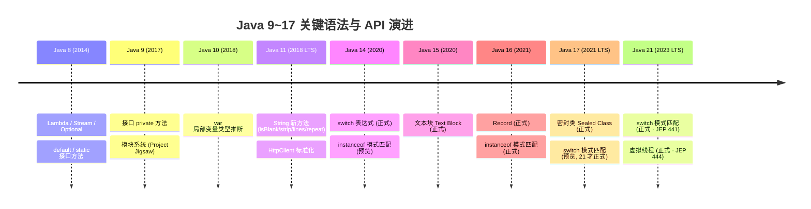

# [番外] Java 9~17 关键新特性 —— 语法参考页：var / 文本块 / Record / 密封类 / switch 表达式 / 模式匹配

!!! info "**Java 9~17 关键新特性 · 一句话口诀（番外）**"
    - **本篇是"语法参考手册"而非"顿悟型深度源码文档"** —— 打开时机应该是：项目从 Java 8 迁到 Java 17，需要快速盘点新语法、判断哪些能立刻用、哪些是坑、哪些还需等 Java 21 —— **进来查表、抄示范、抄坑清单即可**；不要期待字节码级别顿悟（`Record` 底层字节码那些在 [面向对象](@java-字节码-面向对象)、`Sealed` 类 `PermittedSubclasses` 属性表在 [JVM 现代实践与前沿技术](@java-JVM-现代实践与前沿技术) 里）。
    - **Java 9~17 的语法新特性可归为三条主线**：**语法糖**（`var` / 文本块 / `switch` 表达式）+ **新类型建模能力**（`Record` / `Sealed`）+ **模式匹配起点**（`instanceof` 模式匹配 · Java 21 完整落地） —— 三条主线共同指向"减少样板代码 + 让编译器承担更多约束校验"，本质是 Java 向 Kotlin / Scala / Rust 学习后的**类型系统现代化**。
    - **`Record` 不是"简化 POJO 的语法糖"，是"不可变数据载体"这一新类型范畴** —— 所有字段 `final`、无 setter、天然线程安全，且不能继承其他类（隐式 `extends java.lang.Record`）。**Record 与 JPA `@Entity` / MyBatis 的"无参构造器约定"天然冲突**，落地必须清晰划分"Record 用于 DTO / 值对象、普通类用于持久化实体"。
    - **`Sealed` 类不是"限制继承"，是"给编译器提供穷举信息"** —— `permits` 子句让编译器知道"这个类型的所有子类型就是这几个"，配合模式匹配 `switch` 表达式可以省掉 `default` 分支（编译器帮你确保穷尽）。**但 `switch` 模式匹配是 Java 21 才正式（JEP 441）**，Java 17 需要 `--enable-preview`。
    - **`var` 不是"动态类型"，是"编译期类型推断"** —— `var list = new ArrayList<String>()` 编译后**仍然是** `ArrayList<String>`，只是省去写一次。**滥用 `var` 会让代码可读性崩塌**（`var result = service.process(data)` 读者根本不知道类型）—— 老手规则是"右侧类型明显时用 `var`，否则显式写出"。

**你能立刻答上来吗？**（正文预演 · 5 题速测）

- `Record` 类为什么不能继承其他类？编译器把它底层等价成了什么？为什么 JPA `@Entity` 用不上 `Record`？
- 密封类 `permits` 子句里必须列出全部直接子类吗？子类如果加了 `non-sealed` 会怎样？
- Java 17 里的 `switch (obj) { case Circle c -> ... }` 需要预览特性开启吗？如果不能预览特性，怎么退化实现同样效果？
- 文本块 `""" ... """` 里的**缩进基准**由什么决定？在 `String` 常量池里存的是原始形式还是去缩进后的？
- `var x = null;` 会怎样？`var x = () -> System.out.println();` 又会怎样？为什么？

任何一个问题让你迟疑超过 3 秒 —— 继续读。

---

> 📖 **本文讲**（番外语法参考浓度集中区）：
>
> 1. `var` 局部变量类型推断的**适用场景 + 禁用场景 + 老手可读性规则**（Java 10）
> 2. 文本块 Text Block 的**语法定义 + 缩进基准计算规则 + 末尾换行控制 + 转义序列**（Java 15）
> 3. `Record` 类的**语法定义 + 自动生成方法清单 + 与普通类对比表 + JPA / MyBatis 兼容坑**（Java 16）
> 4. 密封类 Sealed Class 的**语法定义 + `permits` 子句 + `final` / `sealed` / `non-sealed` 三选一约束 + 与模式匹配的协同**（Java 17）
> 5. `switch` 表达式的**箭头语法 + `yield` 关键字 + `return` 陷阱 + 与传统 switch 语句的区别**（Java 14）
> 6. `instanceof` 模式匹配的**语法定义 + 作用域规则 + 与传统 `if (obj instanceof X) { X x = (X)obj; }` 对比**（Java 16）
> 7. Java 9~17 关键版本演进速览图（`mermaid timeline`）
> 8. Java 9 接口 `private` 方法（承接 [`90` 附录](@java-番外-Java8其他新特性) 中的埋点）
> 9. Java 11 `String` 新方法（`isBlank` / `strip` / `lines` / `repeat`）+ HTTP Client 标准化速查
> 10. 6 类语法新特性使用中的常见坑清单（`var` 可读性 · Record 持久化 · switch `yield` vs `return` · 密封类反射/序列化 · 文本块缩进 · 模式匹配作用域）
>
> 📖 **本文不讲**（`@doc_id` 引用到姊妹文档）：
>
> - `Record` 底层等价的合成类字节码（`extends java.lang.Record` + 自动 `equals` / `hashCode` / `toString` 实现指令） → [面向对象](@java-字节码-面向对象) §"合成方法与 ACC_SYNTHETIC"
> - `Sealed` 类的 `PermittedSubclasses` 属性表（Class 文件属性表新成员） → [JVM 现代实践与前沿技术](@java-JVM-现代实践与前沿技术) §"Class 文件格式演化"
> - 文本块编译后在 `String` 常量池的存储形式（是否与常规字符串共享 `intern` 表） → [字符串底层原理](@java-字节码-字符串底层原理) §"字符串常量池与 ldc 指令"
> - 模式匹配 `switch` (`case Type t ->`) 的 `invokedynamic` + `SwitchBootstraps` 引导链路 → [函数式编程](@java-字节码-函数式编程) §"invokedynamic 引导三件套"
> - JDK 9 模块系统（Project Jigsaw · `module-info.java` · `requires` / `exports`） → **本文不涉及**（模块系统不是"语法新特性"，是"打包与依赖系统"，与本篇定位错位；老手项目 90% 仍用 Classpath 模式，模块化 `📖` 引用到独立模块系统专题）
> - Java 8 `default` / `static` 接口方法（Java 9 `private` 方法的前置）→ [Java8 其他新特性](@java-番外-Java8其他新特性) §"接口默认方法与静态方法"
> - Lambda 与 Stream 深度机制 → [函数式编程](@java-字节码-函数式编程)
> - ZGC / Shenandoah / Loom 虚拟线程等 JVM 现代实践 → [JVM 现代实践与前沿技术](@java-JVM-现代实践与前沿技术)

---

## 一、`var` 局部变量类型推断（Java 10）

### 1.1 引入：为什么要有 `var` —— 一句话说完

**核心一句话**：**"消除左侧类型的重复书写"**。

```java
// Java 8 时代：左边类型完全能从右边推断出来，却必须重复一遍
Map<String, List<Order>> orders = new HashMap<String, List<Order>>();

// Java 10+：编译器帮你推断
var orders = new HashMap<String, List<Order>>();  // 类型仍然是 HashMap<String, List<Order>>
```

**编译后仍然是 `HashMap<String, List<Order>>`**（不是动态类型、不是 `Object`）—— `var` 只是**编译期语法糖**，字节码层面与手写完整类型完全等价。

### 1.2 三条硬规则（速查表）

| 允许 | 禁止 | 根因 |
| :-- | :-- | :-- |
| 局部变量（含 `for` / `try-with-resources`） | 字段 / 方法参数 / 方法返回值 | 字段 & 方法签名是 API 的一部分，不能依赖推断 |
| 初始化式类型明确（`new`/字面量/方法调用） | `var x = null;`（编译错误：无法推断） | 推断依赖右侧表达式类型 |
| `var x = () -> {}` 需要**目标类型**上下文 | 无目标类型的 Lambda（`var f = () -> {};` 编译错误） | Lambda 本身不是类型 |

### 1.3 `var` 常见问题（FAQ）

- **Q1**：`var` 编译后运行时是什么？

    > 编译期就已确定为具体类型 · **不是** `Object`，与手写类型完全等价的字节码。`javap -c` 观察局部变量表的 `LocalVariableTable` 属性即可看到具体类型。

- **Q2**：`var` 能配合泛型使用吗？

    > 能。`var list = new ArrayList<String>();` 推断为 `ArrayList<String>`；但 `var list = new ArrayList<>();` 会推断为 `ArrayList<Object>`，因为右侧菱形语法无目标类型上下文可用。

- **Q3**：Lambda 参数上的 `var` 有什么用？

    > 仅在需要给 Lambda 参数**加注解**时有用 —— `list.stream().filter((@Nullable var s) -> ...)`；否则纯属多余。

### 1.4 `var` 工作中常见坑

- **坑 1：滥用降低可读性** —— `var result = service.process(data);` 读者不知道类型 → **老手规则**："右侧类型明显时用 `var`（`new`/字面量），否则显式写出"。IDEA 提供 `Inspection: 'var' declaration can be replaced` 帮你回退。
- **坑 2：Lambda 参数中的 `var` 多此一举** —— `.filter((var s) -> s.length() > 3)` 与 `.filter(s -> s.length() > 3)` 等价，前者反而更啰嗦 → 除非要加注解，否则不用。

---

## 二、文本块 Text Block（Java 15）

### 2.1 引入：JSON / SQL / HTML 字符串拼接的痛点

**核心一句话**：**"消除转义地狱 + 保留原始格式"**。

```java
// Java 8 时代：转义符满天飞、无法直接从工具复制粘贴
String json = "{\n" +
              "  \"name\": \"Alice\",\n" +
              "  \"age\": 30\n" +
              "}";

// Java 15+：三引号包裹，所见即所得
String json = """
        {
          "name": "Alice",
          "age": 30
        }
        """;
```

### 2.2 三条硬规则（速查表）

| 规则 | 说明 | 示例 |
| :-- | :-- | :-- |
| **缩进基准** | **结束 `"""` 的所在列**决定最小缩进 · 内容按该基准去缩进 | 结束 `"""` 顶格 → 内容保留全部缩进；结束 `"""` 与内容对齐 → 内容去掉最左公共缩进 |
| **末尾换行** | 结束 `"""` 单独一行 → 末尾**有**换行；`"""` 紧跟最后一行内容 → 末尾**无**换行 | `"""\nhello\n"""` vs `"""\nhello"""` |
| **转义序列** | 支持 `\n` / `\t` / `\"` / `\\` / **`\<行末>` 显式续行**（Java 14+ 特有）/ **`\s` 保留末尾空格**（Java 14+ 特有）| `\<行末>` 让你在源码里换行、但字符串里不换行 |

### 2.3 文本块常见问题（FAQ）

- **Q1**：文本块编译成 `String` 后与常规字符串有区别吗？

    > **没有** · 编译后就是同一个 `String` 类型，走同一套 `intern` / 常量池；深度机制 📖 引用到 [字符串底层原理](@java-字节码-字符串底层原理) §"字符串常量池与 ldc 指令"。

- **Q2**：文本块里能内嵌变量吗？

    > **不能** · Java 没有 Kotlin 的 `${expr}` 字符串模板；变量替换要用 `String.format` / `formatted`（Java 15+ 实例方法）：`"""Hello, %s""".formatted(name)`。

- **Q3**：文本块与 `+` 拼接混用可以吗？

    > 可以 · 编译器在 Java 9+ 走 `invokedynamic` + `StringConcatFactory`，与常规 `+` 拼接一致 · 📖 [字符串底层原理](@java-字节码-字符串底层原理) §"字符串拼接的 invokedynamic 演化"。

### 2.4 文本块工作中常见坑

- **坑 1：结束 `"""` 位置错位导致缩进异常**

    ```java
    // ❌ 反例：结束三引号顶格 → 字符串内容会带 8 个前导空格
    String json1 = """
            {"name": "Alice"}
    """;   // 结束"""顶格 → 内容前导 8 空格保留

    // ✅ 正例：结束三引号与内容左对齐 → 去掉最左公共缩进
    String json2 = """
            {"name": "Alice"}
            """;   // 结束"""与内容对齐 → 内容无前导空格
    ```

    **老手默认写法**：结束三引号与内容左对齐。

- **坑 2：末尾意外多一行换行符** —— `"""\nHello\n"""` 末尾有 `\n`；如需精确控制，用 `"""\nHello"""`（结束三引号紧跟内容，无末尾换行）。

---

## 三、`Record` 类（Java 16）

### 3.1 引入：POJO 样板代码的终结

**核心一句话**：**"一行代码替代 30 行 POJO"**。所有字段 `final`、构造器 / getter（**无 `get` 前缀**）/ `equals` / `hashCode` / `toString` 全部自动生成。**本质是"不可变数据载体"这一新类型范畴，隐式继承 `java.lang.Record`**。

```java
// 一行 Record 定义（Java 16+）
public record Point(int x, int y) {}

// 使用
Point p1 = new Point(3, 5);
System.out.println(p1.x());         // 自动 getter，无 get 前缀
System.out.println(p1);             // Point[x=3, y=5]，自动 toString
Point p2 = new Point(3, 5);
System.out.println(p1.equals(p2));  // true，自动 equals

// 紧凑构造器：做参数校验（无参数列表 · 直接引用组件名）
public record Point(int x, int y) {
    public Point {
        if (x < 0 || y < 0) throw new IllegalArgumentException("坐标必须非负");
    }
}
```

### 3.2 `Record` vs 普通类对比表

| 特性 | Record | 普通类 |
| :-- | :-- | :-- |
| 字段 | 自动 `final` | 可变 |
| 构造器 | 自动生成 · 支持**紧凑构造器**（Compact Constructor） | 手动编写 |
| getter | 自动生成（**无 `get` 前缀**：`p.x()`）| 手动编写 |
| `equals`/`hashCode`/`toString` | 自动基于所有字段生成 | 手动编写 |
| 继承 | **不能** `extends` 其他类（隐式继承 `Record`）· 可以 `implements` 接口 | 可以继承 |
| 无参构造器 | **不生成** · JPA / 部分反射框架不兼容 | 可手动定义 |
| 序列化 | 走**基于组件的序列化机制**（不走 `readObject` / `writeObject`）| 走传统 `Serializable` 机制 |
| 适用场景 | 不可变数据载体（DTO / 值对象 / 元组）| 通用 |

### 3.3 `Record` 常见问题（FAQ）

- **Q1**：Record 底层字节码等价于什么？

    > `final class Point extends java.lang.Record implements ... { final int x; final int y; ... }` · 编译器自动合成所有默认方法 · **深度分析** 📖 引用到 [面向对象](@java-字节码-面向对象) §"合成方法与 ACC_SYNTHETIC"。本文末尾 §九 有一段 `volt` 演示 `equals` 走 `invokedynamic` + `ObjectMethods.bootstrap`。

- **Q2**：能给 Record 自定义方法吗？

    > 能 · 可以加实例方法、静态方法、静态字段（但**不能加实例字段** —— 那样违背"不可变数据载体"契约）；可以加**紧凑构造器**做校验（见 §3.1 示例）。

- **Q3**：Record 能实现接口吗？能作为父类被继承吗？

    > **能实现接口 · 不能被继承** · 因为 Record 隐式 `final`。

### 3.4 `Record` 工作中常见坑

- **坑 1：Record 与 JPA `@Entity` 不兼容** —— JPA 要求无参构造器 + setter，Record 都不满足。

    ```java
    // ❌ 反例：Record 直接当 JPA 实体
    @Entity
    public record User(@Id Long id, String name) {}   // 启动就抛异常

    // ✅ 正例：JPA 实体用普通类、DTO 用 Record
    @Entity
    public class UserEntity {
        @Id private Long id;
        private String name;
        // ... 无参构造器 + getter/setter
    }
    public record UserDTO(Long id, String name) {}    // 传输层用 Record

    // Controller 出口做转换
    public UserDTO toDTO(UserEntity e) {
        return new UserDTO(e.getId(), e.getName());
    }
    ```

    **老手落地范式**：**"JPA 实体类用普通类、DTO 用 Record"** —— 边界清晰、不越界。

- **坑 2：MyBatis 需要 3.5.5+ 才支持 Record** —— 更早版本会因缺少无参构造器抛异常；升级后 MyBatis 会通过全参构造器实例化 Record（`resultType` 指向 Record 类即可）。

---

## 四、密封类 Sealed Class（Java 17）

### 4.1 引入：为什么需要 `sealed`

**核心一句话**：**"精确告诉编译器：这个类型的所有子类型就是这几个"**。配合模式匹配 `switch` 表达式，编译器能穷举分支、省掉 `default`；配合业务代数数据类型（ADT）建模，让"表达式 = Constant | Variable | Add | Mul"这种结构在类型系统里直接表达。

```java
// 密封接口 + 三个允许的子类型
public sealed interface Shape permits Circle, Rectangle, Triangle {}

public final class Circle implements Shape {
    private final double radius;
    // ...
}

public final class Rectangle implements Shape {
    private final double width, height;
    // ...
}

public non-sealed class Triangle implements Shape {  // 允许后续继续开放继承
    // ...
}

// 使用（Java 21 正式；Java 17 需 --enable-preview）
double area(Shape s) {
    return switch (s) {
        case Circle c    -> Math.PI * c.radius() * c.radius();
        case Rectangle r -> r.width() * r.height();
        case Triangle t  -> 0.5 * t.base() * t.height();
        // 无需 default —— 编译器已知穷举完毕
    };
}
```

### 4.2 三条硬规则（速查表）

| 规则 | 说明 | 示例 |
| :-- | :-- | :-- |
| **`permits` 子句** | 必须列出**所有直接子类**（如果与父类在同一编译单元可省略）| `sealed interface Shape permits Circle, Rectangle` |
| **子类三选一约束** | 子类必须标注为 `final` / `sealed` / `non-sealed` 之一 | `final class Circle` / `sealed class ...` / `non-sealed class ...` |
| **同模块约束** | 密封类与其允许的子类**必须在同一模块**（或未启用模块时同一 package）| 反射不能突破 |

### 4.3 密封类常见问题（FAQ）

- **Q1**：密封类底层字节码是什么？

    > Class 文件新增 `PermittedSubclasses` 属性表，`ACC_FINAL` 标志用来标识 `final` 子类 · **深度分析** 📖 引用到 [JVM 现代实践与前沿技术](@java-JVM-现代实践与前沿技术) §"Class 文件格式演化"。

- **Q2**：Java 17 里 `switch (shape) { case Circle c -> ... }` 需要预览特性开启吗？

    > **需要 `--enable-preview`** · Java 21 才正式（JEP 441 Pattern Matching for switch）。不能开启预览时用 `instanceof` 链退化实现：

    ```java
    // Java 17 未开启预览特性时的退化写法
    double area(Shape s) {
        if (s instanceof Circle c)         return Math.PI * c.radius() * c.radius();
        else if (s instanceof Rectangle r) return r.width() * r.height();
        else if (s instanceof Triangle t)  return 0.5 * t.base() * t.height();
        throw new IllegalStateException("Unknown shape: " + s);
    }
    ```

- **Q3**：`non-sealed` 子类是什么意思？

    > **"从这个子类开始重新对外开放继承"** · 允许密封类家族在某个分支上重新回到开放继承模式 · 典型用法：`sealed class Vehicle permits Car, non-sealed class ThirdPartyExtensible` —— 让第三方基于 `ThirdPartyExtensible` 自由扩展，但整个 `Vehicle` 家族的其他分支仍保持穷举。

### 4.4 密封类工作中常见坑

- **坑 1：反射不能创建新的子类** —— 密封类的设计目的就是编译期穷举 · 反射突破 `permits` 会抛异常。想要开放扩展的分支必须显式标注 `non-sealed`。
- **坑 2：序列化需要每个子类各自实现 `Serializable`** —— 密封类本身实现 `Serializable` 不代表所有子类自动可序列化；每个 `permits` 里列出的子类都要独立声明。

---

## 五、`switch` 表达式（Java 14）

### 5.1 引入：传统 `switch` 语句的三大痛点

**核心一句话**：**"消除 `break` 遗漏、`fall-through` 陷阱、赋值需要临时变量三大坑"**。传统 `switch` 语句 → `switch` 表达式（返回值）+ 箭头语法（无 fall-through）+ `yield` 关键字（块表达式返回值）。

```java
// Java 8 时代：break 遗漏就 fall-through、赋值要临时变量
String dayName;
switch (day) {
    case 1: dayName = "Monday";    break;
    case 2: dayName = "Tuesday";   break;
    // ⚠️ 忘了 break 就 fall-through 到下一个 case
    default: dayName = "Unknown";
}

// Java 14+：箭头语法 · 表达式返回值 · 无 fall-through
var dayName = switch (day) {
    case 1 -> "Monday";
    case 2 -> "Tuesday";
    case 3, 4, 5 -> "Midweek";           // 多值合并
    default -> {
        log.warn("unknown day: {}", day);
        yield "Unknown";                  // 块表达式用 yield 给出值
    }
};
```

### 5.2 三条硬规则（速查表）

| 规则 | 说明 | 示例 |
| :-- | :-- | :-- |
| **箭头语法 `case X -> Y;`** | **无 fall-through** · 单行表达式直接返回 | `case 1 -> "Monday";` |
| **块表达式必须用 `yield`** | 多语句块**必须**用 `yield`（而不是 `return`）给出分支值 | `case 2 -> { var s = ...; yield s; }` |
| **穷尽性** | `switch` 表达式必须穷尽（要么 `default`，要么密封类型穷举）| 否则编译错误 |

### 5.3 `switch` 表达式常见问题（FAQ）

- **Q1**：`switch` 表达式和 `switch` 语句能混用吗？

    > 不能 · `case X ->` 是箭头语法（表达式），`case X:` 是冒号语法（语句），单个 `switch` 内必须统一。

- **Q2**：`switch` 表达式能配合模式匹配用吗？

    > Java 21 正式（JEP 441）· Java 17 需 `--enable-preview` · 不能开启预览时退化为 `if instanceof` 链（见 §4.3 · Q2）。

### 5.4 `switch` 表达式工作中常见坑

- **坑（关键）：`yield` vs `return` 语义混淆**

    ```java
    // ❌ 反例：块表达式里写 return，会直接从外层方法返回
    String describe(int day) {
        var msg = "day " + day;
        var result = switch (day) {
            case 1 -> "Monday";
            case 2 -> {
                var s = msg + " is Tuesday";
                return s;   // ❌ 直接从 describe() 返回！result 根本不会被赋值
            }
            default -> "Unknown";
        };
        return "Result: " + result;   // 永远走不到，除非 day != 2
    }

    // ✅ 正例：用 yield 给 switch 分支值
    var result = switch (day) {
        case 1 -> "Monday";
        case 2 -> {
            var s = msg + " is Tuesday";
            yield s;   // ✅ 给 switch 分支值
        }
        default -> "Unknown";
    };
    ```

    **老手规则**：`switch` 表达式块里想给分支值就用 `yield`；`return` 是从外层方法直接返回，两者语义完全不同。

---

## 六、模式匹配 `instanceof`（Java 16）

### 6.1 引入：消除"判断 + 强转 + 重复类型信息"

**核心一句话**：**"`if (obj instanceof String s)` 一次搞定判断 + 转型 + 变量绑定"**。

```java
// Java 8 时代：判断 + 强转 + 变量声明三步走
if (obj instanceof String) {
    String s = (String) obj;     // 类型重复三次：instanceof / cast / 变量声明
    System.out.println(s.length());
}

// Java 16+：一次搞定
if (obj instanceof String s) {   // s 是自动绑定的变量
    System.out.println(s.length());
}
```

### 6.2 两条硬规则（速查表）

| 规则 | 说明 |
| :-- | :-- |
| **绑定变量作用域** | 仅在 `instanceof` 判断**为真**的分支内可见 · 出了 `if` 块作用域结束 |
| **`&&` 短路支持** | `if (obj instanceof String s && s.length() > 3)` 合法 · `s` 在 `&&` 右侧可见 |

### 6.3 模式匹配常见问题（FAQ）

- **Q1**：模式匹配和普通 `instanceof` 有性能差异吗？

    > **没有** · 编译后字节码几乎一致（都是 `instanceof` + `checkcast` + 局部变量存储） · 语法糖层面的优化。

### 6.4 模式匹配工作中常见坑

- **坑：绑定变量作用域"反直觉"陷阱**

    ```java
    // ✅ 正例：if 外仍能使用 s —— 因为 else 分支等价于 "is String"，s 在 return 后仍在作用域内
    public String process(Object obj) {
        if (!(obj instanceof String s)) return "not a string";
        // 到这里说明 obj is String s —— s 仍然可见
        return s.toUpperCase();
    }

    // ⚠️ 反例：走反向流控时容易误以为 s 不可见 —— 实际上仍在作用域内
    ```

    **老手规则**：反其道而行之（`if (!(obj instanceof X x)) return;` 后继续用 `x`）确实合法，但要读者一眼看懂需要熟悉这条作用域规则；团队里如果新人多，建议用正向写法 `if (obj instanceof X x) { ... }`。

---

## 七、Java 11 语法与 API 补齐（附录）

### 7.1 `String` 新方法速查表（Java 11）

| 方法 | 用途 | 示例 |
| :-- | :-- | :-- |
| `isBlank()` | 判断是否为空白（含空白字符）| `" \t".isBlank() == true` |
| `strip()` / `stripLeading()` / `stripTrailing()` | 去除首尾空白（**含 Unicode 空白** · 优于 `trim()`）| `" \u2003a ".strip() == "a"` |
| `lines()` | 按行拆分为 `Stream<String>` | `"a\nb".lines().count() == 2` |
| `repeat(n)` | 重复 `n` 次 | `"ab".repeat(3) == "ababab"` |

**为什么 `strip()` 优于 `trim()`**：`trim()` 只识别 ASCII 空白（`< 0x20`），无法处理 Unicode 空白（如 `\u2003` EM SPACE）；`strip()` 走 `Character.isWhitespace()` 完整识别 Unicode 空白 —— 处理国际化输入时必用 `strip()`。

### 7.2 HTTP Client 标准化（Java 11）

**核心一句话**：**"从 `HttpURLConnection` 时代解脱 · 内置 HTTP/2 + WebSocket + 异步 API"**。

```java
// Java 11+：JDK 内置 HttpClient，无需 Apache HttpClient / OkHttp 依赖
HttpClient client = HttpClient.newHttpClient();
HttpRequest request = HttpRequest.newBuilder()
        .uri(URI.create("https://api.example.com/users/1"))
        .GET()
        .build();
HttpResponse<String> response = client.send(request, HttpResponse.BodyHandlers.ofString());
System.out.println(response.statusCode() + " · " + response.body());
```

支持 HTTP/2 / WebSocket / `sendAsync` 异步返回 `CompletableFuture` —— 一个类就搞定 Java 8 时代的三方库工作。

### 7.3 Java 9 接口 `private` 方法（承接 [`90 §二 · 2` 附录](@java-番外-Java8其他新特性)）

Java 8 的接口 `default` / `static` 方法之间无法私有复用；Java 9 补齐了 `private` 方法：

```java
public interface UserService {
    default void createUser(String name) { validate(name); /* ... */ }
    default void updateUser(String name) { validate(name); /* ... */ }
    private void validate(String name) {   // Java 9+ 才能私有
        if (name == null || name.isBlank()) throw new IllegalArgumentException();
    }
}
```

**没有更多复杂性** —— 就是把 `default` 方法之间的公共逻辑抽出来，走标准的私有方法可见性。

---

## 八、Java 版本演进图



---

## 九、`volt` 字节码块（番外定位 · 一段轻量演示）

!!! note "为什么番外要放一段字节码"
    番外附录不承担字节码考古任务。这里只放**一段轻量 `volt` 块**演示 "`Record` 的自动生成方法通过 `invokedynamic` + `ObjectMethods.bootstrap` 集中生成"这个工程性事实，让老手对"Record 底层机制"有一个视觉锚点，深度分析 📖 引用到 [面向对象](@java-字节码-面向对象) / [函数式编程](@java-字节码-函数式编程)。

```volt
// public record Point(int x, int y) {} 编译后 Point.equals(Object) 的字节码片段
public final boolean equals(java.lang.Object);
  Code:
     0: aload_0
     1: aload_1
     2: invokedynamic #16, 0    // InvokeDynamic
                                //     #NameAndType: equals:(LPoint;Ljava/lang/Object;)Z
                                //     #BootstrapMethod: 0  ObjectMethods.bootstrap
     7: ireturn

BootstrapMethods:
  0: #33 REF_invokeStatic java/lang/runtime/ObjectMethods.bootstrap:
      (Ljava/lang/invoke/MethodHandles$Lookup;
       Ljava/lang/String;
       Ljava/lang/invoke/TypeDescriptor;
       Ljava/lang/Class;
       Ljava/lang/String;
       [Ljava/lang/invoke/MethodHandle;)Ljava/lang/Object;
    Method arguments:
      #40 Point                  // Record 类
      #41 x;y                    // 组件名列表（分号分隔）
      #42 REF_getField Point.x   // 组件 1 的 getter MethodHandle
      #43 REF_getField Point.y   // 组件 2 的 getter MethodHandle
```

**顿悟点（一句话）**：`Record` 的 `equals` / `hashCode` / `toString` 都是**编译器合成的一条 `invokedynamic`**，`BootstrapMethod` 指向 `java.lang.runtime.ObjectMethods.bootstrap` —— 与 Lambda 的 `LambdaMetafactory.metafactory`、模式匹配 `switch` 的 `SwitchBootstraps.typeSwitch` 是**同一套"`invokedynamic` 引导三件套"**。**深度分析** 📖 引用到 [函数式编程](@java-字节码-函数式编程) §"invokedynamic 引导链路" + [面向对象](@java-字节码-面向对象) §"合成方法与 ACC_SYNTHETIC"。

---

## 十、何时来查这份附录（使用说明表 · 取代传统 Q&A）

> ⭐ **番外说明**：按项目规则，番外附录**不强制承担 Q&A 题目**（顿悟感任务由深度源码型承担）。改用"何时来查这份附录"使用说明表，直接告诉读者"带着什么问题来、查哪一节、深度视角去哪里"。

| 使用场景 | 应查阅本文哪一节 | 深度机制 `📖` 引用 |
| :-- | :-- | :-- |
| 项目从 Java 8 升 Java 17，盘点能立刻用的语法糖 | 全文 + §八 版本演进图 | 无 |
| DTO / VO 想用 Record 但 JPA / MyBatis 兼容不确定 | §三 · 3.4 坑 1 + 坑 2 | 无 |
| 想用密封类 + 模式匹配 `switch`，但项目 Java 17 卡预览特性 | §四 · 4.3 · Q2 退化方案 | [JVM 现代实践与前沿技术](@java-JVM-现代实践与前沿技术) §Class 文件格式演化 |
| 写 SQL / JSON 字符串常量，转义地狱 | §二 文本块 | [字符串底层原理](@java-字节码-字符串底层原理) §字符串常量池 |
| `switch` 表达式里用 `return` 报奇怪的错 | §五 · 5.4 `yield` vs `return` | 无 |
| `var` 什么时候用、什么时候不用 | §一 · 1.2 三条硬规则 + §一 · 1.4 坑清单 | 无 |
| `if (obj instanceof X x)` 里 `x` 的作用域范围 | §六 · 6.2 · 两条硬规则 + §六 · 6.4 坑 | 无 |
| Record 底层字节码到底是什么 | §九 一段轻量 `volt` 演示 | [面向对象](@java-字节码-面向对象) §合成方法与 ACC_SYNTHETIC |
| 模式匹配 `switch` 的 `invokedynamic` 引导链路 | ❌ 不在本文 | [函数式编程](@java-字节码-函数式编程) §invokedynamic 引导三件套 |
| 模块系统（`module-info.java`）迁移 | ❌ 不在本文 | 独立模块系统专题 |
| ZGC / 虚拟线程 / Loom | ❌ 不在本文 | [JVM 现代实践与前沿技术](@java-JVM-现代实践与前沿技术) |

---

## 十一、🗺️ 跨战役伏笔（登记与回收）

### 11.1 本文回收的伏笔

- ✅ 回收 [Java8 其他新特性](@java-番外-Java8其他新特性) 埋下的伏笔：**"Java 9 接口 `private` 方法是 Java 8 `default` 方法的自然演化 —— `91` §Java 9 语法新增承接"**（★★★）
    - **落地位置**：§七 · 7.3 Java 9 接口 `private` 方法示例；与 [`90 §二 · 2` 附录](@java-番外-Java8其他新特性) 一起构成"Java 8/9 接口方法能力演化"完整链路。

### 11.2 本文埋下的伏笔（供后续战役回收）

| 本篇 → 目标篇 | 伏笔内容 | 优先级 |
| :-- | :-- | :-- |
| `91 Java9-17 新特性` → [面向对象](@java-字节码-面向对象) | Record 底层等价类 `extends java.lang.Record` + `equals` / `hashCode` / `toString` 走 `invokedynamic` + `ObjectMethods.bootstrap` —— `01` §"合成方法与 ACC_SYNTHETIC" 承接 | ★★★ |
| `91 Java9-17 新特性` → [函数式编程](@java-字节码-函数式编程) | 模式匹配 `switch` (`case Type t ->`) 走 `invokedynamic` + `SwitchBootstraps.typeSwitch` —— `07` §"invokedynamic 引导三件套" 承接 | ★★★ |
| `91 Java9-17 新特性` → [字符串底层原理](@java-字节码-字符串底层原理) | 文本块 Text Block 编译后与常规字符串共享 `intern` 常量池 —— `04` §"字符串常量池与 ldc 指令" 承接 | ★★ |
| `91 Java9-17 新特性` → [JVM 现代实践与前沿技术](@java-JVM-现代实践与前沿技术) | 密封类的 `PermittedSubclasses` 属性表 + Record 的 `Record` 属性 —— `12d` §"Class 文件格式演化" 承接 | ★★★ |
| `91 Java9-17 新特性` → [Java8 其他新特性](@java-番外-Java8其他新特性) | ✅ 已回收（Java 9 接口 `private` 方法） | ✅ 已闭环 |

**跨战役伏笔说明**：番外附录以**"埋伏笔为主 · 少量回收"**为定位，所有深度顿悟感任务下放给深度源码型 8 篇（`01`~`07` + `12b`~`12d`）。本篇的四条埋点会在各自深度源码型中被显式承接、构成"番外语法糖 ↔ 深度源码"的完整闭环。
