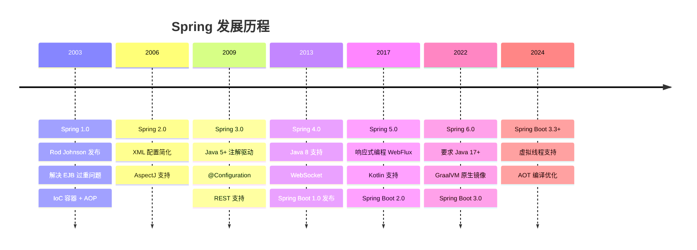
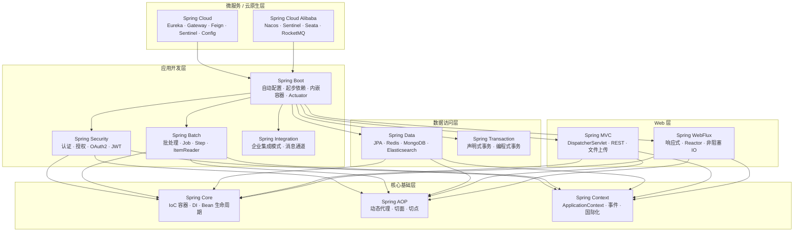
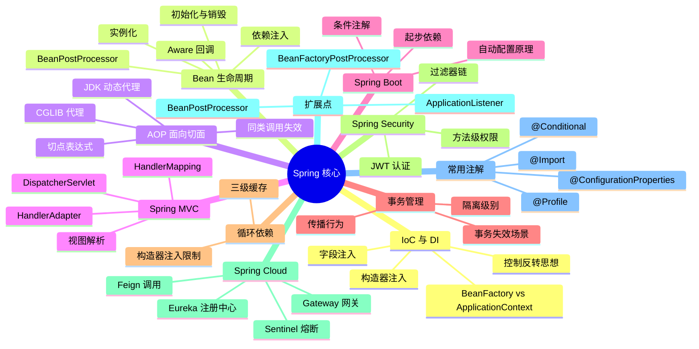
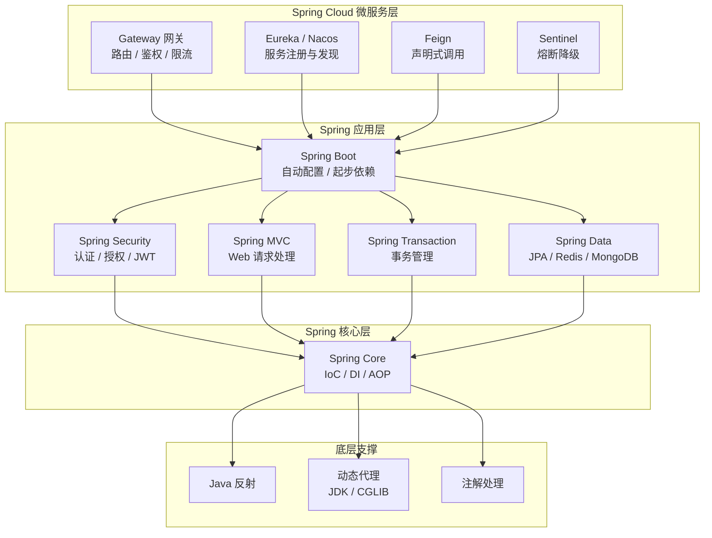

# Spring / Spring Boot 核心原理

---

## Spring 是什么？

Spring 是 Java 生态中**最主流的企业级应用开发框架**，由 Rod Johnson 于 2003 年创建，核心思想是通过 **IoC（控制反转）** 和 **AOP（面向切面编程）** 解耦应用组件，让开发者专注于业务逻辑而非基础设施。

> 一句话：Spring 是"Java 企业开发的基础设施"，就像盖楼的钢筋框架，业务代码是砖块，Spring 把它们组装在一起。

---

## 发展历程

### 关键版本节点

| 版本 | 时间 | 核心变化 | 最低 Java 要求 |
|------|------|---------|--------------|
| Spring 3.x | 2009 | 注解驱动开发成熟，`@Configuration`、`@ComponentScan` | Java 5 |
| Spring 4.x | 2013 | Java 8 支持，条件注解 `@Conditional` | Java 6 |
| **Spring Boot 1.x** | **2014** | **自动配置革命，约定优于配置，内嵌 Tomcat** | Java 6 |
| Spring 5.x | 2017 | 响应式编程 WebFlux，Reactor 模型 | Java 8 |
| **Spring Boot 2.x** | **2018** | **Spring 5 + 默认 CGLIB + Actuator 增强** | Java 8 |
| Spring 6.x | 2022 | Jakarta EE 9+，GraalVM 原生镜像支持 | **Java 17** |
| **Spring Boot 3.x** | **2022** | **Spring 6 + 虚拟线程 + AOT 编译** | **Java 17** |

> 📌 **当前主流**：企业新项目普遍使用 **Spring Boot 3.x + Java 17/21**；存量项目多为 Spring Boot 2.x + Java 8/11。

---

## Spring 框架版图

### 各模块定位速查

| 模块 | 定位 | 典型使用场景 |
|------|------|------------|
| **Spring Core** | IoC 容器，所有模块的基础 | Bean 管理、依赖注入 |
| **Spring AOP** | 面向切面，基于动态代理 | 日志、事务、权限切面 |
| **Spring MVC** | Web 层，处理 HTTP 请求 | RESTful API 开发 |
| **Spring WebFlux** | 响应式 Web，非阻塞 IO | 高并发、流式数据处理 |
| **Spring Boot** | 自动配置，简化开发 | 所有 Spring 项目的启动器 |
| **Spring Data** | 数据访问统一抽象 | JPA、Redis、MongoDB 操作 |
| **Spring Security** | 安全框架，认证与授权 | 登录、权限控制、OAuth2 |
| **Spring Batch** | 批处理框架 | 大数据量定时任务、ETL |
| **Spring Cloud** | 微服务基础设施 | 服务注册、网关、熔断 |
| **Spring Cloud Alibaba** | 阿里巴巴微服务套件 | Nacos、Sentinel、Seata |

---

## 为什么要学 Spring 原理？

不理解原理会导致的**线上问题**：

- `@Transactional` 加了但事务不回滚（同类调用绕过代理）
- AOP 切面不生效（`this.method()` 绕过代理对象）
- 循环依赖报错，不知道为什么构造器注入会失败
- 自动配置不生效，不知道如何 debug

---

## 知识地图

---

## 整体架构

> Spring Core 是一切的基础，IoC 容器依赖反射创建对象，AOP 依赖动态代理增强功能，Spring Boot 在 Spring 之上通过自动配置简化开发，Spring Cloud 在 Spring Boot 之上构建微服务体系。

---

## 知识点导航

| # | 知识点 | 核心一句话 | 详细文档 |
|---|--------|-----------|---------|
| 1 | **IoC 与 DI** | IoC 是"容器管对象"，DI 是"容器送依赖"，推荐构造器注入 | [01-IoC与DI.md](./01-核心基础/01-IoC与DI.md) |
| 2 | **Bean 生命周期与循环依赖** | 实例化→注入→Aware→BPP前→初始化→BPP后（AOP代理）→使用→销毁；三级缓存解决循环依赖 | [02-Bean生命周期与循环依赖.md](./01-核心基础/02-Bean生命周期与循环依赖.md) |
| 3 | **AOP 面向切面** | 基于代理拦截，`this` 调用绕过代理，Spring Boot 2.x 后默认 CGLIB | [05-AOP面向切面编程.md](./01-核心基础/05-AOP面向切面编程.md) |
| 4 | **Spring MVC** | DispatcherServlet 总调度，HandlerMapping 找处理器，HandlerAdapter 适配调用 | [04-SpringMVC请求处理流程.md](./02-Web与通信/04-SpringMVC请求处理流程.md) |
| 3.5 | **容器启动流程** | refresh() 12 步：BeanDefinition 加载→BPP 注册→单例实例化→事件发布 | [03-Spring容器启动流程深度解析.md](./01-核心基础/03-Spring容器启动流程深度解析.md) |
| 4 | **Spring 扩展点** | BPP 干预初始化，BFPP 修改 Bean 定义，ApplicationListener 监听事件 | [04-Spring扩展点详解.md](./01-核心基础/04-Spring扩展点详解.md) |
| 5 | **自动配置原理** | `@EnableAutoConfiguration` 读列表，条件注解按需过滤，允许用户覆盖 | [07-SpringBoot自动配置原理.md](./01-核心基础/07-SpringBoot自动配置原理.md) |
| 6 | **事务管理** | 事务是 AOP 特例，`this` 调用不生效，异常要抛出，注意传播行为 | [06-Spring事务管理.md](./01-核心基础/06-Spring事务管理.md) |
| 6.5 | **常用注解全解** | `@Conditional`、`@ConfigurationProperties`、`@Profile`、`@Import` 等高频注解 | [08-Spring常用注解全解.md](./01-核心基础/08-Spring常用注解全解.md) |
| 7 | **实战应用题** | 事务排查、长事务优化、AOP失效、Bean泄漏、动态注册等 12 道实战题 | [07-Spring实战应用题.md](./06-测试与实战/07-Spring实战应用题.md) |
| 8 | **Spring Security** | 过滤器链拦截请求，JWT 无状态认证，方法级 `@PreAuthorize` 权限控制 | [08-Spring-Security认证与授权.md](./03-微服务与安全/08-Spring-Security认证与授权.md) |
| 9 | **Spring Cloud** | Eureka 服务发现 + Gateway 网关 + Feign 调用 + Sentinel 熔断，微服务必备 | [09-Spring-Cloud核心组件.md](./03-微服务与安全/09-Spring-Cloud核心组件.md) |
| 12 | **Feign 声明式 HTTP** | 声明式 HTTP 客户端，注解定义接口即可调用远程服务 | [12-Feign声明式HTTP客户端.md](./02-Web与通信/12-Feign声明式HTTP客户端.md) |
| 13 | **gRPC 详解** | 高性能 RPC 框架，基于 Protobuf 序列化 + HTTP/2 传输 | [13-gRPC详解.md](./02-Web与通信/13-gRPC详解.md) |
| 15 | **性能优化** | 监控→内存→启动→并发→数据库→缓存→网络，全方位优化指南 | [15a-监控与内存优化.md](./05-进阶与调优/15a-监控与内存优化.md) |
| 16 | **Spring 6 / Boot 3** | Java 17+、Jakarta EE、GraalVM Native Image、虚拟线程、AOT 编译 | [16-Spring6-Boot3新特性深度解析.md](./05-进阶与调优/16-Spring6-Boot3新特性深度解析.md) |
| 17 | **微服务架构实践** | 服务拆分、通信、治理、部署的完整微服务落地方案 | [17-微服务架构深度实践.md](./03-微服务与安全/17-微服务架构深度实践.md) |
| 18 | **源码阅读技巧** | 从入口到核心，掌握 Spring 源码阅读与调试的方法论 | [18-Spring源码阅读与调试技巧.md](./05-进阶与调优/18-Spring源码阅读与调试技巧.md) |
| 19 | **生产环境运维** | Actuator 监控、日志管理、优雅停机、灰度发布等运维实践 | [19-生产环境Spring应用运维.md](./05-进阶与调优/19-生产环境Spring应用运维.md) |
| 20 | **测试框架** | 单元测试、集成测试、MockMvc、TestContainers 等测试最佳实践 | [20-Spring测试框架深度使用.md](./06-测试与实战/20-Spring测试框架深度使用.md) |
| 21 | **安全架构深度** | OAuth2、RBAC、ABAC、安全漏洞防护等企业级安全方案 | [21-Spring安全架构深度解析.md](./03-微服务与安全/21-Spring安全架构深度解析.md) |
| 22 | **数据访问高级** | JPA 优化、多数据源、读写分离、MyBatis 高级用法 | [22-Spring数据访问高级技巧.md](./04-数据与消息/22-Spring数据访问高级技巧.md) |
| 23 | **响应式编程** | WebFlux + Reactor，非阻塞 IO，适合高并发低延迟场景 | [23-Spring响应式编程深度解析.md](./04-数据与消息/23-Spring响应式编程深度解析.md) |
| 24 | **消息驱动架构** | Spring Kafka/RabbitMQ 集成，事件驱动、CQRS、Saga 模式 | [24-Spring消息驱动架构深度解析.md](./04-数据与消息/24-Spring消息驱动架构深度解析.md) |

---

## 常见问题速查

### IoC / DI / Bean 管理

| 问题 | 关键答案 |
|------|---------|
| IoC 和 DI 的区别？ | IoC 是设计思想（控制权交给容器），DI 是具体实现方式（容器注入依赖） |
| BeanFactory vs ApplicationContext？ | BeanFactory 懒加载、功能基础；ApplicationContext 预加载单例，扩展了国际化/事件/AOP |
| `@Autowired` vs `@Resource`？ | `@Autowired` 按类型注入（Spring）；`@Resource` 先按名称注入（JDK 标准） |
| Bean 单例线程安全吗？ | 不一定，有可变成员变量就不安全；用 `ThreadLocal` 或改为 `prototype` 解决 |
| 循环依赖如何解决？ | 三级缓存提前暴露 `ObjectFactory`，支持 AOP 代理；构造器注入无法提前暴露，需用 `@Lazy` |
| `@Configuration` vs `@Component`？ | `@Configuration` 的 `@Bean` 方法被 CGLIB 代理，方法间调用走容器保证单例；`@Component` 不代理，是普通 Java 调用 |
| BPP 和 BFPP 的区别？ | BFPP 在 Bean 实例化前修改 BeanDefinition；BPP 在 Bean 初始化前后处理对象（AOP 代理在此生成） |

### AOP / 事务

| 问题 | 关键答案 |
|------|---------|
| AOP 不生效怎么排查？ | ① `this` 同类调用绕过代理 ② 方法非 public ③ 类未被 Spring 管理 ④ 切点表达式错误 |
| 为什么默认用 CGLIB？ | JDK 代理要求实现接口，大量 Service 没有接口；CGLIB 生成子类无需接口，覆盖面更广 |
| 事务不回滚的原因？ | ① 同类调用 ② 异常被捕获未抛出 ③ 非 RuntimeException 未加 `rollbackFor` ④ 方法非 public |
| `REQUIRED` vs `REQUIRES_NEW`？ | `REQUIRED` 加入当前事务（没有则新建）；`REQUIRES_NEW` 始终新建独立事务，外层回滚不影响内层 |
| 长事务有什么危害？ | 占用数据库连接、锁持有时间长、undo log 膨胀；拆分为小事务 + 编程式事务控制 |

### Spring Boot / 自动配置

| 问题 | 关键答案 |
|------|---------|
| 自动配置原理？ | `@EnableAutoConfiguration` → `spring.factories` / `AutoConfiguration.imports` → 条件注解按需过滤 |
| `@ConditionalOnMissingBean` 的作用？ | 容器中不存在指定 Bean 时才注册，是自动配置"用户优先"原则的核心 |
| 启动慢怎么排查？ | `spring-boot-startup-report` 分析各阶段耗时；排除不需要的自动配置；`@Lazy` 延迟初始化 |
| 如何自定义 Starter？ | 创建 `autoconfigure` 模块 + `starter` 模块，在 `META-INF/spring/` 下注册自动配置类 |

### Security / Cloud

| 问题 | 关键答案 |
|------|---------|
| 认证和授权的区别？ | 认证（Authentication）验证"你是谁"；授权（Authorization）验证"你能做什么" |
| JWT vs Session？ | Session 有状态、服务端存储、分布式需共享；JWT 无状态、信息在 Token 中、天然支持分布式 |
| JWT Token 如何主动失效？ | Redis 黑名单（退出时写入 Token，TTL = 剩余有效期）；或 Token 版本号机制 |
| Eureka 自我保护是什么？ | 短时间内大量心跳丢失时，停止剔除服务实例，防止网络抖动误删健康服务 |
| 服务雪崩如何防止？ | 超时快速失败 + 熔断（错误率超阈值直接降级）+ 限流（控制入口流量）+ 隔离（独立线程池） |

### 线上问题排查

| 问题现象 | 根本原因 | 解决方案 |
|---------|---------|---------|
| `@Autowired` 注入为 null | 对象不是 Spring 管理的（手动 new） | 改用 `@Component` + 注入方式获取 |
| `@PostConstruct` 中 NPE | 在构造器中使用了尚未注入的字段 | 将初始化逻辑移到 `@PostConstruct` 方法中 |
| 循环依赖报错 | 构造器注入无法提前暴露引用 | 改为字段注入，或加 `@Lazy`，或重构解耦 |
| 自动配置不生效 | 条件注解不满足（缺少依赖 / 已有自定义 Bean） | 用 `--debug` 查看自动配置报告，检查类路径依赖 |
| JWT Token 失效后仍能访问 | Token 无法主动撤销，服务端只验证签名 | Redis 黑名单 + 退出时写入，或缩短有效期 |
| Feign 调用超时 | 默认超时时间过短 / 下游服务响应慢 | 配置合理超时时间，加 Fallback 降级处理 |
| Gateway 过滤器不生效 | 过滤器 Order 优先级设置错误 | 检查 `getOrder()` 返回值，数字越小优先级越高 |
| `@Profile` 配置不生效 | `spring.profiles.active` 未正确设置 | 检查启动参数或 `application.yml` 中的 active 配置 |
| 线上 OOM / Bean 泄漏 | prototype Bean 未释放 / 监听器未注销 / 缓存无上限 | 排查 Bean 作用域，检查资源释放，设置缓存淘汰策略 |

> 📖 更多实战题目及详细解析，参见 [Spring 实战应用题](./06-测试与实战/07-Spring实战应用题.md)
